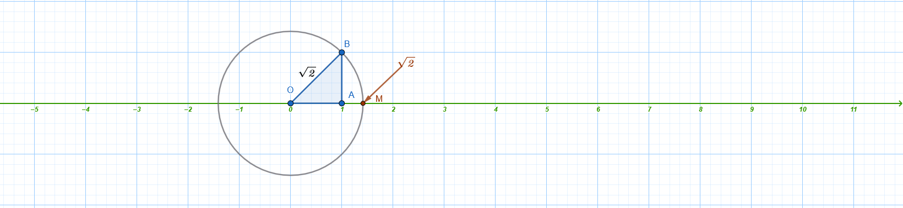
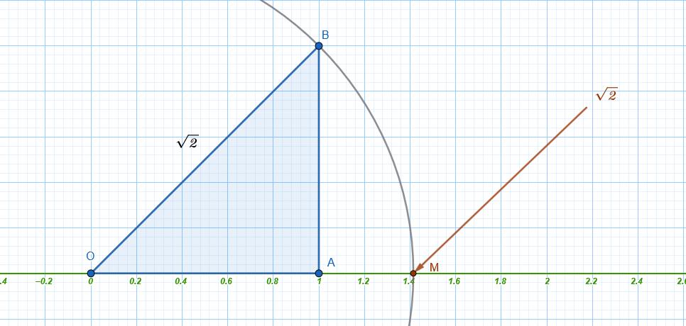

```{=html}
<!-- Φόρτωση βιβλιοθήκης GeoGebra -->
<script src="https://www.geogebra.org/apps/deployggb.js"></script>

<!-- Συνάρτηση δημιουργίας applets -->
<script>
function createGeoGebra(containerId, materialId, width = 700, height = 500) {
  var params = {
    "id": "ggb-" + containerId,
    "material_id": materialId,
    "width": width,
    "height": height,
    "showToolBar": true,
    "showMenuBar": false,
    "showAlgebraInput": true
  };
  
  var applet = new GGBApplet(params, '5.2');
  applet.inject(containerId);
}
</script>
```

## Οι πραγματικοί αριθμοί

### Ξαναθυμόμαστε ....

::: {style="background-color: #d5f4e6; border: 2px solid #2f3e50; color: #25188a; padding: 15px; border-radius: 5px;"}
Οι **πραγματικοί αριθμοί** αποτελούν το βασικό σύνολο αριθμών που χρησιμοποιείται στα Μαθηματικά του Λυκείου και συμβολίζεται με το γράμμα $\mathbb{R}$.
Το σύνολο αυτό αποτελείται από την ένωση δύο μεγάλων υποσυνόλων: των ρητών και των άρρητων αριθμών.

**Ρητοί Αριθμοί (**$\mathbb{Q}$)

**Ρητοί** ονομάζονται οι αριθμοί που έχουν ή μπορούν να πάρουν τη μορφή κλάσματος $\dfrac{\alpha}{\beta}$, όπου $\alpha, \beta$ είναι ακέραιοι και $\beta \neq 0$.

- **Περιλαμβάνουν:**

  - Τους **ακέραιους** αριθμούς (π.χ. $3, -7, 0, 5$).

  - Τους **δεκαδικούς** αριθμούς με πεπερασμένο πλήθος δεκαδικών ψηφίων (π.χ. $0,52, 2,7131, -6,42$).

  - Τους **περιοδικούς δεκαδικούς** αριθμούς (π.χ. $0,333..., 2,7282828...$).

**Άρρητοι Αριθμοί**

**Άρρητοι** ονομάζονται οι αριθμοί που **δεν μπορούν** να γραφούν σε κλασματική μορφή.
Στη δεκαδική τους μορφή έχουν άπειρα δεκαδικά ψηφία που δεν παρουσιάζουν καμία περιοδικότητα.

- **Παραδείγματα:** $\sqrt{2}, \sqrt{3}, \sqrt{7}, \pi$ (περίπου $3,14159...$), $e$ (περίπου $2,718...$) και αριθμοί όπως ο $1,010010001...$.

**Ο Άξονας των Πραγματικών Αριθμών**

Οι πραγματικοί αριθμοί μπορούν να τοποθετηθούν πάνω σε μια ευθεία, η οποία ονομάζεται **άξονας των πραγματικών αριθμών**.

- **Αμφιμονοσήμαντη αντιστοιχία:** Σε κάθε πραγματικό αριθμό αντιστοιχεί ακριβώς ένα σημείο του άξονα και, αντιστρόφως, κάθε σημείο του άξονα παριστάνει έναν μοναδικό πραγματικό αριθμό.

- **Η Αρχή του άξονα:** Το σημείο που αντιστοιχεί στον αριθμό **0** ονομάζεται αρχή των αξόνων και συμβολίζεται συνήθως με $O$.

- **Διάταξη:** Οι θετικοί αριθμοί τοποθετούνται δεξιά από το $0$ και οι αρνητικοί αριστερά.
  Όσο μεγαλύτερος είναι ένας αριθμός, τόσο πιο δεξιά στον άξονα βρίσκεται.\
  

- **Τοποθέτηση αρρήτων:** Ακόμη και οι άρρητοι αριθμοί (όπως η $\sqrt{2}$) μπορούν να προσδιοριστούν ακριβώς πάνω στον άξονα, συνήθως με τη βοήθεια του Πυθαγορείου θεωρήματος.\
  

**Σημείωση:** Το σύνολο των φυσικών ($\mathbb{N}$) είναι υποσύνολο των ακεραίων ($\mathbb{Z}$), οι οποίοι είναι υποσύνολο των ρητών ($\mathbb{Q}$), και όλοι μαζί αποτελούν υποσύνολο των πραγματικών αριθμών ($\mathbb{R}$).
:::

------------------------------------------------------------------------

### Οι πράξεις στους πραγματικούς αριθμούς και οι ιδιότητές τους

::: {style="background-color: #d5f4e6; border: 2px solid #2f3e50; color: #25188a; padding: 15px; border-radius: 5px;"}
Στο σύνολο των πραγματικών αριθμών ($\mathbb{R}$), το οποίο αποτελείται από την ένωση των ρητών και των άρρητων αριθμών, ορίζονται οι δύο βασικές πράξεις της **πρόσθεσης** και του **πολλαπλασιασμού**.
Οι υπόλοιπες πράξεις, η αφαίρεση και η διαίρεση, ορίζονται με τη βοήθεια των δύο βασικών.

**Βασικές Ιδιότητες Πρόσθεσης και Πολλαπλασιασμού**

Οι ιδιότητες αυτές αποτελούν τη βάση του αλγεβρικού λογισμού:

| Ιδιότητα | Πρόσθεση | Πολλαπλασιασμός |
|:-----------------------|:-----------------------|:-----------------------|
| **Αντιμεταθετική** | $\alpha + \beta = \beta + \alpha$ | $\alpha \cdot \beta = \beta \cdot \alpha$ |
| **Προσεταιριστική** | $\alpha + (\beta + \gamma) = (\alpha + \beta) + \gamma$ | $\alpha \cdot (\beta \cdot \gamma) = (\alpha \cdot \beta) \cdot \gamma$ |
| **Ουδέτερο Στοιχείο** | $\alpha + 0 = \alpha$ (το $0$ είναι το ***ουδέτερο***) | $\alpha \cdot 1 = \alpha$ (το $1$ είναι το ***ουδέτερο***) |
| **Συμμετρικό Στοιχείο** | $\alpha + (-\alpha) = 0$ (***αντίθετος αριθμός***) | $\alpha \cdot \dfrac{1}{\alpha} = 1, \alpha \neq 0$ (***αντίστροφος αριθμός***) |

**Επιμεριστική ιδιότητα:** Ο πολλαπλασιασμός επιμερίζεται ως προς την πρόσθεση: $$\alpha \cdot (\beta + \gamma) = \alpha \cdot \beta + \alpha \cdot \gamma$$.

**Ορισμός Αφαίρεσης και Διαίρεσης**

- **Αφαίρεση:** Για να αφαιρέσουμε έναν αριθμό $\beta$ από έναν αριθμό $\alpha$, προσθέτουμε στον $\alpha$ τον αντίθετο του $\beta$: $$\alpha - \beta = \alpha + (-\beta)$$.

- **Διαίρεση:** Για να διαιρέσουμε έναν αριθμό $\alpha$ με έναν μη μηδενικό αριθμό $\beta$, πολλαπλασιάζουμε τον $\alpha$ με τον αντίστροφο του $\beta$: $$\alpha : \beta = \dfrac{\alpha}{\beta} = \alpha \cdot \dfrac{1}{\beta}$$.

**Άμεσες Συνέπειες και Ιδιότητες των Ισοτήτων**

- **Ιδιότητα της Διαγραφής:**

  - Στην πρόσθεση: $\alpha = \beta \iff \alpha + \gamma = \beta + \gamma$.

  - Στον πολλαπλασιασμό: Αν $\gamma \neq 0$, τότε $\alpha \cdot \gamma = \beta \cdot \gamma \iff \alpha = \beta$.

- **μπορούμε να προσθέσουμε δύο ισότητες κατά μέλη**.

  - Η γνωστή ιδιότητα των ισοτήτων:

$$\begin{aligned}
\text{Άν}  \quad  \alpha &= \beta \\
\text{και} \quad \gamma &= \delta
\end{aligned}
\quad \Rightarrow \quad \alpha + \gamma = \beta + \delta$$
\* **μπορούμε να πολλαπλασιάσουμε δύο ισότητες κατά μέλη**

$$\begin{aligned}
\text{Άν}  \quad  \alpha &= \beta \\
\text{και} \quad \gamma &= \delta
\end{aligned}
\quad \Rightarrow \quad \alpha \cdot \gamma = \beta \cdot \delta$$

- **μπορούμε και στα δυο μέλη μιας ισότητας να προσθέσουμε ή να αφαιρέσουμε τον ίδιο αριθμό**.

$$\begin{aligned}
\text{Άν}  \quad  \alpha &= \beta \\
\text{και} \quad \gamma & \in \mathbb{R}
\end{aligned}
\quad \Rightarrow \quad \alpha + \gamma = \beta + γ$$

- **μπορούμε και τα δυο μέλη μιας ισότητας να τα πολλαπλασιάσουμε ή να τα διαιρέσουμε με τον ίδιο μη μηδενικό αριθμό**.

$$\begin{aligned}
\text{Άν}  \quad  \alpha &= \beta \\
\text{και} \quad \gamma & \ne 0
\end{aligned}
\quad \Rightarrow \quad \alpha \cdot \gamma = \beta \cdot γ$$

- **Γινόμενο ίσο με το μηδέν:** Το γινόμενο δύο ή περισσότερων πραγματικών αριθμών είναι ίσο με το μηδέν αν και μόνο αν ένας τουλάχιστον από τους αριθμούς αυτούς είναι ίσος με το μηδέν: $$\alpha \cdot \beta = 0 \iff \alpha = 0 \text{  ή  } \beta = 0$$.

Από αυτό συνάγεται και το παρακάτω: $$\alpha \cdot \beta \ne 0 \iff \alpha \ne 0 \text{  και  } \beta \ne 0$$.

- **Πρόσημα:** Ισχύουν οι γνωστοί κανόνες των προσήμων, π.χ., $(-\alpha) \cdot (-\beta) = \alpha \cdot \beta$ και $(-\alpha) \cdot \beta = -(\alpha \cdot \beta)$.

**Παραδείγματα Εφαρμογής**

1.  Παράσταση με Κλάσματα και Επιμεριστική Ιδιότητα (Κοινός Παράγοντας)

Στο παράδειγμα αυτό χρησιμοποιούμε την επιμεριστική ιδιότητα για να διευκολύνουμε τις πράξεις, βγάζοντας κοινό παράγοντα.

**Παράσταση:** $A = \dfrac{\dfrac{2}{3} \cdot \dfrac{4}{5} + \dfrac{1}{3} \cdot \dfrac{4}{5}}{\dfrac{3}{11} \cdot \dfrac{3}{2} + \dfrac{3}{11} \cdot \dfrac{5}{4}}$

- **Αριθμητής:** Παρατηρούμε τον κοινό παράγοντα $\dfrac{4}{5}$. $\dfrac{4}{5} \cdot \left(\dfrac{2}{3} + \dfrac{1}{3}\right) = \dfrac{4}{5} \cdot \dfrac{3}{3} = \dfrac{4}{5} \cdot 1 = \mathbf{\dfrac{4}{5}}$.
- **Παρονομαστής:** Παρατηρούμε τον κοινό παράγοντα $\dfrac{3}{11}$. $\dfrac{3}{11} \cdot \left(\dfrac{3}{2} + \dfrac{5}{4}\right) = \dfrac{3}{11} \cdot \left(\dfrac{6}{4} + \dfrac{5}{4}\right) = \dfrac{3}{11} \cdot \dfrac{11}{4} = \mathbf{\dfrac{3}{4}}$.
- **Τελικός Υπολογισμός:** Το σύνθετο κλάσμα μετατρέπεται σε γινόμενο του αριθμητή με τον αντίστροφο του παρονομαστή: $A = \dfrac{\dfrac{4}{5}}{\dfrac{3}{4}} = \dfrac{4}{5} \cdot \dfrac{4}{3} = \mathbf{\dfrac{16}{15}}$.

2.  Παράσταση με Παρενθέσεις και Πρόσημα Κλασμάτων

Εδώ εφαρμόζουμε τους κανόνες απαλοιφής παρενθέσεων και την εύρεση Ελάχιστου Κοινού Πολλαπλασίου (Ε.Κ.Π.) για την πρόσθεση ετερώνυμων κλασμάτων.

**Παράσταση:** $A = \dfrac{1}{6} - \left[-\dfrac{1}{2} - \left(\dfrac{2}{3} - \dfrac{5}{6}\right)\right]$

- **Βήμα 1 (Εσωτερική παρένθεση):** Κάνουμε τα κλάσματα ομώνυμα με Ε.Κ.Π. το 6. $\left(\dfrac{4}{6} - \dfrac{5}{6}\right) = -\dfrac{1}{6}$.
- **Βήμα 2 (Αγκύλη):** Απαλείφουμε την εσωτερική παρένθεση. Το πλην μπροστά αλλάζει το πρόσημο. $\left[-\dfrac{1}{2} - \left(-\dfrac{1}{6}\right)\right] = \left[-\dfrac{1}{2} + \dfrac{1}{6}\right]$. Μετατρέπουμε σε ομώνυμα: $\left[-\dfrac{3}{6} + \dfrac{1}{6}\right] = -\dfrac{2}{6} = \mathbf{-\dfrac{1}{3}}$.
- **Βήμα 3 (Τελικό):** $\dfrac{1}{6} - (-\dfrac{1}{3}) = \dfrac{1}{6} + \dfrac{1}{3} = \dfrac{1}{6} + \dfrac{2}{6} = \dfrac{3}{6} = \mathbf{\dfrac{1}{2}}$.

3.  Σύνθετο Κλάσμα με Πρόσθεση και Αφαίρεση

Υπολογισμός σύνθετου κλάσματος με εκτέλεση πράξεων χωριστά σε αριθμητή και παρονομαστή.

**Παράσταση:** $B = \dfrac{2 + \dfrac{5}{12}}{2 - \dfrac{1}{12}}$

- **Αριθμητής:** $2 + \dfrac{5}{12} = \dfrac{24}{12} + \dfrac{5}{12} = \mathbf{\dfrac{29}{12}}$.
- **Παρονομαστής:** $2 - \dfrac{1}{12} = \dfrac{24}{12} - \dfrac{1}{12} = \mathbf{\dfrac{23}{12}}$.
- **Απλοποίηση:** $\dfrac{\dfrac{29}{12}}{\dfrac{23}{12}} = \dfrac{29}{12} \cdot \dfrac{12}{23} = \mathbf{\dfrac{29}{23}}$.

4.  Διαδοχικές Πράξεις με Κλάσματα και Διαίρεση

Εφαρμογή προτεραιότητας πράξεων (παρενθέσεις πριν τη διαίρεση).

**Παράσταση:** $\Gamma = \left(\dfrac{3}{4} + \dfrac{9}{4}\right) : \dfrac{12}{15}$

- **Βήμα 1 (Παρένθεση):** Τα κλάσματα είναι ομώνυμα, άρα προσθέτουμε τους αριθμητές.
  $\dfrac{3+9}{4} = \dfrac{12}{4} = \mathbf{3}$.

- **Βήμα 2 (Διαίρεση):** Πολλαπλασιάζουμε με τον αντίστροφο του κλάσματος $\dfrac{12}{15}$ (που απλοποιείται σε $\dfrac{4}{5}$).
  $3 : \dfrac{4}{5} = 3 \cdot \dfrac{5}{4} = \mathbf{\dfrac{15}{4}}$.

- **Απλοποίηση Παράστασης:** Η παράσταση $A = 5\alpha - [2\beta - \alpha - (2\alpha - \beta) + 1]$ απλοποιείται σταδιακά λύνοντας τις παρενθέσεις από μέσα προς τα έξω:

$$\begin{aligned}
A = 5\alpha - [2\beta - \alpha - 2\alpha + \beta + 1] &=  \\
5\alpha - [3\beta - 3\alpha + 1]  &=  \\
5\alpha - 3\beta + 3\alpha - 1 &=  \\
8\alpha - 3\beta - 1
\end{aligned}$$

- **Ιδιότητα Διαγραφής:** Από την ισότητα $x + 3 = 7 + 3$, διαγράφοντας το $3$ και από τα δύο μέλη, συμπεραίνουμε ότι $x = 7$.
:::

### Η απαλοιφή παρενθέσεων

σε μια αριθμητική παράσταση ακολουθεί συγκεκριμένους κανόνες που βασίζονται στις ιδιότητες των πράξεων και τους κανόνες των προσήμων.
H διαδικασία γίνεται ως εξής:

1.  Παρένθεση με το σύμβολο (+) μπροστά

Όταν μια παρένθεση έχει μπροστά της το σύμβολο της πρόσθεσης (+), μπορούμε απλώς να την παραλείψουμε **χωρίς να αλλάξουμε τα πρόσημα** των όρων που περιέχονται σε αυτή.

- **Παράδειγμα:** $+(α - \beta) = α - \beta$.

2.  Παρένθεση με το σύμβολο (-) μπροστά

Όταν μια παρένθεση έχει μπροστά της το σύμβολο της αφαίρεσης (-), για να την απαλείψουμε, **αλλάζουμε το πρόσημο όλων των όρων** που βρίσκονται μέσα στην παρένθεση.
Αυτό συμβαίνει γιατί ο αντίθετος ενός αθροίσματος ισούται με το άθροισμα των αντιθέτων των όρων του.

- **Κανόνας:** $-(x_1 + x_2 + \dots + x_\nu) = -x_1 - x_2 - \dots - x_\nu$.

- **Παράδειγμα:** $-(α - \beta) = -α + \beta$.

3.  Χρήση της Επιμεριστικής Ιδιότητας

Αν ένας αριθμός πολλαπλασιάζεται με μια παρένθεση, χρησιμοποιούμε την **επιμεριστική ιδιότητα** για την απαλοιφή της: $α \cdot (\beta + \gamma) = α\beta + αγ$.

- Αν ο πολλαπλασιαστής είναι αρνητικός αριθμός, τότε τα πρόσημα όλων των όρων μέσα στην παρένθεση αλλάζουν.

- **Παράδειγμα:** $-2(3\beta - α) = -6\beta + 2α$.

4.  Σειρά Απαλοιφής (Αγκύλες και Άγκιστρα)

Αν σε μια παράσταση υπάρχουν παρενθέσεις, αγκύλες ή άγκιστρα, η εξαγωγή τους γίνεται, εφόσον είναι δυνατόν, **από μέσα προς τα έξω**.
Ξεκινάμε δηλαδή από την εσωτερική παρένθεση και προχωράμε σταδιακά προς τις εξωτερικές αγκύλες.

- **Παράδειγμα:**

Για την παράσταση $A = 5α - [2\beta - α - (2α - \beta) + 1]$:

1.  **Απαλείφουμε την εσωτερική παρένθεση** αλλάζοντας τα πρόσημα (λόγω του πλην απ' έξω): $A = 5α - [2\beta - α - 2α + \beta + 1]$

2.  **Κάνουμε αναγωγή ομοίων όρων** μέσα στην αγκύλη: $A = 5α - [3\beta - 3α + 1]$

3.  **Απαλείφουμε την αγκύλη** αλλάζοντας πάλι τα πρόσημα (λόγω του πλην μπροστά από την αγκύλη): $A = 5α - 3\beta + 3α - 1$

4.  **Τελικό αποτέλεσμα:** $8α - 3\beta - 1$.

------------------------------------------------------------------------

### Δυνάμεις

::: {style="background-color: #d5f4e6; border: 2px solid #2f3e50; color: #25188a; padding: 15px; border-radius: 5px;"}
Η **δύναμη** αποτελεί μια συντομογραφία του πολλαπλασιασμού ίσων παραγόντων και επεκτείνεται από τους φυσικούς στους ακέραιους και τους ρητούς εκθέτες.

**1. Ορισμός της Δύναμης**

- **Με φυσικό εκθέτη:** Για έναν πραγματικό αριθμό $\alpha$ (βάση) και έναν φυσικό αριθμό $\nu \geq 2$ (εκθέτης), η δύναμη $\alpha^\nu$ ορίζεται ως το γινόμενο $\nu$ παραγόντων ίσων με $\alpha$.

$$α^ν=\overset {ν \quad \text{φορές}}{\overbrace {α\cdotα\cdotα\cdotsα}} $$

- **Ειδικές περιπτώσεις:**

  - $\alpha^1 = \alpha$.

  - $\alpha^0 = 1$, με την προϋπόθεση ότι $\alpha \neq 0$.
    Η δύναμη $0^0$ δεν ορίζεται.

- **Με αρνητικό ακέραιο εκθέτη:** Για $\alpha \neq 0$, ορίζουμε $\alpha^{-\nu} = \dfrac{1}{\alpha^\nu}$.

**2. Βασικές Ιδιότητες των Δυνάμεων**

Οι ιδιότητες αυτές ισχύουν για κάθε βάση $\alpha, \beta \in \mathbb{R}$ και εκθέτες $\kappa, \lambda \in \mathbb{Z}$ (εφόσον ορίζονται οι βάσεις):

1.  **Γινόμενο δυνάμεων με την ίδια βάση:** $\alpha^\kappa \cdot \alpha^\lambda = \alpha^{\kappa+\lambda}$.

2.  **Πηλίκο δυνάμεων με την ίδια βάση:** $\dfrac{\alpha^\kappa}{\alpha^\lambda} = \alpha^{\kappa-\lambda}$.

3.  **Δύναμη γινομένου:** $(\alpha \cdot \beta)^\nu = \alpha^\nu \cdot \beta^\nu$.

4.  **Δύναμη πηλίκου:** $\left(\dfrac{\alpha}{\beta}\right)^\nu = \dfrac{\alpha^\nu}{\beta^\nu}$.

5.  **Δύναμη δύναμης:** $(\alpha^\kappa)^\lambda = \alpha^{\kappa \cdot \lambda}$.

6.  **Δύναμη κλάσματος με αρνητικό εκθέτη:** $\left(\dfrac{\alpha}{\beta}\right)^{-\nu} = \left(\dfrac{\beta}{\alpha}\right)^\nu$.

**3. Το Πρόσημο της Δύναμης**

Το αποτέλεσμα μιας δύναμης εξαρτάται από τη βάση και την αρτιότητα του εκθέτη:

- Αν η βάση είναι **θετική**, η δύναμη είναι πάντα **θετική**.

- Αν η βάση είναι **αρνητική**:

  - Με **άρτιο εκθέτη**, το αποτέλεσμα είναι **θετικό**: $(-\alpha)^{2\nu} = \alpha^{2\nu}$.

  - Με **περιττό εκθέτη**, το αποτέλεσμα είναι **αρνητικό**: $(-\alpha)^{2\nu+1} = -\alpha^{2\nu+1}$.

- **Προσοχή:** Η παράσταση $-\alpha^{2\nu}$ είναι πάντα αρνητική (ή μηδέν), καθώς το μείον βρίσκεται έξω από τη δύναμη, ενώ η $(-\alpha)^{2\nu}$ είναι θετική.

**4. Δυνάμεις με Ρητό Εκθέτη**

Οι δυνάμεις μπορούν να έχουν και κλασματικό εκθέτη, συνδέοντας έτσι τις δυνάμεις με τις ρίζες.
Αν $\alpha > 0$, $\mu \in \mathbb{Z}$ και $\nu \in \mathbb{N}^*$, τότε ορίζουμε: $$\alpha^{\dfrac{\mu}{\nu}} = \sqrt[\nu]{\alpha^\mu}$$ Όλες οι παραπάνω ιδιότητες των δυνάμεων με ακέραιο εκθέτη ισχύουν και για δυνάμεις με ρητό εκθέτη.
:::

**5. Εφαρμογές και Παραδείγματα**

- **Τυποποιημένη μορφή:** Οι δυνάμεις του 10 χρησιμοποιούνται για τη γραφή πολύ μεγάλων ή μικρών αριθμών (π.χ. $0,0014 = 1,4 \cdot 10^{-3}$).

- **Απλοποίηση παραστάσεων:** Για την παράσταση $A = \dfrac{4^6 \cdot 16^6}{8^7 \cdot 32^4}$, μετατρέπουμε όλες τις βάσεις σε δυνάμεις του 2: $A = \dfrac{(2^2)^6 \cdot (2^4)^6}{(2^3)^7 \cdot (2^5)^4} = \dfrac{2^{12} \cdot 2^{24}}{2^{21} \cdot 2^{20}} = \dfrac{2^{36}}{2^{41}} = 2^{36-41} = 2^{-5} = \dfrac{1}{32}$.

- **Εξισώσεις:** Η εξίσωση $x^\nu = \alpha$ λύνεται με τη χρήση ριζών.
  Αν ο $\nu$ είναι άρτιος και $\alpha > 0$, τότε $x = \pm \sqrt[\nu]{\alpha}$, ενώ αν ο $\nu$ είναι περιττός, η λύση είναι μοναδική: $x = \sqrt[\nu]{\alpha}$ (ή $x = -\sqrt[\nu]{|\alpha|}$ αν ο $\alpha$ είναι αρνητικός).
  
  

- **Δυνάμεις:** $\Delta = (-2)^4 \cdot 3 - (-2)^4 + (-5)^2 + [4 - (-1)]^2 - (-3)^4$.

*   **Υπολογισμός Δυνάμεων:**

    *   $(-2)^4 = 16$ (άρτιος εκθέτης).

    *   $(-5)^2 = 25$.

    *   $(-3)^4 = 81$.

*   **Αντικατάσταση:** $16 \cdot 3 - 16 + 25 + (5)^2 - 81$

*   **Πράξεις:** $48 - 16 + 25 + 25 - 81 = 82 - 81 = \mathbf{1}$.

- **Σύνθετη Παράσταση** (Συνδυασμός όλων των στοιχείων)

Εδώ εφαρμόζουμε ταυτόχρονα ιδιότητες δυνάμεων, προτεραιότητα πράξεων και απαλοιφή παρενθέσεων.

 $E = [(-3)^4 + (-4)^3] : (-1)^4 - (-6)^2 : [2(-3)^2] - (-8 + 5)^3(-4 + 3)^7$.

*   **Βήμα 1 (Δυνάμεις & Παρενθέσεις):** $[81 + (-64)] : 1 - 36 : [2 \cdot 9] - (-3)^3 \cdot (-1)^7$.

*   **Βήμα 2 (Πράξεις στις αγκύλες):** $17 : 1 - 36 : 18 - (-27) \cdot (-1)$.

*   **Βήμα 3 (Πολλαπλασιασμοί/Διαιρέσεις):** $17 - 2 - 27$.

*   **Τελικό Αποτέλεσμα:** **$-12$**.

---

### Αξιοσημείωτες ταυτότητες

::: {style="background-color: #d5f4e6; border: 2px solid #2f3e50; color: #25188a; padding: 15px; border-radius: 5px;"}

Ως **ταυτότητες** στα Μαθηματικά ορίζονται οι ισότητες που περιέχουν μεταβλητές και επαληθεύονται για όλες τις τιμές των μεταβλητών αυτών, εφόσον οι αντίστοιχες παραστάσεις έχουν νόημα πραγματικού αριθμού. Η χρήση τους είναι θεμελιώδης για τη γρήγορη εκτέλεση πράξεων, την απλοποίηση σύνθετων παραστάσεων και την παραγοντοποίηση.

Οι σημαντικότερες αξιοσημείωτες ταυτότητες με τη θεωρία και παραδείγματα για κάθε περίπτωση:

**1. Τετράγωνο Αθροίσματος και Διαφοράς**

Οι ταυτότητες αυτές περιγράφουν το ανάπτυγμα του τετραγώνου ενός διωνύμου.

*   **Τετράγωνο Αθροίσματος:** $(a + \beta)^2 = a^2 + 2a\beta + \beta^2$.
    *   *Παράδειγμα:* $(2a + 5)^2 = (2a)^2 + 2 \cdot 2a \cdot 5 + 5^2 = 4a^2 + 20a + 25$.

*   **Τετράγωνο Διαφοράς:** $(a - \beta)^2 = a^2 - 2a\beta + \beta^2$.
    *   *Παράδειγμα:* $(3x - 2y)^2 = (3x)^2 - 2 \cdot 3x \cdot 2y + (2y)^2 = 9x^2 - 12xy + 4y^2$.

**Σημείωση:** Από τις παραπάνω προκύπτει η χρήσιμη μορφή για το άθροισμα τετραγώνων: $a^2 + \beta^2 = (a + \beta)^2 - 2a\beta$ ή $a^2 + \beta^2 = (a - \beta)^2 + 2a\beta$.

**2. Διαφορά Τετραγώνων**

Είναι η πιο συνηθισμένη ταυτότητα για την παραγοντοποίηση παραστάσεων.

*   **Τύπος:** $a^2 - \beta^2 = (a - \beta)(a + \beta)$.

*   *Παράδειγμα:* $x^2 - 4 = x^2 - 2^2 = (x - 2)(x + 2)$.

*   *Σύνθετο Παράδειγμα:* $x^4 - y^4 = (x^2)^2 - (y^2)^2 = (x^2 - y^2)(x^2 + y^2) = (x - y)(x + y)(x^2 + y^2)$.

**3. Κύβος Αθροίσματος και Διαφοράς**

Περιγράφουν το ανάπτυγμα της τρίτης δύναμης ενός διωνύμου.

*   **Κύβος Αθροίσματος:** $(a + \beta)^3 = a^3 + 3a^2\beta + 3a\beta^2 + \beta^3$.
    *   *Εναλλακτική μορφή:* $(a + \beta)^3 = a^3 + \beta^3 + 3a\beta(a + \beta)$.
    *   *Παράδειγμα:* $(x + 1)^3 = x^3 + 3x^2 + 3x + 1$.

*   **Κύβος Διαφοράς:** $(a - \beta)^3 = a^3 - 3a^2\beta + 3a\beta^2 - \beta^3$.
    *   *Εναλλακτική μορφή:* $(a - \beta)^3 = a^3 - \beta^3 - 3a\beta(a - \beta)$.
    *   *Παράδειγμα:* $x^3 - 3x^2 + 3x - 1 = (x - 1)^3$.

**4. Άθροισμα και Διαφορά Κύβων**

Χρησιμοποιούνται κυρίως για την παραγοντοποίηση αθροισμάτων ή διαφορών τρίτων δυνάμεων.

*   **Άθροισμα Κύβων:** $a^3 + \beta^3 = (a + \beta)(a^2 - a\beta + \beta^2)$.
    *   *Παράδειγμα:* $x^3 + 8 = x^3 + 2^3 = (x + 2)(x^2 - 2x + 4)$.

*   **Διαφορά Κύβων:** $a^3 - \beta^3 = (a - \beta)(a^2 + a\beta + \beta^2)$.
    *   *Παράδειγμα:* $27x^3 - y^3 = (3x)^3 - y^3 = (3x - y)(9x^2 + 3xy + y^2)$.

**5. Τετράγωνο Αθροίσματος πολλών όρων**

*   **Τετράγωνο Τριωνύμου:** $(a + \beta + \gamma)^2 = a^2 + \beta^2 + \gamma^2 + 2a\beta + 2\beta\gamma + 2\gamma a$.

*   **Γενικός τύπος:** Το τετράγωνο οποιουδήποτε αθροίσματος ισούται με το άθροισμα των τετραγώνων των όρων του συν τα διπλάσια γινόμενά τους ανά δύο.

**6. Ειδικές και Προχωρημένες Ταυτότητες**

*   **Ταυτότητα Euler:** $a^3 + \beta^3 + \gamma^3 - 3a\beta\gamma = (a + \beta + \gamma)(a^2 + \beta^2 + \gamma^2 - a\beta - \beta\gamma - \gamma a)$.
    *   *Πόρισμα:* Αν $a + \beta + \gamma = 0$ ή $a = \beta = \gamma$, τότε **$a^3 + \beta^3 + \gamma^3 = 3a\beta\gamma$**.

*   **Ταυτότητα Lagrange:** $(a^2 + \beta^2)(x^2 + y^2) - (ax + \beta y)^2 = (ay - \beta x)^2$.

*   **Γινόμενο Διωνύμων με κοινό όρο (Newton):** $(x + a)(x + \beta) = x^2 + (a + \beta)x + a\beta$.
    *   *Παράδειγμα:* $(x + 2)(x + 3) = x^2 + (2+3)x + 2 \cdot 3 = x^2 + 5x + 6$.

*   **Γενικευμένη Διαφορά ν-οστών δυνάμεων:** $a^\nu - \beta^\nu = (a - \beta)(a^{\nu-1} + a^{\nu-2}\beta + \dots + \beta^{\nu-1})$.

*   **Ταυτότητα De Moivre:** $a^4 + \beta^4 + \gamma^4 - 2a^2\beta^2 - 2\beta^2\gamma^2 - 2\gamma^2 a^2 = (a + \beta + \gamma)(a - \beta + \gamma)(a + \beta - \gamma)(a - \beta - \gamma)$.

:::

---

### Μέθοδοι απόδειξης

::: {style="background-color: #d5f4e6; border: 2px solid #2f3e50; color: #25188a; padding: 15px; border-radius: 5px;"}

Οι κυριότερες μέθοδοι απόδειξης στα Μαθηματικά είναι οι παρακάτω και χρησιμοποιούνται για να επικυρώσουν την αλήθεια μιας πρότασης μέσω λογικών συλλογισμών.

**1. Ευθεία Απόδειξη**

*   **Θεωρία/Ορισμός:** Ξεκινάμε από την υπόθεση (τα δεδομένα) και, εφαρμόζοντας μια σειρά λογικών βημάτων (πράξεις, παραγοντοποίηση, ταυτότητες, γνωστά θεωρήματα ή αξιώματα), καταλήγουμε στο επιθυμητό συμπέρασμα.

*   **Παράδειγμα:** Αν $a, \beta, \gamma$ είναι διαδοχικοί φυσικοί αριθμοί, να αποδειχθεί ότι το άθροισμά τους $a + \beta + \gamma$ είναι πολλαπλάσιο του 3.

    *   **Απόδειξη:** Αφού είναι διαδοχικοί, ισχύει $\beta = a + 1$ και $\gamma = a + 2$. Το άθροισμα γίνεται: $a + (a + 1) + (a + 2) = 3a + 3 = 3(a + 1) = 3\kappa$, άρα είναι πολλαπλάσιο του 3.

**2. Μέθοδος της Απαγωγής σε Άτοπο**

*   **Θεωρία/Ορισμός:** Πρόκειται για έμμεση μέθοδο απόδειξης. Υποθέτουμε ότι το συμπέρασμα **δεν ισχύει** (υιοθετούμε την άρνησή του) και, μέσω ορθών λογικών επιχειρημάτων, καταλήγουμε σε μια αντίφαση (άτοπο), δηλαδή σε κάτι που έρχεται σε αντίθεση με την υπόθεση ή με γνωστά αξιώματα. Αφού η υπόθεσή μας οδήγησε σε άτοπο, συμπεραίνουμε ότι το αρχικό συμπέρασμα είναι αναγκαστικά αληθές.

*   **Παράδειγμα:** Αν ο $a$ είναι ρητός και ο $\beta$ άρρητος, τότε ο $a + \beta$ είναι άρρητος.

    *   **Απόδειξη:** Έστω ότι ο $a + \beta$ είναι ρητός. Τότε η διαφορά $(a + \beta) - a = \beta$ θα έπρεπε επίσης να είναι ρητός (ως διαφορά ρητών). Αυτό όμως είναι άτοπο, διότι από την υπόθεση ο $\beta$ είναι άρρητος.

**3. Μέθοδος της Αντιθετοαντιστροφής**

*   **Θεωρία/Ορισμός:** Στηρίζεται στη λογική ισοδυναμία $(P \implies Q) \iff (\text{όχι } Q \implies \text{όχι } P)$. Αντί να αποδείξουμε απευθείας ότι η πρόταση $P$ συνεπάγεται την $Q$, αποδεικνύουμε ότι η άρνηση της $Q$ συνεπάγεται την άρνηση της $P$.

*   **Παράδειγμα:** «Αν δύο γωνίες ενός τριγώνου είναι ίσες, τότε το τρίγωνο είναι ισοσκελές».

    *   **Αντιθετοαντιστροφή:** «Αν ένα τρίγωνο δεν είναι ισοσκελές, τότε οι γωνίες του ανά δύο είναι άνισες».

**4. Μέθοδος των Ισοδυναμιών**

*   **Θεωρία/Ορισμός:** Ξεκινάμε από την πρόταση που θέλουμε να αποδείξουμε και, με διαδοχικούς μετασχηματισμούς (χρησιμοποιώντας το σύμβολο $\iff$), καταλήγουμε σε μια άλλη πρόταση που είναι προφανώς αληθής (π.χ. μια γνωστή ταυτότητα ή ανισότητα).

*   **Παράδειγμα:** Να αποδειχθεί ότι $a^2 + \beta^2 \geq 2a\beta$.

    *   **Απόδειξη:** $a^2 + \beta^2 \geq 2a\beta \iff a^2 + \beta^2 - 2a\beta \geq 0 \iff (a - \beta)^2 \geq 0$, το οποίο αληθεύει για κάθε πραγματικό αριθμό $a, \beta$.

**5. Μέθοδος του Αντιπαραδείγματος**

*   **Θεωρία/Ορισμός:** Για να αποδείξουμε ότι ένας γενικός ισχυρισμός **δεν είναι αληθής**, αρκεί να βρούμε **ένα μόνο** συγκεκριμένο παράδειγμα για το οποίο ο ισχυρισμός αυτός καταρρίπτεται.

*   **Παράδειγμα:** Ισχυρισμός: «Αν $a^2 > \beta^2$, τότε $a > \beta$».

    *   **Αντιπαράδειγμα:** Για $a = -3$ και $\beta = 2$, έχουμε $(-3)^2 > 2^2$ (δηλαδή $9 > 4$), αλλά δεν ισχύει ότι $-3 > 2$. Άρα ο ισχυρισμός είναι ψευδής.

**6. Μέθοδος με τη χρήση του «αρκεί»**

*   **Θεωρία/Ορισμός:** Είναι μια παραλλαγή της μεθόδου των ισοδυναμιών. Ξεκινάμε από το ζητούμενο και αναφέρουμε ότι «αρκεί να δείξουμε» μια απλούστερη σχέση, συνεχίζοντας μέχρι να φτάσουμε σε κάτι που ισχύει αξιωματικά ή από την υπόθεση.

*   **Παράδειγμα:** Αν $0 < x < y$, να αποδειχθεί ότι $\dfrac{x}{1+x} < \dfrac{y}{1+y}$.

    *   **Απόδειξη:** Αρκεί $x(1+y) < y(1+x) \iff x + xy < y + yx \iff x < y$, που ισχύει από την υπόθεση.
    
:::

------------------------------------------------------------------------

### Ασκήσεις


1.  **Άσκηση με Ακεραίους και Αγκύλες:**
    Να υπολογίσετε την τιμή της παράστασης:
    $E = -[- (-3 + 2) - (-7 + 4 - 2)] + [- (-3) - (-5 + 6)] - (-3 + 5)$.

2.  **Άσκηση με Ρητούς (Κλάσματα) και Παρενθέσεις:**
    Να βρείτε το αποτέλεσμα της παράστασης:
    $A = \dfrac{5}{6} + \left( -\dfrac{2}{3} \right) - \left( -\dfrac{1}{2} \right) - \left( -\dfrac{1}{6} \right)$.

3.  **Άσκηση με Σύνθετο Κλάσμα και Πράξεις Ακεραίων:**
    Να υπολογίσετε την τιμή της παράστασης:
    $B = \dfrac{(-3) : (-1) - (-10) : (-2)}{(-4) : (-2) - (-8) : (-4) + (-1)}$.

4.  **Άσκηση με Δυνάμεις και Ακεραίους:**
    Να υπολογίσετε την τιμή της παράστασης:
    $A = (-3)^2 + (-4)^2 - (-3)^3 + (-1)^{2017} + (-2)^5$.

5.  **Άσκηση με Δυνάμεις και Αρνητικούς Εκθέτες:**
    Να βρείτε την τιμή της παράστασης:
    $\Gamma = \left( -\dfrac{1}{2} \right)^{-2} + \left( -\dfrac{1}{4} \right)^{-1} - (-3)^2 + (-1)^{2018} - (-1)^{2017}$.

6.  **Άσκηση με Δυνάμεις και Αγκύλες:**
    Να εκτελέσετε τις πράξεις στην παράσταση:
    $\Delta = (-2)^4 \cdot 3 - (-2)^4 + (-5)^2 + [4 - (-1)]^2 - (-3)^4$.

7.  **Άσκηση Σύνθετης Διάταξης (Δυνάμεις & Παρενθέσεις):**
    Να υπολογίσετε την παράσταση:
    $E = [(-3)^4 + (-4)^3] : (-1)^4 - (-6)^2 : [2(-3)^2] - (-8 + 5)^3(-4 + 3)^7$.

8.  **Άσκηση με Ρητούς, Δυνάμεις και Δεκαδικούς:**
    Να βρείτε την τιμή της παράστασης:
    $E = 3^{-1} : \left[ 2 - \left( -\dfrac{2}{3} \right)^{-2} \right] + (-0,1)^3(0,1)^{-1} + 10^{-2}$.

9.  **Άσκηση με Κλάσματα και Σύνθετες Αγκύλες:**
    Να υπολογίσετε την τιμή της παράστασης:
    $H = \left[ 1 - \left( \dfrac{1}{2} - \dfrac{1}{3} \right) \right] : \left[ \dfrac{5}{3} - \left( \dfrac{4}{3} - \dfrac{1}{2} \right) \right] - \dfrac{1}{2} : \dfrac{5}{2}$.

10. **Άσκηση με Πολλαπλασιασμό Δυνάμεων και Αρνητικούς Εκθέτες:**
    Να υπολογίσετε το αποτέλεσμα:
    $B = (-2)^4(-3)^2(-6)^{-2} + (-5)^2(-2)^5(-10)^{-2}$.
    
11.  Να αποδειχθούν οι εξής ιδιότητες των αναλογιών:

  - i)   $\dfrac{α}{β} =\dfrac{γ}{δ} ⇔ αδ = βγ$    (εφόσον $βδ ≠ 0$)

  - ii)  $\dfrac{α}{β} =\dfrac{γ}{δ} ⇔ \dfrac{α}{γ}= \dfrac{β}{δ}$  (εφόσον $βγδ ≠ 0$)

  - iii)  $\dfrac{α}{β} =\dfrac{γ}{δ} ⇔ \dfrac{α+β}{β}= \dfrac{γ+δ}{δ}$(εφόσον $βδ ≠ 0$)

  - iv) $\dfrac{α}{β} =\dfrac{γ}{δ} ⇔ \dfrac{α}{β}= \dfrac{γ}{δ}= \dfrac{α+γ}{β+δ}$  (εφόσον $βδ(β + δ) ≠ 0$)
  
12. Να αποδείξετε ότι ο $\sqrt{3}$ είναι άρρητος.

Η απόδειξη ότι ο **$\sqrt{3}$ είναι άρρητος** γίνεται με τη **μέθοδο της απαγωγής σε άτοπο**, ακολουθώντας μια διαδικασία ανάλογη με εκείνη για την απόδειξη της αρρητότητας του $\sqrt{2}$.

**Απόδειξη:**

  1.  **Υπόθεση:** Έστω ότι ο $\sqrt{3}$ **δεν είναι άρρητος**, αλλά είναι **ρητός**. Τότε, εξ ορισμού, μπορεί να γραφεί στη μορφή ενός **ανάγωγου κλάσματος** $\dfrac{\kappa}{\lambda}$, όπου $\kappa, \lambda$ είναι φυσικοί αριθμοί και $\lambda \neq 0$. Επειδή το κλάσμα είναι ανάγωγο, οι $\kappa$ και $\lambda$ δεν έχουν κοινό διαιρέτη.

  2.  **Ύψωση στο τετράγωνο:** Από τη σχέση $\sqrt{3} = \dfrac{\kappa}{\lambda}$, υψώνοντας και τα δύο μέλη στο τετράγωνο, έχουμε:
    $(\sqrt{3})^2 = \left( \dfrac{\kappa}{\lambda} \right)^2 \implies 3 = \dfrac{\kappa^2}{\lambda^2} \implies \mathbf{\kappa^2 = 3\lambda^2}$.

  3.  **Διαιρετότητα του $\kappa$:** Από την ισότητα $\kappa^2 = 3\lambda^2$ προκύπτει ότι ο αριθμός $\kappa^2$ είναι πολλαπλάσιο του 3. Επειδή ο 3 είναι πρώτος αριθμός, αν διαιρεί το τετράγωνο ενός αριθμού, τότε **διαιρεί και τον ίδιο τον αριθμό**. Άρα, ο $\kappa$ είναι πολλαπλάσιο του 3, δηλαδή μπορεί να γραφεί στη μορφή **$\kappa = 3\mu$** για κάποιον φυσικό αριθμό $\mu$.

  4.  **Αντικατάσταση:** Αντικαθιστούμε το $\kappa = 3\mu$ στην αρχική ισότητα $\kappa^2 = 3\lambda^2$:
    $(3\mu)^2 = 3\lambda^2 \implies 9\mu^2 = 3\lambda^2 \implies \mathbf{\lambda^2 = 3\mu^2}$.

  5.  **Διαιρετότητα του $\lambda$:** Με το ίδιο σκεπτικό, η ισότητα $\lambda^2 = 3\mu^2$ δείχνει ότι ο $\lambda^2$ είναι πολλαπλάσιο του 3, επομένως και ο **$\lambda$ είναι πολλαπλάσιο του 3**.

  6.  **Κατάληξη σε άτοπο:** Καταλήξαμε στο συμπέρασμα ότι τόσο ο $\kappa$ όσο και ο $\lambda$ είναι πολλαπλάσια του 3. Αυτό σημαίνει ότι το κλάσμα $\dfrac{\kappa}{\lambda}$ **δεν είναι ανάγωγο**, αφού μπορεί να απλοποιηθεί με το 3.

Το γεγονός αυτό έρχεται σε αντίθεση (αντίφαση) με την αρχική μας υπόθεση ότι το κλάσμα $\dfrac{\kappa}{\lambda}$ είναι ανάγωγο. Εφόσον οδηγηθήκαμε σε **άτοπο**, η υπόθεσή μας ότι ο $\sqrt{3}$ είναι ρητός είναι λανθασμένη.

**Συμπέρασμα:** Ο αριθμός **$\sqrt{3}$ είναι άρρητος**.

13. Δίνεται η παράσταση:
$$A = [(x^3 y^2)^{-3} \cdot (x^2 y)^2] : \left(\frac{x^2}{y^{-2}}\right)^{-2}$$
  - i) Να δείξετε ότι $A = x^{-9} \cdot y^{-6}$
  - ii) Να βρείτε την τιμή της παράστασης για $x = 1005$ και $y = \dfrac{1}{1005}$.

14. Να βρείτε την τιμή της παράστασης $A = [(x^2 y^{-2})^3 : (x^4 y^6)^{-1}]^2$ για $x = 0,2$ και $y = -5$.

15. Να υπολογίσετε τις παραστάσεις:

  - i) $501^2 - 499^2$ 
  - ii) $49 \cdot 51$ 
  - iii) $\dfrac{(8,45)^2 - (1,55)^2}{10}$

16. i)   Να δείξετε ότι $(\alpha + \beta)^2 + (\alpha - \beta)^2 = 2(\alpha^2 + \beta^2)$.

    ii)  Να υπολογίσετε την τιμή της παράστασης:
$$\left(\frac{500}{501} + \frac{501}{500}\right)^2 + \left(\frac{500}{501} - \frac{501}{500}\right)^2$$


17. i)   Να αποδείξετε ότι $(\alpha + 1)^2 - \alpha(\alpha + 2) = 1$.

    ii)  Να υπολογίσετε την τιμή της παράστασης: $(2,4512)^2 - 1,4512 \cdot 3,4512$.


18. Να δείξετε ότι το άθροισμα των τετραγώνων τριών διαδοχικών φυσικών αριθμών μειωμένο κατά 2, διαιρείται πάντα με το 3.


19. Αν $ν$ φυσικός αριθμός, να δείξετε ότι ο αριθμός $3^ν + 3^{ν+1} + 3^{ν+2}$ είναι πολλαπλάσιο του 13.

20. Να απλοποιήσετε τις παραστάσεις:

  - i)   $\dfrac{\beta^3 - 3\beta^2 + 2\beta}{\beta^2 - 2\beta}$
  
  - ii)  $\dfrac{(\beta^2 - \beta) + 3\beta - 3}{\beta^2 - 1}$

21. Να απλοποιήσετε τις παραστάσεις:

  - i)   $\left(\beta + \dfrac{1}{\beta}\right) \cdot \dfrac{\beta^2 - 1}{(\beta + 1)^3}$  
  - ii)  $\dfrac{\beta^2 - \beta + 1}{\beta - 1} \cdot \dfrac{\beta^2 - 1}{\beta^3 + 1}$


22. Να απλοποιήσετε τις παραστάσεις:

  - i)   $(x - y)^2 \cdot (x^{-1} - y^{-1})^{-2}$   
  - ii)  $\dfrac{x - y}{x + y} \cdot \dfrac{x^{-2} - y^{-2}}{x^{-1} + y^{-1}}$


23. Να δείξετε ότι:

$$\left(\frac{x^3 - y^3}{x^2 - y^2}\right) : \left(\frac{x^2 + xy + y^2}{x + y}\right) = 1$$

24. Έστω $\alpha, \beta, \gamma$ τα μήκη των πλευρών ενός τριγώνου ΑΒΓ. Να δείξετε ότι το τρίγωνο είναι ισόπλευρο σε καθεμία από τις παρακάτω περιπτώσεις:

  - i)   Αν $\dfrac{\alpha + \beta}{\gamma} = \dfrac{\beta + \gamma}{\alpha} = \dfrac{\gamma + \alpha}{\beta}$
  
> Σκεφτείτε την $\dfrac{α}{β}=\dfrac{γ}{δ} \Longleftrightarrow \dfrac{α+β}{β}=\dfrac{γ+δ}{δ}$  


  - ii)  Αν $\alpha^2 + \beta^2 + \gamma^2 = \alpha\beta + \beta\gamma + \gamma\alpha$

**Λύση**

Αν $\alpha, \beta, \gamma$ είναι τα μήκη των πλευρών ενός τριγώνου ΑΒΓ, να δείξετε ότι αν $\alpha^2 + \beta^2 + \gamma^2 = \alpha\beta + \beta\gamma + \gamma\alpha$, τότε το τρίγωνο είναι ισόπλευρο.


  - 1. **Μεταφορά των όρων στο αριστερό μέλος:**
   Μεταφέρουμε όλους τους όρους στο αριστερό μέλος της εξίσωσης:
   $$\alpha^2 + \beta^2 + \gamma^2 - \alpha\beta - \beta\gamma - \gamma\alpha = 0$$

  - 2. **Πολλαπλασιασμός με το 2:**
   Πολλαπλασιάζουμε ολόκληρη την εξίσωση με το 2 για να εμφανίσουμε τέλεια τετράγωνα:
   $$2\alpha^2 + 2\beta^2 + 2\gamma^2 - 2\alpha\beta - 2\beta\gamma - 2\gamma\alpha = 0$$

  - 3. **Αναδιάταξη σε τέλεια τετράγωνα:**
   Αναλύουμε τους όρους ώστε να σχηματιστούν ταυτότητες της μορφής $(x-y)^2 = x^2 - 2xy + y^2$:
   $$(\alpha^2 - 2\alpha\beta + \beta^2) + (\beta^2 - 2\beta\gamma + \gamma^2) + (\gamma^2 - 2\gamma\alpha + \alpha^2) = 0$$
   $(\alpha - \beta)^2 + (\beta - \gamma)^2 + (\gamma - \alpha)^2 = 0$

  - 4. **Συμπέρασμα:**
   Επειδή το άθροισμα τετραγώνων πραγματικών αριθμών ισούται με μηδέν, πρέπει ο κάθε όρος να είναι ξεχωριστά μηδέν:
   - $(\alpha - \beta)^2 = 0 \Rightarrow \alpha = \beta$
   - $(\beta - \gamma)^2 = 0 \Rightarrow \beta = \gamma$
   - $(\gamma - \alpha)^2 = 0 \Rightarrow \gamma = \alpha$

   Εφόσον $\alpha = \beta = \gamma$, το τρίγωνο είναι ισόπλευρο.


25. Να δείξετε ότι, αν ένα ορθογώνιο έχει περίμετρο $Π = 6\alpha$ και εμβαδόν $E = 2\alpha^2$, τότε οι πλευρές του είναι $x = \alpha$ και $y = 2\alpha$.

> Λύστε το σύστημα 

> $x+y=3a$

> $xy=2a^2$

> γιατί; .........................


26. Να δείξετε ότι:

  - i)   Αν $\alpha$ άρρητος και $\beta$ ρητός, τότε $\alpha - \beta$ είναι άρρητος.
  
  - ii)  Αν $\alpha$ άρρητος και $\beta$ ρητός, με $\beta \neq 0$, τότε $\alpha : \beta$ είναι άρρητος.

**Λύση**

Η απόδειξη στηρίζεται στη μέθοδο της απαγωγής σε άτοπο.

**i) Απόδειξη ότι ο $\alpha - \beta$ είναι άρρητος:**

  1. Έστω ότι ο $\alpha - \beta$ είναι ρητός. Τότε υπάρχει ρητός αριθμός $q$ τέτοιος ώστε:
   $$\alpha - \beta = q$$
  2. Λύνουμε ως προς $\alpha$:
   $$\alpha = q + \beta$$
  3. Επειδή το άθροισμα δύο ρητών ($q$ και $\beta$) είναι πάντα ρητός αριθμός, προκύπτει ότι ο $\alpha$ είναι ρητός.
  4. Αυτό είναι **άτοπο**, διότι από την υπόθεση ο $\alpha$ είναι άρρητος. Επομένως, η αρχική μας υπόθεση ήταν λανθασμένη, άρα ο $\alpha - \beta$ είναι άρρητος.

**ii) Απόδειξη ότι ο $\alpha : \beta$ είναι άρρητος ($\beta \neq 0$):**

  1. Έστω ότι ο $\dfrac{\alpha}{\beta}$ είναι ρητός. Τότε υπάρχει ρητός αριθμός $k$ τέτοιος ώστε:
   $$\frac{\alpha}{\beta} = k$$
  2. Λύνουμε ως προς $\alpha$:
   $$\alpha = k \cdot \beta$$
  3. Επειδή το γινόμενο δύο ρητών ($k$ και $\beta$) είναι πάντα ρητός αριθμός, προκύπτει ότι ο $\alpha$ είναι ρητός.
  4. Αυτό είναι **άτοπο**, διότι από την υπόθεση ο $\alpha$ είναι άρρητος. Επομένως, η αρχική μας υπόθεση ήταν λανθασμένη, άρα ο $\dfrac{\alpha}{\beta}$ είναι άρρητος.

------------------------------------------------------------------------

::: {style="background-color: #E7CEF0; border: 2px solid #2f3e50; color: #25188a; padding: 15px; border-radius: 5px;"}
:::

::: {.callout-tip style="color: brown;"}
ΚΑΛΗ ΜΕΛΕΤΗ!
:::

\
\
