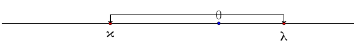
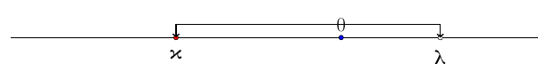
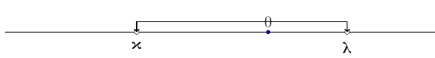
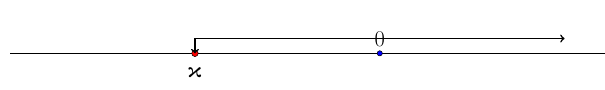

```{=html}
<!-- Φόρτωση βιβλιοθήκης GeoGebra -->
<script src="https://www.geogebra.org/apps/deployggb.js"></script>

<!-- Συνάρτηση δημιουργίας applets -->
<script>
function createGeoGebra(containerId, materialId, width = 700, height = 500) {
  var params = {
    "id": "ggb-" + containerId,
    "material_id": materialId,
    "width": width,
    "height": height,
    "showToolBar": true,
    "showMenuBar": false,
    "showAlgebraInput": true
  };
  
  var applet = new GGBApplet(params, '5.2');
  applet.inject(containerId);
}
</script>
```

## Η διάταξη των πραγματικών αριθμών

### Η έννοια της διάταξης στους πραγματικούς αριθμούς

::: {style="background-color: #d5f4e6; border: 2px solid #2f3e50; color: #25188a; padding: 15px; border-radius: 5px;"}
Η **διάταξη των πραγματικών αριθμών** βασίζεται στη σύγκριση της μεταξύ τους τιμής και συνδέεται άμεσα με τη γεωμετρική τους αναπαράσταση στον άξονα των πραγματικών αριθμών.

**Θεωρία και Ορισμοί**

**Ορισμός της ανισότητας:**

Ένας πραγματικός αριθμός $\alpha$ λέμε ότι είναι **μεγαλύτερος** από έναν αριθμό $\beta$ και γράφουμε $\alpha > \beta$, όταν η διαφορά $\alpha - \beta$ είναι **θετικός** αριθμός.

Αντίστοιχα, ο $\alpha$ είναι **μικρότερος** από τον $\beta$ ($\alpha < \beta$) όταν η διαφορά $\alpha - \beta$ είναι **αρνητικός** αριθμός.

Στην περίπτωση που οι αριθμοί είναι ίσοι, η διαφορά τους είναι μηδέν.
:::

------------------------------------------------------------------------

::: callout-note
Άν $α>0 \quad \text{  και } \quad β>0 \Longrightarrow α+β>0$

Άν $α<0 \quad \text{  και } \quad β<0 \Longrightarrow α+β<0$

Άν α, β ομόσημοι θετικοί ή α, β ομόσημοι αρνητικοί $\quad \Longrightarrow α\cdotβ>0$

Άν α, β ετερόσημοι $\quad \Longrightarrow α\cdotβ<0$
:::

#### Παραδείγματα

1.  **Σύγκριση:** Αν θέλουμε να δείξουμε ότι $5 > 2$, ελέγχουμε τη διαφορά $5 - 2 = 3$, η οποία είναι θετική.

2.  Αν α\>0 και β\<0 $\quad \Longrightarrow$ -β\>0 και άρα

- α-β=α+(-β)\>0 $\quad \Longrightarrow$ α\>β
- β-α=β+(-α)\<0 $\quad \Longrightarrow$ β\<α

------------------------------------------------------------------------

### Οι ιδιότητες των ανισοτήτων

::: {style="background-color: #d5f4e6; border: 2px solid #2f3e50; color: #25188a; padding: 15px; border-radius: 5px;"}
**Βασικές Ιδιότητες:**

1.  **Μεταβατική ιδιότητα:** Αν $\alpha < \beta$ και $\beta < \gamma$, τότε $\alpha < \gamma$.

2.  **Πρόσθεση αριθμού:** Αν προσθέσουμε τον ίδιο αριθμό $\gamma$ και στα δύο μέλη μιας ανισότητας, η φορά της **δεν αλλάζει** ($\alpha < \beta \Leftrightarrow \alpha + \gamma < \beta + \gamma$).

3.  **Πρόσθεση ανισοτήτων:** Μπορούμε να προσθέτουμε κατά μέλη ομοιόστροφες ανισότητες ($\alpha < \beta$ και $\gamma < \delta \Rightarrow \alpha + \gamma < \beta + \delta$).

4.  **Πολλαπλασιασμός με θετικό αριθμό:** Αν $\gamma > 0$, τότε $\alpha < \beta \Leftrightarrow \alpha \cdot \gamma < \beta \cdot \gamma$.

5.  **Πολλαπλασιασμός με αρνητικό αριθμό:** Αν $\gamma < 0$, τότε $\alpha < \beta \Leftrightarrow \alpha \cdot \gamma > \beta \cdot \gamma$ (η φορά της ανισότητας **αντιστρέφεται**).

6.  **Ιδιότητα τετραγώνου:** Για κάθε πραγματικό αριθμό $\alpha$ ισχύει ότι $\alpha^2 \geq 0$.

7.  **Αντίστροφοι αριθμοί:** Αν οι $\alpha, \beta$ είναι ομόσημοι και $\alpha < \beta$, τότε οι αντίστροφοί τους αλλάζουν φορά: $\dfrac{1}{\alpha} > \dfrac{1}{\beta}$.
:::

#### Παραδείγματα

1.  **Πολλαπλασιασμός:** Αν έχουμε την ανισότητα $x < 3$ και πολλαπλασιάσουμε με το $-2$, προκύπτει $-2x > -6$.
2.  **Τετράγωνα:** Η σχέση $(\alpha - \beta)^2 \geq 0$ είναι πάντα αληθής και οδηγεί στη γνωστή ανισότητα $\alpha^2 + \beta^2 \geq 2\alpha\beta$.
3.  **Διπλές ανισότητες:** Αν $1 < x < 2$ και $3 < y < 4$, τότε προσθέτοντας κατά μέλη έχουμε $4 < x + y < 6$.

------------------------------------------------------------------------

### Διαστήματα πραγματικών αριθμών

::: {style="background-color: #d5f4e6; border: 2px solid #2f3e50; color: #25188a; padding: 15px; border-radius: 5px;"}
Η διάταξη επιτρέπει τον ορισμό συνόλων αριθμών που ονομάζονται διαστήματα:

- **Κλειστό διάστημα** $[\alpha, \beta]$: Οι αριθμοί $x$ για τους οποίους $\alpha \leq x \leq \beta$.

- **Ανοικτό διάστημα** $(\alpha, \beta)$: Οι αριθμοί $x$ για τους οποίους $\alpha < x < \beta$.

- **Άπειρα διαστήματα:** Όπως το $[\alpha, +\infty)$ για $x \geq \alpha$ ή το $(-\infty, \alpha)$ για $x < \alpha$.
:::

#### Παραδείγματα

1.  Το $κ \leq x \leq λ$ δηλαδή το διάστημα $\left[ κ , λ\right]$ παριστάνεται με την παρακάτω εικόνα γεωμετρικά\
    

2.  Το $κ \leq x \lt λ$ δηλαδή το διάστημα $\left[ κ , λ\right)$ παριστάνεται με την παρακάτω εικόνα γεωμετρικά\
    \

3.  Το $κ \lt x \lt λ$ δηλαδή το διάστημα $\left(κ , λ\right)$ παριστάνεται με την παρακάτω εικόνα γεωμετρικά\
    

4.  Το $κ \leq x \lt +\infty$ δηλαδή το διάστημα $\left[κ , +\infty\right)$ παριστάνεται με την παρακάτω εικόνα γεωμετρικά\
    

5.  Το $-\infty \lt x \lt λ$ δηλαδή το διάστημα $\left(-\infty , λ\right)$ παριστάνεται με την παρακάτω εικόνα γεωμετρικά\
    

::: callout-note
Ανάλογα παρουσιάζονται και όλα τα άλλα διαστήματα που μπορεί να συναντήσουμε

$(κ, +\infty)$

$(-\infty, λ]$ κ.τ.λ
:::


------------------------------------------------------------------------


### Ασκήσεις

1.  Αν για τους πραγματικούς αριθμούς $\alpha, \beta$ ισχύει $1 < \alpha < 2$ και $2 < \beta < 5$, να αποδείξετε ότι $3 < \alpha + \beta < 7$.
2.  Να αποδείξετε ότι για κάθε $\alpha, \beta \in \mathbb{R}$ ισχύει η ανισότητα $2(\alpha^2 + \beta^2) \geq (\alpha + \beta)^2$.
3.  Αν $x > 4$, να αποδείξετε ότι η παράσταση $5(x - 1)$ είναι μεγαλύτερη από το $15$.
4.  Να διατάξετε από τον μικρότερο προς τον μεγαλύτερο τους αριθμούς $1, x, x^2$, όταν είναι γνωστό ότι $0 < x < 1$.
5.  Να βρείτε τις τιμές των $x, y$ για τις οποίες ισχύει η εξίσωση: $(x - 1)^2 + (y + 2)^2 = 0$.


6.  Αν είναι $6 < x < 8$ και $2 < y < 3$, να αποδείξετε ότι:

  * 1.  $\quad 8 < x + y < 11$.
  * 2.  $\quad 3 < x - y < 6$.
  * 3.  $\quad 18 < 2x + 3y < 25$.
  * 4.  $\quad \dfrac{6}{3} < \dfrac{x}{y} < \dfrac{8}{2}$.

7.  Να αποδείξετε ότι για οποιουσδήποτε πραγματικούς αριθμούς $\alpha, \beta$ ισχύουν οι παρακάτω ανισότητες:

  * 1.  $\quad \alpha^2 + \beta^2 \geq 2\alpha\beta$.
  * 2.  $\quad 2(\alpha^2 + \beta^2) \geq (\alpha + \beta)^2$.
  * 3.  $\quad (\alpha + \beta)^2 \geq 4\alpha\beta$.
  * Πότε ισχύει η ισότητα σε κάθε περίπτωση;

8.  Έστω ένας πραγματικός αριθμός $\alpha$ με $0 < \alpha < 1$.

  * 1.  Να αποδείξετε ότι $\quad \alpha^3 < \alpha$.
  * 2.  Να διατάξετε από τον μικρότερο προς τον μεγαλύτερο τους αριθμούς: $0, \alpha, \alpha^2, \alpha^3, 1, \dfrac{1}{\alpha}$.

9.  Να αποδείξετε ότι:

  * 1.  Αν $\alpha, \beta$ είναι **ομόσημοι** πραγματικοί αριθμοί, τότε $\dfrac{\alpha}{\beta} + \dfrac{\beta}{\alpha} \geq 2$.
  * 2.  Αν $\alpha, \beta$ είναι **ετερόσημοι** πραγματικοί αριθμοί, τότε $\dfrac{\alpha}{\beta} + \dfrac{\beta}{\alpha} \leq -2$.

10. Αν ισχύει η διάταξη $\alpha < 2 < \beta$, να αποδείξετε ότι:
$$\alpha\beta + 4 < 2\alpha + 2\beta$$

> (Υπόδειξη: Μεταφέρετε όλους τους όρους στο πρώτο μέλος και χρησιμοποιήστε παραγοντοποίηση).

11. Να αποδείξετε ότι:

  * α)   $\quad \beta^2 + 16 \ge 8\beta$
  * β)  $\quad 2(\alpha^2 + 4\gamma^2) \ge (\alpha + 2\gamma)^2$

12. Να αποδείξετε ότι $\alpha^2 + \beta^2 - 4\alpha + 4 \ge 0$. Πότε ισχύει η ισότητα;

13. Να βρείτε τους πραγματικούς αριθμούς $x$ και $y$ σε καθεμιά από τις παρακάτω περιπτώσεις:

  * α)     Αν $(x - 3)^2 + (y - 5)^2 = 0$
  * β)     Αν $x^2 + y^2 + 4x - 6y + 13 = 0$
  
  > Μετασχηματήστε σε $(x+a)^2+(y+b)^2$

14. Αν $2,1 < x < 2,2$ και $3,2 < y < 3,3$, να βρείτε τα όρια μεταξύ των οποίων περιέχεται η τιμή καθεμιάς από τις παραστάσεις:

  * α)   $\quad x + y$
  * β)   $\quad x - y$
  * γ)   $\quad xy$
  * δ)   $\quad x^2 + y^2$


15. Το πλάτος $x$ και το μήκος $y$ ενός ορθογωνίου ικανοποιούν τις ανισότητες $4 < x < 5$ και $6 < y < 8$. Αν αυξήσουμε το πλάτος κατά $0,3$ και ελαττώσουμε το μήκος κατά $0,2$, να βρείτε τις δυνατές τιμές:

  * α)   της περιμέτρου
  * β)  του εμβαδού του νέου ορθογωνίου.

16. Αν $0 < \alpha < \beta$, να δείξετε ότι $\dfrac{1}{\alpha} > \dfrac{1}{\beta}$.

17. Να βρείτε το λάθος στον παρακάτω συλλογισμό:

    Έστω $x < 3$. Τότε έχουμε διαδοχικά:
    
    $x < 3$
    
    $x^2 < 3x$
    
    $x^2 - 9 < 3x - 9$
    
    $(x-3)(x+3) < 3(x-3)$
    
    $x+3 < 3$
    
    $x < 0$

18. Δίνονται ένα κλάσμα $\dfrac{x}{y}$ θετικών όρων και ένας θετικός αριθμός $\delta$. Να αποδείξετε ότι:

  * α) Αν $\quad \dfrac{x}{y} < 1$, τότε $\dfrac{x+\delta}{y+\delta} > \dfrac{x}{y}$
  * β) Αν $\quad \dfrac{x}{y} > 1$, τότε $\dfrac{x+\delta}{y+\delta} < \dfrac{x}{y}$

19. Αν $x > 1$ και $y > 1$, να αποδείξετε ότι $x + y < 1 + xy$

20. Αν $a, b$ θετικοί αριθμοί, να δείξετε ότι $(2a + b)(\dfrac{1}{a} + \dfrac{1}{2b}) \ge 4$

21. Να αποδείξετε ότι:

  * α) $\quad 4x^2 + 2xy + y^2/4 \ge 0$
  * β) $\quad x^2 - 3xy + \dfrac{9}{4}y^2 \ge 0$


------------------------------------------------------------------------


::: {.callout-tip style="color: brown;"}
ΚΑΛΗ ΜΕΛΕΤΗ!
:::

\
\

