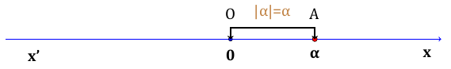
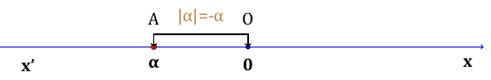
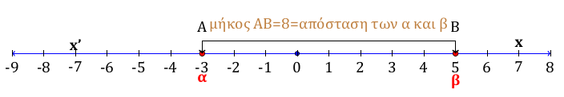
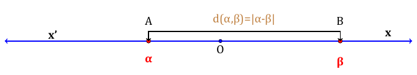
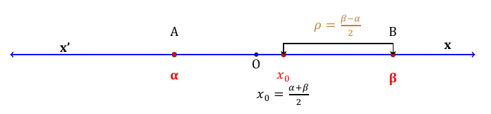

```{=html}
<!-- Φόρτωση βιβλιοθήκης GeoGebra -->
<script src="https://www.geogebra.org/apps/deployggb.js"></script>

<!-- Συνάρτηση δημιουργίας applets -->
<script>
function createGeoGebra(containerId, materialId, width = 700, height = 500) {
  var params = {
    "id": "ggb-" + containerId,
    "material_id": materialId,
    "width": width,
    "height": height,
    "showToolBar": true,
    "showMenuBar": false,
    "showAlgebraInput": true
  };
  
  var applet = new GGBApplet(params, '5.2');
  applet.inject(containerId);
}
</script>
```

## Η απόλυτη τιμή πραγματικού αριθμού

### Ορισμός της απόλυτης τιμής

::: {style="background-color: #d5f4e6; border: 2px solid #2f3e50; color: #25188a; padding: 15px; border-radius: 5px;"}
**Θεωρία και Γεωμετρική Ερμηνεία**

Η απόλυτη τιμή ενός πραγματικού αριθμού $\alpha$ συνδέεται άμεσα με τη θέση του πάνω στον άξονα των πραγματικών αριθμών.
**Γεωμετρικά, η απόλυτη τιμή του** $\alpha$ είναι η απόσταση του σημείου $A(\alpha)$ από την αρχή $O(0)$ των αξόνων, δηλαδή το μήκος του ευθύγραμμου τμήματος $OA$.\

\
\


Επειδή η απόσταση εκφράζει μήκος, η απόλυτη τιμή είναι πάντα ένας **μη αρνητικός αριθμός** ($|a| \ge 0$).

**Ορισμός** Η απόλυτη τιμή ενός πραγματικού αριθμού $\alpha$ συμβολίζεται με $|\alpha|$ και ορίζεται από τον τύπο:

$$|\alpha| = \begin{cases} \alpha, & \text{αν } \alpha \ge 0 \\ -\alpha, & \text{αν } \alpha < 0 \end{cases}$$

Δηλαδή:\

- Η απόλυτη τιμή ενός θετικού αριθμού ή του μηδενός είναι **ο ίδιος ο αριθμός**.

- Η απόλυτη τιμή ενός αρνητικού αριθμού είναι **ο αντίθετός του**.
:::

------------------------------------------------------------------------

::: callout-note
Ετσι συμπεραίνουμε τα παρακάτω:

- $\quad |α|=|-α|\geq0$

- $\quad |α|\geq α \quad\text{και}\quad |α|\geq -α$

- $\quad |α|^2=α^2$

- $$\text{Άν θ>0, τότε}  \quad  
  \begin{cases}
  |x| = θ ⇔ x = θ \quadή \quad x = -θ \\
  |x| = |α| ⇔ x = α \quad ή \quad x = -α
  \end{cases}$$
:::

#### Παραδείγματα

1.  $|5| = 5$, γιατί ο 5 είναι θετικός ($5 > 0$).

2.  $|-7| = 7$, γιατί ο -7 είναι αρνητικός και ο αντίθετός του είναι το 7.

3.  $|0| = 0$, η απόσταση του μηδενός από τον εαυτό του είναι μηδέν.

4.  $|1 - \sqrt{3}| = \sqrt{3} - 1$, επειδή το $1 - \sqrt{3}$ είναι αρνητικός αριθμός ($1 < \sqrt{3}$), η απόλυτη τιμή του είναι ο αντίθετός του, δηλαδή $-(1 - \sqrt{3}) = \sqrt{3} - 1$.

5.  $|\pi - 3| = \pi - 3$, επειδή $\pi \approx 3,14 > 3$, η ποσότητα είναι θετική.

------------------------------------------------------------------------

### Ιδιότητες των απόλυτων τιμών

::: {style="background-color: #d5f4e6; border: 2px solid #2f3e50; color: #25188a; padding: 15px; border-radius: 5px;"}
**Θεωρία και Βασικοί Ορισμοί** Η απόλυτη τιμή ενός πραγματικού αριθμού $\alpha$, πέρα από τον βασικό της ορισμό ως απόσταση από το μηδέν, διέπεται από μια σειρά αλγεβρικών ιδιοτήτων που διευκολύνουν την επίλυση εξισώσεων, ανισώσεων και την απλοποίηση παραστάσεων.

Οι κυριότερες ιδιότητες είναι οι εξής:

1.  **Μη αρνητικότητα:** Για κάθε $\alpha \in \mathbb{R}$, ισχύει $|\alpha| \ge 0$.

2.  **Ιδιότητα του Μηδενός:** $|\alpha| = 0 \iff \alpha = 0$.

3.  **Απόλυτη τιμή αντιθέτων:** Οι αντίθετοι αριθμοί έχουν την ίδια απόλυτη τιμή, δηλαδή $|\alpha| = |-\alpha|$.

4.  **Σχέση με τον αριθμό:** Ισχύει $|\alpha| \ge \alpha$ και $|\alpha| \ge -\alpha$.

5.  **Σχέση με το τετράγωνο:** $|\alpha|^2 = \alpha^2$ και γενικότερα $|\alpha|^{2\nu} = \alpha^{2\nu}$.

6.  **Γινόμενο και Πηλίκο:**

    - $|\alpha \cdot \beta| = |\alpha| \cdot |\beta|$. Ισχύει και για περισσότερους παράγοντες. Άν όλοι οι παράγοντες είναι ίσοι τότε θα έχουμε $|α^ν|=|α|^ν$

    > Για την απόδειξη , υψώστε και τα δύο μέλη στο τετράγωνο.

    - $\left|\dfrac{\alpha}{\beta}\right| = \dfrac{|\alpha|}{|\beta|}$, με $\beta \neq 0$. Ισχύει και για περισσότερους προσθετέους.

    > Για την απόδειξη , υψώστε και τα δύο μέλη στο τετράγωνο.

7.  **Τριγωνική Ανισότητα:** $|\alpha + \beta| \le |\alpha| + |\beta|$.

> Για την απόδειξη , υψώστε και τα δύο μέλη στο τετράγωνο.

8.  **Εξισώσεις/Ανισώσεις:** Αν $\theta > 0$, τότε:
    - $|x| = \theta \iff x = \theta$ ή $x = -\theta$.
    - $|x| < \theta \iff -\theta < x < \theta$.
    - $|x| > \theta \iff x < -\theta$ ή $x > \theta$.
:::

#### Παραδείγματα

1.  **Χρήση τετραγώνου:** Για την παράσταση $\sqrt{(x-3)^2}$, χρησιμοποιούμε την ιδιότητα $\sqrt{\alpha^2} = |\alpha|$, άρα $\sqrt{(x-3)^2} = |x-3|$.

2.  **Γινόμενο:** $|-2 \cdot 5| = |-2| \cdot |5| = 2 \cdot 5 = 10$.

3.  **Ανισότητα:** Αν $|x| \le 3$, τότε από τις ιδιότητες γνωρίζουμε ότι $-3 \le x \le 3$.

4.  **Αντίθετα:** Η εξίσωση $|x-4| + |4-x| = 2|x-4|$ είναι αληθής γιατί $|x-4| = |-(x-4)| = |4-x|$.

------------------------------------------------------------------------

### Απόσταση δυο αριθμών

::: {style="background-color: #d5f4e6; border: 2px solid #2f3e50; color: #25188a; padding: 15px; border-radius: 5px;"}
**Θεωρία και Ορισμοί**

- **Ορισμός:** Αν οι πραγματικοί αριθμοί $\alpha$ και $\beta$ παριστάνονται πάνω στον άξονα με τα σημεία $A$ και $B$ αντίστοιχα, τότε το **μήκος του ευθύγραμμου τμήματος** $AB$ ονομάζεται απόσταση των αριθμών $\alpha$ και $\beta$.\
  

- **Συμβολισμός και Τύπος:** Η απόσταση συμβολίζεται με $d(\alpha, \beta)$ και ισούται με την **απόλυτη τιμή της διαφοράς των δύο αριθμών**: $$d(\alpha, \beta) = |\alpha - \beta|$$.\

  \

- **Βασικές Ιδιότητες:**

  1.  $d(\alpha, \beta) = d(\beta, \alpha)$: Η απόσταση είναι συμμετρική, δηλαδή η απόσταση του $\alpha$ από το $\beta$ είναι ίση με την απόσταση του $\beta$ από το $\alpha$.

  2.  $d(\alpha, \beta) \ge 0$: Η απόσταση εκφράζει μήκος, επομένως είναι πάντα μη αρνητικός αριθμός.

  3.  **Σχέση με την απόλυτη τιμή:** Η απόλυτη τιμή ενός αριθμού $\alpha$ είναι η απόστασή του από την αρχή $O(0)$ των αξόνων, δηλαδή $|\alpha| = d(\alpha, 0)$.

- **Κέντρο και Ακτίνα Διαστήματος:** Σε ένα διάστημα με άκρα $\alpha$ και $\beta$ ($\alpha < \beta$):\
  

  - Το **κέντρο** $x_0$ είναι ο αριθμός που αντιστοιχεί στο μέσο του τμήματος $AB$: $x_0 = \dfrac{\alpha + \beta}{2}$.

  - Η **ακτίνα** $\rho$ είναι η μισή απόσταση των άκρων του: $\rho = \dfrac{\beta - \alpha}{2}$.

Γενικά:

- Για $x_0 ∊ ℝ$ και $ρ > 0$, ισχύει:

$|x - x_0| < ρ ⇔ x \in(x_0 -ρ, x_0 + ρ) ⇔ x_0 - ρ < x < x_0 + ρ$

- Για $x_0 \in ℝ$ και $ρ > 0$, ισχύει:

$|x - x_0| > ρ ⇔ x  \in( -∞, x_0 - ρ) U (x_0 + ρ, +∞)  ⇔ x < x_0 - ρ$ ή $x > x_0 + ρ$
:::

#### Παραδείγματα

1.  Η απόσταση των αριθμών $1$ και $3$ είναι $d(1, 3) = |1 - 3| = |-2| = 2$.

2.  Η απόσταση των αριθμών $-2$ και $2$ είναι $d(-2, 2) = |-2 - 2| = |-4| = 4$.

3.  Η έκφραση $d(x, 5) \le 9$ ερμηνεύεται λεκτικά ως: «η απόσταση του πραγματικού αριθμού $x$ από τον αριθμό $5$ είναι μικρότερη ή ίση του $9$».

> Αυτό σημαίνει ότι $$\begin{array}{c}
> |x-5|\leq 9 \Longleftrightarrow \\
> -9 \leq x-5 \leq 9 \Longleftrightarrow \\
> -9+5\leq x\leq 9+5 \Longleftrightarrow \\
> -4 \leq x \leq 14
> \end{array}$$

4.  Η εξίσωση $d(x, 1) = 2$ σημαίνει ότι ο αριθμός $x$ απέχει από το $1$ ακριβώς $2$ μονάδες, άρα\

$$\begin{array}{c}
|x-1| =2 \Longleftrightarrow \\
x-1 =2 \quad \text{ή} \quad x-1=-2 \Longleftrightarrow \\
x=3 \quad \text{ ή } \quad x=-1
\end{array}$$

$x = 3$ ή $x = -1$.

------------------------------------------------------------------------

### Ασκήσεις

1.  Να υπολογίσετε τις παρακάτω απόλυτες τιμές χρησιμοποιώντας τον ορισμό:

- α. $|-12|$,
- β. $|3,5|$,
- γ. $|2-\sqrt{2}|$,
- δ. $|1-\pi|$.

2.  Να γράψετε τις παρακάτω παραστάσεις χωρίς το σύμβολο της απόλυτης τιμής:

- α. $|x-2|$, αν $x \ge 2$
- β. $|x-2|$, αν $x < 2$.

3.  Να βρείτε για ποιες τιμές του $x$ ισχύουν οι παρακάτω ισότητες:

- α. $|x| = 8$,
- β. $|x| = -3$,
- γ. $|x| = 0$.

4.  Αν είναι γνωστό ότι $x < 3$, να απλοποιήσετε την παράσταση $A = |x-3| + 2x - 1$.

5.  Να εξετάσετε αν οι παρακάτω προτάσεις είναι Σωστές ή Λάθος βάσει του ορισμού:

- 

  1.  Για κάθε πραγματικό αριθμό $α$ ισχύει $|α| \ge α$.

- 

  2.  Ισχύει $|-\alpha| = \alpha$ για κάθε πραγματικό αριθμό $\alpha$.

- 

  3.  Αν $|\alpha| = |\beta|$, τότε αναγκαστικά $\alpha = \beta$.

- 

  4.  Η απόλυτη τιμή ενός αριθμού μπορεί να είναι αρνητική.

6.  Να αποδείξετε ότι για κάθε πραγματικό αριθμό $\alpha$ ισχύει η ισότητα $(\alpha - |\alpha|) \cdot (\alpha + |\alpha|) = 0$.

> (Υπόδειξη: Χρησιμοποιήστε τη διαφορά τετραγώνων και την ιδιότητα $|\alpha|^2 = \alpha^2$).

7.  Να λύσετε την εξίσωση $|2x - 1| = |x + 5|$ χρησιμοποιώντας την ιδιότητα $|\alpha| = |\beta| \iff \alpha = \beta$ ή $\alpha = -\beta$.

8.  Αν είναι γνωστό ότι $|x| \le 2$ και $|y| \le 5$, να αποδείξετε χρησιμοποιώντας την τριγωνική ανισότητα ότι $|3x + y| \le 11$.

9.  Να γράψετε σε μορφή διαστήματος το σύνολο των λύσεων της ανίσωσης $|x - 5| < 9$ εφαρμόζοντας την ιδιότητα των ανισώσεων με απόλυτα.

10. Να χαρακτηρίσετε ως Σωστές (Σ) ή Λανθασμένες (Λ) τις παρακάτω προτάσεις βάσει των ιδιοτήτων:

- 

  1.  Ισχύει $|\alpha + \beta| = |\alpha| + |\beta|$ για όλους τους πραγματικούς αριθμούς.

- 

  2.  Αν $\alpha \neq 0$, τότε $\dfrac{\alpha}{|\alpha|} = \dfrac{|\alpha|}{\alpha}$.

- 

  3.  Η ανίσωση $|x| < -5$ είναι αδύνατη.

- 

  4.  Ισχύει $|x^2 + 1| = x^2 + 1$ για κάθε $x \in \mathbb{R}$.

11. Να υπολογίσετε τις παρακάτω αποστάσεις χρησιμοποιώντας τον ορισμό:

- α.
  $d(10, 4)$,

- β.
  $d(-3, 6)$,

- γ.
  $d(-8, -2)$,

- δ.
  $d(0, -5)$.

12. Να βρείτε τον πραγματικό αριθμό $x$ στις παρακάτω περιπτώσεις:

- α. $d(x, 3) = 5$,
- β. $d(x, -2) = 1$.

13. Να συμπληρώσετε τον παρακάτω πίνακα αντιστοιχίζοντας την απόσταση με απόλυτη τιμή και διάστημα:

| Απόσταση         | Απόλυτη τιμή    | Διάστημα       |
|:-----------------|:----------------|:---------------|
| $d(x, 4) < 1$    | $|x - 4| < 1$   | $x \in (3, 5)$ |
| $d(x, -1) \le 2$ |                 |                |
|                  | $|x - 2| \ge 3$ |                |

14. Δίνεται το διάστημα $[-3, 7]$.

Να υπολογίσετε:

- α.
  Το μήκος του διαστήματος.

- β.
  Το κέντρο $x_0$ και την ακτίνα $\rho$ του διαστήματος.

- γ.
  Να γράψετε τη σχέση που περιγράφει τα σημεία του διαστήματος χρησιμοποιώντας το συμβολισμό της απόστασης $d(x, x_0) \le \rho$.

15. Σε έναν άξονα τα σημεία $A$ και $B$ αντιστοιχούν στους αριθμούς $5$ και $9$.
    Αν για ένα σημείο $M(x)$ ισχύει $d(x, 5) = d(x, 9)$, να προσδιορίσετε γεωμετρικά και αλγεβρικά τη θέση του σημείου $M$ και την τιμή του $x$.

16. Να γράψετε τις παρακάτω παραστάσεις χωρίς το σύμβολο της απόλυτης τιμής:

**α.** $|\sqrt{10} - 3|$

**β.** $|\sqrt{10} - 4|$

**γ.** $|5 - \pi| + |2 - \pi|$

**δ.** $|\sqrt{7} - \sqrt{5}| - |\sqrt{5} - \sqrt{7}|$

17. Αν $2 < x < 5$, να γράψετε χωρίς την απόλυτη τιμή την παράσταση: $$|x - 2| + |x - 5|$$

18. Να γράψετε χωρίς την απόλυτη τιμή την παράσταση $|x - 5| - |1 - x|$, όταν:

**α.** $x < 1$

**β.** $x > 5$

19. Αν $x \neq 3$, να βρείτε την τιμή της παράστασης: $$\frac{|x - 3|}{|3 - x|}$$

20. Αν $a \neq 0$ και $b \neq 0$, να βρείτε όλες τις δυνατές τιμές που μπορεί να πάρει η παράσταση: $$B = \dfrac{|a|}{a} - \dfrac{b}{|b|}$$

21. Το βάρος ενός δέματος μετρήθηκε και βρέθηκε $5,40 \text{ kg}$.
    Το σφάλμα της μέτρησης είναι το πολύ $0,02 \text{ kg}$.
    Αν $W$ είναι το πραγματικό βάρος του δέματος, τότε:

**α.** Να εκφράσετε την παραπάνω παραδοχή με τη βοήθεια της έννοιας της απόστασης.

**β.** Να βρείτε μεταξύ ποιών ορίων βρίσκεται η τιμή $W$.

22. Να συμπληρώσετε τον παρακάτω πίνακα (όπως το παράδειγμα της εικόνας):

| Απόλυτη Τιμή     | Απόσταση         | Διάστημα ή Ένωση Διαστημάτων      |
|:-----------------|:-----------------|:----------------------------------|
| $|x - 2| \leq 3$ | $d(x, 2) \leq 3$ | $[-1, 5]$                         |
| $|x + 5| < 1$    |                  |                                   |
| $|x - 1| > 4$    |                  |                                   |
| $|x + 2| \geq 3$ |                  |                                   |
|                  | $d(x, 4) < 2$    |                                   |
|                  | $d(x, -3) > 1$   |                                   |
|                  |                  | $(-3, 3)$                         |
|                  |                  | $[2, 8]$                          |
|                  |                  | $(-\infty, -1] \cup [5, +\infty)$ |

> Μικρή βοήθεια για τη λύση:

> - **Απόλυτη τιμή:**

> Αν το μέσα είναι θετικό, βγαίνει όπως είναι.

> Αν είναι αρνητικό, αλλάζουμε όλα τα πρόσημα.

> - **Απόσταση:** Η απόσταση $d(a, b)$ είναι ίση με $|a - b|$.

> - **Σφάλμα:** Αν έχουμε μέτρηση $M$ και σφάλμα $s$, τότε $|x - M| \leq s$.

23. Να αποδείξετε ότι για οποιουσδήποτε πραγματικούς αριθμούς $x, y$ και $z$ ισχύει: $$|x + y| \leq |x - z| + |y + z|$$\

> (Υπόδειξη: Γράψτε το $x+y$ ως $(x-z) + (y+z)$ και εφαρμόστε την τριγωνική ανισότητα).

24. Αν $x < y$, να αποδείξετε ότι:

**α.** $y = \dfrac{x + y + |x - y|}{2}$

**β.** $x = \dfrac{x + y - |x - y|}{2}$

> (Παρατήρηση: Αυτοί οι τύποι μας δίνουν πάντα τον μεγαλύτερο και τον μικρότερο από δύο αριθμούς).

25. Τι συμπεραίνουμε για τους πραγματικούς αριθμούς $a, b$ και $c$ αν ισχύει:

**α.** Η ισότητα $|a - 1| + |b - 2| + |c - 3| = 0$;

**β.** Η ανισότητα $a^2 + b^2 > 0$;

26. Έστω δύο θετικοί αριθμοί $x$ και $y$ με $0 < x < y$.

**α.** Να διατάξετε από τον μικρότερο στο μεγαλύτερο τους αριθμούς: $$0, \quad \dfrac{\sqrt x}{y}, \quad 1, \quad \dfrac{\sqrt y}{x}$$

**β.** Να δείξετε ότι η απόσταση του αριθμού $\dfrac{x}{y}$ από τη μονάδα είναι μικρότερη από την απόσταση του $\dfrac{y}{x}$ από τη μονάδα.
Δηλαδή: $$\left| \frac{x}{y} - 1 \right| < \left| \frac{y}{x} - 1 \right|$$

**Λύση**

- α. [Θέλουμε να αποδείξουμε ότι]{.underline} $\quad 0 < \frac{\sqrt{x}}{y} < 1 < \frac{\sqrt{y}}{x}$

**Τα βήματα**

Για να διατάξουμε τους αριθμούς, εξετάζουμε τις σχέσεις τους σε σχέση με το 0 και το 1:

1.  **Σύγκριση του** $\dfrac{\sqrt{x}}{y}$ με το 0:

Εφόσον $x, y > 0$, τότε και οι τετραγωνικές ρίζες τους είναι θετικές.
Άρα το κλάσμα $\dfrac{\sqrt{x}}{y}$ είναι θετικό, δηλαδή $0 < \dfrac{\sqrt{x}}{y}$.

2.  **Σύγκριση του** $\dfrac{\sqrt{x}}{y}$ με το 1:

Γνωρίζουμε ότι $0 < x < y$.
Επειδή $x < y$, τότε $\sqrt{x} < \sqrt{y}$.
Επίσης, η ανισότητα $x < y$ διαιρώντας και τα δύο μέλη με $y$ (αφού $y > 0$) μας δίνει $\dfrac{x}{y} < 1$.

Όμως, δεν ξέρουμε αν $x$ και $y$ είναι μεγαλύτερα ή μικρότερα της μονάδας.
Ωστόσο, μπορούμε να εξετάσουμε την τιμή του κλάσματος.
Επειδή $x < y$, τότε $\sqrt{x} < \sqrt{y}$, οπότε $\dfrac{\sqrt{x}}{\sqrt{y}} < 1$.

Επειδή $x < y$, αν θεωρήσουμε την περίπτωση $x < 1 < y$, τότε $\dfrac{\sqrt{x}}{y} < 1$ ισχύει πάντα καθώς ο αριθμητής είναι μικρότερος του παρονομαστή υπό την προϋπόθεση ότι οι αριθμοί είναι τέτοιοι ώστε $\sqrt{x} < y$.
Πράγματι, αφού $x < y$ και $x, y > 0$, η σχέση $\dfrac{\sqrt{x}}{y}$ συγκρινόμενη με το 1 εξαρτάται από τις τιμές.

Ωστόσο, για την γενική διάταξη:

$\dfrac{\sqrt{x}}{y} < 1 \iff \sqrt{x} < y$.
Εφόσον $x < y$, τότε $\sqrt{x} < x < y$, άρα το κλάσμα είναι πράγματι μικρότερο της μονάδας.

3.  **Σύγκριση του** $\dfrac{\sqrt{y}}{x}$ με το 1:

Επειδή $x < y$, τότε $\sqrt{x} < \sqrt{y}$.
Επίσης $x < \sqrt{x}$ (αν $0 < x < 1$) ή $x > \sqrt{x}$ (αν $x > 1$).

Επειδή $y > x$, τότε $\dfrac{\sqrt{y}}{x} > \dfrac{\sqrt{x}}{x} = \dfrac{1}{\sqrt{x}}$.
Αν $x < 1$, τότε $\dfrac{1}{\sqrt{x}} > 1$, άρα $\dfrac{\sqrt{y}}{x} > 1$.

4.  **Συμπέρασμα:** Συνδυάζοντας τα παραπάνω, έχουμε: $0 < \dfrac{\sqrt{x}}{y} < 1 < \dfrac{\sqrt{y}}{x}$.

- β. [Θέλουμε να αποδείξουμε ότι:]{.underline}

$$\left| \frac{x}{y} - 1 \right| < \left| \frac{y}{x} - 1 \right|$$

**Τα βήματα**

1.  **Απλοποιούμε τις απόλυτες τιμές:**

Επειδή $x < y$, το κλάσμα $\dfrac{x}{y}$ είναι μικρότερο της μονάδας ($\dfrac{x}{y} < 1$).

Επομένως, η παράσταση μέσα στην απόλυτη τιμή είναι αρνητική, οπότε: $$\left| \frac{x}{y} - 1 \right| = 1 - \frac{x}{y} = \frac{y - x}{y}$$

Επειδή $y > x$, το κλάσμα $\dfrac{y}{x}$ είναι μεγαλύτερο της μονάδας ($\dfrac{y}{x} > 1$).

Επομένως, η παράσταση μέσα στην απόλυτη τιμή είναι θετική, οπότε: $$\left| \frac{y}{x} - 1 \right| = \frac{y}{x} - 1 = \frac{y - x}{x}$$

2.  **Συγκρίνουμε τα αποτελέσματα:**

Τώρα πρέπει να συγκρίνουμε τα κλάσματα $\dfrac{y-x}{y}$ και $\dfrac{y-x}{x}$.

Παρατηρούμε ότι:

Έχουν τον **ίδιο αριθμητή** ($y - x$), ο οποίος είναι θετικός.

Ο **παρονομαστής** του πρώτου κλάσματος ($y$) είναι **μεγαλύτερος** από τον παρονομαστή του δεύτερου κλάσματος ($x$).

Στα κλάσματα με τον ίδιο θετικό αριθμητή, **μικρότερο είναι εκείνο που έχει τον μεγαλύτερο παρονομαστή**.

Επειδή $y > x$, ισχύει:

$$\frac{y-x}{y} < \frac{y-x}{x}$$

3.  **Συμπέρασμα:**

Άρα αποδείχθηκε ότι: $$\left| \frac{x}{y} - 1 \right| < \left| \frac{y}{x} - 1 \right|$$

27. Αν γνωρίζουμε ότι $|a - 5| < 0,2$ και $|b - 10| < 0,4$, να βρείτε μεταξύ ποιών ορίων (εκτίμηση) βρίσκεται η περίμετρος των παρακάτω σχημάτων:

- 

  1.  **Ισοσκελές τρίγωνο** με βάση $a$ και δύο ίσες πλευρές μήκους $b$. (Περίμετρος $P = a + 2b$)

- 

  2.  **Ορθογώνιο παραλληλόγραμμο** με πλευρές $a$ και $b$. (Περίμετρος $P = 2a + 2b$)

- 

  3.  **Τετράγωνο** με πλευρά μήκους $a$. (Περίμετρος $P = 4a$)

> *(Υπόδειξη: Πρώτα "λύστε" τις ανισότητες για να βρείτε ότι* $4,8 < a < 5,2$ και $9,6 < b < 10,4$ και μετά κάντε τις πράξεις).

28. Τι σημαίνει για τους πραγματικούς αριθμούς $a$ και $b$:

- 

  i)  Η ισότητα $|a - 1| + |b + 3| = 0$;

- 

  ii) Η ανισότητα $|a - 1| + |b + 3| > 0$;

29. Έστω $0 < x < y$.

- 

  i)  Να διατάξετε από τον μικρότερο στο μεγαλύτερο τους αριθμούς: $1, \sqrt{\dfrac{x}{y}}$ και $\sqrt{\dfrac{y}{x}}$.

- 

  ii) Να δείξετε ότι στον πραγματικό άξονα ο αριθμός $\sqrt{\dfrac{x}{y}}$ βρίσκεται πλησιέστερα στο 1 από ό,τι ο αριθμός $\sqrt{\dfrac{y}{x}}$.

30. Αν $|a - 5| < 0,3$ και $|b - 3| < 0,1$, να εκτιμήσετε την τιμή της περιμέτρου των παρακάτω σχημάτων:

- 

  1.  Ενός ισοπλεύρου τριγώνου με πλευρά $α$.

- 

  2.  Ενός ρόμβου με πλευρά $b$.

- 

  3.  Ενός κύκλου με ακτίνα $b$.

::: {.callout-tip style="color: brown;"}
ΚΑΛΗ ΜΕΛΕΤΗ!
:::

\
\
