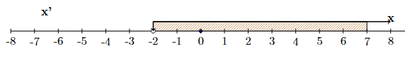
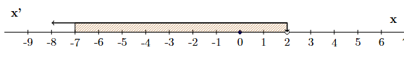
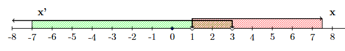
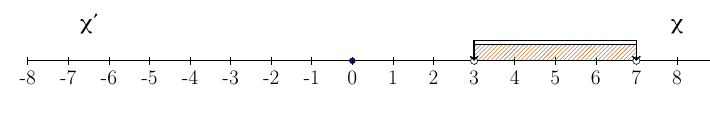
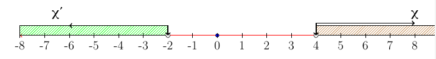

```{=html}
<!-- Φόρτωση βιβλιοθήκης GeoGebra -->
<script src="https://www.geogebra.org/apps/deployggb.js"></script>

<!-- Συνάρτηση δημιουργίας applets -->
<script>
function createGeoGebra(containerId, materialId, width = 700, height = 500) {
  var params = {
    "id": "ggb-" + containerId,
    "material_id": materialId,
    "width": width,
    "height": height,
    "showToolBar": true,
    "showMenuBar": false,
    "showAlgebraInput": true
  };
  
  var applet = new GGBApplet(params, '5.2');
  applet.inject(containerId);
}
</script>
```

## Οι ανισώσεις $αx+β \geq 0$ και $αx+β \leq 0$

::: {style="background-color: #d5f4e6; border: 2px solid #2f3e50; color: #25188a; padding: 15px; border-radius: 5px;"}
### Ανισώσεις 1ου Βαθμού: $\alpha x + \beta > 0$ και $\alpha x + \beta < 0$

#### **Ορισμοί**

- **Ανίσωση 1ου βαθμού:** Κάθε ανίσωση που έχει τη μορφή $\alpha x + \beta > 0$ ή $\alpha x + \beta < 0$ (καθώς και $\alpha x + \beta \geq 0$ ή $\alpha x + \beta \leq 0$), όπου $\alpha, \beta$ είναι πραγματικοί αριθμοί και $x$ ο άγνωστος.
- **Λύση ή Ρίζα:** Ονομάζεται κάθε πραγματικός αριθμός που, όταν αντικαταστήσει τον άγνωστο $x$, επαληθεύει την ανισωτική σχέση.
- **Σύνολο Λύσεων:** Το σύνολο όλων των πραγματικών αριθμών που αποτελούν λύσεις της ανίσωσης. Αυτό μπορεί να είναι ένα διάστημα ή και το κενό σύνολο.

#### **Πώς επιλύονται (Μεθοδολογία)**

Η επίλυση μιας ανίσωσης 1ου βαθμού ακολουθεί παρόμοια ϐήματα με την αντίστοιχη εξίσωση, με τη ϐασική διαφορά ότι **η ϕορά της ανίσωσης αλλάζει όταν πολλαπλασιάζουμε ή διαιρούμε με αρνητικό αριθμό**.

1.  **Απαλοιφή παρονομαστών:** Πολλαπλασιάζουμε όλους τους όρους με το Ελάχιστο Κοινό Πολλαπλάσιο (Ε.Κ.Π.) των παρονομαστών. Αν το Ε.Κ.Π. είναι θετικός αριθμός, η ϕορά παραμένει ίδια.
2.  **Απαλοιφή παρενθέσεων:** Εϕαρμόζουμε την επιμεριστική ιδιότητα.
3.  **Χωρισμός γνωστών από αγνώστους:** Μεταφέρουμε τους όρους με τον άγνωστο $x$ στο ένα μέλος και τους αριθμούς στο άλλο.
4.  **Αναγωγή ομοίων όρων:** Καταλήγουμε στην απλή μορφή $\alpha x > -\beta$ ή $\alpha x < -\beta$.
5.  **Διαίρεση με τον συντελεστή του αγνώστου (**$\alpha$):
    - Αν $\alpha > 0$, τότε $x > -\dfrac{\beta}{\alpha}$ (η ϕορά παραμένει ίδια).
    - Αν $\alpha < 0$, τότε $x < -\dfrac{\beta}{\alpha}$ (η **ϕορά αλλάζει**).
    - Αν $\alpha = 0$, η ανίσωση παίρνει τη μορφή $0x > -\beta$. Αν η σχέση που προκύπτει αληθεύει (π.χ. $0 > -5$), τότε η ανίσωση είναι **αόριστη** (ισχύει για κάθε $x \in \mathbb{R}$). Αν δεν αληθεύει (π.χ. $0 > 5$), τότε είναι **αδύνατη**.
:::

#### **Παραδείγματα**

- **Απλό παράδειγμα:** $2x + 4 > 0 \Rightarrow 2x > -4 \Rightarrow x > -2$.
  Λύση: $(-2, +\infty)$.

  *Γεωμετρική απεικόνιση*

  

- **Με αρνητικό συντελεστή:** $-2x + 4 > 0 \Rightarrow -2x > -4 \Rightarrow x < \dfrac{-4}{-2} \Rightarrow x < 2$.
  Λύση: $(-\infty, 2)$.\

  *Γεωμετρική απεικόνιση*

  

- **Με κλάσματα:** $\dfrac{5x+1}{6} < \dfrac{x+1}{2} + \dfrac{2x+1}{3}$.\
  Πολλαπλασιάζουμε με το Ε.Κ.Π.
  (6): $5x+1 < 3(x+1) + 2(2x+1) \Rightarrow 5x+1 < 3x+3+4x+2 \Rightarrow 5x-7x < 5-1 \Rightarrow -2x < 4 \Rightarrow x > -2$.

\
\

### Εύρεση των **κοινών λύσεων** δύο ή περισσότερων ανισώσεων

::: {.callout-note style="color: #034f84;"}
Για την εύρεση των **κοινών λύσεων** δύο ή περισσότερων ανισώσεων (διαδικασία που ονομάζεται **συναλήθευση**), ακολουθούμε τα εξής βήματα:

1.  **Επιλύουμε κάθε ανίσωση χωριστά** ώστε να βρούμε το σύνολο λύσεων για την καθεμία.

2.  **Παριστάνουμε τις λύσεις** των ανισώσεων πάνω στον **ίδιο άξονα** των πραγματικών αριθμών.

3.  **Βρίσκουμε την τομή (overlap)** των συνόλων λύσης, δηλαδή το διάστημα εκείνο στο οποίο αληθεύουν όλες οι ανισώσεις ταυτόχρονα.

Ακολουθεί ένα χαρακτηριστικό παράδειγμα:
:::

#### **Παράδειγμα Συναλήθευσης (Ανισώσεις με Κλάσματα)**

Να βρεθούν οι κοινές λύσεις των παρακάτω ανισώσεων:

**Ανίσωση 1:** $\dfrac{x-1}{3} + \dfrac{4(2x-3)}{9} < \dfrac{5x+1}{8}$

- Πολλαπλασιάζουμε όλους τους όρους με το Ε.Κ.Π.
  των παρονομαστών (που είναι το 72): $24(x-1) + 32(2x-3) < 9(5x+1)$

- Εκτελούμε τις πράξεις: $24x - 24 + 64x - 96 < 45x + 9$

- Χωρίζουμε γνωστούς από αγνώστους: $24x + 64x - 45x < 24 + 96 + 9 \Rightarrow 43x < 129$

- Διαιρούμε με το 43: $x < 3$ (Άρα το σύνολο λύσεων είναι $E_1 = (-\infty, 3)$).

**Ανίσωση 2:** $\dfrac{5x+9}{2} + \dfrac{7x+5}{6} > \dfrac{3x+21}{4}$

- Πολλαπλασιάζουμε με το Ε.Κ.Π.
  (12) και μετά από την επίλυση (απαλοιφή παρονομαστών και αναγωγή όρων) προκύπτει η ανισότητα: $x > 1$
- (Το σύνολο λύσεων είναι $E_2 = (1, +\infty)$).

**Εύρεση Κοινών Λύσεων:**

Το σύνολο των κοινών λύσεων είναι η **τομή** των δύο παραπάνω συνόλων:

$$E = E_1 \cap E_2 = \{x \in \mathbb{R} : 1 < x < 3\}$$ Δηλαδή, οι ανισώσεις συναληθεύουν για κάθε αριθμό $x$ που βρίσκεται στο ανοικτό διάστημα $(1, 3)$.



### Ανισώσεις με Απόλυτες Τιμές

::: {.callout-note style="color: #50394c;"}
#### **Ορισμός και Γεωμετρική Ερμηνεία**

Η **απόλυτη τιμή** ενός πραγματικού αριθμού $\alpha$, η οποία συμβολίζεται με $|\alpha|$, ορίζεται ως ο ίδιος ο αριθμός αν είναι θετικός ή μηδέν, και ο αντίθετός του αν είναι αρνητικός.
Συμβολικά: $$|\alpha| = \begin{cases} \alpha, & \alpha \ge 0 \\ -\alpha, & \alpha < 0 \end{cases}$$

Από γεωμετρική άποψη, η απόλυτη τιμή ενός αριθμού $\alpha$ παριστάνει την **απόσταση** του σημείου $A(\alpha)$ από την αρχή $O(0)$ πάνω στον άξονα των πραγματικών αριθμών.
Επειδή η απόλυτη τιμή εκφράζει απόσταση, ισχύει πάντα ότι $|\alpha| \ge 0$ για κάθε $\alpha \in \mathbb{R}$.

#### **Τρόπος Επίλυσης (Μεθοδολογία)**

Η επίλυση των ανισώσεων με απόλυτες τιμές βασίζεται κυρίως στις παρακάτω ιδιότητες, όπου υποθέτουμε ότι $\theta > 0$:

1.  **Ανισώσεις της μορφής** $|x| < \theta$ ή $|x| \le \theta$: Η ανίσωση $|x| < \theta$ ισοδυναμεί με τη διπλή ανίσωση $-\theta < x < \theta$.
    Αυτό σημαίνει ότι ο $x$ βρίσκεται ανάμεσα στους αριθμούς $-\theta$ και $\theta$.

    - Αν $\theta < 0$, η ανίσωση είναι **αδύνατη**, καθώς ένα απόλυτο δεν μπορεί να είναι μικρότερο από αρνητικό αριθμό.
    - Αν $\theta = 0$, η ανίσωση $|x| < 0$ είναι αδύνατη, ενώ η $|x| \le 0$ έχει μοναδική λύση τη $x = 0$.

2.  **Ανισώσεις της μορφής** $|x| > \theta$ ή $|x| \ge \theta$: Η ανίσωση $|x| > \theta$ ισοδυναμεί με τις σχέσεις $x < -\theta$ ή $x > \theta$.

    - Αν $\theta < 0$, η ανίσωση αληθεύει για κάθε πραγματικό αριθμό $x$.
    - Αν $\theta = 0$, η ανίσωση $|x| > 0$ αληθεύει για κάθε $x \neq 0$.

3.  **Ανισώσεις της μορφής** $|f(x)| < |g(x)|$: Σε αυτή την περίπτωση, επειδή και τα δύο μέλη είναι μη αρνητικά, μπορούμε να **υψώσουμε στο τετράγωνο** και τα δύο μέλη χωρίς να αλλάξει η φορά της ανίσωσης: $f^2(x) < g^2(x)$.
    Έτσι, απαλλασσόμαστε από τα απόλυτα και λύνουμε την ανίσωση που προκύπτει.

4.  **Ανισώσεις με περισσότερα απόλυτα ή σύνθετες παραστάσεις:** Όταν υπάρχουν διαφορετικά απόλυτα, βρίσκουμε τις τιμές που μηδενίζουν τις εσωτερικές παραστάσεις και χωρίζουμε τον άξονα των πραγματικών αριθμών σε **διαστήματα**.
    Μελετάμε το πρόσημο κάθε απόλυτου σε κάθε διάστημα ξεχωριστά, απαλείφουμε τα σύμβολα των απολύτων και επιλύουμε την απλή ανίσωση που προκύπτει, συναληθεύοντας τη λύση με το αντίστοιχο διάστημα.
:::

#### **Παραδείγματα**

- **Απλή περίπτωση:** $|x - 5| < 2 \Leftrightarrow -2 < x - 5 < 2 \Leftrightarrow 3 < x < 7$.
  Άρα $x \in (3, 7)$.\
  

- **Περίπτωση "μεγαλύτερο από":** $|1 - x| > 3 \Leftrightarrow 1 - x < -3$ ή $1 - x > 3 \Leftrightarrow -x < -4$ ή $-x > 2 \Leftrightarrow x > 4$ ή $x < -2$.\
  

- **Υψώνοντας στο τετράγωνο:** 
$$
\begin{align}
|x - 1| &< |x - 2| \Leftrightarrow\\
(x - 1)^2 &< (x - 2)^2 \Leftrightarrow\\
x^2 - 2x + 1 &< x^2 - 4x + 4 \Leftrightarrow\\
2x &< 3 \Leftrightarrow\\
x &< \dfrac{3}{2}
\end{align}
$$.


------------------------------------------------------------------------

### Ασκήσεις

Να λυθούν οι παρακάτω ανισώσεις:

1.  $\dfrac{x-5}{7} + \dfrac{1}{2} > \dfrac{x}{2} - 1$

2.  $\dfrac{x}{3} - \dfrac{x-1}{2} < \dfrac{1}{6}(2-x)$

3.  $\dfrac{3x-1}{5} - \dfrac{18x}{5} < \dfrac{2}{3} + 2x$

4.  $\dfrac{x+1}{2} < x - \dfrac{x-2}{3}$

5.  $\dfrac{x-1}{3} + \dfrac{4(2x-3)}{9} < \dfrac{5x+1}{8}$

6.  $\dfrac{3x-2}{4} + \dfrac{5x+1}{2} < x$

7.  $\dfrac{x+2}{4} - \dfrac{x}{3} \leq -1$

8.  $\dfrac{x}{5} - \dfrac{x+1}{15} < 0$

9.  $\dfrac{x+1}{2} + \dfrac{2x+3}{4} \geq \dfrac{x+5}{6}$

10. $\dfrac{2x-3}{4} - \dfrac{x-2}{2} \leq \dfrac{1}{2}$

11. Να βρεθούν οι κοινές λύσεις των ανισώσεων:

- $3x - 1 < x + 9$
- $\dfrac{x-1}{2} \leq \dfrac{x}{2} + 2$

12. Να βρεθεί το σύνολο των κοινών λύσεων των παρακάτω ανισώσεων:

- $\dfrac{x-1}{3} + \dfrac{4(2x-3)}{9} < \dfrac{5x+1}{8}$
- $d\frac{5x+9}{2} + \dfrac{7x+5}{6} > \dfrac{3x+21}{4}$

13. Να βρείτε τις τιμές του $x$ για τις οποίες συναληθεύουν οι ανισώσεις:

- $|2x - 3| \leq 5$
- $|2x - 3| \geq 1$

14. Να βρεθούν οι κοινές λύσεις των παρακάτω περιπτώσεων:

- Ανίσωση Α: $|x - 1| \geq 5$
- Ανίσωση Β: Οι αριθμοί $x$ που απέχουν από το $5$ απόσταση μικρότερη του $3$ (δηλ. $|x - 5| < 3$).

15. Να λυθεί η διπλή ανίσωση (που ισοδυναμεί με σύστημα δύο ανισώσεων): $$1 < |x - 2| < 3$$
16. Να λυθούν οι παρακάτω ανισώσεις:

- 

  1.  $|x - 1| < 5$

- 

  2.  $|2x - 3| \le 5$

- 

  3.  $|3x + 4| > 6$

- 

  4.  $|2x + 12| < -1$

- 

  5.  $|x^2 - 25| \le 0$

- 

  6.  $1 < |x - 2| < 3$

- 

  7.  $|2x - 1| < 2|x - 2|$

- 

  8.  $||x - 2| - 1| < 4$

- 

  9.  $|2x - 1| + |x - 2| > 7$

- 

  10. $\dfrac{1 - |x|}{|2x - 1| - 3} > 1$

------------------------------------------------------------------------

::: {.callout-tip style="color: brown;"}
ΚΑΛΗ ΜΕΛΕΤΗ!
:::

\
\
