```{=html}
<!-- Φόρτωση βιβλιοθήκης GeoGebra -->
<script src="https://www.geogebra.org/apps/deployggb.js"></script>

<!-- Συνάρτηση δημιουργίας applets -->
<script>
function createGeoGebra(containerId, materialId, width = 700, height = 500) {
  var params = {
    "id": "ggb-" + containerId,
    "material_id": materialId,
    "width": width,
    "height": height,
    "showToolBar": true,
    "showMenuBar": false,
    "showAlgebraInput": true
  };
  
  var applet = new GGBApplet(params, '5.2');
  applet.inject(containerId);
}
</script>
```

## Ανισώσεις $2^{ου}$ βαθμού

### Μορφές τριωνύμου

::: {style="background-color: #d5f4e6; border: 2px solid #2f3e50; color: #25188a; padding: 15px; border-radius: 5px;"}
**1. Θεωρία και Ορισμοί**

**Ορισμός Τριωνύμου:** Κάθε παράσταση της μορφής $αx^2 + \beta x + \gamma$, με $α \neq 0$, ονομάζεται **τριώνυμο 2ου βαθμού** ή απλά τριώνυμο.

Οι αριθμοί $α, \beta, \gamma$ είναι οι συντελεστές του, ενώ η ποσότητα $\Delta = \beta^2 - 4α\gamma$ ονομάζεται **διακρίνουσα**.

**Ρίζες Τριωνύμου:** Οι τιμές του $x$ που μηδενίζουν το τριώνυμο ($αx^2 + \beta x + \gamma = 0$) ονομάζονται **ρίζες** του.

**Επίλυση Ανίσωσης:** Για να λύσουμε μια ανίσωση της μορφής $αx^2 + \beta x + \gamma > 0$ (ή $<, \ge, \le$), μελετάμε το **πρόσημο του τριωνύμου**.
Το πρόσημο εξαρτάται από τη διακρίνουσα $\Delta$ και τον συντελεστή $α$:

- **Όταν** $\Delta > 0$: Το τριώνυμο έχει δύο άνισες πραγματικές ρίζες, $x_1$ και $x_2$.
  Το τριώνυμο είναι:

  - **Ετερόσημο του** $α$ (αντίθετο πρόσημο) για τις τιμές του $x$ που βρίσκονται **ανάμεσα** στις ρίζες ($x_1 < x < x_2$).
  - **Ομόσημο του** $α$ (ίδιο πρόσημο) για τις τιμές του $x$ που βρίσκονται **έξω** από τις ρίζες ($x < x_1$ ή $x > x_2$).\
    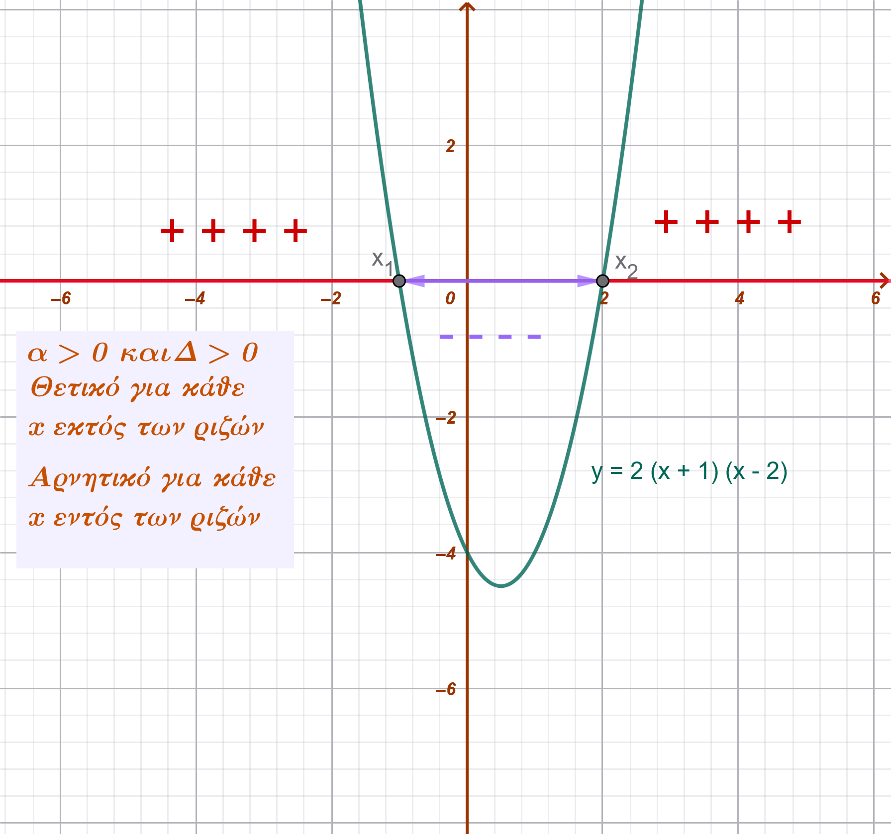{width="292"} 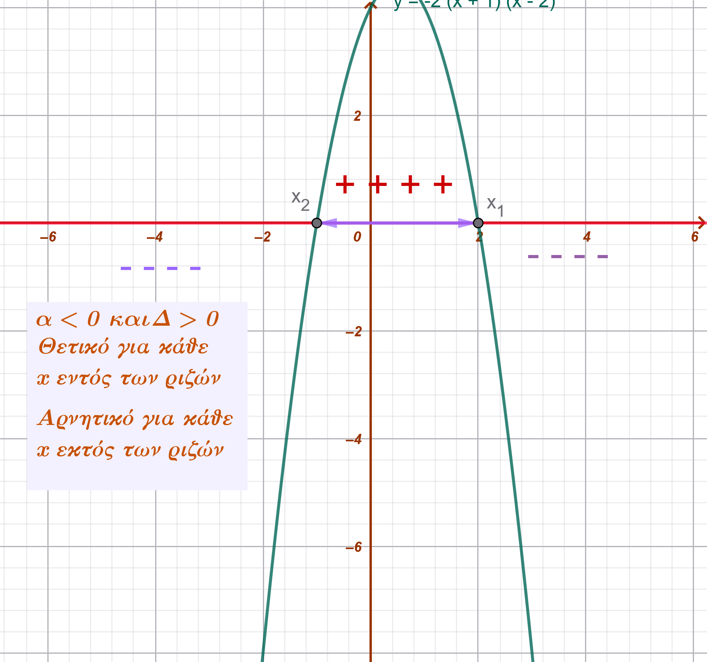{width="298"}\

- **Όταν** $\Delta = 0$: Το τριώνυμο έχει μία διπλή ρίζα $x_0 = -\frac{\beta}{2α}$.
  Το τριώνυμο είναι **ομόσημο του** $α$ για κάθε $x \neq x_0$, ενώ για $x = x_0$ μηδενίζεται.\
  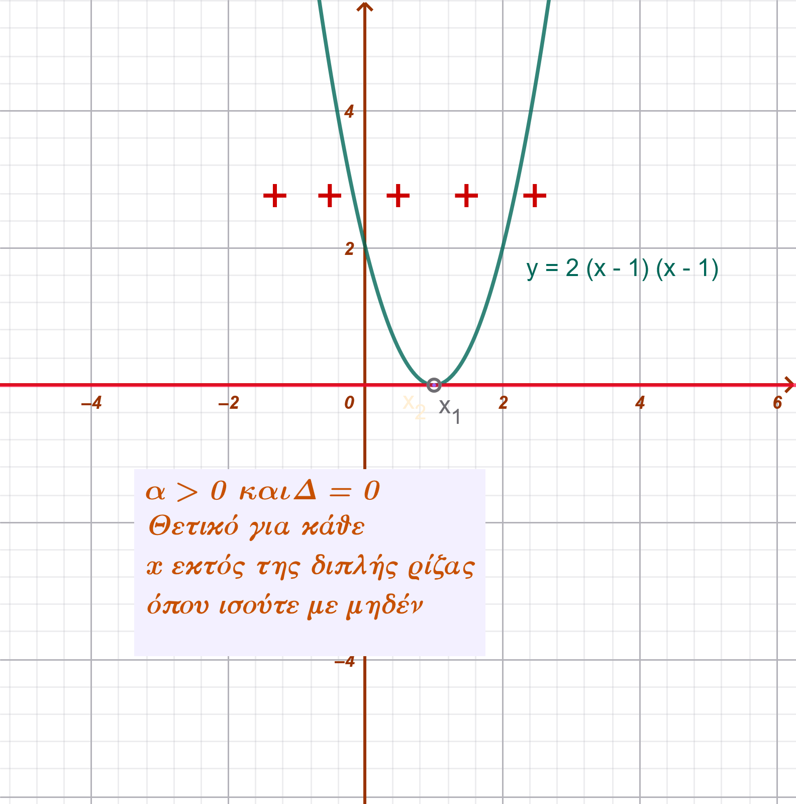{width="302"} 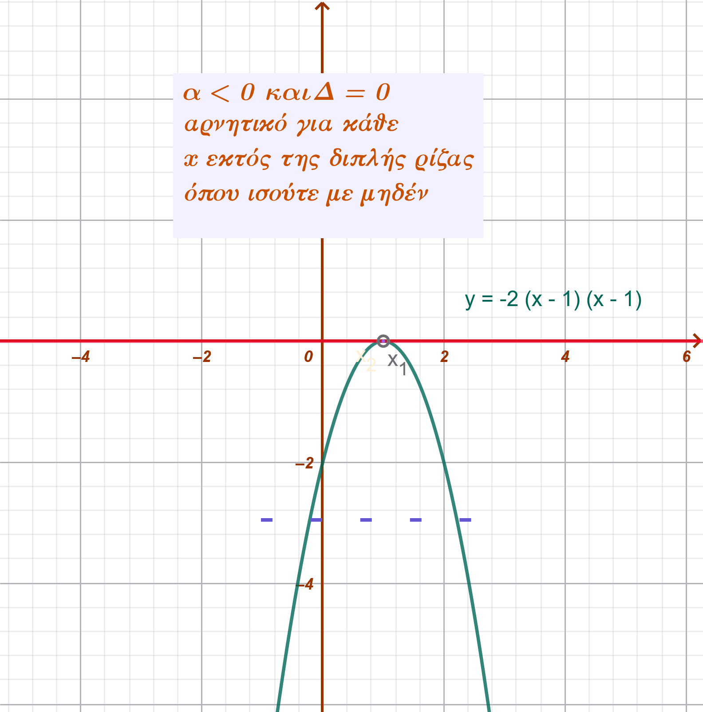{width="305"}

- **Όταν** $\Delta < 0$: Το τριώνυμο δεν έχει πραγματικές ρίζες και είναι **ομόσημο του** $α$ για κάθε πραγματικό αριθμό $x$.\
  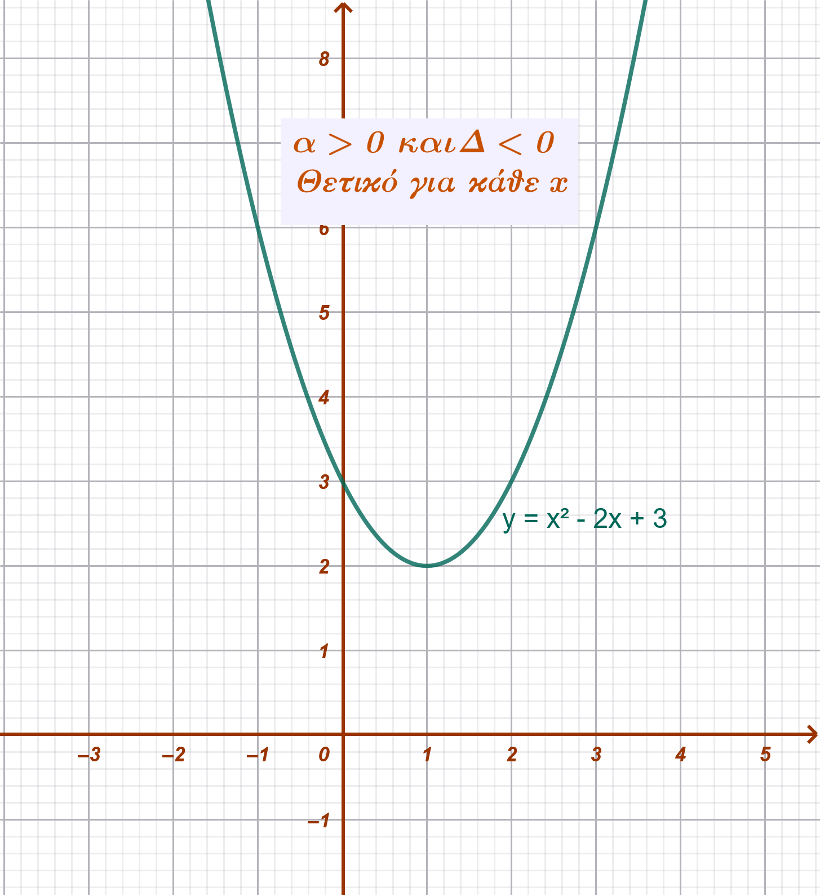{width="292"} 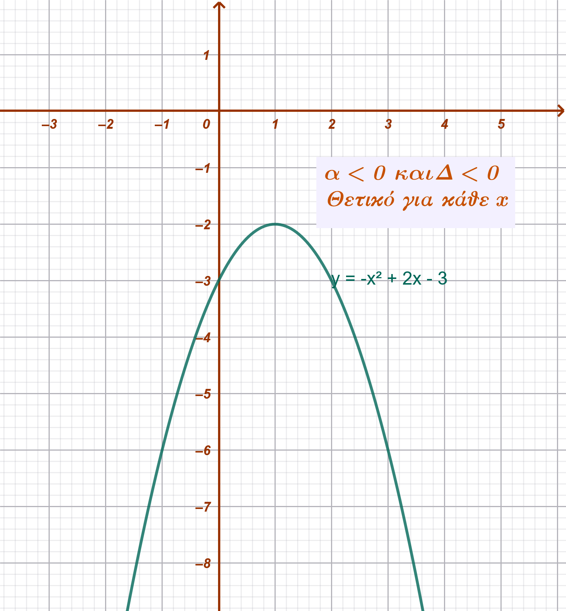{width="294"}
:::

------------------------------------------------------------------------

#### **Παραδείγματα διαφόρων περιπτώσεων**

**Περίπτωση** $\Delta > 0$:

Να λυθεί η ανίσωση $-x^2 + 5x - 6 \ge 0$.

1.  Βρίσκουμε τις ρίζες της εξίσωσης $-x^2 + 5x - 6 = 0$: $\Delta = 1 > 0$, οπότε $x_1 = 2$ και $x_2 = 3$.
2.  Επειδή $α = -1 < 0$, το τριώνυμο είναι θετικό (ετερόσημο του $α$) ανάμεσα στις ρίζες.
3.  **Λύση:** $2 \le x \le 3$ ή $x \in [2,3]$.

**Περίπτωση** $\Delta = 0$:

Να λυθεί η ανίσωση $4x^2 + 4x + 1 > 0$.

1.  $\Delta = 16 - 16 = 0$, οπότε υπάρχει διπλή ρίζα $x_0 = -\dfrac{1}{2}$.
2.  Επειδή $α = 4 > 0$, το τριώνυμο είναι θετικό για κάθε $x \neq -\dfrac{1}{2}$.
3.  **Λύση:** $x \in (-\infty, -\dfrac{1}{2}) \cup (-\dfrac{1}{2}, +\infty)$.

**Περίπτωση** $\Delta < 0$:

Να λυθεί η ανίσωση $x^2 + x + 3 > 0$.

1.  $\Delta = 1 - 12 = -11 < 0$. Το τριώνυμο δεν έχει ρίζες.
2.  Επειδή $α = 1 > 0$, το τριώνυμο είναι θετικό για κάθε $x \in \mathbb{R}$.
3.  **Λύση:** Όλο το $\mathbb{R}$.

**.... να θυμάσαι:** Για κάθε άσκηση, υπολογίστε τη διακρίνουσα $\Delta$, βρείτε τις ρίζες (αν υπάρχουν) και εξετάστε το πρόσημο του $α$ για να προσδιορίσετε το σωστό διάστημα λύσεων.

### Κατασκευή πίνακα προσήμων και γεωμετρική απεικόνιση

::: {.callout-note style="color: #034f84;"}
**Κατασκευή Πίνακα Προσήμων**

Να λυθεί η ανίσωση: $x^2 - 5x + 6 > 0$.

1.  **Εύρεση Ριζών:** Η εξίσωση $x^2 - 5x + 6 = 0$ έχει $\Delta = 1 > 0$ και ρίζες τις $x_1 = 2$ και $x_2 = 3$.

2.  **Πίνακας Προσήμων:** Επειδή $α = 1 > 0$, το τριώνυμο είναι ϑετικό (+) εκτός των ριζών και αρνητικό (-) ανάμεσα.

```{=html}

<style type="text/css">
.tg  {border-collapse:collapse;border-spacing:0;}
.tg td{border-color:black;border-style:solid;border-width:1px;font-family:Arial, sans-serif;font-size:14px;
  overflow:hidden;padding:10px 5px;word-break:normal;}
.tg th{border-color:black;border-style:solid;border-width:1px;font-family:Arial, sans-serif;font-size:14px;
  font-weight:normal;overflow:hidden;padding:10px 5px;word-break:normal;}
.tg .tg-eq2r{background-color:#fe996b;color:#3531ff;font-style:italic;font-weight:bold;text-align:left;vertical-align:top}
.tg .tg-x1k7{background-color:#ffffc7;color:#036400;font-style:italic;font-weight:bold;text-align:left;vertical-align:top}
</style>
<table class="tg"><thead>
  <tr>
    <th class="tg-eq2r">x</th>
    <th class="tg-eq2r">\(- \infty \)  \(\qquad\)   \(\qquad\)  \(\qquad\)  \(2\)  \(\qquad\)   \(\qquad\)        \(\qquad\) \(3\)    \(\qquad\)  \(\qquad\)  \(\qquad\)    \(+ \infty\)</th>
  </tr></thead>
<tbody>
  <tr>
    <td class="tg-x1k7">\(y=x^2-5x+6\)</td>
    <td class="tg-x1k7">     \(\qquad\) \(\qquad\)   ++++\(\qquad\) 0  \(\qquad\) --------  \(\qquad\) 0  \(\qquad\)  ++++++  \(\qquad\)</td>
  </tr>
</tbody>
</table>
```

3.  **Λύση:** $x < 2$ ή $x > 3$.

**Γεωμετρική Απεικόνιση (Γραφική Μέθοδος)**

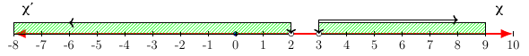
:::

### Συναλήθευση ανισοτήτων $2^{ου}$ βαθμού

::: {.callout-note style="color: #50394c;"}
Η **συναλήθευση** δύο ή περισσότερων ανισώσεων 2ου βαθμού είναι η διαδικασία κατά την οποία αναζητούμε τις **κοινές λύσεις** τους, δηλαδή τις τιμές της μεταβλητής $x$ που επαληθεύουν όλες τις ανισώσεις ταυτόχρονα.

**Μεθοδολογία Επίλυσης**

Για να βρούμε το σύνολο των κοινών λύσεων, ακολουθούμε τα εξής βήματα:

1.  **Λύνουμε κάθε ανίσωση χωριστά**, βρίσκοντας τα διαστήματα λύσεών τους.

2.  **Παριστάνουμε τις λύσεις** των ανισώσεων πάνω στον **ίδιο άξονα** των πραγματικών αριθμών.

3.  Προσδιορίζουμε το διάστημα (ή τα διαστήματα) όπου οι λύσεις **συμπίπτουν** (τομή των συνόλων λύσης).

**Παράδειγμα Συναλήθευσης**

Έστω το σύστημα των ανισώσεων:

1.  $x^2 - 14x + 45 > 0$

2.  $x^2 - 13x + 30 < 0$

**Βήμα 1: Επίλυση της πρώτης ανίσωσης (**$x^2 - 14x + 45 > 0$)\

- Βρίσκουμε τις ρίζες του τριωνύμου $x^2 - 14x + 45 = 0$. Η διακρίνουσα είναι $\Delta = 196 - 180 = 16$, άρα οι ρίζες είναι $x_1 = 5$ και $x_2 = 9$.\
- Επειδή $α = 1 > 0$ και ζητάμε το τριώνυμο να είναι θετικό, οι λύσεις βρίσκονται **έξω από τις ρίζες**: $x < 5$ ή $x > 9$.

**Βήμα 2: Επίλυση της δεύτερης ανίσωσης (**$x^2 - 13x + 30 < 0$)\

- Βρίσκουμε τις ρίζες του τριωνύμου $x^2 - 13x + 30 = 0$. Η διακρίνουσα είναι $\Delta = 169 - 120 = 49$, άρα οι ρίζες είναι $x_1 = 3$ και $x_2 = 10$.\
- Επειδή $α = 1 > 0$ και ζητάμε το τριώνυμο να είναι αρνητικό, οι λύσεις βρίσκονται **ανάμεσα στις ρίζες**: $3 < x < 10$.

**Βήμα 3: Εύρεση κοινών λύσεων στον άξονα** Τοποθετούμε τα αποτελέσματα στον άξονα:\

- Λύσεις (1): $(-\infty, 5) \cup (9, +\infty)$\

  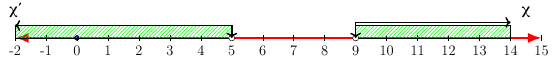

- Λύσεις (2): $(3, 10)$

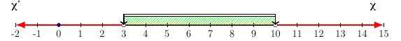

Η τομή των δύο συνόλων (εκεί που συνυπάρχουν οι γραμμές των λύσεων) είναι: $3 < x < 5$ ή $9 < x < 10$.

**Σύνολο Λύσεων:** $x \in (3, 5) \cup (9, 10)$.\

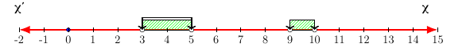\

**Με πίνακα**

\

```{=html}

<style type="text/css">
.tg  {border-collapse:collapse;border-spacing:0;}
.tg td{border-color:black;border-style:solid;border-width:1px;font-family:Arial, sans-serif;font-size:14px;
  overflow:hidden;padding:10px 5px;word-break:normal;}
.tg th{border-color:black;border-style:solid;border-width:1px;font-family:Arial, sans-serif;font-size:14px;
  font-weight:normal;overflow:hidden;padding:10px 5px;word-break:normal;}
.tg .tg-5a8c{background-color:#ffffc7;border-color:inherit;color:#036400;font-style:italic;font-weight:bold;text-align:left;
  vertical-align:top}
.tg .tg-1jwk{background-color:#ecf4ff;border-color:inherit;color:#986536;font-style:italic;font-weight:bold;text-align:left;
  vertical-align:top}
.tg .tg-04m6{background-color:#fe996b;border-color:inherit;color:#3531ff;font-style:italic;font-weight:bold;text-align:left;
  vertical-align:top}
.tg .tg-xwe8{background-color:#9aff99;border-color:inherit;color:#986536;font-style:italic;font-weight:bold;text-align:left;
  vertical-align:top}
.tg .tg-gexs{border-color:inherit;color:#3531ff;font-style:italic;font-weight:bold;text-align:left;vertical-align:top}
</style>
<table class="tg"><thead>
  <tr>
    <th class="tg-04m6">x</th>
    <th class="tg-04m6">\(- \infty \)     \(\qquad\)       \(3\)  \(\qquad\)  \(\qquad\)   \(5\) \(\qquad\)\(\qquad\) \(\qquad\)          \(9\)   \(\qquad\)       \(10\)  \(\qquad\)      \(+ \infty\)</th>
  </tr></thead>
<tbody>
  <tr>
    <td class="tg-5a8c">\(y=x^2-14x+45&gt;0\)</td>
    <td class="tg-5a8c">  ++++++++  +++++  +++++  0   ------  ------  --------  0    ++++++++++++ </td>
  </tr>
  <tr>
    <td class="tg-1jwk">\(y=x^2-13x+30&lt;0\)</td>
    <td class="tg-1jwk">  ++++++++      0   ----------- -------------- ------ ------------------  0 +++++++++++++</td>
  </tr>
  <tr>
    <td class="tg-xwe8"><span style="font-weight:bold;font-style:italic">Σ</span><span style="font-weight:bold">υ</span><span style="font-weight:bold;font-style:italic">ν</span><span style="font-weight:bold">α</span><span style="font-weight:bold;font-style:italic">λ</span><span style="font-weight:bold">ή</span><span style="font-weight:bold;font-style:italic">θ</span><span style="font-weight:bold">ε</span><span style="font-weight:bold;font-style:italic">υ</span><span style="font-weight:bold">σ</span><span style="font-weight:bold;font-style:italic">η</span></td>
    <td class="tg-gexs">\(\qquad\) \(\qquad\)  \(1^η +\) και \( 2^η -\) \(\qquad\) \(\qquad\)\(\qquad\)  \(1^η +\)  και \(2^η -\) \(\qquad\)\(\qquad\)  </td>
  </tr>
</tbody></table>
```

**....Και γραφικά**

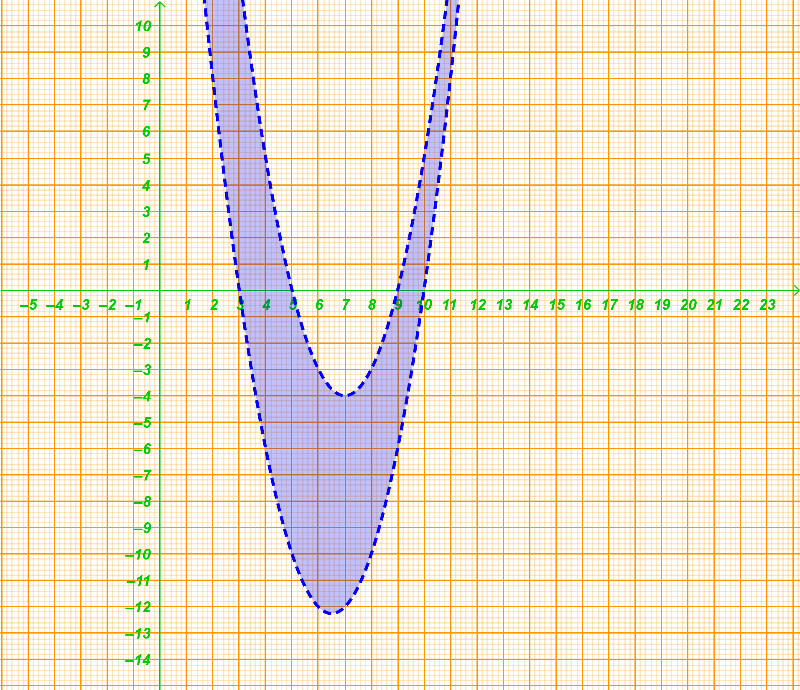{width="645"}

**Δεύτερο Παράδειγμα (Συνοπτικά)**

Να λυθεί το σύστημα:

1.  $3x^2 - x - 2 < 0$

2.  $-2x^2 + x > 0$

**Λύση:**\

- Για την **(1)**: Οι ρίζες είναι $1$ και $-\dfrac{2}{3}$. Το τριώνυμο είναι αρνητικό ανάμεσα στις ρίζες, άρα: $x \in (-\dfrac{2}{3}, 1)$.\
- Για την **(2)**: Οι ρίζες είναι $0$ και $\dfrac{1}{2}$. Επειδή $α = -2 < 0$, το τριώνυμο είναι θετικό ανάμεσα στις ρίζες, άρα: $x \in (0, \dfrac{1}{2})$.\
- **Συναλήθευση:** Οι κοινές λύσεις των δύο διαστημάτων είναι το διάστημα $(0, \dfrac{1}{2})$.
:::

### Ασκήσεις

1.  Να λύσετε τις ανισώσεις

- 

  1.  $x^2 - 2x - 3 > 0$

- 

  2.  $x^2 - 7x + 6 < 0$

- 

  3.  $x^2 - 6x + 9 > 0$

- 

  4.  $x^2 - 2x + 1 \le 0$

- 

  5.  $4x^2 - 20x + 25 < 0$

- 

  6.  $-2x^2 + 3x - 1 < 0$

- 

  7.  $-x^2 - x - 2 > 0$

- 

  8.  $2x^2 - 3x + 1 < 0$

- 

  9.  $x^2 + 4x + 5 \le 0$

- 

  10. $x^2 - 10x + 21 < 0$
  
  
2.  Να μετατρέψετε σε γινόμενα παραγόντων τα τριώνυμα:

  - α.  $x^2 - 5x + 6$
  - β.  $3x^2 + 5x - 2$

3.  Να απλοποιήσετε τις παραστάσεις:

  - α.  $\dfrac{x^2 - 4x + 3}{x^2 - 1}$
  - β.  $\dfrac{3x^2 + 6x - 24}{x^2 - 16}$
  - γ.  $\dfrac{9x^2 - 6x + 1}{3x^2 - 4x + 1}$

4.  Για τις διάφορες τιμές του $x \in \mathbb{R}$, να βρείτε το πρόσημο των τριωνύμων:

  - α.  $x^2 - 6x + 8$
  - β.  $9x^2 - 6x + 1$
  - γ.  $x^2 - 2x + 5$

5.  Για τις διάφορες τιμές του $x \in \mathbb{R}$, να βρείτε το πρόσημο των τριωνύμων:

  - α.  $-x^2 + 5x - 6$
  - β.  $-4x^2 + 12x - 9$
  - γ.  $-x^2 + x - 1$

6.  Να λύσετε τις ανισώσεις:

  - α.  $3x^2 \le 12x$
  - β.  $x^2 - 2x \le 3$

7.  Να λύσετε τις ανισώσεις:

  - α.  $x^2 - 4x + 3 > 0$
  - β.  $3x^2 - 7x + 2 < 0$

8.  Να λύσετε τις ανισώσεις:
  - α.  $x^2 + 16 > 8x$
  - β.  $x^2 + 4 \le 4x$

9.  Να λύσετε τις ανισώσεις:

  - α.  $x^2 + 2x + 10 \le 0$
  - β.  $3x^2 - x + 5 > 0$

10. Να λύσετε την ανίσωση: $-\dfrac{1}{2}(x^2 - 6x + 8) > 0$.

11. Να βρείτε τις τιμές του $x \in \mathbb{R}$ για τις οποίες ισχύει: $x + 2 < x^2 < 2x + 8$.

12. Να βρείτε τις τιμές του $x \in \mathbb{R}$ για τις οποίες συναληθεύουν οι ανισώσεις: $x^2 - 7x + 10 < 0$ και $x^2 - 8x + 7 > 0$.


13. Λύστε τις παραστάσεις $x^2 + xy - 12y^2$ και $x^2 - xy - 6y^2$ σαν εξισώσεις ως προς x και στη συνέχεια:

  - α.  Μετατρέψετε σε γινόμενα παραγόντων τις παραστάσεις: $x^2 + xy - 12y^2$ και $x^2 - xy - 6y^2$.
  - β.  Απλοποιήσετε την παράσταση: $\dfrac{x^2 + xy - 12y^2}{x^2 - xy - 6y^2}$.

14. Να παραγοντοποιήσετε το τριώνυμο: $3x^2 + (3\beta - 2\alpha)x - 2\alpha\beta$.

> βγάλτε την παρένθεση και μετά ομαδοποιήστε .....

15. Να απλοποιήσετε την παράσταση: $\dfrac{x^2 - \beta x + 2\alpha x - 2\alpha\beta}{x^2 - 4\alpha x + 3\alpha^2}$.

16. Δίνεται η εξίσωση $kx^2 + 4kx + k + 3 = 0, k \in \mathbb{R}, k \neq 0$. Να βρείτε τις τιμές του $k$ για τις οποίες η εξίσωση:

  - α.  έχει ρίζες ίσες
  - β.  έχει ρίζες άνισες
  - γ.  είναι αδύνατη.

17. Να βρείτε τις τιμές του $\mu \in \mathbb{R}$ για τις οποίες η ανίσωση $x^2 + 4\mu x + 2\mu > 0$ αληθεύει για κάθε $x \in \mathbb{R}$.

18. Δίνεται το τριώνυμο $(\mu - 1)x^2 - 4\mu x + 2\mu, \mu \neq 1$.

  - α.  Να βρείτε τη διακρίνουσα $\Delta$ του τριωνύμου και να λύσετε την ανίσωση $\Delta < 0$.
  - β.  Να βρείτε τις τιμές του $\mu$ για τις οποίες η ανίσωση $(\mu - 1)x^2 - 4\mu x + 2\mu < 0$ αληθεύει για κάθε $x \in \mathbb{R}$.

19. Σε τετράγωνο $AB\Gamma\Delta$ πλευράς 4, το σημείο $M$ βρίσκεται πάνω στη διαγώνιο $A\Gamma$. Αν $x$ είναι η πλευρά του μικρού τετραγώνου που σχηματίζεται στη γωνία $A$, να βρείτε τις θέσεις του σημείου $M$ για τις οποίες το άθροισμα των εμβαδών των δύο τετραγώνων (του μικρού και του μεγάλου που ορίζεται από το $M$) είναι μεγαλύτερο από 10.

20. Αποδείξτε τα παρακάτω

  - α.  Να αποδείξετε ότι $x^2 + xy + y^2 > 0$ για όλα τα $x, y \in \mathbb{R}$ με $x, y \neq 0$.

> Πολλαπλασιάστε την παράσταση $Π=x^2 + xy + y^2$ με 4 και φτιάξτε άθροισμα τετραγώνων ....

  - β.  Να καθορίσετε το πρόσημο της παράστασης $A = \dfrac{x}{y} + \dfrac{y}{x} + 1$ για τις διάφορες τιμές των $x, y \neq 0$.

> Η παράσταση γίνεται 
    $$A = \frac{x^2 + y^2 + xy}{xy}$$

> Από το ερώτημα 8.i, γνωρίζουμε ότι η παράσταση $x^2 + xy + y^2$ είναι πάντα θετική για κάθε $x, y \neq 0$ 
    Επομένως, το πρόσημο του $A$ εξαρτάται αποκλειστικά από το πρόσημο του παρονομαστή, δηλαδή του γινομένου $xy$.

> **Αν $x, y$ ομόσημοι ($xy > 0$):**
        Τότε $A = \dfrac{\text{θετικός}}{\text{θετικός}} > 0$. Η παράσταση είναι πάντα θετική.
        
> **Αν $x, y$ ετερόσημοι ($xy < 0$):**
        Τότε $A = \dfrac{\text{θετικός}}{\text{αρνητικός}} < 0$. Η παράσταση είναι πάντα αρνητική.
        


------------------------------------------------------------------------

::: {.callout-tip style="color: brown;"}
ΚΑΛΗ ΜΕΛΕΤΗ!
:::

\
\
