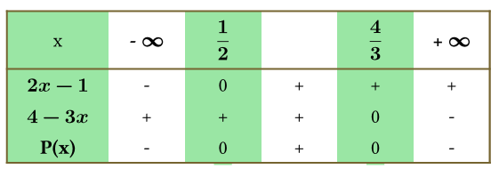
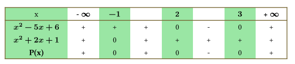
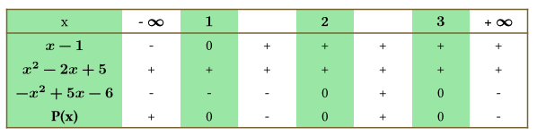
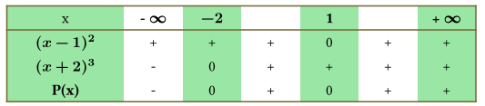
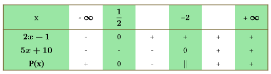

```{=html}
<!-- Φόρτωση βιβλιοθήκης GeoGebra -->
<script src="https://www.geogebra.org/apps/deployggb.js"></script>

<!-- Συνάρτηση δημιουργίας applets -->
<script>
function createGeoGebra(containerId, materialId, width = 700, height = 500) {
  var params = {
    "id": "ggb-" + containerId,
    "material_id": materialId,
    "width": width,
    "height": height,
    "showToolBar": true,
    "showMenuBar": false,
    "showAlgebraInput": true
  };
  
  var applet = new GGBApplet(params, '5.2');
  applet.inject(containerId);
}
</script>
```

## Ανισώσεις γινόμενο και ανισώσεις πηλίκο

### Πρόσημο γινομένου

::: {style="background-color: #d5f4e6; border: 2px solid #2f3e50; color: #25188a; padding: 15px; border-radius: 5px;"}
Η μελέτη του προσήμου ενός γινομένου $P(x) = A(x) \cdot B(x) \cdot \dots \cdot \Phi(x)$ βασίζεται στον προσδιορισμό του προσήμου κάθε παράγοντα ξεχωριστά και τη συνδυαστική τους μελέτη μέσω ενός πίνακα προσήμων.

**Θεωρία και Ορισμοί**

**Έχουμε μάθει ....**

Α.
**Πρόσημο Πρωτοβάθμιου Παράγοντα (**$ax + \beta$, $a \neq 0$):

- Μηδενίζεται για $x = -\dfrac{\beta}{a}$.

- Είναι **ομόσημο του** $a$ για τιμές του $x$ μεγαλύτερες από τη ρίζα ($x > -\dfrac{\beta}{a}$).

- Είναι **ετερόσημο του** $a$ για τιμές του $x$ μικρότερες από τη ρίζα ($x < -\dfrac{\beta}{a}$).

Β.
**Πρόσημο Τριωνύμου (**$ax^2 + \beta x + \gamma$, $a \neq 0$):

Το πρόσημο του τριωνύμου εξαρτάται από τη διακρίνουσα $\Delta = \beta^2 - 4a\gamma$:

- 

  1.  **Αν** $\Delta > 0$: Το τριώνυμο έχει δύο άνισες πραγματικές ρίζες $x_1, x_2$. Είναι **ετερόσημο του** $a$ για $x \in (x_1, x_2)$ (εντός των ριζών) και **ομόσημο του** $a$ εκτός των ριζών.

- 

  2.  **Αν** $\Delta = 0$: Το τριώνυμο έχει μια διπλή πραγματική ρίζα $x_0 = -\frac{\beta}{2a}$. Είναι **ομόσημο του** $a$ για κάθε $x \neq x_0$ και μηδενίζεται για $x = x_0$.

- 

  3.  **Αν** $\Delta < 0$: Το τριώνυμο δεν έχει πραγματικές ρίζες και είναι **ομόσημο του** $a$ για κάθε $x \in \mathbb{R}$.

### Μεθοδολογία Μελέτης Γινομένου

Για να βρούμε το πρόσημο του γινομένου $P(x)$ ακολουθούμε τα εξής βήματα:

1.  **Βρίσκουμε τις ρίζες** κάθε παράγοντα $A(x), B(x), \dots$ λύνοντας τις αντίστοιχες εξισώσεις.

2.  **Κατασκευάζουμε έναν συγκεντρωτικό πίνακα προσήμων** όπου:

    - Στην πρώτη γραμμή τοποθετούμε όλες τις ρίζες κατά αύξουσα σειρά.
    - Σε κάθε επόμενη γραμμή τοποθετούμε το πρόσημο κάθε παράγοντα ξεχωριστά.
    - Στην τελευταία γραμμή υπολογίζουμε το πρόσημο του γινομένου $P(x)$ εφαρμόζοντας τον κανόνα των προσήμων (το γινόμενο είναι θετικό αν το πλήθος των αρνητικών παραγόντων είναι άρτιο, και αρνητικό αν είναι περιττό).
:::

### Παραδείγματα

**Περίπτωση Α: Πρωτοβάθμιοι παράγοντες**

Έστω $P(x) = (2x - 1)(4 - 3x)$.

- Ρίζες: $2x-1=0 \Rightarrow x=1/2$ και $4-3x=0 \Rightarrow x=4/3$.

- Πίνακας: Για $x \in (1/2, 4/3)$, ο πρώτος παράγοντας είναι θετικός και ο δεύτερος θετικός, άρα $P(x) > 0$.
  Για $x < 1/2$ ή $x > 4/3$, οι παράγοντες είναι ετερόσημοι, άρα $P(x) < 0$.\
  {width="390"}

**Περίπτωση Β: Τριώνυμα με** $\Delta > 0$ και $\Delta = 0$

Έστω $P(x) = (x^2 - 5x + 6)(x^2 + 2x + 1)$.

- Το $x^2 - 5x + 6$ έχει ρίζες 2 και 3.

- Το $x^2 + 2x + 1$ έχει διπλή ρίζα το -1.

- Το γινόμενο $P(x)$ είναι θετικό για $x < 2$ (εκτός του -1) και για $x > 3$, ενώ είναι αρνητικό για $x \in (2, 3)$.\
  {width="529"}

**Περίπτωση Γ: Συνδυασμός παραγόντων και τριωνύμου με** $\Delta < 0$

Έστω $P(x) = (x - 1)(x^2 - 2x + 5)(-x^2 + 5x - 6)$.

- Ρίζα $x-1$: $x=1$.
  θετικό για $x>1$

- Τριώνυμο $x^2 - 2x + 5$: $\Delta = -16 < 0$ και $a=1>0$, άρα είναι πάντα θετικό.

- Τριώνυμο $-x^2 + 5x - 6$: $\Delta = 1$ και ρίζες 2, 3.
  Επειδή $a=-1<0$, είναι θετικό στο $(2, 3)$ και αρνητικό αλλού.

- Ο πίνακας δείχνει ότι $P(x) \leq 0$ για $x \in[1,2] \cup [3, +\infty)$.\
  

------------------------------------------------------------------------

### Όταν ένα γινόμενο $P(x)$ περιέχει παράγοντα υψωμένο σε δύναμη,

::: {.callout-note style="color: #034f84;"}
## Με παράγοντες σε δύναμη

η μελέτη του προσήμου του διαφοροποιείται ανάλογα με το αν ο **εκθέτης της δύναμης είναι άρτιος ή περιττός**.

Συγκεκριμένα, ισχύουν οι εξής κανόνες:

#### Παράγοντας με Άρτιο Εκθέτη ($2\nu$)

- **Πρόσημο:** Κάθε πραγματικός αριθμός υψωμένος σε άρτια δύναμη είναι πάντα **μη αρνητικός** ($a^{2\nu} \geq 0$),.
  Αυτό σημαίνει ότι ο παράγοντας αυτός είναι θετικός για κάθε τιμή του $x$, εκτός από τις τιμές που μηδενίζουν τη βάση του,.

- **Επίδραση στο Γινόμενο:** Επειδή ο παράγοντας είναι μόνιμα θετικός (εκτός από τις ρίζες του), **δεν επηρεάζει το πρόσημο του γινομένου** στα διαστήματα μεταξύ των ριζών,.

- **Στον Πίνακα Προσήμων:** Στη γραμμή που αντιστοιχεί σε αυτόν τον παράγοντα, τοποθετούμε το πρόσημο **(+)** σε όλα τα διαστήματα, σημειώνοντας όμως με «0» τη θέση όπου μηδενίζεται η βάση του,.

#### Παράγοντας με Περιττό Εκθέτη ($2\nu+1$)

- **Πρόσημο:** Μια δύναμη με περιττό εκθέτη διατηρεί το **ίδιο πρόσημο με τη βάση της**,.
  Αν η βάση είναι θετική, η δύναμη είναι θετική· αν η βάση είναι αρνητική, η δύναμη είναι αρνητική,.

- **Επίδραση στο Γινόμενο:** Ο παράγοντας αυτός συμπεριφέρεται ακριβώς όπως ο αντίστοιχος πρωτοβάθμιος ή δευτεροβάθμιος παράγοντας χωρίς τη δύναμη.

- **Στον Πίνακα Προσήμων:** Η μελέτη γίνεται κανονικά, όπως θα γινόταν αν ο εκθέτης ήταν η μονάδα (1).

#### Μεθοδολογία και Παρατηρήσεις

Για τη διευκόλυνση της μελέτης ενός γινομένου με δυνάμεις, μπορείτε να ακολουθήσετε τα εξής:

- **Απλοποίηση:** Μπορείτε να θεωρήσετε ότι το γινόμενο $P(x)$ είναι **ομόσημο** με ένα άλλο γινόμενο $P_1(x)$, το οποίο προκύπτει αν παραλείψετε τους παράγοντες με άρτιο εκθέτη και αντικαταστήσετε τους παράγοντες με περιττό εκθέτη από τις βάσεις τους (υψωμένες στην πρώτη δύναμη).

- **Προσοχή στις Ρίζες:** Παρόλο που οι άρτιες δυνάμεις δεν αλλάζουν το πρόσημο, οι τιμές που μηδενίζουν τη βάση τους αποτελούν **ρίζες του συνολικού γινομένου** και πρέπει να συμπεριλαμβάνονται στον τελικό πίνακα,.

- **Παράδειγμα:** Αν έχουμε την παράσταση $P(x) = (x-1)^2(x+2)^3$, ο παράγοντας $(x-1)^2$ είναι πάντα $\geq 0$ και δεν αλλάζει το πρόσημο, ενώ ο $(x+2)^3$ έχει το ίδιο πρόσημο με το $x+2$,.
  Έτσι, το $P(x)$ θα είναι θετικό όταν $x+2 > 0$ (δηλαδή $x > -2$) και αρνητικό όταν $x < -2$, με εξαίρεση την τιμή $x=1$ όπου μηδενίζεται.\
  
:::

### Ανισώσεις της μορφής Α(x) · Β(x) · … · Φ(x) \> 0 (\< 0)

::: {.callout-note style="color: #034f84;"}
## Ανισώσεις με γινόμενα

κάνουμε εφαρμογή των όσων είπαμε παραπάνω
:::

### Ανισώσεις της μορφής $\dfrac{A(x)}{B(x)}>0 \quad η \quad (<0), (\ge 0), (\le 0)$

::: {.callout-note style="color: #034f84;"}
## Ανισώσεις με κλάσματα

Η επίλυση των ανισώσεων με κλάσματα (ρητές ανισώσεις) βασίζεται στην αρχή ότι **το πηλίκο δύο αριθμών έχει το ίδιο πρόσημο με το γινόμενό τους**.
Η μεθοδολογία ακολουθεί τα εξής βασικά βήματα:

**Περιορισμοί (Πεδίο Ορισμού)**

Πριν από οποιαδήποτε πράξη, πρέπει να εξασφαλίσουμε ότι η ανίσωση ορίζεται.
Απαιτούμε **ο παρονομαστής να είναι διάφορος του μηδέν** ($B(x) \neq 0$).
Οι τιμές που μηδενίζουν τον παρονομαστή εξαιρούνται πάντα από τις λύσεις.

**Μετατροπή σε Μορφή Πηλίκου με το Μηδέν**

Αν η ανίσωση δεν είναι ήδη στη μορφή $\dfrac{A(x)}{B(x)} > 0$ (ή $<, \geq, \leq$), τότε:

- **Μεταφέρουμε όλους τους όρους στο πρώτο μέλος**, ώστε το δεύτερο μέλος να γίνει μηδέν.

- **Κάνουμε τα κλάσματα ομώνυμα** και εκτελούμε τις πράξεις στον αριθμητή, ώστε να καταλήξουμε σε ένα ενιαίο κλάσμα.

- **ΠΡΟΣΟΧΗ:** Δεν κάνουμε **ποτέ απαλοιφή παρονομαστών** (χιαστί πολλαπλασιασμό), διότι το πρόσημο του παρονομαστή μπορεί να αλλάζει ανάλογα με το $x$, γεγονός που θα επηρέαζε τη φορά της ανίσωσης.

**Μετατροπή σε Ανίσωση Γινομένου**

Επειδή το πηλίκο $\dfrac{A(x)}{B(x)}$ είναι ομόσημο του γινομένου $A(x) \cdot B(x)$, η ανίσωση μετατρέπεται ως εξής:

- $\dfrac{A(x)}{B(x)} > 0 \iff A(x) \cdot B(x) > 0$

- $\dfrac{A(x)}{B(x)} \geq 0 \iff A(x) \cdot B(x) \geq 0$ **με τον περιορισμό** $B(x) \neq 0$.

**Πίνακας Προσήμων**

Λύνουμε την ανίσωση γινομένου που προέκυψε χρησιμοποιώντας **πίνακα προσήμων**:

- Βρίσκουμε τις ρίζες του αριθμητή $A(x)$ και του παρονομαστή $B(x)$.

- Τοποθετούμε τις ρίζες σε αύξουσα σειρά στον πίνακα.

- Προσδιορίζουμε το πρόσημο κάθε παράγοντα χωριστά.

- Στην τελευταία γραμμή, βρίσκουμε το πρόσημο του κλάσματος.
  Στις τιμές που μηδενίζεται ο παρονομαστής, βάζουμε **διπλή γραμμή** (\|\|), που σημαίνει ότι η παράσταση δεν ορίζεται εκεί.

**Τελική Λύση**

Επιλέγουμε τα διαστήματα που ικανοποιούν την ανίσωση (θετικά ή αρνητικά), προσέχοντας να **εξαιρέσουμε τις ρίζες του παρονομαστή** ακόμα και αν η ανίσωση περιλαμβάνει το σύμβολο της ισότητας ($\geq$ ή $\leq$).

**Παράδειγμα:** Στην ανίσωση $\dfrac{2x-1}{5x+10} > 0$, ο παρονομαστής μηδενίζεται στο $x=-2$, οπότε αυτό το σημείο εξαιρείται με διπλή γραμμή στον πίνακα, και η ανίσωση λύνεται ως $(2x-1)(5x+10) > 0$.\

\


Άρα $\dfrac{2x-1}{5x+10} > 0$ για $x \in (- \infty,\dfrac{1}{2})\cup(-2,+\infty)$
:::

### Η επίλυση ανισώσεων που περιέχουν **απόλυτα και τριώνυμα μαζί**

::: {.callout-note style="color: #034f84;"}
## Ανισώσεις με απόλυτα

απαιτεί τον συνδυασμό των ιδιοτήτων των απόλυτων τιμών με τη θεωρία προσήμου του τριωνύμου.
Η μεθοδολογία εξαρτάται από τη μορφή της ανίσωσης και ακολουθεί τρεις βασικούς δρόμους:

**Χρήση Βασικών Ιδιοτήτων (Για μορφές** $|f(x)| < \theta$ ή $|f(x)| > \theta$)

Αν η ανίσωση έχει το απόλυτο απομονωμένο στο ένα μέλος και έναν αριθμό ή παράσταση στο άλλο, χρησιμοποιούμε τις εξής ισοδυναμίες (για $\theta > 0$):\

- $|f(x)| < \theta \iff -\theta < f(x) < \theta$: Δημιουργείται ένα σύστημα δύο ανισώσεων που πρέπει να **συναληθεύουν**.\
- $|f(x)| > \theta \iff f(x) < -\theta$ ή $f(x) > \theta$: Η τελική λύση είναι η **ένωση** των λύσεων των δύο ανισώσεων.\
- **Παράδειγμα:** Στην ανίσωση $|x^2 - 5x + 5| < 1$, θα λύναμε το σύστημα $-1 < x^2 - 5x + 5 < 1$.

**Μέθοδος Τετραγωνισμού (Για μορφές** $|f(x)| < |g(x)|$)

Όταν υπάρχουν απόλυτα και στα δύο μέλη, και επειδή οι απόλυτες τιμές είναι μη αρνητικές, μπορούμε να **υψώσουμε στο τετράγωνο** για να απαλλαγούμε από τα απόλυτα (αφού $|a| < |b| \iff a^2 < b^2$).\
\* Η ανίσωση μετατρέπεται σε $f^2(x) < g^2(x) \iff (f(x) - g(x))(f(x) + g(x)) < 0$.\
\* Αυτή η μορφή οδηγεί συχνά σε τριώνυμα ή γινόμενα παραγόντων που μελετώνται με **πίνακα προσήμων**.

**Διαχωρισμός Περιπτώσεων (Η Γενική Μέθοδος)**

Αν ο άγνωστος $x$ υπάρχει και έξω από το απόλυτο ή αν υπάρχουν περισσότερα από ένα απόλυτα, ακολουθούμε τη διαδικασία **εξαγωγής των απολύτων**:

1.  **Βρίσκουμε τις ρίζες** των παραστάσεων που βρίσκονται μέσα στα απόλυτα (π.χ. αν έχουμε $|x^2-x|$, οι ρίζες του τριωνύμου είναι 0 και 1).

2.  **Χωρίζουμε το** $\mathbb{R}$ σε διαστήματα με βάση αυτές τις ρίζες.

3.  **Σε κάθε διάστημα ξεχωριστά**, αντικαθιστούμε το απόλυτο με την παράσταση ή την αντίθετή της, ανάλογα με το αν είναι θετική ή αρνητική σε αυτό το διάστημα.

4.  **Λύνουμε την ανίσωση** που προκύπτει (η οποία είναι πλέον ένα απλό τριώνυμο) και **συναληθεύουμε** το αποτέλεσμα με τον περιορισμό του διαστήματος στο οποίο εργαζόμαστε.

5.  Η **τελική λύση** είναι η ένωση των δεκτών λύσεων από όλες τις περιπτώσεις.
:::

------------------------------------------------------------------------

### Ασκήσεις

Α.  Να βρεθεί το πρόσημο των παρακάτω παραστάσεων για τις διάφορες τιμές του $x \in \mathbb{R}$:

1.  $P(x) = (x + 1)^2(x + 3)^2(2x + 4)$

2.  $P(x) = (2x - 3)(x + 2)(x + 1)^3(x - 5)$

3.  $P(x) = (x^2 + 3x + 2)(x + 1)(x^2 - 5x + 6)(x - 3)$

4.  $P(x) = (x^2 - 4x + 3)(x^2 + 6x + 9)$

5.  $P(x) = (x - 2)(x^2 + x + 1)(x^2 - 7x + 12)$

6.  $P(x) = (x - 1)^3(x^2 - 6x + 9)(x^2 - 3x)(x^2 + 3x + 5)$

7.  $P(x) = (x^2 - 16)(x^2 - 6x + 8)(2 - x)$

8.  $P(x) = (2x^2 - 7x - 4)(3x^2 - 16x + 5)$

9.  $P(x) = (x - 2)(x + 2x - 8)(x + x + 1)$

10. $P(x) = (2x - 1)(-x^2 + 2x - 1)(x + 1)$

Β.  Να βρείτε το πρόσημο των παρακάτω παραστάσεων $P(x)$ για τις διάφορες τιμές του $x \in \mathbb{R}$:

1.  $P(x) = (x + 1)^2(x + 3)^2(2x + 4)$
2.  $P(x) = (2x - 3)(x + 2)(x + 1)^3(x - 5)$
3.  $P(x) = (x + 1)^2(2x^2 + 1)(x^2 + 3x + 5)(x - 2)$
4.  $P(x) = (x^2 + 3x + 2)(x + 1)(x^2 - 5x + 6)(x - 3)$
5.  $P(x) = (2x - 5)(x^2 - 6x + 8)(x^2 - 5x + 4)$
6.  $P(x) = (2x^2 - 7x - 4)(3x^2 - 16x + 5)$
7.  $P(x) = (3 - x)(x^2 - 4x + 3)$
8.  $P(x) = (x - 1)(x^2 - x + 2)(2 - x)$
9.  $P(x) = (x + 2)(2x - 1)(x^2 - 6x)$
10. $P(x) = (x - 1)^2(x - 4)(x^2 - 3x + 2)$

Γ.  Να λύσετε στο $\mathbb{R}$ τις παρακάτω ανισώσεις:

1.  $(x - 1)(x + 1)(x + 2)(3x - 1) \leq 0$ *(Γινόμενο τεσσάρων πρωτοβάθμιων παραγόντων)*

2.  $(x^2 - 3x + 2)(x^2 + 5x + 6) > 0$ *(Γινόμενο δύο τριωνύμων με διακρίνουσα* $\Delta > 0$)

3.  $(x - 2)(x^2 + x + 1)(x^2 - 7x + 12) < 0$ *(Περιέχει τριώνυμο με* $\Delta < 0$, το οποίο διατηρεί σταθερό πρόσημο)

4.  $(x - 1)^2(x + 1) > 0$ *(Περιέχει παράγοντα με άρτια δύναμη που επηρεάζει μόνο τις ρίζες)*

5.  $(x - 1)^3(x - 2)(x + 3)(x - 3) > 0$ *(Περιέχει παράγοντα με περιττή δύναμη, ο οποίος συμπεριφέρεται ως πρωτοβάθμιος)*

6.  $(2x^2 + 3)(x + 1)(x - 2)(3x^2 - 10x + 3)(x^2 + 1) < 0$ *(Σύνθετη μορφή με παράγοντες που δεν μηδενίζονται ποτέ)*

7.  $(x - 1)(x + 1)^3 x^2 (2x + 1)(x^2 + x + 3) > 0$ *(Συνδυασμός δυνάμεων και τριωνύμων χωρίς πραγματικές ρίζες)*

8.  $(x - 1)(x^2 - 2x + 5)(-x^2 + 5x - 6) \leq 0$ *(Μελέτη προσήμου με τριώνυμο που έχει αρνητικό συντελεστή* $a$)

9.  $(2x - 1)(-x^2 + 2x - 1)(x + 1) > 0$ *(Περιέχει τριώνυμο που είναι τέλειο τετράγωνο με αρνητικό συντελεστή)*

10. $(x - 2)(x^2 - 7x + 6)(-x^2 - 2x + 8)(x - 1) > 0$ *(Γινόμενο πολλών παραγόντων που απαιτούν παραγοντοποίηση)*

Δ.  Να λύσετε στο $\mathbb{R}$ τις παρακάτω ανισώσεις:

1.  $\dfrac{x + 1}{7 - x} > 2$

> *(Απαιτείται μεταφορά του 2 στο πρώτο μέλος και μετατροπή σε ομώνυμα κλάσματα)*.

2.  $\dfrac{x^2 - 10x + 16}{x - 2} < 0$

> *(Προσοχή στην εξαίρεση της τιμής που μηδενίζει τον παρονομαστή)*.

3.  $\dfrac{3x + 5}{3x - 7} < 0$

> *(Βασική μορφή πηλίκου δύο πρωτοβάθμιων παραγόντων)*.

4.  $\dfrac{x^2 - x + 1}{x^2 + x + 2} \leq 2$

> *(Περιλαμβάνει τριώνυμα· ελέγξτε αν κάποιο έχει διακρίνουσα* $\Delta < 0$).

5.  $\dfrac{4x - 1}{23x - x^2} \geq 0$

> *(Παραγοντοποιήστε τον παρονομαστή για να βρείτε τις ρίζες του)*.

6.  $\dfrac{x^2 + 10x + 21}{2x^2 + 12x + 18} > 0$

> *(Συνδυασμός δύο τριωνύμων· εξετάστε αν υπάρχουν διπλές ρίζες ή κοινοί παράγοντες)*.

7.  $\dfrac{-15x^2 + x + 2}{2x^2 - x + 5} > 0$

> *(Περιέχει τριώνυμο με αρνητικό συντελεστή* $\alpha$).

8.  $\dfrac{x^2 - 5x + 6}{x - 3} > 5$

> *(Μην κάνετε απαλοιφή παρονομαστή· μεταφέρετε το 5 στο πρώτο μέλος)*.

9.  $\dfrac{4x - 3}{9x^2 - 4} - \dfrac{1}{3x + 2} - \dfrac{3}{2 - 3x} < 0$

> *(Απαιτείται ανάλυση των παρονομαστών σε γινόμενο και εύρεση Ε.Κ.Π.)*.

10. $\dfrac{x + 8}{x^2 + 1} < \dfrac{2x + 6}{2x^2 - 5x + 3}$

> *(Πιο σύνθετη μορφή που απαιτεί προσεκτικές πράξεις για τη δημιουργία ενός ενιαίου κλάσματος)*.

Ε.  Λύστε τις παρακάτω ασκήσεις

1.  **Εξίσωση με απόλυτα και κλάσματα:** Να λύσετε την εξίσωση: $\dfrac{|x+1|}{|x-2|} = \dfrac{1}{2}$.

> *(Υπόδειξη: Θέστε τους περιορισμούς για τον παρονομαστή και χρησιμοποιήστε την ιδιότητα* $|a|=|b| \iff a=b$ ή $a=-b$).

2.  **Υπολογισμός τιμής παράστασης:** Για κάθε πραγματικό αριθμό $x$ με την ιδιότητα $5 < x < 10$, να υπολογίσετε την τιμή της παράστασης: $A = \dfrac{x-5}{|x-5|} + \dfrac{x-10}{|x-10|}$.

> *(Υπόδειξη: Εξετάστε το πρόσημο των παραστάσεων μέσα στα απόλυτα βάσει του περιορισμού του* $x$).

3.  **Αποδεικτική άσκηση (Ανισότητα):** Αν $a, \beta \in \mathbb{R} - \{0\}$, να αποδείξετε ότι: $\dfrac{|a|}{|\beta|} + \dfrac{|\beta|}{|a|} \geq 2$.

> *(Υπόδειξη: Μπορείτε να χρησιμοποιήσετε την ιδιότητα ότι για κάθε θετικό αριθμό* $t$ ισχύει $t + \dfrac{1}{t} \geq 2$).

4.  **$\displaystyle \frac{|x+1|}{|x+2|} \leq 1$**
    
  > *(Υπόδειξη: Θέστε τον περιορισμό $x \neq -2$. Μπορείτε να μεταφέρετε το 1 στο πρώτο μέλος και να κάνετε τα κλάσματα ομώνυμα ή, επειδή οι όροι είναι μη αρνητικοί, να χρησιμοποιήσετε την ιδιότητα $|a| \leq |b| \iff a^2 \leq b^2$)*.

5.  **$\displaystyle \left| \frac{3x-4}{2x-5} \right| < 2$**
 
 > *(Υπόδειξη: Πρέπει $x \neq 5/2$. Η ανίσωση είναι ισοδύναμη με $\frac{|3x-4|}{|2x-5|} < 2$, η οποία οδηγεί στην $|3x-4| < 2|2x-5|$. Λύνεται είτε με ύψωση στο τετράγωνο είτε με πίνακα προσήμων για τις απόλυτες τιμές)*.

6.  **$\displaystyle \frac{1 - |x|}{|2x - 1| - 3} > 1$**
 
 >  *(Υπόδειξη: Βρείτε τις τιμές που μηδενίζουν τις παραστάσεις μέσα στα απόλυτα ($x=0$ και $x=1/2$) καθώς και τις τιμές που μηδενίζουν τον παρονομαστή. Χρησιμοποιήστε τη μέθοδο των διαστημάτων (πίνακας προσήμων) για να απαλλαγείτε από τα απόλυτα σε κάθε διάστημα χωριστά)*.

7.  **$\displaystyle \frac{|x - 4|}{3} + \frac{|4 - x|}{2} < \frac{|2x - 8|}{4} + 1$**
    *(Υπόδειξη: Παρατηρήστε ότι $|4-x| = |x-4|$ και $|2x-8| = 2|x-4|$. Η ανίσωση μπορεί να απλοποιηθεί σημαντικά αν θέσετε $|x-4| = \omega$ και λύσετε πρώτα ως προς $\omega$)*.


------------------------------------------------------------------------

::: {.callout-tip style="color: brown;"}
ΚΑΛΗ ΜΕΛΕΤΗ!
:::

\
\
