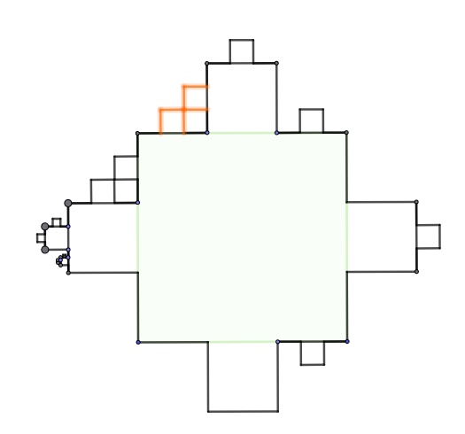

```{=html}
<!-- Φόρτωση βιβλιοθήκης GeoGebra -->
<script src="https://www.geogebra.org/apps/deployggb.js"></script>

<!-- Συνάρτηση δημιουργίας applets -->
<script>
function createGeoGebra(containerId, materialId, width = 700, height = 500) {
  var params = {
    "id": "ggb-" + containerId,
    "material_id": materialId,
    "width": width,
    "height": height,
    "showToolBar": true,
    "showMenuBar": false,
    "showAlgebraInput": true
  };
  
  var applet = new GGBApplet(params, '5.2');
  applet.inject(containerId);
}
</script>
```

## Γεωμετρική πρόοδος

### Τι είναι μια γεωμετρική πρόοδος

::: {style="background-color: #d5f4e6; border: 2px solid #2f3e50; color: #25188a; padding: 15px; border-radius: 5px;"}
**Γεωμετρική πρόοδος** ονομάζεται μια ακολουθία $(\alpha_\nu)$ στην οποία **κάθε όρος της, με εξαίρεση τον πρώτο, προκύπτει από τον προηγούμενό του με πολλαπλασιασμό του ίδιου πάντοτε μη μηδενικού αριθμού** $\lambda$.

#### **Θεωρία και Ορισμοί**

- **Ο λόγος (**$\lambda$): Ο σταθερός αριθμός $\lambda$ ονομάζεται **λόγος της γεωμετρικής προόδου** και δίνεται από τον τύπο $\lambda = \dfrac{\alpha_{\nu+1}}{\alpha_\nu}$.

- **Αναδρομικός τύπος:** Η σχέση που συνδέει δύο διαδοχικούς όρους είναι $\alpha_{\nu+1} = \alpha_\nu \cdot \lambda$.

- **Γενικός (ν-οστός) όρος:** Ο τύπος που επιτρέπει τον υπολογισμό οποιουδήποτε όρου $\alpha_\nu$ της προόδου, αν γνωρίζουμε τον πρώτο όρο $\alpha_1$ και τον λόγο $\lambda$, είναι ο $\alpha_\nu = \alpha_1 \cdot \lambda^{\nu-1}$.

- **Γεωμετρικός Μέσος:** Τρεις αριθμοί $\alpha, \beta, \gamma$ είναι διαδοχικοί όροι γεωμετρικής προόδου αν και μόνο αν ισχύει η σχέση $\beta^2 = \alpha \cdot \gamma$.
  Ο θετικός αριθμός $\sqrt{\alpha\gamma}$ ονομάζεται γεωμετρικός μέσος των $\alpha$ και $\gamma$.

- **Άθροισμα ν πρώτων όρων (**$S_\nu$):

  - Αν $\lambda \neq 1$, τότε $S_\nu = \alpha_1 \dfrac{\lambda^\nu - 1}{\lambda - 1}$.
  - Αν $\lambda = 1$ (σταθερή πρόοδος), τότε $S_\nu = \nu \cdot \alpha_1$.
:::

### Παραδείγματα διαφόρων περιπτώσεων

1.  **Εύρεση όρου:** Στη γεωμετρική πρόοδο $3, 6, 12, \dots$ έχουμε $\alpha_1 = 3$ και $\lambda = 6/3 = 2$. Για να βρούμε τον 8ο όρο: $\alpha_8 = 3 \cdot 2^{8-1} = 3 \cdot 2^7 = 384$.
2.  **Εύρεση παραμέτρου:** Για να αποτελούν οι αριθμοί $x-2, 2x, 7x+4$ διαδοχικούς όρους γεωμετρικής προόδου, πρέπει $(2x)^2 = (x-2)(7x+4)$. Από τη λύση της εξίσωσης $3x^2 - 10x - 8 = 0$ προκύπτει $x = 4$.
3.  **Υπολογισμός αθροίσματος:** Στην πρόοδο $1, 3, 9, \dots, 19683$ έχουμε $\alpha_1 = 1$ και $\lambda = 3$. Για να βρούμε το άθροισμα, βρίσκουμε πρώτα το πλήθος των όρων: $19683 = 1 \cdot 3^{\nu-1} \implies 3^9 = 3^{\nu-1} \implies \nu = 10$. Τότε $S_{10} = \dfrac{3^{10} - 1}{3-1} = 29524$.
4.  **Πρόβλημα εφαρμογής:** Σε ένα τουρνουά τένις με 512 παίκτες (νοκ άουτ), ο αριθμός των παικτών που συνεχίζουν ακολουθεί γεωμετρική πρόοδο με $\alpha_1 = 512$ και $\lambda = 1/2$. Ο παίκτης που φτάνει στον τελικό (όπου μένουν 2 παίκτες, άρα $\alpha_\nu = 2$) έχει δώσει συνολικά 9 αγώνες.

------------------------------------------------------------------------

::: {.callout-note style="color: #034f84;"}
## πως προκύπτει ο τύπος του γενικού όρου;

Ο τύπος του **γενικού (ν-οστού) όρου** μιας γεωμετρικής προόδου, $\alpha_\nu = \alpha_1 \cdot \lambda^{\nu-1}$, προκύπτει από τον ορισμό της προόδου μέσω της **μεθόδου του πολλαπλασιασμού κατά μέλη** των αναδρομικών της σχέσεων.

Σύμφωνα με τον ορισμό, κάθε όρος της προόδου προκύπτει από τον προηγούμενό του με πολλαπλασιασμό επί τον σταθερό λόγο $\lambda$.

Έτσι, μπορούμε να γράψουμε τις παρακάτω διαδοχικές ισότητες:\
\* $\alpha_2 = \alpha_1 \cdot \lambda$\
\* $\alpha_3 = \alpha_2 \cdot \lambda$\
\* $\alpha_4 = \alpha_3 \cdot \lambda$\
\* ...\
\* $\alpha_{\nu-1} = \alpha_{\nu-2} \cdot \lambda$\
\* $\alpha_\nu = \alpha_{\nu-1} \cdot \lambda$.

Συνολικά έχουμε $\nu-1$ τέτοιες ισότητες.

Αν τις **πολλαπλασιάσουμε κατά μέλη**, προκύπτει η εξής σχέση:

$\alpha_2 \cdot \alpha_3 \cdot \alpha_4 \cdot \dots \cdot \alpha_\nu = (\alpha_1 \cdot \alpha_2 \cdot \alpha_3 \cdot \dots \cdot \alpha_{\nu-1}) \cdot (\lambda \cdot \lambda \cdot \dots \cdot \lambda)$,.

Στο δεξιό μέλος της εξίσωσης, ο λόγος $\lambda$ εμφανίζεται ως παράγοντας $\nu-1$ φορές, γεγονός που συμβολίζεται ως $\lambda^{\nu-1}$.

Παρατηρούμε ότι οι όροι $\alpha_2, \alpha_3, \dots, \alpha_{\nu-1}$ εμφανίζονται και στα δύο μέλη του γινομένου.

Εφόσον οι όροι της προόδου είναι μη μηδενικοί, μπορούμε να τους **απλοποιήσουμε** (να τους διαγράψουμε),.

Μετά την απλοποίηση, στο αριστερό μέλος απομένει μόνο ο όρος $\alpha_\nu$ και στο δεξιό μέλος το γινόμενο $\alpha_1 \cdot \lambda^{\nu-1}$.
Έτσι, καταλήγουμε στον τύπο του γενικού όρου: $\alpha_\nu = \alpha_1 \cdot \lambda^{\nu-1}$.

Ο τύπος αυτός είναι ιδιαίτερα χρήσιμος διότι επιτρέπει τον υπολογισμό οποιουδήποτε όρου της προόδου αν γνωρίζουμε μόνο τον πρώτο όρο $\alpha_1$ και τον λόγο $\lambda$, χωρίς να χρειάζεται να βρούμε όλους τους ενδιάμεσους όρους.
:::

------------------------------------------------------------------------

::: {.callout-note style="color: #6A5ACD;"}
## Το άθροισμα των πρώτων $\nu$ όρων ($S_\nu$) μιας γεωμετρικής προόδου

Σε μια γεωμετρική πρόοδο με πρώτο όρο $\alpha_1$ και λόγο $\lambda$, το άθροισμα υπολογίζεται ως εξής:

- **Αν** $\lambda \neq 1$: $S_\nu = \alpha_1 \dfrac{\lambda^\nu - 1}{\lambda - 1}$.

- **Αν** $\lambda = 1$ (σταθερή πρόοδος): $S_\nu = \nu \cdot \alpha_1$.

**Πώς προκύπτει ο τύπος (για** $\lambda \neq 1$):

Χρησιμοποιούμε τη σχέση $S_\nu = \alpha_1 + \alpha_1\lambda + \alpha_1\lambda^2 + \dots + \alpha_1\lambda^{\nu-1}$ (1).
Πολλαπλασιάζουμε και τα δύο μέλη της (1) με τον λόγο $\lambda$: $\lambda S_\nu = \alpha_1\lambda + \alpha_1\lambda^2 + \dots + \alpha_1\lambda^\nu$ (2).

Αφαιρώντας την (1) από την (2) κατά μέλη, οι ενδιάμεσοι όροι διαγράφονται και μένει: $\lambda S_\nu - S_\nu = \alpha_1\lambda^\nu - \alpha_1 \implies S_\nu(\lambda - 1) = \alpha_1(\lambda^\nu - 1)$.
Λύνοντας ως προς $S_\nu$, καταλήγουμε στον τύπο: $S_\nu = \alpha_1 \frac{\lambda^\nu - 1}{\lambda - 1}$.

Εναλλακτικά, ο τύπος μπορεί να προκύψει από τη γνωστή ταυτότητα $\lambda^\nu - 1 = (\lambda - 1)(\lambda^{\nu-1} + \lambda^{\nu-2} + \dots + 1)$, πολλαπλασιάζοντας με $\alpha_1$.
:::

------------------------------------------------------------------------

### Ασκήσεις

1.  Να βρείτε τον 7ο όρο της γεωμετρικής προόδου $2, 6, 18, \dots$.

2.  Να βρείτε τον 10ο όρο της γεωμετρικής προόδου $1, -2, 4, \dots$.

3.  Σε γεωμετρική πρόοδο ισχύει $\alpha_4 = 125$ και $\alpha_{10} = 125/64$.
    Να βρεθεί ο 14ος όρος.

4.  Να βρείτε τον πρώτο όρο $\alpha_1$ μιας προόδου αν ο 5ος όρος είναι $32/3$ και ο λόγος $\lambda = 2$.

5.  Να βρείτε τον λόγο $\lambda$ μιας γεωμετρικής προόδου αν $\alpha_3 = 12$ και $\alpha_6 = 96$.

6.  Να προσδιορίσετε το $x$ ώστε οι αριθμοί $x, x+1, x+3$ να είναι διαδοχικοί όροι γεωμετρικής προόδου.

7.  Για ποια τιμή του $x$ οι αριθμοί $x+4, 2-x, 6-x$ αποτελούν διαδοχικούς όρους γεωμετρικής προόδου;.

8.  Να βρεθεί ο $x$ ώστε οι αριθμοί $x, 2x+1, 5x+4$ να είναι διαδοχικοί όροι γεωμετρικής προόδου.

9.  Να υπολογίσετε το άθροισμα $2 + 8 + 32 + \dots + 8192$.

10. Να βρείτε το άθροισμα των 10 πρώτων όρων της προόδου $1, -2, 4, \dots$.

11. Το άθροισμα των $\nu$ πρώτων όρων μιας ακολουθίας είναι $S_\nu = 2(3^\nu - 1)$.
    Να δείξετε ότι είναι γεωμετρική πρόοδος και να βρείτε τον $\alpha_1$ και τον $\lambda$.

12. Σε γεωμετρική πρόοδο το άθροισμα των 4 πρώτων όρων είναι 15 και των 8 πρώτων όρων είναι 255.
    Βρείτε τον $\alpha_1$ και τον $\lambda$.

13. Να παρεμβάλετε 4 γεωμετρικούς ενδιάμεσους μεταξύ των αριθμών 5 και 160.

14. Αν ένα κύτταρο διασπάται κάθε μέρα σε δύο, πόσα κύτταρα θα υπάρχουν μετά από 10 μέρες αν ξεκινήσουμε από ένα;.

15. Αν οι $\alpha, \beta, \gamma$ είναι διαδοχικοί όροι γεωμετρικής προόδου, να αποδείξετε ότι και οι $\alpha^2, \beta^2, \gamma^2$ είναι επίσης διαδοχικοί όροι γεωμετρικής προόδου.

16. **Μεταβολή προόδου με πρόσθεση:** Τρεις αριθμοί είναι διαδοχικοί όροι αριθμητικής προόδου και έχουν άθροισμα 15.
    Αν στους αριθμούς αυτούς προσθέσουμε τους αριθμούς 1, 4 και 19 αντίστοιχα, αυτοί γίνονται διαδοχικοί όροι γεωμετρικής προόδου.
    Να βρεθούν οι αρχικοί αριθμοί.

17. **Μεταβολή προόδου με αύξηση όρου:** Τρεις αριθμοί $x, y, \omega$ αποτελούν διαδοχικούς όρους γεωμετρικής προόδου και έχουν άθροισμα 28.
    Αν ο μεσαίος όρος αυξηθεί κατά 2, τότε οι αριθμοί που προκύπτουν είναι διαδοχικοί όροι αριθμητικής προόδου.
    Να βρεθούν οι $x, y, \omega$.

18. **Συνδυασμός τεσσάρων όρων:** Να βρείτε τέσσερις ακέραιους αριθμούς για τους οποίους ισχύουν συγχρόνως τα εξής:

- α. οι τρεις πρώτοι είναι διαδοχικοί όροι γεωμετρικής προόδου,
- β. οι τρεις τελευταίοι είναι διαδοχικοί όροι αριθμητικής προόδου,
- γ. το άθροισμα των άκρων όρων είναι 14 και των μεσαίων 12.

19. **Ακολουθία τεσσάρων όρων:** Οι αριθμοί $\alpha, \beta, \gamma, \delta$ είναι διαδοχικοί όροι αριθμητικής προόδου και οι αριθμοί $\alpha, \beta-3, \gamma-5, \delta-5$ είναι διαδοχικοί όροι γεωμετρικής προόδου. Να βρεθούν οι $\alpha, \beta, \gamma, \delta$.
20. **Εύρεση παραμέτρου x:**

- α. Αν οι αριθμοί $4-x, x, 2$ είναι διαδοχικοί όροι αριθμητικής προόδου, να προσδιορίσετε τον $x$.
- β. Αν οι ίδιοι αριθμοί είναι διαδοχικοί όροι γεωμετρικής προόδου, να προσδιορίσετε τον $x$.
- γ. Υπάρχει τιμή του $x$ ώστε να είναι ταυτόχρονα όροι αριθμητικής και γεωμετρικής προόδου;

21. **Αριθμητικός και Γεωμετρικός μέσος:** Δύο αριθμοί έχουν αριθμητικό μέσο 10 και γεωμετρικό μέσο 8.

- α. Να βρείτε τους αριθμούς αυτούς.
- β. Αν ο μικρότερος είναι ο 4ος όρος και ο μεγαλύτερος ο 6ος όρος μιας γεωμετρικής προόδου $(\alpha_\nu)$, βρείτε τον $\alpha_1$ και τον $\lambda$.
- γ. Αν ο μικρότερος είναι ο 5ος και ο μεγαλύτερος ο 9ος όρος μιας αριθμητικής προόδου $(\beta_\nu)$, βρείτε τον $\beta_1$ και τη διαφορά $\omega$.

22. **Απόδειξη σχέσης:** Αν οι αριθμοί $2\alpha\beta, \beta^2, \gamma^2$ είναι διαδοχικοί όροι αριθμητικής προόδου, να αποδείξετε ότι οι αριθμοί $\beta, \gamma, 2\beta - \alpha$ αποτελούν διαδοχικούς όρους γεωμετρικής προόδου.
23. **Ταυτόχρονη ιδιότητα:** Αν οι αριθμοί $\alpha, \beta, \gamma$ είναι ταυτόχρονα διαδοχικοί όροι αριθμητικής και γεωμετρικής προόδου, να αποδείξετε ότι $\alpha = \beta = \gamma$.
24. **Σύγκριση αθροίσματος και όρου:** Δίνονται η αριθμητική πρόοδος $(\alpha_\nu): 2, 5, 8, 11, \dots$ και η γεωμετρική πρόοδος $(\beta_\nu): 2, 4, 8, 16, \dots$. Να βρείτε την τιμή του $\nu$ ώστε για το άθροισμα $S_\nu$ των $\nu$ πρώτων όρων της $(\alpha_\nu)$ να ισχύει η σχέση: $2(S_\nu + 24) = \beta_7$.
25. **Πρακτικό πρόβλημα (Μυρμήγκι και Αράχνη):** Ένα μυρμήγκι κινείται σε κλαδί 1m διανύοντας αποστάσεις που αποτελούν αριθμητική πρόοδο $(\alpha_1=1cm, \omega=2cm)$. Ταυτόχρονα, μια αράχνη ξεκινά από το άλλο άκρο διανύοντας αποστάσεις που αποτελούν γεωμετρική πρόοδο $(\beta_1=1cm, \lambda=2)$. Σε πόσα λεπτά θα βρεθούν αντιμέτωπα σε απόσταση 1cm;

**Λύση**

**α) Αποστάσεις Μυρμηγκιού (Αριθμητική Πρόοδος)**

Το μυρμήγκι διανύει 1 cm το πρώτο λεπτό και κάθε επόμενο λεπτό διανύει 2 cm περισσότερα από το προηγούμενο.

- **Πρώτος όρος:** $\alpha_1 = 1$.

- **Διαφορά:** $\omega = 2$.

- **Γενικός όρος:** $\alpha_\nu = \alpha_1 + (\nu - 1)\omega = 1 + (\nu - 1)2 = 1 + 2\nu - 2 \Rightarrow$ $\alpha_\nu = 2\nu - 1$.

**β) Συνολική απόσταση στα πρώτα 5 λεπτά**

Για να βρούμε την απόσταση που κάλυψε το μυρμήγκι στα πρώτα 5 λεπτά, υπολογίζουμε το άθροισμα $S_5$:

- $S_\nu = \dfrac{\nu}{2} [2\alpha_1 + (\nu - 1)\omega]$

- $S_5 = \dfrac{5}{2} [2(1) + (5 - 1)2] = \frac{5}{2} [2 + 8] = \frac{5}{2}(10) \Rightarrow$ $S_5 = 25 \text{ cm}$.

**γ) Χρόνος για να φτάσει στο άλλο άκρο**

Το μυρμήγκι θα φτάσει στο άλλο άκρο όταν το συνολικό άθροισμα των αποστάσεων $S_\nu$ γίνει ίσο με το μήκος του κλαδιού (100 cm).

- $S_\nu = 100 \Rightarrow \dfrac{\nu}{2} [1 + (2\nu - 1)] = 100$ (χρησιμοποιώντας τον τύπο $S_\nu = \dfrac{\nu(\alpha_1 + \alpha_\nu)}{2}$).

- $\dfrac{\nu(2\nu)}{2} = 100 \Rightarrow \nu^2 = 100 \Rightarrow$ $\nu = 10 \text{ λεπτά}$.

**δ) Κίνηση Αράχνης και Συνάντηση**

**i) Αποστάσεις Αράχνης (Γεωμετρική Πρόοδος):**

Η αράχνη ξεκινά από το άλλο άκρο και κάθε λεπτό διανύει διπλάσια απόσταση από το προηγούμενο (1, 2, 4, ...).

- **Πρώτος όρος:** $\beta_1 = 1$.

- **Λόγος:** $\lambda = 2$.

- **Γενικός όρος:** $\beta_\nu = \beta_1 \cdot \lambda^{\nu-1} = 1 \cdot 2^{\nu-1} \Rightarrow$ $\beta_\nu = 2^{\nu-1}$.

**ii) Χρόνος Συνάντησης σε απόσταση 1 cm:**

Θέλουμε να βρούμε το $\nu$ ώστε η απόσταση που διάνυσε το μυρμήγκι ($S_\nu$) και η απόσταση που διάνυσε η αράχνη ($S'_\nu$) μαζί με το 1 cm που τα χωρίζει να ισούται με 100 cm.

- $S_\nu + S'_\nu + 1 = 100 \Rightarrow S_\nu + S'_\nu = 99$.

- Γνωρίζουμε ότι $S_\nu = \nu^2$ (από το ερώτημα γ) και $S'_\nu = \beta_1 \frac{\lambda^\nu - 1}{\lambda - 1} = 1 \frac{2^\nu - 1}{2 - 1} = 2^\nu - 1$.

- Η εξίσωση γίνεται: $\nu^2 + (2^\nu - 1) = 99 \Rightarrow \nu^2 + 2^\nu = 100$.

- Δοκιμάζοντας τιμές για το $\nu$:

  - Για $\nu=6$: $6^2 + 2^6 = 36 + 64 = 100$.

Άρα, το μυρμήγκι και η αράχνη θα βρεθούν αντιμέτωπα σε απόσταση 1 cm σε **6 λεπτά**.

26. Να προσδιορίσετε τον τύπο του $n$-οστού όρου ($\alpha_{\nu}$) για τις παρακάτω γεωμετρικές προόδους:

- α. $5, 10, 20, \dots$
- β. $7, 21, 63, \dots$
- γ. $100, 50, 25, \dots$
- δ. $\dfrac{1}{3}, \dfrac{1}{9}, \dfrac{1}{27}, \dots$

27. Να υπολογίσετε τον όρο που ζητείται σε κάθε περίπτωση:

- α. Τον $8^o$ όρο της προόδου $1, 3, 9, \dots$
- γ. Τον $7^o$ όρο της προόδου $64, 32, 16, \dots$
- δ. Τον $12^o$ όρο της προόδου με $\alpha_1 = 2$ και λόγο $\lambda = -1$.

28. Εύρεση πρώτου όρου

- α. Σε μια γεωμετρική πρόοδο, ο $6^{os}$ όρος είναι ίσος με $486$ και ο λόγος της είναι $\lambda = 3$. Να βρείτε τον πρώτο όρο $\alpha_1$.
- β. Αν ο $4^{os}$ όρος μιας προόδου είναι $\dfrac{5}{8}$ και ο λόγος είναι $\lambda = \dfrac{1}{2}$, να βρεθεί ο $\alpha_1$.

29. Εύρεση λόγου

- α. Να βρεθεί ο λόγος $\lambda$ μιας γεωμετρικής προόδου για την οποία ισχύει $\alpha_2 = 10$ και $\alpha_5 = 80$.
- β. Ο $3^{os}$ όρος μιας προόδου είναι $18$ και ο $5^{os}$ όρος είναι $162$. Να βρεθούν οι δυνατές τιμές του λόγου $\lambda$.

30. Σχέση μεταξύ όρων Να υπολογίσετε:

- α. Τον όρο $\alpha_{12}$ μιας γεωμετρικής προόδου, αν γνωρίζετε ότι $\alpha_3 = 12$ και $\alpha_6 = 96$.
- β. Τον όρο $\alpha_{15}$ αν $\alpha_5 = 4$ και $\alpha_{10} = 128$.

31. Πλήθος όρων Δίνεται η γεωμετρική πρόοδος $2, 6, 18, \dots$.
    Ποια είναι η θέση του όρου που έχει τιμή $1.458$; (Δηλαδή, βρείτε το $\nu$ ώστε $\alpha_{\nu} = 1.458$).

32. Όρια τιμών

- α. Ποιος είναι ο πρώτος όρος της γεωμετρικής προόδου $5, 10, 20, \dots$ που ξεπερνάει το $1.000$;
- β. Σε μια πρόοδο με $\alpha_1 = 1.000$ και $\lambda = 0,5$, ποιος είναι ο πρώτος όρος που είναι μικρότερος από τη μονάδα ($1$);

33. Γεωμετρικός μέσος και μεταβλητές

- α. Να βρείτε τον γεωμετρικό μέσο των αριθμών $4$ και $36$.
- β. Για ποια τιμή του $x$ οι αριθμοί $x-3, x+1$ και $4x-2$ αποτελούν διαδοχικούς όρους γεωμετρικής προόδου;

34. Άθροισμα πρώτων όρων Να υπολογίσετε το άθροισμα των πρώτων $8$ όρων για τις παρακάτω προόδους:

- α. $3, 6, 12, \dots$
- β. $2, -4, 8, \dots$

35. Υπολογισμός πεπερασμένου αθροίσματος Να βρείτε το αποτέλεσμα των παρακάτω αθροισμάτων:

- α. $1 + 4 + 16 + \dots + 1.024$
- β. $81 + 27 + 9 + \dots + \dfrac{1}{9}$

36. Πρόβλημα - Ανάπτυξη πληθυσμού Ένα είδος φυτού σε μια λίμνη τριπλασιάζει την επιφάνεια που καλύπτει κάθε εβδομάδα.
    Αν την 1η εβδομάδα καλύπτει $2$ τετραγωνικά μέτρα, πόση επιφάνεια θα καλύπτει μετά από $6$ εβδομάδες;

37. Πρόβλημα - Ελαστική κρούση Μια μπάλα πέφτει από ύψος $81$ μέτρων.
    Κάθε φορά που χτυπά στο έδαφος, αναπηδά και φτάνει στα $\dfrac{2}{3}$ του προηγούμενου ύψους της.
    Σε τι ύψος θα φτάσει κατά την $5^η$ αναπήδηση;

38. Απόδειξη Γεωμετρικής Προόδου Ο $n$-οστός όρος μιας ακολουθίας δίνεται από τον τύπο $\alpha_{\nu} = 5^{\nu} \cdot \dfrac{1}{2^{\nu-1}}$.
    Να αποδείξετε ότι η ακολουθία αυτή είναι γεωμετρική πρόοδος και να προσδιορίσετε τον πρώτο όρο $\alpha_1$ και τον λόγο $\lambda$.

39. Εύρεση Μεταβλητής $x$ Για ποια τιμή του $x$ οι αριθμοί $x-2$, $\sqrt{3x+1}$ και $x+6$ είναι διαδοχικοί όροι μιας γεωμετρικής προόδου;

40. Ιδιότητες Προόδων Να αποδείξετε ότι:

- α. Αν οι όροι μιας γεωμετρικής προόδου $(\alpha_{\nu})$ υψωθούν στον κύβο, τότε η νέα ακολουθία που προκύπτει είναι επίσης γεωμετρική πρόοδος.
- β. Αν πολλαπλασιάσουμε κάθε όρο μιας γεωμετρικής προόδου με μια σταθερά $c \neq 0$, η ακολουθία παραμένει γεωμετρική πρόοδος.

41. Σύστημα με Αθροίσματα Να βρείτε μια γεωμετρική πρόοδο για την οποία το άθροισμα των δύο πρώτων όρων είναι $S_2 = 10$ και το άθροισμα των τεσσάρων πρώτων όρων είναι $S_4 = 50$.

42. Σύστημα με Όρους Σε μια γεωμετρική πρόοδο ισχύει ότι $\alpha_2 + \alpha_4 = 60$ και $\alpha_3 + \alpha_5 = 180$.
    Να υπολογίσετε το άθροισμα των πρώτων οκτώ ($8$) όρων της προόδου αυτής.

43. Πληθυσμιακή Μελέτη Ο πληθυσμός μιας πόλης είναι σήμερα $50.000$ κάτοικοι και αυξάνεται κατά $3\%$ κάθε χρόνο.

- α. Να βρείτε τον αναδρομικό τύπο και τον γενικό όρο της ακολουθίας που εκφράζει τον πληθυσμό μετά από $n$ χρόνια.
- β. Πόσους κατοίκους θα έχει η πόλη μετά από $12$ χρόνια;

44. Απόσβεση Αξίας Η αξία ενός μηχανήματος μειώνεται κατά $15\%$ στο τέλος κάθε έτους χρήσης. Αν η αρχική αξία είναι $V_0$:

- α. Να βρείτε τον αναδρομικό τύπο και τον γενικό όρο της αξίας $V_{\nu}$ μετά από $\nu$ έτη.
- β. Αν η αρχική αξία ήταν $20.000$ €, ποια θα είναι η αξία του μηχανήματος μετά από $5$ έτη;

45. Φυσική/Ήχος Σε μια πειραματική διάταξη, μια συχνότητα $f_1 = 100 \text{ Hz}$ διπλασιάζεται μετά από $10$ ενδιάμεσα στάδια, έτσι ώστε οι $12$ συνολικά συχνότητες να αποτελούν διαδοχικούς όρους γεωμετρικής προόδου.

- α. Να βρείτε τον λόγο $\lambda$ της προόδου.
- β. Να υπολογίσετε την τιμή της $6^{\eta\varsigma}$ συχνότητας.

**Λύση**

**Δεδομένα:**

- Πρώτος όρος (συχνότητα): $\alpha_1 = 100 \text{ Hz}$.

- Συνολικοί όροι: $12$ (αφού έχουμε την αρχική, την τελική και $10$ ενδιάμεσες).

- Ο τελευταίος όρος $\alpha_{12}$ είναι ο διπλάσιος του πρώτου: $\alpha_{12} = 2 \cdot 100 = 200 \text{ Hz}$.

**Εύρεση του λόγου** $\lambda$:

Χρησιμοποιούμε τον τύπο του γενικού όρου της γεωμετρικής προόδου: $$\alpha_{\nu} = \alpha_1 \cdot \lambda^{\nu-1}$$ Για $\nu = 12$ έχουμε: $$\alpha_{12} = \alpha_1 \cdot \lambda^{11}$$ $$200 = 100 \cdot \lambda^{11}$$ $$2 = \lambda^{11}$$ $$\lambda = \sqrt[11]{2}$$

**Εύρεση της** $6^{\eta\varsigma}$ συχνότητας ($\alpha_6$): $$\alpha_6 = \alpha_1 \cdot \lambda^{6-1}$$ $$\alpha_6 = 100 \cdot (\sqrt[11]{2})^5$$ $$\alpha_6 = 100 \cdot 2^{\frac{5}{11}}$$ *(Με χρήση κομπιουτεράκι,* $\alpha_6 \approx 137,01 \text{ Hz}$)

46. Διάλυμα/Μίγμα Ένα δοχείο περιέχει $20 \text{ lt}$ καθαρό οινόπνευμα. Αφαιρούμε $2 \text{ lt}$ οινοπνεύματος και τα αντικαθιστούμε με $2 \text{ lt}$ νερό. Ανακατεύουμε και επαναλαμβάνουμε τη διαδικασία.

- α. Να βρείτε τον αναδρομικό τύπο για την ποσότητα του οινοπνεύματος $C_{\nu}$ μετά από $\nu$ επαναλήψεις.
- β. Πόσο οινόπνευμα θα υπάρχει στο δοχείο μετά από $5$ επαναλήψεις;

**Λύση**

**Δεδομένα:**

- Αρχική ποσότητα: $20 \text{ lt}$.

- Σε κάθε βήμα αφαιρούμε $2 \text{ lt}$ από τα $20 \text{ lt}$.
  Αυτό σημαίνει ότι αφαιρούμε το $\dfrac{2}{20} = d\frac{1}{10}$ (ή το $10\%$) της ποσότητας που υπάρχει εκείνη τη στιγμή.

- Άρα, η ποσότητα που απομένει είναι τα $\dfrac{9}{10}$ (ή το $90\%$) της προηγούμενης.
  Ο λόγος της προόδου είναι $\lambda = 0,9$.

**Αναδρομικός τύπος:**

Αν $C_{\nu}$ είναι η ποσότητα μετά από $\nu$ επαναλήψεις και $C_0 = 20$ η αρχική ποσότητα:

- $C_{\nu} = C_{\nu-1} \cdot 0,9$ με $C_0 = 20$.

- Ο γενικός όρος είναι: $C_{\nu} = 20 \cdot (0,9)^{\nu}$.

**Ποσότητα μετά από** $5$ επαναλήψεις ($C_5$):

Εφαρμόζουμε τον τύπο για $\nu = 5$: $$C_5 = 20 \cdot (0,9)^5$$

Ας υπολογίσουμε τη δύναμη: $$0,9^5 = 0,59049$$

Τώρα το γινόμενο: $$C_5 = 20 \cdot 0,59049 = 11,8098 \text{ lt}$$

**Απάντηση:** Μετά από $5$ επαναλήψεις, στο δοχείο θα υπάρχουν $11,8098 \text{ λίτρα}$ οινοπνεύματος.

47. Ιστορικό Πρόβλημα/Εκθετική Αύξηση Ένας ευεργέτης αποφασίζει να δωρίσει χρήματα για $15$ ημέρες ως εξής: Την $1^{\eta}$ ημέρα $5$ €, τη $2^{\eta}$ ημέρα $10$ €, την $3^{\eta}$ ημέρα $20$ € και ούτω καθεξής (κάθε μέρα διπλασιάζει το ποσό).
    Να βρείτε το συνολικό ποσό που θα έχει δωρίσει στο τέλος των $15$ ημερών.

48. Γεωμετρικό Fractal Ξεκινάμε με ένα τετράγωνο πλευράς $1$.
    Σε κάθε επόμενο στάδιο, χωρίζουμε κάθε πλευρά του σχήματος σε $3$ ίσα τμήματα και αντικαθιστούμε το μεσαίο τμήμα με δύο πλευρές ενός νέου μικρότερου τετραγώνου (προς τα έξω).\
    

- α. Να βρείτε τον αναδρομικό τύπο για το πλήθος των πλευρών $P_{\nu}$ του σχήματος.
- β. Να βρείτε τον γενικό όρο για την περίμετρο $L_{\nu}$ του σχήματος στο στάδιο $\nu$. Τι παρατηρείτε για την περίμετρο καθώς το $\nu$ μεγαλώνει πολύ;

::: {.callout-note style="color: #8B0000;"}
## fractals

[Μπορείτε να δείτε εδώ](fractal.pdf)
:::

::: {.callout-tip style="color: brown;"}
ΚΑΛΗ ΜΕΛΕΤΗ!
:::

\
\
