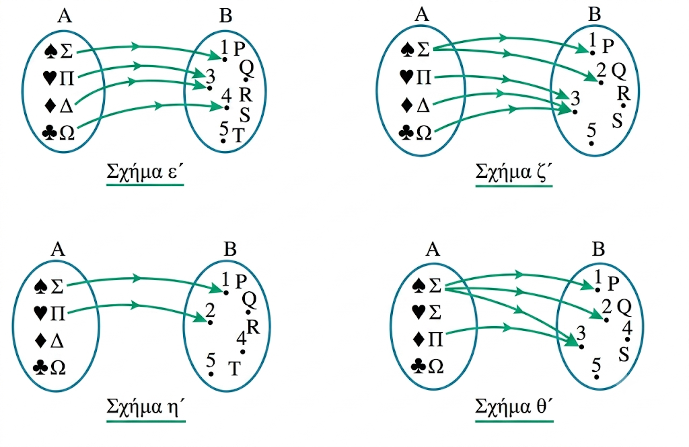

```{=html}
<!-- Φόρτωση βιβλιοθήκης GeoGebra -->
<script src="https://www.geogebra.org/apps/deployggb.js"></script>

<!-- Συνάρτηση δημιουργίας applets -->
<script>
function createGeoGebra(containerId, materialId, width = 700, height = 500) {
  var params = {
    "id": "ggb-" + containerId,
    "material_id": materialId,
    "width": width,
    "height": height,
    "showToolBar": true,
    "showMenuBar": false,
    "showAlgebraInput": true
  };
  
  var applet = new GGBApplet(params, '5.2');
  applet.inject(containerId);
}
</script>
```

## Η έννοια της συνάρτησης

::: {style="background-color: #d5f4e6; border: 2px solid #2f3e50; color: #25188a; padding: 15px; border-radius: 5px;"}
### Θεωρία και Ορισμοί

**Συνάρτηση** από ένα σύνολο $A$ σε ένα σύνολο $B$ ονομάζεται μια διαδικασία ή ένας κανόνας με τον οποίο **κάθε** στοιχείο του συνόλου $A$ αντιστοιχίζεται σε **ένα ακριβώς** στοιχείο του συνόλου $B$.
Συμβολικά γράφουμε $f: A \rightarrow B$.

Βασικές έννοιες που συνοδεύουν τον ορισμό είναι:

- **Πεδίο Ορισμού (ή Σύνολο Ορισμού):** Είναι το σύνολο $A$, δηλαδή το σύνολο των στοιχείων στα οποία εφαρμόζεται ο κανόνας της συνάρτησης.

- **Σύνολο τιμών:** Είναι το σύνολο $B$ ή υποσύνολο του $B$ που περιέχει όλες τις εικόνες $f(x)$ για όλα τα $x \in A$.

- **Ανεξάρτητη Μεταβλητή:** Το γράμμα (συνήθως $x$) που παριστάνει ένα τυχαίο στοιχείο του πεδίου ορισμού.

- **Εξαρτημένη Μεταβλητή:** Το γράμμα (συνήθως $y$ ή $f(x)$) που παριστάνει την τιμή της συνάρτησης για ένα συγκεκριμένο $x$.

- **Αρχέτυπο και Εικόνα:** Αν το $x$ αντιστοιχίζεται στο $y$, τότε το $x$ λέγεται αρχέτυπο και το $y$ εικόνα του $x$.

Για να ορίζεται πλήρως μια συνάρτηση, πρέπει να γνωρίζουμε το πεδίο ορισμού της, το σύνολο τιμών και τον τύπο της (τον κανόνα αντιστοίχισης).
Αν δίνεται μόνο ο τύπος $f(x)$, θεωρούμε ως πεδίο ορισμού το "ευρύτερο" υποσύνολο του $\mathbb{R}$ στο οποίο ο τύπος έχει νόημα πραγματικού αριθμού.

:::

**Ένα παράδειγμα**

Ένα κλασικό παράδειγμα συνάρτησης είναι η αντιστοίχιση μαθητών με τον μήνα γέννησής τους.

- **Σύνολο** $A$ (Πεδίο Ορισμού): Οι μαθητές μιας τάξης.

- **Σύνολο** $B$ (Σύνολο τιμών): Οι 12 μήνες του έτους.

- **Κανόνας:** "Ο μαθητής $x$ γεννήθηκε τον μήνα $y$".

Η διαδικασία αυτή ορίζει συνάρτηση διότι:

1.  **Όλοι** οι μαθητές έχουν γεννηθεί κάποιον μήνα (λαμβάνουν μέρος όλα τα στοιχεία του $A$).

2.  Ο κάθε μαθητής έχει γεννηθεί σε **έναν ακριβώς** μήνα (δεν μπορεί κάποιος να έχει δύο διαφορετικούς μήνες γέννησης).

### Περιπτώσεις που είναι ή δεν είναι Συνάρτηση
::: {style="background-color: #d5f4e6; border: 2px solid #2f3e50; color: #25188a; padding: 15px; border-radius: 5px;"}

Για να διαπιστώσουμε αν μια σχέση είναι συνάρτηση, εξετάζουμε δύο βασικές προϋποθέσεις:

**Είναι Συνάρτηση όταν:**

- Κάθε στοιχείο του $A$ έχει αντιστοιχία στο $B$.

- Κάθε στοιχείο του $A$ αντιστοιχίζεται σε **μοναδικό** στοιχείο του $B$.

- *Παράδειγμα:* $f(x) = 2x$ στο $A=\{1, 5, 6, 7\}$.
  Κάθε $x$ δίνει ένα μοναδικό $2x$.

**ΔΕΝ είναι Συνάρτηση όταν:**

- Ένα στοιχείο του $A$ **δεν αντιστοιχίζεται** πουθενά στο $B$.

- Ένα στοιχείο του $A$ **αντιστοιχίζεται σε δύο ή περισσότερα** στοιχεία του $B$.

- *Παράδειγμα:* Η σχέση $x^2 + y^2 = 25$.
  Για $x=3$, το $y$ θα μπορούσε να είναι $4$ ή $-4$, άρα ένα αρχέτυπο έχει δύο διαφορετικές εικόνες.

- *Παράδειγμα:* Η σχέση $y^2 = 4x$ για $x>0$, καθώς για κάθε $x$ αντιστοιχούν δύο τιμές του $y$.
:::

### Παραδείγματα μέσω Βελοδιαγραμμάτων

::: {style="background-color: #d5f4e6; border: 2px solid #2f3e50; color: #25188a; padding: 15px; border-radius: 5px;"}

Στα βελοδιαγράμματα, τα στοιχεία των συνόλων παριστάνονται με σημεία μέσα σε κλειστές καμπύλες και η αντιστοίχιση με βέλη.

- **Συνάρτηση:** Από κάθε σημείο του $A$ ξεκινάει **ακριβώς ένα** βέλος.
  Είναι αποδεκτό περισσότερα από ένα βέλη να καταλήγουν στο ίδιο στοιχείο του $B$.

- **Όχι Συνάρτηση:**

  1.  Υπάρχει στοιχείο στο $A$ από το οποίο **δεν ξεκινάει κανένα** βέλος.

  2.  Υπάρχει στοιχείο στο $A$ από το οποίο **ξεκινάνε δύο ή περισσότερα** βέλη.\

      \
      

  \
  Ποιο από τα παραπάνω βελοδιαγράμματα απικονίζει συνάρτηση και ποιο όχι;
:::

------------------------------------------------------------------------

::: {.callout-note style="color: #034f84;"}
## Η **συντομογραφία συνάρτησης**

αναφέρεται στην πρακτική των Μαθηματικών να ορίζουν μια συνάρτηση δίνοντας μόνο τον τύπο της (τον κανόνα αντιστοίχισης), αντί να προσδιορίζουν ρητά και τα τρία απαραίτητα στοιχεία που την ορίζουν πλήρως.

Είπαμε ότι για να είναι μια συνάρτηση $f$ **πλήρως ορισμένη**, πρέπει να γνωρίζουμε:

1.  Το **πεδίο ορισμού** $A$.

2.  Το **σύνολο τιμών** $B$.

3.  Την τιμή $f(x)$ για κάθε $x \in A$ (τον τύπο της συνάρτησης).

Ωστόσο, στην πράξη συχνά δίνεται μόνο ο τύπος της συνάρτησης (π.χ. «η συνάρτηση $f(x) = \sqrt{x-1}$»).
Σε αυτή την περίπτωση, δεχόμαστε συμβατικά τα εξής:

- **Ως πεδίο ορισμού** $A$: Θεωρούμε το **«ευρύτερο» υποσύνολο του** $\mathbb{R}$ στο οποίο ο τύπος $f(x)$ έχει νόημα πραγματικού αριθμού.
  Συμβολικά: $A = \{x \in \mathbb{R} \mid f(x) \in \mathbb{R}\}$.

  - *Παράδειγμα:* Αν $f(x) = \dfrac{1}{x}$, το πεδίο ορισμού θεωρείται το $\mathbb{R}^*$ (όπου $x \neq 0$).

  - *Παράδειγμα:* Αν $f(x) = \sqrt{x-1}$, το πεδίο ορισμού είναι το $[1, +\infty)$.

- **Ως σύνολο τιμών** $B$: Θεωρούμε το σύνολο των πραγματικών αριθμών $\mathbb{R}$ ή το υπολύνολο του που περιέχει όλες τις εικόνες$f(x)$ όλων των $x \in A$ κατά περίπτωση.

Αυτή η «σύντομη» περιγραφή χρησιμοποιείται για ευκολία, καθώς οι περιορισμοί του πεδίου ορισμού προκύπτουν άμεσα από τις μαθηματικές ιδιότητες του τύπου (π.χ. ο παρονομαστής δεν μπορεί να είναι μηδέν, η υπόρριζη ποσότητα πρέπει να είναι μη αρνητική).
:::

------------------------------------------------------------------------

::: {.callout-note style="color: #6A5ACD;"}
## Μια **συνάρτηση με κλάδους**

(ή δίκλαδη/πολύκλαδη συνάρτηση) είναι μια συνάρτηση που δεν ορίζεται από έναν ενιαίο μαθηματικό τύπο για όλο το πεδίο ορισμού της.
Αντίθετα, «χωρίζεται» σε κομμάτια, και χρησιμοποιεί **διαφορετικό τύπο ανάλογα με την τιμή του** $x$.

Ας το καταλάβουμε με ένα απλό παράδειγμα από την καθημερινή ζωή!

**Παράδειγμα: Η Χρέωση ενός Ταξί**

Φανταστείτε ότι μια εταιρεία ταξί έχει την εξής πολιτική χρέωσης ανάλογα με τα χιλιόμετρα ($x$) που διανύει ένας πελάτης:

1.  Για διαδρομές **μέχρι και 5 χιλιόμετρα**, υπάρχει μια σταθερή χρέωση **10 ευρώ** (ανεξάρτητα από το αν θα κάνεις 1 ή 5 χιλιόμετρα).
2.  Για διαδρομές **πάνω από 5 χιλιόμετρα**, η χρέωση είναι **2 ευρώ για κάθε χιλιόμετρο** που διανύεις.

**Μαθηματική Αναπαράσταση**

Αν ονομάσουμε $f(x)$ το συνολικό κόστος της διαδρομής σε ευρώ και $x$ τα χιλιόμετρα, η συνάρτηση γράφεται με δύο κλάδους ως εξής:

$$f(x) = \begin{cases} 10, & \text{αν } 0 \le x \le 5 \\ 2x, & \text{αν } x > 5 \end{cases}$$

**Πώς λειτουργεί στην πράξη;**

Αν θέλουμε να υπολογίσουμε το κόστος για διαφορετικές διαδρομές, κοιτάζουμε σε ποιον κλάδο ανήκει το $x$:

- **Περίπτωση 1: Διαδρομή 3 χιλιομέτρων (**$x = 3$) Επειδή το 3 είναι ανάμεσα στο 0 και το 5 ($0 \le 3 \le 5$), χρησιμοποιούμε τον **πρώτο κλάδο**.
  Επομένως: $f(3) = 10$ ευρώ.

- **Περίπτωση 2: Διαδρομή 8 χιλιομέτρων (**$x = 8$) Επειδή το 8 είναι μεγαλύτερο από το 5 ($8 > 5$), χρησιμοποιούμε τον **δεύτερο κλάδο**.
  Επομένως: $f(8) = 2 \cdot 8 = 16$ ευρώ.

**Γιατί είναι χρήσιμη;**

Στον πραγματικό κόσμο, οι κανόνες συχνά αλλάζουν ανάλογα με τις συνθήκες (π.χ. φορολογικές κλίμακες, χρεώσεις ρεύματος, εκπτώσεις ποσότητας).
Οι συναρτήσεις με κλάδους είναι το ιδανικό μαθηματικό εργαλείο για να περιγράψουμε αυτές ακριβώς τις αλλαγές!
:::


------------------------------------------------------------------------

### Ασκήσεις

1.  Να βρείτε το πεδίο ορισμού της συνάρτησης $f(x) = \dfrac{x-2}{x^2-5x+6}$.

2.  Δίνεται η συνάρτηση $f(x) = \begin{cases} x+1, & x < -2 \\ x^2+1, & -2 \leq x \leq 4 \\ 2x+3, & x > 4 \end{cases}$.
    Να υπολογίσετε τις τιμές $f(3), f(2), f(-3), f(4)$.

3.  Εξετάστε αν το βελοδιάγραμμα που αντιστοιχίζει το $\alpha \rightarrow 1, \beta \rightarrow 2, \beta \rightarrow 3, \gamma \rightarrow 3$ ορίζει συνάρτηση και αιτιολογήστε.

4.  Βρείτε το πεδίο ορισμού της $f(x) = \sqrt{x-1} + \sqrt{2-x}$.

5.  Να προσδιορίσετε το πεδίο ορισμού της $g(x) = \dfrac{x^2+16}{x^2-4x}$.

6.  Αν $f(x) = x^2+4$, να αποδείξετε ότι $f(4\alpha\beta) + f(\alpha+\beta) - f(\alpha-\beta) = f(4\alpha\beta) + 8\alpha\beta$.

7.  Λύστε την εξίσωση $f(x) = 25$ αν $f(x) = \begin{cases} 2x-5, & x \leq 3 \\ x^2, & 3 < x < 10 \end{cases}$.

8.  Να βρεθεί το πεδίο ορισμού της $h(x) = \dfrac{1}{\sqrt{x-1}} + \dfrac{-3}{\sqrt{2-|x-1|}}$.

9.  Αν $f(x) = x^2 - x$, υπολογίστε την παράσταση $A = \dfrac{f(3)-f(-1)}{4}$.

10. Εξηγήστε γιατί η σχέση $x^2 + y^2 = 1$ δεν ορίζει το $y$ ως συνάρτηση του $x$ στο διάστημα $[-1, 1]$.

11. Να βρείτε το πεδίο ορισμού των παρακάτω συναρτήσεων:

- α.
  $f(x) = \dfrac{6}{x - 3} - 2$

- β.
  $f(x) = \dfrac{x^2 - 9}{x^2 - 3x}$

- γ.
  $f(x) = \dfrac{5}{x^2 + 4}$

- δ.
  $f(x) = \dfrac{1}{\vert{}x\vert{} - x}$

12. Ομοίως των συναρτήσεων:

- α.
  $f(x) = \sqrt{x - 2} + \sqrt{5 - x}$

- β.
  $f(x) = \sqrt{x^2 - 9}$

- γ.
  $f(x) = \sqrt{-x^2 + 6x - 5}$

- δ.
  $f(x) = \dfrac{1}{\sqrt{x - 3}}$

13. Δίνεται η συνάρτηση:

$$f(x) = \begin{cases} x^2 - 1, & \text{αν } x < 0 \\ 3x + 2, & \text{αν } x \ge 0 \end{cases}$$

Να βρείτε τις τιμές $f(-3)$, $f(0)$ και $f(4)$.

14. Μια συνάρτηση $f$ ορίζεται ως εξής:

«*Σκέψου έναν φυσικό αριθμό, πρόσθεσε σ' αυτόν το* $\dfrac{3}{2}$, πολλαπλασίασε το άθροισμα με το 6 και στο γινόμενο πρόσθεσε το τετράγωνο του αρχικού αριθμού.»

- α.
  Να βρείτε τον τύπο της $f$ και στη συνέχεια τις τιμές της για $x = 0$, $x = 1$, $x = 2$ και $x = 3$.
  Τι παρατηρείτε;

- β.
  Να βρείτε τους φυσικούς αριθμούς $x$ για τους οποίους ισχύει: $f(x) = 25$, $f(x) = 64$, $f(x) = 81$ και $f(x) = 121$.

15. Δίνονται οι συναρτήσεις:

- α.
  $f(x) = \dfrac{6}{x - 3} - 2$

- β.
  $g(x) = \dfrac{x^2 - 9}{x^2 - 3x}$ \quad και \quad

- γ.
  $h(x) = \dfrac{5}{x^2 + 4}$

Να βρείτε τις τιμές του $x$ για τις οποίες ισχύει:

- 

  i.  $f(x) = 4$

- 

  ii. $g(x) = 3$ \quad και \quad

- 

  iii. $h(x) = \dfrac{1}{4}$

::: {.callout-note style="color: #8B0000;"}
:::

::: {.callout-tip style="color: brown;"}
ΚΑΛΗ ΜΕΛΕΤΗ!
:::

\
\
