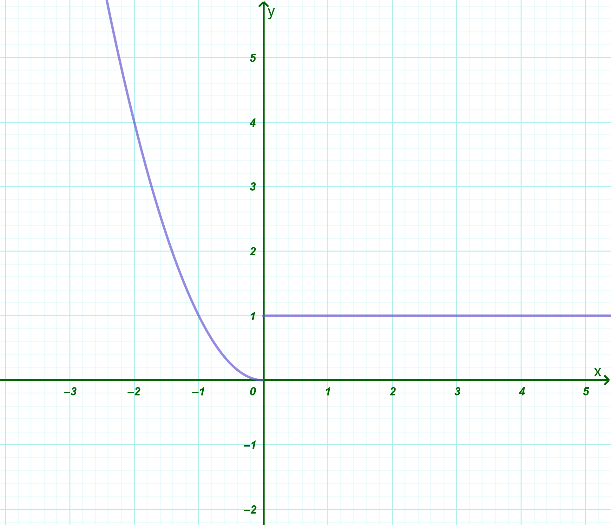
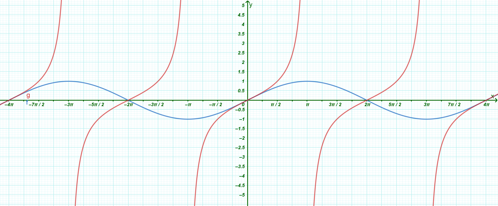

```{=html}
<!-- Φόρτωση βιβλιοθήκης GeoGebra -->
<script src="https://www.geogebra.org/apps/deployggb.js"></script>

<!-- Συνάρτηση δημιουργίας applets -->
<script>
function createGeoGebra(containerId, materialId, width = 700, height = 500) {
  var params = {
    "id": "ggb-" + containerId,
    "material_id": materialId,
    "width": width,
    "height": height,
    "showToolBar": true,
    "showMenuBar": false,
    "showAlgebraInput": true
  };
  
  var applet = new GGBApplet(params, '5.2');
  applet.inject(containerId);
}
</script>
```

## Γραφική παράσταση συνάρτησης

### Καρτεσιανές συντεταγμένες

::: {style="background-color: #d5f4e6; border: 2px solid #2f3e50; color: #25188a; padding: 15px; border-radius: 5px;"}
Οι **Καρτεσιανές συντεταγμένες** αποτελούν ένα σύστημα με το οποίο μπορούμε να προσδιορίσουμε τη θέση οποιουδήποτε σημείου πάνω σε ένα επίπεδο χρησιμοποιώντας αριθμούς.

**Ορισμοί**

- **Καρτεσιανό Σύστημα Συντεταγμένων:** Ονομάζεται ένα ζεύγος δύο κάθετων αξόνων, του $x'x$ και του $y'y$, με κοινή αρχή ένα σημείο $O$.
  Το επίπεδο στο οποίο ορίζεται αυτό το σύστημα ονομάζεται **καρτεσιανό επίπεδο**.

- **Άξονες:**

  - Ο οριζόντιος άξονας $x'x$ ονομάζεται **άξονας των τετμημένων**.

  - Ο κατακόρυφος άξονας $y'y$ ονομάζεται **άξονας των τεταγμένων**.

- **Ορθοκανονικό Σύστημα:** Είναι το καρτεσιανό σύστημα στο οποίο οι μονάδες μέτρησης στους δύο άξονες έχουν το ίδιο μήκος.

- **Συντεταγμένες Σημείου:** Σε κάθε σημείο $M$ του επιπέδου αντιστοιχίζουμε ένα διατεταγμένο ζεύγος πραγματικών αριθμών $(x, y)$.
  Το $x$ ονομάζεται **τετμημένη** και το $y$ ονομάζεται **τεταγμένη** του σημείου $M$.
  Συμβολικά γράφουμε $M(x, y)$.

**Τεταρτημόρια**

Οι άξονες χωρίζουν το επίπεδο σε τέσσερις περιοχές, τα **τεταρτημόρια**, με τα εξής πρόσημα συντεταγμένων:

- **1ο Τεταρτημόριο:** $x > 0$ και $y > 0$.

- **2ο Τεταρτημόριο:** $x < 0$ και $y > 0$.

- **3ο Τεταρτημόριο:** $x < 0$ και $y < 0$.

- **4ο Τεταρτημόριο:** $x > 0$ και $y < 0$.

Τα σημεία του άξονα $x'x$ έχουν πάντα $y = 0$, ενώ τα σημεία του άξονα $y'y$ έχουν πάντα $x = 0$.

**Συμμετρίες Σημείων**

Αν έχουμε ένα σημείο $M(x, y)$, τότε:

- Το συμμετρικό ως προς τον **άξονα** $x'x$ είναι το $M_1(x, -y)$.

- Το συμμετρικό ως προς τον **άξονα** $y'y$ είναι το $M_2(-x, y)$.

- Το συμμετρικό ως προς την **αρχή των αξόνων** $O$ είναι το $M_3(-x, -y)$.

- Το συμμετρικό ως προς τη **διχοτόμο της 1ης και 3ης γωνίας (**$y = x$) είναι το $M_4(y, x)$.

<iframe src="https://www.geogebra.org/calculator/sfyyxrkk?embed" width="730" height="600" allowfullscreen style="border: 1px solid #e4e4e4;border-radius: 4px;" frameborder="0">

</iframe>

> Μετακινήστε το σημείο Μ.

> Κάντε κλικ στην επιφάνεια εργασίας και μετακινήστε ελάχιστα για να καθαρίσουν τα ίχνη.

**Απόσταση δύο Σημείων**

Η απόσταση μεταξύ δύο σημείων $A(x_1, y_1)$ και $B(x_2, y_2)$ δίνεται από τον τύπο: $$(AB) = \sqrt{(x_2 - x_1)^2 + (y_2 - y_1)^2}$$

<iframe src="https://www.geogebra.org/calculator/hkqfydya?embed" width="730" height="600" allowfullscreen style="border: 1px solid #e4e4e4;border-radius: 4px;" frameborder="0">

</iframe>

> Μετακινήστε τα σημεία Α και Β.
:::

### Παραδείγματα

1.  **Προσδιορισμός Σημείου:** Για να βρούμε το σημείο $P(3, 4)$, εντοπίζουμε τον αριθμό $3$ στον άξονα $x'x$ και τον αριθμό $4$ στον άξονα $y'y$. Το σημείο τομής των κάθετων ευθειών που περνούν από αυτά τα σημεία είναι το $P$.
2.  **Συμμετρία:** Αν έχουμε το σημείο $A(2, 3)$, το συμμετρικό του ως προς τον άξονα $x'x$ είναι το $A'(2, -3)$, ενώ ως προς τον άξονα $y'y$ είναι το $A''(-2, 3)$.
3.  **Απόσταση:** Η απόσταση των σημείων $A(-1, 3)$ και $B(2, 4)$ υπολογίζεται ως: $$(AB) = \sqrt{(2 - (-1))^2 + (4 - 3)^2} = \sqrt{3^2 + 1^2} = \sqrt{10}$$
4.  **Σημεία στους Άξονες:** Το σημείο $(5, 0)$ βρίσκεται πάνω στον άξονα $x'x$, ενώ το σημείο $(0, -2)$ βρίσκεται πάνω στον άξονα $y'y$.

### Η **γραφική παράσταση** μιας συνάρτησης

::: {style="background-color: #d5f4e6; border: 2px solid #2f3e50; color: #25188a; padding: 15px; border-radius: 5px;"}
Η **γραφική παράσταση** μιας συνάρτησης αποτελεί το «γεωμετρικό της αποτύπωμα» στο επίπεδο, επιτρέποντάς μας να οπτικοποιήσουμε τη σχέση μεταξύ της ανεξάρτητης και της εξαρτημένης μεταβλητής.

**Θεωρία και Ορισμοί**

- **Ορισμός Γραφικής Παράστασης:** Έστω μια συνάρτηση $f$ με πεδίο ορισμού $A$. Το σύνολο των σημείων $M(x, f(x))$ του καρτεσιανού επιπέδου για όλα τα $x \in A$ ονομάζεται γραφική παράσταση της $f$ και συμβολίζεται με $C_f$.
- **Εξίσωση Γραφικής Παράστασης:** Η ισότητα $y = f(x)$ ονομάζεται εξίσωση της γραφικής παράστασης και επαληθεύεται μόνο από τα ζεύγη $(x, y)$ που είναι συντεταγμένες σημείων της $C_f$.
- **Χαρακτηριστική Ιδιότητα (Κριτήριο Κατακόρυφης Γραμμής):** Μια γραμμή στο επίπεδο είναι γραφική παράσταση συνάρτησης αν και μόνο αν κάθε κατακόρυφη ευθεία την τέμνει **το πολύ σε ένα σημείο**.
- **Πεδίο Ορισμού και Σύνολο Τιμών:**
  - Το **Πεδίο Ορισμού** είναι η προβολή της $C_f$ στον άξονα $x'x$.
  - Το **Σύνολο Τιμών** είναι η προβολή της $C_f$ στον άξονα $y'y$.
- **Σημεία Τομής με τους Άξονες:**
  - Με τον $x'x$: Λύνουμε την εξίσωση $f(x) = 0$. Οι ρίζες της είναι οι τετμημένες των σημείων τομής.
  - Με τον $y'y$: Υπολογίζουμε την τιμή $f(0)$, εφόσον το $0$ ανήκει στο πεδίο ορισμού. Το σημείο είναι το $(0, f(0))$.
:::

**Παράδειγμα για Κατανόηση**

Έστω η συνάρτηση $f(x) = x^2 - x$.

- Για να δούμε αν το σημείο $A(1, 0)$ ανήκει στην $C_f$, ελέγχουμε αν $f(1) = 0$. Πράγματι, $f(1) = 1^2 - 1 = 0$, οπότε το $A$ ανήκει στη γραφική παράσταση.
- Αντίθετα, για το σημείο $\Gamma(0, 1)$, έχουμε $f(0) = 0^2 - 0 = 0 \neq 1$, άρα το $\Gamma$ **δεν** ανήκει στην $C_f$.


------------------------------------------------------------------------

::: {.callout-note style="color: #6A5ACD;"}
## Το Ιστορικό της Γέννησης των Καρτεσιανών Συντεταγμένων

Η εισαγωγή των συντεταγμένων στα Μαθηματικά θεωρείται ένα από τα σημαντικότερα ορόσημα στην ιστορία της επιστήμης, καθώς γεφύρωσε δύο μέχρι τότε ξεχωριστούς κόσμους: τη **Γεωμετρία** (τη μελέτη των σχημάτων) και την **Άλγεβρα** (τη μελέτη των αριθμών και των εξισώσεων).

**Ο Ρενέ Ντεκάρτ (Καρτέσιος)**

Το σύστημα ονομάστηκε «Καρτεσιανό» προς τιμήν του Γάλλου φιλοσόφου και μαθηματικού **Ρενέ Ντεκάρτ** (*René Descartes*, 1596–1650), του οποίου το λατινικό όνομα ήταν *Cartesius*.

Το 1637, ο Ντεκάρτ δημοσίευσε το περίφημο έργο του *Λόγος περί της Μεθόδου* (*Discours de la méthode*).
Στο παράρτημα αυτού του βιβλίου, με τίτλο **Γεωμετρία** (*La Géométrie*), παρουσίασε για πρώτη φορά την ιδέα ότι μια γραμμή ή ένα γεωμετρικό σχήμα στο επίπεδο μπορεί να περιγραφεί μέσω μιας αλγεβρικής εξίσωσης.

> **Ο αστικός μύθος της μύγας:** Λέγεται ότι η ιδέα ήρθε στον Ντεκάρτ μια μέρα που ήταν ξαπλωμένος στο κρεβάτι του (καθώς ήταν φιλάσθενος και περνούσε πολύ χρόνο ξαπλωμένος σκεπτόμενος).
> Παρατηρώντας μια μύγα που πετούσε στο ταβάνι, συνειδητοποίησε ότι θα μπορούσε να προσδιορίσει την ακριβή της θέση ανά πάσα στιγμή, μετρώντας απλώς την απόστασή της από τους δύο κάθετους τοίχους του δωματίου.

**Ο Πιερ ντε Φερμά: Ο «αφανής» συν-δημιουργός**

Αν και ο Ντεκάρτ πήρε όλη τη δόξα (και το όνομα του συστήματος), ο συμπατριώτης του και σύγχρονός του, **Πιερ ντε Φερμά** (*Pierre de Fermat*), είχε αναπτύξει ουσιαστικά την ίδια ιδέα περίπου την ίδια εποχή (γύρω στο 1636), εργαζόμενος εντελώς ανεξάρτητα.

Ωστόσο, ο Φερμά δεν δημοσίευσε το έργο του έγκαιρα, παρά μόνο το κυκλοφόρησε σε χειρόγραφα μεταξύ άλλων μαθηματικών.
Ως αποτέλεσμα, η ιστορία «χρέωσε» την ανακάλυψη κυρίως στον Ντεκάρτ.

**Πώς εξελίχθηκε το σύστημα**

Είναι ενδιαφέρον ότι το σύστημα που χρησιμοποιούσε ο ίδιος ο Ντεκάρτ δεν ήταν ακριβώς αυτό που χρησιμοποιούμε σήμερα στα σχολικά βιβλία:

- Ο Ντεκάρτ χρησιμοποιούσε κυρίως **έναν άξονα** (τον οριζόντιο) και μετρούσε την κατακόρυφη απόσταση από αυτόν, συχνά μάλιστα υπό πλάγια γωνία και όχι απαραίτητα ορθή ($90^\circ$).

- Δεν χρησιμοποιούσε αρνητικές συντεταγμένες με τον τρόπο που τις ξέρουμε σήμερα, καθώς εκείνη την εποχή οι αρνητικοί αριθμοί αντιμετωπίζονταν ακόμη με καχυποψία από τους μαθηματικούς (τους αποκαλούσαν «ψεύτικους ρίζες»).

Η σύγχρονη μορφή με τους δύο κάθετους άξονες ($x$ και $y$), την αρχή των αξόνων $O(0,0)$ και τα τέσσερα τεταρτημόρια (όπου περιλαμβάνονται και οι αρνητικοί αριθμοί) καθιερώθηκε αργότερα, προς τα τέλη του 17ου αιώνα, από μαθηματικούς όπως ο **Φρανς φαν Σότεν** (*Frans van Schooten*) και ο **Ισαάκ Νιούτον** (*Isaac Newton*).

**Η σημασία της ανακάλυψης**

Πριν από τον Ντεκάρτ, αν ήθελες να μελετήσεις έναν κύκλο ή μια παραβολή, έπρεπε να σχεδιάσεις το σχήμα και να χρησιμοποιήσεις καθαρά γεωμετρικά θεωρήματα (όπως του Ευκλείδη).
Μετά τον Ντεκάρτ, ο κύκλος έγινε απλώς μια εξίσωση:

$$x^2 + y^2 = \rho^2$$

Αυτή η ενοποίηση Άλγεβρας και Γεωμετρίας (που ονομάστηκε **Αναλυτική Γεωμετρία**) άνοιξε τον δρόμο για την εφεύρεση του Διαφορικού και Ολοκληρωτικού Λογισμού από τους Νιούτον και Λάιμπνιτς, αλλάζοντας για πάντα την πορεία της φυσικής, της μηχανικής και της τεχνολογίας.
:::

------------------------------------------------------------------------

### Ασκήσεις

1.  **Τεταρτημόρια:** Να προσδιορίσετε σε ποιο τεταρτημόριο ανήκουν τα παρακάτω σημεία: $A(3, 4)$, $B(-2, 5)$, $\Gamma(-1, -3)$ και $\Delta(4, -2)$.

2.  **Συμμετρίες Σημείου:** Δίνεται το σημείο $M(2, -5)$.
    Να βρείτε τις συντεταγμένες των συμμετρικών του σημείων ως προς:

    - Τον άξονα $x'x$.
    - Τον άξονα $y'y$.
    - Την αρχή των αξόνων $O(0,0)$.
    - Τη διχοτόμο της 1ης και 3ης γωνίας ($y=x$).

3.  **Απόσταση δύο Σημείων:** Να υπολογίσετε την απόσταση μεταξύ των σημείων $A(-1, 3)$ και $B(2, 7)$ χρησιμοποιώντας τον τύπο $d = \sqrt{(x_2-x_1)^2 + (y_2-y_1)^2}$.

4.  **Εύρεση Παραμέτρου (Συμμετρία):** Να βρεθεί η τιμή του $\lambda \in \mathbb{R}$ ώστε τα σημεία $A(2, \lambda^2-1)$ και $B(2, 8)$ να είναι συμμετρικά ως προς τον άξονα $x'x$.

5.  **Μέσο Ευθύγραμμου Τμήματος:** Αν τα άκρα ενός τμήματος είναι τα σημεία $A(\alpha, \beta)$ και $B(\gamma, \delta)$, να αποδείξετε ότι το μέσο του $M$ έχει συντεταγμένες $M(\dfrac{\alpha+\gamma}{2}, \dfrac{\beta+\delta}{2})$.

6.  **Είδος Τριγώνου:** Δίνονται τα σημεία $A(4, 2)$, $B(8, 2)$ και $\Gamma(4, 5)$.
    Να εξετάσετε αν το τρίγωνο $AB\Gamma$ είναι ορθογώνιο χρησιμοποιώντας τις αποστάσεις των πλευρών του.

7.  **Σημεία στους Άξονες:**

    - Για ποιες τιμές του $\mu$ το σημείο $M(2\mu-4, \mu+1)$ ανήκει στον άξονα των τεταγμένων ($y'y$);.
    - Για ποιες τιμές του $\kappa$ το σημείο $N(5, 2\kappa-10)$ ανήκει στον άξονα των τετμημένων ($x'x$);.

8.  **Σημείο και Γραφική Παράσταση:** Να εξετάσετε αν το σημείο $P(1, 2)$ ανήκει στη γραφική παράσταση της συνάρτησης $f(x) = x^2 + 1$.

9.  **Τομή με τους Άξονες:** Να βρεθούν τα σημεία τομής της ευθείας $y = 3x - 6$ με τον άξονα $x'x$ και τον άξονα $y'y$.

10. **Εξίσωση Κύκλου:** Να επαληθεύσετε αν το σημείο $M(\sqrt{2}, \sqrt{2})$ ανήκει στον κύκλο με κέντρο την αρχή των αξόνων και ακτίνα $\rho = 2$, χρησιμοποιώντας την εξίσωση $x^2 + y^2 = \rho^2$.

11. **Σημείο και Γραφική Παράσταση:** Να βρεθεί η τιμή του $\lambda$ ώστε το σημείο $M(1, 3)$ να ανήκει στη γραφική παράσταση της $f(x) = x^2 - 2x + \lambda$.

12. **Τομή με Άξονες:** Δίνεται η συνάρτηση $f(x) = x^2 - 5x + 4$.
    Να βρεθούν τα σημεία τομής της $C_f$ με τους άξονες $x'x$ και $y'y$.

13. **Κοινά Σημεία:** Να βρεθούν τα κοινά σημεία των γραφικών παραστάσεων των συναρτήσεων $f(x) = 3 - 4x$ και $g(x) = 7x - 6$.

14. **Σχετική Θέση με τον** $x'x$: Για ποιες τιμές του $x$ η γραφική παράσταση της $f(x) = x^2 - 3x + 2$ βρίσκεται κάτω από τον άξονα $x'x$;.

15. **Αναγνώριση Συνάρτησης:** Χρησιμοποιώντας το κριτήριο της κατακόρυφης γραμμής, να εξετάσετε αν ένας κύκλος μπορεί να αποτελεί γραφική παράσταση συνάρτησης.

16. **Μελέτη από Σχήμα:** Δίνεται η γραφική παράσταση μιας συνάρτησης που εκτείνεται από το $x=-2$ έως το $x=6$.
    Να προσδιορίσετε το πεδίο ορισμού και το σύνολο τιμών της.

17. **Συμμετρία (Άρτια):** Να αποδείξετε ότι η γραφική παράσταση της $f(x) = x^2 - |x|$ είναι συμμετρική ως προς τον άξονα $y'y$.

18. **Σημείο πάνω σε Καμπύλη:** Δίνεται η $f(x) = \dfrac{x}{x-1}$.
    Να βρείτε το σημείο της $C_f$ που έχει τεταγμένη $y = 3$.

19. **Συνάρτηση Πολλαπλού Τύπου:** Να σχεδιάσετε τη γραφική παράσταση της $f(x) = \begin{cases} x^2, & x < 0 \\ 1, & x \geq 0 \end{cases}$.\
    {width="487"}

20. Στο παρακάτω σχήμα δίνονται οι γραφικές παραστάσεις δύο συναρτήσεων [ƒ (Μπλέ)]{style="color:blue;"} και [g (κόκκινη)]{style="color:red;"} , που είναι ορισμένες σε όλο το ℝ.

    α.
    Να βρείτε τις τιμές της ƒ (μπλέ) στα σημεία:

    -3π, -π, 0, π και 3π

    β.
    Να λύσετε τις εξισώσεις:

    ƒ(x) = 0, ƒ(x) = π και ƒ(x) = g(x)

    γ.
    Να λύσετε τις ανισώσεις:

    $ƒ(x) \lt 0$ και $-1\lt g( x)\lt 1$ (*δεν είναι μόνο ένα διάστημα!!*).\
    

21. Να σχεδιάσετε σε ένα καρτεσιανό σύστημα συντεταγμένων τα σημεία:


$$K(2, -3), \quad \Lambda(-4, 1), \quad M(0, 0), \quad N(-2, 0), \quad \Xi(0, 4) \quad \text{και} \quad O(3, 3)$$

22. Να βρείτε το συμμετρικό του σημείου $A(2, -4)$:

  - α. ως προς τον άξονα $x'x$
  - β. ως προς τον άξονα $y'y$
  - γ. ως προς τη διχοτόμο της γωνίας $x\widehat{O}y$
  - δ. ως προς την αρχή $O$ των αξόνων

23. Να βρείτε τις αποστάσεις των σημείων:

  - α. $O(0,0)$ και $A(-3, 4)$
  - β. $A(2, 5)$ και $B(-1, 1)$
  - γ. $Γ(-4, 2)$ και $Δ(3, 2)$
  - δ. $Κ(3, -2)$ και $Λ(3, 5)$

24. Να εξετάσετε αν:

  - α. Τα σημεία $A(1, 3)$, $B(4, 7)$ και $\Gamma(-3, 6)$ είναι κορυφές ισοσκελούς τριγώνου.
  - β. Τα σημεία $A(-2, 1)$, $B(2, 4)$ και $\Gamma(5, 0)$ είναι κορυφές ορθογωνίου τριγώνου.

25. Τοποθετήστε τα σημεία:

$$A(0, 4), \quad B(3, 0), \quad \Gamma(0, -4) \quad \text{και} \quad \Delta(-3, 0)$$


 σε ένα σύστημα συντεταγμένων και στη συνέχεια να αποδείξετε ότι αυτό είναι ρόμβος.

26. Να βρείτε την τιμή του $k$ για την οποία το σημείο $M$ ανήκει στη γραφική παράσταση της συνάρτησης:

  - α. $f(x) = x^2 - k, \quad M(3, 5)$
  - β. $g(x) = kx^3, \quad M(-1, 4)$
  - γ. $h(x) = k\sqrt{x - 2}, \quad M(6, 6)$

27. Να βρείτε τις συντεταγμένες των κοινών σημείων της γραφικής παράστασης των παρακάτω συναρτήσεων με τους άξονες:

  - α. $f(x) = x + 3$
  - β. $g(x) = (x - 1)(x - 4)$
  - γ. $h(x) = (x + 2)^2$
  - δ. $q(x) = x^2 - x + 2$
  - ε. $\varphi(x) = x\sqrt{x - 4}$
  - στ. $\psi(x) = x\sqrt{x^2 - 9}$

28. Για τη συνάρτηση $f(x) = x^2 - 4$. Να βρείτε:

  - α. Τα σημεία τομής της $C_f$ με τους άξονες.
  - β. Τις τετμημένες των σημείων της $C_f$ που βρίσκονται πάνω από τον άξονα $x'x$.

29. Δίνονται οι συναρτήσεις $f(x) = x^2 - 4x + 3$ και $g(x) = x - 1$. Να βρείτε:

  - α. Τα κοινά σημεία των $C_f$ και $C_g$.
  - β. Τις τετμημένες των σημείων της $C_f$ που βρίσκονται κάτω από την $C_g$.

::: {.callout-note style="color: #8B0000;"}
:::

::: {.callout-tip style="color: brown;"}
ΚΑΛΗ ΜΕΛΕΤΗ!
:::

\
\
