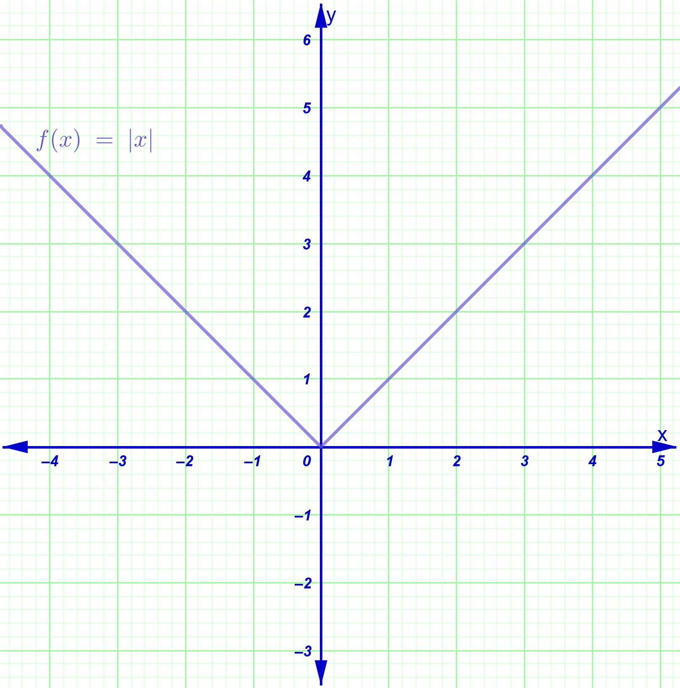
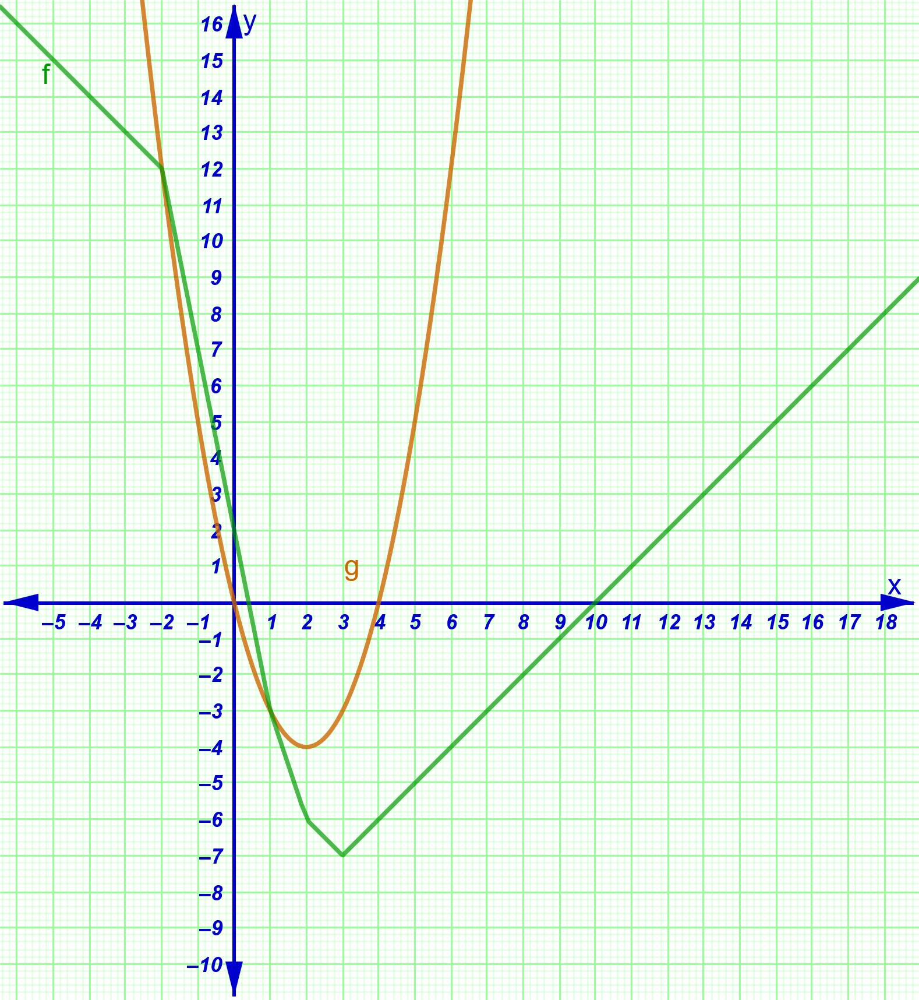
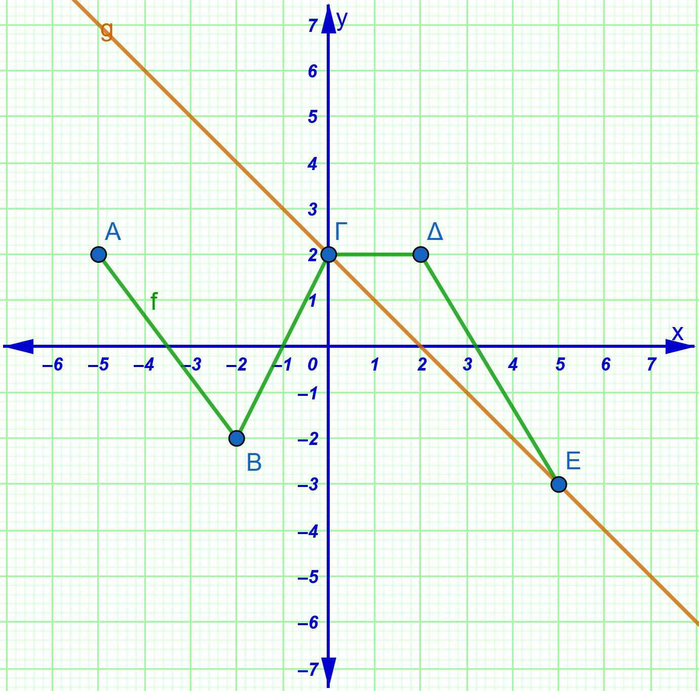
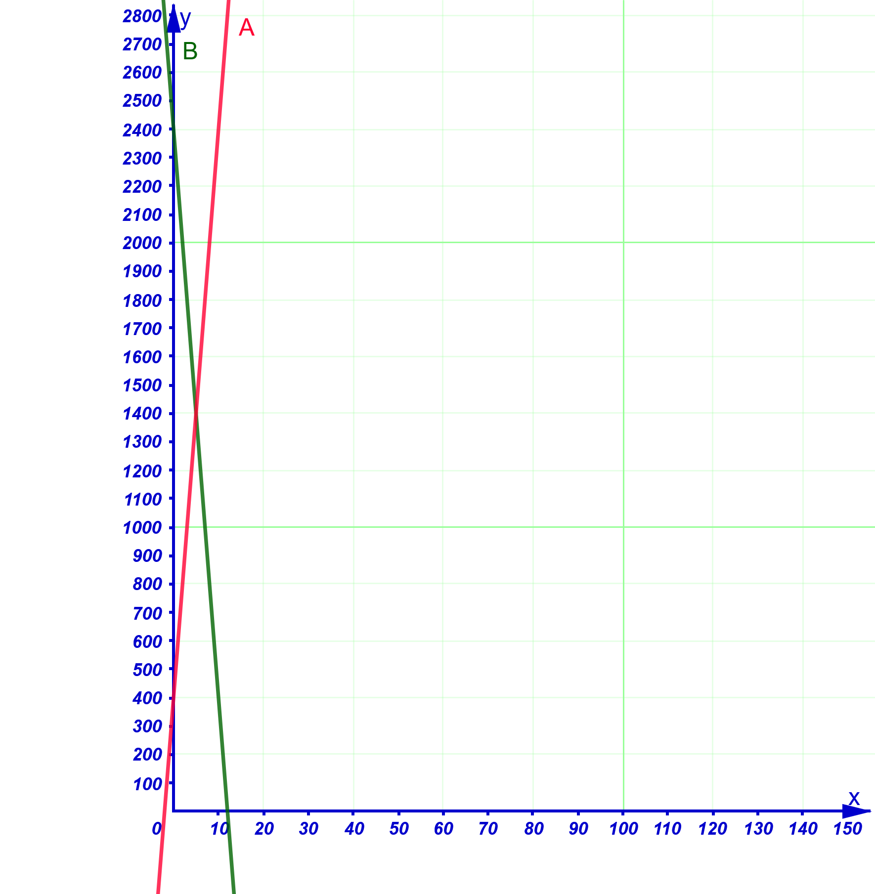
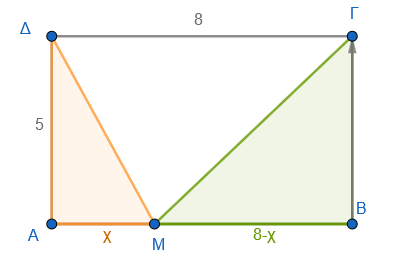

```{=html}
<!-- Φόρτωση βιβλιοθήκης GeoGebra -->
<script src="https://www.geogebra.org/apps/deployggb.js"></script>

<!-- Συνάρτηση δημιουργίας applets -->
<script>
function createGeoGebra(containerId, materialId, width = 700, height = 500) {
  var params = {
    "id": "ggb-" + containerId,
    "material_id": materialId,
    "width": width,
    "height": height,
    "showToolBar": true,
    "showMenuBar": false,
    "showAlgebraInput": true
  };
  
  var applet = new GGBApplet(params, '5.2');
  applet.inject(containerId);
}
</script>
```

## Η συνάρτηση ƒ(x) = αx + β

### Η συνάρτηση $f(x) = \alpha x + \beta$ και η Γραφική της Παράσταση

::: {style="background-color: #d5f4e6; border: 2px solid #2f3e50; color: #25188a; padding: 15px; border-radius: 5px;"}
**Θεωρία και Ορισμοί:**

- **Ορισμός:** Η συνάρτηση $f(x) = \alpha x + \beta$ έχει ως πεδίο ορισμού όλο το σύνολο $\mathbb{R}$ των πραγματικών αριθμών.

- **Γραφική Παράσταση:** Η γραφική παράσταση της συνάρτησης αυτής είναι μια **ευθεία** (ε) με εξίσωση $y = \alpha x + \beta$.

- **Σημεία Τομής με τους Άξονες:**

  - Τέμνει τον άξονα $y'y$ στο σημείο $B(0, \beta)$.
  - Τέμνει τον άξονα $x'x$ στο σημείο $A(-\dfrac{\beta}{\alpha}, 0)$, υπό την προϋπόθεση ότι $\alpha \neq 0$.

- **Μονοτονία:**

  - Αν $\alpha > 0$, η συνάρτηση είναι **γνησίως αύξουσα** σε όλο το $\mathbb{R}$.
  - Αν $\alpha < 0$, η συνάρτηση είναι **γνησίως φθίνουσα** σε όλο το $\mathbb{R}$.
  - Αν $\alpha = 0$, η συνάρτηση παίρνει τη μορφή $f(x) = \beta$ και ονομάζεται **σταθερή**, καθώς η τιμή της παραμένει ίδια για κάθε $x$.

<iframe src="https://www.geogebra.org/calculator/m7g7gmnt?embed" width="730" height="600" allowfullscreen style="border: 1px solid #e4e4e4;border-radius: 4px;" frameborder="1">

</iframe>

> Αλλάξτε την τιμή του α.
> Τι παρατηρείτε;

> Όταν το α\>0 ................
> Όταν το α\<0 .....................

> Όταν το α=0 .....................

> Αλλάξτε την τιμή του β.
> Τι παρατηρείτε; ........................
:::

**Εφαρμογές και Παραδείγματα:**

- Για να σχεδιάσουμε την ευθεία $y = \alpha x + \beta$, αρκεί να προσδιορίσουμε δύο σημεία της, συνήθως τα σημεία τομής με τους άξονες.

- **Παράδειγμα:** Για την $f(x) = 2x + 1$, αν $x=0$ τότε $y=1$ (σημείο $(0,1)$), και αν $y=0$ τότε $x=-1/2$ (σημείο $(-1/2, 0)$).

**Ασκήσεις:**

1.  Να βρεθεί ο τύπος της συνάρτησης $f(x) = \alpha x + \beta$ αν η γραφική της παράσταση διέρχεται από τα σημεία $A(1, 2)$ και $B(4, -5)$.
2.  Δίνεται η $f(x) = \alpha x + \beta$ με $f(1) = 3$ και $f(3) = 7$. Να υπολογίσετε το $f(11)$.
3.  Για ποια τιμή του $\lambda$ το σημείο $A(2, \lambda + 1)$ ανήκει στην ευθεία $y = 4x - 1$;
4.  Να βρείτε τα σημεία τομής της ευθείας $y = 3x + 2$ με τους άξονες $x'x$ και $y'y$.
5.  Έστω η συνάρτηση $f(x) = \lambda x + 2$ με $\lambda < 0$. Να βρείτε την τιμή του $\lambda$ ώστε το εμβαδόν του τριγώνου που σχηματίζει η γραφική παράσταση με τους άξονες να είναι 2 τ.μ..

------------------------------------------------------------------------

### Συντελεστής Διεύθυνσης Ευθείας

::: {style="background-color: #d5f4e6; border: 2px solid #2f3e50; color: #25188a; padding: 15px; border-radius: 5px;"}
**Θεωρία και Ορισμοί:**

- **Ορισμός:** Συντελεστής διεύθυνσης ή **κλίση** μιας ευθείας (ε) ονομάζεται η εφαπτομένη της γωνίας $\omega$ που σχηματίζει η ευθεία με τον άξονα $x'x$ ($λ = α = εφω$).

- **Γωνία** $\omega$: Είναι η γωνία που διαγράφει η ημιευθεία $Ax$ όταν στραφεί κατά τη θετική φορά μέχρι να συμπέσει με την ευθεία (ε) ($0^\circ \le \omega < 180^\circ$).

- **Ιδιότητες:**

  - Αν $\alpha > 0$, η γωνία $\omega$ είναι **οξεία** ($0^\circ < \omega < 90^\circ$).
  - Αν $\alpha < 0$, η γωνία $\omega$ είναι **αμβλεία** ($90^\circ < \omega < 180^\circ$).
  - Αν $\alpha = 0$, η ευθεία είναι παράλληλη στον $x'x$ και $\omega = 0^\circ$.
  - Αν $\omega = 90^\circ$ (κάθετη στον $x'x$), ο συντελεστής διεύθυνσης **δεν ορίζεται**.

- **Υπολογισμός από δύο σημεία:** Αν η ευθεία διέρχεται από τα $A(x_1, y_1)$ και $B(x_2, y_2)$, τότε $\lambda = \dfrac{y_2 - y_1}{x_2 - x_1}$.
:::

**Ασκήσεις:**

1.  Να βρείτε τη γωνία $\omega$ που σχηματίζει η ευθεία $y = \sqrt{3}x - 6$ με τον άξονα $x'x$.
2.  Να βρείτε τον συντελεστή διεύθυνσης της ευθείας που διέρχεται από τα σημεία $A(2, 4)$ και $B(-2, 0)$.
3.  Να βρείτε τη γωνία $\omega$ της ευθείας $y = -x + 7$.
4.  Να βρείτε την εξίσωση της ευθείας που έχει κλίση $\alpha = -1$ και τέμνει τον $y'y$ στο σημείο $B(0, 2)$.
5.  Να βρεθεί η κλίση της ευθείας $4x - 6y + 12 = 0$.

------------------------------------------------------------------------

### Η συνάρτηση $f(x) = \alpha x$

::: {style="background-color: #d5f4e6; border: 2px solid #2f3e50; color: #25188a; padding: 15px; border-radius: 5px;"}
**Θεωρία και Ορισμοί:**

- **Ορισμός:** Είναι η ειδική περίπτωση της $f(x) = \alpha x + \beta$ όπου $\beta = 0$.

- **Χαρακτηριστικά:** Η γραφική της παράσταση είναι μια ευθεία που διέρχεται από την **αρχή των αξόνων** $O(0, 0)$.

- **Ειδικές Περιπτώσεις:**

  - Αν $\alpha = 1$, έχουμε την ευθεία $y = x$, η οποία είναι η **διχοτόμος** της 1ης και 3ης γωνίας των αξόνων ($\omega = 45^\circ$).
  - Αν $\alpha = -1$, έχουμε την ευθεία $y = -x$, η οποία είναι η **διχοτόμος** της 2ης και 4ης γωνίας των αξόνων ($\omega = 135^\circ$).

<iframe src="https://www.geogebra.org/calculator/efcbezds?embed" width="730" height="600" allowfullscreen style="border: 1px solid #e4e4e4;border-radius: 4px;" frameborder="0">

</iframe>
:::

> Αλλάξτε την τιμή του α

**Ασκήσεις:**

1.  Να βρεθεί η τιμή του $\kappa$ ώστε η ευθεία $y = 3x + \kappa^2 - 9$ να διέρχεται από την αρχή των αξόνων.
2.  Να βρείτε την εξίσωση της ευθείας που διέρχεται από το $O(0, 0)$ και το σημείο $P(-1, 2)$.
3.  Να αποδείξετε ότι η συνάρτηση $f(x) = \alpha x$ είναι περιττή.
4.  Να σχεδιάσετε στο ίδιο σύστημα αξόνων τις ευθείες $y = x$ και $y = -x$.
5.  Να μελετήσετε τη μονοτονία της συνάρτησης $f(x) = -3x$.

------------------------------------------------------------------------

### Σχετικές Θέσεις Δύο Ευθειών

::: {style="background-color: #d5f4e6; border: 2px solid #2f3e50; color: #25188a; padding: 15px; border-radius: 5px;"}
**Θεωρία και Ορισμοί:**

Έστω δύο ευθείες $\epsilon_1: y = \alpha_1 x + \beta_1$ και $\epsilon_2: y = \alpha_2 x + \beta_2$.

- **Παράλληλες (**$\epsilon_1 \parallel \epsilon_2$): Ισχύει όταν $\alpha_1 = \alpha_2$ και $\beta_1 \neq \beta_2$.

- **Ταυτιζόμενες:** Ισχύει όταν $\alpha_1 = \alpha_2$ και $\beta_1 = \beta_2$.

- **Τεμνόμενες:** Ισχύει όταν $\alpha_1 \neq \alpha_2$.

- **Κάθετες (**$\epsilon_1 \perp \epsilon_2$): Ισχύει όταν το γινόμενο των συντελεστών διεύθυνσής τους είναι $-1$ ($\alpha_1 \cdot \alpha_2 = -1$).

<iframe src="https://www.geogebra.org/calculator/s49d7pgr?embed" width="730" height="600" allowfullscreen style="border: 1px solid #e4e4e4;border-radius: 4px;" frameborder="0">

</iframe>
:::

> Αλλάξτε τις τιμές των $α_1$, $α_2$, $β_1$, $β_2$ σύμφωνα με την θεωρία ώστε να καταστήσετε τις ευθείες

> Παράλληλες

> Τεμνόμενες

> Κάθετες

> Ταυτιζόμενες

> Επιλέξτε το σημείο του δρομέα και μετά με πατημένο το <kbd style="background-color: #ffedd5; color: #ea580c; border-bottom: 3px solid #c2410c;">Shift</kbd> + <kbd style="background-color: #ffedd5; color: #ea580c; border-bottom: 3px solid #c2410c;"> \> </kbd> ή <kbd style="background-color: #ffedd5; color: #ea580c; border-bottom: 3px solid #c2410c;">Shift</kbd> + <kbd style="background-color: #ffedd5; color: #ea580c; border-bottom: 3px solid #c2410c;"> \< </kbd> αλλάζετε την τιμή του.


**Ασκήσεις:**

1.  Να βρεθεί το $\lambda$ ώστε οι ευθείες $y = (\lambda^2 + 2)x + \lambda$ και $y = 3\lambda x - 2$ να είναι παράλληλες.
2.  Να βρεθεί το $\lambda$ ώστε οι ευθείες $y = (2\lambda - 1)x + 2$ και $y = (\lambda + 1)x - 6$ να είναι κάθετες.
3.  Να βρείτε το $\mu$ ώστε η ευθεία $y = x + 1 - \mu$ να είναι παράλληλη στον άξονα $x'x$.
4.  Να βρείτε το κοινό σημείο των ευθειών $2x - 3y = 1$ και $x + y = 2$.
5.  Δίνονται οι ευθείες $\epsilon_1: y = |2\alpha - 3|x + 4$ και $\epsilon_2: y = |1 - \alpha|x - 2$. Να βρεθούν οι τιμές του $\alpha$ ώστε να είναι παράλληλες.

------------------------------------------------------------------------

### Η συνάρτηση $f(x) = |x|$

::: {style="background-color: #d5f4e6; border: 2px solid #2f3e50; color: #25188a; padding: 15px; border-radius: 5px;"}
**Θεωρία και Ορισμοί:**

- **Ορισμός:** Η συνάρτηση ορίζεται ως $f(x) = x$ αν $x \ge 0$ και $f(x) = -x$ αν $x < 0$.

- **Γραφική Παράσταση:** Αποτελείται από δύο ημιευθείες (τις διχοτόμους της 1ης και 2ης γωνίας των αξόνων) που ενώνονται στην αρχή $O(0, 0)$, σχηματίζοντας σχήμα "V".

- **Ιδιότητες:**

  - Είναι **άρτια** συνάρτηση, με άξονα συμμετρίας τον $y'y$.
  - Είναι γνησίως φθίνουσα στο $(-\infty, 0]$ και γνησίως αύξουσα στο $[0, +\infty)$.
  - Παρουσιάζει **ελάχιστο** στο $x = 0$ με τιμή $f(0) = 0$.\
    \
    {width="360"}
:::

**Ασκήσεις:**

1.  Να σχεδιάσετε τη γραφική παράσταση της $f(x) = |x|$ και να λύσετε γραφικά την εξίσωση $|x| = 2$.
2.  Να λύσετε γραφικά την ανίσωση $|x| > 2$.
3.  Να σχεδιάσετε τη γραφική παράσταση της συνάρτησης $f(x) = |x - 2| + 1$ (μετατόπιση της $|x|$).
4.  Να γράψετε χωρίς το σύμβολο της απόλυτης τιμής τη συνάρτηση $f(x) = |x + 1| + |x|$ και να τη σχεδιάσετε.
5.  Πώς ερμηνεύεται γεωμετρικά η παράσταση $|x - 2|$;

------------------------------------------------------------------------

### Ασκήσεις

1.  Τι γωνία σχηματίζουν με τον άξονα $x'x$ οι παρακάτω ευθείες:

- α. $y = \dfrac{\sqrt{3}}{3}x + 5$
- β. $y = -x - 3$

2.  Ποια είναι η κλίση των παρακάτω ευθειών που διέρχονται από τα σημεία:

- α. $A(2, 4)$ και $B(4, 8)$
- β. $A(-1, 2)$ και $B(3, -2)$

3.  Ποια είναι η εξίσωση της ευθείας όταν:

- α. Έχει κλίση $a = 2$ και τέμνει τον άξονα $y'y$ στο σημείο $B(0, -3)$.
- β. Σχηματίζει με τον άξονα $x'x$ γωνία $\omega = 135^\circ$ και τέμνει τον άξονα $y'y$ στο σημείο $B(0, 4)$.
- γ. Είναι παράλληλη με την ευθεία $y = -3x + 1$ και διέρχεται από το σημείο $A(2, 5)$.

4.  Ποια είναι η εξίσωση της ευθείας όταν διέρχεται από τα σημεία:

- α. $A(1, 5)$ και $B(2, 7)$
- β. $A(0, 3)$ και $B(4, 3)$
- γ. $A(2, 1)$ και $B(2, 5)$

5.  Σε μια κλίμακα μέτρησης μήκους σε ίντσες ($I$) και εκατοστά ($C$), γνωρίζουμε ότι τα $0$ εκατοστά αντιστοιχούν σε $0$ ίντσες και τα $10$ εκατοστά αντιστοιχούν σε περίπου $3,94$ ίντσες.
    Να βρείτε τη γραμμική σχέση της μορφής $I = a \cdot C$ που συνδέει τα εκατοστά με τις ίντσες.
    Αν ένα αντικείμενο έχει μήκος $50$ εκατοστά, πόσες ίντσες είναι;

6.  Να κάνετε την γραφική παράσταση της συνάρτησης: $$f(x) = \begin{cases} 2x + 4, & \text{αν } x < -1 \\ 2, & \text{αν } -1 \le x < 2 \\ -x + 4, & \text{αν } x \ge 2 \end{cases}$$

7.  Δίνεται η γραφική παράσταση των συναρτήσεων $f(x)$ και $g(x)$.
    Να λύσετε γραφικά:\
    {width="448"}

- α. Τις εξισώσεις $g(x) = 4$ , $f(x)=12$, $f(x)=3$ και $g(x) = f(x)$.
- β. Τις ανισώσεις $g(x) > 0$, $g(x)<-3$, $f(x) >-6$ και $g(x) \ge f(x)$ (Προσοχή! δεν είναι μόνο ένα διάστημα).

8.  Κάντε τα παρακάτω

- α. Σχεδιάστε στο ίδιο σύστημα συντεταγμένων τις γραφικές παραστάσεις των συναρτήσεων $f(x) = |x-1|$ και $g(x) = 2$ και με τη βοήθεια αυτών να λύσετε τις ανισώσεις: $|x-1| < 2$ και $|x-1| \ge 2$.
- β. Να αποδείξετε αλγεβρικά τις απαντήσεις σας στο προηγούμενο ερώτημα.

9.  Η πολυγωνική γραμμή $AB\Gamma\Delta E$ του παρακάτω σχήματος είναι η γραφική παράσταση μιας συνάρτησης $f$ που είναι ορισμένη στο διάστημα $[-5, 5]$. *(η γραμμή περνά από τα σημεία* $A(-5, 2)$, $B(-2, -2)$, $\Gamma(0, 2)$, $\Delta(2, 2)$ και $E(5, -3)$).\
    {width="389"}

- α. Να βρείτε την τιμή της πολύκλαδης συνάρτησης $f$ σε κάθε διάστημα με $x \in [-5, 5]$.
- β. Να λύσετε τις εξισώσεις: $f(x) = 2$, $f(x) = 0$ και $f(x) = -1$.
- γ. Να βρείτε την εξίσωση $g(x)$ της ευθείας $ΓE$ και στη συνέχεια να λύσετε γραφικά την ανίσωση $f(x) \ge g(x)$.

10. Ένα μυρμήγκι κινείται κατά μήκος της ευθείας $y = 2x + 4$ και όταν φτάνει στον άξονα $x'x$ αρχίζει να κινείται πάνω στην ευθεία η οποία εναι συμμετρική ώς προς την κάθετη που περνάει από το σημείο τομής της y με τον άξονα $x'x$. Να γράψετε την εξίσωση της ευθείας κατά μήκος της οποίας κινείται τώρα το μυρμήγκι.

**λύση**

- 

  1.  **Εύρεση σημείου τομής:** Η ευθεία $y = 2x + 4$ τέμνει τον άξονα $x'x$ όταν $y = 0$. $0 = 2x + 4 \Rightarrow 2x = -4 \Rightarrow x = -2$. Το σημείο τομής είναι το $A(-2, 0)$.

- 

  2.  **Κατανόηση της συμμετρίας:** Η "κάθετη που περνά από το σημείο τομής" είναι ο άξονας $y'y$ (αφού η ευθεία $x = -2$ είναι παράλληλη, αλλά εδώ αναφερόμαστε στη συμμετρία ως προς την κατακόρυφη ευθεία $x=-2$). Η ανάκλαση μιας ευθείας με κλίση $λ$ ως προς μια κατακόρυφη ευθεία οδηγεί σε μια ευθεία με κλίση $-λ$.

- 

  3.  **Εύρεση νέας εξίσωσης:** Η νέα ευθεία έχει κλίση $λ' = -2$ και διέρχεται από το $A(-2, 0)$. $y - 0 = -2(x - (-2)) \Rightarrow y = -2(x + 2) \Rightarrow y = -2x - 4$.

11. Σε μια δεξαμενή Α υπάρχουν $400$ λίτρα νερού. Μια δεξαμενή Β που περιέχει $2400$ λίτρα νερού αρχίζει να αδειάζει το νερό στη δεξαμενή Α. Αν η παροχή της δεξαμενής Β προς την δεξαμενή Α είναι $200$ λίτρα το λεπτό και η δεξαμενή Α χωράει όλη την ποσότητα της δεξαμενής Β:

- Α. Να βρείτε τις συναρτήσεις που εκφράζουν, συναρτήσει του χρόνου $t$ (σε λεπτά), την ποσότητα του νερού:
  - α. στην δεξαμενή Β και
  - β. στη δεξαμενή Α.
- Β. Να παραστήσετε γραφικά τις παραπάνω συναρτήσεις και να βρείτε τη χρονική στιγμή κατά την οποία η δεξαμενή Β και η δεξαμενή Α έχουν την ίδια ποσότητα νερού.

**Λύση**

**Α. Κατασκευή Συναρτήσεων:**

- **α) Δεξαμενή Β:** Η δεξαμενή ξεκινά με 2400 λίτρα και χάνει 200 λίτρα κάθε λεπτό.
  Επομένως, η ποσότητα μετά από $t$ λεπτά είναι: $$f_B(t) = 2400 - 200t$$

  *(Η συνάρτηση ορίζεται για* $0 \le t \le 12$, όπου $t=12$ είναι ο χρόνος που αδειάζει πλήρως η Β).

- **β) Δεξαμενή Α:** Η δεξαμενή ξεκινά με 400 λίτρα και δέχεται 200 λίτρα κάθε λεπτό.
  Επομένως, η ποσότητα μετά από $t$ λεπτά είναι: $$f_A(t) = 400 + 200t$$

**Β. Επίλυση:**

- Για να βρούμε πότε οι δύο δεξαμενές έχουν την ίδια ποσότητα, θέτουμε $f_B(t) = f_A(t)$: $$2400 - 200t = 400 + 200t$$ $$2400 - 400 = 200t + 200t$$ $$2000 = 400t$$ $$t = \frac{2000}{400} = 5$$

- \*\*Γραφική παράσταση:\
  \*\* {width="552"}

  - Η $f_B(t)$ είναι μια ευθεία που ξεκινά από το σημείο $(0, 2400)$ και καταλήγει στο $(12, 0)$.
  - Η $f_A(t)$ είναι μια ευθεία που ξεκινά από το σημείο $(0, 400)$ και είναι αύξουσα.
  - Οι δύο γραμμές τέμνονται στο σημείο με συντεταγμένες $(5, 1400)$. Άρα, στα 5 λεπτά και οι δύο δεξαμενές περιέχουν 1400 λίτρα νερού.

12. Έστω ορθογώνιο $ABΓΔ$ με πλευρές $AB = 8$ και $AΔ = 5$. Ένα σημείο $M$ ξεκινά από την κορυφή $A$ και κινείται πάνω στην πλευρά $AB$ με κατεύθυνση προς το $B$. Έστω $x$ το μήκος της διαδρομής $AM$.\
    

- 

  1.  Να ορίσετε το πεδίο ορισμού της μεταβλητής $x$.

- 

  2.  Να εκφράσετε ως συνάρτηση του $x$ το εμβαδό $E_1 = f(x)$ του τριγώνου $AMΔ$.

- 

  3.  Να εκφράσετε ως συνάρτηση του $x$ το εμβαδό $E_2 = g(x)$ του τριγώνου $MBΓ$, όπου το $Γ$ είναι η απέναντι κορυφή του $B$.

- 

  4.  Να βρείτε για ποια τιμή του $x$ τα δύο τρίγωνα έχουν ίσα εμβαδά.

**Λύση**

**Προσδιορισμός Πεδίου Ορισμού**

Το σημείο $M$ κινείται πάνω στο τμήμα $AB$.
Το μήκος του $AB$ είναι $8$ μονάδες.
Άρα, η απόσταση $x = AM$ μπορεί να πάρει τιμές από $0$ (όταν το $M$ είναι στο $A$) έως $8$ (όταν το $M$ φτάσει στο $B$).

**Πεδίο ορισμού:** $x \in [0, 8]$.

**Τύπος της συνάρτησης** $f(x)$ για το τρίγωνο $AMΔ$

Το τρίγωνο $AMΔ$ είναι ορθογώνιο στο $A$.
Η βάση του είναι $AM = x$ και το ύψος του είναι $AΔ = 5$.
$E_1 = f(x) = \dfrac{1}{2} \cdot \text{βάση} \cdot \text{ύψος} = \dfrac{1}{2} \cdot x \cdot 5 = 2.5x$.

**Τύπος της συνάρτησης** $g(x)$ για το τρίγωνο $MBΓ$

Το τρίγωνο $MBΓ$ είναι ορθογώνιο στο $B$.
Η βάση του είναι $MB$.
Αφού όλο το $AB=8$ και $AM=x$, τότε $MB = 8 - x$.
Το ύψος του είναι $BΓ$, το οποίο είναι ίσο με $AΔ = 5$ (απέναντι πλευρές ορθογωνίου).
$E_2 = g(x) = \dfrac{1}{2} \cdot (8 - x) \cdot 5 = 2.5(8 - x) = 20 - 2.5x$.

**Εύρεση του σημείου ισότητας εμβαδών**

Θέτουμε $f(x) = g(x)$:

$2.5x = 20 - 2.5x$ $2.5x + 2.5x = 20$ $5x = 20$ $x = 4$.

Δηλαδή, όταν το $M$ είναι το μέσο της πλευράς $AB$.

**Τελική απάντηση**

- 

  1.  $x \in [0, 8]$

- 

  2.  $f(x) = 2.5x$

- 

  3.  $g(x) = 20 - 2.5x$

- 

  4.  Τα εμβαδά είναι ίσα όταν $x = 4$.

13. Δύο δεξαμενές νερού $D_1$ και $D_2$ περιέχουν η καθεμία $600$ λίτρα νερού. Την ίδια χρονική στιγμή $t=0$ αρχίζουμε να αδειάζουμε τις δεξαμενές.

- Η $D_1$ αδειάζει πλήρως σε $10$ λεπτά με σταθερό ρυθμό.

- Η $D_2$ αδειάζει πλήρως σε $15$ λεπτά με σταθερό ρυθμό.

  - 

    1.  Να βρείτε τις συναρτήσεις $V_1(t)$ και $V_2(t)$ που εκφράζουν τον όγκο του νερού σε κάθε δεξαμενή σε συνάρτηση με τον χρόνο $t$.

  - 

    2.  Ποια χρονική στιγμή η δεξαμενή $D_2$ έχει τριπλάσιο νερό από τη δεξαμενή $D_1$;

  - 

    3.  Αν οι δεξαμενές είχαν αρχικό όγκο $V_0$, αλλά οι χρόνοι εκκένωσης παρέμεναν $10$ και $15$ λεπτά αντίστοιχα, αλλάζει η χρονική στιγμή που η μία έχει τριπλάσιο νερό από την άλλη;

**Λύση**

**Εύρεση των συναρτήσεων** $V(t)$

Για την $D_1$: Στο $t=0, V=600$.
Στο $t=10, V=0$.
Η κλίση είναι $a_1 = \dfrac{0-600}{10-0} = -60$.
Άρα $V_1(t) = 600 - 60t$ για $t \in [0, 10]$.
Για την $D_2$: Στο $t=0, V=600$.
Στο $t=15, V=0$.
Η κλίση είναι $a_2 = \dfrac{0-600}{15-0} = -40$.
Άρα $V_2(t) = 600 - 40t$ για $t \in [0, 15]$.

**Επίλυση της εξίσωσης** $V_2(t) = 3 \cdot V_1(t)$

Αντικαθιστούμε τους τύπους:

$600 - 40t = 3(600 - 60t)$ $600 - 40t = 1800 - 180t$ $180t - 40t = 1800 - 600$ $140t = 1200$ $t = \dfrac{1200}{140} = \dfrac{60}{7} \approx 8,57$ λεπτά.

**Γενική περίπτωση με αρχικό όγκο** $V_0$

Οι συναρτήσεις γίνονται $V_1(t) = V_0 - \dfrac{V_0}{10}t$ και $V_2(t) = V_0 - \dfrac{V_0}{15}t$.

Θέτουμε $V_2(t) = 3V_1(t)$:

$V_0(1 - \dfrac{t}{15}) = 3V_0(1 - \dfrac{t}{10})$

Διαιρούμε με $V_0$ (αφού $V_0 \neq 0$):

$1 - \dfrac{t}{15} = 3 - \dfrac{3t}{10}$

Παρατηρούμε ότι το $V_0$ απαλείφεται, άρα ο χρόνος είναι ανεξάρτητος του αρχικού όγκου.

**Τελικά**

- 

  1.  $V_1(t) = 600 - 60t$, $V_2(t) = 600 - 40t$.

- 

  2.  $t = 60/7$ λεπτά.

- 

  3.  Ο χρόνος παραμένει ο ίδιος γιατί το $V_0$ απλοποιείται στην εξίσωση.

::: {.callout-tip style="color: brown;"}
ΚΑΛΗ ΜΕΛΕΤΗ!
:::

\
\
