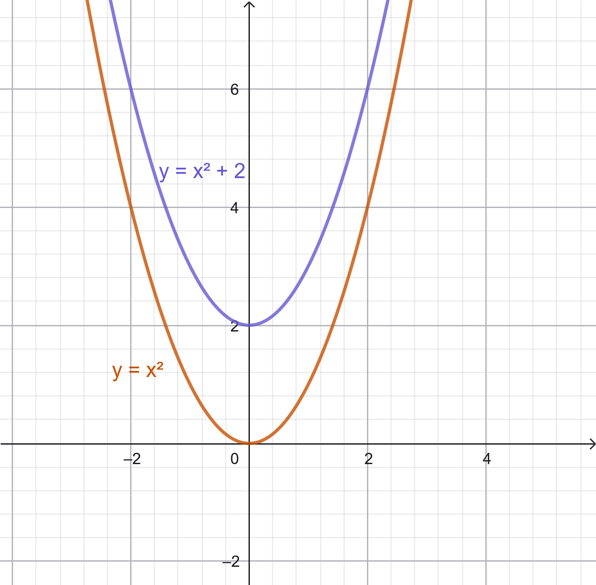
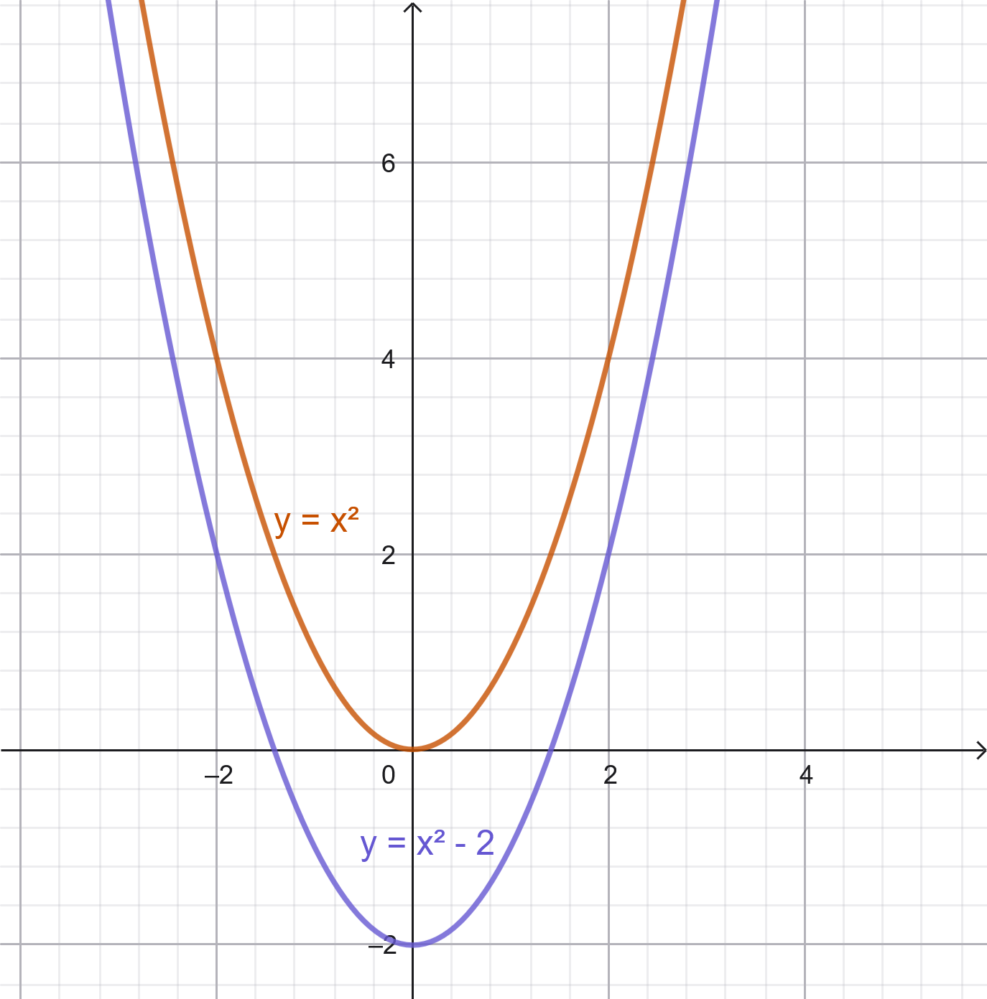
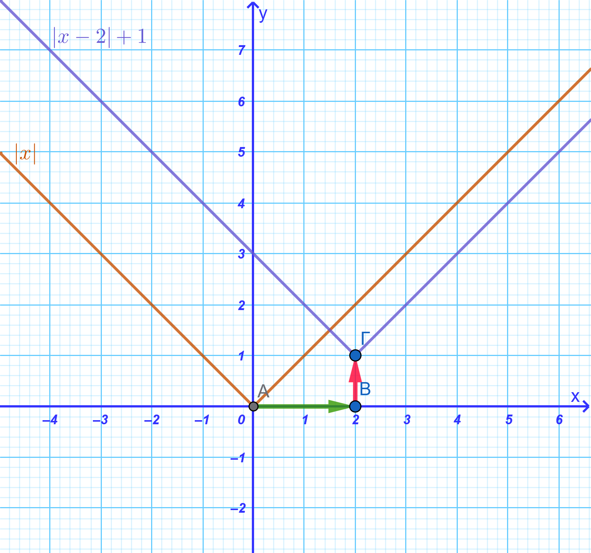
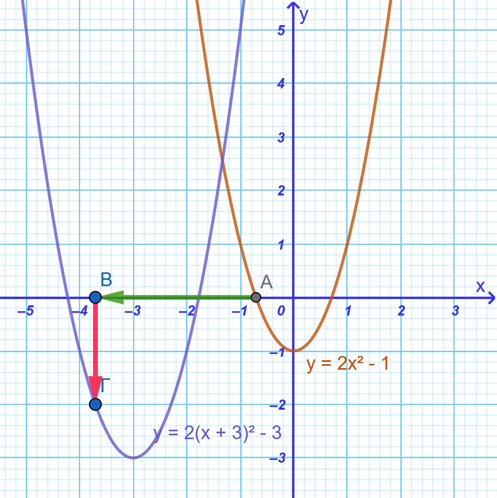
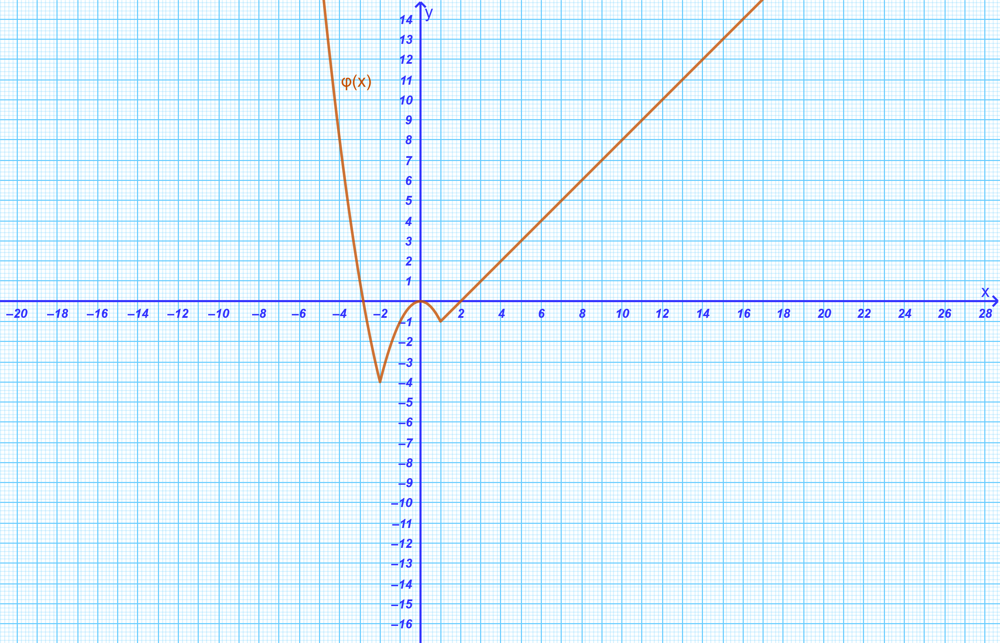

```{=html}
<!-- Φόρτωση βιβλιοθήκης GeoGebra -->
<script src="https://www.geogebra.org/apps/deployggb.js"></script>

<!-- Συνάρτηση δημιουργίας applets -->
<script>
function createGeoGebra(containerId, materialId, width = 700, height = 500) {
  var params = {
    "id": "ggb-" + containerId,
    "material_id": materialId,
    "width": width,
    "height": height,
    "showToolBar": true,
    "showMenuBar": false,
    "showAlgebraInput": true
  };
  
  var applet = new GGBApplet(params, '5.2');
  applet.inject(containerId);
}
</script>
```

## Κατακόρυφη και οριζόντια μετατόπιση καμπύλης

Η **κατακόρυφη και οριζόντια μετατόπιση** μιας καμπύλης επιτρέπει τη δημιουργία νέων γραφικών παραστάσεων βασισμένων σε μια αρχική συνάρτηση αναφοράς, όπως η $f(x) = x^2$ ή η $f(x) = |x|$.

### Κατακόρυφη μετατόπιση καμπύλης

::: {style="background-color: #d5f4e6; border: 2px solid #2f3e50; color: #25188a; padding: 15px; border-radius: 5px;"}
**Κατακόρυφη Μετατόπιση**

- Η γραφική παράσταση της συνάρτησης $f(x) = \phi(x) + c$, με $c > 0$, προκύπτει από μια **κατακόρυφη μετατόπιση** της γραφικής παράστασης της $\phi$ κατά $c$ μονάδες προς τα πάνω.

- Η γραφική παράσταση της συνάρτησης $f(x) = \phi(x) - c$, με $c > 0$, προκύπτει από μια **κατακόρυφη μετατόπιση** της γραφικής παράστασης της $\phi$ κατά $c$ μονάδες προς τα κάτω.
:::

<iframe src="https://www.geogebra.org/calculator/fnq9z5wr?embed" width="730" height="600" allowfullscreen style="border: 1px solid #e4e4e4;border-radius: 4px;" frameborder="0">

</iframe>

::: {.callout-tip style="color: brown;"}
Μετακινήστε τον δρομέα πάνω - κάτω 

- Πως μετατοπίζεται η $f(x)=φ(x)+c$ όταν το c είναι θετικό; 

- Πως μετατοπίζεται η $f(x)=φ(x)+c$ όταν το c είναι αρνητικό; 

- Τι συμβαίνει όταν c=0
:::

------------------------------------------------------------------------

### Οριζόντια μετατόπιση καμπύλης

::: {style="background-color: #d5f4e6; border: 2px solid #2f3e50; color: #25188a; padding: 15px; border-radius: 5px;"}
**Οριζόντια Μετατόπιση**

- Η γραφική παράσταση της συνάρτησης $f(x) = \phi(x - c)$, με $c > 0$, προκύπτει από μια **οριζόντια μετατόπιση** της γραφικής παράστασης της $\phi$ κατά $c$ μονάδες προς τα δεξιά.

- Η γραφική παράσταση της συνάρτησης $f(x) = \phi(x + c)$, με $c > 0$, προκύπτει από μια **οριζόντια μετατόπιση** της γραφικής παράστασης της $\phi$ κατά $c$ μονάδες προς τα αριστερά.
:::

<iframe src="https://www.geogebra.org/calculator/fjsqyqhk?embed" width="730" height="600" allowfullscreen style="border: 1px solid #e4e4e4;border-radius: 4px;" frameborder="0">

</iframe>

::: {.callout-tip style="color: brown;"}
Μετακινήστε τον δρομέα δεξιά - αριστερά 

- Πως μετατοπίζεται η $f(x)=φ(x+c)$ όταν το c είναι θετικό; 

- Πως μετατοπίζεται η $f(x)=φ(x+c)$ όταν το c είναι αρνητικό; 

- Τι συμβαίνει όταν c=0
:::

------------------------------------------------------------------------

### Συνδυασμένη Μετατόπιση

::: {style="background-color: #d5f4e6; border: 2px solid #2f3e50; color: #25188a; padding: 15px; border-radius: 5px;"}
**Συνδυασμένη Μετατόπιση**

- Όταν μια συνάρτηση έχει τη μορφή $f(x) = \phi(x \pm c) \pm k$, η καμπύλη προκύπτει από **δύο διαδοχικές μετατοπίσεις** (μία οριζόντια και μία κατακόρυφη) της αρχικής συνάρτησης $\phi$.
:::

### Παραδείγματα

- **Παράδειγμα 1:** Έστω η συνάρτηση $\phi(x) = x^2$.
  Η $f(x) = x^2 + 2$ είναι η παραβολή μετατοπισμένη κατά 2 μονάδες προς τα πάνω, ενώ η $g(x) = x^2 - 2$ είναι μετατοπισμένη κατά 2 μονάδες προς τα κάτω.\
  {width="298"} {width="291"}

- **Παράδειγμα 2:** Έστω η συνάρτηση $\phi(x) = |x|$.
  Η γραφική παράσταση της $f(x) = |x - 2| + 1$ προκύπτει μετατοπίζοντας τη $\phi$ κατά 2 μονάδες δεξιά και 1 μονάδα πάνω.\
  {width="404"}

- **Παράδειγμα 3:** Για τη συνάρτηση $\phi(x) = 2x^2 - 1$, ο τύπος της συνάρτησης που προκύπτει από μετατόπιση 3 μονάδες αριστερά και 2 μονάδες κάτω είναι $f(x) = 2(x + 3)^2 - 3$.\
  {width="431"}

------------------------------------------------------------------------

### Ασκήσεις

1.  Δίνεται η συνάρτηση $\phi(x) = -\dfrac{x^2}{2}$. Να σχεδιάσετε στο ίδιο σύστημα αξόνων τις $f(x) = -\dfrac{x^2}{2} + 2$ και $g(x) = -\dfrac{x^2}{2} - 2$.
2.  Χρησιμοποιώντας τη συνάρτηση $\phi(x) = -x^2$, να παραστήσετε γραφικά τις $f(x) = -(x - 2)^2$ και $g(x) = -(x + 2)^2$.
3.  Περιγράψτε πώς προκύπτει η γραφική παράσταση της $f(x) = (x - 1)^2 + 2$ από τη συνάρτηση $\phi(x) = x^2$.
4.  Δίνεται η συνάρτηση $\phi(x) = |x|$. Να σχεδιάσετε τις $f(x) = |x| + 2$ και $g(x) = |x| - 2$.
5.  Βάσει της $\phi(x) = |x|$, να σχεδιάσετε τις γραφικές παραστάσεις των $h(x) = |x + 3|$ και $q(x) = |x - 4|$.
6.  Να κατασκευάσετε τη γραφική παράσταση της $f(x) = |x - 3| + 2$ εκτελώντας δύο διαδοχικές μετατοπίσεις στην αρχική $y = |x|$.
7.  Να σχεδιάσετε την $g(x) = |x + 2| - 3$ ξεκινώντας από την $y = |x|$ και εξηγώντας τα βήματα των μετατοπίσεων.
8.  Δίνονται οι συναρτήσεις $φ_1(x)=2x^2-3$ και $φ_2(x)=0,5x^2+3$. Να σχεδιάσετε τις $f(x) = φ_1(x) + 1$, $g(x) = φ_1(x+2)$, $h(x) = φ_2(x) - 1$ και $r(x) = φ_2(x-2)$.
9.  Για την παρακάτω πολύκλαδη συνάρτηση φ(x) να παραστήσετε γραφικά τις συναρτήσεις :
  - α.  $ƒ(x) = φ(x) -1$ και $g(x) = φ(x) +1$
  - β.  $h(x) = φ(x + 2)$ και $r(x) = φ(x -2)$
  - γ.  $w(x) = φ(x + 3) - 2$ και $p(x) = φ(x - 3) + 2$.
  
  .\
    \
    \
    [Αντιγράψτε την εικόνα για να εργαστείτε](images\clipboard-1388650765.png)
    
10. Έστω η συνάρτηση $\phi(x) = x^2+3x - 1$. Να βρείτε τον τύπο της συνάρτησης $f$ που προκύπτει αν μετατοπίσουμε τη γραφική παράσταση της $\phi$ κατά 2 μονάδες αριστερά και 2 μονάδες κάτω.

11. Δίνεται η συνάρτηση $f(x) = x^2$. Να περιγράψετε τη μετατόπιση της συνάρτησης $g(x) = (x - 3)^2 + 4$ σε σχέση με τη γραφική παράσταση της $f(x)$.

* **Λύση:**

  * Το $(x - 3)$ δηλώνει **οριζόντια μετατόπιση κατά 3 μονάδες προς τα δεξιά**.
  * Το $+ 4$ δηλώνει **κατακόρυφη μετατόπιση κατά 4 μονάδες προς τα πάνω**.

12. Δίνεται η συνάρτηση $f(x) = |x|$. Να περιγράψετε τη μετατόπιση της $g(x) = |x + 2| - 5$ σε σχέση με την $f(x)$.

* **Λύση:** 
  
  * Το $|x + 2| = |x - (-2)|$ δηλώνει **οριζόντια μετατόπιση κατά 2 μονάδες προς τα αριστερά**.
  * Το $- 5$ δηλώνει **κατακόρυφη μετατόπιση κατά 5 μονάδες προς τα κάτω**.

13. Να βρεθεί ο τύπος της συνάρτησης $g(x)$ που προκύπτει αν μετατοπίσουμε τη γραφική παράσταση της $f(x) = x^2$ κατά **5 μονάδες προς τα αριστερά** και **2 μονάδες προς τα πάνω**.

* **Λύση:** 
  * Για τη μετατόπιση 5 μονάδες αριστερά, αντικαθιστούμε το $x$ με το $x + 5$: $f(x+5) = (x + 5)^2$.
  * Για τη μετατόπιση 2 μονάδες πάνω, προσθέτουμε $2$: 
  $$\mathbf{g(x) = (x + 5)^2 + 2}$$

14. Να βρεθεί ο τύπος της συνάρτησης $g(x)$ που προκύπτει από τη μετατόπιση της $f(x) = |x-4|$ κατά **4 μονάδες προς τα δεξιά** και **1 μονάδα προς τα κάτω**.

15. Δίνεται η ευθεία $f(x) = 2x$. Να βρεθεί ο τύπος της συνάρτησης $g(x)$ που προκύπτει αν μετατοπίσουμε την $f(x)$ κατά **3 μονάδες προς τα δεξιά** και **2 μονάδες προς τα κάτω**.

16. Να φέρετε τη συνάρτηση $g(x) = x^2 + 6x + 5$ στη μορφή $g(x) = (x - h)^2 + k$ και να περιγράψετε τις μετατοπίσεις της ως προς την αρχική συνάρτηση $f(x) = x^2$.

* **Λύση:** 
  
  * Συμπλήρωση τετραγώνου: 
    $$g(x) = x^2 + 6x + 9 - 9 + 5 = (x + 3)^2 - 4$$
  
  * **Μετατόπιση:** Η καμπύλη μετατοπίζεται κατά **3 μονάδες προς τα αριστερά** και **4 μονάδες προς τα κάτω**.

17. Δίνεται η συνάρτηση $g(x) = |x - 6| + 7$. 
  - 1. Ποιες μετατοπίσεις έχουν γίνει ως προς την $f(x) = |x|$;
  - 2. Ποιες είναι οι συντεταγμένες της κορυφής της γραφικής παράστασης;

18. Δίνεται η συνάρτηση $f(x) = |2x + 6| - 3$. Να γραφεί στη μορφή $f(x) = a|x - h| + k$ και να περιγραφούν οι μετατοπίσεις της σε σχέση με τη συνάρτηση $y = 2|x|$.

* **Λύση:** 

  * Βγάζουμε το $2$ κοινό παράγοντα μέσα από το απόλυτο:
    $$f(x) = |2(x + 3)| - 3 = 2|x + 3| - 3$$

  * **Μετατόπιση:** Σε σχέση με τη $y = 2|x|$, η καμπύλη έχει μετατοπιστεί **3 μονάδες προς τα αριστερά** και **3 μονάδες προς τα κάτω**.

19. Δίνεται η συνάρτηση $f(x) = (x - 1)^2 + 2$. Πώς πρέπει να μετατοπιστεί η $f(x)$ ώστε να συμπέσει με τη συνάρτηση $g(x) = (x + 2)^2 - 1$;

* **Λύση:** 
  
  * Οριζόντια: Από το $x - 1$ στο $x + 2 = x - (-2)$, η μεταβολή είναι $-2 - 1 = -3$. Άρα **3 μονάδες προς τα αριστερά**.
  
  * Κατακόρυφη: Από το $+2$ στο $-1$, η μεταβολή είναι $-1 - 2 = -3$. Άρα **3 μονάδες προς τα κάτω**.

20. Αν η γραφική παράσταση της $f(x) = x^2 - 2x + 3$ μετατοπιστεί κατά **4 μονάδες προς τα δεξιά** και **2 μονάδες προς τα κάτω**, να βρεθεί ο νέος τύπος της συνάρτησης $h(x)$.


------------------------------------------------------------------------


::: {.callout-tip style="color: brown;"}
ΚΑΛΗ ΜΕΛΕΤΗ!
:::

\
\
