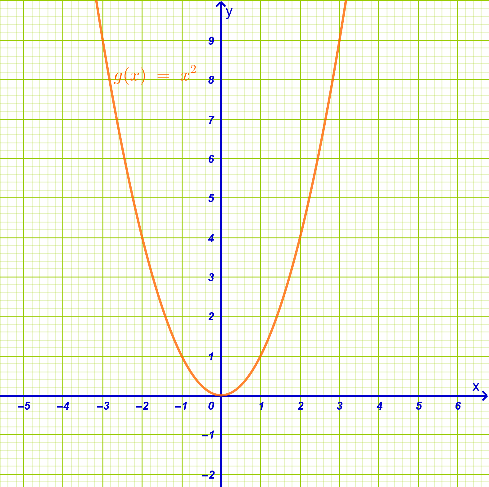
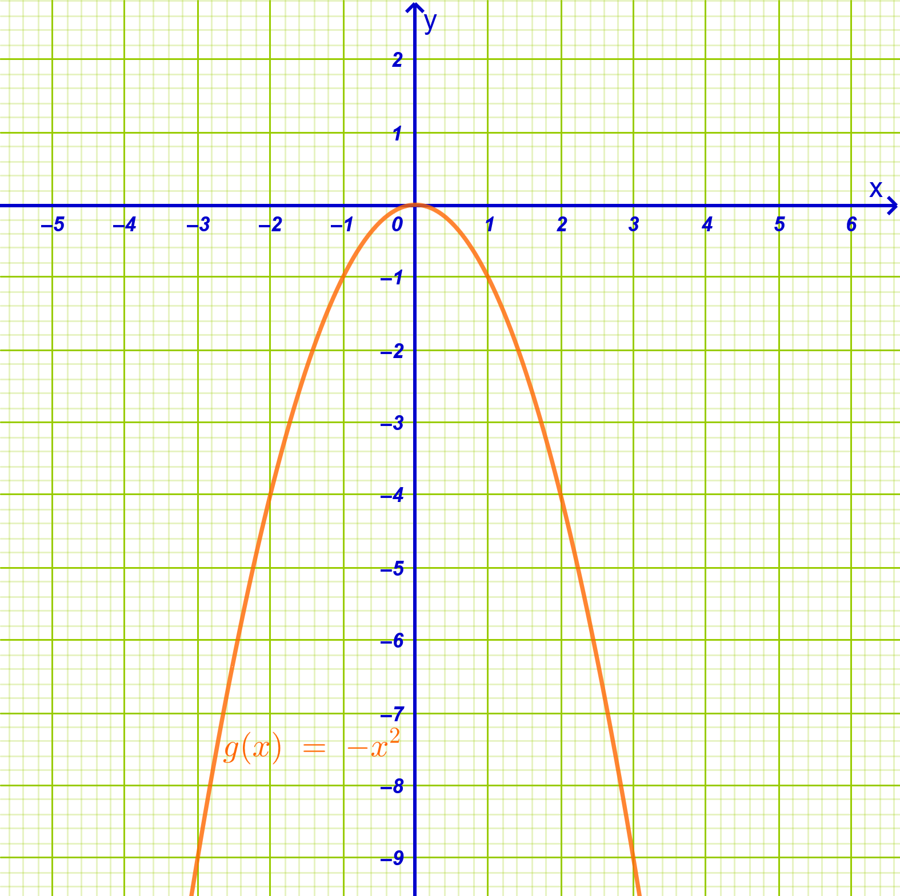
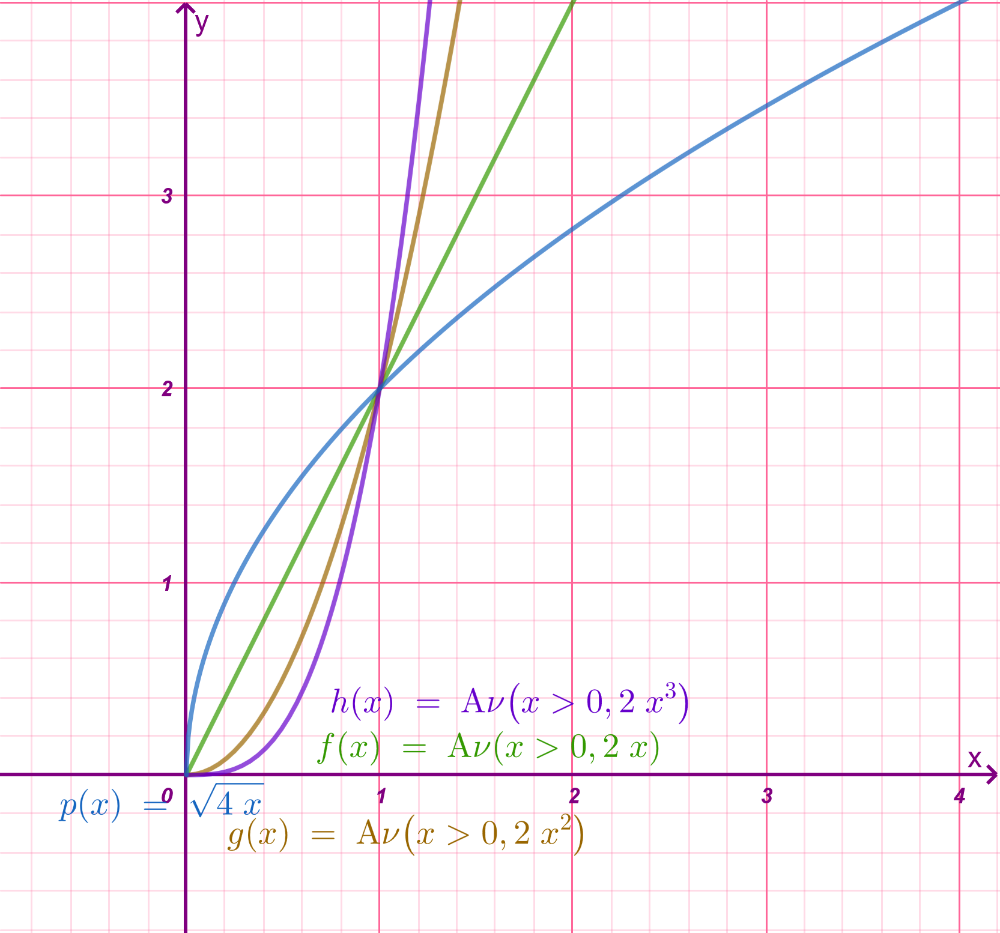
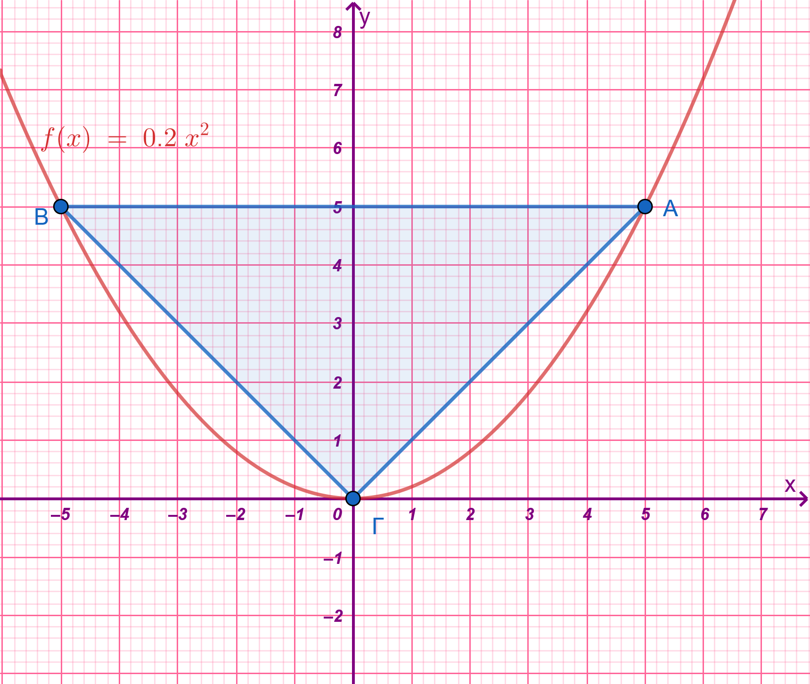

```{=html}
<!-- Φόρτωση βιβλιοθήκης GeoGebra -->
<script src="https://www.geogebra.org/apps/deployggb.js"></script>

<!-- Συνάρτηση δημιουργίας applets -->
<script>
function createGeoGebra(containerId, materialId, width = 700, height = 500) {
  var params = {
    "id": "ggb-" + containerId,
    "material_id": materialId,
    "width": width,
    "height": height,
    "showToolBar": true,
    "showMenuBar": false,
    "showAlgebraInput": true
  };
  
  var applet = new GGBApplet(params, '5.2');
  applet.inject(containerId);
}
</script>
```

## Μελέτη της συνάρτησης $f(x)=αx^2$

Με τον όρο **μελέτη μιας συνάρτησης** εννοούμε το σύνολο των εργασιών που πραγματοποιούμε προκειμένου να προσδιορίσουμε τα χαρακτηριστικά της και να σχεδιάσουμε τη **γραφική της παράσταση**.

### **Τι περιλαμβάνει η μελέτη μιας συνάρτησης**

Η διαδικασία αυτή ακολουθεί συγκεκριμένα βήματα:

1.  **Εύρεση του πεδίου ορισμού**: Προσδιορίζουμε το σύνολο των τιμών της ανεξάρτητης μεταβλητής $x$ για τις οποίες έχει νόημα η συνάρτηση.

2.  **Έλεγχος συμμετρίας**: Εξετάζουμε αν η συνάρτηση είναι **άρτια** (συμμετρική ως προς τον άξονα $y'y$) ή **περιττή** (συμμετρική ως προς την αρχή των αξόνων).

3.  **Μελέτη της μονοτονίας**: Βρίσκουμε τα διαστήματα στα οποία η συνάρτηση είναι **γνησίως αύξουσα**, **γνησίως φθίνουσα** ή σταθερή.

4.  **Εύρεση ακροτάτων**: Προσδιορίζουμε αν η συνάρτηση παρουσιάζει **μέγιστο** ή **ελάχιστο**.

5.  **Συμπεριφορά στα άκρα**: Εξετάζουμε τις τιμές της συνάρτησης όταν το $x$ πλησιάζει τα άκρα των ανοικτών διαστημάτων του πεδίου ορισμού της.

6.  **Σημεία τομής με τους άξονες**: Υπολογίζουμε τα σημεία όπου η γραφική παράσταση τέμνει τους άξονες $x'x$ (λύνοντας την $f(x)=0$) και $y'y$ (βρίσκοντας το $f(0)$).

7.  **Πίνακας μεταβολών**: Συνοψίζουμε όλα τα παραπάνω στοιχεία σε έναν πίνακα.

8.  **Σχεδιασμός**: Χαράσσουμε τη γραφική παράσταση στο καρτεσιανό επίπεδο.

### Η συνάρτηση $g(x) = x^2$

::: {style="background-color: #d5f4e6; border: 2px solid #2f3e50; color: #25188a; padding: 15px; border-radius: 5px;"}
**Μελέτη της συνάρτησης** $g(x) = x^2$

Η μελέτη της συγκεκριμένης συνάρτησης (η οποία είναι της μορφής $f(x)=\alpha x^2$ με $\alpha=1$) δίνει τα εξής αποτελέσματα:

- **Πεδίο Ορισμού**: Το σύνολο όλων των πραγματικών αριθμών, $A = \mathbb{R}$.

- **Σύνολο Τιμών**: Το διάστημα μη αρνητικών αριθμών, $[0, +\infty)$.

- **Συμμετρία**: Είναι **άρτια συνάρτηση**, καθώς για κάθε $x \in \mathbb{R}$ ισχύει $g(-x) = (-x)^2 = x^2 = g(x)$.
  Επομένως, έχει άξονα συμμετρίας τον άξονα $y'y$.

- **Μονοτονία**:

  - Στο διάστημα $(-\infty, 0]$ είναι **γνησίως φθίνουσα**.
  - Στο διάστημα $[0, +\infty)$ είναι **γνησίως αύξουσα**.

- **Ακρότατα**: Παρουσιάζει **ελάχιστο** για $x = 0$, την τιμή $g(0) = 0$.

- **Σημεία Τομής**: Η γραφική της παράσταση διέρχεται από την αρχή των αξόνων $O(0, 0)$, που είναι το μοναδικό σημείο τομής με τους δύο άξονες.

- **Γραφική Παράσταση**: Η καμπύλη της ονομάζεται **παραβολή** και βρίσκεται ολόκληρη πάνω από τον άξονα $x'x$ (εκτός από την κορυφή της στο $(0,0)$).
  Καθώς το $x$ τείνει στο $\pm\infty$, οι τιμές της συνάρτησης τείνουν στο $+\infty$.\
  {width="500"}
:::

::: {.callout-tip style="color: brown;"}
:::

### Η συνάρτηση $g(x) = -x^2$

::: {style="background-color: #d5f4e6; border: 2px solid #2f3e50; color: #25188a; padding: 15px; border-radius: 5px;"}
Η μελέτη της συνάρτησης $g(x) = -x^2$ (η οποία είναι της μορφής $f(x) = \alpha x^2$ με $\alpha = -1 < 0$) περιλαμβάνει τα εξής:

- **Πεδίο Ορισμού**: Η συνάρτηση ορίζεται για κάθε πραγματικό αριθμό, επομένως το πεδίο ορισμού της είναι το $A = \mathbb{R}$.

- **Συμμετρία**: Είναι **άρτια συνάρτηση**, καθώς για κάθε $x \in \mathbb{R}$ ισχύει $g(-x) = -(-x)^2 = -x^2 = g(x)$.
  Αυτό σημαίνει ότι η γραφική της παράσταση έχει **άξονα συμμετρίας τον άξονα** $y'y$.

- **Μονοτονία**:

  - Στο διάστημα $(-\infty, 0]$ η συνάρτηση είναι **γνησίως αύξουσα**.
  - Στο διάστημα $[0, +\infty)$ η συνάρτηση είναι **γνησίως φθίνουσα**.

- **Ακρότατα**: Επειδή ο συντελεστής $\alpha$ είναι αρνητικός ($\alpha < 0$), η συνάρτηση παρουσιάζει **μέγιστο** στην τιμή $x = 0$, το $g(0) = 0$.

- **Σύνολο Τιμών**: Το σύνολο των τιμών της είναι το διάστημα των μη θετικών πραγματικών αριθμών, δηλαδή το $(-\infty, 0]$.

- **Σημεία Τομής με τους Άξονες**: Η γραφική παράσταση διέρχεται από την **αρχή των αξόνων** $O(0, 0)$, που είναι το μοναδικό σημείο τομής με τον άξονα $x'x$ και τον άξονα $y'y$.

- **Γραφική Παράσταση**: Η καμπύλη της ονομάζεται **παραβολή** και **στρέφει τα κοίλα προς τα κάτω**.
  Η γραφική παράσταση της $g(x) = -x^2$ είναι **συμμετρική** της παράστασης της συνάρτησης $f(x) = x^2$ ως προς τον άξονα $x'x$.

- **Συμπεριφορά στα άκρα**: Όταν το $x$ τείνει στο $+\infty$ ή στο $-\infty$, οι τιμές της συνάρτησης τείνουν στο $-\infty$ ($g(x) \to -\infty$).\
  {width="500"}
:::

::: {.callout-tip style="color: brown;"}
## Παρατήρηση

Οι δύο συναρτήσεις $x^2$ και $-x^2$ είναι συμμετρικές η μια ης άλλης με άξονα συμμετρίας το άξονα $x'x$
:::

------------------------------------------------------------------------

### Η μελέτη της συνάρτησης $f(x) = \alpha x^2$

::: {style="background-color: #d5f4e6; border: 2px solid #2f3e50; color: #25188a; padding: 15px; border-radius: 5px;"}
Η μελέτη της συνάρτησης $f(x) = \alpha x^2$ με $\alpha \neq 0$, βασίζεται στα εξής κοινά χαρακτηριστικά:

- **Πεδίο Ορισμού**: Το σύνολο όλων των πραγματικών αριθμών, $A = \mathbb{R}$.

- **Συμμετρία**: Είναι **άρτια συνάρτηση**, καθώς για κάθε $x \in \mathbb{R}$ ισχύει $f(-x) = \alpha(-x)^2 = \alpha x^2 = f(x)$.
  Επομένως, η γραφική της παράσταση έχει **άξονα συμμετρίας τον άξονα** $y'y$.

- **Σημεία Τομής**: Διέρχεται πάντα από την **αρχή των αξόνων** $O(0, 0)$, που είναι το μοναδικό σημείο τομής με τους άξονες $x'x$ και $y'y$.

- **Μορφή**: Η καμπύλη της ονομάζεται **παραβολή** και έχει κορυφή το σημείο $O(0, 0)$.

#### **Όταν** $\alpha > 0$

Για θετικές τιμές του συντελεστή $\alpha$, η συνάρτηση παρουσιάζει τα εξής χαρακτηριστικά:

- **Μονοτονία**:

  - Στο διάστημα $(-\infty, 0]$ είναι **γνησίως φθίνουσα**.
  - Στο διάστημα $[0, +\infty)$ είναι **γνησίως αύξουσα**.

- **Ακρότατα**: Παρουσιάζει **ελάχιστο** για $x = 0$, την τιμή $f(0) = 0$.

- **Σύνολο Τιμών**: Το διάστημα $[0, +\infty)$.

- **Γραφική Παράσταση**: Η παραβολή βρίσκεται ολόκληρη πάνω από τον άξονα $x'x$ (με εξαίρεση την κορυφή της) και **στρέφει τα κοίλα προς τα πάνω**.

- **Συμπεριφορά στα άκρα**: Καθώς το $x$ τείνει στο $+\infty$ ή στο $-\infty$, οι τιμές της συνάρτησης τείνουν στο $+\infty$ ($f(x) \to +\infty$).

#### **Όταν** $\alpha < 0$

Για αρνητικές τιμές του συντελεστή $\alpha$, η συνάρτηση παρουσιάζει την αντίστροφη συμπεριφορά:

- **Μονοτονία**:

  - Στο διάστημα $(-\infty, 0]$ είναι **γνησίως αύξουσα**.
  - Στο διάστημα $[0, +\infty)$ είναι **γνησίως φθίνουσα**.

- **Ακρότατα**: Παρουσιάζει **μέγιστο** για $x = 0$, την τιμή $f(0) = 0$.

- **Σύνολο Τιμών**: Το διάστημα $(-\infty, 0]$.

- **Γραφική Παράσταση**: Η παραβολή βρίσκεται ολόκληρη κάτω από τον άξονα $x'x$ (με εξαίρεση την κορυφή της) και **στρέφει τα κοίλα προς τα κάτω**.

- **Συμπεριφορά στα άκρα**: Καθώς το $x$ τείνει στο $\pm\infty$, οι τιμές της συνάρτησης τείνουν στο $-\infty$ ($f(x) \to -\infty$).

#### **Επίδραση της τιμής του** $\alpha$ στο "άνοιγμα" της παραβολής

Η απόλυτη τιμή του συντελεστή $\alpha$ ($|\alpha|$) καθορίζει πόσο "ανοικτή" ή "κλειστή" είναι η παραβολή:

- Καθώς **μεγαλώνει η τιμή του** $|\alpha|$, η παραβολή γίνεται πιο **"κλειστή"** και πλησιάζει προς τον άξονα $y'y$.

- Καθώς **μικραίνει η τιμή του** $|\alpha|$, η παραβολή γίνεται πιο **"ανοικτή"** και πλησιάζει προς τον άξονα $x'x$.

- **Συμμετρία**: Για αντίθετες τιμές του $\alpha$ (π.χ. $y = 2x^2$ και $y = -2x^2$), οι παραβολές είναι **συμμετρικές ως προς τον άξονα** $x'x$.\
:::

\

<iframe src="https://www.geogebra.org/calculator/hxa2ye9u?embed" width="730" height="600" allowfullscreen style="border: 1px solid #e4e4e4;border-radius: 4px;" frameborder="0">

</iframe>

\

::: {.callout-tip style="color: brown;"}
## Οδηγία

Επιλέξτε τον δρομέα

Πατήστε [Shift]{.kbd} + [\>]{.kbd} για να αυξήσετε με βήμα 0,1 την τιμή του α.

Πατήστε [Shift]{.kbd} + [\<]{.kbd} για να μειώσετε με βήμα 0,1 την τιμή του α.

Τι παρατητείτε σε κάθε περίπτωση;

:::

------------------------------------------------------------------------

### Μελέτη της συνάρτησης $φ(x)=αx^3$

::: {style="background-color: #d5f4e6; border: 2px solid #2f3e50; color: #25188a; padding: 15px; border-radius: 5px;"}
Η μελέτη της συνάρτησης $\phi(x) = \alpha x^3$ (με $\alpha \neq 0$), περιλαμβάνει τα εξής στάδια:

**1. Πεδίο Ορισμού**

Η συνάρτηση είναι **πολυωνυμική**, επομένως ορίζεται για κάθε πραγματικό αριθμό $x$.
Το πεδίο ορισμού της είναι το $A = \mathbb{R}$.

**2. Συμμετρία**

Η συνάρτηση $\phi(x) = \alpha x^3$ είναι **περιττή**.

- Αυτό ισχύει διότι για κάθε $x \in \mathbb{R}$, το $-x \in \mathbb{R}$ και ισχύει:\
  $\phi(-x) = \alpha(-x)^3 = \alpha(-x^3) = -\alpha x^3 = -\phi(x)$.

- Λόγω της ιδιότητας αυτής, η γραφική της παράσταση έχει **κέντρο συμμετρίας την αρχή των αξόνων** $O(0, 0)$.

**3. Μονοτονία**

Η μονοτονία της συνάρτησης εξαρτάται από το πρόσημο του συντελεστή $\alpha$:

- **Αν** $\alpha > 0$: Η συνάρτηση είναι **γνησίως αύξουσα** σε όλο το $\mathbb{R}$.\
  *Επεξήγηση:* Για $x_1 < x_2$ ισχύει $x_1^3 < x_2^3$, οπότε $\alpha x_1^3 < \alpha x_2^3$.

- **Αν** $\alpha < 0$: Η συνάρτηση είναι **γνησίως φθίνουσα** σε όλο το $\mathbb{R}$.\
  *Επεξήγηση:* Για $x_1 < x_2$ ισχύει $x_1^3 < x_2^3$, αλλά επειδή ο $\alpha$ είναι αρνητικός, η φορά της ανισότητας αλλάζει: $\alpha x_1^3 > \alpha x_2^3$.

**4. Σημεία Τομής με τους Άξονες**

- Η γραφική παράσταση διέρχεται από την **αρχή των αξόνων** $O(0, 0)$, καθώς για $x=0$ προκύπτει $\phi(0) = 0$.

- Είναι το μοναδικό σημείο τομής και με τους δύο άξονες ($x'x$ και $y'y$).

**5. Γραφική Παράσταση**

Η γραφική παράσταση της $\phi(x) = \alpha x^3$ ονομάζεται **κυβική παραβολή**.

- Για $\alpha = 1$ ($f(x) = x^3$), μερικές χαρακτηριστικές τιμές είναι: $(-2, -8), (-1, -1), (0, 0), (1, 1), (2, 8)$.

- Στο διάστημα $(0, 1)$, η καμπύλη της $y = x^3$ βρίσκεται **χαμηλότερα** από τις γραφικές παραστάσεις των $y = x^2$ και $y = x$.

- Καθώς το $x$ τείνει στο $+\infty$, η συνάρτηση τείνει στο $+\infty$ (αν $\alpha > 0$) ή στο $-\infty$ (αν $\alpha < 0$).

**Συνοπτικός Πίνακας Τιμών (για** $\alpha = 1$):

| $x$       | -3  | -2  | -1  |  0  |  1  |  2  |  3  |
|:----------|:---:|:---:|:---:|:---:|:---:|:---:|:---:|
| $\phi(x)$ | -27 | -8  | -1  |  0  |  1  |  8  | 27  |
:::

\

<iframe src="https://www.geogebra.org/calculator/dtrffevs?embed" width="730" height="700" allowfullscreen style="border: 1px solid #e4e4e4;border-radius: 4px;" frameborder="0">

</iframe>

\

::: {.callout-tip style="color: brown;"}
## Οδηγία

Επιλέξτε τον δρομέα

Πατήστε [Shift]{.kbd} + [\>]{.kbd} για να αυξήσετε με βήμα 0,1 την τιμή του α.

Πατήστε [Shift]{.kbd} + [\<]{.kbd} για να μειώσετε με βήμα 0,1 την τιμή του α.

Τι παρατητείτε σε κάθε περίπτωση;

:::

------------------------------------------------------------------------

### Ασκήσεις

**I. Βασική Μελέτη (Πεδίο Ορισμού, Μονοτονία, Ακρότατα)**

1.  Να γίνει η πλήρης μελέτη (πεδίο ορισμού, μονοτονία, ακρότατα, πίνακας μεταβολών) της συνάρτησης $f(x) = 2x^2$.
2.  Να γίνει η πλήρης μελέτη της συνάρτησης $f(x) = -3x^2$.
3.  Να βρεθεί το σύνολο τιμών των συναρτήσεων $g(x) = 5x^2$ και $h(x) = -7x^2$.
4.  Να εξετάσετε τη μονοτονία της συνάρτησης $f(x) = \dfrac{1}{2}x^2$ στα διαστήματα $(-\infty, 0]$ και $[0, +\infty)$.
5.  Να εξετάσετε τη μονοτονία της συνάρτησης $f(x) = -4x^2$ στα διαστήματα $(-\infty, 0]$ και $[0, +\infty)$.

**II. Εύρεση Παραμέτρων και Σημείων**

6.  Να βρείτε την τιμή του $\alpha$, ώστε η γραφική παράσταση της συνάρτησης $f(x) = \alpha x^2$ να διέρχεται από το σημείο $A(2, 8)$.
7.  Να προσδιορίσετε τον πραγματικό αριθμό $\alpha$, αν το σημείο $M(-1, -5)$ ανήκει στην παραβολή $y = \alpha x^2$.
8.  Για ποια τιμή του $\alpha$ η συνάρτηση $f(x) = \alpha x^2$ παρουσιάζει **ελάχιστο** και η γραφική της παράσταση διέρχεται από το σημείο $P(3, 75)$;
9.  Να βρείτε τα σημεία τομής της παραβολής $f(x) = 4x^2$ με την ευθεία $y = 16$.
10. Να βρεθεί ο πραγματικός αριθμός $\alpha$, ώστε η $f(x) = \alpha x^2$ να ικανοποιεί τη σχέση $f(1) + f(2) = 20$ (Σημείωση: Απαιτεί αλγεβρικό υπολογισμό βάσει του τύπου της συνάρτησης).

**III. Ιδιότητες και Συμμετρία**

11. Να αποδείξετε αλγεβρικά ότι η συνάρτηση $f(x) = \alpha x^2$ είναι **άρτια** για οποιαδήποτε τιμή του $\alpha \neq 0$.
12. Ποιος είναι ο **άξονας συμμετρίας** και ποια η **κορυφή** της παραβολής $y = -10x^2$;
13. Αν $f(x) = \alpha x^2$ και $f(3) = 18$, να βρείτε την τιμή $f(-3)$ χρησιμοποιώντας την ιδιότητα της συμμετρίας της.
14. Να δείξετε ότι η γραφική παράσταση της $f(x) = \alpha x^2$ διέρχεται από την **αρχή των αξόνων** $O(0, 0)$ για κάθε τιμή του $\alpha$.

**IV. Συγκριτική Μελέτη και "Άνοιγμα" Παραβολής**

15. Να σχεδιάσετε στο ίδιο σύστημα αξόνων τις παραβολές $y = x^2$, $y = 2x^2$ και $y = 0,5x^2$. Ποια είναι η πιο "κλειστή" ως προς τον άξονα $y'y$;
16. Να συγκρίνετε το "άνοιγμα" των παραβολών $y = -4x^2$ και $y = -x^2$. Ποια πλησιάζει περισσότερο τον άξονα $x'x$;
17. Να περιγράψετε τη γεωμετρική σχέση (συμμετρία) των γραφικών παραστάσεων των συναρτήσεων $f(x) = 4x^2$ και $g(x) = -4x^2$.
18. Έστω οι συναρτήσεις $f(x) = \alpha_1 x^2$ και $g(x) = \alpha_2 x^2$. Αν $|\alpha_1| > |\alpha_2|$, ποια από τις δύο παραβολές έχει μεγαλύτερο "άνοιγμα";

**V. Σύνθετες Ασκήσεις**

19. Να βρείτε την τιμή του $\alpha$ ώστε η απόσταση του σημείου $M(1, f(1))$ της παραβολής $f(x) = \alpha x^2$ από την αρχή των αξόνων $O(0,0)$ να είναι ίση με $\sqrt{5}$.
20. Να προσδιορίσετε τα διαστήματα του $x$ για τα οποία η γραφική παράσταση της $f(x) = 2x^2$ βρίσκεται **πάνω** από την ευθεία $y = 8$.
21. Να σχεδιάσετε στο ίδιο σύστημα συντεταγμένων τις γραφικές παραστάσεις των συναρτήσεων

$ƒ(x) = 2x^2$ και g(x) = 2 και με τη βοήθεια αυτών να λύσετε τις ανισώσεις:

- α.
  $2x^2 ≤ 2$ και $2x^2 > 2$.

- β.
  Να τις λύσετε αλγεβρικά για να βεβαιωθείτε ότι τα προηγούμενα συμπεράσματα είναι σωστά.

22. Να μελετήσετε την συνάρτηση

$$
φ(x)=
\begin{cases}
-2x^2, \:\: \text{ Αν } \:\:\  x\le0 \\
x,\:\: \text{ Αν } \:\:\  x\gt0
\end{cases}
$$

23. Για το παρακάτω σχήμα να κάνετε τα εξής

- α. Στο διάστημα $(0,2)$ να βάλετε σε αύξουσα σειρά τις τιμές των συναρτήσεων
- β. Στο διάστημα $(2,+\infty)$ να βάλετε σε αύξουσα σειρά τις τιμές των συναρτήσεων
- 
  g.  να διαπιστώσετε και αλγεβρικά τα συμπεράσματά σας.\
      \
      {width="500"}

24. Να βρείτε το εμβαδόν του τιγώνου ΑΒΓ\
    \
    {width="500"}

------------------------------------------------------------------------

::: {.callout-tip style="color: brown;"}
ΚΑΛΗ ΜΕΛΕΤΗ!
:::

\
\
