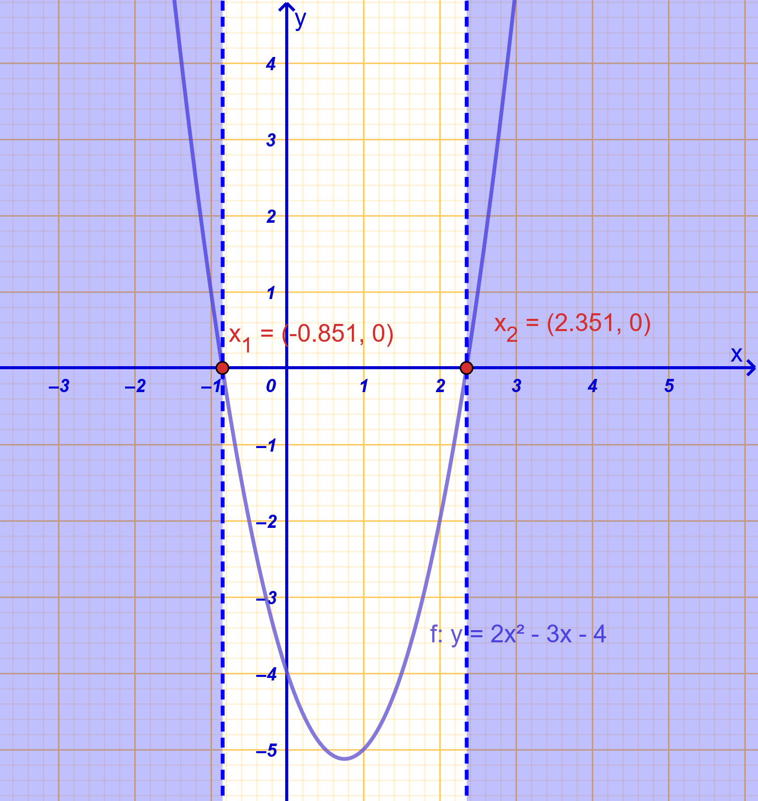
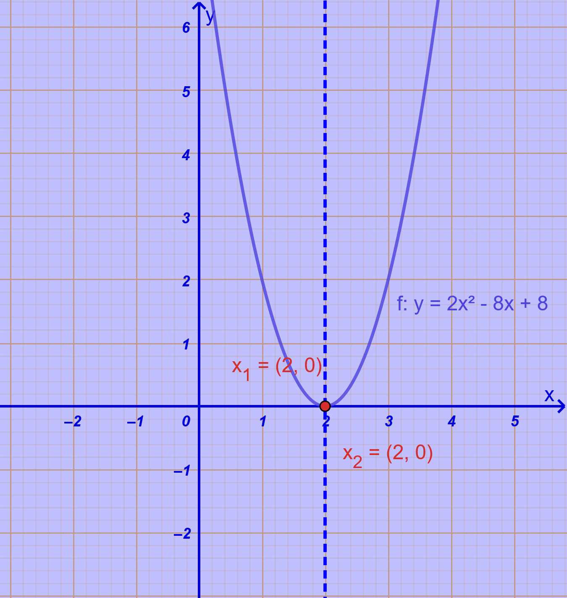
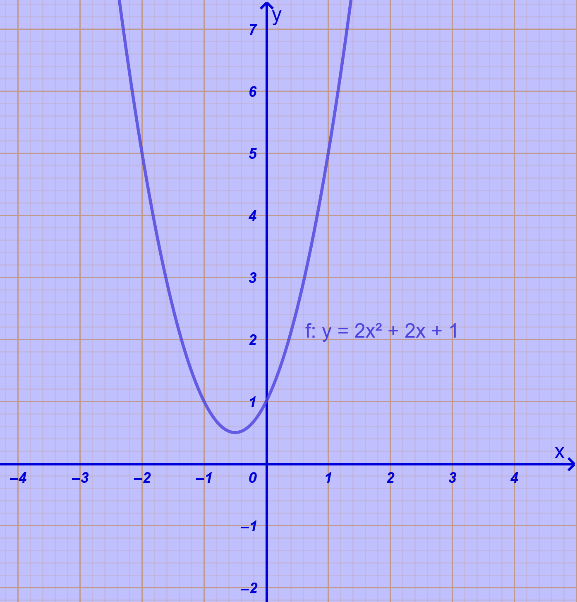
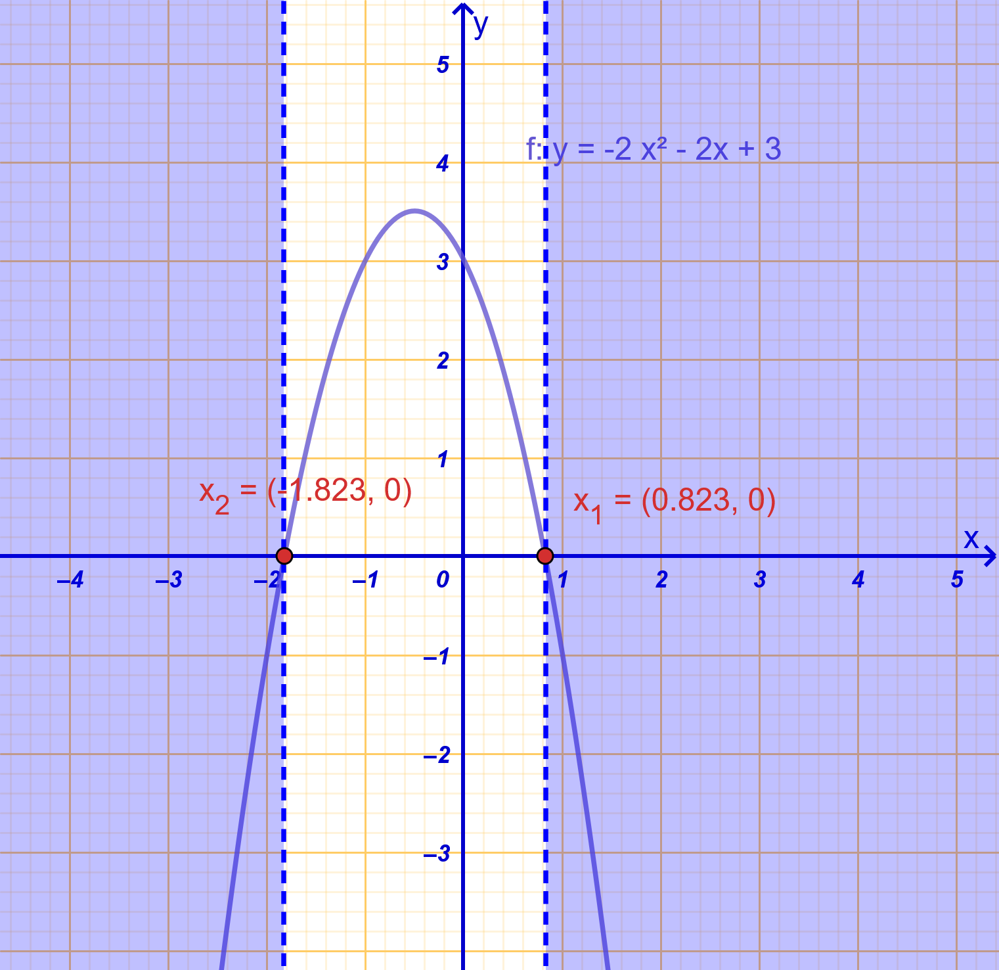
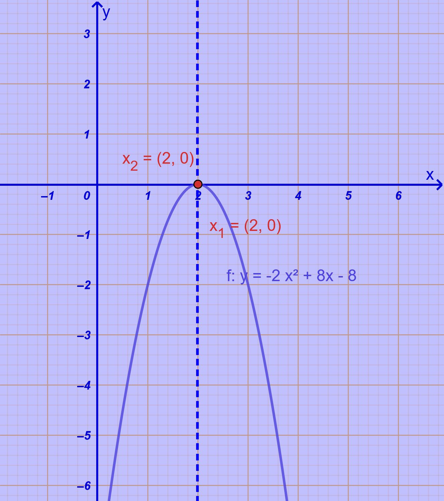
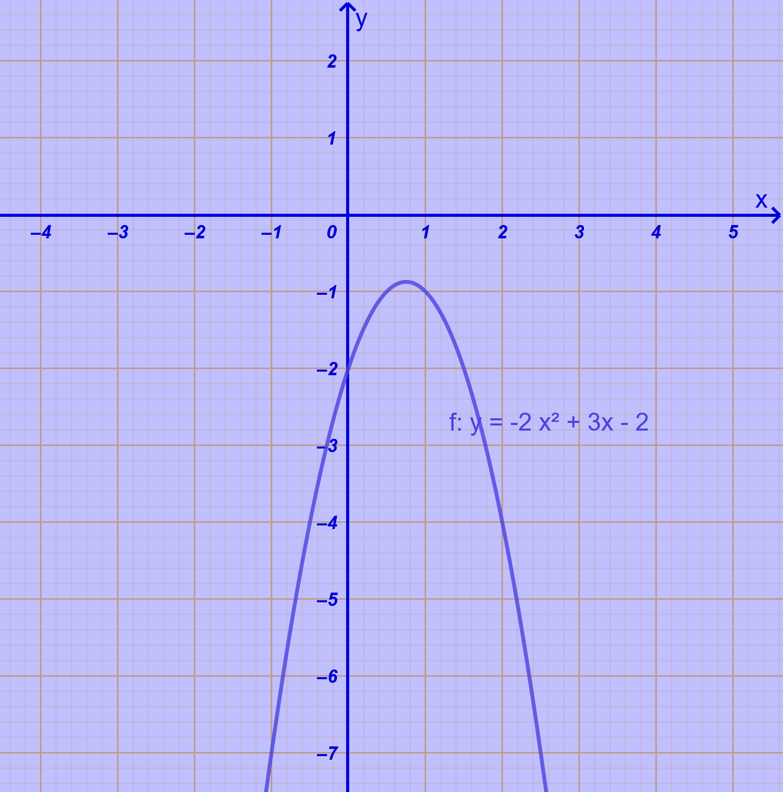
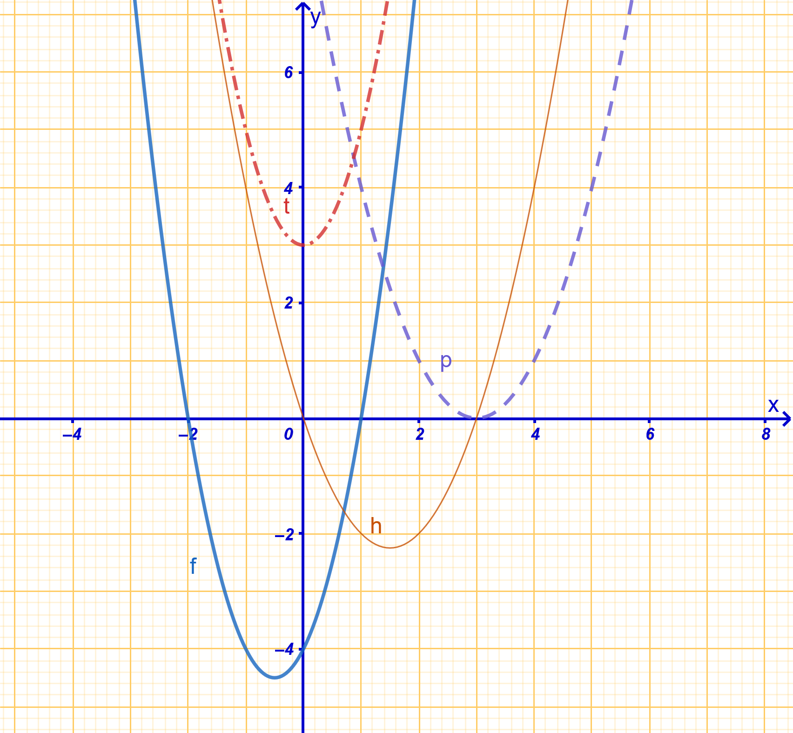
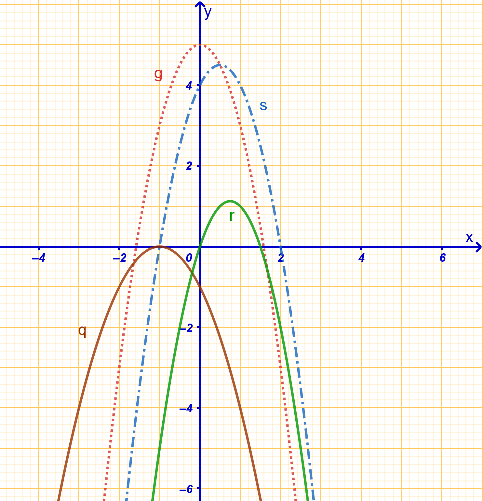

```{=html}
<!-- Φόρτωση βιβλιοθήκης GeoGebra -->
<script src="https://www.geogebra.org/apps/deployggb.js"></script>

<!-- Συνάρτηση δημιουργίας applets -->
<script>
function createGeoGebra(containerId, materialId, width = 700, height = 500) {
  var params = {
    "id": "ggb-" + containerId,
    "material_id": materialId,
    "width": width,
    "height": height,
    "showToolBar": true,
    "showMenuBar": false,
    "showAlgebraInput": true
  };
  
  var applet = new GGBApplet(params, '5.2');
  applet.inject(containerId);
}
</script>
```

## Μελέτη της συνάρτησης $f(x)=αx^2+βx+γ$

### Η **συμπλήρωση τετραγώνου** είναι μια αλγεβρική μέθοδος

που χρησιμοποιείται για να μετασχηματίσει ένα τριώνυμο ή μια δευτεροβάθμια παράσταση σε μορφή που περιέχει το **τέλειο τετράγωνο ενός διωνύμου**.
Η τεχνική αυτή είναι θεμελιώδης για την επίλυση δευτεροβάθμιων εξισώσεων, τη μελέτη των μετατοπίσεων μιας παραβολής και την παραγοντοποίηση σύνθετων παραστάσεων.

#### Η Διαδικασία της Μεθόδου

Για μια δευτεροβάθμια εξίσωση της μορφής $\alpha x^2 + \beta x + \gamma = 0$ (με $\alpha \neq 0$), η μέθοδος ακολουθεί τα εξής βήματα:

Η διαδικασία περιλαμβάνει τα εξής αναλυτικά βήματα:

1.  **Διαίρεση ή εξαγωγή του συντελεστή** $\alpha$: Για να διευκολυνθεί η διαδικασία, ο συντελεστής του $x^2$ πρέπει να γίνει 1.
    Αν εργαζόμαστε με την παράσταση $ax^2 + \beta x + \gamma$, ϐγάζουμε το $a$ ως κοινό παράγοντα: $a\left(x^2 + \dfrac{\beta}{\alpha}x + \dfrac{\gamma}{\alpha}\right)$.

2.  **Εμφάνιση του διπλάσιου γινομένου**: Ο μεσαίος όρος $\dfrac{\beta}{\alpha}x$ γράφεται με τέτοιο τρόπο ώστε να εμφανίζεται το διπλάσιο γινόμενο που απαιτεί η ταυτότητα $(A+B)^2 = A^2 + 2AB + B^2$.
    Συγκεκριμένα, ο όρος γίνεται: $2 \cdot x \cdot \dfrac{\beta}{2\alpha}$.

3.  **Προσθαφαίρεση του κατάλληλου όρου**: Για να «συμπληρωθεί» η ταυτότητα, προσθέτουμε και ταυτόχρονα αφαιρούμε (ώστε να μη μεταβληθεί η αξία της παράστασης) το **τετράγωνο του δεύτερου όρου** του γινομένου, δηλαδή το $\left(\dfrac{\beta}{2\alpha}\right)^2 = \dfrac{\beta^2}{4\alpha^2}$.

4.  **Σχηματισμός της ταυτότητας**: Οι τρεις πρώτοι όροι της παράστασης $\left(x^2 + 2x\dfrac{\beta}{2\alpha} + \dfrac{\beta^2}{4\alpha^2}\right)$ αποτελούν πλέον το ανάπτυγμα της ταυτότητας $\left(x + \dfrac{\beta}{2\alpha}\right)^2$.

5.  **Τελική απλοποίηση και μορφή**: Η παράσταση παίρνει τη μορφή $a\left[\left(x + \dfrac{\beta}{2\alpha}\right)^2 - \dfrac{\beta^2-4\alpha\gamma}{4\alpha^2}\right]$.
    Αν χρησιμοποιήσουμε τη **διακρίνουσα** $\Delta = \beta^2 - 4\alpha\gamma$, η τελική κανονική μορφή είναι: $$f(x) = a \left[ \left(x + \dfrac{\beta}{2\alpha}\right)^2 - \dfrac{\Delta}{4\alpha^2} \right]$$.

#### Βασικές Εφαρμογές

- **Επίλυση Εξισώσεων**: Επιτρέπει την εύρεση των ριζών μιας εξίσωσης 2ου βαθμού χωρίς την άμεση χρήση του έτοιμου τύπου, απομονώνοντας το τετράγωνο στο ένα μέλος.

- **Γεωμετρική Ερμηνεία και Μετατοπίσεις**: Χρησιμοποιείται για να αποδειχθεί ότι η γραφική παράσταση της $f(x) = \alpha x^2 + \beta x + \gamma$ προκύπτει από δύο διαδοχικές μετατοπίσεις (οριζόντια και κατακόρυφη) της βασικής παραβολής $y = \alpha x^2$.

- **Παραγοντοποίηση**: Βοηθά στη μετατροπή αλγεβρικών αθροισμάτων σε γινόμενα, ειδικά σε περιπτώσεις όπου λείπει ένας όρος για να σχηματιστεί ταυτότητα (π.χ. στην παράσταση $\alpha^4 + \beta^4 + \alpha^2\beta^2$).

- **Εύρεση Ακροτάτων**: Η μορφή που προκύπτει από τη συμπλήρωση τετραγώνου αποκαλύπτει αμέσως την **κορυφή της παραβολής** $K\left(-\dfrac{\beta}{2\alpha}, -\dfrac{\Delta}{4\alpha}\right)$, η οποία αντιστοιχεί στο μέγιστο ή ελάχιστο της συνάρτησης.

### Η $f(x)=αx^2+βx+γ$ ώς μετατόπιση της $f(x)=αx^2$

::: {style="background-color: #d5f4e6; border: 2px solid #2f3e50; color: #25188a; padding: 15px; border-radius: 5px;"}
Η γραφική παράσταση της συνάρτησης $f(x) = \alpha x^2 + \beta x + \gamma$ είναι μια **παραβολή** που προκύπτει από δύο διαδοχικές μετατοπίσεις της βασικής παραβολής $g(x) = \alpha x^2$.

Για να γίνουν εμφανείς αυτές οι μετατοπίσεις, ο τύπος της συνάρτησης μετασχηματίζεται μέσω της μεθόδου **συμπλήρωσης τετραγώνου** στην κανονική μορφή $f(x) = \alpha \left(x + \dfrac{\beta}{2\alpha}\right)^2 - \dfrac{\Delta}{4\alpha}$, όπου $\Delta = \beta^2 - 4\alpha\gamma$ είναι η διακρίνουσα.

Συγκεκριμένα, η διαδικασία περιλαμβάνει τα εξής βήματα:

- **Οριζόντια Μετατόπιση:** Η παραβολή $y = \alpha x^2$ μετατοπίζεται οριζόντια κατά τον άξονα $x'x$ κατά $-\dfrac{\beta}{2\alpha}$ μονάδες.
  Αν η τιμή $-\dfrac{\beta}{2\alpha}$ είναι θετική, η καμπύλη μετατοπίζεται προς τα **δεξιά**, ενώ αν είναι αρνητική, μετατοπίζεται προς τα **αριστερά**.

- **Κατακόρυφη Μετατόπιση:** Στη συνέχεια, η παραβολή μετατοπίζεται κατακόρυφα κατά τον άξονα $y'y$ κατά $-\dfrac{\Delta}{4\alpha}$ (ή ισοδύναμα $\dfrac{4\alpha\gamma - \beta^2}{4\alpha}$) μονάδες.
  Η μετατόπιση γίνεται προς τα **πάνω** αν η τιμή είναι θετική και προς τα **κάτω** αν είναι αρνητική.

Ως αποτέλεσμα αυτών των μετατοπίσεων, η **κορυφή** της παραβολής μεταφέρεται από το σημείο $O(0,0)$ στο σημείο $K\left(-\dfrac{\beta}{2\alpha}, -\dfrac{\Delta}{4\alpha}\right)$.
Παράλληλα, ο **άξονας συμμετρίας** της συνάρτησης παύει να είναι ο άξονας $y'y$ και γίνεται η ευθεία $x = -\dfrac{\beta}{2\alpha}$.
:::

------------------------------------------------------------------------

### Μελέτη της συνάρτησης $f(x)=αx^2+βx+γ$ με $\alpha \neq 0$

::: {style="background-color: #d5f4e6; border: 2px solid #2f3e50; color: #25188a; padding: 15px; border-radius: 5px;"}
**Θεωρία, Ορισμοί και Ιδιότητες**

**Ορισμός και Πεδίο Ορισμού**

- **Ορισμός:** Η συνάρτηση $f(x) = \alpha x^2 + \beta x + \gamma$, με $\alpha, \beta, \gamma \in \mathbb{R}$ και $\alpha \neq 0$, ονομάζεται πολυωνυμική συνάρτηση δευτέρου βαθμού ή τριώνυμο.

- **Πεδίο Ορισμού:** Επειδή είναι πολυωνυμική, ορίζεται για κάθε πραγματικό αριθμό, άρα $A = \mathbb{R}$.

**Κανονική Μορφή και Διακρίνουσα**

- **Κανονική Μορφή:** Κάθε τριώνυμο μπορεί να γραφτεί στη μορφή $f(x) = \alpha \left[ (x + \dfrac{\beta}{2\alpha})^2 - \dfrac{\Delta}{4\alpha^2} \right]$, όπου $\Delta = \beta^2 - 4\alpha\gamma$ είναι η **διακρίνουσα**.

- **Ρίζες:** Οι ρίζες της εξίσωσης $f(x) = 0$ εξαρτώνται από τη διακρίνουσα:

  - Αν $\Delta > 0$, υπάρχουν δύο άνισες πραγματικές ρίζες: $x_{1,2} = \dfrac{-\beta \pm \sqrt{\Delta}}{2\alpha}$.
  - Αν $\Delta = 0$, υπάρχει μία διπλή πραγματική ρίζα: $x_0 = -\dfrac{\beta}{2\alpha}$.
  - Αν $\Delta < 0$, δεν υπάρχουν πραγματικές ρίζες.

**Μονοτονία και Ακρότατα**

Η μονοτονία της συνάρτησης αλλάζει στην τιμή $x = -\dfrac{\beta}{2\alpha}$:

- **Αν** $\alpha > 0$: Η συνάρτηση είναι **γνησίως φθίνουσα** στο $\left(-\infty, -\dfrac{\beta}{2\alpha}\right]$ και **γνησίως αύξουσα** στο $\left[-\dfrac{\beta}{2\alpha}, +\infty\right)$.
  Παρουσιάζει **ολικό ελάχιστο** το $f\left(-\dfrac{\beta}{2\alpha}\right) = -\dfrac{\Delta}{4\alpha}$.

- **Αν** $\alpha < 0$: Η συνάρτηση είναι **γνησίως αύξουσα** στο $\left(-\infty, -\dfrac{\beta}{2\alpha}\right]$ και **γνησίως φθίνουσα** στο $\left[-\dfrac{\beta}{2\alpha}, +\infty\right)$.
  Παρουσιάζει **ολικό μέγιστο** το $f\left(-\dfrac{\beta}{2\alpha}\right) = -\dfrac{\Delta}{4\alpha}$.

**Γραφική Παράσταση**

- Η γραφική παράσταση της $f$ είναι μια καμπύλη που ονομάζεται **παραβολή**.

- Έχει **κορυφή** το σημείο $K\left(-\dfrac{\beta}{2\alpha}, -\dfrac{\Delta}{4\alpha}\right)$ και **άξονα συμμετρίας** την ευθεία $x = -\dfrac{\beta}{2\alpha}$.

- Τέμνει τον άξονα $y'y$ στο σημείο $(0, \gamma)$.
:::

<iframe src="https://www.geogebra.org/calculator/ubmfzrpt?embed" width="730" height="700" allowfullscreen style="border: 1px solid #e4e4e4;border-radius: 4px;" frameborder="0">

</iframe>

\

::: {.callout-tip style="color: blue;"}
## Οδηγία

Στην παραπάνω ενσωματωμένη μικροεφαρμογή geogebra

Αφου επιλέξετε έναν δρομέα:

Πατήστε [Shift]{.kbd} + [\>]{.kbd} για να αυξήσετε με βήμα 0,1 την τιμή του α, β ή γ.

Πατήστε [Shift]{.kbd} + [\<]{.kbd} για να μειώσετε με βήμα 0,1 την τιμή του α, β ή γ.

1.  Μετακινήστε τον δρομέα α για να δείτε τι συμβαίνει όταν αλλάζει το α της συνάρτησης.

2.  Μετακινήστε τον δρομέα γ ώστε να είναι μηδέν.
    Αλλάξτε την τιμή των α και β και παρατηρήστε τι συμβαίνει στην γραφική παράσταση.

3.  Κάντε το β μηδέν και μετακινήστε τα α και β.
    τι παρατηρείτε;
:::

------------------------------------------------------------------------

### Πίνακες Αποτελεσμάτων Μελέτης

::: {style="background-color: #d5f4e6; border: 2px solid #2f3e50; color: #25188a; padding: 15px; border-radius: 5px;"}
**Πίνακας Μονοτονίας και Ακροτάτων**

| $x$ | $-\infty$ | $-\frac{\beta}{2\alpha}$ | $+\infty$ |
|:-----------------|:----------------:|:----------------:|:----------------:|
| $f(x)$ ($\alpha > 0$) | $\searrow$ | Ελάχιστο: $-\dfrac{\Delta}{4\alpha}$ | $\nearrow$ |
| $f(x)$ ($\alpha < 0$) | $\nearrow$ | Μέγιστο: $-\dfrac{\Delta}{4\alpha}$ | $\searrow$ |

------------------------------------------------------------------------

**Πίνακας Προσήμου Τριωνύμου**

| $\Delta$ | $x$ | $-\infty$ | $x_1$ |   | $x_2$ | $+\infty$ |
|:----------|:----------|:---------:|:---------:|:---------:|:---------:|:---------:|
| $\Delta > 0$ | $f(x)$ | Ομόσημο $\alpha$ | $0$ | Ετερόσημο $\alpha$ | $0$ | Ομόσημο $\alpha$ |
| $\Delta = 0$ | $f(x)$ ($x \neq x_0$) | Ομόσημο $\alpha$ |  | $0$ ($x=x_0$) |  | Ομόσημο $\alpha$ |
| $\Delta < 0$ | $f(x)$ | Ομόσημο $\alpha$ |  | για κάθε $x$ |  | Ομόσημο $\alpha$ |
:::

------------------------------------------------------------------------

### ..... αναλυτικά

Το πρόσημο του τριωνύμου $f(x) = \alpha x^2 + \beta x + \gamma, \alpha \neq 0$, εξαρτάται από τη διακρίνουσα $\Delta = \beta^2 - 4\alpha\gamma$ και τον συντελεστή $\alpha$.

::: {style="background-color: #d5f4e6; border: 2px solid #2f3e50; color: #25188a; padding: 15px; border-radius: 5px;"}
#### Όταν $\alpha > 0$

Στην περίπτωση αυτή, το τριώνυμο είναι θετικό («ομόσημο του $\alpha$») σε όλο το εύρος του, εκτός από το διάστημα μεταξύ των ριζών (αν υπάρχουν).

- **Αν** $\Delta > 0$ (Δύο άνισες πραγματικές ρίζες $x_1, x_2$ με $x_1 < x_2$):

{width="400"}

| $x$    | $-\infty$ | $x_1$ |     | $x_2$ | $+\infty$ |
|:-------|:---------:|:-----:|:---:|:-----:|:---------:|
| $f(x)$ |    $+$    |  $0$  | $-$ |  $0$  |    $+$    |

*Το τριώνυμο είναι ετερόσημο του* $\alpha$ (αρνητικό) μόνο μεταξύ των ριζών.

- **Αν** $\Delta = 0$ (Μία διπλή πραγματική ρίζα $x_0 = -\dfrac{\beta}{2\alpha}$):

  \
  {width="400"}

  | $x$    | $-\infty$ | $x_0$ | $+\infty$ |
  |:-------|:---------:|:-----:|:---------:|
  | $f(x)$ |    $+$    |  $0$  |    $+$    |

*Το τριώνυμο είναι παντού θετικό, εκτός από τη ρίζα όπου μηδενίζεται.*

- **Αν** $\Delta < 0$ (Καμία πραγματική ρίζα):\
  {width="400"}

  | $x$    | $-\infty$ | $+\infty$ |
  |:-------|:---------:|:---------:|
  | $f(x)$ |    $+$    |    $+$    |

*Το τριώνυμο παραμένει ομόσημο του* $\alpha$ (θετικό) για κάθε $x \in \mathbb{R}$.

------------------------------------------------------------------------

#### Όταν $\alpha < 0$

Στην περίπτωση αυτή, το τριώνυμο είναι αρνητικό («ομόσημο του $\alpha$») σε όλο το εύρος του, εκτός από το διάστημα μεταξύ των ριζών (αν υπάρχουν).

- **Αν** $\Delta > 0$ (Δύο άνισες πραγματικές ρίζες $x_1, x_2$ με $x_1 < x_2$):\
  {width="400"}

  | $x$    | $-\infty$ | $x_1$ |     | $x_2$ | $+\infty$ |
  |:-------|:---------:|:-----:|:---:|:-----:|:---------:|
  | $f(x)$ |    $-$    |  $0$  | $+$ |  $0$  |    $-$    |

*Το τριώνυμο είναι ετερόσημο του* $\alpha$ (θετικό) μόνο μεταξύ των ριζών.

- **Αν** $\Delta = 0$ (Μία διπλή πραγματική ρίζα $x_0 = -\dfrac{\beta}{2\alpha}$):\
  {width="400"}

  | $x$    | $-\infty$ | $x_0$ | $+\infty$ |
  |:-------|:---------:|:-----:|:---------:|
  | $f(x)$ |    $-$    |  $0$  |    $-$    |

*Το τριώνυμο είναι παντού αρνητικό, εκτός από τη ρίζα όπου μηδενίζεται.*

- **Αν** $\Delta < 0$ (Καμία πραγματική ρίζα):\
  {width="400"}

  | $x$    | $-\infty$ | $+\infty$ |
  |:-------|:---------:|:---------:|
  | $f(x)$ |    $-$    |    $-$    |

*Το τριώνυμο παραμένει ομόσημο του* $\alpha$ (αρνητικό) για κάθε $x \in \mathbb{R}$.

**Γενικό Συμπέρασμα:** Το τριώνυμο είναι **ετερόσημο του** $\alpha$ μόνο όταν $\Delta > 0$ και για τιμές του $x$ μεταξύ των ριζών.
Σε κάθε άλλη περίπτωση είναι **ομόσημο του** $\alpha$ ή μηδέν.
:::

------------------------------------------------------------------------

### Παραδείγματα

1.  **Πλήρης Μελέτη:** Για την $f(x) = -x^2 + 4x - 3$, έχουμε $\alpha=-1, \beta=4, \gamma=-3$. Διακρίνουσα $\Delta = 4$. Κορυφή $K(2, 1)$, ρίζες $x=1, 3$, άξονας συμμετρίας $x=2$ και μέγιστο το $1$.
2.  **Εύρεση Συντελεστών:** Αν $f(0)=1, f(1)=2, f(2)=-2$, αντικαθιστούμε στον τύπο και λύνουμε το σύστημα για να βρούμε τα $\alpha, \beta, \gamma$.
3.  **Μονοτονία:** Η $f(x) = 2x^2 + 4x + 1$ έχει $\alpha=2>0$. Παρουσιάζει ελάχιστο στο $x = -\dfrac{4}{2(2)} = -1$, το $f(-1) = -1$.
4.  **Συνθήκες Γραφικής Παράστασης:** Παραβολή με άξονα συμμετρίας $x=-1$, ελάχιστο το $-1$ και διέλευση από το $(0,0)$. Προκύπτει ο τύπος $f(x) = x^2 + 2x$.
5.  **Σημεία Τομής:** Τα κοινά σημεία των $f(x) = x^2 - 5x + 4$ και $g(x) = 2x - 6$ βρίσκονται λύνοντας την $x^2 - 7x + 10 = 0$, άρα είναι τα $(2, -2)$ και $(5, 4)$.
6.  **Μετατόπιση:** Η γραφική παράσταση της $f(x) = 2(x-1)^2 + 3$ προκύπτει από την $g(x) = 2x^2$ με οριζόντια μετατόπιση κατά $1$ δεξιά και κατακόρυφη κατά $3$ πάνω.
7.  **Μελέτη Προσήμου:** Για το $x^2 - 6x + 8$, οι ρίζες είναι $2$ και $4$. Το τριώνυμο είναι θετικό στα $(-\infty, 2) \cup (4, +\infty)$ και αρνητικό στο $(2, 4)$.
8.  **Παραμετρικό Τριώνυμο:** Εύρεση του $k$ ώστε η $f(x) = x^2 - (k+1)x + k$ να εφάπτεται στον άξονα $x'x$. Πρέπει $\Delta = (k-1)^2 = 0 \Rightarrow k = 1$.

------------------------------------------------------------------------

### Ασκήσεις

1.  Να βρεθούν οι ρίζες του τριωνύμου $x^2 - 5x + 4$.

2.  Να παραγοντοποιηθεί η παράσταση $x^2 - x - 6$.

3.  Να προσδιοριστεί το πρόσημο της παράστασης $-2x^2 + 3x + 2$ για τις διάφορες τιμές του $x$.

4.  Να βρεθεί το πεδίο ορισμού της συνάρτησης $f(x) = \sqrt{x^2 - 5x + 6}$.

5.  Να βρεθεί η τιμή του $k$ αν η $f(x) = kx^2 - (k+1)x + k$ έχει ελάχιστο ίσο με $1$.

6.  Να βρεθούν τα σημεία τομής της $f(x) = x^2 - 2x - 8$ με τους άξονες.

7.  Να λυθεί η εξίσωση $x^4 - 5x^2 + 4 = 0$.

8.  Να λυθεί η ανίσωση $(x-2)^2 - 6|x-2| + 8 \leq 0$.

9.  Να μελετηθεί η μονοτονία της συνάρτησης $f(x) = 2x^2 - 6x + 5$.

10. Για ποιες τιμές του $\lambda$ η συνάρτηση $f(x) = \lambda x^2 + 2(2-\lambda^2)x - 1$ έχει άξονα συμμετρίας την ευθεία $x=-1$;.

11. Να βρεθεί το σύνολο τιμών της συνάρτησης $f(x) = -2x^2 + 8x - 6$.

12. Προσδιορίστε τα $\lambda, \mu$ ώστε η $f(x) = 3x^2 + (2\lambda+4)x + 2\mu - 3$ να διέρχεται από το $(-1, -2)$ και να τέμνει τον $y'y$ στο $1$.

13. Να αποδειχθεί ότι $x^2+x+1 > 0$ για κάθε $x \in \mathbb{R}$.

14. Βρείτε τον τύπο της $f(x) = \alpha x^2 + \beta x + \gamma$ που διέρχεται από τα σημεία $(0,1), (1,2)$ και $(2,-2)$.

15. Να λυθεί η ανίσωση $x^2 - 3x + 2 \geq 0$.

16. Βρείτε το $k$ ώστε η $y = x^2 + kx + 1$ να εφάπτεται στον άξονα $x'x$.

17. Δείξτε ότι η εξίσωση $x^2 - (2\lambda+1)x + \lambda - 1 = 0$ έχει πάντα δύο πραγματικές και άνισες ρίζες.

18. Βρείτε τα κοινά σημεία των $f(x) = x^2 + 3x - 2$ και $g(x) = 3x + 2$.

19. Να σχεδιαστεί η γραφική παράσταση της συνάρτησης $f(x) = |x^2 - 4x + 3|$.

20. Για ποιες τιμές του $\lambda$ η ανίσωση $(\lambda-1)x^2 - 2x + \lambda - 1 < 0$ αληθεύει για κάθε $x \in \mathbb{R}$;.

21. Για τις συναρτήσεις που υπάρχουν στις παρακάτω εικόνες να συμπληρώσετε τον πίνακα


\begin{array}{|c|c|c|c|c|}
\hline
.&α&β&γ&Δ\\
\hline
f& & & &\\
\hline
h & +&-3 & 0 &+\\
\hline
t& & & &\\
\hline
p& & & &\\
\hline
q& & & &\\
\hline
r& & & &\\
\hline
s& & & &\\
\hline
g& & & &\\
\hline
\end{array}


    \
    
{width="400"}
{width="400"}


------------------------------------------------------------------------

::: {.callout-tip style="color: brown;"}
ΚΑΛΗ ΜΕΛΕΤΗ!
:::

\
\
