```{=html}
<!-- Φόρτωση βιβλιοθήκης GeoGebra -->
<script src="https://www.geogebra.org/apps/deployggb.js"></script>

<!-- Συνάρτηση δημιουργίας applets -->
<script>
function createGeoGebra(containerId, materialId, width = 700, height = 500) {
  var params = {
    "id": "ggb-" + containerId,
    "material_id": materialId,
    "width": width,
    "height": height,
    "showToolBar": true,
    "showMenuBar": false,
    "showAlgebraInput": true
  };
  
  var applet = new GGBApplet(params, '5.2');
  applet.inject(containerId);
}
</script>
```

## Οι πρωταρχικές γεωμετρικές έννοιες

### Σημεία, γραμμές και επιφάνειες

Στη μελέτη της Ευκλείδειας Γεωμετρίας, το σημείο, η γραμμή και η επιφάνεια αποτελούν τις **πρωταρχικές έννοιες**, οι οποίες γίνονται αντιληπτές μέσα από την εμπειρία και δεν επιδέχονται αυστηρό ορισμό, αλλά περιγράφονται μέσω των ιδιοτήτων τους.

::: {style="background-color: #db8e79; border: 2px solid #2f3e50; color: #0d0402; padding: 15px; border-radius: 5px;"}
#### Σημείο (Point)

- **Ορισμός & Αναπαράσταση:** Το σημείο θεωρείται το απλούστερο γεωμετρικό στοιχείο και **δεν έχει διαστάσεις**.
  Στην πράξη, παριστάνεται με μια λεπτή τελεία και ονομάζεται με ένα κεφαλαίο γράμμα (π.χ. Σημείο Α).

- **Ιδιότητες:**

  - Αποτελεί το ίχνος μιας μύτης μολυβιού που ακουμπά σε χαρτί.
  - Κάθε γραμμή μπορεί να θεωρηθεί ως μια συνεχής σειρά θέσεων ενός κινητού σημείου.

#### Γραμμή (Line)

- Εάν σύρουμε την μύτη του μολυβιού μας σε ένα χαρτί τότε θα σχεδιαστεί μια ***γραμμή***.\
  

- **Διαστάσεις:** Η γραμμή έχει **μία διάσταση** (μήκος).

- **Είδη Γραμμών:**

  - **Ευθεία (Straight Line):** Εκτείνεται απεριόριστα και προς τις δύο κατευθύνσεις, χωρίς διακοπές ή κενά.\
    {width="300"}
  - **Ημιευθεία (Half-line / Ray):** Μέρος μιας ευθείας(**φορέας**) που ξεκινά από ένα σημείο (αρχή) και εκτείνεται απεριόριστα προς μία κατεύθυνση.\
    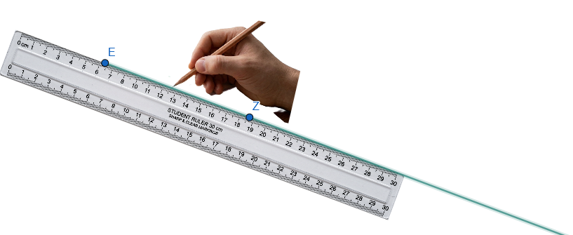{width="400"}
  - **Ευθύγραμμο Τμήμα (Line Segment):** Το μέρος μιας ευθείας (**φορέας**) που περιλαμβάνει δύο συγκεκριμένα σημεία (άκρα) και όλα τα σημεία που βρίσκονται ανάμεσά τους.\
    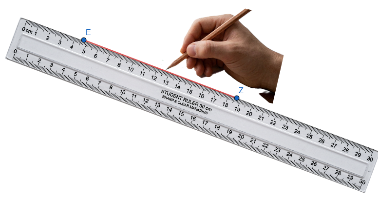{width="400"}
  - **Τεθλασμένη ή Πολυγωνική Γραμμή (Broken Line):** Ένα σχήμα που αποτελείται από διαδοχικά ευθύγραμμα τμήματα τα οποία δεν βρίσκονται στην ίδια ευθεία.


:::: {.math-box .axiom-box}
::: {.math-title .axiom-title}
- **Βασικά Αξιώματα:**
:::
  - Από δύο διαφορετικά σημεία διέρχεται **μοναδική ευθεία**.
  - Κάθε ευθεία περιέχει **άπειρα σημεία**.
  - Για κάθε ευθεία υπάρχει τουλάχιστον ένα σημείο του επιπέδου που **δεν ανήκει σε αυτή**.

::::

#### Επιφάνεια (Surface)

- **Διαστάσεις:** Οι επιφάνειες έχουν **δύο διαστάσεις**.

- **Ορισμός:** Η επιφάνεια είναι το σύνολο των σημείων που αφήνει μια γραμμή αν την μετακινήσουμε μέσα στον χώρο.\

  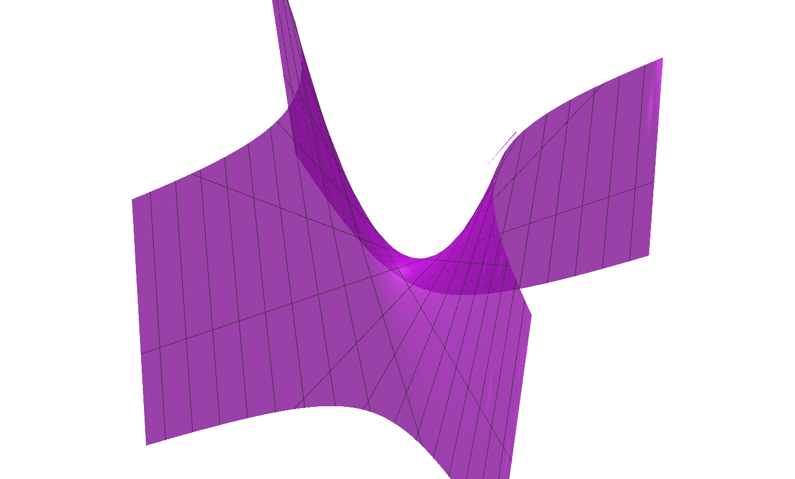{width="500"}

  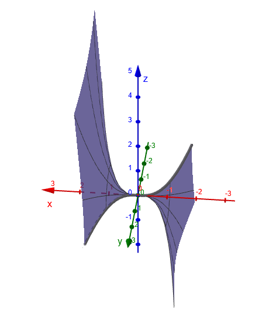

  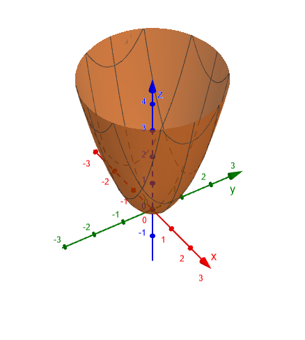

- **Το Επίπεδο (Plane):** Είναι η απλούστερη μορφή επιφάνειας (επίπεδη επιφάνεια).
  Παραδείγματα που δίνουν την εικόνα ενός επιπέδου είναι η επιφάνεια ενός πίνακα ή ενός καθρέπτη.\

  \
  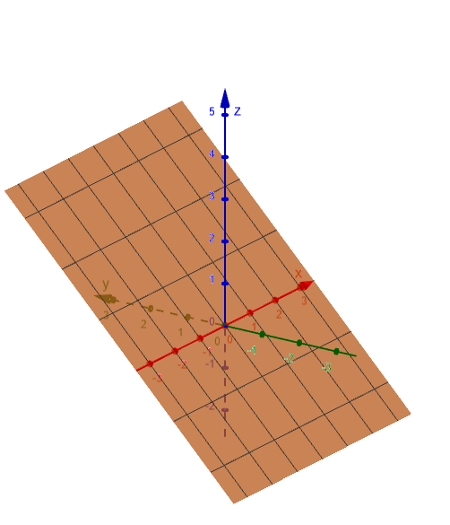{width="400"}

- **Ιδιότητες Επιπέδου:**

  - Κάθε ευθεία ενός επιπέδου το χωρίζει σε δύο μέρη που ονομάζονται **ημιεπίπεδα**. Ο ΄ξξονας x'x του προηγούμενου σχήματαος χωρίζει το επίπεδο σε δύο ημιεπίπεδα.
  - Αν δύο σημεία μιας ευθείας ανήκουν σε ένα επίπεδο, τότε ολόκληρη η ευθεία βρίσκεται πάνω στο επίπεδο αυτό.

#### Συνοπτικός Πίνακας Διαστάσεων

| Γεωμετρικός Όρος | Διαστάσεις                         |
|:-----------------|:-----------------------------------|
| **Σημείο**       | Καμία διάσταση (0)                 |
| **Γραμμή**       | Μία διάσταση (μήκος) (1)           |
| **Επιφάνεια**    | Δύο διαστάσεις (μήκος, πλάτος) (2) |
| **Στερεό**       | Τρεις διαστάσεις (3)               |

Στη Γεωμετρία, οι έννοιες αυτές χρησιμοποιούνται ως **αφαιρετικές έννοιες (όροι)** και όχι ως υλικά αντικείμενα, καθώς στην καθημερινή γλώσσα γίνονται προσεγγίσεις που η Γεωμετρία δεν δέχεται (π.χ. οι γραμμές της ασφάλτου έχουν στην πραγματικότητα πλάτος, ενώ η γεωμετρική γραμμή όχι).

Ο άνθρωπος βλέπει μόνο στις 3 διαστάσεις και με φώς, οτιδήποτε άλλο 1, 2, 4, κτλ διαστάσεων μπορεί μόνο να το φανταστεί ή να το παρομοιάσει με κάτι που του ***ομοιάζει***
:::

------------------------------------------------------------------------

### Σύγκριση ευθυγράμμων τμημάτων

::: {style="background-color: #db8e79; border: 2px solid #2f3e50; color: #0d0402; padding: 15px; border-radius: 5px;"}
Η σύγκριση των ευθύγραμμων τμημάτων αποτελεί βασική διαδικασία στη Γεωμετρία για τον προσδιορισμό της σχέσης μεγέθους μεταξύ τους.

:::: {.math-box .definition-box}
::: {.math-title .definition-title}
#### Ίσα Ευθύγραμμα Τμήματα
:::
Δύο ευθύγραμμα τμήματα ονομάζονται **ίσα** όταν, με κατάλληλη μετατόπιση, τα άκρα τους **συμπίπτουν**.
Για την ισότητα αυτή δεχόμαστε το εξής αξίωμα: αν έχουμε ένα τμήμα ΑΒ, τότε σε οποιαδήποτε ημιευθεία Γx υπάρχει **μοναδικό σημείο Δ**, τέτοιο ώστε ΑΒ = ΓΔ.
::::

Η ισότητα ευθύγραμμων τμημάτων διέπεται από τις εξής ιδιότητες:

- **Ανακλαστική:** (ΑΒ) = (ΑΒ).

- **Συμμετρική:** Αν (ΑΒ) = (ΓΔ), τότε (ΓΔ) = (ΑΒ).

- **Μεταβατική:** Αν (ΑΒ) = (ΓΔ) και (ΓΔ) = (ΕΖ), τότε (ΑΒ) = (ΕΖ).

#### Διαδικασία Σύγκρισης

Για να συγκρίνουμε δύο ευθύγραμμα τμήματα ΑΒ και ΓΔ, μπορούμε να χρησιμοποιήσουμε μια ημιευθεία Γx (με αφετηρία το ένα άκρο του ΓΔ) και να μετατοπίσουμε το ΑΒ πάνω σε αυτήν, ώστε το Α να ταυτιστεί με το Γ.
Τότε υπάρχει μοναδικό σημείο Ε πάνω στην ημιευθεία, τέτοιο ώστε ΑΒ = ΓΕ.

Από τη θέση του σημείου Ε προκύπτουν τρεις περιπτώσεις:

- **Ισότητα (ΑΒ = ΓΔ):** Αν το σημείο Ε **ταυτίζεται** με το Δ.

- **Μικρότερο (ΑΒ \< ΓΔ):** Αν το Ε είναι **εσωτερικό σημείο** του τμήματος ΓΔ.

- **Μεγαλύτερο (ΑΒ \> ΓΔ):** Αν το Ε **δεν είναι εσωτερικό σημείο** του τμήματος ΓΔ (δηλαδή βρίσκεται στην προέκταση του ΓΔ πέρα από το Δ).

#### Βασικές Ιδιότητες Ανισότητας

Όπως και στην ισότητα, έτσι και στην ανισότητα ισχύει η **μεταβατική ιδιότητα**: Αν ένα τμήμα ΑΒ είναι μικρότερο από ένα τμήμα ΓΔ και το ΓΔ είναι μικρότερο από ένα τμήμα ΕΖ, τότε το ΑΒ είναι μικρότερο από το ΕΖ.


:::: {.math-box .definition-box}
::: {.math-title .definition-title}
#### Μήκος και Απόσταση
:::
Η σύγκριση τμημάτων συνδέεται άμεσα με την έννοια του **μήκους**.
Το μήκος είναι ο θετικός αριθμός που προκύπτει όταν συγκρίνουμε ένα τμήμα με ένα άλλο που θεωρούμε ως **μονάδα μήκους**.

Η απόσταση δύο σημείων Α και Β ορίζεται ως το μήκος του ευθύγραμμου τμήματος ΑΒ.

::::


#### Μεθοδολογία Αποδείξεων

Στις γεωμετρικές ασκήσεις, για να αποδείξουμε τη σχέση μεταξύ τμημάτων, χρησιμοποιούμε συχνά τις εξής μεθόδους:

- **Ισότητα:** Αποδεικνύουμε ότι τα τμήματα είναι αντίστοιχα στοιχεία **ίσων τριγώνων**.

- **Ανισότητα:** Εξετάζουμε αν τα τμήματα είναι πλευρές του ίδιου τριγώνου (όπου απέναντι από τη μεγαλύτερη γωνία βρίσκεται η μεγαλύτερη πλευρά) ή πλευρές δύο τριγώνων που έχουν τις άλλες δύο πλευρές τους ίσες (οπότε μεγαλύτερο είναι το τμήμα που βρίσκεται απέναντι από τη μεγαλύτερη γωνία).
:::

------------------------------------------------------------------------

### Κατασκευή ευθύγραμμου τμήματος ίσου προς δοσμένο

Η κατασκευή ενός ευθύγραμμου τμήματος ίσου προς ένα δοσμένο βασίζεται σε ένα θεμελιώδες γεωμετρικό αξίωμα και πραγματοποιείται με τη χρήση του διαβήτη.

::: {style="background-color: #db8e79; border: 2px solid #2f3e50; color: #0d0402; padding: 15px; border-radius: 5px;"}
#### Θεωρητικό Υπόβαθρο

Σύμφωνα με το σχετικό αξίωμα, αν έχουμε ένα ευθύγραμμο τμήμα **ΑΒ**, τότε για κάθε ημιευθεία **Γx** υπάρχει **μοναδικό σημείο Δ** πάνω σε αυτήν, τέτοιο ώστε **ΓΔ = ΑΒ**,.
Η διαδικασία αυτή αποτελεί μια τυπική **γεωμετρική κατασκευή**, η οποία εκτελείται χρησιμοποιώντας αποκλειστικά τα επιτρεπτά γεωμετρικά όργανα: τον **κανόνα** (χάρακα χωρίς υποδιαιρέσεις) και τον **διαβήτη**.

#### Διαδικασία Κατασκευής

Για να κατασκευάσουμε ένα τμήμα ίσο με το ΑΒ πάνω σε μια ημιευθεία Γx, ακολουθούμε τα εξής βήματα:

1.  **Μέτρηση με τον διαβήτη:** Εφαρμόζουμε τη μία ακίδα του διαβήτη στο άκρο **Α** και την άλλη στο άκρο **Β** του δοσμένου τμήματος.\
    

2.  **Μεταφορά ανοίγματος:** Διατηρώντας σταθερό το άνοιγμα του διαβήτη, τοποθετούμε τη μία ακίδα του στην αφετηρία **Γ** της ημιευθείας Γx.

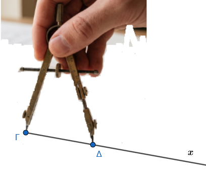{width="321"}

3.  **Σημείωση του νέου άκρου:** Η άλλη ακίδα του διαβήτη ορίζει πάνω στην ημιευθεία το σημείο **Δ**.

Το ευθύγραμμο τμήμα **ΓΔ** που προκύπτει είναι **ίσο** με το αρχικό τμήμα ΑΒ.
:::

------------------------------------------------------------------------

### Πράξεις μεταξύ ευθυγράμμων τμημάτων

Οι πράξεις μεταξύ ευθυγράμμων τμημάτων αποτελούν τη βάση για τη μελέτη των μεγεθών στη Γεωμετρία, επιτρέποντας τη δημιουργία νέων τμημάτων και τη σύνδεσή τους με αλγεβρικές έννοιες.

::: {style="background-color: #db8e79; border: 2px solid #2f3e50; color: #0d0402; padding: 15px; border-radius: 5px;"}
#### Πρόσθεση Ευθυγράμμων Τμημάτων

Για να προσθέσουμε δύο ευθύγραμμα τμήματα ΑΒ και ΓΔ, χρησιμοποιούμε τη βοήθεια του διαβήτη για να ορίσουμε πάνω σε μια ευθεία ε δύο **διαδοχικά** τμήματα: ΕΖ ίσο με το ΑΒ και ΖΗ ίσο με το ΓΔ.\
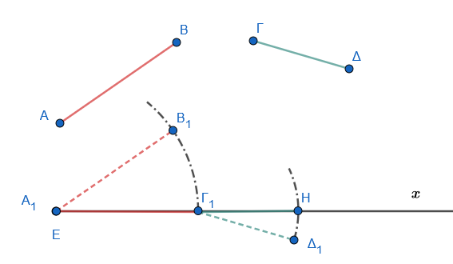{width="400"}

- **Ορισμός:** Το ευθύγραμμο τμήμα **ΕΗ** ονομάζεται **άθροισμα** των ΑΒ και ΓΔ και συμβολίζεται ως **ΕΗ = ΑΒ + ΓΔ**.

- **Ιδιότητες:** Στην πρόσθεση τμημάτων ισχύουν ιδιότητες ανάλογες με την πρόσθεση αριθμών:

  - **Αντιμεταθετική:** ΑΒ + ΓΔ = ΓΔ + ΑΒ.
  - **Προσεταιριστική:** (ΑΒ + ΓΔ) + ΕΖ = ΑΒ + (ΓΔ + ΕΖ).

#### Αφαίρεση Ευθυγράμμων Τμημάτων

Η πράξη της αφαίρεσης προϋποθέτει τη σύγκριση των τμημάτων.

- **Ορισμός:** Αν **ΑΒ \< ΓΔ**, τότε υπάρχει εσωτερικό σημείο Ε του ΓΔ τέτοιο ώστε ΓΕ = ΑΒ.
  Το τμήμα **ΕΔ** ονομάζεται **διαφορά** του ΑΒ από το ΓΔ και συμβολίζεται ως **ΕΔ = ΓΔ – ΑΒ**.\
  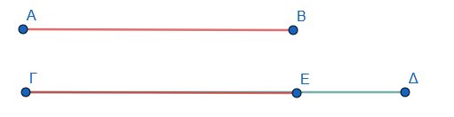{width="400"}

- **Μηδενικό Ευθύγραμμο Τμήμα:** Αν τα τμήματα είναι ίσα (ΑΒ = ΓΔ), τότε η διαφορά τους είναι ένα τμήμα του οποίου τα άκρα συμπίπτουν.
  Αυτό ονομάζεται **μηδενικό ευθύγραμμο τμήμα** και συμβολίζεται με 0.

#### Πολλαπλασιασμός και Διαίρεση με Φυσικό Αριθμό

- **Γινόμενο:** Το γινόμενο ενός τμήματος ΑΒ επί έναν φυσικό αριθμό ν είναι το ευθύγραμμο τμήμα που προκύπτει από το **άθροισμα ν διαδοχικών τμημάτων ίσων με το ΑΒ**.
  Συμβολίζεται ως **ν ∙ ΑΒ**.\
  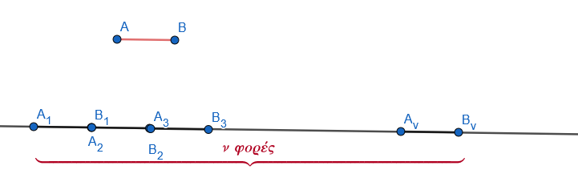{width="500"}

- **Πηλίκο:** Η διαίρεση ενός τμήματος ΑΒ με έναν φυσικό αριθμό ν συνίσταται στην εύρεση ενός τμήματος ΓΔ τέτοιο ώστε **ΑΒ = ν ∙ ΓΔ**.

#### Μήκος και Λόγος Τμημάτων

Οι πράξεις αυτές επιτρέπουν τη μετάβαση από τα γεωμετρικά σχήματα στους αριθμούς:

- **Μονάδα Μήκους:** Ένα αυθαίρετο τμήμα με το οποίο συγκρίνουμε όλα τα άλλα τμήματα.

- **Μήκος:** Ο θετικός αριθμός ρ που δείχνει πόσες φορές περιέχεται η μονάδα μήκους στο τμήμα.

- **Λόγος δύο τμημάτων:** Ο αριθμός που προκύπτει από τη διαίρεση των μέτρων τους όταν έχουν μετρηθεί με την ίδια μονάδα.

#### Γεωμετρικές Κατασκευές και Εφαρμογές

- **Κατασκευή Αθροίσματος/Διαφοράς:** Πραγματοποιείται με κανόνα και διαβήτη, μεταφέροντας τα τμήματα πάνω σε μια ημιευθεία.

- **Μέσο Τμήματος:** Κάθε ευθύγραμμο τμήμα έχει **ένα μόνο μέσο**, το οποίο το διαιρεί σε δύο ίσα τμήματα.

- **Αρμονική Διαίρεση:** Μια προχωρημένη εφαρμογή των πράξεων είναι η αρμονική διαίρεση, όπου δύο σημεία Μ και Ν διαιρούν ένα τμήμα ΑΒ εσωτερικά και εξωτερικά στον ίδιο λόγο $\dfrac{ΜΑ}{ΜΒ} =\dfrac{ΝΑ}{ΝΒ}$.
:::

### Μετατοπίσεις στο επίπεδο

Η έννοια της μετατόπισης στο επίπεδο αποτελεί θεμελιώδη παραδοχή της Γεωμετρίας, σύμφωνα με την οποία κάθε επίπεδο σχήμα μπορεί να αλλάξει θέση μέσα στο επίπεδο παραμένοντας **αναλλοίωτο ως προς τη μορφή και το μέγεθός του**.
Το τελικό σχήμα που προκύπτει ονομάζεται **ομόλογο** ή **εικόνα** του αρχικού (πρωτοτύπου).

Οι μετατοπίσεις εντάσσονται στους **ισομετρικούς μετασχηματισμούς**, δηλαδή σε εκείνες τις απεικονίσεις των σημείων του επιπέδου που διατηρούν τις αποστάσεις (μήκη) και τις γωνίες.
Οι κυριότερες μορφές μετατοπίσεων είναι οι εξής:

:::::::::: {style="background-color: #db8e79; border: 2px solid #2f3e50; color: #0d0402; padding: 15px; border-radius: 5px;"}
#### Μεταφορά (Translation)

Η μεταφορά καθορίζεται από ένα διάνυσμα $\vec{a}$.

- **Ιδιότητα:** Για κάθε ζευγάρι ομόλογων σημείων $Α$ και $Α'$, ισχύει η σχέση $\vec{ΑΑ'} = \vec{a}$.\

<iframe src="https://www.geogebra.org/calculator/fxz85dme?embed" width="730" height="600" allowfullscreen style="border: 1px solid #e4e4e4;border-radius: 4px;" frameborder="0">

</iframe>

::: callout-tip
## Οδηγία

Μετακινείστε το άκρο του διανύσματος

Αλλάξτε την θέση του σημείου Α
:::

- **Αποτελέσματα:** Το ομόλογο μιας ευθείας είναι ευθεία παράλληλη προς αυτήν, ενώ το ομόλογο ενός κύκλου είναι ένας ίσος κύκλος του οποίου το κέντρο έχει μετατοπιστεί κατά το διάνυσμα $\vec{a}$.

<iframe src="https://www.geogebra.org/calculator/uetff7kb?embed" width="730" height="600" allowfullscreen style="border: 1px solid #e4e4e4;border-radius: 4px;" frameborder="0">

</iframe>

::: callout-tip
## Οδηγία

Μετακινείστε το άκρο του διανύσματος

Αλλάξτε την θέση του σημείου Γ ή του σημείου Δ της ευθείας
:::

\

<iframe src="https://www.geogebra.org/calculator/vhc3sewx?embed" width="730" height="600" allowfullscreen style="border: 1px solid #e4e4e4;border-radius: 4px;" frameborder="0">

</iframe>

::: callout-tip
## Οδηγία

Μετακινείστε το άκρο του διανύσματος

Αλλάξτε την θέση του σημείου Γ του κέντρου του κύκλου
:::

#### Στροφή (Rotation)

Η στροφή καθορίζεται από ένα σταθερό σημείο $O$ (κέντρο στροφής) και μια προσανατολισμένη γωνία $\omega$ (γωνία στροφής).

- **Ιδιότητα:** Για κάθε ζευγάρι ομόλογων σημείων $M$ και $M'$, ισχύουν οι σχέσεις $OM = OM'$ και $\angle MOM' = \omega$.

<iframe src="https://www.geogebra.org/calculator/hnykcdck?embed" width="730" height="600" allowfullscreen style="border: 1px solid #e4e4e4;border-radius: 4px;" frameborder="0">

</iframe>

::: callout-tip
## Οδηγία

Μετακινείστε το α του δρομέα για να αλλάξετε την γωνία στροφής

Αλλάξτε την θέση του σημείου Μ ή του κέντρου στροφής Ο
:::

- **Αποτελέσματα:** Η στροφή μιας ευθείας παράγει μια νέα ευθεία που σχηματίζει με την αρχική γωνία ίση με τη γωνία στροφής. Ο κύκλος παραμένει ίσος, με το κέντρο του να μετακινείται σε νέα θέση μέσω της στροφής.

<iframe src="https://www.geogebra.org/calculator/vd8wzqy6?embed" width="730" height="600" allowfullscreen style="border: 1px solid #e4e4e4;border-radius: 4px;" frameborder="0">

</iframe>

::: callout-tip
## Οδηγία

Μετακινείστε το α του δρομέα για να αλλάξετε την γωνία στροφής

1.  Αλλάξτε την θέση του σημείου Α, Β ή του κέντρου στροφής Ο

2.  Αλλάξτε την θέση του Γ ή του κέντρου Ο
:::

#### Συμμετρία (Symmetry)

Η συμμετρία διακρίνεται σε δύο βασικά είδη:

- **Κεντρική Συμμετρία:** Καθορίζεται από ένα σημείο $O$ (κέντρο). Το $O$ είναι το μέσο του ευθύγραμμου τμήματος $MM'$ που συνδέει το σημείο με την εικόνα του. Η κεντρική συμμετρία θεωρείται **στροφή κατά 180°**.

<iframe scrolling="no" title="Κεντρική συμμετρία 3" src="https://www.geogebra.org/material/iframe/id/uaqmqzpn/width/730/height/600/border/888888/sfsb/true/smb/false/stb/false/stbh/false/ai/false/asb/false/sri/false/rc/false/ld/false/sdz/false/ctl/false" width="730px" height="600px" style="border:0px;">

</iframe>

::: callout-tip
## Οδηγία

Μετακινείστε το κέντρο συμμετρίας Ο

Αλλάξτε την θέση του σημείου Α, Β ή Γ
:::

- **Αξονική Συμμετρία:** Καθορίζεται από μια ευθεία $\epsilon$ (άξονας). Η ευθεία αυτή είναι η μεσοκάθετος του τμήματος $MM'$.

<iframe scrolling="no" title="Συμμετ Τριγώνου" src="https://www.geogebra.org/material/iframe/id/f9hxvbxx/width/730/height/600/border/888888/sfsb/true/smb/false/stb/false/stbh/false/ai/false/asb/false/sri/false/rc/false/ld/false/sdz/false/ctl/false" width="730px" height="600px" style="border:0px;">

</iframe>

::: callout-tip
## Οδηγία

Μετακινείστε τονάξονα ΚΛ

Αλλάξτε την θέση του σημείου Α, Β ή Γ
:::

#### Βασικά Χαρακτηριστικά των Μετατοπίσεων

- **Ισομετρία:** Διατηρούνται όλα τα γεωμετρικά μεγέθη (μήκη, γωνίες, εμβαδά).

- **Αμφιμονοσήμαντη Αντιστοιχία:** Κάθε σημείο του επιπέδου αντιστοιχίζεται σε ένα ακριβώς άλλο σημείο (εικόνα) και αντίστροφα.

- **Σύνθεση:** Η σύνθεση (διαδοχική εφαρμογή) πολλών μεταφορών ισοδυναμεί με μία μοναδική μεταφορά.
  Επίσης, κάθε μετάθεση ενός σχήματος στο επίπεδό του μπορεί να γίνει μέσω μιας μεταφοράς και μιας περιστροφής.
::::::::::

### Ασκήσεις

#### Σημεία, γραμμές και ευθείες

1.  **Αναγνώριση Σχημάτων:** Να γράψετε τα ευθύγραμμα τμήματα που ορίζονται από όλα τα σημεία Α, Β, Γ και Δ πάνω σε μια ευθεία.\
    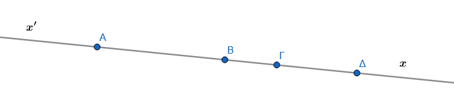{width="500"}
2.  **Τομή Ευθειών:** Σχεδιάστε τρεις ευθείες που να τέμνονται ανά δύο, χωρίς να διέρχονται από το ίδιο σημείο, και βρείτε πόσα είναι τα σημεία τομής τους.
3.  **Ημιευθείες:** Σε μια ευθεία $xy$ με σημεία Α και Β, προσδιορίστε ποιες ημιευθείες ορίζονται με αρχή το Α και ποιες με αρχή το Β. Ποιες από αυτές είναι αντικείμενες;.\
    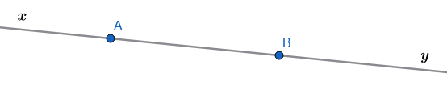{width="500"}

:::: {.math-box .exercise-box}
::: {.math-title .exercise-title}
4.  **Διάταξη Σημείων:**

:::
Αν τα σημεία Α, Β, Γ και Δ είναι συνευθειακά, το Β είναι μεταξύ των Α, Γ και το Γ μεταξύ των Α, Δ, δικαιολογήστε γιατί το Γ είναι μεταξύ των Β, Δ.\
    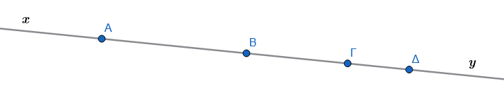{width="500"}
::::


:::: {.math-box .solution-box}
::: {.math-title .solution-title}

**Λύση**
:::    
  Η απόδειξη βασίζεται στις ιδιότητες της διάταξης σημείων σε ευθεία και στη σχέση των μηκών των ευθυγράμμων τμημάτων (αξίωμα πρόσθεσης τμημάτων).

**Βήμα 1: Αξιοποίηση της πρώτης συνθήκης ($B$ μεταξύ των $A, \Gamma$)**
Επειδή το σημείο $B$ βρίσκεται μεταξύ των $A$ και $\Gamma$, τα μήκη των αντίστοιχων τμημάτων ικανοποιούν τη σχέση:
$$AB + B\Gamma = A\Gamma \quad (1)$$
όπου $AB > 0$ και $B\Gamma > 0$.

**Βήμα 2: Αξιοποίηση της δεύτερης συνθήκης ($\Gamma$ μεταξύ των $A, \Delta$)**
Επειδή το σημείο $\Gamma$ βρίσκεται μεταξύ των $A$ και $\Delta$, τα μήκη των αντίστοιχων τμημάτων ικανοποιούν τη σχέση:
$$A\Gamma + \Gamma\Delta = A\Delta \quad (2)$$
όπου $\Gamma\Delta > 0$.

**Βήμα 3: Συνδυασμός των σχέσεων**
Αντικαθιστούμε τη σχέση $(1)$ στη σχέση $(2)$:
$$(AB + B\Gamma) + \Gamma\Delta = A\Delta$$
$$AB + (B\Gamma + \Gamma\Delta) = A\Delta \quad (3)$$

Από τη σχέση $(3)$, επειδή τα σημεία είναι συνευθειακά και $AB + B\Delta = A\Delta$, προκύπτει ότι το μήκος του τμήματος $B\Delta$ ισούται με:
$$B\Delta = B\Gamma + \Gamma\Delta$$

**Βήμα 4: Συμπέρασμα για τη θέση του $\Gamma$**
Εφόσον τα σημεία $B, \Gamma, \Delta$ είναι συνευθειακά και ισχύει η σχέση:
$$B\Gamma + \Gamma\Delta = B\Delta$$
με $B\Gamma > 0$ και $\Gamma\Delta > 0$, εξ ορισμού το σημείο **$\Gamma$ βρίσκεται μεταξύ των σημείων $B$ και $\Delta$**.
::::

5.  **Πλήθος Ευθειών:** Πόσες διαφορετικές ευθείες μπορούν να ορίσουν τρία διαφορετικά σημεία του επιπέδου; Εξετάστε την περίπτωση που είναι συνευθειακά και την περίπτωση που δεν είναι.

  **Λύση**
  
  Η επίλυση βασίζεται στο θεμελιώδες αξίωμα της Γεωμετρίας ότι **από δύο διαφορετικά σημεία διέρχεται μία και μόνο μία ευθεία**. Εξετάζουμε ξεχωριστά τις δύο περιπτώσεις των τριών σημείων $A, B$ και $\Gamma$.

**Βήμα 1: Περίπτωση 1 — Τα τρία σημεία είναι συνευθειακά**
Όταν τα σημεία $A, B, \Gamma$ ανήκουν στην ίδια ευθεία:

* Η ευθεία που διέρχεται από τα $A$ και $B$ ταυτίζεται με την ευθεία που διέρχεται από τα $B$ και $\Gamma$, καθώς και με την ευθεία που διέρχεται από τα $A$ και $\Gamma$.

* Επομένως, ορίζεται **$1$ μοναδική ευθεία** ($\varepsilon_{AB} = \varepsilon_{B\Gamma} = \varepsilon_{A\Gamma}$).

**Βήμα 2: Περίπτωση 2 — Τα τρία σημεία δεν είναι συνευθειακά**
Όταν τα σημεία $A, B, \Gamma$ δεν ανήκουν στην ίδια ευθεία (σχηματίζουν τρίγωνο):

* Κάθε ζεύγος σημείων ορίζει μία διαφορετική ευθεία:
  1. Η ευθεία $AB$
  2. Η ευθεία $B\Gamma$
  3. Η ευθεία $A\Gamma$

* Επομένως, ορίζονται **$3$ διαφορετικές ευθείες**.

**Τελική Απάντηση**

* Αν τα 3 σημεία είναι **συνευθειακά**, ορίζουν **$1$ ευθεία**.

* Αν τα 3 σημεία **δεν είναι συνευθειακά**, ορίζουν **$3$ διαφορετικές ευθείες**.

**Βασική Έννοια & Επεξήγηση**

* **Αξίωμα Μονοσήμαντου Ορισμού Ευθείας:** Δύο διακεκριμένα σημεία καθορίζουν μονοσήμαντα μία ευθεία.

* **Συνευθειακότητα:** Τρία ή περισσότερα σημεία λέγονται συνευθειακά όταν βρίσκονται πάνω στην ίδια ευθεία. Σε αντίθετη περίπτωση, κάθε δυνατή δυάδα σημείων παράγει ξεχωριστή ευθεία (οι οποίες αντιστοιχούν στις πλευρές του τριγώνου που σχηματίζουν).

#### Σύγκριση ευθυγράμμων τμημάτων

1.  **Ορισμός Ισότητας:** Δείξτε ότι δύο ευθύγραμμα τμήματα είναι ίσα όταν, με κατάλληλη μετατόπιση, τα άκρα τους ταυτίζονται.
2.  **Διαδικασία Σύγκρισης:** Έστω δύο τμήματα ΑΒ και ΓΔ. Χρησιμοποιώντας μια ημιευθεία $Γx$, δείξτε πώς μπορούμε να προσδιορίσουμε αν το ΑΒ είναι μικρότερο, ίσο ή μεγαλύτερο από το ΓΔ.
3.  **Μεταβατική Ιδιότητα:** Αποδείξτε ότι αν ένα τμήμα ΑΒ είναι μικρότερο από το ΓΔ και το ΓΔ μικρότερο από το ΕΖ, τότε το ΑΒ είναι μικρότερο από το ΕΖ.

  **Λύση**
  
  Η απόδειξη βασίζεται στη **μεταβατική ιδιότητα της σχέσης διάταξης** των πραγματικών αριθμών που εκφράζουν τα μήκη των ευθυγράμμων τμημάτων.

**Βήμα 1: Μετάφραση της γεωμετρικής σύγκρισης σε σχέσεις μηκών**
Στη Γεωμετρία, ένα ευθύγραμμο τμήμα είναι μικρότερο από ένα άλλο όταν το μήκος του είναι μικρότερο από το μήκος του άλλου. 
Από τα δεδομένα της υπόθεσης έχουμε:

* Το τμήμα $AB$ είναι μικρότερο από το $\Gamma\Delta$, δηλαδή:
  $$AB < \Gamma\Delta \quad (1)$$

* Το τμήμα $\Gamma\Delta$ είναι μικρότερο από το $EZ$, δηλαδή:
  $$\Gamma\Delta < EZ \quad (2)$$

όπου $AB, \Gamma\Delta, EZ \in \mathbb{R}^+$ είναι τα θετικά μήκη των αντίστοιχων τμημάτων.

**Βήμα 2: Εφαρμογή της μεταβατικής ιδιότητας**
Από τις βασικές ιδιότητες της διάταξης στο σύνολο των πραγματικών αριθμών $\mathbb{R}$, η σχέση της ανισότητας ($<$) είναι **μεταβατική**:
$$\text{Αν } \alpha < \beta \text{ και } \beta < \gamma\text{, τότε } \alpha < \gamma$$

Εφαρμόζοντας την ιδιότητα αυτή για $\alpha = AB$, $\beta = \Gamma\Delta$ και $\gamma = EZ$, από τις σχέσεις $(1)$ και $(2)$ προκύπτει άμεσα:
$$AB < EZ$$

**Βήμα 3: Γεωμετρικό συμπέρασμα**
Επειδή το μήκος του τμήματος $AB$ είναι μικρότερο από το μήκος του τμήματος $EZ$, συμπεραίνουμε ότι το τμήμα $AB$ είναι μικρότερο από το $EZ$.


4.  **Ύπαρξη Σημείου:** Σύμφωνα με το αξίωμα ισότητας, αν έχουμε ένα τμήμα ΑΒ και μια ημιευθεία $Γx$, δείξτε ότι υπάρχει μοναδικό σημείο Δ πάνω στην ημιευθεία ώστε ΑΒ = ΓΔ.
  

#### Κατασκευή ευθύγραμμου τμήματος ίσου προς δοσμένο

1.  **Βασική Κατασκευή:** Χρησιμοποιώντας **κανόνα και διαβήτη**, μεταφέρετε το μήκος ενός τμήματος ΑΒ πάνω σε μια ημιευθεία $Γx$ ξεκινώντας από το Γ.
2.  **Κατασκευή Μέσου:** Περιγράψτε τη γεωμετρική διαδικασία για την εύρεση του μοναδικού μέσου Μ ενός ευθύγραμμου τμήματος ΑΒ.
3.  **Ισόπλευρο Τρίγωνο:** Κατασκευάστε ένα ισόπλευρο τρίγωνο με πλευρά ίση προς ένα δοσμένο ευθύγραμμο τμήμα $\alpha$.
4.  **Μετατόπιση Σχήματος:** Κατασκευάστε το ομόλογο (εικόνα) ενός ευθύγραμμου τμήματος μετά από μια μετατόπιση στο επίπεδο, διατηρώντας το μέγεθος αναλλοίωτο.

#### Πράξεις μεταξύ ευθυγράμμων τμημάτων

1.  **Αντιμεταθετική Ιδιότητα:** Αποδείξτε γεωμετρικά ότι για δύο τμήματα ΑΒ και ΓΔ ισχύει ΑΒ + ΓΔ = ΓΔ + ΑΒ.
2.  **Προσεταιριστική Ιδιότητα:** Αποδείξτε ότι (ΑΒ + ΓΔ) + ΕΖ = ΑΒ + (ΓΔ + ΕΖ) τοποθετώντας τα τμήματα διαδοχικά πάνω σε μια ευθεία.
3.  **Άθροισμα και Διαφορά:** Αν σε ευθεία $\epsilon$ τα σημεία Α, Β, Γ, Δ είναι διαδοχικά και ΑΒ = ΓΔ, αποδείξτε ότι ΑΓ = ΒΔ προσθέτοντας το κοινό τμήμα ΒΓ,.
4.  **Πολλαπλασιασμός:** Κατασκευάστε το ευθύγραμμο τμήμα $ΕΖ = 3 \cdot ΑΒ$ ως άθροισμα τριών διαδοχικών τμημάτων ίσων με το ΑΒ.
5.  **Σχέση Μέσων:** Αν Μ και Ν είναι τα μέσα των διαδοχικών τμημάτων ΑΒ και ΒΓ, αποδείξτε ότι $ΑΓ = 2 \cdot ΜΝ$.
6.  **Διαφορά Τμημάτων:** Αν $ΑΒ < ΓΔ$, δείξτε πώς κατασκευάζεται το τμήμα $ΕΔ = ΓΔ - ΑΒ$ βρίσκοντας ένα εσωτερικό σημείο Ε του ΓΔ ώστε ΓΕ = ΑΒ.
