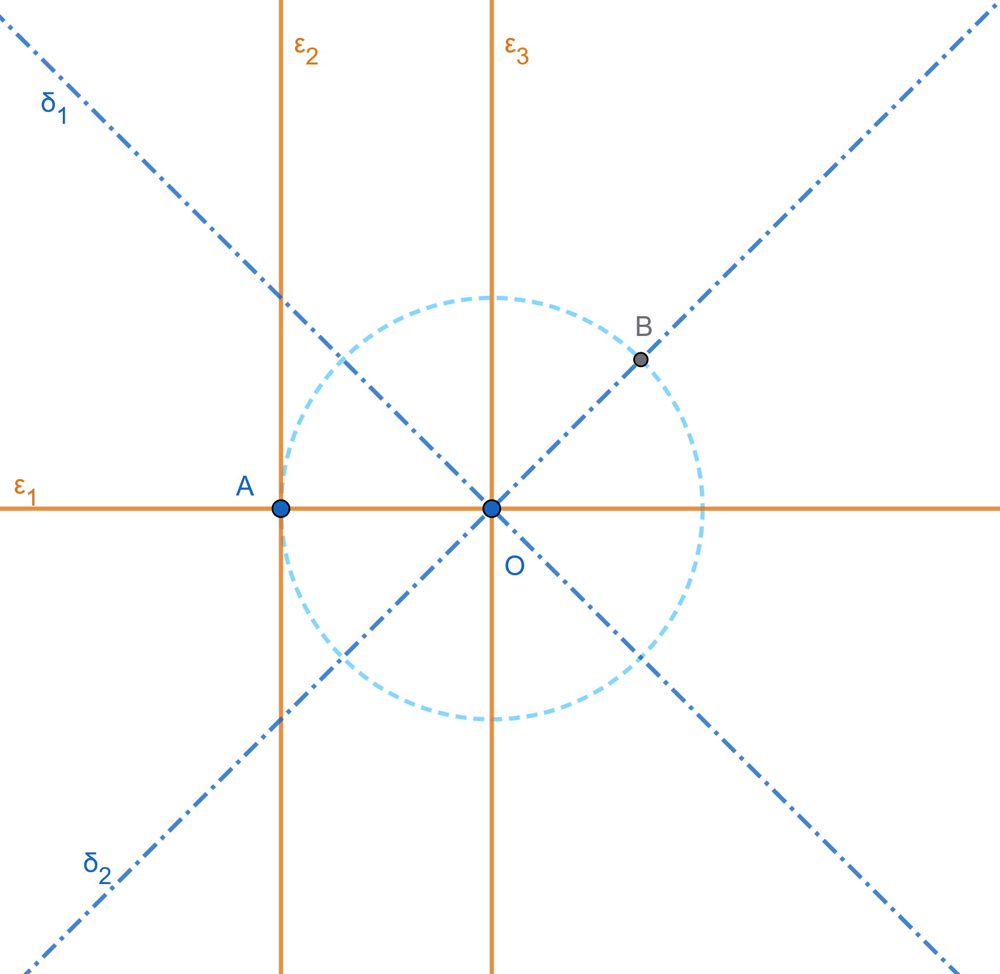
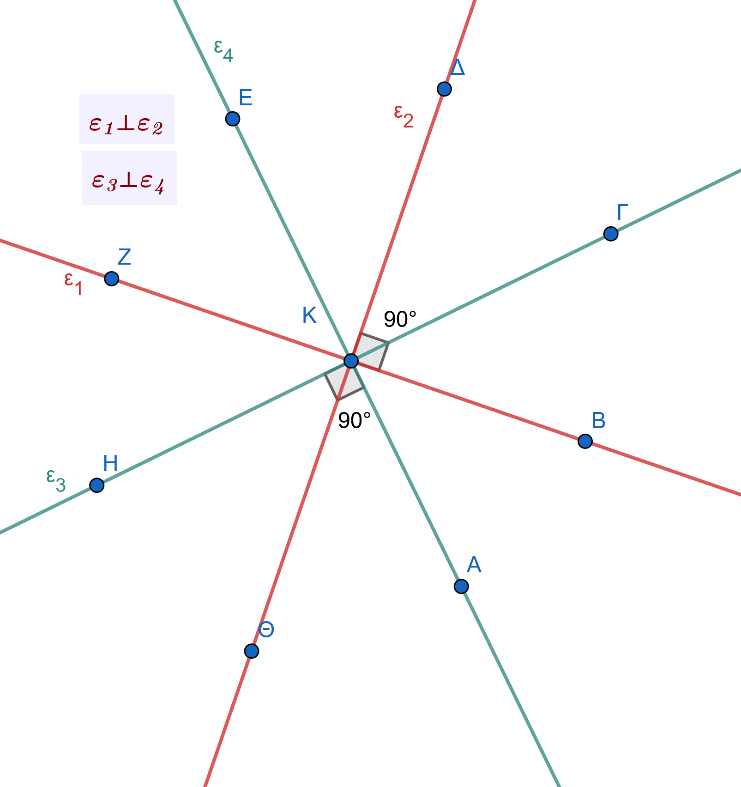
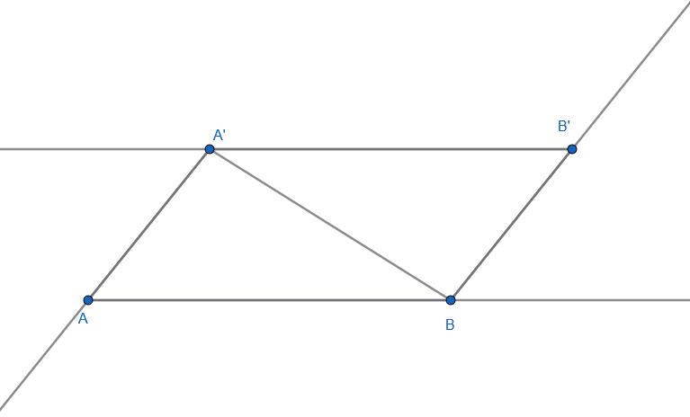
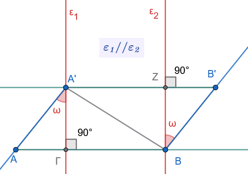
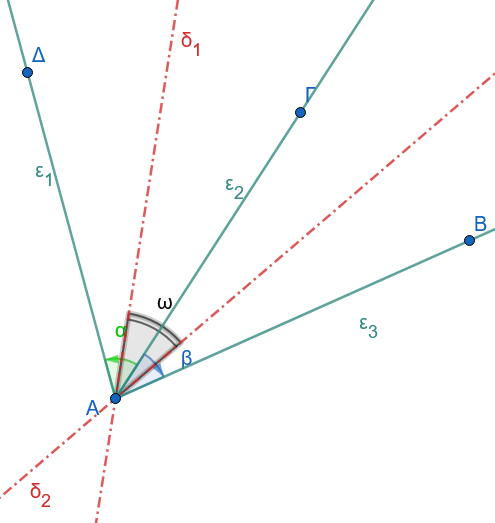

```{=html}
<!-- Φόρτωση βιβλιοθήκης GeoGebra -->
<script src="https://www.geogebra.org/apps/deployggb.js"></script>

<!-- Συνάρτηση δημιουργίας applets -->
<script>
function createGeoGebra(containerId, materialId, width = 700, height = 500) {
  var params = {
    "id": "ggb-" + containerId,
    "material_id": materialId,
    "width": width,
    "height": height,
    "showToolBar": true,
    "showMenuBar": false,
    "showAlgebraInput": true
  };
  
  var applet = new GGBApplet(params, '5.2');
  applet.inject(containerId);
}
</script>
```

## Γωνίες

### Η γωνία

::: {style="background-color: #db8e79; border: 2px solid #2f3e50; color: #0d0402; padding: 15px; border-radius: 5px;"}
Στη Γεωμετρία, η **γωνία** είναι μια από τις βασικές έννοιες και ορίζεται με διαφορετικούς τρόπους ανάλογα με το πλαίσιο μελέτης:

#### Ορισμοί

- **Ως σχήμα:** Είναι το γεωμετρικό σχήμα που αποτελείται από δύο ημιευθείες (**πλευρές**) με κοινή αρχή (**κορυφή**).

- **Ως κίνηση:** Μπορεί να θεωρηθεί ως το μέρος του επιπέδου που «σαρώνει» μια ημιευθεία όταν στρέφεται γύρω από την αρχή της.

#### Βασικά Είδη Γωνιών

- **Μηδενική:** Οι πλευρές της ταυτίζονται και δεν περιέχει κανένα εσωτερικό σημείο.

- **Ευθεία (ή πεπλατυσμένη):** Οι πλευρές της είναι αντικείμενες ημιευθείες.

- **Πλήρης:** Οι πλευρές της ταυτίζονται και περιλαμβάνει όλο το επίπεδο.

- **Ορθή:** Καθεμία από τις δύο ίσες γωνίες που σχηματίζονται από τη διχοτόμο μιας ευθείας γωνίας (90°).

- **Οξεία:** Κάθε κυρτή γωνία μικρότερη από την ορθή.

- **Αμβλεία:** Κάθε κυρτή γωνία μεγαλύτερη από την ορθή.

#### Σχέσεις μεταξύ Γωνιών

- **Εφεξής:** Δύο γωνίες με κοινή κορυφή, μία κοινή πλευρά και τις άλλες δύο πλευρές εκατέρωθεν της κοινής.

- **Διαδοχικές:** Τρεις ή περισσότερες γωνίες όπου η καθεμία είναι εφεξής με την προηγούμενή της.

- **Συμπληρωματικές:** Δύο γωνίες με άθροισμα μία ορθή γωνία (90°).

- **Παραπληρωματικές:** Δύο γωνίες με άθροισμα δύο ορθές (180°).

- **Κατακορυφήν:** Δύο γωνίες με κοινή κορυφή, των οποίων οι πλευρές είναι αντικείμενες ημιευθείες.
  Οι κατακορυφήν γωνίες είναι πάντα **ίσες**.

#### Γωνίες και Κύκλος

- **Επίκεντρη:** Γωνία με κορυφή το κέντρο του κύκλου.
  Το μέτρο της ισούται με το μέτρο του αντίστοιχου τόξου.

- **Εγγεγραμμένη:** Γωνία με κορυφή πάνω στον κύκλο και πλευρές που είναι χορδές του.
  Ισούται με το **μισό** της επίκεντρης που βαίνει στο ίδιο τόξο.

- **Χορδής και Εφαπτομένης:** Σχηματίζεται από μια χορδή και την εφαπτομένη στο άκρο της.
  Ισούται επίσης με το μισό του αντίστοιχου τόξου.

#### Σημαντικές Ιδιότητες & Μετρήσεις

- **Διχοτόμος:** Η μοναδική ημιευθεία που χωρίζει μια γωνία σε δύο ίσες γωνίες.
  Τα σημεία της ισαπέχουν από τις πλευρές της γωνίας.

- **Μονάδες Μέτρησης:** Η μοίρα (1/360 του κύκλου), ο βαθμός (1/400 του κύκλου) και το **ακτίνιο** (rad).

- **Άθροισμα Γωνιών:** Σε κάθε τρίγωνο το άθροισμα των εσωτερικών γωνιών είναι **180°** (2 ορθές).
  Σε ένα κυρτό ν-γωνο είναι **(2ν-4)** ορθές.
:::

------------------------------------------------------------------------

### Σύγκριση Γωνιών

::: {style="background-color: #db8e79; border: 2px solid #2f3e50; color: #0d0402; padding: 15px; border-radius: 5px;"}
**Σύγκριση Γωνιών με Κοινή Κορυφή και Κοινή Πλευρά**

Ας υποθέσουμε ότι έχουμε δύο γωνίες $A\hat{O}B$ και $A\hat{O}B'$ με **κοινή κορυφή** $O$, **κοινή πλευρά** την $OA$ και οι άλλες δύο πλευρές $OB$ και $OB'$ βρίσκονται στο **ίδιο ημιεπίπεδο** ως προς τον φορέα της $OA$.
Τότε:

- **Ισότητα (**$A\hat{O}B = A\hat{O}B'$): Αν οι πλευρές $OB$ και $OB'$ **συμπίπτουν**, τότε οι γωνίες είναι ίσες.

- **Μικρότερη (**$A\hat{O}B' < A\hat{O}B$): Αν η πλευρά $OB'$ βρίσκεται στο **εσωτερικό** της γωνίας $A\hat{O}B$.

- **Μεγαλύτερη (**$A\hat{O}B' > A\hat{O}B$): Αν η πλευρά $OB'$ βρίσκεται στο **εξωτερικό** της γωνίας $A\hat{O}B$.

------------------------------------------------------------------------

**Σύγκριση Γωνιών σε Τυχαία Θέση**

Για να συγκρίνουμε δύο γωνίες $A\hat{O}B$ και $\Gamma\hat{K}\Delta$ που βρίσκονται σε τυχαία θέση στο επίπεδο, τις **μετατοπίζουμε** κατάλληλα ώστε να συμπέσουν ορισμένα στοιχεία τους.
Συγκεκριμένα, μετατοπίζουμε τη γωνία $\Gamma\hat{K}\Delta$ έτσι ώστε:

1.  Η κορυφή της $K$ να **ταυτιστεί** με την κορυφή $O$ της γωνίας $A\hat{O}B$.

2.  Η μία της πλευρά $\Gamma K$ να **συμπέσει** με την πλευρά $OA$ της γωνίας $A\hat{O}B$.

3.  Η άλλη της πλευρά $K\Delta$ να βρίσκεται προς το **ίδιο ημιεπίπεδο** με την πλευρά $OB$ ως προς τον φορέα της $OA$.

Μετά τη μετατόπιση αυτή, διακρίνουμε τις εξής τρεις περιπτώσεις:

- **Αν η πλευρά** $K\Delta$ συμπίπτει με την $OB$, τότε οι γωνίες είναι **ίσες**: $A\hat{O}B = \Gamma\hat{K}\Delta$.

- **Αν η πλευρά** $K\Delta$ βρίσκεται στο εσωτερικό της γωνίας $A\hat{O}B$, τότε η γωνία $\Gamma\hat{K}\Delta$ είναι **μικρότερη** της $A\hat{O}B$: $\Gamma\hat{K}\Delta < A\hat{O}B$.

- **Αν η πλευρά** $K\Delta$ βρίσκεται στο εξωτερικό της γωνίας $A\hat{O}B$, τότε η γωνία $\Gamma\hat{K}\Delta$ είναι **μεγαλύτερη** της $A\hat{O}B$: $\Gamma\hat{K}\Delta > A\hat{O}B$.

------------------------------------------------------------------------

**Ιδιότητες Ισότητας Γωνιών**

Η ισότητα μεταξύ των γωνιών διέπεται από τις εξής θεμελιώδεις ιδιότητες (Αξίωμα XVIII):

1.  **Ανακλαστική ιδιότητα:** Κάθε γωνία είναι ίση με τον εαυτό της ($A_1\hat{O}_1B_1 = A_1\hat{O}_1B_1$).

2.  **Συμμετρική ιδιότητα:** Αν μια γωνία είναι ίση με μια άλλη, τότε και η δεύτερη είναι ίση με την πρώτη (Αν $A_1\hat{O}_1B_1 = A_2\hat{O}_2B_2$, τότε $A_2\hat{O}_2B_2 = A_1\hat{O}_1B_1$).

3.  **Μεταβατική ιδιότητα:** Αν δύο γωνίες είναι ίσες με μια τρίτη, είναι και μεταξύ τους ίσες (Αν $A_1\hat{O}_1B_1 = A_2\hat{O}_2B_2$ και $A_2\hat{O}_2B_2 = A_3\hat{O}_3B_3$, τότε $A_1\hat{O}_1B_1 = A_3\hat{O}_3B_3$).

------------------------------------------------------------------------

**Αξίωμα Κατασκευής Ίσης Γωνίας**

Σύμφωνα με το σχετικό αξίωμα :

- Από μια δεδομένη ημιευθεία σε ένα δεδομένο ημιεπίπεδο που ορίζεται από αυτήν την ημιευθεία και την προέκτασή της, μπορεί να σχηματιστεί **μία και μοναδική γωνία ίση (ισοδύναμη)** προς μια δεδομένη γωνία.
:::

------------------------------------------------------------------------

### Η γεωμετρική κατασκευή μιας γωνίας

ίσης με μια δοσμένη γωνία $x\hat{O}y$, η οποία έχει ως κορυφή ένα σημείο $O'$ και ως μία πλευρά την ημιευθεία $O'x'$, πραγματοποιείται με τη χρήση **κανόνα και διαβήτη** ως εξής:

::: {style="background-color: #db8e79; border: 2px solid #2f3e50; color: #0d0402; padding: 15px; border-radius: 5px;"}
#### **Βήματα Κατασκευής**

1.  **Σχεδίαση του πρώτου τόξου:** Με κέντρο την κορυφή $O$ της δοσμένης γωνίας και με μια τυχαία ακτίνα $\rho$, γράφουμε έναν κύκλο (ή τόξο) που τέμνει τις πλευρές της γωνίας $Ox$ και $Oy$ στα σημεία $A$ και $B$ αντίστοιχα.
    Με αυτόν τον τρόπο, καθιστούμε τη γωνία $x\hat{O}y$ επίκεντρη στο αντίστοιχο τόξο $\overparen{AB}$ του κύκλου $(O, \rho)$.

2.  **Μεταφορά της ακτίνας:** Με κέντρο τη νέα κορυφή $O'$ και με την ίδια ακτίνα $\rho$, γράφουμε έναν δεύτερο κύκλο, ο οποίος τέμνει τη δοσμένη ημιευθεία $O'x'$ σε ένα σημείο $A'$.

3.  **Μεταφορά της χορδής:** Με τη βοήθεια του διαβήτη, λαμβάνουμε το άνοιγμα της χορδής $AB$.
    Στη συνέχεια, με κέντρο το σημείο $A'$ και ακτίνα ίση με το μήκος $AB$, γράφουμε έναν κύκλο, ο οποίος τέμνει τον κύκλο $(O', \rho)$ σε ένα σημείο $B'$.

4.  **Σχεδίαση της ίσης γωνίας:** Φέρουμε την ημιευθεία $O'B'$.
    Η γωνία $x'\hat{O'}B'$ (δηλαδή η $x'\hat{O'}y'$) είναι η ζητούμενη γωνία, η οποία είναι ίση με τη $x\hat{O}y$.

------------------------------------------------------------------------

#### **Γεωμετρική Απόδειξη**

Οι γωνίες $x\hat{O}y$ και $x'\hat{O'}y'$ είναι ίσες διότι είναι επίκεντρες στους ίσους κύκλους $(O, \rho)$ και $(O', \rho)$ και βαίνουν στα ίσα τόξα $\overparen{AB}$ και $\overparen{A'B'}$ αντίστοιχα.

------------------------------------------------------------------------

#### **Διερεύνηση της Κατασκευής**

Το πρόβλημα αυτό **έχει πάντα λύση**, καθώς οι δύο κύκλοι $(O', \rho)$ και $(A', AB)$ τέμνονται πάντοτε.
Αυτό συμβαίνει επειδή για τη διάκεντρό τους $O'A' = \rho$ ισχύει πάντοτε η τριγωνική ανισότητα στο τρίγωνο $OAB$: $$\rho - AB < \rho < \rho + AB$$ γεγονός που εξασφαλίζει τη συνάντηση των δύο κύκλων.
Μια δεύτερη, συμμετρική λύση του προβλήματος αντιστοιχεί στο δεύτερο κοινό σημείο τομής των κύκλων αυτών.
:::

------------------------------------------------------------------------

### Ευθεία κάθετη από σημείο σε ευθεία

::: {style="background-color: #db8e79; border: 2px solid #2f3e50; color: #0d0402; padding: 15px; border-radius: 5px;"}
Η έννοια της κάθετης ευθείας από σημείο προς μια άλλη ευθεία είναι θεμελιώδης στην Ευκλείδεια Γεωμετρία και διακρίνεται σε δύο βασικές περιπτώσεις, ανάλογα με το αν το σημείο ανήκει ή δεν ανήκει στην ευθεία.

### Όταν το σημείο ανήκει στην ευθεία

**Θεώρημα:** **Από κάθε σημείο ευθείας άγεται μία μόνο κάθετος σε αυτή**.

- **Απόδειξη Ύπαρξης & Μοναδικότητας:**

  Έστω ευθεία $x'x$ και ένα σημείο της $A$.
  Αν θεωρήσουμε την ευθεία γωνία $x\widehat{A}x'$, τότε η διχοτόμος της, έστω $A\delta$, είναι κάθετη στην $x'x$ (από τον ορισμό της ορθής γωνίας).
  Για να αποδείξουμε τη μοναδικότητα, χρησιμοποιούμε τη **μέθοδο της απαγωγής σε άτοπο**.
  Υποθέτουμε ότι υπάρχει και μια δεύτερη ευθεία $Az$, διαφορετική της $A\delta$, η οποία είναι επίσης κάθετη στην $x'x$.
  Σε αυτή την περίπτωση θα ίσχυε ότι $x\widehat{A}z = z\widehat{A}x' = 1$ ορθή γωνία.
  Αυτό σημαίνει ότι η $Az$ θα ήταν επίσης διχοτόμος της ευθείας γωνίας $x\widehat{A}x'$.
  Κάτι τέτοιο όμως είναι **άτοπο**, καθώς η διχοτόμος μιας γωνίας είναι μοναδική.
  Συνεπώς, η κάθετος ευθεία είναι μοναδική.

------------------------------------------------------------------------

#### Όταν το σημείο είναι εκτός της ευθείας

**Θεώρημα:** **Από σημείο εκτός ευθείας διέρχεται μοναδική κάθετος στην ευθεία**.

- **Απόδειξη Ύπαρξης:**

  Έστω ευθεία $x'x$, σημείο $A$ εκτός αυτής και $M$ ένα τυχαίο σημείο της $x'x$.
  Αν η $AM$ είναι κάθετη στην $x'x$, τότε η ύπαρξη έχει αποδειχθεί.
  Αν η $AM$ δεν είναι κάθετη, τότε στο ημιεπίπεδο που ορίζει η $x'x$ και δεν περιέχει το $A$, κατασκευάζουμε ημιευθεία $My$ έτσι ώστε $x\widehat{M}y = A\widehat{M}x$.
  Πάνω στην $My$ παίρνουμε τμήμα $MB = MA$.
  Επειδή τα σημεία $A$ και $B$ βρίσκονται σε εκατέρωθεν ημιεπίπεδα, το ευθύγραμμο τμήμα $AB$ τέμνει την ευθεία $x'x$ σε ένα εσωτερικό σημείο, έστω $K$.
  Στο ισοσκελές τρίγωνο $MAB$ (αφού $MA = MB$), η ευθεία $MK$ είναι διχοτόμος της γωνίας της κορυφής (αφού $\widehat{M}_1 = \widehat{M}_2$).
  Επομένως, η $MK$ (δηλαδή η ευθεία $x'x$) είναι και ύψος του τριγώνου, γεγονός που αποδεικνύει ότι $AB \perp x'x$.

- **Απόσταση Σημείου από Ευθεία:**

  Το μήκος του μοναδικού κάθετου ευθύγραμμου τμήματος $AO$ που άγεται από το σημείο $A$ προς την ευθεία $x'x$ ονομάζεται **απόσταση του σημείου από την ευθεία**.

------------------------------------------------------------------------

#### Γεωμετρική Κατασκευή με Κανόνα και Διαβήτη

Η κατασκευή της καθέτου πραγματοποιείται χρησιμοποιώντας αποκλειστικά κανόνα (χωρίς υποδιαιρέσεις) και διαβήτη, ανάλογα με τη θέση του σημείου:

##### Α. Όταν το σημείο $A$ ανήκει στην ευθεία $\epsilon$

1.  Με κέντρο το σημείο $A$ και μια τυχαία ακτίνα, γράφουμε κύκλο ο οποίος τέμνει την ευθεία $\epsilon$ σε δύο σημεία, έστω $B$ και $\Gamma$.
    Με αυτόν τον τρόπο, το σημείο $A$ καθίσταται το **μέσο** του ευθύγραμμου τμήματος $B\Gamma$.

2.  Η ζητούμενη κάθετος είναι η **μεσοκάθετος** του τμήματος $B\Gamma$.
    Για να τη σχεδιάσουμε, γράφουμε δύο ίσους κύκλους με κέντρα τα $B$ και $\Gamma$ και ακτίνα μεγαλύτερη από το μισό του $B\Gamma$.
    Η ευθεία που ενώνει τα σημεία τομής αυτών των κύκλων είναι η κάθετος που διέρχεται από το $A$.

##### Β. Όταν το σημείο $A$ βρίσκεται εκτός της ευθείας $\epsilon$

1.  Με κέντρο το σημείο $A$ και κατάλληλη ακτίνα, γράφουμε κύκλο ο οποίος τέμνει την ευθεία $\epsilon$ σε δύο σημεία, έστω $B$ και $\Gamma$.

2.  Κατασκευάζουμε τη **μεσοκάθετο** $\zeta$ του ευθύγραμμου τμήματος $B\Gamma$.

3.  Επειδή $AB = A\Gamma$ (ως ακτίνες του ίδιου κύκλου), η μεσοκάθετος της χορδής $B\Gamma$ διέρχεται υποχρεωτικά από το κέντρο του κύκλου, δηλαδή από το σημείο $A$.
    Η ευθεία $\zeta$ είναι η ζητούμενη κάθετος.
:::

------------------------------------------------------------------------

### Πράξεις μεταξύ γωνιών

::: {style="background-color: #db8e79; border: 2px solid #2f3e50; color: #0d0402; padding: 15px; border-radius: 5px;"}
Οι πράξεις μεταξύ των γωνιών στηρίζονται στην έννοια της μεταφοράς (αντιγραφής) γωνιών στο επίπεδο και ορίζονται κατ' αναλογία με τις πράξεις μεταξύ των ευθυγράμμων τμημάτων.
Για να οριστούν οι πράξεις αυτές, είναι απαραίτητο να κατανοήσουμε πότε δύο γωνίες είναι εφεξής ή διαδοχικές:

- **Εφεξής γωνίες** ονομάζονται δύο γωνίες που έχουν την ίδια κορυφή, μία κοινή πλευρά και τις μη κοινές πλευρές τους εκατέρωθεν της κοινής (δηλαδή η μία βρίσκεται προς το ένα μέρος και η άλλη προς το άλλο μέρος της κοινής πλευράς).

- **Διαδοχικές γωνίες** ονομάζονται τρεις ή περισσότερες γωνίες όταν η πρώτη είναι εφεξής με τη δεύτερη, η δεύτερη με την τρίτη κ.ο.κ..

------------------------------------------------------------------------

#### Πρόσθεση Γωνιών

- **Ορισμός:** **Άθροισμα δύο εφεξής γωνιών** $A\hat{O}B$ και $B\hat{O}\Gamma$ ονομάζεται η γωνία $A\hat{O}\Gamma$ που σχηματίζεται από τις δύο μη κοινές πλευρές τους.

- **Μη εφεξής γωνίες:** Αν οι προς πρόσθεση γωνίες δεν είναι εφεξής, τις **μετατοπίζουμε κατάλληλα** (με τη χρήση κανόνα και διαβήτη) ώστε να καταστούν εφεξής.

- **Πολλαπλό άθροισμα:** Αν έχουμε περισσότερες από δύο γωνίες, τις μετατοπίζουμε διαδοχικά ώστε να γίνουν διαδοχικές (π.χ. $A\hat{O}\Delta = A\hat{O}B + B\hat{O}\Gamma + \Gamma\hat{O}\Delta$).

- **Υπέρβαση πλήρους γωνίας:** Το άθροισμα των γωνιών **μπορεί να ξεπεράσει την πλήρη γωνία** (360°).

##### Σημαντικά Αθροίσματα Διαδοχικών Γωνιών:

- Το άθροισμα όλων των διαδοχικών γωνιών που σχηματίζονται από ημιευθείες που ξεκινούν από το ίδιο σημείο μιας ευθείας και βρίσκονται προς το ίδιο ημιεπίπεδο (προς το ένα μέρος της ευθείας) είναι ίσο με **δύο ορθές (180°)**.

- Το άθροισμα όλων των διαδοχικών γωνιών που σχηματίζονται γύρω από ένα κοινό σημείο (κοινή κορυφή) στο επίπεδο είναι ίσο με **τέσσερις ορθές (360°)**.

------------------------------------------------------------------------

#### Αφαίρεση Γωνιών

- **Ορισμός:** Αν έχουμε δύο άνισες γωνίες $A\hat{O}B > \Gamma\hat{E}\Delta$, τότε μετατοπίζουμε τη μικρότερη γωνία $\Gamma\hat{E}\Delta$ έτσι ώστε η πλευρά της $E\Gamma$ να συμπέσει με την πλευρά $OA$ της μεγαλύτερης, ενώ η άλλη της πλευρά $E\Delta$ να βρεθεί στο εσωτερικό της γωνίας $A\hat{O}B$ (ως ημιευθεία $OZ$).

- Η γωνία $Z\hat{O}B$ ονομάζεται **διαφορά** της γωνίας $\Gamma\hat{E}\Delta$ από τη γωνία $A\hat{O}B$ και συμβολίζεται με $A\hat{O}B - \Gamma\hat{E}\Delta$.

- Ισχύει η προφανής σχέση: $\Gamma\hat{E}\Delta + Z\hat{O}B = A\hat{O}B$.

- **Μηδενική γωνία:** Αν οι δύο γωνίες είναι ίσες ($A\hat{O}B = \Gamma\hat{E}\Delta$), τότε η διαφορά τους είναι μια γωνία της οποίας οι πλευρές συμπίπτουν, δηλαδή η **μηδενική γωνία**.

------------------------------------------------------------------------

#### Πολλαπλασιασμός & Διαίρεση με Φυσικό Αριθμό

- **Πολλαπλασιασμός (Γινόμενο γωνίας επί φυσικό αριθμό):** Το γινόμενο μιας γωνίας $A\hat{O}B$ επί έναν φυσικό αριθμό $\nu$ ορίζεται ως το **άθροισμα** $\nu$ διαδοχικών γωνιών που είναι όλες ίσες με τη γωνία $A\hat{O}B$.
  $\nu \cdot A\hat{O}B = A\hat{O}B + A\hat{O}B + \dots + A\hat{O}B \quad (\nu \text{ όροι})$\$ Το γινόμενο αυτό μπορεί επίσης να υπερβεί την πλήρη γωνία των 360°.

- **Διαίρεση (Πηλίκο γωνίας διά φυσικού αριθμού):** Η διαίρεση μιας γωνίας $A\hat{O}\Delta$ με έναν φυσικό αριθμό $\nu$ (π.χ. $\nu = 3$) συνίσταται στην εύρεση μιας γωνίας $A\hat{O}B$ τέτοιας ώστε: $\nu \cdot A\hat{O}B = A\hat{O}\Delta \implies A\hat{O}B = \frac{A\hat{O}\Delta}{\nu}$\$

------------------------------------------------------------------------

#### 💡 Μεθοδολογική Χρησιμότητα

Στη γεωμετρική μεθοδολογία, για τη διευκόλυνση των αποδείξεων, συνηθίζεται να **αναλύουμε μια γωνία σε άθροισμα ή διαφορά δύο άλλων γωνιών** (ανάλογα με τις ανάγκες της άσκησης) και να μελετούμε αυτές τις γωνίες ξεχωριστά.
:::

------------------------------------------------------------------------

### ΒΑΣΙΚΑ ΘΕΩΡΗΜΑΤΑ

#### **Ευθύ Θεώρημα**

:::: {.math-box .theorem-box}
::: {.math-title .theorem-title}
Θεώρημα 1
:::

> **Αν δύο εφεξής γωνίες είναι παραπληρωματικές, τότε οι μη κοινές πλευρές τους είναι αντικείμενες ημιευθείες.**
::::

**Απόδειξη**

Έστω οι εφεξής γωνίες $A\widehat{O}B$ και $B\widehat{O}\Gamma$.
Εφόσον οι γωνίες αυτές είναι παραπληρωματικές, από τον ορισμό τους προκύπτει ότι το άθροισμά τους, δηλαδή η γωνία $A\widehat{O}\Gamma$, ισούται με μια **ευθεία γωνία**.
Συνεπώς, με βάση τον ορισμό της ευθείας γωνίας, οι μη κοινές πλευρές τους, δηλαδή οι ημιευθείες $OA$ και $O\Gamma$, έχουν τον ίδιο φορέα και κοινή αρχή, άρα είναι **αντικείμενες ημιευθείες**.

------------------------------------------------------------------------

#### **Αντίστροφο Θεώρημα**

:::: {.math-box .theorem-box}
::: {.math-title .theorem-title}
Θεώρημα 2
:::

> **Αν δύο εφεξής γωνίες έχουν τις μη κοινές πλευρές τους αντικείμενες ημιευθείες, τότε οι γωνίες αυτές είναι παραπληρωματικές.**
::::

Για το αντίστροφο αυτό θεώρημα, υπάρχουν δύο εξαιρετικές αποδείξεις:

**Μέθοδος Α: Άμεση Απόδειξη**

Έστω οι εφεξής γωνίες $A\widehat{O}B$ και $B\widehat{O}\Gamma$ οι οποίες έχουν τις μη κοινές πλευρές τους, δηλαδή τις ημιευθείες $OA$ και $O\Gamma$, αντικείμενες.
Από τον ορισμό του αθροίσματος δύο γωνιών, το άθροισμα των γωνιών αυτών είναι η γωνία $A\widehat{O}\Gamma$.
Επειδή οι $OA$ και $O\Gamma$ είναι αντικείμενες ημιευθείες, η γωνία $A\widehat{O}\Gamma$ είναι εξ ορισμού **ευθεία γωνία**.
Συνεπώς, οι γωνίες $A\widehat{O}B$ και $B\widehat{O}\Gamma$ έχουν άθροισμα μία ευθεία γωνία, άρα είναι **παραπληρωματικές**.

**Μέθοδος Β: Απόδειξη με Απαγωγή σε Άτοπο:**

Έστω οι εφεξής γωνίες $A\widehat{O}B$ και $A\widehat{O}\Gamma$ με κοινή πλευρά την $OA$, για τις οποίες γνωρίζουμε ότι είναι παραπληρωματικές, δηλαδή $A\widehat{O}B + A\widehat{O}\Gamma = 2\lfloor$ (όπου $2\lfloor$ παριστάνουν δύο ορθές γωνίες).
Θέλουμε να αποδείξουμε ότι οι μη κοινές πλευρές $OB$ και $O\Gamma$ είναι αντικείμενες ημιευθείες (δηλαδή βρίσκονται πάνω στην ίδια ευθεία).

1.  **Υπόθεση:** Ας υποθέσουμε (χρησιμοποιώντας τη μέθοδο της απαγωγής σε άτοπο) ότι η ημιευθεία $O\Gamma$ **δεν** είναι η προέκταση (αντικείμενη) της ημιευθείας $OB$.

2.  **Κατασκευή:** Σχεδιάζουμε την πραγματική προέκταση της ημιευθείας $OB$, έστω την ημιευθεία $O\Delta$.

3.  **Συλλογισμός:**

    - Με αυτόν τον τρόπο δημιουργούμε δύο νέες εφεξής γωνίες, τις $A\widehat{O}B$ και $A\widehat{O}\Delta$, των οποίων οι μη κοινές πλευρές βρίσκονται πάνω στην ίδια ευθεία.
    - Σύμφωνα με το θεώρημα των εφεξής γωνιών που έχουν τις μη κοινές πλευρές τους στην ίδια ευθεία, ισχύει η σχέση: $A\widehat{O}B + A\widehat{O}\Delta = 2\lfloor$\$
    - Όμως, από την αρχική μας υπόθεση για τις παραπληρωματικές γωνίες γνωρίζουμε ότι: $A\widehat{O}B + A\widehat{O}\Gamma = 2\lfloor$\$
    - Εξισώνοντας τα πρώτα μέλη των δύο ισοτήτων, προκύπτει: $A\widehat{O}B + A\widehat{O}\Delta = A\widehat{O}B + A\widehat{O}\Gamma \implies A\widehat{O}\Delta = A\widehat{O}\Gamma$\$

4.  **Άτοπο:** Η ισότητα $A\widehat{O}\Delta = A\widehat{O}\Gamma$ σημαίνει ότι οι ημιευθείες $O\Gamma$ και $O\Delta$ **συμπίπτουν**.
    Αυτό έρχεται σε προφανή **αντίφαση (άτοπο)** με την αρχική μας υπόθεση ότι η $O\Gamma$ δεν συμπίπτει με την προέκταση $O\Delta$.

5.  **Συμπέρασμα:** Η υπόθεσή μας ήταν λανθασμένη, επομένως η γραμμή $BO\Gamma$ είναι ευθεία, δηλαδή οι ημιευθείες $OB$ και $O\Gamma$ είναι αντικείμενες.

------------------------------------------------------------------------

#### Θεώρημα

:::: {.math-box .theorem-box}
::: {.math-title .theorem-title}
Θεώρημα 3
:::

> **Οι διχοτόμοι δύο εφεξής και παραπληρωματικών γωνιών είναι κάθετες μεταξύ τους (ή σχηματίζουν ορθή γωνία).**
::::

**Απόδειξη**

Έστω $A\widehat{O}B$ και $B\widehat{O}\Gamma$ δύο εφεξής και παραπληρωματικές γωνίες, και $O\Delta$, $OE$ οι αντίστοιχες διχοτόμοι τους.

1.  Επειδή οι γωνίες $A\widehat{O}B$ και $B\widehat{O}\Gamma$ είναι παραπληρωματικές, το άθροισμά τους ισούται με δύο ορθές γωνίες (συμβολίζεται με $2\lfloor$ ή $180^\circ$): $A\widehat{O}B + B\widehat{O}\Gamma = 2\lfloor$\$
2.  Επειδή η ημιευθεία $O\Delta$ είναι η διχοτόμος της γωνίας $A\widehat{O}B$, τη χωρίζει σε δύο ίσες γωνίες. Επομένως, ισχύει η σχέση: $A\widehat{O}B = 2 \cdot \Delta\widehat{O}B$\$
3.  Με τον ίδιο τρόπο, επειδή η ημιευθεία $OE$ είναι η διχοτόμος της γωνίας $B\widehat{O}\Gamma$, ισχύει η σχέση: $B\widehat{O}\Gamma = 2 \cdot B\widehat{O}E$\$
4.  Αντικαθιστώντας τις δύο αυτές σχέσεις στην αρχική ισότητα των παραπληρωματικών γωνιών, προκύπτει: $2 \cdot \Delta\widehat{O}B + 2 \cdot B\widehat{O}E = 2\lfloor$\$
5.  Διαιρώντας και τα δύο μέλη της εξίσωσης με το 2, λαμβάνουμε: $\Delta\widehat{O}B + B\widehat{O}E = 1\lfloor$\$
6.  Επειδή οι γωνίες $\Delta\widehat{O}B$ και $B\widehat{O}E$ είναι εφεξής (έχουν κοινή πλευρά την $OB$), το άθροισμά τους σχηματίζει τη γωνία $\Delta\widehat{O}E$. Συνεπώς: $\Delta\widehat{O}E = \Delta\widehat{O}B + B\widehat{O}E = 1\lfloor$\$

Εφόσον η γωνία $\Delta\widehat{O}E$ ισούται με μία ορθή γωνία ($1\lfloor$), οι διχοτόμοι $O\Delta$ και $OE$ είναι κάθετες μεταξύ τους ($O\Delta \perp OE$).

------------------------------------------------------------------------

**Βασικές Εφαρμογές στη Γεωμετρία**

Η ιδιότητα αυτή αποτελεί «κλειδί» για πολλές γεωμετρικές αποδείξεις:

- **Παράλληλες Ευθείες:** Όταν δύο παράλληλες ευθείες τέμνονται από μια τρίτη, **οι διχοτόμοι δύο εντός και επί τα αυτά μέρη γωνιών είναι κάθετες**, καθώς οι γωνίες αυτές είναι παραπληρωματικές.

- **Γεωμετρικοί Τόποι:** Η διχοτόμος μιας γωνίας αποτελεί τον γεωμετρικό τόπο των σημείων που ισαπέχουν από τις πλευρές της.
  Όταν δύο ευθείες τέμνονται, οι διχοτόμοι των τεσσάρων γωνιών που σχηματίζονται αποτελούν δύο κάθετες ευθείες.

------------------------------------------------------------------------

#### Θεώρημα

:::: {.math-box .theorem-box}
::: {.math-title .theorem-title}
Θεώρημα 4
:::

> **Οι κατακορυφήν γωνίες είναι ίσες**.
::::

**Απόδειξη (1ος Τρόπος)**

Έστω δύο κατακορυφήν γωνίες $x\widehat{O}y$ και $x'\widehat{O}y'$.
Παρατηρούμε ότι οι δύο αυτές γωνίες είναι **ίσες ως παραπληρώματα της ίδιας γωνίας** $y\widehat{O}x'$.

Πράγματι:

- Η γωνία $x\widehat{O}y$ είναι εφεξής με τη $y\widehat{O}x'$ και οι μη κοινές πλευρές τους (οι ημιευθείες $Ox$ και $Ox'$) είναι αντικείμενες, άρα σχηματίζουν ευθεία γωνία.
  Συνεπώς, είναι παραπληρωματικές: $x\widehat{O}y + y\widehat{O}x' = 180^\circ \quad (\text{ή } 2\lfloor)$\$

- Ομοίως, η γωνία $x'\widehat{O}y'$ είναι εφεξής με την ίδια γωνία $y\widehat{O}x'$ και οι μη κοινές πλευρές τους (οι ημιευθείες $Oy'$ και $Oy$) είναι αντικείμενες, άρα σχηματίζουν ευθεία γωνία.
  Συνεπώς, είναι επίσης παραπληρωματικές: $x'\widehat{O}y' + y\widehat{O}x' = 180^\circ \quad (\text{ή } 2\lfloor)$\$

Επειδή τα παραπληρώματα της ίδιας γωνίας είναι γωνίες ίσες, προκύπτει άμεσα ότι: $x\widehat{O}y = x'\widehat{O}y'$\$

------------------------------------------------------------------------

**Απόδειξη (2ος Τρόπος - Κλασική Μεθοδολογία)**

Έστω οι κατά κορυφήν γωνίες $A\widehat{O}\Gamma$ και $B\widehat{O}\Delta$ με κοινή κορυφή το σημείο $O$.

1.  Επειδή οι γωνίες $A\widehat{O}\Gamma$ και $B\widehat{O}\Gamma$ είναι εφεξής και οι μη κοινές πλευρές τους (οι ημιευθείες $OA$ και $OB$) είναι αντικείμενες (βρίσκονται πάνω στην ίδια ευθεία), σχηματίζουν την ευθεία γωνία $A\widehat{O}B$.
    Συνεπώς, είναι παραπληρωματικές και ισχύει η σχέση: $$A\widehat{O}\Gamma + B\widehat{O}\Gamma = 2\lfloor$$ *(όπου* $2\lfloor$ ή $2L$ συμβολίζει δύο ορθές γωνίες).

2.  Με τον ίδιο τρόπο, οι γωνίες $B\widehat{O}\Delta$ και $B\widehat{O}\Gamma$ είναι εφεξής και οι μη κοινές πλευρές τους (οι ημιευθείες $O\Delta$ και $O\Gamma$) είναι αντικείμενες, άρα ισχύει: $$B\widehat{O}\Delta + B\widehat{O}\Gamma = 2\lfloor$$

3.  Εφόσον οι δύο αυτές σχέσεις έχουν ίσα δεύτερα μέλη, προκύπτει ότι και τα πρώτα μέλη τους είναι ίσα: $$A\widehat{O}\Gamma + B\widehat{O}\Gamma = B\widehat{O}\Delta + B\widehat{O}\Gamma$$

4.  Αφαιρώντας τον κοινό προσθετέο $B\widehat{O}\Gamma$ και από τα δύο μέλη, συμπεραίνουμε ότι: $$A\widehat{O}\Gamma = B\widehat{O}\Delta$$

------------------------------------------------------------------------

#### Πόρισμα

:::: {.math-box .corollary-box}
::: {.math-title .corollary-title}
Πόρισμα
:::

> **Η προέκταση της διχοτόμου μιας γωνίας είναι διχοτόμος της κατακορυφήν της γωνίας**.
> (δηλαδή οι διχοτόμοι δύο κατακορυφήν γωνιών είναι αντικείμενες ημιευθείες και συνεπώς βρίσκονται πάνω στην ίδια ευθεία).
::::

**Απόδειξη**

Έστω δύο κατακορυφήν γωνίες $x\widehat{O}y$ και $x'\widehat{O}y'$ με κοινή κορυφή $O$, και $O\delta$ η διχοτόμος της γωνίας $x\widehat{O}y$.

1.  Εφόσον η ημιευθεία $O\delta$ είναι η διχοτόμος της γωνίας $x\widehat{O}y$, βρίσκεται στο εσωτερικό της και τη χωρίζει σε δύο ίσες γωνίες: $$\widehat{\delta Ox} = \widehat{\delta Oy} \quad$$

2.  Ορίζουμε την ημιευθεία $O\delta'$, η οποία είναι η **προέκταση** (αντικείμενη ημιευθεία) της $O\delta$.

3.  Παρατηρούμε τις γωνίες που σχηματίζονται με την ημιευθεία $O\delta'$:

    - Η γωνία $\widehat{O}_1$ (δηλαδή η $\widehat{\delta'Ox'}$) και η γωνία $\widehat{\delta Ox}$ είναι **κατακορυφήν**, επομένως είναι ίσες: $$\widehat{O}_1 = \widehat{\delta Ox} \quad$$
    - Η γωνία $\widehat{O}_2$ (δηλαδή η $\widehat{\delta'Oy'}$) και η γωνία $\widehat{\delta Oy}$ είναι επίσης **κατακορυφήν**, επομένως είναι ίσες: $$\widehat{O}_2 = \widehat{\delta Oy} \quad$$

4.  Επειδή όμως από την ιδιότητα της διχοτόμου ισχύει $\widehat{\delta Ox} = \widehat{\delta Oy}$, προκύπτει άμεσα ότι: $$\widehat{O}_1 = \widehat{O}_2 \quad \text{δηλαδή} \quad \widehat{\delta'Ox'} = \widehat{\delta'Oy'} \quad$$

Συνεπώς, η ημιευθεία $O\delta'$ χωρίζει τη γωνία $x'\widehat{O}y'$ σε δύο ίσες γωνίες, γεγονός που αποδεικνύει ότι είναι η **διχοτόμος** της γωνίας $x'\widehat{O}y'$.

Επειδή η ημιευθεία $O\delta'$ αποτελεί εξ ορισμού την προέκταση της $O\delta$, οι δύο αυτές διχοτόμοι έχουν κοινή αρχή και αντίθετη κατεύθυνση, άρα **βρίσκονται πάνω στην ίδια ευθεία**.

------------------------------------------------------------------------

### Ασκήσεις

#### Η γωνία

1.  **Μηδενική, πλήρης και ευθεία γωνία:** Να ορίσετε με βάση τη θεωρία τι ονομάζεται **μηδενική γωνία**, τι **πλήρης γωνία** και τι **ευθεία γωνία**, περιγράφοντας τη σχετική θέση των πλευρών τους.
2.  **Εφεξής γωνίες:** Δώστε τον ορισμό των **εφεξής γωνιών** και σχεδιάστε δύο γωνίες με κοινή κορυφή και μία κοινή πλευρά οι οποίες όμως να μην είναι εφεξής.
3.  **Διαδοχικές γωνίες:** Αν έχουμε τρεις **διαδοχικές γωνίες** $x\widehat{O}y$, $y\widehat{O}z$ και $z\widehat{O}t$, να δικαιολογήσετε γιατί η γωνία $x\widehat{O}y$ και η γωνία $z\widehat{O}t$ δεν είναι εφεξής.
4.  **Συμπληρωματικές γωνίες:** Δύο γωνίες είναι **συμπληρωματικές**. Αν γνωρίζετε ότι η μία είναι διπλάσια από την άλλη, να υπολογίσετε το μέτρο της καθεμίας σε μοίρες.
5.  **Παραπληρωματικές γωνίες:** Αν μια γωνία $\omega$ ισούται με τα $\frac{6}{5}$ μιας **ορθής γωνίας**, να υπολογίσετε σε μοίρες την **παραπληρωματική της γωνία**.
6.  **Σύγκριση με συμπληρωματική:** Μια γωνία $\phi$ είναι μικρότερη από τη συμπληρωματική της κατά $20^\circ$. Υπολογίστε το μέτρο και των δύο αυτών γωνιών.

------------------------------------------------------------------------

#### Σύγκριση Γωνιών

1.  **Σύγκριση με κοινά στοιχεία:** Έστω δύο γωνίες $A\widehat{O}B$ και $A\widehat{O}B'$ με κοινή κορυφή $O$, κοινή πλευρά $OA$ και οι πλευρές $OB, OB'$ βρίσκονται στο ίδιο ημιεπίπεδο. Πότε οι γωνίες αυτές είναι **ίσες** και πότε η $A\widehat{O}B'$ είναι **μικρότερη** από την $A\widehat{O}B$;.
2.  **Σύγκριση σε τυχαία θέση:** Περιγράψτε τη μεθοδολογία και τα βήματα μετατόπισης που απαιτούνται για να συγκριθούν δύο γωνίες $A\widehat{O}B$ και $\Gamma\widehat{K}\Delta$ που βρίσκονται σε **τυχαία θέση** στο επίπεδο.
3.  **Μεταβατική ιδιότητα ισότητας:** Με βάση τις ιδιότητες ισότητας γωνιών, αποδείξτε ότι αν $A_1\widehat{O}_1B_1 = A_2\widehat{O}_2B_2$ και $A_2\widehat{O}_2B_2 = A_3\widehat{O}_3B_3$, τότε ισχύει και $A_1\widehat{O}_1B_1 = A_3\widehat{O}_3B_3$ (**μεταβατική ιδιότητα**).
4.  **Αξίωμα μεταφοράς γωνίας:** Διατυπώστε το **Αξίωμα** που εξασφαλίζει τη μοναδικότητα της μεταφοράς μιας κυρτής γωνίας σε ένα δεδομένο ημιεπίπεδο.
5.  **Ύπαρξη ίσης γωνίας:** Έστω ημιεπίπεδο $(\Pi_1)$ με αρχική ευθεία $xy$, σημείο $M$ της ευθείας και κυρτή γωνία $A\widehat{O}B$. Δείξτε ότι υπάρχει μοναδική ημιευθεία $MZ$ στο ημιεπίπεδο τέτοια ώστε $x\widehat{M}Z = A\widehat{O}B$.
6.  **Ανισότητα εξωτερικής γωνίας:** Αποδείξτε ότι η **εξωτερική γωνία** $\widehat{A}_{\epsilon\xi}$ ενός τριγώνου $AB\Gamma$ είναι πάντοτε μεγαλύτερη από την απέναντι εσωτερική γωνία $\widehat{\Gamma}$.
7.  **Ανισοτικές σχέσεις πλευρών και γωνιών:** Αν σε ένα τρίγωνο $AB\Gamma$ η πλευρά $\beta$ είναι μεγαλύτερη από την πλευρά $\gamma$ ($\beta > \gamma$), τι συμπεραίνετε για τη σχέση των απέναντι γωνιών $\widehat{B}$ και $\widehat{\Gamma}$;.

------------------------------------------------------------------------

#### Η γεωμετρική κατασκευή μιας γωνίας

1.  **Κατασκευή ίσης γωνίας:** Δίνεται γωνία $x\widehat{O}y$ και ημιευθεία $O'x'$. Περιγράψτε την κατασκευή με **κανόνα και διαβήτη** μιας γωνίας $x'\widehat{O'}y'$ ίσης με τη δοσμένη.
2.  **Απόδειξη κατασκευής ίσης γωνίας:** Αποδείξτε ότι η κατασκευασμένη γωνία $x'\widehat{O'}y'$ της προηγούμενης άσκησης είναι ίση με τη $x\widehat{O}y$, χρησιμοποιώντας τις ιδιότητες των επίκεντρων γωνιών και των ίσων τόξων.
3.  **Διερεύνηση κατασκευής:** Εξηγήστε γιατί οι κύκλοι $(O', \rho)$ and $(A', AB)$ της κατασκευής ίσης γωνίας τέμνονται πάντοτε, χρησιμοποιώντας την **τριγωνική ανισότητα**.
4.  **Κατασκευή διχοτόμου:** Περιγράψτε αναλυτικά τη γεωμετρική κατασκευή της **διχοτόμου** μιας γωνίας με τη χρήση κανόνα και διαβήτη.
5.  **Κατασκευή ορθής γωνίας:** Περιγράψτε πώς κατασκευάζεται μια ορθή γωνία χρησιμοποιώντας τη διχοτόμηση μιας ευθείας γωνίας.
6.  **Κατασκευή γωνίας** $45^\circ$: Περιγράψτε τη γεωμετρική κατασκευή γωνίας $45^\circ$ χρησιμοποιώντας τη διχοτόμηση ορθής γωνίας.
7.  **Διαίρεση γωνίας σε 4 ίσες:** Δείξτε πώς μπορείτε με τη χρήση κανόνα και διαβήτη να διαιρέσετε μια δοσμένη γωνία σε τέσσερις ίσες γωνίες.
8.  **Κατασκευή τριγώνου από γωνίες:** Περιγράψτε πώς κατασκευάζεται τρίγωνο $AB\Gamma$ όταν δίνονται η πλευρά $B\Gamma = \lambda$, η γωνία $\widehat{A} = \omega$ και η διάμεσος $AM = \mu$.

**Μελέτη και Επίλυση της Γεωμετρικής Κατασκευής)**

:::: {.math-box .problem-box}
::: {.math-title .problem-title}
Πρόβλημα 3.8
:::

**Πρόβλημα:** *Να κατασκευαστεί τρίγωνο* $AB\Gamma$ του οποίου δίνονται η πλευρά $B\Gamma = \lambda$, η γωνία $\widehat{A} = \omega$ και η διάμεσος $AM = \mu$.
::::

**1. Ανάλυση**

Έστω ότι το $AB\Gamma$ είναι το ζητούμενο τρίγωνο που ικανοποιεί τις δοθείσες συνθήκες.
Επειδή η πλευρά $B\Gamma = \lambda$ είναι γνωστό και σταθερό ευθύγραμμο τμήμα, τη θεωρούμε τοποθετημένη σε σταθερή θέση στο επίπεδο.
Το μέσο της $M$ είναι επίσης σταθερό και γνωστό σημείο.

Για να προσδιορίσουμε την τρίτη κορυφή $A$, αναζητούμε τους γεωμετρικούς τόπους στους οποίους αυτή πρέπει να ανήκει:

1.  **Λόγω της γωνίας** $\widehat{A} = \omega$: Η κορυφή $A$ βλέπει το σταθερό ευθύγραμμο τμήμα $B\Gamma$ υπό σταθερή γωνία $\omega$.
    Συνεπώς, το σημείο $A$ ανήκει στον γεωμετρικό τόπο των τόξων (**ικανά τόξα**) που γράφονται με χορδή τη $B\Gamma$ εκατέρωθεν αυτής και δέχονται γωνία $\omega$.

2.  **Λόγω της διαμέσου** $AM = \mu$: Το σημείο $A$ απέχει από το σταθερό μέσο $M$ της πλευράς $B\Gamma$ σταθερή απόσταση ίση με $\mu$.
    Συνεπώς, το $A$ ανήκει στον γεωμετρικό τόπο του **κύκλου** με κέντρο το $M$ και ακτίνα $R = \mu$.

Συνεπώς, η κορυφή $A$ προσδιορίζεται ως το **σημείο τομής του ικανού τόξου και του κύκλου** $(M, \mu)$.

------------------------------------------------------------------------

**2. Σύνθεση**

Η κατασκευή του τριγώνου πραγματοποιείται με τα εξής βήματα:

1.  Σχεδιάζουμε το ευθύγραμμο τμήμα $B\Gamma = \lambda$ και προσδιορίζουμε το μέσο του, $M$.

2.  Κατασκευάζουμε το **ικανό τόξο** γωνίας $\omega$ επί του τμήματος $B\Gamma$.
    (Σχεδιάζουμε τη μεσοκάθετο του $B\Gamma$ και στο άκρο $B$ φέρουμε ημιευθεία που σχηματίζει γωνία $\omega$ με το $B\Gamma$. Η κάθετος στην ημιευθεία αυτή στο $B$ τέμνει τη μεσοκάθετο στο κέντρο $O$ του ικανού τόξου).

3.  Με κέντρο το μέσο $M$ και ακτίνα ίση με τη δοσμένη διάμεσο $\mu$, γράφουμε **κύκλο** $(M, \mu)$.

4.  Το σημείο τομής αυτού του κύκλου με το ικανό τόξο ορίζει την κορυφή $A$.

5.  Ενώνουμε το $A$ με τα $B$ και $\Gamma$.
    Το σχηματιζόμενο τρίγωνο $AB\Gamma$ είναι το ζητούμενο.

<iframe src="https://www.geogebra.org/calculator/fnpuurn2?embed" width="730" height="600" allowfullscreen style="border: 1px solid #e4e4e4;border-radius: 4px;" frameborder="0">

</iframe>

:::: {.math-box .odigia-box}
::: {.math-title .odigia-title}
Οδηγία
:::

Για να διερευνήσετε το πρόβλημα:

Αλλάξτε την γωνία από τα τρία σημεία που την ορίζουν

Αλλάξτε το μέγεθος της διαμέσου

Αλλάξτε την πλευρά ΒΓ του τριγώνου

1.  πότε έχει λύση (εις); πόσες;
2.  πότε το τρίγωνο γίνεται ισοσκελές;
::::

------------------------------------------------------------------------

**3. Απόδειξη**

Από την κατασκευή, το τρίγωνο $AB\Gamma$ έχει:

- $B\Gamma = \lambda$, ως αρχικά σχεδιασμένο τμήμα.

- $\widehat{A} = \omega$, διότι η κορυφή $A$ βρίσκεται πάνω στο ικανό τόξο που δέχεται γωνία $\omega$ επί της $B\Gamma$ (γωνία υπο χορδής και εφαπτομένηςίση με την αντίστοιχη εγγεγραμμένη).

- $AM = \mu$, διότι το $A$ είναι σημείο του κύκλου με κέντρο το μέσο $M$ της $B\Gamma$ και ακτίνα $\mu$, άρα η απόσταση $AM$ ισούται με την ακτίνα του κύκλου αυτού.

------------------------------------------------------------------------

**4. Διερεύνηση**

Για να έχει λύση το πρόβλημα, πρέπει ο κύκλος $(M, \mu)$ και το ικανό τόξο να τέμνονται.
Η απόσταση $AM$ ενός σημείου $A$ του ικανού τόξου από το μέσο $M$ κυμαίνεται μεταξύ μιας ελάχιστης και μιας μέγιστης τιμής:

- **Ελάχιστη τιμή (**$AM_{min}$): Καθώς το σημείο $A$ προσεγγίζει τις κορυφές $B$ ή $\Gamma$, η απόσταση $AM$ τείνει στο $MB = \dfrac{\lambda}{2}$.
  Εφόσον το $A$ πρέπει να είναι διάφορο των $B, \Gamma$ για να σχηματίζεται τρίγωνο, πρέπει $\mu > \dfrac{\lambda}{2}$.

- **Μέγιστη τιμή (**$AM_{max}$): Η μέγιστη απόσταση του $A$ από το $M$ επιτυγχάνεται όταν το $A$ βρίσκεται στο μέσο του ικανού τόξου (κορυφή του τόξου), οπότε το τρίγωνο $AB\Gamma$ είναι ισοσκελές ($AB = A\Gamma$).

> > Αυτά που παραθέτω στη συνέχεια είναι για επόμενες ενότητες.\
> > Στο ορθογώνιο τρίγωνο $ABM$ (με $\widehat{AMB} = 90^\circ$ και $\widehat{BAM} = \dfrac{\omega}{2}$), ισχύει: $$\ εφ\left(\frac{\omega}{2}\right) = \frac{BM}{AM} \implies AM_{max} = \frac{\lambda}{2} \ εφ^-1\left(\frac{\omega}{2}\right)$$

Συνεπώς, το πρόβλημα έχει λύση αν και μόνο αν η δοσμένη διάμεσος $\mu$ ικανοποιεί τη σχέση: $$\mathbf{\frac{\lambda}{2} < \mu \le \frac{\lambda}{2} \ εφ^-1\left(\frac{\omega}{2}\right)}$$

- **Αν** $\mu = \dfrac{\lambda}{2} \ εφ^-1\left(\dfrac{\omega}{2}\right)$: Ο κύκλος εφάπτεται στο ικανό τόξο στην κορυφή του, ορίζοντας μία μοναδική κορυφή $A$ (το τρίγωνο είναι ισοσκελές).

- **Αν** $\dfrac{\lambda}{2} < \mu < \dfrac{\lambda}{2} \ εφ^-1\left(\dfrac{\omega}{2}\right)$: Ο κύκλος τέμνει το ικανό τόξο σε δύο σημεία εκατέρωθεν της μεσοκαθέτου του $B\Gamma$, τα οποία ορίζουν δύο ίσα (συμμετρικά) τρίγωνα, άρα έχουμε ουσιαστικά μία γεωμετρική λύση.

- **Αν** $\mu \le \dfrac{\lambda}{2}$ ή $\mu > \dfrac{\lambda}{2} \ εφ^-1\left(\dfrac{\omega}{2}\right)$: Το πρόβλημα είναι αδύνατο.

------------------------------------------------------------------------

#### Ευθεία κάθετη από σημείο σε ευθεία

1.  **Κάθετος από σημείο επί της ευθείας:** Περιγράψτε τη γεωμετρική κατασκευή της **καθέτου ευθείας** από ένα σημείο $A$ το οποίο ανήκει στη δοσμένη ευθεία $\epsilon$.
2.  **Κάθετος από σημείο εκτός της ευθείας:** Περιγράψτε τη γεωμετρική κατασκευή της καθέτου ευθείας από ένα σημείο $A$ το οποίο δεν ανήκει στη δοσμένη ευθεία $\epsilon$.
3.  **Μοναδικότητα καθέτου:** Αποδείξτε ότι από ένα σημείο εκτός ευθείας άγεται **μία μόνο κάθετος** προς αυτήν.
4.  **Απόσταση σημείου από ευθεία:** Ορίστε τι ονομάζεται **απόσταση** ενός σημείου $A$ από μια ευθεία $(\delta)$ και εξηγήστε τις έννοιες **πους της καθέτου** και **πλάγιο ευθύγραμμο τμήμα**.
5.  **Μεσοκάθετος τμήματος:** Ορίστε τη **μεσοκάθετο** ενός ευθύγραμμου τμήματος και περιγράψτε πώς κατασκευάζεται με τη χρήση κανόνα και διαβήτη.
6.  **Χαρακτηριστική ιδιότητα μεσοκαθέτου:** Αποδείξτε ότι κάθε σημείο της μεσοκαθέτου ενός ευθύγραμμου τμήματος ισαπέχει από τα άκρα του.
7.  **Σύγκριση καθέτου και πλαγίων:** Αποδείξτε ότι η κάθετος που άγεται από ένα σημείο εκτός ευθείας είναι μικρότερη από οποιοδήποτε πλάγιο τμήμα προς την ευθεία αυτή.
8.  **Σύγκριση πλαγίων τμημάτων:** Αν από σημείο εκτός ευθείας φέρουμε την κάθετο και δύο άνισα πλάγια τμήματα, αποδείξτε ότι το μεγαλύτερο πλάγιο τμήμα έχει και μεγαλύτερη προβολή πάνω στην ευθεία.

------------------------------------------------------------------------

#### Πράξεις μεταξύ γωνιών

1.  **Άθροισμα εφεξής γωνιών:** Ορίστε γεωμετρικά το **άθροισμα** δύο εφεξής γωνιών $A\widehat{O}B$ και $B\widehat{O}\Gamma$.
2.  **Διαφορά γωνιών:** Αν $A\widehat{O}B > \Gamma\widehat{E}\Delta$, περιγράψτε τη διαδικασία κατασκευής και τον ορισμό της **διαφοράς** των δύο γωνιών.
3.  **Γινόμενο γωνίας επί φυσικό αριθμό:** Ορίστε την έννοια του **γινομένου μιας γωνίας** $A\widehat{O}B$ επί έναν φυσικό αριθμό $\nu$.
4.  **Άθροισμα διαδοχικών γωνιών επί ευθείας:** Αποδείξτε ότι το άθροισμα όλων των διαδοχικών γωνιών που σχηματίζονται προς το ένα μέρος μιας ευθείας από ημιευθείες με κοινό άκρο ένα σημείο της ευθείας αυτής ισούται με δύο ορθές ($180^\circ$).
5.  **Άθροισμα διαδοχικών γωνιών γύρω από σημείο:** Αποδείξτε ότι το άθροισμα όλων των διαδοχικών γωνιών που σχηματίζονται γύρω από ένα κοινό σημείο στο επίπεδο ισούται με τέσσερις ορθές ($360^\circ$).
6.  **Υπολογισμός διαδοχικών γωνιών:** Τέσσερις ημιευθείες $OA, OB, O\Gamma, O\Delta$ σχηματίζουν τις διαδοχικές γωνίες $A\widehat{O}B$, $B\widehat{O}\Gamma$, $\Gamma\widehat{O}\Delta$, $D\widehat{O}A$, των οποίων τα μέτρα είναι ανάλογα με τους αριθμούς 1, 2, 3, 4. Να υπολογίσετε τις γωνίες αυτές.
7.  **Σχέση γωνίας διχοτόμων:** Αν οι γωνίες $x\widehat{O}y$ και $x\widehat{O}z$ έχουν διχοτόμους $OM$ και $ON$ αντίστοιχα, αποδείξτε ότι η ισοδυναμία $x\widehat{O}z = x\widehat{O}y + 90^\circ \iff M\widehat{O}N = 45^\circ$ αληθεύει.
8.  **Σχέση συμπληρωματικής και παραπληρωματικής:** Αν $\phi$ είναι η συμπληρωματική και $\omega$ η παραπληρωματική μιας γωνίας $x$, αποδείξτε τη σχέση $\omega - x = 2\phi$.

------------------------------------------------------------------------

#### Βασικά θεωρήματα στις γωνίες

1.  **Εφεξής και παραπληρωματικές γωνίες:** Αποδείξτε ότι αν δύο εφεξής γωνίες είναι παραπληρωματικές, τότε οι μη κοινές πλευρές τους είναι **αντικείμενες ημιευθείες** (βρίσκονται πάνω στην ίδια ευθεία).
2.  **Κατακορυφήν γωνίες:** Αποδείξτε το θεώρημα σύμφωνα με το οποίο οι **κατακορυφήν γωνίες** είναι ίσες.
3.  **Διχοτόμοι εφεξής και παραπληρωματικών γωνιών:** Αποδείξτε ότι οι διχοτόμοι δύο εφεξής και παραπληρωματικών γωνιών σχηματίζουν ορθή γωνία (είναι κάθετες μεταξύ τους).
4.  **Διχοτόμοι κατά κορυφήν γωνιών:** Αποδείξτε ότι οι διχοτόμοι δύο κατά κορυφήν γωνιών είναι αντικείμενες ημιευθείες και συνεπώς βρίσκονται πάνω στην ίδια ευθεία.
5.  **Γωνίες με παράλληλες πλευρές:** Αποδείξτε ότι δύο γωνίες που έχουν τις πλευρές τους παράλληλες, μία προς μία, είναι ίσες αν είναι και οι δύο οξείες ή αμβλείες, και παραπληρωματικές αν η μία είναι οξεία και η άλλη αμβλεία.
6.  **Διχοτόμοι εντός εναλλάξ γωνιών:** Αν δύο παράλληλες ευθείες τέμνονται από τρίτη, αποδείξτε ότι οι διχοτόμοι δύο **εντός εναλλάξ γωνιών** είναι παράλληλες μεταξύ τους.
7.  **Άθροισμα γωνιών τριγώνου:** Αποδείξτε ότι το άθροισμα των εσωτερικών γωνιών οποιουδήποτε τριγώνου είναι ίσο με δύο ορθές ($180^\circ$).
8.  **Εξωτερική γωνία τριγώνου:** Αποδείξτε ότι κάθε **εξωτερική γωνία** τριγώνου είναι ίση με το άθροισμα των δύο απέναντι εσωτερικών γωνιών του.

------------------------------------------------------------------------

### .....ασκήσεων συνέχεια

- **1. Συμμετρία σημείου**

Στο παρακάτω σχήμα να βρείτε το συμμετρικό του σημείου $Α$ ως προς:\
{width="400"}

  - i)  την ευθεία $ε_3$
  - ii) την ευθεία $δ_1$
  - iii) την ευθεία $δ_2$ 
  - iV) το κέντρο του κύκλου
  - v) ως προς το κέντρο του κύκλου
  - vi)  ως προς την ευθεία $ε_3$ και την $ε_1$

Αιτιολογήστε την απάντησή σας.

- **2. Είδη γωνιών**

Στο παρακάτω σχήμα να εντοπίσετε και να καταγράψετε όλες τις οξείες, τις ορθές και τις αμβλείες γωνίες που σχηματίζονται.\
{width="400"}

- **3. Εφεξής και παραπληρωματικές γωνίες**

Στο παρακάτω παραλληλόγραμμο ΑΒΒ'Α' να γράψετε 5 ζεύγη εφεξής και παραπληρωματικών γωνιών που δημιουργούνται στο σχήμα.\
{width="400"}

- **4. Σχέσεις γωνιών (Εφεξής / Διαδοχικές)**

Στο παραπάνω σχήμα της άσκησης 3 να βρείτε δύο ζεύγη γωνιών με κοινή κορυφή που δεν είναι εφεξής

- **5. Συμπληρωματικές και παραπληρωματικές γωνίες**

:::: {.math-box .problem-box}
::: {.math-title .problem-title}
Πρόβλημα 5
:::

Υπάρχει περίπτωση η παραπληρωματική μιας γωνίας να είναι διπλάσια από τη συμπληρωματική της; Αν ναι, ποιο είναι το μέτρο της γωνίας αυτής;
::::

**Λύση** Αν χ είναι η γωνία η παραπληρωματική θα είναι $180^o-x$ και η συμπληρωματική $90^o-x$ Θα πρέπει επομένως να ισχύει $$180^o-x=2(90^o-x) \Rightarrow x=0^o$$

Άρα μπορεί να συμβαίνει αυτό στην μηδενική γωνία.

- **6. Ισότητα γωνιών**

Θεωρούμε τρεις διαδοχικές γωνίες $\hat{α}, \hat{β}$ και $\hat{γ}$ ώστε $\hat{α} + \hat{β} = \hat{β} + \hat{γ}$.
Να δικαιολογήσετε ότι $\hat{α} = \hat{γ}$.

- **7. Υπολογισμός γωνίας**

Στο παρακάτω παραλληλόγραμμο ΑΒΒ'Α' να αποδείξετε οτι οι σημειωμένες γωνίες είναι ω είναι ίσες.\
{width="400"}


- **8. Γωνίες δεικτών ρολογιού**

Ένα ρολόι τοίχου δείχνει $3:00$ ακριβώς.

- 

  i)  Τι γωνία σχηματίζουν οι δείκτες του ρολογιού;

- 

  ii) Μετά από πόσες ακέραιες ώρες οι δείκτες θα σχηματίζουν ξανά την ίδια γωνία;


- **9. Διχοτόμοι εφεξής γωνιών**

Στο παρακάτω σχήμα η $δ_1$ είναι διχοτόμος της γωνίας ΔΑΓ και η $δ_2$ είναι διχοτόμος της γωνίας ΓΑΒ.
Να αποδείξετε ότι $\hatω=\dfrac{\hatα+\hatβ}{2}$\
{width="350"}

- **10. Σχέσεις γωνιών με αντικείμενη ημιευθεία**

Θεωρούμε κυρτή γωνία $ΧÔΨ$, τη διχοτόμο της $ΟΖ$ και τυχαία ημιευθεία $ΟΚ$ στο εσωτερικό της γωνίας $ΧÔΨ$.
Αν $ΟΧ'$ είναι η αντικείμενη ημιευθεία της $ΟΧ$, να αποδείξετε ότι:

$$\hat{ΚΟΖ} = \frac{\hat{ΚΟΨ} + \hat{ΚΟΧ}}{2}$$

- **11. Διαφορά γωνιών με διχοτόμο**

Θεωρούμε κυρτή γωνία $AÔΒ$, τη διχοτόμο της $ΟΔ$ και τυχαία ημιευθεία $ΟΓ$ στο εσωτερικό της γωνίας $AÔΔ$.
Να αποδείξετε ότι:

$$\hat{ΓΟΔ} = \frac{\hat{ΓΟΒ} - \hat{ΓΟΑ}}{2}$$

- **12. Καθετότητα και διχοτόμοι**

Θεωρούμε αμβλεία γωνία $XÔΨ$ και στο εσωτερικό της την ημιευθεία $ΟΖ \perp ΟΨ$.
Αν $ΟΚ$ είναι η διχοτόμος της γωνίας $XÔΨ$ και $ΟΛ$ η διχοτόμος της γωνίας $XÔΖ$, να αποδείξετε ότι:

$$\hat{ΚΟΛ} = \frac{1}{2}  \llcorner$$

------------------------------------------------------------------------
