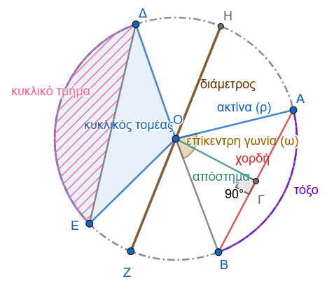
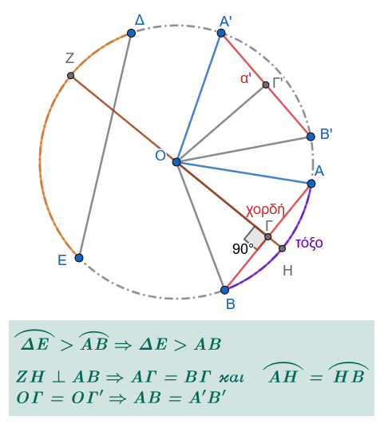

```{=html}
<!-- Φόρτωση βιβλιοθήκης GeoGebra -->
<script src="https://www.geogebra.org/apps/deployggb.js"></script>

<!-- Συνάρτηση δημιουργίας applets -->
<script>
function createGeoGebra(containerId, materialId, width = 700, height = 500) {
  var params = {
    "id": "ggb-" + containerId,
    "material_id": materialId,
    "width": width,
    "height": height,
    "showToolBar": true,
    "showMenuBar": false,
    "showAlgebraInput": true
  };
  
  var applet = new GGBApplet(params, '5.2');
  applet.inject(containerId);
}
</script>
```

## O Κύκλος

::: callout-note
Μπορείτε να ανατρέξετε και στα μαθήματα:

Α' Τάξη Γεωμετρία 11 και 12

Β΄Τάξη Γεωμετρία 10, 11, 12 και 13
:::

### Έννοια του κύκλου και τα στοιχεία του

::: {style="background-color: #db8e79; border: 2px solid #2f3e50; color: #0d0402; padding: 15px; border-radius: 5px;"}
**Έννοια του Κύκλου**

- **Ορισμός:** **Κύκλος** με κέντρο ένα σταθερό σημείο $O$ και ακτίνα $ρ$ ονομάζεται το επίπεδο σχήμα του οποίου όλα τα σημεία απέχουν από το $O$ απόσταση ίση με $ρ$.
  Ο κύκλος σχεδιάζεται με τον διαβήτη και συμβολίζεται με $(Ο, ρ)$ ή απλά $(Ο)$ αν δεν είναι απαραίτητο να αναφερθεί η ακτίνα του.

- **Γεωμετρικός Τόπος:** Ο κύκλος είναι ο **γεωμετρικός τόπος** των σημείων $Μ$ του επιπέδου για τα οποία, και μόνο για αυτά, ισχύει η χαρακτηριστική ιδιότητα $ΟΜ = ρ$.

- **Κυκλικός Δίσκος:** Ορίζεται ως το σύνολο όλων των σημείων $Μ$ του επιπέδου για τα οποία η απόσταση από το κέντρο είναι μικρότερη ή ίση με την ακτίνα ($ΟΜ \leq ρ$), δηλαδή περιλαμβάνει την περιφέρεια του κύκλου μαζί με το εσωτερικό της.

------------------------------------------------------------------------

**Κύρια Στοιχεία του Κύκλου**

- **Κέντρο (**$O$): Το σταθερό σημείο από το οποίο ισαπέχουν όλα τα σημεία του κύκλου.
  Το κέντρο κάθε κύκλου είναι **μοναδικό**.

- **Ακτίνα (**$ρ$): Κάθε ευθύγραμμο τμήμα $ΟΜ$ που συνδέει το κέντρο $O$ με ένα σημείο $Μ$ της περιφέρειας.
  Όλες οι ακτίνες του ίδιου κύκλου είναι **ίσες** μεταξύ τους.

- **Χορδή:** Το ευθύγραμμο τμήμα που συνδέει δύο τυχαία σημεία του κύκλου.

- **Διάμετρος:** Η χορδή που διέρχεται από το κέντρο του κύκλου.
  Είναι η **μεγαλύτερη χορδή** του κύκλου, ισούται με το διπλάσιο της ακτίνας ($2ρ$) και έχει ως μέσο της το κέντρο του κύκλου.
  Τα άκρα μιας διαμέτρου ονομάζονται **αντιδιαμετρικά σημεία**.

- **Τόξο:** Δύο σημεία $Α$ και $Β$ της περιφέρειας χωρίζουν τον κύκλο σε δύο μέρη, καθένα από τα οποία ονομάζεται τόξο.
  Αν τα τόξα είναι άνισα, το μικρότερο ονομάζεται **έλασσον** (αντιστοιχεί σε τόξο μικρότερο από ημικύκλιο) και το μεγαλύτερο **μείζον** τόξο.

{fig-align="center" width="400"}

- **Απόστημα χορδής:** Το μοναδικό κάθετο ευθύγραμμο τμήμα που άγεται από το κέντρο του κύκλου προς μια χορδή.

- **Επίκεντρη Γωνία:** Κάθε γωνία που έχει την κορυφή της στο κέντρο του κύκλου και πλευρές δύο ακτίνες του.
  Το τόξο που περιέχεται στο εσωτερικό της ονομάζεται αντίστοιχο τόξο της.

- **Εγγεγραμμένη Γωνία:** Κάθε γωνία της οποίας η κορυφή είναι σημείο του κύκλου και οι πλευρές της τέμνουν τον κύκλο (είναι δηλαδή χορδές του).

- **Κυκλικός Τομέας:** Το μέρος του κυκλικού δίσκου που περικλείεται από ένα τόξο και τις δύο ακτίνες που καταλήγουν στα άκρα του.

- **Κυκλικό Τμήμα:** Το μέρος του κυκλικού δίσκου που περιέχεται μεταξύ ενός τόξου και της αντίστοιχης χορδής του.
:::

------------------------------------------------------------------------

**Βασικές Ιδιότητες του Κύκλου**

- **Θέση σημείου ως προς τον κύκλο:** Ένα σημείο $Μ$ είναι **εσωτερικό** του κύκλου όταν η απόστασή του από το κέντρο είναι μικρότερη της ακτίνας ($ΟΜ < ρ$) και **εξωτερικό** όταν η απόστασή του είναι μεγαλύτερη της ακτίνας ($ΟΜ > ρ$).

- **Ίσοι κύκλοι:** Δύο κύκλοι είναι ίσοι όταν έχουν ίσες ακτίνες.

- **Ιδιότητες χορδών και αποστημάτων:**

  - Δύο χορδές ενός κύκλου είναι **ίσες** αν και μόνο αν τα αποστήματά τους είναι ίσα.
  - Κάθε διάμετρος που είναι κάθετη σε μια χορδή, **διχοτομεί** τη χορδή αυτή, καθώς και το αντίστοιχο τόξο της.
  - Σε δύο άνισα τόξα αντιστοιχούν χορδές όμοια άνισες (στο μεγαλύτερο τόξο αντιστοιχεί μεγαλύτερη χορδή).

{fig-align="center" width="400"}

------------------------------------------------------------------------

### Επίκεντρη γωνία - Σχέση επίκεντρης γωνίας και τόξου

::: {style="background-color: #db8e79; border: 2px solid #2f3e50; color: #0d0402; padding: 15px; border-radius: 5px;"}
**Ορισμός Επίκεντρης Γωνίας**

- **Ορισμός**: **Επίκεντρη γωνία** (ή επίκεντρος γωνία) σε έναν κύκλο ονομάζεται κάθε γωνία που έχει την κορυφή της στο κέντρο του κύκλου αυτού.

- **Αντίστοιχο Τόξο**: Οι πλευρές της επίκεντρης γωνίας τέμνουν την περιφέρεια του κύκλου σε δύο σημεία, έστω $A$ και $B$.
  Το τόξο $\overparen{AH B}$ που περιέχεται στο εσωτερικό της γωνίας ονομάζεται **αντίστοιχο τόξο** της επίκεντρης γωνίας, και λέμε ότι η γωνία **βαίνει** στο τόξο αυτό.

- **Κυρτή και Μη Κυρτή**: Σε κάθε τόξο αντιστοιχεί μία επίκεντρη γωνία.
  Αν το τόξο είναι μικρότερο από ημικύκλιο (έλασσον τόξο), η αντίστοιχη επίκεντρη γωνία είναι κυρτή, ενώ αν είναι μεγαλύτερο (μείζον τόξο), η επίκεντρη γωνία είναι μη κυρτή.
  Αν η χορδή του τόξου είναι διάμετρος, τότε τα δύο τόξα είναι ίσα και καθένα ονομάζεται **ημικύκλιο**.
:::

------------------------------------------------------------------------

**Βασικές Ιδιότητες και Σχέση Επίκεντρης Γωνίας και Τόξου**

:::: {.math-box .theorem-box}
::: {.math-title .theorem-title}
Θεώρημα 1
:::

- **Σύγκριση τόξων και επίκεντρων γωνιών:** Δύο τόξα ενός κύκλου είναι **ίσα** αν και μόνο αν οι αντίστοιχες επίκεντρες γωνίες που βαίνουν σε αυτά είναι ίσες.
::::

:::: {.math-box .apodeixi-box}
::: {.math-title .apodeixi-title}
**Απόδειξη του Θεωρήματος**
:::

Έστω $\overparen{AB}$ και $\overparen{\Gamma\Delta}$ δύο τόξα ενός κύκλου με κέντρο $Κ$.

**1. Το Ευθύ (Αν τα τόξα είναι ίσα, τότε οι επίκεντρες γωνίες είναι ίσες):**

> > Σχεδιάστε τα αντίστοιχα σχήματα

- Υποθέτουμε ότι τα τόξα $\overparen{AB}$ και $\overparen{\Gamma\Delta}$ είναι **ίσα**.

- Από τον ορισμό της ισότητας, δύο τόξα είναι ίσα όταν με κατάλληλη μετατόπιση συμπίπτουν και ταυτίζονται.

- Κατά τη μετατόπιση αυτή, το άκρο $\Gamma$ συμπίπτει με το $Α$ και το $\Delta$ με το $Β$.

- Εφόσον τα άκρα συμπίπτουν, η ακτίνα $Κ\Gamma$ θα συμπέσει με την $ΚΑ$ και η $Κ\Delta$ με την $ΚΒ$.

- Συνεπώς, οι αντίστοιχες επίκεντρες γωνίες $\widehat{AKB}$ και $\widehat{\Gamma K\Delta}$ συμπίπτουν, που σημαίνει ότι είναι **ίσες**.

**2. Το Αντίστροφο (Αν οι επίκεντρες γωνίες είναι ίσες, τότε τα τόξα είναι ίσα):**

- Υποθέτουμε ότι οι επίκεντρες γωνίες $\widehat{AKB}$ και $\widehat{\Gamma K\Delta}$ είναι **ίσες**.

- Αφού τα σημεία $Α, Β, \Gamma, \Delta$ ανήκουν στον ίδιο κύκλο, αν μετατοπίσουμε τη γωνία $\widehat{\Gamma K\Delta}$ ώστε να ταυτιστεί με την ίση της $\widehat{AKB}$, η πλευρά $Κ\Gamma$ θα ταυτιστεί με την $ΚΑ$ (άρα το $\Gamma$ θα συμπέσει με το $Α$) και η $Κ\Delta$ με την $ΚΒ$ (άρα το $\Delta$ θα συμπέσει με το $Β$).

- Έτσι, τα τόξα $\overparen{AB}$ και $\overparen{\Gamma\Delta}$ αποκτούν τα ίδια άκρα και επειδή βρίσκονται στο εσωτερικό των γωνιών που ταυτίστηκαν, συμπίπτουν πλήρως και είναι **ίσα** ($\overparen{AB} = \overparen{\Gamma\Delta}$).
::::

------------------------------------------------------------------------

:::: {.math-box .corollary-box}
::: {.math-title .corollary-title}
Πορίσματα
:::

- Κάθε διάμετρος ενός κύκλου τον διαιρεί σε δύο ίσα τόξα.

- Δύο κάθετες διάμετροι ενός κύκλου τον διαιρούν σε τέσσερα ίσα τόξα.

- Δύο τόξα ενός κύκλου είναι άνισα, όταν οι αντίστοιχες επίκεντρες γωνίες που βαίνουν σε αυτά είναι ομοιοτρόπως άνισες.

> > δες το σχήμα 2
::::

- **Ανισότητα Τόξων και Γωνιών**: Η σύγκριση των τόξων συνδέεται άμεσα με τη σύγκριση των αντίστοιχων επίκεντρων γωνιών τους.
  Ένα τόξο $\overparen{AB}$ είναι μεγαλύτερο από ένα τόξο $\overparen{Γ\Delta}$ αν και μόνο αν η επίκεντρη γωνία που αντιστοιχεί στο $\overparen{ΑB}$ είναι μεγαλύτερη από την επίκεντρη γωνία που αντιστοιχεί στο $\overparen{Γ\Delta}$.

- **Ημικύκλιο και Τεταρτοκύκλιο**:

  - Ένα **ημικύκλιο** είναι τόξο που αντιστοιχεί σε επίκεντρη γωνία $180^\circ$ (ευθεία γωνία).
  - Ένα **τεταρτοκύκλιο** είναι τόξο που αντιστοιχεί σε επίκεντρη γωνία $90^\circ$ (ορθή γωνία).

- **Άθροισμα Διαδοχικών Τόξων**: Το άθροισμα δύο διαδοχικών τόξων αντιστοιχεί στο άθροισμα των αντίστοιχων διαδοχικών επίκεντρων γωνιών τους.

:::: {.math-box .theorem-box}
::: {.math-title .theorem-title}
Θεώρημα 2
:::

- **Μέσο Τόξου**: Η διχοτόμος μιας επίκεντρης γωνίας διέρχεται από το μοναδικό **μέσο** του αντίστοιχου τόξου της. Αντίστροφα, η ημιευθεία που ξεκινά από το κέντρο του κύκλου και διέρχεται από το μέσο ενός τόξου, αποτελεί τη διχοτόμο της αντίστοιχης επίκεντρης γωνίας.
::::

:::: {.math-box .apodeixi-box}
::: {.math-title .apodeixi-title}
**Απόδειξη του Θεωρήματος**
:::

**1. Το Ευθύ (Από τη Διχοτόμο στο Μέσο)**

Έστω $\widehat{AOB}$ επίκεντρη γωνία σε κύκλο κέντρου $O$ και $OM$ η διχοτόμος της, όπου το σημείο $M$ ανήκει στο αντίστοιχο τόξο $\overparen{AB}$.

- Επειδή η ημιευθεία $OM$ είναι διχοτόμος, οι επίκεντρες γωνίες $\widehat{AOM}$ και $\widehat{MOB}$ είναι ίσες μεταξύ τους.

- Σύμφωνα με το **Θεώρημα Ι**, δύο τόξα ενός κύκλου είναι ίσα αν και μόνο αν οι αντίστοιχες επίκεντρες γωνίες που βαίνουν σε αυτά είναι ίσες.

- Συνεπώς, αφού $\widehat{AOM} = \widehat{MOB}$, προκύπτει ότι και τα αντίστοιχα τόξα είναι ίσα, δηλαδή $\overparen{AM} = \overparen{MB}$.

- Άρα, εξ ορισμού, το σημείο $M$ είναι το μέσο του τόξου $\overparen{AB}$.

**2. Το Αντίστροφο (Από το Μέσο στη Διχοτόμο)**

Έστω $M$ το μέσο του τόξου $\overparen{AB}$ ενός κύκλου με κέντρο $O$.

- Επειδή το $M$ είναι μέσο, εξ ορισμού ισχύει η ισότητα των τόξων $\overparen{AM} = \overparen{MB}$.

- Σύμφωνα με το **Θεώρημα Ι**, σε ίσους κύκλους ή στον ίδιο κύκλο, σε ίσα τόξα αντιστοιχούν ίσες επίκεντρες γωνίες.

- Επομένως, οι αντίστοιχες επίκεντρες γωνίες $\widehat{AOM}$ και $\widehat{MOB}$ είναι ίσες.

- Αυτό σημαίνει ότι η ημιευθεία $OM$ διχοτομεί την επίκεντρη γωνία $\widehat{AOB}$, δηλαδή είναι η διχοτόμος της.

**3. Η Μοναδικότητα του Μέσου**

Η μοναδικότητα του μέσου ενός τόξου αποδεικνύεται με τη μέθοδο της απαγωγής σε άτοπο, στηριζόμενη στη μοναδικότητα της διχοτόμου.

- Υποθέτουμε ότι το τόξο $\overparen{AB}$ έχει και δεύτερο μέσο, έστω το σημείο $M'$.

- Τότε, σύμφωνα με το αντίστροφο, η ημιευθεία $OM'$ θα ήταν επίσης διχοτόμος της επίκεντρης γωνίας $\widehat{AOB}$.

- Αυτό όμως είναι άτοπο, διότι η διχοτόμος κάθε γωνίας είναι μοναδική.

- Συνεπώς, το μέσο κάθε τόξου είναι **μοναδικό**.
::::

------------------------------------------------------------------------

**Βασικές Ιδιότητες και Συσχετίσεις**

- **Σχέση Κάθετης και Μέσου:** Η διχοτόμος $OM$ της επίκεντρης γωνίας $\widehat{AOB}$ (που διέρχεται από το μέσο $M$ του τόξου $\overparen{AB}$) είναι κάθετη στη χορδή $AB$.
  Ισχύει η ισοδυναμία: $\overparen{AM} = \overparen{MB} \iff OM \perp AB$.

- **Χαρακτηριστική Ευθεία:** Η ευθεία που διέρχεται από το κέντρο του κύκλου, είναι κάθετη στη χορδή $AB$, διέρχεται από το μέσο της χορδής και διέρχεται από το μέσο του τόξου $\overparen{AB}$ είναι η ίδια μοναδική ευθεία.

------------------------------------------------------------------------

**Εφαρμογές - Παραδείγματα**

:::: {.math-box .example-box}
::: {.math-title .example-title}
**Εφαρμογή 1η (Γεωμετρική Κατασκευή Διχοτόμου Γωνίας):**
:::

Η γεωμετρική κατασκευή της διχοτόμου μιας γωνίας στηρίζεται άμεσα στη σχέση του μέσου του τόξου και της επίκεντρης γωνίας.
::::

:::: {.math-box .examplesolution-box}
::: {.math-title .examplesolution-title}
- **Κατασκευή:**
:::

Δίνεται γωνία $\widehat{xOy}$.
Με κέντρο την κορυφή $O$ και τυχαία ακτίνα γράφουμε κύκλο, ο οποίος τέμνει τις πλευρές της γωνίας στα σημεία $A$ και $B$ αντίστοιχα.
Στη συνέχεια, κατασκευάζουμε τη μεσοκάθετο $\delta$ της χορδής $AB$.

- **Απόδειξη:** Η ευθεία $\delta$, ως μεσοκάθετος της χορδής του κύκλου $AB$, διέρχεται υποχρεωτικά από το κέντρο του κύκλου $O$ και διχοτομεί το αντίστοιχο τόξο $\overparen{AB}$ της γωνίας. Εφόσον διέρχεται από το μέσο του τόξου, η ημιευθεία αυτή είναι η ζητούμενη διχοτόμος της επίκεντρης γωνίας.
::::

:::: {.math-box .example-box}
::: {.math-title .example-title}
**Εφαρμογή 2η (Αποδεικτική Άσκηση επί των Τόξων Ημικυκλίου):**
:::

Σε ημικύκλιο θεωρούμε τα σημεία $A, B$ και το μέσο $M$ του τόξου $\overparen{AB}$, οπότε $\overparen{MA} = \overparen{MB}$.

Έστω $P$ ένα σημείο του ημικυκλίου που βρίσκεται εκτός του τόξου $\overparen{AB}$, έτσι ώστε η σειρά των σημείων στην περιφέρεια να είναι $P - A - M - B$.

Θα αποδείξουμε ότι $\overparen{PM} = \dfrac{1}{2}(\overparen{PA} + \overparen{PB})$.
::::

:::: {.math-box .examplesolution-box}
::: {.math-title .examplesolution-title}
- **Απόδειξη:**
:::

Από τη διάταξη των διαδοχικών σημείων στην περιφέρεια προκύπτει ότι:

1.  Το τόξο $\overparen{PM}$ αναλύεται ως άθροισμα των διαδοχικών τόξων $\overparen{PA}$ και $\overparen{AM}$: $$\overparen{PM} = \overparen{PA} + \overparen{AM}$$

2.  Το τόξο $\overparen{PB}$ αναλύεται ως άθροισμα των διαδοχικών τόξων $\overparen{PM}$ και $\overparen{MB}$: $$\overparen{PB} = \overparen{PM} + \overparen{MB} \Rightarrow \overparen{PM} = \overparen{PB} - \overparen{MB}$$

- Προσθέτουμε κατά μέλη τις δύο αυτές εξώσεις: $$2\overparen{PM} = \overparen{PA} + \overparen{AM} + \overparen{PB} - \overparen{MB}$$ Επειδή όμως το $M$ είναι το μέσο του τόξου $\overparen{AB}$, ισχύει $\overparen{AM} = \overparen{MB}$.

- Αντικαθιστώντας αυτή την ισότητα στην παραπάνω σχέση, τα τμήματα $\overparen{AM}$ και $\overparen{MB}$ απλοποιούνται και προκύπτει: $$2\overparen{PM} = \overparen{PA} + \overparen{PB} \Rightarrow \overparen{PM} = \frac{1}{2}(\overparen{PA} + \overparen{PB}) \quad$$
::::

------------------------------------------------------------------------

### Μέτρο τόξου και γωνίας

::: {style="background-color: #db8e79; border: 2px solid #2f3e50; color: #0d0402; padding: 15px; border-radius: 5px;"}
- **Μονάδα Μέτρησης (Μοίρα)**: Ως μονάδα μέτρησης των τόξων χρησιμοποιείται η **μοίρα (**$1^\circ$), η οποία ορίζεται ως το $\dfrac{1}{360}$ του τόξου ολόκληρου του κύκλου.

Η μοίρα υποδιαιρείται σε **60 πρώτα λεπτά (**$60'$) και κάθε πρώτο λεπτό σε **60 δεύτερα λεπτά (**$60''$).

**Ορισμός Μέτρου Τόξου**

Είναι ο θετικός αριθμός που εκφράζει πόσες φορές το τόξο περιέχει τη μοίρα ή υποδιαιρέσεις της.

- Το τόξο ολόκληρου του κύκλου ισούται με $360^\circ$.

- Το **ημικύκλιο** (το καθένα από τα δύο ίσα μέρη στα οποία χωρίζεται ο κύκλος από μια διάμετρο) ισούται με $180^\circ$.

- Το **τεταρτοκύκλιο** (το καθένα από τα τέσσερα ίσα μέρη στα οποία χωρίζεται ο κύκλος από δύο κάθετες διαμέτρους) ισούται με $90^\circ$.

**Άλλα Συστήματα Μέτρησης**

- **Βαθμός (**$^g$): Ορίζεται ως το $\dfrac{1}{400}$ της περιφέρειας του κύκλου.
  Υποδιαιρείται σε 100 πρώτα λεπτά του βαθμού ($1^g = 100^c$) και έκαστο πρώτο σε 100 δεύτερα λεπτά του βαθμού ($1^c = 100^{cc}$).

- **Ακτίνιο (rad):** Είναι το τόξο του οποίου το μήκος ισούται με την ακτίνα του κύκλου.
  Η πλήρης περιφέρεια ισούται με $2\pi$ ακτίνια.

------------------------------------------------------------------------

**Μέτρο Γωνίας**

**Ορισμός** Αν θεωρήσουμε μια γωνία $x\widehat{O}y$, την καθιστούμε επίκεντρη σε έναν κύκλο $(O, \rho)$.
Έστω $\overparen{AB}$ το τόξο στο οποίο βαίνει.
**Ορίζουμε ως μέτρο της γωνίας** $x\widehat{O}y$ το μέτρο του αντίστοιχου τόξου $\overparen{AB}$.

**Βασικά Μέτρα**

- Το μέτρο μιας **ορθής γωνίας** είναι $90^\circ$ (ή $100^g$ ή $\dfrac{\pi}{2}$ rad).

- Το μέτρο μιας **ευθείας γωνίας** είναι $180^\circ$ (ή $200^g$ ή $\pi$ rad).

- Το μέτρο μιας **πλήρους γωνίας** είναι $360^\circ$ (ή $400^g$ ή $2\pi$ rad).
:::

------------------------------------------------------------------------

**Εφαρμογές - Παραδείγματα**

:::: {.math-box .example-box}
::: {.math-title .example-title}
**Παράδειγμα 1ο (Υπολογισμός τόξων και γωνιών)**:
:::

Σε κύκλο κέντρου $O$, θεωρούμε τα διαδοχικά τόξα $\overparen{ΑB}$, $\overparen{Β\Gamma}$ και $\overparen{ΓA}$, τέτοια ώστε να ισχύει η σχέση $\overparen{ΑB} = 3\overparen{ΑΓ}$ και $\overparen{ΑΒ}= 6\overparen{ΒΓ}$.

- **Ζητείται**: Να υπολογισθούν τα μέτρα των τόξων $\overparen{ΑB}$, $\overparen{Β\Gamma}$, $\overparen{ΓA}$ και των αντίστοιχων επίκεντρων γωνιών τους.
::::

:::: {.math-box .examplesolution-box}
::: {.math-title .examplesolution-title}
- **Λύση**:
:::

**Βήμα 1: Κατανόηση των δεδομένων**

Ένας πλήρης κύκλος έχει συνολικό μέτρο $360^\circ$.
Επειδή τα τόξα $\overparen{AB}$, $\overparen{B\Gamma}$ και $\overparen{\Gamma A}$ είναι διαδοχικά και καλύπτουν όλο τον κύκλο, το άθροισμά τους ισούται με $360^\circ$:

$$\overparen{AB} + \overparen{B\Gamma} + \overparen{\Gamma A} = 360^\circ$$

**Βήμα 2: Έκφραση όλων των τόξων με μία μεταβλητή**

Έστω ότι το μέτρο του τόξου $\overparen{B\Gamma}$ είναι $x$.

- Από τη σχέση $\overparen{AB} = 6\overparen{B\Gamma}$, έχουμε: $$\overparen{AB} = 6x$$

- Από τη σχέση $\overparen{AB} = 3\overparen{\Gamma A}$, λύνουμε ως προς $\overparen{\Gamma A}$: $$\overparen{\Gamma A} = \frac{\overparen{AB}}{3} = \frac{6x}{3} = 2x$$

**Βήμα 3: Υπολογισμός της τιμής του** $x$

Προσθέτουμε τα τρία τόξα και εξισώνουμε με $360^\circ$:

$$6x + x + 2x = 360^\circ$$ $$9x = 360^\circ$$ $$x = \frac{360^\circ}{9}$$ $$x = 40^\circ$$

**Βήμα 4: Υπολογισμός των μέτρων των τόξων**

Αντικαθιστούμε το $x = 40^\circ$:

- $\overparen{B\Gamma} = x = 40^\circ$
- $\overparen{\Gamma A} = 2x = 2 \cdot 40^\circ = 80^\circ$
- $\overparen{AB} = 6x = 6 \cdot 40^\circ = 240^\circ$

Βήμα 5: Υπολογισμός των αντίστοιχων επίκεντρων γωνιών

Το μέτρο κάθε επίκεντρης γωνίας είναι ίσο με το μέτρο του αντίστοιχου τόξου στο οποίο βαίνει:

- $\widehat{B O \Gamma} = \overparen{B\Gamma} = 40^\circ$
- $\widehat{\Gamma OA} = \overparen{\Gamma A} = 80^\circ$
- $\widehat{AOB} = \overparen{AB} = 240^\circ$ (μη κυρτή γωνία)
::::

:::: {.math-box .example-box}
::: {.math-title .example-title}
**Παράδειγμα 2ο (Διαίρεση κύκλου από κάθετες διαμέτρους)**:
:::

Θεωρούμε δύο διαμέτρους $AB$ και $\Gamma\Delta$ ενός κύκλου κέντρου $O$, οι οποίες σχηματίζουν δύο εφεξής γωνίες ίσες.

- **Ζητείται**: Να αποδειχθεί ότι οι διάμετροι αυτοί διαιρούν τον κύκλο σε τέσσερα ίσα τόξα.
::::

:::: {.math-box .examplesolution-box}
::: {.math-title .examplesolution-title}
- **Λύση**:
:::

Έστω οι δύο εφεξής επίκεντρες γωνίες $\widehat{AO\Gamma}$ και $\widehat{\Gamma OB}$.

Επειδή η $AB$ είναι διάμετρος, οι ημιευθείες $OA$ και $OB$ είναι αντικείμενες, άρα οι γωνίες αυτές είναι παραπληρωματικές: $$\widehat{AO\Gamma} + \widehat{\Gamma OB} = 180^\circ$$.

Επειδή δίνονται ίσες, συμπεραίνουμε ότι καθεμία είναι ορθή ($90^\circ$): $$\widehat{AO\Gamma} = \widehat{\Gamma OB} = 90^\circ$$ Οι κατά κορυφήν γωνίες τους θα είναι επίσης ίσες με $90^\circ$: $$\widehat{BO\Delta} = \widehat{AO\Gamma} = 90^\circ \text{ και } \widehat{\Delta OA} = \widehat{\Gamma OB} = 90^\circ$$.

Έτσι, όλες οι επίκεντρες γωνίες που σχηματίζονται είναι ίσες με $90^\circ$ η καθεμία: $$\widehat{AO\Gamma} = \widehat{\Gamma OB} = \widehat{BO\Delta} = \widehat{\Delta OA} = 90^\circ$$.

Εφόσον ίσες επίκεντρες γωνίες βαίνουν σε ίσα αντίστοιχα τόξα, συμπεραίνουμε ότι και τα αντίστοιχα τόξα είναι ίσα μεταξύ τους, με μέτρο $90^\circ$ το καθένα (δηλαδή τεταρτοκύκλια): $$\overparen{Α\Gamma} = \overparen{ΓB} = \overparen{Β\Delta} = \overparen{ΔA} = 90^\circ$$.
::::

:::: {.math-box .example-box}
::: {.math-title .example-title}
**Παράδειγμα 3ο (Διαφορά Τόξων σε Ημικύκλιο)**
:::

Σε ημικύκλιο διαμέτρου $AB$ θεωρούμε σημείο $\Gamma$ τέτοιο ώστε $\overparen{A\Gamma} - \overparen{\Gamma B} = 80^\circ$.

Να βρεθούν τα μέτρα των τόξων $\overparen{A\Gamma}$ και $\overparen{\Gamma B}$, καθώς και των επίκεντρων γωνιών $\widehat {AOΓ}$ και $\widehat{ΓOΒ}$.
::::

:::: {.math-box .examplesolution-box}
::: {.math-title .examplesolution-title}
- **Λύση:**
:::

Επειδή το $AB$ είναι διάμετρος, το τόξο $\overparen{A\Gamma B}$ είναι ημικύκλιο, άρα το άθροισμα των διαδοχικών τόξων $\overparen{A\Gamma}$ και $\overparen{\Gamma B}$ ισούται με $180^\circ$.
Έτσι προκύπτει το σύστημα:

1.  $\overparen{A\Gamma} + \overparen{\Gamma B} = 180^\circ$
2.  $\overparen{A\Gamma} - \overparen{\Gamma B} = 80^\circ$

Προσθέτοντας κατά μέλη τις δύο εξισώσεις, έχουμε: $$2\overparen{A\Gamma} = 260^\circ \Rightarrow \overparen{A\Gamma} = 130^\circ$$ Αντικαθιστώντας στην πρώτη εξίσωση, βρίσκουμε: $$\overparen{\Gamma B} = 180^\circ - 130^\circ = 50^\circ$$ Επειδή οι επίκεντρες γωνίες ισούνται με τα αντίστοιχα τόξα τους, έχουμε:

- $\widehat{AOΓ} = \overparen{A\Gamma} = 130^\circ$
- $\widehat{ΓΟB} = \overparen{\Gamma B} = 50^\circ$
::::

:::: {.math-box .example-box}
::: {.math-title .example-title}
**Παράδειγμα 4ο (Μέσο Τόξου και Διαίρεση Ημικυκλίου)**
:::

Δίνεται ημικύκλιο διαμέτρου $AB$, $M$ το μέσο του τόξου $\overparen{AB}$ και $K$ τυχαίο σημείο του τόξου $\overparen{BM}$.

Αν $\Gamma$ και $\Delta$ είναι τα μέσα των τόξων $\overparen{AK}$ και $\overparen{MK}$ αντίστοιχα, να υπολογισθεί το μέτρο του τόξου $\overparen{\Gamma\Delta}$.
::::

:::: {.math-box .examplesolution-box}
::: {.math-title .examplesolution-title}
- **Λύση:**
:::

Επειδή το $AB$ είναι διάμετρος, το τόξο $\overparen{AB}$ είναι ημικύκλιο, άρα $\overparen{AB} = 180^\circ$.
- Το $M$ είναι μέσο του τόξου $\overparen{AB}$, οπότε $\overparen{AM} = \overparen{MB} = 90^\circ$.
- Το σημείο $K$ ανήκει στο τόξο $\overparen{BM}$, οπότε τα σημεία βρίσκονται πάνω στην περιφέρεια με τη σειρά $A - \Gamma - M - \Delta - K - B$.
- Έστω $x$ το μέτρο του τόξου $\overparen{MK}$, οπότε $\overparen{AK} = \overparen{AM} + \overparen{MK} = 90^\circ + x$.
- Επειδή το $\Gamma$ είναι το μέσο του τόξου $\overparen{AK}$, έχουμε: $$\overparen{\Gamma K} = \frac{\overparen{AK}}{2} = \frac{90^\circ + x}{2} = 45^\circ + \frac{x}{2}$$ - Επειδή το $\Delta$ είναι το μέσο του τόξου $\overparen{MK}$, έχουμε: $$\overparen{\Delta K} = \frac{\overparen{MK}}{2} = \frac{x}{2}$$ - Παρατηρούμε από τη διάταξη των σημείων ότι το τόξο $\overparen{\Gamma\Delta}$ προκύπτει ως διαφορά του τόξου $\overparen{\Delta K}$ από το τόξο $\overparen{\Gamma K}$: $$\overparen{\Gamma\Delta} = \overparen{\Gamma K} - \overparen{\Delta K} = \left(45^\circ + \frac{x}{2}\right) - \frac{x}{2} = 45^\circ$$ Συνεπώς, το μέτρο του τόξου $\overparen{\Gamma\Delta}$ είναι σταθερό και ισούται με $45^\circ$, ανεξάρτητα από τη θέση του σημείου $K$ πάνω στο τόξο $\overparen{BM}$.
::::

------------------------------------------------------------------------

### Ασκήσεις

***Ενότητα 1: Έννοια του κύκλου και τα στοιχεία του***

Άσκηση 1

Δίνεται κύκλος με κέντρο O και ακτίνα $\rho = 5$ cm.
Εξετάστε τη θέση των σημείων A, B και Γ ως προς τον κύκλο, αν οι αποστάσεις τους από το κέντρο είναι OA = 3 cm, OB = 5 cm και OΓ = 7 cm.

Άσκηση 2

Αν η διάμετρος ενός κύκλου (O, $\rho$) είναι 12 cm, να βρεθεί η ακτίνα του κύκλου και η απόσταση των αντιδιαμετρικών σημείων E και Z.

Άσκηση 3

Σε έναν κύκλο (O, \rho), θεωρούμε μια χορδή AB.
Αν το απόστημα της χορδής OK είναι κάθετο στην AB, τι γνωρίζετε για τη σχέση του σημείου K με το τμήμα AB;

Άσκηση 4

Ορίζονται δύο ομόκεντροι κύκλοι με κέντρο O και ακτίνες R = 10 cm και $\rho$ = 6 cm.
Ποια είναι η απόσταση μεταξύ των δύο κύκλων κατά μήκος μιας ακτίνας;

Άσκηση 5

Δίνεται χορδή AB μήκους 8 cm σε κύκλο (O, $\rho$).
Αν το σημείο M είναι το μέσο της AB, να εξηγήσετε γιατί το τμήμα OM είναι το απόστημα της χορδής.

Λύση Το τρίγωνο OAB είναι ισοσκελές (OA = OB = $\rho$).
Σε κάθε ισοσκελές τρίγωνο, η διάμεσος (OM) που αντιστοιχεί στη βάση είναι και ύψος.
Επειδή OM $\perp$ AB, το τμήμα OM είναι το κάθετο τμήμα από το κέντρο προς τη χορδή, άρα εξ' ορισμού είναι το απόστημα της AB.

Άσκηση 6

Σε έναν κύκλο (O, $\rho$), μια χορδή AB έχει μήκος 10 cm.
Μια άλλη χορδή ΓΔ έχει επίσης μήκος 10 cm.
Τι συμπεραίνετε για τα αποστήματά τους OK και OΛ;

Άσκηση 7

Ποιος είναι ο γεωμετρικός τόπος των κέντρων των κύκλων που διέρχονται από δύο σταθερά σημεία A και B;

Λύση Έστω M το κέντρο ενός τέτοιου κύκλου.
Τότε MA = MB (ως ακτίνες).
Τα σημεία που ισαπέχουν από τα άκρα ενός τμήματος AB ανήκουν στη μεσοκάθετο του τμήματος.
Επομένως, ο γεωμετρικός τόπος είναι η μεσοκάθετος του τμήματος AB.

Άσκηση 8

Σε έναν κύκλο (O, $\rho$), ποια είναι η μεγαλύτερη δυνατή χορδή που μπορεί να σχεδιαστεί;

Άσκηση 9

Δίνεται κύκλος (O, $\rho$) και ένα σημείο A πάνω σε αυτόν.
Πού βρίσκεται το συμμετρικό σημείο του A ως προς κέντρο συμμετρίας το O;

***Ενότητα 2: Επίκεντρη γωνία - Σχέση επίκεντρης γωνίας και τόξου***

Άσκηση 1

Ορίστε την επίκεντρη γωνία και το αντίστοιχο τόξο της.

Άσκηση 2

Σε έναν κύκλο, δύο επίκεντρες γωνίες $\widehat{AOB}$ και $\widehat{ΓOΔ}$ είναι ίσες.
Τι συμπεραίνετε για τα τόξα $\overparen{AB}$ και $\overparen{ΓΔ}$;

Άσκηση 3

Αν $\overparen{AB} = \overparen{ΓΔ}$ σε έναν κύκλο, τι ισχύει για τις χορδές AB και ΓΔ;

Άσκηση 4

Έστω τόξο $\overparen{AB}$ και M το εσωτερικό σημείο του τόξου τέτοιο ώστε $\overparen{AM} = \overparen{MB}$.
Πώς ονομάζεται το σημείο M και ποια η σχέση της ημιευθείας OM με τη γωνία $\widehat{AOB}$;

Άσκηση 5

Δύο διάμετροι AB και ΓΔ ενός κύκλου είναι κάθετες μεταξύ τους.
Σε πόσα τόξα χωρίζουν τον κύκλο και τι είδους τόξα είναι αυτά;

Άσκηση 6

Σε έναν κύκλο (O, $\rho$), η επίκεντρη γωνία $\widehat{AOB}$ είναι μεγαλύτερη από την επίκεντρη γωνία $\widehat{ΓOΔ}$.
Συγκρίνετε τα αντίστοιχα τόξα τους.

Άσκηση 7

Αν μια ημιευθεία $O\delta$ διχοτομεί μια επίκεντρη γωνία $\widehat{AOB}$, να αποδείξετε ότι διχοτομεί και το αντίστοιχο τόξο A͡B.

Λύση Έστω M το σημείο τομής της $O\delta$ με το τόξο $\overparen{AB}$.
Εφόσον η $O\delta$ είναι διχοτόμος, ισχύει $\widehat{AOM} = \widehat{MOB}$.
Από τη σχέση επίκεντρης γωνίας και τόξου, ίσες επίκεντρες γωνίες βαίνουν σε ίσα τόξα στον ίδιο κύκλο.
Άρα $\overparen{AM} = \overparen{MB}$, που σημαίνει ότι το M είναι το μέσο του τόξου.

Άσκηση 8

Μια διάμετρος AB χωρίζει τον κύκλο σε δύο τόξα.
Πώς ονομάζονται αυτά τα τόξα και ποια η μεταξύ τους σχέση;

Άσκηση 9

Δίνονται δύο ομόκεντροι κύκλοι (O, R) και (O, $\rho$).
Μια επίκεντρη γωνία $\omega$ τέμνει τον μικρό κύκλο στα A, B και τον μεγάλο στα Γ, Δ.
Συγκρίνετε τα τόξα A͡B και Γ͡Δ ως προς τις μοίρες τους.

Λύση Παρόλο που τα τόξα ανήκουν σε διαφορετικούς κύκλους και δεν είναι συγκρίσιμα ως προς το μήκος τους, ως προς το μέτρο τους (μοίρες) είναι ίσα, διότι αντιστοιχούν στην ίδια επίκεντρη γωνία $\omega$.

Άσκηση 10

Είναι δυνατόν ένα τόξο να έχει δύο διαφορετικά μέσα;

Λύση Όχι.
Σύμφωνα με το Θεώρημα ΙΙ , το μέσο ενός τόξου είναι μοναδικό, διότι αντιστοιχεί στη μοναδική διχοτόμο της αντίστοιχης επίκεντρης γωνίας.

***Ενότητα 3: Μέτρο τόξου και γωνίας***

Άσκηση 1

Ποιο είναι το μέτρο σε μοίρες ενός πλήρους κύκλου, ενός ημικυκλίου και ενός τεταρτοκυκλίου;

Άσκηση 2

Δίνονται δύο διαδοχικά τόξα $\overparen{AB} = 50^\circ$ και $\overparen{BΓ} = 70^\circ$.
Να βρεθεί το μέτρο του τόξου A͡Γ.

Άσκηση 3

Αν ένα τόξο A͡B είναι το $\dfrac{1}{6}$ του κύκλου, πόσες μοίρες είναι η αντίστοιχη επίκεντρη γωνία $\widehat{AOB}$;

Άσκηση 4

Δίνεται ημικύκλιο AB (διάμετρος AB).
Αν ένα σημείο Γ πάνω στο ημικύκλιο ορίζει τόξο $\overparen{AΓ} = 110^\circ$, να βρεθεί το μέτρο του τόξου $\overparen{ΓB}$.

Άσκηση 5

Μια επίκεντρη γωνία είναι ορθή.
Τι κλάσμα του κύκλου αποτελεί το αντίστοιχο τόξο της;

:::: {.math-box .exercise-box}
::: {.math-title .exercise}
Άσκηση 6
:::

Αν η διαφορά δύο τόξων $\overparen{AB}$ και $\overparen{AΓ}$ (με κοινό άκρο A και $\overparen{AB} > \overparen{AΓ}$) είναι $45^\circ$ και το $AΓ = 30^\circ$, να βρεθεί το μέτρο του $\overparen{AB}$.
::::

:::: {.math-box .solution-box}
::: {.math-title .solution}
Λύση
:::

Από τον ορισμό της διαφοράς τόξων: $\overparen{AB} -\overparen{ΑΓ} = 45^\circ \Rightarrow \overparen{AB} - 30^\circ = 45^\circ \Rightarrow \overparen{AB} = 75^\circ$.
::::

Άσκηση 7

Ένας κύκλος χωρίζεται από 5 σημεία σε 5 ίσα διαδοχικά τόξα.
Πόσες μοίρες είναι η επίκεντρη γωνία που βαίνει σε δύο από αυτά τα τόξα μαζί;

:::: {.math-box .exercise-box}
::: {.math-title .exercise}
Άσκηση 8
:::

Σε έναν κύκλο, μια χορδή AB ισούται με την ακτίνα $\rho$ του κύκλου.
Να βρεθεί το μέτρο του τόξου $\overparen{AB}$ σε μοίρες.
::::

:::: {.math-box .solution-box}
::: {.math-title .solution}
Λύση
:::

Το τρίγωνο OAB έχει πλευρές $OA = \rho, \ \  OB = \rho \ \ και \ \ \ AB = \rho$.

Επομένως είναι ισόπλευρο.

Σε ένα ισόπλευρο τρίγωνο όλες οι γωνίες είναι $60^\circ$.

Άρα η επίκεντρη γωνία $\widehat{AOB} = 60^\circ$.

Συνεπώς, το αντίστοιχο τόξο AB είναι $60^\circ$.
::::

:::: {.math-box .exercise-box}
::: {.math-title .exercise}
Άσκηση 9
:::

Να βρεθεί το μέτρο της επίκεντρης γωνίας που αντιστοιχεί στα $\dfrac{2}{3}$ ενός ημικυκλίου.
::::

:::: {.math-box .solution-box}
::: {.math-title .solution}
Λύση
:::

1.  Το ημικύκλιο είναι $180^\circ$.
2.  Τα $\dfrac{2}{3}$ του ημικυκλίου είναι: $\dfrac{2}{3} \cdot 180^\circ = 2 \cdot 60^\circ = 120^\circ$.
3.  Η επίκεντρη γωνία που βαίνει σε αυτό το τόξο είναι $120^\circ$.
::::
