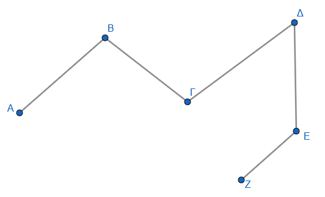
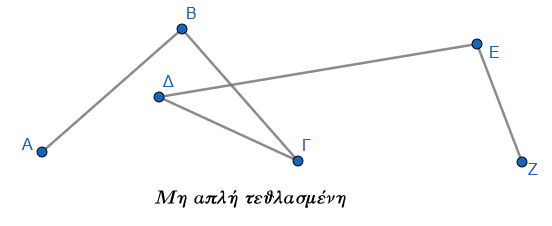
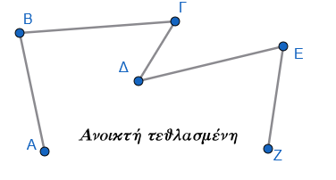
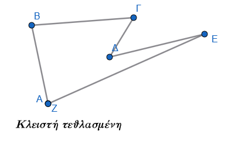
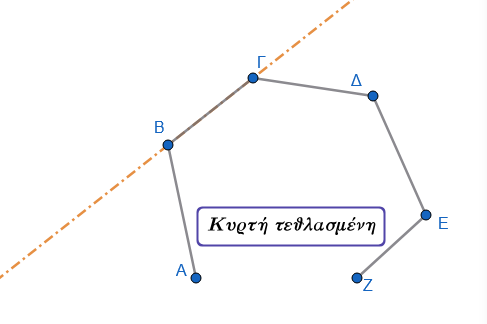
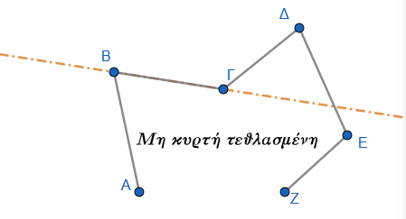
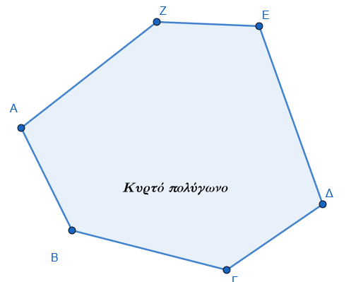
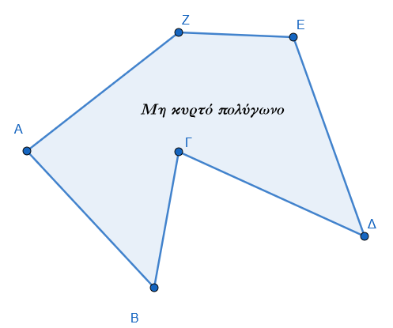
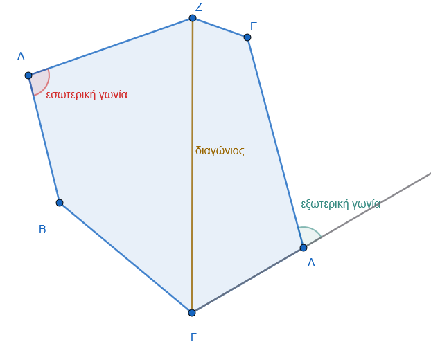

```{=html}
<!-- Φόρτωση βιβλιοθήκης GeoGebra -->
<script src="https://www.geogebra.org/apps/deployggb.js"></script>

<!-- Συνάρτηση δημιουργίας applets -->
<script>
function createGeoGebra(containerId, materialId, width = 700, height = 500) {
  var params = {
    "id": "ggb-" + containerId,
    "material_id": materialId,
    "width": width,
    "height": height,
    "showToolBar": true,
    "showMenuBar": false,
    "showAlgebraInput": true
  };
  
  var applet = new GGBApplet(params, '5.2');
  applet.inject(containerId);
}
</script>
```

## Ευθύγραμμα σχήματα

***Τεθλασμένη γραμμή - Πολύγωνο - Στοιχεία πολυγώνου***

### Θεωρητική Θεμελίωση: Η Τεθλασμένη Γραμμή

::: {style="background-color: #db8e79; border: 2px solid #2f3e50; color: #0d0402; padding: 15px; border-radius: 5px;"}
Η έννοια της τεθλασμένης γραμμής αποτελεί το θεμελιώδες μεταβατικό στάδιο στη Γεωμετρία, γεφυρώνοντας το απλό ευθύγραμμο τμήμα με τα σύνθετα επίπεδα σχήματα.
Ενώ το ευθύγραμμο τμήμα ορίζει τη συντομότερη απόσταση μεταξύ δύο σημείων, η τεθλασμένη γραμμή εισάγει τη δυναμική της αλλαγής κατεύθυνσης στο επίπεδο, επιτρέποντας τη δημιουργία δομών που οριοθετούν τμήματα της επιφάνειας.

#### Ορισμός και Δομικά Στοιχεία

Σύμφωνα με την Ευκλείδεια θεμελίωση, θεωρούμε μια σειρά σημείων $A, B, \Gamma, \Delta, \dots$ με καθορισμένη σειρά, τέτοια ώστε ανά τρία διαδοχικά να μην είναι συνευθειακά.
Το σχήμα που ορίζεται από τα διαδοχικά ευθύγραμμα τμήματα $AB, B\Gamma, \Gamma\Delta, \dots$ ονομάζεται τεθλασμένη γραμμή.\
{width="400"}

- [*Κορυφές:*]{style="color: blue;"} Τα σημεία $A, B, \Gamma, \Delta, \dots$.
- [*Άκρα:*]{style="color: blue;"} Οι ακραίες κορυφές (π.χ. A και Z).
- [*Πλευρές:*]{style="color: blue;"} Τα ευθύγραμμα τμήματα $AB, B\Gamma, \Gamma\Delta, \dots$.
- [*Περίμετρος:*]{style="color: blue;"} Το άθροισμα των μηκών όλων των πλευρών της τεθλασμένης.

#### Ταξινόμηση και Διαφοροποίηση

Η μορφολογία μιας τεθλασμένης γραμμής καθορίζει τις γεωμετρικές της ιδιότητες:

- [*Απλή vs Μη απλή:*]{style="color: blue;"} Μια τεθλασμένη ονομάζεται απλή όταν δύο οποιεσδήποτε μη διαδοχικές πλευρές της δεν έχουν κοινό εσωτερικό σημείο.
  Αν οι πλευρές τέμνονται σε σημεία πέραν των κορυφών, η γραμμή χαρακτηρίζεται ως μη απλή.\
  

- [*Ανοικτή vs Κλειστή:*]{style="color: blue;"} Αν τα άκρα συμπίπτουν, η τεθλασμένη ονομάζεται κλειστή.
  Σε αντίθετη περίπτωση, είναι ανοικτή.\
  {width="250"} {width="250"}

- [*Κυρτή vs Μη κυρτή:*]{style="color: blue;"} Μια τεθλασμένη καλείται κυρτή, όταν ο φορέας κάθε πλευράς της αφήνει όλες τις υπόλοιπες κορυφές προς το ίδιο μέρος (στο ίδιο ημιεπίπεδο).
  Αν τουλάχιστον ένας φορέας πλευράς χωρίζει τις κορυφές, η γραμμή είναι μη κυρτή.\
  {width="300"} {width="300"}

[Σημασία της Κυρτότητας (So What?):]{style="color: #fc036b;"} Ο περιορισμός της κυρτότητας εξασφαλίζει τη γεωμετρική σταθερότητα του σχήματος.
Στις κυρτές γραμμές, η δομή "ανοίγει" πάντα προς την ίδια κατεύθυνση, γεγονός που επιτρέπει τη διατύπωση γενικών θεωρημάτων για τα αθροίσματα γωνιών, αποφεύγοντας τις πολυπλοκότητες των "εσοχών" και της εσωστρέφειας που συναντώνται στα μη κυρτά σχήματα.

[Συνδετική Πρόταση:]{style="color: green;"} Όταν μια τεθλασμένη γραμμή είναι ταυτόχρονα απλή και κλειστή, μετουσιώνεται σε ένα αυτόνομο γεωμετρικό σχήμα: το πολύγωνο.
:::

### Το Πολύγωνο και τα Συστατικά του Στοιχεία

::: {style="background-color: #db8e79; border: 2px solid #2f3e50; color: #0d0402; padding: 15px; border-radius: 5px;"}
Το πολύγωνο αποτελεί τον βασικό "δομικό λίθο" της Επιπεδομετρίας.
Πρέπει να διακρίνουμε το Πολύγωνο (που είναι η κλειστή γραμμή) από το Πολυγωνικό Χωρίο, το οποίο αποτελείται από το πολύγωνο και τα εσωτερικά του σημεία.

#### Αυστηρός Ορισμός

Πολύγωνο ονομάζεται η κλειστή και απλή τεθλασμένη γραμμή.
Διακρίνεται σε:

1.  [*Κυρτό πολύγωνο:*]{style="color: blue;"} Όταν η τεθλασμένη γραμμή που το ορίζει είναι κυρτή.\
    {width="250"} {width="250"}

2.  [*Μη κυρτό (ή κοίλο) πολύγωνο:*]{style="color: blue;"} Όταν η γραμμή περιλαμβάνει "εσοχές".

> > Σημείωση: Στη διδακτική πράξη και στην Ευκλείδεια Γεωμετρία, όταν αναφερόμαστε σε πολύγωνο, εννοούμε κατά σύμβαση το κυρτό πολύγωνο.

#### Ανατομία του Πολυγώνου

- [*Διαδοχικές κορυφές/πλευρές:*]{style="color: blue;"} Οι κορυφές που αποτελούν άκρα της ίδιας πλευράς και οι πλευρές με κοινή κορυφή.

- [Εσωτερικές γωνίες:]{style="color: blue;"} Οι γωνίες που σχηματίζονται από διαδοχικές πλευρές και περιέχουν εσωτερικά σημεία του πολυγώνου.
  Συμβολίζονται ως $\hat{A}, \hat{B}, \dots$.

- [*Εξωτερικές γωνίες (*$\hat{\phi}_{\epsilon\xi}$):]{style="color: blue;"} Κάθε γωνία που είναι εφεξής και παραπληρωματική μιας εσωτερικής γωνίας.

- [*Διαγώνιος:*]{style="color: blue;"} Κάθε ευθύγραμμο τμήμα που συνδέει δύο μη διαδοχικές κορυφές.\
  {width="400"}

#### Συστηματική Ταξινόμηση

Τα πολύγωνα ονομάζονται ανάλογα με το πλήθος των πλευρών τους ($\nu$):

$$\begin{array}{|c |l |}
\hline\\
Πλήθος Πλευρών (\nu)    & Ονομασία Πολυγώνου\\
\hline\\
\nu=3   &  Τρίγωνο\\
\nu=4   & Τετράπλευρο\\
\nu=5 & Πεντάγωνο\\
\nu=6 & Εξάγωνο\\
\nu & \nu-γωνο\\
\hline
\end{array}$$

[Η Σχέση Εσωτερικής και Εξωτερικής Γωνίας (So What?):]{style="color: blue;"} Η σχέση παραπληρωματικότητας ($\hat{\omega} + \hat{\phi} = 180^\circ$) διασφαλίζει ότι σε ένα κυρτό πολύγωνο, όλες οι εσωτερικές γωνίες παραμένουν κάτω από το όριο των $180^\circ$.
Αυτό εμποδίζει το σχήμα να "διπλώνει" προς τον εαυτό του, διατηρώντας τη δομική του ακεραιότητα.

[Συνδετική Πρόταση:]{style="color: green;"} Η περιγραφή των στοιχείων του πολυγώνου μας επιτρέπει πλέον να προχωρήσουμε στην ποσοτική ανάλυση των ιδιοτήτων τους.
:::

### Ιδιότητες και Θεμελιώδη Γεωμετρικά Θεωρήματα

::: {style="background-color: #db8e79; border: 2px solid #2f3e50; color: #0d0402; padding: 15px; border-radius: 5px;"}
Η μαθηματική απόδειξη των τύπων είναι αυτή που προσφέρει τη βεβαιότητα που απαιτεί η Ευκλείδεια λογική, μετατρέποντας τις παρατηρήσεις σε αδιαμφισβήτητες αλήθειες.

#### Ποσοτικές Σχέσεις

- [*Πλήθος Διαγωνίων (D):*]{style="color: blue;"} Σε ένα $\nu-γωνο$, από κάθε κορυφή ξεκινούν $\nu-3$ διαγώνιοι.
  Πολλαπλασιάζοντας με τις $\nu$ κορυφές και διαιρώντας δια 2 (για να μην προσμετρηθεί κάθε διαγώνιος δύο φορές), προκύπτει: $D = \dfrac{\nu(\nu-3)}{2}$

- [*Άθροισμα Εσωτερικών Γωνιών (*$\Sigma_{\epsilon \sigma}$):]{style="color: blue;"} Η απόδειξη βασίζεται στη μέθοδο της τριγωνοποίησης.
  Από μία τυχαία κορυφή ενός $\nu-γώνου$, σχεδιάζουμε όλες τις δυνατές διαγωνίους ($\nu-3$ στο πλήθος).
  Αυτές χωρίζουν το πολύγωνο σε ακριβώς $\nu-2$ τρίγωνα.
  Εφόσον το άθροισμα των γωνιών κάθε τριγώνου είναι $180^\circ$, το συνολικό άθροισμα των εσωτερικών γωνιών είναι: $Σ_{εσ} = (\nu-2) \cdot 180^\circ$

- [*Άθροισμα Εξωτερικών Γωνιών (*$\Sigma_{\epsilon \xi}$):]{style="color: blue;"} Σε ένα κυρτό πολύγωνο, αν λάβουμε μία εξωτερική γωνία ανά κορυφή, το άθροισμά τους είναι πάντα σταθερό: $\Sigma_{\epsilon \xi} = 360^\circ$

#### Θεωρήματα Ανισότητας και Τομής

1.  Θεώρημα Περιβάλλουσας και Περιβαλλομένης: Αν δύο τεθλασμένες γραμμές έχουν τα ίδια άκρα και η μία περιβάλλει την άλλη, τότε το μήκος της περιβάλλουσας είναι μεγαλύτερο από το μήκος της περιβαλλομένης, υπό την απαρέγκλιτη προϋπόθεση ότι η περιβάλλουσα γραμμή είναι κυρτή.

2.  [Θεώρημα Πλευρών:]{style="color: blue;"} Σε κάθε πολύγωνο, κάθε πλευρά είναι πάντα μικρότερη από το άθροισμα των υπολοίπων πλευρών.

3.  [Περιορισμός Οξειών Γωνιών:]{style="color: blue;"} Σε ένα κυρτό πολύγωνο, είναι αδύνατον να υπάρχουν περισσότερες από τρεις οξείες γωνίες.
    Αν υπήρχαν τέσσερις, το άθροισμα των αντίστοιχων εξωτερικών γωνιών θα ήταν μεγαλύτερο από $4 \cdot 90^\circ = 360^\circ$, γεγονός που αντιβαίνει στο σταθερό άθροισμα $\Sigma_{\epsilon \xi} = 360^\circ$.

4.  [Η Εξέλιξη προς τον Κύκλο (So What?):]{style="color: blue;"} Η παράμετρος $\nu$ καθορίζει την "εξέλιξη" του σχήματος.
    Καθώς το $\nu$ αυξάνεται, το άθροισμα των εσωτερικών γωνιών αυξάνεται, ενώ κάθε εξωτερική γωνία μικραίνει.
    Στο όριο, καθώς το $\nu \to \infty$, το πολύγωνο τείνει να ταυτιστεί με τον κύκλο αν οι πλευρές είναι ίσες, ενώ το άθροισμα των εξωτερικών γωνιών παραμένει $360^\circ$, αντιπροσωπεύοντας την πλήρη περιστροφή που απαιτείται για το "κλείσιμο" του σχήματος.

[Συνδετική Πρόταση:]{style="color: green;"} Η θεωρητική απόδειξη αυτών των σχέσεων αποτελεί το υπόβαθρο για την πρακτική επίλυση προβλημάτων.
:::

### Μεθοδολογία Επίλυσης: Λυμένες Εφαρμογές

Η επίλυση προβλημάτων αποτελεί "μοντελοποίηση" της σκέψης, όπου τα δεδομένα συνδέονται με τα κατάλληλα θεωρήματα.

:::: {.math-box .example-box}
::: {.math-title .example-title}
Εφαρμογή 1: Εύρεση Πλευρών από το Άθροισμα Γωνιών
:::

Πρόβλημα: Βρείτε το $\nu$ αν $\Sigma_{\epsilon \sigma} = 1260^\circ$.
::::

**Λύση:**

$(\nu-2) \cdot 180 = 1260 \implies \nu-2 = 7 \implies \nu = 9$.

Συμπέρασμα Μεθοδολογίας: Όταν δίνεται το άθροισμα γωνιών, επιλύουμε την εξίσωση ως προς $\nu$ χρησιμοποιώντας τον τύπο της τριγωνοποίησης.

:::: {.math-box .example-box}
::: {.math-title .example-title}
Εφαρμογή 2: Προσδιορισμός από τις Διαγωνίους
:::

Πρόβλημα: Ποιο πολύγωνο έχει 20 διαγωνίους;
::::

**Λύση:**

$\dfrac{\nu(\nu-3)}{2} = 20 \implies \nu(\nu-3) = 40$.
Αναζητούμε δύο αριθμούς με διαφορά 3 και γινόμενο 40.
Αυτοί είναι το 8 και το 5.
Άρα $\nu=8$ (Οκτάγωνο).

Συμπέρασμα Μεθοδολογίας: Ο τύπος των διαγωνίων οδηγεί σε αναζήτηση γινομένου δύο παραγόντων με σταθερή διαφορά 3.

:::: {.math-box .example-box}
::: {.math-title .example-title}
Εφαρμογή 3: Ανισοτικές Σχέσεις
:::

Πρόβλημα: Υπάρχει πολύγωνο με πλευρές 5, 7, 15, 2;
::::

**Λύση:**

Η μέγιστη πλευρά είναι 15.
Το άθροισμα των υπολοίπων είναι 5+7+2 = 14.
Επειδή 15 \> 14, το πολύγωνο δεν μπορεί να κατασκευαστεί.

Συμπέρασμα Μεθοδολογίας: Η γενικευμένη τριγωνική ανισότητα απαιτεί η μεγαλύτερη πλευρά να είναι αυστηρά μικρότερη από το άθροισμα των υπολοίπων.

:::: {.math-box .example-box}
::: {.math-title .example-title}
Εφαρμογή 4: Κανονικά Πολύγωνα
:::

Πρόβλημα: Πόσες μοίρες είναι η εσωτερική γωνία κανονικού πενταγώνου;
::::

**Λύση:**

$\hat{\phi}_{\epsilon \xi} = \dfrac{360^\circ}{5} = 72^\circ$.
Η εσωτερική γωνία είναι $\hat{\omega} = 180^\circ - 72^\circ = 108^\circ$.

Συμπέρασμα Μεθοδολογίας: Σε κανονικά σχήματα, ο υπολογισμός μέσω της εξωτερικής γωνίας ($\dfrac{360^\circ}{\nu}$) είναι ο ταχύτερος δρόμος.

### Ασκήσεις

Η γεωμετρική παιδεία απαιτεί κριτική σκέψη και επιμονή στην αποδεικτική διαδικασία.

1.  Υπολογίστε τις διαγωνίους ενός δωδεκαγώνου ($\nu=12$).
2.  Σε ποιο πολύγωνο το πλήθος των διαγωνίων ισούται με το πλήθος των πλευρών;
3.  Αν $\Sigma_{\epsilon \sigma} = 1800^\circ$, βρείτε το $\nu$.
4.  Βρείτε το πολύγωνο στο οποίο η εσωτερική γωνία είναι πενταπλάσια της εξωτερικής.
5.  Απόδειξη: Δείξτε ότι αν $n \to n+1$, το $\Sigma_{\epsilon \sigma} \text{  αυξάνεται κατά  } 180^\circ$.
6.  Απόδειξη: Σε κάθε κυρτό τετράπλευρο, δείξτε ότι $\Sigma_{\epsilon \sigma} = \Sigma_{\epsilon \xi} = 360^\circ$.
7.  Δείξτε ότι δεν υφίσταται κυρτό πολύγωνο με άθροισμα εσωτερικών γωνιών $1000^\circ$.
8.  Ανισότητα: Αποδείξτε ότι για τις πλευρές τετραπλεύρου $AB\Gamma\Delta$ ισχύει $AB < B\Gamma + \Gamma\Delta + \Delta A$.
9.  Αν ένα κυρτό πολύγωνο έχει όλες τις εξωτερικές γωνίες ίσες με $30^\circ$, πόσες διαγωνίους διαθέτει;
10. Άσκηση Πρόκληση: Έστω κυρτό τρίγωνο ($\nu=3$). Αν οι εξωτερικές του γωνίες είναι ανάλογες προς τους αριθμούς 2, 3, 4, προσδιορίστε το είδος του τριγώνου ως προς τις γωνίες του.

Υπόδειξη Στρατηγικής (για την 10η): Χρησιμοποιήστε τη σταθερά $\Sigma_{\epsilon \xi} = 360^\circ$.
Θέστε τις γωνίες ως 2k, 3k, 4k.
Αφού υπολογίσετε το k και τις εξωτερικές γωνίες, βρείτε τις εσωτερικές μέσω της παραπληρωματικότητας για να χαρακτηρίσετε το τρίγωνο.

------------------------------------------------------------------------
