```{=html}
<!-- Φόρτωση βιβλιοθήκης GeoGebra -->
<script src="https://www.geogebra.org/apps/deployggb.js"></script>

<!-- Συνάρτηση δημιουργίας applets -->
<script>
function createGeoGebra(containerId, materialId, width = 700, height = 500) {
  var params = {
    "id": "ggb-" + containerId,
    "material_id": materialId,
    "width": width,
    "height": height,
    "showToolBar": true,
    "showMenuBar": false,
    "showAlgebraInput": true
  };
  
  var applet = new GGBApplet(params, '5.2');
  applet.inject(containerId);
}
</script>
```

## Τρίγωνα Κριτήρια ισότητας

Το τρίγωνο δεν είναι απλώς ένα πολυγωνικό σχήμα, αλλά ο ελάχιστος φορέας γεωμετρικών ιδιοτήτων που επιτρέπει την ανάλυση σύνθετων μορφών στο επίπεδο.
Η αυστηρή κατηγοριοποίησή του και η μελέτη των εσωτερικών του σχέσεων αποτελούν αναπόδραστο προαπαιτούμενο για την οικοδόμηση κάθε αποδεικτικής διαδικασίας, μετατρέποντας τη διαισθητική αντίληψη του χώρου σε ένα συνεκτικό λογικό σύστημα.

### ΕΝΟΤΗΤΑ 1: ΣΤΟΙΧΕΙΑ ΚΑΙ ΕΙΔΗ ΤΡΙΓΩΝΩΝ

::: {style="background-color: #db8e79; border: 2px solid #2f3e50; color: #0d0402; padding: 15px; border-radius: 5px;"}
Η γεωμετρική θεμελίωση του τριγώνου απαιτεί τον ακριβή προσδιορισμό των στοιχείων του και τη διάκριση των μορφών του βάσει ποσοτικών και ποιοτικών κριτηρίων.

#### Ορισμοί και Γεωμετρική Θεμελίωση

- Κύρια Στοιχεία: Ένα τρίγωνο $\triangle AB\Gamma$ ορίζεται από τρεις κορυφές $A, B, \Gamma$, τρεις πλευρές $B\Gamma = a, \Gamma A = \beta, AB = \gamma$ και τρεις γωνίες $\widehat{A}, \widehat{B}, \widehat{\Gamma}$.

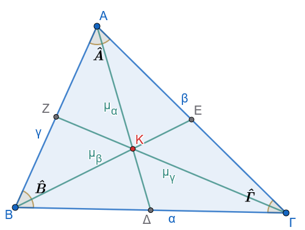{fig-align="center" width="350"}

- Σχεσιακοί Ορισμοί:

  - Περίμετρος ($2\tau$): Το άθροισμα των μηκών των πλευρών $2\tau = a + \beta + \gamma$.
  - Βάση: Σε ένα ισοσκελές τρίγωνο, η πλευρά απέναντι από τη γωνία της κορυφής.
  - Προσκείμενες και Απέναντι Γωνίες: Γωνίες που έχουν ως κοινή πλευρά μια πλευρά του τριγώνου ή βρίσκονται απέναντι από αυτήν, αντίστοιχα.

- Δευτερεύοντα Στοιχεία:

  - Διάμεσος $\mu_a$: Το ευθύγραμμο τμήμα που συνδέει μια κορυφή με το μέσο της απέναντι πλευράς.
  - Διχοτόμος $\delta_a$: Το τμήμα της διχοτόμου της γωνίας από την κορυφή έως την απέναντι πλευρά.

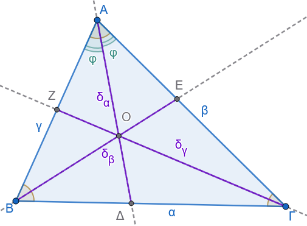{fig-align="center" width="350"}

- Ύψος $\upsilon_a$: Το κάθετο τμήμα από την κορυφή προς τον φορέα της απέναντι πλευράς. Το σημείο τομής ονομάζεται ίχνος της καθέτου.

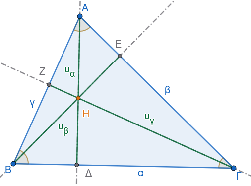{fig-align="center" width="350"}

- Μεσοκάθετος πλευράς: Η ευθεία που διέρχεται από το μέσο μιας πλευράς και είναι κάθετη σε αυτήν.

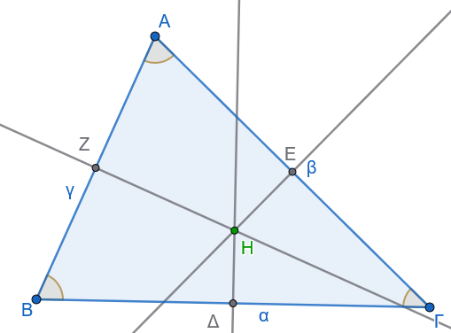{fig-align="center" width="350"}

#### Ταξινόμηση Τριγώνων

Ως προς τις πλευρές:

- Σκαληνό: Όλες οι πλευρές είναι άνισες.

- Ισοσκελές: Διαθέτει δύο πλευρές ίσες (σκέλη).
  Η γωνία μεταξύ των ίσων πλευρών ονομάζεται γωνία κορυφής και η τρίτη πλευρά βάση.

- Ισόπλευρο: Διαθέτει τρεις ίσες πλευρές.

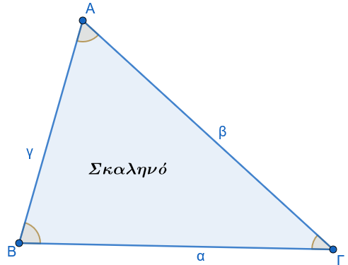{width="200"} 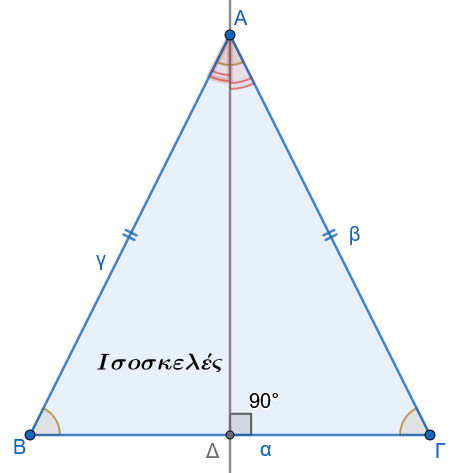{width="200"} 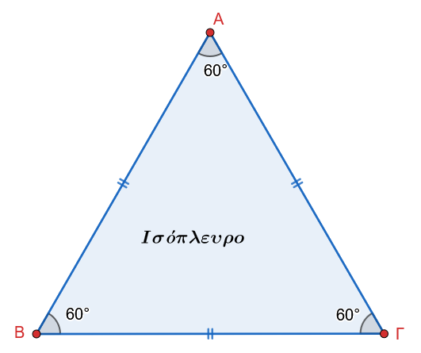{width="200"}

\

Ως προς τις γωνίες:

- Οξυγώνιο: Όλες οι γωνίες είναι οξείες $\widehat{\omega} < 90^\circ$.

- Αμβλυγώνιο: Διαθέτει μία αμβλεία γωνία $\widehat{\omega} > 90^\circ$.

- Ορθογώνιο: Διαθέτει μία ορθή γωνία $90^\circ$.
  Η πλευρά απέναντι από την ορθή ονομάζεται υποτείνουσα, ενώ οι πλευρές που την περιβάλλουν ονομάζονται κάθετες πλευρές.

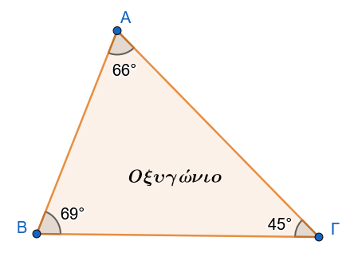{width="200"} 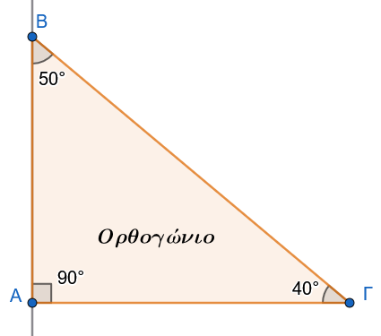{width="200"} 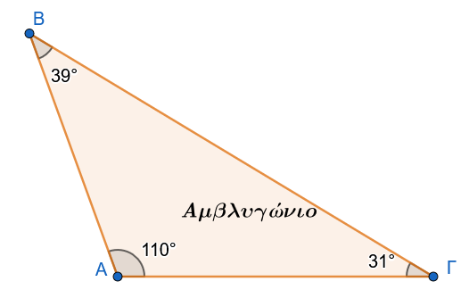{width="200"}
:::

#### Θεωρήματα και Αποδείξεις

:::: {.math-box .theorem-box}
::: {.math-title .theorem-title}
Θεώρημα Ισοσκελούς Τριγώνου
:::

Σε κάθε ισοσκελες τρίγωνο $\triangle ABΓ$ με $AB = A\Gamma$ ισχύει:

1.  $\widehat{B} = \widehat{\Gamma}$

2.  η διχοτόμος της κορυφής A είναι διάμεσος και ύψος.
::::

:::: {.math-box .apodeixi-box}
::: {.math-title .apodeixi-title}
Απόδειξη:
:::

Φέρουμε τη διχοτόμο $A\Delta$ της γωνίας $\widehat{A}$.

{fig-align="center" width="200"}

Εξετάζοντας τις ιδιότητες του σχήματος, η διχοτόμος χωρίζει το τρίγωνο σε δύο μέρη που, λόγω της συμμετρίας ως προς τον άξονα $A\Delta$, συμπίπτουν.

Συνεπώς, οι γωνίες βάσης $\widehat{B}$ και $\widehat{\Gamma}$ είναι ίσες.

Επίσης, το $\Delta$ είναι το μέσο της $B\Gamma$ $B\Delta = \Delta\Gamma$, άρα η $A\Delta$ είναι διάμεσος, και η γωνία $A\widehat{\Delta}B$ είναι ορθή, άρα η $A\Delta$ είναι ύψος.
::::

:::: {.math-box .theorem-box}
::: {.math-title .theorem-title}
Θεώρημα Ισοπλεύρου Τριγώνου
:::

Κάθε ισόπλευρο τρίγωνο είναι και ισογώνιο.
Αντιστρόφως, αν ένα τρίγωνο έχει και τις τρεις γωνίες του ίσες, τότε είναι ισόπλευρο.
::::

:::: {.math-box .theorem-box}
::: {.math-title .theorem-title}
Θεώρημα Τριγωνικής Ανισότητας
:::

Δεδομένα: Τρίγωνο $\triangle AB\Gamma$ με πλευρές $a, \beta, \gamma$ και $\beta \ge \gamma$.

Ζητούμενο: $\beta - \gamma < a < \beta + \gamma$.
::::

:::: {.math-box .apodeixi-box}
::: {.math-title .apodeixi-title}
Απόδειξη:
:::

Η ευθεία είναι η συντομότερη οδός μεταξύ δύο σημείων.

Συνεπώς, η πλευρά α είναι υποχρεωτικά μικρότερη από το άθροισμα $\beta + \gamma$.

Παρομοίως, από τη σχέση $\beta < a + \gamma$ προκύπτει $\beta - \gamma < a$.
::::

Αξιολόγηση: Τα ανωτέρω θεωρήματα λειτουργούν ως φίλτρα που περιορίζουν τις δυνατές γεωμετρικές κατασκευές, εξασφαλίζοντας τη μαθηματική ύπαρξη του τριγώνου.

#### Εφαρμογές - Παραδείγματα

:::: {.math-box .example-box}
::: {.math-title .example-title}
1.  Εφαρμογή:
:::

Σε ένα τρίγωνο $\triangle AB\Gamma$ είναι $\beta = 7 \text{ cm}$ και $\gamma = 10 \text{ cm}$.
Προσδιορίστε το εύρος των δυνατών τιμών της πλευράς α.
::::

:::: {.math-box .examplesolution-box}
::: {.math-title .examplesolution-title}
**Λύση:**
:::

Σύμφωνα με την τριγωνική ανισότητα, πρέπει $\gamma - \beta < a < \gamma + \beta$.

Αντικαθιστώντας τις τιμές: 10 - 7 \< a \< 10 + 7, άρα 3 \< a \< 17.
::::

:::: {.math-box .example-box}
::: {.math-title .example-title}
2.  Εφαρμογή:
:::

Αποδείξτε ότι σε κάθε ισοσκελές τρίγωνο $\triangle AB\Gamma$ $AB=A\Gamma$, οι εξωτερικές γωνίες της βάσης είναι ίσες.
::::

:::: {.math-box .examplesolution-box}
::: {.math-title .examplesolution-title}
**Λύση:**
:::

Οι εσωτερικές γωνίες $\widehat{B}$ και $\widehat{\Gamma}$ είναι ίσες (Θεώρημα Ισοσκελούς).

Η εξωτερική γωνία $\widehat{B}_{\text{εξ}}$ είναι παραπληρωματική της $\widehat{B}$ $\widehat{B}_{\text{εξ}} = 180^\circ - \widehat{B}$ και η $\widehat{\Gamma}_{\text{εξ}} = 180^\circ - \widehat{\Gamma}$.

Αφού $\widehat{B} = \widehat{\Gamma}$, έπεται ότι $\widehat{B}_{\text{εξ}} = \widehat{\Gamma}_{\text{εξ}}$.
::::

:::: {.math-box .example-box}
::: {.math-title .example-title}
3.  Εφαρμογή:
:::

Η περίμετρος ενός ισοσκελούς τριγώνου είναι $24 \text{ cm}$ και η μία από τις ίσες πλευρές του είναι $9 \text{ cm}$.
Βρείτε τη βάση του.
::::

:::: {.math-box .examplesolution-box}
::: {.math-title .examplesolution-title}
**Λύση:**
:::

Έστω α η βάση και $\beta = \gamma = 9$.

Ισχύει $a + 2\beta = 24 \Rightarrow a + 18 = 24 \Rightarrow a = 6 \text{ cm}$.

Η τιμή αυτή είναι δεκτή καθώς ικανοποιεί την ανισότητα 9-9 \< 6 \< 9+9.
::::

#### Ασκήσεις

1.  Υπολογίστε την περίμετρο ισοπλεύρου τριγώνου με πλευρά $a = 7,5 \text{ cm}$.
2.  Σε τρίγωνο $\triangle AB\Gamma$ είναι α = 5 και $\beta = 12$. Δείξτε ότι η πλευρά $\gamma$ δεν μπορεί να είναι $6 \text{ cm}$.
3.  Ορίστε το ίχνος του ύψους σε ένα αμβλυγώνιο τρίγωνο όταν αυτό άγεται από κορυφή οξείας γωνίας.
4.  Αν η γωνία κορυφής ενός ισοσκελούς τριγώνου είναι $80^\circ$, υπολογίστε τις γωνίες της βάσης.
5.  Σε ένα τρίγωνο, η περίμετρος είναι $30 \text{ cm}$. Είναι δυνατόν μία πλευρά να ισούται με $16 \text{ cm}$;
6.  Αποδείξτε ότι κάθε πλευρά ισοπλεύρου τριγώνου είναι μικρότερη από το άθροισμα των άλλων δύο.
7.  Προσδιορίστε το είδος του τριγώνου (ως προς τις πλευρές) αν δύο εξωτερικές του γωνίες είναι ίσες.
8.  Εξηγήστε τη λειτουργική διαφορά μεταξύ της διαμέσου $\mu_a$ και της μεσοκαθέτου μιας πλευράς.
9.  Σε ισοσκελές τρίγωνο $\triangle AB\Gamma$, η βάση $B\Gamma$ είναι $10 \text{ cm}$ και η περίμετρος $36 \text{ cm}$. Βρείτε το μήκος των σκελών.
10. Ορίστε την έννοια του ορθοκέντρου ως το σημείο τομής των φορέων των υψών.

Η αυστηρή κατανόηση των ειδών και των ιδιοτήτων του μεμονωμένου τριγώνου μας οδηγεί φυσικά στην ανάγκη σύγκρισης μεταξύ διαφορετικών τριγώνων μέσω των κριτηρίων ισότητας.

### ΕΝΟΤΗΤΑ 2: ΚΡΙΤΗΡΙΑ ΙΣΟΤΗΤΑΣ ΤΥΧΑΙΩΝ ΤΡΙΓΩΝΩΝ

Η ισότητα στη Γεωμετρία υπερβαίνει την απλή αριθμητική εξίσωση.

Δηλώνει τη δυνατότητα «σύμπτωσης μετά από μετατόπιση», μια έννοια που μετασχηματίζεται σε αφηρημένα μαθηματικά κριτήρια, επιτρέποντας την πιστοποίηση της ταυτότητας δύο σχημάτων μέσω ελαχίστων στοιχείων.

::: {style="background-color: #db8e79; border: 2px solid #2f3e50; color: #0d0402; padding: 15px; border-radius: 5px;"}
#### Η Έννοια της Ισότητας και Ομόλογα Στοιχεία

Δύο τρίγωνα $\triangle AB\Gamma$ και $\triangle A'B'\Gamma'$ είναι ίσα όταν οι πλευρές και οι γωνίες τους συμπίπτουν μία προς μία.

Ομόλογα στοιχεία ονομάζονται οι πλευρές που βρίσκονται απέναντι από ίσες γωνίες στα δύο ίσα τρίγωνα.

Από το παραπάνω συμπεραίνουμε ότι:

• Δύο ίσα τρίγωνα έχουν τις πλευρές τους και τις γωνίες τους ίσες μία προς μία.

• Σε δύο ίσα τρίγωνα απέναντι από ίσες πλευρές βρίσκονται ίσες γωνίες και αντίστροφα.
:::

#### Τα 3 Θεμελιώδη Κριτήρια Ισότητας

:::: {.math-box .theorem-box}
::: {.math-title .theorem-title}
1ο Κριτήριο (ΠΓΠ - SAS)
:::

Αν δύο τρίγωνα έχουν δύο πλευρές ίσες μία προς μία και την περιεχόμενη σε αυτές γωνία ίση, τότε είναι ίσα.

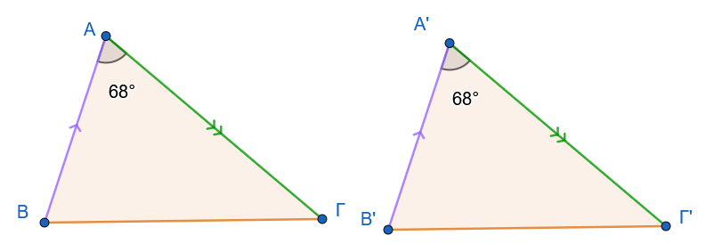{fig-align="center" width="500"}
::::

:::: {.math-box .apodeixi-box}
::: {.math-title .apodeixi-title}
Απόδειξη:
:::

Με τη μέθοδο της μετατόπισης, φέρουμε το $\triangle A'B'\Gamma'$ πάνω στο $\triangle AB\Gamma$ ώστε η κορυφή A' να συμπέσει με την A και η ημιευθεία A'B' με την AB.

Λόγω ισότητας πλευρών $AB=A'B'$, το B' συμπίπτει με το B.

Λόγω ισότητας γωνιών $\widehat{A}=\widehat{A}'$, η ημιευθεία $A'\Gamma'$ συμπίπτει με την $A\Gamma$ και λόγω ισότητας πλευρών $A\Gamma=A'\Gamma'$, το $\Gamma'$ συμπίπτει με το $\Gamma$.

Τα τρίγωνα συμπίπτουν πλήρως.
::::

:::: {.math-box .theorem-box}
::: {.math-title .theorem-title}
2ο Κριτήριο (ΓΠΓ - ASA)
:::

Αν δύο τρίγωνα έχουν μία πλευρά και τις προσκείμενες σε αυτή γωνίες ίσες μία προς μία, τότε είναι ίσα.

Δεδομένα: $B\Gamma = B'\Gamma'$, $\widehat{B} = \widehat{B}'$, $\widehat{\Gamma} = \widehat{\Gamma}'$.

Ζητούμενο: $\triangle AB\Gamma = \triangle A'B'\Gamma'$.

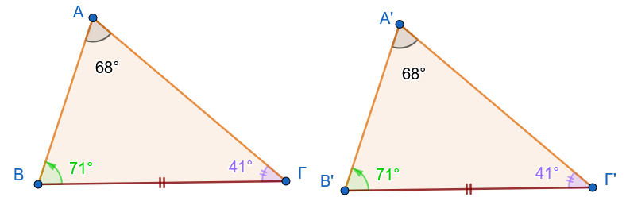{fig-align="center" width="500"}
::::

:::: {.math-box .apodeixi-box}
::: {.math-title .apodeixi-title}
Απόδειξη (Απαγωγή σε άτοπο):
:::

> > Σχεδιάστε τα στοιχεία της απόδειξης

Υποθέτουμε ότι $AB \neq A'B'$.

Χωρίς βλάβη της γενικότητας, έστω $AB > A'B'$.

Τότε υπάρχει σημείο $\Delta$ επί της AB ώστε $B\Delta = A'B'$.

Τα τρίγωνα $\triangle \Delta B\Gamma$ και $\triangle A'B'\Gamma'$ έχουν $B\Gamma = B'\Gamma'$, $B\Delta = A'B'$ και $\widehat{B} = \widehat{B}'$, άρα είναι ίσα (ΠΓΠ).

Συνεπώς, $B\widehat{\Gamma}\Delta = \widehat{\Gamma}'$.

Όμως από τα δεδομένα $\widehat{\Gamma} = \widehat{\Gamma}'$, άρα $B\widehat{\Gamma}\Delta = B\widehat{\Gamma}A$.

Αυτό είναι άτοπο, καθώς το τμήμα $\Gamma\Delta$ είναι εσωτερικό της γωνίας $\widehat{\Gamma}$ (το μέρος ίσο με το όλο).

Άρα AB = A'B'.
::::

:::: {.math-box .theorem-box}
::: {.math-title .theorem-title}
3ο Κριτήριο (ΠΠΠ - SSS)
:::

Αν δύο τρίγωνα έχουν τις τρεις πλευρές τους ίσες μία προς μία, τότε είναι ίσα.

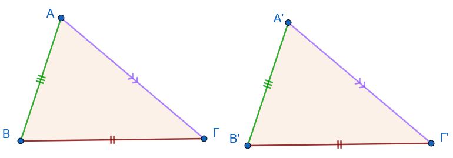{fig-align="center" width="500"}
::::

:::: {.math-box .apodeixi-box}
::: {.math-title .apodeixi-title}
Απόδειξη:
:::

> > Σχεδιάστε το σχήμα της απόδειξης

Κατασκευάζουμε στο ημιεπίπεδο της $B\Gamma$ που δεν περιέχει το A, ένα τρίγωνο $\triangle \Delta B\Gamma$ ίσο με το $\triangle A'B'\Gamma'$.

Ενώνοντας τα A και Δ, σχηματίζονται ισοσκελή τρίγωνα $AB=B\Delta \ \ και \ \  A\Gamma=\Gamma\Delta$.

Οι γωνίες βάσης αυτών των τριγώνων οδηγούν στην ισότητα των συνολικών γωνιών $\widehat{A}$ και $\widehat{\Delta}$, αναγάγοντας την απόδειξη στο κριτήριο ΠΓΠ.
::::

$$\begin{array}{|c |l|}
\hline
Κριτήριο    & Ελάχιστα Απαιτούμενα Στοιχεία\\
\hline
\text{1ο (ΠΓΠ)} & \text{Δύο πλευρές και η περιεχόμενη γωνία}\\
\text{2ο (ΓΠΓ)} & \text{Μία πλευρά και οι δύο προσκείμενες γωνίες}\\
\text{3ο (ΠΠΠ)} & \text{Τρεις πλευρές}\\
\hline
\end{array}$$

------------------------------------------------------------------------

#### Πορίσματα και Γεωμετρικές Συνέπειες

:::: {.math-box .corollary-box}
::: {.math-title .corollary-title}
ΠΟΡΙΣΜΑ Ι
:::

Σε κάθε ισοσκελές τρίγωνο:

Οι προσκείμενες στη βάση γωνίες είναι ίσες.

Η διχοτόμος της γωνίας της κορυφής είναι διάμεσος και ύψος.
::::

:::: {.math-box .corollaryproof-box}
::: {.math-title .corollaryproof-title}
ΑΠΟΔΕΙΞΗ
:::

{fig-align="center" width="200"}

Έστω ισοσκελές τρίγωνο ΑΒΓ με ΑΒ=ΑΓ (σχ.1).Φέρουμε τη διχοτόμο του ΑΔ.

Τα τρίγωνα ΑΔΒ και ΑΔΓ έχουν ΑΒ = ΑΓ, ΑΔ κοινή και $A_1 = A_2$ (ΠΓΠ), επομένως είναι ίσα, οπότε B = Γ.

Από την ίδια ισότητα τριγώνων προκύπτει ότι ΒΔ = ΔΓ, οπότε η ΑΔ είναι διάμεσος και $Δ_1 = Δ_2$.

Από την τελευταία ισότητα και επειδή $Δ_1 + Δ_2 = 180°$ προκύπτει ότι $Δ_1 = Δ_2 = 90°$, οπότε συμπεραίνουμε ότι το ΑΔ είναι ύψος του τριγώνου.
::::

:::: {.math-box .corollary-box}
::: {.math-title .corollary-title}
ΠΟΡΙΣΜΑ IΙ
:::

Οι γωνίες ισόπλευρου τριγώνου είναι ίσες.
::::

:::: {.math-box .corollary-box}
::: {.math-title .corollary-title}
ΠΟΡΙΣΜΑ IIΙ
:::

Κάθε σημείο της μεσοκαθέτου ενός ευθύγραμμου τμήματος ισαπέχει από τα άκρα του.
::::

:::: {.math-box .corollaryproof-box}
::: {.math-title .corollaryproof-title}
ΑΠΟΔΕΙΞΗ
:::

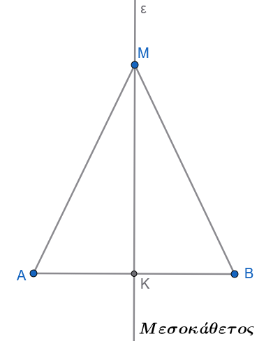{fig-align="center" width="250"}

Έστω ε η μεσοκάθετος ενός τμήματος ΑΒ και Μ ένα σημείο της.

Τα τρίγωνα ΜΚΑ και ΜΚΒ έχουν ΚΑ=ΚΒ, ΜΚ κοινή και $Κ_1 = Κ_2 = 90°$ (ΠΓΠ), επομένως είναι ίσα, οπότε ΜΑ= ΜΒ.
::::

:::: {.math-box .corollary-box}
::: {.math-title .corollary-title}
ΠΟΡΙΣΜΑ IV
:::

Αν δύο τόξα ενός κύκλου είναι ίσα, τότε και οι χορδές τους είναι ίσες.
::::

:::: {.math-box .corollaryproof-box}
::: {.math-title .corollaryproof-title}
ΑΠΟΔΕΙΞΗ
:::

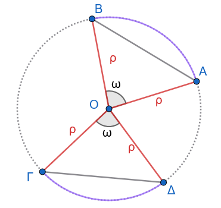{fig-align="center" width="250"}

Έστω ΑΒ και ΓΔ δύο ίσα τόξα ενός κύκλου (Ο,ρ) .Τότε είναι ΑÔΒ = ΓÔΔ=$\hatω$.

Τα τρίγωνα ΟΑΒ και ΟΓΔ έχουν ΟΑ= ΟΓ(= ρ), ΟΒ = ΟΔ(= ρ) και ΑÔΒ = ΓÔΔ.

Επομένως είναι ίσα, οπότε ΑΒ = ΓΔ.
::::

:::: {.math-box .corollary-box}
::: {.math-title .corollary-title}
ΠΟΡΙΣΜΑ V
:::

H διάμεσος ισοσκελούς τριγώνου, που αντιστοιχεί στη βάση του, είναι διχοτόμος και ύψος.
::::

:::: {.math-box .corollaryproof-box}
::: {.math-title .corollaryproof-title}
ΑΠΟΔΕΙΞΗ
:::

Έστω ισοσκελές τρίγωνο ΑΒΓ με ΑΒ=ΑΓ και ΑΔ η διάμεσός του.

{fig-align="center" width="200"}

Τα τρίγωνα ΑΒΔ και ΑΓΔ έχουν ΑΒ=ΑΓ, ΑΔ κοινή και ΒΔ=ΔΓ, άρα (ΠΠΠ) είναι ίσα, οπότε $A_1 = A_2$, και $Δ_1 = Δ_2$.

Από τις ισότητες αυτές προκύπτει αντίστοιχα ότι η ΑΔ είναι διχοτόμος και ύψος.
::::

:::: {.math-box .corollary-box}
::: {.math-title .corollary-title}
ΠΟΡΙΣΜΑ VI
:::

Κάθε σημείο που ισαπέχει από τα άκρα ενός τμήματος ανήκει στη μεσοκάθετό του.
::::

:::: {.math-box .corollaryproof-box}
::: {.math-title .corollaryproof-title}
ΑΠΟΔΕΙΞΗ
:::

{fig-align="center" width="250"}

Έστω ευθύγραμμο τμήμα ΑΒ , Μ ένα σημείο, ώστε ΜΑ = ΜΒ και Κ το μέσο του ΑΒ.

Τότε το τρίγωνο ΑΜΒ είναι ισοσκελές και η ΜΚ διάμεσός του, οπότε σύμφωνα με το προηγούμενο πόρισμα, η ΜΚ θα είναι και ύψος δηλαδή η ΜΚ είναι μεσοκάθετος του ΑΒ.
::::

:::: {.math-box .corollary-box}
::: {.math-title .corollary-title}
ΠΟΡΙΣΜΑ VII
:::

Αν οι χορδές δύο τόξων ενός κύκλου, μικρότερων του ημικυκλίου, είναι ίσες, τότε και τα τόξα είναι ίσα.
::::

:::: {.math-box .corollaryproof-box}
::: {.math-title .corollaryproof-title}
ΑΠΟΔΕΙΞΗ
:::

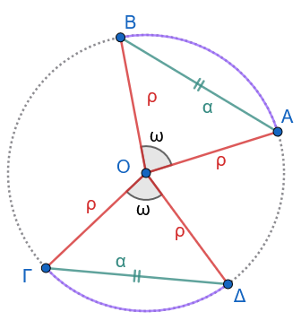{fig-align="center" width="250"}

Έστω δύο τόξα ΑΒ και ΓΔ ενός κύκλου (Ο,ρ) μικρότερα του ημικυκλίου, με ΑΒ = ΓΔ.

Τότε τα τρίγωνα ΟΑΒ και ΟΓΔ έχουν: ΟΑ= ΟΓ (= ρ), ΟΒ = ΟΔ (= ρ) και ΑΒ = ΓΔ, άρα (ΠΠΠ) είναι ίσα.
Επομένως, ΑÔΒ = ΓÔΔ, οπότε ΑΒ = ΓΔ.
::::

:::: {.math-box .corollary-box}
::: {.math-title .corollary-title}
ΠΟΡΙΣΜΑ VIII
:::

Αν οι χορδές δύο τόξων ενός κύκλου μεγαλύτερων του ημικυκλίου είναι ίσες, τότε και τα τόξα είναι ίσα.
::::

***Ύπαρξη και μοναδικότητα καθέτου***

:::: {.math-box .theorem-box}
::: {.math-title .theorem-title}
Θεώρημα
:::

Από σημείο εκτός ευθείας διέρχεται μοναδική κάθετος στην ευθεία.
::::

:::: {.math-box .apodeixi-box}
::: {.math-title .apodeixi-title}
ΑΠΟΔΕΙΞΗ
:::

> > Κάντε ένα σχήμα

Έστω ευθεία x'x, σημείο Α εκτός αυτής και σημείο Μ της x'x .

Αν η ΑΜ είναι κάθετη στην x'x, τότε το θεώρημα ισχύει ως προς την ύπαρξη της καθέτου.

Έστω ότι η ΑΜ δεν είναι κάθετη στην x'x.

Στο ημιεπίπεδο που ορίζει η x'x και δεν περιέχει το Α θεωρούμε την ημιευθεία Μy ώστε να είναι xΜy = AΜx και πάνω σε αυτή σημείο Β, ώστε ΜΑ = ΜΒ.

Επειδή τα σημεία Α,Β είναι εκατέρωθεν της x'x, η x'x τέμνει την ΑΒ σε ένα εσωτερικό σημείο, έστω Κ.

Αφού ΜΑ = ΜΒ και $Μ_1 = Μ_2$, η ΜΚ είναι διχοτόμος στο ισοσκελές τρίγωνο ΜΑΒ, άρα είναι και ύψος και επομένως ΑΒ ⊥ x'x.

Έστω ότι υπάρχει και άλλη ευθεία ΑΛ κάθετη στην x'x .

Τότε τα τρίγωνα ΑΜΛ και ΒΜΛ είναι ίσα, γιατί έχουν ΜΛ κοινή, ΜΑ = ΜΒ και $Μ_1 = Μ_2$, οπότε θα είναι και $Λ_1 = Λ_2$.

Όμως $Λ_1= 90°$, άρα και $Λ_2 = 90°$, οπότε $Λ_1 + Λ_2 = 180°$ το οποίο σημαίνει ότι τα σημεία Α,Λ,Β είναι συνευθειακά, δηλαδή η ΑΛ ταυτίζεται με την ΑΚ, που είναι άτοπο.
::::

#### Εφαρμογές - Παραδείγματα

:::: {.math-box .example-box}
::: {.math-title .example-title}
Εφαρμογή 1:
:::

Σε κύκλο $O, \rho$, δύο διάμετροι AB και $\Gamma\Delta$ τέμνονται.
Αποδείξτε ότι $A\Gamma = B\Delta$.
::::

:::: {.math-box .examplesolution-box}
::: {.math-title .examplesolution-title}
**Λύση:**
:::

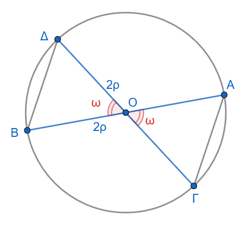{fig-align="center" width="250"}

Στα $\triangle OA\Gamma$ και $\triangle OB\Delta$ έχουμε:

$OA=OB=\rho$, $O\Gamma=O\Delta=\rho$ και $A\widehat{O}\Gamma = B\widehat{O}\Delta$ (κατακορυφήν).

Άρα $\triangle OA\Gamma = \triangle OB\Delta$ (ΠΓΠ), οπότε $A\Gamma = B\Delta$.
::::

:::: {.math-box .example-box}
::: {.math-title .example-title}
Εφαρμογή 2:
:::

Δίνεται γωνία $x\widehat{O}y$ και η διχοτόμος της $O\zeta$.

Αν A, B σημεία στις Ox, Oy με OA=OB και M τυχαίο σημείο της $O\zeta$, δείξτε ότι MA=MB.
::::

:::: {.math-box .examplesolution-box}
::: {.math-title .examplesolution-title}
**Λύση:**
:::

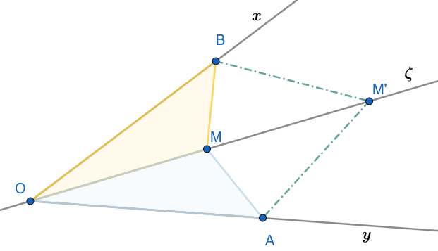{fig-align="center" width="350"}

Στα $\triangle OAM$ και $\triangle OBM$: OA=OB, OM κοινή και $A\widehat{O}M = B\widehat{O}M$ (λόγω διχοτόμου).

Άρα $\triangle OAM = \triangle OBM$ (ΠΓΠ), συνεπώς MA=MB.

> > Κάντε το ίδιο για το σημείο Μ'
::::

:::: {.math-box .example-box}
::: {.math-title .example-title}
Εφαρμογή 3:
:::

Δύο τρίγωνα $\triangle AB\Gamma$ και $\triangle A'B'\Gamma'$ έχουν AB=A'B', $A\Gamma=A'\Gamma'$ και τις διαμέσους $\mu_a = \mu_{a'}$.

Δείξτε ότι τα τρίγωνα είναι ίσα.
::::

:::: {.math-box .examplesolution-box}
::: {.math-title .examplesolution-title}
**Λύση:**
:::

> > Σχεδιάστε το σχήμα

Προεκτείνουμε τις διαμέσους AM, A'M' κατά ίσο τμήμα $M\Delta=AM$ και $M'\Delta'=A'M'$.

Τα σχηματιζόμενα τρίγωνα $\triangle ABM$ και $\triangle M\Gamma\Delta$ είναι ίσα (ΠΓΠ), άρα $\Gamma\Delta=AB$.

Τότε τα $\triangle A\Gamma\Delta$ και $\triangle A'\Gamma'\Delta'$ είναι ίσα (ΠΠΠ), άρα $\widehat{A}_1 = \widehat{A}'_1$.

Με παρόμοιο τρόπο δείχνουμε την ισότητα των άλλων τμημάτων της γωνίας $\widehat{A}$, οπότε $\widehat{A}=\widehat{A}'$.

Τελικά $\triangle AB\Gamma = \triangle A'B'\Gamma'$ (ΠΓΠ).
::::

#### Ασκήσεις

1.  Δείξτε ότι οι διάμεσοι που αντιστοιχούν στις ίσες πλευρές ισοσκελούς τριγώνου είναι ίσες.
2.  Σε δύο ίσα τρίγωνα, αποδείξτε ότι οι διχοτόμοι ομόλογων γωνιών είναι ίσες.
3.  Αν M είναι το μέσο χορδής AB κύκλου (O), δείξτε ότι η OM είναι κάθετη στην AB.
4.  Δίνεται τετράπλευρο $AB\Gamma\Delta$ με $AB=\Gamma\Delta$ και $B\Gamma=A\Delta$. Δείξτε ότι $\widehat{A}=\widehat{\Gamma}$.
5.  Αν δύο κύκλοι $O, \rho$ και (K, R) τέμνονται στα A και B, δείξτε ότι η OK είναι μεσοκάθετος της AB.
6.  Αποδείξτε ότι τα μέσα των πλευρών ισοπλεύρου τριγώνου σχηματίζουν νέο ισόπλευρο τρίγωνο.
7.  Σε τρίγωνο $\triangle AB\Gamma$, αν η διχοτόμος $\delta_a$ είναι και διάμεσος $\mu_a$, δείξτε ότι το τρίγωνο είναι ισοσκελές.
8.  Δίνεται κύκλος και δύο ίσες χορδές AB, $\Gamma\Delta$. Δείξτε ότι τα τρίγωνα $\triangle OAB$ και $\triangle O\Gamma\Delta$ είναι ίσα.
9.  Δείξτε ότι οι διχοτόμοι των γωνιών της βάσης ισοσκελούς τριγώνου τέμνονται πάνω στο ύψος της κορυφής.

:::: {.math-box .exercise-box}
::: {.math-title .exercise-title}
Ασκηση 10
:::

Έστω δύο τρίγωνα $AB\Gamma$ και $A'B'\Gamma'$ για τα οποία γνωρίζουμε ότι:

1.  Δύο πλευρές του ενός είναι ίσες με δύο πλευρές του άλλου μία προς μία:

- $A\Gamma = A'\Gamma'$ (δηλαδή $\beta = \beta'$).

- $AB = A'B'$ (δηλαδή $\gamma = \gamma'$).

2.  Οι **ομόλογες διάμεσοι** που αντιστοιχούν σε μία από αυτές τις ίσες πλευρές είναι επίσης ίσες:

- Οι διάμεσοι $\mu_\beta$ και $\mu_{\beta'}$ που αντιστοιχούν στις πλευρές $\beta$ (δηλαδή $A\Gamma$) και $\beta'$ (δηλαδή $A'\Gamma'$) είναι ίσες μεταξύ τους (δηλαδή $BM = B'M'$, όπου $M$ και $M'$ είναι τα μέσα των $A\Gamma$ και $A'\Gamma'$ αντίστοιχα).

Τα τρίγωνα είναι ίσα;
::::

:::: {.math-box .solution-box}
::: {.math-title .solution-title}
**Η Γεωμετρική Απόδειξη της Άσκησης**
:::

Για να γίνει απολύτως σαφές το πώς χρησιμοποιούνται αυτά τα στοιχεία, η απόδειξη στηρίζεται στη σύγκριση των «μισών» τριγώνων:

- Επειδή οι πλευρές $A\Gamma$ και $A'\Gamma'$ είναι ίσες από την υπόθεση ($\beta = \beta'$), τα μισά τους τμήματα θα είναι επίσης ίσα μεταξύ τους: $AM = \dfrac{A\Gamma}{2} = \dfrac{A'\Gamma'}{2} = A'M'$

- Συγκρίνουμε τα τρίγωνα $ABM$ και $A'B'M'$.
  Αυτά έχουν:

  1.  $AB = A'B'$ (από την υπόθεση $\gamma = \gamma'$).
  2.  $BM = B'M'$ (από την υπόθεση $\mu_\beta = \mu_{\beta'}$).
  3.  $AM = A'M'$ (ως μισά των ίσων πλευρών $\beta$ και $\beta'$).

- Επομένως, τα τρίγωνα $ABM$ και $A'B'M'$ έχουν και τις τρεις πλευρές τους ίσες μία προς μία, οπότε είναι **ίσα** σύμφωνα με το **3ο κριτήριο ισότητας (ΠΠΠ)**.

- Από την ισότητα αυτή προκύπτει ότι οι αντίστοιχες γωνίες τους απέναντι από τις ίσες διαμέσους είναι ίσες, δηλαδή: $\widehat{A} = \widehat{A'}$

- Τώρα μπορούμε να συγκρίνουμε τα αρχικά (μεγάλα) τρίγωνα $AB\Gamma$ και $A'B'\Gamma'$.
  Αυτά έχουν:

  1.  $AB = A'B'$ (από την υπόθεση).
  2.  $A\Gamma = A'\Gamma'$ (από την υπόθεση).
  3.  $\widehat{A} = \widehat{A'}$ (όπως αποδείχθηκε παραπάνω).

- Συνεπώς, τα τρίγωνα $AB\Gamma$ και $A'B'\Gamma'$ έχουν δύο πλευρές ίσες μία προς μία και τις περιεχόμενες γωνίες τους ίσες, άρα είναι **ίσα** σύμφωνα με το **1ο κριτήριο ισότητας (ΠΓΠ)**.
::::

------------------------------------------------------------------------

:::: {.math-box .exercise-box}
::: {.math-title .exercise-title}
Άσκηση 11.
**Η περίπτωση των αντίστοιχων υψών (Ύψη προς τις ίσες πλευρές)**
:::

Έστω δύο τρίγωνα $AB\Gamma$ και $A'B'\Gamma'$ για τα οποία γνωρίζουμε ότι:

1.  $A\Gamma = A'\Gamma'$ (δηλαδή $\beta = \beta'$)

2.  $AB = A'B'$ (δηλαδή $\gamma = \gamma'$)

3.  Τα αντίστοιχα ύψη $BH$ και $B'H'$ (που άγονται από τις κορυφές $B, B'$ προς τις πλευρές $A\Gamma, A'\Gamma'$ αντίστοιχα) είναι ίσες μεταξύ τους ($BH = B'H'$).
::::

:::: {.math-box .solution-box}
::: {.math-title .solution-title}
**Απόδειξη:**
:::

- Θεωρούμε τα ορθογώνια τρίγωνα $AHB$ και $A'H'B'$ (με $\widehat{H} = \widehat{H'} = 90^\circ$).
  Αυτά έχουν:

  1.  $AB = A'B'$ (οι υποτείνουσές τους είναι ίσες από την υπόθεση).
  2.  $BH = B'H'$ (μία κάθετη πλευρά είναι ίση από την υπόθεση).

- Συνεπώς, τα ορθογώνια τρίγωνα $AHB$ και $A'H'B'$ είναι **ίσα** σύμφωνα με το **Κριτήριο Ισότητας Ορθογωνίων Τριγώνων** (Ίση υποτείνουσα και μία κάθετη πλευρά — Θεώρημα ΙΙ της Ενότητας 3).

- Από την ισότητα αυτή προκύπτει ότι οι αντίστοιχες οξείες γωνίες τους είναι ίσες, δηλαδή: $\widehat{A} = \widehat{A'}$

- Τώρα συγκρίνουμε τα αρχικά τρίγωνα $AB\Gamma$ και $A'B'\Gamma'$.
  Αυτά έχουν:

  1.  $AB = A'B'$ (από την υπόθεση).
  2.  $A\Gamma = A'\Gamma'$ (από την υπόθεση).
  3.  $\widehat{A} = \widehat{A'}$ (όπως μόλις αποδείχθηκε).

- Συνεπώς, τα τρίγωνα $AB\Gamma$ και $A'B'\Gamma'$ έχουν δύο πλευρές ίσες μία προς μία και τις περιεχόμενες γωνίες τους ίσες, άρα είναι **ίσα** σύμφωνα με το **1ο κριτήριο ισότητας (ΠΓΠ)**.
::::

------------------------------------------------------------------------

:::: {.math-box .exercise-box}
::: {.math-title .exercise-title}
Άσκηση 12.
**Η περίπτωση της διχοτόμου της περιεχόμενης γωνίας**
:::

Έστω δύο τρίγωνα $AB\Gamma$ και $A'B'\Gamma'$ για τα οποία γνωρίζουμε ότι:

1.  $AB = A'B'$ (δηλαδή $\gamma = \gamma'$)

2.  $A\Gamma = A'\Gamma'$ (δηλαδή $\beta = \beta'$)

3.  Οι διχοτόμοι $A\Delta$ και $A'\Delta'$ των γωνιών της κορυφής $\widehat{A}$ και $\widehat{A'}$ αντίστοιχα είναι ίσες ($A\Delta = A'\Delta'$).
::::

:::: {.math-box .solution-box}
::: {.math-title .solution-title}
**Απόδειξη (με απαγωγή σε άτοπο και χρήση ανισοτικών σχέσεων):**
:::

Έχουμε:

$$AB=A'B',\qquad A\Delta=A'\Delta'$$

και επειδή $A\Delta,A'\Delta'$ είναι διχοτόμοι,

$$\angle BA\Delta=\angle \Delta A\Gamma$$

και

$$\angle B'A'\Delta'=\angle \Delta'A'\Gamma'.$$

Άρα, για τα τρίγωνα $AB\Delta$ και $A'B'\Delta'$, έχουμε:

$$AB=A'B',\qquad A\Delta=A'\Delta'$$

και

$$\angle BA\Delta=\angle B'A'\Delta'.$$

Επομένως, με **Π-Γ-Π**:

$$\boxed{\triangle AB\Delta\cong\triangle A'B'\Delta'}.$$

Άρα ειδικά:

$$B\Delta=B'\Delta'.$$

Ομοίως, για τα τρίγωνα $A\Delta\Gamma$ και $A'\Delta'\Gamma'$:

$$A\Gamma=A'\Gamma',
\qquad
A\Delta=A'\Delta',$$

και

$$\angle \Delta A\Gamma=\angle \Delta'A'\Gamma'.$$

Άρα πάλι με **Π-Γ-Π**:

$$\boxed{\triangle A\Delta\Gamma\cong\triangle A'\Delta'\Gamma'}.$$

Επομένως:

$$\Delta\Gamma=\Delta'\Gamma'.$$

Τέλος, επειδή $\Delta$ και $\Delta'$ βρίσκονται αντίστοιχα πάνω στις πλευρές $B\Gamma$ και $B'\Gamma'$,

$$B\Gamma=B\Delta+\Delta\Gamma$$

και

$$B'\Gamma'=B'\Delta'+\Delta'\Gamma'.$$

Αφού

$$B\Delta=B'\Delta'$$

και

$$\Delta\Gamma=\Delta'\Gamma',$$

παίρνουμε:

$$\boxed{B\Gamma=B'\Gamma'}.$$

Και τώρα έχουμε και τις **τρεις αντίστοιχες πλευρές ίσες**, οπότε:

$$\boxed{\triangle AB\Gamma\cong\triangle A'B'\Gamma'}$$

με **Π-Π-Π**.
::::

------------------------------------------------------------------------

Η ύπαρξη ορθής γωνίας επιτρέπει την απλούστευση των παραπάνω κριτηρίων, εισάγοντάς μας στην οικονομία των στοιχείων που χαρακτηρίζει τα ορθογώνια τρίγωνα.

### ΕΝΟΤΗΤΑ 3: ΚΡΙΤΗΡΙΑ ΙΣΟΤΗΤΑΣ ΟΡΘΟΓΩΝΙΩΝ ΤΡΙΓΩΝΩΝ

::: {style="background-color: #db8e79; border: 2px solid #2f3e50; color: #0d0402; padding: 15px; border-radius: 5px;"}
Στα ορθογώνια τρίγωνα επιτυγχάνεται μια κρίσιμη «στρατηγική οικονομία».

Εφόσον η ορθή γωνία είναι δεδομένη, η απαίτηση για ισότητα μειώνεται από τρία στοιχεία σε δύο, απλουστεύοντας δραστικά τις αποδείξεις.
:::

#### Αναγωγή και Ειδικά Κριτήρια

:::: {.math-box .theorem-box}
::: {.math-title .theorem-title}
Θεώρημα Ι (Υποτείνουσα - Οξεία Γωνία)
:::

Δύο ορθογώνια τρίγωνα είναι ίσα αν έχουν την υποτείνουσα και μία οξεία γωνία ίσες.
::::

:::: {.math-box .apodeixi-box}
::: {.math-title .apodeixi-title}
Απόδειξη :
:::

- (Απαγωγή σε άτοπο)

Αν οι κάθετες πλευρές δεν ήταν ίσες, θα μπορούσαμε να φέρουμε δεύτερη κάθετο από σημείο προς ευθεία, γεγονός που αντιβαίνει στο θεώρημα μοναδικότητας της καθέτου.

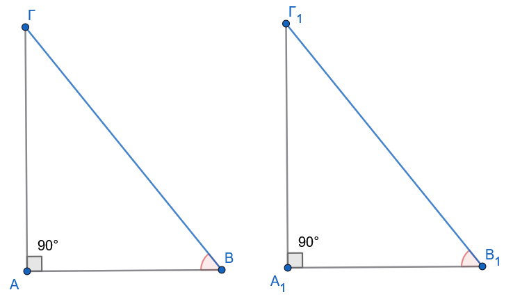{fig-align="center" width="500"}

- Με κριτήριο

Αν $ΒΓ=Β_1Γ_1$ και $\hat B= \hat B_{1}$, τότε και $\hat Γ= \hat Γ_{1}$ ώς συμπληρωματικές των $\hat B$ και $\hat B_{1}$ αντίστοιχα.

Άρα έχουμε το κριτήριο ΓΠΓ $\hat B= \hat B_{1}$ , $ΒΓ=Β_1Γ_1$ και $\hat Γ= \hat Γ_{1}$.
::::

:::: {.math-box .theorem-box}
::: {.math-title .theorem-title}
Θεώρημα ΙΙ (Υποτείνουσα - Κάθετη Πλευρά)
:::

Δύο ορθογώνια τρίγωνα είναι ίσα αν έχουν την υποτείνουσα και μία κάθετη πλευρά ίσες.
::::

:::: {.math-box .apodeixi-box}
::: {.math-title .apodeixi-title}
Απόδειξη:
:::

$1^{ος}$ τρόπος.
Τοποθετούμε τα τρίγωνα εφεξής ώστε οι ίσες κάθετες πλευρές να συμπίπτουν.

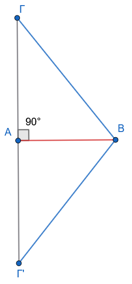{fig-align="center" width="180"}

Το σύνθετο σχήμα που προκύπτει είναι ένα ισοσκελές τρίγωνο (λόγω ίσων υποτεινουσών), άρα οι γωνίες βάσης είναι ίσες, γεγονός που μας αναγάγει στο Θεώρημα Ι.

$2^{ος}$ τρόπος.
Από το πυθαγόρειο θεώρημα θα έχουν και τις τρίτες πλευρές ίσες , οπότε θα έχουμε το κριτήριο ΠΠΠ.
::::

***Ιδιότητα Διχοτόμου Γωνίας***

Κάθε σημείο της διχοτόμου ισαπέχει από τις πλευρές της γωνίας (ευθύ και αντίστροφο).

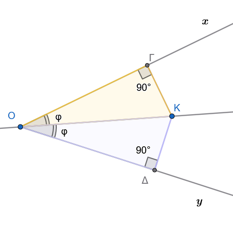{fig-align="center" width="350"}

Η απόδειξη βασίζεται στην ισότητα των ορθογωνίων τριγώνων που σχηματίζουν οι αποστάσεις (κάθετα τμήματα) από το σημείο προς τις πλευρές.

> > Αποδείξτετο αναλυτικά

#### Κρίσιμα Πορίσματα και Ειδικές Σχέσεις

:::: {.math-box .corollary-box}
::: {.math-title .corollary-title}
Πόρισμα καθέτου σε χορδή
:::

Η κάθετος που φέρεται από το κέντρο ενός κύκλου προς μια χορδή του διχοτομεί τη χορδή και το αντίστοιχο τόξο της.
::::

:::: {.math-box .corollaryproof-box}
::: {.math-title .corollaryproof-title}
ΑΠΟΔΕΙΞΗ
:::

Ας θεωρήσουμε έναν κύκλο (Ο,ρ), μια χορδή του ΑΒ και την κάθετη ΟΚ της ΑΒ, που τέμνει τον κύκλο στο σημείο Μ .

Επειδή το τμήμα ΟΚ είναι ύψος στο ισοσκελές τρίγωνο ΟΑΒ (ΟΑ= ΟΒ = ρ), σύμφωνα με το προηγούμενο πόρισμα είναι διάμεσος και διχοτόμος, δηλαδή το Κ είναι μέσο του ΑΒ και Ô1 = Ô2.

Αφού Ô1 = Ô2 προκύπτει ότι ΑΜ = ΜΒ.
::::

Ερμηνεία: Αυτά τα πορίσματα αποτελούν τον «μετρικό σκελετό» της Γεωμετρίας.

Επιτρέπουν τον υπολογισμό τμημάτων σε περιβάλλοντα όπου η Τριγωνομετρία δεν έχει ακόμη εισαχθεί, καθιστώντας τα απαραίτητα εργαλεία σε σύνθετες κατασκευές.

#### Εφαρμογές Παραδείγματα

:::: {.math-box .example-box}
::: {.math-title .example-title}
Εφαρμογή 1:
:::

Σε ορθογώνιο τρίγωνο $\triangle AB\Gamma$ $\widehat{A}=90^\circ$, η γωνία $\widehat{B}=30^\circ$.

Αν η υποτείνουσα είναι $12 \text{ cm}$, βρείτε την πλευρά $\beta$ και τη διάμεσο $\mu_a$.
::::

:::: {.math-box .examplesolution-box}
::: {.math-title .examplesolution-title}
**Λύση:**
:::

Η γωνία $\widehat{\Gamma} = 90^\circ - 30^\circ = 60^\circ$.

Η πλευρά $\beta$ είναι απέναντι από τις $30^\circ$ στο ορθογώνιο $\triangle A\Gamma B$ (αν θεωρήσουμε την αντίστοιχη διάταξη), αλλά εδώ η απέναντι από τις $30^\circ$ είναι η $\beta$ (αν $\widehat{\Gamma}=30^\circ$.

Στην περίπτωσή μας, $\beta$ είναι απέναντι από την $\widehat{\Gamma}=60^\circ$ και η $\gamma$ απέναντι από την $\widehat{B}=30^\circ$.
Άρα $\gamma = a/2 = 6 \text{ cm}$.
Η διάμεσος $\mu_a = a/2 = 6 \text{ cm}$.
::::

:::: {.math-box .example-box}
::: {.math-title .example-title}
Εφαρμογή 2:
:::

Δείξτε ότι αν δύο ύψη ενός τριγώνου είναι ίσα, το τρίγωνο είναι ισοσκελές.
::::

:::: {.math-box .examplesolution-box}
::: {.math-title .examplesolution-title}
**Λύση:**
:::

Έστω $\upsilon_\beta = \upsilon_\gamma$.

Τα ορθογώνια τρίγωνα $\triangle B\Gamma\Delta$ και $\triangle \Gamma BE$ (όπου $\Delta$, E τα ίχνη των υψών) έχουν την $B\Gamma$ κοινή υποτείνουσα και $\upsilon_\beta = \upsilon_\gamma$ ως κάθετη πλευρά.

Άρα είναι ίσα, οπότε $\widehat{B} = \widehat{\Gamma}$.
::::

:::: {.math-box .example-box}
::: {.math-title .example-title}
Εφαρμογή 3:
:::

Σε ορθογώνιο τρίγωνο, η διάμεσος και το ύψος προς την υποτείνουσα σχηματίζουν γωνία ίση με τη διαφορά των οξειών γωνιών του τριγώνου.
::::

:::: {.math-box .examplesolution-box}
::: {.math-title .examplesolution-title}
**Λύση:**
:::

Χρησιμοποιώντας το πόρισμα της διαμέσου $\mu_a = a/2$, το $\triangle AMB$ είναι ισοσκελές.

Μετά από αλγεβρική επεξεργασία των γωνιών στα προκύπτοντα ορθογώνια τρίγωνα, η σχέση τεκμηριώνεται πλήρως.
::::

#### Ασκήσεις

1.  Σε ορθογώνιο τρίγωνο $\triangle AB\Gamma$, η διχοτόμος της γωνίας $\widehat{B}$ τέμνει την $A\Gamma$ στο $\Delta$. Αν η απόσταση του $\Delta$ από την $B\Gamma$ είναι $5 \text{ cm}$, βρείτε το $A\Delta$.
2.  Αποδείξτε ότι η διάμεσος προς την υποτείνουσα χωρίζει το ορθογώνιο τρίγωνο σε δύο ισοσκελή τρίγωνα.
3.  Σε κύκλο $O, \rho$, δύο ίσες χορδές AB και $\Gamma\Delta$ τέμνονται στο P. Δείξτε ότι $PA=P\Gamma$.
4.  Σύνθετη: Σε ορθογώνιο τρίγωνο με $\widehat{\Gamma}=15^\circ$, αποδείξτε ότι το ύψος $\upsilon_a$ είναι το 1/4 της υποτείνουσας α.
5.  Δείξτε ότι τα αποστήματα δύο ίσων χορδών σε έναν κύκλο είναι ίσα.
6.  Αν σε ένα τρίγωνο η διάμεσος $\mu_a$ ισούται με το μισό της πλευράς α, δείξτε ότι η γωνία $\widehat{A}$ είναι ορθή.
7.  Σε ορθογώνιο τρίγωνο $\triangle AB\Gamma$ $\widehat{A}=90^\circ$, η διχοτόμος της $\widehat{\Gamma}$ και η μεσοκάθετος της $B\Gamma$ τέμνονται πάνω στην AB; Εξετάστε την περίπτωση $\widehat{B}=30^\circ$.
8.  Αποδείξτε ότι αν ένα σημείο ισαπέχει από τις τρεις κορυφές τριγώνου, είναι το κέντρο του περιγεγραμμένου κύκλου.
9.  Σε ισοσκελές τρίγωνο, το άθροισμα των αποστάσεων τυχόντος σημείου της βάσης από τις ίσες πλευρές είναι σταθερό.
10. Δύο ορθογώνια τρίγωνα έχουν μία κάθετη πλευρά ίση και την αντίστοιχη διχοτόμο της ορθής γωνίας ίση. Αποδείξτε την ισότητά τους.

ΕΠΙΛΟΓΟΣ Η μελέτη του τριγώνου αποκαλύπτει την απαράμιλλη συνοχή της Ευκλείδειας σκέψης.
Από τον στοιχειώδη ορισμό των τριών πλευρών, η λογική αλυσίδα μάς οδήγησε στην ταξινόμηση και στη συνέχεια στην αποκρυστάλλωση των κριτηρίων ισότητας.
Η πορεία αυτή, από το γενικό (τυχαίο τρίγωνο) στο ειδικό (ορθογώνιο), αναδεικνύει τη γεωμετρική αρετή της ακρίβειας και της αποδεικτικής πληρότητας, στοιχεία που παραμένουν ο θεμέλιος λίθος της μαθηματικής παιδείας.

------------------------------------------------------------------------

### ....... .... Ασκήσεων συνέχεια

#### ΜΕΡΟΣ Α: ΑΣΚΗΣΕΙΣ ΙΣΟΤΗΤΑΣ ΤΥΧΑΙΩΝ ΤΡΙΓΩΝΩΝ

##### **Άσκηση 1 (Η μέθοδος των διπλών ισοπλεύρων τριγώνων)**

:::: {.math-box .exercise-box}
::: {.math-title .exercise-title}
**Εκφώνηση:**
:::

Πάνω σε μια ευθεία $\epsilon$ θεωρούμε στη σειρά τα διαδοχικά σημεία $A$, $B$ και $\Gamma$.

Κατασκευάζουμε προς το ίδιο μέρος της ευθείας τα ισόπλευρα τρίγωνα $\triangle AB\Delta$ και $\triangle B\Gamma E$.

Να αποδείξετε ότι $AE = \Gamma\Delta$.
::::

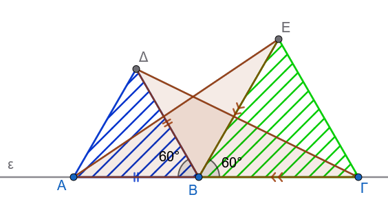{fig-align="center" width="400"}

:::: {.math-box .solution-box}
::: {.math-title .solution-title}
**Λύση**
:::

- **Δεδομένα (Υπόθεση):**
  - Σημεία $A, B, \Gamma$ συνευθειακά σε σειρά.
  - $\triangle AB\Delta$ ισόπλευρο ($AB = B\Delta = \Delta A$ και $\widehat{AB\Delta} = 60^\circ$).
  - $\triangle B\Gamma E$ ισόπλευρο ($B\Gamma = \Gamma E = EB$ και $\widehat{\Gamma BE} = 60^\circ$).
- **Ζητούμενο (Συμπέρασμα):**
  - $AE = \Gamma\Delta$.

**Απόδειξη:** Συγκρίνουμε τα τρίγωνα $\triangle ABE$ και $\triangle \Delta B\Gamma$:

1.  $AB = B\Delta$ (ως πλευρές του ισοπλεύρου τριγώνου $\triangle AB\Delta$).
2.  $BE = B\Gamma$ (ως πλευρές του ισοπλεύρου τριγώνου $\triangle B\Gamma E$).
3.  Για τις περιεχόμενες γωνίες $\widehat{ABE}$ και $\widehat{\Delta B\Gamma}$ παρατηρούμε ότι: $$\widehat{ABE} = \widehat{AB\Delta} + \widehat{\Delta BE} = 60^\circ + \widehat{\Delta BE}$$ $$\widehat{\Delta B\Gamma} = \widehat{\Gamma BE} + \widehat{\Delta BE} = 60^\circ + \widehat{\Delta BE}$$ Συνεπώς, ισχύει $\widehat{ABE} = \widehat{\Delta B\Gamma}$.

Από το **Κριτήριο Ισότητας Τριγώνων (ΠΓΠ)**, τα τρίγωνα $\triangle ABE$ και $\triangle \Delta B\Gamma$ είναι ίσα.

Επομένως, οι αντίστοιχες πλευρές τους που βρίσκονται απέναντι από τις ίσες γωνίες είναι ίσες, δηλαδή $AE = \Gamma\Delta$.
::::

------------------------------------------------------------------------

##### **Άσκηση 2 (Η μέθοδος των συμμετρικών αποστάσεων από το μέσο)**

**Εκφώνηση:** Έστω ευθύγραμμο τμήμα $AB$ και $P$ το μέσο του.
Θεωρούμε δύο σημεία $M$ και $N$ προς το ίδιο ημιεπίπεδο της ευθείας $AB$ τέτοια, ώστε $AM = BN$ και $PM = PN$.
Να αποδείξετε ότι $AN = BM$.

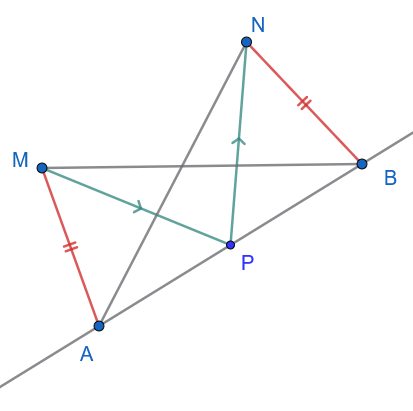{fig-align="center" width="350"}

- **Δεδομένα (Υπόθεση):**
  - $P$ μέσο του $AB$ ($AP = PB$).
  - $AM = BN$ και $PM = PN$.
- **Ζητούμενο (Συμπέρασμα):**
  - $AN = BM$.

**Απόδειξη:**

1.  Αρχικά συγκρίνουμε τα τρίγωνα $\triangle APM$ και $\triangle BPN$:\

- $AP = PB$ (από την υπόθεση του μέσου).

- $PM = ......$ (από υπόθεση).

- $AM = ......$ (από υπόθεση).

Από το **Κριτήριο Ισότητας Τριγώνων (ΠΠΠ)**, τα τρίγωνα είναι ίσα, οπότε προκύπτει η ισότητα των γωνιών: $\widehat{APM} = \widehat{BPN}$.

2.  Στη συνέχεια συγκρίνουμε τα τρίγωνα $\triangle APN$ και $\triangle BPM$:

- $AP = .........$ (κοινό στοιχείο).

- $PN = .......$ (από υπόθεση).

- Για τις περιεχόμενες γωνίες έχουμε: $$\widehat{APN} = \widehat{APM} + \widehat{MPN}$$ $$\widehat{BPM} = \widehat{BPN} + \widehat{MPN}$$ Επειδή $\widehat{APM} = \widehat{BPN}$, συνεπάγεται ότι $\widehat{APN} = \widehat{BPM}$.

  Από το **Κριτήριο Ισότητας Τριγώνων (ΠΓΠ)**, τα τρίγωνα $\triangle APN$ και $\triangle BPM$ είναι ίσα.

  Συνεπώς, οι απέναντι πλευρές τους είναι ίσες, άρα $AN = BM$.

------------------------------------------------------------------------

##### **Άσκηση 3 (Τομή μεσοκαθέτων ίσων τμημάτων)**

**Εκφώνηση:** Δίνονται δύο ίσα ευθύγραμμα τμήματα $AB$ και $\Gamma\Delta$.
Αν $M$ είναι το σημείο τομής των μεσοκαθέτων των ευθυγράμμων τμημάτων $A\Gamma$ και $B\Delta$, να αποδείξετε ότι $\widehat{AMB} = \widehat{\Gamma M\Delta}$.

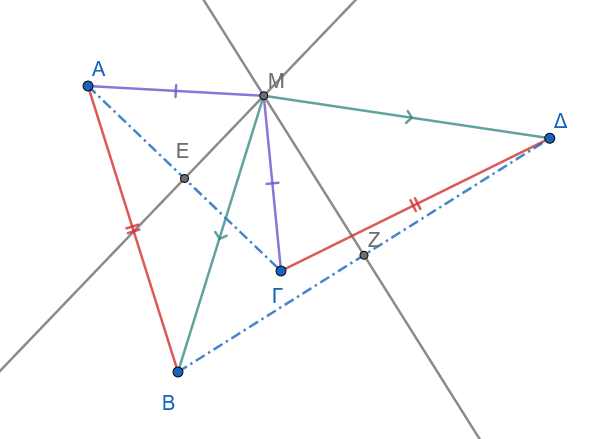{fig-align="center" width="400"}

- **Δεδομένα (Υπόθεση):**
  - $AB = \Gamma\Delta$.
  - $M$ σημείο της μεσοκαθέτου του $A\Gamma$ ($MA = M\Gamma$).
  - $M$ σημείο της μεσοκαθέτου του $B\Delta$ ($MB = M\Delta$).
- **Ζητούμενο (Συμπέρασμα):**
  - $\widehat{AMB} = \widehat{\Gamma M\Delta}$.

**Απόδειξη:**

Συγκρίνουμε τα τρίγωνα $\triangle AMB$ και $\triangle \Gamma M\Delta$:

1.  $MA = ............$ (αφού το $M$ ανήκει στη μεσοκάθετο του $A\Gamma$).
2.  $MB = ............$ (αφού το $M$ ανήκει στη μεσοκάθετο του $B\Delta$).
3.  $AB = ............$ (από υπόθεση).

Από το **Κριτήριο Ισότητας Τριγώνων (ΠΠΠ)**, τα τρίγωνα $\triangle AMB$ και $\triangle \Gamma M\Delta$ είναι ίσα.

Επομένως, όλες οι αντίστοιχες γωνίες τους είναι ίσες, οπότε προκύπτει άμεσα ότι $\widehat{AMB} = \widehat{\Gamma M\Delta}$.

------------------------------------------------------------------------

##### **Άσκηση 4 (Ισόπλευρο τρίγωνο εγγεγραμμένο σε ισόπλευρο)**

**Εκφώνηση:** Δίνεται ισόπλευρο τρίγωνο $\triangle AB\Gamma$.
Στις πλευρές του $AB$, $B\Gamma$ και $\Gamma A$ θεωρούμε αντίστοιχα τα σημεία $\Delta$, $E$ και $Z$ τέτοια, ώστε $A\Delta = BE = \Gamma Z$.
Να αποδείξετε ότι το τρίγωνο $\triangle \Delta EZ$ είναι επίσης ισόπλευρο.

> > Κάντε το σχήμα

- **Δεδομένα (Υπόθεση):**
  - $\triangle AB\Gamma$ ισόπλευρο ($AB = B\Gamma = \Gamma A$ και $\widehat{A} = \widehat{B} = \widehat{\Gamma} = 60^\circ$).
  - $A\Delta = BE = \Gamma Z$.
- **Ζητούμενο (Συμπέρασμα):**
  - Το $\triangle \Delta EZ$ είναι ισόπλευρο ($\Delta E = EZ = Z\Delta$).

**Απόδειξη:**

...............

................

.................

Από το **Κριτήριο Ισότητας Τριγώνων (ΠΓΠ)**, τα τρία αυτά τρίγωνα είναι ίσα.

Συνεπώς, οι απέναντι πλευρές τους είναι ίσες, δηλαδή $\Delta E = EZ = Z\Delta$.
Άρα το τρίγωνο $\triangle \Delta EZ$ είναι ισόπλευρο.

------------------------------------------------------------------------

##### **Άσκηση 5 (Ισότητα εξωτερικών ισοπλεύρων τριγώνων)**

**Εκφώνηση:** Δίνεται ισόπλευρο τρίγωνο $\triangle AB\Gamma$.
Κατασκευάζουμε εξωτερικά του τριγώνου τρία ισόπλευρα τρίγωνα $\triangle A'B\Gamma$, $\triangle AB'\Gamma$ και $\triangle AB\Gamma'$.
Να αποδείξετε ότι $AA' = BB' = \Gamma\Gamma'$.

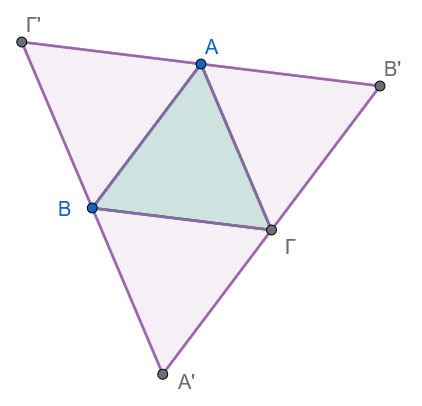{fig-align="center" width="350"}

- **Δεδομένα (Υπόθεση):**
  - $\triangle AB\Gamma$ ισόπλευρο ($AB = B\Gamma = \Gamma A$).
  - $\triangle A'B\Gamma$, $\triangle AB'\Gamma$, $\triangle AB\Gamma'$ εξωτερικά ισόπλευρα τρίγωνα.
- **Ζητούμενο (Συμπέρασμα):**
  - $AA' = BB' = \Gamma\Gamma'$.

**Απόδειξη:**

Θα αποδείξουμε αρχικά ότι $BB' = \Gamma\Gamma'$.

Συγκρίνουμε τα τρίγωνα $\triangle \Gamma A\Gamma'$ και $\triangle B'AB$:

> > Σχεδιάστε τα απαραίτητα τμήματα και συνεχίστε ......

1.  ......................

2.  .....................

Από το **Κριτήριο (ΠΓΠ)**, τα τρίγωνα είναι ίσα.

Συνεπώς, οι ομόλογες πλευρές είναι ίσες, δηλαδή $BB' = \Gamma\Gamma'$.

Με κυκλική εναλλαγή των πλευρών και όμοια σύγκριση, αποδεικνύεται ότι $AA' = BB' = \Gamma\Gamma'$.

------------------------------------------------------------------------

##### **Άσκηση 6 (Η ιδιότητα του κυρτού "χαρταετού")**

**Εκφώνηση:** Αν σε κυρτό τετράπλευρο $AB\Gamma\Delta$ ισχύουν $AB = B\Gamma$ και οι γωνίες $\widehat{A}$ και $\widehat{\Gamma}$ είναι ίσες ($\widehat{\Delta AB} = \widehat{\Delta\Gamma B}$), να αποδείξετε ότι $A\Delta = \Gamma\Delta$.

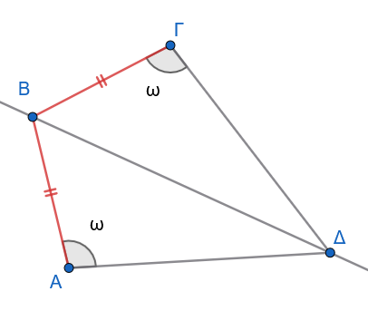{fig-align="center" width="350"}

- **Δεδομένα (Υπόθεση):**
  - Κυρτό τετράπλευρο $AB\Gamma\Delta$.
  - $AB = B\Gamma$.
  - $\widehat{\Delta AB} = \widehat{\Delta\Gamma B}$.
- **Ζητούμενο (Συμπέρασμα):**
  - $A\Delta = \Gamma\Delta$.

**Απόδειξη:** Φέρουμε το ευθύγραμμο τμήμα $A\Gamma$.

> > Σχεδιάστε τα απαραίτητα τμήματα ή γωνίες και προχωρήστε ..........

1.  .................

2.  ..................

Εφόσον στο τρίγωνο $\triangle \Delta A\Gamma$ οι γωνίες της βάσης του είναι ίσες, το τρίγωνο είναι ισοσκελές, συνεπώς $A\Delta = \Gamma\Delta$.

------------------------------------------------------------------------

##### **Άσκηση 7 (Η θεωρία των δύο ισοσκελών στην ίδια βάση)**

**Εκφώνηση:** Δύο ισοσκελή τρίγωνα $AB\Gamma$ ($AB = A\Gamma$) και $\Delta B\Gamma$ ($\Delta B = \Delta\Gamma$) έχουν την ίδια βάση $B\Gamma$ και οι κορυφές τους $A, \Delta$ βρίσκονται εκατέρωθεν αυτής.
Να αποδείξετε ότι η ευθεία $A\Delta$ είναι η μεσοκάθετος της βάσης $B\Gamma$.

- **Δεδομένα (Υπόθεση):**
  - $\triangle AB\Gamma$ ισοσκελές ($AB = A\Gamma$).
  - $\triangle \Delta B\Gamma$ ισοσκελές ($\Delta B = \Delta\Gamma$).
  - Οι κορυφές $A, \Delta$ εκατέρωθεν της βάσης $B\Gamma$.
- **Ζητούμενο (Συμπέρασμα):**
  - Η $A\Delta$ είναι μεσοκάθετος της $B\Gamma$.

**Απόδειξη:**

.....................

......................

.......................

------------------------------------------------------------------------

##### **Άσκηση 8 (Το κριτήριο ισοσκελούς με εσωτερικές διχοτόμους)**

**Εκφώνηση:** Δίνεται τρίγωνο $AB\Gamma$ και σημείο $M$ στο εσωτερικό του.
Η ημιευθεία $BM$ τέμνει την $A\Gamma$ στο $\Delta$ και η ημιευθεία $\Gamma M$ τέμνει την $AB$ στο $E$.
Αν $\widehat{MB\Gamma} =\widehat{ M\Gamma B}$ και $\widehat{AM\Delta} = \widehat{AME}$, να αποδείξετε ότι το τρίγωνο $AB\Gamma$ είναι ισοσκελές.

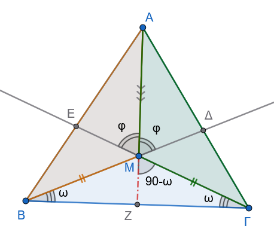{fig-align="center" width="350"}

- **Δεδομένα (Υπόθεση):**
  - Σημείο $M$ εσωτερικό του $\triangle AB\Gamma$.
  - $B, M, \Delta$ και $\Gamma, M, E$ συνευθειακά αντίστοιχα.
  - $\widehat{MB\Gamma} = \widehat{M\Gamma B}$ και $\widehat{AM\Delta} = \widehat{AME}$.
- **Ζητούμενο (Συμπέρασμα):**
  - $AB = A\Gamma$.

**Απόδειξη:**

1.  Επειδή $\widehat{MB\Gamma} = \widehat{M\Gamma B}$ από υπόθεση, το τρίγωνο $\triangle MB\Gamma$ είναι ισοσκελές με $MB = ..........$.
2.  Οι γωνίες $\widehat{AMB}$ και $\widehat{AM\Gamma}$ είναι παραπληρωματικές των

.......................................

........................................

3.  Συγκρίνουμε τα τρίγωνα $\triangle AMB$ και $\triangle AM\Gamma$:

.........................................

...........................................

Από το **Κριτήριο Ισότητας (ΠΓΠ)**, τα τρίγωνα είναι ίσα.

Συνεπώς, οι αντίστοιχες πλευρές τους είναι ίσες, δηλαδή $AB = A\Gamma$.
Άρα, το τρίγωνο $\triangle AB\Gamma$ είναι ισοσκελές.

------------------------------------------------------------------------

##### **Άσκηση 9 (Η κοινή μεσοκάθετος δύο τμημάτων)**

**Εκφώνηση:** Δύο ευθύγραμμα τμήματα $AB$ και $\Gamma\Delta$ έχουν την ίδια μεσοκάθετο $\epsilon$.

Αν η $\epsilon$ και η μεσοκάθετος του τμήματος $A\Gamma$ τέμνονται στο σημείο $O$, να αποδείξετε ότι η μεσοκάθετος του $B\Delta$ διέρχεται επίσης από το σημείο $O$.

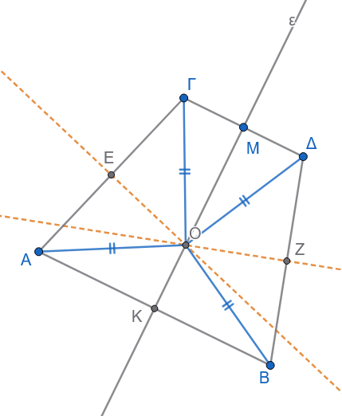{fig-align="center" width="350"}

- **Δεδομένα (Υπόθεση):**
  - $AB$ και $\Gamma\Delta$ έχουν κοινή μεσοκάθετο $\epsilon$.
  - $O$ σημείο τομής της $\epsilon$ με τη μεσοκάθετο του $A\Gamma$.
- **Ζητούμενο (Συμπέρασμα):**
  - Το $O$ ανήκει στη μεσοκάθετο του $B\Delta$ ($OB = O\Delta$).

**Απόδειξη:**

1.  Επειδή το σημείο $O$ ανήκει στη μεσοκάθετο $\epsilon$ του $AB$, ισαπέχει από τα άκρα του, δηλαδή: $OA = .............$.

2.  Επειδή το σημείο $O$ ανήκει στη μεσοκάθετο $\epsilon$ του $\Gamma\Delta$, ισαπέχει από τα άκρα του, δηλαδή: $O\Gamma =............$.

3.  Επειδή το σημείο $O$ ανήκει στη μεσοκάθετο του $A\Gamma$, ισχύει: $OA = .........$.

4.  Συνδυάζοντας τις παραπάνω σχέσεις, έχουμε: $$OB = ....... = ......... = O\Delta \implies OB = O\Delta$$

Εφόσον το $O$ ισαπέχει από τα άκρα $B$ και $\Delta$, συμπεραίνουμε ότι **το σημείο** $O$ ανήκει στη μεσοκάθετο του τμήματος $B\Delta$.

------------------------------------------------------------------------

------------------------------------------------------------------------

#### ΜΕΡΟΣ Β: ΑΣΚΗΣΕΙΣ ΙΣΟΤΗΤΑΣ ΟΡΘΟΓΩΝΙΩΝ ΤΡΙΓΩΝΩΝ

##### **Άσκηση 1 (Κριτήριο ισότητας από ύψος και διάμεσο)**

**Εκφώνηση:** Να αποδείξετε ότι αν δύο τρίγωνα $AB\Gamma$ και $A'B'\Gamma'$ έχουν ίσες βάσεις $B\Gamma = B'\Gamma'$, ίσα αντίστοιχα ύψη $AH = A'H'$ και ίσες διαμέσους $AM = A'M'$, τότε τα τρίγωνα είναι ίσα.

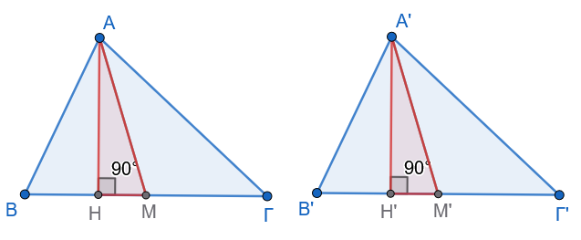{fig-align="center" width="500"}

- **Δεδομένα (Υπόθεση):**
  - $B\Gamma = B'\Gamma'$ και $M, M'$ τα μέσα τους ($BM = \dfrac{B\Gamma}{2}$ και $B'M' = \dfrac{B'\Gamma'}{2}$).
  - $AH \perp B\Gamma$ και $A'H' \perp B'\Gamma'$.
  - $AM = A'M'$.
- **Ζητούμενο (Συμπέρασμα):**
  - $\triangle AB\Gamma \cong \triangle A'B'\Gamma'$.

**Απόδειξη:**

1.  Συγκρίνουμε τα ορθογώνια τρίγωνα $\triangle AHM$ ($\widehat{H} = 90^\circ$) και $\triangle A'H'M'$ ($\widehat{H'} = 90^\circ$):

......................................

....................................

......................................

Από το **Κριτήριο Ισότητας Ορθογωνίων Τριγώνων (Υποτείνουσα-Κάθετη Πλευρά)**, τα τρίγωνα είναι ίσα, οπότε προκύπτει ότι $\widehat{AMH} = \widehat{A'M'H'}$.

2.  Συγκρίνουμε τα τρίγωνα $\triangle ABM$ και $\triangle A'B'M'$:

................................

................................

..............................

Από το κριτήριο ΠΓΠ, $\triangle ABM \cong \triangle A'B'M'$, οπότε $AB = A'B'$ και $\widehat{B} = \widehat{B'}$.

3.  Όμοια αποδεικνύεται η ισότητα των $\triangle A\Gamma M \cong \triangle A'\Gamma' M'$, άρα $A\Gamma = A'\Gamma'$.

Συνεπώς, από το κριτήριο ΠΠΠ, τα τρίγωνα είναι ίσα: $\triangle AB\Gamma \cong \triangle A'B'\Gamma'$.

------------------------------------------------------------------------

##### **Άσκηση 2 (Η μέθοδος της διχοτόμου και της κάθετης)**

**Εκφώνηση:** Δίνεται ορθογώνιο τρίγωνο $AB\Gamma$ ($\widehat{A} = 90^\circ$) και η διχοτόμος $B\Delta$ της γωνίας $\widehat{B}$.
Από το $\Delta$ φέρουμε $\Delta E \perp B\Gamma$, η οποία τέμνει την ευθεία $AB$ στο $Z$.
Να αποδείξετε ότι το τρίγωνο $B\Gamma Z$ είναι ισοσκελές.

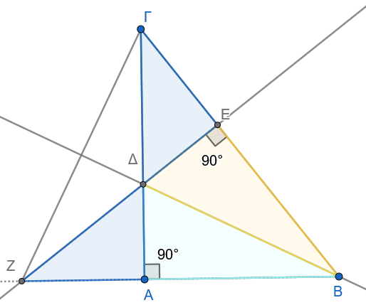{fig-align="center" width="350"}

- **Δεδομένα (Υπόθεση):**
  - $\triangle AB\Gamma$ με $\widehat{A} = 90^\circ$ και διχοτόμος $B\Delta$ ($\widehat{B_1} = \widehat{B_2}$).
  - $\Delta E \perp B\Gamma$ και η $\Delta E$ τέμνει την $AB$ στο $Z$.
- **Ζητούμενο (Συμπέρασμα):**
  - Το $\triangle B\Gamma Z$ είναι ισοσκελές ($BZ = B\Gamma$).

**Απόδειξη:**

1.  Συγκρίνουμε τα ορθογώνια τρίγωνα $\triangle BA\Delta$ ($\widehat{A} = 90^\circ$) και $\triangle BE\Delta$ ($\widehat{E} = 90^\circ$):

- .....................
  κοινή υποτείνουσα.

- ....................
  (αφού ΒΔ διχοτόμος).

Από το **Κριτήριο Ισότητας Ορθογωνίων Τριγώνων** (Υποτείνουσα-Οξεία Γωνία), τα τρίγωνα είναι ίσα, άρα:

- $BA = BE$

- $A\Delta = E\Delta$

2.  Συγκρίνουμε τα ορθογώνια τρίγωνα $\triangle \Delta AZ$ ($\widehat{A} = 90^\circ$) και $\triangle \Delta E\Gamma$ ($\widehat{E} = 90^\circ$):

- $A\Delta = E\Delta$ (αποδείχθηκε).

- .............................
  ως κατακορυφήν γωνίες.

Από το **Κριτήριο Ισότητας Ορθογωνίων Τριγώνων** (Κάθετη Πλευρά-Οξεία Γωνία), τα τρίγωνα είναι ίσα, άρα $AZ = E\Gamma$.

3.  Για το μήκος $BZ$ έχουμε: $$BZ = BA + AZ = .............. = B\Gamma$$ Εφόσον $BZ = B\Gamma$, το τρίγωνο $\triangle B\Gamma Z$ είναι **ισοσκελές**.

------------------------------------------------------------------------

##### **Άσκηση 3 (Ισότητα αποστημάτων ίσων χορδών)**

**Εκφώνηση:** Δίνεται κύκλος $(O, R)$, δύο ίσες χορδές του $AB$ και $\Gamma\Delta$ και τα αποστήματά τους $OK$ και $O\Lambda$ αντίστοιχα.
Αν οι προεκτάσεις των $BA$ και $\Delta\Gamma$ τέμνονται στο σημείο $M$, να αποδείξετε ότι τα τρίγωνα $\triangle MOK$ και $\triangle MO\Lambda$ είναι ίσα, και ότι $MA = M\Gamma$.

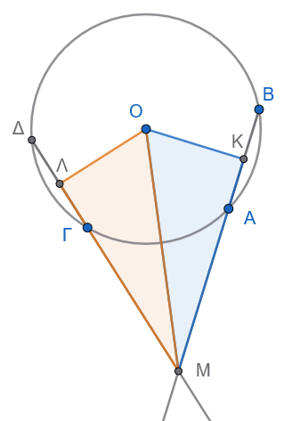{fig-align="center" width="300"}

- **Δεδομένα (Υπόθεση):**
  - Κύκλος $(O, R)$ με $AB = \Gamma\Delta$.
  - $OK \perp AB$ και $O\Lambda \perp \Gamma\Delta$ (αποστήματα).
  - Οι $BA$ και $\Delta\Gamma$ τέμνονται στο $M$.
- **Ζητούμενο (Συμπέρασμα):**
  - $\triangle MOK \cong \triangle MO\Lambda$ και $MA = M\Gamma$.

**Απόδειξη:**

1.  Επειδή οι χορδές $AB$ και $\Gamma\Delta$ είναι ίσες, τα αποστήματά τους από το κέντρο του κύκλου είναι επίσης ίσες κάθετες αποστάσεις, άρα: $OK = O\Lambda$.

2.  Συγκρίνουμε τα ορθογώνια τρίγωνα $\triangle MOK$ ($\widehat{K} = 90^\circ$) και $\triangle MO\Lambda$ ($\widehat{\Lambda} = 90^\circ$):

- $OM$ κοινή υποτείνουσα.

- $OK = O\Lambda$ (ίσες κάθετες πλευρές).

Από το **Κριτήριο Ισότητας Ορθογωνίων Τριγώνων** (Υποτείνουσα-Κάθετη Πλευρά), τα τρίγωνα είναι ίσα, άρα: $MK = M\Lambda$.

3.  Τα αποστήματα διχοτομούν τις χορδές, οπότε: $$AK = \frac{AB}{2} = \frac{\Gamma\Delta}{2} = \Gamma\Lambda$$ 4. Αφαιρούμε τα ίσα τμήματα από τα ίσα $MK$ και $M\Lambda$: $$MA = MK - AK = M\Lambda - \Gamma\Lambda = M\Gamma$$ Συνεπώς, $MA = M\Gamma$.

------------------------------------------------------------------------

##### **Άσκηση 4 (Ισότητα αποστάσεων από το μέσο βάσης ισοσκελούς)**

**Εκφώνηση:** Δίνεται ισοσκελές τρίγωνο $AB\Gamma$ ($AB = A\Gamma$) και $M$ το μέσο της βάσης του $B\Gamma$.

Να αποδείξετε ότι το $M$ ισαπέχει από τις ίσες πλευρές του τριγώνου.

- **Δεδομένα (Υπόθεση):**
  - $\triangle AB\Gamma$ με $AB = A\Gamma$ (άρα $\widehat{B} = \widehat{\Gamma}$).
  - $BM = M\Gamma$ (από την υπόθεση του μέσου).
  - $M\Delta \perp AB$ και $ME \perp A\Gamma$ (αποστάσεις).
- **Ζητούμενο (Συμπέρασμα):**
  - $M\Delta = ME$.

**Απόδειξη:**

Συγκρίνουμε τα ορθογώνια τρίγωνα $\triangle M\Delta B$ ($\widehat{\Delta} = 90^\circ$) και $\triangle ME\Gamma$ ($\widehat{E} = 90^\circ$):

1.  $BM = M\Gamma$ (ίσες υποτείνουσες).
2.  $\widehat{B} = \widehat{\Gamma}$ (ως προσκείμενες στη βάση γωνίες του ισοσκελούς $\triangle AB\Gamma$ - ίσες οξείες γωνίες).

Από το **Κριτήριο Ισότητας Ορθογωνίων Τριγώνων** (Υποτείνουσα-Οξεία Γωνία), τα ορθογώνια τρίγωνα είναι ίσα.

Συνεπώς, οι ομόλογες κάθετες πλευρές τους είναι ίσες, δηλαδή $M\Delta = ME$.

------------------------------------------------------------------------

##### **Άσκηση 5 (Οι συμπληρωματικές γωνίες του ύψους ορθογωνίου)**

**Εκφώνηση:** Δίνεται ορθογώνιο τρίγωνο $AB\Gamma$ ($\widehat{A} = 90^\circ$) και το ύψος του $A\Delta$ που αντιστοιχεί στην υποτείνουσα.

Να αποδείξετε ότι $\widehat{B} = \widehat{\Delta A\Gamma}$ και $\widehat{\Gamma} = \widehat{\Delta AB}$.

- **Δεδομένα (Υπόθεση):**
  - $\triangle AB\Gamma$ με $\widehat{A} = 90^\circ$.
  - $A\Delta \perp B\Gamma$.
- **Ζητούμενο (Συμπέρασμα):**
  - $\widehat{B} = \widehat{\Delta A\Gamma}$ και $\widehat{\Gamma} = \widehat{\Delta AB}$.

**Απόδειξη:**

1.  Στο ορθογώνιο τρίγωνο $\triangle AB\Gamma$, οι οξείες γωνίες του είναι συμπληρωματικές: $$\widehat{B} + \widehat{\Gamma} = 90^\circ \implies \widehat{B} = 90^\circ - \widehat{\Gamma}$$ 2.
    Στο ορθογώνιο τρίγωνο $\triangle A\Delta\Gamma$ (ορθογώνιο στο $\Delta$, αφού $A\Delta \perp B\Gamma$), οι οξείες γωνίες είναι επίσης συμπληρωματικές: $$\widehat{\Delta A\Gamma} + \widehat{\Gamma} = 90^\circ \implies \widehat{\Delta A\Gamma} = 90^\circ - \widehat{\Gamma}$$ Από τις δύο παραπάνω ισότητες, προκύπτει άμεσα ότι $\widehat{B} = \widehat{\Delta A\Gamma}$.

2.  Όμοια, στο ορθογώνιο τρίγωνο $\triangle A\Delta B$, έχουμε: $$\widehat{\Delta AB} + \widehat{B} = 90^\circ \implies \widehat{\Delta AB} = 90^\circ - \widehat{B}$$ Επειδή $\widehat{\Gamma} = 90^\circ - \widehat{B}$, προκύπτει ότι $\widehat{\Gamma} = \widehat{\Delta AB}$.

------------------------------------------------------------------------

##### **Άσκηση 6 (Η κάθετος στη διχοτόμο από το μέσο)**

**Εκφώνηση:** Από το μέσο $M$ της πλευράς $B\Gamma$ ενός τριγώνου $AB\Gamma$ φέρουμε την κάθετη προς τη διχοτόμο της γωνίας $\widehat{A}$.

Εάν η κάθετη αυτή συναντά τις ευθείες $AB$ και $A\Gamma$ στα σημεία $E$ και $Z$ αντίστοιχα, να αποδείξετε ότι $BE = \Gamma Z$.

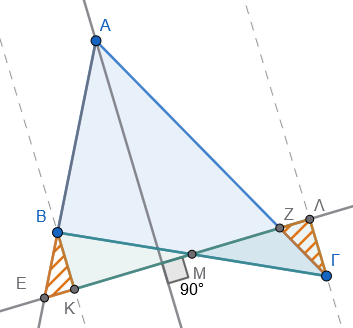{fig-align="center"}

- **Δεδομένα (Υπόθεση):**
  - $BM = M\Gamma$ (από την υπόθεση του μέσου).
  - $A\Delta$ διχοτόμος της $\widehat{A}$.
  - $EZ \perp A\Delta$, με $E \in AB$ και $Z \in A\Gamma$.
- **Ζητούμενο (Συμπέρασμα):**
  - $BE = \Gamma Z$.

**Απόδειξη:**

Φέρουμε από τις κορυφές $B$ και $\Gamma$ κάθετες ευθείες προς την $EZ$, έστω $BK \perp EZ$ και $\Gamma\Lambda \perp EZ$.

1.  Συγκρίνουμε τα ορθογώνια τρίγωνα $\triangle BKM$ ($\widehat{K} = 90^\circ$) και $\triangle \Gamma\Lambda M$ ($\widehat{\Lambda} = 90^\circ$):

- $BM = M\Gamma$ (ίσες υποτείνουσες).
- $\widehat{BMK} = \widehat{\Gamma M\Lambda}$ ως κατακορυφήν γωνίες.

Από το κριτήριο ισότητας ορθογωνίων τριγώνων (Υποτείνουσα-Οξεία Γωνία), τα τρίγωνα είναι ίσα.

Συνεπώς: $BK = \Gamma\Lambda$ και $KM = M\Lambda$.

2.  Το τρίγωνο $\triangle AEZ$ έχει την $A\Delta$ ως διχοτόμο (από υπόθεση) και ύψος (αφού $A\Delta \perp EZ$).

Συνεπώς, το $\triangle AEZ$ είναι ισοσκελές με $AE = AZ$, άρα οι γωνίες της βάσης του είναι ίσες: $\widehat{AEZ} = \widehat{AZE}$.

3.  Συγκρίνουμε τα ορθογώνια τρίγωνα $\triangle BKE$ ($\widehat{K} = 90^\circ$) και $\triangle \Gamma\Lambda Z$ ($\widehat{\Lambda} = 90^\circ$):

- $BK = \Gamma\Lambda$ (αποδείχθηκε - ίσες κάθετες πλευρές).
- $\widehat{BEK} = \widehat{\Gamma Z\Lambda}$ (καθώς $\widehat{BEK} = \widehat{AEZ} = \widehat{AZE} = \widehat{\Gamma Z\Lambda}$ ως κατακορυφήν).

Από το κριτήριο (Κάθετη Πλευρά-Οξεία Γωνία), τα ορθογώνια τρίγωνα είναι ίσα.

Συνεπώς, οι υποτείνουσές τους είναι ίσες, άρα $BE = \Gamma Z$.

------------------------------------------------------------------------

##### **Άσκηση 7 (Η διάμεσος της υποτείνουσας)**

**Εκφώνηση:** Δίνεται ορθογώνιο τρίγωνο $AB\Gamma$ ($\widehat{A} = 90^\circ$) και $AM$ η διάμεσος προς την υποτείνουσα $B\Gamma$.

Να αποδείξετε ότι η διάμεσος αυτή ισούται με το μισό της υποτείνουσας ($AM = \dfrac{B\Gamma}{2}$).

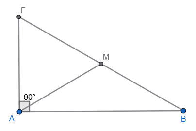{fig-align="center" width="350"}

- **Δεδομένα (Υπόθεση):**
  - $\triangle AB\Gamma$ με $\widehat{A} = 90^\circ$.
  - $AM$ διάμεσος ($BM = M\Gamma = \dfrac{B\Gamma}{2}$).
- **Ζητούμενο (Συμπέρασμα):**
  - $AM = \dfrac{B\Gamma}{2}$.

**Απόδειξη:**

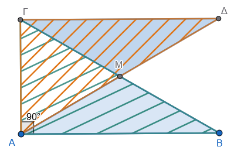{fig-align="center" width="350"}

Προεκτείνουμε τη διάμεσο $AM$ κατά ίσο τμήμα $M\Delta = AM$.

Συγκρίνουμε τα τρίγωνα $\triangle ABM$ και $\triangle \Delta\Gamma M$:

1.  $AM = M\Delta$ (από κατασκευή).
2.  $BM = M\Gamma$ (από την υπόθεση της διαμέσου).
3.  $\widehat{AMB} = \widehat{\Delta M\Gamma}$ ως κατακορυφήν γωνίες.

Από το κριτήριο ΠΓΠ, τα τρίγωνα είναι ίσα.

Συνεπώς: $AB = \Gamma\Delta$ και $\widehat{BAM} = \widehat{M\Delta\Gamma}$ (άρα $AB // \Gamma\Delta$).

Επειδή $AB \perp A\Gamma$ (αφού $\widehat{A} = 90^\circ$) και $AB // \Gamma\Delta$, προκύπτει ότι $\Gamma\Delta \perp A\Gamma$, άρα $\widehat{A\Gamma\Delta} = 90^\circ$.

Συγκρίνουμε τα ορθογώνια τρίγωνα $\triangle AB\Gamma$ ($\widehat{A} = 90^\circ$) και $\triangle \Gamma\Delta A$ ($\widehat{\Gamma} = 90^\circ$):

1.  $AB = \Gamma\Delta$ (αποδείχθηκε).
2.  $A\Gamma$ κοινή κάθετη πλευρά.

Από το κριτήριο ισότητας ορθογωνίων τριγώνων (Leg-Leg), τα τρίγωνα είναι ίσα.

Συνεπώς, οι υποτείνουσές τους είναι ίσες: $B\Gamma = A\Delta$.

Επειδή από την κατασκευή ισχύει $A\Delta = 2AM$, προκύπτει: $$B\Gamma = 2AM \implies \mathbf{AM = \frac{B\Gamma}{2}}$$

------------------------------------------------------------------------

##### **Άσκηση 8 (Το απόστημα της χορδής κύκλου)**

**Εκφώνηση:** Σε κύκλο $(O, R)$ θεωρούμε μια χορδή $AB$.
Να αποδείξετε ότι το απόστημα $O\Delta$ της χορδής τη διχοτομεί.

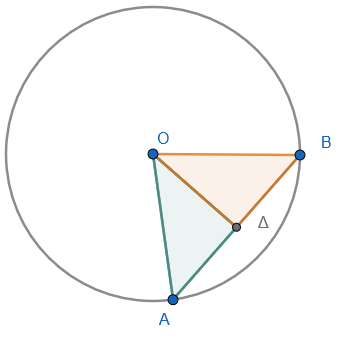{fig-align="center"}

- **Δεδομένα (Υπόθεση):**
  - Κύκλος $(O, R)$ με χορδή $AB$.
  - $O\Delta \perp AB$ (απόστημα).
- **Ζητούμενο (Συμπέρασμα):**
  - $A\Delta = \Delta B$.

**Απόδειξη:**

Συγκρίνουμε τα ορθογώνια τρίγωνα $\triangle OA\Delta$ ($\widehat{\Delta} = 90^\circ$) και $\triangle OB\Delta$ ($\widehat{\Delta} = 90^\circ$):

1.  $OA = OB = R$ (ως ακτίνες του κύκλου - ίσες υποτείνουσες).
2.  $O\Delta$ κοινή κάθετη πλευρά.

Από το **Κριτήριο Ισότητας Ορθογωνίων Τριγώνων** (Υποτείνουσα-Κάθετη Πλευρά), τα τρίγωνα είναι ίσα.

Συνεπώς, οι αντίστοιχες κάθετες πλευρές τους είναι ίσες, δηλαδή $A\Delta = \Delta B$.

------------------------------------------------------------------------
