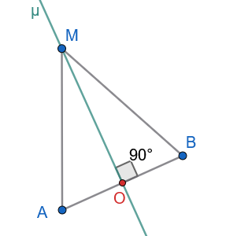
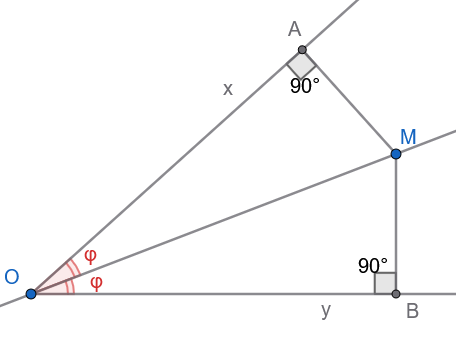
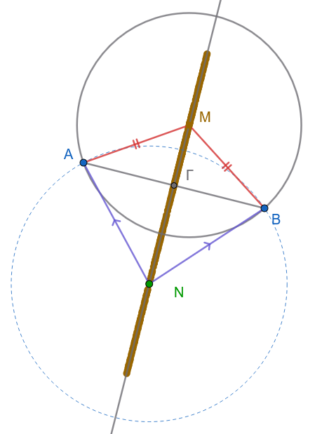
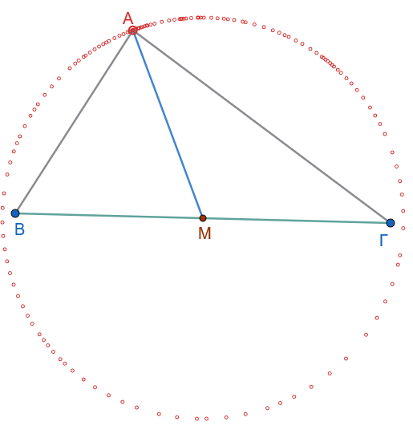
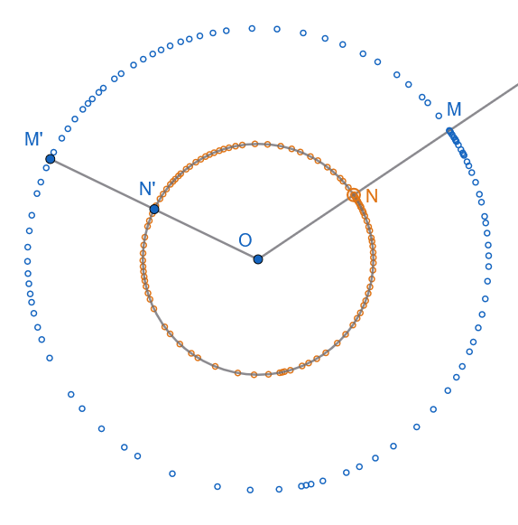
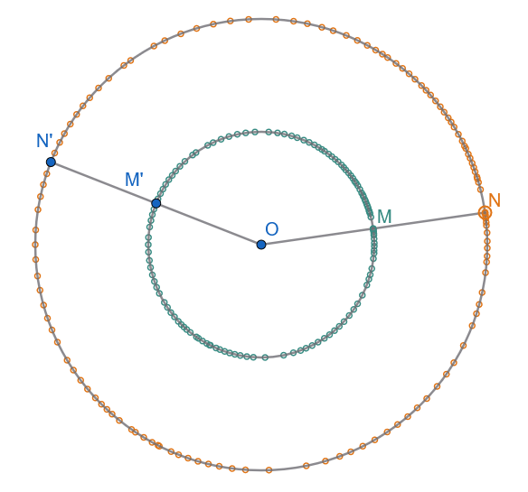
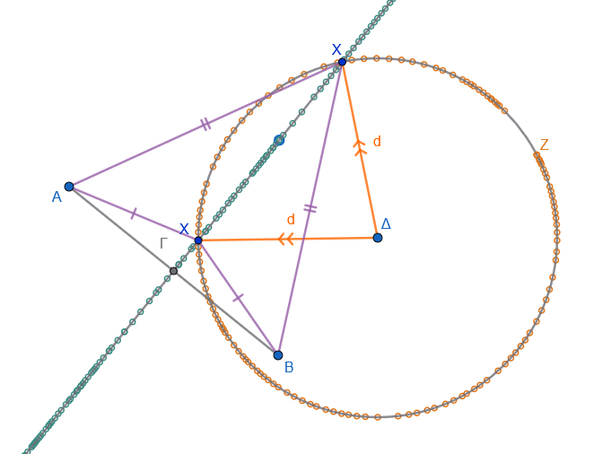
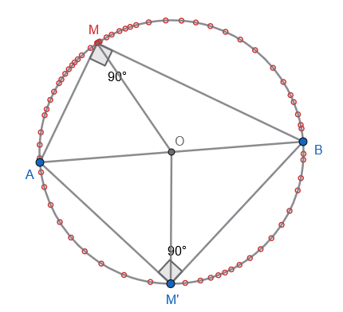
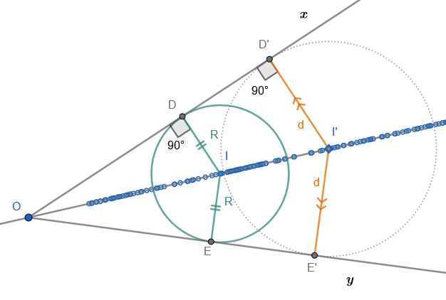
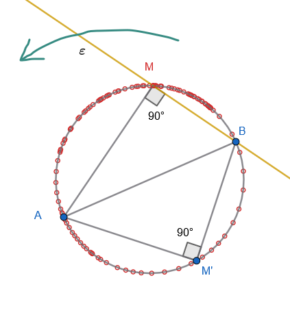

```{=html}
<!-- Φόρτωση βιβλιοθήκης GeoGebra -->
<script src="https://www.geogebra.org/apps/deployggb.js"></script>

<!-- Συνάρτηση δημιουργίας applets -->
<script>
function createGeoGebra(containerId, materialId, width = 700, height = 500) {
  var params = {
    "id": "ggb-" + containerId,
    "material_id": materialId,
    "width": width,
    "height": height,
    "showToolBar": true,
    "showMenuBar": false,
    "showAlgebraInput": true
  };
  
  var applet = new GGBApplet(params, '5.2');
  applet.inject(containerId);
}
</script>
```

## Βασικοί γεωμετρικοί τόποι

### Κύκλος, Μεσοκάθετος και Διχοτόμος

::: {style="background-color: #db8e79; border: 2px solid #2f3e50; color: #0d0402; padding: 15px; border-radius: 5px;"}
***ΕΝΟΤΗΤΑ 1: ΘΕΩΡΙΑ ΚΑΙ ΟΡΙΣΜΟΙ ΓΕΩΜΕΤΡΙΚΩΝ ΤΟΠΩΝ***

**1. Η έννοια του Γεωμετρικού Τόπου**

Στη Γεωμετρία, **Γεωμετρικός Τόπος** ονομάζεται το σύνολο όλων των σημείων του επιπέδου (ή του χώρου) τα οποία έχουν μια κοινή, χαρακτηριστική ιδιότητα.

Για να αποδείξουμε ότι ένα γεωμετρικό σχήμα $U$ είναι ο γεωμετρικός τόπος των σημείων $M$ που έχουν μια ιδιότητα $P$, απαιτείται αυστηρά η **διπλή αποδεικτική υποχρέωση**:

1.  **Το Ευθύ Θεώρημα (ή Ευθεία Πρόταση):** Κάθε σημείο $M$ που έχει την ιδιότητα $P$ ανήκει στο σχήμα $U$. $$M \in \{ \text{Σημεία με ιδιότητα } P \} \implies M \in U$$
2.  **Το Αντίστροφο Θεώρημα (ή Αντίστροφη Πρόταση):** Κάθε σημείο $M$ που ανήκει στο σχήμα $U$ έχει την ιδιότητα $P$. $$M \in U \implies M \in \{ \text{Σημεία με ιδιότητα } P \}$$

Αν παραλειφθεί οποιοδήποτε από τα δύο αυτά μέρη, η απόδειξη του γεωμετρικού τόπου είναι ελλιπής και μαθηματικά μη έγκυρη.
:::

------------------------------------------------------------------------

***2. Ο Κύκλος ως Γεωμετρικός Τόπος***

:::: {.math-box .definition-box}
::: {.math-title .definition-title}
**Ορισμός:**
:::

Έστω ένα σταθερό σημείο $O$ του επιπέδου και ένα σταθερό θετικό ευθύγραμμο τμήμα με μήκος $R$.
**Κύκλος** με κέντρο $O$ και ακτίνα $R$, ο οποίος συμβολίζεται ως $(O, R)$, ονομάζεται ο γεωμετρικός τόπος των σημείων $M$ του επιπέδου που απέχουν από το σημείο $O$ απόσταση ίση με $R$.

$$OM = R$$
::::

:::: {.math-box .definitionsolution-box}
::: {.math-title .definitionsolution-title}
- **Ευθύ:**
:::

Κάθε σημείο $M$ του κύκλου $(O, R)$ απέχει απόσταση $R$ από το κέντρο $O$ (από τον ορισμό του κύκλου ως σχήματος).
::::

:::: {.math-box .definitionsolution-box}
::: {.math-title .definitionsolution-title}
- **Αντίστροφο:**
:::

Κάθε σημείο $M$ του επιπέδου που απέχει απόσταση $OM = R$ από το σταθερό σημείο $O$, ανήκει εξ ορισμού στον κύκλο $(O, R)$.
::::

------------------------------------------------------------------------

***3. Η Μεσοκάθετος Ευθυγράμμου Τμήματος ως Γεωμετρικός Τόπος***

:::: {.math-box .definition-box}
::: {.math-title .definition-title}
**Ορισμός:**
:::

**Μεσοκάθετος** ενός ευθυγράμμου τμήματος $AB$ ονομάζεται η ευθεία $\mu$ η οποία είναι κάθετη στο τμήμα $AB$ και διέρχεται από το μέσο του $O$.
::::

:::: {.math-box .theorem-box}
::: {.math-title .theorem-title}
**Ευθύ Θεώρημα**
:::

Κάθε σημείο της μεσοκαθέτου ενός ευθυγράμμου τμήματος ισαπέχει από τα άκρα του.

{width="250"}
::::

:::: {.math-box .apodeixi-box}
::: {.math-title .apodeixi-title}
**Υπόθεση:** Ευθύγραμμο τμήμα $AB$ με μέσο $O$.
Ευθεία $\mu \perp AB$ στο σημείο $O$.
Σημείο $M$ πάνω στην ευθεία $\mu$.

**Συμπέρασμα:** $MA = MB$.
:::

**Απόδειξη:**

- Αν το σημείο $M$ συμπίπτει με το μέσο $O$, τότε προφανώς $OA = OB$ από τον ορισμό του μέσου.

- Αν το σημείο $M$ είναι διάφορο του $O$, συγκρίνουμε τα τρίγωνα $MOA$ και $MOB$:

  1.  $OA = OB$ (διότι το $O$ είναι μέσο του $AB$).
  2.  $MO$ κοινή πλευρά.
  3.  $\widehat{MOA} = \widehat{MOB} = 90^\circ$ (διότι $\mu \perp AB$).

  Τα τρίγωνα $MOA$ και $MOB$ είναι ορθογώνια και ίσα, έχοντας τις δύο κάθετες πλευρές τους ίσες μία προς μία (Π-Γ-Π).
  Επομένως, θα έχουν και τις υποτείνουσές τους ίσες, δηλαδή $MA = MB$.
::::

:::: {.math-box .theorem-box}
::: {.math-title .theorem-title}
**Αντίστροφο Θεώρημα**
:::

Κάθε σημείο του επιπέδου που ισαπέχει από τα άκρα ενός ευθυγράμμου τμήματος ανήκει στη μεσοκάθετό του.
::::

:::: {.math-box .apodeixi-box}
::: {.math-title .apodeixi-title}
**Υπόθεση:** Ευθύγραμμο τμήμα $AB$ με μέσο $O$.
Σημείο $M$ του επιπέδου τέτοιο ώστε $MA = MB$.

**Συμπέρασμα:** Το $M$ ανήκει στη μεσοκάθετο $\mu$ του $AB$.
:::

**Απόδειξη:**

- Αν το $M$ ανήκει στην ευθεία $AB$, επειδή $MA = MB$, το $M$ πρέπει αναγκαστικά να συμπίπτει με το μέσο $O$ του τμήματος, το οποίο εξ ορισμού ανήκει στη μεσοκάθετο.

- Αν το $M$ βρίσκεται εκτός της ευθείας $AB$, το τρίγωνο $MAB$ είναι ισοσκελές με $MA = MB$.
  Στο ισοσκελές αυτό τρίγωνο, φέρουμε τη διάμεσο $MO$ προς τη βάση $AB$.

  Σύμφωνα με το θεώρημα του ισοσκελούς τριγώνου, η διάμεσος προς τη βάση είναι και ύψος.

  Επομένως, $MO \perp AB$ στο μέσο του $O$.

  Αυτό σημαίνει ότι η ευθεία $MO$ ταυτίζεται με τη μεσοκάθετο $\mu$ του τμήματος $AB$.
  Άρα, το σημείο $M$ ανήκει στη μεσοκάθετο $\mu$.
::::

------------------------------------------------------------------------

***4. Η Διχοτόμος Γωνίας ως Γεωμετρικός Τόπος***

:::: {.math-box .definition-box}
::: {.math-title .definition-title}
**Ορισμός:**
:::

**Διχοτόμος** μιας κυρτής γωνίας $\widehat{xOy}$ ονομάζεται η εσωτερική ημιευθεία $Oz$ η οποία έχει αρχή την κορυφή $O$ της γωνίας και τη χωρίζει σε δύο ίσες γωνίες.

$$\widehat{xOz} = \widehat{zOy}$$
::::

:::: {.math-box .theorem-box}
::: {.math-title .theorem-title}
**Ευθύ Θεώρημα**
:::

Κάθε σημείο της διχοτόμου μιας γωνίας ισαπέχει από τις πλευρές της.

{width="350"}
::::

:::: {.math-box .apodeixi-box}
::: {.math-title .apodeixi-title}
**Υπόθεση:** Γωνία $\widehat{xOy}$ με διχοτόμο $Oz$.
Σημείο $M$ πάνω στην $Oz$.
Αποστάσεις $MA \perp Ox$ και $MB \perp Oy$.

**Συμπέρασμα:** $MA = MB$.
:::

**Απόδειξη:**

Συγκρίνουμε τα ορθογώνια τρίγωνα $OAM$ ($\widehat{A} = 90^\circ$) και $OBM$ ($\widehat{B} = 90^\circ$):

1.  $OM$ κοινή υποτείνουσα.

2.  $\widehat{AOM} = \widehat{BOM}$ (διότι η $Oz$ είναι διχοτόμος της $\widehat{xOy}$).

Τα ορθογώνια τρίγωνα $OAM$ και $OBM$ έχουν την υποτείνουσα και μία οξεία γωνία αντίστοιχα ίσες, επομένως είναι ίσα.

Από την ισότητα αυτή προκύπτει ότι και οι απέναντι κάθετες πλευρές τους είναι ίσες, δηλαδή $MA = MB$.
::::

:::: {.math-box .theorem-box}
::: {.math-title .theorem-title}
**Αντίστροφο Θεώρημα**
:::

Κάθε εσωτερικό σημείο μιας γωνίας που ισαπέχει από τις πλευρές της ανήκει στη διχοτόμο της.
::::

:::: {.math-box .apodeixi-box}
::: {.math-title .apodeixi-title}
**Υπόθεση:** Γωνία $\widehat{xOy}$.
Εσωτερικό σημείο $M$ με αποστάσεις $MA \perp Ox$ και $MB \perp Oy$ τέτοιες ώστε $MA = MB$.

**Συμπέρασμα:** Η ημιευθεία $OM$ είναι η διχοτόμος της γωνίας $\widehat{xOy}$.
:::

**Απόδειξη:**

Συγκρίνουμε τα ορθογώνια τρίγωνα $OAM$ ($\widehat{A} = 90^\circ$) και $OBM$ ($\widehat{B} = 90^\circ$):

1.  $OM$ κοινή υποτείνουσα.

2.  $MA = MB$ (από υπόθεση, ίσες κάθετες πλευρές).

Τα ορθογώνια τρίγωνα έχουν την υποτείνουσα και μία κάθετη πλευρά αντίστοιχα ίσες, άρα είναι ίσα.
Από την ισότητά τους προκύπτει η ισότητα των ομόλογων γωνιών τους:

$$\widehat{AOM} = \widehat{BOM}$$

Συνεπώς, η ημιευθεία $OM$ διχοτομεί τη γωνία $\widehat{xOy}$, δηλαδή το $M$ ανήκει στη διχοτόμο της γωνίας.
::::

------------------------------------------------------------------------

### ΠΑΡΑΔΕΙΓΜΑΤΑ (ΛΥΜΕΝΕΣ ΕΦΑΡΜΟΓΕΣ)

:::: {.math-box .example-box}
::: {.math-title .example-title}
**Παράδειγμα 1**
:::

**Να βρεθεί ο γεωμετρικός τόπος των κέντρων των κύκλων που διέρχονται από δύο σταθερά σημεία** $A$ και $B$.

{width="350"}

[***Δείτε και τα μαθήματα 14, 15, 16, 17 και 18 από την Γεωμετρία της Α τάξης Γυμνασίου***]{style="color: #6432ad;"}
::::

:::: {.math-box .examplesolution-box}
::: {.math-title .examplesolution-title}
**Ανάλυση:**
:::

Έστω $M$ το κέντρο ενός τυχαίου κύκλου που διέρχεται από τα σταθερά σημεία $A$ και $B$.

Εφόσον ο κύκλος διέρχεται από τα $A$ και $B$, τα ευθύγραμμα τμήματα $MA$ και $MB$ αποτελούν ακτίνες του ίδιου κύκλου, συνεπώς ισχύει: $$MA = MB$$

Από τη χαρακτηριστική ιδιότητα της μεσοκαθέτου, εφόσον το σημείο $M$ ισαπέχει από τα άκρα του ευθυγράμμου τμήματος $AB$, ανήκει υποχρεωτικά στη μεσοκάθετο ευθεία $\mu$ του τμήματος $AB$.
::::

:::: {.math-box .examplesolution-box}
::: {.math-title .examplesolution-title}
**Σύνθεση & Αντίστροφο:**
:::

Έστω τυχαίο σημείο $N$ πάνω στη μεσοκάθετο $\mu$ του τμήματος $AB$.

Από την ιδιότητα της μεσοκαθέτου προκύπτει ότι $NA = NB$.

Αν γράψουμε τον κύκλο $(N, NA)$ με κέντρο το $N$ και ακτίνα $d = NA$, ο κύκλος αυτός θα διέρχεται εξ ορισμού και από το σημείο $B$ (αφού $NB = NA = d$).

Συνεπώς, το σημείο $N$ είναι κέντρο κύκλου που διέρχεται από τα $A$ και $B$.

**Γεωμετρικός Προσδιορισμός:**

Ο ζητούμενος γεωμετρικός τόπος είναι **η μεσοκάθετος ευθεία** $\mu$ του ευθυγράμμου τμήματος $AB$.
::::

------------------------------------------------------------------------

:::: {.math-box .example-box}
::: {.math-title .example-title}
**Παράδειγμα 2**
:::

**Να βρεθεί ο γεωμετρικός τόπος των κορυφών** $A$ των τριγώνων $AB\Gamma$ που έχουν σταθερή τη βάση $B\Gamma = a$ και σταθερή τη διάμεσο $AM = m$.

{width="350"}
::::

:::: {.math-box .examplesolution-box}
::: {.math-title .examplesolution-title}
**Ανάλυση:**
:::

Έστω $AB\Gamma$ ένα τρίγωνο με σταθερή βάση $B\Gamma = a$.

Το μέσο $M$ της βάσης $B\Gamma$ είναι ένα σταθερό σημείο του επιπέδου, καθώς τα άκρα $B$ και $\Gamma$ είναι σταθερά.

Η διάμεσος $AM$ έχει σταθερό μήκος ίσο με $m$.

Συνεπώς, η απόσταση της μεταβλητής κορυφής $A$ από το σταθερό σημείο $M$ παραμένει σταθερή και ίση με $m$: $$MA = m$$

Από τον ορισμό του κύκλου ως γεωμετρικού τόπου, η κορυφή $A$ οφείλει να κινείται σε κύκλο με κέντρο το σταθερό σημείο $M$ και ακτίνα $m$.
::::

:::: {.math-box .examplesolution-box}
::: {.math-title .examplesolution-title}
**Διερεύνηση & Όρια:**
:::

Επειδή οι κορυφές $A, B, \Gamma$ πρέπει να ορίζουν τρίγωνο, η κορυφή $A$ δεν μπορεί να είναι συνευθειακή με τα $B$ και $\Gamma$.

Τα σημεία τομής του κύκλου $(M, m)$ με τον φορέα της βάσης $B\Gamma$ πρέπει να εξαιρεθούν από τον γεωμετρικό τόπο, διότι σε αυτές τις θέσεις το τρίγωνο εκφυλίζεται σε ευθύγραμμο τμήμα.

**Γεωμετρικός Προσδιορισμός:** Ο γεωμετρικός τόπος είναι **ο κύκλος** $(M, m)$ με κέντρο το μέσο $M$ της βάσης $B\Gamma$ και ακτίνα $m$, εξαιρουμένων των δύο σημείων τομής του κύκλου αυτού με την ευθεία $B\Gamma$.
::::

------------------------------------------------------------------------

:::: {.math-box .example-box}
::: {.math-title .example-title}
**Παράδειγμα 3**
:::

**Δίνεται κύκλος** $(O, R)$ και $N$ τυχαίο σημείο του.
Στην προέκταση της ακτίνας $ON$ λαμβάνουμε σημείο $M$ τέτοιο ώστε $ON = NM$.
Να βρεθεί ο γεωμετρικός τόπος του $M$ καθώς το $N$ διαγράφει τον κύκλο.

{width="350"}
::::

:::: {.math-box .examplesolution-box}
::: {.math-title .examplesolution-title}
**Ανάλυση:**
:::

Το σημείο $O$ είναι σταθερό (κέντρο του δοσμένου κύκλου).

Το σημείο $N$ κινείται στον κύκλο $(O, R)$, επομένως η απόστασή του από το $O$ είναι σταθερή: $$ON = R$$

Το σημείο $M$ βρίσκεται στην προέκταση της ακτίνας $ON$ έτσι ώστε $ON = NM$.

Συνεπώς, η απόσταση του σημείου $M$ από το σταθερό κέντρο $O$ είναι: $$OM = ON + NM = R + R = 2R$$

Επειδή η απόσταση του μεταβλητού σημείου $M$ από το σταθερό σημείο $O$ είναι σταθερή και ίση με $2R$, το σημείο $M$ ανήκει σε κύκλο με κέντρο το $O$ και ακτίνα $2R$.
::::

:::: {.math-box .examplesolution-box}
::: {.math-title .examplesolution-title}
**Αντίστροφο:**
:::

Έστω $M'$ ένα τυχαίο σημείο του κύκλου $(O, 2R)$, δηλαδή $OM' = 2R$.

Θεωρούμε το σημείο $N'$ πάνω στο ευθύγραμμο τμήμα $OM'$ τέτοιο ώστε $ON' = \dfrac{OM'}{2} = R$.

Επειδή $ON' = R$, το σημείο $N'$ ανήκει στον αρχικό κύκλο $(O, R)$.

Επίσης, επειδή $ON' = R$ και $OM' = 2R$, προκύπτει ότι $N'M' = OM' - ON' = R$, δηλαδή $ON' = N'M'$.

Συνεπώς, το $M'$ ικανοποιεί τη χαρακτηριστική ιδιότητα του γεωμετρικού τόπου.

**Γεωμετρικός Προσδιορισμός:** Ο γεωμετρικός τόπος του $M$ είναι **ένας ομόκεντρος κύκλος** $(O, 2R)$ με διπλάσια ακτίνα από τον αρχικό.
::::

------------------------------------------------------------------------

### ΑΣΚΗΣΕΙΣ

:::: {.math-box .exercise-box}
::: {.math-title .exercise-title}
**Άσκηση 1 (Κύκλος)**
:::

**Να βρεθεί ο γεωμετρικός τόπος των μέσων των ακτίνων δοσμένου κύκλου** $(O, R)$.

{width="350"}
::::

:::: {.math-box .solution-box}
::: {.math-title .solution-title}
**Ευθύ:**
:::

Έστω $ON$ μια τυχαία ακτίνα του κύκλου $(O, R)$, οπότε $ON = R$ (σταθερό).

Θεωρούμε το μέσο $M$ της ακτίνας $ON$.
Τότε ισχύει: $$OM = \frac{ON}{2} = \frac{R}{2}$$

Επειδή το σημείο $O$ είναι σταθερό (κέντρο του κύκλου) και η απόσταση $OM$ του μεταβλητού σημείου $M$ από το $O$ είναι σταθερή και ίση με $\dfrac{R}{2}$, το σημείο $M$ ανήκει σε κύκλο με κέντρο $O$ και ακτίνα $\dfrac{R}{2}$.
::::

:::: {.math-box .solution-box}
::: {.math-title .solution-title}
**Αντίστροφο:**
:::

Έστω $M'$ ένα τυχαίο σημείο του κύκλου $(O, \dfrac{R}{2})$, δηλαδή $OM' = \dfrac{R}{2}$.

Προεκτείνουμε το ευθύγραμμο τμήμα $OM'$ κατά ίσο τμήμα $M'N' = OM' = \dfrac{R}{2}$.

Τότε το σημείο $N'$ απέχει από το $O$ απόσταση: $$ON' = OM' + M'N' = \frac{R}{2} + \frac{R}{2} = R$$

Συνεπώς, το $N'$ είναι σημείο του δοσμένου κύκλου $(O, R)$ και το $M'$ είναι εξ ορισμού το μέσο της ακτίνας $ON'$.

**Συμπέρασμα:** Ο γεωμετρικός τόπος των μέσων των ακτίνων του κύκλου $(O, R)$ είναι **ένας ομόκεντρος κύκλος με κέντρο το** $O$ και ακτίνα ίση με το μισό της ακτίνας του αρχικού κύκλου, δηλαδή ο κύκλος $(O, \dfrac{R}{2})$.
::::

------------------------------------------------------------------------

:::: {.math-box .exercise-box}
::: {.math-title .exercise-title}
**Άσκηση 2 (Συνδυαστική)**
:::

**Να βρεθεί ο γεωμετρικός τόπος των σημείων** $X$ του επιπέδου που ισαπέχουν από δύο σταθερά σημεία $A$ και $B$ και ταυτόχρονα απέχουν σταθερή απόσταση $d$ από ένα τρίτο σταθερό σημείο $\Delta$.

{width="450"}
::::

:::: {.math-box .solution-box}
::: {.math-title .solution-title}
**Λύση**
:::

1.  **Ανάλυση των Συνθηκών:**

Το σημείο $X$ πρέπει να πληροί ταυτόχρονα δύο ανεξάρτητες γεωμετρικές συνθήκες:

- **Συνθήκη 1:** Το $X$ ισαπέχει από τα σταθερά σημεία $A$ και $B$ ($XA = XB$).
  Ο γεωμετρικός τόπος των σημείων που ικανοποιούν αυτή τη συνθήκη είναι η μεσοκάθετος ευθεία $\mu$ του ευθυγράμμου τμήματος $AB$.

- **Συνθήκη 2:** Το $X$ απέχει σταθερή απόσταση $d$ από το σταθερό σημείο $\Delta$ ($\Delta X = d$).
  Ο γεωμετρικός τόπος των σημείων που ικανοποιούν αυτή τη συνθήκη είναι ο κύκλος $C(\Delta, d)$ με κέντρο το $\Delta$ και ακτίνα $d$.

Συνεπώς, τα ζητούμενα σημεία $X$ αποτελούν τις **τομές της μεσοκαθέτου ευθείας** $\mu$ και του κύκλου $C(\Delta, d)$.

2.  **Διερεύνηση (Τομή Ευθείας και Κύκλου):**

Έστω $h$ η κάθετη απόσταση του σταθερού σημείου $\Delta$ (κέντρου του κύκλου) από τη μεσοκάθετο ευθεία $\mu$.
Η ύπαρξη και το πλήθος των λύσεων εξαρτώνται από τη σχέση της απόστασης $h$ με την ακτίνα $d$ του κύκλου:

- **Αν** $h > d$: Η ευθεία $\mu$ και ο κύκλος $C$ δεν τέμνονται.
  Το πρόβλημα δεν έχει καμία λύση (ο γεωμετρικός τόπος είναι το κενό σύνολο $\emptyset$).

- **Αν** $h = d$: Η ευθεία $\mu$ εφάπτεται στον κύκλο $C$.
  Υπάρχει ακριβώς μία λύση (το σημείο επαφής).

- **Αν** $h < d$: Η ευθεία $\mu$ τέμνει τον κύκλο $C$ σε δύο διακριτά σημεία.
  Υπάρχουν ακριβώς δύο λύσεις (τα δύο σημεία τομής).
::::

------------------------------------------------------------------------

**Άσκηση 3 (Κύκλος: Ο γεωμετρικός τόπος της ορθής γωνίας)**

**Εκφώνηση:** Δίνεται σταθερό ευθύγραμμο τμήμα $AB$.
Να βρεθεί ο γεωμετρικός τόπος των σημείων $M$ του επιπέδου από τα οποία το τμήμα $AB$ φαίνεται υπό ορθή γωνία (δηλαδή η γωνία $\widehat{AMB}$ είναι ίση με $90^\circ$).

{width="350"}

- **Υπόθεση:** Σταθερό τμήμα $AB$.
  Μεταβλητό σημείο $M$ με $\widehat{AMB} = 90^\circ$.

- **Συμπέρασμα:** Προσδιορισμός του γεωμετρικού τόπου του $M$.

**Απόδειξη:**

**1. Ευθύ (Το σημείο ανήκει στη γραμμή):**

Έστω $M$ ένα σημείο του γεωμετρικού τόπου, δηλαδή $\widehat{AMB} = 90^\circ$.

Θεωρούμε το τρίγωνο $AMB$, το οποίο είναι ορθογώνιο στην κορυφή $M$.

Αν ορίσουμε ως $O$ το μέσο του σταθερού τμήματος $AB$, τότε το τμήμα $OM$ είναι η διάμεσος που αντιστοιχεί στην υποτείνουσα $AB$.

Σύμφωνα με το σχετικό θεώρημα, η διάμεσος προς την υποτείνουσα ισούται με το μισό της: $$OM = \frac{AB}{2}$$

Επειδή το σημείο $O$ είναι σταθερό (ως μέσο σταθερού τμήματος) και η απόσταση $OM$ είναι σταθερή και ίση με $\dfrac{AB}{2}$, το σημείο $M$ ανήκει στον κύκλο που έχει κέντρο το $O$ και διάμετρο $AB$.

**2. Αντίστροφο (Κάθε σημείο της γραμμής έχει την ιδιότητα):**

Έστω $M'$ ένα τυχαίο σημείο του κύκλου με κέντρο το $O$ (μέσο του $AB$) και διάμετρο $AB$, διαφορετικό από τα άκρα $A$ και $B$.

Τότε, η απόσταση $OM'$ είναι ακτίνα του κύκλου, άρα: $$OM' = \frac{AB}{2}$$

Στο τρίγωνο $AM'B$, το τμήμα $OM'$ είναι η διάμεσος που αντιστοιχεί στην πλευρά $AB$ και ισούται με το μισό της.
Συνεπώς, το τρίγωνο $AM'B$ είναι ορθογώνιο με υποτείνουσα την $AB$, δηλαδή $\widehat{AM'B} = 90^\circ$.

**Γεωμετρικός Προσδιορισμός:**

Ο γεωμετρικός τόπος των σημείων $M$ είναι **ο κύκλος με διάμετρο το τμήμα** $AB$, εξαιρουμένων των σημείων $A$ και $B$ (στα οποία το τρίγωνο εκφυλίζεται).

------------------------------------------------------------------------

**Άσκηση 4 (Διχοτόμος: Κέντρα εφαπτόμενων κύκλων σε γωνία)**

**Εκφώνηση:** Δίνεται γωνία $\widehat{xOy}$.
Να βρεθεί ο γεωμετρικός τόπος των κέντρων $I$ των κύκλων που εφάπτονται ταυτόχρονα και στις δύο πλευρές $Ox$ και $Oy$ της γωνίας.

{width="450"}

- **Υπόθεση:** Γωνία $\widehat{xOy}$.
  Σημείο $I$ στο εσωτερικό της γωνίας, το οποίο είναι κέντρο κύκλου εφαπτόμενου στις $Ox, Oy$.

- **Συμπέρασμα:** Προσδιορισμός του γεωμετρικού τόπου του $I$.

**Απόδειξη:**

**1. Ευθύ:**

Έστω $I$ το κέντρο ενός κύκλου που εφάπτεται στις πλευρές $Ox$ και $Oy$ της γωνίας.

Αν ονομάσουμε $D$ και $E$ τα σημεία επαφής στις δύο πλευρές αντίστοιχα, τότε οι ακτίνες $ID$ και $IE$ είναι κάθετες στις πλευρές: $$ID \perp Ox \quad \text{και} \quad IE \perp Oy$$

Εφόσον τα τμήματα αυτά είναι ακτίνες του ίδιου κύκλου, οι αποστάσεις του σημείου $I$ από τις πλευρές της γωνίας είναι ίσες: $$ID = IE = R$$

Επειδή το εσωτερικό σημείο $I$ της γωνίας ισαπέχει από τις πλευρές της, σύμφωνα με τη χαρακτηριστική ιδιότητα, το $I$ ανήκει στη διχοτόμο $\delta$ της γωνίας $\widehat{xOy}$.

**2. Αντίστροφο:**

Έστω $I'$ ένα τυχαίο σημείο της διχοτόμου $\delta$ της γωνίας $\widehat{xOy}$ (διάφορο της κορυφής $O$).

Από τη χαρακτηριστική ιδιότητα της διχοτόμου, οι κάθετες αποστάσεις του $I'$ από τις πλευρές $Ox$ και $Oy$, έστω $I'D' \perp Ox$ και $I'E' \perp Oy$, είναι ίσες: $$I'D' = I'E' = d$$

Αν γράψουμε κύκλο με κέντρο το σημείο $I'$ και ακτίνα $d$, ο κύκλος αυτός θα εφάπτεται στις πλευρές $Ox$ και $Oy$ στα σημεία $D'$ και $E'$ αντίστοιχα.
Συνεπώς, το $I'$ είναι κέντρο κύκλου εφαπτόμενου στις πλευρές της γωνίας.

**Γεωμετρικός Προσδιορισμός:**

Ο γεωμετρικός τόπος των κέντρων $I$ είναι **η διχοτόμος** $\delta$ της γωνίας $\widehat{xOy}$ (με εξαίρεση την κορυφή $O$).

------------------------------------------------------------------------

**Άσκηση 5 (Κύκλος: Προβολή σταθερού σημείου σε μεταβλητή ευθεία)**

**Εκφώνηση:** Δίνονται δύο σταθερά σημεία $A$ και $B$ του επιπέδου.
Μια μεταβλητή ευθεία $\epsilon$ περιστρέφεται γύρω από το σημείο $B$.
Να βρεθεί ο γεωμετρικός τόπος της προβολής $M$ του σημείου $A$ πάνω στην ευθεία $\epsilon$.

{width="350"}

- **Υπόθεση:** Σταθερά σημεία $A, B$.
  Ευθεία $\epsilon$ διερχόμενη από το $B$.
  Σημείο $M \in \epsilon$ τέτοιο ώστε $AM \perp \epsilon$.

- **Συμπέρασμα:** Προσδιορισμός του γεωμετρικού τόπου του $M$.

**Απόδειξη:**

**1. Ευθύ:**

Έστω $M$ η προβολή του σταθερού σημείου $A$ πάνω στη μεταβλητή ευθεία $\epsilon$.

Αυτό σημαίνει ότι η ευθεία $AM$ είναι κάθετη στην $\epsilon$: $$AM \perp \epsilon$$

Επειδή η ευθεία $\epsilon$ διέρχεται από το σταθερό σημείο $B$, το σημείο $M$ ανήκει στην ευθεία αυτή, οπότε η ευθεία $BM$ συμπίπτει με την $\epsilon$.

Συνεπώς, η γωνία $\widehat{AMB}$ είναι ορθή: $$\widehat{AMB} = 90^\circ$$

Σύμφωνα με τον γεωμετρικό τόπο της ορθής γωνίας , το σημείο $M$ οφείλει να ανήκει στον κύκλο που έχει διάμετρο το σταθερό τμήμα $AB$.

**2. Αντίστροφο:**

Έστω $M'$ ένα τυχαίο σημείο του κύκλου με διάμετρο $AB$.

Επειδή το $M'$ ανήκει στον κύκλο αυτό, η εγγεγραμμένη γωνία $\widehat{AM'B}$ που βαίνει σε ημικύκλιο είναι ορθή: $$\widehat{AM'B} = 90^\circ \implies AM' \perp BM'$$

Αν θεωρήσουμε ως μεταβλητή ευθεία $\epsilon$ την ευθεία $BM'$, αυτή διέρχεται από το σταθερό σημείο $B$.

Επειδή $AM' \perp BM'$, το σημείο $M'$ είναι η προβολή του σταθερού σημείου $A$ πάνω στην ευθεία αυτή.

**Γεωμετρικός Προσδιορισμός:**

Ο γεωμετρικός τόπος των προβολών $M$ είναι **ολόκληρος ο κύκλος με διάμετρο το ευθύγραμμο τμήμα** $AB$ (εδώ συμπεριλαμβάνονται και τα σημεία $A$ και $B$, καθώς για την ευθεία $\epsilon \perp AB$ στο $B$ η προβολή είναι το $B$, ενώ για την ευθεία $\epsilon = AB$ η προβολή είναι το $A$).

------------------------------------------------------------------------

**Άσκηση 6 (Μεσοκάθετος: Κορυφή ισοσκελούς τριγώνου)**

**Εκφώνηση:** Θεωρούμε όλα τα ισοσκελή τρίγωνα $AB\Gamma$ ($AB = A\Gamma$) τα οποία έχουν κοινή και σταθερή βάση το ευθύγραμμο τμήμα $B\Gamma$.
Να βρεθεί ο γεωμετρικός τόπος της μεταβλητής κορυφής $A$.

> > Κάντε το σχήμα

- **Υπόθεση:** Σταθερό τμήμα $B\Gamma$.
  Μεταβλητό σημείο $A$ εκτός της ευθείας $B\Gamma$ τέτοιο ώστε $AB = A\Gamma$.

- **Συμπέρασμα:** Προσδιορισμός του γεωμετρικού τόπου του $A$.

**Απόδειξη:**

**1. Ευθύ:**

Έστω $A$ η κορυφή ενός ισοσκελούς τριγώνου $AB\Gamma$ με σταθερή βάση $B\Gamma$.

Εφόσον το τρίγωνο είναι ισοσκελές, οι πλευρές $AB$ και $A\Gamma$ είναι ίσες: $$AB = A\Gamma$$

Επειδή το σημείο $A$ ισαπέχει από τα σταθερά άκρα $B$ και $\Gamma$ του τμήματος $B\Gamma$, σύμφωνα με τη χαρακτηριστική ιδιότητα, το σημείο $A$ ανήκει στη μεσοκάθετο ευθεία $\mu$ του ευθυγράμμου τμήματος $B\Gamma$.

**2. Αντίστροφο:**

Έστω $A'$ ένα τυχαίο σημείο της μεσοκαθέτου ευθείας $\mu$ του σταθερού τμήματος $B\Gamma$, το οποίο δεν βρίσκεται πάνω στην ευθεία $B\Gamma$ (δηλαδή το $A'$ είναι διάφορο του μέσου $M$ του $B\Gamma$).

Λόγω της ιδιότητας της μεσοκαθέτου, το σημείο $A'$ ισαπέχει από τα άκρα $B$ και $\Gamma$: $$A'B = A'\Gamma$$

Επειδή το $A'$ δεν είναι συνευθειακό με τα $B$ και $\Gamma$, ορίζεται το τρίγωνο $A'B\Gamma$.

Εφόσον $A'B = A'\Gamma$, το τρίγωνο αυτό είναι ισοσκελές με βάση το σταθερό τμήμα $B\Gamma$.

**Γεωμετρικός Προσδιορισμός:**

Ο γεωμετρικός τόπος της κορυφής $A$ είναι **η μεσοκάθετος ευθεία** $\mu$ του ευθυγράμμου τμήματος $B\Gamma$, εξαιρουμένου του μέσου $M$ της βάσης (στο οποίο το τρίγωνο εκφυλίζεται σε ευθύγραμμο τμήμα).

------------------------------------------------------------------------
