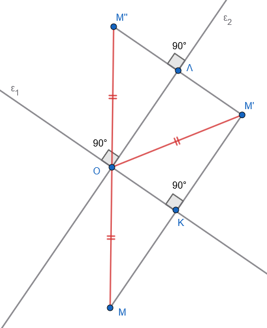

```{=html}
<!-- Φόρτωση βιβλιοθήκης GeoGebra -->
<script src="https://www.geogebra.org/apps/deployggb.js"></script>

<!-- Συνάρτηση δημιουργίας applets -->
<script>
function createGeoGebra(containerId, materialId, width = 700, height = 500) {
  var params = {
    "id": "ggb-" + containerId,
    "material_id": materialId,
    "width": width,
    "height": height,
    "showToolBar": true,
    "showMenuBar": false,
    "showAlgebraInput": true
  };
  
  var applet = new GGBApplet(params, '5.2');
  applet.inject(containerId);
}
</script>
```

## Συμμετρικά σχήματα

> > > Δείτε και τα μαθήματα 14, 15, 16, 17 και 18 της Γεωμετρίας Α τάξης.

### ΚΕΝΤΡΙΚΗ ΣΥΜΜΕΤΡΙΑ

**Ορισμοί**

:::: {.math-box .definition-box}
::: {.math-title .definition-title}
- **Συμμετρικά Σημεία ως προς Κέντρο:**
:::

Έστω $O$ ένα σταθερό σημείο του επιπέδου.
Για κάθε σημείο $A$, υπάρχει μοναδικό σημείο $B$ τέτοιο, ώστε το $O$ να είναι το μέσο του ευθυγράμμου τμήματος $AB$.
Το σημείο $B$ ονομάζεται συμμετρικό του $A$ ως προς κέντρο συμμετρίας το σημείο $O$ (και αντίστροφα, το $A$ είναι συμμετρικό του $B$ ως προς το $O$).
::::

:::: {.math-box .definition-box}
::: {.math-title .definition-title}
- **Συμμετρικά Σχήματα ως προς Κέντρο:**
:::

Δύο επίπεδα σχήματα $\Sigma$ και $\Sigma'$ ονομάζονται συμμετρικά ως προς ένα σημείο $O$, αν και μόνο αν κάθε σημείο του σχήματος $\Sigma'$ είναι συμμετρικό ενός σημείου του σχήματος $\Sigma$ ως προς το $O$, και αντίστροφα.
Το σημείο $O$ ονομάζεται κέντρο συμμετρίας του συνολικού σχήματος που αποτελείται από τα συμμετρικά σχήματα $\Sigma$ και $\Sigma'$.
::::

:::: {.math-box .definition-box}
::: {.math-title .definition-title}
- **Κέντρο Συμμετρίας Σχήματος:**
:::

Ένα σημείο $O$ ονομάζεται κέντρο συμμετρίας ενός μεμονωμένου σχήματος, όταν για κάθε σημείο $A$ αυτού του σχήματος, το συμμετρικό του σημείο $A'$ ως προς το $O$ είναι επίσης σημείο του ίδιου σχήματος.
Ένα τέτοιο σχήμα λέμε ότι παρουσιάζει κεντρική συμμετρία.
::::

#### Παραδείγματα

:::: {.math-box .example-box}
::: {.math-title .example-title}
1.  **Ευθύγραμμο Τμήμα:**
:::

Κάθε ευθύγραμμο τμήμα έχει ως κέντρο συμμετρίας το μέσο του.
Τα άκρα του τμήματος είναι συμμετρικά σημεία ως προς αυτό το μέσο.
::::

:::: {.math-box .example-box}
::: {.math-title .example-title}
2.  **Κύκλος:**
:::

Ο κύκλος παρουσιάζει κεντρική συμμετρία και έχει ως κέντρο συμμετρίας το κέντρο του.
::::

------------------------------------------------------------------------

> > > Σε κάθε άσκηση κάντε το αντίστοιχο σχήμα

#### Ασκήσεις Κεντρικής Συμμετρίας με Αποδείξεις

:::: {.math-box .exercise-box}
::: {.math-title .exercise-title}
**Άσκηση 1 (Ισότητα συμμετρικού τμήματος)**
:::

**Εκφώνηση:** Να αποδείξετε ότι το συμμετρικό ενός ευθυγράμμου τμήματος $AB$ ως προς σημείο $O$, το οποίο δεν ανήκει στον φορέα του $AB$, είναι ευθύγραμμο τμήμα $A'B'$ ίσο με το $AB$.
::::

:::: {.math-box .solution-box}
::: {.math-title .solution-title}
**Απόδειξη:**
:::

Έστω ευθύγραμμο τμήμα $AB$ και σημείο $O$ εκτός αυτού.
Θεωρούμε $A'$ και $B'$ τα συμμετρικά των $A$ και $B$ ως προς το $O$ αντίστοιχα.

Συγκρίνουμε τα τρίγωνα $\triangle AOB$ και $\triangle A'OB'$:

1.  $OA' = OA$ (λόγω συμμετρίας του $A$ ως προς το $O$).
2.  $OB' = OB$ (λόγω συμμετρίας του $B$ ως προς το $O$).
3.  $\widehat{A'OB'} = \widehat{AOB}$ ως κατακορυφήν γωνίες.

Σύμφωνα με το **1ο Κριτήριο Ισότητας Τριγώνων (ΠΓΠ)**, τα τρίγωνα $\triangle AOB$ και $\triangle A'OB'$ είναι ίσα.

Επομένως, οι αντίστοιχες πλευρές τους είναι ίσες, δηλαδή $A'B' = AB$.
::::

------------------------------------------------------------------------

**Άσκηση 2 (Ισότητα συμμετρικών τριγώνων)**

**Εκφώνηση:** Δίνεται τρίγωνο $AB\Gamma$ και σημείο $O$.
Αν $A', B', \Gamma'$ είναι τα συμμετρικά των κορυφών $A, B, \Gamma$ ως προς το κέντρο $O$ αντίστοιχα, να αποδείξετε ότι τα τρίγωνα $AB\Gamma$ και $A'B'\Gamma'$ είναι συμμετρικά ως προς το $O$ και ίσα.

**Απόδειξη:**

Λόγω της κεντρικής συμμετρίας των κορυφών ως προς το σημείο $O$, ισχύουν οι σχέσεις: $$OA' = OA, \quad OB' = OB, \quad O\Gamma' = O\Gamma \quad$$

Από την απόδειξη της *Ασκήσεως 1*, το συμμετρικό κάθε ευθυγράμμου τμήματος ως προς κέντρο $O$ είναι τμήμα ίσο με αυτό.
Συνεπώς, για τις πλευρές των δύο τριγώνων έχουμε:

1.  $A'B' = AB$
2.  $B'\Gamma' = B\Gamma$
3.  $A'\Gamma' = A\Gamma$

Σύμφωνα με το **3ο Κριτήριο Ισότητας Τριγώνων (ΠΠΠ)**, τα τρίγωνα $AB\Gamma$ και $A'B'\Gamma'$ είναι ίσα.
Επειδή για κάθε σημείο του τριγώνου $AB\Gamma$ το συμμετρικό του ως προς το $O$ ανήκει στο $A'B'\Gamma'$, τα δύο τρίγωνα είναι συμμετρικά ως προς το κέντρο $O$.

------------------------------------------------------------------------

**Άσκηση 3 (Ισότητα συμμετρικής γωνίας)**

**Εκφώνηση:** Αν $x'A'y'$ είναι η συμμετρική της γωνίας $xAy$ ως προς κέντρο συμμετρίας ένα σημείο $O$, το οποίο είναι εξωτερικό της γωνίας, να αποδείξετε ότι $x'A'y' = xAy$.

**Απόδειξη:**

Έστω $A'$ το συμμετρικό της κορυφής $A$ ως προς το κέντρο $O$.
Θεωρούμε ένα σημείο $B$ πάνω στην πλευρά $Ax$ της γωνίας και ένα σημείο $\Gamma$ πάνω στην πλευρά $Ay$.

Λαμβάνουμε τα συμμετρικά τους σημεία $B'$ και $\Gamma'$ ως προς το κέντρο $O$, τα οποία ορίζουν τις αντίστοιχες συμμετρικές ημιευθείες $A'x'$ και $A'y'$.

Συγκρίνουμε τα τρίγωνα $\triangle AB\Gamma$ και $\triangle A'B'\Gamma'$:

1.  $AB = A'B'$ (ως συμμετρικά τμήματα).
2.  $A\Gamma = A'\Gamma'$ (ως συμμετρικά τμήματα).
3.  $B\Gamma = B'\Gamma'$ (ως συμμετρικά τμήματα).

Από το **3ο Κριτήριο Ισότητας Τριγώνων (ΠΠΠ)**, τα τρίγωνα $\triangle AB\Gamma$ και $\triangle A'B'\Gamma'$ είναι ίσα.
Εφόσον τα τρίγωνα είναι ίσα, όλες οι αντίστοιχες γωνίες τους είναι ίσες.
Συνεπώς, προκύπτει άμεσα ότι οι γωνίες των κορυφών τους είναι ίσες, δηλαδή $\widehat{x'A'y'} = \widehat{xAy}$.

------------------------------------------------------------------------

**Άσκηση 4 (Συμμετρικό του μέσου τμήματος)**

**Εκφώνηση:** Αν $M$ είναι το μέσο ενός ευθυγράμμου τμήματος $AB$ και $O$ ένα σημείο εκτός του φορέα του $AB$, να αποδείξετε ότι το συμμετρικό σημείο $M'$ του $M$ ως προς το $O$ είναι το μέσο του συμμετρικού τμήματος $A'B'$.

**Απόδειξη:**

Εφόσον το $M$ είναι μέσο του $AB$, ισχύει $AM = MB$.

Συγκρίνουμε τα τρίγωνα $\triangle AOM$ και $\triangle A'OM'$:

1.  $OA = OA'$ (λόγω συμμετρίας).
2.  $OM = OM'$ (λόγω συμμετρίας).
3.  $\widehat{AOM} = \widehat{A'OM'}$ ως κατακορυφήν.

Τα τρίγωνα είναι ίσα από το κριτήριο ΠΓΠ, οπότε προκύπτει ότι $A'M' = AM$ (1).

Με τον ίδιο τρόπο, συγκρίνουμε τα τρίγωνα $\triangle BOM$ και $\triangle B'OM'$:

1.  $OB = OB'$ (λόγω συμμετρίας).
2.  $OM = OM'$ (λόγω συμμετρίας).
3.  $\widehat{BOM} = \widehat{B'OM'}$ ως κατακορυφήν.

Τα τρίγωνα είναι ίσα από το κριτήριο ΠΓΠ, οπότε προκύπτει ότι $B'M' = BM$ (2).

Επειδή $AM = MB$, από τις σχέσεις (1) και (2) συνεπάγεται ότι $A'M' = B'M'$.
Καθώς τα σημεία $A', M', B'$ είναι συνευθειακά (αφού η κεντρική συμμετρία διατηρεί τη συνευθειακότητα), το $M'$ είναι το **μέσο** του ευθυγράμμου τμήματος $A'B'$.

------------------------------------------------------------------------

**Άσκηση 5 (Κέντρο συμμετρίας παραλληλογράμμου)**

**Εκφώνηση:** Να αποδείξετε ότι το σημείο τομής $O$ των διαγωνίων ενός παραλληλογράμμου $AB\Gamma\Delta$ είναι κέντρο συμμετρίας του.

**Απόδειξη:**

Έστω παραλληλόγραμμο $AB\Gamma\Delta$ και $O$ το σημείο τομής των διαγωνίων του $A\Gamma$ και $B\Delta$.

Από τις γεωμετρικές ιδιότητες του παραλληλογράμμου, οι διαγώνιοί του διχοτομούνται στο σημείο τομής τους $O$.
Αυτό σημαίνει ότι:

- Το $O$ είναι το μέσο του $A\Gamma$, άρα το συμμετρικό της κορυφής $A$ ως προς το $O$ είναι η κορυφή $\Gamma$.

- Το $O$ είναι το μέσο του $B\Delta$, άρα το συμμετρικό της κορυφής $B$ ως προς το $O$ είναι η κορυφή $\Delta$.

Έστω $M$ ένα τυχαίο σημείο πάνω στην πλευρά $AB$ του παραλληλογράμμου και $M'$ το συμμετρικό του ως προς το $O$.

Συγκρίνουμε τα τρίγωνα $\triangle AOM$ και $\triangle \Gamma OM'$:

1.  $OA = O\Gamma$ (διότι το $O$ είναι μέσο του $A\Gamma$).
2.  $OM = OM'$ (από κατασκευή).
3.  $\widehat{AOM} = \widehat{\Gamma OM'}$ ως κατακορυφήν.

Τα τρίγωνα είναι ίσα (ΠΓΠ), άρα η γωνία $\widehat{O\Gamma M'}$ ισούται με τη γωνία $\widehat{OAM}$.

Αυτό σημαίνει ότι οι ευθείες $AB$ και $\Gamma M'$ είναι παράλληλες.
Επειδή όμως από τον ορισμό του παραλληλογράμμου ισχύει $AB // \Gamma\Delta$, η ευθεία $\Gamma M'$ συμπίπτει με την πλευρά $\Gamma\Delta$.
Συνεπώς, το σημείο $M'$ ανήκει στην πλευρά $\Gamma\Delta$ του παραλληλογράμμου.

Με όμοιο τρόπο αποδεικνύεται ότι το συμμετρικό κάθε σημείου του παραλληλογράμμου ανήκει στο παραλληλόγραμμο, άρα το $O$ είναι **κέντρο συμμετρίας** του.

------------------------------------------------------------------------

### ΑΞΟΝΙΚΗ ΣΥΜΜΕΤΡΙΑ

**Ορισμοί**

:::: {.math-box .definition-box}
::: {.math-title .definition-title}
- **Συμμετρικά Σημεία ως προς Άξονα:**
:::

Δύο σημεία $A$ και $B$ ονομάζονται συμμετρικά ως προς άξονα συμμετρίας μια ευθεία $\epsilon$, όταν η ευθεία $\epsilon$ είναι η μεσοκάθετος του ευθυγράμμου τμήματος $AB$.
::::

:::: {.math-box .definition-box}
::: {.math-title .definition-title}
- **Συμμετρικά Σχήματα ως προς Άξονα:**
:::

Δύο σχήματα $\Sigma$ και $\Sigma'$ ονομάζονται συμμετρικά ως προς άξονα μια ευθεία $\epsilon$, αν και μόνο αν κάθε σημείο του σχήματος $\Sigma'$ είναι συμμετρικό ενός σημείου του σχήματος $\Sigma$ ως προς την $\epsilon$, και αντίστροφα.
::::

:::: {.math-box .definition-box}
::: {.math-title .definition-title}
- **Άξονας Συμμετρίας Σχήματος:**
:::

Μια ευθεία $\epsilon$ ονομάζεται άξονας συμμετρίας ενός σχήματος, όταν για κάθε σημείο $A$ αυτού του σχήματος, το συμμετρικό του σημείο $A'$ ως προς την ευθεία $\epsilon$ είναι επίσης σημείο του ίδιου σχήματος.
Ένα τέτοιο σχήμα λέμε ότι παρουσιάζει αξονική συμμετρία.
::::

#### Παραδείγματα

:::: {.math-box .example-box}
::: {.math-title .example-title}
1.  **Ευθύγραμμο Τμήμα:**
:::

Το ευθύγραμμο τμήμα $AB$ έχει δύο άξονες συμμετρίας: τη μεσοκάθετό του $\mu$ και τον ίδιο τον φορέα του $\epsilon$.
::::

:::: {.math-box .example-box}
::: {.math-title .example-title}
2.  **Ισοσκελές Τρίγωνο:**
:::

Το ισοσκελές τρίγωνο $AB\Gamma$ ($AB = A\Gamma$) έχει ως άξονα συμμετρίας τον φορέα $\mu$ του ύψους του $A\Delta$ που αντιστοιχεί στη βάση $B\Gamma$.
::::

------------------------------------------------------------------------

#### Ασκήσεις Αξονικής Συμμετρίας με Αποδείξεις

**Άσκηση 6 (Η διχοτόμος ως άξονας συμμετρίας)**

**Εκφώνηση:** Να αποδείξετε ότι η διχοτόμος μιας γωνίας είναι άξονας συμμετρίας της γωνίας αυτής.

**Απόδειξη:**

Έστω γωνία $\widehat{xOy}$ και $Oz$ η διχοτόμος της.

Θεωρούμε τυχαίο σημείο $M$ πάνω στην πλευρά $Ox$ της γωνίας.
Από το σημείο $M$ φέρουμε κάθετη ευθεία προς τη διχοτόμο $Oz$, η οποία τέμνει την άλλη πλευρά $Oy$ στο σημείο $M'$.
Έστω $\Delta$ το σημείο τομής της κάθετης αυτής με τη διχοτόμο $Oz$ (δηλαδή $MM' \perp Oz$).

Συγκρίνουμε τα ορθογώνια τρίγωνα $\triangle O\Delta M$ ($\widehat{\Delta} = 90^\circ$) και $\triangle O\Delta M'$ ($\widehat{\Delta} = 90^\circ$):

1.  $O\Delta$ κοινή κάθετη πλευρά.
2.  $\widehat{MO\Delta} = \widehat{M'O\Delta}$ (διότι η $Oz$ είναι διχοτόμος της γωνίας).

Τα δύο ορθογώνια τρίγωνα είναι ίσα, έχοντας μια κάθετη πλευρά και μια προσκείμενη οξεία γωνία αντίστοιχα ίσες.

Από την ισότητα αυτή προκύπτει ότι: $$M\Delta = \Delta M'$$

Επειδή $MM' \perp Oz$ και $M\Delta = \Delta M'$, η διχοτόμος $Oz$ είναι η μεσοκάθετος του ευθυγράμμου τμήματος $MM'$.

Συνεπώς, το σημείο $M'$ είναι το συμμετρικό του $M$ ως προς την ευθεία $Oz$.

Αυτό σημαίνει ότι για κάθε σημείο της γωνίας, το συμμετρικό του ως προς τη διχοτόμο ανήκει επίσης στη γωνία, άρα η διχοτόμος είναι **άξονας συμμετρίας** της γωνίας.

------------------------------------------------------------------------

**Άσκηση 7 (Συμμετρικό τριγώνου ως προς πλευρά)**

**Εκφώνηση:** Να αποδείξετε ότι το συμμετρικό ενός τριγώνου $AB\Gamma$ ως προς τον φορέα της πλευράς του $B\Gamma$ είναι τρίγωνο $A'B\Gamma$ ίσο με το $AB\Gamma$.

**Απόδειξη:**

Έστω τρίγωνο $AB\Gamma$.
Θεωρούμε ως άξονα συμμετρίας την ευθεία που ορίζει η πλευρά $B\Gamma$.

Λαμβάνουμε το συμμετρικό σημείο $A'$ της κορυφής $A$ ως προς τον άξονα $B\Gamma$.

Επειδή οι κορυφές $B$ και $\Gamma$ ανήκουν πάνω στον άξονα συμμετρίας, τα συμμετρικά τους σημεία συμπίπτουν με τα ίδια τα σημεία $B$ και $\Gamma$ αντίστοιχα.

Συγκρίνουμε το αρχικό τρίγωνο $AB\Gamma$ και το συμμετρικό του $A'B\Gamma$:

1.  Η πλευρά $B\Gamma$ είναι κοινή.
2.  $BA' = AB$ (διότι η $B\Gamma$ είναι μεσοκάθετος του $AA'$, άρα το $B$ ισαπέχει από τα άκρα $A$ και $A'$).
3.  $\Gamma A' = A\Gamma$ (διότι η $B\Gamma$ είναι μεσοκάθετος του $AA'$, άρα το $\Gamma$ ισαπέχει από τα άκρα $A$ και $A'$).

Σύμφωνα με το **3ο Κριτήριο Ισότητας Τριγώνων (ΠΠΠ)**, τα τρίγωνα $AB\Gamma$ και $A'B\Gamma$ είναι ίσα.

------------------------------------------------------------------------

**Άσκηση 8 (Ανισοτική σχέση αξονικής συμμετρίας)**

**Εκφώνηση:** Δίνεται ευθεία $\epsilon$ και δύο σταθερά σημεία $A, B$ που βρίσκονται στο ίδιο ημιεπίπεδο ως προς την $\epsilon$.
Έστω $A'$ το συμμετρικό του $A$ ως προς την $\epsilon$ και $\Gamma$ το σημείο τομής της ευθείας $BA'$ με την $\epsilon$.
Να αποδείξετε ότι για κάθε άλλο σημείο $\Delta$ της ευθείας $\epsilon$ ισχύει η ανισότητα $B\Gamma + \Gamma A < B\Delta + \Delta A$.

**Απόδειξη:**

Επειδή η ευθεία $\epsilon$ είναι ο άξονας συμμετρίας του τμήματος $AA'$, η $\epsilon$ είναι η μεσοκάθετος του $AA'$.

Από τη χαρακτηριστική ιδιότητα της μεσοκαθέτου, κάθε σημείο της ευθείας $\epsilon$ ισαπέχει από τα άκρα $A$ και $A'$.

Συνεπώς: $$\Gamma A = \Gamma A' \quad \text{και} \quad \Delta A = \Delta A' \quad$$

Για το σημείο $\Gamma$, επειδή τα σημεία $B, \Gamma, A'$ είναι συνευθειακά (από κατασκευή), το άθροισμα των αποστάσεων είναι: $$B\Gamma + \Gamma A = B\Gamma + \Gamma A' = BA'$$

Για το τυχαίο σημείο $\Delta$ της ευθείας $\epsilon$, σχηματίζεται το τρίγωνο $\triangle B\Delta A'$.
Από την τριγωνική ανισότητα στο τρίγωνο αυτό, γνωρίζουμε ότι η πλευρά $BA'$ είναι μικρότερη από το άθροισμα των άλλων δύο πλευρών: $$BA' < B\Delta + \Delta A'$$

Αντικαθιστώντας τις ίσες αποστάσεις στην παραπάνω ανισότητα, προκύπτει άμεσα: $$\mathbf{B\Gamma + \Gamma A < B\Delta + \Delta A}$$

------------------------------------------------------------------------

**Άσκηση 9 (Άξονας συμμετρίας ισοσκελούς τριγώνου)**

**Εκφώνηση:** Δίνεται ισοσκελές τρίγωνο $AB\Gamma$ ($AB=A\Gamma$) και $M$ το μέσο της βάσης του $B\Gamma$.
Να αποδείξετε ότι η ευθεία $AM$ είναι άξονας συμμετρίας του τριγώνου.

**Απόδειξη:**

Εφόσον το τρίγωνο $AB\Gamma$ είναι ισοσκελές με $AB=A\Gamma$ και το $M$ είναι το μέσο της βάσης $B\Gamma$, η διάμεσος $AM$ προς τη βάση είναι ταυτόχρονα και ύψος του τριγώνου.

Δηλαδή, η ευθεία $AM$ είναι κάθετη στη βάση $B\Gamma$ στο μέσο της $M$.

Αυτό σημαίνει ότι η ευθεία $AM$ είναι η μεσοκάθετος του ευθυγράμμου τμήματος $B\Gamma$.

Συνεπώς, σύμφωνα με τον ορισμό της αξονικής συμμετρίας:

- Το συμμετρικό της κορυφής $B$ ως προς την ευθεία $AM$ είναι η κορυφή $\Gamma$.
- Το συμμετρικό της κορυφής $\Gamma$ ως προς την ευθεία $AM$ είναι η κορυφή $B$.
- Το συμμετρικό της κορυφής $A$ ως προς την ευθεία $AM$ είναι το ίδιο το σημείο $A$, καθώς ανήκει πάνω στον άξονα συμμετρίας.

Επειδή για κάθε σημείο του τριγώνου $AB\Gamma$ το συμμετρικό του ως προς την ευθεία $AM$ ανήκει επίσης στο τρίγωνο, η ευθεία $AM$ είναι **άξονας συμμετρίας** του τριγώνου.

------------------------------------------------------------------------

**Άσκηση 10 (Διαδοχικές συμμετρίες ως προς κάθετους άξονες)**

**Εκφώνηση:** Έστω δύο κάθετες ευθείες $\epsilon_1$ και $\epsilon_2$ οι οποίες τέμνονται στο σημείο $O$, και ένα τυχαίο σημείο $M$ του επιπέδου.
Αν $M'$ είναι το συμμετρικό του $M$ ως προς την ευθεία $\epsilon_1$, και $M''$ είναι

το συμμετρικό του $M'$ ως προς την ευθεία $\epsilon_2$, να αποδείξετε ότι:

1.  $OM = OM''$

2.  Τα σημεία $M, O, M''$ είναι συνευθειακά.

{fig-align="center" width="350"}

**Απόδειξη:**

1.  Επειδή η ευθεία $\epsilon_1$ είναι ο άξονας συμμετρίας του τμήματος $MM'$, η $\epsilon_1$ είναι η μεσοκάθετος του $MM'$.
    Το σημείο $O$, ως σημείο τομής των αξόνων, ανήκει στην ευθεία $\epsilon_1$, επομένως ισαπέχει από τα άκρα $M$ και $M'$: $$OM = OM' \quad (1) \quad$$

2.  Επειδή η ευθεία $\epsilon_2$ είναι ο άξονας συμμετρίας του τμήματος $M'M''$, η $\epsilon_2$ είναι η μεσοκάθετος του $M'M''$.
    Το σημείο $O$ ανήκει στην ευθεία $\epsilon_2$, επομένως ισαπέχει από τα άκρα $M'$ and $M''$: $$OM' = OM'' \quad (2) \quad$$ Από τις σχέσεις (1) και (2) προκύπτει άμεσα ότι $OM = OM''$.

3.  Έστω $K$ η προβολή του $M$ (και του $M'$) πάνω στον άξονα $\epsilon_1$ (δηλαδή το μέσο του $MM'$) και $\Lambda$ η προβολή του $M'$ (και του $M''$) πάνω στον άξονα $\epsilon_2$ (δηλαδή το μέσο του $M'M''$).
    Στο ορθογώνιο τρίγωνο $\triangle OKM'$ και στο ορθογώνιο τρίγωνο $\triangle O\Lambda M'$, οι οξείες γωνίες είναι συμπληρωματικές, αφού οι άξονες είναι κάθετοι μεταξύ τους ($\epsilon_1 \perp \epsilon_2$): $$\widehat{KOM'} + \widehat{M'O\Lambda} = 90^\circ$$ Λόγω της αξονικής συμμετρίας, ισχύει η ισότητα των γωνιών: $$\widehat{MOK} = \widehat{KOM'} \quad \text{και} \quad \widehat{M'O\Lambda} = \widehat{\Lambda OM''}$$ Αθροίζουμε τις γωνίες για να βρούμε τη συνολική γωνία $\widehat{MOM''}$: $$\widehat{MOM''} = \widehat{MOK} + \widehat{KOM'} + \widehat{M'O\Lambda} + \widehat{\Lambda OM''} = 2(\widehat{KOM'} + \widehat{M'O\Lambda}) = 2 \cdot 90^\circ = 180^\circ$$ Εφόσον η γωνία $\widehat{MOM''}$ είναι ίση με $180^\circ$, οι ημιευθείες $OM$ and $OM''$ είναι αντικείμενες, πράγμα που σημαίνει ότι **τα σημεία** $M, O, M''$ είναι συνευθειακά.
