```{=html}
<!-- Φόρτωση βιβλιοθήκης GeoGebra -->
<script src="https://www.geogebra.org/apps/deployggb.js"></script>

<!-- Συνάρτηση δημιουργίας applets -->
<script>
function createGeoGebra(containerId, materialId, width = 700, height = 500) {
  var params = {
    "id": "ggb-" + containerId,
    "material_id": materialId,
    "width": width,
    "height": height,
    "showToolBar": true,
    "showMenuBar": false,
    "showAlgebraInput": true
  };
  
  var applet = new GGBApplet(params, '5.2');
  applet.inject(containerId);
}
</script>
```

## Ανισοτικές σχέσεις

### ΕΝΟΤΗΤΑ 1: ΣΧΕΣΗ ΕΞΩΤΕΡΙΚΗΣ ΚΑΙ ΑΠΕΝΑΝΤΙ ΕΣΩΤΕΡΙΚΗΣ ΓΩΝΙΑΣ

:::: {.math-box .theorem-box}
::: {.math-title .theorem-title}
1.  Θεώρημα Εξωτερικής Γωνίας
:::

Κάθε εξωτερική γωνία ενός τριγώνου είναι μεγαλύτερη από καθεμία από τις απέναντι εσωτερικές γωνίες του τριγώνου.

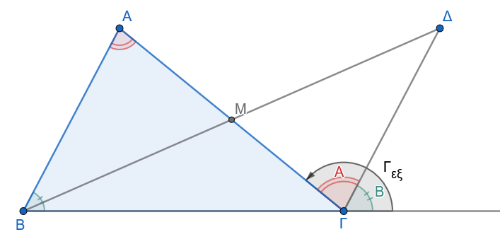{fig-align="center" width="450"}
::::

:::: {.math-box .apodeixi-box}
::: {.math-title .apodeixi-title}
- **Υπόθεση:** Έστω τρίγωνο $AB\Gamma$ και η εξωτερική γωνία $\widehat{\Gamma_{\varepsilon\xi}}$ που είναι παραπληρωματική της εσωτερικής γωνίας $\widehat{\Gamma}$ (δηλαδή της $A\Gamma B$).

- **Συμπέρασμα:** $\widehat{\Gamma_{\varepsilon\xi}} > \widehat{A}$ και $\widehat{\Gamma_{\varepsilon\xi}} > \widehat{B}$.
:::

**Απόδειξη:**

Έστω $M$ το μέσο της πλευράς $A\Gamma$ ($AM = M\Gamma$).
Προεκτείνουμε τη διάμεσο $BM$ κατά ίσο τμήμα $M\Delta = BM$ και φέρουμε το ευθύγραμμο τμήμα $\Gamma\Delta$.

Συγκρίνουμε τα τρίγωνα $\triangle ABM$ και $\triangle M\Gamma\Delta$:

1.  $AM = M\Gamma$ (από κατασκευή του μέσου).
2.  $BM = M\Delta$ (από κατασκευή της προέκτασης).
3.  $\widehat{AMB} = \widehat{\Delta M\Gamma}$ ως κατακορυφήν γωνίες.

Από το **1ο Κριτήριο Ισότητας Τριγώνων (ΠΓΠ)**, τα τρίγωνα είναι ίσα.
Επομένως, οι αντίστοιχες γωνίες τους είναι ίσες, δηλαδή: $$\widehat{M\Gamma\Delta} = \widehat{BAM} = \widehat{A}$$

Η ημιευθεία $\Gamma\Delta$ είναι εσωτερική της εξωτερικής γωνίας $\widehat{\Gamma_{\varepsilon\xi}}$, συνεπώς η γωνία $\widehat{M\Gamma\Delta}$ αποτελεί μέρος της εξωτερικής γωνίας: $$\widehat{\Gamma_{\varepsilon\xi}} > \widehat{M\Gamma\Delta} \implies \widehat{\Gamma_{\varepsilon\xi}} > \widehat{A}$$

Με τον ίδιο ακριβώς τρόπο, αν πάρουμε το μέσο της πλευράς $B\Gamma$, αποδεικνύεται ότι $\widehat{\Gamma_{\varepsilon\xi}} > \widehat{B}$.

> > *Επίσης (β τρόπος) το ΑΒΓΔ είναι παραλληλόγραμμο επειδή οι διαγώνιοι του ΒΔ και ΑΓ διχοτομούνται και επομένως οι γωνίες* $\hatΑ$ *και* $\hatΒ$ *μεταφέρονται στο Γ όπως δείχνει το σχήμα λόγω παράλληλων και τεμνουσών.*
::::

------------------------------------------------------------------------

:::: {.math-box .corollary-box}
::: {.math-title .corollary-title}
- **Πόρισμα (α):**
:::

Κάθε τρίγωνο έχει το πολύ μία ορθή ή αμβλεία γωνία.
::::

:::: {.math-box .corollaryproof-box}
::: {.math-title .corollaryproof-title}
- *Απόδειξη:*
:::

Έστω ότι ένα τρίγωνο $AB\Gamma$ έχει δύο ορθές γωνίες, τις $\widehat{A} = 90^\circ$ και $\widehat{B} = 90^\circ$.
Τότε, η εξωτερική γωνία $\widehat{A_{\varepsilon\xi}}$ θα είναι $\widehat{A_{\varepsilon\xi}} = 180^\circ - \widehat{A} = 90^\circ$.
Από το θεώρημα της εξωτερικής γωνίας, πρέπει $\widehat{A_{\varepsilon\xi}} > \widehat{B} \implies 90^\circ > 90^\circ$, που είναι άτοπο.
::::

:::: {.math-box .corollary-box}
::: {.math-title .corollary-title}
- **Πόρισμα (β):**
:::

Το άθροισμα δύο γωνιών κάθε τριγώνου είναι πάντα μικρότερο των $180^\circ$.
::::

:::: {.math-box .corollaryproof-box}
::: {.math-title .corollaryproof-title}
- *Απόδειξη:*
:::

Σε κάθε τρίγωνο $AB\Gamma$, η εξωτερική γωνία $\widehat{\Gamma_{\varepsilon\xi}}$ και η εσωτερική $\widehat{\Gamma}$ είναι παραπληρωματικές, δηλαδή $\widehat{\Gamma_{\varepsilon\xi}} + \widehat{\Gamma} = 180^\circ$.

Επειδή $\widehat{\Gamma_{\varepsilon\xi}} > \widehat{A}$, προσθέτοντας $\widehat{\Gamma}$ και στα δύο μέλη της ανισότητας προκύπτει: $$\widehat{\Gamma_{\varepsilon\xi}} + \widehat{\Gamma} > \widehat{A} + \widehat{\Gamma} \implies 180^\circ > \widehat{A} + \widehat{\Gamma}$$
::::

------------------------------------------------------------------------

#### Εφαρμογές - Παραδείγματα

:::: {.math-box .example-box}
::: {.math-title .example-title}
**Παράδειγμα 1**
:::

**Αν σε τρίγωνο** $AB\Gamma$ η εξωτερική γωνία $\widehat{A_{\varepsilon\xi}}$ είναι οξεία, να αποδειχθεί ότι οι εσωτερικές γωνίες $\widehat{B}$ και $\widehat{\Gamma}$ είναι οξείες.
::::

:::: {.math-box .examplesolution-box}
::: {.math-title .examplesolution-title}
**Λύση:**
:::

Από το θεώρημα της εξωτερικής γωνίας, ισχύει ότι η εξωτερική γωνία είναι πάντα μεγαλύτερη από καθεμία από τις απέναντι εσωτερικές: $$\widehat{A_{\varepsilon\xi}} > \widehat{B} \quad \text{και} \quad \widehat{A_{\varepsilon\xi}} > \widehat{\Gamma}$$

Εφόσον η εξωτερική γωνία $\widehat{A_{\varepsilon\xi}}$ είναι οξεία, ισχύει εξ ορισμού $\widehat{A_{\varepsilon\xi}} < 90^\circ$.
Συνδυάζοντας τις ανισότητες λαμβάνουμε: $$\widehat{B} < \widehat{A_{\varepsilon\xi}} < 90^\circ \implies \widehat{B} < 90^\circ$$ $$\widehat{\Gamma} < \widehat{A_{\varepsilon\xi}} < 90^\circ \implies \widehat{\Gamma} < 90^\circ$$

Συνεπώς, οι εσωτερικές γωνίες $\widehat{B}$ και $\widehat{\Gamma}$ είναι οξείες.
::::

:::: {.math-box .example-box}
::: {.math-title .example-title}
**Παράδειγμα 2**
:::

Αν σε ένα τρίγωνο ΑΒΓ, $\Delta$ είναι σημείο της ημιευθείας $BA$ πέραν του $A$ (προέκταση της πλευράς $BA$), να αποδειχθεί ότι $\widehat{\Delta A\Gamma} > \widehat{B}$.
::::

:::: {.math-box .examplesolution-box}
::: {.math-title .examplesolution-title}
**Λύση:**
:::

> > Σχεδιάστε ένα σχήμα

Παρατηρούμε ότι το σημείο $A$ βρίσκεται μεταξύ των $\Delta$ και $B$, συνεπώς η γωνία $\widehat{\Delta A\Gamma}$ είναι η εξωτερική γωνία της κορυφής $A$ στο τρίγωνο $AB\Gamma$.

Σύμφωνα με το θεώρημα της εξωτερικής γωνίας, η εξωτερική γωνία $\widehat{\Delta A\Gamma}$ είναι μεγαλύτερη από την απέναντι εσωτερική γωνία $\widehat{B}$, δηλαδή ισχύει άμεσα $\widehat{\Delta A\Gamma} > \widehat{B}$.
::::

**Παράδειγμα 3**

Σε τρίγωνο ABΓ, αν για τις εξωτερικές γωνίες $\hat{B}_1$ και $\hat{\Gamma}_1$ ισχύει $\hat{B}_1 > \hat{\Gamma}_1$, να αποδειχθεί ότι $\hat{B}_1 > 90^\circ$.

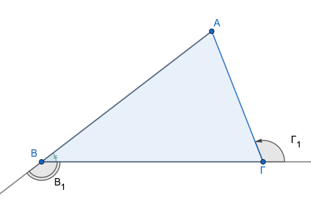{fig-align="center" width="450"}

**Λύση:**

Γνωρίζουμε ότι $\hat{B}_1 + \hat{B} = 180^\circ και \hat{\Gamma}_1 + \hat{\Gamma} = 180^\circ$.
Επειδή $\hat{B}_1 > \hat{\Gamma}_1$, έπεται ότι $\hat{B} < \hat{\Gamma}$.

Ωστόσο, η εξωτερική γωνία $\hat{B}_1$ είναι μεγαλύτερη από την απέναντι εσωτερική $\hat{\Gamma} (\hat{B}_1 > \hat{\Gamma})$.

Αν υποθέσουμε ότι $\hat{B}_1 \leq 90^\circ$, τότε $\hat{\Gamma} < 90^\circ$ και $\hat{B} \geq 90^\circ$, κάτι που οδηγεί σε άτοπο βάσει της σχέσης των εξωτερικών γωνιών.

::: callout-important
Αυτό δεν σημαίνει ότι αν η $\hatΒ_1 <\hatΓ_1$ η $\hatΒ_1$ δεν θα είναι αμβλεία

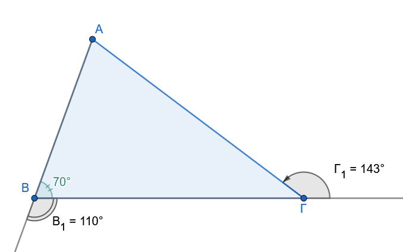{fig-align="center" width="350"}

Η $\hatΒ_1$ γίνεται ορθή όταν και η $\hatΒ$ γίνει ορθή

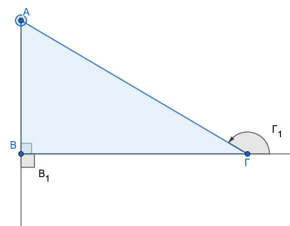{fig-align="center" width="300"}

Η $\hatΒ_1$ γίνεται οξεία όταν η $\hatΒ$ γίνει αμβλεία.
Δείτε τα σχήματα\

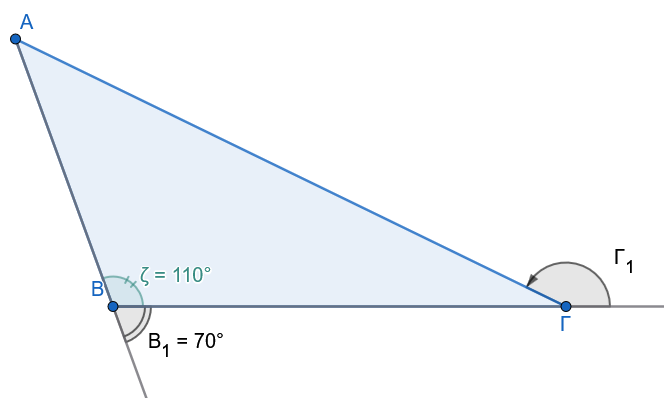{fig-align="center" width="300"}
:::

------------------------------------------------------------------------

#### Ασκήσεις προς Επίλυση

**Άσκηση 1**

**Εκφώνηση:** Αν η εξωτερική γωνία της κορυφής $A$ ενός τριγώνου $AB\Gamma$ είναι $144^\circ$, να αποδείξετε ότι το τρίγωνο δεν μπορεί να είναι ισόπλευρο.

**Λύση:**

Έστω ότι το τρίγωνο $AB\Gamma$ είναι ισόπλευρο.
Τότε, όλες οι εσωτερικές του γωνίες είναι ίσες με $60^\circ$, άρα $\widehat{A} = 60^\circ$.

Η εξωτερική γωνία της κορυφής $A$ είναι παραπληρωματική της εσωτερικής $\widehat{A}$, οπότε: $$\widehat{A_{\varepsilon\xi}} = 180^\circ - \widehat{A} = 180^\circ - 60^\circ = 120^\circ$$

Αυτό έρχεται σε αντίθεση με τα δεδομένα της άσκησης, σύμφωνα με τα οποία η εξωτερική γωνία είναι $144^\circ$.
Επειδή $144^\circ \neq 120^\circ$, το τρίγωνο **δεν μπορεί να είναι ισόπλευρο**.

**Άσκηση 2**

**Εκφώνηση:** Σε κυρτό τετράπλευρο $AB\Gamma\Delta$, οι διχοτόμοι των γωνιών $\widehat{A}$ και $\widehat{B}$ τέμνονται στο σημείο $P$.
Να αποδείξετε ότι η γωνία $\widehat{APB}$ είναι μικρότερη από το άθροισμα των γωνιών $\widehat{\Gamma}$ και $\widehat{\Delta}$.

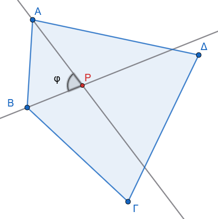{fig-align="center" width="350"}

**Λύση:**

Στο τρίγωνο $APB$, το άθροισμα των εσωτερικών γωνιών είναι: $$\widehat{APB} + \frac{\widehat{A}}{2} + \frac{\widehat{B}}{2} = 180^\circ \implies \widehat{APB} = 180^\circ - \frac{\widehat{A} + \widehat{B}}{2} \quad (1)$$

Στο κυρτό τετράπλευρο $AB\Gamma\Delta$, το άθροισμα των εσωτερικών γωνιών είναι $360^\circ$: $$\widehat{A} + \widehat{B} + \widehat{\Gamma} + \widehat{\Delta} = 360^\circ \implies \widehat{A} + \widehat{B} = 360^\circ - (\widehat{\Gamma} + \widehat{\Delta}) \quad (2)$$

Αντικαθιστούμε τη σχέση (2) στην (1): $$\widehat{APB} = 180^\circ - \frac{360^\circ - (\widehat{\Gamma} + \widehat{\Delta})}{2} = 180^\circ - 180^\circ + \frac{\widehat{\Gamma} + \widehat{\Delta}}{2} = \frac{\widehat{\Gamma} + \widehat{\Delta}}{2}$$

Επειδή οι γωνίες $\widehat{\Gamma}$ και $\widehat{\Delta}$ είναι γωνίες κυρτού τετραπλεύρου (άρα θετικές), ισχύει προφανώς: $$\frac{\widehat{\Gamma} + \widehat{\Delta}}{2} < \widehat{\Gamma} + \widehat{\Delta} \implies \widehat{APB} < \widehat{\Gamma} + \widehat{\Delta}$$

:::: {.math-box .exercise-box}
::: {.math-title .exercise-title}
**Άσκηση 3**
:::

**Εκφώνηση:** Δίνεται τρίγωνο $AB\Gamma$ και $O$ τυχαίο εσωτερικό του σημείο.

Να αποδείξετε ότι $\widehat{BOΓ} > \widehat{BAΓ}$.

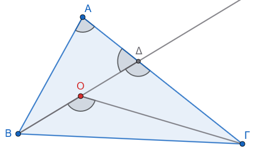{fig-align="center" width="350"}
::::

:::: {.math-box .solution-box}
::: {.math-title .solution-title}
**Λύση:**
:::

Προεκτείνουμε το ευθύγραμμο τμήμα $BO$ μέχρι να τέμνει την πλευρά $A\Gamma$ στο σημείο $\Delta$.

1.  Στο τρίγωνο $O\Delta\Gamma$, η γωνία $\widehat{BOΓ}$ είναι εξωτερική της εσωτερικής γωνίας $\widehat{O\Delta\Gamma}$, άρα: $$\widehat{BOΓ} > \widehat{O\Delta\Gamma} \quad (1)$$

2.  Στο τρίγωνο $AB\Delta$, η γωνία $\widehat{O\Delta\Gamma}$ (που συμπίπτει με την $Γ\Delta B$) είναι εξωτερική της εσωτερικής γωνίας $\widehat{BAΔ} = \widehat{BAΓ}$, άρα: $$\widehat{O\Delta\Gamma} > \widehat{BAΓ} \quad (2)$$

Από τις ανισότητες (1) και (2) προκύπτει άμεσα ότι $\widehat{BOΓ} > \widehat{BAΓ}$.
::::

**Άσκηση 4**

**Εκφώνηση:** Σε τρίγωνο $AB\Gamma$, φέρουμε τη διχοτόμο $A\Delta$.
Να αποδειχθεί ότι $\widehat{A\Delta B} > \widehat{\Gamma}$ και $\widehat{A\Delta\Gamma} > \widehat{B}$.

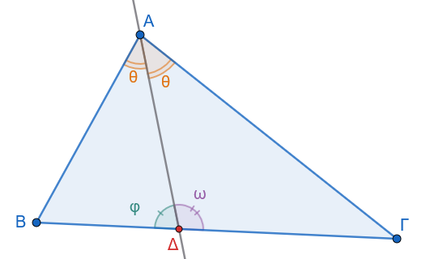{fig-align="center" width="350"}

**Λύση:**

1.  Στο τρίγωνο $A\Delta\Gamma$, η γωνία $\widehat{A\Delta B}$ είναι εξωτερική γωνία που αντιστοιχεί στην κορυφή $\Delta$.
    Σύμφωνα με το θεώρημα της εξωτερικής γωνίας, ισχύει: $$\widehat{A\Delta B} > \widehat{\Gamma}$$

2.  Στο τρίγωνο $AB\Delta$, η γωνία $\widehat{A\Delta\Gamma}$ είναι εξωτερική γωνία που αντιστοιχεί στην κορυφή $\Delta$.
    Σύμφωνα με το θεώρημα της εξωτερικής γωνίας, ισχύει: $$\widehat{A\Delta\Gamma} > \widehat{B}$$

**Άσκηση 5**

**Εκφώνηση:** Έστω τρίγωνο $AB\Gamma$ και οι εξωτερικές γωνίες $\widehat{A_{\varepsilon\xi}}$, $\widehat{B_{\varepsilon\xi}}$, $\widehat{\Gamma_{\varepsilon\xi}}$.
Να αποδείξετε ότι το άθροισμά τους είναι $360^\circ$ (χρησιμοποιώντας τη σχέση εσωτερικής και εξωτερικής γωνίας).

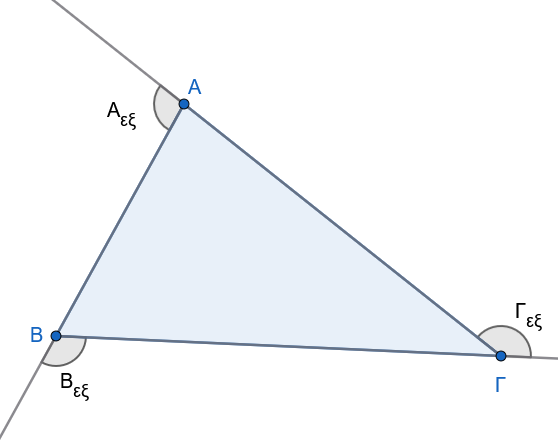{fig-align="center" width="350"}

**Λύση:**

Κάθε εσωτερική γωνία είναι παραπληρωματική της αντίστοιχης εξωτερικής της γωνίας: $$\widehat{A} + \widehat{A_{\varepsilon\xi}} = 180^\circ \quad (1)$$ $$\widehat{B} + \widehat{B_{\varepsilon\xi}} = 180^\circ \quad (2)$$ $$\widehat{\Gamma} + \widehat{\Gamma_{\varepsilon\xi}} = 180^\circ \quad (3)$$

Προσθέτουμε κατά μέλη τις τρεις αυτές σχέσεις: $$\widehat{A} + \widehat{B} + \widehat{\Gamma} + \widehat{A_{\varepsilon\xi}} + \widehat{B_{\varepsilon\xi}} + \widehat{\Gamma_{\varepsilon\xi}} = 540^\circ$$

Επειδή το άθροισμα των εσωτερικών γωνιών κάθε τριγώνου είναι $\widehat{A} + \widehat{B} + \widehat{\Gamma} = 180^\circ$, αντικαθιστούμε στην παραπάνω σχέση: $$180^\circ + \widehat{A_{\varepsilon\xi}} + \widehat{B_{\varepsilon\xi}} + \widehat{\Gamma_{\varepsilon\xi}} = 540^\circ \implies \widehat{A_{\varepsilon\xi}} + \widehat{B_{\varepsilon\xi}} + \widehat{\Gamma_{\varepsilon\xi}} = 360^\circ$$

**Άσκηση 6:**

Αποδείξτε ότι η γωνία που σχηματίζουν οι διχοτόμοι δύο εσωτερικών γωνιών τριγώνου είναι πάντοτε αμβλεία.

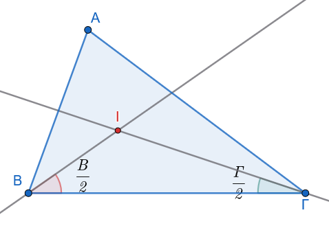{fig-align="center" width="400"}

**Απόδειξη:**

Έστω I το σημείο τομής των διχοτόμων των $\hat{B}$, $\hat{\Gamma}$.
Στο τρίγωνο BIΓ, η γωνία $B\hat{I}\Gamma = 180^\circ - \dfrac{\hat{B}+\hat{\Gamma}}{2}$.

Επειδή $\hat{B}+\hat{\Gamma} < 180^\circ$, έπεται ότι $\dfrac{\hat{B}+\hat{\Gamma}}{2} < 90^\circ$, άρα $B\hat{I}\Gamma > 90^\circ$.

------------------------------------------------------------------------

### ΕΝΟΤΗΤΑ 2: ΑΝΙΣΟΤΙΚΕΣ ΣΧΕΣΕΙΣ ΠΛΕΥΡΩΝ ΚΑΙ ΓΩΝΙΩΝ

:::: {.math-box .theorem-box}
::: {.math-title .theorem-title}
**1. Θεώρημα Σχέσης Πλευρών - Γωνιών**
:::

Σε κάθε τρίγωνο, απέναντι από μεγαλύτερη πλευρά βρίσκεται μεγαλύτερη γωνία, και αντίστροφα.
::::

:::: {.math-box .apodeixi-box}
::: {.math-title .apodeixi-title}
**Ευθύ Θεώρημα**

- **Υπόθεση:** Έστω τρίγωνο $AB\Gamma$ με $A\Gamma > AB$.

- **Συμπέρασμα:** $\widehat{B} > \widehat{\Gamma}$.
:::

**Απόδειξη:**

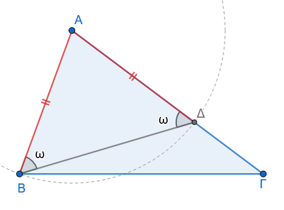{fig-align="center" width="400"}

Εφόσον $A\Gamma > AB$, μπορούμε να λάβουμε πάνω στην πλευρά $A\Gamma$ σημείο $\Delta$ τέτοιο ώστε $A\Delta = AB$.
Φέρουμε το ευθύγραμμο τμήμα $B\Delta$.

Το τρίγωνο $AB\Delta$ είναι ισοσκελές από κατασκευή ($AB = A\Delta$), οπότε οι προσκείμενες στη βάση γωνίες του είναι ίσες: $$\widehat{AB\Delta} = \widehat{A\Delta B} \quad (1)$$

Η ημιευθεία $B\Delta$ είναι εσωτερική της γωνίας $\widehat{B}$, άρα ισχύει: $$\widehat{B} > \widehat{AB\Delta} \quad (2)$$

Στο τρίγωνο $B\Delta\Gamma$, η γωνία $\widehat{A\Delta B}$ είναι εξωτερική της εσωτερικής γωνίας $\widehat{\Gamma}$, οπότε ισχύει: $$\widehat{A\Delta B} > \widehat{\Gamma} \quad (3)$$ Συνδυάζοντας τις σχέσεις (1), (2) και (3), έχουμε: $$\widehat{B} > \widehat{AB\Delta} = \widehat{A\Delta B} > \widehat{\Gamma} \implies \widehat{B} > \widehat{\Gamma}$$
::::

:::: {.math-box .apodeixi-box}
::: {.math-title .apodeixi-title}
**Αντίστροφο Θεώρημα**

- **Υπόθεση:** Έστω τρίγωνο $AB\Gamma$ με $\widehat{B} > \widehat{\Gamma}$.

- **Συμπέρασμα:** $A\Gamma > AB$.
:::

**Απόδειξη:**

Έστω ότι δεν ισχύει $A\Gamma > AB$.
Τότε θα έπρεπε είτε $A\Gamma = AB$ είτε $A\Gamma < AB$:

1.  Αν $A\Gamma = AB$, τότε το τρίγωνο $AB\Gamma$ θα ήταν ισοσκελές, οπότε $\widehat{B} = \widehat{\Gamma}$, πράγμα άτοπο λόγω της υπόθεσης $\widehat{B} > \widehat{\Gamma}$.

2.  Αν $A\Gamma < AB$, τότε σύμφωνα με το ευθύ θεώρημα, απέναντι από τη μικρότερη πλευρά θα έπρεπε να βρίσκεται η μικρότερη γωνία, δηλαδή $\widehat{B} < \widehat{\Gamma}$, πράγμα επίσης άτοπο.

Συνεπώς, ισχύει υποχρεωτικά $A\Gamma > AB$.
::::

------------------------------------------------------------------------

:::: {.math-box .corollary-box}
::: {.math-title .corollary-title}
- **Πόρισμα (α):**
:::

Αν δύο γωνίες ενός τριγώνου είναι ίσες, τότε και οι απέναντι πλευρές είναι ίσες (ισοσκελές τρίγωνο), και αντίστροφα.
::::

:::: {.math-box .corollary-box}
::: {.math-title .corollary-title}
- **Πόρισμα (β):**
:::

Σε κάθε ορθογώνιο τρίγωνο η υποτείνουσα είναι μεγαλύτερη από κάθε κάθετη πλευρά.
::::

:::: {.math-box .corollaryproof-box}
::: {.math-title .corollaryproof-title}
- *Απόδειξη:*
:::

Έστω ορθογώνιο τρίγωνο $AB\Gamma$ ($\widehat{A} = 90^\circ$).

Επειδή η $\widehat{A}$ είναι η μεγαλύτερη γωνία του τριγώνου (αφού οι άλλες δύο είναι οξείες), η πλευρά που βρίσκεται απέναντί της (η υποτείνουσα $B\Gamma$) θα είναι μεγαλύτερη από τις κάθετες πλευρές $AB$ και $A\Gamma$.
::::

------------------------------------------------------------------------

#### Εφαρμογές - Παραδείγματα

:::: {.math-box .example-box}
::: {.math-title .example-title}
**Παράδειγμα 1**
:::

Σε τρίγωνο $AB\Gamma$ ισχύει $AB < A\Gamma$.
Αν $AM$ είναι η διάμεσος, να αποδειχθεί ότι η γωνία $\widehat{AM\Gamma}$ είναι αμβλεία.

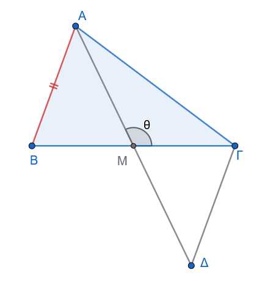{fig-align="center" width="350"}
::::

:::: {.math-box .examplesolution-box}
::: {.math-title .examplesolution-title}
**Λύση:**
:::

Προεκτείνουμε τη διάμεσο $AM$ κατά ίσο τμήμα $M\Delta = AM$ και φέρουμε το τμήμα $\Gamma\Delta$.

Συγκρίνουμε τα τρίγωνα $\triangle ABM$ και $\triangle M\Gamma\Delta$:

1.  $AM = M\Delta$ (από κατασκευή).

2.  $BM = M\Gamma$ (εφόσον η $AM$ είναι διάμεσος).

3.  $\widehat{AMB} = \widehat{\Delta M\Gamma}$ ως κατακορυφήν.

Τα τρίγωνα είναι ίσα (ΠΓΠ), άρα $\Gamma\Delta = AB$.

Στο τρίγωνο $A\Gamma\Delta$, συγκρίνουμε τις πλευρές $A\Gamma$ και $\Gamma\Delta$.
Επειδή $AB < A\Gamma$ (από υπόθεση) και $\Gamma\Delta = AB$, προκύπτει ότι $\Gamma\Delta < A\Gamma$.

Στο τρίγωνο $A\Gamma\Delta$, απέναντι από τη μεγαλύτερη πλευρά βρίσκεται η μεγαλύτερη γωνία, άρα: $$\widehat{A\Delta\Gamma} > \widehat{\Delta A\Gamma}$$ Λόγω της ισότητας των τριγώνων $\triangle ABM = \triangle M\Gamma\Delta$, ισχύει $\widehat{A\Delta\Gamma} = \widehat{BAM}$.
Επομένως: $$\widehat{BAM} > \widehat{MA\Gamma}$$

Συγκρίνουμε τώρα τα τρίγωνα $ABM$ και $A\Gamma M$.
Έχουν $BM = M\Gamma$, $AM$ κοινή και $AB < A\Gamma$.
Από το θεώρημα των άνισων περιεχόμενων γωνιών, η μεγαλύτερη πλευρά $A\Gamma$ βρίσκεται απέναντι από τη μεγαλύτερη περιεχόμενη γωνία: $$\widehat{AM\Gamma} > \widehat{AMB}$$ Οι γωνίες $\widehat{AM\Gamma}$ και $\widehat{AMB}$ είναι εφεξής και παραπληρωματικές ($\widehat{AM\Gamma} + \widehat{AMB} = 180^\circ$).
Εφόσον $\widehat{AM\Gamma} > \widehat{AMB}$, συμπεραίνουμε ότι $\widehat{AM\Gamma} > 90^\circ$, άρα η γωνία είναι αμβλεία.
::::

:::: {.math-box .example-box}
::: {.math-title .example-title}
**Παράδειγμα 2**
:::

**Να αποδειχθεί ότι η διάμεσος** $AM$ ενός τριγώνου $AB\Gamma$ με $AB < A\Gamma$ σχηματίζει μεγαλύτερη γωνία με τη μικρότερη πλευρά $AB$.

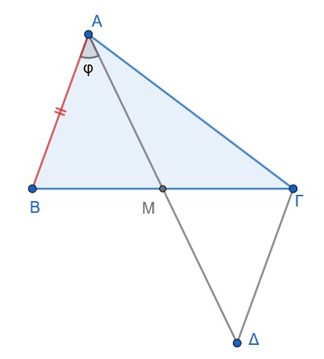{fig-align="center" width="350"}
::::

:::: {.math-box .examplesolution-box}
::: {.math-title .examplesolution-title}
**Λύση:**
:::

Ζητείται να αποδειχθεί ότι $\widehat{BAM} > \widehat{MA\Gamma}$.

Χρησιμοποιώντας την ίδια κατασκευή με το *Παράδειγμα 1* (προέκταση της $AM$ κατά $M\Delta = AM$ και σύνδεση $\Gamma\Delta$), προκύπτει η ισότητα των τριγώνων $\triangle ABM \cong \triangle \Delta\Gamma M$, από την οποία έχουμε $\Gamma\Delta = AB$ και $\widehat{BAM} = \widehat{A\Delta\Gamma}$.

Στο τρίγωνο $A\Gamma\Delta$, επειδή $A\Gamma > AB$ και $\Gamma\Delta = AB$, ισχύει: $$A\Gamma > \Gamma\Delta$$ Απέναντι από τη μεγαλύτερη πλευρά $A\Gamma$ βρίσκεται η μεγαλύτερη γωνία, συνεπώς στο τρίγωνο $A\Gamma\Delta$ έχουμε: $$\widehat{A\Delta\Gamma} > \widehat{\Delta A\Gamma}$$

Εφόσον $\widehat{BAM} = \widehat{A\Delta\Gamma}$ και $\widehat{MA\Gamma} = \widehat{\Delta A\Gamma}$, αντικαθιστούμε και λαμβάνουμε άμεσα: $$\widehat{BAM} > \widehat{MA\Gamma}$$
::::

------------------------------------------------------------------------

#### Ασκήσεις προς Επίλυση

:::: {.math-box .exercise-box}
::: {.math-title .exercise-title}
**Άσκηση 7**
:::

**Εκφώνηση:** Σε τρίγωνο $AB\Gamma$ με $AB < A\Gamma$, φέρουμε τη διχοτόμο $A\Delta$.
Να αποδείξετε ότι $B\Delta < \Delta\Gamma$.

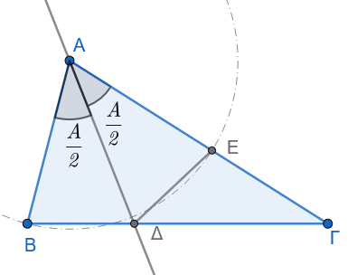{fig-align="center" width="350"}
::::

:::: {.math-box .solution-box}
::: {.math-title .solution-title}
**Λύση:**
:::

Στο τρίγωνο $AB\Gamma$, επειδή $AB < A\Gamma$, ισχύει $\widehat{B} > \widehat{\Gamma}$.

Στο πλευρικό τρίγωνο $AB\Delta$, η εξωτερική γωνία $\widehat{A\Delta\Gamma}$ ισούται με: $$\widehat{A\Delta\Gamma} = \widehat{B} + \frac{\widehat{A}}{2}$$

Στο τρίγωνο $A\Gamma\Delta$, η εξωτερική γωνία $\widehat{A\Delta B}$ ισούται με: $$\widehat{A\Delta B} = \widehat{\Gamma} + \frac{\widehat{A}}{2}$$

Επειδή $\widehat{B} > \widehat{\Gamma}$, συμπεραίνουμε ότι $\widehat{A\Delta\Gamma} > \widehat{A\Delta B}$.
Θεωρούμε σημείο $E$ πάνω στην $A\Gamma$ τέτοιο ώστε $AE = AB$.
Εφόσον $AB < A\Gamma$, το $E$ είναι εσωτερικό σημείο της πλευράς $A\Gamma$.

Τα τρίγωνα $\triangle AB\Delta$ και $\triangle AE\Delta$ είναι ίσα (ΠΓΠ: $AB = AE$, $A\Delta$ κοινή, $\widehat{BA\Delta} = \widehat{\Delta AE} = \frac{\widehat{A}}{2}$).

Συνεπώς, $B\Delta = \Delta E$.

Στο τρίγωνο $\Delta E\Gamma$, η γωνία $\widehat{\Delta E A}$ είναι εξωτερική, άρα: $$\widehat{\Delta E A} = \widehat{E\Delta\Gamma} + \widehat{\Gamma}$$

Επειδή $\widehat{\Delta E A} = \widehat{B}$ (λόγω της ισότητας των τριγώνων $\triangle AB\Delta \cong \triangle AE\Delta$), έχουμε: $$\widehat{B} = \widehat{E\Delta\Gamma} + \widehat{\Gamma} \implies \widehat{B} > \widehat{\Gamma}$$

Στο τρίγωνο $\Delta E\Gamma$, συγκρίνουμε τις γωνίες $\widehat{\Delta E\Gamma}$ και $\widehat{\Gamma}$.

Η γωνία $\widehat{\Delta E\Gamma} = 180^\circ - \widehat{AE\Delta} = 180^\circ - \widehat{B}$.

Επειδή $\widehat{B} + \widehat{\Gamma} < 180^\circ \implies 180^\circ - \widehat{B} > \widehat{\Gamma}$.

Συνεπώς, στο τρίγωνο $\Delta E\Gamma$ ισχύει $\widehat{\Delta E\Gamma} > \widehat{\Gamma}$.

Απέναντι από τη μεγαλύτερη γωνία βρίσκεται η μεγαλύτερη πλευρά, άρα $\Delta\Gamma > \Delta E$.

Επειδή $\Delta E = B\Delta$, προκύπτει ότι $B\Delta < \Delta\Gamma$.
::::

**Άσκηση 8**

**Εκφώνηση:** Για κάθε σημείο $P$ της διαμέσου $AM$ ενός τριγώνου $AB\Gamma$ με $AB < A\Gamma$, να αποδείξετε ότι $PB < P\Gamma$.

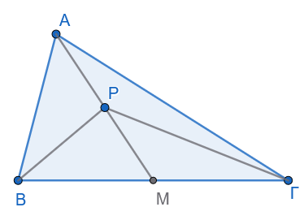{fig-align="center" width="350"}

**Λύση:**

Από το *Παράδειγμα 1*, εφόσον $AB < A\Gamma$, η γωνία $\widehat{AM\Gamma}$ είναι αμβλεία, άρα η παραπληρωματική της $\widehat{AMB}$ είναι οξεία: $$\widehat{AM\Gamma} > 90^\circ \quad \text{και} \quad \widehat{AMB} < 90^\circ \implies \widehat{AM\Gamma} > \widehat{AMB}$$

Συγκρίνουμε τα τρίγωνα $PBM$ και $P\Gamma M$:

1.  $BM = M\Gamma$ (διότι η $AM$ είναι διάμεσος).

2.  $PM$ κοινή πλευρά.

3.  $\widehat{PM\Gamma} = \widehat{AM\Gamma} > \widehat{AMB} = \widehat{PMB}$.

Από το θεώρημα των δύο τριγώνων με δύο πλευρές ίσες και άνισες περιεχόμενες γωνίες (Hinge Theorem), η πλευρά απέναντι από τη μεγαλύτερη γωνία είναι μεγαλύτερη.

Συνεπώς, $PB < P\Gamma$.

:::: {.math-box .exercise-box}
::: {.math-title .exercise-title}
**Άσκηση 9**
:::

**Εκφώνηση:** Σε ορθογώνιο τρίγωνο $AB\Gamma$ ($\widehat{A} = 90^\circ$), θεωρούμε σημείο $\Delta$ στην πλευρά $A\Gamma$.
Να αποδειχθεί ότι $B\Delta < B\Gamma$.

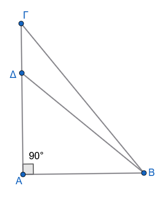{fig-align="center" width="250"}
::::

:::: {.math-box .solution-box}
::: {.math-title .solution-title}
**Λύση:**
:::

Στο ορθογώνιο τρίγωνο $AB\Delta$ ($\widehat{A} = 90^\circ$), η γωνία $\widehat{A\Delta B}$ είναι οξεία (αφού η $\widehat{A}$ είναι η ορθή γωνία του τριγώνου).

Οι γωνίες $\widehat{A\Delta B}$ και $\widehat{B\Delta\Gamma}$ είναι εφεξής και παραπληρωματικές, οπότε: $$\widehat{B\Delta\Gamma} = 180^\circ - \widehat{A\Delta B}$$

Επειδή $\widehat{A\Delta B} < 90^\circ$, προκύπτει ότι η γωνία $\widehat{B\Delta\Gamma}$ είναι αμβλεία ($\widehat{B\Delta\Gamma} > 90^\circ$).

Στο τρίγωνο $B\Delta\Gamma$, εφόσον η γωνία $\widehat{B\Delta\Gamma}$ είναι αμβλεία, είναι υποχρεωτικά η μεγαλύτερη γωνία του τριγώνου.

Απέναντι από τη μεγαλύτερη γωνία βρίσκεται η μεγαλύτερη πλευρά του τριγώνου, που είναι η $B\Gamma$.
Συνεπώς, ισχύει $B\Delta < B\Gamma$.
::::

**Άσκηση 10**

**Εκφώνηση:** Δίνεται τρίγωνο $AB\Gamma$ με ύψος $A\Delta$.
Αν $AB < A\Gamma$, να αποδείξετε ότι $B\Delta < \Delta\Gamma$.

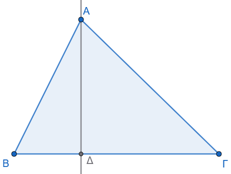{fig-align="center" width="350"}

**Λύση:**

Στα ορθογώνια τρίγωνα $AB\Delta$ και $A\Delta\Gamma$ (ορθογώνια στο $\Delta$), εφαρμόζουμε το Πυθαγόρειο Θεώρημα: $$AB^2 = AΔ^2 + B\Delta^2 \quad (1)$$ $$A\Gamma^2 = AΔ^2 + \Delta\Gamma^2 \quad (2)$$

Επειδή $AB < A\Gamma \implies AB^2 < A\Gamma^2$.
Αντικαθιστούμε τις σχέσεις (1) και (2): $$AΔ^2 + B\Delta^2 < AΔ^2 + \Delta\Gamma^2 \implies B\Delta^2 < \Delta\Gamma^2 \implies B\Delta < \Delta\Gamma$$

**Άσκηση 11**

**Εκφώνηση:** Σε τρίγωνο $AB\Gamma$ με $AB < A\Gamma$, να αποδείξετε ότι $\widehat{A} + \widehat{B} > 2\widehat{\Gamma}$.

> > Σχεδιάστε το σχήμα

**Λύση:**

Επειδή $AB < A\Gamma$, από τη βασική σχέση πλευρών-γωνιών προκύπτει ότι: $$\widehat{B} > \widehat{\Gamma} \quad (1)$$

Προσθέτουμε τη γωνία $\widehat{A}$ και στα δύο μέλη της ανισότητας (1): $$\widehat{A} + \widehat{B} > \widehat{A} + \widehat{\Gamma} \quad (2)$$

Επίσης, επειδή $\widehat{A} > 0$ (γωνία τριγώνου), προσθέτοντας τη θετική γωνία $\widehat{A}$ στη σχέση $\widehat{B} > \widehat{\Gamma}$ έχουμε: $$\widehat{A} + \widehat{B} > \widehat{\Gamma} + \widehat{\Gamma} = 2\widehat{\Gamma} \implies \widehat{A} + \widehat{B} > 2\widehat{\Gamma}$$

------------------------------------------------------------------------

### ΕΝΟΤΗΤΑ 3: ΤΡΙΓΩΝΙΚΗ ΑΝΙΣΟΤΗΤΑ

:::: {.math-box .theorem-box}
::: {.math-title .theorem-title}
**Θεώρημα Τριγωνικής Ανισότητας**
:::

Κάθε πλευρά τριγώνου είναι μικρότερη από το άθροισμα των άλλων δύο και μεγαλύτερη από τη διαφορά τους.

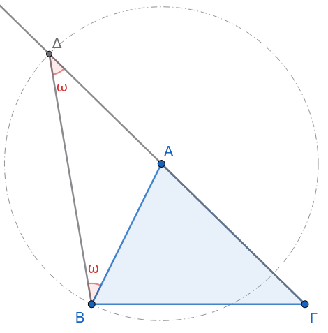{fig-align="center" width="350"}
::::

:::: {.math-box .apodeixi-box}
::: {.math-title .apodeixi-title}
- **Υπόθεση:** Έστω τρίγωνο $AB\Gamma$ με πλευρές $a, b, c$.

- **Συμπέρασμα:** $a < b + c$ και $a > |b - c|$.
:::

**Απόδειξη:**

Προεκτείνουμε την πλευρά $A\Gamma$ (μήκους $b$) προς το μέρος του $A$ κατά τμήμα $A\Delta = AB = c$.
Φέρουμε το ευθύγραμμο τμήμα $B\Delta$.

Το τρίγωνο $AB\Delta$ είναι ισοσκελές από κατασκευή ($AB = A\Delta$), οπότε: $$\widehat{AB\Delta} = \widehat{A\Delta B} \quad (1)$$

Στο τρίγωνο $B\Gamma\Delta$, η γωνία $\widehat{\Gamma B\Delta}$ περιέχει τη γωνία $\widehat{AB\Delta}$, άρα: $$\widehat{\Gamma B\Delta} > \widehat{AB\Delta} = \widehat{A\Delta B} = \widehat{\Gamma\Delta B}$$

Εφόσον στο τρίγωνο $B\Gamma\Delta$ ισχύει $\widehat{\Gamma B\Delta} > \widehat{\Gamma\Delta B}$, η πλευρά απέναντι από τη μεγαλύτερη γωνία είναι μεγαλύτερη: $$\Gamma\Delta > B\Gamma \implies A\Gamma + A\Delta > B\Gamma \implies b + c > a \implies a < b + c$$

Με όμοιο τρόπο, αποδεικνύεται ότι $b < a + c \implies a > b - c$ και $c < a + b \implies a > c - b$, άρα συνολικά: $$a > |b - c|$$
::::

------------------------------------------------------------------------

:::: {.math-box .corollary-box}
::: {.math-title .corollary-title}
- **Πόρισμα (α) \[Συνθήκη Κατασκευής Τριγώνου\]:**
:::

Τρία ευθύγραμμα τμήματα $a, b, c$ μπορούν να αποτελέσουν πλευρές τριγώνου αν και μόνο αν ικανοποιούν τις τρεις ανισότητες: $$|b-c| < a < b+c$$
::::

:::: {.math-box .corollary-box}
::: {.math-title .corollary-title}
- **Πόρισμα (β) \[Θεώρημα Περιβάλλουσας\]:**
:::

Αν δύο κυρτές πολυγωνικές γραμμές έχουν τα ίδια άκρα και η μία περιβάλλει την άλλη, τότε η περιβάλλουσα έχει μεγαλύτερο μήκος από την περιβαλλομένη.
::::

:::: {.math-box .corollary-box}
::: {.math-title .corollary-title}
- **Πορισμα (γ) \[Χορδή και διάμετρος\]:**
:::

Κάθε χορδή κύκλου είναι μικρότερη ή ίση της διαμέτρου.
::::

------------------------------------------------------------------------

#### Εφαρμογές - Παραδείγματα

:::: {.math-box .example-box}
::: {.math-title .example-title}
**Παράδειγμα 1**
:::

**Αν** $O$ είναι εσωτερικό σημείο τριγώνου $AB\Gamma$, να αποδειχθεί ότι: $$OA + OB + O\Gamma < AB + B\Gamma + \Gamma A$$

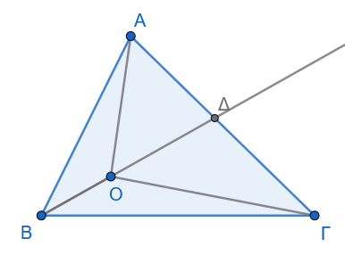{fig-align="center" width="300"}
::::

:::: {.math-box .examplesolution-box}
::: {.math-title .examplesolution-title}
**Λύση:**
:::

Προεκτείνουμε το τμήμα $BO$ μέχρι να τέμνει την πλευρά $A\Gamma$ στο σημείο $\Delta$.

Εφαρμόζουμε την τριγωνική ανισότητα στα τρίγωνα $AB\Delta$ και $O\Delta\Gamma$:

1.  Στο τρίγωνο $AB\Delta$: $B\Delta < AB + A\Delta \implies BO + O\Delta < AB + A\Delta$ (1)

2.  Στο τρίγωνο $O\Delta\Gamma$: $O\Gamma < O\Delta + \Delta\Gamma$ (2)

Προσθέτουμε κατά μέλη τις ανισότητες (1) και (2): $$BO + O\Delta + O\Gamma < AB + A\Delta + O\Delta + \Delta\Gamma$$

Αφαιρούμε το κοινό τμήμα $O\Delta$ και από τα δύο μέλη: $$BO + O\Gamma < AB + (A\Delta + \Delta\Gamma) \implies BO + O\Gamma < AB + A\Gamma \quad (3)$$

Με όμοιο τρόπο αποδεικνύονται οι σχέσεις: $$AO + OB < A\Gamma + B\Gamma \quad (4)$$ $$AO + O\Gamma < AB + B\Gamma \quad (5)$$

Προσθέτουμε κατά μέλη τις σχέσεις (3), (4) και (5): $$2(OA + OB + O\Gamma) < 2(AB + B\Gamma + \Gamma A) \implies OA + OB + O\Gamma < AB + B\Gamma + \Gamma A$$
::::

:::: {.math-box .example-box}
::: {.math-title .example-title}
**Παράδειγμα 2**
:::

**Να αποδειχθεί ότι για τη διάμεσο** $μ_a$ ενός τριγώνου $AB\Gamma$ με πλευρές $a, β, γ$ ισχύει: $$\frac{β+γ-a}{2} < μ_a < \frac{β+γ}{2}$$

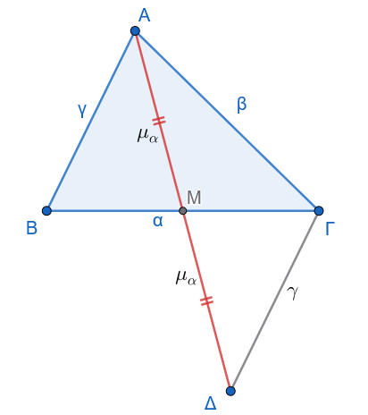{fig-align="center" width="350"}
::::

:::: {.math-box .examplesolution-box}
::: {.math-title .examplesolution-title}
**Λύση:**
:::

Προεκτείνουμε τη διάμεσο $AM = μ_a$ κατά ίσο τμήμα $M\Delta = μ_a$ και φέρουμε τη $\Gamma\Delta$.

Τα τρίγωνα $\triangle ABM$ και $\triangle \Delta\Gamma M$ είναι ίσα (ΠΓΠ), άρα $\Gamma\Delta = AB = γ$ και $A\Delta = 2μ_a$.

Στο τρίγωνο $A\Gamma\Delta$, από την τριγωνική ανισότητα έχουμε: $$A\Delta < A\Gamma + \Gamma\Delta \implies 2μ_a < β + γ \implies μ_a < \frac{β+γ}{2} \quad (1)$$

Στο τρίγωνο $AB\Gamma$, από τις τριγωνικές ανισότητες στα τρίγωνα $ABM$ και $A\Gamma M$ έχουμε:

- Στο $\triangle ABM$: $μ_a > γ - \dfrac{a}{2}$ (2)

- Στο $\triangle A\Gamma M$: $m_a > β - \dfrac{a}{2}$ (3)

Προσθέτουμε κατά μέλη τις ανισότητες (2) και (3): $$2μ_a > β + γ - a \implies μ_a > \frac{β+γ-a}{2} \quad (4)$$

Συνδυάζοντας τις σχέσεις (1) και (4) λαμβάνουμε το ζητούμενο: $$\frac{β+γ-a}{2} < μ_a < \frac{β+γ}{2}$$
::::

------------------------------------------------------------------------

#### Ασκήσεις προς Επίλυση

:::: {.math-box .exercise-box}
::: {.math-title .exercise-title}
**Άσκηση 12**
:::

**Εκφώνηση:** Αν για τη διάμεσο $μ_a$ ενός τριγώνου $AB\Gamma$ ισχύει $μ_a < \dfrac{a}{2}$, να αποδείξετε ότι η γωνία $\widehat{A}$ είναι αμβλεία.

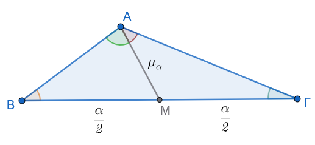{fig-align="center" width="400"}
::::

:::: {.math-box .solution-box}
::: {.math-title .solution-title}
**Λύση:**
:::

Έστω $M$ το μέσο της $B\Gamma$, οπότε $BM = M\Gamma = \dfrac{a}{2}$.

Από την υπόθεση, $AM < \dfrac{a}{2} \implies AM < BM$ και $AM < M\Gamma$.

- Στο τρίγωνο $ABM$, επειδή $AM < BM$, προκύπτει ότι $\widehat{B} < \widehat{BAM}$ (1)

- Στο τρίγωνο $A\Gamma M$, επειδή $AM < M\Gamma$, προκύπτει ότι $\widehat{Γ} < \widehat{MAΓ}$ (2).

Προσθέτουμε κατά μέλη τις σχέσεις (1) και (2): $$\widehat{B} + \widehat{\Gamma} < \widehat{BAM} + \widehat{MAΓ} \implies \widehat{B} + \widehat{\Gamma} < \widehat{A}$$

Σε κάθε τρίγωνο, ισχύει $\widehat{A} + \widehat{B} + \widehat{\Gamma} = 180^\circ \implies \widehat{B} + \widehat{\Gamma} = 180^\circ - \widehat{A}$.

Αντικαθιστούμε στην παραπάνω ανισότητα: $$180^\circ - \widehat{A} < \widehat{A} \implies 2\widehat{A} > 180^\circ \implies \widehat{A} > 90^\circ$$

Συνεπώς, η γωνία $\widehat{A}$ είναι αμβλεία.
::::

**Άσκηση 13**

**Εκφώνηση:** Να αποδείξετε ότι το άθροισμα των διαγωνίων κυρτού τετραπλεύρου $AB\Gamma\Delta$ είναι μικρότερο από την περίμετρο και μεγαλύτερο από το ημιάθροισμα της περιμέτρου του.

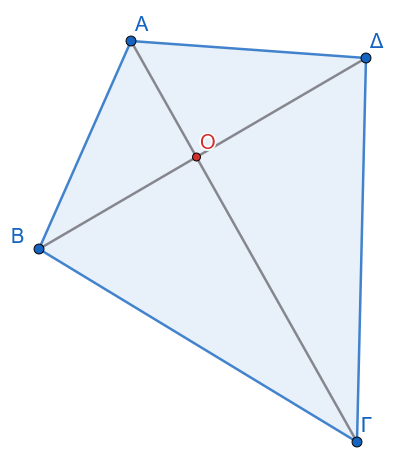{fig-align="center" width="300"}

**Λύση:**

Έστω $O$ το σημείο τομής των διαγωνίων $A\Gamma$ και $B\Delta$.

1.  Εφαρμόζουμε την τριγωνική ανισότητα στα τρίγωνα $OAB$, $OB\Gamma$, $O\Gamma\Delta$ και $O\Delta A$: $$AB < OA + OB$$ $$B\Gamma < OB + O\Gamma$$ $$\Gamma\Delta < O\Gamma + O\Delta$$ $$\Delta A < O\Delta + OA$$ Προσθέτουμε κατά μέλη τις τέσσερις αυτές σχέσεις: $$AB + B\Gamma + \Gamma\Delta + \Delta A < 2(OA + OB + O\Gamma + O\Delta) \implies \Pi < 2(A\Gamma + B\Delta) \implies \frac{\Pi}{2} < A\Gamma + B\Delta \quad (1)$$

2.  Εφαρμόζουμε την τριγωνική ανισότητα στα τρίγωνα $AB\Gamma$, $B\Gamma\Delta$, $\Gamma\Delta A$ και $\Delta AB$: $$A\Gamma < AB + B\Gamma$$ $$B\Delta < B\Gamma + \Gamma\Delta$$ $$A\Gamma < \Gamma\Delta + \Delta A$$ $$B\Delta < \Delta A + AB$$ Προσθέτουμε κατά μέλη: $$2(A\Gamma + B\Delta) < 2(AB + B\Gamma + \Gamma\Delta + \Delta A) \implies A\Gamma + B\Delta < \Pi \quad (2)$$

Από τις σχέσεις (1) και (2) προκύπτει: $\dfrac{\Pi}{2} < A\Gamma + B\Delta < \Pi$.

**Άσκηση 14**

**Εκφώνηση:** Αν $α, β, γ$ είναι οι πλευρές τριγώνου, να αποδείξετε ότι: $$\frac{α}{β+γ} + \frac{b}{α+γ} + \frac{c}{α+β} < 2$$

**Λύση:**

> > Σχεδιάστε ένα σχήμα

Από την τριγωνική ανισότητα, ισχύει $α < β+γ$.

Προσθέτουμε το $a$ στον παρονομαστή του κλάσματος, οπότε η τιμή του κλάσματος μικραίνει: $$\frac{a}{β+γ} < \frac{2a}{α+β+γ} \quad (1)$$

Με τον ίδιο τρόπο, ισχύουν οι ανισότητες: $$\frac{β}{a+γ} < \frac{2β}{a+β+γ} \quad (2)$$ $$\frac{γ}{a+β} < \frac{2γ}{a+β+γ} \quad (3)$$

Προσθέτουμε κατά μέλη τις σχέσεις (1), (2) και (3): $$\frac{a}{β+γ} + \frac{β}{a+γ} + \frac{γ}{a+β} < \frac{2a + 2β + 2γ}{a+β+γ} = \frac{2(a+β+γ)}{a+β+γ} = 2$$

**Άσκηση 15**

**Εκφώνηση:** Δίνεται τρίγωνο $AB\Gamma$ και $M$ τυχαίο εσωτερικό του σημείο.
Να αποδείξετε ότι $MB + MΓ < AB + AΓ$.

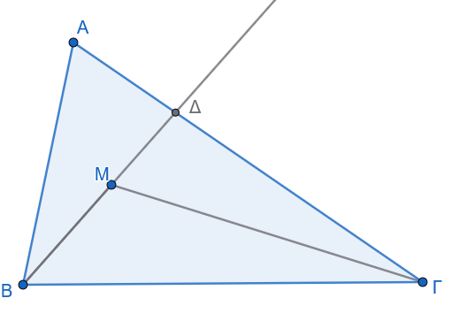{fig-align="center" width="400"}

**Λύση:**

Προεκτείνουμε το ευθύγραμμο τμήμα $BM$ μέχρι να τέμνει την πλευρά $A\Gamma$ στο σημείο $\Delta$.

- Στο τρίγωνο $AB\Delta$, από την τριγωνική ανισότητα έχουμε: $$B\Delta < AB + A\Delta \implies BM + M\Delta < AB + A\Delta \quad (1)$$

- Στο τρίγωνο $M\Delta\Gamma$, από την τριγωνική ανισότητα έχουμε: $$M\Gamma < M\Delta + \Delta\Gamma \quad (2)$$

Προσθέτουμε κατά μέλη τις σχέσεις (1) και (2): $$BM + M\Delta + M\Gamma < AB + A\Delta + M\Delta + \Delta\Gamma$$

Αφαιρούμε το $M\Delta$ και από τα δύο μέλη: $$BM + M\Gamma < AB + A\Delta + \Delta\Gamma$$

Επειδή $A\Delta + \Delta\Gamma = A\Gamma$, η σχέση γίνεται: $$MB + M\Gamma < AB + A\Gamma$$

**Άσκηση 16**

**Εκφώνηση:** Να αποδείξετε ότι το άθροισμα των τριών διαμέσων ενός τριγώνου είναι μικρότερο από την περίμετρο και μεγαλύτερο από το ημιάθροισμα της περιμέτρου του.

**Λύση:**

Έστω $μ_a, μ_β, μ_γ$ οι τρεις διάμεσοι τριγώνου $AB\Gamma$ με πλευρές $a, β, γ$.

Από το *Παράδειγμα 2*, για κάθε μία από τις διαμέσους ισχύει η διπλή ανισότητα: $$\frac{β+γ-a}{2} < μ_a < \frac{β+γ}{2}$$ $$\frac{a+γ-β}{2} < μ_β < \frac{a+γ}{2}$$ $$\frac{a+β-γ}{2} < μ_γ < \frac{a+β}{2}$$

1.  Προσθέτουμε κατά μέλη τις δεξιές ανισότητες: $$μ_a + μ_β + μ_γ < \frac{β+γ}{2} + \frac{a+γ}{2} + \frac{a+β}{2} = \frac{2a + 2β + 2γ}{2} = a+β+γ = \Pi$$

2.  Προσθέτουμε κατά μέλη τις αριστερές ανισότητες: $$μ_a + μ_β + μ_γ > \frac{β+γ-a + a+γ-β + a+β-γ}{2} = \frac{a+β+γ}{2} = \frac{\Pi}{2}$$

Συνδυάζοντας τα αποτελέσματα, προκύπτει: $\dfrac{\Pi}{2} < μ_a + μ_β + μ_γ < \Pi$.

------------------------------------------------------------------------

### ΕΝΟΤΗΤΑ 4: ΚΑΘΕΤΕΣ ΚΑΙ ΠΛΑΓΙΕΣ

:::: {.math-box .theorem-box}
::: {.math-title .theorem-title}
**Θεώρημα Καθέτου και Πλαγίων**
:::

Αν από ένα σημείο εκτός ευθείας φέρουμε την κάθετο και διάφορες πλάγιες προς αυτήν, τότε:

1.  Η κάθετος είναι μικρότερη από κάθε πλάγια.

2.  Δύο πλάγιες των οποίων οι πόδες ισαπέχουν από τον πόδα της καθέτου είναι ίσες, και αντίστροφα.

3.  Αν δύο πλάγιες είναι άνισες, τότε και οι προβολές τους είναι ομοίως άνισες, και αντίστροφα.
::::

:::: {.math-box .apodeixi-box}
::: {.math-title .apodeixi-title}
- **Υπόθεση:** Σημείο $A$ εκτός ευθείας $\epsilon$.
  Έστω $AH \perp \epsilon$.
  Σημεία $B, \Gamma$ πάνω στην $\epsilon$.

- **Συμπέρασμα:**

  1.  $AH < AB$.
  2.  Αν $HB = H\Gamma \iff AB = A\Gamma$.
  3.  Αν $AB > A\Gamma \iff HB > H\Gamma$.
:::

**Απόδειξη:**

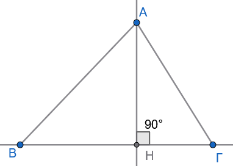{fig-align="center" width="300"}

1.  Στο ορθογώνιο τρίγωνο $AHB$ ($\widehat{H} = 90^\circ$), η ορθή γωνία είναι η μεγαλύτερη γωνία του τριγώνου. Επειδή απέναντι από τη μεγαλύτερη γωνία βρίσκεται η μεγαλύτερη πλευρά, η υποτείνουσα $AB$ είναι μεγαλύτερη από την κάθετη πλευρά $AH \implies AH < AB$.

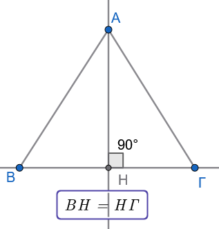{fig-align="center" width="250"}

2.  Αν $HB = H\Gamma$, συγκρίνουμε τα ορθογώνια τρίγωνα $AHB$ και $AH\Gamma$. Έχουν την $AH$ κοινή και $HB = H\Gamma$ από υπόθεση. Τα τρίγωνα είναι ίσα (ΠΓΠ), άρα $AB = A\Gamma$. Το αντίστροφο αποδεικνύεται ομοίως.

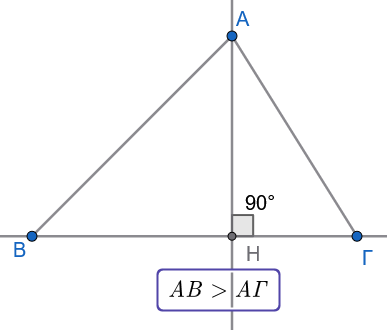{fig-align="center" width="250"}

3.  Αν $AB > A\Gamma$, έστω ότι δεν ισχύει $HB > H\Gamma$.
    Τότε θα έπρεπε είτε $HB = H\Gamma$ είτε $HB < H\Gamma$:

    - Αν $HB = H\Gamma \implies AB = A\Gamma$ (άτοπο).
    - Αν $HB < H\Gamma \implies AB < A\Gamma$ (άτοπο).

    Συνεπώς, ισχύει υποχρεωτικά $HB > H\Gamma$.
::::

------------------------------------------------------------------------

:::: {.math-box .corollary-box}
::: {.math-title .corollary-title}
- **Πόρισμα (α) \[Μοναδικότητα Καθέτου\]:**
:::

Από ένα σημείο εκτός ευθείας άγεται μία μόνο κάθετος προς αυτήν.
::::

:::: {.math-box .corollary-box}
::: {.math-title .corollary-title}
- **Πόρισμα (β) \[Ορισμός Απόστασης\]:**
:::

Απόσταση σημείου από ευθεία ονομάζεται το μήκος του κάθετου ευθυγράμμου τμήματος από το σημείο προς την ευθεία.
::::

------------------------------------------------------------------------

#### Εφαρμογές - Παραδείγματα

:::: {.math-box .example-box}
::: {.math-title .example-title}
**Παράδειγμα 1**
:::

**Αν** $\Delta, E$ είναι εσωτερικά σημεία των κάθετων πλευρών $AB$ και $A\Gamma$ αντίστοιχα ορθογωνίου τριγώνου $AB\Gamma$ ($\widehat{A} = 90^\circ$), να αποδειχθεί ότι $\Delta E < B\Gamma$.
::::

:::: {.math-box .examplesolution-box}
::: {.math-title .examplesolution-title}
**Λύση:**
:::

> > Σχεδιάστε το σχήμα

Φέρουμε το ευθύγραμμο τμήμα $BE$.

1.  Στο ορθογώνιο τρίγωνο $A\Delta E$ ($\widehat{A} = 90^\circ$), η κάθετος από το $E$ προς την ευθεία $AB$ είναι το τμήμα $AE$. Τα τμήματα $\Delta E$ και $BE$ είναι πλάγιες από το σημείο $E$ προς την ευθεία $AB$, με αντίστοιχες προβολές τα τμήματα $A\Delta$ και $AB$.

Επειδή το σημείο $\Delta$ είναι εσωτερικό της πλευράς $AB$, ισχύει $A\Delta < AB$.

Από το θεώρημα των πλαγίων, η πλάγια με τη μικρότερη προβολή είναι μικρότερη, άρα: $$\Delta E < BE \quad (1)$$

2.  Στο ορθογώνιο τρίγωνο $AB\Gamma$ ($\widehat{A} = 90^\circ$), η κάθετος από το $B$ προς την ευθεία $A\Gamma$ είναι το τμήμα $AB$. Τα τμήματα $BE$ και $B\Gamma$ είναι πλάγιες από το σημείο $B$ προς την ευθεία $A\Gamma$, με αντίστοιχες προβολές τα τμήματα $AE$ και $A\Gamma$.

Επειδή το σημείο $E$ είναι εσωτερικό της πλευράς $A\Gamma$, ισχύει $AE < A\Gamma$.

Από το θεώρημα των πλαγίων, προκύπτει: $$BE < B\Gamma \quad (2)$$

Συνδυάζοντας τις ανισότητες (1) και (2) λαμβάνουμε άμεσα: $$\Delta E < B\Gamma$$
::::

:::: {.math-box .example-box}
::: {.math-title .example-title}
**Παράδειγμα 2**
:::

**Σε ισοσκελές τρίγωνο** $AB\Gamma$ ($AB = A\Gamma$), φέρουμε το ύψος $B\Delta$ προς την πλευρά $A\Gamma$.

Να αποδειχθεί ότι η διάμεσος $AH$ προς τη βάση $B\Gamma$ είναι μεγαλύτερη από το ύψος $B\Delta$.
::::

:::: {.math-box .examplesolution-box}
::: {.math-title .examplesolution-title}
**Λύση:**
:::

> > Σχεδιάστε το σχήμα

Στο ισοσκελές τρίγωνο $AB\Gamma$, η διάμεσος $AH$ προς τη βάση είναι ταυτόχρονα και ύψος, άρα $AH \perp B\Gamma$.

Συνεπώς, η κάθετη απόσταση του $A$ από τη βάση είναι το τμήμα $AH$.

Στο ορθογώνιο τρίγωνο $B\Delta\Gamma$ ($\widehat{\Delta} = 90^\circ$), η υποτείνουσα είναι η $B\Gamma$, άρα ισχύει: $$B\Delta < B\Gamma \quad (1)$$

Στο ορθογώνιο τρίγωνο $AHB$ ($\widehat{H} = 90^\circ$), η υποτείνουσα είναι η $AB$.
Επειδή $AB = A\Gamma$ (από υπόθεση), ισχύει $AH < AB$.

Η κάθετος $AH$ από το $A$ προς την ευθεία $B\Gamma$ είναι μικρότερη από την πλάγια $AB$.

Από τις ιδιότητες των υψών σε ισοσκελές τρίγωνο, αν η βάση $B\Gamma$ είναι μικρότερη από τις ίσες πλευρές, το ύψος $AH$ είναι μεγαλύτερο από το ύψος $B\Delta$.

Γεωμετρικά, στο ορθογώνιο τρίγωνο $B\Delta\Gamma$, η $B\Delta$ είναι κάθετος, ενώ η $B\Gamma$ είναι πλάγια.
::::

------------------------------------------------------------------------

#### Ασκήσεις προς Επίλυση

:::: {.math-box .exercise-box}
::: {.math-title .exercise-title}
**Άσκηση 17**
:::

**Εκφώνηση:** Σε τρίγωνο $AB\Gamma$ με ύψος $A\Delta$, αν $AB < A\Gamma$, να αποδείξετε ότι $B\Delta < \Delta\Gamma$ χρησιμοποιώντας αποκλειστικά το θεώρημα καθέτου και πλαγίων.
::::

:::: {.math-box .solution-box}
::: {.math-title .solution-title}
**Λύση:**
:::

> > > Σχεδιάστε το σχήμα

Θεωρούμε το σημείο $A$ εκτός της ευθείας $B\Gamma$.

- Το ευθύγραμμο τμήμα $A\Delta$ είναι η κάθετος από το $A$ προς την ευθεία $B\Gamma$ ($A\Delta \perp B\Gamma$).

- Τα τμήματα $AB$ και $A\Gamma$ είναι πλάγιες από το σημείο $A$ προς την ευθεία $B\Gamma$.

- Οι προβολές των πλαγίων αυτών επί της ευθείας $B\Gamma$ είναι αντίστοιχα τα ευθύγραμμα τμήματα $B\Delta$ και $\Delta\Gamma$.

Σύμφωνα με το θεώρημα καθέτου και πλαγίων, η μικρότερη πλάγια έχει πάντα μικρότερη προβολή.

Εφόσον δίνεται ότι $AB < A\Gamma$, προκύπτει άμεσα ότι η προβολή της $AB$ είναι μικρότερη από την προβολή της $A\Gamma$, δηλαδή: $$B\Delta < \Delta\Gamma$$
::::

**Άσκηση 18**

**Εκφώνηση:** Από σημείο $A$ εκτός ευθείας $\epsilon$ φέρουμε την κάθετο $AH$ και δύο πλάγιες $AB, A\Gamma$.
Αν η γωνία $\widehat{ABH}$ είναι μεγαλύτερη από τη γωνία $\widehat{A\Gamma H}$, να αποδείξετε ότι $AB < A\Gamma$.

**Λύση:**

> > > Σχεδιάστε το σχήμα

Στα ορθογώνια τρίγωνα $AHB$ και $AH\Gamma$ ($\widehat{H} = 90^\circ$), οι οξείες γωνίες είναι συμπληρωματικές: $$\widehat{BAH} = 90^\circ - \widehat{ABH} \quad (1)$$ $$\widehat{\Gamma AH} = 90^\circ - \widehat{A\Gamma H} \quad (2)$$

Επειδή από την υπόθεση ισχύει $\widehat{ABH} > \widehat{A\Gamma H}$, από τις σχέσεις (1) και (2) προκύπτει: $$90^o - \widehat{ABH} < 90^o - \widehat{AΓH} \implies \widehat{BAH} < \widehat{Γ}$$
