```{=html}
<!-- Φόρτωση βιβλιοθήκης GeoGebra -->
<script src="https://www.geogebra.org/apps/deployggb.js"></script>

<!-- Συνάρτηση δημιουργίας applets -->
<script>
function createGeoGebra(containerId, materialId, width = 700, height = 500) {
  var params = {
    "id": "ggb-" + containerId,
    "material_id": materialId,
    "width": width,
    "height": height,
    "showToolBar": true,
    "showMenuBar": false,
    "showAlgebraInput": true
  };
  
  var applet = new GGBApplet(params, '5.2');
  applet.inject(containerId);
}
</script>
```

## Ευθεία και κύκλος

### ΜΕΡΟΣ 1: ΣΧΕΤΙΚΕΣ ΘΕΣΕΙΣ ΕΥΘΕΙΑΣ ΚΑΙ ΚΥΚΛΟΥ

#### Ορισμοί

:::: {.math-box .definition-box}
::: {.math-title .definition-title}
- **Απόσταση Κέντρου από Ευθεία**:
:::

Έστω κύκλος $(O, R)$ και μια ευθεία $\epsilon$ του επιπέδου.
Ονομάζουμε **απόσταση** $d$ του κέντρου $O$ από την ευθεία $\epsilon$, το μήκος του κάθετου ευθυγράμμου τμήματος $OH$ από το $O$ προς την $\epsilon$ ($OH \perp \epsilon$).

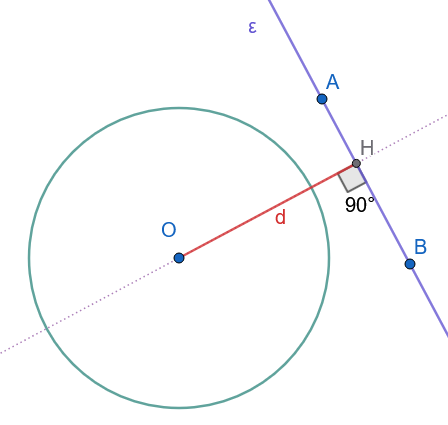{width="300"}
::::

:::: {.math-box .definition-box}
::: {.math-title .definition-title}
- **Εξωτερική Ευθεία**:
:::

Μια ευθεία $\epsilon$ ονομάζεται **εξωτερική** του κύκλου $(O, R)$ αν και μόνο αν δεν έχει κανένα κοινό σημείο με αυτόν.
Αυτό συμβαίνει όταν η απόσταση $d$ είναι μεγαλύτερη από την ακτίνα ($d > R$).
(Σχήμα 1)
::::

:::: {.math-box .definition-box}
::: {.math-title .definition-title}
- **Εφαπτομένη Ευθεία**:
:::

Μια ευθεία $\epsilon$ ονομάζεται **εφαπτομένη** του κύκλου $(O, R)$ αν και μόνο αν έχει ακριβώς ένα κοινό σημείο με τον κύκλο.
Το σημείο αυτό ονομάζεται **σημείο επαφής**.
Αυτό συμβαίνει όταν η απόσταση $d$ είναι ίση με την ακτίνα ($d = R$).

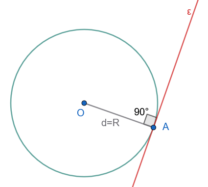{width="300"}
::::

:::: {.math-box .definition-box}
::: {.math-title .definition-title}
- **Τέμνουσα Ευθεία**:
:::

Μια ευθεία $\epsilon$ ονομάζεται **τέμνουσα** του κύκλου $(O, R)$ αν και μόνο αν έχει ακριβώς δύο κοινά σημεία με τον κύκλο.
Αυτό συμβαίνει όταν η απόσταση $d$ είναι μικρότερη από την ακτίνα ($d < R$).

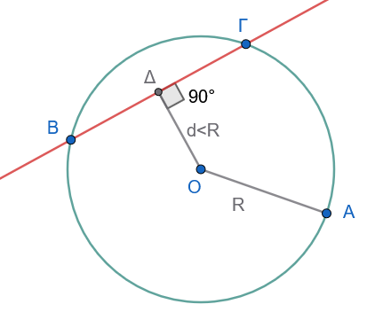{width="300"}
::::

------------------------------------------------------------------------

#### Θεωρήματα

:::: {.math-box .theorem-box}
::: {.math-title .theorem-title}
**Θεώρημα 1.1**
:::

Μια ευθεία και ένας κύκλος έχουν το πολύ δύο κοινά σημεία.

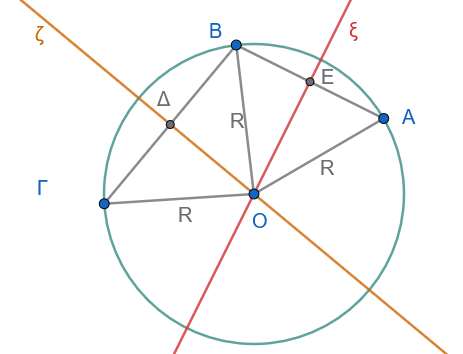{width="300"}
::::

:::: {.math-box .apodeixi-box}
::: {.math-title .apodeixi-title}
**Απόδειξη (Με απαγωγή σε άτοπο):**
:::

Ας υποθέσουμε ότι μια ευθεία $\epsilon$ και ένας κύκλος $(O, R)$ έχουν τρία κοινά σημεία, τα $A$, $B$ και $\Gamma$.

Επειδή τα σημεία αυτά ανήκουν στον κύκλο, οι αποστάσεις τους από το κέντρο $O$ είναι ίσες με την ακτίνα $R$: $$OA = OB = O\Gamma = R$$

Συνεπώς, τα τρίγωνα $\triangle OAB$ και $\triangle OB\Gamma$ είναι ισοσκελή.
Οι μεσοκάθετοι $\xi$ και $\zeta$ των τμημάτων $AB$ και $B\Gamma$ αντίστοιχα διέρχονται από το κέντρο $O$ του κύκλου.

Όμως, οι μεσοκάθετοι $\xi$ και $\zeta$ δύο διαδοχικών τμημάτων της ίδιας ευθείας $\epsilon$ είναι κάθετες στην $\epsilon$, άρα είναι παράλληλες μεταξύ τους ($\xi \parallel \zeta$).

Το γεγονός ότι δύο παράλληλες ευθείες $\xi$ και $\zeta$ τέμνονται στο σημείο $O$ είναι άτοπο.

Άρα, η ευθεία και ο κύκλος έχουν το πολύ δύο κοινά σημεία.
::::

:::: {.math-box .theorem-box}
::: {.math-title .theorem-title}
**Θεώρημα 1.2 (Χαρακτηριστική Ιδιότητα Εφαπτομένης)**
:::

Η εφαπτομένη του κύκλου σε ένα σημείο του είναι κάθετη στην ακτίνα που καταλήγει στο σημείο αυτό.

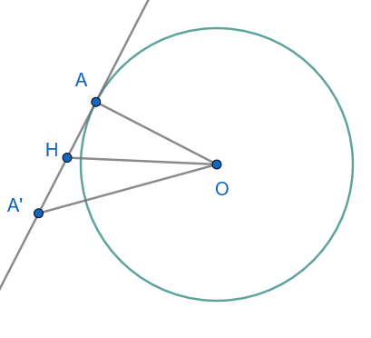{width="300"}
::::

:::: {.math-box .apodeixi-box}
::: {.math-title .apodeixi-title}
**Απόδειξη:**
:::

Έστω $\epsilon$ η εφαπτομένη του κύκλου $(O, R)$ στο σημείο $A$.
Αν η $\epsilon$ δεν ήταν κάθετη στην ακτίνα $OA$, τότε το κάθετο τμήμα $OH$ από το $O$ προς την $\epsilon$ θα ήταν διαφορετικό από το $OA$.

Στο ορθογώνιο τρίγωνο $\triangle OHA$ (ορθογώνιο στο $H$), η υποτείνουσα $OA$ είναι μεγαλύτερη από την κάθετη πλευρά $OH$: $$OH < OA \implies OH < R$$

Εφόσον $OH < R$, το σημείο $H$ θα ήταν εσωτερικό σημείο του κύκλου.
Αν προεκτείνουμε το τμήμα $HA$ κατά τμήμα $HA' = HA$, τότε το τρίγωνο $\triangle OAA'$ θα ήταν ισοσκελές με $OA' = OA = R$.

Συνεπώς, το σημείο $A'$ θα ανήκε επίσης στον κύκλο.

Αυτό σημαίνει ότι η ευθεία $\epsilon$ θα είχε και δεύτερο κοινό σημείο με τον κύκλο (το $A'$), πράγμα που αντιφάσκει με την υπόθεση ότι η $\epsilon$ είναι εφαπτομένη (έχει μοναδικό κοινό σημείο).

Άρα, η ακτίνα $OA$ είναι κάθετη στην εφαπτομένη $\epsilon$ στο σημείο $A$ ($OA \perp \epsilon$).
::::

------------------------------------------------------------------------

#### Πορίσματα

:::: {.math-box .corollary-box}
::: {.math-title .corollary-title}
- **Πόρισμα 1**:
:::

Μια ευθεία $\epsilon$ είναι εφαπτομένη του κύκλου $(O, R)$ στο σημείο $A$ αν και μόνο αν είναι κάθετη στην ακτίνα $OA$ στο άκρο της $A$.

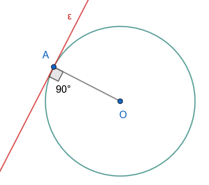{width="300"}
::::

:::: {.math-box .corollary-box}
::: {.math-title .corollary-title}
- **Πόρισμα 2**:
:::

Αν $d$ είναι η απόσταση του κέντρου $O$ από την ευθεία $\epsilon$, τότε:

- $d > R \iff \epsilon$ εξωτερική ευθεία.
- $d = R \iff \epsilon$ εφαπτομένη ευθεία.
- $d < R \iff \epsilon$ τέμνουσα ευθεία.
::::

------------------------------------------------------------------------

#### Εφαρμογές (Λυμένα Παραδείγματα)

:::: {.math-box .example-box}
::: {.math-title .example-title}
**Εφαρμογή 1**
:::

Αν $\epsilon$ είναι η εφαπτομένη ενός κύκλου $(O, R)$ στο σημείο $A$, να αποδειχθεί ότι για κάθε άλλο σημείο $M \in \epsilon$ ($M \neq A$), ισχύει $OM > R$.

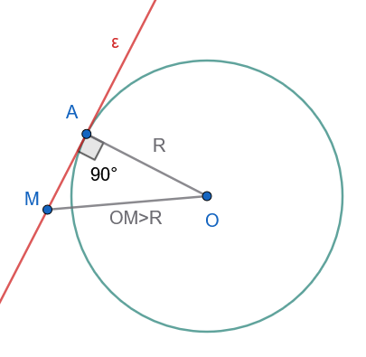{width="300"}
::::

:::: {.math-box .examplesolution-box}
::: {.math-title .examplesolution-title}
**Λύση:**
:::

Εφόσον η ευθεία $\epsilon$ εφάπτεται του κύκλου στο σημείο $A$, η ακτίνα $OA$ είναι κάθετη στην $\epsilon$ ($OA \perp \epsilon$).

Για οποιοδήποτε σημείο $M$ της εφαπτομένης διάφορο του $A$, σχηματίζεται το ορθογώνιο τρίγωνο $\triangle OAM$ με ορθή γωνία την $\widehat{OAM} = 90^\circ$.

Η πλευρά $OM$ είναι η υποτείνουσα του ορθογωνίου τριγώνου, συνεπώς είναι μεγαλύτερη από την κάθετη πλευρά $OA$: $$OM > OA \implies OM > R$$

Άρα, κάθε σημείο της εφαπτομένης εκτός από το σημείο επαφής $A$ είναι εξωτερικό σημείο του κύκλου.
::::

:::: {.math-box .example-box}
::: {.math-title .example-title}
**Εφαρμογή 2**
:::

Αν δύο χορδές $AB$ και $\Gamma\Delta$ ενός κύκλου είναι παράλληλες, να αποδειχθεί ότι τα τόξα που περιέχονται μεταξύ τους είναι ίσα: $\overparen{AΓ} = \overparen{BΔ}$.

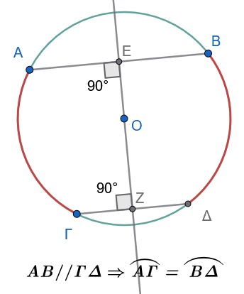{width="250"}
::::

:::: {.math-box .examplesolution-box}
::: {.math-title .examplesolution-title}
**Λύση:**
:::

Φέρουμε τη διάμετρο $\epsilon$ του κύκλου η οποία είναι κάθετη στις παράλληλες χορδές $AB$ και $\Gamma\Delta$.

Η ευθεία $\epsilon$ αποτελεί άξονα συμμετρίας του κύκλου και είναι η κοινή μεσοκάθετος των χορδών $AB$ και $\Gamma\Delta$.

Λόγω της αξονικής συμμετρίας ως προς την $\epsilon$:

- Το συμμετρικό του σημείου $A$ είναι το σημείο $B$.

- Το συμμετρικό του σημείου $\Gamma$ είναι το σημείο $\Delta$.

Συνεπώς, το συμμετρικό του τόξου $\overparen{A\Gamma}$ είναι το τόξο $\overparen{B\Delta}$.
Επειδή η αξονική συμμετρία είναι ισομετρία (διατηρεί τα μήκη και τα σχήματα), προκύπτει άμεσα ότι τα τόξα είναι ίσα: $\overparen{A\Gamma} = \overparen{B\Delta}$.
::::

:::: {.math-box .example-box}
::: {.math-title .example-title}
**Εφαρμογή 3**
:::

**Σε κύκλο** $(O, R)$ φέρουμε χορδή $AB$ και τη μεσοκάθετο αυτής, η οποία τέμνει τον κύκλο στα σημεία $\Sigma$ και $\Sigma'$.
Να αποδειχθεί ότι η ευθεία $\Sigma\Sigma'$ είναι διάμετρος του κύκλου.

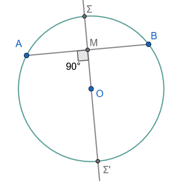{width="250"}
::::

:::: {.math-box .examplesolution-box}
::: {.math-title .examplesolution-title}
**Λύση:**
:::

Έστω $M$ το μέσο της χορδής $AB$.
Από το Θεώρημα της μεσοκαθέτου, η μεσοκάθετος κάθε χορδής διέρχεται υποχρεωτικά από το κέντρο $O$ του κύκλου.

Επειδή η ευθεία της μεσοκαθέτου διέρχεται από το σταθερό σημείο $O$ (κέντρο) και τέμνει την περιφέρεια στα $\Sigma$ και $\Sigma'$, το ευθύγραμμο τμήμα $\Sigma\Sigma'$ διέρχεται από το κέντρο του κύκλου, άρα είναι εξ ορισμού διάμετρος του κύκλου.
::::

------------------------------------------------------------------------

#### Ασκήσεις με Πλήρεις Αποδείξεις

**Άσκηση 1**

Εφαπτομένη $\epsilon$ στο σημείο $A$ κύκλου $(O, R)$ είναι παράλληλη προς χορδή $B\Gamma$.
Αποδείξτε ότι η ακτίνα $OA$ διχοτομεί τη χορδή $B\Gamma$.

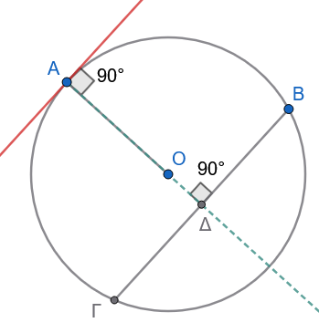{width="250"}

**Απόδειξη:**

Η $\epsilon$ είναι κάθετη στην $OA$.

Λόγω παραλληλίας $\epsilon \parallel B\Gamma$, ο φορέας της $OA$ είναι επίσης κάθετος στη χορδή $B\Gamma$.

Σύμφωνα με το Πόρισμα, ο φορέας της ακτίνας που είναι κάθετος σε χορδή τη διχοτομεί.

Άρα η $OA$ διέρχεται από το μέσο της $B\Gamma$.

**Άσκηση 2**

**Εκφώνηση:** Αν μια ευθεία $\epsilon$ είναι τέμνουσα ενός κύκλου $(O, R)$, να αποδείξετε ότι η απόστασή της $d$ από το κέντρο είναι $d = \sqrt{R^2 - \left(\dfrac{AB}{2}\right)^2}$, όπου $AB$ είναι η χορδή που ορίζεται από τα σημεία τομής.

**Απόδειξη:**

Έστω $H$ η προβολή του $O$ στην $\epsilon$, οπότε $OH = d$ και $OH \perp AB$.
Από την *Άσκηση 1*, το $H$ είναι το μέσο της χορδής $AB$, άρα $HA = \dfrac{AB}{2}$.

Εφαρμόζουμε το Πυθαγόρειο Θεώρημα στο ορθογώνιο τρίγωνο $\triangle OHA$: $$OA^2 = OH^2 + HA^2 \implies R^2 = d^2 + \left(\frac{AB}{2}\right)^2 \implies d^2 = R^2 - \left(\frac{AB}{2}\right)^2 \implies d = \sqrt{R^2 - \left(\frac{AB}{2}\right)^2}$$

**Άσκηση 3**

**Εκφώνηση:** Δίνονται δύο ομόκεντροι κύκλοι $(O, R)$ και $(O, \rho)$ με $R > \rho$.
Μια ευθεία $\epsilon$ τέμνει τον εξωτερικό κύκλο στα σημεία $A, \Delta$ και τον εσωτερικό στα $B, \Gamma$.
Να αποδείξετε ότι $AB = \Gamma\Delta$.

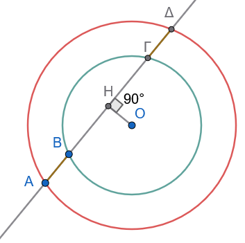{width="250"}

**Απόδειξη:**

Φέρουμε το κάθετο τμήμα $OH \perp \epsilon$.

- Για τον εσωτερικό κύκλο $(O, \rho)$, η $OH$ είναι κάθετη στη χορδή $B\Gamma$, άρα τη διχοτομεί: $HB = H\Gamma$ (1).
- Για τον εξωτερικό κύκλο $(O, R)$, η $OH$ είναι κάθετη στη χορδή $A\Delta$, άρα τη διχοτομεί: $HA = H\Delta$ (2).

Αφαιρούμε κατά μέλη τη σχέση (1) από τη σχέση (2): $$HA - HB = H\Delta - H\Gamma \implies AB = \Gamma\Delta$$

**Άσκηση 4**

**Εκφώνηση:** Να αποδείξετε ότι όλες οι χορδές ενός κύκλου $(O, R)$ που εφάπτονται σε έναν εσωτερικό ομόκεντρο κύκλο $(O, \rho)$ είναι ίσες μεταξύ τους.

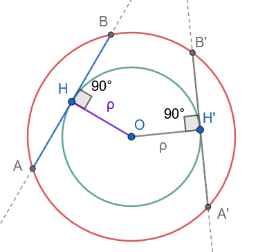{width="250"}

**Απόδειξη:**

Έστω $AB$ μια τυχαία χορδή του κύκλου $(O, R)$ η οποία εφάπτεται στον κύκλο $(O, \rho)$ στο σημείο $H$.

Εφόσον η $AB$ εφάπτεται στον εσωτερικό κύκλο, η ακτίνα $OH$ είναι κάθετη στη χορδή $AB$.

Η απόσταση της χορδής $AB$ από το κοινό κέντρο $O$ ισούται με $OH = \rho$ (σταθερή).

Επειδή όλες οι χορδές του εξωτερικού κύκλου που εφάπτονται στον εσωτερικό απέχουν την ίδια απόσταση $\rho$ από το κέντρο $O$, σύμφωνα με το σχετικό θεώρημα, οι χορδές αυτές είναι ίσες μεταξύ τους.

**Άσκηση 5**

**Εκφώνηση:** Έστω $AB$ διάμετρος κύκλου $(O, R)$.
Φέρουμε τις εφαπτόμενες $\epsilon_1$ και $\epsilon_2$ του κύκλου στα σημεία $A$ και $B$ αντίστοιχα.
Να αποδείξετε ότι $\epsilon_1 \parallel \epsilon_2$.

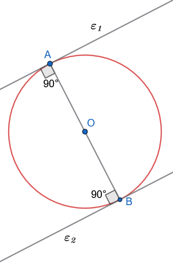{width="250"}

**Απόδειξη:**

Η ευθεία $AB$ είναι ο φορέας της διαμέτρου, άρα διέρχεται από το κέντρο $O$.

- Επειδή η $\epsilon_1$ εφάπτεται του κύκλου στο $A$, ισχύει $\epsilon_1 \perp OA \implies \epsilon_1 \perp AB$.
- Επειδή η $\epsilon_2$ εφάπτεται του κύκλου στο $B$, ισχύει $\epsilon_2 \perp OB \implies \epsilon_2 \perp AB$.

Εφόσον οι ευθείες $\epsilon_1$ και $\epsilon_2$ είναι κάθετες στην ίδια ευθεία $AB$, είναι παράλληλες μεταξύ τους ($\epsilon_1 \parallel \epsilon_2$).

**Άσκηση 6**

**Εκφώνηση:** Δίνεται κύκλος $(O, R)$ και σημείο $P$ στην προέκταση της ακτίνας $OA$ τέτοιο ώστε $OA = AP$.
Αν φέρουμε την εφαμτομένη του κύκλου στο $A$, να αποδείξετε ότι αυτή είναι η μεσοκάθετος του ευθυγράμμου τμήματος $OP$.

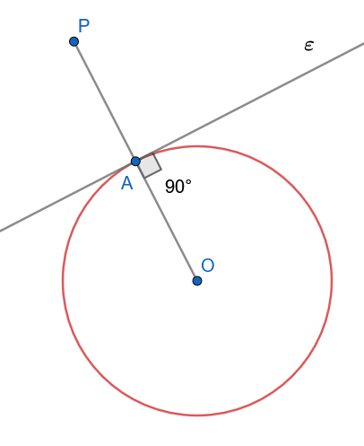{width="300"}

**Απόδειξη:**

Έστω $\epsilon$ η εφαπτομένη του κύκλου στο σημείο $A$.

Σύμφωνα με το θεώρημα της εφαπτομένης, ισχύει $\epsilon \perp OA \implies \epsilon \perp OP$.

Επίσης, από την υπόθεση ισχύει $OA = AP$, δηλαδή το σημείο $A$ είναι το μέσο του ευθυγράμμου τμήματος $OP$.

Εφόσον η ευθεία $\epsilon$ είναι κάθετη στο τμήμα $OP$ στο μέσο του $A$, είναι η μεσοκάθετος του $OP$.

:::: {.math-box .exercise-box}
::: {.math-title .exercise-title}
**Άσκηση 7**
:::

**Εκφώνηση:** Από το κέντρο $O$ κύκλου $(O, R)$ φέρουμε ακτίνα $OA$.
Γράφουμε νέο κύκλο με διάμετρο την ακτίνα $OA$.
Να αποδείξετε ότι ο νέος κύκλος εφάπτεται εσωτερικά στον αρχικό κύκλο.

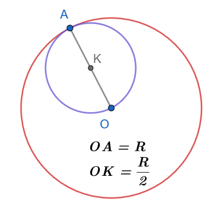{width="250"}
::::

:::: {.math-box .solution-box}
::: {.math-title .solution-title}
**Απόδειξη:**
:::

Έστω $K$ το κέντρο του νέου κύκλου.
Επειδή η $OA$ είναι διάμετρος του νέου κύκλου, το $K$ είναι το μέσο της $OA$.
Συνεπώς, η ακτίνα του νέου κύκλου είναι $\rho = \dfrac{OA}{2} = \dfrac{R}{2}$.

Η απόσταση $d$ των κέντρων των δύο κύκλων είναι: $$d = OK = \frac{R}{2}$$

Παρατηρούμε ότι: $$R - \rho = R - \frac{R}{2} = \frac{R}{2} = d$$

Επειδή η απόσταση των κέντρων ισούται με τη διαφορά των ακτινών τους ($d = R - \rho$), οι δύο κύκλοι εφάπτονται εσωτερικά στο κοινό σημείο $A$.
::::

**Άσκηση 8**

**Εκφώνηση:** Από εξωτερικό σημείο $P$ άγονται εφαπτόμενες $PA,PB$.
Αν $\widehat{APB} = 60^\circ$, αποδείξτε ότι το τρίγωνο $PAB$ είναι ισόπλευρο.

**Απόδειξη:**

Ισχύει $PA = PB$ (εφαπτόμενα τμήματα), άρα το $\triangle PAB$ είναι ισοσκελές.

Αφού μια γωνία ισοσκελούς τριγώνου είναι \$ 60\^\circ \$, έπεται ότι όλες οι γωνίες είναι \$ 60\^\circ \$, συνεπώς το τρίγωνο είναι ισόπλευρο.

**Άσκηση 9**

**Εκφώνηση:** Δίνεται κύκλος $(O, R)$ και μια τέμνουσα ευθεία $\epsilon$ η οποία τέμνει τον κύκλο στα $A$ και $B$.

Αν φέρουμε τη μεσοκάθετο του τμήματος $AB$, να αποδείξετε ότι αυτή διέρχεται από το κέντρο $O$ του κύκλου.

**Απόδειξη:**

Έστω $M$ το μέσο του τμήματος $AB$.
Το τρίγωνο $\triangle OAB$ είναι ισοσκελές, καθώς $OA = OB = R$ (ως ακτίνες του κύκλου).

Σε κάθε ισοσκελές τρίγωνο, η διάμεσος προς τη βάση ($OM$) είναι και ύψος, άρα $OM \perp AB$.

Εφόσον η ευθεία $OM$ διέρχεται από το μέσο $M$ του $AB$ και είναι κάθετη σε αυτό, είναι η μεσοκάθετος του $AB$.

Συνεπώς, η μεσοκάθετος διέρχεται από το κέντρο $O$.

**Άσκηση 10**

**Εκφώνηση:** Έστω $AB$ μια χορδή κύκλου $(O, R)$ και $\epsilon$ η εφαπτομένη του κύκλου στο $A$.
Αν φέρουμε $OH \perp \epsilon$ και $OK \perp AB$, να αποδείξετε ότι το τετράπλευρο $OHAK$ είναι ορθογώνιο και να βρεθεί η διαγώνιός του $HK$.

**Απόδειξη:**

> > Σχεδιάστε το σχήμα

- Λόγω της εφαπτομένης, ισχύει $OA \perp \epsilon \implies \widehat{OAH} = 90^\circ$.

- Από την κατασκευή, $OH \perp \epsilon \implies \widehat{OHA} = 90^\circ$ και $OK \perp AB \implies \widehat{OKA} = 90^\circ$.

Εφόσον το τετράπλευρο $OHAK$ έχει τρεις ορθές γωνίες, είναι ορθογώνιο.

Οι διαγώνιοι κάθε ορθογωνίου είναι ίσες, άρα $HK = OA$.

Επειδή $OA = R$ (ακτίνα του κύκλου), προκύπτει ότι $HK = R$.

------------------------------------------------------------------------

### ΜΕΡΟΣ 2: ΕΦΑΠΤΟΜΕΝΑ ΤΜΗΜΑΤΑ

#### Ορισμοί

:::: {.math-box .definition-box}
::: {.math-title .definition-title}
**Εφαπτόμενα τμήματα**
:::

Έστω κύκλος $(O, R)$ και ένα εξωτερικό σημείο $P$.
Από το $P$ άγονται δύο εφαπτόμενες προς τον κύκλο, με σημεία επαφής τα $A$ και $B$.
Τα ευθύγραμμα τμήματα $PA$ και $PB$ ονομάζονται **εφαπτόμενα τμήματα** του κύκλου από το σημείο $P$.
::::

:::: {.math-box .definition-box}
::: {.math-title .definition-title}
**Διακεντρική Ευθεία Σημείου**:
:::

Η ευθεία $OP$ που συνδέει το σταθερό κέντρο $O$ με το εξωτερικό σημείο $P$ ονομάζεται **διακεντρική ευθεία του σημείου** $P$.
::::

------------------------------------------------------------------------

#### Θεωρήματα

:::: {.math-box .theorem-box}
::: {.math-title .theorem-title}
**Θεώρημα 2.1**
:::

Τα εφαπτόμενα τμήματα κύκλου που άγονται από εξωτερικό σημείο είναι ίσα μεταξύ τους: $PA = PB$.
::::

:::: {.math-box .apodeixi-box}
::: {.math-title .apodeixi-title}
**Απόδειξη:**
:::

Φέρουμε τις ακτίνες $OA$ και $OB$ στα σημεία επαφής.

Σύμφωνα με το *Θεώρημα 1.2*, οι ακτίνες αυτές είναι κάθετες στις εφαπτόμενες, άρα $\widehat{OAP} = \widehat{OBP} = 90^\circ$.

Συγκρίνουμε τα ορθογώνια τρίγωνα $\triangle OAP$ και $\triangle OBP$:

1.  $OP$ κοινή υποτείνουσα.

2.  $OA = OB = R$ (ως ακτίνες του κύκλου - ίσες κάθετες πλευρές).

Τα ορθογώνια τρίγωνα έχουν την υποτείνουσα και μία κάθετη πλευρά ίσες, άρα είναι ίσα.
Από την ισότητα αυτή προκύπτει άμεσα ότι και οι αντίστοιχες πλευρές τους είναι ίσες, δηλαδή $PA = PB$.
::::

------------------------------------------------------------------------

#### Πορίσματα

:::: {.math-box .corollary-box}
::: {.math-title .corollary-title}
**Πόρισμα 2.1**
:::

Αν $P$ είναι ένα εξωτερικό σημείο ενός κύκλου, τότε η διακεντρική ευθεία $OP$:

> 1.  Είναι η μεσοκάθετος της χορδής $AB$ του κύκλου, που ενώνει τα σημεία επαφής.
> 2.  Διχοτομεί τη γωνία $\widehat{APB}$ των εφαπτόμενων τμημάτων και τη γωνία $\widehat{AOB}$ των ακτίνων.
::::

:::: {.math-box .corollaryproof-box}
::: {.math-title .corollaryproof-title}
**Απόδειξη:**
:::

1.  Επειδή $PA = PB$ (από το *Θεώρημα 2.1*) και $OA = OB = R$, τα σημεία $P$ και $O$ ισαπέχουν από τα άκρα $A$ και $B$ της χορδής $AB$.
    Από τη χαρακτηριστική ιδιότητα, τα $P$ και $O$ ανήκουν στη μεσοκάθετο του $AB$.
    Συνεπώς, η ευθεία $OP$ είναι η μεσοκάθετος της χορδής $AB$.

2.  Από την ισότητα των τριγώνων $\triangle OAP \cong \triangle OBP$, προκύπτει ότι: $$\widehat{APO} = \widehat{BPO} \implies \text{η } OP \text{ είναι διχοτόμος της } \widehat{APB}$$ $$\widehat{AOP} = \widehat{BOP} \implies \text{η } OP \text{ είναι διχοτόμος της } \widehat{AOB} \quad$$
::::

------------------------------------------------------------------------

#### Εφαρμογές (Λυμένα Παραδείγματα)

:::: {.math-box .example-box}
::: {.math-title .example-title}
**Εφαρμογή 1**
:::

**Από εξωτερικό σημείο** $P$ κύκλου $(O, R)$ φέρουμε τα εφαπτόμενα τμήματα $PA$ και $PB$.
Μια τρίτη εφαπτομένη σε σημείο $M$ του μικρού τόξου $AB$ τέμνει τα $PA$ και $PB$ στα σημεία $\Gamma$ και $\Delta$ αντίστοιχα.
Να αποδειχθεί ότι η περίμετρος του τριγώνου $P\Gamma\Delta$ είναι σταθερή και ίση με $2PA$.
::::

:::: {.math-box .examplesolution-box}
::: {.math-title .examplesolution-title}
**Λύση:**
:::

Τα τμήματα $\Gamma A$ και $\Gamma M$ είναι εφαπτόμενα τμήματα από το εξωτερικό σημείο $\Gamma$, άρα $\Gamma A = \Gamma M$.

Ομοίως, τα τμήματα $\Delta B$ και $\Delta M$ είναι εφαπτόμενα τμήματα από το εξωτερικό σημείο $\Delta$, άρα $\Delta B = \Delta M$.

Η περίμετρος $\Pi$ του τριγώνου $P\Gamma\Delta$ είναι: $$\Pi = P\Gamma + \Gamma\Delta + P\Delta = P\Gamma + (\Gamma M + M\Delta) + P\Delta$$

Αντικαθιστούμε τα ίσες τμήματα: $$\Pi = (P\Gamma + \Gamma A) + (\Delta B + P\Delta) = PA + PB$$

Επειδή $PA = PB$ (από το *Θεώρημα 2.1*), η περίμετρος γίνεται: $$\Pi = 2PA$$

Εφόσον το $P$ είναι σταθερό σημείο, το μήκος $PA$ είναι σταθερό, άρα η περίμετρος του τριγώνου $P\Gamma\Delta$ παραμένει σταθερή και ίση με $2PA$.
::::

:::: {.math-box .example-box}
::: {.math-title .example-title}
**Εφαρμογή 2**
:::

**Αν** $PA, PB$ είναι τα εφαπτόμενα τμήματα από εξωτερικό σημείο $P$ προς κύκλο $(O, R)$, να αποδειχθεί ότι η χορδή $AB$ είναι κάθετη στη διακεντρική ευθεία $OP$.
::::

:::: {.math-box .examplesolution-box}
::: {.math-title .examplesolution-title}
**Λύση:**
:::

Έστω $H$ το σημείο τομής της χορδής $AB$ με τη διακεντρική ευθεία $OP$.

Σύμφωνα με το *Πόρισμα 2.2*, η ευθεία $OP$ είναι η μεσοκάθετος του ευθυγράμμου τμήματος $AB$.

Από τον ορισμό της μεσοκαθέτου, η ευθεία $OP$ είναι κάθετη στο τμήμα $AB$ και μάλιστα το σημείο $H$ είναι το μέσο της χορδής $AB$ ($AH = HB$ και $OP \perp AB$).
::::

:::: {.math-box .example-box}
::: {.math-title .example-title}
**Εφαρμογή 3 (Θεώρημα Pitot)**
:::

**Να αποδειχθεί ότι αν ένα τετράπλευρο** $AB\Gamma\Delta$ είναι περιγεγραμμένο σε κύκλο, τότε τα αθροίσματα των απέναντι πλευρών του είναι ίσα: $AB + \Gamma\Delta = A\Delta + B\Gamma$.
::::

:::: {.math-box .examplesolution-box}
::: {.math-title .examplesolution-title}
**Λύση:**
:::

Έστω $E, Z, H, \Theta$ τα σημεία επαφής του κύκλου με τις πλευρές $AB, B\Gamma, \Gamma\Delta, \Delta A$ αντίστοιχα.

Τα εφαπτόμενα τμήματα από κάθε κορυφή του τετραπλεύρου είναι ίσα, συνεπώς ισχύουν οι σχέσεις: $$AE = A\Theta = x, \quad BE = BZ = y, \quad \Gamma Z = \Gamma H = z, \quad \Delta H = \Delta\Theta = \omega \quad$$

Υπολογίζουμε τα αθροίσματα των απέναντι πλευρών: $$AB + \Gamma\Delta = (AE + EB) + (\Gamma H + H\Delta) = x + y + z + \omega$$ $$A\Delta + B\Gamma = (A\Theta + \Theta\Delta) + (BZ + Z\Gamma) = x + \omega + y + z$$

Παρατηρούμε ότι και τα δύο αθροίσματα ισούνται με $x + y + z + \omega$.
Συνεπώς: $$AB + \Gamma\Delta = A\Delta + B\Gamma \quad$$
::::

------------------------------------------------------------------------

#### Ασκήσεις με Πλήρεις Αποδείξεις

**Άσκηση 11**

**Εκφώνηση:** Από εξωτερικό σημείο $P$ κύκλου $(O, R)$ φέρουμε τα εφαπτόμενα τμήματα $PA, PB$.
Αν η γωνία $\widehat{APB}$ είναι ίση με $60^\circ$, να αποδείξετε ότι η διακεντρική απόσταση είναι $OP = 2R$.

**Απόδειξη:**

> > Σχεδιάστε το σχήμα

Η διακεντρική ευθεία $OP$ διχοτομεί τη γωνία των εφαπτόμενων τμημάτων, άρα: $$\widehat{APO} = \frac{\widehat{APB}}{2} = \frac{60^\circ}{2} = 30^\circ \quad$$

Στο ορθογώνιο τρίγωνο $\triangle OAP$ ($\widehat{A} = 90^\circ$), η οξεία γωνία $\widehat{APO}$ είναι ίση με $30^\circ$.

Σε κάθε ορθογώνιο τρίγωνο, η πλευρά απέναντι από τη γωνία των $30^\circ$ ισούται με το μισό της υποτείνουσας.

Συνεπώς: $$OA = \frac{OP}{2} \implies R = \frac{OP}{2} \implies OP = 2R \quad$$

**Άσκηση 12**

**Εκφώνηση:** Αν $PA, PB$ είναι τα εφαπτόμενα τμήματα από εξωτερικό σημείο $P$ και η διακεντρική απόσταση είναι $OP = 2R$, να αποδείξετε ότι η χορδή $AB$ ισούται με $R\sqrt{3}$.

**Απόδειξη:**

> > Σχεδιάστε το σχήμα

Στο ορθογώνιο τρίγωνο $\triangle OAP$ ($\widehat{A} = 90^\circ$), επειδή $OA = R$ και $OP = 2R$, η γωνία $\widehat{APO}$ είναι $30^\circ$ (αφού η κάθετη πλευρά είναι το μισό της υποτείνουσας).

Από το Πυθαγόρειο Θεώρημα στο $\triangle OAP$: $$PA^2 = OP^2 - OA^2 = (2R)^2 - R^2 = 3R^2 \implies PA = R\sqrt{3}$$ Έστω $H$ η τομή της $AB$ με την $OP$.
Στο ορθογώνιο τρίγωνο $\triangle AHP$ ($\widehat{H} = 90^\circ$), η γωνία $\widehat{APH}$ είναι $30^\circ$.

Η πλευρά $AH$ βρίσκεται απέναντι από τη γωνία των $30^\circ$, άρα: $$AH = \frac{PA}{2} = \frac{R\sqrt{3}}{2}$$

Επειδή η $OP$ είναι μεσοκάθετος της $AB$, ισχύει $AB = 2AH = 2 \cdot \dfrac{R\sqrt{3}}{2} = R\sqrt{3}$.

**Άσκηση 13**

**Εκφώνηση:** Δίνεται κύκλος $(O, R)$ και εξωτερικό σημείο $P$.
Φέρουμε τα εφαπτόμενα τμήματα $PA, PB$.
Αν η χορδή $AB$ είναι ίση με την ακτίνα $R$, να υπολογίσετε τη γωνία $\widehat{APB}$.

**Απόδειξη:**

> > Σχεδιάστε το σχήμα

Επειδή $OA = OB = R$ (ακτίνες) και από την υπόθεση $AB = R$, το τρίγωνο $\triangle OAB$ είναι ισόπλευρο.

Συνεπώς, η κεντρική γωνία είναι $\widehat{AOB} = 60^\circ$.

Η διακεντρική ευθεία $OP$ διχοτομεί τη γωνία $\widehat{AOB}$, άρα στο ορθογώνιο τρίγωνο $\triangle OAP$: $$\widehat{AOP} = \frac{\widehat{AOB}}{2} = 30^\circ \quad$$

Στο ορθογώνιο τρίγωνο $\triangle OAP$ ($\widehat{A} = 90^\circ$), οι οξείες γωνίες είναι συμπληρωματικές: $$\widehat{APO} = 90^\circ - \widehat{AOP} = 90^\circ - 30^\circ = 60^\circ$$

Επειδή η $OP$ διχοτομεί τη γωνία $\widehat{APB}$, έχουμε: $$\widehat{APB} = 2\widehat{APO} = 2 \cdot 60^\circ = 120^\circ \quad$$

**Άσκηση 14**

**Εκφώνηση:** Από εξωτερικό σημείο $P$ κύκλου $(O, R)$ φέρουμε τα εφαπτόμενα τμήματα $PA, PB$.
Αν $M$ είναι τυχαίο εσωτερικό σημείο του ευθυγράμμου τμήματος $OP$, να αποδείξετε ότι $\widehat{MAP} = \widehat{MBP}$.

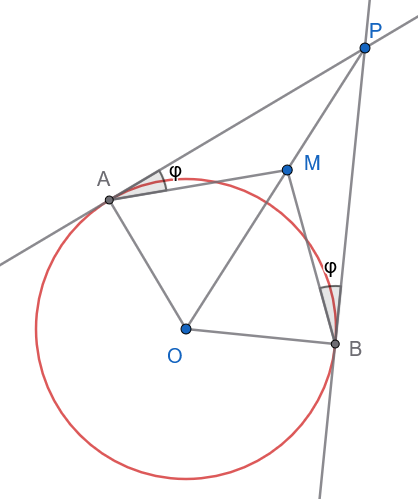{width="300"}

**Απόδειξη:**

Συγκρίνουμε τα τρίγωνα $\triangle MAP$ και $\triangle MBP$:

1.  $PA = PB$ (από το *Θεώρημα 2.1*).

2.  $PM$ κοινή πλευρά.

3.  $\widehat{APM} = \widehat{BPM}$ (καθώς η διακεντρική ευθεία $OP$ διχοτομεί τη γωνία $\widehat{APB}$).

Από το **Κριτήριο Ισότητας ΠΓΠ**, τα τρίγωνα είναι ίσα.

Επομένως, όλες οι αντίστοιχες γωνίες τους είναι ίσες, άρα $\widehat{MAP} = \widehat{MBP}$.

**Άσκηση 15**

**Εκφώνηση:** Δίνονται δύο ομόκεντροι κύκλοι $(O, R)$ και $(O, \rho)$ με $R > \rho$.
Από ένα σημείο $P$ του εξωτερικού κύκλου φέρουμε τα εφαπτόμενα τμήματα $PA, PB$ προς τον εσωτερικό κύκλο.
Να αποδείξετε ότι η γωνία $\widehat{APB}$ παραμένει σταθερή καθώς το $P$ κινείται στον εξωτερικό κύκλο.

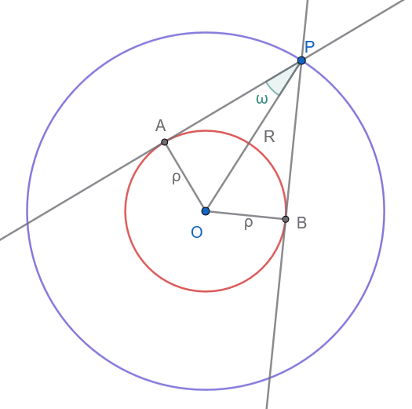{width="350"}

**Απόδειξη:**

Στο ορθογώνιο τρίγωνο $\triangle OAP$ ($\widehat{A} = 90^\circ$, καθώς η $PA$ εφάπτεται στον εσωτερικό κύκλο), ισχύει:

'Ας θυμηθούμε τα μαθήματα τριγωνομετρίας Β Γυμνασίου\` $$ημ(\widehat{APO}) = \frac{OA}{OP} = \frac{\rho}{R}$$

Επειδή τα μήκη των ακτινών $R$ και $\rho$ είναι σταθερά, ο λόγος $\dfrac{\rho}{R}$ είναι σταθερός, άρα και η γωνία $\widehat{APO}$ παραμένει σταθερή.

Επειδή η $OP$ διχοτομεί τη γωνία $\widehat{APB}$, έχουμε: $$\widehat{APB} = 2\widehat{APO}$$

Συνεπώς, η γωνία $\widehat{APB}$ είναι σταθερή.

**Άσκηση 16**

Τρεις κύκλοι με ακτίνες $a,β, γ$ εφάπτονται ανά δύο εξωτερικά.
Υπολογίστε την περίμετρο του τριγώνου των κέντρων.

**Απόδειξη:**

> > Σχεδιάστε το σχήμα.

Οι πλευρές του τριγώνου είναι οι διάκεντροι $\delta_1 = a+β$, $\delta_2 = β+γ$, $\delta_3 = α+γ$.

Η περίμετρος είναι $\Pi = (α+β) + (β+γ) + (α+γ) = 2(α+β+γ)$.

**Άσκηση 17**

Από εξωτερικό σημείο Ρ κύκλου $(Ο,R)$ φέρουμε τα εφαπτόμενα τμήματα ΡΑ και ΡΒ.
Μία τρίτη εφαπτομένη στο σημείο Ε του κύκλου τέμνει τα ΡΑ και ΡΒ στα σημεία Γ,Δ αντίστοιχα.
Να αποδείξετε ότι η περίμετρος του τριγώνου ΡΓΔ είναι ΡΑ+ΡΒ.

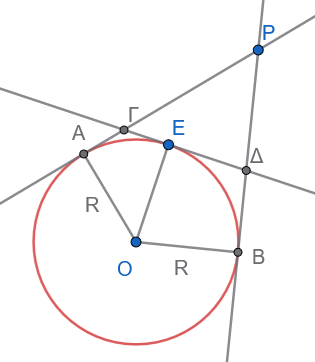{width="250"}

**Απόδειξη:**

> > ΓΑ=ΓΕ και ΔΒ=ΔΕ

..................

**Άσκηση 18**

**Εκφώνηση:** Έστω $PA, PB$ τα εφαπτόμενα τμήματα από εξωτερικό σημείο $P$ προς κύκλο $(O, R)$.
Αν η $OP$ τέμνει τον κύκλο στα σημεία $\Gamma$ και $\Delta$, να αποδείξετε ότι $PA^2 = P\Gamma \cdot P\Delta$.

**Απόδειξη:**

Στο ορθογώνιο τρίγωνο $\triangle OAP$ ($\widehat{A} = 90^\circ$), από το Πυθαγόρειο Θεώρημα έχουμε: $$PA^2 = OP^2 - OA^2 = OP^2 - R^2 \quad (1)$$

Τα σημεία $\Gamma$ και $\Delta$ είναι τα άκρα της διαμέτρου επί της $OP$, άρε $O\Gamma = O\Delta = R$.

Συνεπώς: $$P\Gamma = OP - O\Gamma = OP - R$$ $$P\Delta = OP + O\Delta = OP + R$$

Πολλαπλασιάζουμε τα δύο τμήματα: $$P\Gamma \cdot P\Delta = (OP - R)(OP + R) = OP^2 - R^2 \quad (2)$$

Από τις σχέσεις (1) και (2) προκύπτει άμεσα ότι: $$PA^2 = P\Gamma \cdot P\Delta$$

:::: {.math-box .exercise-box}
::: {.math-title .exercise-title}
**Άσκηση 19**
:::

**Εκφώνηση:** Από εξωτερικό σημείο $P$ κύκλου $(O, R)$ φέρουμε τα εφαπτόμενα τμήματα $PA, PB$ και τη διάκεντρο $OP$, η οποία τέμνει τη χορδή $AB$ στο $H$.
Να αποδείξετε ότι $OH \cdot OP = R^2$.

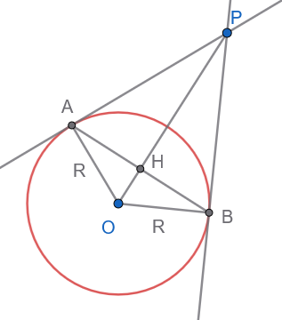{width="250"}
::::

:::: {.math-box .solution-box}
::: {.math-title .solution-title}
**Απόδειξη:**

(με Πυθαγόρειο Θεώρημα)
:::

**1. Ιδιότητες του σχήματος:**

- Τα εφαπτόμενα τμήματα από εξωτερικό σημείο είναι ίσα, άρα $PA = PB$.
- Το σημείο $O$ ισαπέχει από τα $A$ και $B$ ($OA = OB = R$).
- Επομένως, η ευθεία $OP$ είναι η μεσοκάθετος του τμήματος $AB$. Αυτό σημαίνει ότι:

1.  Η $OP$ είναι κάθετη στην $AB$ ($OP \perp AB$) στο σημείο $H$.
2.  Το τρίγωνο $AHO$ είναι **ορθογώνιο** στο $H$.

- Επίσης, η ακτίνα $OA$ είναι κάθετη στην εφαπτομένη $PA$ ($OA \perp PA$), οπότε το τρίγωνο $PAO$ είναι **ορθογώνιο** στο $A$.

**2. Εφαρμογή Πυθαγορείου Θεωρήματος:**

- **Στο ορθογώνιο τρίγωνο** $AHO$ ($\hat{H} = 90^\circ$):

$$OA^2 = OH^2 + AH^2 \implies R^2 = OH^2 + AH^2 \quad (1)$$

- **Στο ορθογώνιο τρίγωνο** $AHP$ ($\hat{H} = 90^\circ$):

$$AP^2 = PH^2 + AH^2 \implies AH^2 = AP^2 - PH^2 \quad (2)$$

Αντικαθιστούμε το $AH^2$ της σχέσης (2) στη σχέση (1):

$$R^2 = OH^2 + AP^2 - PH^2 \quad (3)$$

- **Στο ορθογώνιο τρίγωνο** $PAO$ ($\hat{A} = 90^\circ$):

$$OP^2 = OA^2 + AP^2 \implies AP^2 = OP^2 - R^2 \quad (4)$$

**3. Τελική αντικατάσταση και αλγεβρική απλοποίηση:**

Αντικαθιστούμε το $AP^2$ της σχέσης (4) στη σχέση (3):

$$R^2 = OH^2 + (OP^2 - R^2) - PH^2$$

Γνωρίζουμε ότι $PH = OP - OH$.
Αντικαθιστούμε το $PH$:

$$R^2 = OH^2 + OP^2 - R^2 - (OP - OH)^2$$

Αναπτύσσουμε την ταυτότητα $(OP - OH)^2 = OP^2 - 2 \cdot OP \cdot OH + OH^2$:

$$R^2 = OH^2 + OP^2 - R^2 - (OP^2 - 2 \cdot OP \cdot OH + OH^2)$$

$$R^2 = OH^2 + OP^2 - R^2 - OP^2 + 2 \cdot OP \cdot OH - OH^2$$

Απλοποιούμε τους όρους που αλληλοαναιρούνται ($OH^2 - OH^2 = 0$ και $OP^2 - OP^2 = 0$):

$$R^2 = -R^2 + 2 \cdot OP \cdot OH$$

Μεταφέρουμε το $-R^2$ στο αριστερό μέλος:

$$2 \cdot R^2 = 2 \cdot OP \cdot OH$$

Διαιρούμε με το $2$:

$$OH \cdot OP = R^2$$
::::

**Άσκηση 20**

**Εκφώνηση:** Αν η γωνία μεταξύ των εφαπτόμενων τμημάτων $PA, PB$ από ένα εξωτερικό σημείο $P$ είναι ορθή ($\widehat{APB} = 90^\circ$), να αποδείξετε ότι το τετράπλευρο $OAPB$ είναι τετράγωνο και ότι $PA = R$.

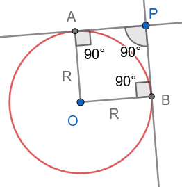{width="180"}

**Απόδειξη:**

Στο τετράπλευρο $OAPB$:

1.  $\widehat{APB} = 90^\circ$ (από υπόθεση).
2.  $\widehat{OAP} = 90^\circ$ (ακτίνα κάθετη στην εφαπτομένη).
3.  $\widehat{OBP} = 90^\circ$ (ακτίνα κάθετη στην εφαπτομένη).

Εφόσον το τετράπλευρο έχει τρεις ορθές γωνίες, είναι ορθογώνιο.

Επίσης, έχει δύο διαδοχικές πλευρές ίσες, καθώς $OA = OB = R$ (ακτίνες).

Ένα ορθογώνιο με δύο διαδοχικές πλευρές ίσες είναι τετράγωνο.

Συνεπώς, όλες οι πλευρές του είναι ίσες, άρα $PA = PB = OA = OB = R$.

------------------------------------------------------------------------

### ΜΕΡΟΣ 3: ΣΧΕΤΙΚΕΣ ΘΕΣΕΙΣ ΔΥΟ ΚΥΚΛΩΝ

#### Ορισμοί

:::: {.math-box .definition-box}
::: {.math-title .definition-title}
- **Διάκεντρος**:
:::

Έστω δύο κύκλοι $(K, R)$ και $(\Lambda, \rho)$ με $R \ge \rho$.
Το ευθύγραμμο τμήμα $K\Lambda$ που συνδέει τα κέντρα των δύο κύκλων ονομάζεται **διάκεντρος** και το μήκος του συμβολίζεται με $d$.

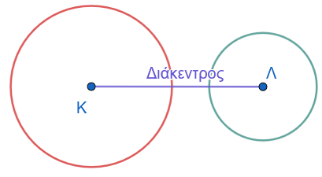{width="300"}
::::

:::: {.math-box .definition-box}
::: {.math-title .definition-title}
- **Κοινή Εφαπτομένη**:
:::

Μια ευθεία η οποία εφάπτεται ταυτόχρονα και στους δύο κύκλους ονομάζεται **κοινή εφαπτομένη** τους.

- **Κοινή Εξωτερική Εφαπτομένη**: Ονομάζεται η κοινή εφαπτομένη όταν οι δύο κύκλοι βρίσκονται προς το ίδιο μέρος αυτής.
  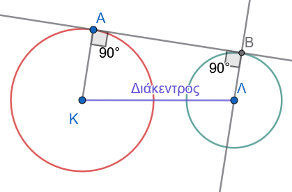{width="250"}

- **Κοινή Εσωτερική Εφαπτομένη**: Ονομάζεται η κοινή εφαπτομένη όταν οι δύο κύκλοι βρίσκονται εκατέρωθεν αυτής.
  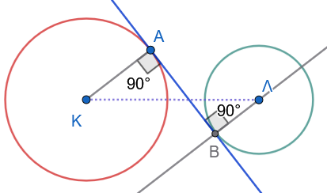{width="250"}
::::

Οι σχετικές θέσεις δύο κύκλων εξαρτώνται από τη σχέση της διακέντρου με το άθροισμα ή τη διαφορά των ακτίνων τους.
Διακρίνουμε τις παρακάτω περιπτώσεις:

:::: {.math-box .definition-box}
::: {.math-title .definition-title}
• Κύκλοι χωρίς κοινά σημεία
:::

- Ο κύκλος $(Λ, ρ)$ βρίσκεται στο **εσωτερικό** του $(Κ, R)$, αν και μόνο αν $δ < R - ρ$ .
  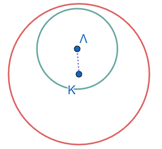{width="200"}

- Οι κύκλοι $(Κ, R)$ και $(Λ, ρ)$ βρίσκεται ο ένας στο **εξωτερικό** του άλλου, αν και μόνο αν $δ > R + ρ$ .
  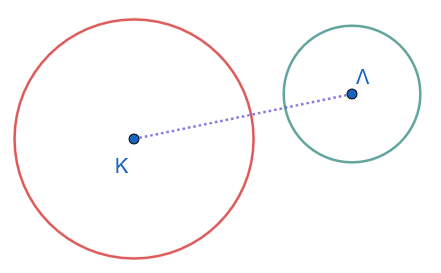{width="250"}
::::

:::: {.math-box .definition-box}
::: {.math-title .definition-title}
• Εφαπτόμενοι κύκλοι
:::

- Οι κύκλοι εφάπτονται **εσωτερικά**, δηλαδή έχουν ένα κοινό σημείο και ο κύκλος ($Λ, ρ$) βρίσκεται στο εσωτερικό του $(Κ, R)$, αν και μόνο αν $δ = R - ρ$ .
  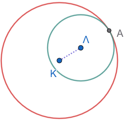{width="200"}

- Οι κύκλοι εφάπτονται **εξωτερικά**, δηλαδή έχουν ένα κοινό σημείο και ο ένας βρίσκεται στο εξωτερικό του άλλου, αν και μόνο αν $δ = R + ρ$ .
  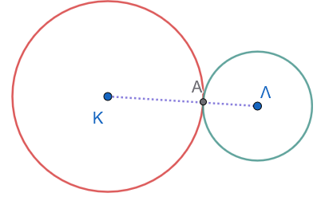{width="300" height="180"}

Το κοινό σημείο δύο εφαπτόμενων κύκλων λέγεται **σημείο επαφής** και είναι σημείο της διακέντρου.
::::

Πράγματι, αν το σημείο επαφής Α δεν είναι σημείο της διακέντρου, τότε από το τρίγωνο ΑΚΛ έχουμε $ΚΛ < ΚΑ + ΑΛ$, δηλαδή $δ < R + ρ$, που είναι άτοπο.

:::: {.math-box .definition-box}
::: {.math-title .definition-title}
• Τεμνόμενοι κύκλοι
:::

Οι κύκλοι **τέμνονται**, δηλαδή έχουν δύο κοινά σημεία, αν και μόνο αν $R - ρ < δ < R + ρ$ .

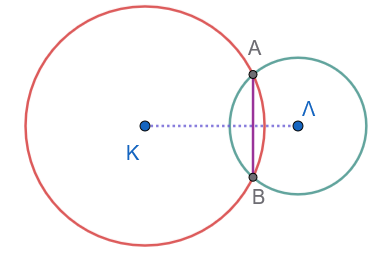{width="300"}

Το ευθύγραμμο τμήμα ΑΒ που ενώνει τα κοινά σημεία λέγεται **κοινή χορδή** των δύο κύκλων.
::::

------------------------------------------------------------------------

#### Θεωρήματα

:::: {.math-box .theorem-box}
::: {.math-title .theorem-title}
Θεώρημα 3.1
:::

Αν δύο κύκλοι τέμνονται σε δύο σημεία $A$ και $B$, τότε η διάκεντρος $K\Lambda$ είναι η μεσοκάθετος της κοινής χορδής $AB$.

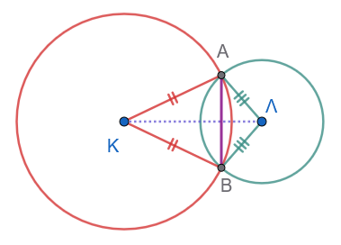{width="300"}
::::

:::: {.math-box .apodeixi-box}
::: {.math-title .apodeixi-title}
**Απόδειξη:**
:::

Τα σημεία $A$ και $B$ ανήκουν και στους δύο κύκλους.

- Επειδή $KA = KB = R$, το σημείο $K$ ισαπέχει από τα άκρα της κοινής χορδής $AB$, άρα ανήκει στη μεσοκάθετό της.

- Επειδή $\Lambda A = \Lambda B = \rho$, το σημείο $\Lambda$ επίσης ισαπέχει από τα άκρα της $AB$, άρα ανήκει στη μεσοκάθετό της.

Συνεπώς, η ευθεία της διακέντρου $K\Lambda$ είναι η **μεσοκάθετος** της κοινής χορδής $AB$.
::::

------------------------------------------------------------------------

#### Πορίσματα

:::: {.math-box .corollary-box}
::: {.math-title .corollary-title}
**Πόρισμα 3.1**
:::

Αν δύο κύκλοι εφάπτονται (εσωτερικά ή εξωτερικά), το σημείο επαφής τους $A$ ανήκει υποχρεωτικά στη διάκεντρο $K\Lambda$.

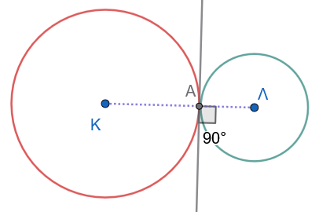{width="300"}
::::

:::: {.math-box .corollaryproof-box}
::: {.math-title .corollaryproof-title}
**Απόδειξη:**
:::

Έστω ότι οι κύκλοι εφάπτονται στο σημείο $A$ και $\epsilon$ είναι η κοινή εφαπτομένη τους στο $A$.

Σύμφωνα με το *Θεώρημα 1.2*, η ακτίνα $KA$ του πρώτου κύκλου είναι κάθετη στην $\epsilon$ στο $A$, και η ακτίνα $\Lambda A$ του δεύτερου κύκλου είναι επίσης κάθετη στην $\epsilon$ στο $A$.

Από ένα σημείο $A$ της ευθείας $\epsilon$ άγεται μία μόνο κάθετος προς αυτήν.

Συνεπώς, τα ευθύγραμμα τμήματα $KA$ και $\Lambda A$ βρίσκονται πάνω στην ίδια ευθεία, πράγμα που σημαίνει ότι το σημείο επαφής $A$, το $K$ και το $\Lambda$ είναι συνευθειακά σημεία.
Άρα, το $A$ ανήκει στη διάκεντρο $K\Lambda$.
::::

------------------------------------------------------------------------

#### Εφαρμογές (Λυμένα Παραδείγματα)

:::: {.math-box .example-box}
::: {.math-title .example-title}
**Εφαρμογή 1**
:::

**Δύο κύκλοι με κέντρα** $K, \Lambda$ εφάπτονται εξωτερικά στο σημείο $A$.
Μια ευθεία $\epsilon$ είναι κοινή εξωτερική εφαπτομένη των δύο κύκλων και εφάπτεται σε αυτούς στα σημεία $B$ και $\Gamma$ αντίστοιχα.
Να αποδειχθεί ότι η κοινή εσωτερική εφαπτομένη $\zeta$ των δύο κύκλων στο $A$ διχοτομεί το τμήμα $B\Gamma$.

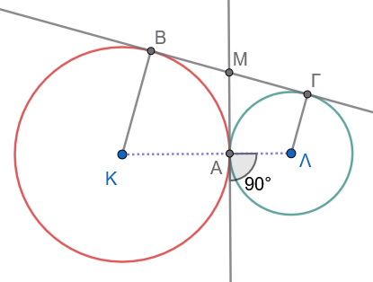{width="300"}
::::

:::: {.math-box .examplesolution-box}
::: {.math-title .examplesolution-title}
**Λύση:**
:::

Έστω $M$ το σημείο τομής της κοινής εσωτερικής εφαπτομένης $\zeta$ με την κοινή εξωτερική εφαπτομένη $\epsilon$.

- Για τον κύκλο $(K)$, τα τμήματα $MB$ και $MA$ είναι εφαπτόμενα τμήματα από το εξωτερικό σημείο $M$, άρα $MB = MA$ (1).

- Για τον κύκλο $(\Lambda)$, τα τμήματα $M\Gamma$ και $MA$ είναι εφαπτόμενα τμήματα από το εξωτερικό σημείο $M$, άρα $M\Gamma = MA$ (2).

Από τις σχέσεις (1) και (2) προκύπτει άμεσα ότι: $$MB = M\Gamma$$

Συνεπώς, το σημείο $M$ είναι το μέσο του ευθυγράμμου τμήματος $B\Gamma$, δηλαδή η εσωτερική εφαπτομένη $\zeta$ **διχοτομεί** το τμήμα $B\Gamma$.
::::

:::: {.math-box .example-box}
::: {.math-title .example-title}
**Εφαρμογή 2**
:::

**Στο σχήμα της προηγούμενης *Εφαρμογής 1*, να αποδειχθεί ότι η γωνία** $\widehat{BA\Gamma}$ είναι ορθή ($\widehat{BA\Gamma} = 90^\circ$).
::::

:::: {.math-box .examplesolution-box}
::: {.math-title .examplesolution-title}
**Λύση:**
:::

Από την ισότητα των τμημάτων στην *Εφαρμογή 1*, έχουμε $MA = MB = M\Gamma$.

- Στο τρίγωνο $\triangle MAB$, επειδή $MA = MB$, το τρίγωνο είναι ισοσκελές, άρα $\widehat{MAB} = \widehat{MBA} = \alpha$.

- Στο τρίγωνο $\triangle MA\Gamma$, επειδή $MA = M\Gamma$, το τρίγωνο είναι ισοσκελές, άρα $\widehat{MA\Gamma} = \widehat{M\Gamma A} = \beta$.

Η γωνία $\widehat{BA\Gamma}$ ισούται με: $$\widehat{BA\Gamma} = \widehat{MAB} + \widehat{MA\Gamma} = \alpha + \beta$$

Στο τρίγωνο $\triangle AB\Gamma$, το άθροισμα των εσωτερικών γωνιών είναι $180^\circ$: $$\widehat{A} + \widehat{B} + \widehat{\Gamma} = 180^\circ \implies (\alpha + \beta) + \alpha + \beta = 180^\circ \implies 2(\alpha + \beta) = 180^\circ \implies \alpha + \beta = 90^\circ$$

Συνεπώς, η γωνία $\widehat{BA\Gamma}$ είναι ορθή ($90^\circ$).
::::

:::: {.math-box .example-box}
::: {.math-title .example-title}
**Εφαρμογή 3**
:::

**Δύο κύκλοι** $(K, R)$ και $(\Lambda, \rho)$ τέμνονται στα σημεία $A$ και $B$.
Να αποδειχθεί ότι η διάκεντρος $K\Lambda$ διχοτομεί την κοινή χορδή $AB$.
::::

:::: {.math-box .examplesolution-box}
::: {.math-title .examplesolution-title}
**Λύση:**
:::

Σύμφωνα με το *Πόρισμα 3.1*, η διάκεντρος $K\Lambda$ είναι η μεσοκάθετος της κοινής χορδής $AB$.

Από τον ορισμό της μεσοκαθέτου, η ευθεία της διακέντρου διέρχεται από το μέσο της χορδής $AB$.

Συνεπώς, η διάκεντρος διχοτομεί την κοινή χορδή $AB$.
::::

------------------------------------------------------------------------

#### Ασκήσεις με Πλήρεις Αποδείξεις

**Άσκηση 21**

**Εκφώνηση:** Δύο κύκλοι έχουν ακτίνες $R = 8 \text{ cm}$ και $\rho = 3 \text{ cm}$.
Να προσδιορίσετε τη σχετική τους θέση αν η διάκεντρος $d$ ισούται με:

- α. $12 \text{ cm}$,
- β. $11 \text{ cm}$,
- γ. $8 \text{ cm}$,
- δ. $5 \text{ cm}$,
- ε. $2 \text{ cm}$.

**Λύση:**

Υπολογίζουμε το άθροισμα και τη διαφορά των ακτινών: $$R + \rho = 8 + 3 = 11 \text{ cm}$$ $$R - \rho = 8 - 3 = 5 \text{ cm}$$

- α.
  Αν $d = 12 \text{ cm}$: Επειδή $d > R + \rho$ ($12 > 11$), ο ένας κύκλος είναι **εξωτερικός** του άλλου.

- β.
  Αν $d = 11 \text{ cm}$: Επειδή $d = R + \rho$ ($11 = 11$), οι κύκλοι **εφάπτονται εξωτερικά**.

- γ.
  Αν $d = 8 \text{ cm}$: Επειδή $R - \rho < d < R + \rho$ ($5 < 8 < 11$), οι κύκλοι **τέμνονται** σε δύο σημεία.

- δ.
  Αν $d = 5 \text{ cm}$: Επειδή $d = R - \rho$ ($5 = 5$), οι κύκλοι **εφάπτονται εσωτερικά**.

- ε.
  Αν $d = 2 \text{ cm}$: Επειδή $d < R - \rho$ ($2 < 5$), ο ένας κύκλος είναι **εσωτερικός** του άλλου.

**Άσκηση 22**

**Εκφώνηση:** Δύο ίσοι κύκλοι $(K, R)$ και $(\Lambda, R)$ τέμνονται στα σημεία $A$ και $B$.
Να αποδείξετε ότι η κοινή χορδή $AB$ είναι η μεσοκάθετος της διακέντρου $K\Lambda$.

**Απόδειξη:**

Τα σημεία $K$ και $\Lambda$ ισαπέχουν από τα κοινά σημεία $A$ και $B$: $$KA = \Lambda A = R \quad \text{και} \quad KB = \Lambda B = R$$

Συνεπώς:

- Το σημείο $A$ ισαπέχει από τα $K$ και $\Lambda$, άρα ανήκει στη μεσοκάθετο του τμήματος $K\Lambda$.
- Το σημείο $B$ ισαπέχει από τα $K$ και $\Lambda$, άρα ανήκει στη μεσοκάθετο του τμήματος $K\Lambda$.

Εφόσον η ευθεία $AB$ συνδέει δύο σημεία της μεσοκαθέτου του τμήματος $K\Lambda$, είναι η μεσοκάθετος της διακέντρου $K\Lambda$.

:::: {.math-box .exercise-box}
::: {.math-title .exercise-title}
**Άσκηση 23**
:::

**Εκφώνηση:** Αν δύο κύκλοι $(K, R)$ και $(\Lambda, \rho)$ είναι εξωτερικοί, να αποδείξετε ότι το μήκος $L$ της κοινής εξωτερικής εφαπτομένης τους $B\Gamma$ ισούται με $L = \sqrt{d^2 - (R - \rho)^2}$.
::::

:::: {.math-box .solution-box}
::: {.math-title .solution-title}
**Απόδειξη:**
:::

Έστω $B$ και $\Gamma$ τα σημεία επαφής στους δύο κύκλους αντίστοιχα, οπότε $KB \perp B\Gamma$ και $\Lambda\Gamma \perp B\Gamma$.

Από το κέντρο $\Lambda$ του μικρότερου κύκλου φέρουμε παράλληλη προς την $B\Gamma$, η οποία τέμνει την ακτίνα $KB$ στο σημείο $H$.

Το τετράπλευρο $H\Gamma\Lambda B$ είναι ορθογώνιο (έχει τρεις ορθές γωνίες), άρα: $$H\Lambda = B\Gamma = L \quad \text{και} \quad KH = KB - HB = R - \rho \quad$$

Στο ορθογώνιο τρίγωνο $\triangle KH\Lambda$ (ορθογώνιο στο $H$), εφαρμόζουμε το Πυθαγόρειο Θεώρημα: $$\begin{align}
K\Lambda^2 &= KH^2 + H\Lambda^2 \implies \\ d^2 &= (R - \rho)^2 + L^2 \implies \\ L^2 &= d^2 - (R - \rho)^2 \implies \\ L &= \sqrt{d^2 - (R - \rho)^2} \quad
\end{align}$$
::::

:::: {.math-box .exercise-box}
::: {.math-title .exercise-title}
**Άσκηση 24**
:::

**Εκφώνηση:** Δύο κύκλοι $(K, R)$ και $(\Lambda, \rho)$ εφάπτονται εξωτερικά στο σημείο $A$.
Να αποδείξετε ότι το μήκος $L$ της κοινής εξωτερικής εφαπτομένης τους $B\Gamma$ ισούται με $L = 2\sqrt{R\rho}$.
::::

:::: {.math-box .solution-box}
::: {.math-title .solution-title}
**Απόδειξη:**
:::

Εφόσον οι κύκλοι εφάπτονται εξωτερικά, η διάκεντρος είναι $d = R + \rho$.

Χρησιμοποιούμε τον τύπο της κοινής εξωτερικής εφαπτομένης από την *Άσκηση 23*:

$$L^2 = d^2 - (R - \rho)^2 \implies L^2 = (R + \rho)^2 - (R - \rho)^2$$

$$L^2 = (R^2 + 2R\rho + \rho^2) - (R^2 - 2R\rho + \rho^2) = 4R\rho \implies L = 2\sqrt{R\rho} \quad$$
::::

:::: {.math-box .exercise-box}
::: {.math-title .exercise-title}
**Άσκηση 25**
:::

**Εκφώνηση:** Δύο ίσοι κύκλοι $(K, R)$ και $(\Lambda, R)$ τέμνονται στα σημεία $A$ και $B$.
Αν η διάκεντρος είναι $K\Lambda = R$, να αποδείξετε ότι το τετράπλευρο $K A \Lambda B$ αποτελείται από δύο κολλημένα ισόπλευρα τρίγωνα και οι γωνίες του είναι $60^\circ$ και $120^\circ$.

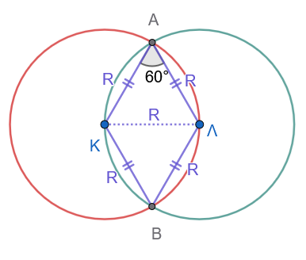{width="300"}
::::

:::: {.math-box .solution-box}
::: {.math-title .solution-title}
**Απόδειξη:**
:::

Οι πλευρές του τετραπλεύρου $K A \Lambda B$ είναι ακτίνες των δύο ίσων κύκλων: $$KA = KB = \Lambda A = \Lambda B = R$$

Επίσης, δίνεται ότι η διαγώνιος $K\Lambda$ ισούται με $R$.

Στο τρίγωνο $\triangle KA\Lambda$, όλες οι πλευρές είναι ίσες με $R$ ($KA = A\Lambda = K\Lambda = R$), άρα το τρίγωνο είναι ισόπλευρο, οπότε η γωνία $\widehat{KA\Lambda} = 60^\circ$.

Όμοια, το τρίγωνο $\triangle KB\Lambda$ είναι ισόπλευρο με $\widehat{KB\Lambda} = 60^\circ$.

Οι γωνίες του ρόμβου $K A \Lambda B$ είναι: $$\widehat{A} = \widehat{B} = 60^\circ$$ $$\widehat{K} = \widehat{\Lambda} = 60^\circ + 60^\circ = 120^\circ$$
::::

**Άσκηση 26**

**Εκφώνηση:** Δύο κύκλοι $(K, R)$ και $(\Lambda, \rho)$ είναι εξωτερικοί με διάκεντρο $d$.
Να αποδείξετε ότι η μέγιστη απόσταση μεταξύ ενός σημείου του πρώτου κύκλου και ενός σημείου του δεύτερου κύκλου είναι $d + R + \rho$, και η ελάχιστη απόσταση είναι $d - R - \rho$.

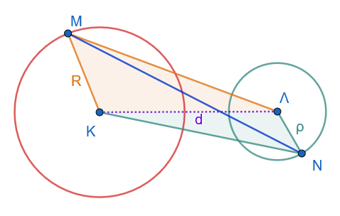{width="350"}

**Απόδειξη:**

Έστω $M$ τυχαίο σημείο του πρώτου κύκλου και $N$ τυχαίο σημείο του δεύτερου κύκλου.

Από την τριγωνική ανισότητα στο τρίγωνο $\triangle KM\Lambda$ και στο $\triangle \Lambda NK$ προκύπτει ότι: $$MN \le KM + K\Lambda + \Lambda N = R + d + \rho$$

Η ισότητα ισχύει όταν τα σημεία $M, K, \Lambda, N$ είναι συνευθειακά με τη σειρά αυτή (δηλαδή στα εξωτερικά άκρα της διακέντρου).

Συνεπώς, η μέγιστη απόσταση είναι $d + R + \rho$.

Ομοίως, για την ελάχιστη απόσταση: $$MN \ge K\Lambda - KM - \Lambda N = d - R - \rho$$

Η ισότητα ισχύει όταν τα σημεία βρίσκονται πάνω στη διάκεντρο στα εσωτερικά άκρα, άρα η ελάχιστη απόσταση είναι $d - R - \rho$.

**Άσκηση 27**

**Εκφώνηση:** Τρεις κύκλοι εφάπτονται εξωτερικά ανά δύο.
Να αποδείξετε ότι οι κοινές εσωτερικές εφαπτόμενές τους στα σημεία επαφής συντρέχουν στο ίδιο σημείο (ριζικό κέντρο), το οποίο είναι το κέντρο κύκλου που τέμνει και τους τρεις κύκλους.

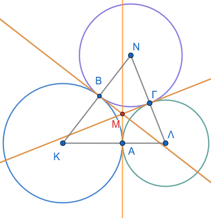{width="350"}

**Απόδειξη:**

Έστω $\epsilon_1, \epsilon_2, \epsilon_3$ οι τρεις κοινές εσωτερικές εφαπτόμενες στα σημεία επαφής των κύκλων ανά δύο.
Οι ευθείες $\epsilon_1$ και $\epsilon_2$ τέμνονται σε ένα σημείο $M$.

Από την ιδιότητα των εφαπτόμενων τμημάτων, το σημείο $M$ ως σημείο της $\epsilon_1$ ισαπέχει από τους δύο πρώτους κύκλους ΜΑ=ΜΒ, και ως σημείο της $\epsilon_2$ ισαπέχει από τον δεύτερο και τον τρίτο κύκλο ΜΒ=ΜΓ.

Λόγω της μεταβατικής ιδιότητας, το $M$ θα ισαπέχει και από τον πρώτο και τον τρίτο κύκλο ΜΑ=ΜΓ.

Συνεπώς, το σημείο $M$ ανήκει και στην τρίτη κοινή εσωτερική εφαπτομένη $\epsilon_3$.

Άρα, οι τρεις εσωτερικές εφαπτόμενες συντρέχουν στο σημείο $M$, το οποίο είναι το κέντρο κύκλου που τέμνει και τους τρεις κύκλους.

**Άσκηση 28**

Αν δύο κύκλοι είναι ομόκεντροι με $R \neq \rho$, αποδείξτε ότι δεν διαθέτουν κοινά σημεία.

**Άσκηση 29**

Δύο κύκλοι $(O, 12)$ και $(K, 7)$ έχουν $\delta = 3$. Ποια η σχετική θέση;

(Λύση: Εσωτερικοί).

**Άσκηση 30**
Αποδείξτε ότι η κοινή χορδή δύο τεμνόμενων κύκλων είναι πάντοτε μικρότερη από τη διάμετρο του μικρότερου κύκλου.

**Άσκηση 31**
Τρεις ίσοι κύκλοι εφάπτονται ανά δύο εξωτερικά. Τι είδους τρίγωνο σχηματίζουν τα κέντρα τους; 

(Λύση: Ισόπλευρο).

**Άσκηση 32**
Αποδείξτε ότι αν δύο κύκλοι εφάπτονται εσωτερικά, η διάκεντρος είναι μικρότερη από την ακτίνα του μεγαλύτερου κύκλου.

::: {.callout-important title="ΣΑΣ ΕΥΧΟΜΑΙ"}
ΚΑΛΗ ΜΕΛΕΤΗ !!!
:::
