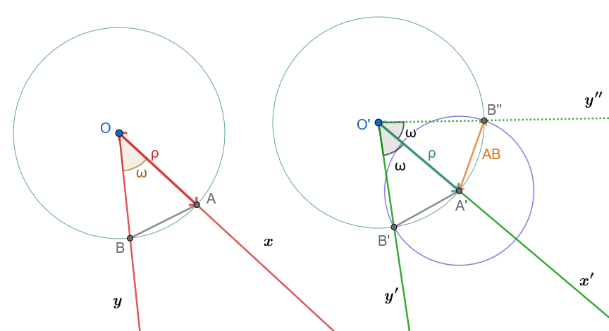
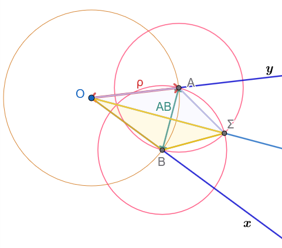
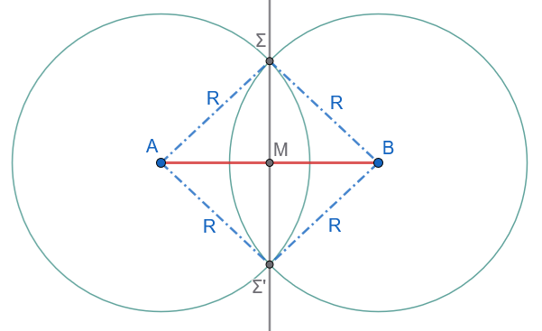
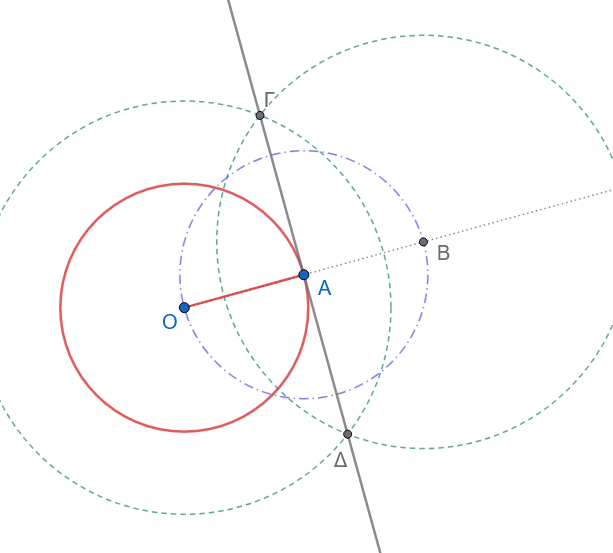
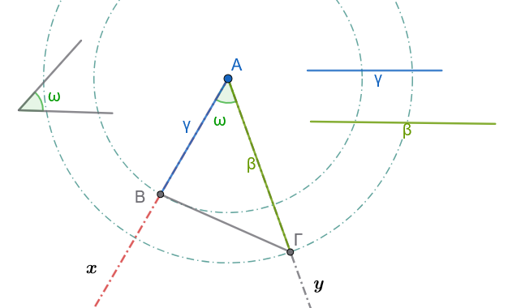
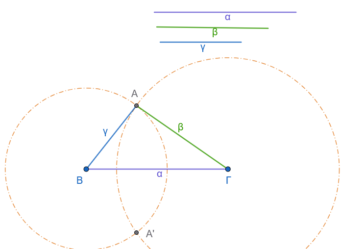
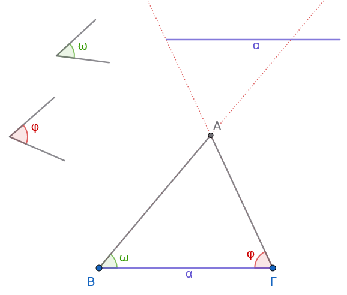
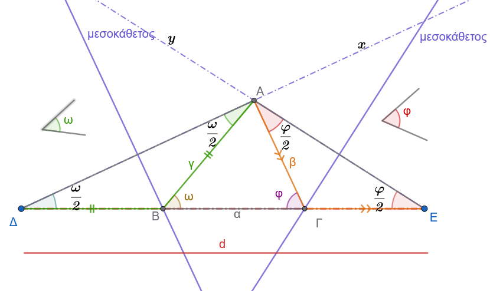

```{=html}
<!-- Φόρτωση βιβλιοθήκης GeoGebra -->
<script src="https://www.geogebra.org/apps/deployggb.js"></script>

<!-- Συνάρτηση δημιουργίας applets -->
<script>
function createGeoGebra(containerId, materialId, width = 700, height = 500) {
  var params = {
    "id": "ggb-" + containerId,
    "material_id": materialId,
    "width": width,
    "height": height,
    "showToolBar": true,
    "showMenuBar": false,
    "showAlgebraInput": true
  };
  
  var applet = new GGBApplet(params, '5.2');
  applet.inject(containerId);
}
</script>
```

## Γεωμετρικές κατασκευές

### ΕΝΟΤΗΤΑ 1: ΑΠΛΕΣ ΓΕΩΜΕΤΡΙΚΕΣ ΚΑΤΑΣΚΕΥΕΣ

::: {style="background-color: #db8e79; border: 2px solid #2f3e50; color: #0d0402; padding: 15px; border-radius: 5px;"}
Στη Γεωμετρία, οι **γεωμετρικές κατασκευές** πραγματοποιούνται αποκλειστικά με τη χρήση δύο οργάνων: του **κανόνα** (χάρακα χωρίς διαβάθμιση) για τη σχεδίαση ευθειών και του **διαβήτη** για τη σχεδίαση κύκλων.

Η επίλυση ενός προβλήματος κατασκευής περιλαμβάνει τρία θεμελιώδη στάδια:

- την **κατασκευή** (ή σύνθεση),
- την **απόδειξη** και
- τη **διερεύνηση**.

Όταν η λύση δεν είναι άμεσα εμφανής, προηγείται το βοηθητικό στάδιο της **ανάλυσης**.
:::


:::: {.math-box .corollary-box}
::: {.math-title .corollary-title}
***1. Βασική Κατασκευή: Κατασκευή γωνίας ίσης με δοθείσα***
:::

Δίνεται γωνία $x\widehat{O}y$ και η ημιευθεία $O'x'$.
Να κατασκευασθεί γωνία $x'\widehat{O}'y'$ ίση με τη $x\widehat{O}y$ η οποία να έχει ως μία πλευρά την $O'x'$ και κορυφή το $O'$.

{fig-align="center" width="550"}
::::

:::: {.math-box .corollaryproof-box}
::: {.math-title .corollaryproof-title}
**Κατασκευή**
:::

1.  Με κέντρο την κορυφή $O$ της δοθείσας γωνίας και τυχαία ακτίνα $\rho$, γράφουμε κύκλο που τέμνει τις πλευρές $Ox$ και $Oy$ στα σημεία $A$ και $B$ αντίστοιχα.
    Έστω $AB$ το αντίστοιχο τόξο της.

2.  Με κέντρο την αρχή $O'$ της ημιευθείας $O'x'$ και με την ίδια ακτίνα $\rho$, γράφουμε κύκλο που τέμνει την $O'x'$ στο σημείο $A'$.

3.  Με κέντρο το σημείο $A'$ και ακτίνα ίση με τη χορδή $AB$, γράφουμε κύκλο ο οποίος τέμνει τον κύκλο $(O', \rho)$ στο σημείο $B'$.

4.  Φέρουμε την ημιευθεία $O'B'$.
    Η γωνία $x'\widehat{O}'B'$ (δηλαδή η $x'\widehat{O}'y'$) είναι η ζητούμενη γωνία.
::::

:::: {.math-box .corollaryproof-box}
::: {.math-title .corollaryproof-title}
**Απόδειξη**
:::

Οι γωνίες $x\widehat{O}y$ and $x'\widehat{O}'y'$ είναι ίσες επίκεντρες γωνίες, διότι βαίνουν στα ίσα τόξα $AB$ και $A'B'$ των ίσων κύκλων $(O, \rho)$ και $(O', \rho)$ αντίστοιχα.

Η ισότητα των τόξων εξασφαλίζεται από την ισότητα των αντίστοιχων χορδών $AB = A'B'$ λόγω κατασκευής.
::::

:::: {.math-box .corollaryproof-box}
::: {.math-title .corollaryproof-title}
**Διερεύνηση**
:::

Για να έχει το πρόβλημα λύση, πρέπει οι κύκλοι $(O', \rho)$ και $(A', AB)$ να τέμνονται.

Αυτό συμβαίνει πάντοτε, διότι για τη διάκεντρό τους $O'A' = \rho$ ισχύει η τριγωνική ανισότητα στο τρίγωνο $OAB$: $$\rho - AB < \rho < \rho + AB$$

Η ανισότητα αυτή είναι πάντοτε αληθής επειδή σε κάθε τρίγωνο κάθε πλευρά είναι μικρότερη από το άθροισμα των άλλων δύο και μεγαλύτερη από τη διαφορά τους.

Μια δεύτερη λύση του προβλήματος αντιστοιχεί στο δεύτερο σημείο τομής των κύκλων στο Β''.
::::

------------------------------------------------------------------------

:::: {.math-box .corollary-box}
::: {.math-title .corollary-title}
**Κατασκευή της διχοτόμου γωνίας**
:::

**Εκφώνηση:** Δίνεται κυρτή γωνία $x\widehat{O}y$.
Να κατασκευασθεί η διχοτόμος της.

{fig-align="center" width="400"}
::::

:::: {.math-box .corollaryproof-box}
::: {.math-title .corollaryproof-title}
- **Κατασκευή:**
:::

1.  Με κέντρο την κορυφή $O$ της γωνίας και τυχαία ακτίνα $r$, γράφουμε κύκλο που τέμνει τις πλευρές $Ox$ και $Oy$ στα σημεία $A$ και $B$ αντίστοιχα.

2.  Με κέντρα τα σημεία $A$ και $B$ και με την ίδια ακτίνα $r$ (ή οποιαδήποτε ακτίνα μεγαλύτερη από το μισό του τμήματος $AB$), γράφουμε δύο κύκλους οι οποίοι τέμνονται σε ένα σημείο $\Sigma$ στο εσωτερικό της γωνίας.

3.  Φέρουμε την ημιευθεία $O\Sigma$.
    Η ημιευθεία $O\Sigma$ είναι η ζητούμενη διχοτόμος.
::::

:::: {.math-box .corollaryproof-box}
::: {.math-title .corollaryproof-title}
- **Απόδειξη:**
:::

Συγκρίνουμε τα τρίγωνα $OA\Sigma$ και $OB\Sigma$:

1.  $OA = OB = r$ (ακτίνες του ίδιου κύκλου).

2.  $A\Sigma = B\Sigma = r$ (ακτίνες των ίσων βοηθητικών κύκλων).

3.  $O\Sigma$ κοινή πλευρά.

Τα δύο τρίγωνα είναι ίσα από το κριτήριο ισότητας **Π-Π-Π**.

Συνεπώς, οι ομόλογες γωνίες τους είναι ίσες: $$\widehat{AO\Sigma} = \widehat{BO\Sigma}$$

Άρα η ημιευθεία $O\Sigma$ είναι η διχοτόμος της γωνίας $x\widehat{O}y$.
::::

:::: {.math-box .corollaryproof-box}
::: {.math-title .corollaryproof-title}
- **Διερεύνηση:**
:::

Η κατασκευή είναι πάντα δυνατή διότι η απόσταση $AB$ των δύο σημείων είναι πάντα μικρότερη από $2r$ (από την τριγωνική ανισότητα στο τρίγωνο $OAB$), οπότε οι δύο κύκλοι τέμνονται πάντοτε σε δύο σημεία (το ένα είναι το $\Sigma$).
::::

:::: {.math-box .corollary-box}
::: {.math-title .corollary-title}
***Κατασκευή της μεσοκαθέτου ευθυγράμμου τμήματος***
:::

**Εκφώνηση:** Δίνεται ευθύγραμμο τμήμα $AB$.
Να κατασκευασθεί η μεσοκάθετός του.

{fig-align="center" width="400"}
::::

:::: {.math-box .corollaryproof-box}
::: {.math-title .corollaryproof-title}
- **Κατασκευή:**
:::

1.  Με κέντρο το άκρο $A$ και ακτίνα $R$ μεγαλύτερη από το μισό του τμήματος $AB$ ($R > \dfrac{AB}{2}$), γράφουμε κύκλο.

2.  Με κέντρο το άκρο $B$ και την ίδια ακτίνα $R$, γράφουμε κύκλο που τέμνει τον πρώτο κύκλο στα σημεία $\Sigma$ και $\Sigma'$.

3.  Φέρουμε την ευθεία που ορίζουν τα σημεία $\Sigma$ και $\Sigma'$.
    Η ευθεία $\Sigma\Sigma'$ είναι η μεσοκάθετος του $AB$.
::::

:::: {.math-box .corollaryproof-box}
::: {.math-title .corollaryproof-title}
- **Απόδειξη:**
:::

Επειδή $\Sigma A = \Sigma B = R$ και $\Sigma' A = \Sigma' B = R$ λόγω της κατασκευής, τα σημεία $\Sigma$ και $\Sigma'$ ισαπέχουν από τα άκρα $A$ και $B$ του ευθυγράμμου τμήματος.

Σύμφωνα με τη χαρακτηριστική ιδιότητα της μεσοκαθέτου, κάθε σημείο που ισαπέχει από τα άκρα ευθυγράμμου τμήματος ανήκει στη μεσοκάθετό του.

Συνεπώς, η ευθεία $\Sigma\Sigma'$ είναι η μεσοκάθετος του $AB$.
::::

:::: {.math-box .corollaryproof-box}
::: {.math-title .corollaryproof-title}
- **Διερεύνηση:**
:::

Το πρόβλημα έχει πάντα μοναδική λύση, υπό την απαραίτητη προϋπόθεση ότι $R > \dfrac{AB}{2}$, ώστε οι δύο κύκλοι να τέμνονται σε δύο σημεία.
::::

:::: {.math-box .corollary-box}
::: {.math-title .corollary-title}
***Κατασκευή εφαπτομένης κύκλου σε σημείο του***
:::

**Εκφώνηση:** Δίνεται κύκλος $(O, \rho)$ και ένα σημείο του $A$.
Να κατασκευαστεί η εφαπτομένη ευθεία $\epsilon$ του κύκλου στο σημείο $A$.

{fig-align="center" width="400"}
::::

:::: {.math-box .corollaryproof-box}
::: {.math-title .corollaryproof-title}
- **Υπόθεση:** Κύκλος $(O, \rho)$ και σημείο $A$ με $OA = \rho$.

- **Στόχος:** Κατασκευή ευθείας $\epsilon$ τέτοιας ώστε $\epsilon \perp OA$ στο σημείο $A$.

**Κατασκευή:**
:::

1.  Φέρουμε την ακτίνα $OA$ και την προεκτείνουμε πέρα από το σημείο $A$.

2.  Με κέντρο το σημείο $A$ και ακτίνα ίση με την ακτίνα του κύκλου $\rho = OA$, γράφουμε τόξο που τέμνει την προέκταση της ακτίνας στο σημείο $B$, έτσι ώστε να ισχύει $AB = OA$.

3.  Κατασκευάζουμε τη μεσοκάθετο ευθεία $\epsilon$ του ευθυγράμμου τμήματος $OB$.
    Η ευθεία αυτή είναι η ζητούμενη εφαπτομένη.
::::

:::: {.math-box .corollaryproof-box}
::: {.math-title .corollaryproof-title}
**Απόδειξη:**
:::

Εφόσον $AB = OA$ από κατασκευή, το σημείο $A$ είναι το μέσο του ευθυγράμμου τμήματος $OB$.

Η ευθεία $\epsilon$ κατασκευάστηκε ως η μεσοκάθετος του τμήματος $OB$.
Από τον ορισμό της μεσοκαθέτου, η $\epsilon$ είναι κάθετη στο τμήμα $OB$ στο μέσο του $A$: $$\epsilon \perp OB \implies \epsilon \perp OA$$

Επειδή η ευθεία $\epsilon$ διέρχεται από το άκρο $A$ της ακτίνας $OA$ και είναι κάθετη σε αυτήν, σύμφωνα με το σχετικό θεώρημα, η ευθεία $\epsilon$ είναι εφαπτομένη του κύκλου στο σημείο $A$.
::::

:::: {.math-box .corollaryproof-box}
::: {.math-title .corollaryproof-title}
**Διερεύνηση:**
:::

Η κατασκευή είναι πάντοτε δυνατή και ορίζει μοναδική ευθεία για κάθε σημείο $A$ της περιφέρειας του κύκλου.
::::

------------------------------------------------------------------------

### Ασκήσεις με Πλήρεις Αποδείξεις

> > > Σχεδιάστε σε κάθε περίπτωση το απαραίτητο σχήμα.

**Άσκηση 1: Κατασκευή γωνίας** $45^\circ$

**Εκφώνηση:** Να κατασκευαστεί γεωμετρικά (με κανόνα και διαβήτη) γωνία ίση με $45^\circ$.

- **Κατασκευή:**

  1.  Θεωρούμε μια ευθεία $\epsilon$ και ένα σημείο $O$ πάνω σε αυτήν.
  2.  Υψώνουμε κάθετη ευθεία $\delta$ στο σημείο $O$, σχηματίζοντας μια ορθή γωνία $x\widehat{O}y = 90^\circ$.
  3.  Κατασκευάζουμε τη διχοτόμο $Oz$ της ορθής γωνίας $x\widehat{O}y$ (χρησιμοποιώντας τη μέθοδο του *Παραδείγματος 1*). Η γωνία $x\widehat{O}z$ είναι η ζητούμενη γωνία $45^\circ$.

- **Απόδειξη:**

  Η γωνία $x\widehat{O}y$ είναι ορθή, άρα το μέτρο της είναι $90^\circ$.
  Η ημιευθεία $Oz$ είναι η διχοτόμος της γωνίας, οπότε: $$\widehat{xOz} = \frac{\widehat{xOy}}{2} = \frac{90^\circ}{2} = 45^\circ$$

- **Διερεύνηση:** Η κατασκευή είναι πάντοτε δυνατή και η λύση είναι μοναδική.

------------------------------------------------------------------------

**Άσκηση 2: Διαίρεση γωνίας σε τέσσερις (4) ίσες γωνίες**

**Εκφώνηση:** Δίνεται κυρτή γωνία $x\widehat{O}y$.
Να χωριστεί με κανόνα και διαβήτη σε τέσσερις ίσες γωνίες.

- **Κατασκευή:**

  1.  Κατασκευάζουμε τη διχοτόμο $Oz$ της αρχικής γωνίας $x\widehat{O}y$, η οποία τη χωρίζει στις γωνίες $x\widehat{O}z$ και $z\widehat{O}y$.
  2.  Κατασκευάζουμε τη διχοτόμο $O\delta_1$ της γωνίας $x\widehat{O}z$ και τη διχοτόμο $O\delta_2$ της γωνίας $z\widehat{O}y$.
  3.  Οι ημιευθείες $O\delta_1, Oz, O\delta_2$ χωρίζουν την αρχική γωνία $x\widehat{O}y$ σε τέσσερις διαδοχικές γωνίες.

- **Απόδειξη:**

  Έστω $\omega$ το μέτρο της γωνίας $x\widehat{O}y$.
  Η διχοτόμος $Oz$ ορίζει δύο ίσες γωνίες: $$\widehat{xOz} = \widehat{zOy} = \frac{\omega}{2}$$

  Οι διχοτόμοι $O\delta_1$ και $O\delta_2$ διαιρούν τις γωνίες αυτές αντίστοιχα σε δύο ίσα μέρη η καθεμία.
  Συνεπώς, σχηματίζονται τέσσερις γωνίες με μέτρο: $$\widehat{xO\delta_1} = \widehat{\delta_1 Oz} = \widehat{zO\delta_2} = \widehat{\delta_2 Oy} = \frac{\omega}{4}$$

- **Διερεύνηση:**

  Η κατασκευή είναι πάντοτε δυνατή για κάθε κυρτή γωνία $0^\circ < \omega < 180^\circ$ και η λύση είναι μοναδική.

------------------------------------------------------------------------

**Άσκηση 3: Διαίρεση ευθυγράμμου τμήματος σε τέσσερα (4) ίσα τμήματα**

**Εκφώνηση:** Δίνεται ευθύγραμμο τμήμα $AB$.
Να διαιρεθεί με κανόνα και διαβήτη σε τέσσερα ίσες ευθύγραμμα τμήματα.

- **Κατασκευή:**

  1.  Κατασκευάζουμε τη μεσοκάθετο του τμήματος $AB$ (σύμφωνα με τη μέθοδο του *Παραδείγματος 2*), η οποία τέμνει το $AB$ στο μέσο του $M$.
  2.  Κατασκευάζουμε τη μεσοκάθετο του ευθυγράμμου τμήματος $AM$, η οποία ορίζει το μέσο του $M_1$.
  3.  Κατασκευάζουμε τη μεσοκάθετο του ευθυγράμμου τμήματος $MB$, η οποία ορίζει το μέσο του $M_2$.
  4.  Τα σημεία $M_1, M, M_2$ διαιρούν το τμήμα $AB$ στα τέσσερα ζητούμενα τμήματα.

- **Απόδειξη:**

  Εφόσον το $M$ είναι το μέσο του $AB$, ισχύει: $$AM = MB = \frac{AB}{2}$$

  Επειδή το $M_1$ είναι το μέσο του $AM$ και το $M_2$ είναι το μέσο του $MB$, έχουμε: $$AM_1 = M_1M = \frac{AM}{2} = \frac{AB}{4} \quad \text{και} \quad MM_2 = M_2B = \frac{MB}{2} = \frac{AB}{4}$$

  Συνεπώς, προκύπτει η ισότητα των τεσσάρων τμημάτων: $$AM_1 = M_1M = MM_2 = M_2B = \frac{AB}{4}$$

- **Διερεύνηση:**

  Η κατασκευή είναι πάντα δυνατή για κάθε ευθύγραμμο τμήμα σταθερού μήκους $d > 0$.

------------------------------------------------------------------------

:::: {.math-box .exercise-box}
::: {.math-title .exercise-title}
**Άσκηση 4: Εύρεση του μέσου ενός τόξου δοσμένου κύκλου**
:::

**Εκφώνηση:** Δίνεται κύκλος $(O, R)$ και ένα τόξο του $AB$.
Να βρεθεί με κανόνα και διαβήτη το μέσο του τόξου αυτού.
::::

:::: {.math-box .solution-box}
::: {.math-title .solution-title}
- **Κατασκευή:**
:::

1.  Φέρουμε τη χορδή $AB$ που ενώνει τα άκρα του τόξου.
2.  Κατασκευάζουμε τη μεσοκάθετο $\mu$ του ευθυγράμμου τμήματος $AB$.
3.  Το σημείο τομής $M$ της μεσοκαθέτου $\mu$ με το δοσμένο τόξο $AB$ είναι το ζητούμενο μέσο του τόξου.
::::

:::: {.math-box .solution-box}
::: {.math-title .solution-title}
- **Απόδειξη:**
:::

Η μεσοκάθετος κάθε χορδής ενός κύκλου διέρχεται υποχρεωτικά από το κέντρο $O$ του κύκλου.

Συνεπώς, η ευθεία της μεσοκαθέτου ταυτίζεται με τη διακεντρική ευθεία $OM$.

Στο ισοσκελές τρίγωνο $OAB$ ($OA = OB = R$), η μεσοκάθετος $OM$ της βάσης $AB$ είναι ταυτόχρονα και διχοτόμος της γωνίας της κορυφής $\widehat{AOB}$.

Εφόσον $\widehat{AOM} = \widehat{MOB}$ (ίσες επίκεντρες γωνίες), τα αντίστοιχα τόξα στα οποία βαίνουν είναι επίσης ίσα, δηλαδή $AM = MB$.

Συνεπώς, το $M$ είναι το μέσο του τόξου.
::::

:::: {.math-box .solution-box}
::: {.math-title .solution-title}
- **Διερεύνηση:**
:::

Το πρόβλημα έχει πάντα μοναδική λύση για κάθε τόξο κύκλου μικρότερο του πλήρους κύκλου.
::::

------------------------------------------------------------------------

:::: {.math-box .exercise-box}
::: {.math-title .exercise-title}
**Άσκηση 5: Εύρεση του κέντρου κύκλου σχεδιασμένου με νόμισμα**
:::

**Εκφώνηση:** Δίνεται ένας κύκλος ο οποίος έχει σχεδιαστεί με τη βοήθεια ενός νομίσματος (δηλαδή δεν γνωρίζουμε εκ των προτέρων τη θέση του κέντρου του).
Να προσδιοριστεί το κέντρο του με κανόνα και διαβήτη.
::::

:::: {.math-box .solution-box}
::: {.math-title .solution-title}
- **Κατασκευή:**
:::

1.  Σχεδιάζουμε δύο τυχαίες, μη παράλληλες χορδές $AB$ και $\Gamma\Delta$ στον κύκλο.
2.  Κατασκευάζουμε τη μεσοκάθετο $\mu_1$ της χορδής $AB$ και τη μεσοκάθετο $\mu_2$ της χορδής $\Gamma\Delta$.
3.  Το σημείο τομής $O$ των δύο μεσοκαθέτων $\mu_1$ και $\mu_2$ είναι το κέντρο του δοσμένου κύκλου.
::::

:::: {.math-box .solution-box}
::: {.math-title .solution-title}
- **Απόδειξη:**
:::

Σύμφωνα με το γεωμετρικό θεώρημα, η μεσοκάθετος κάθε χορδής κύκλου είναι ευθεία που διέρχεται από το κέντρο του κύκλου αυτού.

Επειδή οι χορδές $AB$ και $\Gamma\Delta$ δεν είναι παράλληλες, οι μεσοκάθετοί τους $\mu_1$ και $\mu_2$ τέμνονται σε ένα μοναδικό σημείο $O$.

Το σημείο αυτό, ως κοινό σημείο των δύο μεσοκαθέτων, είναι το μοναδικό κέντρο του κύκλου.
::::

:::: {.math-box .solution-box}
::: {.math-title .solution-title}
- **Διερεύνηση:**
:::

Η κατασκευή είναι πάντα δυνατή, αρκεί οι δύο χορδές να μην επιλεγούν παράλληλες, ώστε οι μεσοκάθετοί τους να τέμνονται.
::::

------------------------------------------------------------------------

### ΕΝΟΤΗΤΑ 2: ΒΑΣΙΚΕΣ ΚΑΤΑΣΚΕΥΕΣ ΤΡΙΓΩΝΩΝ

Οι βασικές κατασκευές τριγώνων βρίσκονται σε άμεση αντιστοιχία με τα τρία κριτήρια ισότητας τριγώνων της Ευκλείδειας Γεωμετρίας.

:::: {.math-box .corollary-box}
::: {.math-title .corollary-title}
***Κατασκευή τριγώνου από δύο πλευρές και την περιεχόμενη γωνία ΠΓΠ***
:::

**Εκφώνηση**

Να κατασκευαστεί τρίγωνο $AB\Gamma$, του οποίου δίνονται οι πλευρές $AB = \gamma$, $A\Gamma = \beta$ και η περιεχόμενη γωνία $\widehat{A} = \omega$.

{fig-align="center" width="450"}
::::

:::: {.math-box .corollaryproof-box}
::: {.math-title .corollaryproof-title}
**Κατασκευή**
:::

1.  Σχεδιάζουμε μια τυχαία ημιευθεία $Ax$.

2.  Με κορυφή το σημείο $A$ και μία πλευρά την $Ax$, κατασκευάζουμε γωνία $x\widehat{A}y = \omega$ (σύμφωνα με τη μέθοδο της *Ενότητας 1, §1*).

3.  Πάνω στην ημιευθεία $Ax$, λαμβάνουμε με τη χρήση του διαβήτη σημείο $B$ τέτοιο ώστε η απόσταση $AB$ να είναι ίση με το δοσμένο τμήμα $\gamma$ ($AB = \gamma$).

4.  Πάνω στην ημιευθεία $Ay$, λαμβάνουμε με τη χρήση του διαβήτη σημείο $\Gamma$ τέτοιο ώστε η απόσταση $A\Gamma$ να είναι ίση με το δοσμένο τμήμα $\beta$ ($A\Gamma = \beta$).

5.  Συνδέουμε τα σημεία $B$ και $\Gamma$ με ευθύγραμμο τμήμα.
    Το τρίγωνο $AB\Gamma$ είναι το ζητούμενο.
::::

:::: {.math-box .corollaryproof-box}
::: {.math-title .corollaryproof-title}
**Απόδειξη**
:::

Από την κατασκευή, το σχηματιζόμενο τρίγωνο $AB\Gamma$ έχει την πλευρά $AB = \gamma$, την πλευρά $A\Gamma = \beta$ και την περιεχόμενη γωνία των πλευρών αυτών $\widehat{A} = \omega$.
Συνεπώς, ικανοποιεί πλήρως τα δεδομένα του προβλήματος.
::::

:::: {.math-box .corollaryproof-box}
::: {.math-title .corollaryproof-title}
**Διερεύνηση**
:::

Με τον απαραίτητο γεωμετρικό περιορισμό $0^\circ < \omega < 180^\circ$ (ώστε να ορίζεται φυσική γωνία τριγώνου), το πρόβλημα έχει πάντοτε μία μοναδική λύση.
::::

------------------------------------------------------------------------

:::: {.math-box .corollary-box}
::: {.math-title .corollary-title}
***Κατασκευή τριγώνου από τις τρεις πλευρές του (Κριτήριο Π-Π-Π)***
:::

**Εκφώνηση:** Να κατασκευαστεί τρίγωνο $AB\Gamma$ του οποίου δίνονται και οι τρεις πλευρές: $B\Gamma = \alpha$, $A\Gamma = \beta$ και $AB = \gamma$.

{fig-align="center" width="450"}
::::

:::: {.math-box .corollaryproof-box}
::: {.math-title .corollaryproof-title}
- **Κατασκευή:**
:::

1.  Σε μια ευθεία $\epsilon$, λαμβάνουμε με τον διαβήτη ευθύγραμμο τμήμα $B\Gamma$ ίσο με το δοσμένο μήκος $\alpha$ ($B\Gamma = \alpha$).

2.  Με κέντρο το σημείο $B$ και ακτίνα ίση με το μήκος $\gamma$, γράφουμε κύκλο $C_1$.

3.  Με κέντρο το σημείο $\Gamma$ και ακτίνα ίση με το μήκος $\beta$, γράφουμε κύκλο $C_2$.

4.  Ορίζουμε ως $A$ το ένα από τα δύο σημεία τομής των δύο κύκλων $C_1$ και $C_2$.

5.  Φέρουμε τα ευθύγραμμα τμήματα $AB$ και $A\Gamma$.
    Το τρίγωνο $AB\Gamma$ είναι το ζητούμενο.
::::

:::: {.math-box .corollaryproof-box}
::: {.math-title .corollaryproof-title}
- **Απόδειξη:**
:::

Από την κατασκευή, η πλευρά $B\Gamma = \alpha$.
Η κορυφή $A$ ανήκει στον κύκλο $C_1(B, \gamma)$, άρα η απόσταση $AB = \gamma$.
Επίσης, η κορυφή $A$ ανήκει στον κύκλο $C_2(\Gamma, \beta)$, άρα η απόσταση $A\Gamma = \beta$.
Το τρίγωνο έχει ακριβώς τις ζητούμενες πλευρές.
::::

:::: {.math-box .corollaryproof-box}
::: {.math-title .corollaryproof-title}
- **Διερεύνηση:**
:::

Για να τέμνονται οι κύκλοι και να ορίζεται τρίγωνο, πρέπει τα μήκη των πλευρών να ικανοποιούν την τριγωνική ανισότητα: $$|\beta - \gamma| < \alpha < \beta + \gamma$$

Αν η συνθήκη αυτή πληρούται, το πρόβλημα έχει δύο λύσεις (στα δύο ημιεπίπεδα της ευθείας $\epsilon$), οι οποίες όμως ορίζουν δύο ίσα τρίγωνα, άρα η λύση είναι γεωμετρικά μοναδική.
::::

:::: {.math-box .corollary-box}
::: {.math-title .corollary-title}
***Κατασκευή τριγώνου από μία πλευρά και τις δύο προσκείμενες γωνίες (Κριτήριο Γ-Π-Γ)***
:::

**Εκφώνηση:** Να κατασκευαστεί τρίγωνο $AB\Gamma$ του οποίου δίνονται η πλευρά $B\Gamma = \alpha$ και οι δύο προσκείμενες σε αυτήν γωνίες $\widehat{B} = \omega$ και $\widehat{\Gamma} = \phi$.

{fig-align="center" width="400"}
::::

:::: {.math-box .corollaryproof-box}
::: {.math-title .corollaryproof-title}
- **Κατασκευή:**
:::

1.  Σε μια ευθεία $\epsilon$, λαμβάνουμε ευθύγραμμο τμήμα $B\Gamma$ ίσο με το δοσμένο μήκος $\alpha$ ($B\Gamma = \alpha$).

2.  Με κορυφή το $B$ και πλευρά την ημιευθεία $B\Gamma$, κατασκευάζουμε στο ένα ημιεπίπεδο της $\epsilon$ γωνία $\widehat{\Gamma Bx} = \omega$.

3.  Με κορυφή το $\Gamma$ και πλευρά την ημιευθεία $\Gamma B$, κατασκευάζουμε στο ίδιο ημιεπίπεδο γωνία $\widehat{B\Gamma y} = \phi$.

4.  Το σημείο τομής $A$ των ημιευθειών $Bx$ και $\Gamma y$ είναι η τρίτη κορυφή του τριγώνου $AB\Gamma$.
::::

:::: {.math-box .corollaryproof-box}
::: {.math-title .corollaryproof-title}
- **Απόδειξη:**
:::

Από την κατασκευή, η βάση του τριγώνου είναι $B\Gamma = \alpha$, η γωνία της κορυφής $B$ είναι $\widehat{B} = \omega$ και η γωνία της κορυφής $\Gamma$ είναι $\widehat{\Gamma} = \phi$, ικανοποιώντας όλες τις προϋποθέσεις του προβλήματος.
::::

:::: {.math-box .corollaryproof-box}
::: {.math-title .corollaryproof-title}
- **Διερεύνηση:**
:::

Οι ημιευθείες $Bx$ και $\Gamma y$ τέμνονται και ορίζουν τρίγωνο αν και μόνο αν το άθροισμα των δύο προσκείμενων γωνιών είναι μικρότερο από δύο ορθές (δηλαδή μικρότερο από $180^\circ$): $$\omega + \phi < 180^\circ$$

Αν η συνθήκη αυτή ισχύει, το πρόβλημα έχει πάντα μοναδική λύση.
::::

------------------------------------------------------------------------

### Ασκήσεις με Πλήρεις Αποδείξεις

> > > Σχεδιάστε σε κάθε περίπτωση το απαραίτητο σχήμα.

**Άσκηση 6: Κατασκευή ισοπλεύρου τριγώνου**

**Εκφώνηση:** Να κατασκευαστεί ισόπλευρο τρίγωνο με πλευρά ίση με γνωστό ευθύγραμμο τμήμα $\alpha$.

- **Κατασκευή:**

  1.  Σε μια ευθεία, λαμβάνουμε ευθύγραμμο τμήμα $B\Gamma = \alpha$.
  2.  Με κέντρο το σημείο $B$ και ακτίνα $\alpha$, γράφουμε κύκλο.
  3.  Με κέντρο το σημείο $\Gamma$ και ακτίνα $\alpha$, γράφουμε κύκλο που τέμνει τον πρώτο κύκλο στο σημείο $A$.
  4.  Φέρουμε τα ευθύγραμμα τμήματα $AB$ και $A\Gamma$. Το τρίγωνο $AB\Gamma$ είναι το ζητούμενο ισόπλευρο τρίγωνο.

- **Απόδειξη:**

  Από την κατασκευή ισχύει $B\Gamma = \alpha$.
  Επειδή το σημείο $A$ ανήκει στους δύο κύκλους, έχουμε $AB = \alpha$ (ως ακτίνα του πρώτου κύκλου) και $A\Gamma = \alpha$ (ως ακτίνα του δεύτερου κύκλου).
  Συνεπώς: $$AB = A\Gamma = B\Gamma = \alpha$$

  Άρα, το τρίγωνο είναι ισόπλευρο.

- **Διερεύνηση:** Η κατασκευή είναι πάντα δυνατή για κάθε τμήμα $\alpha > 0$, καθώς η τριγωνική ανισότητα ικανοποιείται πάντοτε ($\alpha < \alpha + \alpha$).

------------------------------------------------------------------------

:::: {.math-box .exercise-box}
::: {.math-title .exercise-title}
**Άσκηση 7: Κατασκευή ισοσκελούς τριγώνου από τη βάση και το ύψος**
:::

**Εκφώνηση:** Να κατασκευαστεί ισοσκελές τρίγωνο του οποίου δίνονται η βάση $\alpha$ και το αντίστοιχο σε αυτήν ύψος $u$.
::::

:::: {.math-box .solution-box}
::: {.math-title .solution-title}
- **Κατασκευή:**
:::

1.  Σε μια ευθεία, λαμβάνουμε ευθύγραμμο τμήμα $B\Gamma = \alpha$.
2.  Κατασκευάζουμε τη μεσοκάθετο του τμήματος $B\Gamma$, η οποία τέμνει το $B\Gamma$ στο μέσο του $M$.
3.  Πάνω στη μεσοκάθετο αυτή, λαμβάνουμε με τη χρήση του διαβήτη σημείο $A$ τέτοιο ώστε $MA = u$.
4.  Φέρουμε τα ευθύγραμμα τμήματα $AB$ και $A\Gamma$. Το τρίγωνο $AB\Gamma$ είναι το ζητούμενο.
::::

:::: {.math-box .solution-box}
::: {.math-title .solution-title}
- **Απόδειξη:**
:::

Επειδή το σημείο $A$ ανήκει στη μεσοκάθετο του $B\Gamma$, ισαπέχει από τα άκρα του, δηλαδή $AB = A\Gamma$.

Συνεπώς, το τρίγωνο $AB\Gamma$ είναι ισοσκελές.

Επίσης, η μεσοκάθετος είναι κάθετη στη βάση $B\Gamma$, οπότε το τμήμα $AM$ είναι το ύψος του τριγώνου που αντιστοιχεί στη βάση $B\Gamma$, με μήκος $AM = u$ λόγω κατασκευής.
::::

:::: {.math-box .solution-box}
::: {.math-title .solution-title}
- **Διερεύνηση:**
:::

Η κατασκευή είναι πάντοτε δυνατή και ορίζει μοναδικό τρίγωνο για κάθε τιμή $\alpha > 0$ και $u > 0$.
::::

------------------------------------------------------------------------

**Άσκηση 8: Κατασκευή ορθογωνίου τριγώνου από τις δύο κάθετες πλευρές**

**Εκφώνηση:** Να κατασκευαστεί ορθογώνιο τρίγωνο $AB\Gamma$ ($\widehat{A} = 90^\circ$), όταν δίνονται οι δύο κάθετες πλευρές του $AB = \gamma$ και $A\Gamma = \beta$.

- **Κατασκευή:**

  1.  Κατασκευάζουμε δύο κάθετες ημιευθείες $Ax$ και $Ay$ ($Ax \perp Ay$), σχηματίζοντας ορθή γωνία $y\widehat{A}x = 90^\circ$.

  2.  Πάνω στην ημιευθεία $Ax$ λαμβάνουμε σημείο $B$ τέτοιο ώστε $AB = \gamma$.

  3.  Πάνω στην ημιευθεία $Ay$ λαμβάνουμε σημείο $\Gamma$ τέτοιο ώστε $A\Gamma = \beta$.

  4.  Φέρουμε το ευθύγραμμο τμήμα $B\Gamma$.

- **Απόδειξη:**

  Το τρίγωνο $AB\Gamma$ είναι ορθογώνιο στην κορυφή $A$ ($\widehat{A} = 90^\circ$), με κάθετες πλευρές $AB = \gamma$ και $A\Gamma = \beta$ λόγω κατασκευής.

- **Διερεύνηση:**

  Η κατασκευή είναι πάντα δυνατή και ορίζει μοναδικό τρίγωνο για κάθε τιμή των θετικών τμημάτων $\gamma$ και $\beta$.

------------------------------------------------------------------------

**Άσκηση 9: Κατασκευή ορθογωνίου τριγώνου από κάθετη πλευρά και υποτείνουσα**

**Εκφώνηση:** Να κατασκευαστεί ορθογώνιο τρίγωνο $AB\Gamma$ ($\widehat{A} = 90^\circ$), όταν δίνονται η κάθετη πλευρά $AB = \gamma$ και η υποτείνουσα $B\Gamma = \alpha$.

- **Κατασκευή:**

  1.  Κατασκευάζουμε ορθή γωνία $x\widehat{A}y = 90^\circ$.

  2.  Πάνω στην ημιευθεία $Ax$ λαμβάνουμε σημείο $B$ τέτοιο ώστε $AB = \gamma$.

  3.  Με κέντρο το σημείο $B$ και ακτίνα ίση με το μήκος $\alpha$, γράφουμε κύκλο ο οποίος τέμνει την ημιευθεία $Ay$ στο σημείο $\Gamma$.

  4.  Φέρουμε το ευθύγραμμο τμήμα $B\Gamma$.

- **Απόδειξη:**

  Το τρίγωνο $AB\Gamma$ είναι ορθογώνιο στην κορυφή $A$ ($\widehat{A} = 90^\circ$).

  Η μία κάθετη πλευρά του είναι $AB = \gamma$ και η υποτείνουσά του $B\Gamma$ ισούται με την ακτίνα $\alpha$ του κύκλου, ικανοποιώντας πλήρως τις προδιαγραφές.

- **Διερεύνηση:**

  Για να τέμνει ο κύκλος την ημιευθεία $Ay$, πρέπει η ακτίνα του (υποτείνουσα $\alpha$) να είναι αυστηρά μεγαλύτερη από την απόσταση του κέντρου $B$ από την ευθεία $Ay$ (δηλαδή την κάθετη πλευρά $\gamma$).
  Συνεπώς, πρέπει: $$\alpha > \gamma > 0$$

  Αν ισχύει αυτή η συνθήκη, το πρόβλημα έχει πάντα μοναδική λύση.

------------------------------------------------------------------------

:::: {.math-box .exercise-box}
::: {.math-title .exercise-title}
**Άσκηση 10: Κατασκευή τριγώνου από τις γωνίες** $\widehat{B} = \omega, \widehat{\Gamma} = \phi$ και την περίμετρό του $d$
:::

**Εκφώνηση:** Να κατασκευαστεί τρίγωνο $AB\Gamma$ όταν δίνονται οι γωνίες του $\widehat{B} = \omega, \widehat{\Gamma} = \phi$ και η περίμετρός του $AB + B\Gamma + A\Gamma = d$.

{fig-align="center" width="550"}
::::

:::: {.math-box .solution-box}
::: {.math-title .solution-title}
- **Κατασκευή:**
:::

1.  Σε μια ευθεία λαμβάνουμε τμήμα $\Delta E = d$.

2.  Στο άκρο $\Delta$ κατασκευάζουμε γωνία $\widehat{E\Delta x} = \dfrac{\omega}{2}$ και στο άκρο $E$ γωνία $\widehat{\Delta Ey} = \dfrac{\phi}{2}$.

3.  Έστω $A$ το σημείο τομής των ημιευθειών $\Delta x$ και $Ey$.

4.  Κατασκευάζουμε τη μεσοκάθετο του τμήματος $A\Delta$, η οποία τέμνει το τμήμα $\Delta E$ στο σημείο $B$.

5.  Κατασκευάζουμε τη μεσοκάθετο του τμήματος $AE$, η οποία τέμνει το τμήμα $\Delta E$ στο σημείο $\Gamma$.

6.  Φέρουμε τα ευθύγραμμα τμήματα $AB$ και $A\Gamma$.
    Το τρίγωνο $AB\Gamma$ είναι το ζητούμενο.
::::

:::: {.math-box .solution-box}
::: {.math-title .solution-title}
- **Απόδειξη:**
:::

- Επειδή το $B$ ανήκει στη μεσοκάθετο του $A\Delta$, προκύπτει ότι $B\Delta = AB$.
  Συνεπώς, το τρίγωνο $B\Delta A$ είναι ισοσκελές με $\widehat{BA\Delta} = \widehat{B\Delta A} = \dfrac{\omega}{2}$.
  Η εξωτερική γωνία $\widehat{AB\Gamma}$ του τριγώνου $B\Delta A$ ισούται με: $$\widehat{AB\Gamma} = \widehat{BA\Delta} + \widehat{B\Delta A} = \dfrac{\omega}{2} + \dfrac{\omega}{2} = \omega$$

- Επειδή το $\Gamma$ ανήκει στη μεσοκάθετο του $AE$, προκύπτει ότι $\Gamma E = A\Gamma$.
  Συνεπώς, το τρίγωνο $\Gamma AE$ είναι ισοσκελές με $\widehat{\Gamma AE} = \widehat{\Gamma EA} = \dfrac{\phi}{2}$.
  Η εξωτερική γωνία $\widehat{A\Gamma B}$ του τριγώνου $\Gamma AE$ ισούται με: $$\widehat{A\Gamma B} = \widehat{\Gamma AE} + \widehat{\Gamma EA} = \dfrac{\phi}{2} + \dfrac{\phi}{2} = \phi$$

- Η περίμετρος του τριγώνου $AB\Gamma$ είναι: $$AB + B\Gamma + A\Gamma = \Delta B + B\Gamma + \Gamma E = \Delta E = d$$

Συνεπώς, το τρίγωνο $AB\Gamma$ έχει τις επιθυμητές γωνίες και την επιθυμητή περίμετρο.
::::

:::: {.math-box .solution-box}
::: {.math-title .solution-title}
- **Διερεύνηση:**
:::

Για να τέμνονται οι ημιευθείες $\Delta x$ και $Ey$ και να ορίζεται το βοηθητικό τρίγωνο $A\Delta E$, πρέπει: $$\frac{\omega}{2} + \frac{\phi}{2} < 180^\circ \implies \omega + \phi < 360^\circ$$

Η συνθήκη αυτή είναι πάντοτε αληθής για τις γωνίες κάθε τριγώνου, καθώς $\omega + \phi < 180^\circ$.
Επομένως, η κατασκευή είναι πάντα δυνατή και η λύση είναι μοναδική.
::::

**Άσκηση 11:**

Κατασκευάστε τρίγωνο $AB\Gamma$ αν δίνονται οι πλευρές $c=5cm, b=4cm$ και η διάμεσος $m_a=3cm$.

**Λύση:**

Χρησιμοποιούμε τη μέθοδο της προέκτασης της διαμέσου.

Κατασκευάζουμε τρίγωνο με πλευρές $c, b$ και $2m_a$ (βοηθητικό σχήμα) και στη συνέχεια το ζητούμενο.

**Άσκηση 12:**

Κατασκευάστε ορθογώνιο τρίγωνο με υποτείνουσα $a$ και μια οξεία γωνία $30^{\circ}$.

**Λύση:**

Σχεδιάζουμε τη γωνία $30^{\circ}$, στην μία πλευρά παίρνουμε την υποτείνουσα και από το άκρο της φέρνουμε κάθετο στην άλλη πλευρά της γωνίας.

**Άσκηση 13:**

Κατασκευάστε τρίγωνο $AB\Gamma$ με $a=6cm, \hat{B}=45^{\circ}$ και $\hat{A}=60^{\circ}$.

**Λύση:**

Υπολογίζουμε την τρίτη γωνία $\hat{\Gamma} = 180^{\circ} - (45^{\circ} + 60^{\circ}) = 75^{\circ}$.

Η κατασκευή ανάγεται στην περίπτωση ΓΠΓ με πλευρά $a$ και γωνίες $45^{\circ}$ και $75^{\circ}$.

**Άσκηση 14:**

Είναι δυνατόν να κατασκευαστεί τρίγωνο με πλευρές $3cm, 4cm, 8cm$;

**Λύση:**

Όχι, διότι δεν ικανοποιείται η τριγωνική ανισότητα: $3+4 = 7 < 8$.
Το άθροισμα των δύο πλευρών πρέπει να είναι μεγαλύτερο από την τρίτη.

------------------------------------------------------------------------

::: {.callout-important title="ΣΑΣ ΕΥΧΟΜΑΙ"}
ΚΑΛΗ ΜΕΛΕΤΗ !!!
:::
