```{=html}
<!-- Φόρτωση βιβλιοθήκης GeoGebra -->
<script src="https://www.geogebra.org/apps/deployggb.js"></script>

<!-- Συνάρτηση δημιουργίας applets -->
<script>
function createGeoGebra(containerId, materialId, width = 700, height = 500) {
  var params = {
    "id": "ggb-" + containerId,
    "material_id": materialId,
    "width": width,
    "height": height,
    "showToolBar": true,
    "showMenuBar": false,
    "showAlgebraInput": true
  };
  
  var applet = new GGBApplet(params, '5.2');
  applet.inject(containerId);
}
</script>
```

## Ευθείες στο επίπεδο

::: {.callout-note title="ΣΑΣ ΣΥΝΙΣΤΩ"}
Να ξαναδείτε τα αντίστοιχα μαθήματα Γυμνασίου
:::

### ΜΕΡΟΣ 1: ΘΕΣΕΙΣ ΕΥΘΕΙΩΝ ΣΤΟ ΕΠΙΠΕΔΟ

#### Α. Ορισμοί

:::: {.math-box .definition-box}
::: {.math-title .definition-title}
**Ορισμοί**
:::

**Ταυτιζόμενες (ή συμπίπτουσες) ευθείες**: Δύο ευθείες του ίδιου επιπέδου ονομάζονται ταυτιζόμενες όταν έχουν τουλάχιστον δύο κοινά σημεία .
Στην περίπτωση αυτή, κάθε σημείο της μίας ευθείας είναι και σημείο της άλλης .

**Τεμνόμενες ευθείες**: Δύο ευθείες του επιπέδου ονομάζονται τεμνόμενες όταν έχουν ακριβώς ένα κοινό σημείο .
Το κοινό αυτό σημείο ονομάζεται σημείο τομής τους .

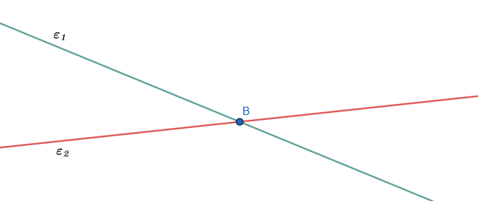{fig-align="center" width="450"}

**Παράλληλες ευθείες**: Δύο ευθείες που βρίσκονται στο ίδιο επίπεδο και δεν έχουν κανένα κοινό σημείο, όσο και αν προεκταθούν, ονομάζονται παράλληλες ευθείες.

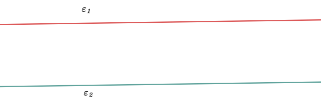{fig-align="center" width="450"}
::::

------------------------------------------------------------------------

#### Β. Θεωρήματα, Προτάσεις ή Πορίσματα

:::: {.math-box .proposal-box}
::: {.math-title .proposal-title}
**Πρόταση (Θέσεις δύο ευθειών)**:
:::

Δύο διαφορετικές ευθείες του ίδιου επιπέδου έχουν είτε ένα μοναδικό κοινό σημείο (τέμνουσες) είτε κανένα κοινό σημείο (παράλληλες).
::::

:::: {.math-box .corollary-box}
::: {.math-title .corollary-title}
**Πόρισμα (Καθετότητα και Παραλληλία)**:
:::

Δύο ευθείες του επιπέδου που είναι κάθετες στην ίδια ευθεία (σε διαφορετικά σημεία της) είναι παράλληλες μεταξύ τους .

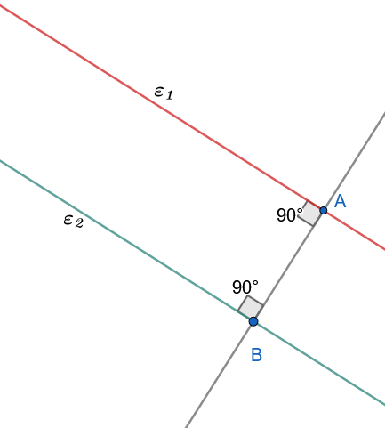{fig-align="center" width="350"}
::::

:::: {.math-box .corollaryproof-box}
::: {.math-title .corollaryproof-title}
**Απόδειξη**
:::

Πράγματι οι γωνίες A και B είναι ορθές, οπότε A = B.
Άρα $ε_1//ε_2$.
::::

:::: {.math-box .corollary-box}
::: {.math-title .corollary-title}
**Πόρισμα (Ύπαρξη παράλληλης)**:
:::

Από σημείο $A$ εκτός ευθείας $\epsilon$, υπάρχει τουλάχιστον μία ευθεία $\epsilon'$ παράλληλη στην $\epsilon$.

*(Η ύπαρξη αποδεικνύεται κατασκευαστικά φέροντας την κάθετο* $AB \perp \epsilon$ και στη συνέχεια την κάθετη $\epsilon' \perp AB$ στο σημείο $A$ ).

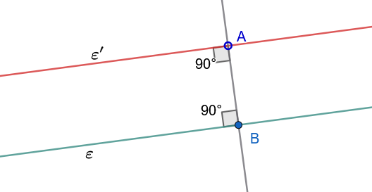{fig-align="center" width="450"}
::::

------------------------------------------------------------------------

#### Γ. Εφαρμογές (Λυμένα Παραδείγματα)

:::: {.math-box .example-box}
::: {.math-title .example-title}
**Εφαρμογή 1 (Το αντίστοιχο πόρισμα με απαγωγή σε άτοπο)**
:::

**Αν δύο ευθείες** $ε, ε'$ είναι κάθετες στην ίδια ευθεία $\zeta$ σε διαφορετικά σημεία της $A, B$, να αποδειχθεί ότι δεν έχουν κανένα κοινό σημείο (δηλαδή είναι παράλληλες).

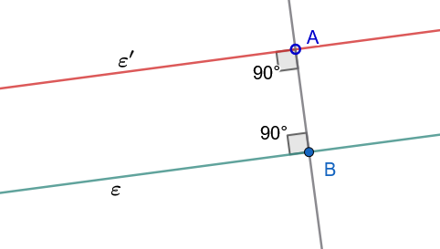{fig-align="center" width="400"}
::::

:::: {.math-box .examplesolution-box}
::: {.math-title .examplesolution-title}
**Λύση:**
:::

Έστω ότι οι ευθείες $ε, ε'$ τέμνονται σε ένα σημείο $M$.

Τότε, από το σημείο $M$ (το οποίο βρίσκεται εκτός της ευθείας $\zeta$) θα έχουμε φέρει δύο διαφορετικές κάθετες ευθείες στην ίδια ευθεία $\zeta$: τις $MA$ και $MB$ .

Αυτό όμως είναι άτοπο, καθώς από σημείο εκτός ευθείας άγεται μοναδική κάθετος προς αυτήν.
Συνεπώς, η υπόθεσή μας είναι εσφαλμένη, πράγμα που σημαίνει ότι οι ευθείες $\epsilon_1, \epsilon_2$ δεν έχουν κοινό σημείο, άρα είναι παράλληλες ($ε \parallel ε'$) .
::::

:::: {.math-box .example-box}
::: {.math-title .example-title}
**Εφαρμογή 2**
:::

**Αν τρεις ευθείες** $\epsilon_1, \epsilon_2, \epsilon_3$ τέμνονται ανά δύο στο επίπεδο και δεν διέρχονται όλες από το ίδιο σημείο, να βρεθεί το πλήθος των σημείων τομής τους και των ευθυγράμμων τμημάτων που ορίζονται πάνω σε αυτές.

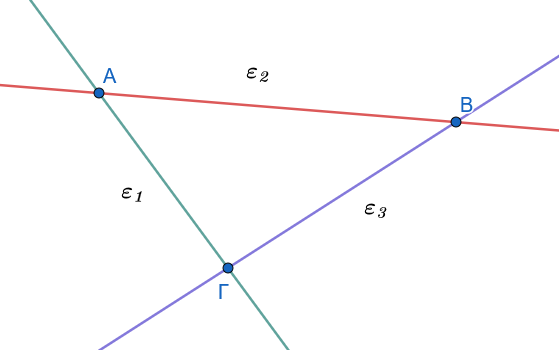{fig-align="center" width="400"}
::::

:::: {.math-box .examplesolution-box}
::: {.math-title .examplesolution-title}
**Λύση:**
:::

Οι ευθείες τέμνονται ανά δύο, άρα η $\epsilon_1$ τέμνει την $\epsilon_2$ στο σημείο $A$, η $\epsilon_2$ την $\epsilon_3$ στο σημείο $B$ και η $\epsilon_3$ την $\epsilon_1$ στο σημείο $\Gamma$.

Επειδή δεν διέρχονται όλες από το ίδιο σημείο,τα σημεία $A, B, \Gamma$ είναι διακριτά, άρα έχουμε ακριβώς $3$ σημεία τομής.

Τα ευθύγραμμα τμήματα που ορίζονται πάνω στις ευθείες αυτές είναι εκείνα που έχουν ως άκρα τα σημεία τομής, δηλαδή τα τμήματα $AB$, $B\Gamma$ και $\Gamma A$ (συνολικά $3$ ευθύγραμμα τμήματα).
::::

------------------------------------------------------------------------

#### Δ. Ασκήσεις προς Επίλυση

**Άσκηση 1**

**Εκφώνηση:** Σχεδιάστε τρεις ευθείες στο επίπεδο έτσι ώστε να μην έχουν κανένα κοινό σημείο.
Ποια είναι η σχετική τους θέση;

**Λύση:**

Για να μην έχουν κανένα κοινό σημείο ανά δύο, οι τρεις ευθείες πρέπει να είναι παράλληλες μεταξύ τους: $$\epsilon_1 \parallel \epsilon_2 \quad \text{και} \quad \epsilon_2 \parallel \epsilon_3 \implies \epsilon_1 \parallel \epsilon_3 \quad$$

Σε αυτή την περίπτωση, η απόσταση μεταξύ τους παραμένει σταθερή και το σύνολο των σημείων τομής τους είναι κενό.

:::: {.math-box .exercise-box}
::: {.math-title .exercise-title}
**Άσκηση 2**
:::

**Εκφώνηση:** Αν τέσσερις ευθείες διέρχονται από μια περιοχή έτσι ώστε ανά δύο να διασταυρώνονται (τέμνονται) και ανά τρεις να μη διέρχονται από το ίδιο σημείο, πόσες διασταυρώσεις (σημεία τομής) σχηματίζονται; Γενικεύστε για $\nu$ ευθείες ($\nu \ge 2$).

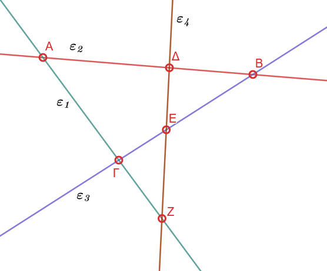{fig-align="center" width="450"}
::::

:::: {.math-box .solution-box}
::: {.math-title .solution-title}
**Λύση:**
:::

Για $4$ ευθείες, κάθε μία τέμνει τις υπόλοιπες $3$ σε διακριτά σημεία.
Το συνολικό πλήθος των σημείων τομής είναι: $$S = \frac{4 \cdot (4-1)}{2} = \frac{12}{2} = 6 \text{ σημεία} \quad$$

Γενικά, για $\nu$ ευθείες που τέμνονται ανά δύο χωρίς ανά τρεις να συντρέχουν, σχηματίζονται: $$S = \frac{\nu(\nu-1)}{2} \text{ σημεία τομής} \quad$$
::::

**Άσκηση 3**

**Εκφώνηση:** Δίνονται δύο παράλληλες ευθείες $\epsilon_1 \parallel \epsilon_2$ και μια ευθεία $\zeta$ κάθετη στην $\epsilon_1$.
Αποδείξτε ότι η $\zeta$ τέμνει και την $\epsilon_2$.

**Λύση:**

Έστω ότι η $\zeta$ τέμνει την $\epsilon_1$ στο σημείο $A$.
Αν υποθέσουμε ότι η $\zeta$ δεν τέμνει την $\epsilon_2$, τότε θα πρέπει να είναι παράλληλη προς αυτήν ($\zeta \parallel \epsilon_2$).

Τότε όμως, από το σημείο $A$ (το οποίο βρίσκεται εκτός της ευθείας $\epsilon_2$) θα διέρχονται δύο διαφορετικές παράλληλες ευθείες προς την $\epsilon_2$ (η $\epsilon_1$ και η $\zeta$), πράγμα που αντιβαίνει στο αξίωμα παραλληλίας.

Άρα, η υπόθεσή μας είναι άτοπη, οπότε η $\zeta$ τέμνει υποχρεωτικά την $\epsilon_2$.

**Άσκηση 4**

**Εκφώνηση:** Δύο ευθείες $\epsilon_1$ και $\epsilon_2$ τέμνονται στο σημείο $O$.
Αν θεωρήσουμε σημείο $P$ εκτός των ευθειών αυτών, αποδείξτε ότι δεν μπορεί να υπάρξει ευθεία που να διέρχεται από το $P$ και να είναι παράλληλη και στις δύο ευθείες $\epsilon_1, \epsilon_2$.

**Λύση:**

Ας υποθέσουμε ότι υπάρχει ευθεία $\zeta$ διερχόμενη από το $P$ τέτοια ώστε $\zeta \parallel \epsilon_1$ και $\zeta \parallel \epsilon_2$.

Λόγω της μεταβατικής ιδιότητας της παραλληλίας, εφόσον δύο διαφορετικές ευθείες είναι παράλληλες προς μία τρίτη, είναι και μεταξύ τους παράλληλες: $$\zeta \parallel \epsilon_1 \quad \text{και} \quad \zeta \parallel \epsilon_2 \implies \epsilon_1 \parallel \epsilon_2 \quad$$

Αυτό όμως είναι άτοπο, καθώς οι ευθείες $\epsilon_1, \epsilon_2$ δίνονται ως τεμνόμενες στο σημείο $O$.
Συνεπώς, δεν μπορεί να υπάρξει τέτοια ευθεία.

**Άσκηση 5**

**Εκφώνηση:** Αν δύο διαφορετικές ευθείες $\epsilon_1$ και $\epsilon_2$ είναι παράλληλες προς μια τρίτη ευθεία $\epsilon_3$, αποδείξτε ότι είναι και μεταξύ τους παράλληλες ($\epsilon_1 \parallel \epsilon_2$).

**Λύση:**

Έστω ότι οι $\epsilon_1$ και $\epsilon_2$ δεν είναι παράλληλες, πράγμα που σημαίνει ότι τέμνονται σε κάποιο σημείο $A$.

Από το σημείο $A$ όμως, το οποίο βρίσκεται εκτός της ευθείας $\epsilon_3$, θα διέρχονται δύο διαφορετικές ευθείες (οι $\epsilon_1, \epsilon_2$) παράλληλες προς την $\epsilon_3$ .

Αυτό αντιβαίνει άμεσα στο Ευκλείδειο αίτημα της μοναδικότητας της παράλληλης ευθείας.
Συνεπώς, οι $\epsilon_1$ και $\epsilon_2$ είναι παράλληλες.

------------------------------------------------------------------------

### ΜΕΡΟΣ 2: ΤΕΜΝΟΥΣΑ ΔΥΟ ΕΥΘΕΙΩΝ - ΕΥΚΛΕΙΔΕΙΟ ΑΙΤΗΜΑ

:::: {.math-box .definition-box}
::: {.math-title .definition-title}
#### Α. Ορισμοί
:::

**Τέμνουσα (ή διατέμνουσα) δύο ευθειών**: Κάθε ευθεία που τέμνει δύο άλλες ευθείες του επιπέδου σε δύο διαφορετικά σημεία ονομάζεται τέμνουσα των ευθειών αυτών.

**Ονομασία γωνιών τέμνουσας**: Όταν δύο ευθείες $\epsilon_1, \epsilon_2$ τέμνονται από μία τρίτη $\epsilon_3$, σχηματίζονται οκτώ γωνίες:

- **Εντός**: Οι τέσσερις γωνίες που βρίσκονται στη ζώνη μεταξύ των ευθειών $\epsilon_1$ και $\epsilon_2$.

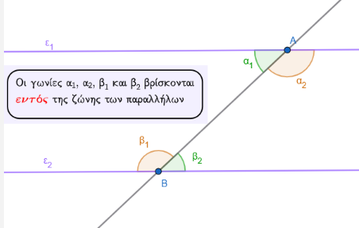{fig-align="center"}

- **Εκτός**: Οι τέσσερις γωνίες που βρίσκονται εκτός της ζώνης των $\epsilon_1$ και $\epsilon_2$ .

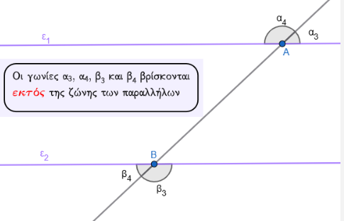{fig-align="center" width="450"}

- **Επί τα αυτά μέρη**: Δύο γωνίες που βρίσκονται προς το ίδιο μέρος (ημιεπίπεδο) της τέμνουσας $\epsilon_3$.

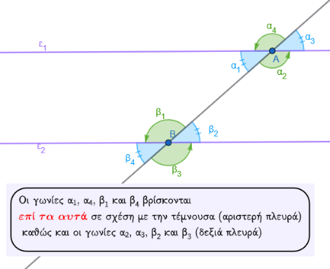{fig-align="center" width="450"}

- **Εναλλάξ**: Δύο γωνίες που βρίσκονται εκατέρωθεν της τέμνουσας $\epsilon_3$.

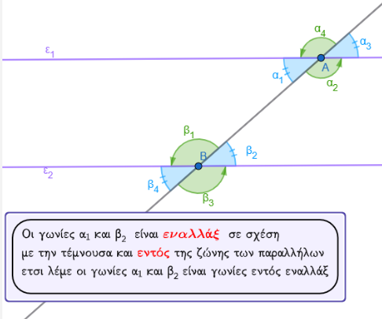{fig-align="center" width="450"}

- Συνδυαστικά, οι γωνίες ονομάζονται: **εντός εναλλάξ**, **εντός εκτός και επί τα αυτά μέρη** (ή αντίστοιχες), και **εντός και επί τα αυτά μέρη**.\
  [*Δείτε το μάθημα 19 Γεωμετρία Α Τάξης Γυμνασίου*]{.underline}.
::::

:::: {.math-box .axiom-box}
::: {.math-title .axiom-title}
**Ευκλείδειο Αίτημα (Αίτημα V)**:
:::

Από σημείο $A$ εκτός ευθείας $\epsilon$, υπάρχει μία μόνο ευθεία $\epsilon'$ παράλληλη προς την $\epsilon$ .

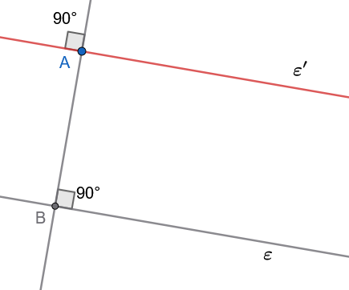{fig-align="center" width="350"}
::::

Έστω λοιπόν, ευθεία ε και σημείο Α εκτός αυτής.
Φέρουμε την ΑΒ ⊥ ε και ονομάζουμε ε' την ευθεία που είναι κάθετη στην ΑΒ στο σημείο Α.
Τότε ε'//ε (αφού και οι δύο είναι κάθετες στην ΑΒ).

Έτσι λοιπόν υπάρχει ευθεία ε' που διέρχεται από ένα σημείο Α που δεν ανήκει στην ε και είναι παράλληλη προς την ευθεία ε.

**Δεχόμαστε ως αξίωμα ότι η ευθεία αυτή είναι μοναδική.**

------------------------------------------------------------------------

#### Β. Θεωρήματα, Προτάσεις ή Πορίσματα

:::: {.math-box .theorem-box}
::: {.math-title .theorem-title}
**Θεώρημα (Κριτήριο Παραλληλίας)**:
:::

Αν δύο ευθείες τεμνόμενες από τρίτη σχηματίζουν δύο εντός εναλλάξ γωνίες ίσες, τότε είναι παράλληλες .

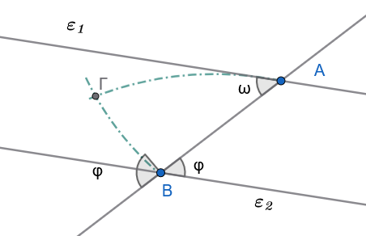{fig-align="center" width="400"}
::::

:::: {.math-box .apodeixi-box}
::: {.math-title .apodeixi-title}
**Απόδειξη**
:::

Έστω ότι $ω = φ$.
Αν οι ευθείες $ε_1, ε_2$ τέμνονται σε σημείο Γ, η εξωτερική γωνία φ του τριγώνου ΑΒΓ θα είναι ίση με την απέναντι εσωτερική γωνία ω, που είναι άτοπο.
Άρα $ε_1//ε_2$.
::::

:::: {.math-box .corollary-box}
::: {.math-title .corollary-title}
**Πόρισμα 1**
:::

Αν δύο ευθείες τεμνόμενες από τρίτη σχηματίζουν δύο εντός, εκτός και επί τα αυτά μέρη γωνίες ίσες ή δύο εντός και επί τα αυτά μέρη παραπληρωματικές, τότε είναι παράλληλες.
::::

------------------------------------------------------------------------

#### Εφαρμογές (Λυμένα Παραδείγματα)

:::: {.math-box .example-box}
::: {.math-title .example-title}
**Εφαρμογή 1**
:::

**Δίνεται ισοσκελές τρίγωνο** $AB\Gamma$ ($AB = A\Gamma$) και ευθεία $\epsilon$ παράλληλη προς τη βάση $B\Gamma$, η οποία τέμνει τις πλευρές $AB$ και $A\Gamma$ στα σημεία $\Delta$ και $E$ αντίστοιχα.
Να αποδειχθεί ότι το τρίγωνο $A\Delta E$ είναι ισοσκελές.
::::

:::: {.math-box .examplesolution-box}
::: {.math-title .examplesolution-title}
**Λύση:**
:::

Εφόσον το τρίγωνο $AB\Gamma$ είναι ισοσκελές με $AB = A\Gamma$, οι προσκείμενες στη βάση γωνίες του είναι ίσες: $$\widehat{B} = \widehat{\Gamma} \quad$$

Η ευθεία $\Delta E$ είναι παράλληλη προς τη βάση $B\Gamma$, οπότε τέμνεται από τις πλευρές $AB$ και $A\Gamma$.
Οι εντός εκτός και επί τα αυτά μέρη γωνίες είναι ίσες λόγω της παραλληλίας: $$\widehat{A\Delta E} = \widehat{B} \quad \text{και} \quad \widehat{AE\Delta} = \widehat{\Gamma} \quad$$

Επειδή $\widehat{B} = \widehat{\Gamma}$, προκύπτει άμεσα ότι: $$\widehat{A\Delta E} = \widehat{AE\Delta}$$

Το τρίγωνο $A\Delta E$ έχει δύο γωνίες του ίσες, άρα είναι ισοσκελές με $A\Delta = AE$.
::::

:::: {.math-box .example-box}
::: {.math-title .example-title}
**Εφαρμογή 2**
:::

**Από το έγκεντρο** $I$ (σημείο τομής των διχοτόμων) ενός τριγώνου $AB\Gamma$, φέρουμε ευθεία παράλληλη προς την πλευρά $B\Gamma$, η οποία τέμνει τις πλευρές $AB$ και $A\Gamma$ στα σημεία $\Delta$ και $E$ αντίστοιχα.
Να αποδειχθεί ότι $\Delta E = B\Delta + \Gamma E$.

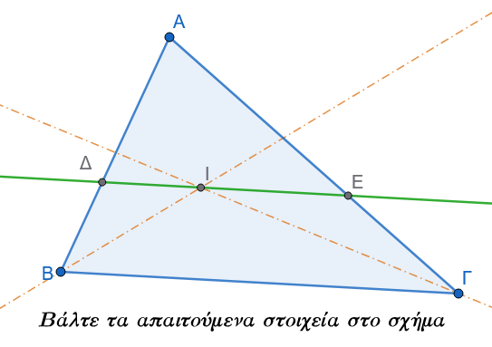{fig-align="center" width="400"}
::::

:::: {.math-box .examplesolution-box}
::: {.math-title .examplesolution-title}
**Λύση:**
:::

Η ημιευθεία $BI$ είναι η διχοτόμος της γωνίας $\widehat{B}$, άρα $\widehat{I B\Delta} = \widehat{I B\Gamma}$.

Επειδή η ευθεία $\Delta E$ είναι παράλληλη προς την $B\Gamma$, η $BI$ τέμνει τις δύο παράλληλες.

Οι εντός εναλλάξ γωνίες $\widehat{B I\Delta}$ και $\widehat{I B\Gamma}$ είναι ίσες λόγω της παραλληλίας: $$\widehat{B I\Delta} = \widehat{I B\Gamma} \quad$$

Συνεπώς, στο τρίγωνο $\Delta B I$ ισχύει $\widehat{I B\Delta} = \widehat{B I\Delta}$, οπότε το τρίγωνο είναι ισοσκελές με $\Delta I = B\Delta$.

Με τον ίδιο ακριβώς τρόπο, η ημιευθεία $\Gamma I$ είναι η διχοτόμος της γωνίας $\widehat{\Gamma}$, άρα $\widehat{I\Gamma E} = \widehat{I\Gamma B}$.

Λόγω της παραλληλίας, οι εντός εναλλάξ γωνίες $\widehat{\Gamma I E}$ και $\widehat{I\Gamma B}$ είναι ίσες:$$\widehat{\Gamma I E} = \widehat{I\Gamma B} \quad$$

Συνεπώς, στο τρίγωνο $E\Gamma I$ ισχύει $\widehat{I\Gamma E} = \widehat{\Gamma I E}$, οπότε το τρίγωνο είναι ισοσκελές με $EI = \Gamma E$ .

Υπολογίζουμε το συνολικό τμήμα $\Delta E$: $$\Delta E = \Delta I + IE = B\Delta + \Gamma E \quad$$
::::

------------------------------------------------------------------------

#### Δ. Ασκήσεις προς Επίλυση

**Άσκηση 6**

**Εκφώνηση:** Δύο παράλληλες ευθείες $\epsilon_1 \parallel \epsilon_2$ τέμνονται από τρίτη ευθεία $\epsilon_3$.
Αν μία από τις γωνίες που σχηματίζονται είναι ίση με $65^\circ$, να υπολογίσετε το μέτρο και των υπόλοιπων επτά γωνιών.

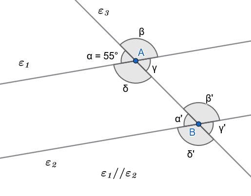{fig-align="center" width="400"}

**Λύση:**

Έστω $\alpha = 65^\circ$.

- Η κατακορυφήν της γωνία είναι $\gamma = \alpha = 55^\circ$.

- Η παραπληρωματική της είναι $\beta = 180^\circ - 55^\circ = 125^\circ$, και η κατακορυφήν αυτής είναι $\delta = 125^\circ$.

- Σύμφωνα με τις ιδιότητες των παραλλήλων ευθειών, οι αντίστοιχες γωνίες στην άλλη κορυφή είναι ίσες:

  - $\alpha' = \alpha = 55^\circ$ (εντός εκτός και επί τα αυτά).
  - $\gamma' = \gamma = 55^\circ$.
  - $\beta' = \beta = 125^\circ$.
  - $\delta' = \delta = 125^\circ$.

**Άσκηση 7**

**Εκφώνηση:** Δίνεται γωνία $\widehat{xOy}$ και σημείο $A$ της διχοτόμου της.
Αν η παράλληλη ευθεία από το $A$ προς την πλευρά $Ox$ τέμνει την πλευρά $Oy$ στο σημείο $B$, να αποδείξετε ότι το τρίγωνο $OAB$ είναι ισοσκελές.

**Λύση:**

Έστω $Oz$ η διχοτόμος της γωνίας $\widehat{xOy}$, οπότε $\widehat{xOA} = \widehat{AOB} = \omega$.

Η ευθεία $AB$ είναι παράλληλη προς την $Ox$ ($AB \parallel Ox$) και τέμνεται από τη διχοτόμο $Oz$ (δηλαδή την ευθεία $OA$) .

Οι εντός εναλλάξ γωνίες $\widehat{xOA}$ και $\widehat{OAB}$ είναι ίσες λόγω παραλληλίας: $$\widehat{OAB} = \widehat{xOA} = \omega \quad$$

Εφόσον στο τρίγωνο $OAB$ ισχύει $\widehat{OAB} = \widehat{AOB} = \omega$, το τρίγωνο έχει δύο γωνίες ίσες, άρα είναι ισοσκελές με $OB = AB$.

**Άσκηση 8**

**Εκφώνηση:** Αν οι διχοτόμοι των γωνιών $\widehat{A}$ και $\widehat{B}$ κυρτού τετραπλεύρου $AB\Gamma\Delta$ τέμνονται στο σημείο $E$, να αποδείξετε ότι η γωνία $\widehat{AEB}$ ισούται με το ημιάθροισμα των άλλων δύο γωνιών του τετραπλεύρου: $$\widehat{AEB} = \frac{\widehat{\Gamma} + \widehat{\Delta}}{2} \quad$$

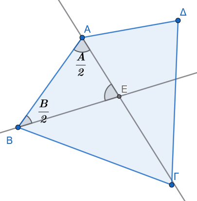{fig-align="center" width="350"}

**Λύση:**

Στο τρίγωνο $AEB$, το άθροισμα των εσωτερικών γωνιών είναι $180^\circ$: $$\widehat{AEB} + \frac{\widehat{A}}{2} + \frac{\widehat{B}}{2} = 180^\circ \implies \widehat{AEB} = 180^\circ - \frac{\widehat{A} + \widehat{B}}{2} \quad$$

Στο κυρτό τετράπλευρο $AB\Gamma\Delta$, το άθροισμα των εσωτερικών γωνιών είναι $360^\circ$: $$\widehat{A} + \widehat{B} + \widehat{\Gamma} + \widehat{\Delta} = 360^\circ \implies \widehat{A} + \widehat{B} = 360^\circ - (\widehat{\Gamma} + \widehat{\Delta})$$

Αντικαθιστούμε στην πρώτη σχέση: $$\widehat{AEB} = 180^\circ - \frac{360^\circ - (\widehat{\Gamma} + \widehat{\Delta})}{2} = \frac{\widehat{\Gamma} + \widehat{\Delta}}{2} \quad$$

**Άσκηση 9**

**Εκφώνηση:** Από τα άκρα ευθυγράμμου τμήματος $AB$ φέρουμε προς το ίδιο ημιεπίπεδο δύο παράλληλες ημιευθείες $Ax$ και $By$.
Παίρνουμε τυχαίο σημείο $\Gamma$ πάνω στο τμήμα $AB$, και πάνω στις $Ax, By$ λαμβάνουμε τα σημεία $\Delta$ και $E$ αντίστοιχα, έτσι ώστε $A\Delta = A\Gamma$ και $BE = B\Gamma$.
Να αποδείξετε ότι η γωνία $\widehat{\Delta\Gamma E}$ είναι ορθή ($90^\circ$).

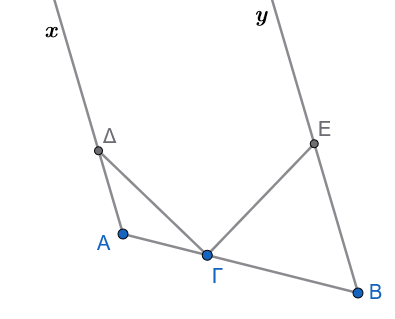{fig-align="center" width="300"}

> > Βάλτε τα απαραίτητα στοιχεία στο σχήμα

**Λύση:**

Το τρίγωνο $A\Gamma\Delta$ είναι ισοσκελές ($A\Delta = A\Gamma$), άρα $\widehat{A\Gamma\Delta} = \widehat{A\Delta\Gamma} = \omega$.

Το άθροισμα των γωνιών του είναι: $$\widehat{A} + 2\omega = 180^\circ \implies \omega = 90^\circ - \frac{\widehat{A}}{2} \quad$$

Το τρίγωνο $B\Gamma E$ είναι ισοσκελές ($BE = B\Gamma$), άρα $\widehat{B\Gamma E} = \widehat{BE\Gamma} = \phi$.

Το άθροισμα των γωνιών του είναι: $$\widehat{B} + 2\phi = 180^\circ \implies \phi = 90^\circ - \frac{\widehat{B}}{2} \quad$$

Επειδή $Ax \parallel By$, οι εντός και επί τα αυτά μέρη γωνίες είναι παραπληρωματικές: $\widehat{A} + \widehat{B} = 180^\circ$.

Αθροίζουμε τις γωνίες $\omega$ και $\phi$: $$\omega + \phi = 180^\circ - \frac{\widehat{A} + \widehat{B}}{2} = 180^\circ - 90^\circ = 90^\circ \quad$$

Επειδή η γωνία $\widehat{A\Gamma B}$ είναι ευθεία ($180^\circ$): $$\widehat{\Delta\Gamma E} = 180^\circ - (\omega + \phi) = 180^\circ - 90^\circ = 90^\circ \quad$$

**Άσκηση 10**

**Εκφώνηση:** Αν μία ευθεία $\epsilon$ τέμνει τη μία από δύο παράλληλες ευθείες $\epsilon_1 \parallel \epsilon_2$, αποδείξτε ότι η $\epsilon$ τέμνει υποχρεωτικά και την άλλη ευθεία $\epsilon_2$.

**Λύση:**

Έστω ότι η ευθεία $\epsilon$ τέμνει την $\epsilon_1$ στο σημείο $A$.
Αν υποθέσουμε ότι η $\epsilon$ δεν τέμνει την $\epsilon_2$, τότε η $\epsilon$ θα είναι παράλληλη προς την $\epsilon_2$ ($\epsilon \parallel \epsilon_2$).

Τότε όμως, από το σημείο $A$ θα διέρχονται δύο διαφορετικές ευθείες, η $\epsilon_1$ και η $\epsilon$, οι οποίες είναι και οι δύο παράλληλες προς την ευθεία $\epsilon_2$.

Αυτό έρχεται σε άμεση αντίθεση με το Ευκλείδειο Αίτημα, σύμφωνα με το οποίο από σημείο εκτός ευθείας άγεται μία μόνο παράλληλος προς αυτήν.
Συνεπώς, η υπόθεσή μας είναι άτοπη, οπότε η ευθεία $\epsilon$ τέμνει υποχρεωτικά την $\epsilon_2$ .

------------------------------------------------------------------------

::: {.callout-important title="ΣΑΣ ΕΥΧΟΜΑΙ"}
ΚΑΛΗ ΜΕΛΕΤΗ !!!
:::
