```{=html}
<!-- Φόρτωση βιβλιοθήκης GeoGebra -->
<script src="https://www.geogebra.org/apps/deployggb.js"></script>

<!-- Συνάρτηση δημιουργίας applets -->
<script>
function createGeoGebra(containerId, materialId, width = 700, height = 500) {
  var params = {
    "id": "ggb-" + containerId,
    "material_id": materialId,
    "width": width,
    "height": height,
    "showToolBar": true,
    "showMenuBar": false,
    "showAlgebraInput": true
  };
  
  var applet = new GGBApplet(params, '5.2');
  applet.inject(containerId);
}
</script>
```

## Ιδιότητες παράλληλων ευθειών

::: {.callout-note title="ΣΑΣ ΣΥΝΙΣΤΩ"}
Να ξαναδείτε τα αντίστοιχα μαθήματα Γυμνασίου
:::

### ΜΕΡΟΣ 1: ΙΔΙΟΤΗΤΕΣ ΠΑΡΑΛΛΗΛΩΝ ΕΥΘΕΙΩΝ

**Α. Προτάσεις (Θεωρήματα) και Πορίσματα**

:::: {.math-box .proposal-box}
::: {.math-title .proposal-title}
**Πρόταση I (Εντός εναλλάξ γωνίες):**
:::

Αν δύο παράλληλες ευθείες τέμνονται από μια τρίτη ευθεία (τέμνουσα), τότε σχηματίζουν τις εντός εναλλάξ γωνίες ίσες.

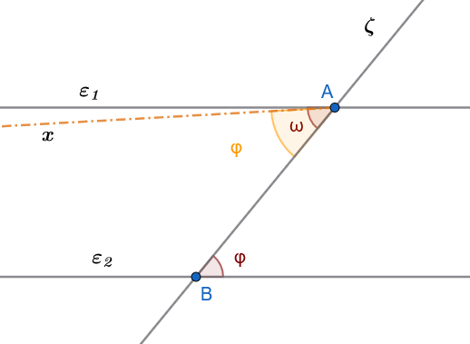{fig-align="center" width="400"}
::::

:::: {.math-box .proposalproof-box}
::: {.math-title .proposalproof-title}
*Απόδειξη (Με απαγωγή σε άτοπο):*
:::

Έστω οι παράλληλες ευθείες $\epsilon_1 \parallel \epsilon_2$ και η τέμνουσα $\zeta$ που τις τέμνει στα σημεία $A$ και $B$ αντίστοιχα.

Θα αποδείξουμε ότι οι εντός εναλλάξ γωνίες $\widehat{\omega}$ και $\widehat{\phi}$ είναι ίσες.

Αν υποθέσουμε ότι $\widehat{\omega} \neq \widehat{\phi}$, τότε από το σημείο $A$ φέρουμε μια ημιευθεία $Ax$ τέτοια ώστε η γωνία $\widehat{xAB}$ να είναι ίση με τη $\widehat{\phi}$ και να βρίσκεται εκατέρωθεν της $\zeta$.

Τότε, επειδή οι γωνίες $\widehat{xAB}$ και $\widehat{\phi}$ είναι εντός εναλλάξ και ίσες, η ευθεία $Ax$ θα είναι παράλληλη προς την $\epsilon_2$.

Αυτό όμως σημαίνει ότι από το σημείο $A$ διέρχονται δύο διαφορετικές παράλληλες προς την $\epsilon_2$ (η αρχική $\epsilon_1$ και η $Ax$), πράγμα που αντιβαίνει στο Ευκλείδειο Αίτημα.

Συνεπώς, η υπόθεσή μας είναι άτοπη, άρα $\widehat{\omega} = \widehat{\phi}$.
::::

:::: {.math-box .corollary-box}
::: {.math-title .corollary-title}
**Πορισμα I (Εντός εκτός και επί τα αυτά):**
:::

Αν δύο παράλληλες ευθείες τέμνονται από τρίτη, σχηματίζουν τις εντός εκτός και επί τα αυτά μέρη γωνίες (αντίστοιχες) ίσες.

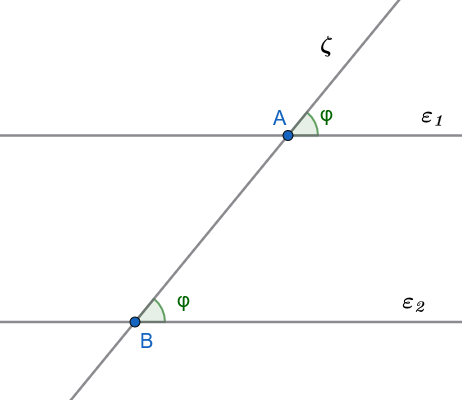{fig-align="center" width="350"}
::::

:::: {.math-box .corollary-box}
::: {.math-title .corollary-title}
**Πόρισμα II (Εντός και επί τα αυτά):**
:::

Αν δύο παράλληλες ευθείες τέμνονται από τρίτη, σχηματίζουν τις εντός και επί τα αυτά μέρη γωνίες παραπληρωματικές.

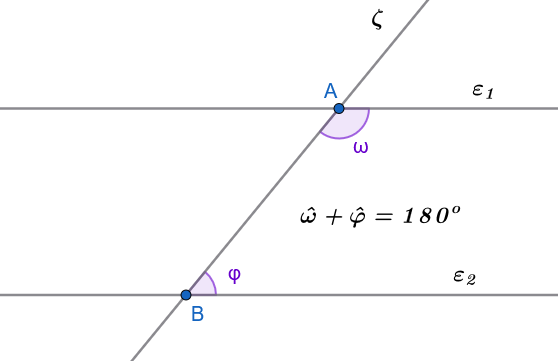{fig-align="center" width="400"}
::::

:::: {.math-box .proposal-box}
::: {.math-title .proposal-title}
**Πρόταση II**
:::

Αν δυο ευθείες $ε_1$ και $ε_2$ είναι παράλληλες και μία τρίτη ευθεία ζ τέμνει τη μία από αυτές, τότε η ζ θα τέμνει και την άλλη.
::::

:::: {.math-box .proposalproof-box}
::: {.math-title .proposalproof-title}
**Απόδειξη**
:::

Υποθέτουμε ότι η ε τέμνει την $ε_1$ στο Α.
Αν η ζ δεν έτεμνε την $ε_2$, θα ήταν $ζ//ε_2$ και έτσι θα είχαμε από το Α δύο παράλληλες προς την $ε_2$, πράγμα αδύνατο.
Άρα η ζ τέμνει την $ε_2$.
::::

:::: {.math-box .corollary-box}
::: {.math-title .corollary-title}
**Πόρισμα I (Καθετότητα και Παραλληλία):**
:::

Αν μια ευθεία είναι κάθετη σε μία από δύο παράλληλες ευθείες, τότε είναι υποχρεωτικά κάθετη και στην άλλη.
::::

:::: {.math-box .proposal-box}
::: {.math-title .proposal-title}
**Πρόταση II (Μεταβατική ιδιότητα):**
:::

Αν δύο διαφορετικές ευθείες $\epsilon_1$ και $\epsilon_2$ είναι παράλληλες προς μια τρίτη ευθεία $\epsilon_3$, τότε είναι και μεταξύ τους παράλληλες ($\epsilon_1 \parallel \epsilon_2$).
::::

:::: {.math-box .proposalproof-box}
::: {.math-title .proposalproof-title}
**Αόδειξη**
:::

Αν οι $ε_1$ και $ε_2$ τέμνονταν σε σημείο Α, θα είχαμε από το Α δύο παράλληλες προς την ε, που είναι άτοπο.
Άρα $ε_1//ε_2$.
::::

:::: {.math-box .proposal-box}
::: {.math-title .proposal-title}
**Πρόταση ΙΙΙ**
:::

Αν δυο ευθείες τεμνόμενες από τρίτη σχηματίζουν τις εντός και επί τα αυτά μέρη γωνίες με άθροισμα μικρότερο από 2 ορθές, τότε οι ευθείες τέμνονται προς το μέρος της τέμνουσας που βρίσκονται οι γωνίες.

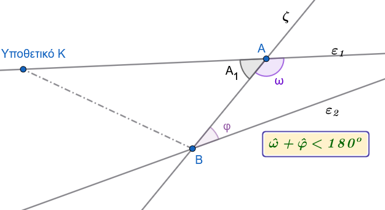{fig-align="center" width="450"}
::::

:::: {.math-box .proposalproof-box}
::: {.math-title .proposalproof-title}
**Απόδειξη**
:::

Έστω ότι η ζ τέμνει τις $ε_1 ,ε_2$ στα Α και Β αντίστοιχα και ότι $φ + ω ≠ 2∟$.

Τότε οι $ε_1$ και $ε_2$ δεν είναι παράλληλες, αφού $φ + ω ≠ 2∟$ .

Έστω ότι οι $ε_1$ και $ε_2$ τέμνονται σε σημείο Κ, προς το μέρος της τέμνουσας, που δεν περιέχει τις γωνίες ω και φ.

Τότε, όμως, η εξωτερική γωνία ω του τριγώνου ΑΚΒ είναι μεγαλύτερη από τη γωνία $A_1$ δηλαδή $ω > A_1= 2∟- φ$ ή $ω + φ > 2∟$, που είναι άτοπο.

Άρα οι $ε_1,ε_2$ τέμνονται προς το μέρος της τέμνουσας που βρίσκονται οι γωνίες ω και φ.
::::

**Β. Εφαρμογές - Παραδείγματα**

**Εφαρμογή 1**

**Δίνεται ισοσκελές τρίγωνο** $AB\Gamma$ ($AB=A\Gamma$) και ευθεία $\epsilon$ παράλληλη προς τη βάση του $B\Gamma$, η οποία τέμνει τις πλευρές $AB$ και $A\Gamma$ στα σημεία $\Delta$ και $E$ αντίστοιχα.
Να αποδείξετε ότι το τρίγωνο $A\Delta E$ είναι ισοσκελές.

**Λύση:**

Επειδή το τρίγωνο $AB\Gamma$ είναι ισοσκελές με $AB = A\Gamma$, οι προσκείμενες στη βάση γωνίες του είναι ίσες, δηλαδή: $$\widehat{B} = \widehat{\Gamma}$$

Η ευθεία $\epsilon$ είναι παράλληλη προς τη $B\Gamma$ ($\Delta E \parallel B\Gamma$), οπότε τέμνεται από τις πλευρές $AB$ και $A\Gamma$.

Λόγω της παραλληλίας, οι εντός εκτός και επί τα αυτά γωνίες είναι ίσες: $$\widehat{A\Delta E} = \widehat{B} \quad \text{και} \quad \widehat{AE\Delta} = \widehat{\Gamma}$$

Από τις παραπάνω σχέσεις προκύπτει άμεσα ότι: $$\widehat{A\Delta E} = \widehat{AE\Delta}$$

Το τρίγωνο $A\Delta E$ έχει δύο γωνίες του ίσες, επομένως είναι ισοσκελές με $A\Delta = AE$.

:::: {.math-box .example-box}
::: {.math-title .example-title}

**Εφαρμογή 2**
:::
**Από το έγκεντρο** $I$ (σημείο τομής των εσωτερικών διχοτόμων) τριγώνου $AB\Gamma$, φέρουμε παράλληλες ευθείες $I\Delta \parallel AB$ και $IE \parallel A\Gamma$, οι οποίες τέμνουν τη βάση $B\Gamma$ στα σημεία $\Delta$ και $E$ αντίστοιχα.
Να αποδειχθεί ότι η περίμετρος του τριγώνου $\Delta IE$ ισούται με το μήκος της πλευράς $B\Gamma$.

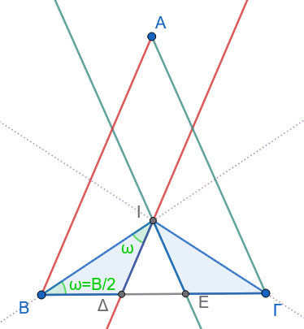{fig-align="center" width="300"}

::::


:::: {.math-box .examplesolution-box}
::: {.math-title .examplesolution-title}

**Λύση:**
:::
Η ημιευθεία $BI$ είναι η διχοτόμος της γωνίας $\widehat{B}$ του τριγώνου, άρα: $$\widehat{IB\Delta} = \widehat{IB\Gamma}$$

Εφόσον $I\Delta \parallel AB$, η $BI$ είναι τέμνουσα των παραλλήλων αυτών, οπότε οι εντός εναλλάξ γωνίες $\widehat{BI\Delta}$ και $\widehat{IB\Gamma}$ είναι ίσες: $$\widehat{BI\Delta} = \widehat{IB\Gamma}$$

Συνεπώς, στο τρίγωνο $\Delta BI$ ισχύει $\widehat{IB\Delta} = \widehat{BI\Delta}$, άρα είναι ισοσκελές με: $$\Delta I = B\Delta$$

Με τον ίδιο ακριβώς τρόπο, η ημιευθεία $\Gamma I$ είναι η διχοτόμος της γωνίας $\widehat{\Gamma}$ του τριγώνου, άρα: $$\widehat{I\Gamma E} = \widehat{I\Gamma B}$$

Εφόσον $IE \parallel A\Gamma$, η $\Gamma I$ τέμνει τις παράλληλες, οπότε οι εντός εναλλάξ γωνίες $\widehat{\Gamma IE}$ και $\widehat{I\Gamma B}$ είναι ίσες: $$\widehat{\Gamma IE} = \widehat{I\Gamma B}$$

Συνεπώς, το τρίγωνο $E\Gamma I$ είναι ισοσκελές με: $$IE = \Gamma E$$

Η περίμετρος $\Pi$ του τριγώνου $\Delta IE$ είναι: $$\Pi = \Delta I + IE + \Delta E = B\Delta + \Gamma E + \Delta E = B\Gamma$$

Άρα, η περίμετρος του τριγώνου $\Delta IE$ ισούται με τη βάση $B\Gamma$.
::::


------------------------------------------------------------------------

**Γ. Ασκήσεις προς Επίλυση**

> > > Σχεδιάστε σχήμα όπου απαιτείται

**Άσκηση 1**

**Εκφώνηση:** Δίνεται γωνία $\widehat{xOy}$ και σημείο $A$ της διχοτόμου της.
Αν η παράλληλη ευθεία από το $A$ προς την πλευρά $Ox$ τέμνει την πλευρά $Oy$ στο σημείο $B$, να αποδείξετε ότι το τρίγωνο $OAB$ είναι ισοσκελές.

**Απόδειξη:**

Έστω $Oz$ η διχοτόμος της γωνίας $\widehat{xOy}$, οπότε για το σημείο $A \in Oz$ ισχύει: $$\widehat{xOA} = \widehat{AOB}$$

Η ευθεία $AB$ είναι παράλληλη προς την $Ox$ ($AB \parallel Ox$) και τέμνεται από τη διχοτόμο $Oz$ (δηλαδή την ευθεία $OA$).
Οι εντός εναλλάξ γωνίες $\widehat{xOA}$ και $\widehat{OAB}$ είναι ίσες λόγω της παραλληλίας: $$\widehat{OAB} = \widehat{xOA}$$

Συνδυάζοντας τις δύο ισότητες, έχουμε: $$\widehat{OAB} = \widehat{AOB}$$

Εφόσον στο τρίγωνο $OAB$ δύο γωνίες είναι ίσες, το τρίγωνο είναι ισοσκελές με $AB = OB$.

------------------------------------------------------------------------

**Άσκηση 2**

**Εκφώνηση:** Στις προεκτάσεις των πλευρών $BA$ και $\Gamma A$ ενός τριγώνου $AB\Gamma$ παίρνουμε αντίστοιχα τα τμήματα $A\Delta = AB$ και $AE = A\Gamma$.
Να αποδείξετε ότι η ευθεία $\Delta E$ είναι παράλληλη προς τη $B\Gamma$.

**Απόδειξη:**

Συγκρίνουμε τα τρίγωνα $AB\Gamma$ και $A\Delta E$:

1.  $AB = A\Delta$ (από κατασκευή).
2.  $A\Gamma = AE$ (από κατασκευή).
3.  $\widehat{BA\Gamma} = \widehat{\Delta AE}$ ως κατακορυφήν γωνίες.

Τα δύο τρίγωνα είναι ίσες από το **1ο Κριτήριο Ισότητας (ΠΓΠ)**.
Από την ισότητα των τριγώνων προκύπτει ότι οι αντίστοιχες γωνίες τους είναι ίσες, δηλαδή: $$\widehat{A\Delta E} = \widehat{B}$$

Επειδή οι γωνίες $\widehat{A\Delta E}$ και $\widehat{B}$ είναι εντός εναλλάξ ως προς τις ευθείες $\Delta E$ και $B\Gamma$ με τέμνουσα τη $B\Delta$, συμπεραίνουμε ότι οι ευθείες είναι παράλληλες: $$\Delta E \parallel B\Gamma \quad$$

------------------------------------------------------------------------


:::: {.math-box .exercise-box}
::: {.math-title .exercise-title}

**Άσκηση 3**
:::
**Εκφώνηση:** Δίνεται ισοσκελές τρίγωνο $AB\Gamma$ ($AB = A\Gamma$) και σημείο $\Delta$ της πλευράς $AB$.
Αν ο κύκλος $(\Delta, \Delta B)$ τέμνει τη βάση $B\Gamma$ στο σημείο $E$, να αποδείξετε ότι $\Delta E \parallel A\Gamma$.

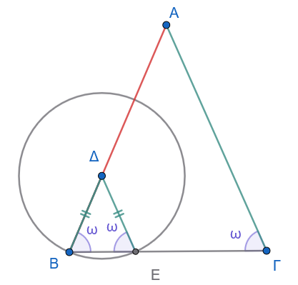{fig-align="center" width="350"}
::::


:::: {.math-box .solution-box}
::: {.math-title .solution-title}

**Απόδειξη:**
:::
Ο κύκλος έχει κέντρο το $\Delta$ και διέρχεται από το $B$ και το $E$, άρα τα ευθύγραμμα τμήματα $\Delta B$ και $\Delta E$ είναι ακτίνες του κύκλου, οπότε: $$\Delta B = \Delta E$$

Συνεπώς, το τρίγωνο $\Delta BE$ είναι ισοσκελές, άρα οι προσκείμενες στη βάση γωνίες του είναι ίσες: $$\widehat{B} = \widehat{\Delta EB}$$

Εφόσον το αρχικό τρίγωνο $AB\Gamma$ είναι ισοσκελές με $AB = A\Gamma$, ισχύει επίσης η ισότητα των γωνιών της βάσης: $$\widehat{B} = \widehat{\Gamma}$$

Από τις δύο ισότητες προκύπτει άμεσα ότι: $$\widehat{\Delta EB} = \widehat{\Gamma}$$

Οι γωνίες $\widehat{\Delta EB}$ και $\widehat{\Gamma}$ είναι εντός εκτός και επί τα αυτά γωνίες ως προς τις ευθείες $\Delta E$ και $A\Gamma$ με τέμνουσα τη $B\Gamma$.

Επειδή είναι ίσες, οι ευθείες είναι παράλληλες, δηλαδή: $$\Delta E \parallel A\Gamma \quad$$
::::


------------------------------------------------------------------------

**Άσκηση 4**

**Εκφώνηση:** Δίνεται κύκλος $(O, \rho)$ και $M$ το μέσο μιας χορδής του $AB$.
Φέρουμε τη διάμετρο $Ox$ τέτοια ώστε $Ox \perp OM$.
Να αποδείξετε ότι $Ox \parallel AB$.

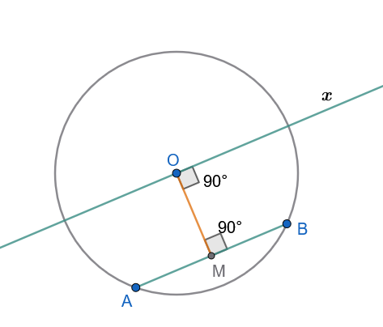{fig-align="center" width="380"}

**Απόδειξη:**

Εφόσον το $M$ είναι το μέσο της χορδής $AB$ του κύκλου, το ευθύγραμμο τμήμα $OM$ είναι το απόστημα της χορδής $AB$.

Σύμφωνα με το γεωμετρικό θεώρημα, η ευθεία που συνδέει το κέντρο με το μέσο μιας χορδής είναι κάθετη σε αυτήν: $$OM \perp AB$$

Από την υπόθεση της άσκησης, η ευθεία $Ox$ έχει κατασκευαστεί κάθετη στο $OM$: $$Ox \perp OM \quad$$

Εφόσον οι ευθείες $AB$ και $Ox$ είναι και οι δύο κάθετες στην ευθεία $OM$, σύμφωνα με το θεώρημα της καθετότητας και παραλληλίας, είναι παράλληλες μεταξύ τους: $$Ox \parallel AB \quad$$

------------------------------------------------------------------------

:::: {.math-box .exercise-box}
::: {.math-title .exercise-title}

**Άσκηση 5**
:::
**Εκφώνηση:** Δίνεται τρίγωνο $AB\Gamma$ και η διχοτόμος του $A\Delta$.
Από την κορυφή $B$ φέρουμε ευθεία $BE \parallel A\Delta$ η οποία τέμνει την προέκταση της πλευράς $\Gamma A$ στο σημείο $E$.
Να αποδείξετε ότι $E\Gamma = AB + A\Gamma$.

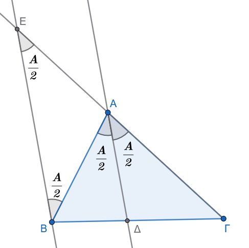{fig-align="center" width="350"}
::::


:::: {.math-box .solution-box}
::: {.math-title .solution-title}

**Απόδειξη:**
:::
Εφόσον η $A\Delta$ είναι διχοτόμος της γωνίας $\widehat{A}$, ισχύει: $$\widehat{BA\Delta} = \widehat{\Delta A\Gamma} = \frac{\widehat{A}}{2}$$

Οι ευθείες $BE$ και $A\Delta$ είναι παράλληλες ($BE \parallel A\Delta$) και τέμνονται από τις ευθείες $E\Gamma$ και $AB$.

1.  Οι γωνίες $\widehat{AEB}$ και $\widehat{\Delta A\Gamma}$ είναι ίσες ως εντός εκτός και επί τα αυτά: $$\widehat{AEB} = \widehat{\Delta A\Gamma}$$
2.  Οι γωνίες $\widehat{ABE}$ και $\widehat{BA\Delta}$ είναι ίσες ως εντός εναλλάξ: $$\widehat{ABE} = \widehat{BA\Delta}$$

Λόγω της διχοτόμου, προκύπτει ότι: $$\widehat{AEB} = \widehat{ABE}$$

Συνεπώς, το τρίγωνο $AEB$ είναι ισοσκελές με $AE = AB$.

Για το συνολικό ευθύγραμμο τμήμα $E\Gamma$, επειδή το σημείο $A$ βρίσκεται μεταξύ των $E$ και $\Gamma$, έχουμε: $$E\Gamma = AE + A\Gamma$$

Αντικαθιστώντας τη σχέση $AE = AB$, προκύπτει άμεσα το ζητούμενο: $$E\Gamma = AB + A\Gamma \quad$$
::::


------------------------------------------------------------------------

### ΜΕΡΟΣ 2: ΚΑΤΑΣΚΕΥΗ ΠΑΡΑΛΛΗΛΗΣ ΕΥΘΕΙΑΣ

**Α. Εφαρμογές (Λυμένα Παραδείγματα)**

:::: {.math-box .example-box}
::: {.math-title .example-title}
**Εφαρμογή 1**
:::

**Να περιγραφεί αναλυτικά η γεωμετρική κατασκευή παράλληλης ευθείας** $\epsilon'$ προς ευθεία $\epsilon$ από σημείο $A \notin \epsilon$ με τη χρήση κανόνα και διαβήτη (μέθοδος μεταφοράς γωνίας) και να αποδειχθεί η εγκυρότητά της.
::::

:::: {.math-box .examplesolution-box}
::: {.math-title .examplesolution-title}
**Λύση:**
:::

**Κατασκευή:**

1.  Φέρουμε από το σημείο $A$ ένα τυχαίο πλάγιο τμήμα $AB$ προς την ευθεία $\epsilon$, σχηματίζοντας γωνία $\widehat{\phi}$.

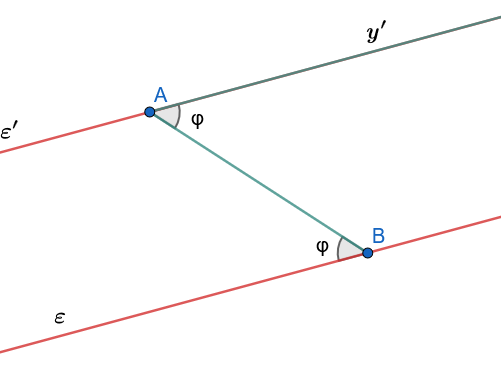{fig-align="center" width="400"}

1.  Μεταφέρουμε τη γωνία $\widehat{\phi}$ έτσι ώστε να έχει κορυφή το $A$, μία πλευρά την ημιευθεία $AB$ και η άλλη πλευρά της $Ay'$ να βρίσκεται στο ημιεπίπεδο που δεν ανήκει η γωνία $\widehat{\phi}$.

2.  Η ευθεία που ορίζεται από την ημιευθεία $Ay'$ είναι η ζητούμενη ευθεία $\epsilon'$.

**Απόδειξη:**

Επειδή η κατασκευασμένη γωνία $\widehat{y'AB}$ ισούται με τη $\widehat{\phi}$ ($\widehat{y'AB} = \widehat{\phi}$), οι ευθείες $\epsilon'$ (δηλαδή η $Ay'$) και $\epsilon$, τεμνόμενες από την ευθεία $AB$, σχηματίζουν δύο εντός εναλλάξ γωνίες ίσες.

Συνεπώς, σύμφωνα με το κριτήριο παραλληλίας, οι ευθείες είναι παράλληλες ($\epsilon' \parallel \epsilon$).
::::

:::: {.math-box .example-box}
::: {.math-title .example-title}
**Εφαρμογή 2**
:::

**Να περιγραφεί η κατασκευή παράλληλης ευθείας από σημείο** $M$ προς ευθεία $\epsilon$ χρησιμοποιώντας διαδοχικές προεκτάσεις ίσων τμημάτων (Θεώρημα διαμέσου τριγώνου).
::::


:::: {.math-box .examplesolution-box}
::: {.math-title .examplesolution-title}
**Λύση:**
:::

**Κατασκευή:**

Βήματα Κατασκευής της Παράλληλης Ευθείας

Για να χαράξουμε από σημείο $M$ παράλληλη ευθεία προς τη δοσμένη ευθεία $\epsilon$, χρησιμοποιούμε μόνο κανόνα και διαβήτη (ή μέτρηση ίσων μηκών) με διαδοχικές προεκτάσεις:

1.  **Επιλογή 1ου σημείου** $A$:\
    Επιλέγουμε ένα τυχαίο σημείο $A$ πάνω στην ευθεία $\epsilon$.
    Ενώνουμε το $M$ με το $A$ και προεκτείνουμε το τμήμα $MA$ κατά ίσο τμήμα: $$AB = MA$$ *(Δηλαδή, το σημείο* $A$ είναι το μέσο του τμήματος $MB$).

2.  **Επιλογή 2ου σημείου** $\Gamma$:\
    Επιλέγουμε ένα δεύτερο σημείο $\Gamma$ πάνω στην ευθεία $\epsilon$.
    Ενώνουμε το $B$ με το $\Gamma$ και προεκτείνουμε το τμήμα $B\Gamma$ κατά ίσο τμήμα: $$\Gamma\Delta = B\Gamma$$ *(Δηλαδή, το σημείο* $\Gamma$ είναι το μέσο του τμήματος $B\Delta$).

3.  **Χάραξη της παράλληλης ευθείας** $\epsilon'$:\
    Ενώνουμε το σημείο $M$ με το σημείο $\Delta$.
    Η ευθεία $\epsilon' = M\Delta$ είναι η ζητούμενη παράλληλη προς την $\epsilon$.

------------------------------------------------------------------------

Απόδειξη (Χωρίς χρήση του θεωρήματος των μέσων / θεωρίας παραλλήλων)

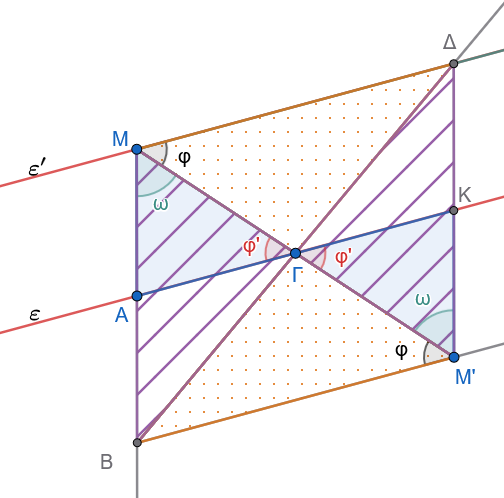{fig-align="center" width="400"}

**Βήμα 1: Το Παραλληλόγραμμο** $M A M' K$

Έστω Κ το συμμετρικό του Α ώς προς το Γ.

Από την κατασκευή, οι διαγώνιοι $MM'$ και $AK$ διχοτομούνται στο σημείο $\Gamma$ ($M\Gamma = \Gamma M'$ και $A\Gamma = \Gamma K$).

- Άρα το τετράπλευρο $M A M' K$ είναι παραλληλόγραμμο.

- Συνεπώς: $$MA = M'K \quad \text{και} \quad MA \parallel M'K$$

------------------------------------------------------------------------

**Βήμα 2: Το Παραλληλόγραμμο** $A B M' K$

1.  Επειδή το $A$ είναι το μέσο του $MB$, ισχύει $AB = MA$.
2.  Επειδή $MA = M'K$, έχουμε: $$AB = M'K$$
3.  Επειδή τα σημεία $B, A, M$ βρίσκονται στην ίδια ευθεία και $MA \parallel M'K$, ισχύει και: $$AB \parallel M'K$$

Ένα τετράπλευρο που έχει **δύο απέναντι πλευρές ίσες και παράλληλες** ($AB = M'K$ και $AB \parallel M'K$) είναι παραλληλόγραμμο.\
Άρα το $A B M' K$ είναι παραλληλόγραμμο.

------------------------------------------------------------------------

**Βήμα 3: Ισότητα των γωνιών (**$\phi = \phi'$)

Αφού το $A B M' K$ είναι παραλληλόγραμμο, οι άλλες δύο απέναντι πλευρές του είναι παράλληλες: $$AK \parallel BM'$$

Θεωρώντας τις παράλληλες ευθείες $AK$ (δηλαδή την ευθεία $\epsilon$) και $BM'$ με τέμνουσα την $MM'$, οι **εντός εναλλάξ γωνίες** είναι ίσες: $$\widehat{A\Gamma M} = \widehat{BM'\Gamma} \implies \phi' = \phi$$

------------------------------------------------------------------------

**Συμπέρασμα**

Από το αρχικό παραλληλόγραμμο $MBM'\Delta$ είχαμε ήδη $\widehat{\Delta M \Gamma} = \widehat{B M' \Gamma} = \phi$.

Επομένως: $$\widehat{\Delta M \Gamma} = \widehat{A \Gamma M} = \phi = \phi'$$

Επειδή οι **εντός εναλλάξ γωνίες** των ευθειών $M\Delta$ και $AK$ με τέμνουσα την $M\Gamma$ είναι ίσες, αποδείχθηκε ότι: $$M\Delta \parallel AK \quad (\epsilon' \parallel \epsilon)$$
::::

------------------------------------------------------------------------


**Β. Ασκήσεις προς Επίλυση**

> > > Σχεδιάστε σχήμα όπου απαιτείται

**Άσκηση 6**

**Εκφώνηση:** Από σημείο $A$ εκτός ευθείας $\epsilon$, να κατασκευαστεί παράλληλος $\epsilon' \parallel \epsilon$ χρησιμοποιώντας αποκλειστικά κατασκευή ορθών γωνιών (καθετότητα) και να αποδειχθεί η ορθότητά της.

**Κατασκευή:**

1.  Από το σημείο $A$ φέρουμε την κάθετο $AB$ προς την ευθεία $\epsilon$ ($AB \perp \epsilon$).
2.  Στο σημείο $A$ του ευθυγράμμου τμήματος $AB$, κατασκευάζουμε την κάθετη ευθεία $\epsilon'$ προς την $AB$ ($\epsilon' \perp AB$ στο $A$).
3.  Η ευθεία $\epsilon'$ είναι η ζητούμενη παράλληλη.

**Απόδειξη:**

Λόγω της κατασκευής, οι ευθείες $\epsilon$ και $\epsilon'$ είναι και οι δύο κάθετες στο ευθύγραμμο τμήμα $AB$.
Σύμφωνα με το *Πόρισμα I* των ιδιοτήτων των παραλλήλων ευθειών, δύο ευθείες κάθετες στην ίδια ευθεία είναι μεταξύ τους παράλληλες, άρα: $$\epsilon' \parallel \epsilon \quad$$

------------------------------------------------------------------------

**Άσκηση 7**

**Εκφώνηση:** Να κατασκευαστεί παραλληλόγραμμο $AB\Gamma\Delta$ όταν δίνονται οι διαδοχικές πλευρές του $AB = a$, $A\Delta = b$ και η περιεχόμενη γωνία $\widehat{A} = \omega$, χρησιμοποιώντας την κατασκευή παράλληλων ευθειών.

**Κατασκευή:**

1.  Κατασκευάζουμε τη γωνία $\widehat{xAy} = \omega$.
2.  Πάνω στην ημιευθεία $Ax$ λαμβάνουμε τμήμα $AB = a$ και πάνω στην ημιευθεία $Ay$ λαμβάνουμε τμήμα $A\Delta = b$.
3.  Από το σημείο $B$ κατασκευάζουμε ευθεία παράλληλη προς την $A\Delta$.
4.  Από το σημείο $\Delta$ κατασκευάζουμε ευθεία παράλληλη προς την $AB$.
5.  Το σημείο τομής των δύο αυτών παράλληλων ευθειών ορίζει την κορυφή $\Gamma$.

**Απόδειξη:**

Από την κατασκευή προκύπτει ότι $B\Gamma \parallel A\Delta$ και $\Delta\Gamma \parallel AB$.
Εφόσον το τετράπλευρο $AB\Gamma\Delta$ έχει τις απέναντι πλευρές του παράλληλες ανά δύο, είναι εξ ορισμού παραλληλόγραμμο.

------------------------------------------------------------------------

**Άσκηση 8**

**Εκφώνηση:** Δίνονται δύο παράλληλες ευθείες $\epsilon_1 \parallel \epsilon_2$ και σημείο $A$ εκτός αυτών.
Να κατασκευαστεί ευθεία διερχόμενη από το $A$ η οποία να τέμνει τις δύο παράλληλες ορίζοντας τμήμα μεταξύ τους ίσο με δοσμένο τμήμα $\lambda$.

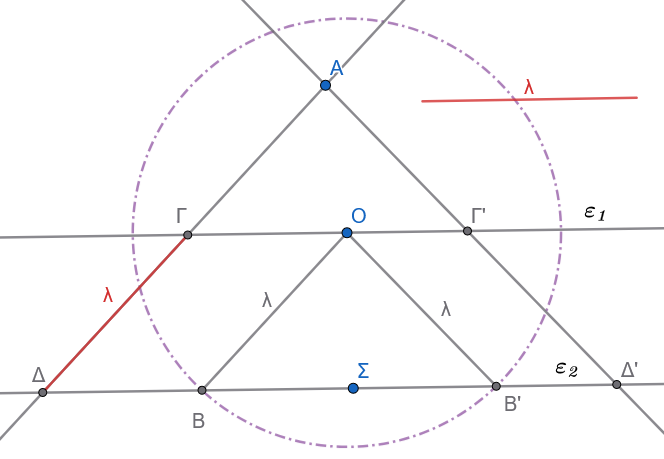{fig-align="center" width="450"}

**Κατασκευή:**

1.  Θεωρούμε ένα τυχαίο σημείο $O$ πάνω στην ευθεία $\epsilon_1$.
2.  Με κέντρο το $O$ και ακτίνα ίση με το τμήμα $\lambda$, γράφουμε κύκλο ο οποίος τέμνει την ευθεία $\epsilon_2$ στο σημείο $B$, οπότε $OB = \lambda$.
3.  Από το σημείο $A$ κατασκευάζουμε ευθεία παράλληλη προς την $OB$.
4.  Η κατασκευασμένη αυτή ευθεία τέμνει τις $\epsilon_1$ και $\epsilon_2$ στα σημεία $\Gamma$ και $\Delta$ αντίστοιχα. Το τμήμα $\Gamma\Delta$ είναι το ζητούμενο.

**Απόδειξη:**

Στο τετράπλευρο $O\Gamma\Delta B$:

- $O\Gamma \parallel B\Delta$ (καθώς ανήκουν στις παράλληλες ευθείες $\epsilon_1, \epsilon_2$).
- $OB \parallel \Gamma\Delta$ (από κατασκευή).

Συνεπώς, το τετράπλευρο $O\Gamma\Delta B$ είναι παραλληλόγραμμο.
Από τις ιδιότητες του παραλληλογράμμου, οι απέναντι πλευρές του είναι ίσες, άρα: $$\Gamma\Delta = OB$$

Επειδή $OB = \lambda$ λόγω της κατασκευής, προκύπτει ότι $\Gamma\Delta = \lambda$.

**Διερεύνηση**

Για να έχει λύση το πρόβλημα πρέπει η απόσταση μεταξύ των παραλλήλων να είναι $\le λ$.

------------------------------------------------------------------------

**Άσκηση 9**

**Εκφώνηση:** Από το έγκεντρο $I$ τριγώνου $AB\Gamma$ φέρουμε ευθεία παράλληλη προς τη βάση $B\Gamma$, η οποία τέμνει τις πλευρές $AB$ και $A\Gamma$ στα σημεία $\Delta$ και $E$ αντίστοιχα.
Να αποδείξετε κατασκευαστικά την ιδιότητα: $\Delta E = B\Delta + \Gamma E$.

**Κατασκευή:**

1.  Κατασκευάζουμε τις διχοτόμους των γωνιών $\widehat{B}$ και $\widehat{\Gamma}$, οι οποίες τέμνονται στο έγκεντρο $I$ του τριγώνου.
2.  Από το σημείο $I$ κατασκευάζουμε ευθεία παράλληλη προς τη $B\Gamma$ (χρησιμοποιώντας τη μέθοδο της μεταφοράς γωνίας), η οποία τέμνει τις $AB, A\Gamma$ στα $\Delta, E$.

**Απόδειξη:**

Εφόσον η ευθεία $\Delta E$ είναι παράλληλη προς τη $B\Gamma$ ($\Delta E \parallel B\Gamma$), η διχοτόμος $BI$ τέμνει τις παράλληλες αυτές, οπότε οι εντός εναλλάξ γωνίες $\widehat{BI\Delta}$ και $\widehat{IB\Gamma}$ είναι ίσες: $$\widehat{BI\Delta} = \widehat{IB\Gamma}$$

Επειδή η $BI$ είναι διχοτόμος της γωνίας $\widehat{B}$, ισχύει: $$\widehat{IB\Delta} = \widehat{IB\Gamma} \implies \widehat{IB\Delta} = \widehat{BI\Delta}$$

Το τρίγωνο $\Delta BI$ είναι ισοσκελές, άρα $\Delta I = B\Delta$.

Με όμοιο τρόπο, η διχοτόμος $\Gamma I$ τέμνει τις παράλληλες, άρα οι εντός εναλλάξ γωνίες $\widehat{\Gamma IE}$ και $\widehat{I\Gamma B}$ είναι ίσες: $$\widehat{\Gamma IE} = \widehat{I\Gamma B}$$

Επειδή η $\Gamma I$ είναι διχοτόμος της γωνίας $\widehat{\Gamma}$, ισχύει: $$\widehat{I\Gamma E} = \widehat{I\Gamma B} \implies \widehat{I\Gamma E} = \widehat{\Gamma IE}$$

Το τρίγωνο $E\Gamma I$ είναι ισοσκελές, άρα $IE = \Gamma E$.

Το συνολικό ευθύγραμμο τμήμα $\Delta E$ ισούται με: $$\Delta E = \Delta I + IE = B\Delta + \Gamma E$$

------------------------------------------------------------------------


:::: {.math-box .exercise-box}
::: {.math-title .exercise-title}

**Άσκηση 10**
:::
**Εκφώνηση:** Δίνεται γωνία $\widehat{xOy}$ και σημείο $M$ στο εσωτερικό της.
Να κατασκευαστεί ευθεία διερχόμενη από το $M$ η οποία να τέμνει τις πλευρές $Ox$ και $Oy$ στα σημεία $A$ και $B$ αντίστοιχα, έτσι ώστε το σημείο $M$ να είναι το μέσο του ευθυγράμμου τμήματος $AB$.
::::


:::: {.math-box .solution-box}
::: {.math-title .solution-title}

**Κατασκευή:**

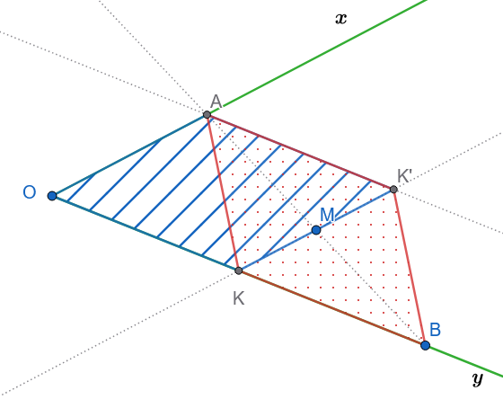{fig-align="center" width="400"}

**Απόδειξη:**
:::
**Βήματα Κατασκευής**

1.  **Εύρεση του σημείου** $K$:\
    Από το $M$ φέρνουμε ευθεία παράλληλη προς την $Ox$ , η οποία τέμνει την πλευρά $Oy$ στο σημείο $K$.

2.  **Εύρεση του σημείου** $K'$:\
    Προεκτείνουμε το τμήμα $KM$ κατά ίσο τμήμα $MK' = KM$ (άρα το $M$ είναι το μέσο του $KK'$).

3.  **Εύρεση του σημείου** $B$:\
    Πάνω στην πλευρά $Oy$, προεκτείνουμε το τμήμα $OK$ κατά ίσο τμήμα $KB = OK$ (άρα το $K$ είναι το μέσο του $OB$).

4.  **Εύρεση του σημείου** $A$:\
    Από το σημείο $K'$ φέρνουμε ευθεία παράλληλη προς την $Oy$, η οποία τέμνει την πλευρά $Ox$ στο σημείο $A$.

5.  **Χάραξη της ζητούμενης ευθείας:**\
    Ενώνουμε το $A$ με το $B$.
    Η ευθεία $AB$ διέρχεται από το $M$ και το $M$ είναι το μέσο του $AB$.

------------------------------------------------------------------------

**Απόδειξη (Γιατί η κορυφή** $A$ είναι κοινή και το $M$ είναι μέσο του $AB$)

**1. Το 1ο Παραλληλόγραμμο** $OAK'K$ (Γραμμοσκιασμένο)

Από την κατασκευή:

- Η πλευρά $OA$ (πάνω στην $Ox$) είναι παράλληλη προς την $KK'$.

- Η πλευρά $OK$ (πάνω στην $Oy$) είναι παράλληλη προς την $AK'$.

Επομένως, το τετράπλευρο $OAK'K$ είναι παραλληλόγραμμο.

Από τις ιδιότητες του παραλληλογράμμου, οι απέναντι πλευρές είναι ίσες: $$AK' = OK \quad \text{και} \quad AK' \parallel OK \quad (1)$$

------------------------------------------------------------------------

**2. Το 2ο Παραλληλόγραμμο** $AK'BK$ (Διάστικτο)

- Από την κατασκευή έχουμε $KB = OK$.

- Λόγω της σχέσης $(1)$ ($AK' = OK$), προκύπτει ότι: $$AK' = KB$$

- Επειδή τα σημεία $O, K, B$ βρίσκονται στην ίδια ευθεία ($Oy$) και $AK' \parallel Oy$, ισχύει: $$AK' \parallel KB$$

Ένα τετράπλευρο που έχει **δύο απέναντι πλευρές ίσες και παράλληλες** ($AK' = KB$ και $AK' \parallel KB$) είναι **παραλληλόγραμμο**.

Συνεπώς, το τετράπλευρο $AK'BK$ είναι παραλληλόγραμμο.

------------------------------------------------------------------------

**3. Σύνδεση με το σημείο** $M$ και ολοκλήρωση

Στο παραλληλόγραμμο $AK'BK$:

1.  Οι διαγώνιοί του είναι τα ευθύγραμμα τμήματα $KK'$ και $AB$.

2.  Σε κάθε παραλληλόγραμμο, οι διαγώνιοι **διχοτομούνται** (τέμνονται στο κοινό τους μέσο).

3.  Επειδή από την κατασκευή το σημείο $M$ είναι το μέσο της διαγωνίου $KK'$, αναγκαστικά το $M$ είναι και το **μέσο της διαγωνίου** $AB$.

Άρα, η ευθεία $AB$ διέρχεται από το $M$ και ισχύει: $$AM = MB$$
::::


------------------------------------------------------------------------

### ΜΕΡΟΣ 3: ΓΩΝΙΕΣ ΜΕ ΠΛΕΥΡΕΣ ΠΑΡΑΛΛΗΛΕΣ

**Α. Συμπεράσματα**

Συμπεράσματα που εξάγουμε από το παρακάτω σχήμα.

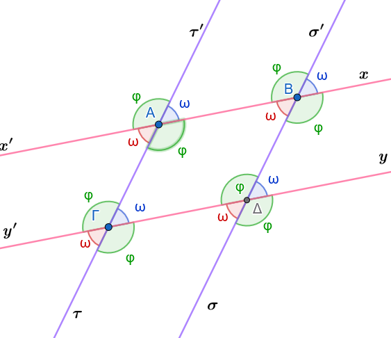{fig-align="center" width="400"}

- **Συμπέρασμα I:** Δύο οξείες γωνίες που έχουν τις πλευρές τους παράλληλες μία προς μία είναι ίσες μεταξύ τους.

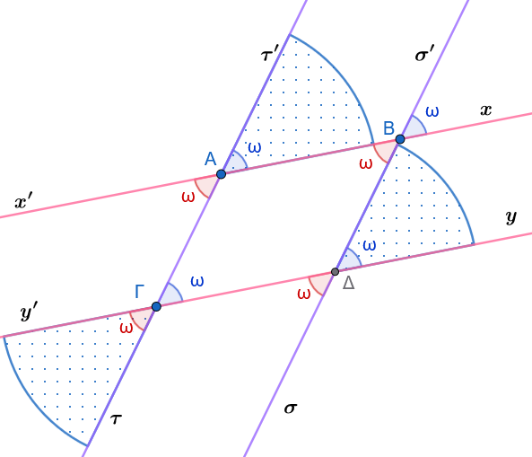{fig-align="center" width="400"}

- **Συμπέρασμα II:** Δύο αμβλείες γωνίες που έχουν τις πλευρές τους παράλληλες μία προς μία είναι ίσες μεταξύ τους.

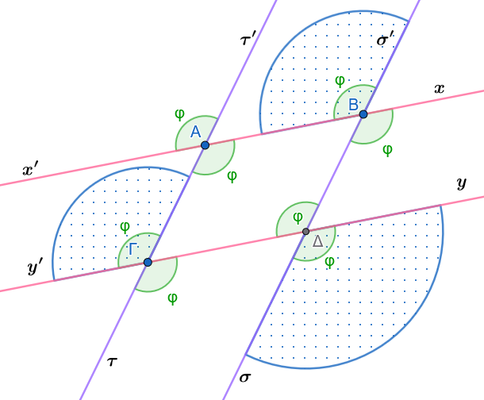{fig-align="center" width="400"}

- **Συμπέρασμα III:** Αν δύο γωνίες έχουν τις πλευρές τους παράλληλες μία προς μία, και η μία είναι οξεία ενώ η άλλη αμβλεία, τότε οι γωνίες αυτές είναι παραπληρωματικές.

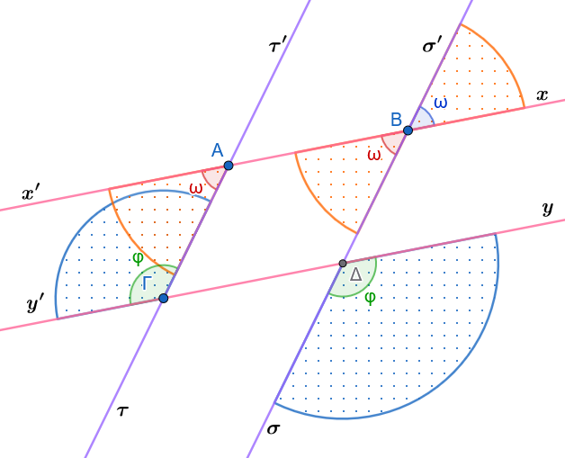{fig-align="center" width="400"}

**Β. Πορίσματα**

:::: {.math-box .corollary-box}
::: {.math-title .corollary-title}
**Πόρισμα I:**
:::

Οι διχοτόμοι δύο γωνιών που έχουν τις πλευρές τους παράλληλες και ομόρροπες, είναι παράλληλες ημιευθείες.

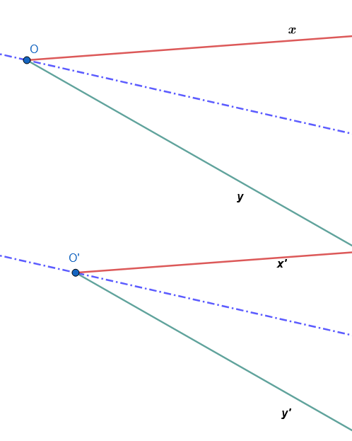{fig-align="center" width="350"}
::::

:::: {.math-box .corollary-box}
::: {.math-title .corollary-title}
**Πόρισμα II:**
:::

Οι διχοτόμοι δύο γωνιών που έχουν τις πλευρές τους παράλληλες και αντίρροπες, είναι κάθετες ευθείες στην περίπτωση που η μία γωνία είναι οξεία και η άλλη αμβλεία.

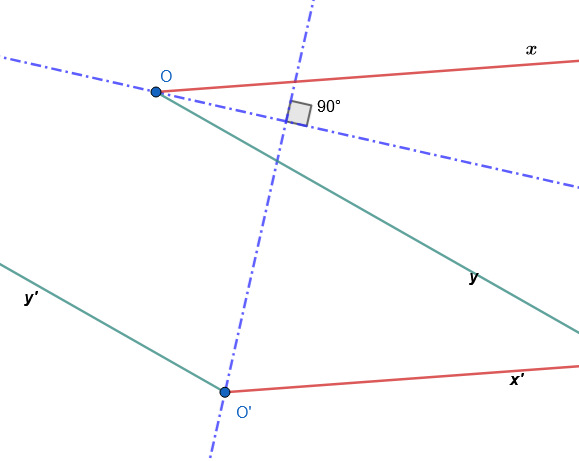{fig-align="center" width="400"}
::::

**Γ. Εφαρμογές (Λυμένα Παραδείγματα)**

**Εφαρμογή 1**

**Αν δύο γωνίες** $\widehat{xOy}$ και $\widehat{x'\Omega y'}$ έχουν πλευρές $Ox \parallel \Omega x'$ (ομόρροπες) και $Oy \parallel \Omega y'$ (ομόρροπες), να αποδειχθεί αναλυτικά ότι είναι ίσες.

**Λύση:**

Έστω $M$ το σημείο τομής των ευθειών $\Omega x'$ και $Oy$.

1.  Οι γωνίες $\widehat{xOy}$ και $\widehat{OM\Omega}$ είναι ίσες ως εντός εναλλάξ των παράλληλων ευθειών $Ox$ και $\Omega x'$ που τέμνονται από την $Oy$: $$\widehat{xOy} = \widehat{OM\Omega} \quad$$
2.  Οι γωνίες $\widehat{x'\Omega y'}$ (δηλαδή η $\widehat{M\Omega y'}$) και $\widehat{OM\Omega}$ είναι ίσες ως εντός εναλλάξ των παράλληλων ευθειών $Oy$ και $\Omega y'$ που τέμνονται από την $\Omega x'$. $$\widehat{x'\Omega y'} = \widehat{OM\Omega}$$

Από τη μεταβατική ιδιότητα των δύο αυτών σχέσεων προκύπτει άμεσα ότι: $$\widehat{xOy} = \widehat{x'\Omega y'} \quad$$

**Εφαρμογή 2**

**Αν δύο γωνίες** $\widehat{xOy}$ και $\widehat{x''\Omega y''}$ έχουν τις πλευρές τους παράλληλες, η μία είναι οξεία και η άλλη αμβλεία, να αποδειχθεί ότι είναι παραπληρωματικές.

**Λύση:**

Έστω η γωνία $\widehat{xOy}$ (οξεία) και η γωνία $\widehat{x''\Omega y''}$ (αμβλεία).

Σχεδιάζουμε τη γωνία $\widehat{x'\Omega y'}$, η οποία έχει τις πλευρές της παράλληλες και ομόρροπες προς τις πλευρές της γωνίας $\widehat{xOy}$.

Τότε, από το θεώρημα των ομόρροπων γωνιών, ισχύει: $$\widehat{x'\Omega y'} = \widehat{xOy}$$

Η γωνία $\widehat{x'\Omega y'}$ είναι οξεία.
Η γωνία $\widehat{x''\Omega y''}$ έχει την πλευρά $\Omega x''$ αντίρροπη της $\Omega x'$ και την πλευρά $\Omega y''$ αντίρροπη της $\Omega y'$.

Συνεπώς, οι γωνίες $\widehat{x'\Omega y'}$ και $\widehat{x''\Omega y''}$ είναι εφεξής και παραπληρωματικές: $$\widehat{x'\Omega y'} + \widehat{x''\Omega y''} = 180^\circ \quad$$

Αντικαθιστώντας την ισότητα των γωνιών, λαμβάνουμε άμεσα: $$\widehat{xOy} + \widehat{x''\Omega y''} = 180^\circ \quad$$

------------------------------------------------------------------------

**Δ. Ασκήσεις προς Επίλυση**

> > > Σχεδιάστε σχήμα όπου απαιτείται

**Άσκηση 11**

**Εκφώνηση:** Δύο γωνίες έχουν τις πλευρές τους παράλληλες μία προς μία.
Αν η μία γωνία είναι τριπλάσια της άλλης, να υπολογίσετε το μέτρο της κάθε γωνίας σε μοίρες.

**Λύση:**

Έστω $\widehat{\alpha}$ και $\widehat{\beta}$ οι δύο γωνίες με πλευρές παράλληλες.
Από τη θεωρία γνωρίζουμε ότι οι γωνίες αυτές είναι είτε ίσες είτε παραπληρωματικές.

- Αν ήταν ίσες ($\widehat{\alpha} = \widehat{\beta}$), αυτό θα ερχόταν σε αντίθεση με την υπόθεση ότι η μία είναι τριπλάσια της άλλης ($\widehat{\alpha} = 3\widehat{\beta}$).

- Συνεπώς, οι γωνίες είναι υποχρεωτικά παραπληρωματικές, άρα: $$\widehat{\alpha} + \widehat{\beta} = 180^\circ$$ Αντικαθιστούμε τη σχέση $\widehat{\alpha} = 3\widehat{\beta}$: $$3\widehat{\beta} + \widehat{\beta} = 180^\circ \implies 4\widehat{\beta} = 180^\circ \implies \widehat{\beta} = 45^\circ$$

  Υπολογίζουμε την άλλη γωνία: $$\widehat{\alpha} = 3 \cdot 45^\circ = 135^\circ$$

Άρα, οι γωνίες είναι $45^\circ$ (οξεία) και $135^\circ$ (αμβλεία).

------------------------------------------------------------------------

**Άσκηση 12**

**Εκφώνηση:** Δίνονται δύο γωνίες με πλευρές παράλληλες και ομόρροπες.
Να αποδείξετε ότι οι διχοτόμοι τους είναι παράλληλες ημιευθείες.

**Απόδειξη:**

Έστω οι γωνίες $\widehat{xOy}$ και $\widehat{x'\Omega y'}$ με $Ox \parallel \Omega x'$ (ομόρροπες) και $Oy \parallel \Omega y'$ (ομόρροπες).
Φέρουμε τις αντίστοιχες διχοτόμους τους $O\zeta$ και $\Omega\zeta'$.

Εφόσον οι γωνίες έχουν τις πλευρές τους παράλληλες και ομόρροπες, είναι ίσες: $$\widehat{xOy} = \widehat{x'\Omega y'} = 2\omega$$

Οι διχοτόμοι χωρίζουν τις γωνίες αυτές σε δύο ίσα μέρη, οπότε: $$\widehat{xO\zeta} = \widehat{x'\Omega\zeta'} = \omega \quad$$

Θεωρούμε την ευθεία $O\Omega$ η οποία τέμνει τις παράλληλες ημιευθείες $Ox$ και $\Omega x'$.
Οι αντίστοιχες γωνίες που σχηματίζονται με τις διχοτόμους $O\zeta$ και $\Omega\zeta'$ είναι ίσες με $\omega$.

Επειδή οι ημιευθείες $O\zeta$ και $\Omega\zeta'$ σχηματίζουν ίσες γωνίες με τις παράλληλες πλευρές, σύμφωνα με το κριτήριο παραλληλίας, είναι παράλληλες ημιευθείες: $$O\zeta \parallel \Omega\zeta' \quad$$

------------------------------------------------------------------------

**Άσκηση 13**

**Εκφώνηση:** Δίνονται δύο γωνίες με πλευρές παράλληλες, εκ των οποίων η μία είναι οξεία και η άλλη αμβλεία.
Να αποδείξετε ότι οι διχοτόμοι τους είναι κάθετες ευθείες.

**Απόδειξη:**

Έστω η οξεία γωνία $\widehat{xOy} = 2\alpha$ και η αμβλεία γωνία $\widehat{x'\Omega y'} = 2\beta$.
Εφόσον οι γωνίες έχουν πλευρές παράλληλες και είναι διαφορετικού είδους, είναι παραπληρωματικές: $$2\alpha + 2\beta = 180^\circ \implies \alpha + \beta = 90^\circ$$

Έστω $O\zeta$ η διχοτόμος της πρώτης γωνίας και $\Omega\zeta'$ η διχοτόμος της δεύτερης γωνίας.

Σχεδιάζουμε τη βοηθητική γωνία $\widehat{x'\Omega y''}$, η οποία είναι παραπληρωματική της $\widehat{x'\Omega y'}$ και έχει τις πλευρές της παράλληλες και ομόρροπες προς την $\widehat{xOy}$.

Οι διχοτόμοι δύο εφεξής και παραπληρωματικών γωνιών είναι κάθετες μεταξύ τους: $$\Omega\zeta' \perp \Omega\zeta''$$

Επειδή η διχοτόμος $O\zeta$ είναι παράλληλη προς τη διχοτόμο $\Omega\zeta''$ (λόγω ομόρροπων πλευρών), και η $\Omega\zeta'$ είναι κάθετη στην $\Omega\zeta''$, προκύπτει άμεσα ότι η διχοτόμος $O\zeta$ είναι κάθετη στη διχοτόμο $\Omega\zeta'$: $$O\zeta \perp \Omega\zeta' \quad$$

------------------------------------------------------------------------

**Άσκηση 14**

**Εκφώνηση:** Σε παραλληλόγραμμο $AB\Gamma\Delta$, να αποδείξετε με τη χρήση του θεωρήματος γωνιών με πλευρές παράλληλες ότι οι απέναντι γωνίες $\widehat{A}$ και $\widehat{\Gamma}$ είναι ίσες.

**Απόδειξη:**

Από τον ορισμό του παραλληλογράμμου $AB\Gamma\Delta$, οι απέναντι πλευρές του είναι παράλληλες ανά δύο: $$AB \parallel \Gamma\Delta \quad \text{και} \quad A\Delta \parallel B\Gamma$$

Θεωρούμε τη γωνία $\widehat{A}$ (που σχηματίζεται από τις πλευρές $AB$ και $A\Delta$) και τη γωνία $\widehat{\Gamma}$ (που σχηματίζεται από τις πλευρές $\Gamma B$ και $\Gamma\Delta$).

- Η πλευρά $AB$ είναι παράλληλη προς την $\Gamma\Delta$.
- Η πλευρά $A\Delta$ είναι παράλληλη προς την $B\Gamma$.

Οι δύο γωνίες έχουν τις πλευρές τους παράλληλες μία προς μία.
Επιπλέον, οι πλευρές τους είναι αντίρροπες (η $AB$ και η $\Gamma\Delta$ έχουν αντίθετη φορά, όπως και η $A\Delta$ με τη $B\Gamma$).

Επειδή οι γωνίες έχουν πλευρές παράλληλες και αντίρροπες, είναι ίσες: $$\widehat{A} = \widehat{\Gamma} \quad$$

------------------------------------------------------------------------

**Άσκηση 15**

**Εκφώνηση:** Δίνονται δύο γωνίες $\widehat{\omega}$ και $\widehat{\phi}$ με πλευρές παράλληλες μία προς μία.
Αν ισχύει $\widehat{\omega} = 120^\circ - \theta$ και $\widehat{\phi} = 60^\circ + \theta$, να αποδείξετε ότι οι γωνίες αυτές είναι παραπληρωματικές.

**Απόδειξη:**

Προσθέτουμε τα μέτρα των δύο γωνιών: $$\widehat{\omega} + \widehat{\phi} = (120^\circ - \theta) + (60^\circ + \theta) = 120^\circ + 60^\circ - \theta + \theta = 180^\circ$$

Επειδή το άθροισμα των γωνιών είναι σταθερό και ίσο με $180^\circ$, οι γωνίες $\widehat{\omega}$ και $\widehat{\phi}$ είναι παραπληρωματικές.

Σύμφωνα με τη θεωρία των γωνιών με παράλληλες πλευρές, αυτό συμβαίνει όταν η μία γωνία είναι οξεία και η άλλη αμβλεία, επιβεβαιώνοντας τη γεωμετρική τους σχέση.

------------------------------------------------------------------------

::: {.callout-important title="ΣΑΣ ΕΥΧΟΜΑΙ"}
ΚΑΛΗ ΜΕΛΕΤΗ !!!
:::
