```{=html}
<!-- Φόρτωση βιβλιοθήκης GeoGebra -->
<script src="https://www.geogebra.org/apps/deployggb.js"></script>

<!-- Συνάρτηση δημιουργίας applets -->
<script>
function createGeoGebra(containerId, materialId, width = 700, height = 500) {
  var params = {
    "id": "ggb-" + containerId,
    "material_id": materialId,
    "width": width,
    "height": height,
    "showToolBar": true,
    "showMenuBar": false,
    "showAlgebraInput": true
  };
  
  var applet = new GGBApplet(params, '5.2');
  applet.inject(containerId);
}
</script>
```

## Αξιοσημείωτοι κύκλοι τριγώνου

### ΜΕΡΟΣ 1: Ο ΠΕΡΙΓΕΓΡΑΜΜΕΝΟΣ ΚΥΚΛΟΣ ΤΡΙΓΩΝΟΥ (CIRCUMCIRCLE)

#### Α. Ορισμοί

:::: {.math-box .definition-box}
::: {.math-title .definition-title}
:::

- **Περιγεγραμμένος Κύκλος:**

Ο κύκλος ο οποίος διέρχεται και από τις τρεις κορυφές $A$, $B$ και $\Gamma$ ενός τριγώνου $\triangle AB\Gamma$ ονομάζεται περιγεγραμμένος κύκλος του τριγώνου.

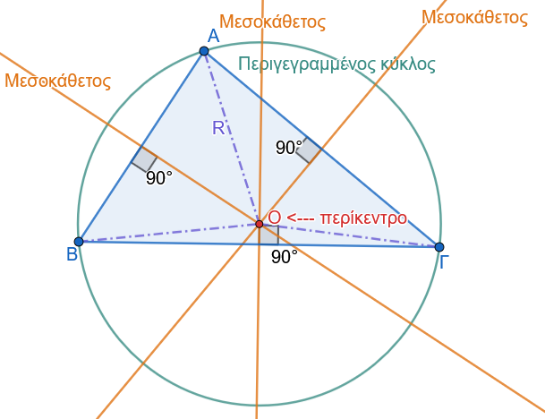{fig-align="center" width="450"}

- **Περίκεντρο:**

Το κέντρο του περιγεγραμμένου κύκλου ονομάζεται περίκεντρο, συμβολίζεται με το γράμμα $O$, και είναι το σημείο στο οποίο συντρέχουν οι μεσοκάθετοι των τριών πλευρών του τριγώνου.

- **Ακτίνα** $R$:

Η απόσταση του περικέντρου $O$ από τις κορυφές του τριγώνου είναι σταθερή και ίση με την ακτίνα του περιγεγραμμένου κύκλου: $$OA = OB = O\Gamma = R$$
::::

------------------------------------------------------------------------

#### Β. Θεωρήματα & Πορίσματα

:::: {.math-box .theorem-box}
::: {.math-title .theorem-title}
**Θεώρημα 1**
:::

Οι μεσοκάθετοι των τριών πλευρών κάθε τριγώνου συντρέχουν σε ένα σημείο, το οποίο είναι το περίκεντρο του τριγώνου.
::::

:::: {.math-box .apodeixi-box}
::: {.math-title .apodeixi-title}
**Απόδειξη:**
:::

Έστω τρίγωνο $\triangle AB\Gamma$.
(Σχήμα 1)

Θεωρούμε τις μεσοκαθέτους των πλευρών $AB$ και $A\Gamma$, οι οποίες τέμνονται σε ένα σημείο $O$ (ταυτίζονται μόνο αν οι πλευρές είναι συνευθειακές, πράγμα άτοπο για τρίγωνο).

Επειδή το σημείο $O$ ανήκει στη μεσοκάθετο της πλευράς $AB$, ισαπέχει από τα άκρα $A$ και $B$: $$OA = OB \quad (1)$$ Επειδή το σημείο $O$ ανήκει στη μεσοκάθετο της πλευράς $A\Gamma$, ισαπέχει από τα άκρα $A$ και $\Gamma$: $$OA = O\Gamma \quad (2)$$ Από τις σχέσεις $(1)$ και $(2)$ προκύπτει άμεσα ότι: $$OB = O\Gamma$$ Η σχέση αυτή δηλώνει ότι το σημείο $O$ ισαπέχει από τα άκρα $B$ και $\Gamma$ της τρίτης πλευράς $B\Gamma$.

Συνεπώς, από τη χαρακτηριστική ιδιότητα της μεσοκαθέτου, το σημείο $O$ ανήκει και στη μεσοκάθετο της πλευράς $B\Gamma$.

Άρα, οι τρεις μεσοκάθετοι των πλευρών του τριγώνου συντρέχουν στο ίδιο σημείο $O$, το οποίο είναι το κέντρο του κύκλου που διέρχεται από τις κορυφές $A, B, \Gamma$ με ακτίνα $R = OA = OB = O\Gamma$.
::::

:::: {.math-box .corollary-box}
::: {.math-title .corollary-title}
**Πόρισμα 1**
:::

Σε κάθε ορθογώνιο τρίγωνο $\triangle AB\Gamma$ ($\widehat{A} = 90^\circ$), το περίκεντρο $O$ συμπίπτει με το μέσο της υποτείνουσας $B\Gamma$, και η ακτίνα του περιγεγραμμένου κύκλου ισούται με το μισό της υποτείνουσας: $$R = \dfrac{B\Gamma}{2}$$

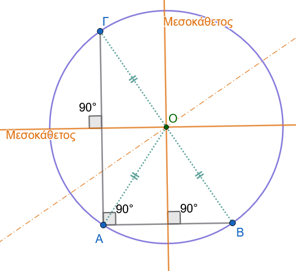{fig-align="center" width="400"}
::::

------------------------------------------------------------------------

#### Γ. Εφαρμογές

:::: {.math-box .example-box}
::: {.math-title .example-title}
**Εφαρμογή 1**
:::

**Αν** $O$ είναι το περίκεντρο οξυγωνίου τριγώνου $\triangle AB\Gamma$, να αποδειχθεί ότι η γωνία $\widehat{BO\Gamma}$ που σχηματίζεται στο περίκεντρο είναι διπλάσια της γωνίας $\widehat{A}$ του τριγώνου: $\widehat{BO\Gamma} = 2\widehat{A}$.
::::

:::: {.math-box .examplesolution-box}
::: {.math-title .examplesolution-title}
**Λύση:**

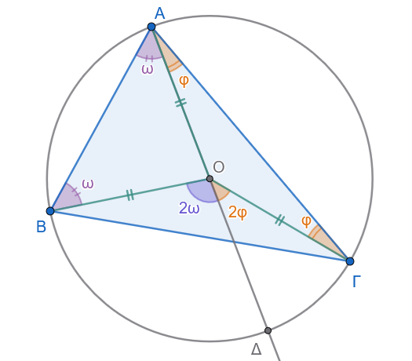{fig-align="center" width="400"}
:::

Φέρουμε την ημιευθεία $AO$, η οποία τέμνει τον περιγεγραμμένο κύκλο στο σημείο $\Delta$, οπότε το ευθύγραμμο τμήμα $A\Delta$ είναι διάμετρος του κύκλου.

Στο τρίγωνο $\triangle OAB$, επειδή $OA = OB = R$, το τρίγωνο είναι ισοσκελές.

Συνεπώς, οι προσκείμενες στη βάση γωνίες είναι ίσες: $\widehat{OAB} = \widehat{OBA}$.

Η γωνία $\widehat{BO\Delta}$ είναι εξωτερική γωνία του τριγώνου $\triangle OAB$, άρα ισούται με το άθροισμα των δύο απέναντι εσωτερικών γωνιών: $$\widehat{BO\Delta} = \widehat{OAB} + \widehat{OBA} = 2\widehat{OAB} \quad (1)$$ Ομοίως, στο ισοσκελές τρίγωνο $\triangle OA\Gamma$ ($OA = O\Gamma = R$), η γωνία $\widehat{\Gamma O\Delta}$ είναι εξωτερική γωνία, οπότε: $$\widehat{\Gamma O\Delta} = \widehat{OA\Gamma} + \widehat{O\Gamma A} = 2\widehat{OA\Gamma} \quad (2)$$ Προσθέτοντας κατά μέλη τις σχέσεις $(1)$ και $(2)$, έχουμε: $$\widehat{BO\Delta} + \widehat{\Gamma O\Delta} = 2\widehat{OAB} + 2\widehat{OA\Gamma} \implies \widehat{BO\Gamma} = 2(\widehat{OAB} + \widehat{OA\Gamma}) = 2\widehat{A}$$

Συνεπώς, αποδείχθηκε ότι $\widehat{BO\Gamma} = 2\widehat{A}$.
::::

:::: {.math-box .example-box}
::: {.math-title .example-title}
**Εφαρμογή 2**
:::

**Να αποδειχθεί ότι αν σε ένα τρίγωνο** $\triangle AB\Gamma$ η διάμεσος $AM$ προς την πλευρά $B\Gamma$ ισούται με το μισό της πλευράς αυτής ($AM = \dfrac{B\Gamma}{2}$), τότε το τρίγωνο είναι ορθογώνιο με ορθή γωνία την $\widehat{A}$.
::::

:::: {.math-box .examplesolution-box}
::: {.math-title .examplesolution-title}
**Λύση:**

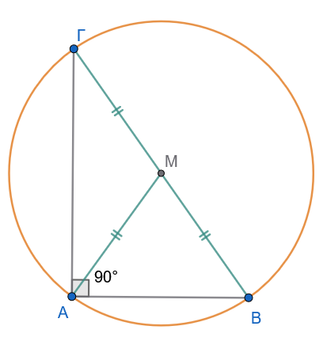{fig-align="center" width="350"}
:::

Από την υπόθεση ισχύει: $$AM = \dfrac{B\Gamma}{2} \implies AM = BM = M\Gamma$$ Αυτό σημαίνει ότι το σημείο $M$ ισαπέχει από τις τρεις κορυφές $A, B$ και $\Gamma$ του τριγώνου.

Συνεπώς, το σημείο $M$ είναι το περίκεντρο του τριγώνου $\triangle AB\Gamma$.

Εφόσον το περίκεντρο $M$ ανήκει στην πλευρά $B\Gamma$ (είναι το μέσο της), η πλευρά $B\Gamma$ αποτελεί διάμετρο του περιγεγραμμένου κύκλου.

Η εγγεγραμμένη γωνία $\widehat{A}$ βαίνει σε ημικύκλιο, άρα είναι ορθή: $$\widehat{A} = 90^\circ$$ Συνεπώς, το τρίγωνο $\triangle AB\Gamma$ είναι ορθογώνιο στην κορυφή $A$.
::::

------------------------------------------------------------------------

#### Δ. Ασκήσεις με Πλήρεις Αποδείξεις

:::: {.math-box .exercise-box}
::: {.math-title .exercise-title}
**Άσκηση 1**
:::

**Εκφώνηση:**

Σε ορθογώνιο τρίγωνο $\triangle AB\Gamma$ ($\widehat{A} = 90^\circ$), φέρουμε το ύψος $A\Delta$.

Αν $O_1$ είναι το περίκεντρο του τριγώνου $\triangle AB\Delta$ και $O_2$ το περίκεντρο του τριγώνου $\triangle A\Delta\Gamma$, να αποδείξετε ότι η διάκεντρος $O_1 O_2$ είναι παράλληλη προς την υποτείνουσα $B\Gamma$ και ισούται με το μισό της: $O_1 O_2 = \dfrac{B\Gamma}{2}$.
::::

:::: {.math-box .solution-box}
::: {.math-title .solution-title}
**Απόδειξη:**

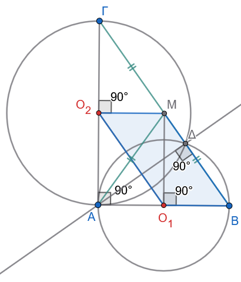{fig-align="center" width="350"}
:::

**Βήμα 1: Τα περίκεντρα** $O_1$ και $O_2$

- Στο ορθογώνιο τρίγωνο $\triangle AB\Delta$ ($\widehat{\Delta} = 90^\circ$), το περίκεντρο $O_1$ είναι το **μέσο** της υποτείνουσας $AB$.\
  Άρα: $$AO_1 = O_1B = \frac{AB}{2}$$

- Στο ορθογώνιο τρίγωνο $\triangle A\Delta\Gamma$ ($\widehat{\Delta} = 90^\circ$), το περίκεντρο $O_2$ είναι το **μέσο** της υποτείνουσας $A\Gamma$.\
  Άρα: $$AO_2 = O_2\Gamma = \frac{A\Gamma}{2}$$

**Βήμα 2: Κατασκευή του ορθογωνίου** $AO_1 M O_2$

Από το $O_2$ φέρουμε κάθετη στην $A\Gamma$ και από το $O_1$ φέρουμε κάθετη στην $AB$.
Αυτές οι δύο γραμμές τέμνονται σε ένα σημείο $M$ (μέσο της ΒΓ) και είναι οι μεσοκάθετες των ΑΒ και ΑΓ αφού $Ο_1$ και $Ο_2$ είναι μέσα.

Το τετράπλευρο $AO_1MO_2$ έχει τρεις ορθές γωνίες ($\widehat{A} = 90^\circ$, $\widehat{O_1} = 90^\circ$, $\widehat{O_2} = 90^\circ$), επομένως είναι **ορθογώνιο παραλληλόγραμμο**.

Από τις ιδιότητες του ορθογωνίου:

- Οι απέναντι πλευρές είναι ίσες: $$O_2M = // AO_1 = O_1B$$ $$O_1M = // AO_2 = O_2\Gamma$$

- Η γωνία $\widehat{O_2 M O_1} = 90^\circ$.

**Βήμα 3: Το παραλληλόγραμμο** $O_2 M B O_1$ και το τελικό συμπέρασμα

Κοιτάμε το τετράπλευρο $O_2 M B O_1$:

- $O_2M \parallel O_1B$ (και τα δύο είναι κάθετα στην $A\Gamma$)
- $O_2M = O_1B$

Ένα τετράπλευρο που έχει δύο απέναντι πλευρές **ίσες και παράλληλες** είναι **παραλληλόγραμμο**!

Άρα και οι άλλες δύο απέναντι πλευρές του είναι παράλληλες και ίσες: $$O_1 O_2 \parallel MB \implies O_1 O_2 \parallel B\Gamma$$ $$O_1 O_2 = MB = \frac{B\Gamma}{2}$$
::::

**Άσκηση 2**

**Εκφώνηση:** Δίνεται ισοσκελές τρίγωνο $\triangle AB\Gamma$ ($AB = A\Gamma$) εγγεγραμμένο σε κύκλο με κέντρο $O$.
Να αποδείξετε ότι η διάμεσος $AM$ προς τη βάση $B\Gamma$ διέρχεται από το περίκεντρο $O$.

**Απόδειξη:**

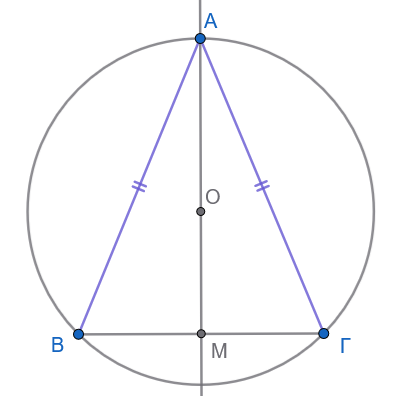{fig-align="center" width="300"}

Εφόσον το τρίγωνο $\triangle AB\Gamma$ είναι ισοσκελές με $AB = A\Gamma$, η διάμεσος $AM$ προς τη βάση $B\Gamma$ είναι ταυτόχρονα και ύψος του τριγώνου.

Συνεπώς, η ευθεία $AM$ είναι κάθετη στη βάση $B\Gamma$ στο μέσο της $M$, δηλαδή η ευθεία $AM$ είναι η μεσοκάθετος της πλευράς $B\Gamma$.

Από το θεώρημα του περικέντρου, το κέντρο $O$ του περιγεγραμμένου κύκλου είναι το σημείο τομής των μεσοκαθέτων των πλευρών του τριγώνου.

Άρα, το $O$ ανήκει υποχρεωτικά στη μεσοκάθετο της $B\Gamma$, η οποία είναι η ευθεία $AM$.

Συνεπώς, η διάμεσος $AM$ διέρχεται από το περίκεντρο $O$.

**Άσκηση 3**

**Εκφώνηση:** Δίνεται τρίγωνο $\triangle AB\Gamma$ με περίκεντρο $O$.
Αν $M, N$ είναι τα μέσα των πλευρών $AB, A\Gamma$ αντίστοιχα, να αποδείξετε ότι το τετράπλευρο $AMON$ είναι εγγράψιμο σε κύκλο με διάμετρο το τμήμα $AO$.

**Απόδειξη:**

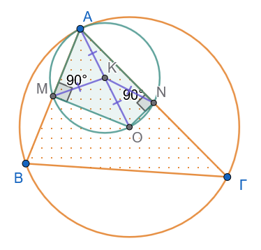{fig-align="center" width="300"}

- Επειδή το $M$ είναι το μέσο της χορδής $AB$ του περιγεγραμμένου κύκλου, η ακτίνα $OM$ είναι κάθετη στη χορδή: $OM \perp AB \implies \widehat{AMO} = 90^\circ$.

- Επειδή το $N$ είναι το μέσο της χορδής $A\Gamma$ του περιγεγραμμένου κύκλου, η ακτίνα $ON$ είναι κάθετη στη χορδή: $ON \perp A\Gamma \implies \widehat{ANO} = 90^\circ$.

Τα ορθογώνια τρίγωνα $\triangle ΑΜΟ$ και $\triangle ΑΝΟ$ έχουν κοινή υποτείνουσα την ΑΟ.

Αν Κ το μέσον της υποτείνουσας ΑΟ, τότε ΑΚ=ΜΚ=ΟΚ=ΝΚ.

Άρα τα 4 σημεία Α, Μ, Ο και Ν βρίσκονται στον ίδιο κύκλο (Κ,ΚΑ).

**Άσκηση 4**

**Εκφώνηση:** Σε κύκλο με κέντρο $O$ φέρουμε μια διάμετρο $AB$.
Αν $M$ είναι ένα τυχαίο σημείο της περιφέρειας του κύκλου, να αποδείξετε ότι το σημείο $O$ είναι το περίκεντρο του τριγώνου $\triangle MAB$.

**Απόδειξη:**

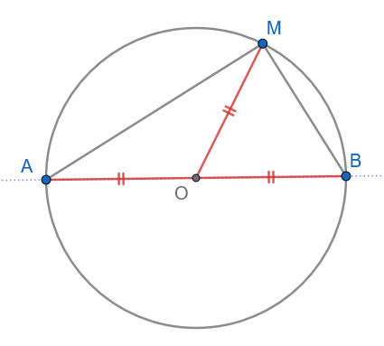{fig-align="center" width="350"}

- Το σημείο $O$ είναι το μέσο της διαμέτρου $AB$.

- Οι αποστάσεις του $O$ από τις κορυφές του τριγώνου είναι ίσες με την ακτίνα $R$ του κύκλου: $OA = OB = OM = R$.

Επειδή το $O$ ισαπέχει από τις τρεις κορυφές του τριγώνου, είναι εξ ορισμού το περίκεντρο του τριγώνου $\triangle MAB$.

------------------------------------------------------------------------

### ΜΕΡΟΣ 2: Ο ΕΓΓΕΓΡΑΜΜΕΝΟΣ ΚΥΚΛΟΣ ΤΡΙΓΩΝΟΥ (INCIRCLE)

#### Α. Ορισμοί

:::: {.math-box .definition-box}
::: {.math-title .definition-title}
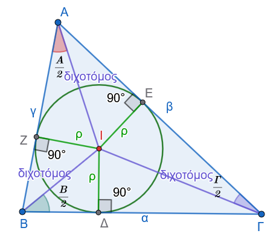{fig-align="center" width="350"}
:::

- **Εγγεγραμμένος Κύκλος:** Ο κύκλος ο οποίος βρίσκεται στο εσωτερικό ενός τριγώνου $\triangle AB\Gamma$ και εφάπτεται εσωτερικά και στις τρεις πλευρές του ($AB, B\Gamma, A\Gamma$).

- **Έγκεντρο:** Το κέντρο του εγγεγραμμένου κύκλου ονομάζεται έγκεντρο, συμβολίζεται με το γράμμα $I$, και είναι το σημείο στο οποίο συντρέχουν οι εσωτερικές διχοτόμοι των τριών γωνιών του τριγώνου.

- **Ακτίνα** $\rho$: Η ακτίνα του εγγεγραμμένου κύκλου συμβολίζεται με $\rho$ και ισούται με την κάθετη απόσταση του εγκέντρου $I$ από οποιαδήποτε πλευρά του τριγώνου.
::::

------------------------------------------------------------------------

#### Β. Θεωρήματα & Πορίσματα

:::: {.math-box .theorem-box}
::: {.math-title .theorem-title}
**Θεώρημα 2**
:::

Οι διχοτόμοι των τριών εσωτερικών γωνιών κάθε τριγώνου συντρέχουν σε ένα σημείο, το οποίο είναι το έγκεντρο του τριγώνου.
::::

:::: {.math-box .apodeixi-box}
::: {.math-title .apodeixi-title}
**Απόδειξη:**
:::

Έστω τρίγωνο $\triangle AB\Gamma$.
(Σχήμα 2)

Οι εσωτερικές διχοτόμοι των γωνιών $\widehat{B}$ και $\widehat{\Gamma}$ τέμνονται σε ένα σημείο $I$, το οποίο βρίσκεται στο εσωτερικό του τριγώνου.

Φέρουμε τις κάθετες αποστάσεις του $I$ προς τις πλευρές του τριγώνου: $I\Delta \perp B\Gamma$, $IE \perp A\Gamma$ και $IZ \perp AB$.

- Επειδή το $I$ ανήκει στη διχοτόμο της γωνίας $\widehat{B}$, ισαπέχει από τις πλευρές $AB$ και $B\Gamma$: $$IZ = I\Delta \quad (1)$$

- Επειδή το $I$ ανήκει στη διχοτόμο της γωνίας $\widehat{\Gamma}$, ισαπέχει από τις πλευρές $A\Gamma$ και $B\Gamma$: $$IE = I\Delta \quad (2)$$

Από τις σχέσεις $(1)$ και $(2)$ προκύπτει άμεσα ότι: $$IZ = IE$$ Η σχέση αυτή δηλώνει ότι το σημείο $I$ ισαπέχει από τις πλευρές $AB$ και $A\Gamma$ της γωνίας $\widehat{A}$.

Επειδή το $I$ είναι εσωτερικό σημείο της γωνίας $\widehat{A}$ και ισαπέχει από τις πλευρές της, ανήκει υποχρεωτικά στη διχοτόμο της γωνίας $\widehat{A}$.

Συνεπώς, οι τρεις εσωτερικές διχοτόμοι συντρέχουν στο σημείο $I$, το οποίο ισαπέχει από τις πλευρές του τριγώνου με απόσταση ίση με την ακτίνα του εγγεγραμμένου κύκλου: $\rho = I\Delta = IE = IZ$.
::::

------------------------------------------------------------------------

#### Γ. Εφαρμογές

:::: {.math-box .example-box}
::: {.math-title .example-title}
**Εφαρμογή 3**
:::

**Να αποδειχθεί ότι η γωνία** $\widehat{BI\Gamma}$, που σχηματίζεται στο έγκεντρο $I$ από τις διχοτόμους των γωνιών $\widehat{B}$ και $\widehat{\Gamma}$ του τριγώνου $\triangle AB\Gamma$, ισούται με: $$\widehat{BI\Gamma} = 90^\circ + \dfrac{\widehat{A}}{2}$$
::::

:::: {.math-box .examplesolution-box}
::: {.math-title .examplesolution-title}
**Λύση:** (Σχήμα 2)
:::

Στο τρίγωνο $\triangle IB\Gamma$, το άθροισμα των εσωτερικών γωνιών είναι $180^\circ$: $$\widehat{BI\Gamma} + \widehat{I B\Gamma} + \widehat{I\Gamma B} = 180^\circ \quad (1)$$ Επειδή οι $BI$ και $\Gamma I$ είναι οι διχοτόμοι των γωνιών $\widehat{B}$ και $\widehat{\Gamma}$ του τριγώνου $\triangle AB\Gamma$, ισχύει: $$\widehat{I B\Gamma} = \dfrac{\widehat{B}}{2} \quad \text{και} \quad \widehat{I\Gamma B} = \dfrac{\widehat{\Gamma}}{2}$$ Αντικαθιστώντας τις τιμές αυτές στη σχέση $(1)$, έχουμε: $$\widehat{BI\Gamma} = 180^\circ - \left(\dfrac{\widehat{B}}{2} + \dfrac{\widehat{\Gamma}}{2}\right) = 180^\circ - \dfrac{\widehat{B} + \widehat{\Gamma}}{2} \quad (2)$$ Στο αρχικό τρίγωνο $\triangle AB\Gamma$ ισχύει: $$\widehat{A} + \widehat{B} + \widehat{\Gamma} = 180^\circ \implies \widehat{B} + \widehat{\Gamma} = 180^\circ - \widehat{A}$$ Αντικαθιστούμε στη σχέση $(2)$: $$\widehat{BI\Gamma} = 180^\circ - \dfrac{180^\circ - \widehat{A}}{2} = 180^\circ - 90^\circ + \dfrac{\widehat{A}}{2} = 90^\circ + \dfrac{\widehat{A}}{2}$$ Συνεπώς, αποδείχθηκε η ζητούμενη σχέση: $\widehat{BI\Gamma} = 90^\circ + \dfrac{\widehat{A}}{2}$.
::::

:::: {.math-box .example-box}
::: {.math-title .example-title}
**Εφαρμογή 4**
:::

**Αν** $\tau = \dfrac{\alpha + \beta + \gamma}{2}$ είναι η ημιπερίμετρος του τριγώνου $\triangle AB\Gamma$, να αποδειχθεί ότι οι αποστάσεις των κορυφών $A$, $B$ και $\Gamma$ από τα σημεία επαφής του εγγεγραμμένου κύκλου με τις πλευρές ισούνται με $\tau - \alpha$, $\tau - \beta$ και $\tau - \gamma$ αντίστοιχα.
::::

:::: {.math-box .examplesolution-box}
::: {.math-title .examplesolution-title}
**Λύση:**

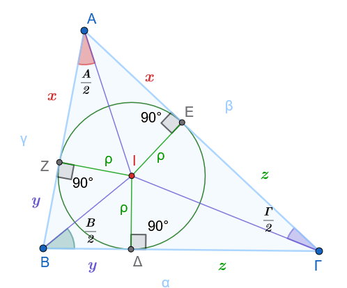{fig-align="center" width="400"}
:::

Έστω $E, Z, \Delta$ τα σημεία επαφής του εγγεγραμμένου κύκλου με τις πλευρές $A\Gamma, AB$ και $B\Gamma$ αντίστοιχα.

Τα εφαπτόμενα τμήματα από κάθε κορυφή προς τον κύκλο είναι ίσα μεταξύ τους:

- Από την κορυφή $A$: $AE = AZ = x$

- Από την κορυφή $B$: $B\Delta = BZ = y$

- Από την κορυφή $\Gamma$: $\Gamma\Delta = \Gamma E = z$

Εκφράζουμε τα μήκη των πλευρών του τριγώνου $\triangle AB\Gamma$ ως προς τα $x, y, z$: $$\alpha = B\Gamma = y + z$$ $$\beta = A\Gamma = x + z$$ $$\gamma = AB = x + y$$

Αθροίζουμε τις τρεις σχέσεις κατά μέλη: $$\alpha + \beta + \gamma = 2(x + y + z) \implies 2\tau = 2(x + y + z) \implies \tau = x + y + z \quad (1)$$ Από τη σχέση $(1)$ υπολογίζουμε το $x$: $$x = \tau - (y + z) \implies AE = AZ = \tau - \alpha \quad (2)$$ Με όμοιο τρόπο, υπολογίζουμε τα $y$ και $z$: $$y = \tau - (x + z) \implies B\Delta = BZ = \tau - \beta \quad (3)$$ $$z = \tau - (x + y) \implies \Gamma\Delta = \Gamma E = \tau - \gamma \quad (4)$$ Οι σχέσεις αυτές αποδεικνύουν πλήρως το ζητούμενο.
::::

------------------------------------------------------------------------

#### Δ. Ασκήσεις με Πλήρεις Αποδείξεις

**Άσκηση 6**

**Εκφώνηση:** Σε ορθογώνιο τρίγωνο $\triangle AB\Gamma$ ($\widehat{A} = 90^\circ$), να αποδειχθεί ότι η ακτίνα $\rho$ του εγγεγραμμένου κύκλου ισούται με: $$\rho = \tau - \alpha = \dfrac{\beta + \gamma - \alpha}{2}$$

**Απόδειξη:**

Έστω $\Delta, E, Z$ τα σημεία επαφής του εγγεγραμμένου κύκλου με τις πλευρές $B\Gamma, A\Gamma$ και $AB$ αντίστοιχα.

Στο τετράπλευρο $AEIZ$:

- Οι γωνίες $\widehat{AEI}$ και $\widehat{AZI}$ είναι ορθές ($90^\circ$), καθώς οι ακτίνες του εγγεγραμμένου κύκλου είναι κάθετες στις εφαπτόμενες πλευρές.

- Η γωνία $\widehat{EAZ}$ (δηλαδή η γωνία $\widehat{A}$ του τριγώνου) είναι ορθή ($90^\circ$) από την υπόθεση.

Εφόσον το τετράπλευρο $AEIZ$ έχει τρεις ορθές γωνίες, είναι ορθογώνιο.

Επιπλέον, οι διαδοχικές πλευρές του $IE$ και $IZ$ είναι ίσες με την ακτίνα $\rho$ του κύκλου ($IE = IZ = \rho$).

Ένα ορθογώνιο με δύο διαδοχικές πλευρές ίσες είναι τετράγωνο.

Συνεπώς: $$AE = AZ = \rho$$ Από την *Εφαρμογή 4*, γνωρίζουμε ότι το εφαπτόμενο τμήμα από την κορυφή $A$ ισούται με $AE = \tau - \alpha$.

Άρα: $$\rho = \tau - \alpha$$ Αντικαθιστώντας την τιμή του $\tau = \dfrac{\alpha + \beta + \gamma}{2}$, έχουμε: $$\rho = \dfrac{\alpha + \beta + \gamma}{2} - \alpha = \dfrac{\beta + \gamma - \alpha}{2}$$

:::: {.math-box .exercise-box}
::: {.math-title .exercise-title}
**Άσκηση 7**
:::

**Εκφώνηση:** Αν $I$ είναι το έγκεντρο του τριγώνου $\triangle AB\Gamma$ και $E, Z$ είναι τα σημεία επαφής του εγγεγραμμένου κύκλου με τις πλευρές $A\Gamma$ και $AB$ αντίστοιχα, να αποδείξετε ότι η ευθεία $AI$ είναι κάθετη στο ευθύγραμμο τμήμα $EZ$.
::::

:::: {.math-box .solution-box}
::: {.math-title .solution-title}
**Απόδειξη:**

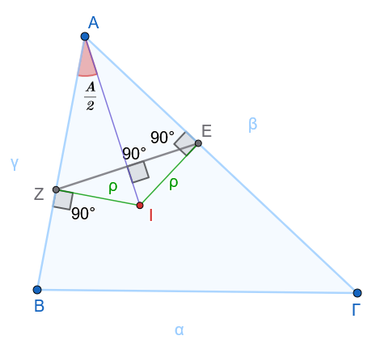{fig-align="center" width="350"}
:::

- Από την *Εφαρμογή 4*, τα εφαπτόμενα τμήματα από την κορυφή $A$ είναι ίσες: $AE = AZ = \tau - \alpha$.

- Συνεπώς, το τρίγωνο $\triangle AEZ$ είναι ισοσκελές με κορυφή το $A$.

- Η ευθεία $AI$ είναι η διχοτόμος της γωνίας $\widehat{A}$ του τριγώνου $\triangle AB\Gamma$, καθώς το έγκεντρο $I$ είναι το σημείο τομής των εσωτερικών διχοτόμων του τριγώνου.

Σε κάθε ισοσκελές τρίγωνο, η διχοτόμος της γωνίας της κορυφής είναι ταυτόχρονα διάμεσος και ύψος προς τη βάση.

Συνεπώς, η διχοτόμος $AI$ είναι κάθετη στη βάση $EZ$: $$AI \perp EZ$$
::::

------------------------------------------------------------------------

### ΜΕΡΟΣ 3: ΟΙ ΠΑΡΕΓΓΕΓΡΑΜΜΕΝΟΙ ΚΥΚΛΟΙ ΤΡΙΓΩΝΟΥ (EXCIRCLES)

#### Α. Ορισμοί

:::: {.math-box .definition-box}
::: {.math-title .definition-title}
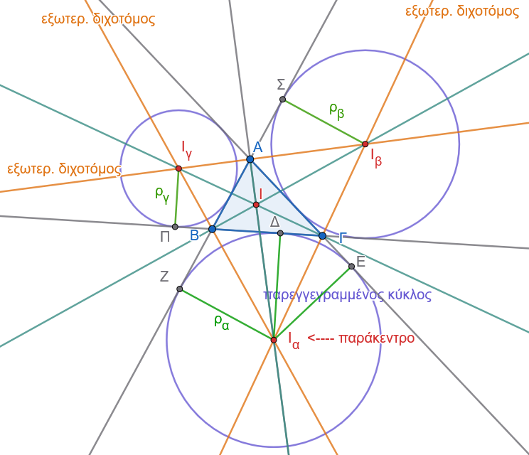{fig-align="center" width="500"}
:::

- **Παρεγγεγραμμένος Κύκλος:** Ο κύκλος ο οποίος βρίσκεται στο εξωτερικό ενός τριγώνου $\triangle AB\Gamma$, εφάπτεται εξωτερικά σε μία πλευρά του τριγώνου (π.χ. στην πλευρά $B\Gamma$) και στις προεκτάσεις των άλλων δύο πλευρών ($AB$ και $A\Gamma$).
  Κάθε τρίγωνο έχει ακριβώς τρεις παρεγγεγραμμένους κύκλους.

- **Παράκεντρα:** Τα κέντρα των τριών αυτών κύκλων ονομάζονται παράκεντρα και συμβολίζονται με $I_\alpha, I_\beta, I_\gamma$ αντίστοιχα για τις πλευρές $\alpha, \beta, \gamma$.

- **Ακτίνες** $\rho_α, \rho_β, \rho_γ$: Οι ακτίνες των τριών παρεγγεγραμμένων κύκλων συμβολίζονται με $\rho_α, \rho_β$ και $\rho_γ$ αντίστοιχα.
::::

#### Β. Θεωρήματα & Πορίσματα

:::: {.math-box .theorem-box}
::: {.math-title .theorem-title}
**Θεώρημα 3**
:::

Η εσωτερική διχοτόμος μιας γωνίας τριγώνου (π.χ. της $\widehat{A}$) και οι εξωτερικές διχοτόμοι των δύο άλλων γωνιών (των $\widehat{B}$ και $\widehat{\Gamma}$) συντρέχουν στο παράκεντρο $I_a$ του τριγώνου.
::::

:::: {.math-box .apodeixi-box}
::: {.math-title .apodeixi-title}
**Απόδειξη: (Σχήμα 3)**
:::

Έστω τρίγωνο $\triangle AB\Gamma$.

Οι εξωτερικές διχοτόμοι των γωνιών $\widehat{B}$ και $\widehat{\Gamma}$ τέμνονται σε ένα σημείο $I_a$ στο εξωτερικό του τριγώνου.

Φέρουμε τις κάθετες αποστάσεις του σημείου $I_a$ προς τις ευθείες των πλευρών: $I_a\Delta \perp B\Gamma$, $I_aE \perp A\Gamma$ (στην προέκταση) και $I_aZ \perp AB$ (στην προέκταση).

- Επειδή το $I_a$ ανήκει στην εξωτερική διχοτόμο της γωνίας $\widehat{B}$, ισαπέχει από τις ευθείες $B\Gamma$ και $AB$: $$I_aZ = I_a\Delta \quad (1)$$

- Επειδή το $I_a$ ανήκει στην εξωτερική διχοτόμο της γωνίας $\widehat{\Gamma}$, ισαπέχει από τις ευθείες $B\Gamma$ και $A\Gamma$: $$I_aE = I_a\Delta \quad (2)$$

Από τις σχέσεις $(1)$ και $(2)$ προκύπτει άμεσα ότι: $$I_aZ = I_aE$$ Η σχέση αυτή δηλώνει ότι το σημείο $I_a$ ισαπέχει από τις ευθείες των πλευρών $AB$ και $A\Gamma$ της γωνίας $\widehat{A}$.

Επειδή το $I_a$ βρίσκεται στο εσωτερικό της γωνίας $\widehat{A}$ και ισαπέχει από τις πλευρές της, ανήκει υποχρεωτικά στη διχοτόμο της εσωτερικής γωνίας $\widehat{A}$.

Συνεπώς, οι τρεις διχοτόμοι (η εσωτερική της $\widehat{A}$ και οι εξωτερικές των $\widehat{B}, \widehat{\Gamma}$) συντρέχουν στο σημείο $I_a$, το οποίο είναι το κέντρο του παρεγγεγραμμένου κύκλου που εφάπτεται στην πλευρά $B\Gamma$ με ακτίνα $\rho_a = I_a\Delta = I_aE = I_aZ$.
::::

------------------------------------------------------------------------

#### Γ. Εφαρμογές

:::: {.math-box .example-box}
::: {.math-title .example-title}
**Εφαρμογή 5**
:::

**Να αποδειχθεί ότι η γωνία** $\widehat{B I_a \Gamma}$, που σχηματίζεται στο παράκεντρο $I_a$ από τις εξωτερικές διχοτόμους των γωνιών $\widehat{B}$ και $\widehat{\Gamma}$ του τριγώνου $\triangle AB\Gamma$, ισούται με: $$\widehat{B I_a \Gamma} = 90^\circ - \dfrac{\widehat{A}}{2}$$
::::

:::: {.math-box .examplesolution-box}
::: {.math-title .examplesolution-title}
**Λύση:**

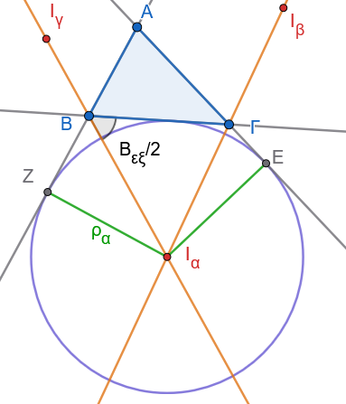{fig-align="center" width="300"}
:::

Στο τρίγωνο $\triangle I_a B \Gamma$, το άθροισμα των εσωτερικών γωνιών είναι $180^\circ$: $$\widehat{B I_a \Gamma} + \widehat{I_a B \Gamma} + \widehat{I_a \Gamma B} = 180^\circ \quad (1)$$

- Η γωνία $\widehat{I_a B \Gamma}$ είναι το μισό της εξωτερικής γωνίας $\widehat{B}_{ex}$, δηλαδή:

- $$\widehat{I_a B \Gamma} = \dfrac{\widehat{B}_{ex}}{2} = \dfrac{180^\circ - \widehat{B}}{2} = 90^\circ - \dfrac{\widehat{B}}{2}$$

- Η γωνία $\widehat{I_a \Gamma B}$ είναι το μισό της εξωτερικής γωνίας $\widehat{\Gamma}_{ex}$, δηλαδή: $$\widehat{I_a \Gamma B} = \dfrac{\widehat{\Gamma}_{ex}}{2} = \dfrac{180^\circ - \widehat{\Gamma}}{2} = 90^\circ - \dfrac{\widehat{\Gamma}}{2}$$

Αντικαθιστούμε τις τιμές αυτές στη σχέση $(1)$: $$\widehat{B I_a \Gamma} = 180^\circ - \left(90^\circ - \dfrac{\widehat{B}}{2} + 90^\circ - \dfrac{\widehat{\Gamma}}{2}\right) = 180^\circ - 180^\circ + \dfrac{\widehat{B} + \widehat{\Gamma}}{2} = \dfrac{\widehat{B} + \widehat{\Gamma}}{2} \quad (2)$$ Στο αρχικό τρίγωνο $\triangle AB\Gamma$ ισχύει: $$\widehat{B} + \widehat{\Gamma} = 180^\circ - \widehat{A}$$ Αντικαθιστούμε στη σχέση $(2)$: $$\widehat{B I_a \Gamma} = \dfrac{180^\circ - \widehat{A}}{2} = 90^\circ - \dfrac{\widehat{A}}{2}$$ Συνεπώς, αποδείχθηκε η ζητούμενη σχέση: $\widehat{B I_a \Gamma} = 90^\circ - \dfrac{\widehat{A}}{2}$.
::::

:::: {.math-box .example-box}
::: {.math-title .example-title}
**Εφαρμογή 6**
:::

**Αν** $\tau$ είναι η ημιπερίμετρος του τριγώνου $\triangle AB\Gamma$, να αποδειχθεί ότι οι αποστάσεις της κορυφής $A$ από τα σημεία επαφής του παρεγγεγραμμένου κύκλου $(I_a, \rho_a)$ με τις προεκτάσεις των πλευρών $AB$ και $A\Gamma$ είναι ίσες με την ημιπερίμετρο $\tau$: $AZ = AE = \tau$.
::::

:::: {.math-box .examplesolution-box}
::: {.math-title .examplesolution-title}
**Λύση:**

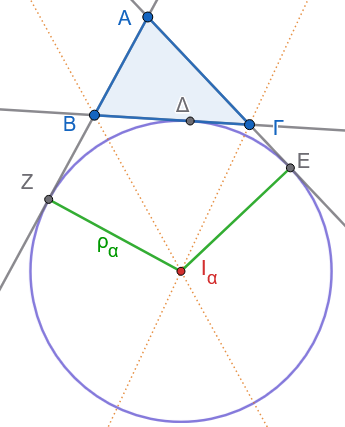{fig-align="center" width="280"}
:::

Έστω $Z$ και $E$ τα σημεία επαφής του παρεγγεγραμμένου κύκλου με τις προεκτάσεις των πλευρών $AB$ και $A\Gamma$ αντίστοιχα, και $\Delta$ το σημείο επαφής με την πλευρά $B\Gamma$.

Τα εφαπτόμενα τμήματα από την κορυφή $A$ προς τον κύκλο είναι ίσα: $AZ = AE$.

Αναλύουμε το άθροισμα των δύο αυτών ίσων τμημάτων: $$AZ + AE = (AB + BZ) + (A\Gamma + \Gamma E) \quad (1)$$ Τα εφαπτόμενα τμήματα από τις κορυφές $B$ και $\Gamma$ προς τον κύκλο είναι επίσης ίσα:

- Από την κορυφή $B$: $BZ = B\Delta$

- Από την κορυφή $\Gamma$: $\Gamma E = \Gamma\Delta$

Αντικαθιστούμε τις ισότητες αυτές στη σχέση $(1)$: $$AZ + AE = (AB + B\Delta) + (A\Gamma + \Gamma\Delta) = AB + A\Gamma + (B\Delta + \Gamma\Delta) = \gamma + \beta + \alpha$$ Εφόσον η περίμετρος του τριγώνου είναι $\alpha + \beta + \gamma = 2\tau$, η σχέση γίνεται: $$AZ + AE = 2\tau$$ Επειδή $AZ = AE$, προκύπτει άμεσα ότι: $$AZ = AE = \tau$$ Δηλαδή, η απόσταση από την κορυφή μέχρι τα σημεία επαφής στις προεκτάσεις ισούται με την ημιπερίμετρο του τριγώνου.
::::

------------------------------------------------------------------------

#### Δ. Ασκήσεις με Πλήρεις Αποδείξεις

**Άσκηση 8**

**Εκφώνηση:** Να αποδείξετε ότι το σημείο επαφής $\Delta_1$ του εγγεγραμμένου κύκλου με την πλευρά $B\Gamma$ και το σημείο επαφής $\Delta_2$ του παρεγγεγραμμένου κύκλου $I_a$ με την ίδια πλευρά $B\Gamma$ είναι σημεία συμμετρικά ως προς το μέσον $M$ της πλευράς $B\Gamma$.

**Απόδειξη:**

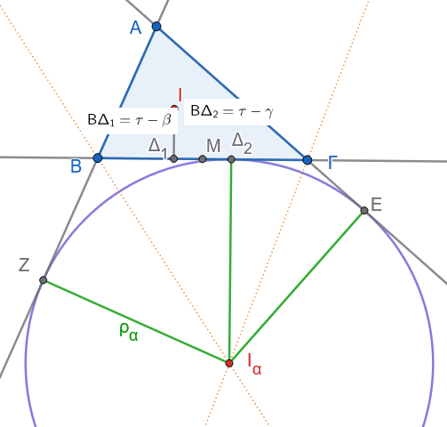{fig-align="center" width="400"}

- Από την *Εφαρμογή 4*, η απόσταση του σημείου επαφής $\Delta_1$ του εγγεγραμμένου κύκλου από την κορυφή $B$ είναι: $$B\Delta_1 = \tau - \beta$$

- Από την *Εφαρμογή 6*, γνωρίζουμε ότι $AZ = \tau$, όπου $Z$ το σημείο επαφής στην προέκταση της $AB$.

Η απόσταση του σημείου επαφής $\Delta_2$ του παρεγγεγραμμένου κύκλου από την κορυφή $B$ είναι: $$B\Delta_2 = BZ = AZ - AB = \tau - \gamma$$

Θέλουμε να αποδείξουμε ότι τα σημεία $\Delta_1$ και $\Delta_2$ ισαπέχουν από το μέσο $M$ της πλευράς $B\Gamma$, δηλαδή $M\Delta_1 = M\Delta_2$.

Υπολογίζουμε τις αποστάσεις από την κορυφή $B$ (λαμβάνοντας υπόψη ότι $BM = \dfrac{\alpha}{2}$): $$M\Delta_1 = |BM - B\Delta_1| = \left| \dfrac{\alpha}{2} - (\tau - \beta) \right| = \left| \dfrac{\alpha}{2} - \dfrac{\alpha + \beta + \gamma}{2} + \beta \right| = \left| \dfrac{\beta - \gamma}{2} \right|$$ $$M\Delta_2 = |BM - B\Delta_2| = \left| \dfrac{\alpha}{2} - (\tau - \gamma) \right| = \left| \dfrac{\alpha}{2} - \dfrac{\alpha + \beta + \gamma}{2} + \gamma \right| = \left| \dfrac{\gamma - \beta}{2} \right|$$ Επειδή $\left| \dfrac{\beta - \gamma}{2} \right| = \left| \dfrac{\gamma - \beta}{2} \right|$, προκύπτει ότι $M\Delta_1 = M\Delta_2$.

Συνεπώς, τα δύο σημεία επαφής είναι συμμετρικά ως προς το μέσο $M$ της πλευράς $B\Gamma$.

**Άσκηση 9**

**Εκφώνηση:** Σε ορθογώνιο τρίγωνο $\triangle AB\Gamma$ ($\widehat{A} = 90^\circ$), να αποδείξετε ότι η ακτίνα $\rho_a$ του παρεγγεγραμμένου κύκλου που αντιστοιχεί στην υποτείνουσα $B\Gamma$ είναι ίση με την ημιπερίμετρο $\tau$ του τριγώνου: $\rho_a = \tau$.

**Απόδειξη:**

> > > Σχεδιάστε το σχήμα

Έστω $E$ και $Z$ τα σημεία επαφής του παρεγγεγραμμένου κύκλου $I_a$ με τις προεκτάσεις των κάθετων πλευρών $A\Gamma$ και $AB$ αντίστοιχα.

Στο τετράπλευρο $AZI_aE$:

- Οι γωνίες $\widehat{AZI_a}$ και $\widehat{AEI_a}$ είναι ορθές ($90^\circ$), καθώς οι ακτίνες του παρεγγεγραμμένου κύκλου $I_aZ$ και $I_aE$ είναι κάθετες στις εφαπτόμενες ευθείες $AB$ και $A\Gamma$.

- Η γωνία $\widehat{A}$ του τριγώνου είναι ορθή ($90^\circ$) από την υπόθεση.
  Συνεπώς, το τετράπλευρο $AZI_aE$ είναι ορθογώνιο.

Επίσης, οι διαδοχικές πλευρές του $I_aE$ και $I_aZ$ είναι ίσες με την ακτίνα $\rho_a$ του κύκλου ($I_aE = I_aZ = \rho\_a$).

Ένα ορθογώνιο με δύο διαδοχικές πλευρές ίσες είναι τετράγωνο.

Συνεπώς: $$AZ = AE = \rho_a$$ Από την *Εφαρμογή 6*, το εφαπτόμενο τμήμα $AZ$ ισούται με την ημιπερίμετρο $\tau$.

Άρα: $$\rho_a = \tau$$

**Άσκηση 10**

**Εκφώνηση:** Αν η γωνία $\widehat{B I_a \Gamma}$ που σχηματίζεται στο παράκεντρο $I_a$ είναι ίση με $45^\circ$, να αποδείξετε ότι το αρχικό τρίγωνο $\triangle AB\Gamma$ είναι ορθογώνιο στην κορυφή $A$.

**Απόδειξη:**

> > > Σχεδιάστε το σχήμα

Από την *Εφαρμογή 5*, γνωρίζουμε τη σχέση για τη γωνία του παρακέντρου: $$\widehat{B I_a \Gamma} = 90^\circ - \dfrac{\widehat{A}}{2}$$ Από τα δεδομένα της άσκησης, η γωνία αυτή είναι ίση με $45^\circ$: $$90^\circ - \dfrac{\widehat{A}}{2} = 45^\circ \implies \dfrac{\widehat{A}}{2} = 90^\circ - 45^\circ \implies \dfrac{\widehat{A}}{2} = 45^\circ \implies \widehat{A} = 90^\circ$$

Εφόσον η γωνία $\widehat{A}$ είναι ίση με $90^\circ$, το τρίγωνο $\triangle AB\Gamma$ είναι ορθογώνιο στην κορυφή $A$.

**Άσκηση 11**

**Εκφώνηση:** Να αποδείξετε ότι το εμβαδόν $E$ του τριγώνου $\triangle AB\Gamma$ εκφράζεται από τη σχέση $E = (\tau - \alpha)\rho_a$, όπου $\rho_a$ η ακτίνα του παρεγγεγραμμένου κύκλου που εφάπτεται στην πλευρά $\alpha$.

**Απόδειξη:**

> > > Σχεδιάστε το σχήμα

Το παράκεντρο $I_a$ συνδέεται με τις κορυφές του τριγώνου $A, B$ και $\Gamma$.

Το εμβαδόν του τριγώνου $\triangle AB\Gamma$ εκφράζεται ως άθροισμα και διαφορά των εμβαδών των επιμέρους τριγώνων: $$E_{AB\Gamma} = E_{I_aAB} + E_{I_aA\Gamma} - E_{I_aB\Gamma}$$ Τα ύψη των τριγώνων αυτών με βάσεις $AB, A\Gamma$ και $B\Gamma$ είναι αντίστοιχα ίσα με την ακτίνα $\rho_a$ του παρεγγεγραμμένου κύκλου:

- $E\_{I_aAB} = \dfrac{1}{2} \cdot AB \cdot \rho\_a = \dfrac{1}{2} \gamma \rho*a$

- $E*{I_aA\Gamma} = \dfrac{1}{2} \cdot A\Gamma \cdot \rho\_a = \dfrac{1}{2} \beta \rho*a$

- $E*{I_aB\Gamma} = \dfrac{1}{2} \cdot B\Gamma \cdot \rho\_a = \dfrac{1}{2} \alpha \rho\_a$

Αντικαθιστούμε στην αρχική σχέση: $$E_{AB\Gamma} = \dfrac{1}{2} \gamma \rho_a + \dfrac{1}{2} \beta \rho_a - \dfrac{1}{2} \alpha \rho_a = \dfrac{1}{2} (\beta + \gamma - \alpha) \rho_a$$ Εφόσον $\tau = \dfrac{\alpha + \beta + \gamma}{2} \implies \beta + \gamma - \alpha = 2(\tau - \alpha)$, η σχέση γίνεται: $$E_{AB\Gamma} = \dfrac{1}{2} \cdot 2(\tau - \alpha) \rho_a = (\tau - \alpha)\rho_a$$

Συνεπώς, αποδείχθηκε ότι $E = (\tau - \alpha)\rho_a$.

:::: {.math-box .exercise-box}
::: {.math-title .exercise-title}
**Άσκηση 12**
:::

**Εκφώνηση:**

- Τρίγωνο $AB\Gamma$ με $AB < A\Gamma$.

- $I_a$: το παρέγκεντρο που αντιστοιχεί στην πλευρά $B\Gamma$ (απέναντι από την κορυφή $A$).

- Από το $I_a$ φέρουμε ευθεία παράλληλη στην $AB$, η οποία τέμνει τη $B\Gamma$ στο $\Delta$ και την $A\Gamma$ στο $E$.

- **Ζητούμενο:** $\Delta E = AE - B\Delta$.
::::

:::: {.math-box .solution-box}
::: {.math-title .solution-title}
**Απόδειξη:**

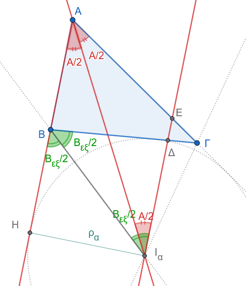{fig-align="center" width="350"}
:::

1.  **Ισοσκελές τρίγωνο** $\triangle AEI_a$:

- Το ευθύγραμμο τμήμα $AI_a$ είναι η **εσωτερική διχοτόμος** της γωνίας $\widehat{A}$, άρα: $$\widehat{EAI_a} = \widehat{BAI_a} = \frac{\widehat{A}}{2}$$
- Επειδή $EI_a \parallel AB$, οι εντός εναλλάξ γωνίες ως προς την τέμνουσα $AI_a$ είναι ίσες: $$\widehat{EI_aA} = \widehat{BAI_a} = \frac{\widehat{A}}{2}$$
- Επομένως, στο τρίγωνο $\triangle AEI_a$ ισχύει $\widehat{EAI_a} = \widehat{EI_aA}$, οπότε είναι **ισοσκελές** με: $$EI_a = AE \quad (1)$$

2.  **Ισοσκελές τρίγωνο** $\triangle B\Delta I_a$:

- Το ευθύγραμμο τμήμα $BI_a$ είναι η **εξωτερική διχοτόμος** της γωνίας $\widehat{B}$. Αν $Bx$ είναι η προέκταση της πλευράς $AB$ πέρα από το $B$, τότε: $$\widehat{xBI_a} = \widehat{\Delta BI_a} = \frac{\widehat{B}_{\text{εξ}}}{2}$$
- Επειδή $EI_a \parallel AB$ (και συνεπώς $\Delta I_a \parallel Bx$), οι εντός εναλλάξ γωνίες ως προς την τέμνουσα $BI_a$ είναι ίσες: $$\widehat{\Delta I_a B} = \widehat{xBI_a}$$
- Άρα στο τρίγωνο $\triangle B\Delta I_a$ ισχύει $\widehat{\Delta I_a B} = \widehat{\Delta BI_a}$, οπότε είναι **ισοσκελές** με: $$\Delta I_a = B\Delta \quad (2)$$

3.  **Υπολογισμός του τμήματος** $\Delta E$:

- Το σημείο $\Delta$ βρίσκεται ανάμεσα στα $E$ και $I_a$, επομένως: $$EI_a = \Delta E + \Delta I_a \iff \Delta E = EI_a - \Delta I_a$$
- Αντικαθιστώντας από τις σχέσεις $(1)$ και $(2)$: $$\Delta E = AE - B\Delta$$
::::

------------------------------------------------------------------------

:::: {.math-box .exercise-box}
::: {.math-title .exercise-title}
**Άσκηση 13**
:::

**Δεδομένα:**

- Τρίγωνο $AB\Gamma$ με $AB < A\Gamma$.
- $A\Delta$: εσωτερική διχοτόμος της γωνίας $\widehat{A}$ ($\widehat{BA\Delta} = \widehat{\Delta A\Gamma} = \dfrac{\widehat{A}}{2}$).
- $M$ σημείο της $B\Gamma$. Από το $M$ φέρουμε ευθεία παράλληλη στην $A\Delta$, που τέμνει την προέκταση της $BA$ στο $E$ και την πλευρά $A\Gamma$ στο $Z$.
::::

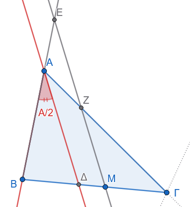{fig-align="center" width="300"}

:::: {.math-box .solution-box}
::: {.math-title .solution-title}
α.
**Απόδειξη ότι το τρίγωνο** $EAZ$ είναι ισοσκελές:
:::

- Επειδή $EZ \parallel A\Delta$:

  - Για την τέμνουσα $A\Gamma$, οι γωνίες $\widehat{AZE}$ και $\widehat{\Delta A\Gamma}$ είναι **εντός εναλλάξ**, άρα: $$\widehat{AZE} = \widehat{\Delta A\Gamma} = \frac{\widehat{A}}{2}$$

  - Για την τέμνουσα $EB$, οι γωνίες $\widehat{AEZ}$ και $\widehat{BA\Delta}$ είναι **εντός εκτός και επί τα αυτά μέρη** (αντίστοιχες), άρα: $$\widehat{AEZ} = \widehat{BA\Delta} = \frac{\widehat{A}}{2}$$

- Εφόσον $\widehat{AEZ} = \widehat{AZE} = \dfrac{\widehat{A}}{2}$, το τρίγωνο $\triangle EAZ$ είναι **ισοσκελές** με: $$AE = AZ$$
::::

:::: {.math-box .solution-box}
::: {.math-title .solution-title}
β.
**Απόδειξη ότι** $BE + \Gamma Z = \text{σταθερό}$:
:::

- Το σημείο $A$ βρίσκεται μεταξύ των $B$ και $E$, άρα: $$BE = AB + AE$$
- Το σημείο $Z$ βρίσκεται εσωτερικά του τμήματος $A\Gamma$, άρα: $$\Gamma Z = A\Gamma - AZ$$
- Προσθέτοντας κατά μέλη: $$BE + \Gamma Z = (AB + AE) + (A\Gamma - AZ)$$
- Επειδή από το ερώτημα (α) ισχύει $AE = AZ$: $$BE + \Gamma Z = AB + A\Gamma = \text{σταθερό}$$ *(ίσο με το άθροισμα των δύο πλευρών του δοσμένου τριγώνου)*.
::::

:::: {.math-box .solution-box}
::: {.math-title .solution-title}
γ.
**Περίπτωση όπου το** $M$ είναι το μέσο της $B\Gamma$:

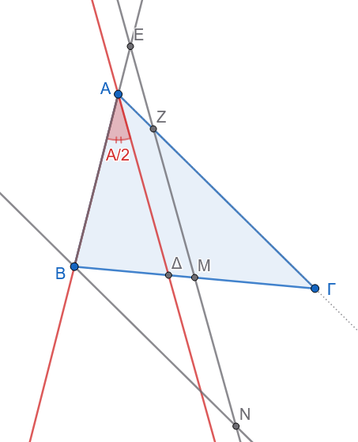{fig-align="center" width="350"}
:::

**A. Απόδειξη ότι** $BE = \Gamma Z = \dfrac{A\Gamma + AB}{2}$:

1.  Από το $B$ φέρουμε παράλληλη προς την $A\Gamma$, η οποία τέμνει την ευθεία $EZ$ στο σημείο $N$.

2.  Συγκρίνουμε τα τρίγωνα $\triangle BMN$ και $\triangle \Gamma MZ$:

- $BM = M\Gamma$ (το $M$ είναι μέσο της $B\Gamma$).

- $\widehat{BMN} = \widehat{\Gamma MZ}$ (κατακορυφήν γωνίες).

- $\widehat{MBN} = \widehat{M\Gamma Z}$ (εντός εναλλάξ, αφού $BN \parallel A\Gamma$).

  Άρα $\triangle BMN \cong \triangle \Gamma MZ$ ($\Gamma-\Pi-\Gamma$), οπότε: $$BN = \Gamma Z$$

3.  Στο τρίγωνο $\triangle BEN$:

- Επειδή $BN \parallel AZ$, η εντός εναλλάξ γωνία είναι $\widehat{BNE} = \widehat{AZE} = \dfrac{\widehat{A}}{2}$.
- Επίσης γνωρίζουμε ότι $\widehat{BEN} = \dfrac{\widehat{A}}{2}$.
- Άρα το $\triangle BEN$ είναι ισοσκελές με $BE = BN$.

4.  Συνεπώς: $$BE = \Gamma Z$$

5.  Χρησιμοποιώντας το αποτέλεσμα του ερωτήματος (β): $$BE + \Gamma Z = A\Gamma + AB \implies 2 \cdot BE = A\Gamma + AB \implies BE = \Gamma Z = \frac{A\Gamma + AB}{2}$$

**B. Απόδειξη ότι** $AE = AZ = \dfrac{A\Gamma - AB}{2}$:

- Από τη σχέση $BE = AB + AE$, έχουμε: $$AE = BE - AB = \frac{A\Gamma + AB}{2} - AB = \frac{A\Gamma + AB - 2AB}{2} = \frac{A\Gamma - AB}{2}$$

- Επειδή $AE = AZ$, προκύπτει άμεσα: $$AE = AZ = \frac{A\Gamma - AB}{2}$$
::::

:::: {.math-box .exercise-box}
::: {.math-title .exercise-title}
**'Ασκηση 14**
:::

**Δεδομένα & Ζητούμενο**

- Τρίγωνο $AB\Gamma$.
- $B\Delta$: εσωτερική διχοτόμος της γωνίας $\widehat{B}$.
- $Bx$: εξωτερική διχοτόμος της γωνίας $\widehat{B}$.
- $E, K$: σημεία της πλευράς (ή της ευθείας) $AB$.
- Κύκλος $(E, EB)$ που τέμνει τη $B\Delta$ στο $Z$.
- Κύκλος $(K, KB)$ που τέμνει τη $Bx$ στο $M$.

**Ζητούμενο:** Να αποδειχθεί ότι $EZ \parallel MK$.
::::

:::: {.math-box .solution-box}
::: {.math-title .solution-title}
**Απόδειξη**

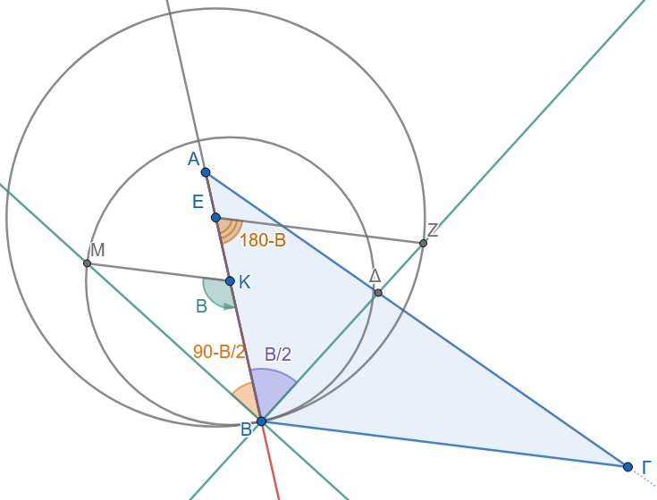{fig-align="center" width="500"}
:::

**1. Μελέτη του ισοσκελούς τριγώνου** $\triangle EBZ$

- Επειδή το $Z$ ανήκει στον κύκλο $(E, EB)$, τα τμήματα $EB$ και $EZ$ είναι ακτίνες του ίδιου κύκλου: $$EB = EZ$$
- Άρα το τρίγωνο $\triangle EBZ$ είναι **ισοσκελές** με βάση τη $BZ$.
- Επομένως, οι προσκείμενες στη βάση γωνίες είναι ίσες: $$\widehat{EZB} = \widehat{EBZ} = \frac{\widehat{B}}{2}$$ *(αφού η* $B\Delta$ είναι η εσωτερική διχοτόμος της $\widehat{B}$).
- Η γωνία της κορυφής $\widehat{ZEB}$ ισούται με: $$\widehat{ZEB} = 180^\circ - (\widehat{EBZ} + \widehat{EZB}) = 180^\circ - 2 \cdot \frac{\widehat{B}}{2} = 180^\circ - \widehat{B} \quad (1)$$

**2. Μελέτη του ισοσκελούς τριγώνου** $\triangle KBM$

- Γνωρίζουμε ότι η εσωτερική και η εξωτερική διχοτόμος μιας γωνίας είναι **κάθετες μεταξύ τους**: $$B\Delta \perp Bx \implies \widehat{\Delta B x} = 90^\circ$$
- Επομένως, η γωνία $\widehat{KBM}$ (η γωνία μεταξύ της πλευράς $AB$ και της εξωτερικής διχοτόμου $Bx$) είναι: $$\widehat{KBM} = 90^\circ - \widehat{AB\Delta} = 90^\circ - \frac{\widehat{B}}{2}$$
- Επειδή το $M$ ανήκει στον κύκλο $(K, KB)$, τα τμήματα $KB$ και $KM$ είναι ακτίνες του ίδιου κύκλου: $$KB = KM$$
- Άρα το τρίγωνο $\triangle KBM$ είναι **ισοσκελές** με βάση τη $BM$, οπότε: $$\widehat{KMB} = \widehat{KBM} = 90^\circ - \frac{\widehat{B}}{2}$$
- Η γωνία της κορυφής $\widehat{BKM}$ ισούται με: $$\widehat{BKM} = 180^\circ - 2 \cdot \widehat{KBM} = 180^\circ - 2\left(90^\circ - \frac{\widehat{B}}{2}\right) = 180^\circ - 180^\circ + \widehat{B} = \widehat{B} \quad (2)$$

**3. Απόδειξη Παραλληλίας** $EZ \parallel MK$

- Θεωρούμε τις ευθείες $EZ$ και $MK$ με τέμνουσα την ευθεία $AB$ (στην οποία ανήκουν τα σημεία $E, K, B$).
- Οι γωνίες $\widehat{ZEB}$ και $\widehat{BKM}$ είναι **εντός εκτός ενναλάξ**.
- Το άθροισμά τους από τις σχέσεις $(1)$ και $(2)$ είναι: $$\widehat{ZEB} + \widehat{BKM} = (180^\circ - \widehat{B}) + \widehat{B} = 180^\circ$$

Επειδή οι εντός εκτός ενναλάξ γωνίες είναι **παραπληρωματικές** (έχουν άθροισμα $180^\circ$), οι ευθείες είναι παράλληλες: $$EZ \parallel MK$$
::::

------------------------------------------------------------------------

::: {.callout-important title="ΣΑΣ ΕΥΧΟΜΑΙ"}
ΚΑΛΗ ΜΕΛΕΤΗ !!!
:::
