```{=html}
<!-- Φόρτωση βιβλιοθήκης GeoGebra -->
<script src="https://www.geogebra.org/apps/deployggb.js"></script>

<!-- Συνάρτηση δημιουργίας applets -->
<script>
function createGeoGebra(containerId, materialId, width = 700, height = 500) {
  var params = {
    "id": "ggb-" + containerId,
    "material_id": materialId,
    "width": width,
    "height": height,
    "showToolBar": true,
    "showMenuBar": false,
    "showAlgebraInput": true
  };
  
  var applet = new GGBApplet(params, '5.2');
  applet.inject(containerId);
}
</script>
```

## Σχέσεις γωνιών σε επίπεδα σχήματα

### Άθροισμα Γωνιών Τριγώνου

#### Ορισμοί

:::: {.math-box .definition-box}
::: {.math-title .definition-title}
**Εσωτερική Γωνία Τριγώνου:**

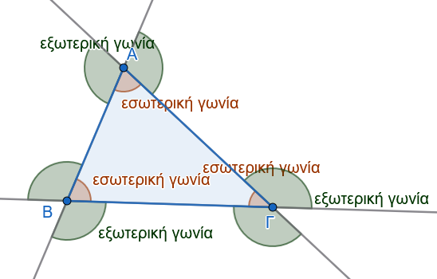{fig-align="center" width="400"}
:::

Είναι η γωνία που σχηματίζεται από δύο πλευρές του τριγώνου και περιέχει εσωτερικά σημεία αυτού.
Σε κάθε τρίγωνο υπάρχουν τρεις εσωτερικές γωνίες, οι οποίες συμβολίζονται με $\widehat{A}$, $\widehat{B}$ και $\widehat{\Gamma}$.
::::

:::: {.math-box .definition-box}
::: {.math-title .definition-title}
**Εξωτερική Γωνία Τριγώνου:**
:::

Είναι η γωνία που είναι εφεξής και παραπληρωματική με μία εσωτερική γωνία του τριγώνου.
::::

------------------------------------------------------------------------

#### Θεωρήματα

:::: {.math-box .theorem-box}
::: {.math-title .theorem-title}
**Θεώρημα 1**
:::

**Το άθροισμα των εσωτερικών γωνιών κάθε τριγώνου ισούται με δύο ορθές γωνίες (**$180^\circ$).
$$\widehat{A} + \widehat{B} + \widehat{\Gamma} = 2,\text{ορθές} = 180^\circ$$
::::

:::: {.math-box .apodeixi-box}
::: {.math-title .apodeixi-title}
**Απόδειξη:**

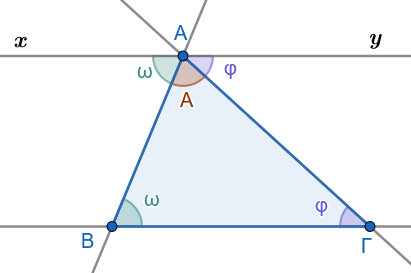{fig-align="center" width="350"}
:::

Έστω τρίγωνο $AB\Gamma$.
Από την κορυφή $A$ φέρουμε ευθεία $xy$ παράλληλη προς την πλευρά $B\Gamma$ ($xy \parallel B\Gamma$).

1.  Η γωνία $\widehat{\omega} = \widehat{xAB}$ και η γωνία $\widehat{B}$ είναι ίσες ως εντός εναλλάξ γωνίες των παραλλήλων $xy$ και $B\Gamma$ που τέμνονται από την $AB$ ($\widehat{\omega} = \widehat{B}$).

2.  Η γωνία $\widehat{\varphi} = \widehat{yA\Gamma}$ και η γωνία $\widehat{\Gamma}$ είναι ίσες ως εντός εναλλάξ γωνίες των παραλλήλων $xy$ και $B\Gamma$ που τέμνονται από την $A\Gamma$ ($\widehat{\varphi} = \widehat{\Gamma}$).

3.  Όμως, οι γωνίες $\widehat{\omega}$, $\widehat{A}$ και $\widehat{\varphi}$ σχηματίζουν μια ευθεία γωνία στην κορυφή $A$, δηλαδή: $$\widehat{\omega} + \widehat{A} + \widehat{\varphi} = 2,\text{ορθές} = 180^\circ$$

Αντικαθιστώντας τις $\widehat{\omega} = \widehat{B}$ και $\widehat{\varphi} = \widehat{\Gamma}$, προκύπτει: $$\widehat{A} + \widehat{B} + \widehat{\Gamma} = 180^\circ$$
::::

------------------------------------------------------------------------

#### Πορίσματα

:::: {.math-box .corollary-box}
::: {.math-title .corollary-title}
:::

1.  **Κάθε εξωτερική γωνία** τριγώνου είναι ίση με το **άθροισμα των δύο απέναντι εσωτερικών γωνιών** του τριγώνου ($\widehat{\Gamma}_{\text{εξ}} = \widehat{A} + \widehat{B}$).

2.  Αν δύο τρίγωνα έχουν **δύο γωνίες ίσες μία προς μία**, τότε έχουν και τις **τρίτες γωνίες τους ίσες**.

3.  Οι οξείες γωνίες ενός **ορθογώνιου τριγώνου** είναι **συμπληρωματικές** ($\widehat{B} + \widehat{\Gamma} = 90^\circ$).

4.  Κάθε γωνία **ισόπλευρου τριγώνου** ισούται με $\dfrac{2}{3}$ της ορθής, δηλαδή με $60^\circ$.

5.  Κάθε τρίγωνο έχει οπωσδήποτε **τουλάχιστον δύο γωνίες οξείες**.
::::

:::: {.math-box .corollaryproof-box}
::: {.math-title .corollaryproof-title}
**Απόδειξη**
:::

1.  Έχουμε $\hat A + \hat B + \hat Γ = 180^o$ και $\hat Γ_{εξ} + \hat Γ = 180^o$, οπότε $\hat A + \hat B + \hat Γ = \hat Γ_{εξ} + \hat Γ$ ή $Γ_{εξ} = \hat A +\hat B$.

2.  Θα είναι ίσες και οι τρίτες γωνίες σαν παραπληρώματα των δύο άλλων.

3.  Άν $\hat A=90^o$, τότε $$\hat Α+\hat Β+\hat Γ=180^ο \Rightarrow 90^o+\hat Β+\hat Γ=180^ο \Rightarrow \hat Β+\hat Γ=90^ο$$

4.  $\hat A + \hat B + \hat Γ = 180^o \Rightarrow \hat ω+\hat ω+\hat ω=180^ο \Rightarrow 3 \cdot\hat ω=180^ο \Rightarrow \hat ω=60^o$.

5.  Άν έχει μια οξεία , μια ορθή και μια αμβλεία τότε το άθροισμά τους υπερβαίνει τις $180^ο$

    Άν έχει μια οξεία , και δύο αμβλείες τότε πάλι το άθροισμά τους υπερβαίνει τις $180^ο$.
::::

------------------------------------------------------------------------

#### Εφαρμογές

:::: {.math-box .example-box}
::: {.math-title .example-title}
**Εφαρμογή 1η:**
:::

Αν $I$ είναι το έγκεντρο τριγώνου $AB\Gamma$ (σημείο τομής των εσωτερικών διχοτόμων), να αποδειχθεί ότι η γωνία $\widehat{BI\Gamma}$ δίνεται από τον τύπο: $$\widehat{BI\Gamma} = 90^\circ + \dfrac{\widehat{A}}{2}$$
::::

:::: {.math-box .examplesolution-box}
::: {.math-title .examplesolution-title}
**Λύση:**
:::

Στο τρίγωνο $BI\Gamma$, το άθροισμα των γωνιών είναι: $$\widehat{BI\Gamma} + \dfrac{\widehat{B}}{2} + \dfrac{\widehat{\Gamma}}{2} = 180^\circ \Rightarrow \widehat{BI\Gamma} = 180^\circ - \dfrac{\widehat{B} + \widehat{\Gamma}}{2}$$

Επειδή $\widehat{B} + \widehat{\Gamma} = 180^\circ - \widehat{A}$, έχουμε: $$\widehat{BI\Gamma} = 180^\circ - \dfrac{180^\circ - \widehat{A}}{2} = 180^\circ - 90^\circ + \dfrac{\widehat{A}}{2} = 90^\circ + \dfrac{\widehat{A}}{2}$$
::::

:::: {.math-box .example-box}
::: {.math-title .example-title}
**Εφαρμογή 2η:**
:::

Σε κάθε τρίγωνο $AB\Gamma$ με $AB < A\Gamma$, η γωνία $\widehat{\Delta AE}$ που σχηματίζεται από το ύψος $A\Delta$ και τη διχοτόμο $AE$ ισούται με τη μισή διαφορά των γωνιών $\widehat{B}$ και $\widehat{\Gamma}$: $$\widehat{\Delta AE} = \dfrac{\widehat{B} - \widehat{\Gamma}}{2}$$
::::

:::: {.math-box .examplesolution-box}
::: {.math-title .examplesolution-title}
**Λύση:**

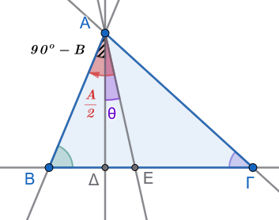{fig-align="center" width="300"}
:::

Από το ορθογώνιο τρίγωνο $AB\Delta$ ($\widehat{\Delta}=90^\circ$) έχουμε $\widehat{BA\Delta} = 90^\circ - \widehat{B}$.
Η διχοτόμος $AE$ χωρίζει τη γωνία $\widehat{A}$ σε δύο ίσα μέρη, άρα $\widehat{BAE} = \dfrac{\widehat{A}}{2}$.
Συνεπώς: $$\hat θ =\widehat{\Delta AE} = \widehat{BAE} - \widehat{BA\Delta} = \dfrac{\widehat{A}}{2} - (90^\circ - \widehat{B})$$

Αντικαθιστώντας το $90^\circ = \dfrac{\widehat{A}+\widehat{B}+\widehat{\Gamma}}{2}$, έχουμε: $$\widehat{\Delta AE} = \dfrac{\widehat{A}}{2} - \left(\dfrac{\widehat{A}+\widehat{B}+\widehat{\Gamma}}{2} - \widehat{B}\right) = \dfrac{\widehat{A}}{2} - \dfrac{\widehat{A}-\widehat{B}+\widehat{\Gamma}}{2} = \dfrac{\widehat{B}-\widehat{\Gamma}}{2}$$
::::

:::: {.math-box .example-box}
::: {.math-title .example-title}
**Εφαρμογή 3η:**
:::

Αν φέρουμε τη διχοτόμο $xAy$ της εξωτερικής γωνίας $\widehat{A}$ ενός τριγώνου $AB\Gamma$, να αποδειχθεί ότι το τρίγωνο είναι ισοσκελές ($AB=A\Gamma$) αν και μόνο αν $xAy \parallel B\Gamma$.
::::

:::: {.math-box .examplesolution-box}
::: {.math-title .examplesolution-title}
**Λύση:**

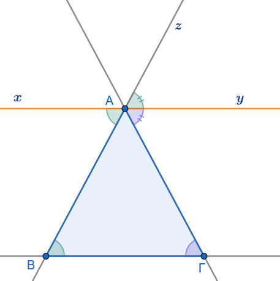{fig-align="center" width="350"}
:::

Αν $Ax \parallel B\Gamma$, τότε

1.  $\widehat{xAB} = \widehat{B}$ ως εντός εναλλάξ.

2.  $\widehat{zAy} = \widehat{B}$ ως εντός εκτό και επί τα αυτά.

3.  $\widehat{yAΓ}=\hat Γ$ ώς εντός εναλλάξ.

Επειδή η $Ax$ είναι διχοτόμος της εξωτερικής γωνίας, ισχύει $\widehat{zAy} = \widehat{yAΓ} \Rightarrow \widehat{B} = \widehat{\Gamma}$, άρα το τρίγωνο είναι ισοσκελές.
::::

------------------------------------------------------------------------

#### Ασκήσεις

> > > Σχεδιάστε ένα σχήμα όπου απαιτείται

1.  Σε ορθογώνιο τρίγωνο, μία από τις οξείες γωνίες του ισούται με τα $\dfrac{2}{3}$ της άλλης οξείας γωνίας του.
    Να υπολογιστούν όλες οι γωνίες του τριγώνου.

2.  Σε ισοσκελές τρίγωνο $AB\Gamma$ ($AB = A\Gamma$) η γωνία της κορυφής είναι $\widehat{A} = \dfrac{\widehat{B}}{2}$.
    Αν $I$ είναι το έγκεντρο του τριγώνου, να υπολογιστεί η γωνία $\widehat{BI\Gamma}$.

> > Σκεφτείτε την εφαρμογή 1

3.  Σε τρίγωνο $AB\Gamma$ η γωνία $\widehat{A}$ είναι τριπλάσια της γωνίας $\widehat{B}$.
    Αν η εξωτερική γωνία της κορυφής $\Gamma$ είναι $\widehat{\Gamma}_{\text{εξ}} = 144^\circ$, να βρεθεί το είδος του τριγώνου ως προς τις πλευρές του.

4.  Δίνεται ορθογώνιο τρίγωνο $AB\Gamma$ ($\widehat{A} = 90^\circ$) και το ύψος του $A\Delta$.
    Να αποδείξετε ότι $\widehat{B} = \widehat{\Delta A\Gamma}$ και $\widehat{\Gamma} = \widehat{\Delta AB}$.

5.  Αν σε ένα τρίγωνο $AB\Gamma$ ισχύει η σχέση $AB = A\Gamma = \Delta B$ (όπου $\Delta$ σημείο της προέκτασης της $B\Gamma$) και η εξωτερική γωνία $\widehat{xA\Gamma} = 108^\circ$, να υπολογιστεί η γωνία $\widehat{\Delta}$.

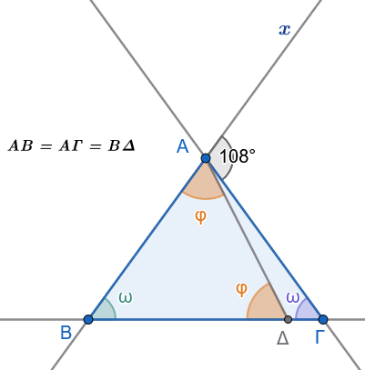{fig-align="center" width="300"}

**Λύση**

Α.
Αφού ΑΒ=ΑΓ σημαίνει οτι $\triangle ΑΒΓ \rightsquigarrow$ ισοσκελές $\hat B =\hat Γ=\hat ω$

B.  Αφού ΑΒ=BΔ σημαίνει οτι $\triangle ΔΒΑ \rightsquigarrow$ ισοσκελές $\hat Δ =\hat Α_1=\hat φ$

Γ.
Η γωνία $\widehat{xAΓ}_{εξ}=108^ο=2\hat ω$.
'Αρα $\hatω=54^ο$

Δ.
Στο $\triangle ΑΒΔ$ θα έχουμε $54^ο+2\hat φ=180^ο$.
Άρα $\hat φ=63^ο$

6.  Σε ορθογώνιο τρίγωνο $AB\Gamma$ ($\widehat{A}=90^\circ$) φέρουμε τη διχοτόμο $A\Delta$ και την παράλληλη $\Delta E \parallel AB$ που τέμνει την $A\Gamma$ στο $E$.
    Αν η γωνία $\widehat{B}$ είναι κατά $20^\circ$ μεγαλύτερη από τη γωνία $\widehat{\Gamma}$, να υπολογιστούν οι γωνίες $\widehat{\omega} = \widehat{A\Delta E}$ και $\widehat{\varphi} = \widehat{E\Delta\Gamma}$.

7.  Σε τρίγωνο $AB\Gamma$ η εξωτερική γωνία της κορυφής $B$ ισούται με $\widehat{B}\_{\text{εξ}} = 90^\circ + \dfrac{\widehat{A}}{2}$.
    Να αποδείξετε ότι το τρίγωνο είναι ισοσκελές με $AB = A\Gamma$.

8.  Δίνεται τρίγωνο $AB\Gamma$ με $AB < A\Gamma$.
    Αν η διχοτόμος της εξωτερικής γωνίας $\widehat{A}$ τέμνει την προέκταση της πλευράς $B\Gamma$ στο σημείο $M$, να αποδείξετε ότι: $$\widehat{AMB} = \dfrac{\widehat{B} - \widehat{\Gamma}}{2}$$

------------------------------------------------------------------------

### Γωνίες με Πλευρές Κάθετες

#### Ορισμοί

:::: {.math-box .definition-box}
::: {.math-title .definition-title}
**Κάθετες Ευθείες:**
:::

Δύο τεμνόμενες ευθείες ονομάζονται κάθετες όταν όλες οι γωνίες που σχηματίζονται στο σημείο τομής τους είναι ίσες μεταξύ τους (άρα όλες είναι ορθές, δηλαδή $90^\circ$ η καθεμία).
::::

:::: {.math-box .definition-box}
::: {.math-title .definition-title}
**Γωνίες με Πλευρές Κάθετες:**
:::

Δύο γωνίες ονομάζονται γωνίες με πλευρές κάθετες όταν οι πλευρές της μίας είναι κάθετες προς τις πλευρές της άλλης αντίστοιχα.
::::

------------------------------------------------------------------------

#### Θεωρήματα

:::: {.math-box .theorem-box}
::: {.math-title .theorem-title}
**Θεώρημα 2**
:::

**Δύο οξείες γωνίες που έχουν τις πλευρές τους κάθετες, μία προς μία, είναι ίσες**.
::::

:::: {.math-box .odigia-box}
::: {.math-title .odigia-title}
**Ακολουθήστε τις οδηγίες**
:::

Αλλάξτε την θέση των Ο, Κ, Λ ή Ο'

Παρατηρήστε τι συμβαίνει με τις γωνίες.

Όταν το σημείο Ο' βρίσκεται εντός της γωνίας ή εκτός της γωνίας αλλά πέραν της Oy, το σχήμα αλλάξει και απόδειξη χρειάζεται να τροποποιηθεί.
::::

:::: {.math-box .apodeixi-box}
::: {.math-title .apodeixi-title}
**Απόδειξη:**

<iframe src="https://www.geogebra.org/calculator/qct3kw4c?embed" width="730" height="600" allowfullscreen style="border: 1px solid #e4e4e4;border-radius: 4px;" frameborder="0">

</iframe>
:::

Έστω οι οξείες γωνίες $\widehat{xOy} = \omega$ και $\widehat{x'O'y'} = \varphi$ τέτοιες ώστε $Ox \perp O'x'$ και $Oy \perp O'y'$.

1.  Έστω $\Gamma$ το σημείο τομής των ημιευθειών $Ox$ και $O'y'$.
    Από το σημείο $O$ φέρουμε την κάθετο $OA$ στην $O'x'$ και από το $O'$ την κάθετο $O'B$ στην $Oy$.

2.  Σχηματίζονται δύο ορθογώνια τρίγωνα, το $OA\Gamma$ (με $\widehat{A} = 90^\circ$) και το $O'B\Gamma$ (με $\widehat{B} = 90^\circ$).

3.  Οι γωνίες $\widehat{\Gamma}_1$ και $\widehat{\Gamma}_2$ των δύο τριγώνων είναι ίσες ως κατακορυφήν.

4.  Επειδή τα δύο ορθογώνια τρίγωνα έχουν μία οξεία γωνία ίση ($\widehat{\Gamma}_1 = \widehat{\Gamma}_2=\hat ω$), θα έχουν και τις άλλες οξείες γωνίες τους ίσες.
    Συνεπώς: $$\widehat{\omega} = \widehat{\varphi}$$
::::

------------------------------------------------------------------------

#### Πορίσματα

:::: {.math-box .corollary-box}
::: {.math-title .corollary-title}
:::

1.  Δύο **αμβλείες γωνίες** που έχουν τις πλευρές τους κάθετες μία προς μία είναι **ίσες**.

2.  Δύο γωνίες που έχουν τις πλευρές τους κάθετες, αλλά **η μία είναι οξεία και η άλλη αμβλεία**, είναι **παραπληρωματικές** (έχουν δηλαδή άθροισμα $180^\circ$).
::::

:::: {.math-box .corollaryproof-box}
::: {.math-title .corollaryproof-title}
**Απόδειξη**

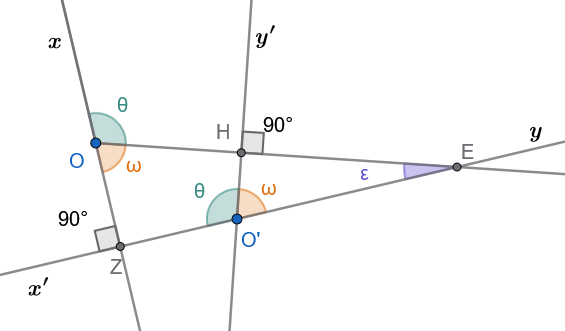{fig-align="center" width="400"}
:::

1.  Όπως είδαμε παραπάνω οι οξείες γωνίες $\hat ω$ είναι ίσες άρα και τα παραπληρώματά τους $\hat θ$ θα είναι ίσα.
    Δηλαδή είναι $\hat θ + \hat ω =180^o$ .

2.  Από τα παραπάνω επίση συμπεραίνουμε ότι , $\hat θ + \hat ω =180^o$.
::::

------------------------------------------------------------------------

#### Εφαρμογές

:::: {.math-box .example-box}
::: {.math-title .example-title}
**Εφαρμογή 1η:**
:::

Να αποδειχθεί ότι οι διχοτόμοι δύο εφεξής και παραπληρωματικών γωνιών σχηματίζουν ορθή γωνία ($90^\circ$).
::::

:::: {.math-box .examplesolution-box}
::: {.math-title .examplesolution-title}
**Λύση:**
:::

Έστω οι εφεξής παραπληρωματικές γωνίες $\widehat{AOB}$ και $\widehat{AO\Gamma}$ με διχοτόμους $O\Delta$ και $OE$ αντίστοιχα.

Έχουμε: $$\widehat{AOB} + \widehat{AO\Gamma} = 180^\circ \Rightarrow 2\widehat{A\Delta} + 2\widehat{AE} = 180^\circ \Rightarrow 2(\widehat{A\Delta} + \widehat{AE}) = 180^\circ \Rightarrow \widehat{\Delta OE} = 90^\circ$$
::::

:::: {.math-box .example-box}
::: {.math-title .example-title}
**Εφαρμογή 2η:**
:::

Δίνεται γωνία $\widehat{xOy}$.

Φέρουμε την ημιευθεία $OA \perp Ox$ προς το μέρος της $Oy$ και την ημιευθεία $OB \perp Oy$ προς το μέρος της $Ox$.

Να αποδειχθεί ότι οι γωνίες $\widehat{xOy}$ και $\widehat{AOB}$ έχουν την ίδια διχοτόμο και είναι παραπληρωματικές.
::::

:::: {.math-box .examplesolution-box}
::: {.math-title .examplesolution-title}
**Λύση:**

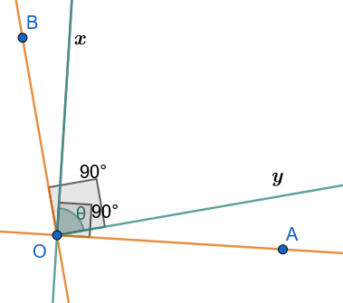{fig-align="center" width="300"}
:::

Από την κατασκευή, η γωνία $\widehat{xOB} = 90^\circ - \widehat{xOy}=90^o-\hat θ$ και η γωνία $\widehat{AOy} = 90^\circ - \widehat{xOy}=90^o-\hat θ$.

Άρα $\widehat{xOB} = \widehat{AOy}$, γεγονός που σημαίνει ότι η διχοτόμος της γωνίας $\widehat{AOB}$ ταυτίζεται με τη διχοτόμο της γωνίας $\widehat{xOy}$.

Επίσης: $$\widehat{AOB} = \widehat{AOx} + \widehat{xOB} = 90^\circ + (90^\circ - \widehat{xOy}) = 180^\circ - \widehat{xOy} \Rightarrow \widehat{AOB} + \widehat{xOy} = 180^\circ$$
::::

:::: {.math-box .example-box}
::: {.math-title .example-title}
**Εφαρμογή 3η:**
:::

Πάνω στις πλευρές $Ox$ και $Oy$ μιας ορθής γωνίας $\widehat{xOy}$ παίρνουμε τα ίσα τμήματα $OA = OB$.

Μια ευθεία $Az$ συναντά την $Oy$ στο $\Gamma$ και η ευθεία από το $B$, κάθετη στην $Az$, συναντά την προέκταση της $xO$ στο $\Delta$.

Να αποδειχθεί ότι $\widehat{O\Gamma\Delta} = 45^\circ$.
::::

:::: {.math-box .examplesolution-box}
::: {.math-title .examplesolution-title}
**Λύση:**

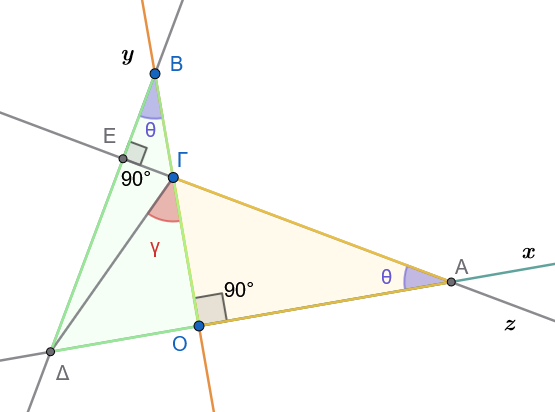{fig-align="center" width="400"}
:::

Τα ορθογώνια τρίγωνα $AO\Gamma$ και $BO\Delta$ έχουν $\widehat{AO\Gamma} = \widehat{BO\Delta} = 90^\circ$, $OA = OB$ (υπόθεση) και $\widehat{OA\Gamma} = \widehat{OB\Delta}=\hat θ$ διότι έχουν κάθετες πλευρές.

Άρα τα τρίγωνα είναι ίσα, οπότε $O\Gamma = O\Delta$.

Συνεπώς το ορθογώνιο τρίγωνο $\Gamma O\Delta$ είναι και ισοσκελές, άρα $\widehat{O\Gamma\Delta}=\hat γ = 45^\circ$.
::::

------------------------------------------------------------------------

#### Ασκήσεις

::: callout-exercise
1.  Δύο επίπεδα κάτοπτρα $K_1$ και $K_2$ είναι κάθετα μεταξύ τους. Φωτεινή ακτίνα $\alpha$ προσπίπτει στο κάτοπτρο $K_1$ και μετά την ανάκλασή της προσπίπτει στο $K_2$, από το οποίο εξέρχεται κατά την ακτίνα $\beta$. Να αποδείξετε ότι η τελική ακτίνα $\beta$ είναι παράλληλη προς την αρχική ακτίνα $\alpha$.
:::

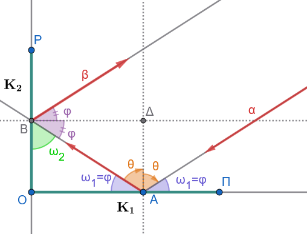{fig-align="center" width="400"}

**Λύση**

**1. Νόμος της Ανάκλασης**

- Στο πρώτο κάτοπτρο $K_1$, η γωνία πρόσπτωσης είναι ίση με τη γωνία ανάκλασης: $\hatθ = \hat θ$ και η ΔΑ κάθετη στο $Κ_1$.
- Η γωνία που σχηματίζει η ακτίνα με την επιφάνεια του $K_1$ είναι $\hat ω_1 = 90^\circ - \hat θ$.
- Στο δεύτερο κάτοπτρο $K_2$, ισχύει αντίστοιχα: $\hat φ = \hat φ$ , η ΒΔ είναι κάθετη στο $Κ_2$ και η γωνία με την επιφάνεια του $K_2$ είναι $\hat ω_2 = 90^ο - \hat φ$.
- $ΒΔ//Κ_1$ και $ΑΔ//Κ_2$

**2. Γεωμετρία της Διαδρομής**

- Τα κάτοπτρα είναι κάθετα μεταξύ τους ($K_1 \perp K_2$), οπότε σχηματίζουν ορθογώνιο τρίγωνο με τη διαδρομή της ακτίνας ΑΒ μεταξύ των δύο ανακλάσεων.

- Στο ορθογώνιο αυτό τρίγωνο ισχύει: $\hatω_1 + \hatω_2 = 90^o$.

- Όμως $\hatφ=\hatω_1$ ως εντός εναλλάξ.
  ($ΒΔ//ΟΑ$ και τέμνουσα την ΑΒ)

- Άρα $$2 \hat θ + 2 \hatφ=180^o$$ και εντός και επι τα αυτά των α και β με τέμνουσα την ΑΒ.

- Επομένως οι γωνίες $2 \hat θ$ και $2 \hat φ$ είναι παραπληρωματικές και εντός και επί τα αυτά, άρα οι ακτίνες α και β είναι παράλληλες.

::: {.math-box .exercise-box}
2.  Σε ισόπλευρο τρίγωνο $AB\Gamma$ πλευράς $\alpha$ παίρνουμε στις πλευρές $AB$ και $B\Gamma$ τμήματα $A\Delta = BE = \dfrac{1}{3}\alpha$. Να αποδείξετε ότι $\Delta E \perp B\Gamma$.
:::

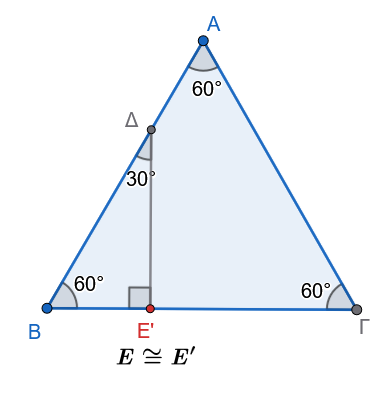{fig-align="center" width="300"}

:::: {.math-box .solution-box}
::: {.math-title .solution-title}
**Λύση**
:::

**Βήμα 1: Υπολογισμός του μήκους** $B\Delta$

Αφού το τρίγωνο $AB\Gamma$ είναι ισόπλευρο, έχουμε $AB = \alpha$ και $\hat{B} = 60^\circ$.

Το τμήμα $B\Delta$ ισούται με: $$B\Delta = AB - A\Delta = \alpha - \frac{1}{3}\alpha = \frac{2}{3}\alpha$$

**Βήμα 2: Φέρνουμε κάθετη από το** $\Delta$ προς τη $B\Gamma$

Φέρνουμε από το σημείο $\Delta$ κάθετη ευθεία προς την πλευρά $B\Gamma$ και ονομάζουμε το ίχνος της $E'$.

Στο ορθογώνιο τρίγωνο $\Delta E' B$ ($\widehat{\Delta E' B} = 90^\circ$):

- Η γωνία $\hat{B}$ είναι $60^\circ$.
- Επομένως, η άλλη οξεία γωνία είναι: $$\widehat{B\Delta E'} = 90^\circ - 60^\circ = 30^\circ$$

**Βήμα 3: Ιδιότητα ορθογωνίου τριγώνου με γωνία** $30^\circ$

Σε κάθε ορθογώνιο τρίγωνο, η πλευρά που βρίσκεται απέναντι από τη γωνία $30^\circ$ ισούται με το **μισό της υποτείνουσας**.

Εδώ, απέναντι από τη γωνία των $30^\circ$ βρίσκεται η πλευρά $BE'$, άρα: $$BE' = \frac{B\Delta}{2}$$

Αντικαθιστούμε το μήκος του $B\Delta = \dfrac{2}{3}\alpha$: $$BE' = \frac{\frac{2}{3}\alpha}{2} = \frac{1}{3}\alpha$$

**Συμπέρασμα**

Επειδή μας δίνεται ότι $BE = \dfrac{1}{3}\alpha$, το σημείο $E'$ ταυτίζεται με το σημείο $E$ ($E' \equiv E$).

Επομένως: $$\Delta E \perp B\Gamma$$
::::

::: {.math-box .exercise-box}
3.  Δίνεται ορθογώνιο τρίγωνο $AB\Gamma$ ($\widehat{A}=90^\circ$) και η διχοτόμος του $A\Delta$. Φέρουμε ευθεία $\Delta x \perp B\Gamma$, η οποία τέμνει την $AB$ στο $E$ και την προέκταση της $A\Gamma$ στο $Z$. Να αποδείξετε ότι $BE = Z\Gamma$.
:::

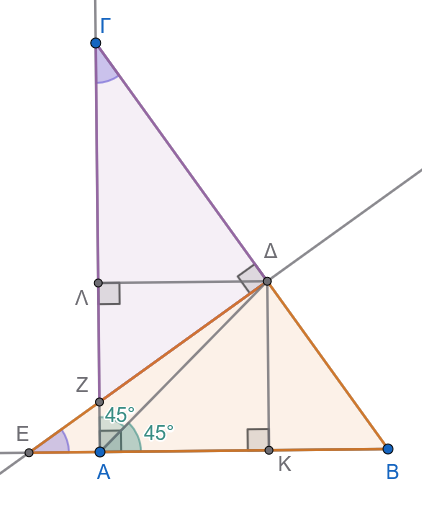{fig-align="center" width="350"}

:::: {.math-box .solution-box}
::: {.math-title .solution-title}
**Λύση**
:::

**Βήμα 1: Χρήση της ιδιότητας της διχοτόμου**

Από το σημείο $\Delta$ της διχοτόμου $A\Delta$, φέρνουμε τις αποστάσεις (κάθετες) προς τις κάθετες πλευρές $AB$ και $A\Gamma$:

- $\Delta K \perp AB$
- $\Delta \Lambda \perp A\Gamma$

Επειδή το $\Delta$ ανήκει στη διχοτόμο της γωνίας $\hat{A} = 90^\circ$:

1.  Οι αποστάσεις του είναι ίσες: $\Delta K = \Delta \Lambda$.

2.  Το τετράπλευρο $AK\Delta\Lambda$ είναι **τετράγωνο**.

**Βήμα 2: Ισότητα των βοηθητικών τριγώνων** $\Delta K E$ και $\Delta \Lambda \Gamma$

Συγκρίνουμε τα ορθογώνια τρίγωνα $\triangle \Delta K E$ ($\hat{K}=90^\circ$) και $\triangle \Delta \Lambda \Gamma$ ($\hat{\Lambda}=90^\circ$):

- **Μία κάθετη πλευρά ίση:** $\Delta K = \Delta \Lambda$ (από το Βήμα 1).

- **Μία οξεία γωνία ίση:**

  - Στο ορθογώνιο τρίγωνο $AB\Gamma$ ισχύει: $\hat{\Gamma} = 90^\circ - \hat{B}$.
  - Στο ορθογώνιο τρίγωνο $\Delta\Lambda\Gamma$ ισχύει: $\widehat{K\Delta E} = \hat{B}$ (έχουν πλευρές κάθετες).
  - Άρα $\widehat{K\Delta E} = \widehat{\Lambda\Delta\Gamma} = \hat{B}$ (και $\hat{E} = \hat{\Gamma} = 90^\circ - \hat{B}$).

Επομένως, τα ορθογώνια τρίγωνα είναι **ίσα**: $$\triangle \Delta K E = \triangle \Delta \Lambda \Gamma$$

Από την ισότητα αυτή παίρνουμε ότι οι υποτείνουσές τους είναι ίσες: $$\Delta E = \Delta \Gamma$$

**Βήμα 3: Ισότητα των ορθογωνίων τριγώνων** $B\Delta E$ και $Z\Delta\Gamma$

Συγκρίνουμε τώρα τα ορθογώνια τρίγωνα $\triangle B\Delta E$ και $\triangle Z\Delta\Gamma$ ($\widehat{B\Delta E} = \widehat{Z\Delta\Gamma} = 90^\circ$):

- **Μία κάθετη πλευρά ίση:** $\Delta E = \Delta \Gamma$ (από το Βήμα 2).

- **Μία οξεία γωνία ίση:** $\hat{E} = \hat{\Gamma} = 90^\circ - \hat{B}$.

Από το κριτήριο ισότητας ορθογωνίων τριγώνων (μία κάθετη πλευρά και η προσκείμενη οξεία γωνία ίσες), τα τρίγωνα είναι **ίσα**: $$\triangle B\Delta E = \triangle Z\Delta\Gamma$$

Συνεπώς, οι υποτείνουσές τους είναι ίσες: $$BE = Z\Gamma$$
::::

::: callout-exercise
4.  Θεωρούμε τετράπλευρο $AB\Gamma\Delta$ με $\widehat{A} = \widehat{\Gamma} = 90^\circ$ και $B\Gamma = \Gamma\Delta$. Στην προέκταση της $A\Delta$ παίρνουμε τμήμα $\Delta E = AB$. Να αποδείξετε ότι οι διαγώνιοι $A\Gamma$ και $\Gamma E$ είναι κάθετες μεταξύ τους ($A\Gamma \perp \Gamma E$).

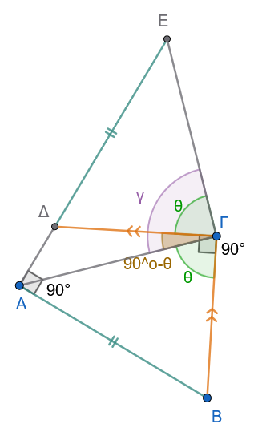{fig-align="center" width="250"}
:::

> > > Υπόδειξη: Οι γωνίες θ είναι ίσες γιατί έχουν τις πλευρές κάθετες.

::: callout-exercise
5.  Στις κάθετες πλευρές $AB$ και $A\Gamma$ ορθογώνιου τριγώνου $AB\Gamma$ θεωρούμε τα σημεία $\Delta$ και $E$ αντίστοιχα. Να αποδείξετε ότι:

α.
$\Delta E < EB$ και

β.
$\Delta E < B\Gamma$.
:::

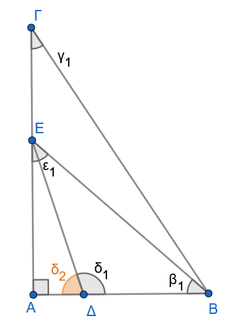{fig-align="center" width="250"}

> > Στο ορθογώνιο τρίγωνο ΑΔΕ η $δ_2$ είναι οξεία.
> > Άρα η $δ_1$ είναι αμβλεία.
> > Η $δ_2$ επίσης σαν εξωτερική γωνία στο τρίγωνο ΔΕΒ είναι μεγαλύτερη από την $β_1$ Άρα ...............................
> > Σκεφτείτε ανάλογα και στο τρίγωνο ΒΕΓ.

::: callout-exercise
6.  Έχουμε γωνία $\widehat{xOy}$ και φέρουμε ημιευθεία $OA \perp Ox$ προς το μέρος της $Oy$ και ημιευθεία $OB \perp Oy$ προς το αντίθετο μέρος της $Oy$ ως προς την $Ox$. Να αποδειχθεί ότι οι γωνίες $\widehat{AOB}$ και $\widehat{xOy}$ είναι ίσες και οι διχοτόμοι τους είναι κάθετες μεταξύ τους.

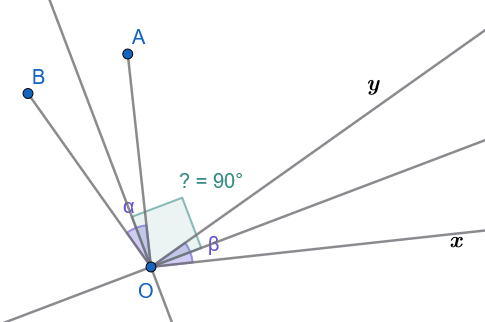{fig-align="center" width="400"}
:::

7.  Δίνεται παραλληλόγραμμο $AB\Gamma\Delta$ με $\widehat{B} = 45^\circ$. Από το μέσο $M$ της $\Gamma\Delta$ φέρουμε κάθετο πάνω στη $\Gamma\Delta$, η οποία τέμνει τις ευθείες $A\Delta$ και $B\Gamma$ στα σημεία $E$ και $Z$ αντίστοιχα. Να αποδείξετε ότι το τετράπλευρο $\Delta E\Gamma Z$ είναι τετράγωνο.

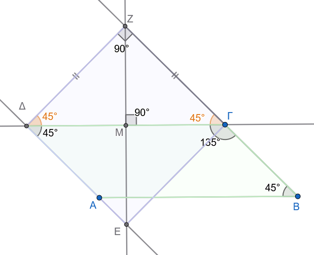{fig-align="center" width="450"}

------------------------------------------------------------------------

### Άθροισμα Γωνιών Κυρτού ν-γώνου

#### Ορισμοί

:::: {.math-box .definition-box}
::: {.math-title .definition-title}
**Κυρτό Πολύγωνο:**
:::

Ένα πολύγωνο ονομάζεται κυρτό όταν, για οποιαδήποτε πλευρά του, ολόκληρο το πολύγωνο βρίσκεται στο ίδιο ημιεπίπεδο ως προς την ευθεία που ορίζει η πλευρά αυτή.

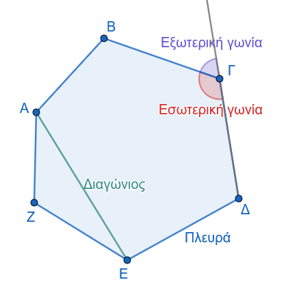{fig-align="center" width="350"}
::::

:::: {.math-box .definition-box}
::: {.math-title .definition-title}
**Διαγώνιος Πολυγώνου:**
:::

Είναι το ευθύγραμμο τμήμα που ενώνει δύο μη διαδοχικές κορυφές του πολυγώνου.
::::

------------------------------------------------------------------------

#### Θεωρήματα

:::: {.math-box .theorem-box}
::: {.math-title .theorem-title}
**Θεώρημα 3**
:::

**Το άθροισμα των εσωτερικών γωνιών κάθε κυρτού πολυγώνου με** $\nu$ πλευρές ($\nu \ge 3$) ισούται με $2\nu - 4$ ορθές γωνίες (δηλαδή $(\nu-2) \cdot 180^\circ$).
::::

:::: {.math-box .apodeixi-box}
::: {.math-title .apodeixi-title}
**Απόδειξη (Α' Μέθοδος - με τριγωνοποίηση από μία κορυφή):**

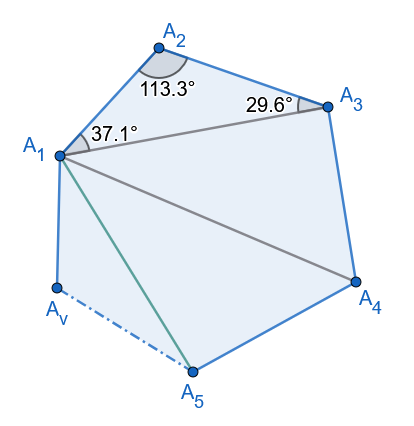{fig-align="center" width="320"}
:::

1.  Έστω κυρτό πολύγωνο $A_1A_2A_3\dots A_{\nu}$ με $\nu$ πλευρές.

2.  Επιλέγουμε μία τυχαία κορυφή, έστω την $A_1$, και φέρουμε όλες τις δυνατές διαγώνιες που ξεκινούν από αυτή την κορυφή.

3.  Οι διαγώνιοι αυτοί είναι στο πλήθος $\nu - 3$, διότι η $A_1$ δεν μπορεί να συνδεθεί με τον εαυτό της και με τις δύο διαδοχικές της κορυφές ($A_2$ και $A_{\nu}$).

4.  Οι διαγώνιοι αυτοί χωρίζουν το κυρτό πολύγωνο σε ακριβώς $\nu - 2$ τρίγωνα.

5.  Το άθροισμα των γωνιών του πολυγώνου συμπίπτει με το άθροισμα των γωνιών αυτών των $\nu - 2$ τριγώνων.

6.  Εφόσον το άθροισμα των γωνιών κάθε τριγώνου είναι $2$ ορθές ($180^\circ$), το συνολικό άθροισμα των γωνιών των $\nu - 2$ τριγώνων είναι: $$\Sigma_{\text{εσ}} = 2(\nu - 2),\text{ορθές} = (2\nu - 4),\text{ορθές} = (\nu - 2) \cdot 180^\circ$$
::::

:::: {.math-box .apodeixi-box}
::: {.math-title .apodeixi-title}
**Απόδειξη (Β' Μέθοδος - με εσωτερικό σημείο):**

> > > Σχεδιάστε το σχήμα
:::

1.  Θεωρούμε ένα τυχαίο εσωτερικό σημείο $O$ του πολυγώνου και το ενώνουμε με όλες τις $\nu$ κορυφές του.

2.  Σχηματίζονται $\nu$ τρίγωνα, των οποίων το συνολικό άθροισμα γωνιών είναι $2\nu$ ορθές.

3.  Το άθροισμα των γωνιών του πολυγώνου προκύπτει αν από το παραπάνω άθροισμα αφαιρέσουμε το άθροισμα των γωνιών που σχηματίζονται γύρω από το σημείο $O$, το οποίο ισούται με $4$ ορθές ($360^\circ$).
    Συνεπώς: $$\Sigma_{εσ} = 2\nu - 4,\text{ορθές}$$
::::

------------------------------------------------------------------------

#### Πόρισμα

:::: {.math-box .corollary-box}
::: {.math-title .corollary-title}
**Πόρισμα 1**
:::

**Το άθροισμα των εξωτερικών γωνιών κάθε κυρτού πολυγώνου ισούται με** $4$ ορθές ($360^\circ$) ανεξαρτήτως του πλήθους $\nu$ των πλευρών του.
::::

:::: {.math-box .corollaryproof-box}
::: {.math-title .corollaryproof-title}
**Απόδειξη:**

Σχεδιάστε το σχήμα
:::

Κάθε εσωτερική γωνία $\widehat{A}_i$ και η αντίστοιχη εξωτερική της γωνία $\widehat{A}{i,\text{εξ}}$ είναι παραπληρωματικές, δηλαδή: $$\widehat{A}_i + \widehat{A}_{i,\text{εξ}} = 2,\text{ορθές} = 180^\circ$$

Για τις $\nu$ κορυφές του πολυγώνου, προσθέτοντας κατά μέλη τις σχέσεις αυτές, έχουμε: $$\Sigma_{\text{εξ}} + \Sigma_{\text{εσ}} = 2\nu,\text{ορθές}$$

Αντικαθιστώντας το $\Sigma_{\text{εσ}} = 2\nu - 4$ ορθές, προκύπτει: $$\Sigma_{\text{εξ}} + (2\nu - 4) = 2\nu \Rightarrow \Sigma_{\text{εξ}} = 4,\text{ορθές} = 360^\circ$$
::::

------------------------------------------------------------------------

#### Εφαρμογές

:::: {.math-box .example-box}
::: {.math-title .example-title}
**Εφαρμογή 1η:**
:::

Το άθροισμα των εσωτερικών γωνιών ενός κυρτού πολυγώνου ισούται με $900^\circ$.

Να υπολογιστεί το πλήθος των πλευρών του.
::::

:::: {.math-box .examplesolution-box}
::: {.math-title .examplesolution-title}
**Λύση:**
:::

Χρησιμοποιούμε τον τύπο του αθροίσματος των γωνιών: $$(\nu - 2) \cdot 180^\circ = 900^\circ \Rightarrow \nu - 2 = \dfrac{900^\circ}{180^\circ} \Rightarrow \nu - 2 = 5 \Rightarrow \nu = 7$$ Το πολύγωνο έχει $7$ πλευρές (είναι επτάγωνο).
::::

:::: {.math-box .example-box}
::: {.math-title .example-title}
**Εφαρμογή 2η:**
:::

Να αποδειχθεί ότι το πλήθος των διαγωνίων $\delta$ ενός κυρτού $\nu$-γώνου δίνεται από τον τύπο: $$\delta = \dfrac{\nu(\nu - 3)}{2}$$
::::

:::: {.math-box .examplesolution-box}
::: {.math-title .examplesolution-title}
**Λύση:**
:::

Από κάθε μία από τις $\nu$ κορυφές ενός κυρτού πολυγώνου άγονται $\nu-3$ διαγώνιοι.
Αν πολλαπλασιάσουμε το πλήθος των κορυφών με τις διαγωνίους κάθε κορυφής, έχουμε $\nu(\nu-3)$ διαγωνίους.

Επειδή όμως κάθε διαγώνιος συνδέει δύο κορυφές, έχει υπολογιστεί δύο φορές (μία για κάθε άκρο της).

Επομένως, το πραγματικό πλήθος των διαγωνίων είναι το μισό: $$\delta = \dfrac{\nu(\nu-3)}{2}$$
::::

:::: {.math-box .example-box}
::: {.math-title .example-title}
**Εφαρμογή 3η:**
:::

Να εξεταστεί αν υπάρχει κυρτό πολύγωνο του οποίου το άθροισμα των εσωτερικών γωνιών ισούται με το άθροισμα των εξωτερικών του γωνιών.
::::

:::: {.math-box .examplesolution-box}
::: {.math-title .examplesolution-title}
**Λύση:**
:::

Θέλουμε $\Sigma_{εσ} = \Sigma_{εξ}$.

Αντικαθιστώντας τους γνωστούς τύπους έχουμε: $$(\nu - 2) \cdot 180^\circ = 360^\circ \Rightarrow \nu - 2 = 2 \Rightarrow \nu = 4$$

Συνεπώς, το ζητούμενο πολύγωνο είναι το τετράπλευρο.
::::

------------------------------------------------------------------------

#### Ασκήσεις

1.  Να συμπληρώσετε τις τιμές του παρακάτω πίνακα για κυρτά $\nu$-γωνα:

$$\begin{array}{|c|c|c|c|c|c|}
    \hline
    \text{Πλευρές } (\nu) & 4 & 5 & 6 & 8 & \nu \\
    \hline
    \text{Άθροισμα Εσωτερικών Γωνιών} & & & & & \\
    \hline
    \text{Άθροισμα Εξωτερικών Γωνιών} & & & & & \\
    \hline
  \end{array}$$

2.  Αν οι διχοτόμοι των γωνιών $\widehat{A}$ και $\widehat{B}$ ενός κυρτού τετραπλεύρου $AB\Gamma\Delta$ τέμνονται σε ένα σημείο $E$, να αποδείξετε ότι η γωνία $\widehat{AEB}$ ισούται με: $$\widehat{AEB} = \dfrac{\widehat{\Gamma} + \widehat{\Delta}}{2}$$

3.  Δίνεται κυρτό τετράπλευρο $AB\Gamma\Delta$ με $\widehat{A} > \widehat{\Gamma}$.
    Αν οι διχοτόμοι των γωνιών $\widehat{B}$ και $\widehat{\Delta}$ τέμνονται σχηματίζοντας οξεία γωνία $\varphi$, να αποδείξετε ότι: $$\varphi = \dfrac{\widehat{A} - \widehat{\Gamma}}{2}$$

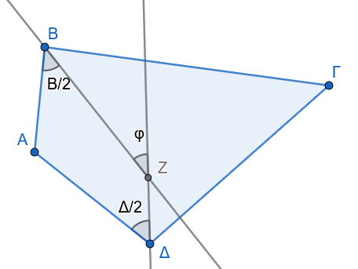{fig-align="center" width="300"}

::: callout-exercise
4.  Σε ένα κυρτό τετράπλευρο δύο απέναντι γωνίες του είναι ίσες. Να αποδείξετε ότι οι διχοτόμοι των δύο άλλων γωνιών του είναι παράλληλες ή ταυτίζονται.
:::

5.  Να αποδείξετε ότι σε οποιοδήποτε κυρτό πολύγωνο δεν είναι δυνατόν να υπάρχουν περισσότερες από τρεις οξείες εσωτερικές γωνίες.

6.  Να βρεθεί το πλήθος των πλευρών ενός κυρτού πολυγώνου, εάν το άθροισμα των εσωτερικών γωνιών του είναι εξαπλάσιο από το άθροισμα των εξωτερικών του γωνιών.

7.  Αν σε ένα κυρτό πεντάγωνο $AB\Gamma\Delta E$ όλες οι εσωτερικές γωνίες είναι ίσες μεταξύ τους, να υπολογίσετε το μέτρο κάθε γωνίας σε μοίρες.

8.  Αν ο αριθμός των πλευρών ενός κυρτού πολυγώνου διπλασιαστεί (από $\nu$ γίνει $2\nu$), να αποδείξετε ότι το άθροισμα των εσωτερικών του γωνιών αυξάνεται κατά $\nu \cdot 180^\circ$ (ή κατά $2\nu$ ορθές γωνίες).

------------------------------------------------------------------------

::: {.callout-important title="ΣΑΣ ΕΥΧΟΜΑΙ"}
ΚΑΛΗ ΜΕΛΕΤΗ !!!
:::
