```{=html}
<!-- Φόρτωση βιβλιοθήκης GeoGebra -->
<script src="https://www.geogebra.org/apps/deployggb.js"></script>

<!-- Συνάρτηση δημιουργίας applets -->
<script>
function createGeoGebra(containerId, materialId, width = 700, height = 500) {
  var params = {
    "id": "ggb-" + containerId,
    "material_id": materialId,
    "width": width,
    "height": height,
    "showToolBar": true,
    "showMenuBar": false,
    "showAlgebraInput": true
  };
  
  var applet = new GGBApplet(params, '5.2');
  applet.inject(containerId);
}
</script>
```

## Παραλληλόγραμμο

### **Ορισμοί**

:::: {.math-box .definition-box}
::: {.math-title .definition-title}
**Παραλληλόγραμμο**

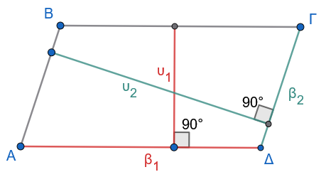{fig-align="center" width="350"}
:::

**Παραλληλόγραμμο** ονομάζεται το κυρτό τετράπλευρο το οποίο έχει τις απέναντι πλευρές του παράλληλες.
Δηλαδή, ένα τετράπλευρο $AB\Gamma\Delta$ είναι παραλληλόγραμμο όταν: $$AB \parallel \Gamma\Delta \quad \text{και} \quad A\Delta \parallel B\Gamma$$
::::

:::: {.math-box .definition-box}
::: {.math-title .definition-title}
**Απόσταση Παραλλήλων:**
:::

Το μήκος του ευθύγραμμου τμήματος που είναι κάθετο σε δυο παράλληλες ευθείες και έχει τα άκρα του πάνω σε αυτές, ορίζεται ως η **απόσταση των παραλλήλων ευθειών**.
($υ_1$ και $υ_2$ στο σχήμα 1)
::::

:::: {.math-box .definition-box}
::: {.math-title .definition-title}
**Ύψος και Βάση παραλληλογράμμου:**
:::

Σε κάθε παραλληλόγραμμο οι αποστάσεις των παραλλήλων πλευρών του ορίζονται σαν **ύψος** που αντιστοιχεί για αυτές τις παράλληλες πλευρές οι οποίες ορίζονται σαν **βάση** .
(Σχήμα 1)
::::

### **Ιδιότητες**

:::: {.math-box .property-box}
::: {.math-title .property-title}
Σε κάθε παραλληλόγραμμο ισχύουν οι ακόλουθες βασικές ιδιότητες:
:::

1.  **Οι απέναντι πλευρές του είναι ίσες ανά δύο** ($AB = \Gamma\Delta$ και $A\Delta = B\Gamma$).

2.  **Οι απέναντι γωνίες του είναι ίσες ανά δύο** ($\widehat{A} = \widehat{\Gamma}$ και $\widehat{B} = \widehat{\Delta}$).

3.  **Οι διαγώνιοί του διχοτομούνται** (τέμνονται στο μέσο τους).
::::

:::: {.math-box .propertyproof-box}
::: {.math-title .propertyproof-title}
#### **Απόδειξη των ιδιοτήτων 1 και 2:**

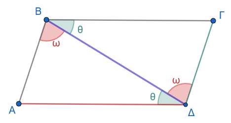{fig-align="center" width="350"}
:::

Έστω παραλληλόγραμμο $AB\Gamma\Delta$ με $AB \parallel \Gamma\Delta$ και $A\Delta \parallel B\Gamma$.
Φέρουμε τη διαγώνιο $B\Delta$.
Συγκρίνουμε τα τρίγωνα $AB\Delta$ και $B\Gamma\Delta$.
Αυτά έχουν:

- Την πλευρά $B\Delta$ κοινή.

- $\widehat{B}_1 = \widehat{\Delta}_1 = \hat ω$, ως εντός εναλλάξ γωνίες των παραλλήλων ευθειών $AB$ και $\Gamma\Delta$ που τέμνονται από τη $B\Delta$.

- $\widehat{B}_2 = \widehat{\Delta}_2 = \hatθ$, ως εντός εναλλάξ γωνίες των παραλλήλων ευθειών $A\Delta$ και $B\Gamma$ που τέμνονται από τη $B\Delta$.

Σύμφωνα με το κριτήριο ισότητας τριγώνων **Γωνία - Πλευρά - Γωνία (Γ-Π-Γ)**, τα τρίγωνα $AB\Delta$ και $B\Gamma\Delta$ είναι ίσα.

Από την ισότητα αυτή προκύπτει ότι οι αντίστοιχες πλευρές και γωνίες τους είναι ίσες, δηλαδή: $$AB = \Gamma\Delta \quad \text{και} \quad A\Delta = B\Gamma$$

Επίσης, προκύπτει άμεσα ότι: $$\widehat{A} = \widehat{\Gamma} \quad \text{και} \quad \widehat{B} = \widehat{\Delta} = \hat θ + \hat ω$$
::::

:::: {.math-box .propertyproof-box}
::: {.math-title .propertyproof-title}
#### **Απόδειξη της ιδιότητας 3:**

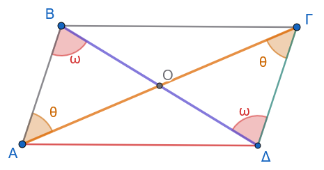{fig-align="center" width="350"}
:::

Έστω $O$ το σημείο τομής των διαγωνίων $A\Gamma$ και $B\Delta$ του παραλληλογράμμου $AB\Gamma\Delta$.
Συγκρίνουμε τα τρίγωνα $OAB$ και $O\Gamma\Delta$.
Αυτά έχουν:

- $AB = \Gamma\Delta$, ως απέναντι πλευρές του παραλληλογράμμου (από την ιδιότητα 1).

- $\widehat{B}_1 = \widehat{\Delta}_1 = \hat ω$, ως εντός εναλλάξ γωνίες των παραλλήλων $AB$ και $\Gamma\Delta$ με τέμνουσα τη $B\Delta$.

- $\widehat{A}_1 = \widehat{\Gamma}_1 = \hat θ$, ως εντός εναλλάξ γωνίες των παραλλήλων $AB$ και $\Gamma\Delta$ με τέμνουσα την $A\Gamma$.

Σύμφωνα με το κριτήριο **Γ-Π-Γ**, τα τρίγωνα $OAB$ και $O\Gamma\Delta$ είναι ίσα, οπότε προκύπτει ότι οι αντίστοιχες πλευρές τους είναι ίσες: $$OA = O\Gamma \quad \text{και} \quad OB = O\Delta$$

Συνεπώς, οι διαγώνιοι του παραλληλογράμμου διχοτομούνται στο σημείο $O$.
::::

------------------------------------------------------------------------

### **Πορίσματα**

:::: {.math-box .corollary-box}
::: {.math-title .corollary-title}
Πόρισμα 1
:::

Το σημείο τομής $O$ των διαγωνίων του παραλληλογράμμου αποτελεί κέντρο συμμετρίας του και ονομάζεται **κέντρο του παραλληλογράμμου**.
Κάθε ευθύγραμμο τμήμα που διέρχεται από το κέντρο $O$ και έχει τα άκρα του στις απέναντι πλευρές του παραλληλογράμμου διχοτομείται από αυτό.
::::

:::: {.math-box .corollaryproof-box}
::: {.math-title .corollaryproof-title}
**Απόδειξη:**

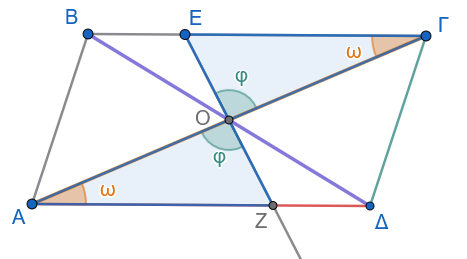{fig-align="center" width="350"}
:::

Έστω παραλληλόγραμμο $AB\Gamma\Delta$ με $AB \parallel \Gamma\Delta$ και $A\Delta \parallel B\Gamma$, και $O$ το σημείο τομής των διαγωνίων του $A\Gamma$ και $B\Delta$.
Από τις ιδιότητες του παραλληλογράμμου, οι διαγώνιοί του διχοτομούνται στο $O$, δηλαδή ισχύει $OA = O\Gamma$ και $OB = O\Delta$.

Για να αποδείξουμε ότι το σημείο $O$ είναι κέντρο συμμετρίας του παραλληλογράμμου, αρκεί να δείξουμε ότι το συμμετρικό κάθε σημείου του σχήματος ως προς το $O$ ανήκει επίσης στο σχήμα.

1.  Θεωρούμε ένα τυχαίο σημείο $E$ πάνω στην πλευρά $BΓ$ του παραλληλογράμμου.

2.  Φέρουμε την ευθεία $EO$, η οποία τέμνει την απέναντι πλευρά $ΑΔ$ σε ένα σημείο $Z$.

3.  Συγκρίνουμε τα τρίγωνα $OAΖ$ και $OΕΓ$:

    - $OA = O\Gamma$, διότι οι διαγώνιοι διχοτομούνται στο $O$.
    - $\widehat{AOΖ} = \widehat{\Gamma OΕ}=\hatφ$, ως κατακορυφήν γωνίες.
    - $\widehat{OAZ} = \widehat{O\Gamma E}$, ως εντός εναλλάξ γωνίες των παραλλήλων ευθειών $AΔ$ και $ΒΓ$ με τέμνουσα την $A\Gamma$.

4.  Σύμφωνα με το κριτήριο ισότητας τριγώνων **Γωνία - Πλευρά - Γωνία (Γ-Π-Γ)**, τα τρίγωνα $OAE$ και $O\Gamma Z$ είναι ίσα.

5.  Από την ισότητα αυτή προκύπτει ότι οι αντίστοιχες πλευρές τους είναι ίσες, δηλαδή: $$OE = OZ$$

6.  Επειδή τα σημέια $E, O, Z$ είναι συνευθειακά και ισχύει $OE = OZ$, το σημείο $Z$ είναι το συμμετρικό του $E$ ως προς κέντρο συμμετρίας το $O$.

7.  Καθώς το σημείο $Z$ ανήκει στην πλευρά $ΑΔ$, αποδεικνύεται ότι το συμμετρικό οποιουδήποτε σημείου $E$ της περιμέτρου του παραλληλογράμμου ως προς το $O$ ανήκει επίσης στην περίμετρο του παραλληλογράμμου.

Συνεπώς, το σημείο τομής των διαγωνίων είναι πράγματι **κέντρο συμμετρίας** του παραλληλογράμμου.
::::

:::: {.math-box .corollary-box}
::: {.math-title .corollary-title}
**Πόρισμα 2:**
:::

*«Παράλληλα ευθύγραμμα τμήματα που ορίζονται ανάμεσα σε δύο παράλληλες ευθείες είναι ίσα.»* (ή αλλιώς: *«Παράλληλα τμήματα που έχουν τα άκρα τους σε δύο παράλληλες ευθείες είναι ίσα.»*)
::::

:::: {.math-box .corollaryproof-box}
::: {.math-title .corollaryproof-title}
**Απόδειξη:**

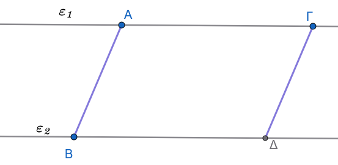{fig-align="center" width="400"}
:::

Έστω δύο παράλληλες ευθείες $\epsilon_1$ και $\epsilon_2$ ($\epsilon_1 \parallel \epsilon_2$).
Θεωρούμε δύο παράλληλα ευθύγραμμα τμήματα $AB$ και $\Gamma\Delta$ ($AB \parallel \Gamma\Delta$), τα οποία έχουν τα άκρα τους $A$ και $\Gamma$ στην ευθεία $\epsilon_1$, και τα άκρα $B$ και $\Delta$ στην ευθεία $\epsilon_2$.

Στο σχηματιζόμενο τετράπλευρο $AB\Delta\Gamma$:

1.  Οι πλευρές $AB$ και $\Gamma\Delta$ είναι παράλληλες από την υπόθεση: $$AB \parallel \Gamma\Delta$$

2.  Οι πλευρές $A\Gamma$ και $B\Delta$ βρίσκονται πάνω στους φορείς των παράλληλων ευθειών $\epsilon_1$ και $\epsilon_2$ αντίστοιχα, συνεπώς είναι και αυτές παράλληλες μεταξύ τους: $$A\Gamma \parallel B\Delta$$

3.  Από τον ορισμό του παραλληλογράμμου, εφόσον το τετράπλευρο $AB\Delta\Gamma$ έχει τις απέναντι πλευρές του παράλληλες, είναι **παραλληλόγραμμο**.

4.  Επειδή σε κάθε παραλληλόγραμμο οι απέναντι πλευρές είναι ίσες, προκύπτει άμεσα ότι: $$AB = \Gamma\Delta$$

Συνεπώς, παράλληλα τμήματα μεταξύ παραλλήλων ευθειών είναι πάντα **ίσα**.
::::

------------------------------------------------------------------------

### **Κριτήρια (Πότε ένα τετράπλευρο είναι παραλληλόγραμμο)**

:::: {.math-box .criteria-box}
::: {.math-title .criteria-title}
Ένα κυρτό τετράπλευρο είναι παραλληλόγραμμο αν και μόνο αν ικανοποιεί μία από τις παρακάτω ικανές και αναγκαίες συνθήκες:
:::

1.  **Οι απέναντι πλευρές του είναι ανά δύο ίσες**.

2.  **Δύο απέναντι πλευρές του είναι ίσες και παράλληλες**.

3.  **Οι απέναντι γωνίες του είναι ανά δύο ίσες**.

4.  **Οι διαγώνιοί του διχοτομούνται**.
::::

:::: {.math-box .criteriaproof-box}
::: {.math-title .criteriaproof-title}
#### **Απόδειξη του Κριτηρίου 1 (Απέναντι πλευρές ίσες ανά δύο):**

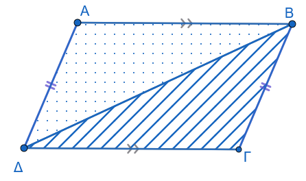{fig-align="center" width="350"}
:::

Έστω τετράπλευρο $AB\Gamma\Delta$ στο οποίο ισχύει $AB = \Gamma\Delta$ και $A\Delta = B\Gamma$.
Φέρουμε τη διαγώνιο $B\Delta$.
Συγκρίνουμε τα τρίγωνα $AB\Delta$ και $B\Gamma\Delta$.
Αυτά έχουν:

- $AB = \Gamma\Delta$ (από υπόθεση).

- $A\Delta = B\Gamma$ (από υπόθεση).

- Την πλευρά $B\Delta$ κοινή.

Κατά το κριτήριο ισότητας **Πλευρά - Πλευρά - Πλευρά (Π-Π-Π)**, τα τρίγωνα $AB\Delta$ και $B\Gamma\Delta$ είναι ίσα.

Συνεπώς, όλες οι αντίστοιχες γωνίες τους είναι ίσες.
Από την ισότητα αυτή προκύπτει ότι:

- $\widehat{ΑBΔ} = \widehat{ΒΔΓ} = \omega \Rightarrow AB \parallel \Gamma\Delta$, διότι οι εντός εναλλάξ γωνίες ως προς την τέμνουσα $B\Delta$ είναι ίσες.

- $\widehat{ΑΔB} = \widehat{ΔΒΓ} = \phi \Rightarrow A\Delta \parallel B\Gamma$, διότι οι εντός εναλλάξ γωνίες ως προς την τέμνουσα $B\Delta$ είναι ίσες.

Εφόσον οι απέναντι πλευρές του τετραπλεύρου είναι παράλληλες, το $AB\Gamma\Delta$ είναι παραλληλόγραμμο.
::::

:::: {.math-box .criteriaproof-box}
::: {.math-title .criteriaproof-title}
#### **Απόδειξη του Κριτηρίου 2 (Δύο απέναντι πλευρές ίσες και παράλληλες):**

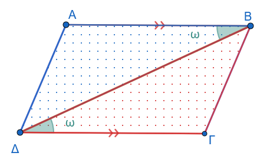{fig-align="center" width="350"}
:::

Έστω τετράπλευρο $AB\Gamma\Delta$ στο οποίο δύο απέναντι πλευρές είναι ίσες και παράλληλες, έστω $AB \parallel \Gamma\Delta$ και $AB = \Gamma\Delta$.

Φέρουμε τη διαγώνιο $B\Delta$.
Συγκρίνουμε τα τρίγωνα $AB\Delta$ και $B\Gamma\Delta$.
Αυτά έχουν:

- $AB = \Gamma\Delta$ (από υπόθεση).

- Την πλευρά $B\Delta$ κοινή.

- $\widehat{B}_1 = \widehat{\Delta}_1 = \omega$, ως εντός εναλλάξ γωνίες των παραλλήλων $AB$ και $\Gamma\Delta$ με τέμνουσα τη $B\Delta$.

Σύμφωνα με το κριτήριο **Πλευρά - Γωνία - Πλευρά (Π-Γ-Π)**, τα τρίγωνα $AB\Delta$ και $B\Gamma\Delta$ είναι ίσα.

Συνεπώς, έχουν όλες τις αντίστοιχες γωνίες τους ίσες, άρα: $$\widehat{B}_2 = \widehat{\Delta}_2 = \phi \Rightarrow A\Delta \parallel B\Gamma$$ διότι οι εντός εναλλάξ γωνίες ως προς την τέμνουσα $B\Delta$ είναι ίσες.

Εφόσον $AB \parallel \Gamma\Delta$ (από υπόθεση) και $A\Delta \parallel B\Gamma$, το $AB\Gamma\Delta$ είναι παραλληλόγραμμο.
::::

:::: {.math-box .criteriaproof-box}
::: {.math-title .criteriaproof-title}
#### **Απόδειξη του Κριτηρίου 3 (Απέναντι γωνίες ίσες ανά δύο):**

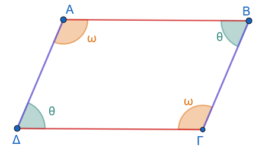{fig-align="center" width="350"}
:::

Έστω τετράπλευρο $AB\Gamma\Delta$ στο οποίο οι απέναντι γωνίες είναι ίσες ανά δύο, δηλαδή $\widehat{A} = \widehat{\Gamma} = \hat ω$ και $\widehat{B} = \widehat{\Delta} = \hatθ$.

Γνωρίζουμε ότι το άθροισμα των εσωτερικών γωνιών κάθε κυρτού τετραπλεύρου ισούται με $360^\circ$ (ή $4\lfloor$ ορθές).

Συνεπώς: $$\widehat{A} + \widehat{B} + \widehat{\Gamma} + \widehat{\Delta} = 360^\circ \Rightarrow 2\hatω + 2\hatθ = 360^\circ \Rightarrow 2(\hatω + \hatθ) = 360^\circ \Rightarrow \hatω + \hatθ = 180^\circ$$

Από τη σχέση αυτή προκύπτει ότι:

- $\widehat{A} + \widehat{\Delta} = \hatω + \hatθ = 180^\circ$.
  Επειδή οι γωνίες $\widehat{A}$ και $\widehat{\Delta}$ είναι εντός και επί τα αυτά μέρη των ευθειών $AB$ και $\Gamma\Delta$ με τέμνουσα την $A\Delta$ και είναι παραπληρωματικές, προκύπτει ότι $AB \parallel \Gamma\Delta$.

- $\widehat{A} + \widehat{B} = \hatω + \hatθ = 180^\circ$.
  Επειδή οι γωνίες $\widehat{A}$ και $\widehat{B}$ είναι εντός και επί τα αυτά μέρη των ευθειών $A\Delta$ και $B\Gamma$ με τέμνουσα την $AB$ και είναι παραπληρωματικές, προκύπτει ότι $A\Delta \parallel B\Gamma$.

Εφόσον $AB \parallel \Gamma\Delta$ και $A\Delta \parallel B\Gamma$, το τετράπλευρο $AB\Gamma\Delta$ είναι παραλληλόγραμμο.
::::

:::: {.math-box .criteriaproof-box}
::: {.math-title .criteriaproof-title}
#### **Απόδειξη του Κριτηρίου 4 (Οι διαγώνιοι διχοτομούνται):**

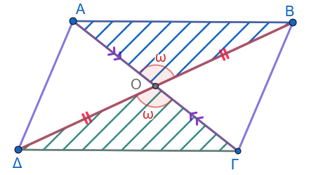{fig-align="center" width="350"}
:::

Έστω τετράπλευρο $AB\Gamma\Delta$ του οποίου οι διαγώνιοι $A\Gamma$ και $B\Delta$ τέμνονται στο σημείο $O$ έτσι ώστε $AO = O\Gamma$ και $OB = O\Delta$.

Συγκρίνουμε τα τρίγωνα $AOB$ και $O\Gamma\Delta$.
Αυτά έχουν:

- $AO = O\Gamma$ (από υπόθεση).

- $OB = O\Delta$ (από υπόθεση).

- $\widehat{AOB} = \widehat{\Gamma O\Delta}$ ως κατακορυφήν γωνίες.

Σύμφωνα με το κριτήριο **Π-Γ-Π**, τα τρίγωνα $AOB$ και $O\Gamma\Delta$ είναι ίσα.
Από την ισότητά τους προκύπτει ότι οι αντίστοιχες γωνίες τους είναι ίσες, δηλαδή: $$\widehat{A}_1 = \widehat{\Gamma}_1 \Rightarrow AB \parallel \Gamma\Delta$$ καθώς οι εντός εναλλάξ γωνίες ως προς την τέμνουσα $A\Gamma$ είναι ίσες.

Συγκρίνουμε τώρα τα τρίγωνα $AO\Delta$ και $BO\Gamma$.
Αυτά έχουν:

- $AO = O\Gamma$ (από υπόθεση).

- $O\Delta = OB$ (από υπόθεση).

- $\widehat{AO\Delta} = \widehat{BO\Gamma}$ ως κατακορυφήν γωνίες.

Σύμφωνα με το κριτήριο **Π-Γ-Π**, τα τρίγωνα $AO\Delta$ και $BO\Gamma$ είναι ίσα.
Από την ισότητά τους προκύπτει ομοίως ότι: $$\widehat{A}_2 = \widehat{\Gamma}_2 \Rightarrow A\Delta \parallel B\Gamma$$ καθώς οι εντός εναλλάξ γωνίες ως προς την τέμνουσα $A\Gamma$ είναι ίσες.

Εφόσον $AB \parallel \Gamma\Delta$ και $A\Delta \parallel B\Gamma$, το $AB\Gamma\Delta$ είναι παραλληλόγραμμο.
::::

------------------------------------------------------------------------

### **Ασκήσεις**

**1.** Δίνεται παραλληλόγραμμο $AB\Gamma\Delta$.
Η διχοτόμος της γωνίας $\widehat{A}$ τέμνει τη ΔΓ στο σημείο $E$.
Να αποδείξετε ότι $\Delta E = B\Gamma$.

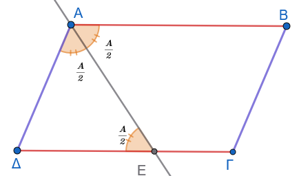{fig-align="center" width="350"}

**2.** Έστω $O$ το κέντρο παραλληλογράμμου $AB\Gamma\Delta$.
Αν $E$ και $Z$ είναι σημεία των $OA$ και $O\Gamma$ αντίστοιχα, τέτοια ώστε $OE = OZ$, να αποδείξετε ότι το τετράπλευρο $BE\Delta Z$ είναι παραλληλόγραμμο.

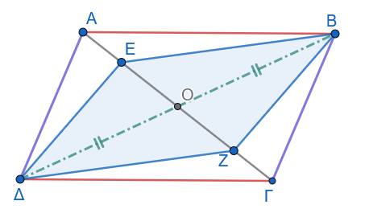{fig-align="center" width="350"}

**3.** Έστω $E$ και $Z$ τα μέσα των απέναντι πλευρών $AB$ και $\Gamma\Delta$ αντίστοιχα, παραλληλογράμμου $AB\Gamma\Delta$.
Να αποδείξετε ότι:

- 

  i)  Το τετράπλευρο $AE\Gamma Z$ είναι παραλληλόγραμμο.

- 

  ii) Οι ευθείες $A\Gamma$, $B\Delta$ και $EZ$ συντρέχουν (διέρχονται από το ίδιο σημείο).

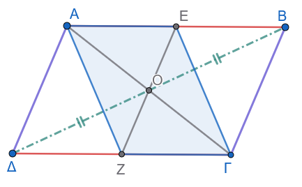{fig-align="center" width="350"}

**4.** Δίνεται τρίγωνο $AB\Gamma$ και η διχοτόμος του $A\Delta$.
Η παράλληλη από το σημείο $\Delta$ προς την πλευρά $AB$ τέμνει την $A\Gamma$ στο $E$.
Αν η παράλληλη από το $E$ προς τη $B\Gamma$ τέμνει την $AB$ στο σημείο $Z$, να αποδείξετε ότι $AE = BZ$.

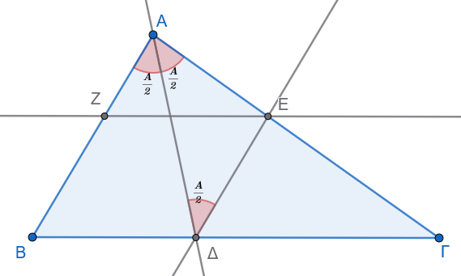{fig-align="center" width="400"}

**5.** Σε παραλληλόγραμμο $AB\Gamma\Delta$ φέρουμε τα κάθετα τμήματα $AE \perp \Delta\Gamma$ και $\Gamma Z \perp AB$.
Να αποδείξετε ότι το τετράπλευρο $AZ\Gamma E$ είναι ορθογώνιο παραλληλόγραμμο.

**6.** Δίνεται παραλληλόγραμμο $AB\Gamma\Delta$ με γωνία $\widehat{B} = 45^\circ$.
Από το μέσο $M$ της πλευράς $\Gamma\Delta$ φέρουμε κάθετο πάνω στη $\Gamma\Delta$, η οποία τέμνει τις ευθείες $A\Delta$ και $B\Gamma$ (ή τις προεκτάσεις τους) στα σημεία $E$ και $Z$ αντίστοιχα.
Να αποδείξετε ότι το τετράπλευρο $\Delta E\Gamma Z$ είναι τετράγωνο.

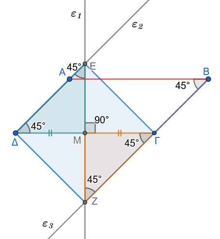{fig-align="center" width="400"}

**7.** Δίνεται παραλληλόγραμμο $AB\Gamma\Delta$ και τα σημεία $E, Z, H$ και $K$ των πλευρών του $AB, B\Gamma, \Gamma\Delta$ και $A\Delta$ αντίστοιχα, έτσι ώστε $AE = \Gamma H$ και $BZ = \Delta K$.
Να αποδείξετε ότι:

1.  Το τετράπλευρο $EZHK$ είναι παραλληλόγραμμο.

2.  Οι ευθείες $A\Gamma, B\Delta, EH$ και $KZ$ συντρέχουν.

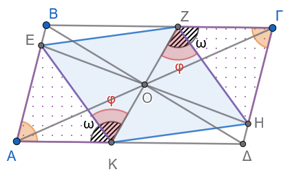{fig-align="center" width="350"}

::: {.callout-method}
**Υπόδειξη**

1.  Δείτε ότι τα τρίγωνα ΑΕΚ και ΖΓΗ είναι ίσα.

2.  Τα τετράπλευρα ΒΖΔΚ και ΒΕΔΗ είναι παραλληλόγραμμα.

3.  Τα τετράπλευρα ΑΕΓΗ και ΑΖΓΚ είναι παραλληλόγραμμα.
:::

**8.** Προεκτείνουμε την πλευρά $AB$ παραλληλογράμμου $AB\Gamma\Delta$ κατά τμήμα $BE = B\Gamma$ και στην πλευρά $ΔA$ προς το $A$ παίρνουμε τμήμα $\Delta Z = \Delta\Gamma$.
Να αποδείξετε ότι η γωνία $\widehat{Z\Gamma E} = 90^\circ$.

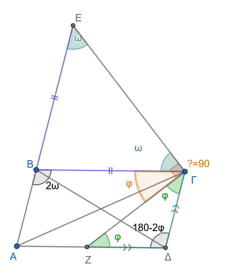{fig-align="center" width="350"}

::: {.callout-method}
**Υπόδειξη**

1.  Τρίγωνο ΒΕΓ ισοσκελές

2.  Τρίγωνο ΖΔΓ ισοσκελές

3.  Οι απέναντι γωνίες του παραλληλογράμμου είναι ίσες $\hat A=\hat Γ$
:::

**9.** Δίνεται παραλληλόγραμμο $AB\Gamma\Delta$.
Προεκτείνουμε την πλευρά $AB$ κατά τμήμα $BE = B\Gamma$ και την πλευρά $A\Delta$ κατά τμήμα $\Delta Z = \Delta\Gamma$.
Να αποδείξετε ότι τα σημεία $Z, \Gamma$ και $E$ είναι συνευθειακά.

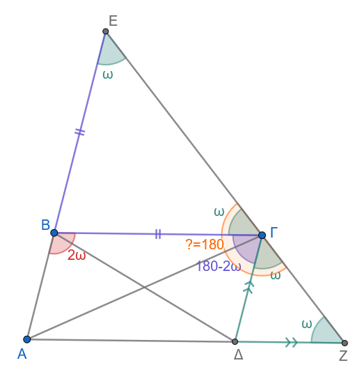{fig-align="center" width="400"}

::: {.callout-method}
**Υπόδειξη**

1.  Δείτε τα ισοσκελή τρίγωνα.
    Εξηγείστε γιατί οι γωνίες ω είναι ίσες

2.  Δείτε τις παραπληρωματικές γωνίες $\hat B$ και $\hat Γ$ του παραλληλογράμμου.
:::

::: {.math-box .exercise-box}
**10.** Αν $E$ και $Z$ είναι τα μέσα των πλευρών $B\Gamma$ και $\Gamma\Delta$ παραλληλογράμμου $AB\Gamma\Delta$ αντίστοιχα, να αποδείξετε ότι οι ευθείες $AE$ και $AZ$ τριχοτομούν τη διαγώνιο $B\Delta$.
:::

:::: {.math-box .solution-box}
::: {.math-title .solution-title}
**Λύση**

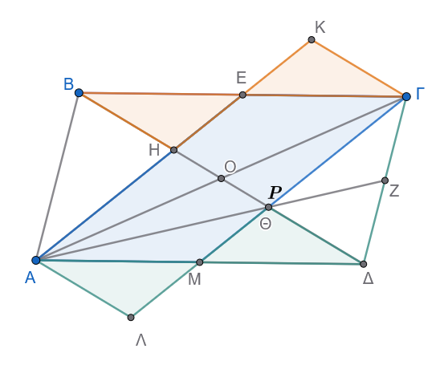{fig-align="center" width="400"}
:::

**Βήμα 1: Κατασκευή βοηθητικού παραλληλογράμμου**

Θεωρούμε το $M$, το μέσο της πλευράς $A\Delta$.

1.  Στο παραλληλόγραμμο $AB\Gamma\Delta$ ισχύει $A\Delta \parallel B\Gamma$ και $A\Delta = B\Gamma$.

2.  Τα τμήματα $AM$ και $E\Gamma$ είναι τα μισά των ίσων και παράλληλων πλευρών, άρα: $$AM \parallel E\Gamma \quad \text{και} \quad AM = E\Gamma$$.
    Επομένως, το τετράπλευρο $AM\Gamma E$ είναι παραλληλόγραμμο (έχει δύο απέναντι πλευρές ίσες και παράλληλες).

3.  Άρα οι άλλες δύο πλευρές του είναι παράλληλες: $$AE \parallel M\Gamma$$

Έστω $P$ το σημείο τομής της ευθείας $M\Gamma$ με τη διαγώνιο $B\Delta$.

Το Ρ συμπίπτει με το Θ , το σημείο τομής των δύο άλλων διαμέσων ΑΖ και ΔΟ στο τρίγωνο ΑΓΔ αφού και η ΓΜ είναι διάμεσος\

Επειδή $AE \parallel M\Gamma$, έχουμε: $$HE \parallel P\Gamma \quad \text{και} \quad AH \parallel MP$$

**Βήμα 2: Απόδειξη ότι** $BH = HP$ (με ίσα τρίγωνα & παραλληλόγραμμο)

Στην ημιευθεία $HE$, προεκτείνουμε κατά ίσο τμήμα $EK = HE$.

1.  **Σύγκριση τριγώνων** $\triangle BEH$ και $\triangle \Gamma EK$:

    - $BE = E\Gamma$ (το $E$ είναι μέσο της $B\Gamma$).
    - $HE = EK$ (από κατασκευή).
    - $\widehat{BEH} = \widehat{\Gamma EK}$ (είναι **κατακορυφήν**, αφού οι $B\Gamma$ και $HK$ είναι ευθείες που τέμνονται στο $E$).

    Από το κριτήριο **Π-Γ-Π**, τα τρίγωνα είναι **ίσα** ($\triangle BEH = \triangle \Gamma EK$).
    Επομένως: $$BH = \Gamma K \quad \text{και} \quad \widehat{EBH} = \widehat{E\Gamma K}$$

2.  **Ιδιότητα παραλληλίας:**\
    Επειδή $\widehat{EBH} = \widehat{E\Gamma K}$ (ίσες εντός εναλλάξ), προκύπτει ότι: $$\Gamma K \parallel B\Delta \implies \Gamma K \parallel HP$$

3.  **Στο τετράπλευρο** $HP\Gamma K$:

    - $HP \parallel \Gamma K$ (από παραπάνω)
    - $HK \parallel P\Gamma$ (αφού $AE \parallel M\Gamma$)

    Άρα το $HP\Gamma K$ είναι παραλληλόγραμμο, οπότε οι απέναντι πλευρές του είναι ίσες: $$HP = \Gamma K$$

Επειδή δείξαμε ότι $BH = \Gamma K$, έχουμε: $$BH = HP$$

------------------------------------------------------------------------

**Βήμα 3: Απόδειξη ότι** $HP = P\Delta$

Στην ημιευθεία $PM$, προεκτείνουμε κατά ίσο τμήμα $M\Lambda = PM$.

1.  **Σύγκριση τριγώνων** $\triangle \Delta MP$ και $\triangle AM\Lambda$:

    - $\Delta M = MA$ (το $M$ είναι μέσο της $A\Delta$).
    - $PM = M\Lambda$ (από κατασκευή).
    - $\widehat{\Delta MP} = \widehat{AM\Lambda}$ (**κατακορυφήν**, αφού οι $A\Delta$ και $P\Lambda$ τέμνονται στο $M$).

    Από το κριτήριο **Π-Γ-Π**, τα τρίγωνα είναι **ίσα** ($\triangle \Delta MP = \triangle AM\Lambda$).
    Επομένως: $$P\Delta = A\Lambda \quad \text{και} \quad \widehat{M\Delta P} = \widehat{MA\Lambda} \implies A\Lambda \parallel B\Delta \implies A\Lambda \parallel HP$$

2.  **Στο τετράπλευρο** $HP\Lambda A$:

    - $HP \parallel A\Lambda$
    - $AH \parallel P\Lambda$ (αφού $AE \parallel M\Gamma$)

    Άρα το $HP\Lambda A$ είναι παραλληλόγραμμο, οπότε: $$HP = A\Lambda$$

Επειδή $P\Delta = A\Lambda$, προκύπτει: $$HP = P\Delta$$

------------------------------------------------------------------------

**Βήμα 4: Συμπέρασμα για το σημείο** $H$

Από τα Βήματα 2 και 3 έχουμε: $$BH = HP = P\Delta$$

Επειδή τα τρία αυτά τμήματα συνθέτουν ολόκληρη τη διαγώνιο $B\Delta$: $$BH = \frac{1}{3} B\Delta$$

------------------------------------------------------------------------

**Βήμα 5: Τελικό Συμπέρασμα για τη διαγώνιο** $B\Delta$

1.  Η ευθεία $AE$ (που ενώνει την κορυφή $A$ με το μέσο $E$ της $B\Gamma$) αποδείξαμε ότι τέμνει τη διαγώνιο σε σημείο $H$ τέτοιο ώστε: $$BH = \frac{1}{3} B\Delta$$

2.  Με τον **ίδιο ακριβώς τρόπο**, η ευθεία $AZ$ (που ενώνει την κορυφή $A$ με το μέσο $Z$ της $\Gamma\Delta$) τέμνει τη διαγώνιο από την πλευρά του $\Delta$ σε σημείο $\Theta$ τέτοιο ώστε: $$\Theta\Delta = \frac{1}{3} B\Delta$$

3.  Το ενδιάμεσο τμήμα $H\Theta$ ισούται με: $$H\Theta = B\Delta - BH - \Theta\Delta = B\Delta - \frac{1}{3} B\Delta - \frac{1}{3} B\Delta = \frac{1}{3} B\Delta$$

Συνεπώς: $$BH = H\Theta = \Theta\Delta = \frac{1}{3} B\Delta$$

Άρα οι ευθείες $AE$ και $AZ$ **τριχοτομούν** τη διαγώνιο $B\Delta$.
::::

::: {.callout-sos}
**Έτσι για να μάθετε !!!**

Όταν δεν μπορείς να χρησιμοποιήσεις την απλή σχέση που ισχύει για την διάμεσο $ΑK=\dfrac{2}{3}AM$, γιατί δεν έχει διδαχτεί ακόμη, πρέπει να σκαρφιστείς όλο αυτό το κατεβατό για να την λύσεις.
:::

**11.** Σε παραλληλόγραμμο $AB\Gamma\Delta$ προεκτείνουμε την πλευρά $AB$ κατά τμήμα $BE = AB$.
Αν η ευθεία $\Delta E$ τέμνει την $A\Gamma$ στο $H$ και τη $B\Gamma$ στο $Z$, να αποδείξετε ότι:

- α.
  $BZ = Z\Gamma$.

- β.
  $\Gamma H = \dfrac{AH}{2}$.

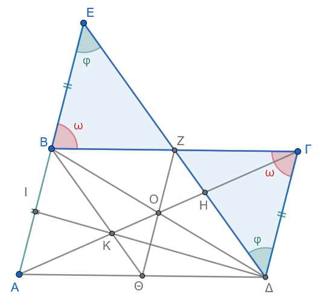{fig-align="center" width="400"}

> > > Για το β.
> > > δείτε την άσκηση 10.

:::: {.math-box .exercise-box}
::: {.math-title .exercise-title}
**Εκφώνηση**
:::

**12.** Δίνεται παραλληλόγραμμο $AB\Gamma\Delta$ και μια ευθεία $(\varepsilon)$ που τέμνει το παραλληλόγραμμο έτσι ώστε να αφήνει την κορυφή $A$ προς το ένα ημιεπίπεδο και τις υπόλοιπες κορυφές $B, \Gamma, \Delta$ προς το άλλο.
Αν $AE, BZ, \Gamma H, \Delta\Theta$ είναι οι κάθετες αποστάσεις των κορυφών $A, B, \Gamma, \Delta$ αντίστοιχα από την ευθεία $(\varepsilon)$, να αποδείξετε ότι:

$$AE + BZ + \Delta\Theta = \Gamma H$$
::::

:::: {.math-box .solution-box}
::: {.math-title .exercise-title}
**Λύση**

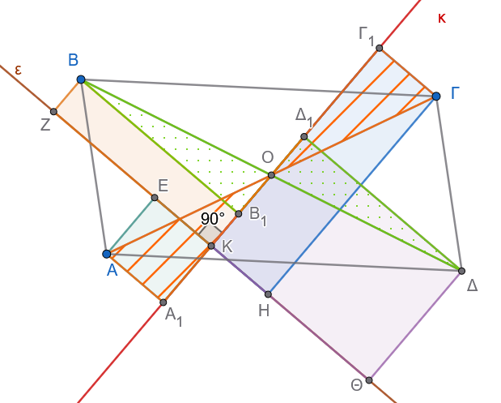{fig-align="center" width="500"}
:::

**Απόδειξη με ίσα τρίγωνα**

Έστω $O$ το σημείο τομής των διαγωνίων του παραλληλογράμμου.
Το $O$ είναι το μέσο των $A\Gamma$ και $B\Delta$ (δηλαδή $OA = O\Gamma$ και $OB = O\Delta$).

1.  Φέρνουμε από το $O$ την ευθεία που είναι κάθετη στην $(\varepsilon)$ και τέμνει την $(\varepsilon)$ στο σημείο $K$ (άρα το $OK$ είναι η απόσταση του $O$ από την $(\varepsilon)$).
2.  Προεκτείνουμε την ευθεία $OK$.
3.  Από κάθε κορυφή ($A, B, \Gamma, \Delta$) φέρνουμε παράλληλες στην ευθεία $(\varepsilon)$, οι οποίες τέμνουν την ευθεία $OK$ στα σημεία $A_1, B_1, \Gamma_1, \Delta_1$ αντίστοιχα.

Επειδή τα τμήματα $AE, BZ, \Gamma H, \Delta\Theta$ είναι κάθετα στην $(\varepsilon)$, τα τετράπλευρα που σχηματίζονται με την ευθεία $OK$ είναι ορθογώνια, οπότε:

- $AE = K A_1$
- $BZ = K B_1$
- $\Gamma H = K \Gamma_1$
- $\Delta\Theta = K \Delta_1$

**1. Σύγκριση για τη διαγώνιο** $B\Delta$

Συγκρίνουμε τα ορθογώνια τρίγωνα $\triangle O B B_1$ και $\triangle O \Delta \Delta_1$:

- Έχουν υποτείνουσες ίσες: $OB = O\Delta$ (αφού το $O$ είναι μέσο της $B\Delta$).

- Έχουν τις οξείες γωνίες $\widehat{B O B_1} = \widehat{\Delta O \Delta_1}$ ως **κατακορυφήν**.

Άρα τα τρίγωνα είναι **ίσα**, οπότε έχουν και τις κάθετες πλευρές τους ίσες: $$OB_1 = O\Delta_1$$

Παρατηρούμε τα μήκη πάνω στην ευθεία $OK$:

- Το σημείο $B_1$ βρίσκεται ανάμεσα στα $K$ και $O$, οπότε: $BZ = K B_1 = OK - OB_1$

- Το σημείο $\Delta_1$ βρίσκεται στην προέκταση του $KO$, οπότε: $\Delta\Theta = K \Delta_1 = OK + O\Delta_1$

Προσθέτουμε κατά μέλη: $$BZ + \Delta\Theta = (OK - OB_1) + (OK + O\Delta_1)$$

Επειδή $OB_1 = O\Delta_1$, τα τμήματα αυτά απλοποιούνται: $$BZ + \Delta\Theta = 2 \cdot OK \quad \text{(1)}$$

------------------------------------------------------------------------

**2. Σύγκριση για τη διαγώνιο** $A\Gamma$

Συγκρίνουμε τα ορθογώνια τρίγωνα $\triangle O A A_1$ και $\triangle O \Gamma \Gamma_1$:

- Έχουν υποτείνουσες ίσες: $OA = O\Gamma$ (αφού το $O$ είναι μέσο της $A\Gamma$).

- Έχουν τις οξείες γωνίες $\widehat{A O A_1} = \widehat{\Gamma O \Gamma_1}$ ως **κατακορυφήν**.

Άρα τα τρίγωνα είναι **ίσα**, οπότε: $$OA_1 = O\Gamma_1$$

Παρατηρούμε τα μήκη πάνω στην ευθεία $OK$:

- Το σημείο $A$ είναι από την άλλη πλευρά της $(\varepsilon)$, οπότε: $AE = K A_1 = OA_1 - OK$
- Το σημείο $\Gamma$ είναι από την πλευρά του $O$, οπότε: $\Gamma H = K \Gamma_1 = OK + O\Gamma_1$

Αφαιρούμε κατά μέλη: $$\Gamma H - AE = (OK + O\Gamma_1) - (OA_1 - OK)$$ $$\Gamma H - AE = OK + O\Gamma_1 - OA_1 + OK$$

Επειδή $OA_1 = O\Gamma_1$, έχουμε: $$\Gamma H - AE = 2 \cdot OK \quad \text{(2)}$$

------------------------------------------------------------------------

**3. Τελικό Συμπέρασμα**

Από τις σχέσεις (1) και (2) έχουμε: $$BZ + \Delta\Theta = \Gamma H - AE$$

Μεταφέροντας το $AE$ στο αριστερό μέλος: $$AE + BZ + \Delta\Theta = \Gamma H$$
::::

**13.** Δίνεται παραλληλόγραμμο $AB\Gamma\Delta$ και μια ευθεία $(\delta)$ η οποία δεν τέμνει το παραλληλόγραμμο.
Αν $AE, BZ, \Gamma H, \Delta\Theta$ είναι οι κάθετες αποστάσεις των κορυφών από την ευθεία $(\delta)$, να αποδείξετε ότι:

$$AE + \Gamma H = BZ + \Delta\Theta$$

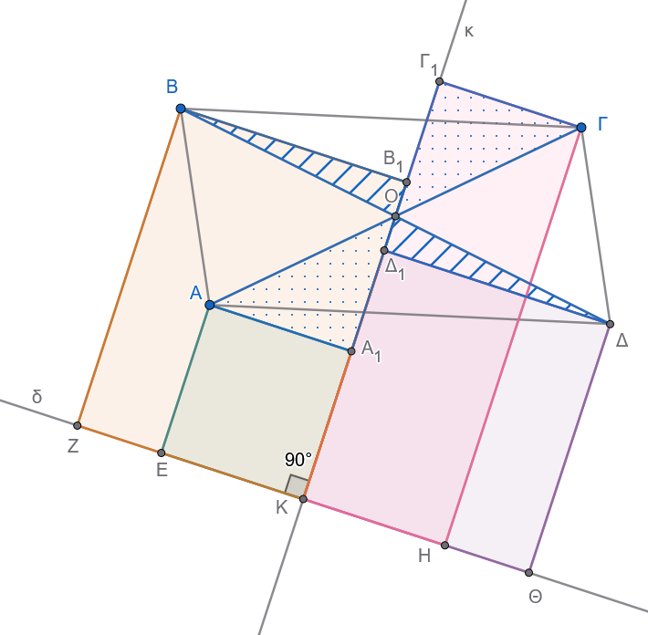{fig-align="center" width="500"}

> > > Εργαστείτε όπως και στην άσκηση 13

**14.** Σε παραλληλόγραμμο $AB\Gamma\Delta$ ισχύει ότι η γωνία $\widehat{A} = 2\widehat{\Delta}$ και η πλευρά $AB = 2AΔ$.
Να αποδείξετε ότι η γωνία $\widehat{A\Gamma B} = 90^\circ$.

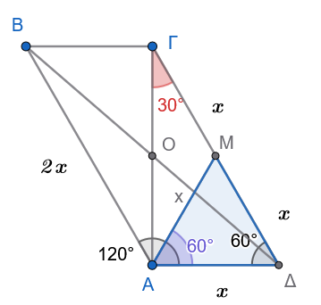{fig-align="center" width="300"}

:::: {.math-box .exercise-box}
::: {.math-title .exercise-title}
**Εκφώνηση**
:::
**15.** Δίνεται παραλληλόγραμμο $AB\Gamma\Delta$ και ένα τυχαίο σημείο $O$ της διαγωνίου του $A\Gamma$.
Από το $O$ φέρουμε τις παράλληλες προς τις πλευρές του παραλληλογράμμου, οι οποίες τέμνουν τις $AB, \Delta\Gamma$ στα σημεία $E, H$ και τις $B\Gamma, A\Delta$ στα σημεία $Z, \Theta$ αντίστοιχα.
Να αποδείξετε ότι οι ευθείες $E\Theta$ και $ZH$ είναι παράλληλες.
::::

:::: {.math-box .solution-box}
::: {.math-title .exercise-title}
**Λύση**

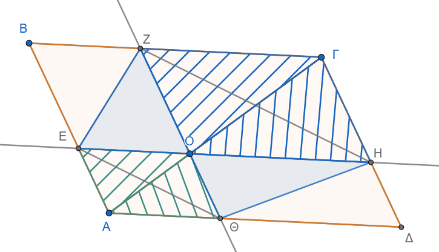{fig-align="center" width="500"}

**Απόδειξη με Εμβαδά**
:::
**1. Ισότητα των παραπληρωματικών παραλληλογράμμων**

Η διαγώνιος $A\Gamma$ χωρίζει το αρχικό παραλληλόγραμμο $AB\Gamma\Delta$ σε δύο ισεμβαδικά τρίγωνα: $$(AB\Gamma) = (A\Delta\Gamma)$$

Γύρω από τη διαγώνιο σχηματίζονται δύο μικρότερα παραλληλόγραμμα:

1.  Το $AE O \Theta$ με διαγώνιο την $AO$, άρα: $$(AEO) = (A\Theta O)$$ 

2.  Το $O Z \Gamma H$ με διαγώνιο την $O\Gamma$, άρα: $$(OZ\Gamma) = (OH\Gamma)$$

Αφαιρώντας τα εμβαδά αυτά από τα αρχικά τρίγωνα: $$(AB\Gamma) - (AEO) - (OZ\Gamma) = (A\Delta\Gamma) - (A\Theta O) - (OH\Gamma)$$

Προκύπτει ότι τα εναπομείναντα παραλληλόγραμμα $EBZO$ και $\Theta OH\Delta$ έχουν **ίσα εμβαδά**: $$(EBZO) = (\Theta OH\Delta)$$


**2. Ισότητα των επιμέρους τριγώνων**

- Η διαγώνιος $EZ$ χωρίζει το παραλληλόγραμμο $EBZO$ στη μέση, οπότε: $$(EOZ) = \frac{1}{2} (EBZO)$$

- Η διαγώνιος $\Theta H$ χωρίζει το παραλληλόγραμμο $\Theta OH\Delta$ στη μέση, οπότε: $$(\Theta OH) = \frac{1}{2} (\Theta OH\Delta)$$

Επειδή $(EBZO) = (\Theta OH\Delta)$, προκύπτει ότι: $$(EOZ) = (\Theta OH) \quad \text{(1)}$$


**3. Σύγκριση των τριγώνων $E\Theta Z$ και $E\Theta H$**

Προσθέτουμε και στα δύο μέλη της σχέσης (1) το εμβαδόν του κοινού τριγώνου $(E\Theta O)$: $$(EOZ) + (E\Theta O) = (\Theta OH) + (E\Theta O)$$

Παρατηρούμε από το σχήμα ότι: 

* $(EOZ) + (E\Theta O) = (E\Theta Z)$ 

* $(\Theta OH) + (E\Theta O) = (E\Theta H)$

Επομένως: $$(E\Theta Z) = (E\Theta H)$$

**4. Τελικό Συμπέρασμα**

Τα τρίγωνα $\triangle E\Theta Z$ και $\triangle E\Theta H$: 

1.  Έχουν την **ίδια βάση** $E\Theta$.
2.  Βρίσκονται προς το **ίδιο μέρος** της ευθείας $E\Theta$.
3.  Έχουν **ίσα εμβαδά**.

Αφού έχουν κοινή βάση και ίσα εμβαδά, τα αντίστοιχα ύψη τους προς την $E\Theta$ είναι ίσα.

Αυτό σημαίνει ότι οι κορυφές $Z$ και $H$ ισαπέχουν από την ευθεία $E\Theta$, επομένως:

$$E\Theta \parallel ZH$$
::::

------------------------------------------------------------------------

::: {.callout-important title="ΣΑΣ ΕΥΧΟΜΑΙ"}
ΚΑΛΗ ΜΕΛΕΤΗ !!!
:::
