```{=html}
<!-- Φόρτωση βιβλιοθήκης GeoGebra -->
<script src="https://www.geogebra.org/apps/deployggb.js"></script>

<!-- Συνάρτηση δημιουργίας applets -->
<script>
function createGeoGebra(containerId, materialId, width = 700, height = 500) {
  var params = {
    "id": "ggb-" + containerId,
    "material_id": materialId,
    "width": width,
    "height": height,
    "showToolBar": true,
    "showMenuBar": false,
    "showAlgebraInput": true
  };
  
  var applet = new GGBApplet(params, '5.2');
  applet.inject(containerId);
}
</script>
```

## Είδη παραλληλογράμμων

### Ορθογώνιο

:::: {.math-box .definition-box}
::: {.math-title .definition-title}
#### **Ορισμός**

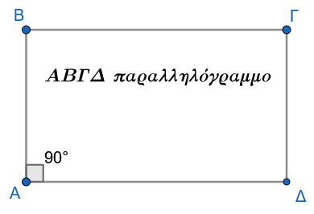{fig-align="center" width="300"}
:::

**Ορθογώνιο** ονομάζεται το παραλληλόγραμμο το οποίο έχει μία γωνία ορθή.
::::

::: callout-note
Επειδή σε κάθε παραλληλόγραμμο οι απέναντι γωνίες είναι ίσες και οι διαδοχικές γωνίες είναι παραπληρωματικές, αν μία γωνία είναι ορθή ($90^\circ$), τότε αποδεικνύεται άμεσα ότι **όλες οι γωνίες του ορθογωνίου είναι ορθές**.
:::

------------------------------------------------------------------------

#### **Ιδιότητες & Αποδείξεις**

:::: {.math-box .property-box}
::: {.math-title .property-title}
**Ιδιότητα Ορθογωνίου**
:::

**Οι διαγώνιοι του ορθογωνίου είναι ίσες.**
::::

:::: {.math-box .propertyproof-box}
::: {.math-title .propertyproof-title}
**Απόδειξη:**

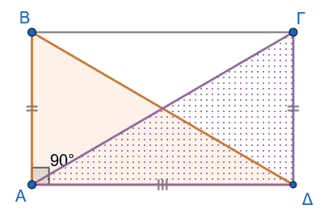{fig-align="center" width="350"}
:::

Έστω ορθογώνιο $AB\Gamma\Delta$ με $\widehat{A} = \widehat{B} = \widehat{\Gamma} = \widehat{\Delta} = 90^\circ$ και $AB = \Gamma\Delta$ (ως απέναντι πλευρές παραλληλογράμμου).
Θα αποδείξουμε ότι οι διαγώνιοι $A\Gamma$ και $B\Delta$ είναι ίσες.

Συγκρίνουμε τα ορθογώνια τρίγωνα $AB\Delta$ και $A\Delta\Gamma$ (ή $AB\Gamma$ και $BA\Delta$):

1.  Έχουν την πλευρά $A\Delta$ κοινή.

2.  $AB = \Delta\Gamma$, ως απέναντι πλευρές παραλληλογράμμου.

3.  $\widehat{A} = \widehat{\Delta} = 90^\circ$, από τον ορισμό του ορθογωνίου.

Σύμφωνα με το κριτήριο ισότητας ορθογώνιων τριγώνων (δύο κάθετες πλευρές ίσες μία προς μία), τα τρίγωνα $AB\Delta$ και $A\Delta\Gamma$ είναι ίσα.

Συνεπώς, θα έχουν και τις υποτείνουσές τους ίσες, δηλαδή: $$A\Gamma = B\Delta$$
::::

------------------------------------------------------------------------

#### **Κριτήρια & Αποδείξεις**

Ένα τετράπλευρο είναι ορθογώνιο αν ισχύει μία από τις παρακάτω προτάσεις:

:::: {.math-box .criteria-box}
::: {.math-title .criteria-title}
$1^o$ κριτήριο
:::

**Είναι παραλληλόγραμμο και έχει μία ορθή γωνία.**
::::

:::: {.math-box .criteriaproof-box}
::: {.math-title .criteriaproof-title}
**Απόδειξη:**
:::

Προκύπτει άμεσα από τον ορισμό του ορθογωνίου.
::::

:::: {.math-box .criteria-box}
::: {.math-title .criteria-title}
$2^ο$ κριτήριο
:::

**Είναι παραλληλόγραμμο και οι διαγώνιοί του είναι ίσες.**
::::

:::: {.math-box .criteriaproof-box}
::: {.math-title .criteriaproof-title}
**Απόδειξη:** Δείτε το **Σχήμα 1**
:::

Έστω παραλληλόγραμμο $AB\Gamma\Delta$ με $A\Gamma = B\Delta$.
Συγκρίνουμε τα τρίγωνα $AB\Delta$ και $A\Delta\Gamma$:

1.  $AB = \Delta\Gamma$ (ως απέναντι πλευρές παραλληλογράμμου).

2.  $A\Gamma = B\Delta$ (από υπόθεση).

3.  Η πλευρά $A\Delta$ είναι κοινή.

Κατά το κριτήριο **Πλευρά - Πλευρά - Πλευρά (Π-Π-Π)**, τα τρίγωνα $AB\Delta$ και $A\Delta\Gamma$ είναι ίσα.
Άρα, οι αντίστοιχες γωνίες τους είναι ίσες, δηλαδή: $$\widehat{A} = \widehat{\Delta}$$

Επειδή όμως οι γωνίες $\widehat{A}$ και $\widehat{\Delta}$ είναι διαδοχικές γωνίες παραλληλογράμμου, είναι παραπληρωματικές: $$\widehat{A} + \widehat{\Delta} = 180^\circ \Rightarrow 2\widehat{A} = 180^\circ \Rightarrow \widehat{A} = 90^\circ$$

Εφόσον το παραλληλόγραμμο έχει μία γωνία ορθή, είναι ορθογώνιο.
::::

:::: {.math-box .criteria-box}
::: {.math-title .criteria-title}
$3^ο$ κριτήριο
:::

**Έχει τρεις γωνίες ορθές.**
::::

:::: {.math-box .criteriaproof-box}
::: {.math-title .criteriaproof-title}
**Απόδειξη:**
:::

Έστω τετράπλευρο $AB\Gamma\Delta$ με $\widehat{A} = \widehat{B} = \widehat{\Gamma} = 90^\circ$.

Γνωρίζουμε ότι το άθροισμα των γωνιών κάθε κυρτού τετραπλεύρου ισούται με $360^\circ$: $$\widehat{A} + \widehat{B} + \widehat{\Gamma} + \widehat{\Delta} = 360^\circ \Rightarrow 90^\circ + 90^\circ + 90^\circ + \widehat{\Delta} = 360^\circ \Rightarrow \widehat{\Delta} = 90^\circ$$

Επειδή όλες οι γωνίες του τετραπλεύρου είναι ορθές, οι απέναντι γωνίες είναι ίσες ανά δύο ($\widehat{A}=\widehat{\Gamma}$ και $\widehat{B}=\widehat{\Delta}$), οπότε το τετράπλευρο είναι παραλληλόγραμμο.
Συνεπώς, είναι ορθογώνιο.
::::

------------------------------------------------------------------------

#### **Ασκήσεις**

1.  Σε παραλληλόγραμμο $AB\Gamma\Delta$ φέρουμε τις κάθετες $AE \perp \Delta\Gamma$ και $\Gamma Z \perp AB$. Να αποδείξετε ότι το $AZ\Gamma E$ είναι ορθογώνιο.

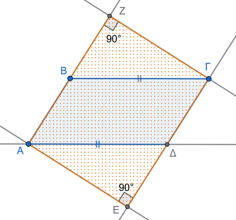{fig-align="center" width="350"}

2.  Δίνεται παραλληλόγραμμο $AB\Gamma\Delta$ με κέντρο $O$ και διαγωνίους που ικανοποιούν τη σχέση $B\Delta = 2A\Gamma$. Αν $E$ και $Z$ είναι τα μέσα των $OB$ και $O\Delta$ αντίστοιχα, να αποδείξετε ότι το $AE\Gamma Z$ είναι ορθογώνιο.

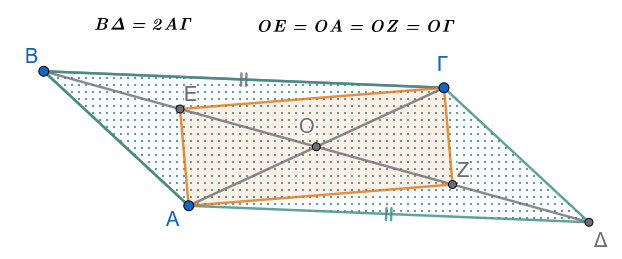{fig-align="center" width="450"}

:::: {.math-box .exercise-box}
::: {.math-title .exercise-title}
3.  **Εκφώνηση**
:::

Να αποδείξετε ότι αν οι εσωτερικές διχοτόμοι των γωνιών ενός παραλληλογράμμου δεν συντρέχουν, τότε τα σημεία τομής τους σχηματίζουν ορθογώνιο.
::::

:::: {.math-box .solution-box}
::: {.math-title .solution-title}
**Λύση**

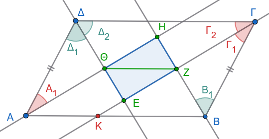{fig-align="center" width="450"}
:::

Θα δείξουμε ότι το τετράπλευρο $EZH\Theta$ είναι ορθογώνιο, αποδεικνύοντας ότι έχει τρεις γωνίες ορθές.

**Βήμα 1: Γωνία** $\hat{\Theta}$

Είναι γνωστό ότι οι διαδοχικές (γειτονικές) γωνίες παραλληλογράμμου είναι παραπληρωματικές.
Άρα: $$\hat{A} + \hat{\Delta} = 180^\circ \Rightarrow 2\hat{A}_1 + 2\hat{\Delta}_1 = 180^\circ \Rightarrow 2(\hat{A}_1 + \hat{\Delta}_1) = 180^\circ \Rightarrow \hat{A}_1 + \hat{\Delta}_1 = 90^\circ$$

Στο τρίγωνο $A\Theta\Delta$, το άθροισμα των γωνιών είναι $180^\circ$, οπότε: $$\hat{\Theta} = 180^\circ - (\hat{A}_1 + \hat{\Delta}_1) = 180^\circ - 90^\circ = 90^\circ \quad (1)$$

**Βήμα 2: Γωνία** $\hat{Z}$

Όμοια για τις γωνίες $\hat{B}$ και $\hat{\Gamma}$: $$\hat{B} + \hat{\Gamma} = 180^\circ \Rightarrow 2\hat{B}_1 + 2\hat{\Gamma}_1 = 180^\circ \Rightarrow \hat{B}_1 + \hat{\Gamma}_1 = 90^\circ$$

Από το τρίγωνο $ZB\Gamma$ προκύπτει: $$\hat{Z} = 90^\circ \quad (2)$$

**Βήμα 3: Γωνία** $\hat{E}$

Τέλος, για τις γωνίες $\hat{\Gamma}$ και $\hat{\Delta}$: $$\hat{\Gamma} + \hat{\Delta} = 180^\circ \Rightarrow 2\hat{\Gamma}_2 + 2\hat{\Delta}_2 = 180^\circ \Rightarrow \hat{\Gamma}_2 + \hat{\Delta}_2 = 90^\circ$$ Από το τρίγωνο $E\Gamma\Delta$ προκύπτει: $$\hat{E} = 90^\circ \quad (3)$$

**Συμπέρασμα** Από τις σχέσεις (1), (2) και (3), το τετράπλευρο $EZH\Theta$ έχει τρεις γωνίες ορθές, άρα είναι **ορθογώνιο**.
::::

:::: {.math-box .exercise-box}
::: {.math-title .exercise-title}
4.  **Εκφώνηση**
:::

Στο προηγούμενο σχήμα, να δείξετε ότι $\Gamma Z = ZK = A\Theta$ και να εξηγήσετε γιατί η διαγώνιος $\Theta Z$ του ορθογωνίου $EZH\Theta$ είναι παράλληλη προς την $AB$.
::::

:::: {.math-box .solution-box}
::: {.math-title .solution-title}
**Λύση**
:::

**α) Απόδειξη της ισότητας** $\Gamma Z = ZK = A\Theta$

1.  Στο τρίγωνο $KB\Gamma$, η $BZ$ είναι διχοτόμος (από υπόθεση) και ύψος (αφού $\hat{Z} = 90^\circ$ άρα $BZ \perp K\Gamma$).
    Επομένως, το τρίγωνο $KB\Gamma$ είναι **ισοσκελές**.
    Άρα η $BZ$ είναι και διάμεσος, οπότε: $$\Gamma Z = ZK \quad (1)$$

2.  Συγκρίνουμε τα ορθογώνια τρίγωνα $\Gamma ZB$ και $\Delta\Theta A$:

    - $\hat{\Theta} = \hat{Z} = 90^\circ$
    - $A\Delta = B\Gamma$ (ως απέναντι πλευρές παραλληλογράμμου)
    - $\hat{\Gamma}_1 = \hat{A}_1$ (ως μισά των ίσων απέναντι γωνιών $\hat{\Gamma}$ και $\hat{A}$ του παραλληλογράμμου)

    Τα τρίγωνα είναι ίσα, άρα οι αντίστοιχες πλευρές τους είναι ίσες: $$A\Theta = \Gamma Z \quad (2)$$

Από τις σχέσεις (1) και (2) προκύπτει: $\Gamma Z = ZK = A\Theta$.

**β) Απόδειξη της παραλληλίας** $\Theta Z \parallel AB$

Θεωρούμε το τετράπλευρο $AKZ\Theta$.
Σε αυτό:

- Οι πλευρές $A\Theta$ και $KZ$ είναι ίσες ($A\Theta = KZ$ από το προηγούμενο ερώτημα).
- Οι πλευρές $A\Theta$ και $KZ$ είναι παράλληλες, διότι ανήκουν στις παράλληλες ευθείες των διχοτόμων (το $EZH\Theta$ είναι ορθογώνιο παραλληλόγραμμο, άρα $\Theta H \parallel EZ$).

Επομένως, το $AKZ\Theta$ είναι **παραλληλόγραμμο**.

Αφού είναι παραλληλόγραμμο, οι απέναντι πλευρές του είναι παράλληλες: $$\Theta Z \parallel AK \Rightarrow \Theta Z \parallel AB$$

*Σημείωση: Με όμοιο τρόπο αποδεικνύεται ότι* $HE \parallel B\Gamma$.
::::

5.  Σε ορθογώνιο τρίγωνο $AB\Gamma$ ($\widehat{A}=90^\circ$) με $\widehat{B} > \widehat{\Gamma}$ φέρουμε τη διάμεσό του $AM$ και το ύψος του $A\Delta$.
    Να αποδείξετε ότι η γωνία $\widehat{M\!A\Delta}$ ικανοποιεί τη σχέση: $$\widehat{M\!A\Delta} = \widehat{B} - \widehat{\Gamma}$$

6.  Δίνεται ορθογώνιο τρίγωνο $ΠΡΣ$ ($\widehat{Π}=90^\circ$) και το ύψος του $ΠΤ$.
    Αν $Κ$ και $Λ$ είναι τα μέσα των πλευρών $ΠΡ$ και $ΠΣ$ αντίστοιχα, να αποδείξετε ότι: $$\widehat{ΚΤΣ} = \widehat{Π} = 90^\circ$$

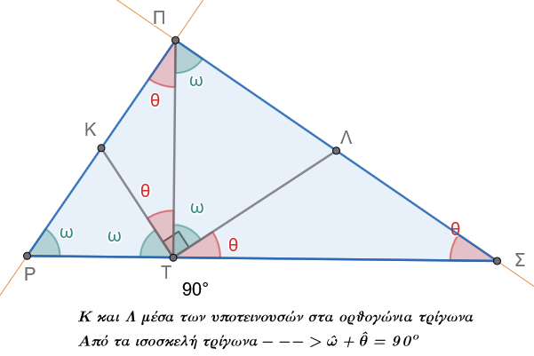{fig-align="center" width="450"}

7.  Δύο παραλληλόγραμμα $ΑΒΓΔ$ και $ΑΒΕΖ$ έχουν την πλευρά $ΑΒ$ κοινή. Ν’ αποδείξετε ότι το τετράπλευρο $ΓΔΖΕ$ είναι παραλληλόγραμμο.

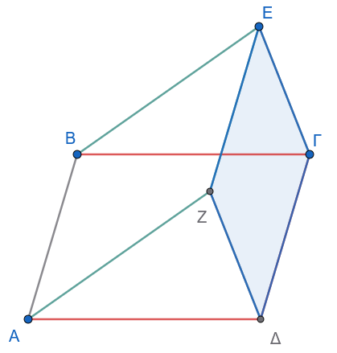{fig-align="center" width="350"}

8.  Δίδεται το παραλληλόγραμμο $ΑΒΓΔ$ και τα σημεία Ε, Ζ, Η, θ πάνω στις προεκτάσεις των ΑΒ, ΒΓ, ΓΔ, ΔΑ αντίστοιχα, έτσι ώστε $ΒΕ = ΔΗ$ καί $ΓΖ = ΑΘ$. Ν’ αποδειχθεί ότι το τετράπλευρο $ΕΖΗΘ$ είναι παραλληλόγραμμο.

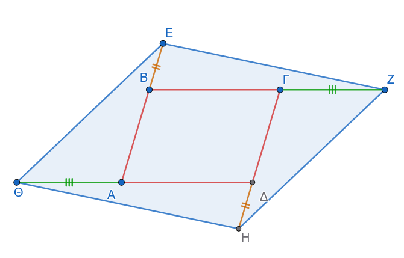{fig-align="center" width="500"}

:::: {.math-box .exercise-box}
::: {.math-title .exercise-title}
9.  **Εκφώνηση**
:::

Φέρουμε το ύψος ΑΔ ενός ορθογωνίου τριγώνου $ΑΒΓ$ και ενώνουμε τυχόν σημείο αυτού Ε με την κορυφή Γ του τριγώνου.
Στο σημείο Ε της ΑΔ φέρουμε την κάθετη στην ΕΓ, η οποία συναντά την προέκταση τής ΒΑ στο σημείο Ζ.
’Από το Α φέρουμε την παράλληλη ευθεία προς την ΖΕ, η οποία συναντά την ΒΓ στο Η.
Ν’ αποδειχθεί ότι το τετράπλευρο $ΑΗΕΖ$ είναι παραλληλόγραμμο.
::::

:::: {.math-box .solution-box}
::: {.math-title .solution-title}
**Λύση**

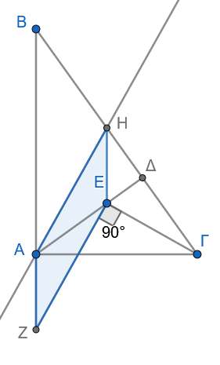{fig-align="center" width="220"}
:::

’Επειδή $ΑΗ//ΖΕ$, θα προσπαθήσουμε ν’ αποδείξουμε ή ότι $AH = ΖΕ$ ή ότι $ΑΖ//ΗΕ$.

Έτσι στην πρώτη περίπτωση το τετράπλευρο ΑΗΕΖ θα έχει δύο απέναντι πλευρές ίσες και παράλληλες, ενώ στη δεύτερη περίπτωση το τετράπλευρο αυτό θα έχει τις απέναντι πλευρές παράλληλες, οπότε και στις δύο περιπτώσεις θα είναι παραλληλόγραμμο.

Αποδεικνύουμε ότι $ΑΖ//ΗΕ$.

’Επειδή $ΑΖ\perp ΑΓ$, πρέπει να είναι και $ΗΕ\perp ΑΓ$, δηλ.
h Ηθ θα είναι ύψος του τριγώνου $ΑΗΓ$.

’Αρκεί επομένως το Ε να είναι το ορθόκεντρο του τριγώνου $ΑΗΓ$.

Πράγματι, $ΑΗ//ΖΕ$ και $ΖΕ\perpΓΕ \Rightarrow ΑΗ\perpΓΕ \Rightarrow ΓΚ$ ύψος του τριγώνου $ΑΗΓ$, αλλά και $ΑΔ$ ύψος του τριγώνου αυτού, οπότε το σημείο τομής Ε των ΓΚ και ΑΔ είναι το ορθόκεντρο του τριγώνου $ΑΗΓ$.

Επομένως $ΗΕ\perpΑΓ \Rightarrow ΗΕ//ΑΖ$.
::::

:::: {.math-box .exercise-box}
::: {.math-title .exercise-title}
10. **Εκφώνηση**
:::

Από τη κορυφή Α παραλληλογράμμου ΑΒΓΔ διέρχεται ευθεία (ε) πού δεν τέμνει αυτό.
Δείξετε ότι το άθροισμα των αποστάσεων των κορυφών Β και Δ από την (ε), ισούται με την απόσταση τής κορυφής Γ.
::::

:::: {.math-box .solution-box}
::: {.math-title .solution-title}
**Λύση**

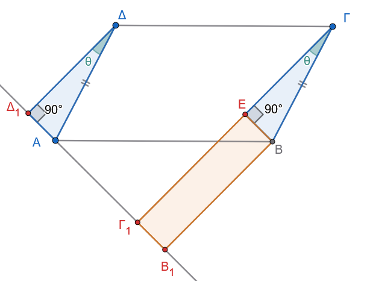{fig-align="center" width="500"}
:::

Θα δείξουμε ότι $ΔΔ_1+ΒΒ_1=ΓΓ_1$,

Από το Β φέρνουμε την $ΒΕ\perp ΓΓ_1$ , οπότε το τετράπλευρο $ΕΓ_1Β_1Β$ έχει 3 γωνίες ορθές άρα είναι ορθογώνιο (παραλλ/μμο ) =\> $ΒΒ_1 = ΕΓ_1$ (1)

Συγκρίνουμε τα ορθογώνια τρίγωνα $ΔΔ_1Α$, και $ΓΕΒ$ έχουν:

- $\hatΔ_1=\hatΕ=90^ο$
- $ΔΑ=ΒΓ$ σαν απέναντι, πλευρές παραλληλογράμμου.
- και $\hatΔ=\hatΓ = \hat θ$ (πλευρές παράλληλες)

= \> τα τρίγωνα είναι ίσα =\> $ΔΔ_1=ΓΕ$ (2)

Με πρόσθεση των (1) και (2) έχουμε: $ΒΒ_1+ΔΔ_1 = ΓΕ_1+ΕΓ$ =\> (με σύμπτυξη) $ΒΒ_1+ΔΔ_1 = ΓΓ_1$.
::::

:::: {.math-box .exercise-box}
::: {.math-title .exercise-title}
11. **Εκφώνηση**
:::

Δίνονται δύο παράλληλες και ομόρροπες ημιευθείες $Ax$ και $By$ και ένα τυχαίο σημείο $\Gamma$ του τμήματος $AB$.
Πάνω στις ημιευθείες παίρνουμε τμήματα $AE=A\Gamma$ και $B\Delta=B\Gamma$.
Αν $M$ είναι το μέσο του $E\Delta$, να δείξετε ότι:

(α) $AM \perp \Gamma E$ και $MB \perp \Gamma\Delta$

(β) $\widehat{AMB} = 90^\circ$ (ή $1L$)
::::

:::: {.math-box .solution-box}
::: {.math-title .solution-title}
**Λύση**

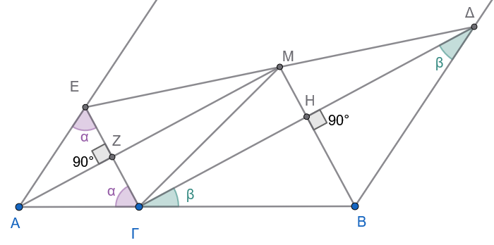{fig-align="center" width="500"}
:::

Θα δείξουμε αρχικά ότι η γωνία $\widehat{E\Gamma\Delta} = 90^\circ$.

Από την υπόθεση έχουμε:

1.  Το τρίγωνο $AE\Gamma$ είναι ισοσκελές ($AE=A\Gamma$), άρα $\widehat{AE\Gamma} = \widehat{A\Gamma E} = \alpha$.
    Το άθροισμα των γωνιών του είναι $180^\circ$, οπότε $\widehat{A} = 180^\circ - 2\alpha$.

2.  Το τρίγωνο $B\Gamma\Delta$ είναι ισοσκελές ($B\Gamma=B\Delta$), άρα $\widehat{\Delta\Gamma B} = \widehat{B\Delta\Gamma} = \beta$.
    Αντίστοιχα, $\widehat{B} = 180^\circ - 2\beta$.

Επειδή $Ax \parallel By$, οι γωνίες $\widehat{A}$ και $\widehat{B}$ είναι **εντός και επί τα αυτά μέρη**, άρα παραπληρωματικές: $$\widehat{A} + \widehat{B} = 180^\circ \Rightarrow (180^\circ - 2\alpha) + (180^\circ - 2\beta) = 180^\circ$$ $$360^\circ - 2\alpha - 2\beta = 180^\circ \Rightarrow 180^\circ = 2(\alpha + \beta) \Rightarrow \alpha + \beta = 90^\circ$$

Επειδή το σημείο $\Gamma$ ανήκει στην $AB$, η γωνία $\widehat{A\Gamma B}$ είναι ευθεία ($180^\circ$).

Επομένως: $$\widehat{E\Gamma\Delta} = 180^\circ - (\alpha + \beta) = 180^\circ - 90^\circ = 90^\circ$$

------------------------------------------------------------------------

**(α) Απόδειξη καθετότητας**

Αφού $\widehat{E\Gamma\Delta} = 90^\circ$, το τρίγωνο $E\Gamma\Delta$ είναι ορθογώνιο.

Η $\Gamma M$ είναι η διάμεσος που αντιστοιχεί στην υποτείνουσα $E\Delta$.

Από την ιδιότητα του ορθογωνίου τριγώνου: $$\Gamma M = \frac{E\Delta}{2} = ME$$

Στο τρίγωνο $AM\Gamma E$:

- $AE = A\Gamma$ (από υπόθεση)
- $ME = M\Gamma$ (μόλις αποδείχθηκε)

Η ευθεία $AM$ είναι η **μεσοκάθετος** του τμήματος $E\Gamma$ (αφού τα $A$ και $M$ ισαπέχουν από τα άκρα του).

Επομένως: $AM \perp E\Gamma$

Όμοια, στο τρίγωνο $\Delta\Gamma B$:

- $B\Gamma = B\Delta$ (από υπόθεση)
- $M\Delta = M\Gamma$ (αφού $M$ μέσο της υποτείνουσας)

Η ευθεία $MB$ είναι η μεσοκάθετος του τμήματος $\Gamma\Delta$.

Επομένως: $MB \perp \Gamma\Delta$

------------------------------------------------------------------------

**(β) Απόδειξη** $\widehat{AMB} = 90^\circ$

Ας ονομάσουμε $Z$ το σημείο τομής της $AM$ με την $E\Gamma$ και $H$ το σημείο τομής της $MB$ με την $\Gamma\Delta$.

Στο τετράπλευρο $Z\Gamma HM$:

1.  $\widehat{Z} = 90^\circ$ (από τη σχέση $AM \perp E\Gamma$)
2.  $\widehat{H} = 90^\circ$ (από τη σχέση $MB \perp \Gamma\Delta$)
3.  $\widehat{E\Gamma\Delta} = 90^\circ$ (αποδείχθηκε στην αρχή)

Ένα τετράπλευρο με τρεις ορθές γωνίες είναι **ορθογώνιο**.

Επομένως και η τέταρτη γωνία του είναι ορθή: $$\widehat{ZMH} = 90^\circ \Rightarrow \widehat{AMB} = 90^\circ$$
::::

:::: {.math-box .exercise-box}
::: {.math-title .exercise-title}
12. **Εκφώνηση**
:::

Δύο ορθογώνια παραλληλόγραμμα $ΑΒΓΔ$ και $ΑΕΓΖ$ έχουν τη διαγώνιο $ΑΓ$ κοινή.
Να αποδειχθεί ότι το τετράπλευρο $ΒΕ\Delta Ζ$ είναι επίσης ορθογώνιο παραλληλόγραμμο.
::::

:::: {.math-box .solution-box}
::: {.math-title .solution-title}
**Λύση**

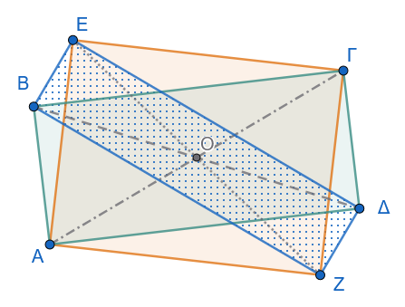{fig-align="center" width="400"}
:::

Από τις ιδιότητες των ορθογωνίων παραλληλογράμμων γνωρίζουμε ότι:

1.  **Στο ορθογώνιο** $ΑΒΓΔ$:

    - Οι διαγώνιοί του $ΑΓ$ και $Β\Delta$ είναι ίσες: $$ΑΓ = Β\Delta$$

    - Οι διαγώνιοι διχοτομούνται στο μέσο τους $Ο$, δηλαδή το $Ο$ είναι το μέσο των $ΑΓ$ και $Β\Delta$.

2.  **Στο ορθογώνιο** $ΑΕΓΖ$:

    - Οι διαγώνιοί του $ΑΓ$ και $ΕΖ$ είναι ίσες: $$ΑΓ = ΕΖ$$

    - Οι διαγώνιοι διχοτομούνται στο μέσο τους, το οποίο είναι και πάλι το μέσο $Ο$ της κοινής διαγωνίου $ΑΓ$.

------------------------------------------------------------------------

**Συμπέρασμα για το τετράπλευρο** $ΒΕ\Delta Ζ$

Εξετάζουμε τα ευθύγραμμα τμήματα $Β\Delta$ και $ΕΖ$, τα οποία αποτελούν τις διαγωνίους του τετραπλεύρου $ΒΕ\Delta Ζ$:

- **Διχοτόμηση διαγωνίων:** Τα τμήματα $Β\Delta$ και $ΕΖ$ έχουν κοινό μέσο το σημείο $Ο$ (διχοτομούνται). Επομένως, το τετράπλευρο $ΒΕ\Delta Ζ$ είναι **παραλληλόγραμμο**.
- **Ισότητα διαγωνίων:** Επειδή $Β\Delta = ΑΓ$ και $ΕΖ = ΑΓ$, προκύπτει ότι: $$Β\Delta = ΕΖ$$

Καθώς το παραλληλόγραμμο $ΒΕ\Delta Ζ$ έχει ίσες διαγώνιες, συμπεραίνουμε ότι είναι **ορθογώνιο παραλληλόγραμμο**.
::::

------------------------------------------------------------------------

### Ρόμβος

:::: {.math-box .definition-box}
::: {.math-title .definition-title}
#### **Ορισμός**

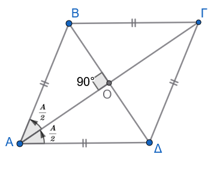{fig-align="center" width="300"}
:::

**Ρόμβος** ονομάζεται το παραλληλόγραμμο το οποίο έχει δύο διαδοχικές πλευρές ίσες.
::::

::: callout-note
Επειδή σε κάθε παραλληλόγραμμο οι απέναντι πλευρές είναι ίσες, αν δύο διαδοχικές πλευρές είναι ίσες, τότε προκύπτει άμεσα ότι **όλες οι πλευρές του ρόμβου είναι ίσες**.
:::

------------------------------------------------------------------------

#### **Ιδιότητες & Αποδείξεις**

Σε κάθε ρόμβο ισχύουν οι εξής επιπλέον ιδιότητες:

:::: {.math-box .property-box}
::: {.math-title .property-title}
$\mathbf{1^η}$ **ιδιότητα**
:::

**Οι διαγώνιοί του τέμνονται κάθετα**.
Δείτε το Σχήμα 2
::::

:::: {.math-box .property-box}
::: {.math-title .property-title}
$\mathbf{2^η}$ ιδιότητα
:::

**Οι διαγώνιοί του διχοτομούν τις γωνίες του**.
Δείτε το Σχήμα 2
::::

:::: {.math-box .propertyproof-box}
::: {.math-title .propertyproof-title}
**Απόδειξη των ιδιοτήτων 1 και 2:**

{fig-align="center" width="300"}
:::

Έστω ρόμβος $AB\Gamma\Delta$ και $O$ το σημείο τομής των διαγωνίων του.

1.  Από τον ορισμό του ρόμβου, έχουμε $AB = A\Delta$. Συνεπώς, το τρίγωνο $AB\Delta$ είναι ισοσκελές με κορυφή το $A$.
2.  Επειδή ο ρόμβος είναι και παραλληλόγραμμο, οι διαγώνιοί του διχοτομούνται, άρα το $O$ είναι το μέσο της διαγωνίου $B\Delta$.
3.  Στο ισοσκελές τρίγωνο $AB\Delta$, το ευθύγραμμο τμήμα $AO$ είναι η διάμεσος που αντιστοιχεί στη βάση $B\Delta$.
4.  Γνωρίζουμε ότι η διάμεσος που αντιστοιχεί στη βάση ισοσκελούς τριγώνου είναι ταυτόχρονα ύψος και διχοτόμος της γωνίας της κορυφής.

Συνεπώς:

- Το $AO$ είναι ύψος, δηλαδή $A\Gamma \perp B\Delta$ (οι διαγώνιοι τέμνονται κάθετα).
- Το $AO$ είναι διχοτόμος, δηλαδή η διαγώνιος $A\Gamma$ διχοτομεί τη γωνία $\widehat{A}$.
- Με τον ίδιο ακριβώς τρόπο (λόγω συμμετρίας ή με σύγκριση των αντίστοιχων ισοσκελών τριγώνων) αποδεικνύεται ότι η $A\Gamma$ διχοτομεί τη γωνία $\widehat{\Gamma}$ και η $B\Delta$ διχοτομεί τις γωνίες $\widehat{B}$ και $\widehat{\Delta}$.
::::

------------------------------------------------------------------------

#### **Κριτήρια & Αποδείξεις**

Ένα τετράπλευρο είναι ρόμβος αν ικανοποιεί μία από τις παρακάτω ικανές και αναγκαίες συνθήκες:

:::: {.math-box .criteria-box}
::: {.math-title .criteria-title}
$\mathbf{1^ο}$ **κριτήριο**
:::

**Έχει όλες τις πλευρές του ίσες.**
::::

:::: {.math-box .criteriaproof-box}
::: {.math-title .criteriaproof-title}
**Απόδειξη:**
:::

Προκύπτει άμεσα, καθώς αν όλες οι πλευρές είναι ίσες, οι απέναντι πλευρές είναι ίσες ανά δύο (άρα είναι παραλληλόγραμμο) και δύο διαδοχικές πλευρές είναι ίσες (άρα είναι ρόμβος).
::::

:::: {.math-box .criteria-box}
::: {.math-title .criteria-title}
$\mathbf{2^ο}$ **κριτήριο**
:::

**Είναι παραλληλόγραμμο και δύο διαδοχικές πλευρές του είναι ίσες.**
::::

:::: {.math-box .criteriaproof-box}
::: {.math-title .criteriaproof-title}
**Απόδειξη:**
:::

Προκύπτει άμεσα από τον ορισμό του ρόμβου.
::::

:::: {.math-box .criteria-box}
::: {.math-title .criteria-title}
$\mathbf{3^ο}$ **κριτήριο**
:::

**Είναι παραλληλόγραμμο και οι διαγώνιοί του τέμνονται κάθετα.**
::::

:::: {.math-box .criteriaproof-box}
::: {.math-title .criteriaproof-title}
**Απόδειξη:**
:::

Έστω παραλληλόγραμμο $AB\Gamma\Delta$ με $A\Gamma \perp B\Delta$, και $O$ το σημείο τομής των διαγωνίων του.
Στο τρίγωνο $AB\Delta$, το τμήμα $AO$ είναι:

1.  **Διάμεσος**, διότι οι διαγώνιοι του παραλληλογράμμου διχοτομούνται, άρα $OB = O\Delta$.
2.  **Ύψος**, διότι οι διαγώνιοι τέμνονται κάθετα ($A\Gamma \perp B\Delta$).

Επειδή η διάμεσος $AO$ είναι και ύψος, το τρίγωνο $AB\Delta$ είναι ισοσκελές με $AB = A\Delta$.

Συνεπώς, το παραλληλόγραμμο $AB\Gamma\Delta$ έχει δύο διαδοχικές πλευρές ίσες, άρα είναι ρόμβος.
::::

:::: {.math-box .criteria-box}
::: {.math-title .criteria-title}
$\mathbf{4^ο}$ **κριτήριο**
:::

**Είναι παραλληλόγραμμο και μία διαγώνιός του διχοτομεί μία γωνία του.**
::::

:::: {.math-box .criteriaproof-box}
::: {.math-title .criteriaproof-title}
**Απόδειξη:**
:::

Έστω παραλληλόγραμμο $AB\Gamma\Delta$ στο οποίο η διαγώνιος $A\Gamma$ διχοτομεί τη γωνία $\widehat{A}$.

Στο τρίγωνο $AB\Delta$, η $AO$ είναι:

1.  **Διάμεσος**, καθώς οι διαγώνιοι διχοτομούνται ($OB = O\Delta$).
2.  **Διχοτόμος**, από την υπόθεση.

Εφόσον η διχοτόμος $AO$ είναι και διάμεσος, το τρίγωνο $AB\Delta$ είναι ισοσκελές με $AB = A\Delta$.

Άρα, το παραλληλόγραμμο έχει δύο διαδοχικές πλευρές ίσες, οπότε είναι ρόμβος.
::::

------------------------------------------------------------------------

#### **Ασκήσεις**

1.  Να αποδείξετε ότι ένα παραλληλόγραμμο είναι ρόμβος αν και μόνο αν οι κάθετες αποστάσεις των απέναντι πλευρών του είναι ίσες.

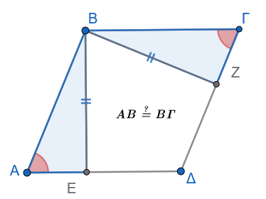{fig-align="center" width="300"}

2.  Δίνεται τρίγωνο $AB\Gamma$, η διχοτόμος του $B\Delta$ και $M$ το μέσο της $B\Delta$. Από το $\Delta$ φέρουμε παράλληλη προς τη $B\Gamma$, η οποία τέμνει την $AB$ στο $E$. Αν η ευθεία $EM$ τέμνει τη $B\Gamma$ στο $Z$, να αποδείξετε ότι το τετράπλευρο $\Delta E B Z$ είναι ρόμβος.

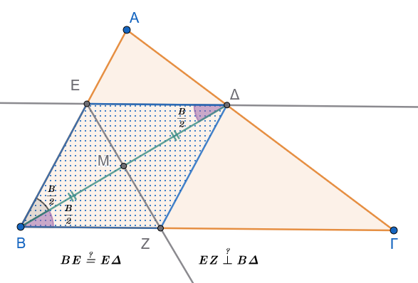{fig-align="center" width="450"}

3.  Σε ορθογώνιο $AB\Gamma\Delta$, τα σημεία $E$ και $Z$ είναι τα μέσα των $A\Delta$ και $B\Gamma$ αντίστοιχα. Αν $H$ είναι το σημείο τομής των $AZ$ και $BE$, και $\Theta$ το σημείο τομής των $\Delta Z$ και $\Gamma E$, να αποδείξετε ότι το τετράπλευρο $E\Theta Z H$ είναι ρόμβος.

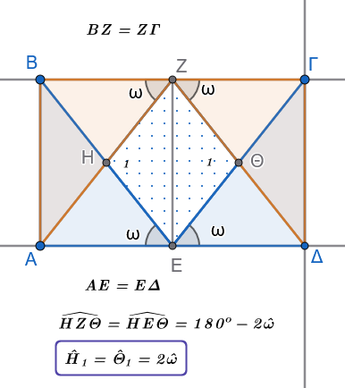{fig-align="center" width="300"}

4.  Δίνεται ορθογώνιο τρίγωνο $AB\Gamma$ ($\widehat{A}=90^\circ$) με $\widehat{B} = 30^\circ$ και $\Delta, E$ τα μέσα των πλευρών $AB$ και $B\Gamma$ αντίστοιχα.
    Προεκτείνουμε την $E\Delta$ κατά τμήμα $\Delta Z = E\Delta$.
    Να αποδείξετε

    α.
    ότι το τετράπλευρο $A\Gamma E Z$ είναι ρόμβος.

    β.
    το τετράπλευρο ΒΖΑΕ είναι ρόμβος.

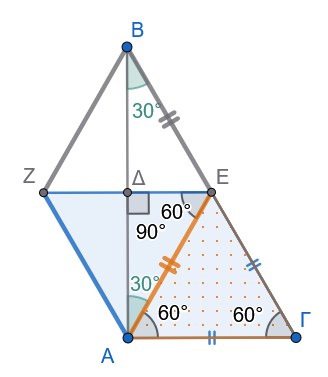{fig-align="center" width="280"}

5.  Να αποδείξετε ότι αν ένας ρόμβος έχει τις κορυφές του πάνω σε κύκλο, τότε είναι τετράγωνο.

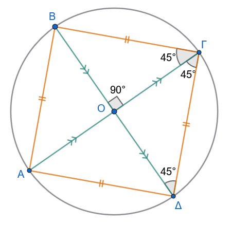{fig-align="center" width="350"}

:::: {.math-box .exercise-box}
::: {.math-title .exercise-title}
6.  **Εκφώνηση**
:::

Από τα άκρα μιας εκ των διαγωνίων ρόμβου φέρουμε τις κάθετες ευθείες προς τις πλευρές του.
Να αποδείξετε ότι:

α.
οι κάθετες αυτές τέμνονται σε τέσσερα σημεία τα οποία αποτελούν κορυφές ενός νέου ρόμβου $ΒΕΔΖ$.

β.
Το $ΚΗΘΙ$ είναι ορθογώνιο.

γ.
Το $ΛΜΝΞ$ είναι ορθογώνιο.
::::

:::: {.math-box .solution-box}
::: {.math-title .solution-title}
**Λύση**

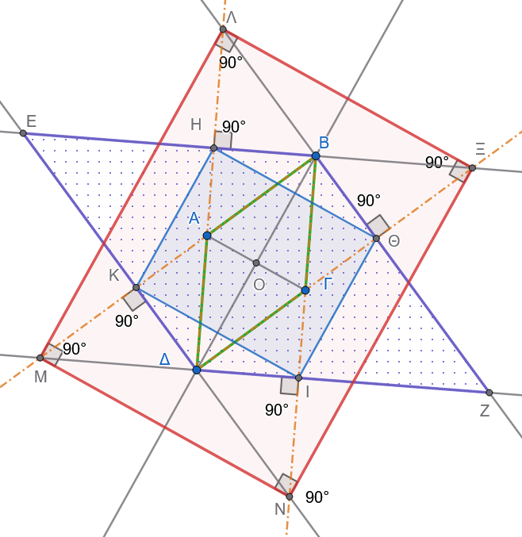{fig-align="center" width="500"}
:::

α.
Στον ρόμβο $ΑΒΓΔ$ ισχύει ότι οι απέναντι πλευρές είναι παράλληλες: $$ΑΒ \parallel ΓΔ \quad \text{και} \quad ΑΔ \parallel ΒΓ$$ Επομένως:

Οι ευθείες που είναι κάθετες στην $ΑΒ$ είναι ταυτόχρονα κάθετες και στην $ΓΔ$.
Οι ευθείες που είναι κάθετες στην $ΑΔ$ είναι ταυτόχρονα κάθετες και στην $ΒΓ$.

Άρα οι ΒΗ και ΔΙ είναι κάθετες στις παράλληλες ΔΗ και ΒΙ θα είναι και μεταξύ τους παράλληλες.
$$ΒΗ//ΔΙ  \ \ \ \ \ (1)$$

Αυτό σημαίνει ότι το ΗΔΙΒ είναι ορθογώνιο και άρα $$ΒΗ=//ΔΙ  \ \ \text{και} \  \ ΕΒ//ΔΖ \ \  \ (2)$$

Όμοια αποδεικνύεται ότι $$ΒΘ=//ΚΔ  \ \text{και} \ \ ΒΖ//ΕΔ \ \ \ (3)$$

Άρα $ΕΒΖΔ$ παραλληλόγραμμο.

Πρέπει να αποδείξουμε εκτός από την παραλληλία των πλευρών και την ισότητα δυο διαδοχικών πλευρών π.χ.
ΕΒ=ΒΖ

$\triangle ΔΗΒ=\triangle ΔΒΘ$ (γιατί;) Ορθογώνια με μία οξεία γωνία ίση $\widehat{ΗΔΒ}=\widehat{ΒΔΙ}$ γιατί ΔΒ διχοτόμος της $\widehat{ΑΔΓ} \Rightarrow \widehat{HBΔ}=\widehat{ΔΒΘ}$

Αφού $\widehat{ΑΒΟ}= \widehat{ΟΒΓ} \Rightarrow \widehat{ΗΒΑ} = \widehat{ΓΒΘ} \Rightarrow \triangle ΕΒΚ = \triangle ΒΙΖ \Rightarrow$ $$ΙΖ=ΕΗ \  \  \   \ (4)$$ Προσθέτοντας τις (2) και (4) έχουμε $ΕΒ=ΒΖ$

β.
**Αναλυτική Απόδειξη για το ερώτημα β (**$ΚΗΘΙ$ είναι ορθογώνιο):

**Βήμα 1: Τα τρίγωνα** $\triangle ΕΚΗ$ και $\triangle ΒΗΘ$ είναι ισοσκελή

- Στον ρόμβο $ΒΕΔΖ$ (από το ερώτημα α) έχουμε $ΕΒ = ΕΔ = ΔΖ = ΖΒ$.
- $\widehat{ΑΒΗ}=\widehat{ΓΒΘ}$ επειδή έχουν κάθετες πλευρές.
- $ΑΒ=ΒΓ$ από τον ρόμβο.
  - Σημαίνει ότι $\overset{\triangle}{ΑΗΒ}=\overset{\triangle}{ΓΒΘ}$. Αρα $ΗΒ=ΒΘ \ \ \text{και} \ \ \overset{\triangle}{ΗΒΘ} \ \ \text{ισοσκελές} \ \ (5)$
  - Από τη (3) και την (5) έχουμε : $ΚΕ=ΑΕ-ΚΔ$ και $ΕΗ=ΕΒ-ΗΒ$, άρα $ΚΕ=ΕΗ$ δηλαδή $\overset{\triangle}{ΚΕΗ}$ ισοσκελές.
- $\overset{\triangle}{ΔΗΒ}=\overset{\triangle}{ΔΒΘ}$ γιατί έχουν κοινή υποτείνουσα και η ΔΒ είναι διχοτόμος τηε $\widehat{ΑΔΓ}$ , Άρα ΒΗ=ΒΘ και επομένως $\overset{\triangle}{ΗΒΘ}$ ισοσκελές.

**Βήμα 2: Υπολογισμός των προσκείμενων στη βάση γωνιών**

Από τα ισοσκελή τρίγωνα, οι γωνίες της βάσης ισούνται με:

- Στο $\triangle ΕΚΗ$: $$\widehat{ΕΗΚ} = \widehat{ΕΚΗ} = \frac{180^\circ - \hat{E}}{2}$$

- Στο $\triangle ΒΗΘ$: $$\widehat{ΒΗΘ} = \widehat{ΒΘΗ} = \frac{180^\circ - \hat{B}}{2}$$

------------------------------------------------------------------------

**Βήμα 3: Άθροισμα των γωνιών** $\widehat{ΕΗΚ} + \widehat{ΒΗΘ} = 90^\circ$

Στον ρόμβο $ΒΕΔΖ$, οι διαδοχικές γωνίες $\hat{E}$ και $\hat{B}$ είναι παραπληρωματικές: $$\hat{E} + \hat{B} = 180^\circ$$

Προσθέτοντας τις δύο γωνίες: $$\widehat{ΕΗΚ} + \widehat{ΒΗΘ} = \frac{180^\circ - \hat{E}}{2} + \frac{180^\circ - \hat{B}}{2} = \frac{360^\circ - (\hat{E} + \hat{B})}{2}$$

Αντικαθιστώντας $\hat{E} + \hat{B} = 180^\circ$: $$\widehat{ΕΗΚ} + \widehat{ΒΗΘ} = \frac{360^\circ - 180^\circ}{2} = \frac{180^\circ}{2} = 90^\circ$$

------------------------------------------------------------------------

**Βήμα 4: Υπολογισμός της γωνίας** $\widehat{ΚΗΘ}$

Τα σημεία $Ε, Η, Β$ βρίσκονται πάνω στην ίδια ευθεία (πλευρά $ΕΒ$ του ρόμβου), άρα σχηματίζουν ευθεία γωνία $180^\circ$: $$\widehat{ΕΗΚ} + \widehat{ΚΗΘ} + \widehat{ΒΗΘ} = 180^\circ$$ $$\widehat{ΚΗΘ} + (\widehat{ΕΗΚ} + \widehat{ΒΗΘ}) = 180^\circ$$ $$\widehat{ΚΗΘ} + 90^\circ = 180^\circ \implies \mathbf{\widehat{ΚΗΘ} = 90^\circ}$$

------------------------------------------------------------------------

**Συμπέρασμα:**

Με τον ίδιο ακριβώς τρόπο, εργαζόμενοι στις υπόλοιπες ευθείες πλευρών: $$\widehat{ΗΚΙ} = 90^\circ, \quad \widehat{ΚΙΘ} = 90^\circ, \quad \widehat{ΙΘΗ} = 90^\circ$$

Εφόσον το τετράπλευρο $ΚΗΘΙ$ έχει όλες τις γωνίες του ίσες με $90^\circ$, είναι **ορθογώνιο παραλληλόγραμμο**.

γ.
**Πλήρης και Αυστηρή Απόδειξη για το ερώτημα γ (**$\Lambda Μ Ν \Xi$ είναι ορθογώνιο):

**Βήμα 1: Ισότητα των ορθογωνίων τριγώνων** $\triangle Η\Lambda Β$ και $\triangle \Theta \Xi Β$

Συγκρίνουμε τα ορθογώνια τρίγωνα $\triangle Η\Lambda Β$ (με $\hat{H} = 90^\circ$) και $\triangle \Theta \Xi Β$ (με $\hat{\Theta} = 90^\circ$):

1.  **Κάθετες πλευρές:** $ΒΗ = ΒΘ$ (από το ισοσκελές τρίγωνο $\triangle ΒΗΘ$).
2.  **Οξείες γωνίες:** $\widehat{ΗΒΛ} = \widehat{ΘΒΞ}$ (ως κατακορυφήν).

Άρα τα ορθογώνια τρίγωνα είναι ίσα: $$\overset{\triangle} {Η\Lambda Β} = \overset{\triangle}{\Theta \Xi Β} \implies \mathbf{\Lambda Β = Β\Xi} \ \ \ (6)$$

και επομένως $\overset{\triangle}{ΛΒΞ}$ ισοσκελές.

**Βήμα 2: Η διαγώνιος** $ΒΔ$ είναι μεσοκάθετος της $\Lambda\Xi$ και της $ΜΝ$

1.  Από τις (5) και (6) προκύπτει ότι $ΛΒ+ΒΘ=ΒΞ+ΒΗ \Rightarrow ΛΘ=ΗΞ$. (7)\
2.  Τα $\overset{\triangle}{ΔΛΘ}=\overset{\triangle}{ΔΗΞ}$ γιατί:

- $\widehat{ΛΔΞ}$ κοινή οξεία γωνία.
- Ορθογώνια.
- $ΛΘ=ΗΞ$

Άρα και $ΛΔ=ΔΞ$ που σημαίνει ότι το $\overset{\triangle}{ΛΔΞ}$ είναι ισοσκελές με διχοτόμο της κορυφής Δ την ΔΒ άρα και μεσοκάθετο στην βάση ΛΞ, 3.
Σε ένα ισοσκελές τρίγωνο, η διχοτόμος της γωνίας της κορυφής είναι ταυτόχρονα και **ύψος** (και μεσοκάθετος) προς τη βάση.
Επομένως: $$\mathbf{\Lambda\Xi \perp ΒΔ}$$

Με τον ίδιο ακριβώς τρόπο, στην απέναντι κορυφή $\Delta$, αποδεικνύεται ότι: $$\mathbf{ΜΝ \perp ΒΔ}$$

Επειδή οι ευθείες $\Lambda\Xi$ και $ΜΝ$ είναι και οι δύο κάθετες στην ίδια ευθεία ($ΒΔ$), είναι μεταξύ τους παράλληλες: $$\Lambda\Xi \parallel ΜΝ$$

------------------------------------------------------------------------

**Βήμα 3: Η άλλη διαγώνιος** $ΑΓ$ είναι μεσοκάθετος των $\Lambda Μ$ και $\Xi Ν$

Εργαζόμενοι όμοια ως προς την άλλη διαγώνιο $ΑΓ$ αποδεικνύεται ότι ΑΓ μεσοκάθετος στις πλευρές ΜΛ και ΝΞ .
Άρα: $$\Lambda Μ \parallel \Xi Ν$$

------------------------------------------------------------------------

**Βήμα 4: Απόδειξη των ορθών γωνιών (**$90^\circ$)

Γνωρίζουμε ότι στον ρόμβο οι διαγώνιοι τέμνονται **κάθετα**: $$\mathbf{ΑΓ \perp ΒΔ}$$

Εφόσον:

- $\Lambda\Xi \perp ΒΔ$ (η $\Lambda\Xi$ είναι παράλληλη προς την $ΑΓ$)

- $\Lambda Μ \perp ΑΓ$ (η $\Lambda Μ$ είναι παράλληλη προς τη $ΒΔ$)

Και επειδή $ΑΓ \perp ΒΔ$, προκύπτει άμεσα ότι οι πλευρές $\Lambda\Xi$ και $\Lambda Μ$ είναι κάθετες μεταξύ τους: $$\Lambda\Xi \perp \Lambda Μ \implies \mathbf{\hat{\Lambda} = 90^\circ}$$

Με τον ίδιο τρόπο προκύπτει για όλες τις κορυφές: $$\hat{\Lambda} = 90^\circ, \quad \hat{\Xi} = 90^\circ, \quad \hat{N} = 90^\circ, \quad \hat{M} = 90^\circ$$

------------------------------------------------------------------------

**Τελικό Συμπέρασμα:**

Το τετράπλευρο $\Lambda Μ Ν \Xi$ έχει όλες τις γωνίες του ορθές ($90^\circ$), επομένως είναι **ορθογώνιο παραλληλόγραμμο**.
::::

:::: {.math-box .exercise-box}
::: {.math-title .exercise-title}
7.  **Εκφώνηση**
:::

Από το σημείο τομής των διαγωνίων του παραλληλογράμμου $ΑΒΓΔ$ φέρουμε δύο τυχαίες κάθετες ευθείες $(\delta)$ και $(\epsilon)$, οι οποίες τέμνουν:

- η πρώτη $(\delta)$ τις πλευρές $ΑΒ$ και $ΓΔ$ στα σημεία $Ε$ και $Η$, αντίστοιχα,

- η δεύτερη $(\epsilon)$ τις πλευρές $ΒΓ$ και $ΑΔ$ στα σημεία $Ζ$ και $\Theta$, αντίστοιχα.

Να αποδειχθεί ότι το τετράπλευρο $ΕΖΗ\Theta$ είναι ρόμβος.
::::

:::: {.math-box .solution-box}
::: {.math-title .solution-title}
**Λύση**

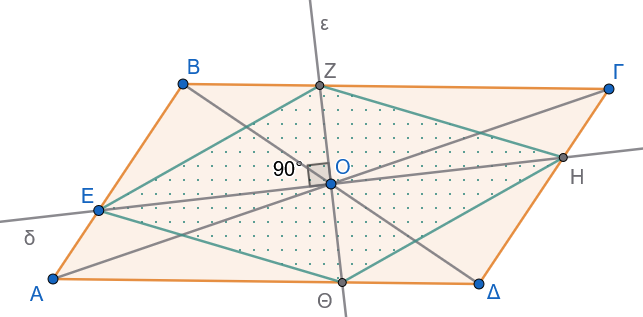{fig-align="center" width="500"}
:::

Έστω $Ο$ το σημείο τομής των διαγωνίων του παραλληλογράμμου $ΑΒΓΔ$.

**1. Απόδειξη ότι το** $ΕΖΗ\Theta$ είναι παραλληλόγραμμο

Το σημείο $Ο$ είναι το κέντρο συμμετρίας του παραλληλογράμμου $ΑΒΓΔ$.
Συνεπώς, κάθε ευθεία που διέρχεται από το $Ο$ τέμνει τις απέναντι παράλληλες πλευρές σε σημεία που ισαπέχουν από αυτό:

- Για την ευθεία $ΕΗ$: $$ΟΕ = ΟΗ$$ *(προκύπτει και από την ισότητα των τριγώνων* $ΟΑΕ$ και $ΟΓΗ$, $\Gamma - \Pi - \Gamma$)

- Για την ευθεία $Ζ\Theta$: $$ΟΖ = Ο\Theta$$ *(προκύπτει και από την ισότητα των τριγώνων* $ΟΒΖ$ και $Ο\Delta\Theta$, $\Gamma - \Pi - \Gamma$)

Επειδή οι διαγώνιοι $ΕΗ$ και $Ζ\Theta$ του τετραπλεύρου $ΕΖΗ\Theta$ διχοτομούνται στο σημείο $Ο$, το τετράπλευρο $ΕΖΗ\Theta$ είναι **παραλληλόγραμμο**.

------------------------------------------------------------------------

**2. Απόδειξη ότι το** $ΕΖΗ\Theta$ είναι ρόμβος

Από την εκφώνηση, οι ευθείες $(\delta)$ και $(\epsilon)$ είναι κάθετες μεταξύ τους, δηλαδή: $$ΕΗ \perp Ζ\Theta$$

Ένα παραλληλόγραμμο του οποίου οι διαγώνιοι τέμνονται κάθετα είναι **ρόμβος**.

------------------------------------------------------------------------

**Συμπέρασμα**

Το τετράπλευρο $ΕΖΗ\Theta$ είναι παραλληλόγραμμο με κάθετες διαγωνίους, άρα είναι **ρόμβος**.
::::

:::: {.math-box .exercise-box}
::: {.math-title .exercise-title}
8.  **Εκφώνηση**
:::

Δίνεται ισοσκελές τρίγωνο $ΑΒΓ$ (με $ΑΒ = ΑΓ$) και τυχαίο σημείο $\Delta$ της πλευράς $ΑΒ$.
Προεκτείνουμε την πλευρά $ΑΓ$ πέρα από το $Γ$ κατά τμήμα $ΓΕ = Β\Delta$.
Να αποδειχθεί ότι η βάση $ΒΓ$ του τριγώνου διχοτομεί το ευθύγραμμο τμήμα $\Delta E$.
::::

:::: {.math-box .solution-box}
::: {.math-title .solution-title}
**Λύση**

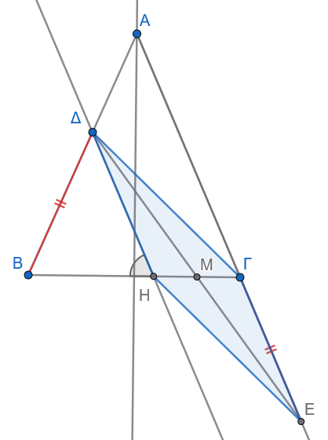{fig-align="center" width="350"}
:::

Για να αποδείξουμε ότι η βάση $ΒΓ$ διχοτομεί το τμήμα $\Delta E$, αρκεί να εντάξουμε το $\Delta E$ ως διαγώνιο σε ένα κατάλληλο παραλληλόγραμμο του οποίου η άλλη διαγώνιος θα βρίσκεται πάνω στην ευθεία $ΒΓ$.

**1. Βοηθητική κατασκευή**

Από το σημείο $\Delta$ φέρουμε ευθεία παράλληλη προς την πλευρά $ΑΓ$ ($\Delta H \parallel ΑΓ$), η οποία τέμνει τη βάση $ΒΓ$ στο σημείο $Η$.

------------------------------------------------------------------------

**2. Απόδειξη ότι το τρίγωνο** $\Delta B H$ είναι ισοσκελές

- Επειδή $\Delta H \parallel ΑΓ$ και τέμνονται από τη $ΒΓ$, οι γωνίες $\Delta\hat{H}B$ και $\hat{\Gamma}$ είναι ίσες ως **εντός-εκτός και επί τα αυτά μέρη** (εντός-εκτός εναλλάξ/εντός-εκτός): $$\Delta\hat{H}B = \hat{\Gamma}$$

- Επειδή το αρχικό τρίγωνο $ΑΒΓ$ είναι ισοσκελές ($ΑΒ = ΑΓ$), οι προσκείμενες στη βάση γωνίες είναι ίσες: $$\hat{B} = \hat{\Gamma}$$

Από τις δύο παραπάνω σχέσεις προκύπτει ότι: $$\Delta\hat{H}B = \hat{B}$$

Επομένως, το τρίγωνο $\Delta B H$ έχει δύο γωνίες ίσες, άρα είναι **ισοσκελές**, οπότε: $$\Delta H = \Delta B \quad (1)$$

------------------------------------------------------------------------

**3. Απόδειξη ότι το τετράπλευρο** $\Delta Γ Ε Η$ είναι παραλληλόγραμμο

- Από την εκφώνηση δίνεται ότι: $$Β\Delta = ΓΕ \quad (2)$$

- Συνδυάζοντας τις σχέσεις $(1)$ και $(2)$, έχουμε: $$\Delta H = ΓΕ$$

- Επιπλέον, από την κατασκευή είναι $\Delta H \parallel ΑΓ$, και επειδή τα σημεία $Α, Γ, Ε$ βρίσκονται στην ίδια ευθεία, ισχύει: $$\Delta H \parallel ΓΕ$$

Το τετράπλευρο $\Delta Γ Ε Η$ έχει δύο απέναντι πλευρές ($\Delta H$ και $ΓΕ$) **ίσες και παράλληλες**, άρα είναι **παραλληλόγραμμο**.

------------------------------------------------------------------------

**Συμπέρασμα**

Στο παραλληλόγραμμο $\Delta Γ Ε Η$, οι διαγώνιοί του $\Delta E$ και $ΗΓ$ διχοτομούνται (τέμνονται στο μέσο τους $Μ$).

Επειδή το σημείο $Μ$ ανήκει στο ευθύγραμμο τμήμα $ΗΓ$ (και άρα πάνω στην ευθεία της βάσης $ΒΓ$), προκύπτει ότι η βάση $ΒΓ$ διχοτομεί το τμήμα $\Delta E$.
::::

------------------------------------------------------------------------

### Τετράγωνο

:::: {.math-box .definition-box}
::: {.math-title .definition-title}
**Ορισμός**

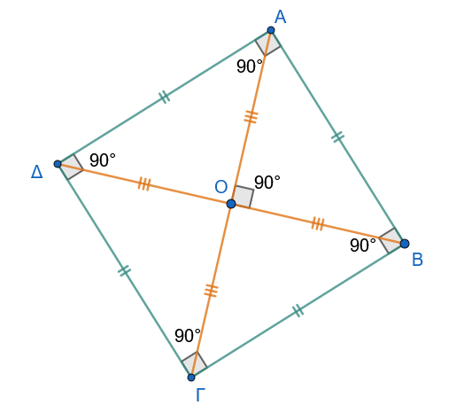{fig-align="center" width="400"}
:::

**Τετράγωνο** ονομάζεται το παραλληλόγραμμο το οποίο είναι ταυτόχρονα ορθογώνιο και ρόμβος.
::::

------------------------------------------------------------------------

#### Ιδιότητες

Από τον ορισμό προκύπτει ότι το τετράγωνο συνδυάζει όλες τις ιδιότητες του ορθογωνίου και όλες τις ιδιότητες του ρόμβου.
Συνεπώς, σε κάθε τετράγωνο:

:::: {.math-box .property-box}
::: {.math-title .property-title}
Ιδιότητες τετραγώνου
:::

1.  Όλες οι πλευρές του είναι ίσες ανά δύο και οι απέναντι είναι παράλληλες.

2.  Όλες οι γωνίες του είναι ορθές ($90^\circ$).

3.  Οι διαγώνιοί του είναι **ίσες, τέμνονται κάθετα, διχοτομούνται και διχοτομούν τις γωνίες του**.
::::

------------------------------------------------------------------------

#### Κριτήρια & Αποδείξεις

Για να αποδείξουμε ότι ένα τετράπλευρο είναι τετράγωνο, αρκεί να αποδείξουμε ότι είναι συγχρόνως ορθογώνιο και ρόμβος.
Ειδικότερα, ένα παραλληλόγραμμο είναι τετράγωνο αν ισχύει μία από τις παρακάτω προτάσεις:

:::: {.math-box .criteria-box}
::: {.math-title .criteria-title}
$1^ο$ κριτήριο
:::

**Μία γωνία του είναι ορθή και δύο διαδοχικές πλευρές του είναι ίσες.**
::::

:::: {.math-box .criteriaproof-box}
::: {.math-title .criteriaproof-title}
**Απόδειξη:**
:::

Έστω παραλληλόγραμμο $AB\Gamma\Delta$.

- Επειδή έχει μία γωνία ορθή, είναι **ορθογώνιο** (από τον ορισμό του ορθογωνίου).
- Επειδή έχει δύο διαδοχικές πλευρές ίσες, είναι **ρόμβος** (από τον ορισμό του ρόμβου).

Εφόσον είναι ορθογώνιο και ρόμβος, το παραλληλόγραμμο είναι τετράγωνο.
::::

:::: {.math-box .criteria-box}
::: {.math-title .criteria-title}
$2^ο$ κριτήριο
:::

**Οι διαγώνιοί του είναι ίσες και τέμνονται κάθετα.**
::::

:::: {.math-box .criteriaproof-box}
::: {.math-title .criteriaproof-title}
**Απόδειξη:**
:::

Έστω παραλληλόγραμμο $AB\Gamma\Delta$ του οποίου οι διαγώνιοι $A\Gamma$ και $B\Delta$ είναι ίσες και τέμνονται κάθετα.

- Επειδή είναι παραλληλόγραμμο με ίσες διαγώνιους ($A\Gamma = B\Delta$), είναι **ορθογώνιο**.
- Επειδή είναι παραλληλόγραμμο με κάθετες διαγώνιους ($A\Gamma \perp B\Delta$), είναι **ρόμβος**.

Εφόσον είναι συγχρόνως ορθογώνιο και ρόμβος, το παραλληλόγραμμο είναι τετράγωνο.
::::

------------------------------------------------------------------------

#### Ασκήσεις

1.  Δίνεται ρόμβος $AB\Gamma\Delta$ με κέντρο $O$. Παίρνουμε δύο σημεία $E$ και $Z$ της διαγωνίου $A\Gamma$, ώστε να ισχύει η σχέση $OE = OZ = OB = O\Delta$. Να αποδείξετε ότι το τετράπλευρο $\Delta E B Z$ είναι τετράγωνο.

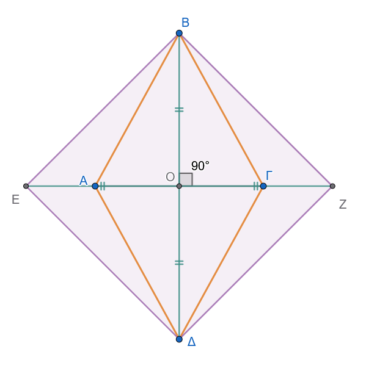{fig-align="center" width="400"}

2.  Δίνεται τετράγωνο $AB\Gamma\Delta$. Στις πλευρές $AB, B\Gamma, \Gamma\Delta$ και $\Delta A$ παίρνουμε αντίστοιχα τα σημεία $K, \Lambda, M$ και $N$, έτσι ώστε να ισχύει $AK = B\Lambda = \Gamma M = \Delta N$. Να αποδείξετε ότι το τετράπλευρο $K\Lambda MN$ είναι τετράγωνο.

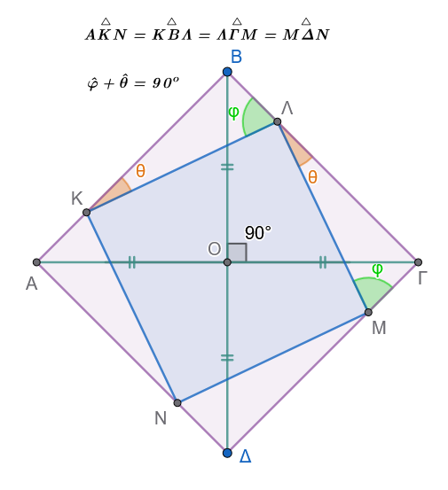{fig-align="center" width="400"}

3.  Στις πλευρές $AB$ και $B\Gamma$ τετραγώνου $AB\Gamma\Delta$ θεωρούμε τα σημεία $E$ και $Z$ αντίστοιχα, έτσι ώστε $AE = BZ$. Να αποδείξετε ότι:

- 

  i)  $AZ = \Delta E$

- 

  ii) $AZ \perp \Delta E$

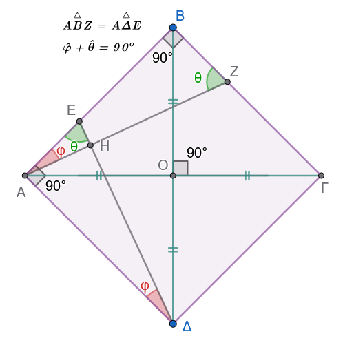{fig-align="center" width="400"}

4.  Να αποδείξετε ότι αν δύο κάθετα ευθύγραμμα τμήματα έχουν τα άκρα τους στις απέναντι πλευρές ενός τετράγωνου, τότε είναι ίσα.

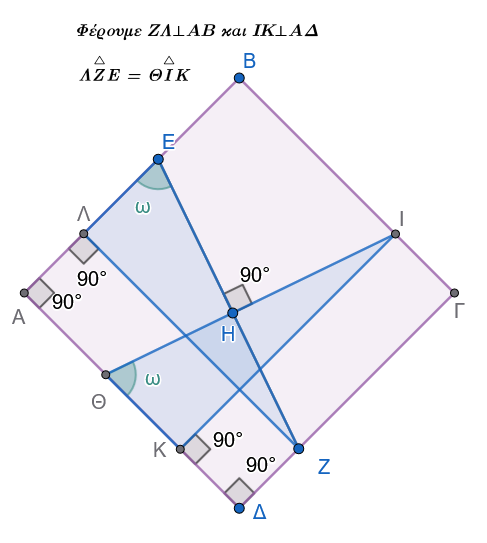{fig-align="center" width="400"}

5.  Δίνεται παραλληλόγραμμο $AB\Gamma\Delta$ με γωνία $\widehat{B} = 45^\circ$. Από το μέσο $M$ της πλευράς $\Gamma\Delta$ φέρουμε την κάθετη ευθεία προς τη $\Gamma\Delta$, η οποία τέμνει τις ευθείες $A\Delta$ και $B\Gamma$ στα σημεία $E$ και $Z$ αντίστοιχα. Να αποδείξετε ότι το τετράπλευρο $\Delta E\Gamma Z$ είναι τετράγωνο.

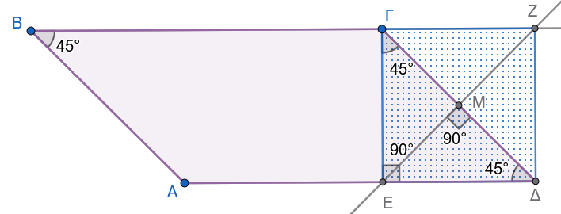{fig-align="center" width="550"}

:::: {.math-box .exercise-box}
::: {.math-title .exercise-title}
6.  **Εκφώνηση**
:::

Εξωτερικά ισοσκελούς τριγώνου $AB\Gamma$ ($AB=A\Gamma$) κατασκευάζουμε τα τετράγωνα $AB\Delta E$ και $A\Gamma Z\Theta$.
Αν $M$ είναι το μέσο της $B\Gamma$, να δείξετε ότι:

(α) $ME = M\Theta$

(β) $E\Theta \parallel \Delta Z \parallel B\Gamma$

(γ) $E\Theta = 2 \cdot AM$
::::

:::: {.math-box .solution-box}
::: {.math-title .solution-title}
**Λύση**

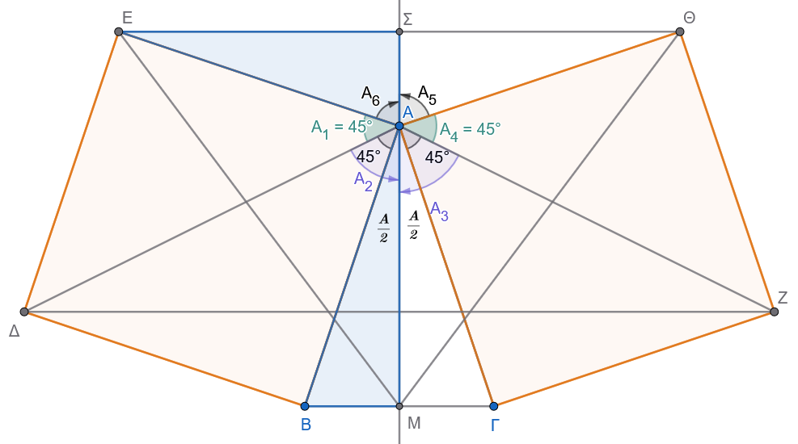{fig-align="center" width="650"}
:::

**(α) Απόδειξη της ισότητας** $ME = M\Theta$

Συγκρίνουμε τα τρίγωνα $MAE$ και $MA\Theta$.
Αυτά έχουν:

1.  $AM$ κοινή πλευρά.
2.  $AE = A\Theta$, ως πλευρές ίσων τετραγώνων (αφού $AB = A\Gamma$).
3.  $\widehat{EAM} = \widehat{\Theta AM}$. Οι γωνίες αυτές είναι ίσες με $90^\circ + \frac{\widehat{A}}{2}$, διότι η $AM$ είναι διάμεσος, ύψος και διχοτόμος του ισοσκελούς τριγώνου $AB\Gamma$.

Τα τρίγωνα είναι ίσα (Π-Γ-Π), επομένως $ME = M\Theta$.

------------------------------------------------------------------------

**(β) Απόδειξη παραλληλίας** $E\Theta \parallel \Delta Z \parallel B\Gamma$

Θα αποδείξουμε ότι και οι τρεις ευθείες είναι κάθετες στην ίδια ευθεία $AM$ (ή την προέκτασή της $M\Sigma$).

1.  Στο ισοσκελές τρίγωνο $AE\Theta$ ($AE=A\Theta$), η ευθεία $A\Sigma$ είναι διχοτόμος (λόγω συμμετρίας ως προς την $AM$). Επομένως, η $A\Sigma$ είναι και ύψος, άρα $E\Theta \perp M\Sigma$ (1).
2.  Στο τρίγωνο $A\Delta Z$, οι πλευρές $A\Delta$ και $AZ$ είναι ίσες ως διαγώνιοι των ίσων τετραγώνων. Το τρίγωνο είναι ισοσκελές και η $AM$ είναι διχοτόμος της γωνίας $\widehat{\Delta AZ}$. Άρα η $AM$ είναι και ύψος, οπότε $\Delta Z \perp AM$ (2).
3.  Στο ισοσκελές τρίγωνο $AB\Gamma$, η $AM$ είναι διάμεσος προς τη βάση, άρα και ύψος: $B\Gamma \perp AM$ (3).

Από τις σχέσεις (1), (2) και (3), οι ευθείες $E\Theta, \Delta Z$ και $B\Gamma$ είναι **παράλληλες μεταξύ τους**, ως κάθετες στην ίδια ευθεία $AM$.

------------------------------------------------------------------------

**(γ) Απόδειξη της σχέσης** $E\Theta = 2 \cdot AM$

Στο ισοσκελές τρίγωνο $AE\Theta$, η $A\Sigma$ είναι ύψος και διάμεσος, άρα $E\Theta = 2 \cdot E\Sigma$.

Για να δείξουμε ότι $E\Theta = 2 \cdot AM$, αρκεί να δείξουμε ότι $E\Sigma = AM$.

Συγκρίνουμε τα ορθογώνια τρίγωνα $A\Sigma E$ και $ABM$:

1.  $AE = AB$ (πλευρές τετραγώνου).
2.  $\widehat{\Sigma} = \widehat{M} = 90^\circ$.
3.  $\widehat{EAS} = \widehat{B}$ (οξείες γωνίες με πλευρές κάθετες: $AS \perp E\Sigma$ και $AM \perp BM$).

Τα τρίγωνα είναι ίσα, άρα $E\Sigma = AM$.

Διπλασιάζοντας τη σχέση, έχουμε: $2 \cdot E\Sigma = 2 \cdot AM \Rightarrow$ $E\Theta = 2 \cdot AM$.
::::

:::: {.math-box .exercise-box}
::: {.math-title .exercise-title}
7.  **Εκφώνηση**
:::

Δίνεται ρόμβος $ΑΒΓΔ$.
Πάνω στις πλευρές του $ΑΒ$ και $ΑΔ$ παίρνουμε ίσα τμήματα $ΑΕ = ΑΖ = \beta$ και πάνω στις $ΓΒ$ και $ΓΔ$ επίσης ίσα τμήματα $Γ\Theta = ΓΗ = \beta$, αντίστοιχα.

Να αποδείξετε ότι το τετράπλευρο $ΕΖΗ\Theta$ είναι ορθογώνιο.
::::

:::: {.math-box .solution-box}
::: {.math-title .solution-title}
**Λύση**

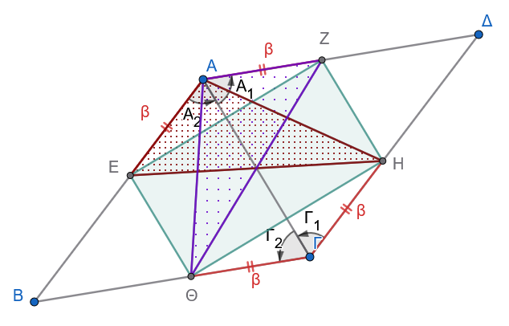{fig-align="center" width="500"}
:::

Ονομάζουμε $\alpha$ το μήκος των πλευρών του ρόμβου, επομένως: $$ΑΒ = ΒΓ = ΓΔ = ΔΑ = \alpha$$

Από τη διαφορά των τμημάτων προκύπτει ότι: $$\Delta Z = \Delta H = BE = B\Theta = \alpha - \beta$$

Για να αποδείξουμε ότι το τετράπλευρο $ΕΖΗ\Theta$ είναι ορθογώνιο, αρκεί να δείξουμε ότι είναι παραλληλόγραμμο με ίσες διαγώνιες.

------------------------------------------------------------------------

**1. Απόδειξη ότι το** $ΕΖΗ\Theta$ είναι παραλληλόγραμμο

- **Σύγκριση τριγώνων** $ΑΕΖ$ και $ΓΗ\Theta$:

  - $ΑΕ = Γ\Theta = \beta$
  - $ΑΖ = ΓΗ = \beta$
  - $\hat{A} = \hat{\Gamma}$ (ως απέναντι γωνίες ρόμβου)

  Άρα τα τρίγωνα είναι ίσα από το κριτήριο $(\Pi - \Gamma - \Pi)$, οπότε: $$ZE = H\Theta \quad (1)$$

- **Σύγκριση τριγώνων** $\Delta ZH$ και $BE\Theta$:

  - $\Delta Z = BE = \alpha - \beta$
  - $\Delta H = B\Theta = \alpha - \beta$
  - $\hat{\Delta} = \hat{B}$ (ως απέναντι γωνίες ρόμβου)

  Άρα τα τρίγωνα είναι ίσα από το κριτήριο $(\Pi - \Gamma - \Pi)$, οπότε: $$ZH = E\Theta \quad (2)$$

Από τις σχέσεις $(1)$ και $(2)$, το τετράπλευρο $ΕΖΗ\Theta$ έχει τις απέναντι πλευρές του ίσες ανά δύο, άρα είναι **παραλληλόγραμμο**.

------------------------------------------------------------------------

**Απόδειξη ότι οι διαγώνιες του** $ΕΖΗ\Theta$ είναι ίσες ($Ζ\Theta = ΕΗ$)

Φέρνουμε τα ευθύγραμμα τμήματα $ΑΗ$, $Α\Theta$ καθώς και τις διαγωνίους $Ζ\Theta$ και $ΕΗ$ του παραλληλογράμμου $ΕΖΗ\Theta$.

- **Σύγκριση τριγώνων** $ΑΗΓ$ και $Α\Theta\Gamma$:

  - Η πλευρά $ΑΓ$ είναι κοινή.
  - $ΓΗ = Γ\Theta = \beta$.
  - $\hat{\Gamma}_1 = \hat{\Gamma}_2$, επειδή η διαγώνιος $ΑΓ$ διχοτομεί τη γωνία $\hat{\Gamma}$ του ρόμβου.

  Άρα τα τρίγωνα είναι ίσα από το κριτήριο $(\Pi - \Gamma - \Pi)$, γεγονός που συνεπάγεται ότι: $$ΑΗ = Α\Theta \quad (3)$$ $$\hat{A}_1 = \hat{A}_2 \quad (4)$$ *(όπου* $\hat{A}_1 = H\hat{A}\Gamma$ και $\hat{A}_2 = \Theta\hat{A}\Gamma$)

- **Σύγκριση τριγώνων** $ΑΖ\Theta$ και $ΑΕΗ$:

  - $ΑΖ = ΑΕ = \beta$
  - $Α\Theta = ΑΗ$ (από τη σχέση $3$)
  - Οι περιεχόμενες γωνίες $Z\hat{A}\Theta$ και $H\hat{A}E$ είναι ίσες ως αθροίσματα ίσων γωνιών, καθώς: $$Z\hat{A}\Theta = Z\hat{A}\Gamma + \hat{A}_2$$ $$H\hat{A}E = E\hat{A}\Gamma + \hat{A}_1$$ Επειδή η $ΑΓ$ διχοτομεί τη γωνία $\hat{A}$ του ρόμβου ($Z\hat{A}\Gamma = E\hat{A}\Gamma$) και από τη σχέση $(4)$ ισχύει $\hat{A}_1 = \hat{A}_2$, προκύπτει ότι: $$Z\hat{A}\Theta = H\hat{A}E$$

  Συνεπώς, τα τρίγωνα $ΑΖ\Theta$ και $ΑΕΗ$ είναι ίσα από το κριτήριο $(\Pi - \Gamma - \Pi)$, άρα οι απέναντι πλευρές τους είναι ίσες: $$Z\Theta = HE$$

------------------------------------------------------------------------

**Συμπέρασμα**

Το παραλληλόγραμμο $ΕΖΗ\Theta$ έχει τις διαγώνιές του ίσες ($Z\Theta = HE$), άρα είναι **ορθογώνιο**.

> > **Σημείωση:** Η άσκηση ισχύει και στην ειδική περίπτωση όπου τα σημεία $Ε, Ζ, Η, \Theta$ είναι τα μέσα των πλευρών του ρόμβου.
::::

:::: {.math-box .exercise-box}
::: {.math-title .exercise-title}
8.  **Εκφώνηση**
:::

Με βάση τις πλευρές $ΑΒ$ και $ΑΓ$ τριγώνου $ΑΒΓ$ κατασκευάζουμε εξωτερικά τα τετράγωνα $ΑΒ\Theta Ε$ και $ΑΓΗΖ$.
Αν $Μ$ είναι το μέσο της $ΕΖ$, να αποδείξετε ότι η $ΑΜ$ είναι κάθετη στη $ΒΓ$.
::::

:::: {.math-box .solution-box}
::: {.math-title .solution-title}
**Λύση**

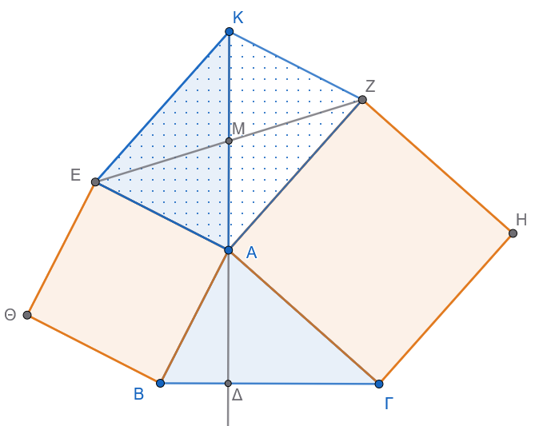{fig-align="center" width="500"}
:::

**1. Βοηθητική κατασκευή**

- Προεκτείνουμε τη διάμεσο $ΑΜ$ του τριγώνου $ΑΕΖ$ πέρα από το $Μ$ κατά τμήμα $ΜΚ = ΑΜ$.
- Ενώνουμε το $Κ$ με τα σημεία $Ε$ και $Ζ$.

Στο τετράπλευρο $ΑΕΚΖ$, οι διαγώνιοί του $ΕΖ$ και $ΑΚ$ διχοτομούνται στο σημείο $Μ$, επομένως το $ΑΕΚΖ$ είναι παραλληλόγραμμο.

Από τις ιδιότητες του παραλληλογράμμου έχουμε:

- $ΕΚ = ΑΖ$

- $\widehat{AEK} + \widehat{EAZ} = 180^\circ \implies \widehat{AEK} = 180^\circ - \widehat{EAZ} \quad (1)$

------------------------------------------------------------------------

**2. Σύγκριση τριγώνων** $ΑΕΚ$ και $ΑΒΓ$

- Από τα εξωτερικά τετράγωνα $ΑΒ\Theta Ε$ και $ΑΓΗΖ$ έχουμε:

  - $ΑΕ = ΑΒ$ (πλευρές του τετραγώνου $ΑΒ\Theta Ε$)
  - $ΑΖ = ΑΓ$ (πλευρές του τετραγώνου $ΑΓΗΖ$), οπότε και $ΕΚ = ΑΓ$ (αφού $ΕΚ = ΑΖ$).

- Εξετάζουμε τις γωνίες γύρω από την κορυφή $Α$: $$\widehat{EAZ} + \widehat{EAB} + \widehat{BAΓ} + \widehat{ΓAZ} = 360^\circ$$ $$\widehat{EAZ} + 90^\circ + \widehat{BAΓ} + 90^\circ = 360^\circ$$ $$\widehat{EAZ} + \widehat{BAΓ} = 180^\circ \implies \widehat{BAΓ} = 180^\circ - \widehat{EAZ} \quad (2)$$

Από τις σχέσεις $(1)$ και $(2)$ προκύπτει ότι: $$\widehat{AEK} = \widehat{BAΓ}$$

Συνεπώς, τα τρίγωνα $ΑΕΚ$ και $ΑΒΓ$ (ή $\Gamma AB$) είναι ίσα από το κριτήριο $(\Pi - \Gamma - \Pi)$, γιατί έχουν:

1.  $ΑΕ = ΑΒ$
2.  $ΕΚ = ΑΓ$
3.  $\widehat{AEK} = \widehat{BAΓ}$

Από την ισότητα των τριγώνων προκύπτει ότι οι αντίστοιχες γωνίες τους είναι ίσες: $$\widehat{EAK} = \widehat{B} \quad (3)$$

**3. Απόδειξη της καθετότητας (**$ΑΜ \perp ΒΓ$)

Έστω $\Delta$ το σημείο τομής της ευθείας $ΑΜ$ (δηλαδή της $ΑΚ$) με την πλευρά $ΒΓ$.

Στο σημείο $Α$, επειδή τα σημεία $K, M, A, \Delta$ είναι συνευθειακά, η γωνία $\widehat{KA\Delta}$ είναι ευθεία ($180^\circ$).
Έχουμε: $$\widehat{EAK} + \widehat{EAB} + \widehat{BA\Delta} = 180^\circ$$ $$\widehat{EAK} + 90^\circ + \widehat{BA\Delta} = 180^\circ$$ $$\widehat{EAK} + \widehat{BA\Delta} = 90^\circ$$

Αντικαθιστώντας από τη σχέση $(3)$ όπου $\widehat{EAK} = \widehat{B}$, παίρνουμε: $$\widehat{B} + \widehat{BA\Delta} = 90^\circ$$

Τώρα, στο τρίγωνο $ΑΒ\Delta$, το άθροισμα των γωνιών είναι $180^\circ$: $$\widehat{A\Delta B} = 180^\circ - (\widehat{B} + \widehat{BA\Delta})$$ $$\widehat{A\Delta B} = 180^\circ - 90^\circ = 90^\circ$$

Άρα, $Α\Delta \perp ΒΓ$, δηλαδή η $ΑΜ$ είναι κάθετη στη $ΒΓ$.
::::


:::: {.math-box .exercise-box}
::: {.math-title .exercise-title}
9.  **Εκφώνηση**
:::
Δίνεται τρίγωνο $ΑΒΓ$ και εξωτερικά αυτού κατασκευάζουμε τα τετράγωνα $ΑΒ\Delta Ε$ και $ΑΓΖΗ$.
Να αποδειχθεί ότι το ευθύγραμμο τμήμα $ΕΗ$ είναι διπλάσιο της διαμέσου $ΑΜ$ του τριγώνου $ΑΒΓ$, δηλαδή: $$ΕΗ = 2 ΑΜ$$
::::


:::: {.math-box .solution-box}
::: {.math-title .solution-title}
**Λύση**

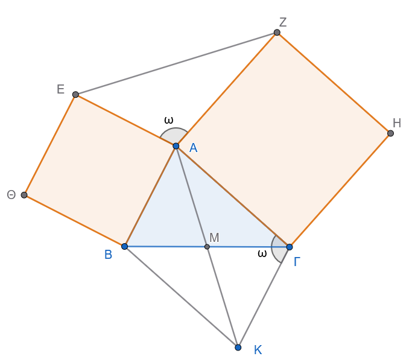{fig-align="center" width="500"}
:::
**1. Βοηθητική κατασκευή**

Προεκτείνουμε τη διάμεσο $ΑΜ$ κατά ίσο τμήμα $ΜΚ = ΑΜ$ πέρα από το σημείο $Μ$.

Επομένως, το συνολικό τμήμα $ΑΚ$ ισούται με: $$ΑΚ = 2 ΑΜ$$

Για να δείξουμε ότι $ΕΗ = 2 ΑΜ$, **αρκεί να αποδείξουμε ότι** $ΕΗ = ΑΚ$.

------------------------------------------------------------------------

**2. Ιδιότητες του παραλληλογράμμου $ΑΒΚΓ$**

Στο τετράπλευρο $ΑΒΚΓ$: \* $ΒΜ = ΜΓ$ (αφού $ΑΜ$ είναι διάμεσος) \* $ΑΜ = ΜΚ$ (από την κατασκευή)

Οι διαγώνιοι του τετραπλεύρου διχοτομούνται, άρα το $ΑΒΚΓ$ είναι παραλληλόγραμμο.

Συνεπώς: \* $ΚΓ = ΑΒ$ και $ΚΓ \parallel ΑΒ$ \* Οι διαδοχικές γωνίες είναι παραπληρωματικές: $$\widehat{A\Gamma K} + \widehat{BA\Gamma} = 180^\circ \implies \widehat{A\Gamma K} = 180^\circ - \widehat{BA\Gamma} \quad (1)$$

------------------------------------------------------------------------

**3. Σχέσεις πλευρών και γωνιών**

Από τα εξωτερικά τετράγωνα $ΑΒ\Delta Ε$ και $ΑΓΖΗ$ έχουμε: \* $ΑΕ = ΑΒ$, οπότε λόγω του παραλληλογράμμου: $$ΑΕ = ΚΓ \quad (2)$$ \* $ΑΗ = ΑΓ \quad (3)$

Για τη γωνία $\widehat{HAE}$, αθροίζοντας τις γωνίες γύρω από το σημείο $Α$: $$\widehat{HAE} + \widehat{EAB} + \widehat{BA\Gamma} + \widehat{\Gamma AH} = 360^\circ$$ $$\widehat{HAE} + 90^\circ + \widehat{BA\Gamma} + 90^\circ = 360^\circ$$ $$\widehat{HAE} + \widehat{BA\Gamma} = 180^\circ \implies \widehat{HAE} = 180^\circ - \widehat{BA\Gamma} \quad (4)$$

Από τις σχέσεις $(1)$ και $(4)$ προκύπτει ότι: $$\widehat{HAE} = \widehat{A\Gamma K} \quad (5)$$

------------------------------------------------------------------------

**4. Σύγκριση τριγώνων $ΑΕΗ$ και $ΚΓΑ$**

Συγκρίνουμε τα τρίγωνα $ΑΕΗ$ και $ΚΓΑ$: 

1.  $ΑΕ = ΚΓ$ (από τη σχέση $2$) 
2.  $ΑΗ = ΑΓ$ (από τη σχέση $3$) 
3.  $\widehat{HAE} = \widehat{A\Gamma K}$ (από τη σχέση $5$)

Από το κριτήριο ισότητας $(\Pi - \Gamma - \Pi)$, τα τρίγωνα είναι **ίσα**, επομένως και οι απέναντι πλευρές τους είναι ίσες: $$ΕΗ = ΑΚ$$

------------------------------------------------------------------------

**Συμπέρασμα**

Επειδή $ΑΚ = 2 ΑΜ$ και $ΕΗ = ΑΚ$, καταλήγουμε ότι: $$ΕΗ = 2 ΑΜ$$
::::


------------------------------------------------------------------------

::: {.callout-important title="ΣΑΣ ΕΥΧΟΜΑΙ"}
ΚΑΛΗ ΜΕΛΕΤΗ !!!
:::
