```{=html}
<!-- Φόρτωση βιβλιοθήκης GeoGebra -->
<script src="https://www.geogebra.org/apps/deployggb.js"></script>

<!-- Συνάρτηση δημιουργίας applets -->
<script>
function createGeoGebra(containerId, materialId, width = 700, height = 500) {
  var params = {
    "id": "ggb-" + containerId,
    "material_id": materialId,
    "width": width,
    "height": height,
    "showToolBar": true,
    "showMenuBar": false,
    "showAlgebraInput": true
  };
  
  var applet = new GGBApplet(params, '5.2');
  applet.inject(containerId);
}
</script>
```

## Εφαρμογές των παραλληλογράμμων

### Εφαρμογές στα Τρίγωνα

#### Θεωρήματα & Αποδείξεις

:::: {.math-box .theorem-box}
::: {.math-title .theorem-title}
**Θεώρημα Ι:**
:::

Το ευθύγραμμο τμήμα που ενώνει τα μέσα των δύο πλευρών τριγώνου είναι παράλληλο προς την τρίτη πλευρά και ίσο με το μισό της.
::::

:::: {.math-box .apodeixi-box}
::: {.math-title .apodeixi-title}
**Απόδειξη:**

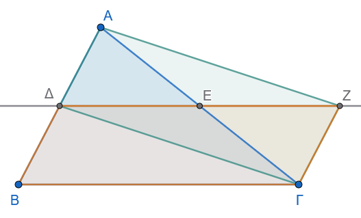{fig-align="center" width="400"}
:::

Θεωρούμε τρίγωνο $AB\Gamma$ και τα μέσα $\Delta, E$ των πλευρών $AB, A\Gamma$ αντίστοιχα.

Προεκτείνουμε τη $\Delta E$ κατά τμήμα $EZ = \Delta E$.

Το τετράπλευρο $A\Delta\Gamma Z$ είναι παραλληλόγραμμο, καθώς οι διαγώνιοί του $A\Gamma$ και $\Delta Z$ διχοτομούνται.

Συνεπώς, $A\Delta \parallel = \Gamma Z$.

Επειδή $A\Delta = \Delta B$, προκύπτει ότι $\Delta B \parallel = \Gamma Z$.
Έτσι, το τετράπλευρο $\Delta Z\Gamma B$ είναι παραλληλόγραμμο.
Από τις ιδιότητες του παραλληλογράμμου προκύπτει ότι:

1.  $\Delta Z \parallel B\Gamma$, άρα $\Delta E \parallel B\Gamma$.

2.  $\Delta Z = B\Gamma \Rightarrow 2\Delta E = B\Gamma \Rightarrow \Delta E = \dfrac{B\Gamma}{2}$.
::::

------------------------------------------------------------------------

:::: {.math-box .theorem-box}
::: {.math-title .theorem-title}
**Θεώρημα ΙΙ:**
:::

Αν από το μέσο μιας πλευράς ενός τριγώνου φέρουμε ευθεία παράλληλη προς μια άλλη πλευρά του, τότε η ευθεία αυτή διέρχεται από το μέσο της τρίτης πλευράς του.
::::

:::: {.math-box .apodeixi-box}
::: {.math-title .apodeixi-title}
**Απόδειξη:**

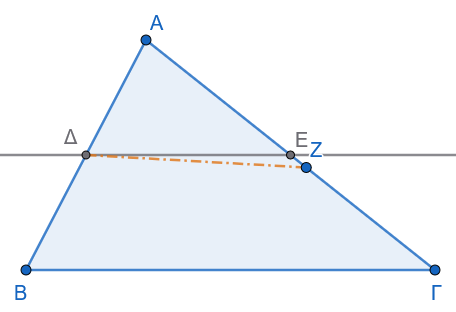{fig-align="center" width="350"}
:::

Θεωρούμε τρίγωνο $AB\Gamma$ και από το μέσο $\Delta$ της $AB$ φέρουμε ευθεία παράλληλη προς τη $B\Gamma$, η οποία τέμνει την $A\Gamma$ στο σημείο $E$.

Έστω ότι το $E$ δεν είναι το μέσο της $A\Gamma$.

Αν $Z$ είναι το μέσο της $A\Gamma$, τότε το ευθύγραμμο τμήμα $\Delta Z$ ενώνει τα μέσα των $AB$ και $A\Gamma$, οπότε σύμφωνα με το Θεώρημα Ι ισχύει $\Delta Z \parallel B\Gamma$.

Έτσι όμως, από το σημείο $\Delta$ άγονται δύο διαφορετικές ευθείες παράλληλες προς τη $B\Gamma$, πράγμα άτοπο.

Άρα το $E$ είναι το μέσο της $A\Gamma$.
::::

:::: {.math-box .theorem-box}
::: {.math-title .theorem-title}
Θεώρημα III
:::

Αν τρεις (τουλάχιστον) παράλληλες ευθείες ορίζουν σε μία ευθεία ίσα τμήματα, θα ορίζουν ίσα τμήματα και σε κάθε άλλη ευθεία που τις τέμνει.
::::

::::: {.math-box .apodeixi-box}
::: {.math-title .apodeixi-title}
Απόδειξη
:::

<iframe src="https://www.geogebra.org/calculator/z8wshzgu?embed" width="730" height="600" allowfullscreen style="border: 1px solid #e4e4e4;border-radius: 4px;" frameborder="0">

</iframe>

::: {.math-box .odigia-box}
Αλλάξτε την θέση του σημείου Κ.

Τι συμβαίνει με τα μήκη των τμημάτων $Α_1Β_1 \ \ \text{και} \ \  Β_1Γ_1$ σε κάθε νέα θέση;
:::

Θεωρούμε τις παράλληλες ευθείες $α, β, γ$ οι οποίες τέμνουν την $ε_1$ στα σημεία $Α, Β, Γ$ και ορίζουν σε αυτή τα ίσα ευθύγραμμα τμήματα $ΑΒ=ΒΓ$.

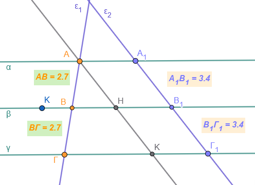{fig-align="center" width="450"}

Αν μια άλλη ευθεία $ε_2$ τέμνει τις $α, β, γ$ στα σημεία $Α_1, Β_1, Γ_1$ αντίστοιχα, θα αποδείξουμε ότι $Α_1Β_1 = Β_1Γ_1$.

Φέρουμε $ΑΚ // ε_2$ η οποία τέμνει τις παραλλήλους στα σημεία Η και Κ.
Τότε τα τετράπλευρα $ΑΑ_1Β_1Η$ και $ΗΒ_1Γ_1Κ$ είναι παραλληλόγραμμα, οπότε $$ΑΗ = Α_1Β_1 \ \  (1)$$

και $$ΗΚ = Β_1Γ_1 \ \  (2)$$

Στο τρίγωνο $ΑΚΓ$ το Β είναι το μέσο της ΑΓ και $ΒΗ // ΓΚ$.

Άρα το Η είναι μέσο της ΑΚ, δηλαδή $$ΑΗ = ΗΚ \ \  (3)$$

Από τις (1), (2) και (3) προκύπτει ότι $Α_1Β_1 = Β_1Γ_1$.
:::::

------------------------------------------------------------------------

#### Λήμμα & Απόδειξη

:::: {.math-box .lemma-box}
::: {.math-title .lemma-title}
**Λήμμα:**
:::

Τα μέσα των πλευρών οποιουδήποτε κυρτού τετραπλεύρου είναι κορυφές παραλληλογράμμου.
::::

:::: {.math-box .lemmaproof-box}
::: {.math-title .lemmaproof-title}
**Απόδειξη:**

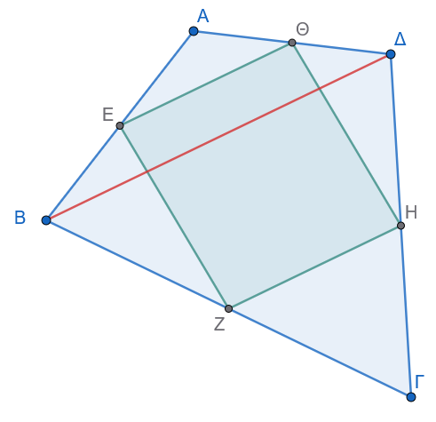{fig-align="center" width="400"}
:::

Θεωρούμε κυρτό τετράπλευρο $AB\Gamma\Delta$ και τα μέσα $E, Z, H, \Theta$ των πλευρών $AB, B\Gamma, \Gamma\Delta, \Delta A$ αντίστοιχα.

Φέρουμε τη διαγώνιο $B\Delta$.

Στο τρίγωνο $AB\Delta$, τα σημεία $E$ και $\Theta$ είναι τα μέσα των πλευρών $AB$ και $A\Delta$, οπότε $E\Theta \parallel = \dfrac{B\Delta}{2}$.
Όμοια, στο τρίγωνο $ΓB\Delta$, τα σημεία $Z$ και $H$ είναι τα μέσα των $B\Gamma$ και $\Gamma\Delta$, οπότε $ZH \parallel = \dfrac{B\Delta}{2}$.

Από τις δύο αυτές σχέσεις προκύπτει ότι $E\Theta \parallel = ZH$, συνεπώς το τετράπλευρο $EZH\Theta$ έχει δύο απέναντι πλευρές ίσες και παράλληλες, οπότε είναι παραλληλόγραμμο.
::::

------------------------------------------------------------------------

#### Εφαρμογές

:::: {.math-box .example-box}
::: {.math-title .example-title}
**Εφαρμογή 1η:**
:::

Αν $\Delta$ και $E$ είναι τα μέσα των πλευρών $AB$ και $A\Gamma$ τριγώνου $AB\Gamma$ και $Z$ τυχαίο σημείο της $B\Gamma$, να αποδειχθεί ότι η $\Delta E$ διχοτομεί την $AZ$.
::::

:::: {.math-box .examplesolution-box}
::: {.math-title .examplesolution-title}
*Λύση:*

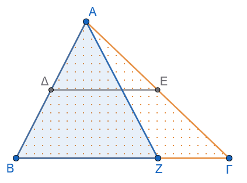{fig-align="center" width="350"}
:::

Στο τρίγωνο $ABZ$, το $\Delta$ είναι μέσο της $AB$ και η $\Delta E \parallel BZ$, άρα η $\Delta E$ τέμνει την $AZ$ στο μέσο της.
::::

:::: {.math-box .example-box}
::: {.math-title .example-title}
**Εφαρμογή 2η:**
:::

Δίνεται τρίγωνο $AB\Gamma$ και η διάμεσός του $A\Delta$.

Αν $E, Z, H$ είναι τα μέσα των $B\Delta, A\Delta, AΒ$ αντίστοιχα, να αποδειχθεί ότι το τετράπλευρο $ΔΖΗΕ$ είναι παραλληλόγραμμο.
::::

:::: {.math-box .examplesolution-box}
::: {.math-title .examplesolution-title}
*Λύση:*

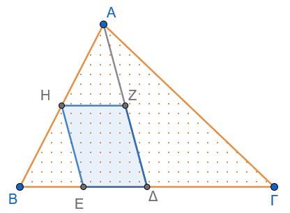{fig-align="center" width="350"}
:::

Στο τρίγωνο $AΒΔ$, τα $Z, H$ είναι μέσα των $A\Delta, AΒ$, οπότε $ZH \parallel = \dfrac{ΒΔ}{2}$.

Επειδή $E$ μέσο της $B\Delta$ και $ΕΔ = \dfrac{ΒΔ}{2}$.

Άρα $ZH \parallel = \Delta E$, οπότε το $ΔΖΗΕ$ είναι παραλληλόγραμμο.
::::

:::: {.math-box .example-box}
::: {.math-title .example-title}
**Εφαρμογή 3η:**
:::

Αν $A', B', \Gamma', \Delta', K'$ είναι οι προβολές των κορυφών και του κέντρου $K$ παραλληλογράμμου $AB\Gamma\Delta$ σε ευθεία $\epsilon$ που αφήνει όλες τις κορυφές προς το ίδιο μέρος της, να αποδειχθεί ότι $AA' + BB' + \Gamma\Gamma' + \Delta\Delta' = 4KK'$.
::::

:::: {.math-box .examplesolution-box}
::: {.math-title .examplesolution-title}
*Λύση:*
:::

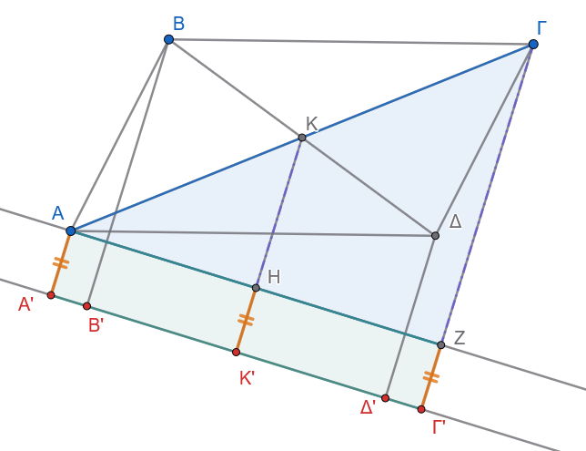{fig-align="center" width="520"}

**1: Χρήση της διαγωνίου** $ΑΓ$ και του μέσου $K$

Στο παραλληλόγραμμο $ΑΒΓΔ$, το κέντρο $K$ είναι το μέσο της διαγωνίου $ΑΓ$.

Αν φέρουμε την προβολή $K'$ του $K$ στην ευθεία, και από το $A$ φέρουμε μια παράλληλη προς την $\epsilon$ που τέμνει την $\Gamma\Gamma'$ στο σημείο $Z$ και την ΚΚ' στο Η, τότε στο τρίγωνο $A\Gamma Z$, το τμήμα που ξεκινά από το $K$ είναι παράλληλο στη βάση , περνά από το μέσο Η.

Άρα $ΚΗ=// \dfrac{ΓΖ}{2} \Rightarrow ΓΖ=2ΚΗ  \ \ \ (1)$

Επίσης αφού οι ΑΑ', ΒΒ΄, ΓΓ' , ΚΚ' και ΔΔ' είναι κάθετοι στη ε και η ΑΖ //Α'Γ' , σημαίνει ότι ΑΑ'ΖΓ' ορθογώνιο και επομένως $ΑΑ'=ΖΓ'=ΗΚ' \ \ \  (2)$

Από τις (1) και (2) έχουμε: $ΑΑ'+ΓΓ'=ΑΑ'+ΓΖ+ΖΓ'=ΗΚ'+2ΗΚ+ΗΚ'=2(ΗΚ+ΗΚ')=2ΚΚ'$

$\implies AA' + \Gamma\Gamma' = 2KK'$

**2: Χρήση της διαγωνίου** $ΒΔ$

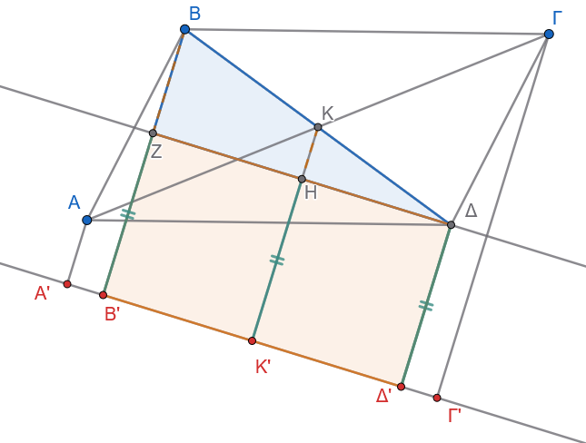{fig-align="center" width="520"}

Με τον ίδιο ακριβώς τρόπο, επειδή το $K$ είναι επίσης το μέσο της άλλης διαγωνίου $ΒΔ$, και αν από το $Δ$ φέρουμε μια παράλληλη προς την $\epsilon$ που τέμνει την $ΒΒ'$ στο σημείο $Z$ και την ΚΚ' στο Η, τότε στο τρίγωνο $ΔΒZ$, το τμήμα που ξεκινά από το $K$ είναι παράλληλο στη βάση , περνά από το μέσο Η.

Άρα $ΚΗ=// \dfrac{ΒΖ}{2} \Rightarrow ΒΖ=2ΚΗ  \ \ \ (1)$

Επίσης αφού οι ΑΑ', ΒΒ΄, ΓΓ' , ΚΚ' και ΔΔ' είναι κάθετοι στη ε και η ΑΖ //Α'Γ' , σημαίνει ότι ΖΒ'Δ'Δ ορθογώνιο και επομένως $ΖΒ'=ΔΔ'=ΗΚ' \ \ \  (2)$

Από τις (1) και (2) έχουμε: $ΒΒ'+ΔΔ'=ΒΖ+ΖΒ'+ΔΔ'=2ΗΚ+ΗΚ'+ΗΚ'=2(ΗΚ+ΗΚ')=2ΚΚ'$

**3: Πρόσθεση των δύο σχέσεων**

Τώρα, προσθέτουμε τις δύο παραπάνω ισότητες κατά μέλη: $(AA' + \Gamma\Gamma') + (BB' + \Delta\Delta') = 2KK' + 2KK'$

**4: Τελικό συμπέρασμα**

Αναδιατάσσουμε τους όρους και έχουμε: $AA' + BB' + \Gamma\Gamma' + \Delta\Delta' = 4KK'$
::::

------------------------------------------------------------------------

#### Ασκήσεις

1.  Σε παραλληλόγραμμο $AB\Gamma\Delta$, φέρουμε $AE \perp \Delta\Gamma$ και $\Gamma Z \perp AB$. Να αποδειχθεί ότι το $AZ\Gamma E$ είναι ορθογώνιο.

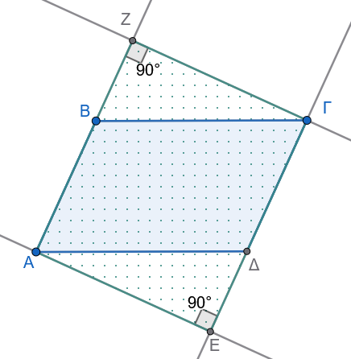{fig-align="center" width="350"}

2.  Δίνεται τρίγωνο $AB\Gamma$ και τα μέσα $Δ, E, Z$ των $AB, A\Gamma, B\Gamma$ αντίστοιχα. Να αποδείξετε ότι τα 4 τρίγωνα που σχηματίζονται είναι ίσα.

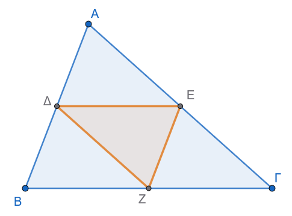{fig-align="center" width="350"}

:::: {.math-box .exercise-box}
::: {.math-title .exercise-title}
3.  Εκφώνηση
:::

Σε τρίγωνο $ΑΒΓ$, φέρνουμε τη διχοτόμο $ΑΔ$ και από το $Β$ την $ΒΕΖ \perp ΑΔ$.
Από το μέσο $Μ$ της $ΒΓ$ φέρνουμε την κάθετο $ΜΗ \perp ΑΔ$, η οποία τέμνει τις πλευρές $ΑΒ$ και $ΑΓ$ στα σημεία $Β_1$ και $Γ_1$ αντίστοιχα.

Να αποδείξετε ότι: $$Β_1Β = ΖΓ_1 = Γ_1Γ = \frac{\beta - \gamma}{2}$$
::::

:::: {.math-box .solution-box}
::: {.math-title .solution-title}
**Λύση**

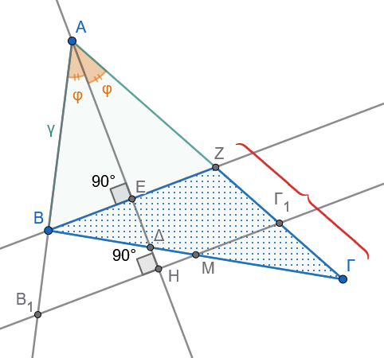{fig-align="center" width="400"}
:::

1.  **Ισοσκελή τρίγωνα:**

    Στα τρίγωνα $ΑΒΖ$ και $ΑΒ_1Γ_1$, το τμήμα της διχοτόμου είναι ταυτόχρονα και ύψος (αφού $ΒΖ \perp ΑΔ$ και $Β_1Γ_1 \perp ΑΔ$).

    Άρα, τα τρίγωνα αυτά είναι **ισοσκελή**, που σημαίνει: $$ΑΒ = ΑΖ = \gamma \quad \text{και} \quad ΑΒ_1 = ΑΓ_1$$

2.  **Αφαίρεση κατά μέλη:**

    Αφαιρούμε κατά μέλη τις δύο σχέσεις: $$\begin{aligned}
    ΑΒ_1 &= ΑΓ_1 \\
    -(\,ΑΒ &= ΑΖ\,) \\
    \hline
    ΑΒ_1 - ΑΒ &= ΑΓ_1 - ΑΖ \implies ΒΒ_1 = ΖΓ_1 \quad (1)
    \end{aligned}$$

3.  **Παραλληλία και μέσα πλευρών:**

    Οι ευθείες $ΜΓ_1$ και $ΒΖ$ είναι παράλληλες μεταξύ τους ($ΜΓ_1 \parallel ΒΖ$), επειδή είναι και οι δύο κάθετες στην ίδια ευθεία $ΑΔ$.

    Στο τρίγωνο $ΒΖΓ$, η ευθεία $ΜΓ_1$:

    - Διέρχεται από το μέσο $Μ$ της πλευράς $ΒΓ$.
    - Είναι παράλληλη προς την πλευρά $ΒΖ$.

    Επομένως, διέρχεται και από το μέσο της πλευράς $ΖΓ$, δηλαδή το σημείο $Γ_1$ είναι το μέσο του $ΖΓ$: $$ΖΓ_1 = Γ_1Γ = \frac{ΖΓ}{2} \quad (2)$$

4.  **Τελικός υπολογισμός:**

    Από τις σχέσεις $(1)$ και $(2)$ προκύπτει: $$Β_1Β = ΖΓ_1 = Γ_1Γ = \frac{ΖΓ}{2}$$

    Επειδή $ΖΓ = ΑΓ - ΑΖ = \beta - \gamma$, έχουμε: $$Β_1Β = ΖΓ_1 = Γ_1Γ = \frac{\beta - \gamma}{2}$$

------------------------------------------------------------------------

**Απάντηση στο συμπληρωματικό πρόβλημα**

> **Ερώτημα:** Δικαιολογήστε τη σχέση $ΑΒ_1 = ΑΓ_1 = \dfrac{\beta + \gamma}{2}$.

**Απόδειξη:**

Από το σχήμα βλέπουμε ότι: $$ΑΓ_1 = ΑΖ + ΖΓ_1$$

Αντικαθιστούμε τα γνωστά τμήματα:

- $ΑΖ = \gamma$
- $ΖΓ_1 = \dfrac{\beta - \gamma}{2}$

Οπότε: $$ΑΓ_1 = \gamma + \frac{\beta - \gamma}{2} = \frac{2\gamma + \beta - \gamma}{2} = \frac{\beta + \gamma}{2}$$

Επειδή το τρίγωνο $ΑΒ_1Γ_1$ είναι ισοσκελές ($ΑΒ_1 = ΑΓ_1$), ισχύει: $$ΑΒ_1 = ΑΓ_1 = \frac{\beta + \gamma}{2}$$
::::

:::: {.math-box .exercise-box}
::: {.math-title .exercise-title}
4.  Εκφώνηση
:::

Δίνεται τρίγωνο $ΑΒΓ$ και η διχοτόμος του $ΑΔ$.
Από τις κορυφές $Β$ και $Γ$ φέρνουμε τις κάθετες $ΒΕ \perp ΑΔ$ και $ΓΖ \perp ΑΔ$, οι οποίες τέμνουν τις πλευρές $ΑΓ$ και $ΑΒ$ στα σημεία $Γ_1$ και $Β_1$ αντίστοιχα.

Αν $Μ$ είναι το μέσο της πλευράς $ΒΓ$, να αποδείξετε ότι:

1.  $ΒΒ_1 = ΓΓ_1 = \beta - \gamma$
2.  Το τρίγωνο $ΜΕΖ$ είναι ισοσκελές
3.  $ΜΕ = \dfrac{\beta - \gamma}{2}$
::::

:::: {.math-box .solution-box}
::: {.math-title .solution-title}
**Λύση**

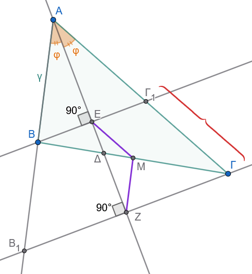{fig-align="center" width="400"}
:::

**(α) Απόδειξη ότι** $ΒΒ_1 = ΓΓ_1 = \beta - \gamma$

1.  **Στο τρίγωνο** $ΑΒΓ_1$:

    Το τμήμα $ΑΕ$ είναι ταυτόχρονα διχοτόμος και ύψος.

    Επομένως, το τρίγωνο $ΑΒΓ_1$ είναι **ισοσκελές**, που σημαίνει: $$ΑΓ_1 = ΑΒ = \gamma \quad \text{και} \quad ΒΕ = ΕΓ_1 \quad (1)$$

    *(δηλαδή το* $Ε$ είναι το μέσο του $ΒΓ_1$)

2.  **Στο τρίγωνο** $ΑΒ_1Γ$:

    Ομοίως, το τμήμα $ΑΖ$ είναι διχοτόμος και ύψος.

    Άρα, το τρίγωνο $ΑΒ_1Γ$ είναι **ισοσκελές**, που σημαίνει: $$ΑΒ_1 = ΑΓ = \beta \quad \text{και} \quad Β_1Ζ = ΖΓ \quad (2)$$

    *(δηλαδή το* $Ζ$ είναι το μέσο του $ΓΒ_1$)

3.  **Αφαίρεση κατά μέλη:**

    Αφαιρούμε κατά μέλη τις σχέσεις: $$\begin{aligned}
    ΑΒ_1 &= ΑΓ = \beta \\
    -(\,ΑΒ &= ΑΓ_1 = \gamma\,) \\
    \hline
    ΑΒ_1 - ΑΒ &= ΑΓ - ΑΓ_1 = \beta - \gamma
    \end{aligned}$$

    Επειδή $ΑΒ_1 - ΑΒ = ΒΒ_1$ και $ΑΓ - ΑΓ_1 = ΓΓ_1$, έχουμε: $$ΒΒ_1 = ΓΓ_1 = \beta - \gamma$$

**(β) & (γ) Υπολογισμός του** $ΜΕ$ και απόδειξη ότι το τρίγωνο $ΜΕΖ$ είναι ισοσκελές

1.  **Στο τρίγωνο** $ΒΓΓ_1$:

    - Το $Μ$ είναι το μέσο της πλευράς $ΒΓ$.
    - Το $Ε$ είναι το μέσο της πλευράς $ΒΓ_1$ (από τη σχέση $1$).

    Επομένως, το τμήμα $ΜΕ$ ενώνει τα μέσα δύο πλευρών του τριγώνου, οπότε ισούται με το μισό της τρίτης πλευράς: $$ΜΕ = \frac{ΓΓ_1}{2} = \frac{\beta - \gamma}{2} \quad (3)$$

2.  **Στο τρίγωνο** $ΒΓΒ_1$:

    - Το $Μ$ είναι το μέσο της πλευράς $ΒΓ$.
    - Το $Ζ$ είναι το μέσο της πλευράς $ΓΒ_1$ (από τη σχέση $2$).

    Ομοίως, το τμήμα $ΜΖ$ ενώνει τα μέσα δύο πλευρών, άρα: $$ΜΖ = \frac{ΒΒ_1}{2} = \frac{\beta - \gamma}{2} \quad (4)$$

3.  **Συμπέρασμα:**

    Από τις σχέσεις $(3)$ και $(4)$ προκύπτει ότι: $$ΜΕ = ΜΖ = \frac{\beta - \gamma}{2}$$

    Συνεπώς, το τρίγωνο $ΜΕΖ$ έχει δύο ίσες πλευρές ($ΜΕ = ΜΖ$), άρα είναι **ισοσκελές**.
::::

:::: {.math-box .exercise-box}
::: {.math-title .exercise-title}
5.  Εκφώνηση
:::

Δίνεται τρίγωνο $ΑΒΓ$ και η διάμεσός του $ΒΕ$.
Αν $Δ$ είναι το μέσο της $ΒΕ$ και $Ζ$ είναι το σημείο τομής των ευθειών $ΒΓ$ και $ΑΔ$, να αποδείξετε ότι: $$ΖΓ = 2 \cdot ΒΖ$$
::::

:::: {.math-box .solution-box}
::: {.math-title .solution-title}
**Λύση**

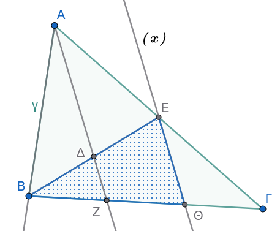{fig-align="center" width="350"}
:::

1.  **Βοηθητική κατασκευή:**

    Από το σημείο $Ε$ φέρνουμε ευθεία $(x)$ παράλληλη προς την $ΑΖ$ ($Ε\Theta \parallel ΑΖ$), η οποία τέμνει την πλευρά $ΒΓ$ στο σημείο $\Theta$.

2.  **Στο τρίγωνο** $Β\Theta Ε$:

    - Το σημείο $Δ$ είναι το μέσο της πλευράς $ΒΕ$.
    - Το τμήμα $ΔΖ$ είναι παράλληλο προς την πλευρά $Ε\Theta$ (αφού η ευθεία $ΑΔΖ$ είναι παράλληλη προς την $Ε\Theta$).

    Επομένως, η ευθεία $ΔΖ$ διέρχεται και από το μέσο της πλευράς $Β\Theta$, δηλαδή το $Ζ$ είναι το μέσο του $Β\Theta$: $$ΒΖ = Ζ\Theta \quad (1)$$

3.  **Στο τρίγωνο** $ΑΖΓ$:

    - Το σημείο $Ε$ είναι το μέσο της πλευράς $ΑΓ$ (αφού η $ΒΕ$ είναι διάμεσος του αρχικού τριγώνου $ΑΒΓ$).
    - Το τμήμα $Ε\Theta$ είναι παράλληλο προς την πλευρά $ΑΖ$ (από την κατασκευή μας).

    Συνεπώς, το σημείο $\Theta$ είναι το μέσο της πλευράς $ΖΓ$: $$Ζ\Theta = \Theta Γ \quad (2)$$

4.  **Συσχετισμός και συμπέρασμα:**

    Από τις σχέσεις $(1)$ και $(2)$ έχουμε ότι: $$ΒΖ = Ζ\Theta = \Theta Γ$$

    Άρα, για το μήκος του τμήματος $ΖΓ$ ισχύει: $$ΖΓ = Ζ\Theta + \Theta Γ = 2 \cdot Ζ\Theta = 2 \cdot ΒΖ$$
::::

:::: {.math-box .exercise-box}
::: {.math-title .exercise-title}
6.  Εκφώνηση
:::

Τα ευθύγραμμα τμήματα που ορίζονται από τα μέσα των απέναντι πλευρών ενός τετραπλεύρου και τα μέσα των διαγωνίων του, συντρέχουν στο ίδιο σημείο (διέρχονται από το ίδιο σημείο) και διχοτομούνται από αυτό.

**Δεδομένα & Συμβολισμοί**

Έστω τετράπλευρο $ΑΒΓΔ$:

- **Μέσα των πλευρών:**
  - $Ε$ είναι το μέσο της $ΑΒ$
  - $Ζ$ είναι το μέσο της $ΒΓ$
  - $Η$ είναι το μέσο της $ΓΔ$
  - $\Theta$ είναι το μέσο της $ΔΑ$
- **Μέσα των διαγωνίων:**
  - $Κ$ είναι το μέσο της διαγωνίου $ΑΓ$
  - $\Lambda$ είναι το μέσο της διαγωνίου $ΒΔ$

Θέλουμε να δείξουμε ότι τα ευθύγραμμα τμήματα $ΕΗ$, $\Theta Ζ$ (που ενώνουν τα μέσα των απέναντι πλευρών) και το $Κ\Lambda$ (που ενώνει τα μέσα των διαγωνίων) συντρέχουν στο ίδιο σημείο $Ο$ και διχοτομούνται από αυτό.
::::

:::: {.math-box .solution-box}
::: {.math-title .solution-title}
**Λύση**

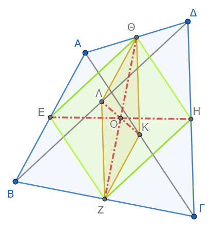{fig-align="center" width="350"}
:::

**1. Το τετράπλευρο** $ΕΖΗ\Theta$ είναι παραλληλόγραμμο

- **Στο τρίγωνο** $ΔΑΒ$: Το τμήμα $\Theta Ε$ ενώνει τα μέσα των πλευρών $ΔΑ$ και $ΑΒ$, οπότε: $$\Theta Ε \parallel ΔΒ \quad \text{και} \quad \Theta Ε = \frac{ΔΒ}{2}$$

- **Στο τρίγωνο** $ΔΓΒ$: Το τμήμα $ΗΖ$ ενώνει τα μέσα των πλευρών $ΔΓ$ και $ΓΒ$, οπότε: $$ΗΖ \parallel ΔΒ \quad \text{και} \quad ΗΖ = \frac{ΔΒ}{2}$$

Επειδή $\Theta Ε \parallel ΗΖ$ και $\Theta Ε = ΗΖ$, το τετράπλευρο $ΕΖΗ\Theta$ είναι παραλληλόγραμμο.

Άρα, οι διαγώνιοί του $\Theta Ζ$ και $ΗΕ$ τέμνονται στο σημείο $Ο$, το οποίο είναι το κέντρο του παραλληλογράμμου και διχοτομεί και τις δύο διαγωνίους.

**2. Το τετράπλευρο** $\Theta \Lambda Ζ Κ$ είναι παραλληλόγραμμο

- **Στο τρίγωνο** $ΑΔΓ$: Το τμήμα $\Theta Κ$ ενώνει τα μέσα των πλευρών $ΑΔ$ και $ΑΓ$, οπότε: $$\Theta Κ \parallel ΔΓ \quad \text{και} \quad \Theta Κ = \frac{ΔΓ}{2}$$

- **Στο τρίγωνο** $ΒΔΓ$: Το τμήμα $\Lambda Ζ$ ενώνει τα μέσα των πλευρών $ΒΔ$ και $ΒΓ$, οπότε: $$\Lambda Ζ \parallel ΔΓ \quad \text{και} \quad \Lambda Ζ = \frac{ΔΓ}{2}$$

Επειδή $\Theta Κ \parallel \Lambda Ζ$ και $\Theta Κ = \Lambda Ζ$, το τετράπλευρο $\Theta \Lambda Ζ Κ$ είναι επίσης παραλληλόγραμμο.

Άρα, οι διαγώνιοί του $\Theta Ζ$ και $Κ\Lambda$ τέμνονται και διχοτομούνται στο κέντρο του, έστω $Ο_1$.

**3. Σύμπτωση των κέντρων και τελικό συμπέρασμα**

Τα δύο παραλληλόγραμμα $ΕΖΗ\Theta$ και $\Theta \Lambda Ζ Κ$ έχουν **κοινή τη διαγώνιο** $\Theta Ζ$.

- Το σημείο $Ο$ είναι το μέσο της $\Theta Ζ$.
- Το σημείο $Ο_1$ είναι επίσης το μέσο της ίδιας διαγωνίου $\Theta Ζ$.

Συνεπώς, τα κέντρα ταυτίζονται ($Ο \equiv Ο_1$).

Αυτό αποδεικνύει ότι και τα τρία ευθύγραμμα τμήματα:

- $ΕΗ$
- $\Theta Ζ$
- $Κ\Lambda$

διέρχονται από το κοινό σημείο $Ο$ και διχοτομούνται από αυτό.
::::

:::: {.math-box .exercise-box}
::: {.math-title .exercise-title}
7.  Εκφώνηση
:::

Πάνω στις πλευρές ενός παραλληλογράμμου $ΑΒΓΔ$ και εξωτερικά από αυτό κατασκευάζουμε τέσσερα τετράγωνα.
Να αποδείξετε ότι τα κέντρα των τεσσάρων αυτών τετραγώνων αποτελούν κορυφές ενός νέου τετραγώνου.
::::

:::: {.math-box .solution-box}
::: {.math-title .solution-title}
**Λύση**

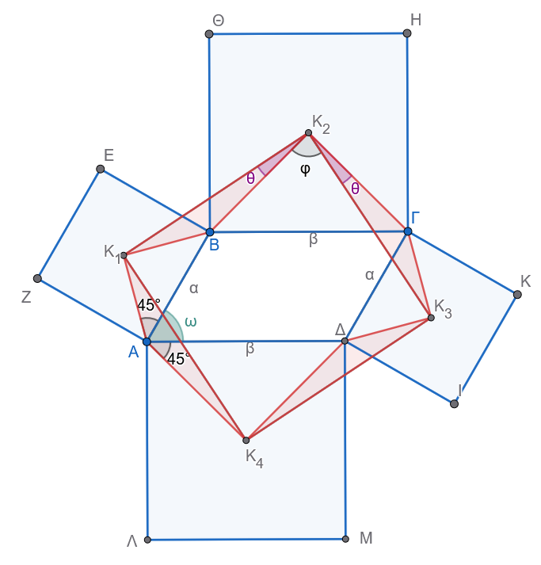{fig-align="center" width="450"}
:::

Έστω παραλληλόγραμμο $ΑΒΓΔ$ με $ΑΒ = ΓΔ = a$, $ΒΓ = ΔΑ = β$ και γωνία $\widehat{Α} = \widehat{Γ} = \omega$, οπότε $\widehat{Β} = \widehat{Δ} = 180^\circ - \omega$.

1.  **Κέντρα τετραγώνων και αποστάσεις:**

    - Έστω $Κ_1, Κ_2, Κ_3, Κ_4$ τα κέντρα των τετραγώνων που κατασκευάζονται εξωτερικά στις πλευρές $ΑΒ, ΒΓ, ΓΔ, ΔΑ$ αντίστοιχα.
    - Το κέντρο κάθε τετραγώνου ισαπέχει από τις κορυφές της πλευράς του και σχηματίζει γωνία $45^\circ$ με αυτές: $$Κ_1Α = Κ_1Β = Κ_3Γ = Κ_3Δ = \frac{a\sqrt{2}}{2}$$ $$Κ_4Α = Κ_4Δ = Κ_2Β = Κ_2Γ = \frac{β\sqrt{2}}{2}$$

2.  **Υπολογισμός γωνιών:**

    - Στην κορυφή $Α$: $$\widehat{Κ_1ΑΚ_4} = \widehat{Κ_1ΑΒ} + \widehat{ΒΑΔ} + \widehat{ΔΑΚ_4} = 45^\circ + \omega + 45^\circ = 90^\circ + \omega$$
    - Στην κορυφή $Β$: $$\widehat{Κ_1ΒΚ_2} = 360^\circ - (\widehat{Κ_1ΒΑ} + \widehat{ΑΒΓ} + \widehat{ΓΒΚ_2}) = 360^\circ - (45^\circ + (180^\circ - \omega) + 45^\circ) = 90^\circ + \omega$$
    - Ομοίως προκύπτει ότι $\widehat{Κ_2ΓΚ_3} = \widehat{Κ_3ΔΚ_4} = 90^\circ + \omega$.

3.  **Ισότητα τριγώνων και συμπέρασμα:**

    - Τα τρίγωνα $\triangle Κ_1ΑΚ_4$, $\triangle Κ_1ΒΚ_2$, $\triangle Κ_3ΓΚ_2$ και $\triangle Κ_3ΔΚ_4$ είναι ίσα μεταξύ τους από το κριτήριο **Π-Γ-Π** (έχουν δύο πλευρές ίσες μία προς μία και την περιεχόμενη γωνία $90^\circ + \omega$).
    - Άρα: $$Κ_1Κ_4 = Κ_1Κ_2 = Κ_2Κ_3 = Κ_3Κ_4$$ δηλαδή το τετράπλευρο $Κ_1Κ_2Κ_3Κ_4$ είναι **ρόμβος**.
    - Επιπλέον, από την ισότητα των γωνιών προκύπτει ότι οι διαδοχικές πλευρές του είναι κάθετες μεταξύ τους ($\widehat{Κ_1Κ_2Κ_3} = 90^\circ$), διότι :

    $\widehat{ΒΚ_2Γ}=90^ο=\hat φ+\hat θ$

    επίσης $\widehat{Κ_1Κ_2Κ_3}=\hat φ+\hat θ$

    άρα $\widehat{Κ_1Κ_2Κ_3}=90^ο$ οπότε το τετράπλευρο $Κ_1Κ_2Κ_3Κ_4$ είναι **τετράγωνο**.
::::

:::: {.math-box .exercise-box}
::: {.math-title .exercise-title}
8.  Εκφώνηση
:::

Με βάση τις πλευρές $ΑΒ$ και $ΑΓ$ ενός τριγώνου $ΑΒΓ$ κατασκευάζουμε εξωτερικά τα τετράγωνα $ΑΒ\Theta Ε$ και $ΑΓΗΖ$.
Αν $Μ$ είναι το μέσο του τμήματος $ΕΖ$, να αποδείξετε ότι η ευθεία $ΑΜ$ είναι κάθετη στην πλευρά $ΒΓ$.
::::

:::: {.math-box .solution-box}
::: {.math-title .solution-title}
**Λύση**

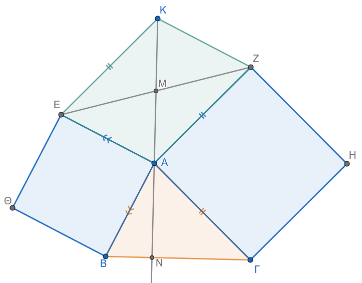{fig-align="center" width="450"}
:::

1.  **Βοηθητική κατασκευή:** Προεκτείνουμε τη διάμεσο $ΑΜ$ του τριγώνου $ΑΕΖ$ κατά ίσο τμήμα $ΜΚ = ΑΜ$.

    - Το τετράπλευρο $ΑΕΚΖ$ έχει τις διαγωνίους του $ΕΖ$ και $ΑΚ$ να διχοτομούνται στο $Μ$, άρα είναι **παραλληλόγραμμο**.
    - Επομένως: $$ΕΚ = ΑΖ = ΑΓ \quad \text{και} \quad ΕΚ \parallel ΑΖ$$

2.  **Σύγκριση τριγώνων** $\triangle ΑΒΓ$ και $\triangle ΕΑΚ$:

    - $ΑΕ = ΑΒ$ (πλευρές του τετραγώνου $ΑΒ\Theta Ε$).
    - $ΕΚ = ΑΓ$ (αφού $ΕΚ = ΑΖ = ΑΓ$).
    - Γωνίες: Στο σημείο $Α$ έχουμε $\widehat{ΒΑΓ} + \widehat{ΕΑΖ} = 360^\circ - 90^\circ - 90^\circ = 180^\circ \implies \widehat{ΒΑΓ} = 180^\circ - \widehat{ΕΑΖ}$. Επειδή $ΕΚ \parallel ΑΖ$, οι εντός και επί τα αυτά μέρη γωνίες είναι παραπληρωματικές, άρα $\widehat{ΑΕΚ} = 180^\circ - \widehat{ΕΑΖ}$. Συνεπώς: $\widehat{ΑΕΚ} = \widehat{ΒΑΓ}$.

    Άρα, τα τρίγωνα $\triangle ΑΒΓ$ και $\triangle ΕΑΚ$ είναι **ίσα** (κριτήριο **Π-Γ-Π**), οπότε $\widehat{ΕΑΚ} = \widehat{ΑΒΓ} = \widehat{Β}$.

3.  **Καθετότητα:** Έστω $Ν$ το σημείο στο οποίο η ευθεία $ΑΜ$ (δηλαδή η $ΑΚ$) τέμνει τη $ΒΓ$.

    - Στο τρίγωνο $\triangleΑΒΝ$ , η γωνία $\widehat{ΒΑΝ} = 90^\circ - \widehat{ΕΑΚ} = 90^\circ - \widehat{Β}$.
    - Αρα στο τρίγωνο $\triangle ΑΒΝ$ θα έχουμε: $$\widehat{ΑΝΒ} = 180^\circ - (\widehat{Β} + \widehat{ΒΑΝ}) = 180^\circ - (\widehat{Β} + 90^\circ - \widehat{Β}) = 90^\circ$$
    - Συνεπώς, $ΑΝ \perp ΒΓ \implies ΑΜ \perp ΒΓ$.
::::

:::: {.math-box .exercise-box}
::: {.math-title .exercise-title}
9.  Εκφώνηση
:::

Δίνεται γωνία $x\widehat{O}y$ και πάνω στις πλευρές της θεωρούμε δύο ίσα ευθύγραμμα τμήματα $ΑΔ$ (πάνω στην $Ox$) και $ΒΓ$ (πάνω στην $Oy$).
Να αποδείξετε ότι η ευθεία που ενώνει τα μέσα των τμημάτων $ΔΓ$ και $ΑΒ$ είναι παράλληλη προς τη διχοτόμο της γωνίας $x\widehat{O}y$.
::::

:::: {.math-box .solution-box}
::: {.math-title .solution-title}
**Λύση**

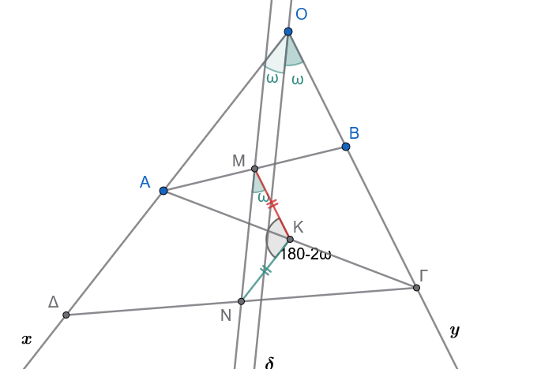{fig-align="center" width="450"}
:::

Έστω $ΑΔ = ΒΓ = d$.

- $Μ$ είναι το μέσο του $ΑΒ$.
- $Ν$ είναι το μέσο του $ΔΓ$.
- Θεωρούμε το σημείο $Κ$ ως το **μέσο του τμήματος** $ΑΓ$.

1.  **Στο τρίγωνο** $\triangle ΑΒΓ$:

    Το τμήμα $ΜΚ$ ενώνει τα μέσα των πλευρών $ΑΒ$ και $ΑΓ$, άρα: $$ΜΚ \parallel ΒΓ \ (\text{δηλαδή } ΜΚ \parallel Oy) \quad \text{και} \quad ΜΚ = \frac{ΒΓ}{2} = \frac{d}{2}$$

2.  **Στο τρίγωνο** $\triangle ΑΔΓ$:

    Το τμήμα $ΚΝ$ ενώνει τα μέσα των πλευρών $ΑΓ$ και $ΔΓ$, άρα: $$ΚΝ \parallel ΑΔ \ (\text{δηλαδή } ΚΝ \parallel Ox) \quad \text{και} \quad ΚΝ = \frac{ΑΔ}{2} = \frac{d}{2}$$

3.  **Ισοσκελές τρίγωνο** $\triangle ΜΚΝ$ και διχοτόμος:

    - Επειδή $ΜΚ = ΚΝ = \dfrac{d}{2}$, το τρίγωνο $\triangle ΜΚΝ$ είναι **ισοσκελές**.
    - Οι πλευρές $ΚΝ$ και $ΚΜ$ είναι παράλληλες προς τις πλευρές $Ox$ και $Oy$ της γωνίας $x\widehat{O}y$ αντίστοιχα, και αφού η μία είναι οξεία και η άλλη αμβλεία $\widehat{ΜΚΝ} = 180^ο-x\widehat{O}y = 180^ο-2\omega$.
    - Στο ισοσκελές τρίγωνο $\triangle ΜΚΝ$, η γωνία $\widehat{ΜΝΚ}=ω=\widehat{δOy}$ .
    - Επειδή η $Oy//MK$ θα πρέπει και οι άλλες πλευρές να είναι παράλληλες αυτών των ίσων γωνιών, δηλαδή $ΜΝ//Οδ$.

    Συνεπώς, η ευθεία $ΜΝ$ είναι **παράλληλη προς τη διχοτόμο** της γωνίας $x\widehat{O}y$.
::::

------------------------------------------------------------------------

### Η Μεσοπαράλληλος Δύο Παραλλήλων

#### Θεώρημα & Απόδειξη

:::: {.math-box .theorem-box}
::: {.math-title .theorem-title}
**Θεώρημα:**
:::

Ο γεωμετρικός τόπος των σημείων του επιπέδου που ισαπέχουν από δύο παράλληλες ευθείες $\epsilon_1$ και $\epsilon_2$ είναι μια ευθεία $\epsilon$ παράλληλη προς τις $\epsilon_1, \epsilon_2$, η οποία διέρχεται από τα μέσα των τμημάτων που έχουν τα άκρα τους στις δύο παράλληλες (μεσοπαράλληλος ευθεία).
::::

:::: {.math-box .apodeixi-box}
::: {.math-title .apodeixi-title}
**Απόδειξη:**

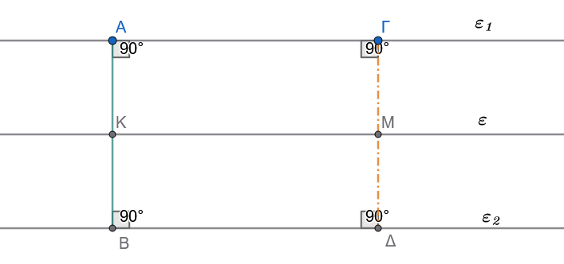{fig-align="center" width="500"}
:::

Θεωρούμε δύο παράλληλες ευθείες $\epsilon_1$ και $\epsilon_2$ και ένα τμήμα $AB = d$ κάθετο προς αυτές ($A \in \epsilon_1, B \in \epsilon_2$).

Αν από το μέσο $K$ του $AB$ φέρουμε την ευθεία $\epsilon \parallel \epsilon_1, \epsilon_2$, παρατηρούμε ότι κάθε σημείο $M$ της $\epsilon$ ισαπέχει από τις $\epsilon_1$ και $\epsilon_2$.

Πράγματι, φέρουμε $M\Gamma \perp \epsilon_1$ και $M\Delta \perp \epsilon_2$.
Τα τετράπλευρα $M\Gamma AK$ και $M\Delta BK$ είναι παραλληλόγραμμα (έχουν τις απέναντι πλευρές παράλληλες), οπότε $M\Gamma = AK = \dfrac{d}{2}$ και $M\Delta = KB = \dfrac{d}{2}$, δηλαδή $M\Gamma = M\Delta$.

**Αντίστροφα**, αν ένα σημείο $M$ ισαπέχει από τις $\epsilon_1, \epsilon_2$, τότε $M\Gamma = M\Delta = \dfrac{d}{2}$.

Τα τετράπλευρα $M\Gamma AK$ και $M\Delta BK$ είναι παραλληλόγραμμα ($M\Gamma \parallel = AK$ και $M\Delta \parallel = KB$), οπότε $MK \parallel \epsilon_1, \epsilon_2$, δηλαδή το $M$ ανήκει στην ευθεία $\epsilon$.
::::

------------------------------------------------------------------------

#### Πόρισμα & Απόδειξη

:::: {.math-box .proposal-box}
::: {.math-title .proposal-title}
**Πόρισμα:**
:::

Κάθε ευθεία παράλληλη προς δύο παράλληλες ευθείες $\epsilon_1, \epsilon_2$ που διέρχεται από το μέσο ευθύγραμμου τμήματος με άκρα στις $\epsilon_1, \epsilon_2$, είναι η μεσοπαράλληλος ευθεία τους.
::::

:::: {.math-box .proposalproof-box}
::: {.math-title .proposalproof-title}
**Απόδειξη:**

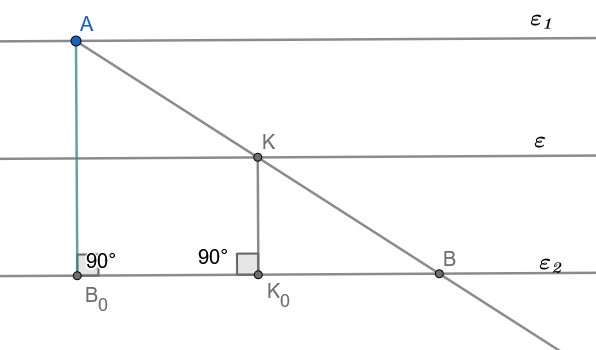{fig-align="center" width="400"}
:::

Έστω τμήμα $AB$ με $A \in \epsilon_1$ και $B \in \epsilon_2$ και $K$ το μέσο του.

Αν φέρουμε την κάθετο $A B_0 \perp \epsilon_2$, το μέσο $K$ προβάλλεται στο μέσο του $A B_0$ λόγω του Θεωρήματος παραλλήλων και θα ισχύει $ΚΚ_0=\dfrac{ΑΒ}{2}$.

Συνεπώς, κάθε σημείο της ευθείας που διέρχεται από το $K$ παράλληλα προς τις $\epsilon_1, \epsilon_2$ ισαπέχει από αυτές.
::::

------------------------------------------------------------------------

### Βαρύκεντρο Τριγώνου

#### Θεώρημα & Απόδειξη

:::: {.math-box .theorem-box}
::: {.math-title .theorem-title}
**Θεώρημα:**
:::

Οι διάμεσοι ενός τριγώνου διέρχονται από το ίδιο σημείο (βαρύκεντρο $\Theta$), του οποίου η απόσταση από κάθε κορυφή είναι τα $\dfrac{2}{3}$ του μήκους της αντίστοιχης διαμέσου.
::::

:::: {.math-box .apodeixi-box}
::: {.math-title .apodeixi-title}
**Απόδειξη:**

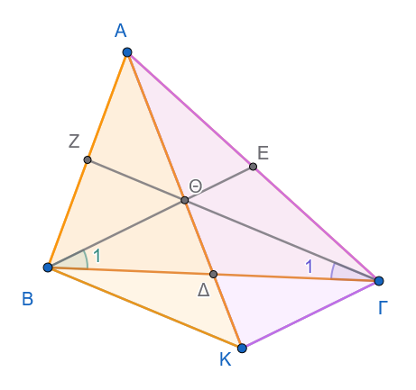{fig-align="center" width="350"}
:::

Έστω τρίγωνο $AB\Gamma$ και οι διάμεσοι $BE$ και $\Gamma Z$.

Επειδή $\widehat{B}_1 + \widehat{\Gamma}_1 < \widehat{B} + \widehat{\Gamma} < 180^\circ$, οι δύο διάμεσοι τέμνονται σε εσωτερικό σημείο $\Theta$ του τριγώνου.

Αν η $A\Theta$ τέμνει τη $B\Gamma$ στο $\Delta$, θα αποδείξουμε ότι η $A\Delta$ είναι διάμεσος και $A\Theta = \dfrac{2}{3}A\Delta$.

Στην ημιευθεία $\Theta\Delta$ παίρνουμε τμήμα $\Theta K = A\Theta$.

Στο τρίγωνο $A\Gamma K$, τα σημεία $E$ και $\Theta$ είναι τα μέσα των $A\Gamma$ και $AK$, οπότε: $$E\Theta \parallel = \dfrac{\Gamma K}{2}\quad (1)\quad$$

Όμοια, από το τρίγωνο $ABK$ έχουμε: $$Z\Theta \parallel = \dfrac{BK}{2}\quad (2)\quad$$

Από τις (1) και (2) προκύπτει ότι $BE \parallel \Gamma K$ και $\Gamma Z \parallel BK$, δηλαδή το $B\Theta\Gamma K$ είναι παραλληλόγραμμο.

Άρα οι διαγώνιοί του διχοτομούνται, οπότε $B\Delta = \Delta\Gamma$, δηλαδή η $A\Delta$ είναι η τρίτη διάμεσος του τριγώνου.

Επίσης, από το παραλληλόγραμμο $B\Theta\Gamma K$ έχουμε $\Theta\Delta = \dfrac{\Theta K}{2} = \dfrac{A\Theta}{2} \Rightarrow A\Theta = 2\Theta\Delta$.

Επειδή $A\Delta = A\Theta + \Theta\Delta = 3\Theta\Delta$, προκύπτει: $$\Theta\Delta = \dfrac{1}{3}A\Delta \quad \text{και} \quad A\Theta = \dfrac{2}{3}A\Delta\quad$$
::::

------------------------------------------------------------------------

#### Πόρισμα & Απόδειξη

:::: {.math-box .proposal-box}
::: {.math-title .proposal-title}
**Πόρισμα:**
:::

Η απόσταση του βαρυκέντρου $\Theta$ από το μέσο κάθε πλευράς τριγώνου ισούται με το $\dfrac{1}{3}$ του μήκους της αντίστοιχης διαμέσου.
::::

:::: {.math-box .proposalproof-box}
::: {.math-title .proposalproof-title}
**Απόδειξη: (Σχήμα του θεωρήματος)**
:::

Από το θεώρημα του βαρυκέντρου έχουμε $A\Theta = \dfrac{2}{3}A\Delta$.

Επειδή $A\Delta = A\Theta + \Theta\Delta$, αντικαθιστώντας λαμβάνουμε: $$\Theta\Delta = A\Delta - A\Theta = A\Delta - \dfrac{2}{3}A\Delta = \dfrac{1}{3}A\Delta\quad$$
::::

------------------------------------------------------------------------

#### Εφαρμογές

:::: {.math-box .example-box}
::: {.math-title .example-title}
**Εφαρμογή 1η:**
:::

Σε παραλληλόγραμμο $AB\Gamma\Delta$ προεκτείνουμε την $AB$ κατά τμήμα $BE = AB$.

Αν η $\Delta E$ τέμνει την $A\Gamma$ στο $H$ και τη $B\Gamma$ στο $Z$, να αποδειχθεί ότι $BZ = Z\Gamma$ και $\Gamma H = \dfrac{AH}{2}$.
::::

:::: {.math-box .examplesolution-box}
::: {.math-title .examplesolution-title}
**Λύση:**

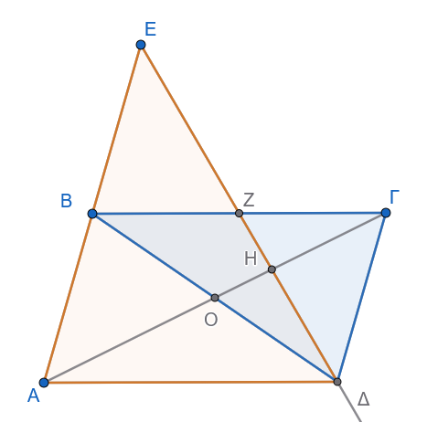{fig-align="center" width="350"}
:::

Στο τρίγωνο $A\Delta E$, το $B$ είναι μέσο της $AE$ και η $BZ \parallel A\Delta$, άρα το $Z$ είναι μέσο της $\Delta E$.

Επίσης αφού $ΑΒ=ΒΕ=//ΓΔ$, το ΒΕΓΔ είναι παραλληλόγραμμο και άρα οι διαγώνιο διχοτομούνται.

Άρα το Ζ είναι μέσο και της $B\Gamma$, οπότε $BZ = Z\Gamma$.

Έτσι το $H$ είναι σημείο τομής των διαμέσων $ΓΟ$ και $\Delta Z$ του τριγώνου $ΒΔΓ$, δηλαδή είναι το βαρύκεντρό του, άρα $\Gamma H = \dfrac{2}{3}ΓΟ$ και $ΟΗ=\dfrac{1}{3}OΓ$ δηλαδή $ΓΗ=2ΟΗ$.

Αλλά $ΑΗ=ΑΟ+ΟΗ=ΟΓ+ΟΗ=ΟΗ+ΗΓ+ΟΗ=2ΟΗ+ΗΓ=ΗΓ+ΗΓ=2ΗΓ \implies ΗΓ=\dfrac{AH}{2}$
::::

:::: {.math-box .example-box}
::: {.math-title .example-title}
**Εφαρμογή 2η:**
:::

Σε κυρτό τετράπλευρο $AB\Gamma\Delta$ θεωρούμε το βαρύκεντρο $K$ του τριγώνου $AB\Gamma$ και τα μέσα $E, Z, H$ των $AB, \Gamma\Delta, K\Delta$ αντίστοιχα.

Να αποδειχθεί ότι $EH \parallel KZ$.
::::

:::: {.math-box .examplesolution-box}
::: {.math-title .examplesolution-title}
*Λύση:*

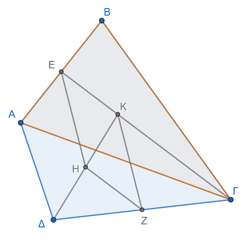{fig-align="center" width="400"}
:::

Στο τρίγωνο $AB\Gamma$, $E$ μέσο της $AB$, οπότε η $ΓE$ διέρχεται από το $K$ και $ΓK = 2KE$.

Στο $\Delta\Gamma K\Delta$, τα $H, Z$ είναι μέσα των $K\Delta, \Gamma\Delta$, οπότε $HZ \parallel = \dfrac{K\Gamma}{2} = KE$.

Άρα το $EZHK$ είναι παραλληλόγραμμο, οπότε $EH \parallel KZ$.
::::

:::: {.math-box .example-box}
::: {.math-title .example-title}
Εφαρμογή 3η:
:::

Αν $E$ και $Z$ είναι τα μέσα των πλευρών $B\Gamma$ και $\Gamma\Delta$ παραλληλογράμμου $AB\Gamma\Delta$ αντίστοιχα, οι ευθείες $AE$ και $AZ$ τριχοτομούν τη διαγώνιο $B\Delta$.
::::

:::: {.math-box .examplesolution-box}
::: {.math-title .examplesolution-title}
**Απόδειξη:**
:::

Έστω παραλληλόγραμμο $AB\Gamma\Delta$ και $O$ το κέντρο του (σημείο τομής των διαγωνίων).

Στο τρίγωνο $AB\Gamma$, η $AO$ είναι διάμεσος (αφού $BO = O\Delta$) και η $AE$ είναι επίσης διάμεσος (αφού $E$ μέσο της $B\Gamma$).

Συνεπώς, το σημείο τομής τους $K$ είναι το βαρύκεντρο του τριγώνου $AB\Gamma$.

Άρα: $$BK = \dfrac{2}{3}BO\quad$$

Όμοια, στο τρίγωνο $A\Gamma\Delta$, οι $AO$ και $AZ$ είναι διάμεσοι, άρα τέμνονται στο βαρύκεντρο $L$ του τριγώνου $A\Gamma\Delta$, οπότε: $$\Delta L = \dfrac{2}{3}\Delta O\quad$$

Επειδή $BO = O\Delta$, προκύπτει ότι $BK = KL = L\Delta = \dfrac{1}{3}B\Delta$, δηλαδή οι ευθείες $AE$ και $AZ$ τριχοτομούν τη διαγώνιο $B\Delta$.
::::

------------------------------------------------------------------------

#### Ασκήσεις

1.  Αν σε τρίγωνο $AB\Gamma$ είναι $\mu_\beta = \mu_\gamma$, να αποδείξετε ότι $\beta = \gamma$ (το τρίγωνο είναι ισοσκελές).

:::: callout-method
::: {.callout-methot .callout-title}
Υπόδειξη:
:::

Αν $ΒΔ=μ_β$ και $ΓΕ=μ_γ$ που τέμνονται στο Κ, τότε τα τρίγωνα ΒΚΕ και ΓΚΔ είναι ίσα (γιατί;).

Αυτό σημαίνει ΒΕ=ΓΔ, .................................................
::::

2.  Σε τρίγωνο $AB\Gamma$, $\Delta$ είναι το μέσο της διαμέσου $AM$. Αν η $B\Delta$ τέμνει την $A\Gamma$ στο $E$, να αποδειχθεί ότι $AE = \dfrac{E\Gamma}{2}$.

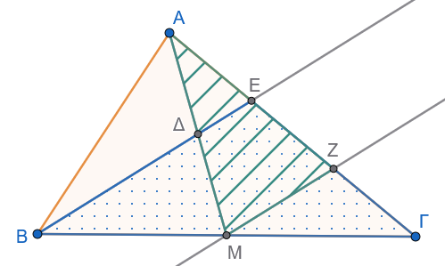{fig-align="center" width="400"}

:::: callout-method
::: {.callout-methot .callout-title}
Υπόδειξη:
:::

Σχεδιάζουμε ΜΖ//ΒΕ.

Στο τρίγωνο ΒΕΓ το Μ είναι μέσον της ΒΓ , άρα το Ζ ..................

Στο τρίγωνο ΑΜΖ το Δ είναι μέσον της ΑΜ , άρα το Ε ....................................
::::

3.  Δίνεται τρίγωνο $AB\Gamma$. Στις προεκτάσεις των διαμέσων $B\Delta$ και $\Gamma E$ παίρνουμε σημεία $H$ και $Z$ ώστε $\Delta H = B\Delta$ και $ZE = \Gamma E$. Να αποδειχθεί ότι τα σημεία $Z, A, H$ είναι συνευθειακά.

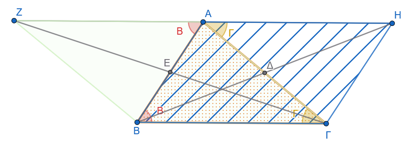{width="500"}\

:::: callout-method
::: {.callout-methot .callout-title}
Υπόδειξη:
:::

Τα τετράπλευρα ΖΒΓΑ και ΑΒΓΗ είναι παραλληλόγραμμα επειδή οι διαγώνιοί τους .................

'Άρα ............................
::::

:::: {.math-box .exercise-box}
::: {.math-title .exercise-title}
4.  Εκφώνηση
:::

Στις πλευρές $AB, B\Gamma, \Gamma A$ ισόπλευρου τριγώνου $AB\Gamma$ παίρνουμε τμήματα $A\Delta = BE = \Gamma Z$.
Να αποδειχθεί ότι το βαρύκεντρο του $\Delta\Delta EZ$ ταυτίζεται με το βαρύκεντρο του $AB\Gamma$.
::::

:::: {.math-box .solution-box}
::: {.math-title .solution-title}
Λύση

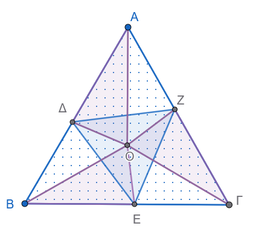{fig-align="center" width="350"}
:::

**1: Το τρίγωνο** $\Delta EZ$ είναι ισόπλευρο

1.  Επειδή το τρίγωνο $AB\Gamma$ είναι ισόπλευρο, έχουμε: $$AB = B\Gamma = \Gamma A \quad \text{και} \quad \hat{A} = \hat{B} = \hat{\Gamma} = 60^\circ$$

2.  Μας δίνεται ότι $A\Delta = BE = \Gamma Z$.
    Αφαιρώντας ίσα τμήματα από ίσες πλευρές, προκύπτει ότι και τα υπόλοιπα τμήματα είναι ίσα: $$\Delta B = E\Gamma = ZA$$

3.  Συγκρίνουμε τα τρίγωνα $A\Delta Z$, $BE\Delta$ και $\Gamma ZE$:

    - $A\Delta = BE = \Gamma Z$ (από υπόθεση)
    - $AZ = \Delta B = E\Gamma$ (από το προηγούμενο βήμα)
    - $\hat{A} = \hat{B} = \hat{\Gamma} = 60^\circ$

    Από το κριτήριο **Π-Γ-Π** (Πλευρά - Γωνία - Πλευρά), τα τρία αυτά τρίγωνα είναι **ίσα**.

4.  Επομένως, και οι απέναντι πλευρές τους είναι ίσες: $$\Delta Z = \Delta E = EZ$$ Άρα, το τρίγωνο $\Delta EZ$ είναι **ισόπλευρο**.

**2: Ιδιότητες του κέντρου** $O$ του $AB\Gamma$

Έστω $O$ το βαρύκεντρο του ισόπλευρου τριγώνου $AB\Gamma$.

Στο ισόπλευρο τρίγωνο, το βαρύκεντρο $O$ είναι ταυτόχρονα και **περίκεντρο** και **έγκεντρο**.
Αυτό σημαίνει ότι:

- Ισαπέχει από τις κορυφές: $$OA = OB = O\Gamma$$
- Τα τμήματα $OA, OB, O\Gamma$ είναι διχοτόμοι των γωνιών των $60^\circ$, άρα: $$\widehat{OA\Delta} = \widehat{OBE} = \widehat{O\Gamma Z} = 30^\circ$$

**3: Ισότητα των τριγώνων** $OA\Delta, OBE, O\Gamma Z$

Συγκρίνουμε τώρα τα τρίγωνα $OA\Delta$, $OBE$ και $O\Gamma Z$:

- $OA = OB = O\Gamma$
- $\widehat{OA\Delta} = \widehat{OBE} = \widehat{O\Gamma Z} = 30^\circ$
- $A\Delta = BE = \Gamma Z$ (από υπόθεση)

Από το κριτήριο **Π-Γ-Π**, τα τρίγωνα $OA\Delta, OBE, O\Gamma Z$ είναι **ίσα**.

Από την ισότητά τους προκύπτει ότι: $$O\Delta = OE = OZ$$

**4: Συμπέρασμα**

1.  Το σημείο $O$ ισαπέχει από τις κορυφές $\Delta, E, Z$ του ισόπλευρου τριγώνου $\Delta EZ$ ($O\Delta = OE = OZ$), άρα είναι το **περίκεντρο** του τριγώνου $\Delta EZ$.

2.  Σε κάθε ισόπλευρο τρίγωνο, το **περίκεντρο συμπίπτει με το βαρύκεντρο**.

Επομένως, το σημείο $O$ είναι και το βαρύκεντρο του τριγώνου $\Delta EZ$.
::::

5.  Να αποδειχθεί ότι το άθροισμα των διαμέσων κάθε τριγώνου είναι μικρότερο από την περίμετρο και μεγαλύτερο από την ημιπερίμετρο του τριγώνου.

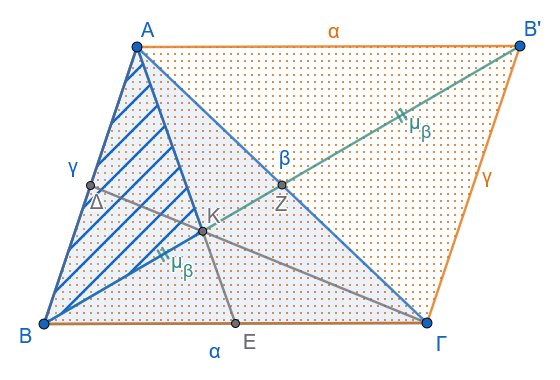{fig-align="center" width="450"}

:::: callout-method
::: {.callout-methot .callout-title}
Υπόδειξη:
:::

ΔΖ=ΖΒ' ==\> ΑΒΓΒ' παραλληλόγραμμο.

Στο τρίγωνο ΒΒ'Γ είναι $2μ_β<α+γ$

'Ομοια κυκλικά βρίσκουμε $2μ_α<β+γ)$ και $2μ_γ<α+β$

Προσθέτουμε τις ανισώσεις ....................................

Στο τρίγωνο ΑΒΚ έχουμε $γ<\dfrac{2}{3}μ_α+\dfrac{2}{3}μ_β$

'Ομοια βρίσκουμε $α<\dfrac{2}{3}μ_γ+\dfrac{2}{3}μ_β$ και $β<\dfrac{2}{3}μ_α+\dfrac{2}{3}μ_γ$

Προσθέτουμε τις ανισώσεις ...................................
::::

6.  Δίνεται παραλληλόγραμμο $AB\Gamma\Delta$ και σημείο $Σ$. Να αποδειχθεί ότι τα τρίγωνα $ΣΑΓ$ και $ΣΒΔ$ έχουν το ίδιο βαρύκεντρο.

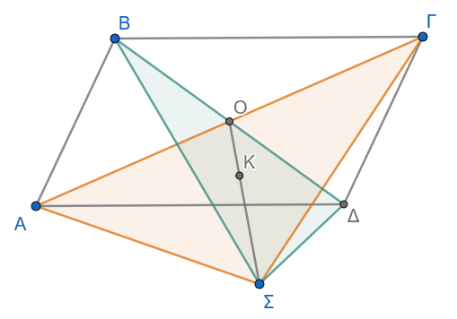{fig-align="center" width="400"}

:::: {.math-box .exercise-box}
::: {.math-title .exercise-title}
7.  Εκφώνηση
:::

Σε τρίγωνο $AB\Gamma$, $\Delta$ είναι το μέσο της διαμέσου $AM$.

Αν η $B\Delta$ τέμνει την $A\Gamma$ στο $E$, να αποδειχθεί ότι $AE = \dfrac{E\Gamma}{2}$.
::::

:::: {.math-box .solution-box}
::: {.math-title .solution-title}
**Λύση**

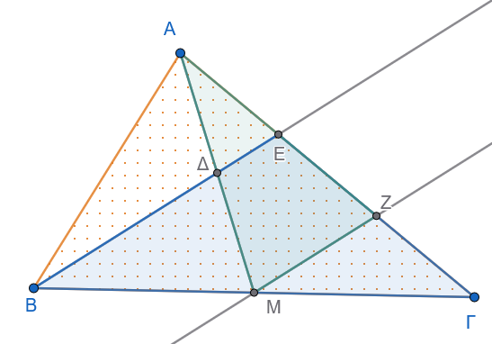{fig-align="center" width="450"}
:::

Για να αποδείξουμε ότι $AE = \dfrac{E\Gamma}{2}$ (ή $E\Gamma = 2AE$)

**1: Βοηθητική γραμμή (Παράλληλη από το μέσο)**

Από το σημείο $M$, που είναι το μέσο της πλευράς $B\Gamma$, φέρνουμε ευθεία παράλληλη προς την $BE$, η οποία τέμνει την πλευρά $A\Gamma$ σε ένα σημείο $Z$.

Άρα, $MZ \parallel BE$ (ή $MZ \parallel \Delta E$).

**2: Εφαρμογή στο τρίγωνο** $B\Gamma E$

Στο τρίγωνο $B\Gamma E$, το $M$ είναι το μέσο της $B\Gamma$ και η $MZ$ είναι παράλληλη στη βάση $BE$.

Σύμφωνα με το θεώρημα των μέσων τμήματος σε τρίγωνο, το $Z$ θα είναι το **μέσο της** $E\Gamma$.
Επομένως: $EZ = Z\Gamma = \dfrac{E\Gamma}{2}$ (Σχέση 1).

**3: Εφαρμογή στο τρίγωνο** $AMZ$

Στο τρίγωνο $AMZ$, το $\Delta$ είναι το μέσο της $AM$ (από την υπόθεση) και η $\Delta E$ είναι παράλληλη στη βάση $MZ$ (από την κατασκευή μας στο 1).

Σύμφωνα με το ίδιο θεώρημα, το $E$ θα είναι το **μέσο της** $AZ$.

Επομένως: $AE = EZ$ (Σχέση 2).

**4: Σύνδεση των σχέσεων**

Από τις Σχέσεις 1 και 2 έχουμε: $AE = EZ$ και $EZ = \dfrac{E\Gamma}{2}$.
Άρα, $AE = \dfrac{E\Gamma}{2}$.
::::

------------------------------------------------------------------------

### Το Ορθόκεντρο Τριγώνου

#### Λήμμα & Απόδειξη

:::: {.math-box .lemma-box}
::: {.math-title .lemma-title}
**Λήμμα:**
:::

Οι παράλληλες που άγονται από τις κορυφές ενός τριγώνου προς τις απέναντι πλευρές του σχηματίζουν ένα νέο τρίγωνο, του οποίου τα μέσα των πλευρών είναι οι κορυφές του αρχικού τριγώνου.
::::

:::: {.math-box .lemmaproof-box}
::: {.math-title .lemmaproof-title}
**Απόδειξη:**

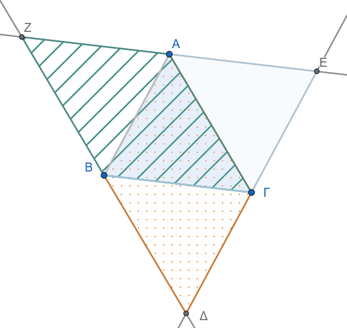{fig-align="center" width="400"}
:::

Από τις κορυφές $A, B, \Gamma$ τριγώνου $AB\Gamma$ φέρουμε παράλληλες ευθείες προς τις απέναντι πλευρές $B\Gamma, A\Gamma, AB$ αντίστοιχα, οι οποίες τέμνονται ανά δύο σχηματίζοντας το τρίγωνο $ΔΕΖ$.

Λόγω της κατασκευής, σχηματίζονται τα παραλληλόγραμμα $ΔΒΑΓ$, $ΕAB\Gamma$ και $ΖBΓΑ$.

Από τις ιδιότητες των παραλληλογράμμων έχουμε:

- Από το $ΔΒΑΓ \Rightarrow ΑΒ = ΔΓ$.

- Από το $Ε AB\Gamma \Rightarrow ΑΒ=ΓΕ$.

Συνεπώς $ΔΓ=ΓΕ$, δηλαδή το $Γ$ είναι το μέσο της πλευράς $ΔΕ$.

Όμοια προκύπτει ότι $ΕΑ = ΒΓ = ΑΖ$ (άρα το $Α$ μέσο της $ΕΖ$) και $ΖΒ=ΑΓ=ΒΔ$ (άρα το $B$ μέσο της $ΖΔ$).
Συνεπώς, οι κορυφές $A, B, \Gamma$ του αρχικού τριγώνου είναι τα μέσα των πλευρών του τριγώνου $ΔΕΖ$.
::::

#### Θεώρημα & Απόδειξη

:::: {.math-box .theorem-box}
::: {.math-title .theorem-title}
**Θεώρημα:**
:::

Οι φορείς των υψών κάθε τριγώνου διέρχονται από το ίδιο σημείο (ορθόκεντρο $H$).
::::

:::: {.math-box .apodeixi-box}
::: {.math-title .apodeixi-title}
**Απόδειξη:**

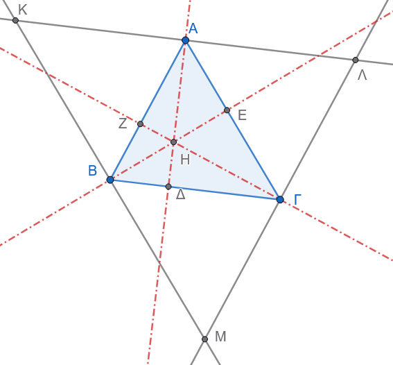{fig-align="center" width="400"}
:::

Έστω τρίγωνο $AB\Gamma$ και τα ύψη του $A\Delta, BE, \Gamma Z$.

Από τις κορυφές $A, B, \Gamma$ φέρουμε παράλληλες προς τις απέναντι πλευρές ορίζοντας το τρίγωνο $K\Lambda M$.

Σύμφωνα με το προηγούμενο Λήμμα, τα σημεία $A, B, \Gamma$ είναι τα μέσα των πλευρών του τριγώνου $K\Lambda M$.

Επιπλέον, οι ευθείες $A\Delta, BE, \Gamma Z$ είναι κάθετες στις πλευρές $B\Gamma, A\Gamma, AB$ αντίστοιχα.

Επειδή $K\Lambda \parallel B\Gamma$, $KM \parallel A\Gamma$ και $M\Lambda \parallel AB$, προκύπτει ότι οι ευθείες των υψών $A\Delta, BE, \Gamma Z$ είναι κάθετες και στα μέσα των πλευρών $K\Lambda, KM, M\Lambda$ του τριγώνου $K\Lambda M$.

Δηλαδή οι φορείς των υψών του $AB\Gamma$ είναι οι μεσοκάθετοι των πλευρών του τριγώνου $K\Lambda M$.

Επειδή οι μεσοκάθετοι των πλευρών οποιουδήποτε τριγώνου διέρχονται από το ίδιο σημείο (περίκεντρο), οι ευθείες $A\Delta, BE, \Gamma Z$ διέρχονται από το ίδιο σημείο $H$.

Το σημείο $H$ ονομάζεται **ορθόκεντρο** του τριγώνου $AB\Gamma$.
::::

------------------------------------------------------------------------

#### Πόρισμα & Απόδειξη

:::: {.math-box .proposal-box}
::: {.math-title .proposal-title}
ΠΟΡΙΣΜΑ Ι
:::

Οι κορυφές Α, Β, Γ, τριγώνου ΑΒΓ και το ορθόκεντρό του Η αποτελούν ορθοκεντρική τετράδα, δηλαδή κάθε ένα από αυτά τα σημεία είναι το ορθόκεντρο του τριγώνου, που ορίζεται από τα άλλα τρία σημεία.
::::

:::: {.math-box .proposalproof-box}
::: {.math-title .proposalproof-title}
Απόδειξη

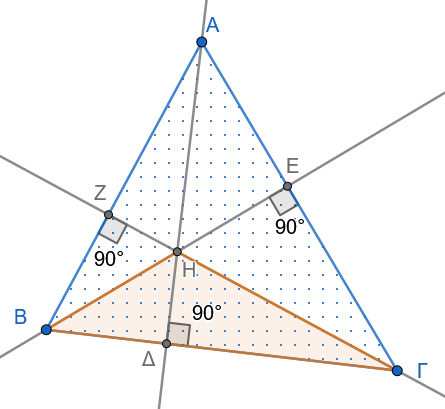{fig-align="center" width="350"}
:::

Πράγματι οι κορυφές π.χ.
Β,Γ και το ορθόκεντρο Η του τριγώνου ΑΒΓ ορίζουν το τρίγωνο ΒΗΓ.

Τα ύψη ΗΔ,ΒΖ και ΓΕ του τριγώνου ΒΗΓ τέμνονται στο Α, οπότε το Α είναι το ορθόκεντρο του τριγώνου ΒΗΓ.

Το ίδιο συμβαίνει και με τις άλλες κορυφές.
::::

:::: {.math-box .proposal-box}
::: {.math-title .proposal-title}
**Πόρισμα ΙΙ:**
:::

Το ορθόκεντρο $H$ ενός τριγώνου $AB\Gamma$ ταυτίζεται με το περίκεντρο του τριγώνου $K\Lambda M$ που σχηματίζεται από τις παράλληλες ευθείες που άγονται από τις κορυφές του $AB\Gamma$ προς τις απέναντι πλευρές του.
::::

:::: {.math-box .proposalproof-box}
::: {.math-title .proposalproof-title}
**Απόδειξη: Δείτε το σχήμα του θεωρήματος.**
:::

Όπως αποδείχθηκε στο θεώρημα υψών, οι φορείς των υψών του $AB\Gamma$ είναι οι μεσοκάθετοι των πλευρών του τριγώνου $K\Lambda M$.

Εφόσον το σημείο τομής των μεσοκαθέτων ενός τριγώνου ορίζεται ως το περίκεντρό του, το σημείο $H$ (ορθόκεντρο του $AB\Gamma$) είναι το περίκεντρο του τριγώνου $K\Lambda M$.
::::

------------------------------------------------------------------------

#### Εφαρμογές

:::: {.math-box .example-box}
::: {.math-title .example-title}
**Εφαρμογή 1η:**
:::

Σε ορθογώνιο τρίγωνο $AB\Gamma$ ($\widehat{A}=90^\circ$), προεκτείνουμε τη $\Gamma A$ κατά τυχαίο τμήμα $A\Delta$.

Από το $\Delta$ φέρουμε $\Delta H \perp B\Gamma$, η οποία τέμνει την $AB$ στο $E$.

Να αποδειχθεί ότι $\Gamma E \perp \Delta B$.
::::

:::: {.math-box .examplesolution-box}
::: {.math-title .examplesolution-title}
*Λύση:*

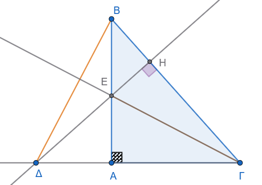{fig-align="center" width="400"}
:::

Στο τρίγωνο $\Delta B\Gamma$, η $\Delta H$ είναι ύψος (αφού $\Delta H \perp B\Gamma$) και η $BA$ είναι επίσης ύψος (αφού $BA \perp \Delta\Gamma$).

Το σημείο $E$ είναι η τομή των υψών $\Delta H$ και $BA$, δηλαδή το ορθόκεντρο του $\Delta B\Gamma$.

Συνεπώς, η ευθεία $\Gamma E$ διέρχεται από το ορθόκεντρο, άρα είναι το τρίτο ύψος του τριγώνου, οπότε $\Gamma E \perp \Delta B$.
::::

:::: {.math-box .example-box}
::: {.math-title .example-title}
**Εφαρμογή 2η:**
:::

Σε τρίγωνο $AB\Gamma$ φέρουμε τα ύψη $B\Delta$ και $\Gamma E$.

Αν $M$ είναι το μέσο της $B\Gamma$, να αποδειχθεί ότι $M\Delta = ME$.
::::

:::: {.math-box .examplesolution-box}
::: {.math-title .examplesolution-title}
*Λύση:*

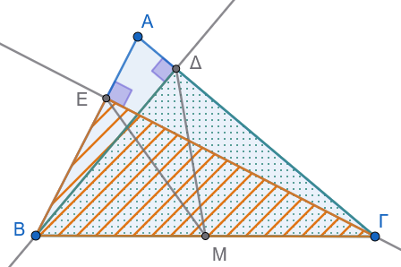{fig-align="center" width="350"}
:::

Τα τρίγωνα $B\Delta\Gamma$ και $BE\Gamma$ είναι ορθογώνια με κοινή υποτείνουσα τη $B\Gamma$.

Τα τμήματα $M\Delta$ και $ME$ είναι οι διάμεσοι που αντιστοιχούν στην υποτείνουσα $B\Gamma$ στα δύο αυτά ορθογώνια τρίγωνα.

Άρα $M\Delta = \dfrac{B\Gamma}{2}$ και $ME = \dfrac{B\Gamma}{2}$, συνεπώς $M\Delta = ME$.
::::

------------------------------------------------------------------------

#### Ασκήσεις

1.  Αν $H$ είναι το ορθόκεντρο τριγώνου $AB\Gamma$, να αποδείξετε ότι το $A$ είναι ορθόκεντρο του τριγώνου $AHB$. (Δείτε το Πόρισμα Ι)

:::: {.math-box .exercise-box}
::: {.math-title .exercise-title}
2.  Εκφώνηση
:::

Σε τρίγωνο $AB\Gamma$, οι προεκτάσεις των υψών $B\Delta$ και $\Gamma E$ παίρνουν τμήματα $BZ = A\Gamma$ και $\Gamma H = AB$.
Να αποδειχθεί ότι $AZ = AH$ και $AZ \perp AH$.
::::

:::: {.math-box .solution-box}
::: {.math-title .solution-title}
Λύση

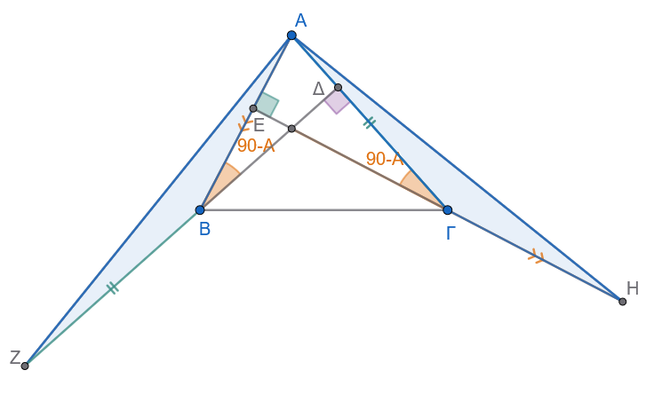{fig-align="center" width="500"}
:::

**1: Υπολογισμός των γωνιών** $\widehat{ABZ}$ και $\widehat{A\Gamma H}$

1.  Στο ορθογώνιο τρίγωνο $AB\Delta$ (όπου $B\Delta \perp A\Gamma$), η γωνία $\widehat{AB\Delta}$ είναι: $$\widehat{AB\Delta} = 90^\circ - \hat{A}$$

    Επειδή το σημείο $Z$ βρίσκεται στην προέκταση του ύψους (πέρα από το $B$), η γωνία $\widehat{ABZ}$ είναι παραπληρωματική της $\widehat{AB\Delta}$: $$\widehat{ABZ} = 180^\circ - \widehat{AB\Delta} = 180^\circ - (90^\circ - \hat{A}) = 90^\circ + \hat{A}$$

2.  Όμοια, στο ορθογώνιο τρίγωνο $A\Gamma E$ (όπου $\Gamma E \perp AB$), η γωνία $\widehat{A\Gamma E}$ είναι: $$\widehat{A\Gamma E} = 90^\circ - \hat{A}$$

    Επειδή το σημείο $H$ βρίσκεται στην προέκταση του ύψους (πέρα από το $\Gamma$), η γωνία $\widehat{A\Gamma H}$ είναι παραπληρωματική της $\widehat{A\Gamma E}$: $$\widehat{A\Gamma H} = 180^\circ - \widehat{A\Gamma E} = 180^\circ - (90^\circ - \hat{A}) = 90^\circ + \hat{A}$$

3.  Συνεπώς, οι γωνίες είναι ίσες: $$\widehat{ABZ} = \widehat{A\Gamma H} = 90^\circ + \hat{A}$$

**2: Απόδειξη ότι** $AZ = AH$ (Ίσα τρίγωνα)

Συγκρίνουμε τα τρίγωνα $ABZ$ και $H\Gamma A$:

- $BZ = A\Gamma$ (από την υπόθεση)

- $AB = \Gamma H$ (από την υπόθεση)

- $\widehat{ABZ} = \widehat{H\Gamma A} = 90^\circ + \hat{A}$ (από το Βήμα 1)

Από το κριτήριο ισότητας **Π-Γ-Π** (Πλευρά - Γωνία - Πλευρά), τα τρίγωνα $ABZ$ και $H\Gamma A$ είναι **ίσα**.

Από την ισότητα των τριγώνων προκύπτει άμεσα ότι:

1.  $$AZ = AH$$

2.  Οι αντίστοιχες γωνίες είναι ίσες: $$\widehat{BZA} = \widehat{\Gamma AH} \quad \text{και} \quad \widehat{BAZ} = \widehat{\Gamma HA}$$

**3: Απόδειξη ότι** $AZ \perp AH$

Η συνολική γωνία $\widehat{ZAH}$ αποτελείται από το άθροισμα: $$\widehat{ZAH} = \widehat{BAZ} + \hat{A} + \widehat{\Gamma AH}$$

Επειδή από την ισότητα των τριγώνων έχουμε $\widehat{\Gamma AH} = \widehat{BZA}$, αντικαθιστούμε: $$\widehat{ZAH} = \widehat{BAZ} + \widehat{BZA} + \hat{A} \quad \text{(Σχέση 1)}$$

Στο τρίγωνο $ABZ$, το άθροισμα των γωνιών είναι $180^\circ$: $$\widehat{BAZ} + \widehat{BZA} + \widehat{ABZ} = 180^\circ$$ $$\widehat{BAZ} + \widehat{BZA} + (90^\circ + \hat{A}) = 180^\circ$$ $$\widehat{BAZ} + \widehat{BZA} + \hat{A} = 180^\circ - 90^\circ = 90^\circ$$

Από τη Σχέση 1 προκύπτει άμεσα: $$\widehat{ZAH} = 90^\circ$$

Επομένως: $$AZ \perp AH$$
::::

:::: {.math-box .exercise-box}
::: {.math-title .exercise-title}
3.  Εκφώνηση
:::

Να αποδείξετε ότι τα συμμετρικά του ορθοκέντρου $H$ ως προς τις πλευρές του τριγώνου $AB\Gamma$ ανήκουν στον περιγεγραμμένο κύκλο του τριγώνου.
::::

:::: {.math-box .solution-box}
::: {.math-title .solution-title}
Λύση

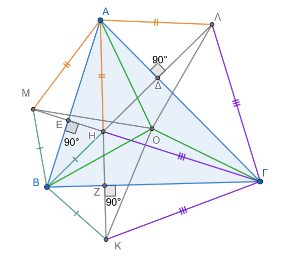{fig-align="center" width="500"}
:::

**1: Ισότητα πλευρών από τη συμμετρία**

Από τον ορισμό της αξονικής συμμετρίας:

- Το $K$ είναι συμμετρικό του $H$ ως προς τη $B\Gamma$, άρα: $\Gamma K = \Gamma H$

- Το $\Lambda$ είναι συμμετρικό του $H$ ως προς την $A\Gamma$, άρα: $\Gamma\Lambda = \Gamma H$

Επομένως: $$\Gamma K = \Gamma\Lambda \quad \text{(Σχέση 1)}$$

**2: Υπολογισμός των γωνιών στις κορυφές των υψών και του περίκεντρου**

1.  **Γωνίες του ορθοκέντρου** $H$:

    - Στο ορθογώνιο τρίγωνο με υποτείνουσα τη $B\Gamma$ και ύψος από το $\Gamma$, η γωνία είναι: $\widehat{H\Gamma B} = 90^\circ - \hat{B}$.

      Λόγω συμμετρίας ως προς τη $B\Gamma$: $$\widehat{K\Gamma B} = \widehat{H\Gamma B} = 90^\circ - \hat{B}$$

    - Στο ορθογώνιο τρίγωνο με υποτείνουσα την $A\Gamma$ και ύψος από το $B$, η γωνία είναι: $\widehat{H\Gamma A} = 90^\circ - \hat{A}$.

      Λόγω συμμετρίας ως προς την $A\Gamma$: $$\widehat{\Lambda\Gamma A} = \widehat{H\Gamma A} = 90^\circ - \hat{A}$$

2.  **Γωνίες του περίκεντρου** $O$:

    Επειδή το $O$ είναι το περίκεντρο ($OA = OB = O\Gamma = R$), τα τρίγωνα $OB\Gamma$ και $OA\Gamma$ είναι ισοσκελή:

    - $\widehat{O\Gamma B} = 90^\circ - \hat{A}$

    - $\widehat{O\Gamma A} = 90^\circ - \hat{B}$

**3: Ισότητα των γωνιών** $\widehat{O\Gamma K}$ και $\widehat{O\Gamma\Lambda}$

Υπολογίζουμε τις δύο γωνίες:

- $$\widehat{O\Gamma K} = \widehat{O\Gamma B} + \widehat{K\Gamma B} = (90^\circ - \hat{A}) + (90^\circ - \hat{B}) = 180^\circ - (\hat{A} + \hat{B}) = \hat{\Gamma}$$

- $$\widehat{O\Gamma\Lambda} = \widehat{O\Gamma A} + \widehat{\Lambda\Gamma A} = (90^\circ - \hat{B}) + (90^\circ - \hat{A}) = 180^\circ - (\hat{A} + \hat{B}) = \hat{\Gamma}$$

Επομένως: $$\widehat{O\Gamma K} = \widehat{O\Gamma\Lambda} = \hat{\Gamma} \quad \text{(Σχέση 2)}$$

**4: Ισότητα των τριγώνων** $OK\Gamma$ και $O\Gamma\Lambda$

Συγκρίνουμε τα τρίγωνα $OK\Gamma$ και $O\Gamma\Lambda$:

1.  $\Gamma K = \Gamma\Lambda$ (από τη Σχέση 1)

2.  $\widehat{O\Gamma K} = \widehat{O\Gamma\Lambda}$ (από τη Σχέση 2)

3.  $O\Gamma$ είναι **κοινή πλευρά**

Από το κριτήριο **Π-Γ-Π**, τα τρίγωνα είναι **ίσα**: $$\triangle OK\Gamma = \triangle O\Gamma\Lambda$$

Από την ισότητά τους προκύπτει άμεσα ότι: $$OK = O\Lambda$$

**Συμπέρασμα**

Με τον ίδιο ακριβώς τρόπο (με ίσα τρίγωνα):

- Από τα τρίγωνα $OA\Lambda$ και $OAM$ προκύπτει ότι $O\Lambda = OM$.

- Από τα τρίγωνα $OBM$ και $OBK$ προκύπτει ότι $OM = OK$.

Έτσι έχουμε: $$OK = O\Lambda = OM = R$$

Δηλαδή τα σημεία $K, \Lambda, M$ ισαπέχουν από το κέντρο $O$ κατά την ακτίνα $R$ του περιγεγραμμένου κύκλου, άρα **ανήκουν στον περιγεγραμμένο κύκλο του τριγώνου** $AB\Gamma$.
::::

:::: {.math-box .exercise-box}
::: {.math-title .exercise-title}
4.  Εκφώνηση
:::

Να αποδείξετε ότι τα συμμετρικά του ορθοκέντρου $H$ ως προς τα μέσα των πλευρών τριγώνου $AB\Gamma$ ανήκουν στον περιγεγραμμένο κύκλο του.
::::

::::: {.math-box .solution-box}
::: {.math-title .solution-title}
Λύση

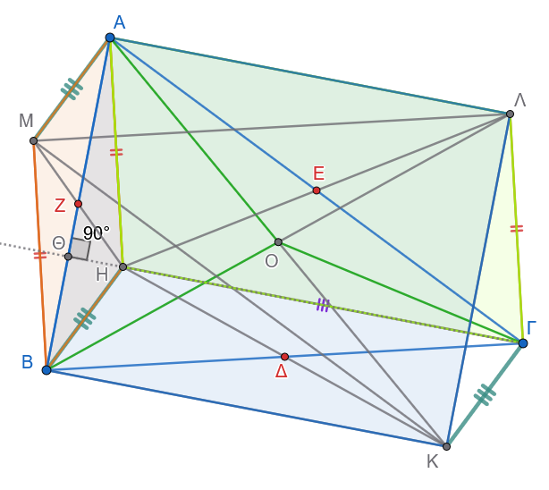{fig-align="center" width="450"}
:::

**1: Απόδειξη ότι τα τετράπλευρα** $BH\Gamma K$ και $AH\Gamma\Lambda$ είναι παραλληλόγραμμα

1.  **Για το** $BH\Gamma K$:

    Το σημείο $K$ είναι το συμμετρικό του ορθοκέντρου $H$ ως προς το μέσο $\Delta$ της πλευράς $B\Gamma$.

    Άρα οι διαγώνιοι $B\Gamma$ και $HK$ διχοτομούνται στο $\Delta$.

    Επομένως, το τετράπλευρο $BH\Gamma K$ είναι παραλληλόγραμμο.

    Από αυτό προκύπτει ότι: $$BK \parallel H\Gamma \quad \text{και} \quad BK = H\Gamma \quad \text{(Σχέση 1)}$$ $$\Gamma K \parallel HB \quad \text{και} \quad \Gamma K = HB \quad \text{(Σχέση 2)}$$

2.  **Για το** $AH\Gamma\Lambda$:

    Το σημείο $\Lambda$ είναι το συμμετρικό του $H$ ως προς το μέσο $E$ της πλευράς $A\Gamma$.

    Άρα οι διαγώνιοι $A\Gamma$ και $H\Lambda$ διχοτομούνται στο $E$.

    Επομένως, το τετράπλευρο $AH\Gamma\Lambda$ είναι παραλληλόγραμμο.

    Από αυτό προκύπτει ότι: $$A\Lambda \parallel H\Gamma \quad \text{και} \quad A\Lambda = H\Gamma \quad \text{(Σχέση 3)}$$

**2: Απόδειξη ότι το** $ABK\Lambda$ είναι ορθογώνιο

1.  **Είναι παραλληλόγραμμο:**

    Συγκρίνοντας τις Σχέσεις 1 και 3: $$A\Lambda \parallel BK \quad \text{και} \quad A\Lambda = BK$$

    Ένα τετράπλευρο που έχει δύο απέναντι πλευρές ίσες και παράλληλες είναι **παραλληλόγραμμο**.
    Άρα το $ABK\Lambda$ είναι παραλληλόγραμμο.

2.  **Έχει ορθή γωνία:**

    - Επειδή το $H$ είναι το ορθόκεντρο του τριγώνου $AB\Gamma$, το ευθύγραμμο τμήμα $\Gamma H$ είναι κάθετο στην πλευρά $AB$ ($\Gamma H \perp AB$).

    - Όμως από τη Σχέση 1 έχουμε $BK \parallel \Gamma H$.

    - Επομένως: $$BK \perp AB \implies \widehat{ABK} = 90^\circ$$

Ένα παραλληλόγραμμο με μία ορθή γωνία είναι **ορθογώνιο**.

Άρα το $ABK\Lambda$ είναι ορθογώνιο παραλληλόγραμμο.

**3: Το σημείο τομής των διαγωνίων είναι το περίκεντρο** $O$

Έστω $O$ το σημείο τομής των διαγωνίων $AK$ και $B\Lambda$ του ορθογωνίου $ABK\Lambda$.

Στο ορθογώνιο, οι διαγώνιοι είναι ίσες και διχοτομούνται, άρα: $$OA = OB = OK = O\Lambda = \frac{AK}{2} \quad \text{(Σχέση 4)}$$

Τώρα εξετάζουμε το τρίγωνο $A\Gamma K$:

- Το $H$ είναι ορθόκεντρο, άρα $BH \perp A\Gamma$.

- Από τη Σχέση 2 έχουμε $\Gamma K \parallel HB$, επομένως $\Gamma K \perp A\Gamma$, δηλαδή $\widehat{A\Gamma K} = 90^\circ$.

- Στο ορθογώνιο τρίγωνο $A\Gamma K$, η διάμεσος προς την υποτείνουσα $AK$ ισούται με το μισό της: $$O\Gamma = \frac{AK}{2} \quad \text{(Σχέση 5)}$$

::: callout-sos
Δείτε παρακάτω το θεώρημα στο 1.5
:::

Από τις Σχέσεις 4 και 5 έχουμε: $$OA = OB = O\Gamma = OK = O\Lambda = R$$

**Συμπέρασμα**

1.  Το σημείο $O$ ισαπέχει από τις τρεις κορυφές $A, B, \Gamma$ ($OA = OB = O\Gamma$), άρα **είναι το περίκεντρο** του τριγώνου $AB\Gamma$.

2.  Επειδή $OK = O\Lambda = R$, τα συμμετρικά σημεία $K$ και $\Lambda$ απέχουν από το $O$ απόσταση ίση με την ακτίνα $R$, επομένως **ανήκουν στον περιγεγραμμένο κύκλο του τριγώνου** $AB\Gamma$ (με το $AK$ να αποτελεί διάμετρο του κύκλου).
:::::

5.  Σε ορθογώνιο τρίγωνο $AB\Gamma$ ($\widehat{A}=90^\circ$), να βρεθεί ποιο σημείο του τριγώνου είναι το ορθόκεντρό του.

:::: {.math-box .exercise-box}
::: {.math-title .exercise-title}
6.  Εκφώνηση
:::

Αν $H$ είναι το ορθόκεντρο οξυγώνιου τριγώνου $AB\Gamma$, να αποδειχθεί ότι τα ύψη του $AB\Gamma$ είναι εσωτερικές διχοτόμοι του ορθικού τριγώνου (του τριγώνου με κορυφές τα ίχνη των υψών).
::::

:::: callout-sos
::: {callout-sos-title}
Υπάρχει μία πανέμορφη και απολύτως στοιχειώδης απόδειξη που χρησιμοποιεί **ΜΟΝΟ**:

1.  **Συμμετρία & Ισοσκελή Τρίγωνα** (Κεφάλαιο 3)

2.  **Γωνίες & Παράλληλες Ευθείες** (Εντός εναλλάξ / εντός-εκτός) (Κεφάλαιο 4)

3.  **Το Θεώρημα του τμήματος που ενώνει τα μέσα δύο πλευρών τριγώνου** (Κεφάλαιο 5)

*(Χωρίς εγγράψιμα, χωρίς ομοιότητα και χωρίς τραπέζια!)*
:::

Πολλά από τα προβλήματα αυτά που λύνουμε εδώ, λύνονται πολύ πιο εύκολα αν χρησιμοποιούσαμε γνώσεις που θα μάθουμε στη συνέχεια.
Είναι μια διαφορετική αντιμετώπιση.
::::

------------------------------------------------------------------------

:::: {.math-box .solution-box}
::: {.math-title .solution-title}
Λύση

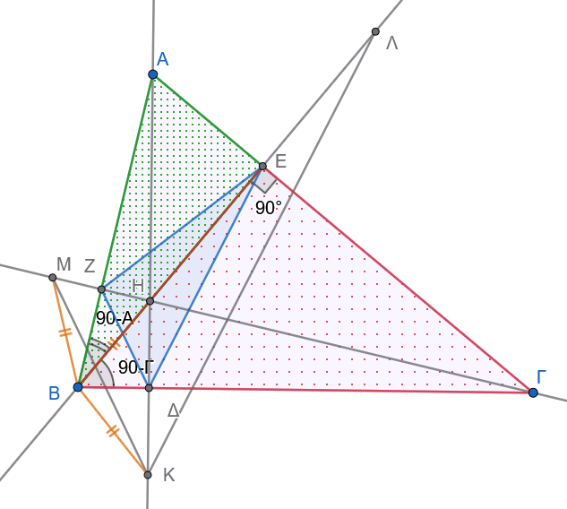{fig-align="center" width="450"}
:::

**1: Συμμετρικά σημεία του ορθοκέντρου** $H$

Θεωρούμε τα συμμετρικά του $H$:

- Το σημείο $M$ είναι το συμμετρικό του $H$ ως προς την $AB$ (άρα το $Z$ είναι το **μέσο** του $HM$ και $HM \perp AB$).

- Το σημείο $K$ είναι το συμμετρικό του $H$ ως προς τη $B\Gamma$ (άρα το $\Delta$ είναι το **μέσο** του $HK$ και $HK \perp B\Gamma$).

- Το σημείο $\Lambda$ είναι το συμμετρικό του $H$ ως προς την $A\Gamma$ (άρα το $E$ είναι το **μέσο** του $H\Lambda$ και $H\Lambda \perp A\Gamma$).

**2: Το θεώρημα των μέσων στο τρίγωνο** $HMK$

Στο τρίγωνο $HMK$: - Το $Z$ είναι το **μέσο** της πλευράς $HM$.

- Το $\Delta$ είναι το **μέσο** της πλευράς $HK$.

Από το βασικό θεώρημα των τριγώνων, το ευθύγραμμο τμήμα $Z\Delta$ ενώνει τα μέσα δύο πλευρών, άρα είναι **παράλληλο** προς την τρίτη πλευρά $MK$: $$Z\Delta \parallel MK \quad \text{(Σχέση 1)}$$

Ομοίως, στο τρίγωνο $H\Lambda K$, το τμήμα $E\Delta$ ενώνει τα μέσα των $H\Lambda$ και $HK$, άρα: $$E\Delta \parallel \Lambda K \quad \text{(Σχέση 2)}$$

**3: Ιδιότητες του ισοσκελούς τριγώνου** $BMK$

1.  **Ισότητα πλευρών:**

    - Λόγω της συμμετρίας ως προς $AB$: $BM = BH$.
    - Λόγω της συμμετρίας ως προς $B\Gamma$: $BK = BH$.\
      Άρα $BM = BK$, δηλαδή το τρίγωνο $BMK$ είναι **ισοσκελές**.

2.  **Γωνία κορυφής** $\widehat{MBK}$:

    - $\widehat{MBA} = \widehat{HBA} = 90^\circ - \hat{A}$ (από το ορθογώνιο τρίγωνο $AB\Delta$).
    - $\widehat{KB\Gamma} = \widehat{HB\Gamma} = 90^\circ - \hat{\Gamma}$ (από το ορθογώνιο τρίγωνο $\Gamma Z B$).

    Το άθροισμα των γωνιών είναι: $$\widehat{MBK} = \widehat{MBA} + \hat{B} + \widehat{KB\Gamma} = (90^\circ - \hat{A}) + \hat{B} + (90^\circ - \hat{\Gamma}) =$$ $$=180^\circ - (\hat{A} + \hat{\Gamma}) + \hat{B} = \hat{B} + \hat{B} = 2\hat{B}$$

3.  **Γωνίες βάσης του ισοσκελούς** $BMK$:

    $$\widehat{BKM} = \frac{180^\circ - \widehat{MBK}}{2} = \frac{180^\circ - 2\hat{B}}{2} = 90^\circ - \hat{B}$$

**4: Υπολογισμός της γωνίας** $\widehat{MK\Delta}$ και της $\widehat{Z\Delta H}$

1.  Στο ορθογώνιο τρίγωνο $B\Delta K$ ($\widehat{B\Delta K} = 90^\circ$): $$\widehat{BK\Delta} = 90^\circ - \widehat{KB\Delta} = 90^\circ - (90^\circ - \hat{\Gamma}) = \hat{\Gamma}$$

2.  Η γωνία $\widehat{MK\Delta}$ ισούται με τη διαφορά:

$$\widehat{MK\Delta} = \widehat{BK\Delta} - \widehat{BKM} = \hat{\Gamma} - (90^\circ - \hat{B}) =$$ $$=\hat{\Gamma} + \hat{B} - 90^\circ = (180^\circ - \hat{A}) - 90^\circ = 90^\circ - \hat{A}$$

3.  Επειδή $Z\Delta \parallel MK$ (από τη Σχέση 1) και η ευθεία $A\Delta HK$ είναι τέμνουσα, οι **εντός εκτός και επί τα αυτά γωνίες** είναι ίσες: $$\widehat{Z\Delta H} = \widehat{MK\Delta} = 90^\circ - \hat{A}$$

**5: Υπολογισμός της γωνίας** $\widehat{E\Delta H}$

Εργαζόμενοι με τον **ίδιο ακριβώς τρόπο** στο ισοσκελές τρίγωνο $\Gamma\Lambda K$ ($\Gamma\Lambda = \Gamma K = \Gamma H$): - Βρίσκουμε ότι $\widehat{\Lambda K\Delta} = 90^\circ - \hat{A}$.

- Επειδή $E\Delta \parallel \Lambda K$ (από τη Σχέση 2), έχουμε: $$\widehat{E\Delta H} = \widehat{\Lambda K\Delta} = 90^\circ - \hat{A}$$

**Συμπέρασμα**

Αποδείξαμε ότι: $$\widehat{Z\Delta H} = \widehat{E\Delta H} = 90^\circ - \hat{A}$$

Επομένως, το ύψος $A\Delta$ είναι η **εσωτερική διχοτόμος** της γωνίας $\widehat{Z\Delta E}$ του ορθικού τριγώνου.
::::

------------------------------------------------------------------------

### Μια Ιδιότητα του Ορθογώνιου Τριγώνου

#### Θεωρήματα & Αποδείξεις

:::: {.math-box .theorem-box}
::: {.math-title .theorem-title}
**Θεώρημα (Ευθύ):**
:::

Σε κάθε ορθογώνιο τρίγωνο, η διάμεσος που αντιστοιχεί στην υποτείνουσα ισούται με το μισό της υποτείνουσας.
::::

:::: {.math-box .apodeixi-box}
::: {.math-title .apodeixi-title}
**Απόδειξη:**

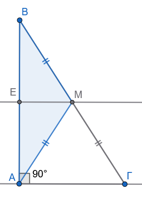{fig-align="center" width="230"}
:::

Έστω ορθογώνιο τρίγωνο $AB\Gamma$ ($\widehat{A} = 90^\circ$) και $M$ το μέσο της υποτείνουσας $B\Gamma$.

Φέρουμε από το σημείο $M$ την ευθεία $ME \parallel A\Gamma$ ($E$ σημείο της $AB$).
Επειδή το $M$ είναι μέσο της $B\Gamma$ και $ME \parallel A\Gamma$, το σημείο $E$ είναι το μέσο της πλευράς $AB$.

Επίσης, επειδή $A\Gamma \perp AB$ και $ME \parallel A\Gamma$, προκύπτει ότι $ME \perp AB$.

Στο τρίγωνο $ABM$, το ευθύγραμμο τμήμα $ME$ είναι ύψος (αφού $ME \perp AB$) και διάμεσος (αφού $E$ μέσο της $AB$).

Συνεπώς, το τρίγωνο $ABM$ είναι ισοσκελές με $MA = MB$.

Επειδή $MB = \dfrac{B\Gamma}{2}$, προκύπτει άμεσα ότι: $$AM = \dfrac{B\Gamma}{2}\quad$$
::::

:::: {.math-box .theorem-box}
::: {.math-title .theorem-title}
**Θεώρημα (Αντίστροφο):**
:::

Αν η διάμεσος ενός τριγώνου ισούται με το μισό της πλευράς στην οποία αντιστοιχεί, τότε η απέναντι γωνία είναι ορθή.
::::

:::: {.math-box .apodeixi-box}
::: {.math-title .apodeixi-title}
**Απόδειξη:**

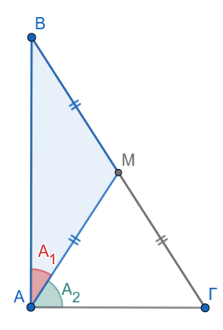{fig-align="center" width="240"}
:::

Έστω τρίγωνο $AB\Gamma$ και η διάμεσός του $AM$ τέτοια ώστε $AM = \dfrac{B\Gamma}{2}$.

Εφόσον $BM = M\Gamma = \dfrac{B\Gamma}{2}$, έχουμε $MA = MB$ και $MA = M\Gamma$.

- Στο τρίγωνο $MAB$, αφού $MA = MB$, είναι ισοσκελές, οπότε $\widehat{A}_1 = \widehat{B}$.

- Στο τρίγωνο $MA\Gamma$, αφού $MA = M\Gamma$, είναι ισοσκελές, οπότε $\widehat{A}_2 = \widehat{\Gamma}$.

Προσθέτοντας τις δύο ισότητες κατά μέλη, λαμβάνουμε: $$\widehat{A}_1 + \widehat{A}_2 = \widehat{B} + \widehat{\Gamma} \Rightarrow \widehat{A} = \widehat{B} + \widehat{\Gamma}\quad$$

Γνωρίζουμε ότι το άθροισμα των γωνιών του τριγώνου $AB\Gamma$ είναι $180^\circ$:

$$\widehat{A} + \widehat{B} + \widehat{\Gamma} = 180^\circ \Rightarrow \widehat{A} + \widehat{A} = 180^\circ \Rightarrow 2\widehat{A} = 180^\circ \Rightarrow \widehat{A} = 90^\circ\quad$$

Άρα το τρίγωνο $AB\Gamma$ είναι ορθογώνιο στο $A$.
::::

------------------------------------------------------------------------

#### Πόρισμα & Απόδειξη

:::: {.math-box .proposal-box}
::: {.math-title .proposal-title}
**Πόρισμα: Ι**
:::

Η διάμεσος ορθογώνιου τριγώνου που αντιστοιχεί στην υποτείνουσα χωρίζει το τρίγωνο σε δύο ισοσκελή τρίγωνα.
::::

:::: {.math-box .proposalproof-box}
::: {.math-title .proposalproof-title}
**Απόδειξη:** Δείτε τα σχήματα παραπάνω.
:::

Έστω $AM$ η διάμεσος προς την υποτείνουσα $B\Gamma$ ορθογώνιου τριγώνου $AB\Gamma$.

Από το ευθύ θεώρημα ισχύει $AM = \dfrac{B\Gamma}{2}$.

Επειδή $BM = M\Gamma = \dfrac{B\Gamma}{2}$, προκύπτει ότι $MA = MB$ και $MA = M\Gamma$.

Συνεπώς, τα τρίγωνα $MAB$ και $MA\Gamma$ είναι ισοσκελή.
::::

:::: {.math-box .proposal-box}
::: {.math-title .proposal-title}
Πόρισμα ΙΙ
:::

Αν σε ορθογώνιο τρίγωνο μια γωνία του ισούται με $30^ο$, τότε η απέναντι πλευρά του είναι το μισό της υποτείνουσας και αντίστροφα.
::::

:::: {.math-box .proposalproof-box}
::: {.math-title .proposalproof-title}
Απόδειξη

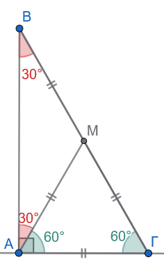{fig-align="center" width="200"}
:::

Θεωρούμε ορθογώνιο τρίγωνο ΑΒΓ ($\hatΑ = 90°$) με $\hatΒ = 30°$ .

Θα αποδείξουμε ότι $ΑΓ = \dfrac{ΒΓ}{2}$.

Επειδή $\hatΒ = 30°$, είναι $\hatΓ = 90° - 30° = 60°$.

Φέρουμε τη διάμεσο ΑΜ και είναι $AM=\dfrac{ΒΓ}{2}=ΒΜ$ .

Έτσι $\hatΑ_2 = \hatΓ = 60°$, οπότε το τρίγωνο ΑΜΓ είναι ισόπλευρο.

Επομένως $ΑΓ = ΜΓ = \dfrac{ΒΓ}{2}$.
::::

:::: {.math-box .proposal-box}
::: {.math-title .proposal-title}
**Αντίστροφο**,
:::

αν στο ορθογώνιο τρίγωνο ΑΒΓ είναι

$ΑΓ = \dfrac{ΒΓ}{2}$, θα αποδείξουμε ότι $\hat Β = 30°$.
::::

:::: {.math-box .proposalproof-box}
::: {.math-title .proposalproof-title}
Απόδειξη
:::

Φέρουμε τη διάμεσο ΑΜ, οπότε $ΑΜ = \dfrac{ΒΓ}{2}= ΜΓ = ΑΓ$ (αφού $ΑΓ = \dfrac{ΒΓ}{2}$).

Άρα το τρίγωνο ΑΜΓ είναι ισόπλευρο, οπότε $\hat Γ = 60°$.

Επομένως $\hat Β = 90° - 60° = 30°$.
::::

------------------------------------------------------------------------

#### Εφαρμογές

:::: {.math-box .example-box}
::: {.math-title .example-title}
**Εφαρμογή 1η:**
:::

Σε ορθογώνιο τρίγωνο $AB\Gamma$ ($\widehat{A}=90^\circ$) με $\widehat{B} > \widehat{\Gamma}$,

φέρουμε τη διάμεσό του $AM$ και το ύψος του $A\Delta$.

Να αποδειχθεί ότι $M\widehat{A}\Delta = \widehat{B} - \widehat{\Gamma}$.
::::

:::: {.math-box .examplesolution-box}
::: {.math-title .examplesolution-title}
*Λύση:*
:::

Στο ορθογώνιο τρίγωνο $AB\Delta$ ($\widehat{\Delta}=90^\circ$), η γωνία $\widehat{BA\Delta} = 90^\circ - \widehat{B}$.

Επειδή $AM$ διάμεσος προς την υποτείνουσα, το τρίγωνο $MA\Gamma$ είναι ισοσκελές ($MA=M\Gamma$), οπότε $M\widehat{A}\Gamma = \widehat{\Gamma}$.

Τότε: $$M\widehat{A}\Delta = 90^\circ - \widehat{BA\Delta} - M\widehat{A}\Gamma = 90^\circ - (90^\circ - \widehat{B}) - \widehat{\Gamma} = \widehat{B} - \widehat{\Gamma}\quad$$
::::

:::: {.math-box .example-box}
::: {.math-title .example-title}
**Εφαρμογή 2η:**
:::

Στο παρακάτω τετράπλευρο $ABΓΔ$ ($AB \parallel \Gamma\Delta$).

Από το μέσο Ε της πλευράς ΑΔ φέρουμε παράλληλο προς την ΔΓ η οποία τέμνει την πλευρά ΒΓ στο Ζ.

Η διχοτόμος της γωνίας $B$ τέμνει το τμήμα ΕΖ στο Η.

Να αποδειχθεί ότι $B\widehat{H}\Gamma = 90^\circ$.
::::

:::: {.math-box .examplesolution-box}
::: {.math-title .examplesolution-title}
*Λύση:*
:::

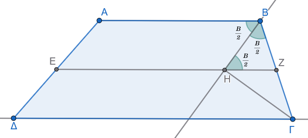{fig-align="center" width="450"}

Επειδή $EZ \parallel \Gamma\Delta$, η γωνία $Ζ\widehat{H}B = \widehat{ABH}=\dfrac{\hat B}{2}$ (εντός εναλλάξ), άρα το τρίγωνο $BHZ$ είναι ισοσκελές με $BZ = ZΗ$.

Επειδή $E$ μέσο της $A\Delta$ και $ΕZ//ΓΔ$, σημαίνει ότι το Ζ θα είναι μέσο της $B\Gamma$

Άρα στο τρίγωνο $ΒΗΓ$ η διάμεσος $HZ = \dfrac{B\Gamma}{2}$, άρα $B\widehat{H}\Gamma = 90^\circ$.
::::

------------------------------------------------------------------------

#### Ασκήσεις

1.  Στο ορθογώνιο τρίγωνο $AB\Gamma$ ($\widehat{A}=90^\circ$), το ύψος $A\Delta$ και η διχοτόμος $BZ$ τέμνονται στο $E$.
    Να αποδείξετε ότι το τρίγωνο $AEZ$ είναι ισοσκελές.

2.  Σε ορθογώνιο τρίγωνο $AB\Gamma$ ($\widehat{A}=90^\circ$) προεκτείνουμε την υποτείνουσα $\Gamma B$ κατά $B\Delta = AB$.
    Φέρουμε $\Gamma E \perp B\Gamma$ στο $\Gamma$ προς το μέρος του $A$, με $\Gamma E = A\Gamma$.
    Να αποδείξετε ότι τα σημεία $\Delta, A, E$ είναι συνευθειακά.

3.  Σε ορθογώνιο τρίγωνο $AB\Gamma$ ($\widehat{A}=90^\circ$), η κάθετος στο μέσο $M$ της υποτείνουσας $B\Gamma$ τέμνει την $AB$ στο $\Delta$.
    Αν $\widehat{B}=30^\circ$, να αποδείξετε ότι $M\Delta = \dfrac{\Delta B}{2}$.

4.  Δίνεται ορθογώνιο τρίγωνο $AB\Gamma$ ($\widehat{A}=90^\circ$) και το ύψος του $A\Delta$.
    Αν $E, Z$ είναι τα μέσα των $AB$ και $A\Gamma$, να αποδείξετε ότι $E\widehat{\Delta}Z = 90^\circ$.

5.  Δίνεται ορθογώνιο τρίγωνο $AB\Gamma$ ($\widehat{A}=90^\circ$) και το ύψος του $A\Delta$.
    Αν $E, Z$ είναι τα μέσα των $AB, A\Gamma$ και $M$ το μέσο του $EZ$, να αποδείξετε ότι $\Delta M = \dfrac{B\Gamma}{4}$.

6.  Σε ορθογώνιο τρίγωνο $AB\Gamma$ ($\widehat{A}=90^\circ$) με $\widehat{B}=15^\circ$, να αποδείξετε ότι το ύψος $A\Delta = \dfrac{B\Gamma}{4}$.

7.  Δίνεται ορθογώνιο τρίγωνο $AB\Gamma$ ($\widehat{A}=90^\circ$), το ύψος του $A\Delta$ και η διάμεσος $AM$.
    Αν $E, Z$ οι προβολές του $\Delta$ στις $AB$ και $A\Gamma$ αντίστοιχα, να αποδείξετε ότι $AM \perp EZ$.

8.  Αν $K$ και $\Lambda$ είναι οι προβολές της κορυφής $A$ τριγώνου $AB\Gamma$ στην εσωτερική και εξωτερική διχοτόμο της γωνίας $\widehat{B}$ αντίστοιχα, να αποδείξετε ότι το $AKB\Lambda$ είναι ορθογώνιο και η ευθεία $K\Lambda$ διέρχεται από το μέσο της $A\Gamma$.

9.  Σε τρίγωνο $AB\Gamma$ φέρουμε τα ύψη $B\Delta$ και $\Gamma E$.
    Αν $M$ είναι το μέσο της $B\Gamma$, να αποδειχθεί ότι $M\Delta = ME$.

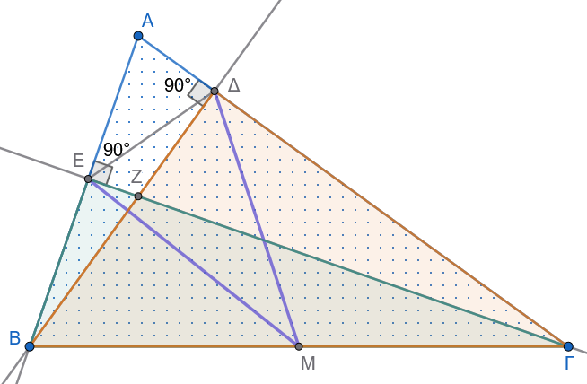{fig-align="center" width="450"}

10. Δίνεται ορθογώνιο τρίγωνο $AB\Gamma$ ($\widehat{A}=90^\circ$) με $\widehat{B}=30^\circ$. Αν $E, Z$ είναι τα μέσα των $AB$ και $A\Gamma$, να αποδειχθεί ότι $EZ = AΓ$.

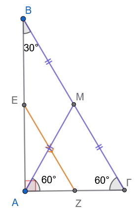{fig-align="center" width="200"}

:::: {.math-box .exercise-box}
::: {.math-title .exercise-title}
11. Εκφώνηση
:::

Δίνεται ορθογώνιο ΑΒΓΔ και οι κάθετες $AE \perp \Delta B$ και $ΓZ \perp \Delta B$.
Αν $M$ και $\Sigma$ είναι τα μέσα των πλευρών $AB$ και $BΓ$ αντίστοιχα, δείξτε ότι $EM \perp \Sigma Z$.
::::

:::: {.math-box .solution-box}
::: {.math-title .solution-title}
**Λύση**

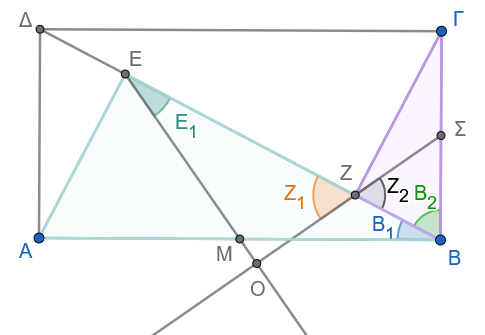{fig-align="center" width="400"}
:::

**1: Προσδιορισμός του στόχου**

Για να αποδείξουμε την καθετότητα $EM \perp \Sigma Z$, αρκεί να δείξουμε ότι η γωνία $\hat{O} = 90^\circ$ στο σημείο τομής τους, ή ισοδύναμα ότι στο τρίγωνο $EOZ$, το άθροισμα των γωνιών $\hat{E}_1 + \hat{Z}_1 = 90^\circ$.

**2: Ιδιότητα διαμέσου στο ορθογώνιο τρίγωνο ΑΕΒ**

Στο ορθογώνιο τρίγωνο $AEB$ (ορθή η $\hat{E}$ λόγω της κάθετης $AE$), η $EM$ είναι η διάμεσος που αντιστοιχεί στην υποτείνουσα $AB$.

Από τη σχετική ιδιότητα, η διάμεσος ισούται με το μισό της υποτείνουσας, άρα $EM = MB$.
Επομένως, το τρίγωνο $EMB$ είναι ισοσκελές και ισχύει: $\hat{E}_1 = \hat{B}_1$ (Σχέση 1)

**3: Ιδιότητα διαμέσου στο ορθογώνιο τρίγωνο ΓΖΒ**

Όμοια, στο ορθογώνιο τρίγωνο $ΓZB$ (ορθή η $\hat{Z}$ λόγω της κάθετης $ΓZ$), η $Z\Sigma$ είναι η διάμεσος που αντιστοιχεί στην υποτείνουσα $BΓ$.

Άρα $Z\Sigma = \Sigma B$, το τρίγωνο $Z\Sigma B$ είναι ισοσκελές και ισχύει: $\hat{Z}_1 \overset{\text{ως κατακορυφήν}}=\hat{Z}_2= \hat{B}_2$ (Σχέση 2)

**4: Άθροιση των σχέσεων και συμπέρασμα**

Προσθέτουμε κατά μέλη τις σχέσεις (1) και (2): $\hat{E}_1 + \hat{Z}_1 = \hat{B}_1 + \hat{B}_2$

Επειδή το ΑΒΓΔ είναι ορθογώνιο, η γωνία $\hat{B}$ είναι ορθή, δηλαδή $\hat{B}_1 + \hat{B}_2 = 90^\circ$.

Συνεπώς: $\hat{E}_1 + \hat{Z}_1 = 90^\circ$.
Αυτό σημαίνει ότι στο τρίγωνο $EOZ$, η τρίτη γωνία $\hat{O}$ πρέπει να είναι $90^\circ$.

**Τελικό Συμπέρασμα**

Εφόσον $\hat{O} = 90^\circ$, αποδείχθηκε ότι $EM \perp \Sigma Z$.
::::

:::: {.math-box .exercise-box}
::: {.math-title .exercise-title}
12. Εκφώνηση
:::

Δίνεται ορθογώνιο παραλληλόγραμμο $ΑΒΓ\Delta$.
Από την κορυφή $Γ$ φέρνουμε κάθετο πάνω στη διαγώνιο $B\Delta$, η οποία τέμνει τις διχοτόμους των γωνιών $A\hat{\Delta}B$ και $A\hat{B}\Delta$ στα σημεία $E$ και $Z$ αντίστοιχα.
Δείξτε ότι: (α) $\Gamma Z = A\Delta$ και (β) $\Gamma E = AB$.
::::

:::: {.math-box .solution-box}
::: {.math-title .solution-title}
**Λύση**

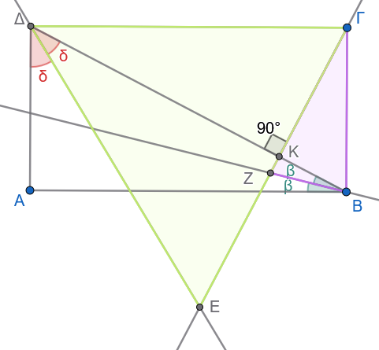{fig-align="center" width="400"}
:::

**1: Προετοιμασία και Συμβολισμοί**

Θα δείξουμε αρχικά ότι $\Gamma Z = A\Delta = \Gamma B$ (αφού οι απέναντι πλευρές του ορθογωνίου είναι ίσες).

Ονομάζουμε τις γωνίες που προκύπτουν από τις διχοτόμους:

- $A\hat{\Delta}E = E\hat{\Delta}B = \delta$
- $A\hat{B}Z = Z\hat{B}K = \beta$

**2: Απόδειξη του (α)** $\Gamma Z = A\Delta$

Για την ισότητα $\Gamma Z = \Gamma B$, αρκεί να δείξουμε ότι το τρίγωνο $\Gamma ZB$ είναι ισοσκελές.

- Η γωνία $\Gamma\hat{B}Z = \Gamma\hat{B}A - \beta = 90^\circ - \beta$.
- Από το ορθογώνιο τρίγωνο $BKZ$ (όπου $K$ το σημείο τομής της καθέτου από το $\Gamma$ με τη διαγώνιο), η οξεία γωνία $\Gamma\hat{Z}B = 90^\circ - \beta$.
- Εφόσον $\Gamma\hat{B}Z = \Gamma\hat{Z}B = 90^\circ - \beta$, το τρίγωνο $\Gamma ZB$ είναι ισοσκελές, άρα $\Gamma Z = \Gamma B$.
- Επειδή στο ορθογώνιο $\Gamma B = A\Delta$, συμπεραίνουμε ότι $\Gamma Z = A\Delta$.

**3: Απόδειξη του (β)** $\Gamma E = AB$

Για την ισότητα $\Gamma E = AB = \Gamma\Delta$, αρκεί να δείξουμε ότι το τρίγωνο $\Gamma\Delta E$ είναι ισοσκελές.

- Η γωνία $\Gamma\hat{\Delta}E = \Gamma\hat{\Delta}A - \delta = 90^\circ - \delta$.
- Από το ορθογώνιο τρίγωνο $\Delta KE$, η γωνία $\Gamma\hat{E}\Delta = 90^\circ - \delta$.
- Εφόσον $\Gamma\hat{\Delta}E = \Gamma\hat{E}\Delta = 90^\circ - \delta$, το τρίγωνο $\Gamma\Delta E$ είναι ισοσκελές, άρα $\Gamma E = \Gamma\Delta$.
- Επειδή στο ορθογώνιο $\Gamma\Delta = AB$, συμπεραίνουμε ότι $\Gamma E = AB$.

**Τελικά**

Αποδείχθηκε ότι τα τρίγωνα $\Gamma ZB$ και $\Gamma\Delta E$ είναι ισοσκελή, γεγονός που οδηγεί στις ζητούμενες ισότητες $\Gamma Z = A\Delta$ και $\Gamma E = AB$.
::::

:::: {.math-box .exercise-box}
::: {.math-title .exercise-title}
13. Εκφώνηση
:::

Δίνεται τρίγωνο $ΑΒΓ$ και τα δύο ύψη του $B\Delta$, $ΓE$ που τέμνονται στο $H$.
Παίρνουμε τα μέσα $Z$ και $M$ των τμημάτων $AH$ και $BΓ$, αντίστοιχα.
Δείξτε ότι η $ZM$ είναι μεσοκάθετη του $\Delta E$.
::::

:::: {.math-box .solution-box}
::: {.math-title .solution-title}
**Λύση**

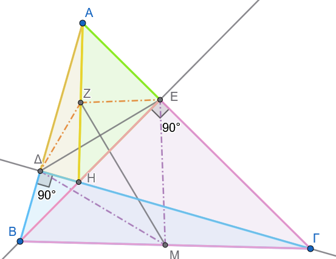{fig-align="center" width="420"}
:::

**1: Στρατηγική απόδειξης**

Για να αποδείξουμε ότι η ευθεία $ZM$ είναι η μεσοκάθετη του τμήματος $E\Delta$, αρκεί να δείξουμε ότι τα σημεία $Z$ και $M$ ισαπέχουν από τα άκρα $E$ και $\Delta$ (δηλαδή $ZE = Z\Delta$ και $ME = M\Delta$).

**2: Εξέταση του σημείου Z**

Στα ορθογώνια τρίγωνα $AEH$ και $A\Delta H$ (με υποτείνουσα την κοινή πλευρά $AH$), τα τμήματα $EZ$ και $\Delta Z$ είναι οι διάμεσοι που αντιστοιχούν στην υποτείνουσα $AH$.

Σύμφωνα με την ιδιότητα της διαμέσου ορθογωνίου τριγώνου:

- $EZ = \dfrac{AH}{2} = ZH$
- $\Delta Z = \dfrac{AH}{2} = ZH$

Άρα $ZE = Z\Delta$, το οποίο σημαίνει ότι το $Z$ ανήκει στη μεσοκάθετη του $E\Delta$.

**3: Εξέταση του σημείου M**

Όμοια, στα ορθογώνια τρίγωνα $B\Delta Γ$ και $BEΓ$ (με υποτείνουσα την κοινή πλευρά $BΓ$), τα τμήματα $\Delta M$ και $EM$ είναι οι διάμεσοι που αντιστοιχούν στην υποτείνουσα $BΓ$.

Σύμφωνα με την ίδια ιδιότητα:

- $\Delta M = \dfrac{BΓ}{2} = BM$
- $EM = \dfrac{BΓ}{2} = BM$

Άρα $\Delta M = EM$, το οποίο σημαίνει ότι και το $M$ ανήκει στη μεσοκάθετη του $E\Delta$.

**4: Συμπέρασμα**

Αφού και τα δύο σημεία $Z$ και $M$ ανήκουν στη μεσοκάθετη του τμήματος $\Delta E$, έπεται ότι η ευθεία που ορίζουν, η $ZM$, είναι η μεσοκάθετη του $\Delta E$.

**Τελικό Συμπέρασμα**

Η $ZM$ είναι η μεσοκάθετη του $\Delta E$ διότι $ZE=Z\Delta$ και $ME=M\Delta$.
::::

:::: {.math-box .exercise-box}
::: {.math-title .exercise-title}
14 Εκφώνηση
:::

Πάνω στις πλευρές ισόπλευρου τριγώνου $ΑΒΓ$ παίρνουμε τα σημεία $Δ, Ε, Ζ$ (με $Δ \in ΒΓ$, $Ε \in ΓΑ$, $Ζ \in ΑΒ$), ώστε: $$ΒΔ = ΓΕ = ΑΖ = \frac{ΑΒ}{3}$$

Να αποδείξετε ότι:

1.  Το τρίγωνο $ΔΕΖ$ είναι ισόπλευρο.
2.  Οι πλευρές του τριγώνου $ΔΕΖ$ είναι κάθετες στις πλευρές του τριγώνου $ΑΒΓ$.
::::

:::: {.math-box .solution-box}
::: {.math-title .solution-title}
**Λύση**

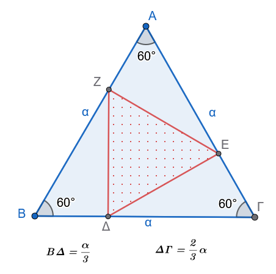{fig-align="center" width="350"}
:::

Έστω $a$ το μήκος της πλευράς του ισόπλευρου τριγώνου $ΑΒΓ$.
Τότε: $$ΑΖ = ΒΔ = ΓΕ = \frac{a}{3}$$ $$ΒΖ = ΓΔ = ΑΕ = a - \frac{a}{3} = \frac{2a}{3}$$ και $\widehat{Α} = \widehat{Β} = \widehat{Γ} = 60^\circ$.

**(α) Απόδειξη ότι το** $\triangle ΔΕΖ$ είναι ισόπλευρο

Συγκρίνουμε τα τρία τρίγωνα $\triangle ΑΖΕ$, $\triangle ΒΔΖ$ και $\triangle ΓΕΔ$:

- Έχουν $ΑΖ = ΒΔ = ΓΕ = \dfrac{a}{3}$.
- Έχουν $ΑΕ = ΒΖ = ΓΔ = \dfrac{2a}{3}$.
- Έχουν τις περιεχόμενες γωνίες ίσες: $\widehat{Α} = \widehat{Β} = \widehat{Γ} = 60^\circ$.

Από το κριτήριο **Π-Γ-Π**, τα τρία τρίγωνα είναι **ίσα**.

Επομένως, οι απέναντι πλευρές τους είναι ίσες: $$ΖΕ = ΔΖ = ΕΔ$$

Άρα, το τρίγωνο $ΔΕΖ$ είναι **ισόπλευρο**.

**(β) Απόδειξη καθετότητας**

Στο τρίγωνο $\triangle ΒΔΖ$:

- Η πλευρά $ΒΔ = \dfrac{a}{3}$ είναι ίση με το μισό της πλευράς $ΒΖ = \dfrac{2a}{3}$ ($ΒΔ = \dfrac{1}{2}ΒΖ$).
- Η περιεχόμενη γωνία είναι $\widehat{Β} = 60^\circ$.

Σε ένα τρίγωνο όπου μία πλευρά ισούται με το μισό μιας άλλης και η περιεχόμενη γωνία είναι $60^\circ$, το τρίγωνο είναι **ορθογώνιο** με γωνίες $30^\circ, 60^\circ, 90^\circ$ (η ορθή γωνία βρίσκεται απέναντι από τη μεγαλύτερη πλευρά $ΒΖ$).

Επομένως: $$\widehat{ΒΔΖ} = 90^\circ \implies ΔΖ \perp ΒΓ$$

Με τον ίδιο ακριβώς τρόπο προκύπτει ότι:

- $\widehat{ΑΕΖ} = 90^\circ \implies ΖΕ \perp ΑΓ$
- $\widehat{ΓΔΕ} = 90^\circ \implies ΕΔ \perp ΑΒ$

Άρα, οι πλευρές του $\triangle ΔΕΖ$ είναι κάθετες στις πλευρές του $\triangle ΑΒΓ$.
::::

:::: {.math-box .exercise-box}
::: {.math-title .exercise-title}
15. Εκφώνηση
:::

Αν $O$ είναι το περίκεντρο και $H$ το ορθόκεντρο τριγώνου $AB\Gamma$, να αποδειχθεί ότι η απόσταση του $O$ από την πλευρά $B\Gamma$ ισούται με το μισό του τμήματος $AH$ ($OM = \dfrac{AH}{2}$).
::::

:::: {.math-box .solution-box}
::: {.math-title .solution-title}
**Λύση**

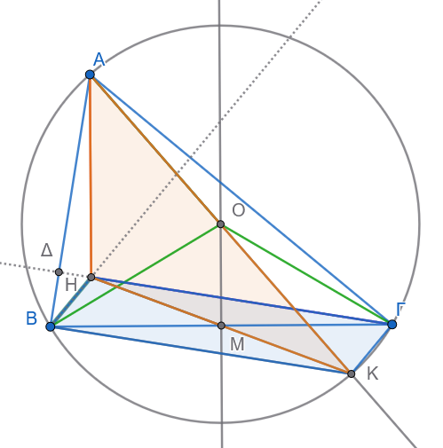{fig-align="center" width="400"}
:::

**1: Βοηθητική κατασκευή (Διάμετρος του κύκλου)**

1.  Έστω $M$ το μέσο της πλευράς $B\Gamma$.
    Επειδή το $O$ είναι το περίκεντρο ($OB = O\Gamma$), το ευθύγραμμο τμήμα $OM$ είναι η μεσοκάθετος της $B\Gamma$, άρα $OM \perp B\Gamma$ και εκφράζει την **απόσταση του** $O$ από τη $B\Gamma$.

2.  Φέρνουμε τη διάμετρο $AK$ του περιγεγραμμένου κύκλου που διέρχεται από το κέντρο $O$.
    Επομένως, το σημείο $O$ είναι το **μέσο του τμήματος** $AK$.

**2: Απόδειξη ότι το τετράπλευρο** $BH\Gamma K$ είναι παραλληλόγραμμο

1.  **Γωνία** $\widehat{ABK}$:

    Επειδή ΑΟ=ΒΟ=ΚΟ, η γωνία $\widehat{ABK}$ είναι ορθή: $$\widehat{ABK} = 90^\circ \implies BK \perp AB$$

    Επειδή το $H$ είναι το ορθόκεντρο, το ύψος από το $\Gamma$ είναι κάθετο στην $AB$ ($\Gamma H \perp AB$).

    Δύο ευθείες κάθετες στην ίδια ευθεία είναι μεταξύ τους παράλληλες: $$BK \parallel \Gamma H \quad \text{(Σχέση 1)}$$

2.  **Γωνία** $\widehat{A\Gamma K}$:

    Ομοίως, η γωνία $\widehat{A\Gamma K}$ είναι ορθή διότι ΟΑ=ΟΚ=ΟΓ: $$\widehat{A\Gamma K} = 90^\circ \implies \Gamma K \perp A\Gamma$$

    Επειδή το $H$ είναι το ορθόκεντρο, το ύψος από το $B$ είναι κάθετο στην $A\Gamma$ ($BH \perp A\Gamma$).

    Άρα: $$\Gamma K \parallel BH \quad \text{(Σχέση 2)}$$

3.  Από τις Σχέσεις 1 και 2, το τετράπλευρο $BH\Gamma K$ έχει τις απέναντι πλευρές του παράλληλες, άρα είναι παραλληλόγραμμο.

**3: Το σημείο** $M$ είναι μέσο και του $HK$

Σε κάθε παραλληλόγραμμο οι διαγώνιοι διχοτομούνται:

- Οι διαγώνιοι του $BH\Gamma K$ είναι οι $B\Gamma$ και $HK$.

- Επειδή το $M$ είναι το μέσο της διαγωνίου $B\Gamma$, είναι υποχρεωτικά και το **μέσο της άλλης διαγωνίου** $HK$.

**4: Εφαρμογή στο τρίγωνο** $AHK$

Στο τρίγωνο $AHK$:

- Το σημείο $O$ είναι το **μέσο** της πλευράς $AK$ (αφού $AK$ είναι διάμετρος με κέντρο $O$).

- Το σημείο $M$ είναι το **μέσο** της πλευράς $HK$.

Το ευθύγραμμο τμήμα $OM$ ενώνει τα μέσα δύο πλευρών του τριγώνου $AHK$, επομένως είναι παράλληλο προς την τρίτη πλευρά $AH$ και ισούται με το μισό της:

$$OM = \frac{AH}{2}$$
::::

:::: {.math-box .exercise-box}
::: {.math-title .exercise-title}
16. Εκφώνηση
:::

Να αποδειχθεί ότι το ορθόκεντρο $H$, το βαρύκεντρο $K$ και το περίκεντρο $O$ κάθε τριγώνου είναι συνευθειακά σημεία και ισχύει $HK = 2KO$ (Ευθεία του Euler).
::::

:::: {.math-box .solution-box}
::: {.math-title .solution-title}
**Λύση**

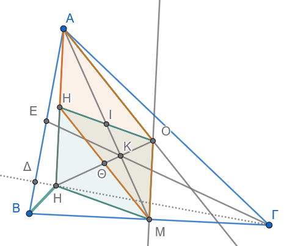
:::

Στην προηγούμενη άσκηση 15, αποδείξαμε ότι $ΟΜ=\dfrac{AH}{2}$

Αν Λ το μέσο του ΑΗ , τότε τα τετράπλευρα ΑΛΜΟ και ΛΗΜΟ είναι παραλληλόγραμμα και οι διαγώνιοί τους διχοτομούνται στα σημεία Ι και Θ.

Έτσι τα Ι και Θ είναι μέσα των πλευρών ΛΟ και ΗΟ στο τρίγωνο ΛΜΟ και άρα το Κ είναι το βαρύκεντρο του.

$ΟΚ=\dfrac{2}{3}OΘ \implies 2KO=\dfrac{4}{3}OΘ \implies$

$2KO=ΟΘ+\dfrac{1}{3}ΟΘ=ΗΘ+ΘΚ=ΗΚ$
::::

------------------------------------------------------------------------

::: {.callout-important title="ΣΑΣ ΕΥΧΟΜΑΙ"}
ΚΑΛΗ ΜΕΛΕΤΗ !!!
:::
