```{=html}
<!-- Φόρτωση βιβλιοθήκης GeoGebra -->
<script src="https://www.geogebra.org/apps/deployggb.js"></script>

<!-- Συνάρτηση δημιουργίας applets -->
<script>
function createGeoGebra(containerId, materialId, width = 700, height = 500) {
  var params = {
    "id": "ggb-" + containerId,
    "material_id": materialId,
    "width": width,
    "height": height,
    "showToolBar": true,
    "showMenuBar": false,
    "showAlgebraInput": true
  };
  
  var applet = new GGBApplet(params, '5.2');
  applet.inject(containerId);
}
</script>
```

## Τραπέζια

### Τραπέζιο

#### Ορισμοί
:::: {.math-box .definition-box}
::: {.math-title .dfinition-title}

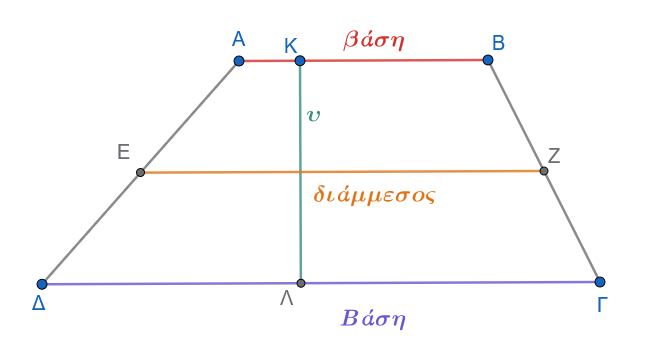{fig-align="center" width="500"}
:::

**Τραπέζιο** λέγεται το κυρτό τετράπλευρο που έχει μόνο δύο πλευρές παράλληλες.

- Οι παράλληλες πλευρές $AB$ και $\Gamma\Delta$ ονομάζονται **βάσεις** του τραπεζίου.

- Κάθε ευθύγραμμο τμήμα κάθετο στις βάσεις με τα άκρα του στους φορείς τους λέγεται **ύψος** του τραπεζίου.

- Το ευθύγραμμο τμήμα $EZ$ που ενώνει τα μέσα των μη παράλληλων πλευρών του λέγεται **διάμεσος** του τραπεζίου.
::::

------------------------------------------------------------------------

#### Θεώρημα και πόρισμα

:::: {.math-box .theorem-box}
::: {.math-title .theorem-title}
**Θεώρημα (Διάμεσος Τραπεζίου)**
:::

**Η διάμεσος τραπεζίου είναι παράλληλη προς τις βάσεις και ίση με το ημιάθροισμά τους.** $$EZ \parallel AB, \quad EZ \parallel \Gamma\Delta \quad \text{και} \quad EZ = \dfrac{AB + \Gamma\Delta}{2}\quad$$
::::

:::: {.math-box .apodeixi-box}
::: {.math-title .apodeixi-title}
**Απόδειξη:**

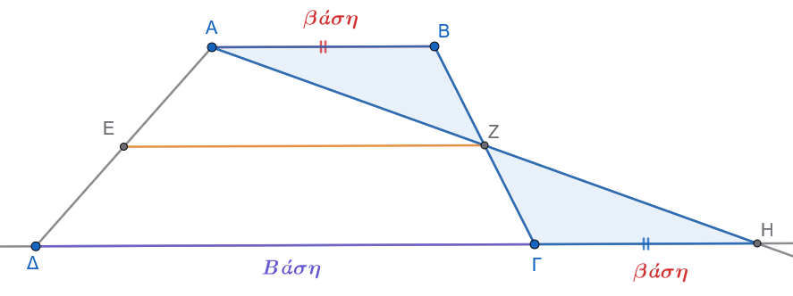{fig-align="center" width="550"}
:::

Έστω τραπέζιο $AB\Gamma\Delta$ ($AB \parallel \Gamma\Delta$) και $E, Z$ τα μέσα των μη παράλληλων πλευρών $A\Delta$ και $B\Gamma$ αντίστοιχα.
Ενώνουμε τα σημεία $A, Z$ και προεκτείνουμε το τμήμα $AZ$ μέχρι να τέμνει την προέκταση της βάσης $\Delta\Gamma$ στο σημείο $H$.

Συγκρίνουμε τα τρίγωνα $ABZ$ και $H\Gamma Z$:

1.  $BZ = Z\Gamma$, διότι το $Z$ είναι το μέσο της $B\Gamma$.

2.  $A\widehat{Z}B = H\widehat{Z}\Gamma$, ως κατακορυφήν γωνίες.

3.  $A\widehat{B}Z = H\widehat{\Gamma}Z$, ως εντός εναλλάξ γωνίες των παραλλήλων $AB$ και $\Delta H$ που τέμνονται από τη $B\Gamma$.

Σύμφωνα με το κριτήριο ισότητας τριγώνων **Γ-Π-Γ**, τα τρίγωνα $ABZ$ και $H\Gamma Z$ είναι ίσα.
Από την ισότητα αυτή προκύπτει ότι:

- $AZ = ZH$, δηλαδή το $Z$ είναι το μέσο του ευθύγραμμου τμήματος $AH$.

- $AB = \Gamma H$.

Στο τρίγωνο $A\Delta H$, το τμήμα $EZ$ συνδέει τα μέσα των πλευρών $A\Delta$ ($E$ μέσο) και $AH$ ($Z$ μέσο).
Από το θεώρημα της διαμέσου τριγώνου, το $EZ$ είναι παράλληλο προς την τρίτη πλευρά $\Delta H$ και ίσο με το μισό της: $$EZ \parallel \Delta H \Rightarrow EZ \parallel AB \quad \text{και} \quad EZ \parallel \Gamma\Delta\quad$$ $$EZ = \dfrac{\Delta H}{2} = \dfrac{\Delta\Gamma + \Gamma H}{2} = \dfrac{AB + \Gamma\Delta}{2}\quad$$
::::

------------------------------------------------------------------------

:::: {.math-box .corollary-box}
::: {.math-title .corollary-title}
**Πόρισμα**
:::

**Η διάμεσος** $EZ$ τραπεζίου $AB\Gamma\Delta$ διέρχεται από τα μέσα $Η$ και $Θ$ των διαγωνίων του $B\Delta$ και $A\Gamma$ αντίστοιχα, και το ευθύγραμμο τμήμα $ΗΘ$ είναι παράλληλο προς τις βάσεις και ίσο με την ημιδιαφορά των βάσεων: $$ΗΘ \parallel AB, \Gamma\Delta \quad \text{και} \quad ΗΘ = \dfrac{\Gamma\Delta - AB}{2} \quad (\text{με } \Gamma\Delta > AB) \quad$$
::::

:::: {.math-box .corollaryproof-box}
::: {.math-title .corollaryproof-title}
**Απόδειξη:**
:::

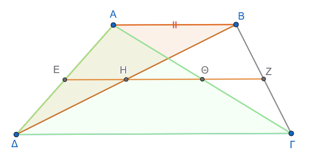{fig-align="center" width="450"}

Στο τρίγωνο $A\Delta B$, το $E$ είναι το μέσο της $A\Delta$ και ισχύει $EΗ \parallel AB$ (αφού το $Η$ ανήκει στη διάμεσο $EZ \parallel AB$).
Συνεπώς, η ευθεία $EΗ$ διέρχεται από το μέσο της πλευράς $B\Delta$, δηλαδή το $Η$ είναι το μέσο της διαγωνίου $B\Delta$ και ισχύει: $$EΗ = \dfrac{AB}{2}\quad (1)\quad$$ Όμοια, στο τρίγωνο $A\Delta\Gamma$, το $Ε$ είναι μέσο της $A\Delta$ και $EΘ \parallel \Gamma\Delta$, οπότε το $Θ$ είναι το μέσο της διαγωνίου $A\Gamma$ και ισχύει: $$EΘ = \dfrac{\Gamma\Delta}{2}\quad (2)\quad$$ Επειδή τα σημεία $E, Η, Θ, Z$ είναι συνευθειακά (ανήκουν όλα στη διάμεσο $EZ$), το μήκος του τμήματος $ΗΘ$ ισούται με: $$ΗΘ = EΘ - EΗ = \dfrac{\Gamma\Delta}{2} - \dfrac{AB}{2} = \dfrac{\Gamma\Delta - AB}{2}\quad$$
::::

------------------------------------------------------------------------

#### Εφαρμογές

:::: {.math-box .example-box}
::: {.math-title .example-title}
- **Εφαρμογή 1η:**
:::

Δίνεται τραπέζιο $AB\Gamma\Delta$ ($AB \parallel \Gamma\Delta$) και η διάμεσός του $EZ$.

Αν οι μη παράλληλες πλευρές $A\Delta$ και $B\Gamma$ τέμνονται στο σημείο $K$, και $H, \Theta$ είναι τα μέσα των τμημάτων $KA$ και $KB$ αντίστοιχα, να αποδειχθεί ότι το τετράπλευρο $EZ\Theta H$ είναι τραπέζιο.
::::

:::: {.math-box .examplesolution-box}
::: {.math-title .examplesolution-title}
*Λύση:*

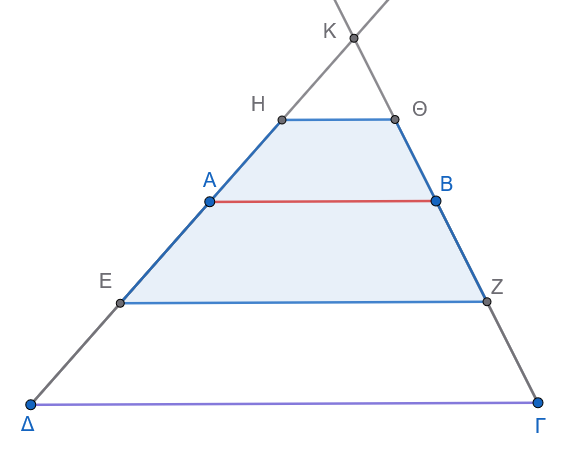{fig-align="center" width="450"}
:::

Στο τρίγωνο $KAB$, τα σημεία $H$ και $\Theta$ είναι τα μέσα των πλευρών $KA$ και $KB$, οπότε το ευθύγραμμο τμήμα $H\Theta$ συνδέει τα μέσα των πλευρών του και ισχύει $H\Theta \parallel AB$.

Επειδή το $EZ$ είναι η διάμεσος του τραπεζίου $AB\Gamma\Delta$, ισχύει επίσης $EZ \parallel AB$.

Συνεπώς $H\Theta \parallel EZ$.

Επειδή $H\Theta \neq EZ$ (καθώς $H\Theta = \dfrac{AB}{2}$ ενώ $EZ = \dfrac{AB+\Gamma\Delta}{2}$), το τετράπλευρο $EZ\Theta H$ έχει μόνο δύο πλευρές παράλληλες, άρα είναι τραπέζιο.
::::

:::: {.math-box .example-box}
::: {.math-title .example-title}
- **Εφαρμογή 2η:**
:::

Σε τραπέζιο $AB\Gamma\Delta$ ($AB \parallel \Gamma\Delta$) η μεγάλη βάση είναι τριπλάσια της μικρής ($\Gamma\Delta = 3AB$).

Να αποδειχθεί ότι:

α.
Το τετράπλευρο ΑΚΛΒ είναι παραλληλόγραμμο.

β.
οι διαγώνιοι $B\Delta$ και $A\Gamma$ χωρίζουν τη διάμεσο $EZ$ σε τρία τμήματα με λόγο $1, \ 2, \ 1$.
::::

:::: {.math-box .examplesolution-box}
::: {.math-title .examplesolution-title}
*Λύση:*

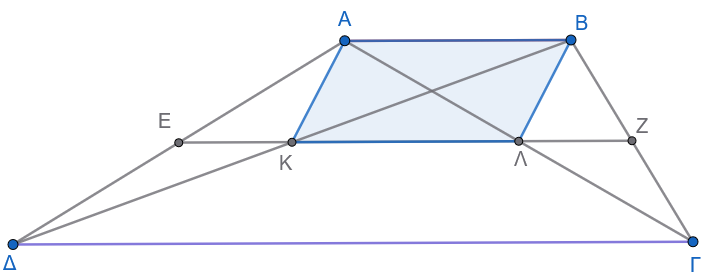{fig-align="center" width="450"}
:::

Έστω $K, \Lambda$ τα σημεία τομής της διαμέσου $EZ$ με τις διαγώνιους $B\Delta$ και $A\Gamma$ αντίστοιχα.

Από το πόρισμα της διαμέσου γνωρίζουμε ότι $EK =// \dfrac{AB}{2}$ και $\Lambda Z =// \dfrac{AB}{2}$.

Το μεσαίο τμήμα $K\Lambda$ ισούται με την ημιδιαφορά των βάσεων: $$K\Lambda = \dfrac{\Gamma\Delta- AB}{2} = \dfrac{3AB - AB}{2} = \dfrac{2AB}{2} = //AB\quad$$

Άρα το $ΑΚΛΒ$ είναι παραλληλόγραμμο.

Επίσης, $EK = \dfrac{AB}{2}$, $\Lambda Z = \dfrac{AB}{2}$ και $K\Lambda = AB$, οπότε τα τμήματα της διαμέσου $EK, K\Lambda, \Lambda Z$ είναι ανάλογα με $1, 2, 1$.
::::

------------------------------------------------------------------------

### Ισοσκελές Τραπέζιο

#### Ορισμός

:::: {.math-box .definition-box}
::: {.math-title .dfinition-title}
**Ισοσκελές τραπέζιο**

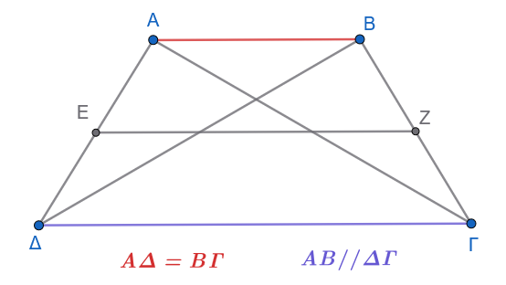{fig-align="center" width="400"}
:::

**Ισοσκελές τραπέζιο** λέγεται το τραπέζιο του οποίου οι μη παράλληλες πλευρές είναι ίσες ($A\Delta = B\Gamma$).
::::

#### Ιδιότητες Ισοσκελούς Τραπεζίου & Αποδείξεις

:::: {.math-box .property-box}
::: {.math-title .property-title}
**Ιδιότητα 1:**
:::

Σε κάθε ισοσκελές τραπέζιο, οι γωνίες που πρόσκεινται σε μία βάση είναι ίσες ($\widehat{A} = \widehat{B}$ και $\widehat{\Gamma} = \widehat{\Delta}$).
::::

:::: {.math-box .propertyproof-box}
::: {.math-title .propertyproof-title}
**Απόδειξη:**

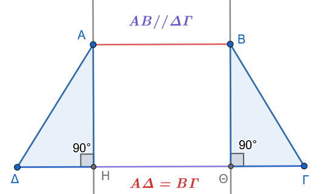{fig-align="center" width="400"}
:::

Έστω ισοσκελές τραπέζιο $AB\Gamma\Delta$ ($AB \parallel \Gamma\Delta$ και $A\Delta = B\Gamma$).

Φέρουμε τα ύψη $AH$ και $BK$ προς τη βάση $\Gamma\Delta$ ($H, K$ σημεία της $\Gamma\Delta$).\

Συγκρίνουμε τα ορθογώνια τρίγωνα $A\Delta H$ ($\widehat{H}=90^\circ$) και $BΘ\Gamma$ ($\widehat{Θ}=90^\circ$):

1.  $A\Delta = B\Gamma$ (από τον ορισμό του ισοσκελούς τραπεζίου).

2.  $AH = BΘ = \upsilon$ (ως αποστάσεις μεταξύ των παραλλήλων ευθειών $AB$ και $\Gamma\Delta$).

Κατά το κριτήριο ισότητας ορθογώνιων τριγώνων (υποτείνουσα και μία κάθετη πλευρά ίσες), τα τρίγωνα $A\Delta H$ και $BK\Gamma$ είναι ίσα.

Συνεπώς, οι αντίστοιχες οξείες γωνίες τους είναι ίσες, δηλαδή:

$$\widehat{\Delta} = \widehat{\Gamma}\quad$$

Επειδή $AB \parallel \Gamma\Delta$, οι γωνίες $\widehat{A}$ και $\widehat{\Delta}$ είναι εντός και επί τα αυτά μέρη, οπότε είναι παραπληρωματικές ($\widehat{A} + \widehat{\Delta} = 180^\circ \Rightarrow \widehat{A} = 180^\circ - \widehat{\Delta}$).

Όμοια, $\widehat{B} + \widehat{\Gamma} = 180^\circ \Rightarrow \widehat{B} = 180^\circ - \widehat{\Gamma}$.

Εφόσον $\widehat{\Delta} = \widehat{\Gamma}$, προκύπτει ότι: $$\widehat{A} = \widehat{B}\quad$$
::::

------------------------------------------------------------------------

:::: {.math-box .property-box}
::: {.math-title .property-title}
**Ιδιότητα 2:**
:::

Οι διαγώνιοι του ισοσκελούς τραπεζίου είναι ίσες ($A\Gamma = B\Delta$).
::::

:::: {.math-box .propertyproof-box}
::: {.math-title .propertyproof-title}
**Απόδειξη:**

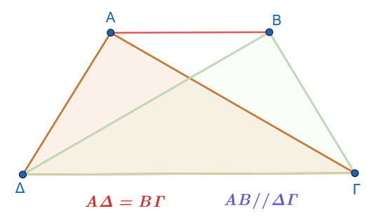{fig-align="center" width="400"}
:::

Έστω ισοσκελές τραπέζιο $AB\Gamma\Delta$ ($AB \parallel \Gamma\Delta$ και $A\Delta = B\Gamma$).

Φέρουμε τις διαγωνίους $A\Gamma$ και $B\Delta$.\

Συγκρίνουμε τα τρίγωνα $A\Delta\Gamma$ και $B\Delta\Gamma$:

1.  $A\Delta = B\Gamma$ (από υπόθεση).

2.  Η πλευρά $\Gamma\Delta$ είναι κοινή.

3.  $A\widehat{\Delta}\Gamma = B\widehat{\Gamma}\Delta$ (από την Ιδιότητα 1, ως γωνίες που πρόσκεινται στη βάση $\Gamma\Delta$).

Σύμφωνα με το κριτήριο **Πλευρά - Γωνία - Πλευρά (Π-Γ-Π)**, τα τρίγωνα $A\Delta\Gamma$ και $B\Delta\Gamma$ είναι ίσα.

Επομένως, οι απέναντι πλευρές τους $A\Gamma$ και $B\Delta$ είναι ίσες: $$A\Gamma = B\Delta\quad$$
::::

------------------------------------------------------------------------

#### Κριτήρια για να είναι ένα Τραπέζιο Ισοσκελές

Ένα τραπέζιο είναι ισοσκελές αν και μόνο αν ικανοποιεί μία από τις παρακάτω ικανές και αναγκαίες συνθήκες:

:::: {.math-box .criteria-box}
::: {.math-title .criteria-title}
Κριτήριο 1
:::

Οι γωνίες που πρόσκεινται σε μία βάση του είναι ίσες.
::::

:::: {.math-box .criteriaproof-box}
::: {.math-title .criteriaproof-title}
**Απόδειξη:**

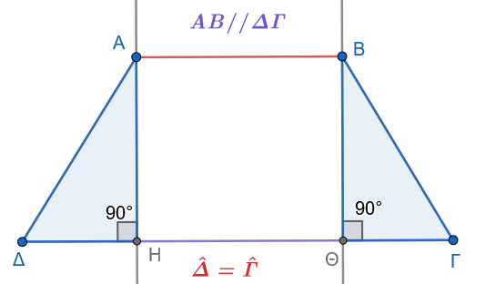{fig-align="center" width="450"}
:::

Έστω τραπέζιο $AB\Gamma\Delta$ ($AB \parallel \Gamma\Delta$) με $\widehat{\Delta} = \widehat{\Gamma}$.
Φέρουμε τα ύψη $AH$ και $BΘ$ στη $\Gamma\Delta$.

Τα ορθογώνια τρίγωνα $A\Delta H$ και $BΘ\Gamma$ έχουν $AH = BΘ = \upsilon$ και $\widehat{\Delta} = \widehat{\Gamma}$.

Από το κριτήριο ισότητας ορθογώνιων τριγώνων (κάθετη πλευρά και οξεία γωνία ίσες), τα τρίγωνα είναι ίσα, οπότε $A\Delta = B\Gamma$.

Άρα το τραπέζιο είναι ισοσκελές.
::::

:::: {.math-box .criteria-box}
::: {.math-title .criteria-title}
Κριτήριο 2
:::

Οι διαγώνιοί του είναι ίσες.
::::

:::: {.math-box .criteriaproof-box}
::: {.math-title .criteriaproof-title}
**Απόδειξη:**

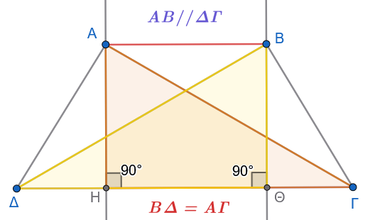{fig-align="center" width="450"}
:::

Έστω τραπέζιο $AB\Gamma\Delta$ ($AB \parallel \Gamma\Delta$) με $A\Gamma = B\Delta$.

Φέρουμε τα ύψη $AH$ και $BΘ$ στη $\Gamma\Delta$.

Τα ορθογώνια τρίγωνα $A\Gamma H$ και $B\Delta Θ$ είναι ίσα διότι έχουν $AH = BΘ = \upsilon$ και $A\Gamma = B\Delta$ (υποτείνουσες).

Άρα $A\widehat{\Gamma}H = B\widehat{\Delta}Θ$.

Επίσης, τα τρίγωνα $A\Delta\Gamma$ και $B\Delta\Gamma$ έχουν $A\Gamma = B\Delta$, $\Gamma\Delta$ κοινή και περιεχόμενες γωνίες ίσες, άρα είναι ίσα (Π-Γ-Π).

Προκύπτει έτσι $A\Delta = B\Gamma$, οπότε το τραπέζιο είναι ισοσκελές.
::::

------------------------------------------------------------------------

#### Εφαρμογές

:::: {.math-box .example-box}
::: {.math-title .example-title}
**Εφαρμογή 1η:**
:::

Να αποδειχθεί ότι σε κάθε ισοσκελές τραπέζιο $AB\Gamma\Delta$ ($AB \parallel \Gamma\Delta$), αν προεκταθούν οι μη παράλληλες πλευρές του $A\Delta$ και $B\Gamma$, τέμνονται σε ένα σημείο $O$ σχηματίζοντας δύο ισοσκελή τρίγωνα $OAB$ και $O\Delta\Gamma$ με κοινή κορυφή.
::::

:::: {.math-box .examplesolution-box}
::: {.math-title .examplesolution-title}
*Λύση:*

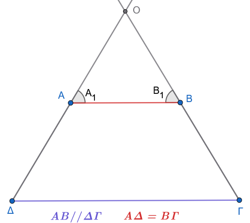{fig-align="center" width="400"}
:::

Έστω $O$ το σημείο τομής των ευθειών $A\Delta$ και $B\Gamma$.

Επειδή $AB \parallel \Gamma\Delta$, οι εντός εκτός και επί τα αυτά μέρη γωνίες είναι ίσες: $\widehat{A}_1 = \widehat{\Delta}$ και $\widehat{B}_1 = \widehat{\Gamma}$.

Επειδή το τραπέζιο είναι ισοσκελές, ισχύει $\widehat{\Delta} = \widehat{\Gamma}$, οπότε και $\widehat{A}_1 = \widehat{B}_1$.

Άρα:

1.  Στο τρίγωνο $OAB$, επειδή $\widehat{A}_1 = \widehat{B}_1$, είναι ισοσκελές με $OA = OB$.

2.  Στο τρίγωνο $O\Delta\Gamma$, επειδή $\widehat{\Delta} = \widehat{\Gamma}$, είναι ισοσκελές με $O\Delta = O\Gamma$.
::::

:::: {.math-box .example-box}
::: {.math-title .example-title}
**Εφαρμογή 2η:**
:::

Να αποδειχθεί ότι η ευθεία που διέρχεται από τα μέσα των βάσεων ισοσκελούς τραπεζίου είναι μεσοκάθετος και των δύο βάσεων (και αποτελεί άξονα συμμετρίας του τραπεζίου).
::::

:::: {.math-box .examplesolution-box}
::: {.math-title .examplesolution-title}
*Λύση:*

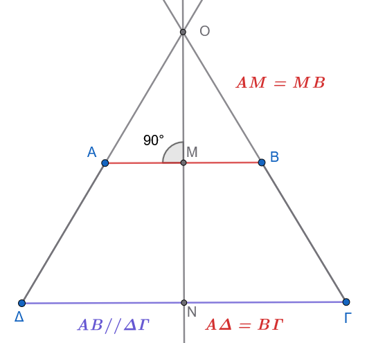{fig-align="center" width="400"}
:::

Έστω $M$ το μέσο της βάσης $AB$ και $N$ το μέσο της βάσης $\Gamma\Delta$.

Από την Εφαρμογή 1, το σημείο $O$ ισαπέχει από τα άκρα της $AB$ ($OA = OB$), άρα η μεσοκάθετος $\epsilon$ της $AB$ διέρχεται από το $O$ και το μέσο της $M$.

Επειδή $AB \parallel \Gamma\Delta$, η ευθεία $\epsilon$ είναι κάθετη και στη $\Gamma\Delta$.

Καθώς η $\epsilon$ είναι το ύψος από την κορυφή $O$ του ισοσκελούς τριγώνου $O\Delta\Gamma$, είναι και διάμεσος της βάσης $\Gamma\Delta$, άρα διέρχεται από το μέσο της $N$.

Επομένως, η ευθεία $MN$ είναι η κοινή μεσοκάθετος των δύο βάσεων.
::::

------------------------------------------------------------------------

### Ασκήσεις για τα Τραπέζια

**1.** Αν $Ε$ και $Ζ$ είναι τα μέσα των ίσων πλευρών $AB$ και $A\Gamma$ αντίστοιχα ισοσκελούς τριγώνου $AB\Gamma$ ($AB = A\Gamma$), να αποδειχθεί ότι το τετράπλευρο $ΕΖΓB$ είναι ισοσκελές τραπέζιο.

**2.** Οι διαγώνιοι ισοσκελούς τραπεζίου $AB\Gamma\Delta$ ($AB \parallel \Gamma\Delta$) τέμνονται στο $O$.
Αν $E, Z, H, \Theta$ είναι τα μέσα των $OA, OB, O\Gamma, O\Delta$ αντίστοιχα, να αποδειχθεί ότι το τετράπλευρο $EZH\Theta$ είναι ισοσκελές τραπέζιο.

**3.** Δίνεται παραλληλόγραμμο $AB\Gamma\Delta$ και το ύψος του $AE$.
Αν $K, \Lambda$ είναι τα μέσα των πλευρών $A\Delta$ και $B\Gamma$ αντίστοιχα, να αποδειχθεί ότι το τετράπλευρο $K\Lambda\Gamma E$ είναι ισοσκελές τραπέζιο.

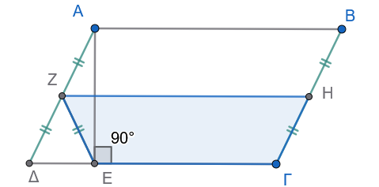{fig-align="center" width="350"}

:::: callout-method
::: {.callout-method .callout-title}
Υπόδειξη
:::

Από το ορθογώνιο τρίγωνο $ΑΔΕ$ έχουμε $ΖΔ=ΖΑ=ΖΕ$ (γιατί;)

Από το παραλληλόγραμμο $ΔΖΗΓ$ (γιατί;) θα έχουμε $............. = ΖΕ=ΓΗ$ (γιατί;)
::::

**4.** Δίνεται ισοσκελές τραπέζιο $AB\Gamma\Delta$ ($AB \parallel \Gamma\Delta$) με $AB < \Gamma\Delta$ και τα ύψη του $AE$ και $BZ$.
Να αποδείξετε ότι:

$$\Delta E = \Gamma Z = \dfrac{\Gamma\Delta - AB}{2} \quad$$

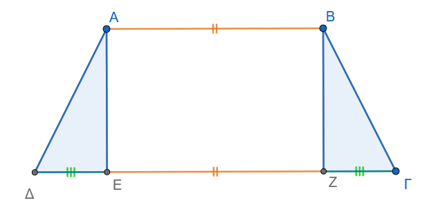{fig-align="center" width="450"}

:::: callout-method
::: {.callout-method .callout-title}
Υπόδειξη
:::

Τα ορθογώνια τρίγωνα είναι ίσα (γιατί;)

Το $ΑΒΖΕ$ είναι ορθογώνιο (γιατί;).
Άρα $ΔΕ+ΖΓ= ....................$ ή $2ΔΕ= ...................$
::::

**5.** Από την κορυφή $A$ τριγώνου $AB\Gamma$ φέρουμε ευθεία $\epsilon$ που δεν τέμνει το τρίγωνο και έστω $BB'$ και $\Gamma\Gamma'$ οι αποστάσεις των κορυφών $B$ και $\Gamma$ από την $\epsilon$.
Αν $M$ είναι το μέσο του $B'\Gamma'$ και $K$ το μέσο της διαμέσου $A\Delta$, να αποδείξετε ότι:

1.  $$MK = \dfrac{A\Delta}{2}\quad$$

2.  $$ΜΔ=\frac{BB'+ΓΓ'}{2}$$

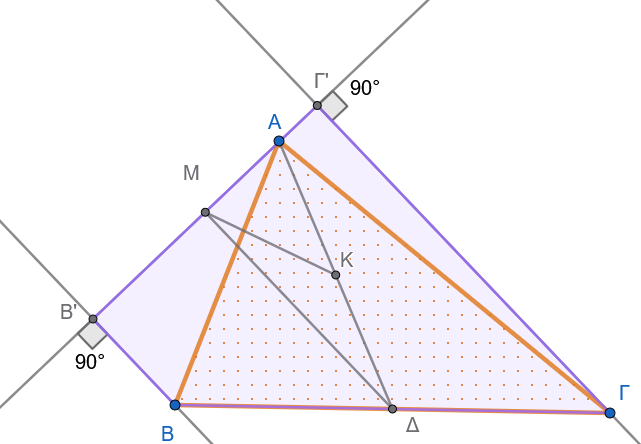{fig-align="center" width="500"}

:::: callout-method
::: {.callout-method .callout-title}
Υπόδειξη
:::

Στο ορθογώνιο (γιατί;) τρίγωνο ΑΜΔ το Κ είναι μέσον της υποτείνουσας .........

Άρα $ΜΚ=.........$

Στο τραπέζιο (γιατί;) $ΒΒ'Γ'Γ$ το Δ είναι μέσον της ΒΓ και το Μ ...............................
::::

**6.** Σε τραπέζιο $AB\Gamma\Delta$ ($AB \parallel \Gamma\Delta$) η διχοτόμος της γωνίας $\widehat{B}$ τέμνει τη διάμεσό του $EZ$ στο σημείο $H$.
Να αποδείξετε ότι $B\widehat{H}\Gamma = 90^\circ$.

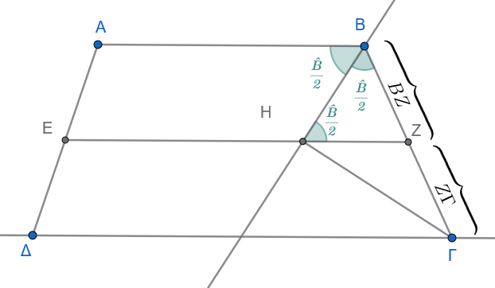{fig-align="center" width="450"}

:::: callout-method
::: {.callout-method .callout-title}
Υπόδειξη
:::

Το τρίγωνο $ΒΗΖ$ είναι ισοσκελές (γιατί;) και $ΒΖ=ΖΓ$.
Άρα .....................
::::

**7.** Σε ισοσκελές τρίγωνο $AB\Gamma$ ($AB = A\Gamma$), $M$ είναι το μέσο της $AB$.
Αν η μεσοκάθετος της $AB$ τέμνει την $A\Gamma$ στο $Z$ και η παράλληλη από το $Z$ προς τη $B\Gamma$ τέμνει την $AB$ στο $H$, να αποδείξετε ότι $\Gamma H = AZ$.

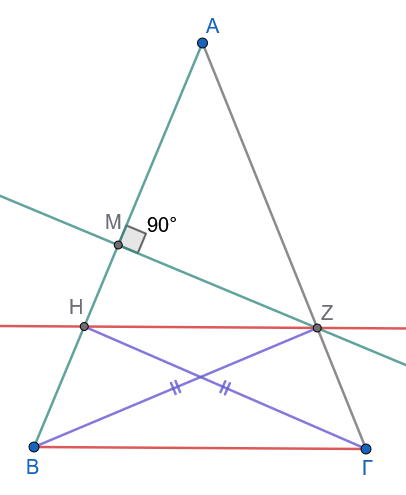{fig-align="center" width="300"}

:::: callout-method
::: {.callout-method .callout-title}
Υπόδειξη
:::

Το $ΗΒΓΖ$ είναι ισοσκελές (γιατί;) τραπέζιο με διαγώνιους ΒΖ και ΗΓ.

Το Ζ είναι σημείο της μεσοκαθέτου ΜΖ στην ΑΒ.

...................

.......................
::::

**8.** Δίνεται τραπέζιο $AB\Gamma\Delta$ με $\widehat{A} = \widehat{\Delta} = 90^\circ$ (ορθογώνιο τραπέζιο) και $\widehat{B} = 120^\circ$.
Αν $AB = 2\alpha$ και $B\Gamma = \alpha$, να υπολογιστεί το μήκος της διαμέσου $EZ$ ως συνάρτηση του $\alpha$.

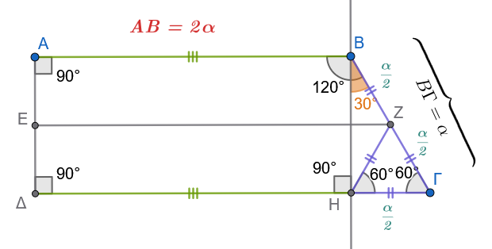{fig-align="center" width="500"}

:::: callout-method
::: {.callout-method .callout-title}
Υπόδειξη
:::

Το $ΑΒΗΔ$ είναι ορθογώνιο (γιατί;)

Αν $Θ=ΕΖ\cap ΒΗ$, τότε $ΕΘ=2α$ (γιατί;) και $ΘΖ=\dfrac{α}{4}$ (γιατί;)

Άρα $ΕΖ=.................$
::::

**9.** Σε ένα τραπέζιο $AB\Gamma\Delta$, η μία από τις μη παράλληλες πλευρές του $A\Delta$ είναι ίση με το άθροισμα των βάσεων ($A\Delta = AB + \Gamma\Delta$).
Αν $M$ είναι το μέσο της πλευράς $B\Gamma$, να αποδείξετε ότι $A\widehat{M}\Delta = 90^\circ$.

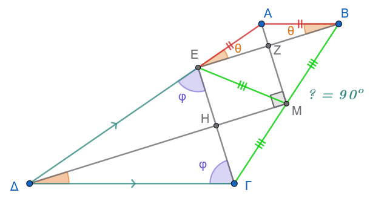{fig-align="center" width="450"}

:::: callout-method
::: {.callout-method .callout-title}
Υπόδειξη
:::

Παίρνουμε $ΑΕ=ΑΒ \implies ΔΕ=ΔΓ$, άρα $\overset{\triangle} {ΑΕΒ} \text{  και  } \overset{\triangle} {ΓΔΕ}$ είναι ισοσκελή.

Έτσι $\hat θ = 90^ο-\dfrac{\hat A}{2}$ και $\hat φ = 90^ο-\dfrac{\hat Δ}{2}$

Άρα $\hat φ +\hat θ= ...................90^ο$ και επομένως $\widehat{ΓEB}=90^ο$

Στο τρίγωνο $ΓΕΒ$ το Μ είναι μέσον της υποτείνουσας ΒΓ, άρα ....................................

έτσι η ΑΜ είναι μεσοκάθετος της ΕΒ και η ΔΜ είναι μεσοκάθετος της ΕΓ (εξηγήστε γιατί).

Τότε το $ΕΖΜΗ$ θα είναι ........................................
::::

**10.** Από το μέσο $E$ της πλευράς $B\Gamma$ ισοσκελούς τραπεζίου $AB\Gamma\Delta$ ($AB \parallel \Gamma\Delta$) φέρουμε παράλληλη ευθεία προς την $A\Delta$, η οποία τέμνει τη βάση $\Delta\Gamma$ στο $M$.
Να αποδείξετε ότι $BM \perp \Delta\Gamma$.

:::: callout-method
::: {.callout-method .callout-title}
Υπόδειξη

Σχεδιάστε το σχήμα
:::

Δείτε ότι $\widehat{AΔΓ} \overset{γιατί;}{=}\widehat{ΕΜΓ} \overset{γιατί;}{=} \widehat{EΓΜ}$

Άρα στο τρίγωνο ΒΜΓ έχουμε $ΜΕ\overset{γιατί;}{=}ΕΓ \overset{γιατί;}{=} ΕΒ$

Επομένως ..................................
::::

**11.** Δίνεται τρίγωνο $AB\Gamma$ και το ύψος του $AH$.
Αν $\Delta, E, Z$ είναι τα μέσα των $AB, A\Gamma, B\Gamma$ αντίστοιχα, να αποδείξετε ότι το τετράπλευρο $\Delta EZ H$ είναι ισοσκελές τραπέζιο.

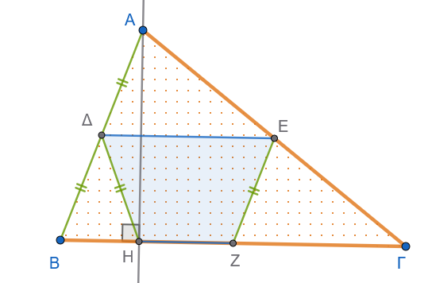{fig-align="center" width="400"}

:::: callout-method
::: {.callout-method .callout-title}
Υπόδειξη
:::

Στο ορθογώνιο τρίγωνο ΑΗΒ το Δ είναι μέσο της ΑΒ.

Στο τρίγωνο ΑΒΓ το ΕΖ ενώνει τα μέσα των πλευρών ..............................................

................................................................................
::::

**12.** Αν σε ένα τραπέζιο η μία βάση είναι διπλάσια της άλλης ($\Gamma\Delta = 2AB$), να αποδείξετε ότι οι διαγώνιοι χωρίζουν τη διάμεσο σε τρία ίσα τμήματα.

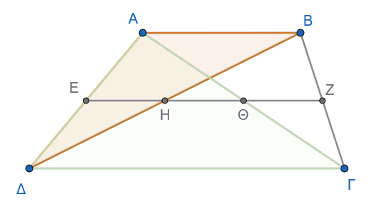{fig-align="center" width="400"}

:::: callout-method
::: {.callout-method .callout-title}
Υπόδειξη
:::

Εργαστείτε στα χρωματισμένα τρίγωνα.

Τα Ε, Η και Θ είναι μέσα των πλευρών ................

Υπολογίστε το ΕΗ, το ΕΘ και αφαιρέστε για να βρείτε το ΗΘ .............................................

..................................................................
::::

**13.** Δίνεται τραπέζιο $AB\Gamma\Delta$ ($AB \parallel \Gamma\Delta$) με $\Gamma\Delta = \dfrac{3}{2}AB$.
Αν $E, Z, H$ είναι τα μέσα των $AB, B\Gamma, \Delta E$ αντίστοιχα, να αποδείξετε ότι το τετράπλευρο $ABZH$ είναι παραλληλόγραμμο.

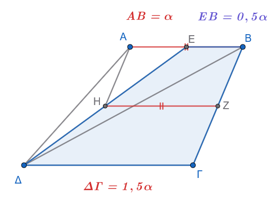{fig-align="center" width="400"}

:::: callout-method
::: {.callout-method .callout-title}
Υπόδειξη
:::

Στο τραπέζιο ΕΒΓΔ υπολογίστε την διάμεσο ΗΖ και συγκρίνετε την με την ΑΒ
::::

**14.** Αν $A', B', \Gamma', \Delta', K'$ είναι οι προβολές των κορυφών $A, B, \Gamma, \Delta$ και του κέντρου $K$ παραλληλογράμμου $AB\Gamma\Delta$ σε ευθεία $\epsilon$ που αφήνει όλες τις κορυφές προς το ίδιο μέρος της κορυφής Α, να αποδείξετε ότι $AA' + BB' + \Gamma\Gamma' + \Delta\Delta' = 4KK'$.

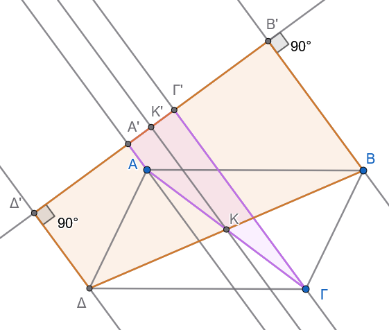{fig-align="center" width="400"}

:::: callout-method
::: {.callout-method .callout-title}
Υπόδειξη
:::

Εργαστείτε στα τραπέζια (γιατί είναι τραπέζια;) Α'ΑΓΓ' και Δ'ΔΒΒ'

Η ΚΚ' είναι ...........................................

.........................................................
::::

**15.** Σε τραπέζιο $AB\Gamma\Delta$ ($AB \parallel \Gamma\Delta$) ισχύει $A\Delta = AB + \Gamma\Delta$.
Να αποδείξετε ότι οι διχοτόμοι των γωνιών $\widehat{A}$ και $\widehat{\Delta}$ τέμνονται πάνω στη μη παράλληλη πλευρά $B\Gamma$.

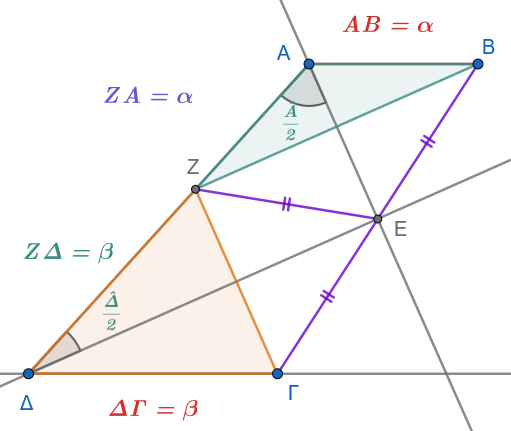{fig-align="center" width="400"}

:::: callout-method
::: {.callout-method .callout-title}
Υπόδειξη
:::

Παίρνουμε $ΑΖ=ΑΒ$ και άρα $ΖΔ=ΔΓ$

Τότε τα χρωματισμένα τρίγωνα είναι ισοσκελή και αφού ή ΑΕ και ΔΕ είναι διχοτόμοι , είναι και μεσοκάθετοι των ΖΒ και ΖΓ

Αρκεί να αποδείξετε ότι η $\widehat{ΒΖΓ}=90^o$

Υπολογίστε τις $\widehat{ΑΖΒ}$ και $\widehat{ΔΖΓ}$ ............................................
$\widehat{ΑΖΒ}+\widehat{ΔΖΓ}=90^o$ αφού $\hat Α+ \hat Δ=180^o$ (γιατί;)

Άρα ..........................................
::::

:::: {.math-box .exercise-box}
::: {.math-title .exercise-title}
16. Εκφώνηση
:::

Δίνεται τραπέζιο $AB\Gamma\Delta$ με $\widehat{A} = \widehat{\Delta} = 90^\circ$ και $B\Gamma = 2\Gamma\Delta$.

Αν $M$ είναι το μέσο της $B\Gamma$, να αποδείξετε ότι $A\widehat{M}\Gamma = 3 M\widehat{A}B$.
::::

:::: {.math-box .solution-box}
::: {.math-title .solution-title}
Λύση

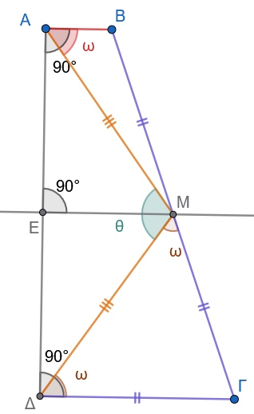{fig-align="center" width="250"}
:::

1.  **Ίσες πλευρές:**

    Επειδή το $M$ είναι το μέσο του $B\Gamma$ και δίνεται ότι $B\Gamma = 2\Gamma\Delta$, έχουμε: $$\Gamma M = \frac{B\Gamma}{2} = \Gamma\Delta$$

    Άρα, το τρίγωνο $\Gamma\Delta M$ είναι **ισοσκελές** με $\Gamma\Delta = \Gamma M$.

2.  **Μεσοκάθετος του** $A\Delta$:

    Αν $E$ είναι το μέσο του $A\Delta$, τότε το τμήμα $ME$ ενώνει τα μέσα των μη παράλληλων πλευρών του τραπεζίου, άρα είναι η διάμεσος του τραπεζίου: $$ME \parallel AB \parallel \Gamma\Delta$$

    Επειδή $A\Delta \perp AB$, είναι και $ME \perp A\Delta$.

    Άρα, το $ME$ είναι **μεσοκάθετος** του τμήματος $A\Delta$, γεγονός που σημαίνει ότι: $$MA = M\Delta$$

    Επομένως, το τρίγωνο $AM\Delta$ είναι **ισοσκελές**.

3.  **Υπολογισμός των Γωνιών:**

    Έστω $\widehat{MAB} = \omega$.

    - Επειδή $\widehat{A} = 90^\circ$, έχουμε: $$\widehat{MA\Delta} = 90^\circ - \omega$$

    - Επειδή το τρίγωνο $AM\Delta$ είναι ισοσκελές ($MA = M\Delta$): $$\widehat{M\Delta A} = \widehat{MA\Delta} = 90^\circ - \omega$$

    - Η γωνία $\widehat{AM\Delta}$ στην κορυφή του ισοσκελούς τριγώνου $AM\Delta$ είναι: $$\widehat{AM\Delta} = 180^\circ - (\widehat{MA\Delta} + \widehat{M\Delta A}) = 180^\circ - 2(90^\circ - \omega) = 2\omega$$

    - Επειδή $\widehat{\Delta} = 90^\circ$, η γωνία $\widehat{\Gamma\Delta M}$ είναι: $$\widehat{\Gamma\Delta M} = 90^\circ - \widehat{M\Delta A} = 90^\circ - (90^\circ - \omega) = \omega$$

    - Επειδή το τρίγωνο $\Gamma\Delta M$ είναι ισοσκελές ($\Gamma\Delta = \Gamma M$), οι προσκείμενες στη βάση γωνίες είναι ίσες: $$\widehat{\Gamma M\Delta} = \widehat{\Gamma\Delta M} = \omega$$

4.  **Συμπέρασμα:**

    Η γωνία $\widehat{AM\Gamma}$ προκύπτει από το άθροισμα των γωνιών $\widehat{AM\Delta}$ και $\widehat{\Gamma M\Delta}$: $$\widehat{AM\Gamma} = \widehat{AM\Delta} + \widehat{\Gamma M\Delta} = 2\omega + \omega = 3\omega$$

    Επομένως: $$\widehat{AM\Gamma} = 3\widehat{MAB}$$
::::

**17.** Σε τραπέζιο $AB\Gamma\Delta$ ($AB \parallel \Gamma\Delta$) με $AB < \Gamma\Delta$, έστω $M$ το μέσο της $B\Gamma$.
Αν $\Delta M = \Delta\Gamma$ και η παράλληλη από το $A$ προς τη $B\Gamma$ τέμνει τη $\Delta M$ στο $E$, να αποδείξετε ότι $AM = BE$.

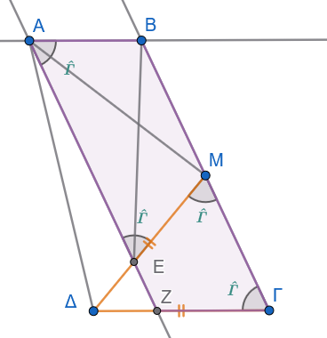{fig-align="center" width="300"}

:::: callout-method
::: {.callout-method .callout-title}
Υπόδειξη
:::

Δείτε ότι (και εξηγείστε):

- ΑΒΓΖ παραλληλόγραμμο.

- ΖΕΜΓ ισοσκελές τραπέζιο.

- ΒΜΕΑ ισοσκελές τραπέζιο.
::::

**18.** Σε κάθε ισοσκελές τραπέζιο $AB\Gamma\Delta$, αν οι διαγώνιοι $A\Gamma$ και $B\Delta$ τέμνονται στο $O$, να αποδειχθεί ότι τα τρίγωνα $OAB$ και $O\Delta\Gamma$ που σχηματίζονται με τις βάσεις είναι ισοσκελή.

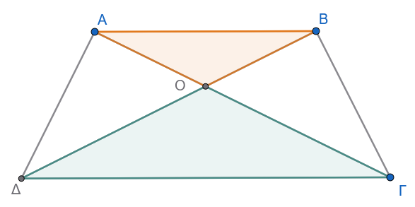{fig-align="center" width="420"}

:::: {.math-box .exercise-box}
::: {.math-title .exercise-title}
19. **Εκφώνηση:**
:::

Τα μέσα των πλευρών ενός ισοσκελούς τραπεζίου είναι κορυφές ρόμβου.
::::

:::: {.math-box .solution-box}
::: {.math-title .solution-title}
**Λύση:**

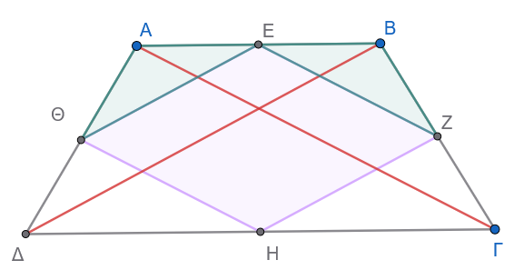{fig-align="center" width="400"}
:::

Για να αποδείξουμε ότι το τετράπλευρο $EZH\Theta$ είναι ρόμβος, αρκεί να δείξουμε ότι:

1.  Είναι **παραλληλόγραμμο**, και

2.  Έχει **δύο διαδοχικές πλευρές ίσες**.

**1ο Βήμα: Απόδειξη ότι το** $EZH\Theta$ είναι παραλληλόγραμμο

- **Στο τρίγωνο** $A\Delta\Gamma$:

  Το ευθύγραμμο τμήμα $\Theta H$ ενώνει τα μέσα των πλευρών $A\Delta$ και $\Delta\Gamma$.

  Επομένως, είναι παράλληλο προς τη διαγώνιο $A\Gamma$ και ίσο με το μισό της: $$\Theta H \parallel A\Gamma \quad \text{και} \quad \Theta H = \frac{A\Gamma}{2} \quad (1)$$

- **Στο τρίγωνο** $AB\Gamma$:

  Το ευθύγραμμο τμήμα $EZ$ ενώνει τα μέσα των πλευρών $AB$ και $B\Gamma$.

  Επομένως, είναι επίσης παράλληλο προς τη διαγώνιο $A\Gamma$ και ίσο με το μισό της: $$EZ \parallel A\Gamma \quad \text{και} \quad EZ = \frac{A\Gamma}{2} \quad (2)$$

Από τις σχέσεις $(1)$ και $(2)$ προκύπτει ότι: $$\Theta H \parallel EZ \quad \text{και} \quad \Theta H = EZ$$

Επειδή το τετράπλευρο $EZH\Theta$ έχει δύο απέναντι πλευρές παράλληλες και ίσες, είναι **παραλληλόγραμμο**.

**2ο Βήμα: Απόδειξη ότι έχει ίσες πλευρές**

Συγκρίνουμε τα τρίγωνα $\Theta AE$ και $EZB$.
Αυτά έχουν:

1.  $AE = EB$, επειδή το $E$ είναι το μέσο της βάσης $AB$.

2.  $A\Theta = BZ$, ως τα μισά των ίσων μη παράλληλων πλευρών $A\Delta$ και $B\Gamma$ του ισοσκελούς τραπεζίου ($A\Delta = B\Gamma$).

3.  $\widehat{A} = \widehat{B}$, ως γωνίες που πρόσκεινται στη βάση του ισοσκελούς τραπεζίου.

Σύμφωνα με το κριτήριο ισότητας τριγώνων **Πλευρά – Γωνία – Πλευρά (**$\Pi-\Gamma-\Pi$), τα τρίγωνα $\Theta AE$ και $EZB$ είναι ίσα.

Άρα και οι αντίστοιχες πλευρές τους είναι ίσες: $$\Theta E = EZ$$

**Συμπέρασμα:**

Το παραλληλόγραμμο $EZH\Theta$ έχει δύο διαδοχικές πλευρές ίσες ($\Theta E = EZ$), άρα όλες οι πλευρές του είναι ίσες: $$\Theta E = EZ = ZH = H\Theta$$

Επομένως, το τετράπλευρο $EZH\Theta$ είναι **ρόμβος**.
::::

:::: {.math-box .exercise-box}
::: {.math-title .exercise-title}
20. **Εκφώνηση:**
:::

Το άθροισμα των αποστάσεων των κορυφών ενός τριγώνου $AB\Gamma$ από μια εξωτερική του ευθεία $(\varepsilon)$, ισούται με το άθροισμα των αποστάσεων των μέσων των πλευρών του από την ίδια ευθεία.
::::

:::: {.math-box .solution-box}
::: {.math-title .solution-title}
**Λύση:**

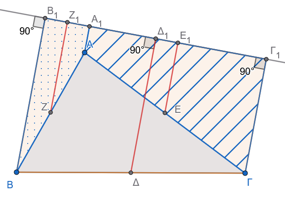{fig-align="center" width="420"}
:::

Έστω $\Delta, E, Z$ τα μέσα των πλευρών $B\Gamma, A\Gamma, AB$ αντίστοιχα.

Φέρνουμε τις αποστάσεις (κάθετα τμήματα) των κορυφών και των μέσων προς την ευθεία $(\varepsilon)$:

- $AA_1, BB_1, \Gamma\Gamma_1 \perp (\varepsilon)$ (αποστάσεις των κορυφών)

- $\Delta\Delta_1, EE_1, ZZ_1 \perp (\varepsilon)$ (αποστάσεις των μέσων)

Όλα τα παραπάνω τμήματα είναι παράλληλα μεταξύ τους ως κάθετα στην ίδια ευθεία $(\varepsilon)$.

Θα αποδείξουμε ότι: $$AA_1 + BB_1 + \Gamma\Gamma_1 = \Delta\Delta_1 + EE_1 + ZZ_1$$

εφαρμόζοντας την ιδιότητα της διαμέσου του τραπεζίου (η διάμεσος ισούται με το ημιάθροισμα των βάσεων) τρεις φορές:

1.  **Στο τραπέζιο** $BB_1\Gamma_1\Gamma$:

    Το τμήμα $\Delta\Delta_1$ ενώνει τα μέσα των μη παράλληλων πλευρών, άρα είναι η διάμεσος του τραπεζίου: $$\Delta\Delta_1 = \frac{BB_1 + \Gamma\Gamma_1}{2} \implies BB_1 + \Gamma\Gamma_1 = 2 \cdot \Delta\Delta_1 \quad (1)$$

2.  **Στο τραπέζιο** $BB_1A_1A$:

    Το τμήμα $ZZ_1$ είναι η διάμεσος του τραπεζίου: $$ZZ_1 = \frac{BB_1 + AA_1}{2} \implies BB_1 + AA_1 = 2 \cdot ZZ_1 \quad (2)$$

3.  **Στο τραπέζιο** $AA_1\Gamma_1\Gamma$:

    Το τμήμα $EE_1$ είναι η διάμεσος του τραπεζίου: $$EE_1 = \frac{AA_1 + \Gamma\Gamma_1}{2} \implies AA_1 + \Gamma\Gamma_1 = 2 \cdot EE_1 \quad (3)$$

**Συμπέρασμα:**

Προσθέτουμε τις σχέσεις $(1)$, $(2)$ και $(3)$ κατά μέλη:

$$(BB_1 + \Gamma\Gamma_1) + (BB_1 + AA_1) + (AA_1 + \Gamma\Gamma_1) = 2 \cdot \Delta\Delta_1 + 2 \cdot ZZ_1 + 2 \cdot EE_1$$

$$2 \cdot AA_1 + 2 \cdot BB_1 + 2 \cdot \Gamma\Gamma_1 = 2 \cdot (\Delta\Delta_1 + EE_1 + ZZ_1)$$

$$2 \cdot (AA_1 + BB_1 + \Gamma\Gamma_1) = 2 \cdot (\Delta\Delta_1 + EE_1 + ZZ_1)$$

Διαιρώντας και τα δύο μέλη με το $2$, προκύπτει:

$$AA_1 + BB_1 + \Gamma\Gamma_1 = \Delta\Delta_1 + EE_1 + ZZ_1$$
::::

:::: {.math-box .exercise-box}
::: {.math-title .exercise-title}
21. **Εκφώνηση:**
:::

Δίνεται ισόπλευρο τρίγωνο $AB\Gamma$ και ένα εσωτερικό του σημείο $O$.\
Από το σημείο $O$ φέρνουμε:

- την ημιευθεία $Ox \parallel B\Gamma$, η οποία τέμνει την $A\Gamma$ στο σημείο $\Delta$,

- την ημιευθεία $Oy \parallel A\Gamma$, η οποία τέμνει την $AB$ στο σημείο $E$, και

- την ημιευθεία $Oz \parallel AB$, η οποία τέμνει την $B\Gamma$ στο σημείο $Z$.

Να αποδείξετε ότι το άθροισμα $O\Delta + OE + OZ$ είναι σταθερό.
::::

:::: {.math-box .solution-box}
::: {.math-title .solution-title}
**Λύση:**

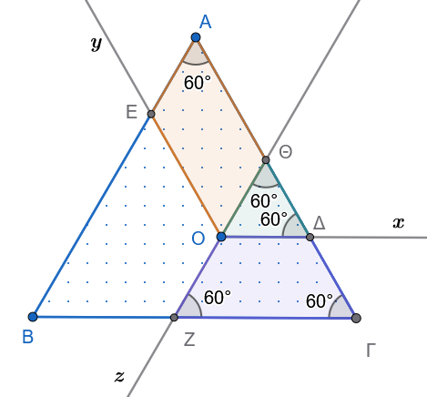{fig-align="center" width="350"}
:::

Θα αποδείξουμε ότι: $$O\Delta + OE + OZ = A\Gamma \quad (\sigma\tau\alpha\theta\varepsilon\rho\text{ό})$$

Προεκτείνουμε την ημιευθεία $ZO$ (προς την πλευρά του $O$) μέχρι να τμήσει την πλευρά $A\Gamma$ στο σημείο $\Theta$.

**1ο Βήμα: Το τετράπλευρο** $O\Theta AE$

- Έχουμε $OE \parallel A\Theta$ (αφού $Oy \parallel A\Gamma$) και $\Theta O \parallel AE$ (αφού $Oz \parallel AB$).

- Επομένως, το $O\Theta AE$ έχει τις απέναντι πλευρές του παράλληλες, άρα είναι **παραλληλόγραμμο**.

- Από τις ιδιότητες του παραλληλογράμμου προκύπτει ότι οι απέναντι πλευρές είναι ίσες: $$OE = A\Theta \quad (1)$$

**2ο Βήμα: Το τρίγωνο** $\Theta O\Delta$

- Επειδή $O\Delta \parallel B\Gamma$, οι εντός εκτός και επί τα αυτά μέρη γωνίες είναι ίσες:\
  $$\widehat{\Delta}_1 = \widehat{\Gamma} = 60^\circ$$

- Επειδή $\Theta O \parallel AB$, αντίστοιχα έχουμε:\
  $$\widehat{\Theta}_1 = \widehat{A} = 60^\circ$$

- Αφού το τρίγωνο $\Theta O\Delta$ έχει δύο γωνίες ίσες με $60^\circ$, είναι **ισόπλευρο τρίγωνο**.\
  Επομένως, όλες οι πλευρές του είναι ίσες: $$O\Delta = \Theta\Delta \quad (2)$$

**3ο Βήμα: Το τετράπλευρο** $OZ\Gamma\Delta$

- Έχει $O\Delta \parallel Z\Gamma$, άρα είναι **τραπέζιο**.

- Επειδή $Oz \parallel AB$, είναι $\widehat{Z}_1 = \widehat{B} = 60^\circ$.

- Καθώς το αρχικό τρίγωνο είναι ισόπλευρο, έχουμε $\widehat{\Gamma} = 60^\circ$, άρα: $$\widehat{Z}_1 = \widehat{\Gamma} = 60^\circ$$

- Επειδή οι γωνίες που πρόσκεινται στη βάση του τραπεζίου είναι ίσες, το τραπέζιο $OZ\Gamma\Delta$ είναι **ισοσκελές**, οπότε οι μη παράλληλες πλευρές του είναι ίσες: $$OZ = \Delta\Gamma \quad (3)$$

**Συμπέρασμα:**

Προσθέτουμε κατά μέλη τις ισότητες $(1)$, $(2)$ και $(3)$: $$OE + O\Delta + OZ = A\Theta + \Theta\Delta + \Delta\Gamma$$

Παρατηρούμε ότι τα διαδοχικά τμήματα $A\Theta$, $\Theta\Delta$ και $\Delta\Gamma$ συνθέτουν ολόκληρη την πλευρά $A\Gamma$: $$A\Theta + \Theta\Delta + \Delta\Gamma = A\Gamma$$

Άρα: $$O\Delta + OE + OZ = A\Gamma = \sigma\tau\alpha\theta\varepsilon\rho\text{ό} \quad (\mu\text{ή}\kappa\text{o}\varsigma\ \tau\eta\varsigma\ \pi\lambda\varepsilon\upsilon\rho\acute{\alpha}\varsigma\ \tau\text{o}\upsilon\ \iota\sigma\text{o}\pi\lambda\varepsilon\acute{\upsilon}\rho\text{o}\upsilon)$$
::::

:::: {.math-box .exercise-box}
::: {.math-title .exercise-title}
22. **Εκφώνηση:**
:::

Πάνω στη βάση $B\Gamma$ ενός ισοσκελούς τριγώνου $AB\Gamma$ ($AB = A\Gamma$) παίρνουμε ένα τυχαίο σημείο $\Delta$ και φέρνουμε τις αποστάσεις του $\Delta E \perp A\Gamma$ και $\Delta Z \perp AB$ από τις ίσες πλευρές.
Αν $M$ είναι το μέσο της βάσης $B\Gamma$ και $MH \perp A\Gamma$, να αποδείξετε ότι: $$AZ + AE = 2 \cdot AH = \sigma\tau\alpha\theta\varepsilon\rho\text{ό}$$ για οποιαδήποτε θέση του σημείου $\Delta$.
::::

:::: {.math-box .solution-box}
::: {.math-title .solution-title}
**Λύση:**

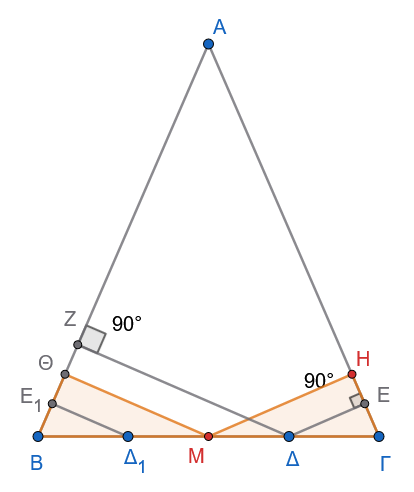{fig-align="center" width="320"}
:::

**1ο Βήμα: Βοηθητική κατασκευή και ισότητα τμημάτων**

- Φέρνουμε την κάθετο $M\Theta \perp AB$.

- Συγκρίνουμε τα ορθογώνια τρίγωνα $MB\Theta$ και $M\Gamma H$:

  - $MB = M\Gamma$ (το $M$ είναι μέσο της $B\Gamma$)

  - $\widehat{B} = \widehat{\Gamma}$ (γωνίες προσκείμενες στη βάση του ισοσκελούς τριγώνου $AB\Gamma$)

  Άρα τα τρίγωνα είναι ίσα, οπότε: $$B\Theta = \Gamma H \quad \text{και} \quad A\Theta = AH \quad (\alpha\varphi\text{ού } AB = A\Gamma)$$

**2ο Βήμα: Αναγωγή της αποδεικτέας σχέσης**

Η ζητούμενη σχέση γράφεται ισοδύναμα: $$AZ + AE = 2 \cdot AH$$ $$AZ + (AH + HE) = AH + A\Theta$$ $$AZ + AH + HE = AH + (AZ + Z\Theta)$$ $$HE = Z\Theta$$

Επομένως, **αρκεί να αποδείξουμε ότι** $HE = Z\Theta$.

**3ο Βήμα: Συμμετρικό σημείο και διάμεσος τραπεζίου**

- Παίρνουμε το σημείο $\Delta_1$ πάνω στη βάση $B\Gamma$, συμμετρικό του $\Delta$ ως προς το $M$ (άρα το $M$ είναι το μέσο του τμήματος $\Delta_1\Delta$).

- Φέρνουμε την κάθετο $\Delta_1 E_1 \perp AB$.

- Επειδή $\Delta_1 E_1 \perp AB$, $M\Theta \perp AB$ και $\Delta Z \perp AB$, τα τρία αυτά τμήματα είναι παράλληλα μεταξύ τους: $$\Delta_1 E_1 \parallel M\Theta \parallel \Delta Z$$

- Στο τραπέζιο $\Delta_1 E_1 Z \Delta$, το τμήμα $M\Theta$ άγεται από το μέσο $M$ της πλευράς $\Delta_1\Delta$ παράλληλα προς τις βάσεις, άρα είναι η **διάμεσος** του τραπεζίου.

  Επομένως, το $\Theta$ είναι το μέσο του $E_1 Z$, δηλαδή: $$E_1\Theta = \Theta Z \quad (1)$$

**4ο Βήμα: Ισότητα των τμημάτων** $E_1\Theta$ και $EH$

- Τα ορθογώνια τρίγωνα $\Delta_1 B E_1$ και $\Delta \Gamma E$ είναι ίσα, διότι έχουν:

  - $B\Delta_1 = \Gamma\Delta$ (λόγω συμμετρίας ως προς το μέσο $M$)

  - $\widehat{B} = \widehat{\Gamma}$

  Άρα προκύπτει ότι: $$BE_1 = \Gamma E$$

- Παρατηρούμε ότι: $$E_1\Theta = B\Theta - BE_1$$ $$EH = \Gamma H - \Gamma E$$

  Επειδή $B\Theta = \Gamma H$ και $BE_1 = \Gamma E$, έχουμε ως διαφορά ίσων τμημάτων: $$E_1\Theta = EH \quad (2)$$

**Συμπέρασμα:**

Από τις σχέσεις $(1)$ και $(2)$ προκύπτει άμεσα ότι: $$HE = \Theta Z$$

Επομένως, ισχύει η ισοδύναμη αρχική σχέση: $$AZ + AE = 2 \cdot AH = \sigma\tau\alpha\theta\varepsilon\rho\text{ό}$$ (καθώς το σημείο $H$ εξαρτάται μόνο από το μέσο $M$ και είναι ανεξάρτητο της θέσης του σημείου $\Delta$).
::::

------------------------------------------------------------------------

### Σύντομη Ανασκόπηση: Αξιοσημείωτες Ευθείες και Κύκλοι Τριγώνου

Σε κάθε τρίγωνο $AB\Gamma$, οι τέσσερις βασικές κατηγορίες ευθειών (μεσοκάθετοι, διχοτόμοι, διάμεσοι, ύψη) αποτελούν τριάδες συντρεχουσών ευθειών, ορίζοντας αντίστοιχα αξιοσημείωτα σημεία και κύκλους:

```         
                     ΑΞΙΟΣΗΜΕΙΩΤΑ ΣΗΜΕΙΑ ΚΑΙ ΚΥΚΛΟΙ ΤΡΙΓΩΝΟΥ
                                   |
    +------------------------------+------------------------------+
    |                              |                              |
[Μεσοκάθετοι]                 [Διχοτόμοι]                     [Διάμεσοι]
    |                              |                              |
    v                              +---------------+              v
Περίκεντρο (O)                     |               |         Βαρύκεντρο (G)
(Κέντρο Περιγεγραμμένου)           v               v         (2/3 διαμέσου)
                              [Εσωτερικές]    [Εξωτερικές]        |
                                   |               |              v
                                   v               v          [Ύψη]
                               Έγκεντρο (I)   Παράκεντρα (Iα)     |
                               (Εγγεγραμμένος) (Παρεγγεγραμμένοι) v
                                                              Ορθόκεντρο (H)
```

1.  **Μεσοκάθετοι Πλευρών — Περίκεντρο & Περιγεγραμμένος Κύκλος:**

    - Οι μεσοκάθετοι των τριών πλευρών του τριγώνου διέρχονται από το ίδιο σημείο $O$, το οποίο ονομάζεται **περίκεντρο**.

    - Το σημείο $O$ ισαπέχει από τις τρεις κορυφές του τριγώνου ($OA = OB = O\Gamma = R$) και αποτελεί το κέντρο του **περιγεγραμμένου κύκλου** του τριγώνου.

2.  **Εσωτερικές Διχοτόμοι — Έγκεντρο & Εγγεγραμμένος Κύκλος:**

    - Οι εσωτερικές διχοτόμοι των τριών γωνιών του τριγώνου τέμνονται σε ένα σημείο $I$, το οποίο ονομάζεται **έγκεντρο**.

    - Το σημείο $I$ ισαπέχει από τις τρεις πλευρές του τριγώνου και αποτελεί το κέντρο του **εγγεγραμμένου κύκλου** του τριγώνου.

3.  **Εξωτερικές Διχοτόμοι — Παράκεντρα & Παρεγγεγραμμένοι Κύκλοι:**

    - Οι εξωτερικές διχοτόμοι δύο γωνιών και η εσωτερική διχοτόμος της τρίτης γωνίας τέμνονται ανά τρεις σε τρία σημεία $I_\alpha, I_\beta, I_\gamma$, τα οποία ονομάζονται **παράκεντρα**.

    - Τα σημεία αυτά αποτελούν τα κέντρα των τριών **παρεγγεγραμμένων κύκλων** του τριγώνου, καθένας από τους οποίους εφάπτεται σε μία πλευρά και στις προεκτάσεις των άλλων δύο.

4.  **Διάμεσοι — Βαρύκεντρο (Κέντρο Βάρους):**

    - Οι τρεις διάμεσοι του τριγώνου τέμνονται σε ένα σημείο $G$ (ή $\Theta$), το οποίο ονομάζεται **βαρύκεντρο**.

    - Το βαρύκεντρο απέχει από κάθε κορυφή απόσταση ίση με τα $\dfrac{2}{3}$ του μήκους της αντίστοιχης διαμέσου ($AG = \dfrac{2}{3}\mu_\alpha$).

5.  **Ύψη — Ορθόκεντρο:**

    - Οι φορείς των τριών υψών του τριγώνου διέρχονται από το ίδιο σημείο $H$, το οποίο ονομάζεται **ορθόκεντρο** του τριγώνου.

### Ταξινόμηση τετράπλευρων

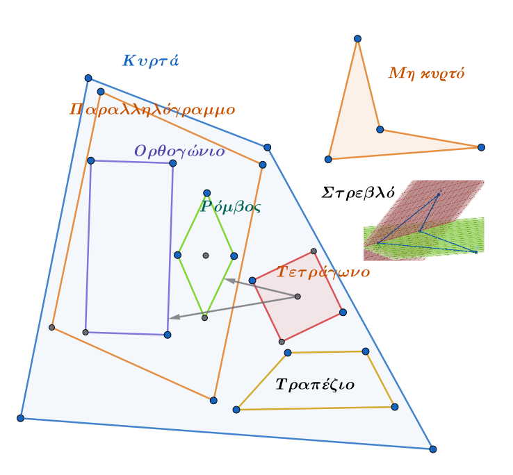{fig-align="center" width="500"}

------------------------------------------------------------------------

::: {.callout-important title="ΣΑΣ ΕΥΧΟΜΑΙ"}
ΚΑΛΗ ΜΕΛΕΤΗ !!!
:::
