```{=html}
<!-- Φόρτωση βιβλιοθήκης GeoGebra -->
<script src="https://www.geogebra.org/apps/deployggb.js"></script>

<!-- Συνάρτηση δημιουργίας applets -->
<script>
function createGeoGebra(containerId, materialId, width = 700, height = 500) {
  var params = {
    "id": "ggb-" + containerId,
    "material_id": materialId,
    "width": width,
    "height": height,
    "showToolBar": true,
    "showMenuBar": false,
    "showAlgebraInput": true
  };
  
  var applet = new GGBApplet(params, '5.2');
  applet.inject(containerId);
}
</script>
```

## Εγγεγραμμένη γωνία

### Ορισμοί

:::: {.math-box .definition-box}
::: {.math-title .definition-title}
Εγγεγραμμένη Γωνία - Αντίστοιχο Τόξο - Αντίστοιχη Επίκεντρη Γωνία

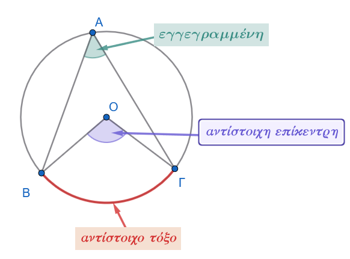{fig-align="center" width="400"}
:::

- **Εγγεγραμμένη Γωνία:** Εγγεγραμμένη ονομάζεται κάθε γωνία της οποίας η κορυφή είναι σημείο ενός κύκλου και οι πλευρές της περιέχουν χορδές του κύκλου αυτού.

- **Αντίστοιχο Τόξο (Βαίνει σε τόξο):** Το τόξο του κύκλου που περιέχεται στο εσωτερικό της εγγεγραμμένης γωνίας και έχει άκρα τα σημεία τομής των πλευρών της με τον κύκλο ονομάζεται **αντίστοιχο τόξο** της, ενώ λέμε επίσης ότι η γωνία **βαίνει** στο τόξο αυτό.

- **Αντίστοιχη Επίκεντρη Γωνία:** Είναι η επίκεντρη γωνία του ίδιου κύκλου (δηλαδή η γωνία με κορυφή το κέντρο $O$) που βαίνει στο ίδιο αντίστοιχο τόξο με την εγγεγραμμένη γωνία.
::::

------------------------------------------------------------------------

### Σχέση Εγγεγραμμένης και Αντίστοιχης Επίκεντρης

#### Θεώρημα

:::: {.math-box .theorem-box}
::: {.math-title .theorem-title}
Θεώρημα
:::

**Κάθε εγγεγραμμένη γωνία ισούται με το μισό της επίκεντρης γωνίας που βαίνει στο ίδιο τόξο.** $$\widehat{A\Gamma B} = \dfrac{1}{2}\widehat{AOB}$$
::::

:::::: {.math-box .apodeixi-box}
::: {.math-title .apodeixi-title}
**Απόδειξη:**

<iframe src="https://www.geogebra.org/calculator/hv7xwfyt?embed" width="730" height="600" allowfullscreen style="border: 1px solid #e4e4e4;border-radius: 4px;" frameborder="0">

</iframe>
:::

:::: {.math-box .odigia-box}
::: {.math-title .odigia-title}
**Οδηγία**
:::

Αλλάξτε την θέση του σημείου Μ, Α, Β ή Κ.

Τι παρατηρείτε σε κάθε νέα εγγεγραμμένη γωνία και την αντίστοιχη επίκεντρη;
::::

Έστω κύκλος $(O, R)$, ένα τόξο του $\overset{\frown}{AB}$, η αντίστοιχη επίκεντρη γωνία $\widehat{AOB}$ και σημείο $\Gamma$ του κύκλου που δεν ανήκει στο τόξο $\overset{\frown}{AB}$, το οποίο ορίζει την εγγεγραμμένη γωνία $\widehat{A\Gamma B}$.
Διακρίνουμε τρεις περιπτώσεις για τη θέση του κέντρου $O$ ως προς την εγγεγραμμένη γωνία $\widehat{A\Gamma B}$:

1.  **Το κέντρο** $O$ βρίσκεται στο εσωτερικό της εγγεγραμμένης γωνίας $\widehat{A\Gamma B}$:

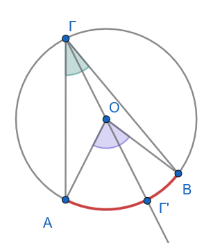{fig-align="center" width="250"}

Φέρουμε τη διάμετρο $\Gamma\Gamma'$.
Το τρίγωνο $AO\Gamma$ είναι ισοσκελές ($OA = O\Gamma = R$), οπότε οι γωνίες της βάσης είναι ίσες: $\widehat{O A\Gamma} = \widehat{O\Gamma A}$.

Η γωνία $\widehat{\Gamma' OA}$ είναι εξωτερική του τριγώνου $AO\Gamma$, άρα ισούται με το άθροισμα των δύο απέναντι εσωτερικών γωνιών: $$\widehat{\Gamma' OA} = \widehat{O A\Gamma} + \widehat{O\Gamma A} = 2\widehat{O\Gamma A} \quad$$

Όμοια, στο ισοσκελές τρίγωνο $BO\Gamma$ ($OB = O\Gamma = R$), η εξωτερική γωνία $\widehat{\Gamma' OB}$ ισούται με: $$\widehat{\Gamma' OB} = 2\widehat{O\Gamma B} \quad$$

Προσθέτοντας κατά μέλη τις δύο αυτές σχέσεις, λαμβάνουμε: $$\widehat{AOB} = \widehat{\Gamma' OA} + \widehat{\Gamma' OB} = 2\widehat{O\Gamma A} + 2\widehat{O\Gamma B} = 2(\widehat{O\Gamma A} + \widehat{O\Gamma B}) = 2\widehat{A\Gamma B}$$

Συνεπώς: $\widehat{A\Gamma B} = \dfrac{1}{2}\widehat{AOB}$.

2.  **Το κέντρο** $O$ ανήκει σε μία πλευρά της εγγεγραμμένης γωνίας (π.χ. στην $\Gamma A$):

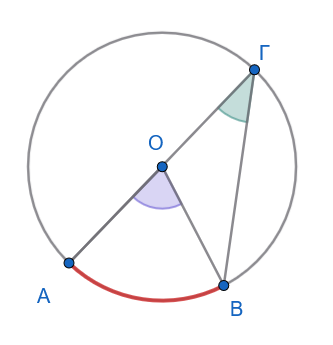{fig-align="center" width="240"}

Η επίκεντρη γωνία $\widehat{AOB}$ είναι εξωτερική γωνία του ισοσκελούς τριγώνου $\Gamma OB$ ($O\Gamma = OB = R$), επομένως: $$\widehat{AOB} = \widehat{O\Gamma B} + \widehat{OB\Gamma} = 2\widehat{O\Gamma B} = 2\widehat{A\Gamma B} \Rightarrow \widehat{A\Gamma B} = \dfrac{1}{2}\widehat{AOB} \quad$$

3.  **Το κέντρο** $O$ βρίσκεται στο εξωτερικό της εγγεγραμμένης γωνίας $\widehat{A\Gamma B}$:

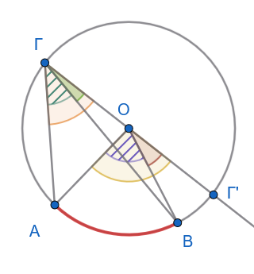{fig-align="center" width="250"}

Φέρουμε τη διάμετρο $\Gamma\Gamma'$.
Αφαιρώντας κατά μέλη τις σχέσεις των εξωτερικών γωνιών, έχουμε: $$\widehat{AOB} = \widehat{Γ'OΑ} - \widehat{Γ'OΒ} = 2\widehat{OΓΑ} - 2\widehat{OΓΒ} = 2(\widehat{OΓΑ} - \widehat{OΓΒ}) = 2\widehat{AΓB}$$

Άρα: $\widehat{A\Gamma B} = \dfrac{1}{2}\widehat{AOB}$.
::::::

------------------------------------------------------------------------

#### Πορίσματα & Αποδείξεις

:::: {.math-box .corollary-box}
::: {.math-title .corollary-title}
**Πόρισμα 1:**
:::

*Το μέτρο μιας εγγεγραμμένης γωνίας ισούται με το μισό του μέτρου του αντίστοιχου τόξου της.*
::::

:::: {.math-box .corollaryproof-box}
::: {.math-title .corollaryproof-title}
**Απόδειξη:**
:::

Επειδή το μέτρο μιας επίκεντρης γωνίας ορίζεται ίσο με το μέτρο του αντίστοιχου τόξου της ($\widehat{AOB} = \text{μέτρο } \overset{\frown}{AB}$) και αποδείξαμε ότι κάθε εγγεγραμμένη γωνία είναι το μισό της αντίστοιχης επίκεντρης ($\widehat{A\Gamma B} = \dfrac{1}{2}\widehat{AOB}$), προκύπτει ότι το μέτρο της εγγεγραμμένης γωνίας ισούται με το μισό του μέτρου του τόξου στο οποίο βαίνει.
::::

:::: {.math-box .corollary-box}
::: {.math-title .corollary-title}
**Πόρισμα 2:**
:::

*Κάθε εγγεγραμμένη γωνία που βαίνει σε ημικύκλιο είναι ορθή (*$90^\circ$).
::::

:::: {.math-box .corollaryproof-box}
::: {.math-title .corollaryproof-title}
**Απόδειξη:**
:::

Το ημικύκλιο έχει μέτρο $180^\circ$ (αντιστοιχεί σε ευθεία επίκεντρη γωνία $180^\circ$).

Επομένως, η εγγεγραμμένη γωνία που βαίνει σε αυτό ισούται με $\dfrac{180^\circ}{2} = 90^\circ$.
::::

:::: {.math-box .corollary-box}
::: {.math-title .corollary-title}
**Πόρισμα 3:**
:::

*Οι εγγεγραμμένες γωνίες που βαίνουν στο ίδιο τόξο ή σε ίσα τόξα του ίδιου ή ίσων κύκλων είναι ίσες.*
::::

:::: {.math-box .corollaryproof-box}
::: {.math-title .corollaryproof-title}
**Απόδειξη:**
:::

Όλες οι γωνίες αυτές έχουν μέτρο ίσο με το μισό του μέτρου του ίδιου ή ίσων τόξων, συνεπώς είναι ίσες μεταξύ τους.
::::

------------------------------------------------------------------------

### Γωνία Χορδής και Εφαπτομένης

#### Ορισμός

:::: {.math-box .definition-box}
::: {.math-title .definition-title}
Γωνία χορδής και εφαπτομένης

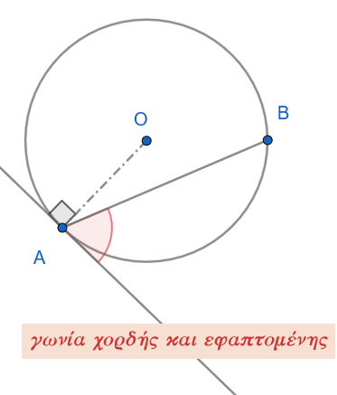{fig-align="center" width="280"}
:::

**Γωνία χορδής και εφαπτομένης** ονομάζεται η γωνία της οποίας η κορυφή είναι σημείο ενός κύκλου, η μία πλευρά της είναι τέμνουσα (χορδή) και η άλλη πλευρά της είναι η εφαπτομένη του κύκλου στο σημείο αυτό.
::::

------------------------------------------------------------------------

#### Θεώρημα

:::: {.math-box .theorem-box}
::: {.math-title .theorem-title}
Θεώρημα
:::

Η γωνία που σχηματίζεται από μία χορδή κύκλου και την εφαπτομένη στο άκρο της ισούται με κάθε εγγεγραμμένη γωνία που βαίνει στο τόξο της χορδής αυτής.
::::

:::: {.math-box .apodeixi-box}
::: {.math-title .apodeixi-title}
**Απόδειξη:**
:::

Έστω κύκλος $(O, R)$, μια χορδή του $AB$ και η εφαπτόμενη $xy$ στο άκρο $A$.

Έστω $\widehat{xAB}$ η γωνία που σχηματίζει η εφαπτόμενη με τη χορδή, η οποία περιέχει το τόξο $\overset{\frown}{AB}$, και $\widehat{A\Gamma B}$ μια εγγεγραμμένη γωνία που βαίνει στο ίδιο τόξο $\overset{\frown}{AB}$.

Διακρίνουμε τρεις περιπτώσεις ανάλογα με το είδος της γωνίας $\widehat{xAB}$:

------------------------------------------------------------------------

**1η Περίπτωση: Η γωνία** $\widehat{xAB}$ είναι ορθή ($90^\circ$)

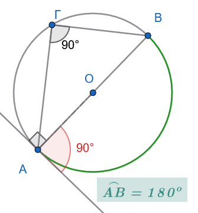{fig-align="center" width="280"}

- Αν $\widehat{xAB} = 90^\circ$, τότε η χορδή $AB$ είναι κάθετη στην εφαπτόμενη $xy$, άρα η $AB$ είναι **διάμετρος** του κύκλου.

- Το τόξο $\overset{\frown}{AB}$ είναι ημικύκλιο ($180^\circ$).

- Η εγγεγραμμένη γωνία $\widehat{A\Gamma B}$ βαίνει σε ημικύκλιο, άρα είναι επίσης ορθή: $$\widehat{A\Gamma B} = 90^\circ$$

- Επομένως: $\widehat{xAB} = \widehat{A\Gamma B} = 90^\circ$.

------------------------------------------------------------------------

**2η Περίπτωση: Η γωνία** $\widehat{xAB}$ είναι οξεία

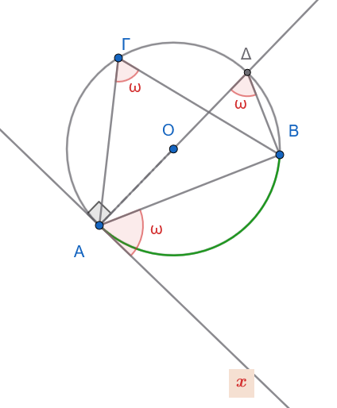{fig-align="center" width="350"}

1.  Φέρνουμε τη διάμετρο $A\Delta$ από το σημείο $A$ και ενώνουμε το $\Delta$ με το $B$.

2.  Επειδή η $xy$ είναι εφαπτόμενη και η $A\Delta$ είναι διάμετρος (ακτίνα στο σημείο επαφής): $$\widehat{xA\Delta} = 90^\circ$$

    Άρα: $$\widehat{xAB} = 90^\circ - \widehat{BA\Delta} \quad (1)$$

3.  Στο ορθογώνιο τρίγωνο $AB\Delta$ (η γωνία $\widehat{AB\Delta} = 90^\circ$ επειδή είναι εγγεγραμμένη σε ημικύκλιο), οι οξείες γωνίες είναι συμπληρωματικές: $$\widehat{A\Delta B} = 90^\circ - \widehat{BA\Delta} \quad (2)$$

4.  Από τις σχέσεις $(1)$ και $(2)$ έχουμε: $$\widehat{xAB} = \widehat{A\Delta B}$$

5.  Όμως, οι εγγεγραμμένες γωνίες $\widehat{A\Delta B}$ και $\widehat{A\Gamma B}$ βαίνουν στο ίδιο τόξο $\overset{\frown}{AB}$, οπότε είναι ίσες: $$\widehat{A\Delta B} = \widehat{A\Gamma B}$$

Επομένως: $$\widehat{xAB} = \widehat{A\Gamma B} = \frac{1}{2} \overset{\frown}{AB}$$

------------------------------------------------------------------------

**3η Περίπτωση: Η γωνία είναι αμβλεία**

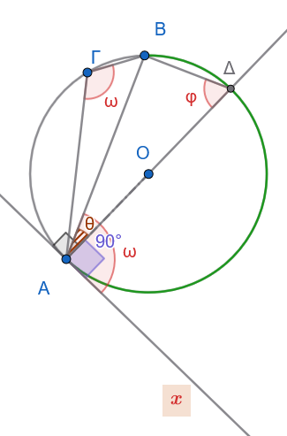{fig-align="center" width="250"}

Αν θεωρήσουμε την αμβλεία γωνία $\widehat{xAB}$ , τότε:

1.  $\widehat{xAB}=90^o +\hatθ=90^ο +\dfrac{\overset{\frown}{ΒΔ}}{2}$
2.  $\widehat{ΑΓΒ}=\dfrac{\overset{\frown}{ΑΔ}+\overset{\frown}{ΔΒ}}{2}=\dfrac{180^o +\overset\frown{ΒΔ}}{2}=90^ο +\dfrac{\overset\frown{ΒΔ}}{2}$

Άρα $\widehat{xAB}=\widehat{ΑΓΒ}$

------------------------------------------------------------------------

**Συμπέρασμα:**

Σε κάθε περίπτωση, το μέτρο της γωνίας χορδής και εφαπτομένης ισούται με το μισό του αντίστοιχου τόξου: $$\widehat{xAB} = \frac{1}{2} \overset{\frown}{AB} = \widehat{A\Gamma B}$$
::::

------------------------------------------------------------------------

#### Εφαρμογές

:::: {.math-box .example-box}
::: {.math-title .example-title}
**Εφαρμογή 1η:**
:::

*Να αποδειχθεί ότι η εφαπτομένη στο μέσο* $M$ ενός τόξου $AB$ κύκλου είναι παράλληλη προς τη χορδή $AB$.
::::

:::: {.math-box .examplesolution-box}
::: {.math-title .examplesolution-title}
**Λύση:**
:::

**1ος Τρόπος (Μέσω Γωνιών - Εντός Εναλλάξ)**

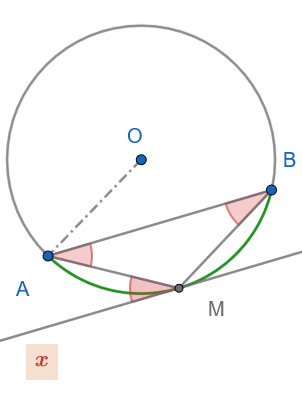{fig-align="center" width="230"}

1.  Έστω $xy$ η εφαπτόμενη του κύκλου στο σημείο $M$ (με το $x$ προς το μέρος του $A$).

2.  Επειδή το $M$ είναι το μέσο του τόξου $\overset{\frown}{AB}$, τα δύο τόξα είναι ίσα: $$\overset{\frown}{MA} = \overset{\frown}{MB}$$

3.  Η γωνία $\widehat{xMA}$ είναι γωνία χορδής και εφαπτομένης, άρα ισούται με το μισό του αντίστοιχου τόξου: $$\widehat{xMA} = \frac{1}{2}\overset{\frown}{MA}$$

4.  Η γωνία $\widehat{MAB}$ είναι εγγεγραμμένη γωνία που βαίνει στο τόξο $\overset{\frown}{MB}$, άρα: $$\widehat{MAB} = \frac{1}{2}\overset{\frown}{MB}$$

5.  Επειδή $\overset{\frown}{MA} = \overset{\frown}{MB}$, προκύπτει ότι: $$\widehat{xMA} = \widehat{MAB}$$

6.  Οι γωνίες $\widehat{xMA}$ και $\widehat{MAB}$ είναι **εντός εναλλάξ** των ευθειών $xy$ και $AB$ που τέμνονται από την ευθεία $MA$.\
    Επειδή είναι ίσες, οι ευθείες είναι παράλληλες: $$xy \parallel AB$$

------------------------------------------------------------------------

**2ος Τρόπος (Μέσω Καθετότητας στην Ακτίνα)**

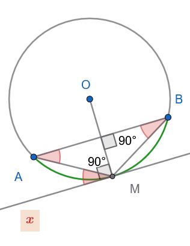{fig-align="center" width="250"}

1.  Έστω $O$ το κέντρο του κύκλου.
    Φέρνουμε την ακτίνα $OM$.

2.  Επειδή το $M$ είναι το μέσο του τόξου $\overset{\frown}{AB}$, η ακτίνα $OM$ είναι μεσοκάθετος της αντίστοιχης χορδής $AB$, άρα: $$OM \perp AB$$

3.  Η ευθεία $xy$ είναι εφαπτόμενη του κύκλου στο σημείο $M$, άρα είναι κάθετη στην ακτίνα $OM$: $$xy \perp OM$$

4.  Δύο ευθείες ($xy$ και $AB$) που είναι κάθετες στην ίδια ευθεία ($OM$), είναι μεταξύ τους παράλληλες: $$xy \parallel AB$$
::::

:::: {.math-box .example-box}
::: {.math-title .example-title}
**Εφαρμογή 2η (Γωνία δύο χορδών που τέμνονται):**
:::

**1η Περίπτωση: Η κορυφή βρίσκεται στο ΕΣΩΤΕΡΙΚΟ του κύκλου (Εσωτερική Γωνία)**

**Διατύπωση:**

Μια γωνία με κορυφή στο εσωτερικό του κύκλου ισούται με το **άθροισμα** των δύο εγγεγραμμένων γωνιών που βαίνουν στα τόξα τα οποία περιέχονται μεταξύ των πλευρών της και των προεκτάσεών τους (ή ισοδύναμα, με το **ημιάθροισμα** των δύο αυτών τόξων).
::::

:::: {.math-box .examplesolution-box}
::: {.math-title .examplesolution-title}
**Απόδειξη:**

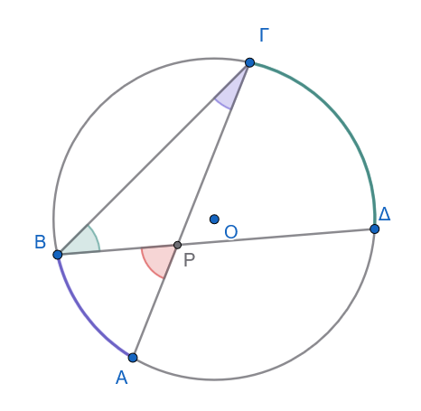{fig-align="center" width="350"}
:::

1.  Θεωρούμε δύο τέμνουσες χορδές $A\Gamma$ και $B\Delta$ που τέμνονται σε ένα εσωτερικό σημείο $P$ του κύκλου, σχηματίζοντας τη γωνία $\widehat{AP B} = \widehat{P}$.

2.  Ενώνουμε τα σημεία $B$ και $\Gamma$ για να σχηματίσουμε το τρίγωνο $P B \Gamma$.

3.  Η γωνία $\widehat{P}$ είναι **εξωτερική γωνία** του τριγώνου $P B \Gamma$ στην κορυφή $P$.

4.  Γνωρίζουμε ότι η εξωτερική γωνία ενός τριγώνου ισούται με το άθροισμα των δύο απέναντι εσωτερικών γωνιών του: $$\widehat{P} = \widehat{P B \Gamma} + \widehat{P \Gamma B} = \widehat{\Delta B \Gamma} + \widehat{A \Gamma B}$$

5.  Οι γωνίες $\widehat{\Delta B \Gamma}$ και $\widehat{A \Gamma B}$ είναι **εγγεγραμμένες** στον κύκλο και βαίνουν στα τόξα $\overset{\frown}{\Gamma\Delta}$ και $\overset{\frown}{AB}$ αντίστοιχα: $$\widehat{\Delta B \Gamma} = \frac{\overset{\frown}{\Gamma\Delta}}{2} \quad \text{και} \quad \widehat{A \Gamma B} = \frac{\overset{\frown}{AB}}{2}$$

6.  Αντικαθιστώντας, έχουμε: $$\widehat{P} = \frac{\overset{\frown}{AB}}{2} + \frac{\overset{\frown}{\Gamma\Delta}}{2} = \frac{\overset{\frown}{AB} + \overset{\frown}{\Gamma\Delta}}{2}$$
::::

:::: {.math-box .example-box}
::: {.math-title .example-title}
**Εφαρμογή 2η (Γωνία δύο χορδών που τέμνονται):**
:::

**2η Περίπτωση: Η κορυφή βρίσκεται στο ΕΞΩΤΕΡΙΚΟ του κύκλου (Εξωτερική Γωνία)**

**Διατύπωση:**

Μια γωνία με κορυφή στο εξωτερικό του κύκλου ισούται με τη **διαφορά** των δύο εγγεγραμμένων γωνιών που βαίνουν στα αντίστοιχα περιεχόμενα τόξα (ή ισοδύναμα, με την **ημιδιαφορά** των δύο αυτών τόξων).
::::

:::: {.math-box .examplesolution-box}
::: {.math-title .examplesolution-title}
**Απόδειξη:**

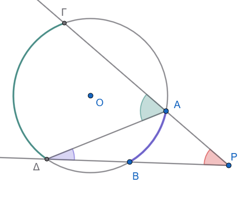{fig-align="center" width="400"}
:::

1.  Θεωρούμε δύο τέμνουσες που ξεκινούν από ένα εξωτερικό σημείο $P$ και τέμνουν τον κύκλο:

    - η μία στα σημεία $A$ και $\Gamma$ (με το $A$ μεταξύ $P$ και $\Gamma$),

    - η άλλη στα σημεία $B$ και $\Delta$ (με το $B$ μεταξύ $P$ και $\Delta$).

2.  Ενώνουμε τα σημεία $A$ και $\Delta$ για να σχηματίσουμε το τρίγωνο $P A \Delta$.

3.  Στο τρίγωνο $P A \Delta$, η γωνία $\widehat{\Gamma A \Delta}$ είναι **εξωτερική γωνία** στην κορυφή $A$.

4.  Επομένως, ισούται με το άθροισμα των δύο απέναντι εσωτερικών γωνιών: $$\widehat{\Gamma A \Delta} = \widehat{P} + \widehat{A \Delta B} \implies \widehat{P} = \widehat{\Gamma A \Delta} - \widehat{A \Delta B}$$

5.  Οι γωνίες $\widehat{\Gamma A \Delta}$ και $\widehat{A \Delta B}$ είναι **εγγεγραμμένες** στον κύκλο και βαίνουν στα τόξα $\overset{\frown}{\Gamma\Delta}$ και $\overset{\frown}{AB}$ αντίστοιχα: $$\widehat{\Gamma A \Delta} = \frac{\overset{\frown}{\Gamma\Delta}}{2} \quad \text{και} \quad \widehat{A \Delta B} = \frac{\overset{\frown}{AB}}{2}$$

6.  Αντικαθιστώντας, έχουμε: $$\widehat{P} = \frac{\overset{\frown}{\Gamma\Delta}}{2} - \frac{\overset{\frown}{AB}}{2} = \frac{\overset{\frown}{\Gamma\Delta} - \overset{\frown}{AB}}{2}$$

**Συνοπτικός Πίνακας Συμπερασμάτων:**

| Θέση Κορυφής $P$ | Σχέση με Εγγεγραμμένες Γωνίες | Σχέση με τα Τόξα |
|:-----------------------|:-----------------------|:-----------------------|
| **Εσωτερικό Κύκλου** | $\widehat{P} = \widehat{\Delta B \Gamma} + \widehat{A \Gamma B}$ | $\widehat{P} = \dfrac{\overset{\frown}{AB} + \overset{\frown}{\Gamma\Delta}}{2}$ |
| **Εξωτερικό Κύκλου** | $\widehat{P} = \widehat{\Gamma A \Delta} - \widehat{A \Delta B}$ | $\widehat{P} = \dfrac{\overset{\frown}{\Gamma\Delta} - \overset{\frown}{AB}}{2}$ |
::::

:::: {.math-box .example-box}
::: {.math-title .example-title}
**Εφαρμογή 3η:**
:::

Θεωρούμε δύο τεμνόμενους κύκλους και φέρουμε τις εφαπτόμενές τους σε καθένα από τα κοινά σημεία τους.

α.
Να αποδειχθεί ότι οι εφαπτόμενες των δύο κύκλων σε καθένα από τα κοινά σημεία τους σχηματίζουν ίσες γωνίες.
**Καθεμία από τις γωνίες αυτές λέγεται γωνία των δύο κύκλων**.

β.
**Αν η γωνία των δύο κύκλων είναι ορθή, λέμε ότι οι κύκλοι τέμνονται ορθογώνια ή ότι είναι ορθογώνιοι**.
Να αποδειχθεί ότι, αν οι δύο κύκλοι είναι ορθογώνιοι, οι εφαπτόμενες του ενός κύκλου στα κοινά σημεία τους διέρχονται από το κέντρο του άλλου κύκλου.
::::

:::: {.math-box .examplesolution-box}
::: {.math-title .examplesolution-title}
**Λύση:**
:::

**α. Απόδειξη ότι οι εφαπτόμενες σχηματίζουν ίσες γωνίες στα δύο κοινά σημεία**

Έστω δύο κύκλοι $(O_1, R_1)$ και $(O_2, R_2)$ που τέμνονται στα σημεία $A$ και $B$.

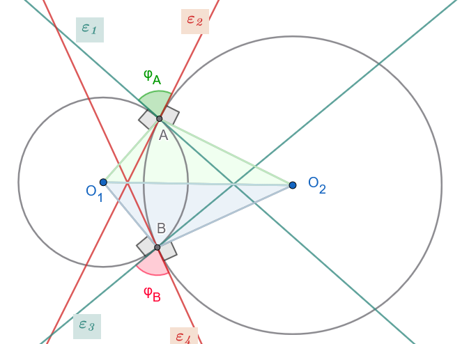{fig-align="center" width="500"}

1.  **Γωνία μεταξύ εφαπτομένων και γωνία μεταξύ ακτίνων:**

    - Στο σημείο $A$, η εφαπτόμενη $\varepsilon_1$ του πρώτου κύκλου είναι κάθετη στην ακτίνα $O_1 A$ ($\varepsilon_1 \perp O_1 A$).

    - Η εφαπτόμενη $\varepsilon_2$ του δεύτερου κύκλου είναι κάθετη στην ακτίνα $O_2 A$ ($\varepsilon_2 \perp O_2 A$).

    Ας πούμε $\varphi_A$ την γωνία των εφαπτόμενων $\varepsilon_1, \varepsilon_2$ στο $A$ και $\varphi_B$ την γωνία των εφαπτόμενων ε*3 και ε*4 στο Β:

2.  **Ισότητα των τριγώνων** $O_1 A O_2$ και $O_1 B O_2$:

    Συγκρίνουμε τα τρίγωνα $O_1 A O_2$ και $O_1 B O_2$:

    - $O_1 A = O_1 B = R_1$ (ακτίνες του κύκλου $(O_1)$)

    - $O_2 A = O_2 B = R_2$ (ακτίνες του κύκλου $(O_2)$)

    - $O_1 O_2$ είναι κοινή πλευρά.

    Από το κριτήριο **Πλευρά – Πλευρά – Πλευρά (**$\Pi-\Pi-\Pi$), τα τρίγωνα είναι ίσα.

    Επομένως, οι αντίστοιχες γωνίες τους είναι ίσες: $$\widehat{O_1 A O_2} = \widehat{O_1 B O_2}$$

    Άρα $$\varphi_A =360^ο-90^ο-90^ο-\widehat{Ο_1ΑΟ_2}=360^ο-90^ο-90^ο-\widehat{Ο_1ΒΟ_2}= \varphi_B$$

*(Εναλλακτικά, αυτό προκύπτει άμεσα από τη συμμετρία του σχήματος ως προς τη διάκεντρο* $O_1 O_2$, η οποία είναι η μεσοκάθετος του κοινού τμήματος $AB$).

------------------------------------------------------------------------

**β. Απόδειξη για τους ορθογώνιους κύκλους**

Υποθέτουμε ότι οι κύκλοι τέμνονται ορθογώνια, δηλαδή η γωνία των εφαπτομένων τους είναι $90^\circ$ ($\varepsilon_1 \perp \varepsilon_2$).

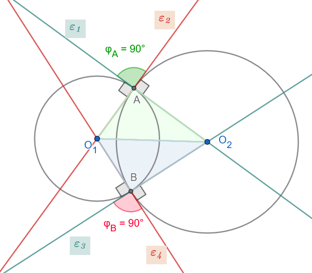{fig-align="center" width="450"}

1.  **Για τις εφαπτόμενες στο σημείο** $A$:

    - Η ευθεία $\varepsilon_1$ είναι η εφαπτόμενη του κύκλου $(O_1)$ στο $A$, άρα $\varepsilon_1 \perp O_1 A$.

    - Η ευθεία $\varepsilon_2$ είναι η εφαπτόμενη του κύκλου $(O_2)$ στο $A$, άρα $\varepsilon_2 \perp O_2 A$.

    - Δίνεται ότι οι κύκλοι είναι ορθογώνιοι, άρα $\varepsilon_1 \perp \varepsilon_2$.

2.  **Διέλευση από τα κέντρα:**

    - Επειδή από το σημείο $A$ άγεται μία μόνο κάθετος στην ευθεία $\varepsilon_1$, και γνωρίζουμε ότι τόσο η ακτίνα $O_1 A$ όσο και η εφαπτόμενη $\varepsilon_2$ είναι κάθετες στην $\varepsilon_1$, η εφαπτόμενη $\varepsilon_2$ αναγκαστικά **ταυτίζεται με την ευθεία της ακτίνας** $O_1 A$.

      Άρα, η εφαπτόμενη $\varepsilon_2$ του κύκλου $(O_2)$ **διέρχεται από το κέντρο** $O_1$ του άλλου κύκλου.

    - Αντίστοιχα, επειδή $\varepsilon_1 \perp \varepsilon_2$ και $O_2 A \perp \varepsilon_2$, η εφαπτόμενη $\varepsilon_1$ **ταυτίζεται με την ευθεία της ακτίνας** $O_2 A$.

      Άρα, η εφαπτόμενη $\varepsilon_1$ του κύκλου $(O_1)$ **διέρχεται από το κέντρο** $O_2$ του άλλου κύκλου.

3.  Λόγω συμμετρίας (ή με την ίδια ακριβώς διαδικασία), το ίδιο ισχύει και για τις εφαπτόμενες στο δεύτερο κοινό σημείο $B$.

4.  Επίσης $\widehat{Ο_1ΑΟ_2}=360^ο -270^ο=90^ο$ και $\widehat{Ο_1BΟ_2}=360^ο -270^ο=90^ο$

Δηλαδή $Ο_1A \perp O_2A$ και $Ο_1Β \perp O_2Β$ άρα η $ε_1$ και η $ΑΟ_2$ συμπίπτουν.

................
::::

------------------------------------------------------------------------

### Βασικοί Γεωμετρικοί Τόποι στον Κύκλο — Τόξο Κύκλου που Δέχεται Γνωστή Γωνία

#### Ορισμοί

:::: {.math-box .definition-box}
::: {.math-title .definition-title}
Γωνία υπό την οποία φαίνεται τμήμα - Τόξο που δέχεται γνωστή γωνία - Γεωμετρικός Τόπος
:::

- **Γωνία υπό την οποία φαίνεται τμήμα:** Όταν ένα ευθύγραμμο τμήμα $AB$ και ένα σημείο $M$ (που δεν ανήκει στην ευθεία $AB$) σχηματίζουν γωνία $\widehat{AMB} = \phi$, λέμε ότι το τμήμα $AB$ **φαίνεται** από το σημείο $M$ υπό γωνία $\phi$ (ή το σημείο $M$ βλέπει το $AB$ υπό γωνία $\phi$).

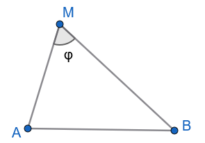{fig-align="center" width="200"}

- **Τόξο που δέχεται γνωστή γωνία:** Ένα τόξο κύκλου $\overset\frown{T}$ με χορδή την $AB$ λέγεται ότι **δέχεται γωνία** $\phi$, όταν κάθε σημείο του $M$ (διαφορετικό των άκρων $A, B$) βλέπει το τμήμα $AB$ υπό γωνία $\phi$.

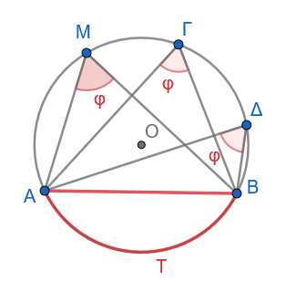{fig-align="center" width="250"}

- **Γεωμετρικός Τόπος:** Ο γεωμετρικός τόπος των σημείων του επιπέδου που βλέπουν ένα γνωστό τμήμα $AB$ υπό ορισμένη γωνία $\phi$ ($0^\circ < \phi < 180^\circ$) αποτελείται από δύο τόξα κύκλων ίσης ακτίνας, συμμετρικά ως προς την ευθεία $AB$ (χωρίς τα άκρα $A, B$).

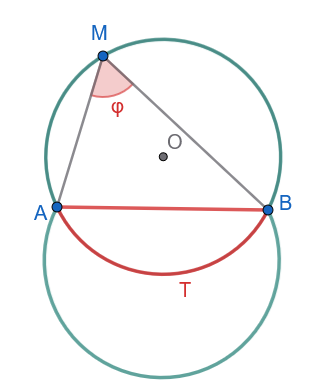{fig-align="center" width="250"}
::::

------------------------------------------------------------------------

#### Κατασκευή Τόξου που Δέχεται Γωνία $\phi$

:::: {.math-box .problem-box}
::: {.math-title .problem-title}
Πρόβλημα
:::

Δίνεται ευθύγραμμο τμήμα $AB$ και γωνία $\varphi$ ($0^\circ < \varphi < 180^\circ$).
Να κατασκευαστεί τόξο κύκλου με χορδή το $AB$, το οποίο να δέχεται γωνία ίση με $\varphi$ (δηλαδή κάθε εγγεγραμμένη γωνία που βαίνει στο τόξο αυτό να ισούται με $\varphi$).
::::

:::: {.math-box .problemsolution-box}
::: {.math-title .problemsolution-title}
**1. Ανάλυση**
:::

Έστω ότι το πρόβλημα έχει λυθεί και το ζητούμενο τόξο είναι το $\overset{\frown}{AB}$ ενός κύκλου $(O, R)$, ώστε για οποιοδήποτε σημείο $M$ του τόξου να ισχύει $\widehat{AMB} = \varphi$.

- Φέρνουμε την εφαπτόμενη $Ax$ του κύκλου στο σημείο $A$ (προς το αντίθετο ημιεπίπεδο από αυτό που βρίσκεται το σημείο $M$ ως προς την ευθεία $AB$).

- Σύμφωνα με το θεώρημα γωνίας χορδής και εφαπτομένης, η γωνία $\widehat{xAB}$ ισούται με την εγγεγραμμένη γωνία $\widehat{AMB}$, δηλαδή: $$\widehat{xAB} = \varphi$$

- Επειδή το $Ax$ είναι εφαπτόμενη του κύκλου στο $A$, η ακτίνα $OA$ είναι κάθετη στην $Ax$, δηλαδή $OA \perp Ax$.

- Επίσης, επειδή το $O$ είναι το κέντρο του κύκλου και $OA = OB = R$, το $O$ ανήκει στη **μεσοκάθετο** $(\mu)$ του τμήματος $AB$.

Συνεπώς, το κέντρο $O$ προσδιορίζεται ως η τομή:

1.  Της καθέτου στην εφαπτόμενη $Ax$ στο σημείο $A$.

2.  Της μεσοκαθέτου $(\mu)$ του τμήματος $AB$.
::::

:::: {.math-box .problemsolution-box}
::: {.math-title .problemsolution-title}
**2. Σύνθεση (Κατασκευή)**
:::

1.  **Γωνία:** Στο άκρο $A$ του τμήματος $AB$ και σε ένα από τα δύο ημιεπίπεδα που ορίζει η ευθεία $AB$, κατασκευάζουμε ημιευθεία $Ax$ τέτοια ώστε $\widehat{xAB} = \varphi$.

2.  **Κάθετος στην εφαπτόμενη:** Στο σημείο $A$ φέρνουμε την ημιευθεία $Ay \perp Ax$ προς το άλλο ημιεπίπεδο (εκεί όπου θα βρίσκεται το τόξο).

3.  **Μεσοκάθετος:** Κατασκευάζουμε τη μεσοκάθετο $(\mu)$ του τμήματος $AB$.

4.  **Κέντρο:** Βρίσκουμε το σημείο τομής $O$ της ευθείας $(\mu)$ και της ημιευθείας $Ay$.

5.  **Τόξο:** Με κέντρο το $O$ και ακτίνα $R = OA$, γράφουμε το τόξο $\overset{\frown}{AB}$ που βρίσκεται στο ημιεπίπεδο της $Ay$.

Το τόξο αυτό είναι το ζητούμενο.
::::

:::: {.math-box .problemsolution-box}
::: {.math-title .problemsolution-title}
**3. Απόδειξη**
:::

- Από την κατασκευή, το σημείο $O$ βρίσκεται στη μεσοκάθετο του $AB$, άρα $OA = OB$.
  Επομένως, ο κύκλος $(O, OA)$ διέρχεται και από το σημείο $B$, άρα το $AB$ είναι χορδή του.

- Η ευθεία $Ax$ είναι κάθετη στην ακτίνα $OA$ στο σημείο $A$, άρα η $Ax$ εφάπτεται του κύκλου στο $A$.

- Επομένως, για οποιοδήποτε σημείο $M$ του κατασκευασμένου τόξου $\overset{\frown}{AB}$, η εγγεγραμμένη γωνία $\widehat{AMB}$ ισούται με τη γωνία χορδής και εφαπτομένης $\widehat{xAB}$: $$\widehat{AMB} = \widehat{xAB} = \varphi$$

Άρα, το κατασκευασμένο τόξο δέχεται γωνία $\varphi$.
::::

:::: {.math-box .problemsolution-box}
::: {.math-title .problemsolution-title}
**4. Διερεύνηση**
:::

- **Ύπαρξη και μοναδικότητα λύσης:**

  Για οποιαδήποτε γωνία $\varphi$ με $0^\circ < \varphi < 180^\circ$:

  - Η ευθεία $Ay$ και η μεσοκάθετος $(\mu)$ δεν είναι ποτέ παράλληλες (αφού η $(\mu) \perp AB$ και η $Ay$ σχηματίζει γωνία $90^\circ - \varphi \neq 90^\circ$ με την $AB$).

  - Συνεπώς, τέμνονται πάντα σε **μοναδικό σημείο** $O$.

  - Σε κάθε ημιεπίπεδο της ευθείας $AB$ υπάρχει **ακριβώς ένα** τέτοιο τόξο.
    Συνολικά στο επίπεδο υπάρχουν **δύο ίσα τόξα**, συμμετρικά ως προς την ευθεία $AB$.

- **Ειδικές περιπτώσεις:**

  1.  Αν $\varphi = 90^\circ$, τότε η $Ax \perp AB$, άρα η $Ay$ ταυτίζεται με την $AB$.
      Το κέντρο $O$ είναι το μέσο του $AB$ και το ζητούμενο τόξο είναι το **ημικύκλιο** με διάμετρο $AB$.

  2.  Αν $\varphi < 90^\circ$ (οξεία), το κέντρο $O$ βρίσκεται στο ίδιο ημιεπίπεδο με το τόξο (το τόξο είναι μεγαλύτερο από ημικύκλιο).

  3.  Αν $\varphi > 90^\circ$ (αμβλεία), το κέντρο $O$ βρίσκεται στο αντίθετο ημιεπίπεδο από το τόξο (το τόξο είναι μικρότερο από ημικύκλιο).
::::

------------------------------------------------------------------------

### Ασκήσεις

1.  Σε κύκλο $(O, R)$ δίνεται τόξο $\overset \frown{AB} = 80^\circ$.
    Να υπολογιστούν η αντίστοιχη επίκεντρη γωνία $\widehat{AOB}$ και η εγγεγραμμένη γωνία $\widehat{A\Gamma B}$ που βαίνει στο ίδιο τόξο.

2.  Σε ημικύκλιο διαμέτρου $AB$ θεωρούμε σημείο $\Gamma$ τέτοιο ώστε το τόξο $\overset \frown{A\Gamma} = 130^\circ$.
    Να υπολογιστούν οι γωνίες του τριγώνου $AB\Gamma$.

3.  Σε κύκλο $(O, R)$, δύο εγγεγραμμένες γωνίες $\widehat{A\Gamma B}$ και $\widehat{A\Delta B}$ βαίνουν στο ίδιο τόξο $AB$.
    Αν $\widehat{A\Gamma B} = 2x + 10^\circ$ και $\widehat{A\Delta B} = x + 35^\circ$, να βρεθεί η τιμή του $x$ και το μέτρο του τόξου $AB$.

4.  Δίνεται κύκλος και χορδή $AB$.
    Η εφαπτομένη στο σημείο $A$ σχηματίζει με τη χορδή $AB$ γωνία $55^\circ$.
    Να υπολογιστούν οι εγγεγραμμένες γωνίες που αντιστοιχούν στα δύο τόξα στα οποία χωρίζει η $AB$ τον κύκλο.

5.  Δύο κύκλοι τέμνονται στα σημεία $A$ και $B$.
    Αν $A\Gamma$ και $A\Delta$ είναι οι διάμετροι από το $A$ στους δύο κύκλους αντίστοιχα, να αποδειχθεί ότι η ευθεία $\Gamma\Delta$ διέρχεται από το $B$.

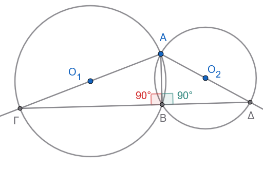{fig-align="center" width="400"}

:::: callout-method
::: {.callout-method .callout-title}
Υπόδειξη
:::

Τα τρίγωνα ΑΓΒ και ΑΔΒ είναι ορθογώνια στο Β
::::

6.  Σε κύκλο $(O, R)$, φέρουμε δύο κάθετες χορδές $AB$ και $\Gamma\Delta$ που τέμνονται στο σημείο $P$. Να αποδειχθεί ότι η διάμεσος $PM$ του τριγώνου $PB\Gamma$ είναι κάθετη στη χορδή $A\Delta$.

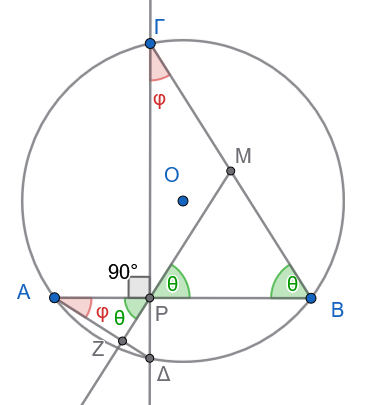{fig-align="center" width="280"}

:::: callout-method
::: {.callout-method .callout-title}
Υπόδειξη
:::

Δείτε ότι $\hatφ+\hatθ=90^o$
::::

7.  Δίνεται ισοσκελές τρίγωνο $AB\Gamma$ ($AB = A\Gamma$) εγγεγραμμένο σε κύκλο. Αν $M$ είναι τυχαίο σημείο του τόξου $B\Gamma$, να αποδειχθεί ότι η $AM$ διχοτομεί τη γωνία $\widehat{B M \Gamma}$.

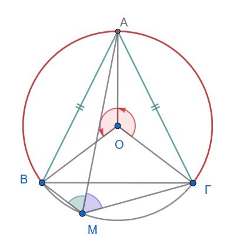{fig-align="center" width="300"}

:::: callout-method
::: {.callout-method .callout-title}
Υπόδειξη
:::

Γιατί οι επίκεντρες γωνίες $\widehat{ΒΟΑ}$ και $\widehat{ΑΟΓ}$ είναι ίσες;

Τότε και τα τόξα ....................
θα είναι ίσα.

Άρα οι γωνίες που βαίνουν σε αυτά τα τόξα ...........................
θα είναι .............

Επομένως η ΑΜ είναι ........................
::::

8.  Από σημείο $P$ εκτός κύκλου φέρουμε τα εφαπτόμενα τμήματα $PA$ και $PB$.

α.
Αν $M$ είναι σημείο του ελάσσονος τόξου $AB$, να αποδειχθεί ότι η γωνία $\widehat{AMB} = 90^\circ + \dfrac{\widehat{P}}{2}$.

β.
Αν Ν είναι ένα σημείο του μείζονος τόξου ΑΒ να υπολογίσετε την γωνία $\widehat{ANΒ}$

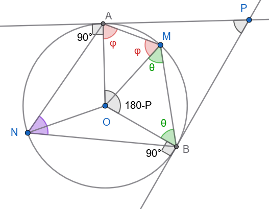{fig-align="center" width="400"}

:::: callout-method
::: {.callout-method .callout-title}
Υπόδειξη
:::

Εξηγείστε γιατί $\widehat{AOB}=180^o-\hat P$

Από τα ισοσκελή τρίγωνα ......................
και το τετράπλευρο ΟΑΜΒ έχουμε:

$180^ο-\hat P +2\hat φ +2\hat θ=360^o \implies 2(\hat φ + \hat θ)=................$

Άρα $\hat φ + \hat θ=\widehat{AMB}= ..............$
::::

9.  Σε κύκλο $(O, R)$ δίνεται χορδή $AB$ και η εφαπτομένη στο $A$. Αν $M$ είναι το μέσο του τόξου $AB$, να αποδειχθεί ότι η διχοτόμος της γωνίας $\widehat{B A x}$ (όπου $Ax$ η εφαπτομένη) διέρχεται από το σημείο $M$.

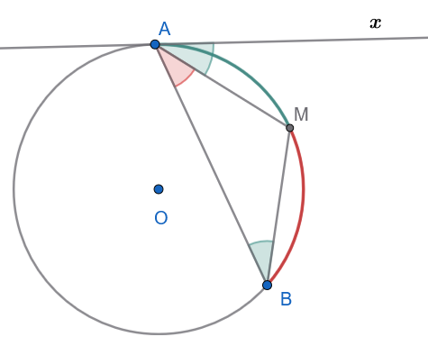{fig-align="center" width="350"}

:::: callout-method
::: {.callout-method .callout-title}
Υπόδειξη
:::

$\widehat{ΒΑΜ}=\widehat{ΜΑχ}$ γιατί .............................................

$\widehat{ΜΑχ}=\widehat{ΑΒΜ}$ γιατί .......................................

Άρα $\widehat{ΒΑΜ}=\widehat{ΜΑΒ}$ και επομένως το Μ είναι μέσον ................................................................
::::

10. Δύο κύκλοι εφάπτονται εξωτερικά στο σημείο $A$. Μία ευθεία διέρχεται από το $A$ και τέμνει τον έναν κύκλο στο $B$ και τον άλλο στο $\Gamma$. Να αποδειχθεί ότι οι εφαπτόμενες στα $B$ και $\Gamma$ είναι παράλληλες.

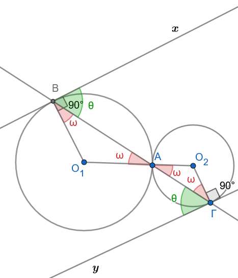{fig-align="center" width="350"}

11. Δίνεται τρίγωνο $AB\Gamma$ εγγεγραμμένο σε κύκλο. Αν οι διχοτόμοι των γωνιών $\widehat{B}$ και $\widehat{\Gamma}$ τέμνονται στο $I$ και τέμνουν τον κύκλο στα σημεία $Δ$ και $E$, να αποδειχθεί ότι το τμήμα $ΔE$ είναι κάθετο στη διχοτόμο της γωνίας $\widehat{A}$.

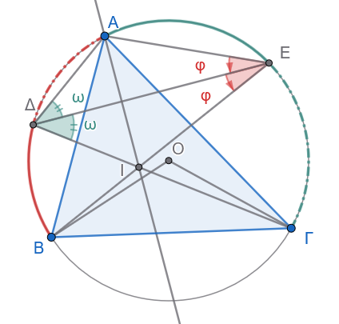{fig-align="center" width="320"}

:::: callout-method
::: {.callout-method .callout-title}
Υπόδειξη
:::

ΒΕ διχοτόμος ===\> Ε μέσο του $\overset \frown{AΓ}$ ====\> ............
......................
...................

Όμοια ΓΔ διχοτόμος =====\> ............................
..........................

Τα τρίγωνα ΑΔΕ =ΔΙΕ **Γ- Π - Γ** και έτσι ΔΑ=ΔΙ και ΑΕ=ΕΙ

Άρα τα Α και Ι ισαπέχουν από τα ,,,,,,,,,,,,,,, που σημαίνει ότι η $ΔΕ \ \  μ \perp ΑΙ$ και επομένως η γωνία ..............
::::

:::: {.math-box .exercise-box}
::: {.math-title .exercise-title}
12. Εκφώνηση
:::

Να κατασκευαστεί τόξο κύκλου που να δέχεται γωνία $60^\circ$ πάνω σε δοσμένο ευθύγραμμο τμήμα $AB = 5\,\text{cm}$.
::::

:::: {.math-box .solution-box}
::: {.math-title .solution-title}
Απάντηση
:::

Σε αυτή την ειδική περίπτωση των $60^ο$ η κατασκευή μπορεί να είναι αυτή που φαίνεται στο παρακάτω σχήμα

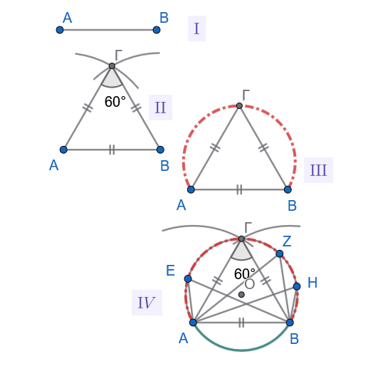{fig-align="center" width="450"}

Γενικότερα όμως

Η κατασκευή βασίζεται στην ιδιότητα της εγγεγραμμένης γωνίας.
Το ζητούμενο τόξο ανήκει σε κύκλο, όπου η γωνία $60^\circ$ είναι εγγεγραμμένη στο τόξο αυτό, δηλαδή η κεντρική γωνία του τόξου θα είναι $120^\circ$.

1.  **Ανάλυση**:

Έστω ότι έχουμε κατασκευάσει το τόξο και ένα σημείο $\Gamma$ πάνω σε αυτό, τέτοιο ώστε $\widehat{A\Gamma B} = 60^\circ$.
Το κέντρο $O$ του κύκλου θα βρίσκεται πάνω στη μεσοκάθετο του $AB$.
Η κεντρική γωνία $\widehat{AOB}$ θα είναι $2 \cdot 60^\circ = 120^\circ$.

Στο ισοσκελές τρίγωνο $OAB$ (με $OA=OB$), οι γωνίες της βάσης είναι $\widehat{OAB} = \widehat{OBA} = (180^\circ - 120^\circ) / 2 = 30^\circ$.

2.  **Σύνθεση**:

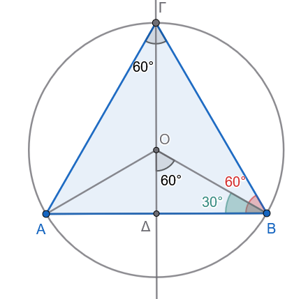{fig-align="center" width="350"}

- Σχεδιάζουμε το ευθύγραμμο τμήμα $AB = 5\,\text{cm}$.

- Στα άκρα $A$ και $B$ του τμήματος, κατασκευάζουμε γωνίες $30^\circ$ προς την ίδια πλευρά του $AB$.
  Οι πλευρές των γωνιών αυτών τέμνονται σε ένα σημείο $O$.

- Με κέντρο το $O$ και ακτίνα $R = OA = OB$, γράφουμε κύκλο.

- Το τόξο του κύκλου που βρίσκεται στο ημιεπίπεδο που ορίζει η $AB$ (και περιέχει το $O$) είναι το ζητούμενο τόξο που δέχεται γωνία $60^\circ$.

3.  **Απόδειξη**:

Εφόσον $\widehat{OAB} = \widehat{OBA} = 30^\circ$, στο τρίγωνο $OAB$ η γωνία $\widehat{AOB} = 120^\circ$.

Η εγγεγραμμένη γωνία $\widehat{A\Gamma B}$ που βαίνει στο ίδιο τόξο είναι το μισό της κεντρικής, άρα $\widehat{A\Gamma B} = 120^\circ / 2 = 60^\circ$.

4.  **Διερεύνηση**:

Η κατασκευή είναι πάντα δυνατή για κάθε τμήμα $AB$ και για κάθε γωνία $\phi$ με $0^\circ < \phi < 180^\circ$.

Στην περίπτωση των $60^\circ$, η κατασκευή είναι μοναδική.
::::

:::: {.math-box .exercise-box}
::: {.math-title .exercise-title}
13. Εκφώνηση
:::

Να βρεθεί ο γεωμετρικός τόπος των κορυφών $A$ των ορθογωνίων τριγώνων $AB\Gamma$ που έχουν σταθερή την υποτείνουσα $B\Gamma = a$.
::::

:::: {.math-box .solution-box}
::: {.math-title .solution-title}
Απάντηση

Σχεδιάστε το σχήμα.
:::

Ο γεωμετρικός τόπος είναι ο κύκλος με διάμετρο το τμήμα $B\Gamma$ (εξαιρουμένων των σημείων $B$ και $\Gamma$).

1.  **Ανάλυση**:

Ένα τρίγωνο $AB\Gamma$ είναι ορθογώνιο στη γωνία $A$ αν και μόνο αν η γωνία $\widehat{A} = 90^\circ$.

Γνωρίζουμε ότι η γωνία που βαίνει σε ημικύκλιο είναι ορθή.
Επομένως, το σημείο $A$ πρέπει να "βλέπει" το τμήμα $B\Gamma$ υπό γωνία $90^\circ$.

2.  **Σύνθεση**:

    - Θεωρούμε το σταθερό τμήμα $B\Gamma$ μήκους $a$.
    - Κατασκευάζουμε το μέσο $M$ του $B\Gamma$.
    - Γράφουμε τον κύκλο με κέντρο $M$ και ακτίνα $R = \dfrac{a}{2}$.
    - Κάθε σημείο $A$ αυτού του κύκλου (πλην των $B$ και $\Gamma$) σχηματίζει με τα $B$ και $\Gamma$ ορθογώνιο τρίγωνο.

3.  **Απόδειξη**:

    - **Ευθύ**: Αν το $A$ ανήκει στον κύκλο διαμέτρου $B\Gamma$, τότε η γωνία $\widehat{A}$ είναι εγγεγραμμένη σε ημικύκλιο, άρα $\widehat{A} = 90^\circ$.

    - **Αντίστροφο**: Αν $\widehat{A} = 90^\circ$, τότε από το θεώρημα της διαμέσου προς την υποτείνουσα σε ορθογώνιο τρίγωνο, το $AM$ είναι ίσο με το μισό της υποτείνουσας, δηλαδή $AM = \dfrac{a}{2}$.
      Συνεπώς, το $A$ ισαπέχει από το κέντρο $M$ κατά $R = \dfrac{a}{2}$, άρα βρίσκεται στον κύκλο.

4.  **Διερεύνηση**: Τα σημεία $B$ και $\Gamma$ εξαιρούνται, διότι αν το $A$ ταυτιζόταν με αυτά, το τρίγωνο θα ήταν εκφυλισμένο.
    Ο τόπος αποτελείται από δύο ημικύκλια που μαζί με τα $B, \Gamma$ σχηματίζουν τον κύκλο διαμέτρου $B\Gamma$.
::::

14. Δίνεται σταθερό ευθύγραμμο τμήμα $B\Gamma$. Να βρεθεί ο γεωμετρικός τόπος των σημείων $M$ του επιπέδου για τα οποία ισχύει $B\widehat{M}\Gamma = 120^\circ$.

> > > Δείτε την άσκηση 12

:::: {.math-box .exercise-box}
::: {.math-title .exercise-title}
15. Εκφώνηση
:::

Σε κύκλο $(O, R)$ θεωρούμε σταθερή χορδή $AB$.
Αν $M$ είναι μεταβλητό σημείο του μείζονος τόξου $AB$ και $I$ είναι το έγκεντρο του τριγώνου $MAB$, να αποδειχθεί ότι το σημείο $I$ διαγράφει τόξο κύκλου που δέχεται γωνία $90^\circ + \dfrac{\widehat{M}}{2}$.
::::

:::: {.math-box .solution-box}
::: {.math-title .solution-title}
Απάντηση

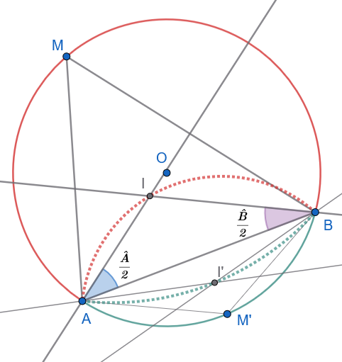{fig-align="center" width="350"}
:::

Το σημείο $I$ κινείται πάνω σε ένα σταθερό κυκλικό τόξο με χορδή $AB$.
Η γωνία υπό την οποία "βλέπει" το τμήμα $AB$ είναι σταθερή και ίση με $90^\circ + \dfrac{\widehat{AMB}}{2}$.

Συγκεκριμένα, η γωνία $\widehat{AIB} = 90^\circ + \dfrac{\widehat{AMB}}{2}$.

1.  **Ανάλυση**:

Σε κάθε τρίγωνο $MAB$, η γωνία στο έγκεντρο $I$ δίνεται από τον τύπο $\widehat{AIB} = 180^\circ - \dfrac{\widehat{MAB} + \widehat{MBA}}{2}$.
Επειδή στο τρίγωνο $MAB$ ισχύει $\widehat{MAB} + \widehat{MBA} = 180^\circ - \widehat{M}$, έχουμε: $$\widehat{AIB} = 180^\circ - \frac{180^\circ - \widehat{M}}{2} = 180^\circ - 90^\circ + \frac{\widehat{M}}{2} = 90^\circ + \frac{\widehat{M}}{2}$$

2.  **Σταθερότητα της γωνίας**:

Επειδή το σημείο $M$ κινείται στο μείζον τόξο $AB$, η γωνία $\widehat{M}$ είναι σταθερή (από το θεώρημα εγγεγραμμένων γωνιών, όλες οι γωνίες που βαίνουν στο ίδιο τόξο είναι ίσες).
Άρα, η γωνία $\widehat{AIB}$ είναι σταθερή.

3.  **Γεωμετρικός Τόπος**:

    - Εφόσον το τμήμα $AB$ είναι σταθερό και η γωνία $\widehat{AIB}$ είναι σταθερή, το σημείο $I$ κινείται πάνω σε ένα τόξο κύκλου που διέρχεται από τα σημεία $A$ και $B$.

    - Το κέντρο αυτού του κύκλου βρίσκεται στη μεσοκάθετο του $AB$.

4.  **Απόδειξη**:

    - Η σχέση $\widehat{AIB} = 90^\circ + \dfrac{\widehat{M}}{2}$ αποδείχθηκε από τις ιδιότητες των γωνιών του τριγώνου.

    - Εφόσον $\widehat{M}$ είναι σταθερή (καθώς το $M$ κινείται στο ίδιο τόξο), η γωνία $\widehat{AIB}$ είναι σταθερή, πράγμα που ικανοποιεί τον ορισμό του γεωμετρικού τόπου των σημείων που βλέπουν ένα τμήμα υπό σταθερή γωνία.

5.  Λύστε αντίστοιχα το πρόβλημα αν ένα σημείο Μ' κινείται στο ελάσσονα τόξο ΑΒ.
::::

:::: {.math-box .exercise-box}
::: {.math-title .exercise-title}
16. Εκφώνηση
:::

Να κατασκευαστεί το τρίγωνο $AB\Gamma$ όταν δίνονται η πλευρά $B\Gamma = α$, η γωνία της κορυφής $\widehat{A} = \phi$ και το αντίστοιχο ύψος $υ_a$.
::::

:::::: {.math-box .solution-box}
::: {.math-title .solution-title}
Απάντηση
:::

<iframe src="https://www.geogebra.org/calculator/rr8qphcn?embed" width="730" height="600" allowfullscreen style="border: 1px solid #e4e4e4;border-radius: 4px;" frameborder="0">

</iframe>

:::: {.math-box .odigia-box}
::: {.math-title .odigia-title}
Οδηγία
:::

Στη γενική περίπτωση οι λύσεις είναι τα δύο τρίγωνα , το σιέλ και το πορτοκαλί.

Αλλάξτε το μέγεθος της γωνίας φ.
Πότε έχουμε δύο λύσεις, πότε 1 και πότε καμία;

Αλλάξτε το μέγεθος του ύψους.
Πότε έχουμε δύο λύσεις, πότε 1 και πότε καμία;

Αλλάξτε το μέγεθος της βάσης ΒΓ.
Πότε έχουμε δύο λύσεις, πότε 1 και πότε καμία;
::::

Η κατασκευή βασίζεται στον γεωμετρικό τόπο των σημείων από τα οποία ένα ευθύγραμμο τμήμα φαίνεται υπό γνωστή γωνία (Δείτε και την άσκηση 12 και την ενότητα 1.5) και στην ιδιότητα της παράλληλης ευθείας.

1.  **Σχεδίαση της πλευράς** $B\Gamma$:

Σχεδιάζουμε το ευθύγραμμο τμήμα $B\Gamma = \alpha$.

2.  **Σχεδίαση της παράλληλης ευθείας**:

Σχεδιάζουμε μια ευθεία $(\epsilon)$ παράλληλη προς την $B\Gamma$ σε απόσταση ίση με το δοθέν ύψος $v_{\alpha}$.

3.  **Κατασκευή του τόξου χωρητικότητας**:

    - Σχεδιάζουμε τον γεωμετρικό τόπο των σημείων $P$ τέτοιων ώστε $\widehat{BP\Gamma} = \phi$.
    - Για να το κάνουμε αυτό:
      - Σχεδιάζουμε τη μεσοκάθετο του $B\Gamma$.
      - Σχεδιάζουμε μια ευθεία που σχηματίζει γωνία $90^\circ - \phi$ με την $B\Gamma$ στο σημείο $B$. Η τομή της με τη μεσοκάθετο είναι το κέντρο $O$ του κύκλου που περιέχει το τόξο.
    - Σχεδιάζουμε το τόξο που βλέπει το $B\Gamma$ υπό γωνία $\phi$. (Αν $\phi > 90^\circ$, το τόξο είναι στο κάτω μέρος, αν $\phi < 90^\circ$ στο πάνω).

4.  **Εντοπισμός της κορυφής** $A$: Το σημείο $A$ είναι το σημείο τομής του τόξου με την παράλληλη ευθεία $(\epsilon)$.

    - Αν το τόξο τέμνει την ευθεία σε δύο σημεία Ν και Ξ, υπάρχουν δύο συμμετρικά τρίγωνα.
    - Αν το τόξο εφάπτεται της ευθείας, υπάρχει ένα τρίγωνο.
    - Αν δεν υπάρχουν κοινά σημεία, το τρίγωνο δεν κατασκευάζεται.

5.  **Ολοκλήρωση**: Ενώνουμε το σημείο τομής της παραλλήλου με το τόξο ($A\equiv N \equiv Ξ$ με τα $B$ και $\Gamma$ για να σχηματίσουμε το τρίγωνο $AB\Gamma$.
::::::

:::: {.math-box .exercise-box}
::: {.math-title .exercise-title}
17. Εκφώνηση
:::

Θεωρούμε δύο κύκλους $(O_1)$ και $(O_2)$ που τέμνονται στα σημεία $A$ και $B$.
Μια τυχαία ευθεία $(\epsilon)$ τέμνει τον πρώτο κύκλο στα σημεία $A_1, B_1$ και τον δεύτερο κύκλο στα σημεία $A_2, B_2$ αντίστοιχα.
Να αποδειχθεί ότι $\widehat{A_1AA_2} = \widehat{B_1BB_2}$.
::::

:::: {.math-box .solution-box}
::: {.math-title .solution-title}
Απάντηση

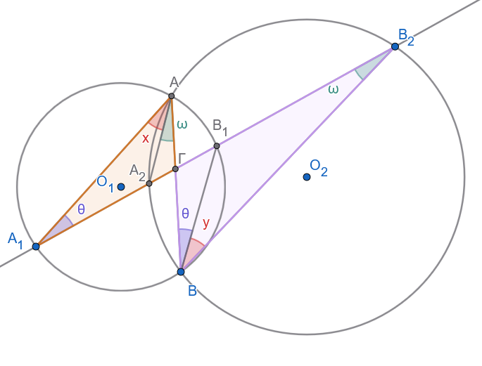{fig-align="center" width="500"}
:::

Η ισότητα των γωνιών προκύπτει από τις ιδιότητες των εγγεγραμμένων γωνιών που βαίνουν στο ίδιο τόξο.

1.  **Ανάλυση των γωνιών** $x$ και $y$:

Στο σχήμα, η γωνία $x$ είναι η $\widehat{A_1AA_2}$ και η γωνία $y$ είναι η $\widehat{B_1BB_2}$.

2.  **Χρήση εγγεγραμμένων γωνιών στους κύκλους** $(O_1)$ και $(Ο_2)$:

    - Η γωνίες $\widehat{ΑA_1Β_1}=\widehat{ABB_1}=\hatθ$ γιατί βαίνουν στο ίδιο τόξο $\overset\frown{ΑΒ_1}$ του κύκλου $(Ο_1)$ .
    - Οι γωνίες $\widehat{A_2AB}= \widehat{A_2B_2B}=\hat ω$ βαίνουν στο ίδιο τόξο $\overset \frown{A_2B}$ του κύκλου $(O_2)$.

3.  **Χρήση της ισότητας εξωτερικών γωνιών στα τρίγωνα** $\overset\triangle {A_1AΓ}$ και $\overset\triangle {ΓΒΒ_2}$:

    - Έστω Γ το σημείο τομής των ΑΒ και $Α_1Β_2$.
    - Στα τρίγωνα $\overset\triangle {A_1AΓ}$ και $\overset\triangle {ΓΒΒ_2}$, οι εξωτερικές γωνίες $\widehat{Α_1ΓΒ}=\widehat{ΑΓΒ_2}$ ως κατακορυφήν (ή έχουν κοινή εξωτερική γωνία την $\widehat{Α_1ΓΒ}$).
    - Άρα

$$
\begin{align}
\widehat{Α_1ΓΒ} = \hat x+\hat θ+\hat ω &= \hat y+\hat θ+\hat ω \implies \\ \hat x+\cancel{\hat θ}+\cancel{\hat ω} &= \hat y+\cancel{\hat θ}+\cancel{\hat ω} \implies \\ \hat x &= \hat y
\end{align}
$$
::::

:::: {.math-box .exercise-box}
::: {.math-title .exercise-title}
18. Εκφώνηση
:::

Θεωρούμε δύο κύκλους $(O_1)$ και $(O_2)$ που εφάπτονται εσωτερικά στο σημείο $A$.
Μια ευθεία $(\epsilon)$ τέμνει τον κύκλο $(O_1)$ στα σημεία $A_1, B_1$ και τον κύκλο $(O_2)$ στα σημεία $A_2, B_2$ αντίστοιχα.
Να αποδειχθεί ότι $\widehat{A_1AA_2} = \widehat{B_1BB_2}$.
::::

:::: {.math-box .solution-box}
::: {.math-title .solution-title}
Απάντηση

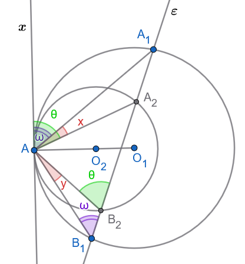{fig-align="center" width="350"}
:::

Η ισότητα των γωνιών $\widehat{A_1AA_2} = \widehat{B_1BB_2}$ αποδεικνύεται χρησιμοποιώντας την ιδιότητα της γωνίας χορδής και εφαπτομένης.

1.  **Θεώρηση εφαπτομένης**:

Έστω $(x)$ η κοινή εφαπτομένη των δύο κύκλων στο σημείο $A$.

2.  **Χρήση ιδιότητας γωνίας χορδής-εφαπτομένης στον κύκλο** $(O_2)$:

    Η γωνία $\hatθ=\widehat{xAA_2}$ σχηματίζεται από την εφαπτομένη $Ax$ και τη χορδή $AA_2$.
    Σύμφωνα με το θεώρημα γωνίας χορδής-εφαπτομένης, αυτή η γωνία είναι ίση με την εγγεγραμμένη γωνία που βαίνει στο ίδιο τόξο, δηλαδή $\hatθ=\widehat{xAA_2} = \widehat{AB_2A_2}$.

3.  **Χρήση ιδιότητας γωνίας χορδής-εφαπτομένης στον κύκλο** $(O_1)$:

    Ομοίως, η γωνία $\hat ω=\widehat{xAA_1}$ είναι ίση με την εγγεγραμμένη γωνία που βαίνει στο ίδιο τόξο, δηλαδή $\hat ω=\widehat{xAA_1} = \widehat{AB_1A_1}$.

4.  **Υπολογισμός**:

    Από σχήμα βλέπουμε ότι $\hatθ=\widehat{xAA_2}=\hat x +\hat ω$

    Από το τρίγωνο $ΑΒ_1Β_2$ έχουμε επίσης $\hatθ=\widehat{AΒ_2A_1}=\hat y +\hat ω$ ως εξωτερική γωνία.

    Άρα $\hat θ=\hat x +\hat ω=\hat y+\hat ω \implies \hat x+\cancel {\hat ω}=\hat y+\cancel {\hat ω} \implies \hat x=\hat y$
::::

:::: {.math-box .exercise-box}
::: {.math-title .exercise-title}
19. Εκφώνηση
:::

Θεωρούμε δύο κύκλους $(O_1)$ και $(O_2)$, οι οποίοι εφάπτονται εσωτερικά στο σημείο $A$.
Αν η χορδή $ΒΓ$ του μεγαλύτερου κύκλου εφάπτεται στον μικρότερο κύκλο στο σημείο $M$, να αποδειχθεί ότι η $AM$ διχοτομεί τη γωνία $\widehat{BA\Gamma}$.
::::

:::: {.math-box .solution-box}
::: {.math-title .solution-title}
Απάντηση $1^{ος}$ τρόπος

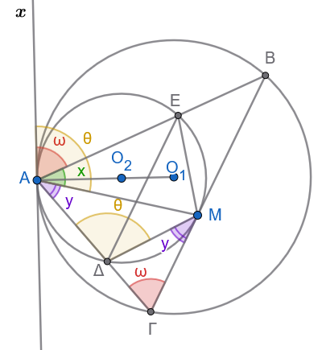{fig-align="center" width="320"}
:::

Η $AM$ διχοτομεί τη γωνία $\widehat{BA\Gamma}$, δηλαδή ισχύει $\widehat{BAM} = \widehat{\Gamma AM}$.

1.  **Κοινή εφαπτομένη**:

Θεωρούμε την κοινή εφαπτομένη $(x)$ των δύο κύκλων στο σημείο $A$.

2.  **Θεώρημα χορδής-εφαπτομένης στον μικρό κύκλο**:

Η γωνία που σχηματίζει η εφαπτομένη $Ax$ με τη χορδή $AM$ είναι ίση με την εγγεγραμμένη γωνία που βαίνει στο ίδιο τόξο, δηλαδή $\hat θ=\widehat{xAM} = \widehat{A\Delta M}$ (όπου $\Delta$ σημείο του μικρού κύκλου).

3.  **Θεώρημα χορδής-εφαπτομένης στον μεγάλο κύκλο**:

Αντίστοιχα, για τον μεγάλο κύκλο, η γωνία $\widehat{zAB}$ είναι ίση με την εγγεγραμμένη γωνία που βαίνει στο τόξο $AB$, δηλαδή $\hat ω=\widehat{xAB} = \widehat{A\Gamma B}$.

4.  **Σύγκριση γωνιών**:

    - Στο σημείο $Α$ έχουμε $\hat θ=\hat ω+\hat y \ \ \ (1)$

    - Στο τρίγωνο $ΔΓΜ$ η $\hat θ \overset{\text{είναι εξωτερική γωνία και άρα}}{=} \hat ω+\hat y \ \ \ (2)$

    - Η γωνία $\hat y=\widehat{ΔΜΓ} \overset{\text{υπο χορδής και εφαπτομένης}}{=} \widehat{ΔΑΜ} \ \ \ (3)$ που βαίνει στην ίδια χορδή.

    - Από τις (1), (2) και (3) έχουμε:

    $\hat θ=\hat ω+\hat x = \hat ω+\hat y \implies \cancel{\hat ω}+\hat x = \cancel{\hat ω}+\hat y \implies \hat x = \hat y$

    - Αρα ΑΜ διχοτόμος της γωνίας $\widehat{ΒΑΓ}$
::::

:::: {.math-box .solution-box}
::: {.math-title .solution-title}
Απάντηση $2^{ος}$ τρόπος

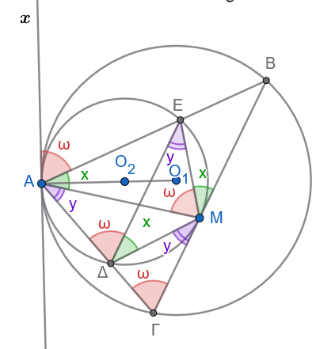{fig-align="center" width="300"}
:::

Η γωνία $\hat ω$ υπό χορδής και εφαπτομένης είναι ίση με την εγγεγραμμένη γωνία $\widehat{ΑΔΕ}$ του μικρού κύκλου που βλέπει την ίδια χορδή και με την γωνία $\widehat{ΑΓΒ}$ του μεγάλου κύκλου που επίσης βλέπει την ίδια χορδή.

Όμως οι γωνίες $\widehat{ΑΓΒ}$ και $\widehat{ΑΔΕ}$ είναι εντός εκτός και επί τα αυτά γωνίες ίσες, άρα οι ΔΕ και ΒΓ είναι παράλληλες.

Τότε οι γωνίες $\hat x$ και $\hat y$ είναι ίσες ως εντός εναλλάξ.
::::

:::: {.math-box .exercise-box}
::: {.math-title .exercise-title}
20. Εκφώνηση
:::

Θεωρούμε δύο κύκλους $(O_1)$ και $(O_2)$ που εφάπτονται εξωτερικά στο σημείο $A$.
Με διάμετρο το τμήμα $O_1O_2$ γράφουμε κύκλο $(O_3)$.
Αν $M$ είναι ένα τυχαίο σημείο του κύκλου $(O_3)$ και $B, \Gamma$ είναι τα σημεία τομής των $MO_1$ και $MO_2$ με τους κύκλους $(O_1)$ και $(O_2)$ αντίστοιχα, να αποδειχθεί ότι η γωνία $\widehat{BA\Gamma}$ είναι σταθερή (ct).
::::

:::: {.math-box .solution-box}
::: {.math-title .solution-title}
Απάντηση

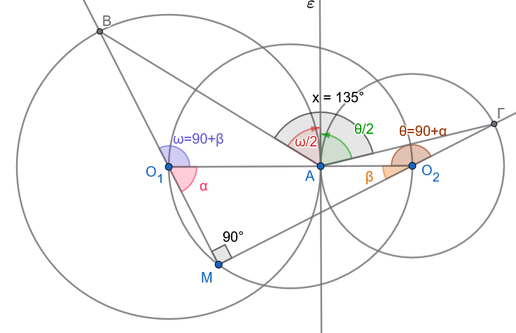{fig-align="center" width="500"}
:::

Η γωνία $\widehat{BΜΓ} = 90^\circ$ διότι βαίνει σε ημικύκλιο .

**Ιδιότητες των τριγώνων**: Τα τρίγωνα $O_1AB$ και $O_2A\Gamma$ είναι ισοσκελή, αφού $O_1A = O_1B$ και $O_2A = O_2\Gamma$ (ακτίνες των αντίστοιχων κύκλων).

Η γωνία $\hat ω=\widehat{ΒΟ_1Α}$ είναι εξωτερική γωνία στο ορθογώνιο τρίγωνο $ΜΟ_1Ο_2$, άρα $\hat ω=90^o+\hat β   \ \ \ (1)$

Όμοια η γωνία $\hat θ=\widehat{ΓΟ_2Α}$ είναι εξωτερική γωνία στο ορθογώνιο τρίγωνο $ΜΟ_1Ο_2$, άρα $\hat θ=90^o+\hat α \ \ \ (2)$

Η γωνία $\widehat{εΑΒ}$ υπό χορδής και εφαπτομένης είναι ίση με το μισό της αντίστοιχης επίκεντρης που βλέπει την ίδια χορδή ΑΒ , άρα $\widehat{εΒΑ}=\dfrac{\hat ω}{2} \ \ \ (3)$.

Όμοια η γωνία $\widehat{εΑΓ}=\dfrac{\hat θ}{2} \ \ \ (4)$.

Συνδυάζοντας τις (1), (2), (3) και (4) θα έχουμε:

Η γωνία

$$
\begin{align}
\hat x &=\widehat{BAε}+\widehat{εΑΓ} = \\ \dfrac{\hat ω}{2}+\dfrac{\hatθ}{2} &=\dfrac{90^o+\hat β}{2} + \dfrac{90^ο+\hat α}{2} = \\ 90^o+\dfrac{\hat α +\hat β}{2} &= 90^o+\dfrac{90^o}{2}= \\ 90^o+45^o &= 135^o \text{  Σταθερό} 
\end{align}
$$
::::

:::: {.math-box .exercise-box}
::: {.math-title .exercise-title}
21. Εκφώνηση
:::

Θεωρούμε ένα εγγεγραμμένο τετράπλευρο $AB\Gamma\Delta$ σε κύκλο $(O, R)$, τα μέσα $K, \Lambda, M, N$ των τόξων $\widehat{AB}, \widehat{B\Gamma}, \widehat{\Gamma\Delta}, \widehat{\Delta A}$ αντίστοιχα, και τα έγκεντρα $I_\alpha, I_\beta, I_\gamma, I_\delta$ των τριγώνων $B\Gamma\Delta, A\Gamma\Delta, AB\Delta$ και $AB\Gamma$ αντίστοιχα.
Να αποδειχθεί ότι:

i)  $KM \perp \Lambda N$

ii) Το τρίγωνο $M\Delta I_\beta$ είναι ισοσκελές.

iii) Το τετράπλευρο $I_\alpha I_\beta I_\gamma I_\delta$ είναι παραλληλόγραμμο (μάλιστα ορθογώνιο).
::::

:::: {.math-box .solution-box}
::: {.math-title .solution-title}
Απάντηση
:::

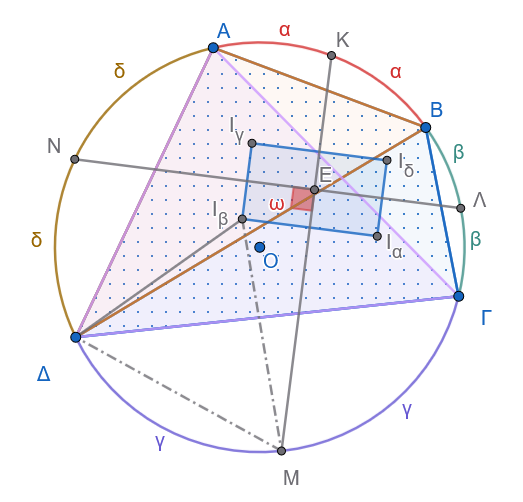{fig-align="center" width="400"}

**i. Απόδειξη ότι** $KM \perp \Lambda N$

1.  Το άθροισμα όλων των τόξων του κύκλου είναι $360^\circ$: $$\overset{\frown}{AB} + \overset{\frown}{B\Gamma} + \overset{\frown}{\Gamma\Delta} + \overset{\frown}{\Delta A} = 360^\circ$$

2.  Τα σημεία $K, \Lambda, M, N$ είναι τα μέσα των τόξων $\overset{\frown}{AB}, \overset{\frown}{B\Gamma}, \overset{\frown}{\Gamma\Delta}, \overset{\frown}{\Delta A}$ αντίστοιχα.

Επομένως: $$\overset{\frown}{K\Lambda} = \overset{\frown}{KB} + \overset{\frown}{B\Lambda} = \frac{\overset{\frown}{AB}}{2} + \frac{\overset{\frown}{B\Gamma}}{2}$$ $$\overset{\frown}{MN} = \overset{\frown}{M\Delta} + \overset{\frown}{\Delta N} = \frac{\overset{\frown}{\Gamma\Delta}}{2} + \frac{\overset{\frown}{\Delta A}}{2}$$

3.  Προσθέτοντας τα απέναντι τόξα $\overset{\frown}{K\Lambda}$ και $\overset{\frown}{MN}$, έχουμε: $$\overset{\frown}{K\Lambda} + \overset{\frown}{MN} = \frac{\overset{\frown}{AB} + \overset{\frown}{B\Gamma} + \overset{\frown}{\Gamma\Delta} + \overset{\frown}{\Delta A}}{2} = \frac{360^\circ}{2} = 180^\circ$$

4.  Έστω $Ε$ το σημείο τομής των χορδών $KM$ και $\Lambda N$.
    Η γωνία $\widehat{KΕ\Lambda}$ των δύο τεμνουσών χορδών στο εσωτερικό του κύκλου ισούται με το ημιάθροισμα των τόξων που αυτές ορίζουν: $$\widehat{KP\Lambda} = \frac{\overset{\frown}{K\Lambda} + \overset{\frown}{MN}}{2} = \frac{180^\circ}{2} = 90^\circ$$

Άρα, οι χορδές είναι κάθετες: $$KM \perp \Lambda N$$

------------------------------------------------------------------------

**ii. Απόδειξη ότι το τρίγωνο** $M\Delta I_\beta$ είναι ισοσκελές

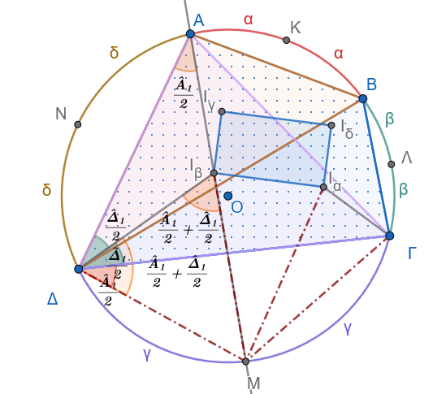{fig-align="center" width="400"}

1.  Στο τρίγωνο $A\Gamma\Delta$, το $I_\beta$ είναι το **έγκεντρο** (το σημείο τομής των διχοτόμων των γωνιών του).

2.  Η διχοτόμος της γωνίας $\widehat{\Gamma A\Delta}$ διέρχεται από το μέσο του απέναντι τόξου $\overset{\frown}{\Gamma\Delta}$, το οποίο είναι το σημείο $M$.
    Επομένως, τα σημεία $A, I_\beta, M$ βρίσκονται στην ίδια ευθεία.

3.  Υπολογίζουμε τις γωνίες του τριγώνου $M\Delta I_\beta$:

    - **Γωνία** $\widehat{M\Delta I_\beta}$: $$\widehat{M\Delta I_\beta} = \widehat{M\Delta\Gamma} + \widehat{\Gamma\Delta I_\beta}$$

      - Η $\widehat{M\Delta\Gamma}$ είναι εγγεγραμμένη που βαίνει στο τόξο $\overset{\frown}{M\Gamma}$, άρα: $$\widehat{M\Delta\Gamma} = \widehat{MA\Gamma} = \frac{\widehat{A}_1}{2} \quad (\mu\iota\sigma\text{ό της γωνίας } \widehat{\Gamma A\Delta})$$

      - Το $\Delta I_\beta$ είναι διχοτόμος της γωνίας $\widehat{A\Delta\Gamma}$, άρα: $$\widehat{\Gamma\Delta I_\beta} = \frac{\widehat{\Delta}_1}{2} \quad (\mu\iota\sigma\text{ό της γωνίας } \widehat{A\Delta\Gamma})$$

      - Συνεπώς: $$\widehat{M\Delta I_\beta} = \frac{\widehat{A}_1}{2} + \frac{\widehat{\Delta}_1}{2}$$

    - **Γωνία** $\widehat{MI_\beta\Delta}$:

      Στο τρίγωνο $A\Delta I_\beta$, η γωνία $\widehat{MI_\beta\Delta}$ είναι εξωτερική στην κορυφή $I_\beta$, οπότε ισούται με το άθροισμα των δύο απέναντι εσωτερικών γωνιών: $$\widehat{MI_\beta\Delta} = \widehat{I_\beta A\Delta} + \widehat{I_\beta\Delta A} = \frac{\widehat{A}_1}{2} + \frac{\widehat{\Delta}_1}{2}$$

4.  Επειδή $\widehat{M\Delta I_\beta} = \widehat{MI_\beta\Delta}$, το τρίγωνο $M\Delta I_\beta$ είναι **ισοσκελές** με: $$M\Delta = MI_\beta$$

------------------------------------------------------------------------

**iii. Απόδειξη ότι το τετράπλευρο** $I_\alpha I_\beta I_\gamma I_\delta$ είναι παραλληλόγραμμο (και μάλιστα ορθογώνιο)

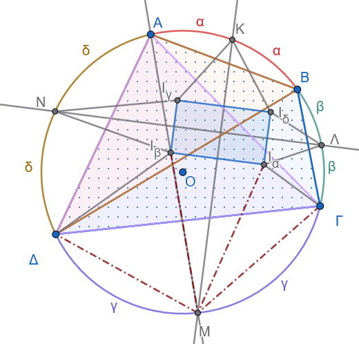{fig-align="center" width="400"}

1.  **Ισότητες αποστάσεων από τα μέσα των τόξων:**

    - Εφαρμόζοντας το ίδιο θεώρημα στο τρίγωνο $B\Gamma\Delta$ με έγκεντρο το $I_\alpha$, προκύπτει ότι: $$MI_\alpha = M\Delta = M\Gamma$$

    - Από το (ii) έχουμε $MI_\beta = M\Delta$.
      Επομένως: $$MI_\alpha = MI_\beta$$

      Αυτό σημαίνει ότι το σημείο $M$ ισαπέχει από τα $I_\alpha$ και $I_\beta$, άρα το $M$ ανήκει στη **μεσοκάθετο του τμήματος** $I_\alpha I_\beta$.

2.  **Παραλληλία και Καθετότητα των πλευρών:**

    - Επειδή το $M$ είναι το μέσο του τόξου $\overset{\frown}{\Gamma\Delta}$ και το $K$ είναι το μέσο του τόξου $\overset{\frown}{AB}$, η ευθεία $KM$ αποτελεί άξονα συμμετρίας ως προς τη διάταξη των εγκέντρων, οπότε η ευθεία $KM$ είναι η μεσοκάθετος του τμήματος $I_\alpha I_\beta$, δηλαδή: $$I_\alpha I_\beta \perp KM$$

    - Με ακριβώς τον ίδιο τρόπο, για το απέναντι τμήμα $I_\gamma I_\delta$ προκύπτει: $$I_\gamma I_\delta \perp KM$$

    - Επομένως: $$I_\alpha I_\beta \parallel I_\gamma I_\delta$$

    - Ομοίως, εξετάζοντας τα μέσα $N$ και $\Lambda$, η ευθεία $\Lambda N$ είναι η μεσοκάθετος των τμημάτων $I_\beta I_\gamma$ και $I_\alpha I_\delta$, άρα: $$I_\beta I_\gamma \perp \Lambda N \quad \text{και} \quad I_\alpha I_\delta \perp \Lambda N \implies I_\beta I_\gamma \parallel I_\alpha I_\delta$$

3.  **Συμπέρασμα:**

    - Το τετράπλευρο $I_\alpha I_\beta I_\gamma I_\delta$ έχει τις απέναντι πλευρές του παράλληλες, άρα είναι **παραλληλόγραμμο**.

    - Επιπλέον, επειδή $KM \perp \Lambda N$ (από το ερώτημα i), οι πλευρές του είναι κάθετες μεταξύ τους: $$I_\alpha I_\beta \perp I_\beta I_\gamma$$

    - Ένα παραλληλόγραμμο με μία (άρα και όλες) ορθή γωνία είναι **ορθογώνιο**.

Επομένως, το $I_\alpha I_\beta I_\gamma I_\delta$ είναι **ορθογώνιο**.
::::

:::: {.math-box .exercise-box}
::: {.math-title .exercise-title}
22. Εκφώνηση
:::

Θεωρούμε τους ορθογώνιους κύκλους $(O_1)$ και $(O_2)$ που τέμνονται στα σημεία $A$ και $B$, και τη διάμετρο $MN$ του κύκλου $(O_1)$ που τέμνει τον κύκλο $(O_2)$ στα σημεία $\Gamma$ και $\Delta$.
Αν οι ευθείες $A\Gamma$ και $A\Delta$ τέμνουν τον κύκλο $(O_1)$ στα σημεία $M_1$ και $N_1$ αντίστοιχα, να αποδειχθεί ότι: $$M_1 N_1 \perp MN$$
::::

:::: {.math-box .solution-box}
::: {.math-title .solution-title}
Απάντηση

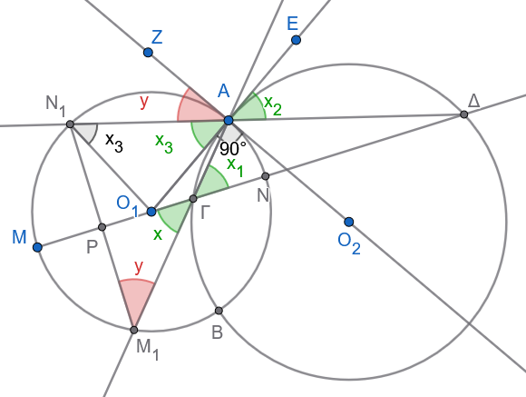{fig-align="center" width="450"}
:::

Έστω $P$ το σημείο τομής των ευθειών $MN$ και $M_1 N_1$.

Για να δείξουμε ότι $M_1 N_1 \perp MN$, στο τρίγωνο $PΓ Μ_1$ αρκεί να αποδείξουμε ότι: $$\widehat{x} + \widehat{y} = 90^\circ$$ *(όπου* $\widehat{x} = \widehat{P Γ Μ_1}$ και $\widehat{y} = \widehat{PΜ_1Γ}$).

1.  **Ιδιότητα ορθογώνιων κύκλων:**

    Επειδή οι κύκλοι $(O_1)$ και $(O_2)$ είναι ορθογώνιοι, η ακτίνα $O_1 A$ του πρώτου κύκλου εφάπτεται στον δεύτερο κύκλο $(O_2)$ στο σημείο $A$.

2.  **Ισότητα γωνιών:**

    - Στον κύκλο $(O_2)$, η γωνία $\widehat{x}_1 = \widehat{ΑΓΔ}$ είναι εγγεγραμμένη γωνία και βλέπει την χορδή ΑΔ , οπότε ισούται με την αντίστοιχη υπό χορδής και εφαπτομένης γωνία: $$\widehat{x}_1 = \widehat{ΔΑΕ} = \widehat{x}_2$$

    - Στο ισοσκελές τρίγωνο $O_1 A N_1$ (αφού $O_1 A = O_1 N_1 = R_1$), οι γωνίες της βάσης είναι ίσες: $$\widehat{x}_3 = \widehat{O_1 A N_1}$$

    - Όμως η γωνία $x_2$ είναι ίση με την $x_3$ ως κατακορυφήν, και άρα από τις παραπάνω σχέσεις προκύπτει ότι: $$\widehat{x} \overset{\text{ως κατακορυφήν}}{=} \widehat{x}_1 \overset{\text{εγγεγραμμένη - υπό χορδής και εφαπτομένης}}{=} \widehat{x}_2 \overset{\text{ως κατακορυφήν}}{=} \widehat{x}_3$$

3.  **Συμπληρωματικές γωνίες:**

    Η γωνία $\widehat{ΖΑΝ_1}$ υπό χορδής και εφαπτομένης είναι ίση με την αντίστοιχη εγγεγραμμένη που βλέπει την ίδια χορδή δηλαδή την $\hat y$

    Επειδή οι κύκλοι είναι ορθογώνιοι ($\widehat{ZAO_1}=90^o$) εχουμε: $$\widehat{x_3}+\hat y = 90^\circ  \implies \widehat{x} + \widehat{y} = 90^\circ$$

Επομένως, στο σημείο $P$ σχηματίζεται ορθή γωνία, δηλαδή: $$M_1 N_1 \perp MN$$
::::

------------------------------------------------------------------------

:::: {.math-box .exercise-box}
::: {.math-title .exercise-title}
23. Εκφώνηση
:::

Θεωρούμε τους κύκλους $(O_1)$ και $(O_2)$ που τέμνονται στα σημεία $A$ και $B$, την κοινή εξωτερική τους εφαπτομένη $\Gamma\Delta$ και τον περιγεγραμμένο κύκλο $(O_3)$ του τριγώνου $A\Gamma\Delta$, ο οποίος τέμνει την ευθεία $AB$ στο σημείο $E$.\
Να αποδειχθεί ότι το τετράπλευρο $E\Gamma B\Delta$ είναι παραλληλόγραμμο.
::::

:::: {.math-box .solution-box}
::: {.math-title .solution-title}
Απάντηση

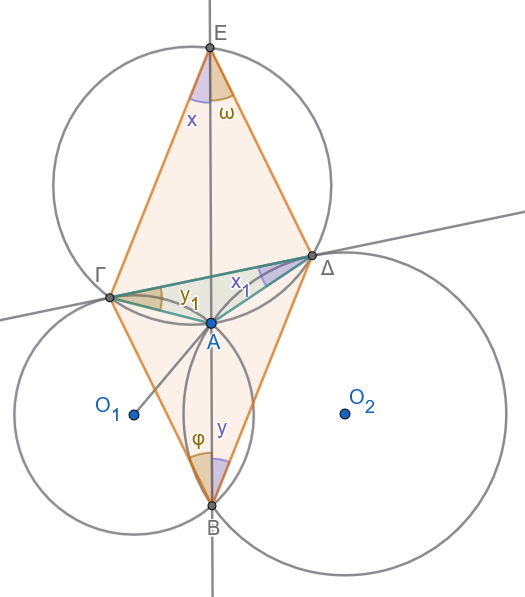{fig-align="center" width="400"}
:::

Για να αποδείξουμε ότι το $E\Gamma B\Delta$ είναι παραλληλόγραμμο, αρκεί να δείξουμε ότι οι απέναντι πλευρές του είναι παράλληλες:

1.  $\Gamma E \parallel B\Delta$

2.  $\Delta E \parallel B\Gamma$

------------------------------------------------------------------------

**Απόδειξη ότι** $\Gamma E \parallel B\Delta$

- Στον περιγεγραμμένο κύκλο $(O_3)$, οι εγγεγραμμένες γωνίες $\widehat{x} = \widehat{\Gamma EA}$ και $\widehat{x}_1 = \widehat{\Gamma\Delta A}$ βαίνουν στο ίδιο τόξο $\overset{\frown}{A\Gamma}$, άρα είναι ίσες: $$\widehat{x} = \widehat{x}_1$$

- Στον κύκλο $(O_2)$, η ευθεία $\Gamma\Delta$ εφάπτεται στο σημείο $\Delta$, άρα η γωνία χορδής και εφαπτομένης $\widehat{x}_1 = \widehat{\Gamma\Delta A}$ ισούται με την αντίστοιχη εγγεγραμμένη γωνία $\widehat{y} = \widehat{\Delta B A}$: $$\widehat{x}_1 = \widehat{y}$$

- Επομένως: $$\widehat{x} = \widehat{y}$$

- Οι γωνίες $\widehat{x}$ και $\widehat{y}$ είναι **εντός εναλλάξ** για τις ευθείες $\Gamma E$ και $B\Delta$ που τέμνονται από την ευθεία $EB$, άρα: $$\Gamma E \parallel B\Delta \quad (1)$$

------------------------------------------------------------------------

**Απόδειξη ότι** $\Delta E \parallel B\Gamma$

- Στον περιγεγραμμένο κύκλο $(O_3)$, οι εγγεγραμμένες γωνίες $\widehat{\omega} = \widehat{\Delta EA}$ και $\widehat{y}_1 = \widehat{\Delta\Gamma A}$ βαίνουν στο ίδιο τόξο $\overset{\frown}{A\Delta}$, άρα: $$\widehat{\omega} = \widehat{y}_1$$

- Στον κύκλο $(O_1)$, η ευθεία $\Gamma\Delta$ εφάπτεται στο σημείο $\Gamma$, άρα η γωνία χορδής και εφαπτομένης $\widehat{y}_1 = \widehat{\Delta\Gamma A}$ ισούται με την εγγεγραμμένη γωνία $\widehat{\varphi} = \widehat{\Gamma B A}$: $$\widehat{y}_1 = \widehat{\varphi}$$

- Επομένως: $$\widehat{\omega} = \widehat{\varphi}$$

- Οι γωνίες $\widehat{\omega}$ και $\widehat{\varphi}$ είναι **εντός εναλλάξ** για τις ευθείες $\Delta E$ και $B\Gamma$ που τέμνονται από την ευθεία $EB$, άρα: $$\Delta E \parallel B\Gamma \quad (2)$$

------------------------------------------------------------------------

**Συμπέρασμα:**

Από τις σχέσεις $(1)$ και $(2)$, το τετράπλευρο $E\Gamma B\Delta$ έχει τις απέναντι πλευρές του παράλληλες, επομένως είναι **παραλληλόγραμμο**.
::::

:::: {.math-box .exercise-box}
::: {.math-title .exercise-title}
24. Εκφώνηση
:::

Θεωρούμε δύο κύκλους $(O)$ και $(O')$, τα σημεία τομής $A, B$ και $A', B'$ της διακέντρου $OO'$ με τους κύκλους $(O)$ και $(O')$ αντίστοιχα, καθώς και την κοινή εξωτερική τους εφαπτομένη $\Gamma\Gamma'$.\
Έστω $P$ το σημείο τομής των χορδών $A\Gamma$ και $B'\Gamma'$, και $\Sigma$ το σημείο τομής των χορδών $B\Gamma$ και $A'\Gamma'$.\
Να αποδειχθεί ότι:

1.  Το τετράπλευρο $\Gamma P \Gamma'\Sigma$ είναι **ορθογώνιο**.

2.  Η ευθεία $P\Sigma$ είναι **κάθετη στη διάκεντρο** $OO'$.
::::

:::: {.math-box .solution-box}
::: {.math-title .solution-title}
Απάντηση

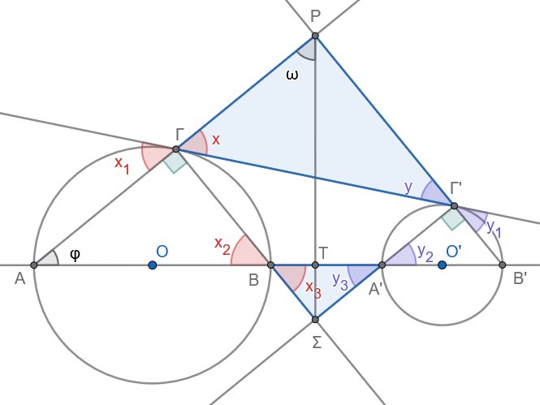{fig-align="center" width="500"}
:::

**1. Απόδειξη ότι το τετράπλευρο** $\Gamma P \Gamma'\Sigma$ είναι ορθογώνιο

1.  **Ορθές γωνίες στις κορυφές** $\Gamma$ και $\Gamma'$:

    - Τα τμήματα $AB$ και $A'B'$ είναι διάμετροι των κύκλων $(O)$ και $(O')$.

    - Η εγγεγραμμένη γωνία $\widehat{A\Gamma B}$ βαίνει σε ημικύκλιο, άρα: $$\widehat{P\Gamma\Sigma} = \widehat{A\Gamma B} = 90^\circ$$

    - Ομοίως, η εγγεγραμμένη γωνία $\widehat{A'\Gamma'B'}$ βαίνει σε ημικύκλιο, άρα: $$\widehat{P\Gamma'\Sigma} = \widehat{A'\Gamma'B'} = 90^\circ$$

------------------------------------------------------------------------

2.  **Ισότητες γωνιών:**

    - **Για τον κύκλο** $(O)$:

      Η γωνία $\widehat{x}_1$ (χορδής $A\Gamma$ και εφαπτομένης $\Gamma\Gamma'$) ισούται με την εγγεγραμμένη γωνία $\widehat{x}_2 = \widehat{AB\Gamma}$.

      Επίσης, η γωνία $\widehat{x}$ είναι κατακορυφήν της $\widehat{x}_1$ ($\widehat{x} = \widehat{x}_1$) και η $\widehat{x}_3$ είναι κατακορυφήν της $\widehat{x}_2$ ($\widehat{x}_3 = \widehat{x}_2$).

      Επομένως: $$\widehat{x} = \widehat{x}_1 = \widehat{x}_2 = \widehat{x}_3$$

    - **Για τον κύκλο** $(O')$:

      Με τον ίδιο τρόπο προκύπτει: $$\widehat{y} = \widehat{y}_1 = \widehat{y}_2 = \widehat{y}_3$$

------------------------------------------------------------------------

3.  **Ισότητα των απέναντι γωνιών** $\widehat{P}$ και $\widehat{\Sigma}$:

    - Από το τρίγωνο $P\Gamma\Gamma'$ έχουμε: $$\widehat{P} = 180^\circ - (\widehat{x} + \widehat{y})$$

    - Από το τρίγωνο $\Sigma BA'$ έχουμε: $$\widehat{\Sigma} = 180^\circ - (\widehat{x}_3 + \widehat{y}_3) = 180^\circ - (\widehat{x} + \widehat{y})$$

    - Άρα: $$\widehat{P} = \widehat{\Sigma}$$

4.  **Συμπέρασμα για το ορθογώνιο:**

    Στο τετράπλευρο $\Gamma P \Gamma'\Sigma$, το άθροισμα των γωνιών είναι $360^\circ$: $$\widehat{\Gamma} + \widehat{\Gamma'} + \widehat{P} + \widehat{\Sigma} = 360^\circ \implies 90^\circ + 90^\circ + \widehat{P} + \widehat{\Sigma} = 360^\circ \implies \widehat{P} + \widehat{\Sigma} = 180^\circ$$ Επειδή $\widehat{P} = \widehat{\Sigma}$, έχουμε: $$\widehat{P} = \widehat{\Sigma} = 90^\circ$$

    Επομένως, το τετράπλευρο $\Gamma P \Gamma'\Sigma$ έχει όλες τις γωνίες του ορθές ($90^\circ$), άρα είναι **ορθογώνιο**.

------------------------------------------------------------------------

**2. Απόδειξη ότι** $P\Sigma \perp OO'$

1.  Έστω $T$ το σημείο τομής της $P\Sigma$ με τη διάκεντρο $OO'$.
    Στο τρίγωνο $PAT$, για να δείξουμε ότι $\widehat{PTA} = 90^\circ$ (δηλαδή $P\Sigma \perp OO'$), αρκεί να αποδείξουμε ότι οι οξείες γωνίες είναι συμπληρωματικές: $$\widehat{\omega} + \widehat{\varphi} = 90^\circ$$

2.  Επειδή το $\Gamma P \Gamma'\Sigma$ είναι ορθογώνιο, οι διαγώνιοί του είναι ίσες και διχοτομούνται, οπότε: $$\widehat{\omega} = \widehat{x} = \widehat{x}_2$$

3.  Στο ορθογώνιο τρίγωνο $A\Gamma B$ (ορθή στη γωνία $\widehat{\Gamma}$), οι οξείες γωνίες είναι συμπληρωματικές: $$\widehat{\varphi} + \widehat{x}_2 = 90^\circ$$

4.  Αντικαθιστώντας $\widehat{x}_2 = \widehat{\omega}$, έχουμε άμεσα: $$\widehat{\omega} + \widehat{\varphi} = 90^\circ$$

Επομένως: $$P\Sigma \perp OO'$$
::::

:::: {.math-box .exercise-box}
::: {.math-title .exercise-title}
25. Εκφώνηση
:::

Πάνω σε μια ευθεία $(\varepsilon)$ παίρνουμε τέσσερα διαδοχικά σημεία $A, B, \Gamma, \Delta$.
Κατασκευάζουμε τους κύκλους με διαμέτρους $AB$ και $\Gamma\Delta$ αντίστοιχα, και φέρνουμε την κοινή εξωτερική τους εφαπτομένη $EZ$ (όπου $E$ και $Z$ είναι τα σημεία επαφής).\
Να αποδείξετε ότι:

**α)** $AE \parallel \Gamma Z$

**β)** $BE \parallel \Delta Z$
::::

:::: {.math-box .solution-box}
::: {.math-title .solution-title}
Απάντηση

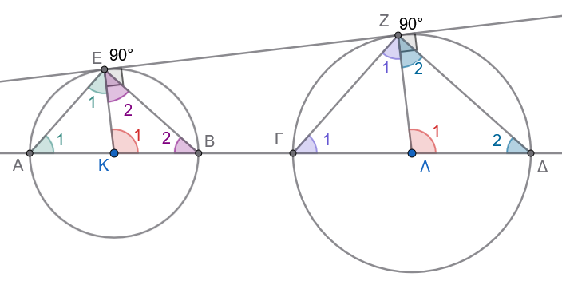{fig-align="center" width="500"}
:::

**α) Απόδειξη ότι** $AE \parallel \Gamma Z$

1.  **Παραλληλία ακτίνων:**

    Ονομάζουμε $K$ και $\Lambda$ τα κέντρα των δύο κύκλων (μέσα των $AB$ και $\Gamma\Delta$ αντίστοιχα) και φέρνουμε τις ακτίνες $KE$ και $\Lambda Z$ στα σημεία επαφής.

    Επειδή η $EZ$ είναι εφαπτόμενη, οι ακτίνες είναι κάθετες σε αυτήν: $$KE \perp EZ \quad \text{και} \quad \Lambda Z \perp EZ$$

    Άρα οι ακτίνες είναι μεταξύ τους παράλληλες: $$KE \parallel \Lambda Z$$

2.  **Ισότητα επίκεντρων γωνιών:**

    Οι ευθείες $KE$ και $\Lambda Z$ τέμνονται από την ευθεία της διακέντρου $A\Delta$, οπότε οι **εντός, εκτός και επί τα αυτά μέρη** γωνίες είναι ίσες: $$\widehat{K}_1 = \widehat{\Lambda}_1 \quad (\delta\eta\lambda\alpha\delta\text{ή } \widehat{EKB} = \widehat{Z\Lambda\Delta})$$

3.  **Ισοσκελή τρίγωνα:**

    - Στο τρίγωνο $KAE$, έχουμε $KA = KE = R_1$ (ακτίνες του πρώτου κύκλου), άρα το τρίγωνο είναι ισοσκελές και $\widehat{A}_1 = \widehat{E}_1$.

      Η γωνία $\widehat{K}_1$ είναι εξωτερική γωνία του τριγώνου $KAE$, οπότε: $$\widehat{K}_1 = \widehat{A}_1 + \widehat{E}_1 = 2\widehat{A}_1 \implies \widehat{A}_1 = \frac{\widehat{K}_1}{2} \quad (1)$$

    - Στο τρίγωνο $\Lambda\Gamma Z$, έχουμε $\Lambda\Gamma = \Lambda Z = R_2$ (ακτίνες του δεύτερου κύκλου), άρα το τρίγωνο είναι ισοσκελές και $\widehat{\Gamma}_1 = \widehat{Z}_1$.

      Η γωνία $\widehat{\Lambda}_1$ είναι εξωτερική γωνία του τριγώνου $\Lambda\Gamma Z$, οπότε: $$\widehat{\Lambda}_1 = \widehat{\Gamma}_1 + \widehat{Z}_1 = 2\widehat{\Gamma}_1 \implies \widehat{\Gamma}_1 = \frac{\widehat{\Lambda}_1}{2} \quad (2)$$

4.  **Συμπέρασμα παραλληλίας:**

    Επειδή $\widehat{K}_1 = \widehat{\Lambda}_1$, από τις σχέσεις $(1)$ και $(2)$ προκύπτει ότι: $$\widehat{A}_1 = \widehat{\Gamma}_1$$

    Οι γωνίες $\widehat{A}_1$ και $\widehat{\Gamma}_1$ είναι **εντός, εκτός και επί τα αυτά μέρη** των ευθειών $AE$ και $\Gamma Z$ που τέμνονται από την ευθεία $A\Delta$.

    Επειδή είναι ίσες, οι ευθείες είναι παράλληλες: $$AE \parallel \Gamma Z$$

------------------------------------------------------------------------

**β) Απόδειξη ότι** $BE \parallel \Delta Z$

- Στο τρίγωνο $KEΒ$, έχουμε $KΒ = KE = R_1$ (ακτίνες του πρώτου κύκλου), άρα το τρίγωνο είναι ισοσκελές και $\widehat{Β}_2 = \widehat{E}_2$.

  και για τις γωνίες του τριγώνου $KEΒ$ ισχύει: $$\widehat{K}_1+\widehat{E}_2 + \widehat{B}_2 =180^o \implies 2\widehat{B}_2=180^o-\widehat{K}_1 \implies\widehat{B}_2=90^o- \frac{\widehat{K}_1}{2} \quad (1)$$

  - Στο τρίγωνο $\Lambda Δ Z$, έχουμε $\Lambda Δ = \Lambda Z = R_2$ (ακτίνες του δεύτερου κύκλου), άρα το τρίγωνο είναι ισοσκελές και $\widehat{Δ}_2 = \widehat{Z}_2$.

    και για τις γωνίες του τριγώνου $ΛΖΔ$ ισχύει: $$\widehat{Λ}_1+\widehat{Ζ}_2 + \widehat{Δ}_2 =180^o \implies 2\widehat{Δ}_2=180^o-\widehat{Λ}_1 \implies=\widehat{Δ}_2=90^o- \frac{\widehat{Λ}_1}{2} \quad (2)$$

4.  **Συμπέρασμα παραλληλίας:**

    Επειδή $\widehat{K}_1 = \widehat{\Lambda}_1$, από τις σχέσεις $(1)$ και $(2)$ προκύπτει ότι: $$\widehat{Β}_2 = \widehat{Δ}_2$$

    Οι γωνίες $\widehat{Β}_2$ και $\widehat{Δ}_2$ είναι **εκτός, εντός και επί τα αυτά μέρη** των ευθειών $ΖΔ$ και $ΕΒ$ που τέμνονται από την ευθεία $A\Delta$.

    Επειδή είναι ίσες, οι ευθείες είναι παράλληλες: $$ΖΔ \parallel ΕΒ$$
::::

------------------------------------------------------------------------

::: {.callout-important title="ΣΑΣ ΕΥΧΟΜΑΙ"}
ΚΑΛΗ ΜΕΛΕΤΗ !!!
:::
