```{=html}
<!-- Φόρτωση βιβλιοθήκης GeoGebra -->
<script src="https://www.geogebra.org/apps/deployggb.js"></script>

<!-- Συνάρτηση δημιουργίας applets -->
<script>
function createGeoGebra(containerId, materialId, width = 700, height = 500) {
  var params = {
    "id": "ggb-" + containerId,
    "material_id": materialId,
    "width": width,
    "height": height,
    "showToolBar": true,
    "showMenuBar": false,
    "showAlgebraInput": true
  };
  
  var applet = new GGBApplet(params, '5.2');
  applet.inject(containerId);
}
</script>
```

## Εγγεγραμμένα και εγγράψιμα τετράπλευρα

### Το Εγγεγραμμένο Τετράπλευρο

#### Ορισμός

:::: {.math-box .definition-box}
::: {.math-title .definition-title}
Εγγεγραμμένο σε κύκλο

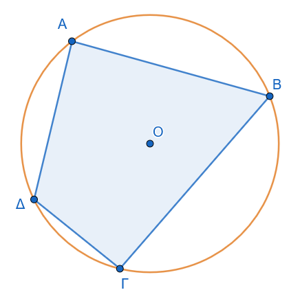{fig-align="center" width="300"}
:::

**Εγγεγραμμένο σε κύκλο** λέγεται το τετράπλευρο του οποίου όλες οι κορυφές είναι σημεία του κύκλου αυτού.
Ο κύκλος αυτός ονομάζεται **περιγεγραμμένος κύκλος** του τετραπλεύρου.
::::

------------------------------------------------------------------------

#### Θεωρήματα

:::: {.math-box .theorem-box}
::: {.math-title .theorem-title}
Θεώρημα 1
:::

**Οι απέναντι γωνίες κάθε εγγεγραμμένου τετραπλεύρου είναι παραπληρωματικές.** $$\widehat{A} + \widehat{\Gamma} = 180^\circ \quad \text{και} \quad \widehat{B} + \widehat{\Delta} = 180^\circ \quad$$
::::

:::: {.math-box .apodeixi-box}
::: {.math-title .apodeixi-title}
**Απόδειξη:**

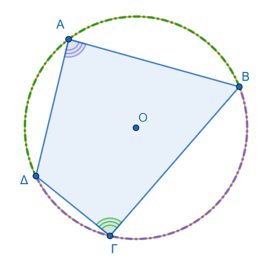{fig-align="center" width="350"}
:::

Θεωρούμε το τετράπλευρο $ΑΒΓΔ$ εγγεγραμμένο σε κύκλο $(Ο, R)$.
Θα αποδείξουμε ότι: $$\hat{A} + \hat{\Gamma} = 180^\circ \quad \text{και} \quad \hat{B} + \hat{\Delta} = 180^\circ$$

1.  **Γωνία** $\hat{A}$ (δηλαδή $\widehat{ΔΑΒ}$): Είναι εγγεγραμμένη γωνία που βαίνει στο τόξο $\overset{\frown}{ΒΓΔ}$.
    Επομένως, το μέτρο της ισούται με το μισό του μέτρου του τόξου: $$\hat{A} = \frac{1}{2} \cdot \overset{\frown}{ΒΓΔ}$$

2.  **Γωνία** $\hat{\Gamma}$ (δηλαδή $\widehat{ΒΓΔ}$): Είναι εγγεγραμμένη γωνία που βαίνει στο τόξο $\overset{\frown}{ΔΑΒ}$.
    Επομένως: $$\hat{\Gamma} = \frac{1}{2} \cdot \overset{\frown}{ΔΑΒ}$$

3.  **Άθροισμα των απέναντι γωνιών:** Προσθέτουμε τις δύο σχέσεις κατά μέλη: $$\hat{A} + \hat{\Gamma} = \frac{1}{2} \cdot \overset{\frown}{ΒΓΔ} + \frac{1}{2} \cdot \overset{\frown}{ΔΑΒ} = \frac{1}{2} \left( \overset{\frown}{ΒΓΔ} + \overset{\frown}{ΔΑΒ} \right)$$

    Επειδή τα τόξα $\overset{\frown}{ΒΓΔ}$ και $\overset{\frown}{ΔΑΒ}$ σχηματίζουν ολόκληρο τον κύκλο, το άθροισμά τους είναι $360^\circ$: $$\hat{A} + \hat{\Gamma} = \frac{1}{2} \cdot 360^\circ = 180^\circ$$

Με τον ίδιο ακριβώς τρόπο αποδεικνύεται ότι και $\hat{B} + \hat{\Delta} = 180^\circ$.
::::

------------------------------------------------------------------------

:::: {.math-box .theorem-box}
::: {.math-title .theorem-title}
Θεώρημα 2
:::

**Κάθε πλευρά ενός εγγεγραμμένου τετραπλεύρου φαίνεται από τις απέναντι κορυφές υπό ίσες γωνίες.**
::::

:::: {.math-box .apodeixi-box}
::: {.math-title .apodeixi-title}
**Απόδειξη:**

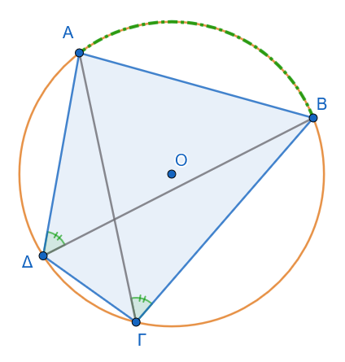{fig-align="center" width="350"}
:::

Φέρνουμε τις διαγώνιες $ΑΓ$ και $ΒΔ$ του τετραπλεύρου.

1.  **Για την πλευρά** $ΑΒ$:

    - Η γωνία $\widehat{ΑΓΒ}$ έχει κορυφή στο σημείο $\Gamma$ του κύκλου και βαίνει στο τόξο $\overset{\frown}{ΑΒ}$.

    - Η γωνία $\widehat{ΑΔΒ}$ έχει κορυφή στο σημείο $\Delta$ του κύκλου και βαίνει επίσης στο τόξο $\overset{\frown}{ΑΒ}$.

2.  **Σύγκριση των γωνιών:**

    Επειδή δύο εγγεγραμμένες γωνίες του ίδιου κύκλου που βαίνουν στο ίδιο τόξο είναι ίσες μεταξύ τους, έχουμε: $$\widehat{ΑΓΒ} = \widehat{ΑΔΒ} = \frac{1}{2} \cdot \overset{\frown}{ΑΒ}$$

Με τον ίδιο τρόπο, για κάθε άλλη πλευρά του τετραπλεύρου:

- Για την πλευρά $ΒΓ$: $\widehat{ΒΑΓ} = \widehat{ΒΔΓ}$ (βαίνουν στο τόξο $\overset{\frown}{ΒΓ}$)

- Για την πλευρά $\Gamma\Delta$: $\widehat{\Gamma Α\Delta} = \widehat{\Gamma Β\Delta}$ (βαίνουν στο τόξο $\overset{\frown}{\Gamma\Delta}$)

- Για την πλευρά $\Delta Α$: $\widehat{\Delta ΒΑ} = \widehat{\Delta \Gamma Α}$ (βαίνουν στο τόξο $\overset{\frown}{\Delta Α}$)
::::

------------------------------------------------------------------------

#### Πόρισμα

:::: {.math-box .corollary-box}
::: {.math-title .corollary-title}
Πόρισμα
:::

**Κάθε εξωτερική γωνία ενός εγγεγραμμένου τετραπλεύρου ισούται με την απέναντι εσωτερική γωνία του.**
::::

:::: {.math-box .corollaryproof-box}
::: {.math-title .corollaryproof-title}
**Απόδειξη:**

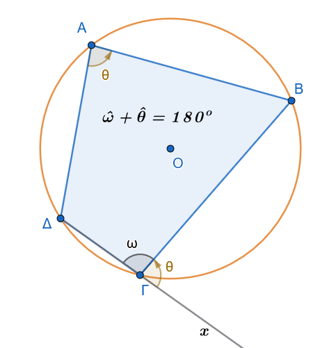{fig-align="center" width="350"}
:::

Έστω εγγεγραμμένο τετράπλευρο $AB\Gamma\Delta$ και $x\widehat{\Gamma}B$ η εξωτερική γωνία της κορυφής $\Gamma$.

1.  Οι γωνίες $x\widehat{\Gamma}B$ και $\widehat{A\Gamma B}$ είναι εφεξής και παραπληρωματικές, συνεπώς: $$x\widehat{\Gamma}B + \widehat{A\Gamma B} = 180^\circ \quad$$

2.  Από το θεώρημα των εγγεγραμμένων τετραπλεύρων, οι απέναντι γωνίες $\widehat{A}$ και $\widehat{A\Gamma B}$ είναι επίσης παραπληρωματικές: $$\widehat{A} + \widehat{A\Gamma B} = 180^\circ \quad$$

3.  Από τις δύο παραπάνω εξισώσεις προκύπτει άμεσα ότι: $$x\widehat{\Gamma}B = \widehat{A} \quad$$
::::

------------------------------------------------------------------------

#### Εφαρμογές

:::: {.math-box .example-box}
::: {.math-title .example-title}
**Εφαρμογή 1η:**
:::

Κάθε ισοσκελές τραπέζιο είναι εγγράψιμο σε κύκλο.
::::

:::: {.math-box .examplesolution-box}
::: {.math-title .examplesolution-title}
Απόδειξη

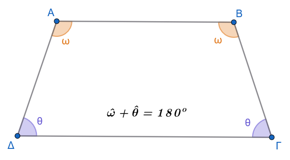{fig-align="center" width="420"}
:::

Έστω ισοσκελές τραπέζιο $AB\Gamma\Delta$ ($AB \parallel \Gamma\Delta$ και $A\Delta = B\Gamma$).

Γνωρίζουμε ότι οι προσκείμενες σε κάθε βάση γωνίες είναι ίσες ($\widehat{A} = \widehat{B}$ και $\widehat{\Gamma} = \widehat{\Delta}$).

Επειδή $AB \parallel \Gamma\Delta$, οι γωνίες $\widehat{A}$ και $\widehat{\Delta}$ είναι εντός και επί τα αυτά μέρη, άρα παραπληρωματικές ($\widehat{A} + \widehat{\Delta} = 180^\circ$).

Αντικαθιστώντας όπου $\widehat{\Delta} = \widehat{\Gamma}$, λαμβάνουμε $\widehat{A} + \widehat{\Gamma} = 180^\circ$.
Εφόσον οι απέναντι γωνίες του τραπεζίου είναι παραπληρωματικές, το τραπέζιο είναι εγγράψιμο σε κύκλο.
::::

:::: {.math-box .example-box}
::: {.math-title .example-title}
**Εφαρμογή 2η:**
:::

Κάθε παραλληλόγραμμο εγγεγραμμένο σε κύκλο είναι ορθογώνιο.
::::

:::: {.math-box .examplesolution-box}
::: {.math-title .examplesolution-title}
Απόδειξη

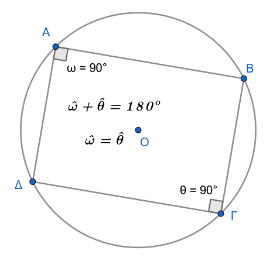{fig-align="center" width="350"}
:::

Έστω παραλληλόγραμμο $AB\Gamma\Delta$ εγγεγραμμένο σε κύκλο.

Από τις ιδιότητες των παραλληλογράμμων, οι απέναντι γωνίες είναι ίσες ($\widehat{A} = \widehat{\Gamma}$).

Από την ιδιότητα του εγγεγραμμένου τετραπλεύρου, οι απέναντι γωνίες είναι παραπληρωματικές ($\widehat{A} + \widehat{\Gamma} = 180^\circ$).

Συνεπώς: $$\widehat{A} + \widehat{A} = 180^\circ \Rightarrow 2\widehat{A} = 180^\circ \Rightarrow \widehat{A} = 90^\circ \quad$$

Εφόσον το παραλληλόγραμμο έχει μία γωνία ορθή, όλες οι γωνίες του είναι ορθές, άρα είναι ορθογώνιο.
::::

------------------------------------------------------------------------

### Το Εγγράψιμο Τετράπλευρο

#### Ορισμός

:::: {.math-box .definition-box}
::: {.math-title .definition-title}
Εγγράψιμο Τετράπλευρο
:::

**Εγγράψιμο** ονομάζεται το τετράπλευρο όταν μπορεί να γραφεί κύκλος που να διέρχεται και από τις τέσσερις κορυφές του.
::::

------------------------------------------------------------------------

#### Θεώρημα

:::: {.math-box .theorem-box}
::: {.math-title .theorem-title}
Θεώρημα (Κριτήρια Εγγραψιμότητας)
:::

**Ένα τετράπλευρο** $AB\Gamma\Delta$ είναι εγγράψιμο σε κύκλο αν και μόνο αν ισχύει μία από τις ακόλουθες ικανές και αναγκαίες συνθήκες:

1.  **Δύο απέναντι γωνίες του είναι παραπληρωματικές** ($\widehat{A} + \widehat{\Gamma} = 180^\circ$).
2.  **Μία πλευρά του φαίνεται από τις απέναντι κορυφές υπό ίσες γωνίες** ($\widehat{\Delta A\Gamma} = \widehat{\Delta B\Gamma}$).
3.  **Μία εξωτερική του γωνία ισούται με την απέναντι εσωτερική γωνία του.**
::::

:::: {.math-box .apodeixi-box}
::: {.math-title .apodeixi-title}
**Αποδείξεις:**
:::

1.  **Απόδειξη Κριτηρίου 1 (Απέναντι γωνίες παραπληρωματικές):**

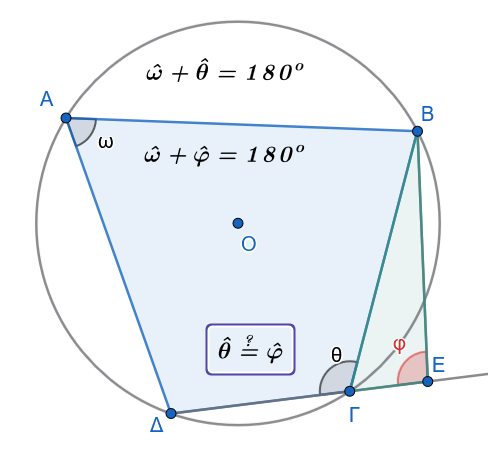{fig-align="center" width="350"}

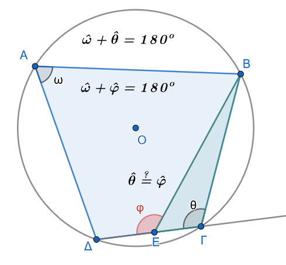{fig-align="center" width="350"}

Έστω τετράπλευρο $AB\Gamma\Delta$ με $\widehat{A} + \widehat{\Gamma} = 180^\circ$.
Γράφουμε τον κύκλο που διέρχεται από τις τρεις μη συνευθειακές κορυφές $A, B, \Delta$.
Αν η κορυφή $\Gamma$ δεν ανήκει σε αυτόν τον κύκλο, τότε η ευθεία $Δ\Gamma$ τέμνει τον κύκλο σε ένα σημείο $E \neq \Gamma$.

Το τετράπλευρο $ABE\Delta$ είναι εγγεγραμμένο, οπότε οι απέναντι γωνίες του είναι παραπληρωματικές: $\widehat{A} + \widehat{E} = 180^\circ$.

Συγκρίνοντας με την υπόθεση $\widehat{A} + \widehat{\Gamma} = 180^\circ$, προκύπτει ότι $\widehat{E} = \widehat{\Gamma}$.

Αυτό όμως σημαίνει ότι στο τρίγωνο $\Gamma EΒ$, η εξωτερική γωνία $\widehat{θ}$ ισούται με την απέναντι εσωτερική $\widehat{φ}$, αν το Ε βρίσκεται έξω από το τετράπλευρο ΑΒΓΔ ή η εξωτερική $\widehat{φ}$ θα ισούται με την απέναντι εσωτερική $\widehat{θ}$ αν το Ε βρίσκεται ανάμεσα στα Δ και Γ, πράγμα άτοπο.

Συνεπώς, η κορυφή $\Gamma$ ανήκει υποχρεωτικά στον κύκλο.

2.  **Απόδειξη Κριτηρίου 2 (Πλευρά φαίνεται υπό ίσες γωνίες):**

$1^{ος}$ τρόπος

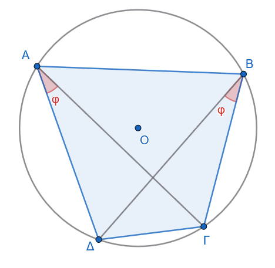{fig-align="center" width="350"}

Έστω τετράπλευρο $AB\Gamma\Delta$ τέτοιο ώστε $\widehat{\Delta A\Gamma} = \widehat{\Delta B\Gamma} = \phi$.

Τα σημεία $A$ και $B$ ανήκουν στον γεωμετρικό τόπο των σημείων από τα οποία το ευθύγραμμο τμήμα $\Gamma\Delta$ φαίνεται υπό γωνία $\phi$.

Ο γεωμετρικός αυτός τόπος αποτελείται από δύο ίσα τόξα κύκλων συμμετρικά ως προς τη $\Gamma\Delta$.

Επειδή τα σημεία $A$ και $B$ βρίσκονται στο ίδιο ημιεπίπεδο ως προς την ευθεία $\Gamma\Delta$, ανήκουν στο ίδιο τόξο κύκλου.

Επομένως, τα σημεία $A, B, \Gamma, \Delta$ είναι ομοκυκλικά, δηλαδή το τετράπλευρο είναι εγγράψιμο.

$2^{ος}$ τρόπος

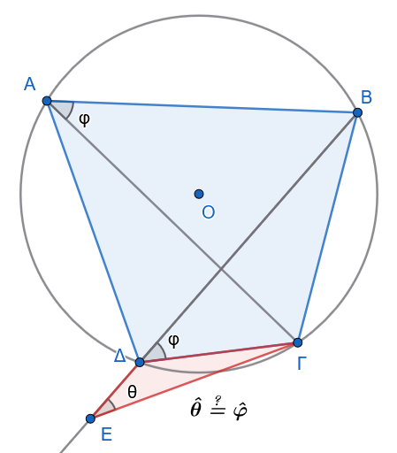{fig-align="center" width="350"}

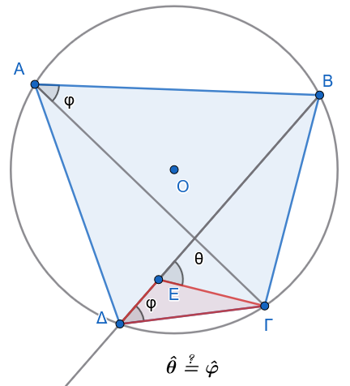{fig-align="center" width="350"}

Έστω ότι δίνεται το τετράπλευρο $ΑΒΓΔ$, στο οποίο η πλευρά $ΒΓ$ φαίνεται από τις απέναντι κορυφές $Α$ και $\Delta$ υπό ίσες γωνίες, δηλαδή: $$\widehat{ΒΑΓ} = \widehat{Β\Delta\Gamma}$$

Θα αποδείξουμε ότι το τετράπλευρο $ΑΒΓΔ$ είναι εγγράψιμο σε κύκλο.

1.  Θεωρούμε τον περιγεγραμμένο κύκλο $(c)$ του τριγώνου $ΑΒΓ$.

2.  Έστω $Ε$ το σημείο όπου η ημιευθεία $Β\Delta$ τέμνει τον κύκλο $(c)$ ($Ε \equiv Β\Delta \cap (c)$).

3.  Τότε, το τετράπλευρο $ΑΒΓΕ$ είναι εγγεγραμμένο στον κύκλο $(c)$, οπότε οι εγγεγραμμένες γωνίες που βαίνουν στο ίδιο τόξο $\overset{\frown}{ΒΓ}$ είναι ίσες: $$\widehat{ΒΕ\Gamma} = \widehat{ΒΑ\Gamma}$$

4.  Επειδή όμως από την υπόθεση ισχύει $\widehat{Β\Delta\Gamma} = \widehat{ΒΑ\Gamma}$, προκύπτει ότι: $$\widehat{ΒΕ\Gamma} = \widehat{Β\Delta\Gamma}$$

5.  Η σχέση αυτή οδηγεί στο συμπέρασμα ότι τα σημεία $Ε$ και $\Delta$ ταυτίζονται ($Ε \equiv \Delta$), διότι διαφορετικά, στο τρίγωνο $\Gamma\Delta E$, μία εξωτερική γωνία θα ήταν ίση με μία απέναντι εσωτερική, πράγμα που είναι **άτοπο**.

Συνεπώς, το σημείο $\Delta$ ανήκει στον κύκλο $(c)$, άρα το τετράπλευρο $ΑΒΓΔ$ είναι εγγράψιμο.

3.  **Απόδειξη Κριτηρίου 3 (Εξωτερική γωνία ίση με απέναντι εσωτερική):**

$1^{ος}$ τρόπος

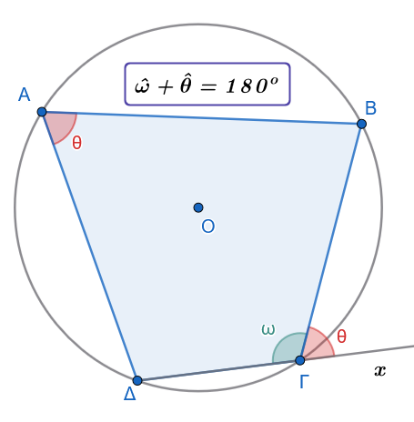

Έστω τετράπλευρο $AB\Gamma\Delta$ και $x\widehat{\Gamma}B$ εξωτερική γωνία τέτοια ώστε $x\widehat{\Gamma}B = \widehat{A}$.

Επειδή $\widehat{xΓB} + \widehat{Δ\Gamma B} = 180^\circ$ (ως εφεξής παραπληρωματικές), αντικαθιστώντας έχουμε $\widehat{A} + \widehat{Δ\Gamma B} = 180^\circ$.

Το τετράπλευρο έχει δύο απέναντι γωνίες παραπληρωματικές, άρα από το Κριτήριο 1 είναι εγγράψιμο.

$2^{ος}$ τρόπος

Έστω ότι δίνεται το τετράπλευρο $ΑΒΓΔ$, στο οποίο η εξωτερική γωνία $\widehat{\Gamma\Delta\chi}$ ισούται με την απέναντι εσωτερική γωνία του $\widehat{ΑΒ\Gamma}$ .
Θα αποδείξουμε ότι το τετράπλευρο $ΑΒΓΔ$ είναι εγγράψιμο σε κύκλο.

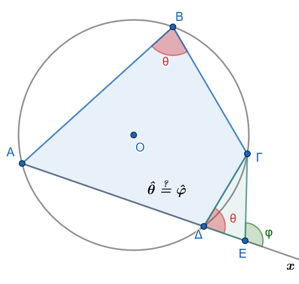{fig-align="center" width="350"}

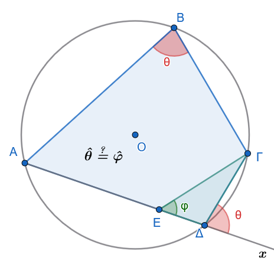{fig-align="center" width="350"}

1.  Θεωρούμε τον περιγεγραμμένο κύκλο $(c)$ του τριγώνου $ΑΒΓ$.

2.  Έστω $Ε$ το σημείο όπου η προέκταση της πλευράς $Α\Delta$ τέμνει τον κύκλο $(c)$ ($Ε \equiv Α\Delta \cap (c)$).

3.  Τότε, το τετράπλευρο $ΑΒΓΕ$ είναι εγγεγραμμένο στον κύκλο $(c)$, οπότε η εξωτερική του γωνία $\widehat{\Gamma E\chi}$ ισούται με την απέναντι εσωτερική: $$\widehat{\Gamma Ex} = \widehat{ΑΒ\Gamma}$$

4.  Επειδή όμως από την υπόθεση ισχύει $\widehat{\Gamma\Delta x} = \widehat{ΑΒ\Gamma}$, προκύπτει ότι: $$\widehat{\Gamma Ex} = \widehat{\Gamma\Delta x}$$

5.  Η σχέση αυτή οδηγεί στο συμπέρασμα ότι τα σημεία $Ε$ και $\Delta$ ταυτίζονται ($Ε \equiv \Delta$), διότι διαφορετικά, στο τρίγωνο $\Gamma\Delta E$, μία εξωτερική γωνία θα ήταν ίση με μία απέναντι εσωτερική γωνία, πράγμα που είναι **άτοπο**.

Συνεπώς, το σημείο $\Delta$ ανήκει στον κύκλο $(c)$, άρα το τετράπλευρο $ΑΒΓΔ$ είναι εγγράψιμο.
::::

------------------------------------------------------------------------

#### Εφαρμογές

:::: {.math-box .example-box}
::: {.math-title .example-title}
**Εφαρμογή 1η:**
:::

Οι διχοτόμοι των γωνιών κάθε κυρτού τετραπλεύρου σχηματίζουν εγγράψιμο τετράπλευρο.
::::

:::: {.math-box .examplesolution-box}
::: {.math-title .examplesolution-title}
**Απόδειξη**

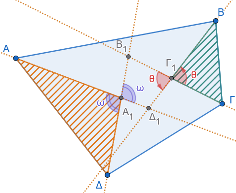{fig-align="center" width="350"}
:::

Έστω κυρτό τετράπλευρο $AB\Gamma\Delta$ και $A_1 B_1 \Gamma_1 \Delta_1$ το τετράπλευρο που σχηματίζεται από τις τομές των εσωτερικών διχοτόμων των γωνιών του.

Στο τρίγωνο $AA_1\Delta$, η γωνία $\widehat{B_1 A_1 \Delta_1}$ είναι κατακορυφήν της $\widehat{AA_1\Delta}$, οπότε: $$\hatω=\widehat{B_1 A_1 \Delta_1} = 180^\circ - \left(\frac{\widehat{A}}{2} + \frac{\widehat{\Delta}}{2}\right) \quad$$

Στο τρίγωνο $B\Gamma_1\Gamma$, η απέναντι γωνία $\widehat{\Delta_1 \Gamma_1 B_1}$ είναι κατακορυφήν της $\widehat{B\Gamma_1\Gamma}$, άρα: $$\hat θ=\widehat{\Delta_1 \Gamma_1 B_1} = 180^\circ - \left(\frac{\widehat{B}}{2} + \frac{\widehat{\Gamma}}{2}\right) \quad$$

Προσθέτοντας τις δύο σχέσεις κατά μέλη: $$\hat ω+\hat θ=\widehat{B_1 A_1 \Delta_1} + \widehat{\Delta_1 \Gamma_1 B_1} = 360^\circ - \frac{\widehat{A} + \widehat{B} + \widehat{\Gamma} + \widehat{\Delta}}{2} = 360^\circ - \frac{360^\circ}{2} = 180^\circ \quad$$

Εφόσον οι απέναντι γωνίες του τετραπλεύρου $A_1 B_1 \Gamma_1 \Delta_1$ είναι παραπληρωματικές, το τετράπλευρο είναι εγγράψιμο.
::::

:::: {.math-box .example-box}
::: {.math-title .example-title}
**Εφαρμογή 2η:**
:::

Σε κάθε οξυγώνιο τρίγωνο $AB\Gamma$ με ύψη $A\Delta, BE, \Gamma Z$ και ορθόκεντρο $H$, σχηματίζονται 6 εγγράψιμα τετράπλευρα.
::::

:::: {.math-box .examplesolution-box}
::: {.math-title .examplesolution-title}
**Απόδειξη**

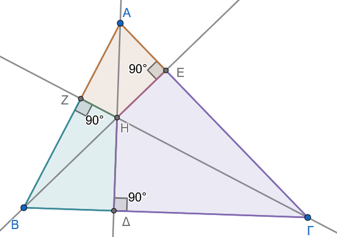{fig-align="center" width="400"}

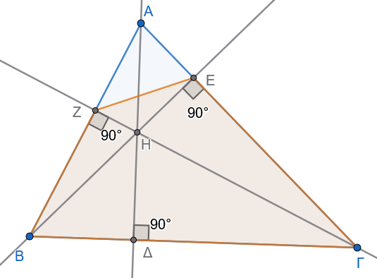{fig-align="center" width="400"}
:::

1.  Τα τετράπλευρα $AEHZ$, $B\Delta HZ$ και $\Gamma\Delta HE$ έχουν δύο απέναντι γωνίες ορθές (π.χ. στο $AEHZ$, $\widehat{AEH} = \widehat{AZH} = 90^\circ \Rightarrow \widehat{AEH} + \widehat{AZH} = 180^\circ$), οπότε από το Κριτήριο 1 είναι εγγράψιμα.

2.  Τα τετράπλευρα $B\Gamma EZ$, $A\Gamma\Delta Z$ και $AB\Delta E$ έχουν μία πλευρά τους που φαίνεται από τις απέναντι κορυφές υπό ορθή γωνία (π.χ. στο $B\Gamma EZ$, η πλευρά $B\Gamma$ φαίνεται από τις κορυφές $E$ και $Z$ υπό ίσες γωνίες: $\widehat{BE\Gamma} = \widehat{BZ\Gamma} = 90^\circ$), οπότε από το Κριτήριο 2 είναι εγγράψιμα.
::::

------------------------------------------------------------------------

### Περιγεγραμμένο και Περιγράψιμο Τετράπλευρο σε Κύκλο

#### Ορισμοί

:::: {.math-box .definition-box}
::: {.math-title .definition-title}
**Περιγεγραμμένο τετράπλευρο:**
:::

Ένα τετράπλευρο του οποίου όλες οι πλευρές εφάπτονται στον ίδιο κύκλο λέγεται περιγεγραμμένο στον κύκλο αυτό.
Ο κύκλος αυτός ονομάζεται **εγγεγραμμένος κύκλος** του τετραπλεύρου.
::::

:::: {.math-box .definition-box}
::: {.math-title .definition-title}
**Περιγράψιμο τετράπλευρο:**
:::

Ένα τετράπλευρο λέγεται περιγράψιμο όταν μπορεί να γραφεί κύκλος που να εφάπτεται και στις τέσσερις πλευρές του.
::::

------------------------------------------------------------------------

#### Θεωρήματα

:::: {.math-box .theorem-box}
::: {.math-title .theorem-title}
Μέρος (A): Ιδιότητες Περιγεγραμμένου Τετραπλεύρου
:::

Έστω τετράπλευρο $ΑΒΓΔ$ περιγεγραμμένο σε κύκλο $(Ο, \rho)$, ο οποίος εφάπτεται στις πλευρές $ΑΒ, ΒΓ, ΓΔ, ΔΑ$ στα σημεία $Κ, Λ, Μ, Ν$ αντίστοιχα.

(i) Οι διχοτόμοι των γωνιών του διέρχονται από το ίδιο σημείο (το κέντρο $Ο$)
::::

:::: {.math-box .apodeixi-box}
::: {.math-title .apodeixi-title}
Απόδειξη

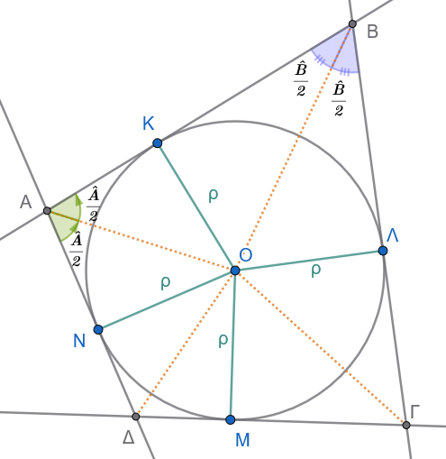{fig-align="center" width="400"}
:::

1.  Το κέντρο $Ο$ του κύκλου απέχει απόσταση $\rho$ (την ακτίνα) από κάθε πλευρά του τετραπλεύρου, διότι οι ακτίνες προς τα σημεία επαφής είναι κάθετες στις πλευρές: $$ΟΚ \perp ΑΒ, \quad ΟΛ \perp ΒΓ, \quad ΟΜ \perp ΓΔ, \quad ΟΝ \perp ΔΑ$$ με $ΟΚ = ΟΛ = ΟΜ = ΟΝ = \rho$.

2.  **Γεωμετρικός τόπος διχοτόμου:**

    Κάθε σημείο που ισαπέχει από τις πλευρές μιας κυρτής γωνίας ανήκει στη διχοτόμο της γωνίας αυτής.

    - Επειδή το $Ο$ ισαπέχει από τις $ΑΒ$ και $ΑΔ$ ($ΟΚ = ΟΝ = \rho$), το $Ο$ ανήκει στη διχοτόμο της γωνίας $\hat{A}$.

    - Επειδή το $Ο$ ισαπέχει από τις $ΒΑ$ και $ΒΓ$ ($ΟΚ = ΟΛ = \rho$), το $Ο$ ανήκει στη διχοτόμο της γωνίας $\hat{B}$.

    - Επειδή το $Ο$ ισαπέχει από τις $ΓΒ$ και $ΓΔ$ ($ΟΛ = ΟΜ = \rho$), το $Ο$ ανήκει στη διχοτόμο της γωνίας $\hat{\Gamma}$.

    - Επειδή το $Ο$ ισαπέχει από τις $ΔΓ$ και $ΔΑ$ ($ΟΜ = ΟΝ = \rho$), το $Ο$ ανήκει στη διχοτόμο της γωνίας $\hat{\Delta}$.

Συνεπώς, οι διχοτόμοι και των τεσσάρων γωνιών συντρέχουν στο κέντρο $Ο$ του εγγεγραμμένου κύκλου.
::::

------------------------------------------------------------------------

:::: {.math-box .theorem-box}
::: {.math-title .theorem-title}
Μέρος (A): Ιδιότητες Περιγεγραμμένου Τετραπλεύρου
:::

Έστω τετράπλευρο $ΑΒΓΔ$ περιγεγραμμένο σε κύκλο $(Ο, \rho)$, ο οποίος εφάπτεται στις πλευρές $ΑΒ, ΒΓ, ΓΔ, ΔΑ$ στα σημεία $Κ, Λ, Μ, Ν$ αντίστοιχα.

(ii) Τα αθροίσματα των απέναντι πλευρών είναι ίσα (Θεώρημα Pitot)
::::

:::: {.math-box .apodeixi-box}
::: {.math-title .apodeixi-title}
Απόδειξη

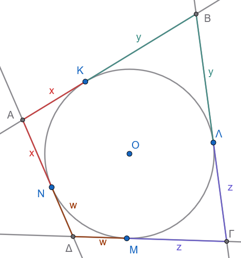{fig-align="center" width="350"}
:::

Από γνωστή ιδιότητα, τα εφαπτόμενα τμήματα που άγονται από ένα εξωτερικό σημείο προς έναν κύκλο είναι ίσα:

- Από την κορυφή $Α$: $ΑΚ = ΑΝ = x$

- Από την κορυφή $Β$: $ΒΚ = ΒΛ = y$

- Από την κορυφή $\Gamma$: $\Gamma Λ = \Gamma Μ = z$

- Από την κορυφή $\Delta$: $\Delta Μ = \Delta Ν = w$

Υπολογίζουμε το άθροισμα των απέναντι πλευρών:

- $ΑΒ + \Gamma\Delta = (ΑΚ + ΚΒ) + (\Gamma Μ + Μ\Delta) = (x + y) + (z + w) = x + y + z + w$

- $ΒΓ + \Delta Α = (ΒΛ + Λ\Gamma) + (\Delta Ν + ΝΑ) = (y + z) + (w + x) = x + y + z + w$

Παρατηρούμε ότι: $$ΑΒ + \Gamma\Delta = ΒΓ + \Delta Α$$
::::

------------------------------------------------------------------------

:::: {.math-box .theorem-box}
::: {.math-title .theorem-title}
Μέρος (B): Κριτήρια για να είναι ένα Τετράπλευρο Περιγράψιμο (Αντίστροφα)
:::

(i) Αν οι διχοτόμοι των γωνιών διέρχονται από το ίδιο σημείο
::::

:::: {.math-box .apodeixi-box}
::: {.math-title .apodeixi-title}
Απόδειξη

Δείτε το σχήμα της Α.
i
:::

Έστω ότι οι διχοτόμοι των τεσσάρων γωνιών του τετραπλεύρου $ΑΒΓΔ$ τέμνονται στο σημείο $Ο$.

1.  Επειδή το $Ο$ ανήκει στη διχοτόμο της $\hat{A}$, ισαπέχει από τις πλευρές $ΑΒ$ και $ΑΔ$.

2.  Επειδή το $Ο$ ανήκει στη διχοτόμο της $\hat{B}$, ισαπέχει από τις πλευρές $ΑΒ$ και $ΒΓ$.

3.  Επειδή το $Ο$ ανήκει στη διχοτόμο της $\hat{\Gamma}$, ισαπέχει από τις πλευρές $ΒΓ$ και $\Gamma\Delta$.

Άρα το σημείο $Ο$ ισαπέχει από όλες τις πλευρές του τετραπλεύρου.

Αν γράψουμε κύκλο με κέντρο το $Ο$ και ακτίνα $\rho$ ίση με την απόσταση του $Ο$ από μία πλευρά, ο κύκλος αυτός θα εφάπτεται σε όλες τις πλευρές του τετραπλεύρου.
Επομένως, το τετράπλευρο είναι περιγράψιμο.
::::

------------------------------------------------------------------------

:::: {.math-box .theorem-box}
::: {.math-title .theorem-title}
Μέρος (B): Κριτήρια για να είναι ένα Τετράπλευρο Περιγράψιμο (Αντίστροφα)
:::

(ii) Αν τα αθροίσματα των απέναντι πλευρών είναι ίσα ($ΑΒ + \Gamma\Delta = ΒΓ + \Delta Α$)
::::

:::: {.math-box .apodeixi-box}
::: {.math-title .apodeixi-title}
Απόδειξη

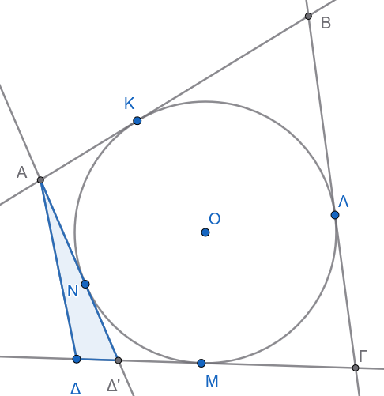{fig-align="center" width="350"}
:::

Θα αποδείξουμε με τη μέθοδο της **εις άτοπον απαγωγής** ότι το τετράπλευρο είναι περιγράψιμο.

1.  Θεωρούμε τον κύκλο $(Ο, \rho)$ που εφάπτεται στις τρεις πλευρές $ΑΒ, ΒΓ, ΓΔ$ (τέτοιος κύκλος υπάρχει πάντοτε, με κέντρο το σημείο τομής των διχοτόμων των γωνιών $\hat{B}$ και $\hat{\Gamma}$).

2.  Υποθέτουμε ότι η τέταρτη πλευρά $Α\Delta$ **δεν** εφάπτεται στον κύκλο.
    Τότε, φέρνουμε από την κορυφή $Α$ εφαπτομένη προς τον κύκλο, η οποία τέμνει την ευθεία $\Gamma\Delta$ στο σημείο $\Delta'$.

3.  Το τετράπλευρο $ΑΒΓ\Delta'$ είναι περιγεγραμμένο στον κύκλο, άρα από το Μέρος (A.ii) ισχύει: $$ΑΒ + \Gamma\Delta' = ΒΓ + \Delta'Α \implies ΑΒ - ΒΓ = \Delta'Α - \Gamma\Delta'$$

4.  Από την υπόθεση για το αρχικό τετράπλευρο $ΑΒΓΔ$, έχουμε: $$ΑΒ + \Gamma\Delta = ΒΓ + \Delta Α \implies ΑΒ - ΒΓ = \Delta Α - \Gamma\Delta$$

5.  Εξισώνοντας τα δεξιά μέλη: $$\Delta'Α - \Gamma\Delta' = \Delta Α - \Gamma\Delta$$ $$\Delta'Α - \Delta Α = \Gamma\Delta' - \Gamma\Delta = \Delta\Delta'$$ δηλαδή: $$\Delta'Α - \Delta Α = \Delta\Delta' \iff \Delta'Α = \Delta Α + \Delta\Delta'$$

    Όμως, στο τρίγωνο $Α\Delta\Delta'$, από την τριγωνική ανισότητα γνωρίζουμε ότι η πλευρά $\Delta'Α$ πρέπει να είναι αυστηρά μικρότερη από το άθροισμα των άλλων δύο πλευρών: $$\Delta'Α < \Delta Α + \Delta\Delta'$$

    Η σχέση $\Delta'Α = \Delta Α + \Delta\Delta'$ είναι **άτοπη** (αδύνατη σε τρίγωνο).

Άρα η αρχική μας υπόθεση ήταν λανθασμένη, που σημαίνει ότι η πλευρά $Α\Delta$ εφάπτεται απαραίτητα στον κύκλο, και συνεπώς το τετράπλευρο $ΑΒΓΔ$ είναι περιγράψιμο.
::::

------------------------------------------------------------------------

#### Εφαρμογές

:::: {.math-box .example-box}
::: {.math-title .example-title}
**Εφαρμογή 1η:**
:::

Κάθε ρόμβος είναι περιγράψιμος σε κύκλο, ενώ κάθε παραλληλόγραμμο που είναι περιγράψιμο σε κύκλο είναι ρόμβος.
::::

:::: {.math-box .examplesolution-box}
::: {.math-title .examplesolution-title}
*Απόδειξη:*

Σχεδιάστε το σχήμα
:::

1.  Σε έναν ρόμβο $AB\Gamma\Delta$, όλες οι πλευρές είναι ίσες ($AB = B\Gamma = \Gamma\Delta = \Delta A = a$).
    Εξετάζοντας τα αθροίσματα των απέναντι πλευρών: $AB + \Gamma\Delta = a + a = 2a$ και $A\Delta + B\Gamma = a + a = 2a$.
    Εφόσον $AB + \Gamma\Delta = A\Delta + B\Gamma$, ο ρόμβος είναι περιγράψιμος σε κύκλο.

2.  Αντίστροφα, αν ένα παραλληλόγραμμο $AB\Gamma\Delta$ είναι περιγράψιμο σε κύκλο, ισχύει $AB + \Gamma\Delta = A\Delta + B\Gamma$.
    Επειδή σε κάθε παραλληλόγραμμο οι απέναντι πλευρές είναι ίσες ($AB = \Gamma\Delta$ και $A\Delta = B\Gamma$), η σχέση γίνεται: $$2AB = 2A\Delta \Rightarrow AB = A\Delta \quad$$

Ένα παραλληλόγραμμο με δύο διαδοχικές πλευρές ίσες είναι ρόμβος.
::::

:::: {.math-box .example-box}
::: {.math-title .example-title}
**Εφαρμογή 2η:**
:::

Σε κάθε περιγεγραμμένο τετράπλευρο $AB\Gamma\Delta$ με κέντρο εγγεγραμμένου κύκλου $O$, οι απέναντι πλευρές φαίνονται από το κέντρο $O$ υπό παραπληρωματικές γωνίες.
::::

:::: {.math-box .examplesolution-box}
::: {.math-title .examplesolution-title}
*Απόδειξη:*

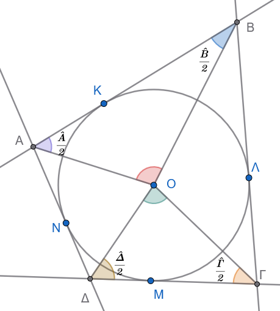{fig-align="center" width="350"}
:::

Τα τμήματα $OA, OB, O\Gamma, O\Delta$ είναι οι εσωτερικές διχοτόμοι των γωνιών $\widehat{A}, \widehat{B}, \widehat{\Gamma}, \widehat{\Delta}$ αντίστοιχα.

Στο τρίγωνο $AOB$, η γωνία $\widehat{AOB} = 180^\circ - \left(\dfrac{\widehat{A}}{2} + \dfrac{\widehat{B}}{2}\right)$.

Στο τρίγωνο $\Gamma O\Delta$, η γωνία $\widehat{\Gamma O\Delta} = 180^\circ - \left(\dfrac{\widehat{\Gamma}}{2} + \dfrac{\widehat{\Delta}}{2}\right)$.

Προσθέτοντας τις δύο σχέσεις: $$\widehat{AOB} + \widehat{\Gamma O\Delta} = 360^\circ - \frac{\widehat{A} + \widehat{B} + \widehat{\Gamma} + \widehat{\Delta}}{2} = 360^\circ - \frac{360^\circ}{2} = 180^\circ \quad$$

Όμοια αποδεικνύεται ότι $\widehat{BO\Gamma} + \widehat{AO\Delta} = 180^\circ$.
::::

------------------------------------------------------------------------

### Ασκήσεις

1.  Σε εγγεγραμμένο τετράπλευρο $AB\Gamma\Delta$ δίνεται ότι $\widehat{A} = 110^\circ$ και η εξωτερική γωνία της κορυφής $B$ είναι $B_{\text{εξ}} = 85^\circ$.
    Να υπολογιστούν όλες οι εσωτερικές γωνίες του τετραπλεύρου.

2.  Να αποδειχθεί ότι κάθε ορθογώνιο παραλληλόγραμμο είναι εγγράψιμο σε κύκλο και το κέντρο του κύκλου ταυτίζεται με το σημείο τομής των διαγωνίων του.

3.  Δίνεται τρίγωνο $AB\Gamma$ και τα ύψη του $B\Delta$ και $\Gamma E$.
    Να αποδειχθεί ότι το τετράπλευρο $B\Gamma ΔE$ είναι εγγράψιμο.

4.  Σε κύκλο φέρουμε δύο κάθετες χορδές $AΓ$ και $ΒΔ$ που τέμνονται στο $O$.
    Αν $E, Z, H, \Theta$ είναι οι προβολές του $O$ στις πλευρές $AB, B\Gamma, \Gamma\Delta, \Delta A$ αντίστοιχα, να αποδειχθεί ότι το τετράπλευρο $EZH\Theta$ είναι εγγράψιμο.

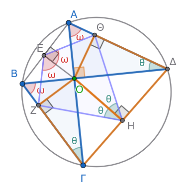{fig-align="center"}

:::: callout-method
::: {.callout-method .callout-method-title}
Υπόδειξη
:::

$ΑΒΓΔ$ εγγράψιμο $\implies \hat θ=\widehat{ΑΔΒ}=\widehat{ΑΓΒ}$

$ΟΗΔΘ$ εγγράψιμο $\implies \hat θ=\widehat{ΘΔΟ}=\widehat{ΘΗΟ}$

$ΟΗΓΖ$ εγγράψιμο $\implies \hat θ=\widehat{ΟΗΖ}=\widehat{ΟΓΖ}$

Όμοια για τις γωνίες $\hatω$

Στο ορθογώνιο τρίγωνο $\overset \triangle{ΑΟΔ}$ : $\hat ω+\hat θ=90^o$

Όμοια στο ορθογώνιο τρίγωνο $\overset \triangle{ΟΑΓ}$: $\hatω+\hatθ=90^o$

Άρα στο τετράπλευρο $ΕΖΗΘ$ : $\hat Η+\hat Ε=......................$
::::

:::: {.math-box .exercise-box}
::: {.math-title .exercise-title}
5.  Εκφώνηση
:::

Να αποδειχθεί ότι αν οι διαγώνιοι τραπεζίου είναι ίσες ($A\Gamma = B\Delta$), τότε το τραπέζιο είναι ισοσκελές και εγγράψιμο σε κύκλο.
::::

:::: {.math-box .solution-box}
::: {.math-title .solution-title}
Απόδειξη

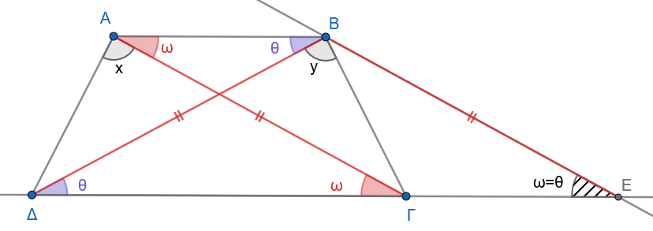{fig-align="center" width="500"}
:::

Έστω τραπέζιο $ΑΒΓΔ$ με παράλληλες βάσεις $ΑΒ \parallel \Gamma\Delta$ και ίσες διαγώνιες: $$ΑΓ = Β\Delta$$

- **1: Απόδειξη ότι το τραπέζιο είναι ισοσκελές (**$Α\Delta = ΒΓ$)

**1: Βοηθητική κατασκευή**

Από την κορυφή $Β$, φέρνουμε ευθεία παράλληλη στη διαγώνιο $ΑΓ$ ($ΒΕ \parallel ΑΓ$), η οποία τέμνει την προέκταση της βάσης $\Delta\Gamma$ στο σημείο $Ε$.

- Επειδή $ΑΒ \parallel \GammaΕ$ και $ΑΓ \parallel ΒΕ$, το τετράπλευρο $ΑΒΕΓ$ είναι **παραλληλόγραμμο**.

- Άρα, οι απέναντι πλευρές του είναι ίσες: $$ΒΕ = ΑΓ$$

**2: Ισοσκελές τρίγωνο** $\Delta Β Ε$

Από την υπόθεση έχουμε $ΑΓ = Β\Delta$, οπότε: $$ΒΕ = Β\Delta$$

Επομένως, το τρίγωνο $\Delta Β Ε$ είναι **ισοσκελές**, που σημαίνει ότι οι γωνίες της βάσης του είναι ίσες: $$\widehat{Β\Delta Ε} = \widehat{ΒΕ\Delta} \quad \text{(1)}$$

Επίσης, επειδή $ΑΓ \parallel ΒΕ$, οι γωνίες $\widehat{Α\Gamma\Delta}$ και $\widehat{ΒΕ\Delta}$ είναι ίσες ως **εντός-εκτός και επί τα αυτά μέρη** (αντίστοιχες): $$\widehat{Α\Gamma\Delta} = \widehat{ΒΕ\Delta} \quad \text{(2)}$$

Από τις σχέσεις (1) και (2) προκύπτει ότι: $$\widehat{Β\Delta\Gamma} = \widehat{Α\Gamma\Delta}$$

**3: Σύγκριση τριγώνων** $Α\Gamma\Delta$ και $Β\Delta\Gamma$

Συγκρίνουμε τα τρίγωνα $Α\Gamma\Delta$ και $Β\Delta\Gamma$:

1.  $ΑΓ = Β\Delta$ (από την υπόθεση).

2.  $\Gamma\Delta$ είναι κοινή πλευρά.

3.  $\widehat{Α\Gamma\Delta} = \widehat{Β\Delta\Gamma}$ (περιεχόμενες γωνίες, όπως αποδείξαμε).

Από το κριτήριο **Π-Γ-Π** (Πλευρά - Γωνία - Πλευρά), τα τρίγωνα είναι **ίσα** ($\triangle Α\Gamma\Delta = \triangle Β\Delta\Gamma$).

Συνεπώς, όλα τα αντίστοιχα στοιχεία τους είναι ίσα: $$Α\Delta = ΒΓ$$ και $$\widehat{\Delta} = \widehat{\Gamma} \quad (\widehat{Α\Delta\Gamma} = \widehat{Β\Gamma\Delta})$$

Άρα, το τραπέζιο $ΑΒΓΔ$ είναι **ισοσκελές**.

- **2: Απόδειξη ότι είναι εγγράψιμο σε κύκλο**

Επειδή οι βάσεις $ΑΒ$ και $\Gamma\Delta$ είναι παράλληλες, οι εντός και επί τα αυτά μέρη γωνίες είναι παραπληρωματικές: $$\widehat{Α} + \widehat{\Delta} = 180^\circ$$

Επειδή όμως δείξαμε ότι $\widehat{\Delta} = \widehat{\Gamma}$, αντικαθιστούμε και παίρνουμε: $$\widehat{Α} + \widehat{\Gamma} = 180^\circ$$

Εφόσον οι απέναντι γωνίες $\widehat{Α}$ και $\widehat{\Gamma}$ έχουν άθροισμα $180^\circ$, το τραπέζιο $ΑΒΓΔ$ είναι **εγγράψιμο σε κύκλο**.
::::

:::: {.math-box .exercise-box}
::: {.math-title .exercise-title}
6.  Θεώρημα Nagel
:::

Οι ακτίνες του περιγεγραμμένου κύκλου ενός τριγώνου που καταλήγουν στις κορυφές του είναι κάθετες στις αντίστοιχες πλευρές του ορθικού τριγώνου.
::::

:::: {.math-box .solution-box}
::: {.math-title .solution-title}
Απόδειξη

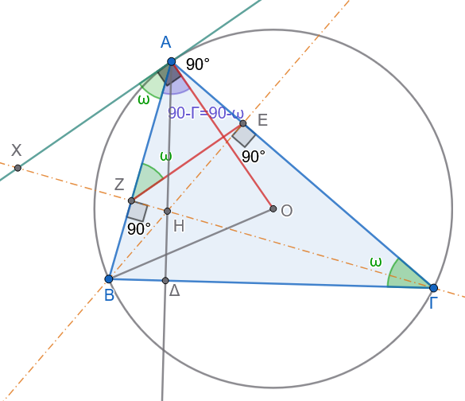{fig-align="center" width="400"}
:::

Έστω τρίγωνο $ΑΒΓ$ εγγεγραμμένο σε κύκλο $(O, R)$ και τα ύψη του $Α\Delta$, $ΒΕ$, $\Gamma Ζ$.\
Το τρίγωνο $\Delta Ε Ζ$ είναι το **ορθικό τρίγωνο** του $ΑΒΓ$.

Θα αποδείξουμε ότι: $$ΟΑ \perp ΖΕ, \quad ΟΒ \perp \Delta Ζ \quad \text{και} \quad Ο\Gamma \perp \Delta Ε$$

------------------------------------------------------------------------

**1: Σύνδεση με την εφαπτομένη στον κύκλο**

Φέρνουμε την εφαπτομένη $Αx$ του κύκλου στην κορυφή $Α$.

Γνωρίζουμε ότι η ακτίνα $ΟΑ$ είναι κάθετη στην εφαπτομένη: $$ΟΑ \perp Αx$$

Επομένως, για να αποδείξουμε ότι $ΟΑ \perp ΖΕ$, αρκεί να δείξουμε ότι: $$ΖΕ \parallel Αx \iff \widehat{ΑΖΕ} = \widehat{ΖΑx} \quad \text{(ως εντός εναλλάξ γωνίες)}$$

------------------------------------------------------------------------

**2: Εγγράψιμο τετράπλευρο** $ΒΖΕΓ$

Επειδή $ΒΕ \perp Α\Gamma$ και $\Gamma Ζ \perp ΑΒ$, έχουμε: $$\widehat{ΒΕ\Gamma} = \widehat{ΒΖ\Gamma} = 90^\circ$$

Τα σημεία $Ε$ και $Ζ$ «βλέπουν» το ευθύγραμμο τμήμα $Β\Gamma$ υπό ορθή γωνία, άρα το τετράπλευρο $ΒΖΕΓ$ είναι **εγγράψιμο** σε κύκλο με διάμετρο $Β\Gamma$.

Στο εγγεγραμμένο τετράπλευρο $ΒΖΕΓ$, η εξωτερική γωνία στην κορυφή $Ζ$ ισούται με την απέναντι εσωτερική γωνία στην κορυφή $\Gamma$: $$\widehat{ΑΖΕ} = \widehat{Α\Gamma Β} \quad \text{(1)}$$

------------------------------------------------------------------------

**3: Γωνία χορδής και εφαπτομένης**

Η γωνία $\widehat{ΖΑx}$ (δηλαδή η γωνία $\widehat{ΒΑx}$) σχηματίζεται από τη χορδή $ΑΒ$ και την εφαπτομένη $Αx$, επομένως ισούται με την εγγεγραμμένη γωνία που βαίνει στο ίδιο τόξο $\overset{\frown}{ΑΒ}$: $$\widehat{ΖΑx} = \widehat{Α\Gamma Β} \quad \text{(2)}$$

------------------------------------------------------------------------

**4: Συμπέρασμα**

Από τις σχέσεις (1) και (2) προκύπτει ότι: $$\widehat{ΑΖΕ} = \widehat{ΖΑx}$$

Άρα οι ευθείες είναι παράλληλες: $$ΖΕ \parallel Αx$$

Και επειδή $ΟΑ \perp Αx$, προκύπτει άμεσα ότι: $$ΟΑ \perp ΖΕ$$

Με ακριβώς τον ίδιο τρόπο αποδεικνύονται και οι σχέσεις: $$ΟΒ \perp \Delta Ζ \quad \text{και} \quad Ο\Gamma \perp \Delta Ε$$
::::

:::: {.math-box .exercise-box}
::: {.math-title .exercise-title}
7.  Θεώρημα - Σημείο Miquel Τριγώνου
:::

Δίνεται ένα τρίγωνο $ΑΒΓ$ και τρία σημεία $\Delta$, $Ε$, $Ζ$ πάνω στις πλευρές του $ΑΒ$, $ΒΓ$, $ΓΑ$ αντίστοιχα.\
Οι περιγεγραμμένοι κύκλοι $(c_1)$ του τριγώνου $Α\Delta Ζ$, $(c_2)$ του τριγώνου $Β\Delta Ε$ και $(c_3)$ του τριγώνου $\Gamma Ε Ζ$ διέρχονται από το **ίδιο κοινό σημείο** $Μ$.

- Το σημείο $Μ$ ονομάζεται **σημείο Miquel** του τριγώνου $ΑΒΓ$.\
- Οι κύκλοι $(c_1), (c_2), (c_3)$ ονομάζονται **κύκλοι Miquel**.\
- Το τρίγωνο $\Delta Ε Ζ$ ονομάζεται **τρίγωνο Miquel**.
::::

:::: {.math-box .solution-box}
::: {.math-title .solution-title}
Απόδειξη

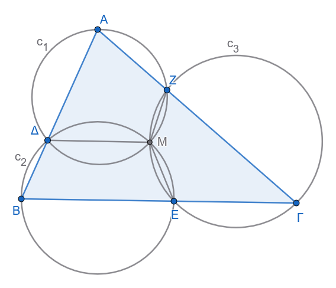{fig-align="center" width="400"}
:::

**1: Ορισμός του σημείου τομής** $Μ$

Θεωρούμε τους κύκλους $(c_1)$ (περιγεγραμμένος στο $\triangle Α\Delta Ζ$) και $(c_2)$ (περιγεγραμμένος στο $\triangle Β\Delta Ε$).

Οι δύο αυτοί κύκλοι τέμνονται στο σημείο $\Delta$ και έστω $Μ$ το **δεύτερο σημείο τομής** τους.

Για να αποδείξουμε το θεώρημα, αρκεί να αποδείξουμε ότι και ο τρίτος κύκλος $(c_3)$ διέρχεται από το σημείο $Μ$, δηλαδή ότι το τετράπλευρο $\Gamma Ε Μ Ζ$ είναι εγγράψιμο σε κύκλο.

------------------------------------------------------------------------

**2: Κριτήριο εγγραψιμότητας του** $\Gamma Ε Μ Ζ$

Για να είναι το τετράπλευρο $\Gamma Ε Μ Ζ$ εγγράψιμο, αρκεί η εξωτερική γωνία στην κορυφή $Ε$ να ισούται με την απέναντι εσωτερική γωνία στην κορυφή $Ζ$: $$\widehat{ΒΕΜ} = \widehat{\Gamma Ζ Μ}$$

------------------------------------------------------------------------

**3: Χρήση των εγγεγραμμένων τετραπλεύρων**

1.  Το τετράπλευρο $Β\Delta Μ Ε$ είναι εγγεγραμμένο στον κύκλο $(c_2)$, οπότε η εξωτερική του γωνία στην κορυφή $Ε$ ισούται με την απέναντι εσωτερική γωνία στην κορυφή $\Delta$: $$\widehat{ΒΕΜ} = \widehat{Α\Delta Μ} \quad \text{(1)}$$

2.  Το τετράπλευρο $Α\Delta Μ Ζ$ είναι εγγεγραμμένο στον κύκλο $(c_1)$, οπότε η εξωτερική του γωνία στην κορυφή $Ζ$ ισούται με την απέναντι εσωτερική γωνία στην κορυφή $\Delta$: $$\widehat{\Gamma Ζ Μ} = \widehat{Α\Delta Μ} \quad \text{(2)}$$

------------------------------------------------------------------------

**4: Συμπέρασμα**

Από τις σχέσεις (1) και (2) προκύπτει άμεσα ότι: $$\widehat{ΒΕΜ} = \widehat{\Gamma Ζ Μ}$$

Επομένως, το τετράπλευρο $\Gamma Ε Μ Ζ$ είναι **εγγράψιμο** σε κύκλο, πράγμα που σημαίνει ότι ο κύκλος $(c_3)$ διέρχεται επίσης από το σημείο $Μ$.
::::

:::: {.math-box .exercise-box}
::: {.math-title .exercise-title}
8.  Σημείο Miquel Πλήρους Τετραπλεύρου

**Θεώρημα:**
:::

Δίνεται κυρτό τετράπλευρο $ΑΒΓΔ$ και έστω $Ε, Ζ$ τα σημεία τομής των απέναντι πλευρών του ($Ε = Α\Delta \cap Β\Gamma$ και $Ζ = ΑΒ \cap \Delta\Gamma$).

*(Το σχήμα* $ΑΒΓΔΕΖ$ ονομάζεται **πλήρες τετράπλευρο**).

1.  Να αποδειχθεί ότι οι περιγεγραμμένοι κύκλοι των τεσσάρων τριγώνων $(ΒΓΖ)$, $(Α\Delta Ζ)$, $(ΑΒΕ)$ και $(\Gamma\Delta Ε)$ διέρχονται από το **ίδιο κοινό σημείο** $Μ$ (το οποίο ονομάζεται **σημείο Miquel** του τετραπλεύρου).

2.  Τι πρέπει να ισχύει ώστε το σημείο Miquel $Μ$ να βρίσκεται πάνω στην ευθεία $ΕΖ$;
::::

:::: {.math-box .solution-box}
::: {.math-title .solution-title}
Απόδειξη

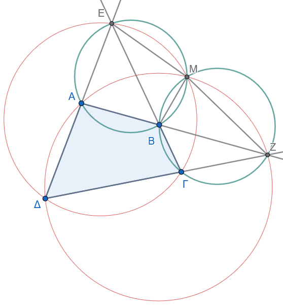{fig-align="center" width="400"}
:::

- **Μέρος 1: Συντρέχοντες κύκλοι στο σημείο** $Μ$

1.  **Ορισμός του σημείου** $Μ$:

    Έστω $Μ$ το δεύτερο σημείο τομής των κύκλων $(ΒΓΖ)$ και $(ΑΒΕ)$.

    Φέρνουμε την κοινή χορδή $ΜΒ$.

2.  **Απόδειξη ότι ο κύκλος** $(\Gamma\Delta Ε)$ διέρχεται από το $Μ$:

    Αρκεί να αποδείξουμε ότι το τετράπλευρο $Μ\Gamma\Delta Ε$ είναι **εγγράψιμο**, δηλαδή ότι η εξωτερική του γωνία στην κορυφή $\Gamma$ ισούται με την απέναντι εσωτερική γωνία στην κορυφή $Ε$: $$\widehat{Μ\Gamma Ζ} = \widehat{ΜΕ\Delta}$$

    - Στον κύκλο $(ΒΓΖ)$, οι εγγεγραμμένες γωνίες $\widehat{Μ\Gamma Ζ}$ και $\widehat{ΜΒΖ}$ είναι ίσες επειδή βαίνουν στο ίδιο τόξο $\overset{\frown}{ΜΖ}$: $$\widehat{Μ\Gamma Ζ} = \widehat{ΜΒΖ} \quad \text{(1)}$$

    - Στο εγγεγραμμένο τετράπλευρο $ΜΕΑΒ$ (του κύκλου $(ΑΒΕ)$), η εσωτερική γωνία $\widehat{ΜΕ\Delta}$ (δηλαδή η $\widehat{ΜΕΑ}$) ισούται με την απέναντι εξωτερική γωνία $\widehat{ΜΒΖ}$: $$\widehat{ΜΕ\Delta} = \widehat{ΜΒΖ} \quad \text{(2)}$$

    Από τις σχέσεις (1) και (2) προκύπτει ότι $\widehat{ΜΕ\Delta} = \widehat{Μ\Gamma Ζ}$, άρα το τετράπλευρο $ΜΕ\Delta\Gamma$ είναι **εγγράψιμο**, που σημαίνει ότι ο κύκλος $(\Gamma\Delta Ε)$ διέρχεται από το $Μ$.

3.  **Απόδειξη ότι ο κύκλος** $(Α\Delta Ζ)$ διέρχεται από το $Μ$:

    Με όμοιο τρόπο: $$\widehat{ΜΑΕ} = \widehat{ΜΒΕ} = \widehat{ΜΖ\Gamma}$$

    Συνεπώς, το τετράπλευρο $ΜΑ\Delta Ζ$ είναι επίσης **εγγράψιμο**, άρα και ο τέταρτος κύκλος $(Α\Delta Ζ)$ διέρχεται από το $Μ$.

------------------------------------------------------------------------

- **2: Συνθήκη ώστε τα σημεία** $Ε, Μ, Ζ$ να είναι συνευθειακά

Για να βρίσκονται τα σημεία $Ε, Μ, Ζ$ στην ίδια ευθεία, πρέπει το άθροισμα των παρακείμενων γωνιών να είναι $180^\circ$: $$\widehat{ΒΜΕ} + \widehat{ΒΜΖ} = 180^\circ \quad \text{(3)}$$

Παρατηρούμε όμως ότι:

- Από το εγγεγραμμένο τετράπλευρο $ΑΒΜΕ$: $$\widehat{ΒΜΕ} = \widehat{ΒΑ\Delta}$$

- Από το εγγεγραμμένο τετράπλευρο $ΒΜΖ\Gamma$: $$\widehat{ΒΜΖ} = \widehat{Β\Gamma\Delta}$$

Αντικαθιστώντας στη σχέση (3), η συνθήκη γίνεται: $$\widehat{ΒΑ\Delta} + \widehat{Β\Gamma\Delta} = 180^\circ$$

**Συμπέρασμα**

Το σημείο Miquel $Μ$ ανήκει στην ευθεία $ΕΖ$ **αν και μόνο αν το αρχικό τετράπλευρο** $ΑΒΓΔ$ είναι εγγράψιμο σε κύκλο.
::::

:::: {.math-box .exercise-box}
::: {.math-title .exercise-title}
9.  Κύκλος Miquel Πλήρους Τετραπλεύρου

**Θεώρημα:**
:::

Τα κέντρα των περιγεγραμμένων κύκλων των τεσσάρων τριγώνων ενός πλήρους τετραπλεύρου ανήκουν στον **ίδιο κύκλο**, στον οποίο ανήκει και το **σημείο Miquel**.

Ο κύκλος αυτός ονομάζεται **κύκλος Miquel** (ή *περιφέρεια Miquel*).
::::

:::: {.math-box .solution-box}
::: {.math-title .solution-title}
Απόδειξη

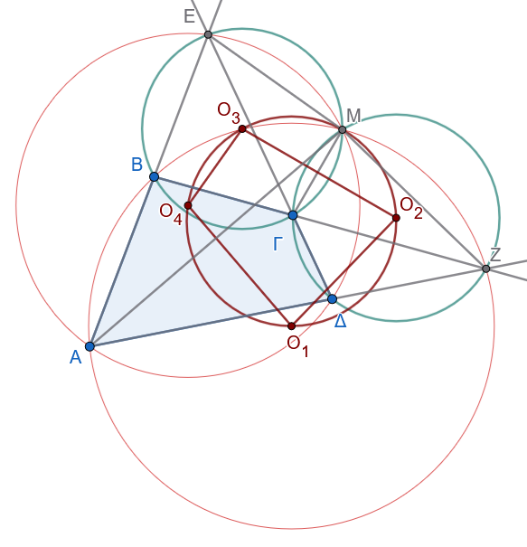{fig-align="center" width="400"}
:::

Θεωρούμε το πλήρες τετράπλευρο $ΑΒΓΔΕΖ$, το σημείο Miquel $Μ$ και τα κέντρα $Ο_1, Ο_2, Ο_3, Ο_4$ των περιγεγραμμένων κύκλων $(c_1), (c_2), (c_3), (c_4)$ των τριγώνων:

- $Ο_1$: κέντρο του κύκλου του $\triangle ΑΒΖ$

- $Ο_2$: κέντρο του κύκλου του $\triangle \Gamma\Delta Ζ$

- $Ο_3$: κέντρο του κύκλου του $\triangle Β\Gamma Ε$

- $Ο_4$: κέντρο του κύκλου του $\triangle Α\Delta Ε$

Θα αποδείξουμε ότι τα 5 σημεία $Ο_1, Ο_2, Ο_3, Ο_4$ και $Μ$ είναι **ομοκυκλικά** (ανήκουν στον ίδιο κύκλο).

------------------------------------------------------------------------

**1: Οι διάκεντροι ως μεσοκάθετοι των κοινών χορδών**

Τα τμήματα $ΜΑ, ΜΒ, Μ\Gamma, Μ\Delta, ΜΕ, ΜΖ$ αποτελούν κοινές χορδές των κύκλων ανά δύο, επομένως οι αντίστοιχες διάκεντροι είναι **μεσοκάθετοι** αυτών των χορδών:

- $Ο_1 Ο_4 \perp ΜΑ$

- $Ο_1 Ο_3 \perp ΜΒ$

- $Ο_2 Ο_3 \perp Μ\Gamma$

- $Ο_2 Ο_4 \perp Μ\Delta$

- $Ο_4 Ο_3 \perp ΜΕ$

- $Ο_1 Ο_2 \perp ΜΖ$

------------------------------------------------------------------------

**2: Το τετράπλευρο** $Ο_1 Ο_2 Ο_3 Ο_4$ είναι εγγράψιμο

Επειδή οι πλευρές των γωνιών $\widehat{Ο_1 Ο_3 Ο_2}$ και $\widehat{Ο_1 Ο_4 Ο_2}$ είναι κάθετες στις αντίστοιχες ακτίνες/χορδές, οι γωνίες αυτές ισούνται με: $$\widehat{Ο_1 Ο_3 Ο_2} = \widehat{ΒΜ\Gamma} \quad \text{και} \quad \widehat{Ο_1 Ο_4 Ο_2} = \widehat{ΑΜ\Delta}$$

Όμως: $$\widehat{ΒΜ\Gamma} = \widehat{ΒΕ\Gamma} = \widehat{ΑΕ\Delta} = \widehat{ΑΜ\Delta}$$

Επομένως: $$\widehat{Ο_1 Ο_3 Ο_2} = \widehat{Ο_1 Ο_4 Ο_2}$$

Επειδή οι κορυφές $Ο_3$ και $Ο_4$ «βλέπουν» το ευθύγραμμο τμήμα $Ο_1 Ο_2$ υπό ίσες γωνίες, το τετράπλευρο $Ο_1 Ο_2 Ο_3 Ο_4$ είναι εγγράψιμο σε κύκλο.

------------------------------------------------------------------------

**3: Το σημείο** $Μ$ ανήκει στον ίδιο κύκλο

1.  Επειδή $Ο_2 Ο_3 \perp Μ\Gamma$, η γωνία $\widehat{Μ Ο_2 Ο_3}$ ισούται με το μισό της επίκεντρης γωνίας $\widehat{Μ Ο_2 \Gamma}$, δηλαδή με την αντίστοιχη εγγεγραμμένη: $$\widehat{Μ Ο_2 Ο_3} = \frac{\widehat{Μ Ο_2 \Gamma}}{2} = \widehat{ΜΖ\Gamma} = \widehat{ΜΖΒ}$$

2.  Ομοίως, επειδή $Ο_4 Ο_3 \perp ΜΕ$: $$\widehat{Μ Ο_4 Ο_3} = \frac{\widehat{Μ Ο_4 Ε}}{2} = \widehat{ΜΑΕ} = \widehat{ΜΑΒ}$$

3.  Από το εγγεγραμμένο τετράπλευρο $ΜΒΑΖ$ (του κύκλου $(c_1)$), έχουμε $\widehat{ΜΖΒ} = \widehat{ΜΑΒ}$.
    Άρα: $$\widehat{Μ Ο_2 Ο_3} = \widehat{Μ Ο_4 Ο_3}$$

Συνεπώς, το τετράπλευρο $Μ Ο_2 Ο_4 Ο_3$ είναι επίσης εγγράψιμο σε κύκλο.

------------------------------------------------------------------------

**4: Συμπέρασμα**

Οι δύο περιγεγραμμένοι κύκλοι των τετραπλεύρων $(Ο_1 Ο_2 Ο_3 Ο_4)$ και $(Μ Ο_2 Ο_4 Ο_3)$ έχουν τρία κοινά σημεία ($Ο_2, Ο_3, Ο_4$), άρα **ταυτίζονται**.

Επομένως, τα πέντε σημεία $Ο_1, Ο_2, Ο_3, Ο_4$ και $Μ$ ανήκουν όλα στον ίδιο κύκλο (τον κύκλο Miquel).
::::

:::: {.math-box .exercise-box}
::: {.math-title .exercise-title}
10. Ευθεία Simson

**Θεώρημα:**
:::

Οι προβολές (τα ίχνη των καθέτων) ενός τυχόντος σημείου $Μ$ του περιγεγραμμένου κύκλου ενός τριγώνου $ΑΒΓ$ πάνω στις ευθείες των πλευρών του, ανήκουν στην **ίδια ευθεία**.

Η ευθεία αυτή ονομάζεται **ευθεία Simson** (ή *ευθεία Wallace-Simson*).
::::

:::: {.math-box .solution-box}
::: {.math-title .solution-title}
Απόδειξη

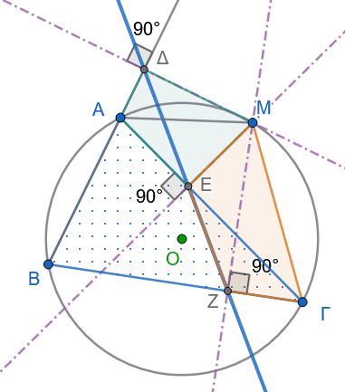{fig-align="center" width="320"}
:::

Έστω $Μ$ ένα σημείο του περιγεγραμμένου κύκλου του τριγώνου $ΑΒΓ$ και οι προβολές του στις πλευρές:

- $Μ\Delta \perp ΑΒ$

- $ΜΕ \perp ΑΓ$

- $ΜΖ \perp ΒΓ$

Θα αποδείξουμε ότι τα σημεία $\Delta, Ε, Ζ$ είναι συνευθειακά.

Για να είναι η γραμμή $\Delta Ε Ζ$ ευθεία, αρκεί οι παρακείμενες γωνίες να είναι παραπληρωματικές: $$\widehat{ΜΕ\Delta} + \widehat{ΜΕΖ} = 180^\circ$$

**1: Εγγράψιμο τετράπλευρο** $Μ\Delta ΑΕ$

Επειδή $Μ\Delta \perp ΑΒ$ ($\widehat{Μ\Delta Α} = 90^\circ$) και $ΜΕ \perp ΑΓ$ ($\widehat{ΜΕΑ} = 90^\circ$), το τετράπλευρο $Μ\Delta ΑΕ$ έχει δύο απέναντι γωνίες με άθροισμα $180^\circ$, άρα είναι **εγγράψιμο** σε κύκλο με διάμετρο $ΑΜ$.

Οι εγγεγραμμένες γωνίες που βαίνουν στο ίδιο τόξο $\overset{\frown}{Μ\Delta}$ είναι ίσες: $$\widehat{ΜΕ\Delta} = \widehat{ΜΑ\Delta} \quad \text{(1)}$$

**2: Εγγράψιμο τετράπλευρο** $ΜΕΖΓ$

Επειδή $\widehat{ΜΕ\Gamma} = 90^\circ$ και $\widehat{ΜΖ\Gamma} = 90^\circ$, το τετράπλευρο $ΜΕΖΓ$ είναι **εγγράψιμο** σε κύκλο με διάμετρο $Μ\Gamma$.

Συνεπώς, οι απέναντι γωνίες του έχουν άθροισμα $180^\circ$: $$\widehat{ΜΕΖ} + \widehat{Μ\Gamma Β} = 180^\circ \quad \text{(2)}$$

**3: Χρήση του αρχικού εγγεγραμμένου τετραπλεύρου** $ΜΑΒΓ$

Το τετράπλευρο $ΜΑΒΓ$ είναι εγγεγραμμένο στον αρχικό κύκλο, οπότε η εξωτερική γωνία στην κορυφή $Α$ ισούται με την απέναντι εσωτερική γωνία στην κορυφή $\Gamma$: $$\widehat{ΜΑ\Delta} = \widehat{Μ\Gamma Β} \quad \text{(3)}$$

**4: Συμπέρασμα**

Αντικαθιστώντας τη σχέση (3) στη σχέση (1), έχουμε $\widehat{ΜΕ\Delta} = \widehat{Μ\Gamma Β}$.

Στη συνέχεια, αντικαθιστώντας στη σχέση (2) προκύπτει: $$\widehat{ΜΕ\Delta} + \widehat{ΜΕΖ} = 180^\circ$$

Επομένως, τα σημεία $\Delta, Ε, Ζ$ βρίσκονται πάνω στην ίδια ευθεία.

> **Πόρισμα:**\
> Κάθε πλευρά του τριγώνου είναι η ευθεία Simson που αντιστοιχεί στο αντιδιαμετρικό σημείο της απέναντι κορυφής.
::::

:::: {.math-box .exercise-box}
::: {.math-title .exercise-title}
11. Αντίστροφο Θεώρημα Simson

**Θεώρημα:**
:::

Δίνεται τρίγωνο $ΑΒΓ$ και οι προβολές $\Delta, Ε, Ζ$ ενός σημείου $Μ$ του επιπέδου πάνω στις πλευρές $ΑΒ, ΑΓ, ΒΓ$ αντίστοιχα.

Εάν τα σημεία $\Delta, Ε, Ζ$ είναι **συνευθειακά**, τότε το σημείο $Μ$ **ανήκει στον περιγεγραμμένο κύκλο** του τριγώνου $ΑΒΓ$.
::::

:::: {.math-box .solution-box}
::: {.math-title .solution-title}
Απόδειξη

Δείτε το σχήμα στο 10.
:::

Αρκεί να αποδείξουμε ότι το τετράπλευρο $ΑΒΓΜ$ είναι **εγγράψιμο** σε κύκλο, δηλαδή ότι: $$\widehat{ΜΑ\Delta} = \widehat{Μ\Gamma Β}$$

1.  Όπως και στην ευθεία πρόταση, το τετράπλευρο $Μ\Delta ΑΕ$ είναι εγγράψιμο ($\widehat{\Delta} = \widehat{Ε} = 90^\circ$), οπότε: $$\widehat{ΜΑ\Delta} = \widehat{ΜΕ\Delta} \quad \text{(1)}$$

2.  Επειδή τα σημεία $\Delta, Ε, Ζ$ βρίσκονται στην ίδια ευθεία, η γωνία $\widehat{ΜΕ\Delta}$ είναι παραπληρωματική της $\widehat{ΜΕΖ}$.

    Επίσης, το τετράπλευρο $ΜΕΖΓ$ είναι εγγράψιμο ($\widehat{Ε} = \widehat{Ζ} = 90^\circ$), οπότε η εξωτερική γωνία $\widehat{ΜΕ\Delta}$ ισούται με την απέναντι εσωτερική γωνία $\widehat{Μ\Gamma Β}$: $$\widehat{ΜΕ\Delta} = \widehat{Μ\Gamma Β} \quad \text{(2)}$$

Από τις σχέσεις (1) και (2) προκύπτει άμεσα: $$\widehat{ΜΑ\Delta} = \widehat{Μ\Gamma Β}$$

Επειδή η εξωτερική γωνία $\widehat{ΜΑ\Delta}$ ισούται με την απέναντι εσωτερική $\widehat{Μ\Gamma Β}$, το τετράπλευρο $ΜΑΒΓ$ είναι εγγράψιμο σε κύκλο, δηλαδή το σημείο $Μ$ ανήκει στον περιγεγραμμένο κύκλο του τριγώνου $ΑΒΓ$.
::::

:::: {.math-box .exercise-box}
::: {.math-title .exercise-title}
12. Ευθεία Wallace

Θεώρημα
:::

Δίνεται τρίγωνο $ΑΒΓ$, εγγεγραμμένο σε κύκλο $(c)$, και σημείο $Μ$ του κύκλου, το οποίο βρίσκεται στο τόξο $ΑΓ$ που **δεν περιέχει** το σημείο $Β$.

Παίρνουμε:

- σημείο $\Delta$ στην πλευρά $ΑΒ$,
- σημείο $Ε$ στην πλευρά $ΑΓ$,
- σημείο $Ζ$ στην πλευρά $ΒΓ$,

έτσι ώστε:

$$
\widehat{Μ\Delta Α}
=\widehat{ΜΕΑ}
=\widehat{ΜΖΒ}.
$$

Να αποδειχθεί ότι τα σημεία $\Delta$, $Ε$, $Ζ$ βρίσκονται στην ίδια ευθεία.

Η ευθεία αυτή ονομάζεται **ευθεία Wallace** ή **γενικευμένη ευθεία Simson**.
::::

:::: {.math-box .solution-box}
::: {.math-title .solution-title}
Απόδειξη

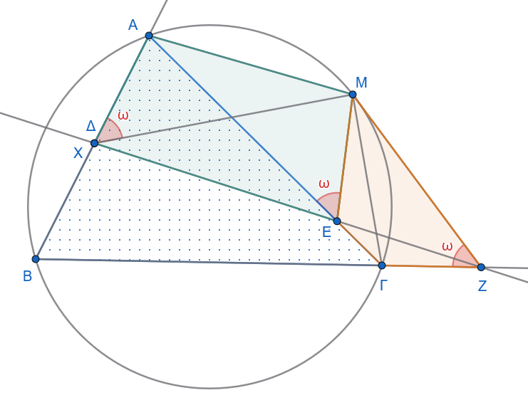{fig-align="center" width="450"}
:::

Θα αποδείξουμε ότι τα σημεία $\Delta$, $Ε$, $Ζ$ είναι συνευθειακά.

Έστω $X$ το σημείο τομής της ευθείας $ΕΖ$ με την πλευρά $ΑΒ$:

$$
X=ΕΖ\cap ΑΒ.
$$

Θα δείξουμε ότι το $X$ ταυτίζεται με το $\Delta$.

------------------------------------------------------------------------

**1: Το τετράπλευρο** $ΜΕΖΓ$ είναι εγγράψιμο

Από την υπόθεση έχουμε:

$$
\widehat{ΜΕΑ}=\widehat{ΜΖΒ}.
$$

Επειδή τα σημεία $Α,Ε,\Gamma$ είναι συνευθειακά και τα σημεία $Β,Ζ,\Gamma$ είναι επίσης συνευθειακά, οι παραπάνω γωνίες είναι παραπληρωματικές των γωνιών:

$$
\widehat{ΜΕ\Gamma}
\quad \text{και} \quad
\widehat{ΜΖ\Gamma}.
$$

Άρα:

$$
\widehat{ΜΕ\Gamma}=\widehat{ΜΖ\Gamma}.
$$

Επομένως το τετράπλευρο $ΜΕΖ\Gamma$ είναι εγγράψιμο.

Άρα οι γωνίες που βαίνουν στην ίδια χορδή $ΜΖ$ είναι ίσες:

$$
\widehat{ΜΕΖ}=\widehat{Μ\Gamma Ζ}. \tag{1}
$$

------------------------------------------------------------------------

**2: Χρησιμοποιούμε το αρχικό εγγεγραμμένο τετράπλευρο**

Τα σημεία $Α,Β,\Gamma,Μ$ ανήκουν στον ίδιο κύκλο.
Επομένως οι εγγεγραμμένες γωνίες που βαίνουν στην ίδια χορδή $ΜΒ$ είναι ίσες:

$$
\widehat{ΜΑΒ}=\widehat{Μ\Gamma Β}. \tag{2}
$$

Από τις σχέσεις (1) και (2), μαζί με τις σχέσεις συνευθειακότητας των σημείων $Ε,X,Z$ και $Α,X,Β$, προκύπτει:

$$
\widehat{ΜΧΑ}=\widehat{Μ\Delta Α}.
$$

Όμως, σύμφωνα με την υπόθεση:

$$
\widehat{Μ\Delta Α}
=\widehat{ΜΕΑ}
=\widehat{ΜΖΒ}.
$$

Άρα:

$$
\widehat{ΜΧΑ}=\widehat{Μ\Delta Α}.
$$

Επομένως τα σημεία $X$ και $\Delta$ είναι το ίδιο σημείο:

$$
X=\Delta.
$$

Αφού το $X$ ανήκει στην ευθεία $ΕΖ$, συμπεραίνουμε ότι:

$$
\Delta\in ΕΖ.
$$

Άρα τα σημεία $\Delta$, $Ε$, $Ζ$ είναι συνευθειακά.

------------------------------------------------------------------------

**Συμπέρασμα**

Τα σημεία $\Delta$, $Ε$, $Ζ$ βρίσκονται στην ίδια ευθεία.
Η ευθεία αυτή ονομάζεται:

$$
\boxed{\text{ευθεία Wallace}}
$$

ή

$$
\boxed{\text{γενικευμένη ευθεία Simson}}.
$$

------------------------------------------------------------------------

**Παρατήρηση**

Αν το σημείο $Μ$ είναι το αντιδιαμετρικό σημείο της κορυφής $Α$ του περιγεγραμμένου κύκλου, τότε η σχέση του θεωρήματος οδηγεί στην κλασική **ευθεία Simson**: τα ίχνη των καθέτων από το $Μ$ στις τρεις πλευρές του τριγώνου είναι συνευθειακά.
::::

:::: {.math-box .exercise-box}
::: {.math-title .exercise-title}
13. Κύκλος του Taylor

Θεώρημα
:::

Δίνεται τρίγωνο $ΑΒΓ$ και τα ύψη του:

$$
Α\Delta,\qquad ΒΕ,\qquad \Gamma Ζ.
$$

Από το ίχνος $\Delta$ του ύψους $Α\Delta$ φέρνουμε καθέτους προς τις πλευρές $ΑΒ$ και $ΑΓ$, οι οποίες τέμνουν τις πλευρές στα σημεία $Κ$ και $\Lambda$ αντίστοιχα.

Από το ίχνος $Ε$ του ύψους $ΒΕ$ φέρνουμε καθέτους προς τις πλευρές $ΑΒ$ και $ΒΓ$, οι οποίες τέμνουν τις πλευρές στα σημεία $Μ$ και $Ν$ αντίστοιχα.

Από το ίχνος $Ζ$ του ύψους $\Gamma Ζ$ φέρνουμε καθέτους προς τις πλευρές $ΒΓ$ και $ΓΑ$, οι οποίες τέμνουν τις πλευρές στα σημεία $\Sigma$ και $Τ$ αντίστοιχα.

Να αποδειχθεί ότι τα σημεία

$$
Κ,\ \Lambda,\ Μ,\ Ν,\ Τ,\ \Sigma
$$

βρίσκονται στην ίδια περιφέρεια.

Η περιφέρεια αυτή ονομάζεται **περιφέρεια του Taylor** του τριγώνου $ΑΒΓ$.
::::

:::: {.math-box .solution-box}
::: {.math-title .solution-title}
Απόδειξη

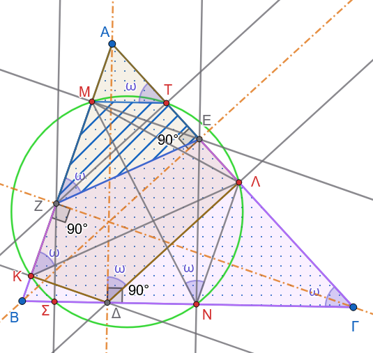{fig-align="center" width="500"}
:::

Παρατηρούμε ότι:

$$
\Delta Κ\perp ΑΒ
\quad\text{και}\quad
\Delta\Lambda\perp ΑΓ.
$$

Επομένως:

$$
\widehat{ΑΚ\Delta}=90^\circ
\quad\text{και}\quad
\widehat{Α\Lambda\Delta}=90^\circ.
$$

Άρα:

$$
\widehat{ΑΚ\Delta}+\widehat{Α\Lambda\Delta}=180^\circ.
$$

Επομένως το τετράπλευρο $ΑΚ\Delta\Lambda$ είναι εγγράψιμο.

Άρα οι γωνίες που βαίνουν στην ίδια χορδή $ΑΛ$ είναι ίσες:

$$
\widehat{ΑΚ\Lambda}=\widehat{Α\Delta\Lambda}. \tag{1}
$$

Επίσης, επειδή:

$$
Α\Delta\perp ΒΓ
\quad\text{και}\quad
\Delta\Lambda\perp ΑΓ,
$$

έχουμε:

$$
\widehat{Α\Delta\Lambda}=\widehat{Α\Gamma\Delta}. \tag{2}
$$

Από τις σχέσεις $(1)$ και $(2)$ προκύπτει:

$$
\widehat{ΑΚ\Lambda}=\widehat{Α\Gamma\Delta}. \tag{3}
$$

------------------------------------------------------------------------

Ακόμη, επειδή:

$$
ΒΕ\perp ΑΓ
\quad\text{και}\quad
\Gamma Ζ\perp ΑΒ,
$$

έχουμε:

$$
\widehat{ΒΕ\Gamma}
=\widehat{ΒΖ\Gamma}
=90^\circ.
$$

Επομένως το τετράπλευρο $ΒΖΕ\Gamma$ είναι εγγράψιμο.

Άρα:

$$
\widehat{ΑΖΕ}=\widehat{Α\Gamma Β}. \tag{4}
$$

Από τις σχέσεις $(3)$ και $(4)$, λαμβάνουμε:

$$
\widehat{ΑΚ\Lambda}=\widehat{ΑΖΕ}. \tag{5}
$$

------------------------------------------------------------------------

Τώρα, επειδή:

$$
ΖΤ\perp ΑΓ
\quad\text{και}\quad
ΕΜ\perp ΑΒ,
$$

έχουμε:

$$
\widehat{ΖΤΕ}
=\widehat{ΖΜΕ}
=90^\circ.
$$

Επομένως το τετράπλευρο $ΖΜΤΕ$ είναι εγγράψιμο.

Άρα οι γωνίες που βαίνουν στην ίδια χορδή $ΜΖ$ είναι ίσες:

$$
\widehat{ΜΤΖ}=\widehat{ΜΕΖ}.
$$

Από την εγγραψιμότητα των τετραπλεύρων που χρησιμοποιήθηκαν προηγουμένως προκύπτει:

$$
\widehat{ΜΤΑ}=\widehat{ΜΖΕ}. \tag{6}
$$

Επομένως, από τις σχέσεις $(5)$ και $(6)$:

$$
\widehat{ΑΚ\Lambda}
=\widehat{ΜΤΑ}.
$$

Άρα το τετράπλευρο $Κ\Lambda ΤΜ$ είναι εγγράψιμο.

Έτσι, τα σημεία

$$
Κ,\quad \Lambda,\quad Τ,\quad Μ
$$

βρίσκονται στην ίδια περιφέρεια.

------------------------------------------------------------------------

**Απόδειξη ότι τα σημεία** $Ν$ και $\Sigma$ ανήκουν στην περιφέρεια $(Κ\Lambda ΤΜ)$

Θα αποδείξουμε τώρα ότι στην περιφέρεια $(Κ\Lambda ΤΜ)$ ανήκουν επίσης τα σημεία $Ν$ και $\Sigma$.

**Για το σημείο** $Ν$

Για να ανήκει το σημείο $Ν$ στην περιφέρεια $(Κ\Lambda ΤΜ),$ αρκεί το τετράπλευρο $ΜΤ\Lambda Ν$ να είναι εγγράψιμο.
Για να είναι αυτό εγγράψιμο, αρκεί να ισχύει:

$$
\widehat{ΜΤΑ}=\widehat{ΜΝ\Lambda}.
$$

Προηγουμένως αποδείξαμε ότι:

$$
\widehat{ΜΤΑ}
=\widehat{ΜΖΕ}
=\widehat{Ν\Gamma Α}.
$$

Επομένως:

$$
ΜΤ\parallel Β\Gamma.
$$

Ομοίως:

$$
\Lambda Ν\parallel ΑΒ
$$

και συνεπώς:

$$
\widehat{\Lambda Ν\Gamma}=\widehat{Β}.
$$

Από την άλλη, το τετράπλευρο $ΑΜΝΓ$ είναι εγγράψιμο, διότι:

$$
\widehat{ΒΜΝ}=\widehat{ΒΕΝ},
$$

και το τετράπλευρο $ΒΜΕΝ$ είναι εγγράψιμο, ακόμη:

$$
\widehat{ΒΕΝ}=\widehat{Β\Gamma Α},
$$

επειδή οι αντίστοιχες πλευρές είναι κάθετες.

Επομένως:

$$
\widehat{ΒΜΝ}=\widehat{Β\Gamma Α}.
$$

Άρα και το τετράπλευρο $ΑΜΝ\Gamma$ είναι εγγράψιμο, οπότε:

$$
\widehat{ΒΝΜ}=\widehat{Α}.
$$

Όμως:

$$
\widehat{ΒΝΜ}
+
\widehat{ΜΝ\Lambda}
+
\widehat{\Lambda Ν\Gamma}
=\widehat{Α}
+
\widehat{Β}
+
\widehat{\Gamma}
=180^\circ.
$$

Επομένως:

$$
\widehat{ΜΝ\Lambda}=\widehat{\Gamma}.
$$

Από την προηγούμενη σχέση έχουμε επίσης:

$$
\widehat{ΜΤ\Lambda}=\widehat{\Gamma}.
$$

Άρα:

$$
\widehat{ΜΝ\Lambda}
=\widehat{ΜΤ\Lambda}.
$$

Επομένως το τετράπλευρο $ΜΤ\Lambda Ν$ είναι εγγράψιμο.
Συνεπώς το σημείο $Ν$ ανήκει στην περιφέρεια $(Κ\Lambda ΤΜ)$.

------------------------------------------------------------------------

**Για το σημείο** $\Sigma$

Με εντελώς ανάλογο τρόπο αποδεικνύεται ότι και το τετράπλευρο

$$
ΜΤ\Sigma Κ
$$

είναι εγγράψιμο.

Επομένως και το σημείο $\Sigma$ ανήκει στην περιφέρεια $(Κ\Lambda ΤΜ)$.

Άρα τα έξι σημεία

$$
Κ,\ \Lambda,\ Μ,\ Τ,\ Ν,\ \Sigma
$$

βρίσκονται στην ίδια περιφέρεια, την **περιφέρεια του Taylor**.
::::

14. Δίνεται περιγεγραμμένο τετράπλευρο $AB\Gamma\Delta$ με πλευρές $AB = 6\,\text{cm}$, $B\Gamma = 8\,\text{cm}$ και $\Gamma\Delta = 9\,\text{cm}$.
    Να υπολογιστεί το μήκος της πλευράς $A\Delta$.

15. Σε περιγεγραμμένο τραπέζιο $AB\Gamma\Delta$ ($AB \parallel \Gamma\Delta$), να αποδειχθεί ότι η διάμεσος $ΙΚ$ του τραπεζίου ισούται με το τέταρτο της περιμέτρου του.

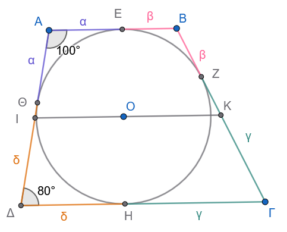{width="350"}


:::: {.math-box .exercise-box}
::: {.math-title .exercise-title}
16. Εκφώνηση
:::

Να αποδειχθεί ότι ένα ισοσκελές τραπέζιο είναι **περιγράψιμο σε κύκλο** —δηλαδή έχει εγγεγραμμένο κύκλο— αν και μόνο αν η διάμεσός του είναι ίση με τη μη παράλληλη πλευρά του.
::::

:::: {.math-box .solution-box}
::: {.math-title .solution-title}
Απόδειξη

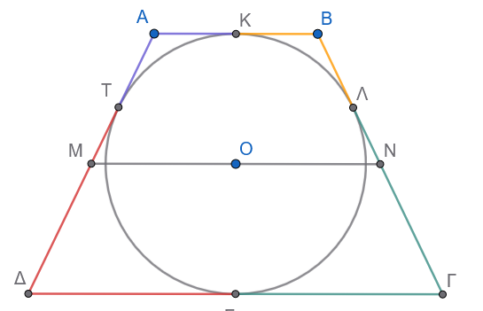{fig-align="center" width="400"}
:::

Έστω ισοσκελές τραπέζιο $ΑΒΓΔ$ με:

$$
ΑΒ\parallel \Gamma\Delta
$$

και ίσες μη παράλληλες πλευρές:

$$
Α\Delta=Β\Gamma=\ell.
$$

Έστω επίσης $ΜΝ$ η διάμεσος του τραπεζίου, όπου $Μ$ και $Ν$ είναι τα μέσα των μη παράλληλων πλευρών.

Τότε η διάμεσος είναι παράλληλη στις βάσεις και έχει μήκος:

$$
ΜΝ=\frac{ΑΒ+\Gamma\Delta}{2}. \tag{1}
$$

Θα αποδείξουμε ότι:

$$
ΑΒΓ\Delta \text{ είναι περιγράψιμο}
\iff
ΜΝ=\ell.
$$

------------------------------------------------------------------------

$\,(\Rightarrow)\,$ Αν το τραπέζιο είναι περιγράψιμο, τότε $ΜΝ=\ell$

Υποθέτουμε ότι το τραπέζιο είναι περιγράψιμο σε κύκλο.
Δηλαδή υπάρχει κύκλος που εφάπτεται και στις τέσσερις πλευρές του.

Σε κάθε περιγράψιμο τετράπλευρο ισχύει το θεώρημα του Pitot:

> Τα αθροίσματα των απέναντι πλευρών είναι ίσα.

Άρα:

$$
ΑΒ+\Gamma\Delta=Α\Delta+Β\Gamma.
$$

Επειδή το τραπέζιο είναι ισοσκελές, έχουμε:

$$
Α\Delta=Β\Gamma=\ell.
$$

Επομένως:

$$
ΑΒ+\Gamma\Delta=2\ell.
$$

Από τη σχέση $(1)$:

$$
ΜΝ=\frac{ΑΒ+\Gamma\Delta}{2}
=\frac{2\ell}{2}
=\ell.
$$

Άρα:

$$
\boxed{ΜΝ=Α\Delta=Β\Gamma}.
$$

------------------------------------------------------------------------

$\,(\Leftarrow)\,$ Αν $ΜΝ=\ell$, τότε το τραπέζιο είναι περιγράψιμο

Τώρα υποθέτουμε ότι:

$$
ΜΝ=\ell.
$$

Από τη σχέση $(1)$ έχουμε:

$$
\frac{ΑΒ+\Gamma\Delta}{2}=\ell.
$$

Άρα:

$$
ΑΒ+\Gamma\Delta=2\ell.
$$

Επειδή $Α\Delta=Β\Gamma=\ell$, παίρνουμε:

$$
ΑΒ+\Gamma\Delta=Α\Delta+Β\Gamma. \tag{2}
$$

Η σχέση $(2)$ είναι η αντίστροφη του θεωρήματος του Pitot για τραπέζιο: σε ένα κυρτό τετράπλευρο, όταν τα αθροίσματα των απέναντι πλευρών είναι ίσα, υπάρχει εγγεγραμμένος κύκλος.

Άρα το τραπέζιο $ΑΒΓ\Delta$ είναι περιγράψιμο σε κύκλο.

Επομένως:

$$
\boxed{ΜΝ=\ell\Rightarrow ΑΒΓ\Delta
\text{ είναι περιγράψιμο}.}
$$

------------------------------------------------------------------------

**Συμπέρασμα**

Για ένα ισοσκελές τραπέζιο ισχύει:

$$
\boxed{
ΑΒΓ\Delta\text{ είναι περιγράψιμο σε κύκλο}
\iff \\
\text{η διάμεσός του ισούται με τη μη παράλληλη πλευρά}
}
$$

Δηλαδή:

$$
\boxed{
ΑΒΓ\Delta\text{ περιγράψιμο}
\iff
ΜΝ=Α\Delta=Β\Gamma
}.
$$
::::


:::: {.math-box .exercise-box}
::: {.math-title .exercise-title}
17. Θεώρημα του Salmon
:::

Δίνεται κύκλος $(c)$ και τρεις χορδές του:

$$
ΑΒ,\qquad Α\Gamma,\qquad Α\Delta.
$$

Με διαμέτρους τις χορδές αυτές κατασκευάζουμε τρεις κύκλους:

- τον κύκλο με διάμετρο $ΑΒ$,

- τον κύκλο με διάμετρο $Α\Gamma$,

- τον κύκλο με διάμετρο $Α\Delta$.

Οι κύκλοι αυτοί τέμνονται ανά δύο, εκτός από το κοινό σημείο $Α$, σε τρία σημεία.

Να αποδειχθεί ότι τα τρία αυτά σημεία είναι συνευθειακά.
::::

:::: {.math-box .solution-box}
::: {.math-title .solution-title}
Απόδειξη

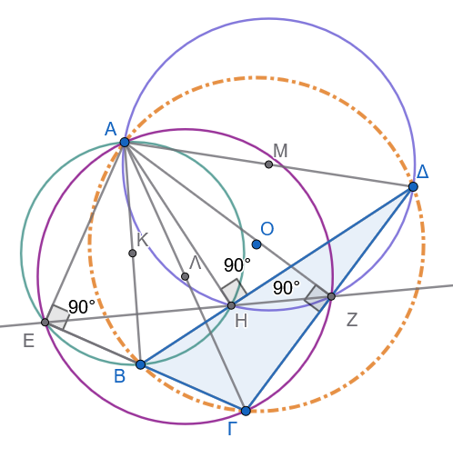{fig-align="center" width="400"}
:::

Έστω:

- $E$ το δεύτερο σημείο τομής των κύκλων με διαμέτρους $ΑΒ$ και $Α\Gamma$,

- $Z$ το δεύτερο σημείο τομής των κύκλων με διαμέτρους $Α\Gamma$ και $Α\Delta$,

- $H$ το δεύτερο σημείο τομής των κύκλων με διαμέτρους $Α\Delta$ και $ΑΒ$.

Θα αποδείξουμε ότι τα σημεία $E$, $Z$, $H$ βρίσκονται στην ίδια ευθεία.

------------------------------------------------------------------------

**1. Το σημείο** $E$

Επειδή το $E$ ανήκει στον κύκλο με διάμετρο $ΑΒ$, από το θεώρημα της εγγεγραμμένης γωνίας, έχουμε:

$$
\widehat{ΑΕΒ}=90^\circ.
$$

Άρα:

$$
ΑΕ\perp ΒΕ. \tag{1}
$$

Επίσης, επειδή το $E$ ανήκει στον κύκλο με διάμετρο $Α\Gamma$, έχουμε:

$$
\widehat{ΑΕ\Gamma}=90^\circ,
$$

οπότε:

$$
ΑΕ\perp \Gamma Ε. \tag{2}
$$

Από τις $(1)$ και $(2)$, οι ευθείες $ΒΕ$ και $\Gamma Ε$ είναι και οι δύο κάθετες στην $ΑΕ$.
Επομένως συμπίπτουν.

Άρα τα σημεία $Β$, $E$, $\Gamma$ είναι συνευθειακά:

$$
E\in Β\Gamma.
$$

Επιπλέον:

$$
ΑΕ\perp Β\Gamma. \tag{3}
$$

Άρα το $E$ είναι το ίχνος της καθέτου από το $Α$ στην πλευρά $Β\Gamma$ του τριγώνου $Β\Gamma\Delta$.

------------------------------------------------------------------------

**2. Το σημείο** $Z$

Με τον ίδιο τρόπο, επειδή το $Z$ ανήκει στους κύκλους με διαμέτρους $Α\Gamma$ και $Α\Delta$, έχουμε:

$$
\widehat{ΑZ\Gamma}=90^\circ
\quad\text{και}\quad
\widehat{ΑZ\Delta}=90^\circ.
$$

Άρα:

$$
AZ\perp \Gamma Z
\quad\text{και}\quad
AZ\perp \Delta Z.
$$

Επομένως οι ευθείες $\Gamma Z$ και $\Delta Z$ συμπίπτουν.
Άρα:

$$
Z\in \Gamma\Delta
$$

και

$$
AZ\perp \Gamma\Delta. \tag{4}
$$

Άρα το $Z$ είναι το ίχνος της καθέτου από το $Α$ στην πλευρά $\Gamma\Delta$ του τριγώνου $Α\Gamma\Delta$.

------------------------------------------------------------------------

**3. Το σημείο** $H$

Ομοίως, επειδή το $H$ ανήκει στους κύκλους με διαμέτρους $Α\Delta$ και $ΑΒ$, έχουμε:

$$
\widehat{ΑH\Delta}=90^\circ
\quad\text{και}\quad
\widehat{ΑHΒ}=90^\circ.
$$

Επομένως:

$$
AH\perp \Delta H
\quad\text{και}\quad
AH\perp BH.
$$

Άρα οι ευθείες $\Delta H$ και $BH$ συμπίπτουν.
Επομένως:

$$
H\in Β\Delta
$$

και

$$
AH\perp Β\Delta. \tag{5}
$$

Άρα το $H$ είναι το ίχνος της καθέτου από το $Α$ στην πλευρά $Β\Delta$ του τριγώνου $ΒΑ\Delta$.

------------------------------------------------------------------------

**4. Εφαρμογή του θεωρήματος Simson**

Τα σημεία $Β$, $\Gamma$, $\Delta$ ανήκουν στον αρχικό κύκλο $(c)$.
Άρα ο κύκλος $(c)$ είναι ο περιγεγραμμένος κύκλος του τριγώνου $Β\Gamma\Delta$.

Επίσης, το σημείο $Α$ ανήκει στον ίδιο κύκλο $(c)$.

Τα σημεία $E$, $Z$, $H$ είναι τα ίχνη των καθέτων από το σημείο $Α$ προς τις τρεις πλευρές του τριγώνου $Β\Gamma\Delta$:

$$
E\in Β\Gamma,\qquad
Z\in \Gamma\Delta,\qquad
H\in \Delta Β.
$$

Επειδή το $Α$ ανήκει στον περιγεγραμμένο κύκλο του τριγώνου $Β\Gamma\Delta$, από το **θεώρημα του Simson** τα ίχνη των τριών καθέτων είναι συνευθειακά.

Άρα:

$$
\boxed{E,\ Z,\ H\text{ είναι συνευθειακά}.}
$$

Αυτή η ευθεία είναι η ευθεία του **Salmon**.
::::

18. Αν οι διαγώνιοι εγγεγραμμένου τετραπλεύρου $AB\Gamma\Delta$ τέμνονται κάθετα στο $O$, να αποδειχθεί ότι η ευθεία που συνδέει το $O$ με το μέσο μιας πλευράς είναι κάθετη στην απέναντι πλευρά (Θεώρημα Brahmagupta).

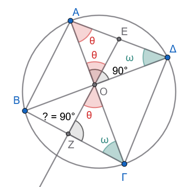{fig-align="center" width="300"}

:::: callout-method
::: {.callout-method .callout-method-title}
Υπόδειξη
:::

Στο ορθογώνιο τρίγωνο $ΑΟΔ$: $\hatω+\hatθ=90^o$ και $\hatθ \overset {\text{από το ισοσκελές  ΑΕΟ}}{=}\widehat{ΑΟΕ}\overset {\text{ως κατακορυφήν}}{=}\widehat{ΖΟΓ}$

Άρα στο τρίγωνο $ΟΖΓ$ ..................................
::::

19. Δίνεται περιγεγραμμένο τετράπλευρο $AB\Gamma\Delta$ σε κύκλο κέντρου $O$. Αν $E, Z, H, \Theta$ είναι τα σημεία επαφής των πλευρών $AB, B\Gamma, \Gamma\Delta, \Delta A$, να αποδειχθεί ότι οι ευθείες $EH$ και $Z\Theta$ τέμνονται στο σημείο $O$ αν και μόνο αν το $AB\Gamma\Delta$ είναι ρόμβος.

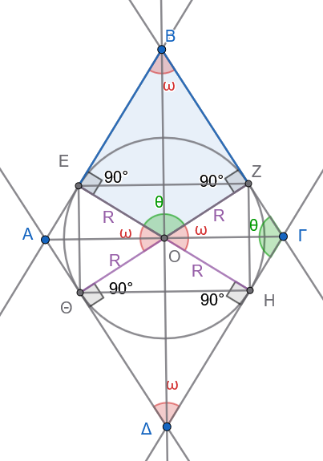{fig-align="center" width="350"}

20. Σε τρίγωνο $AB\Gamma$, $M$ είναι το μέσο της $B\Gamma$. Φέρουμε τις προβολές $Δ, E$ του $M$ στις πλευρές $AB$ και $A\Gamma$. Να αποδειχθεί ότι το τετράπλευρο $B\Gamma EΔ$ είναι εγγράψιμο αν και μόνο αν $AB = A\Gamma$ (το τρίγωνο είναι ισοσκελές).

:::: {.math-box .exercise-box}
::: {.math-title .exercise-title}
21. Κύκλος Euler (Κύκλος των 9 Σημείων)

**Θεώρημα:**
:::

Σε κάθε τρίγωνο, τα **μέσα των τριών πλευρών**, τα **ίχνη των τριών υψών** και τα **μέσα των αποστάσεων του ορθοκέντρου από τις κορυφές** ανήκουν στον ίδιο κύκλο.

Ο κύκλος αυτός ονομάζεται **κύκλος των εννέα σημείων** ή **κύκλος του Euler**.
::::

:::: {.math-box .solution-box}
::: {.math-title .solution-title}
Απόδειξη

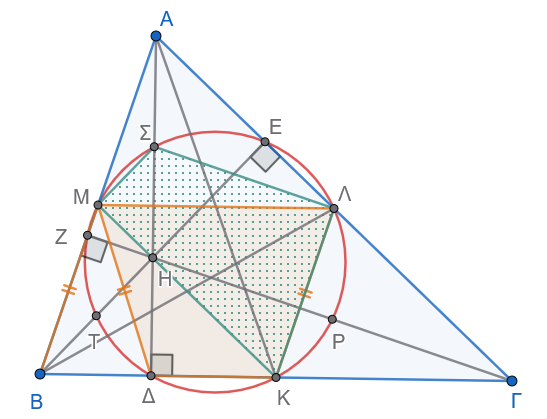{fig-align="center" width="400"}
:::

Θεωρούμε το τρίγωνο $ΑΒΓ$, το ορθόκεντρό του $Η$ και τα ακόλουθα σημεία:

- $Κ, Λ, Μ$: τα μέσα των πλευρών $ΒΓ, ΓΑ, ΑΒ$ αντίστοιχα.

- $\Delta, Ε, Ζ$: τα ίχνη των υψών $Α\Delta, ΒΕ, ΓΖ$ αντίστοιχα.

- $\Sigma, Τ, Ρ$: τα μέσα των τμημάτων $ΑΗ, ΒΗ, \Gamma Η$ αντίστοιχα.

Ορίζουμε τον κύκλο $(ΚΛΜ)$ που διέρχεται από τα μέσα των τριών πλευρών $Κ, Λ, Μ$.

Θα αποδείξουμε ότι και τα υπόλοιπα 6 σημεία ανήκουν στον ίδιο κύκλο.

------------------------------------------------------------------------

**1: Τα ίχνη των υψών (**$\Delta, Ε, Ζ$) ανήκουν στον κύκλο $(ΚΛΜ)$

Αρκεί να αποδείξουμε ότι το τετράπλευρο $\Delta Κ Λ Μ$ είναι **εγγράψιμο**.

1.  **Είναι τραπέζιο:**

    Το τμήμα $ΛΜ$ ενώνει τα μέσα των πλευρών $ΑΓ$ και $ΑΒ$, άρα είναι παράλληλο στη βάση $ΒΓ$ ($ΛΜ \parallel ΒΓ$).

    Επειδή το σημείο $\Delta$ ανήκει στην ευθεία $ΒΓ$, το τετράπλευρο $\Delta Κ Λ Μ$ είναι **τραπέζιο**.

2.  **Είναι ισοσκελές τραπέζιο:**

    - Το τμήμα $ΚΛ$ ενώνει τα μέσα των $ΒΓ$ και $ΑΓ$, άρα: $$ΚΛ = \frac{ΑΒ}{2}$$

    - Στο ορθογώνιο τρίγωνο $Α\Delta Β$ ($\widehat{Α\Delta Β} = 90^\circ$), το $\Delta Μ$ είναι διάμεσος προς την υποτείνουσα $ΑΒ$, οπότε: $$\Delta Μ = \frac{ΑΒ}{2}$$

    Επομένως, $ΚΛ = \Delta Μ$.

Ένα τραπέζιο με ίσες μη παράλληλες πλευρές είναι **ισοσκελές**, άρα και **εγγράψιμο**.

Συνεπώς, το σημείο $\Delta$ ανήκει στον κύκλο $(ΚΛΜ)$.

*Με τον ίδιο ακριβώς τρόπο αποδεικνύεται ότι και τα ίχνη των άλλων υψών* $Ε$ και $Ζ$ ανήκουν στον κύκλο $(ΚΛΜ)$.

------------------------------------------------------------------------

**2: Τα μέσα των τμημάτων** $ΑΗ, ΒΗ, \Gamma Η$ ($\Sigma, Τ, Ρ$) ανήκουν στον κύκλο $(ΚΛΜ)$

Αρκεί να αποδείξουμε ότι το τετράπλευρο $ΚΛ\Sigma Μ$ είναι **εγγράψιμο**.

1.  **Γωνία** $\widehat{ΜΚΛ}$:

    Επειδή $ΚΛ \parallel ΑΒ$ και $ΚΜ \parallel ΑΓ$, το τετράπλευρο $ΑΜΚΛ$ είναι παραλληλόγραμμο, οπότε οι απέναντι γωνίες του είναι ίσες: $$\widehat{ΜΚΛ} = \widehat{Α} \quad \text{(1)}$$

2.  **Γωνία** $\widehat{Μ\Sigma Λ}$:

    - Στο τρίγωνο $ΑΒΗ$, το $Μ\Sigma$ ενώνει τα μέσα των $ΑΒ$ και $ΑΗ$, άρα $Μ\Sigma \parallel ΒΗ$.

    - Στο τρίγωνο $Α\Gamma Η$, το $Λ\Sigma$ ενώνει τα μέσα των $ΑΓ$ και $ΑΗ$, άρα $Λ\Sigma \parallel \Gamma Η$.

    Επομένως, οι γωνίες $\widehat{Μ\Sigma Λ}$ και $\widehat{ΒΗ\Gamma}$ έχουν πλευρές παράλληλες, άρα: $$\widehat{Μ\Sigma Λ} = \widehat{ΒΗ\Gamma} = \widehat{ΖΗΕ}$$

    Στο τετράπλευρο $ΑΖΗΕ$, οι γωνίες στα $Ζ$ και $Ε$ είναι ορθές ($90^\circ + 90^\circ = 180^\circ$), οπότε είναι εγγράψιμο και ισχύει: $$\widehat{ΖΗΕ} = 180^\circ - \widehat{Α}$$

    Συνεπώς: $$\widehat{Μ\Sigma Λ} = 180^\circ - \widehat{Α} \quad \text{(2)}$$

3.  **Άθροισμα απέναντι γωνιών:**\
    Προσθέτοντας τις σχέσεις (1) και (2): $$\widehat{ΜΚΛ} + \widehat{Μ\Sigma Λ} = \widehat{Α} + (180^\circ - \widehat{Α}) = 180^\circ$$

Εφόσον οι απέναντι γωνίες του τετραπλεύρου $ΚΛ\Sigma Μ$ έχουν άθροισμα $180^\circ$, το τετράπλευρο είναι **εγγράψιμο**, άρα το σημείο $\Sigma$ ανήκει στον κύκλο $(ΚΛΜ)$.

*Με τον ίδιο ακριβώς τρόπο αποδεικνύεται ότι και τα μέσα* $Τ$ και $Ρ$ των αποστάσεων του ορθοκέντρου ανήκουν στον κύκλο $(ΚΛΜ)$.

------------------------------------------------------------------------

**Τελικό Συμπέρασμα**

Και τα **9 σημεία** ($Κ, Λ, Μ, \Delta, Ε, Ζ, \Sigma, Τ, Ρ$) βρίσκονται πάνω στον ίδιο κύκλο.
::::

:::: {.math-box .exercise-box}
::: {.math-title .exercise-title}
22. Θεώρημα Steiner-Lehmus
:::

Κάθε τρίγωνο που έχει **δύο ίσες εσωτερικές διχοτόμους** είναι **ισοσκελές**.
::::

:::: {.math-box .solution-box}
::: {.math-title .solution-title}
Απόδειξη (με τη μέθοδο της απαγωγής σε άτοπο)

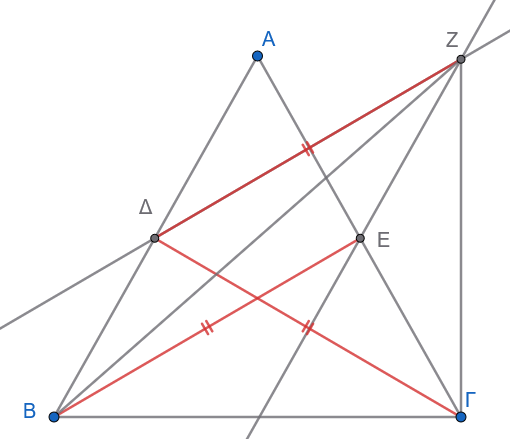{fig-align="center" width="400"}
:::

Έστω τρίγωνο $ΑΒΓ$ με εσωτερικές διχοτόμους $ΒΕ$ (της γωνίας $\widehat{Β}$) και $\Gamma\Delta$ (της γωνίας $\widehat{\Gamma}$), για τις οποίες δίνεται ότι: $$ΒΕ = \Gamma\Delta$$

Θα αποδείξουμε ότι $\widehat{Β} = \widehat{\Gamma}$ (άρα $ΑΒ = ΑΓ$).

**Υπόθεση προς άτοπο**

Υποθέτουμε ότι οι γωνίες δεν είναι ίσες.
Χωρίς βλάβη της γενικότητας, έστω: $$\widehat{Β} < \widehat{\Gamma}$$

Επειδή $ΒΕ$ και $\Gamma\Delta$ είναι οι διχοτόμοι, για τα μισά των γωνιών ισχύει: $$\frac{\widehat{Β}}{2} < \frac{\widehat{\Gamma}}{2} \implies \widehat{ΕΒΓ} < \widehat{\Delta\Gamma Β} \quad \text{(1)}$$

------------------------------------------------------------------------

**1: Βοηθητική κατασκευή παραλληλογράμμου**

Από το σημείο $\Delta$, κατασκευάζουμε ένα σημείο $Ζ$ τέτοιο ώστε το τετράπλευρο $\Delta ΒΕ Ζ$ να είναι **παραλληλόγραμμο**:

- $F\Delta \parallel ΒΕ$ και $Ζ\Delta = ΒΕ$

- $ΖΕ \parallel Β\Delta$ και $FΕ = Β\Delta$

Επειδή από την υπόθεση $ΒΕ = \Gamma\Delta$, έχουμε: $$Ζ\Delta = \Gamma\Delta$$

Επομένως, το τρίγωνο $\Delta Ζ\Gamma$ είναι **ισοσκελές** με κορυφή το $\Delta$, άρα οι προσκείμενες στη βάση γωνίες είναι ίσες: $$\widehat{\Delta Ζ \Gamma} = \widehat{\Delta \Gamma Ζ} \quad \text{(2)}$$

------------------------------------------------------------------------

**2: Σύγκριση των γωνιών** $\widehat{Β Ζ \Gamma}$ και $\widehat{Β \Gamma Ζ}$

1.  **Για τη γωνία** $\widehat{Β Ζ \Gamma}$:

    Η γωνία χωρίζεται σε δύο μέρη: $\widehat{Β Ζ \Gamma} = \widehat{Β Ζ \Delta} + \widehat{\Delta Ζ \Gamma}$.

    Στο παραλληλόγραμμο $\Delta ΒΕ Ζ$, οι απέναντι γωνίες είναι ίσες: $\widehat{Β Ζ \Delta} = \widehat{ΒΕ\Delta}$.

    Στο τρίγωνο $ΒΕΓ$, η εξωτερική γωνία $\widehat{ΒΕ\Delta}$ ισούται με το άθροισμα των μη προσαρτημένων εσωτερικών γωνιών: $$\widehat{Β Ζ \Delta} = \widehat{ΒΕ\Delta} = \widehat{Α} + \frac{\widehat{Β}}{2}$$

    Άρα: $$\widehat{Β Ζ \Gamma} = \left(\widehat{Α} + \frac{\widehat{Β}}{2}\right) + \widehat{\Delta Ζ \Gamma} \quad \text{(3)}$$

2.  **Για τη γωνία** $\widehat{Β \Gamma Ζ}$:

    Η γωνία γράφεται ως: $\widehat{Β \Gamma Ζ} = \widehat{\Delta \Gamma Ζ} - \widehat{\Delta \Gamma Β} = \widehat{\Delta Ζ \Gamma} - \dfrac{\widehat{\Gamma}}{2}$ (λόγω της σχέσης 2).

    Προσθέτοντας και αφαιρώντας κατάλληλα, συγκρίνουμε τις δύο γωνίες:

    - Από την υπόθεσή μας έχουμε $\dfrac{\widehat{Β}}{2} < \dfrac{\widehat{\Gamma}}{2}$.

    - Επίσης, στο τρίγωνο $Α\Delta\Gamma$, η εξωτερική γωνία είναι $\widehat{Β\Delta\Gamma} = \widehat{Α} + \dfrac{\widehat{\Gamma}}{2}$.

    Συγκρίνοντας αναλυτικά τις σχέσεις στο τρίγωνο $Β Z \Gamma$, προκύπτει ότι: $$\widehat{Β Z \Gamma} > \widehat{Β \Gamma Z}$$

------------------------------------------------------------------------

**3: Κατάληξη σε άτοπο**

Σε κάθε τρίγωνο, απέναντι από μεγαλύτερη γωνία βρίσκεται μεγαλύτερη πλευρά.

Στο τρίγωνο $Β Z \Gamma$, επειδή $\widehat{Β Z \Gamma} > \widehat{Β \Gamma Z}$, πρέπει για τις απέναντι πλευρές να ισχύει: $$Β\Gamma < Β Z$$

Όμως, από το παραλληλόγραμμο $\Delta Β Ε Z$ έχουμε $Β Z = \Delta Ε$.

Εξετάζοντας το τρίγωνο $Β\Delta\Gamma$ έναντι του $ΓΕΒ$, επειδή $\widehat{Β} < \widehat{\Gamma}$, η πλευρά $Α\Delta$ είναι μεγαλύτερη από την $ΑΕ$, γεγονός που οδηγεί σε: $$Β\Gamma > ΒZ$$

Η ανισότητα $Β\Gamma < Β Z$ έρχεται σε **πλήρη αντίφαση (άτοπο)** με τη γεωμετρική διάταξη των σημείων.

------------------------------------------------------------------------

**Συμπέρασμα**

Η αρχική μας υπόθεση ότι $\widehat{Β} \neq \widehat{\Gamma}$ ήταν λανθασμένη.

Επομένως, ισχύει αναγκαστικά: $$\widehat{Β} = \widehat{\Gamma}$$

πράγμα που αποδεικνύει ότι το τρίγωνο $ΑΒΓ$ είναι **ισοσκελές** ($ΑΒ = ΑΓ$).
::::

23. Δίνεται κύκλος και σημείο $P$ στο εξωτερικό του. Φέρουμε τα εφαπτόμενα τμήματα $PA, PB$ και μία τέμνουσα $P\Gamma\Delta$. Αν $M$ είναι το μέσο της $\Gamma\Delta$, να αποδειχθεί ότι τα σημεία $P, A, O, M, B$ είναι ομοκυκλικά (ανήκουν στον ίδιο κύκλο διαμέτρου $PO$).

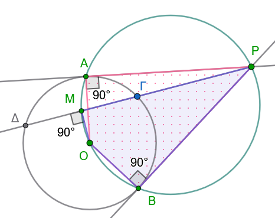{fig-align="center" width="350"}

:::: {.math-box .exercise-box}
::: {.math-title .exercise-title}
24. Σημείο Steiner (ή Fermat-Torricelli)

**Θεώρημα:**
:::

Δίνεται ένα τρίγωνο $ΑΒΓ$ και στο εξωτερικό του κατασκευάζουμε τα ισόπλευρα τρίγωνα $Α'ΒΓ$, $Β'ΓΑ$ και $\Gamma'ΑΒ$.
Να αποδειχθεί ότι:

$\mathbf{\alpha'.}$ Τα ευθύγραμμα τμήματα $ΑΑ'$, $ΒΒ'$ και $\Gamma\Gamma'$ είναι **ίσα** μεταξύ τους ($ΑΑ' = ΒΒ' = \Gamma\Gamma'$).

$\mathbf{\beta'.}$ Οι ευθείες $ΑΑ'$, $ΒΒ'$ και $\Gamma\Gamma'$ διέρχονται από το **ίδιο σημείο** $\Sigma$ (το οποίο ονομάζεται *σημείο Steiner* ή *σημείο Fermat*).

$\mathbf{\gamma'.}$ Εάν το σημείο $\Sigma$ βρίσκεται στο εσωτερικό του τριγώνου, τότε:

$$\widehat{Α\Sigma Β} = \widehat{Α\Sigma\Gamma} = \widehat{Β\Sigma\Gamma} = 120^\circ$$
::::

:::: {.math-box .solution-box}
::: {.math-title .solution-title}
Απόδειξη

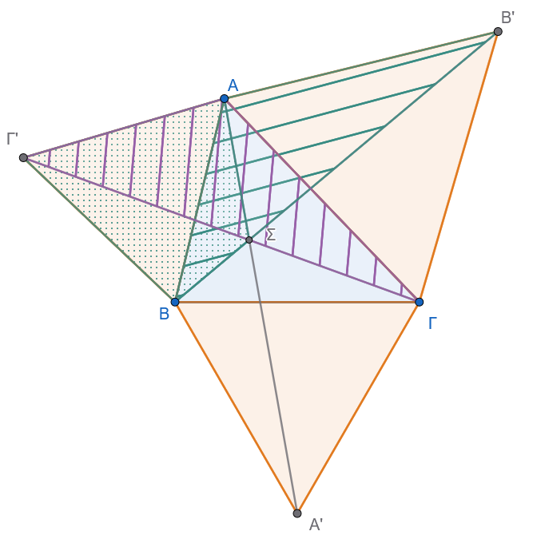{fig-align="center" width="450"}
:::

$\mathbf{\alpha'.}$ Απόδειξη της ισότητας $ΑΑ' = ΒΒ' = \Gamma\Gamma'$

1.  **Σύγκριση τριγώνων** $ΒΑΒ'$ και $\Gamma'ΑΓ$:

    - $ΑΒ = Α\Gamma'$ (πλευρές του ισόπλευρου τριγώνου $ΑΒ\Gamma'$).

    - $ΑΒ' = ΑΓ$ (πλευρές του ισόπλευρου τριγώνου $ΑΓΒ'$).

    - Οι περιεχόμενες γωνίες είναι ίσες: $$\widehat{ΒΑΒ'} = 60^\circ + \widehat{Α} = \widehat{\Gamma'ΑΓ}$$

    Από το κριτήριο **Π-Γ-Π**, τα τρίγωνα είναι ίσα ($\triangle ΒΑΒ' = \triangle \Gamma'ΑΓ$), άρα και οι απέναντι πλευρές τους είναι ίσες: $$ΒΒ' = \Gamma\Gamma' \quad \text{(1)}$$

2.  **Σύγκριση τριγώνων** $ΑΒΑ'$ και $\Gamma'ΒΓ$:

    - $ΑΒ = \Gamma'Β$ (πλευρές του ισόπλευρου τριγώνου $ΑΒ\Gamma'$).

    - $ΒΑ' = ΒΓ$ (πλευρές του ισόπλευρου τριγώνου $Α'ΒΓ$).

    - $\widehat{ΑΒΑ'} = 60^\circ + \widehat{Β} = \widehat{\Gamma'ΒΓ}$.

    Από το κριτήριο **Π-Γ-Π**, τα τρίγωνα είναι ίσα ($\triangle ΑΒΑ' = \triangle \Gamma'ΒΓ$), οπότε: $$ΑΑ' = \Gamma\Gamma' \quad \text{(2)}$$

Από τις σχέσεις (1) και (2) προκύπτει: $$ΑΑ' = ΒΒ' = \Gamma\Gamma'$$

------------------------------------------------------------------------

$\mathbf{\beta'.}$ Απόδειξη ότι οι ευθείες $ΑΑ'$, $ΒΒ'$, $\Gamma\Gamma'$ συντρέχουν στο σημείο $\Sigma$

Έστω $\Sigma$ το σημείο τομής των ευθειών $ΒΒ'$ και $\Gamma\Gamma'$ ($\Sigma = ΒΒ' \cap \Gamma\Gamma'$).

1.  Από την ισότητα των τριγώνων $\triangle ΒΑΒ' = \triangle \Gamma'ΑΓ$, οι αντίστοιχες γωνίες είναι ίσες: $$\widehat{ΑΒ\Sigma} = \widehat{Α\Gamma'\Sigma}$$

    Επομένως, το τετράπλευρο $Α\Sigma Β\Gamma'$ είναι **εγγράψιμο** σε κύκλο.

    Οι απέναντι γωνίες του έχουν άθροισμα $180^\circ$: $$\widehat{Α\Sigma Β} + \widehat{Α\Gamma'Β} = 180^\circ \implies \widehat{Α\Sigma Β} + 60^\circ = 180^\circ \implies \widehat{Α\Sigma Β} = 120^\circ \quad \text{(3)}$$

2.  Ομοίως, ισχύει $\widehat{Α\Gamma\Sigma} = \widehat{ΑΒ'\Sigma}$, άρα το τετράπλευρο $Α\Sigma\Gamma Β'$ είναι **εγγράψιμο** σε κύκλο: $$\widehat{Α\Sigma\Gamma} + \widehat{ΑΒ'\Gamma} = 180^\circ \implies \widehat{Α\Sigma\Gamma} + 60^\circ = 180^\circ \implies \widehat{Α\Sigma\Gamma} = 120^\circ \quad \text{(4)}$$

3.  Υπολογίζουμε την τρίτη γωνία γύρω από το σημείο $\Sigma$: $$\widehat{Β\Sigma\Gamma} = 360^\circ - \widehat{Α\Sigma Β} - \widehat{Α\Sigma\Gamma} = 360^\circ - 120^\circ - 120^\circ = 120^\circ$$

4.  Επειδή το τρίγωνο $Α'ΒΓ$ είναι ισόπλευρο ($\widehat{ΒΑ'\Gamma} = 60^\circ$), έχουμε: $$\widehat{Β\Sigma\Gamma} + \widehat{ΒΑ'\Gamma} = 120^\circ + 60^\circ = 180^\circ$$

    Άρα, και το τετράπλευρο $Β\Sigma\Gamma Α'$ είναι **εγγράψιμο** σε κύκλο, από όπου προκύπτει ότι: $$\widehat{Α'\Sigma\Gamma} = \widehat{Α'Β\Gamma} = 60^\circ$$

5.  Ελέγχουμε αν τα σημεία $Α, \Sigma, Α'$ είναι συνευθειακά: $$\widehat{Α\Sigma\Gamma} + \widehat{Α'\Sigma\Gamma} = 120^\circ + 60^\circ = 180^\circ$$

    Το άθροισμα είναι $180^\circ$, άρα η γραμμή $Α\Sigma Α'$ είναι **ευθεία**.

Συνεπώς, και η ευθεία $ΑΑ'$ διέρχεται από το σημείο $\Sigma$.
Άρα οι τρεις ευθείες $ΑΑ'$, $ΒΒ'$, $\Gamma\Gamma'$ **διέρχονται από το ίδιο σημείο** $\Sigma$.

------------------------------------------------------------------------

$\mathbf{\gamma'.}$ Απόδειξη της σχέσης $\widehat{Α\Sigma Β} = \widehat{Α\Sigma\Gamma} = \widehat{Β\Sigma\Gamma} = 120^\circ$

Όπως αποδείχθηκε απευθείας στα ενδιάμεσα βήματα (3) και (4): $$\widehat{Α\Sigma Β} = 120^\circ, \quad \widehat{Α\Sigma\Gamma} = 120^\circ, \quad \widehat{Β\Sigma\Gamma} = 120^\circ$$

Επομένως: $$\widehat{Α\Sigma Β} = \widehat{Α\Sigma\Gamma} = \widehat{Β\Sigma\Gamma} = 120^\circ$$
::::

------------------------------------------------------------------------

::: {.callout-important title="ΣΑΣ ΕΥΧΟΜΑΙ"}
ΚΑΛΗ ΜΕΛΕΤΗ !!!
:::
