```{=html}
<!-- Φόρτωση βιβλιοθήκης GeoGebra -->
<script src="https://www.geogebra.org/apps/deployggb.js"></script>

<!-- Συνάρτηση δημιουργίας applets -->
<script>
function createGeoGebra(containerId, materialId, width = 700, height = 500) {
  var params = {
    "id": "ggb-" + containerId,
    "material_id": materialId,
    "width": width,
    "height": height,
    "showToolBar": true,
    "showMenuBar": false,
    "showAlgebraInput": true
  };
  
  var applet = new GGBApplet(params, '5.2');
  applet.inject(containerId);
}
</script>
```

## Γεωμετρικοί τόποι και γεωμετρικές κατασκευές με τη βοήθεια των γεωμετρικών τόπων

### Γεωμετρικοί Τόποι και Γεωμετρικές Κατασκευές

------------------------------------------------------------------------

#### Έννοια και Ορισμός του Γεωμετρικού Τόπου

:::: {.math-box .definition-box}
::: {.math-title .definition-title}
**Γεωμετρικός Τόπος**
:::

- **Γεωμετρικός Τόπος** ονομάζεται το σύνολο (ή σχήμα) όλων των σημείων του επιπέδου, τα οποία έχουν μία κοινή χαρακτηριστική ιδιότητα $F$.
::::

::: callout-method
- Για να αποδειχθεί ότι ένα σχήμα $\Sigma$ είναι ο γεωμετρικός τόπος των σημείων με την ιδιότητα $F$, απαιτείται η εξασφάλιση δύο συνθηκών:

  1.  **Ευθύ:** Κάθε σημείο που έχει την ιδιότητα $F$ ανήκει στο σχήμα $\Sigma$.

  2.  **Αντίστροφο:** Κάθε σημείο που ανήκει στο σχήμα $\Sigma$ έχει την ιδιότητα $F$ (ή ισοδύναμα, κάθε σημείο εκτός του $\Sigma$ δεν έχει την ιδιότητα $F$).
:::

------------------------------------------------------------------------

#### Βασικοί Θεμελιώδεις Γεωμετρικοί Τόποι

::: callout-sos
1.  **Κύκλος** $(O, R)$: Ο γεωμετρικός τόπος των σημείων του επιπέδου που απέχουν σταθερή απόσταση $R$ από ένα σταθερό σημείο $O$.

2.  **Μεσοκάθετος ευθύγραμμου τμήματος:** Ο γεωμετρικός τόπος των σημείων του επιπέδου που ισαπέχουν από τα άκρα $A$ και $B$ του τμήματος $AB$.

3.  **Διχοτόμος γωνίας:** Ο γεωμετρικός τόπος των εσωτερικών σημείων μιας γωνίας $\widehat{xOy}$ που ισαπέχουν από τις πλευρές της.

4.  **Μεσοπαράλληλος ευθεία / Δύο παράλληλες:**

    - Ο γεωμετρικός τόπος των σημείων που απέχουν σταθερή απόσταση $\upsilon$ από μια ευθεία $\epsilon$ αποτελείται από δύο ευθείες παράλληλες προς την $\epsilon$, εκατέρωθεν αυτής σε απόσταση $\upsilon$.
    - Ο γεωμετρικός τόπος των σημείων που ισαπέχουν από δύο παράλληλες ευθείες είναι η μεσοπαράλληλη ευθεία τους.

5.  **Κύκλος διαμέτρου** $AB$: Ο γεωμετρικός τόπος των σημείων του επιπέδου από τα οποία ένα σταθερό τμήμα $AB$ φαίνεται υπό ορθή γωνία ($90^\circ$) (χωρίς τα άκρα \$A, B\$).

6.  **Τόξο που δέχεται σταθερή γωνία** $\phi$: Ο γεωμετρικός τόπος των σημείων από τα οποία σταθερό τμήμα $AB$ φαίνεται υπό γωνία $\phi$ αποτελείται από δύο τόξα κύκλων ίσης ακτίνας με κοινή χορδή το $AB$, συμμετρικά ως προς την ευθεία $AB$ (χωρίς τα άκρα $A, B$).
:::

------------------------------------------------------------------------

#### Γεωμετρικές Κατασκευές με τη Βοήθεια των Γεωμετρικών Τόπων

:::: {.math-box .definition-box}
::: {.math-title .definition-title}
**Γεωμετρική Κατασκευή:**
:::

- **Γεωμετρική Κατασκευή:**Ονομάζεται η σχεδίαση ενός γεωμετρικού σχήματος με τη αποκλειστική χρήση των οργάνων: κανόνα (χωρίς υποδιαιρέσεις) και διαβήτη.
::::

::: callout-method
- **Μέθοδος των Γεωμετρικών Τόπων:** Όταν ένα πρόβλημα ανάγεται στον προσδιορισμό ενός αγνώστου σημείου $M$, αναζητούμε δύο ανεξάρτητες ιδιότητες τις οποίες πρέπει να πληροί το $M$ σύμφωνα με τα δεδομένα.

  Η πρώτη ιδιότητα ορίζει έναν γεωμετρικό τόπο $T_1$ και η δεύτερη έναν γεωμετρικό τόπο $T_2$.

  Το ζητούμενο σημείο $M$ προσδιορίζεται ως η τομή των δύο γεωμετρικών τόπων ($M = T_1 \cap T_2$).
:::

##### Τα 4 Στάδια Επίλυσης ενός Προβλήματος Κατασκευής:

::: callout-sos
1.  **Ανάλυση:** Υποθέτουμε το πρόβλημα λυμένο, σχεδιάζουμε ένα βοηθητικό σχήμα και αναλύουμε τις ιδιότητες των στοιχείων του ώστε να αναγάγουμε την κατασκευή στον προσδιορισμό σημείων μέσω της τομής γεωμετρικών τόπων.

2.  **Σύνθεση (ή Κατασκευή):** Περιγράφουμε τη διαδοχική εκτέλεση των βημάτων κατασκευής με τον κανόνα και τον διαβήτη.

3.  **Απόδειξη:** Αποδεικνύουμε αυστηρά ότι το σχήμα που κατασκευάστηκε ικανοποιεί όλες τις απαιτήσεις και τα δεδομένα του προβλήματος.

4.  **Διερεύνηση:** Εξετάζουμε τις συνθήκες κάτω από τις οποίες το πρόβλημα έχει λύση, το πλήθος των δυνατών λύσεων (ανάλογα με τον αριθμό των σημείων τομής των γεωμετρικών τόπων) ή αν είναι αδύνατο.
:::

------------------------------------------------------------------------

### Εφαρμογές (Λυμένες Ασκήσεις / Παραδείγματα)

:::: {.math-box .example-box}
::: {.math-title .example-title}
**Εφαρμογή 1**
:::

**Εκφώνηση:** Να κατασκευαστεί τρίγωνο $ABΓ$ του οποίου δίνονται η πλευρά $BΓ = a$, το ύψος $AH = \upsilon_a$ και η γωνία της κορυφής $\widehat{A} = \omega$.
::::

:::: {.math-box .examplesolution-box}
::: {.math-title .examplesolution-title}
Απάντηση

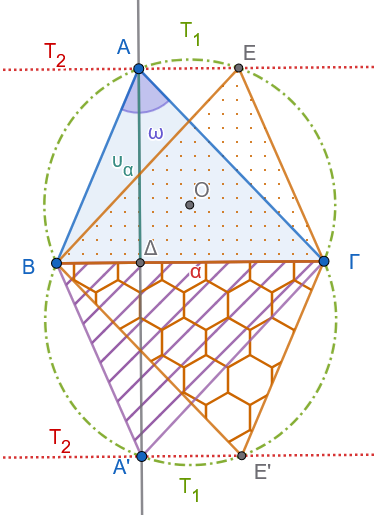{fig-align="center" width="300"}
:::

- **Ανάλυση:** Έστω $ABΓ$ το ζητούμενο τρίγωνο.
  Θεωρούμε τη βάση $BΓ = a$ σταθερή.
  Η κορυφή $A$ πρέπει να πληροί δύο ιδιότητες:

  1.  Βλέπει το τμήμα $BΓ$ υπό γνωστή γωνία $\omega$, άρα ανήκει στον γεωμετρικό τόπο $T_1$, που είναι τα δύο συμμετρικά τόξα με χορδή $BΓ$ τα οποία δέχονται γωνία $\omega$.

  2.  Απέχει από τη βάση $BΓ$ γνωστή απόσταση $\upsilon_a$, άρα ανήκει στον γεωμετρικό τόπο $T_2$, που είναι οι δύο ευθείες $\epsilon, \epsilon'$ παράλληλες προς τη $BΓ$ σε απόσταση $\upsilon_a$.
      Επομένως, η κορυφή $A$ προσδιορίζεται ως η τομή των $T_1$ και $T_2$ ($A = T_1 \cap T_2$).

- **Σύνθεση:**

  1.  Σχεδιάζουμε τμήμα $BΓ = a$.

  2.  Κατασκευάζουμε τα τόξα $T_1$ με χορδή $BΓ$ που δέχονται γωνία $\omega$.

  3.  Φέρουμε ευθεία $\epsilon \parallel BΓ$ σε απόσταση $\upsilon_a$.

  4.  Η ευθεία $\epsilon$ τέμνει το τόξο $T_1$ στο σημείο $A$.
      Ενώνουμε τα $AB$ και $AΓ$.

- **Απόδειξη:** Το τρίγωνο $ABΓ$ έχει πλευρά $BΓ = a$, ύψος $AH = \upsilon_a$ (αφού $A \in \epsilon$) και γωνία $\widehat{A} = \omega$ (αφού $A \in T_1$).

- **Διερεύνηση:** Αν η παράλληλη ευθεία τέμνει τα τόξα, υπάρχουν λύσεις (οι οποίες λόγω συμμετρίας είναι ισοδύναμες).
  Αν η απόσταση $\upsilon_a$ είναι μεγαλύτερη από το βέλος του τόξου, το πρόβλημα είναι αδύνατο.
::::

------------------------------------------------------------------------

:::: {.math-box .example-box}
::: {.math-title .example-title}
**Εφαρμογή 2**
:::

**Εκφώνηση:** Να βρεθεί ο γεωμετρικός τόπος των κέντρων των κύκλων που διέρχονται από δύο σταθερά σημεία $A$ και $B$.
::::

:::: {.math-box .examplesolution-box}
::: {.math-title .examplesolution-title}
Απάντηση

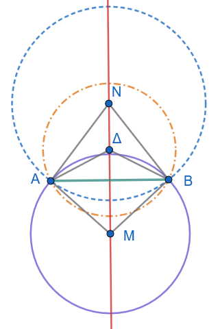{fig-align="center" width="280"}
:::

- *Ευθύ:* Έστω $M$ το κέντρο ενός κύκλου που διέρχεται από τα $A$ και $B$.
  Τότε τα τμήματα $MA$ και $MB$ είναι ακτίνες του ίδιου κύκλου, άρα $MA = MB$.
  Συνεπώς, το σημείο $M$ ισαπέχει από τα $A$ και $B$, οπότε ανήκει στη μεσοκάθετο ευθεία $\epsilon$ του τμήματος $AB$.

- *Αντίστροφο:* Έστω $N$ ένα τυχαίο σημείο της μεσοκαθέτου $\epsilon$ του τμήματος $AB$.
  Από την ιδιότητα της μεσοκαθέτου ισχύει $NA = NB$.
  Άρα ο κύκλος με κέντρο $N$ και ακτίνα $NA$ διέρχεται και από το σημείο $B$.

- *Συμπέρασμα:* Ο ζητούμενος γεωμετρικός τόπος είναι η μεσοκάθετος ευθεία του τμήματος $AB$.
::::

------------------------------------------------------------------------

:::: {.math-box .example-box}
::: {.math-title .example-title}
**Εφαρμογή 3**
:::

**Εκφώνηση:** Να βρεθεί ο γεωμετρικός τόπος των μέσων των χορδών δοσμένου κύκλου $(O, R)$ οι οποίες διέρχονται από σταθερό εσωτερικό σημείο $A$ του κύκλου.
::::

:::: {.math-box .examplesolution-box}
::: {.math-title .examplesolution-title}
Απάντηση

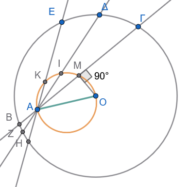{fig-align="center" width="300"}
:::

- Έστω $B Γ$ μια τυχαία χορδή του κύκλου $(O, R)$ που διέρχεται από το σταθερό σημείο $A$, και $M$ το μέσο της.

- Από τη θεωρία του κύκλου, το απόστημα $OM$ είναι κάθετο στη χορδή $BΓ$ στο μέσο της $M$, δηλαδή $\widehat{OMA} = 90^\circ$.

- Επειδή τα σημεία $O$ και $A$ είναι σταθερά, το μεταβλητό σημείο $M$ βλέπει το σταθερό τμήμα $OA$ υπό ορθή γωνία ($90^\circ$).

- Συνεπώς, το σημείο $M$ ανήκει στον κύκλο με διάμετρο $OA$.

- *Συμπέρασμα:* Ο γεωμετρικός τόπος των μέσων $M$ είναι ο κύκλος διαμέτρου $OA$ (που βρίσκεται ολόκληρος εντός του αρχικού κύκλου, αφού το $A$ είναι εσωτερικό σημείο).
::::

------------------------------------------------------------------------

:::: {.math-box .example-box}
::: {.math-title .example-title}
**Εφαρμογή 4**
:::

**Εκφώνηση:** Να κατασκευαστεί ορθογώνιο τρίγωνο $ABΓ$ ($\widehat{A} = 90^\circ$) όταν δίνονται η υποτείνουσα $BΓ = a$ και το ύψος προς την υποτείνουσα $AH = \upsilon_a$.
::::

:::: {.math-box .examplesolution-box}
::: {.math-title .examplesolution-title}
Απάντηση

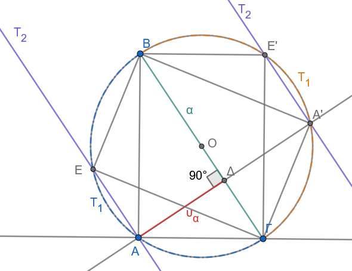{fig-align="center" width="400"}
:::

- **Ανάλυση:** Θεωρούμε την υποτείνουσα $BΓ = a$ σταθερή.
  Η ορθή κορυφή $A$ ικανοποιεί δύο συνθήκες:

  1.  Βλέπει το τμήμα $BΓ$ υπό ορθή γωνία ($90^\circ$), άρα ανήκει στον κύκλο διαμέτρου $BΓ$.

  2.  Απέχει από τη $BΓ$ απόσταση $\upsilon_a$, άρα ανήκει σε ευθεία $\epsilon \parallel BΓ$ σε απόσταση $\upsilon_a$.

- **Σύνθεση:**

  1.  Σχεδιάζουμε τμήμα $BΓ = a$ και το μέσο του $O$.

  2.  Γράφουμε τον κύκλο διαμέτρου $BΓ$, δηλαδή $(O, \dfrac{a}{2})$.

  3.  Φέρουμε παράλληλη ευθεία $\epsilon$ προς τη $BΓ$ σε απόσταση $\upsilon_a$.

  4.  Το σημείο τομής της ευθείας $\epsilon$ και του κύκλου είναι η κορυφή $A$.
      Ενώνουμε τα $AB$ και $AΓ$.

- **Απόδειξη:** Το τρίγωνο $ABΓ$ είναι ορθογώνιο στο $A$ (εγγεγραμμένη σε ημικύκλιο), με υποτείνουσα $BΓ = a$ και ύψος $AH = \upsilon_a$.

- **Διερεύνηση:** Το πρόβλημα έχει λύση αν και μόνο αν η ευθεία $\epsilon$ τέμνει τον κύκλο, δηλαδή όταν $\upsilon_a \le \dfrac{a}{2}$ (ακτίνα του κύκλου).
  Αν $\upsilon_a > \dfrac{a}{2}$, το πρόβλημα είναι αδύνατο.
::::

------------------------------------------------------------------------

:::: {.math-box .example-box}
::: {.math-title .example-title}
**Εφαρμογή 5**
:::

**Εκφώνηση:** Δίνονται δύο ευθείες $\delta, \epsilon$ και δύο ευθύγραμμα τμήματα $\lambda, \mu$.
Να βρεθεί σημείο $O$ που απέχει απόσταση $\lambda$ από την ευθεία $\delta$ και απόσταση $\mu$ από την ευθεία $\epsilon$.
::::

:::: {.math-box .examplesolution-box}
::: {.math-title .examplesolution-title}
Απάντηση
:::

**1. Γεωμετρικοί Τόποι**

Για να προσδιοριστεί το σημείο $O$, εξετάζουμε δύο ανεξάρτητους γεωμετρικούς τόπους:

1.  **1ος Γεωμετρικός Τόπος (**$T_1$): Τα σημεία που απέχουν απόσταση $\lambda$ από την ευθεία $\delta$ ανήκουν στις ευθείες $\delta_1, \delta_2$ που είναι παράλληλες προς τη $\delta$ σε απόσταση $\lambda$ εκατέρωθεν αυτής ($T_1 = \delta_1 \cup \delta_2$).

2.  **2ος Γεωμετρικός Τόπος (**$T_2$): Τα σημεία που απέχουν απόσταση $\mu$ από την ευθεία $\epsilon$ ανήκουν στις ευθείες $\epsilon_1, \epsilon_2$ που είναι παράλληλες προς την $\epsilon$ σε απόσταση $\mu$ εκατέρωθεν αυτής ($T_2 = \epsilon_1 \cup \epsilon_2$).

Τα ζητούμενα σημεία $O$ είναι τα σημεία τομής των δύο γεωμετρικών τόπων: $$O \in (\delta_1 \cup \delta_2) \cap (\epsilon_1 \cup \epsilon_2)$$

------------------------------------------------------------------------

<iframe src="https://www.geogebra.org/calculator/rspm7jwm?embed" width="730" height="600" allowfullscreen style="border: 1px solid #e4e4e4;border-radius: 4px;" frameborder="0">

</iframe>

> > Αλλάξτε την τιμή των δρομέων λ και μ (μεταβολή των μηκών λ και μ)

> > Από τα Α και Β αλλάζετε την θέση της δ.

> > Από τα Γ και Δ αλλάζετε την θέση της ε.

> > Κάντε διερεύνηση σύμφωνα με τα παρακάτω.

**2. Πλήρης Διερεύνηση**

Το πλήθος των δυνατών λύσεων εξαρτάται από τη σχετική θέση των αρχικών ευθειών $\delta$ και $\epsilon$:

**Περίπτωση Α: Οι ευθείες** $\delta$ και $\epsilon$ τέμνονται ($\delta \nparallel \epsilon$)

Αν οι ευθείες $\delta$ και $\epsilon$ σχηματίζουν γωνία $\omega \in (0^\circ, 180^\circ)$:

- Η ευθεία $\delta_1$ τέμνει τις ευθείες $\epsilon_1, \epsilon_2$ σε **2 σημεία**.

- Η ευθεία $\delta_2$ τέμνει τις ευθείες $\epsilon_1, \epsilon_2$ σε άλλα **2 σημεία**.

- **Συμπέρασμα:** Το πρόβλημα έχει πάντοτε **ακριβώς 4 διακριτές λύσεις** ($O_1, O_2, O_3, O_4$), οι οποίες αποτελούν τις κορυφές ενός παραλληλογράμμου.

- *Ειδική Περίπτωση Α1 (*$\delta \perp \epsilon$): Αν οι ευθείες είναι κάθετες ($\omega = 90^\circ$), τα 4 σημεία σχηματίζουν **ορθογώνιο παραλληλόγραμμο** (και αν επιπλέον $\lambda = \mu$, σχηματίζουν **τετράγωνο**).

------------------------------------------------------------------------

**Περίπτωση Β: Οι ευθείες** $\delta$ και $\epsilon$ είναι παράλληλες ($\delta \parallel \epsilon$) Έστω $d = d(\delta, \epsilon)$ η μεταξύ τους απόσταση.
Εφόσον $\delta \parallel \epsilon$, όλες οι ευθείες $\delta_1, \delta_2, \epsilon_1, \epsilon_2$ είναι παράλληλες μεταξύ τους.

- **Β1. Αν** $d = \lambda + \mu$:

  Μία από τις ευθείες του $T_1$ ταυτίζεται με μία από τις ευθείες του $T_2$ (συμπίπτουν στη μεσοπαράλληλη ευθεία ανάμεσα στις $\delta$ και $\epsilon$).

  - **Συμπέρασμα:** **Άπειρες λύσεις** (όλα τα σημεία της κοινής αυτής ευθείας).

- **Β2. Αν** $d = |\lambda - \mu|$ (με $\lambda \neq \mu$):

  Μία ευθεία του $T_1$ ταυτίζεται με μία ευθεία του $T_2$ εξωτερικά των παράλληλων ευθειών.

  - **Συμπέρασμα:** **Άπειρες λύσεις** (όλα τα σημεία της κοινής αυτής ευθείας).

- **Β3. Αν** $d = 0$ (οι ευθείες $\delta$ και $\epsilon$ ταυτίζονται):

  - Αν $\lambda = \mu$: Οι δύο γεωμετρικοί τόποι ταυτίζονται πλήρως.
    **Άπειρες λύσεις** (όλα τα σημεία των δύο ευθειών).

  - Αν $\lambda \neq \mu$: Οι ευθείες του $T_1$ και $T_2$ είναι όλες διακριτές και παράλληλες.
    **Καμία λύση** (0 λύσεις, αδύνατο).

- **Β4. Σε κάθε άλλη τιμή του** $d$ ($d \neq \lambda + \mu$ και $d \neq |\lambda - \mu|$):

  Καμία από τις ευθείες του $T_1$ δεν ταυτίζεται με ευθεία του $T_2$.
  Επειδή είναι όλες παράλληλες μεταξύ τους, δεν τέμνονται πουθενά.

  - **Συμπέρασμα:** **Καμία λύση** (0 λύσεις, αδύνατο).

------------------------------------------------------------------------

**Συνοπτικός Πίνακας Διερεύνησης**

$$\begin{array}{|c|c|c|}
\hline
\textbf{Σχετική Θέση } \delta, \epsilon & \textbf{Συνθήκη Αποστάσεων} & \textbf{Πλήθος Λύσεων} \\
\hline
\delta \nparallel \epsilon & \text{Οποιαδήποτε } \lambda, \mu & \mathbf{4 \text{ σημεία (λύσεις)}} \\
\hline
\delta \parallel \epsilon & d = \lambda + \mu \quad \text{ή} \quad d = |\lambda - \mu| & \mathbf{\text{Άπειρες λύσεις (1 ευθεία)}} \\
\hline
\delta = \epsilon & \lambda = \mu & \mathbf{\text{Άπειρες λύσεις (2 ευθείες)}} \\
\hline
\delta \parallel \epsilon & d \neq \lambda + \mu \quad \text{και} \quad d \neq |\lambda - \mu| & \mathbf{0 \text{ λύσεις (Αδύνατο)}} \\
\hline
\end{array}$$
::::

------------------------------------------------------------------------

:::: {.math-box .example-box}
::: {.math-title .example-title}
**Εφαρμογή 6**
:::

**Εκφώνηση:** Δίνεται σημείο $K$, ευθεία $\epsilon$ και δύο ευθύγραμμα τμήματα $\lambda, \mu$.
Να βρεθεί σημείο $O$ που απέχει απόσταση $\lambda$ από το σημείο $K$ και απόσταση $\mu$ από την ευθεία $\epsilon$.
::::

:::: {.math-box .examplesolution-box}
::: {.math-title .examplesolution-title}
Απάντηση

<iframe src="https://www.geogebra.org/calculator/xgzynnd3?embed" width="730" height="600" allowfullscreen style="border: 1px solid #e4e4e4;border-radius: 4px;" frameborder="0">

</iframe>
:::

> > Αλλάξτε την τιμή των δρομέων μ και λ (μεταβολή των μηκών των τμημάτων)

> > Κάντε διερεύνηση.
> > Ποια πρέπει να είναι η σχέση των μηκών ων τμημάτων και των αποστάσεων $s_1$ και $s_2$ για να υπάρχουν λύσεις.

> > Πόσες λύσεις υπάρχουν;

- *1ος Γεωμετρικός Τόπος:* Τα σημεία που απέχουν απόσταση $\lambda$ από το σταθερό σημείο $K$ ανήκουν στον κύκλο $(K, \lambda)$.

- *2ος Γεωμετρικός Τόπος:* Τα σημεία που απέχουν απόσταση $\mu$ από την ευθεία $\epsilon$ ανήκουν στις δύο παράλληλες ευθείες $\epsilon_1, \epsilon_2$ που απέχουν απόσταση $\mu$ εκατέρωθεν της $\epsilon$.

- *Προσδιορισμός:* Το ζητούμενο σημείο $O$ είναι η τομή του κύκλου $(K, \lambda)$ με τις παράλληλες ευθείες $\epsilon_1$ και $\epsilon_2$ ($O \in (K, \lambda) \cap (\epsilon_1 \cup \epsilon_2)$).
::::

------------------------------------------------------------------------

### Ασκήσεις

1.  **Άσκηση 1:** Να βρεθεί ο γεωμετρικός τόπος των κορυφών $A$ των τριγώνων $ABΓ$ που έχουν σταθερή τη βάση $BΓ = a$ και τη διάμεσο $AM = μ_a$ γνωστού μήκους.

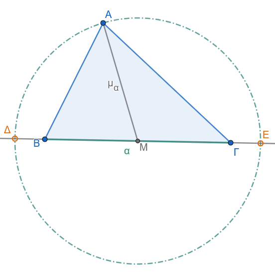{fig-align="center" width="400"}

2.  **Άσκηση 2:** Δίνεται κύκλος $(O, R)$ και $N$ τυχαίο σημείο του. Αν στην προέκταση της $ON$ παίρνουμε σημείο $M$ τέτοιο ώστε $ON = NM$, να βρεθεί ο γεωμετρικός τόπος του σημείου $M$ όταν το $N$ διαγράφει τον κύκλο.

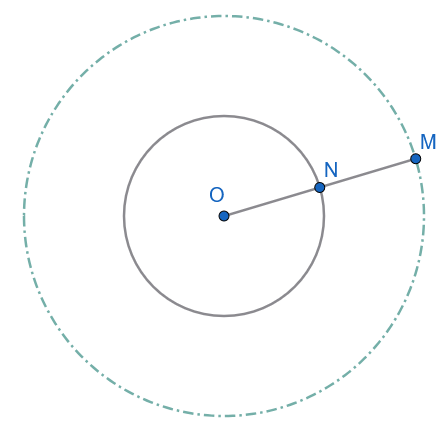{fig-align="center" width="350"}

3.  **Άσκηση 3:** Να κατασκευαστεί τρίγωνο $ABΓ$ όταν δίνονται η πλευρά $BΓ = a$, η γωνία $\widehat{B} = \phi$ και το άθροισμα των δύο άλλων πλευρών $AB + AΓ = \lambda$.

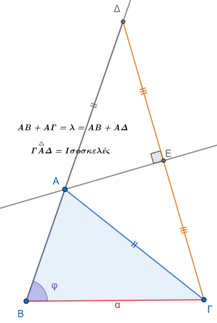{fig-align="center" width="350"}

:::: {.math-box .exercise-box}
::: {.math-title .exercise-title}
4.  **Άσκηση 4:**
:::

Έχουμε έναν κύκλο $(c)$ με κέντρο $O$ και μία διάμετρό του $AB$.
Από ένα τυχαίο σημείο $\Gamma$ του κύκλου φέρνουμε την κάθετο $\Gamma\Delta$ προς τη διάμετρο $AB$.
Στην προέκταση του ευθύγραμμου τμήματος $\Gamma O$ (πέρα από το $O$), παίρνουμε ένα σημείο $M$ τέτοιο, ώστε: $$OM = O\Delta$$

**Ζητούμενο:** Να βρεθεί ο γεωμετρικός τόπος του σημείου $M$, καθώς το σημείο $\Gamma$ κινείται πάνω στον κύκλο.
::::

:::: {.math-box .solution-box}
::: {.math-title .solution-title}
**Υπόδειξη & Λύση**

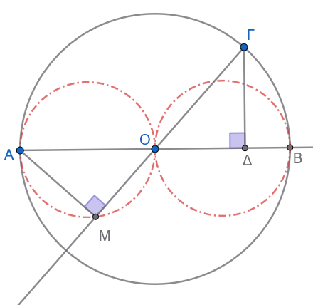{fig-align="center" width="350"}
:::

1.  **Βασικά στοιχεία και χαρακτηριστικές θέσεις:**

    - Το κινούμενο σημείο που ορίζει τα υπόλοιπα είναι το σημείο $\Gamma$.

    - Δεν υπάρχουν οριακές θέσεις, αφού το $\Gamma$ κινείται σε κλειστή γραμμή (κύκλο).

    - Χαρακτηριστικές θέσεις του σημείου $\Gamma$ είναι τα άκρα $A, B$ της διαμέτρου, καθώς και τα άκρα $E, Z$ της διαμέτρου που είναι κάθετη στην $AB$.

2.  **Διερεύνηση κίνησης:**

    - Θεωρούμε ότι το σημείο $\Gamma$ κινείται στο τεταρτημόριο (τόξο) $BE$.

    - Παρατηρούμε ότι:

      - Όταν το $\Gamma$ πλησιάζει το $B$ ($\Gamma \to B$), τότε $\Delta \to B$, οπότε $OM = OB = OA$, άρα το σημείο $M$ πλησιάζει το $A$ ($M \to A$).

      - Όταν το $\Gamma$ πλησιάζει το $E$ ($\Gamma \to E$), τότε το ίχνος της καθέτου $\Delta$ πλησιάζει το κέντρο $O$ ($\Delta \to O$), οπότε $OM = 0$ και άρα το σημείο $M$ πλησιάζει το $O$ ($M \to O$).

3.  **Απόδειξη σταθερής γωνίας:**

    - Συγκρίνουμε τα τρίγωνα $AMO$ και $\Gamma\Delta O$:

      - $OM = O\Delta$ (από την υπόθεση)

      - $OA = O\Gamma = R$ (ακτίνες του κύκλου)

      - $\widehat{AOM} = \widehat{\Gamma O\Delta}$ (ως κατακορυφήν γωνίες)

    - Επομένως, τα τρίγωνα $AMO$ και $\Gamma\Delta O$ είναι **ίσα** (από το κριτήριο Πλευρά-Γωνία-Πλευρά).

    - Από την ισότητα των τριγώνων προκύπτει ότι οι αντίστοιχες γωνίες είναι ίσες: $$\widehat{AMO} = \widehat{\Gamma\Delta O} = 90^\circ \text{ (1 ορθή)}$$

------------------------------------------------------------------------

**Συμπέρασμα**

Επειδή η γωνία $\widehat{AMO}$ παραμένει πάντοτε ορθή ($90^\circ$) και το τμήμα $AO$ είναι σταθερό (ακτίνα του αρχικού κύκλου):

- Το σημείο $M$ «βλέπει» το σταθερό τμήμα $AO$ υπό ορθή γωνία.

- Επομένως, καθώς το $\Gamma$ διαγράφει τον αρχικό κύκλο, ο **γεωμετρικός τόπος του σημείου** $M$ είναι ο **κύκλος (ή οι κύκλοι) με διάμετρο το σταθερό τμήμα** $AO$ (και αντίστοιχα με διάμετρο το $OB$).
::::

:::: {.math-box .exercise-box}
::: {.math-title .exercise-title}
5.  **Άσκηση 5:**
:::

**Εκφώνηση:** Δίνεται γωνία $\widehat{xOy}$ και σημείο $A$ στο εσωτερικό της.
Να κατασκευαστεί ευθύγραμμο τμήμα $BΓ$ με άκρα $B \in Ox$ και $Γ \in Oy$, το οποίο να διχοτομείται από το σημείο $A$ (δηλαδή το $A$ να είναι το μέσο του $BΓ$).
::::

:::: {.math-box .solution-box}
::: {.math-title .solution-title}
**Αναλυτική Λύση**
:::

**1. Ανάλυση**

Έστω ότι το πρόβλημα έχει λυθεί, δηλαδή έχουμε κατασκευάσει το ευθύγραμμο τμήμα $BΓ$ με $B \in Ox$ και $Γ \in Oy$, τέτοιο ώστε το σημείο $A$ να είναι το μέσο του ($AB = AΓ$).

- **Σκεπτικό Κεντρικής Συμμετρίας:**

  - Εφόσον το $A$ είναι το μέσο του $BΓ$, το σημείο $B$ είναι το **συμμετρικό** του σημείου $Γ$ ως προς κέντρο συμμετρίας το $A$.

  - Επειδή το σημείο $Γ$ ανήκει στην ημιευθεία $Oy$, το συμμετρικό του σημείο $B$ πρέπει να ανήκει στο συμμετρικό σχήμα της ημιευθείας $Oy$ ως προς το κέντρο $A$.

  - Έστω $Oy'$ η συμμετρική ημιευθεία της $Oy$ ως προς κέντρο $A$.
    Τότε το σημείο $B$ ανήκει στην $Oy'$.

  - Επιπλέον, από τα δεδομένα της εκφώνησης, το σημείο $B$ ανήκει στην ημιευθεία $Ox$.

  - Επομένως, το σημείο $B$ προσδιορίζεται ως το σημείο τομής της ημιευθείας $Ox$ με τη συμμετρική ημιευθεία $Oy'$: $$B = Ox \cap Oy'$$

  - Αφού προσδιοριστεί το σημείο $B$, το σημείο $Γ$ ορίζεται ως η τομή της ευθείας $BA$ με την ημιευθεία $Oy$.

------------------------------------------------------------------------

**2. Σύνθεση (Κατασκευή)**

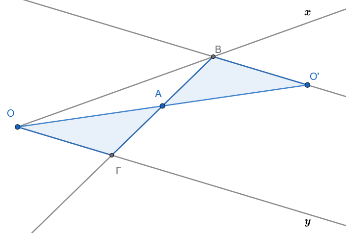{fig-align="center" width="450"}

1.  Θεωρούμε την κορυφή $O$ της γωνίας $\widehat{xOy}$ και κατασκευάζουμε το συμμετρικό της σημείο $O'$ ως προς κέντρο $A$ (στην προέκταση της $OA$ παίρνουμε τμήμα $AO' = OA$).

2.  Από το σημείο $O'$ φέρουμε ευθεία παράλληλη προς την ημιευθεία $Oy$.
    Η ευθεία αυτή είναι η συμμετρική της ευθείας $Oy$ ως προς το σημείο $A$.

3.  Η παράλληλη αυτή ευθεία τέμνει την ημιευθεία $Ox$ στο σημείο $B$.

4.  Φέρουμε την ευθεία $BA$, η οποία τέμνει την ημιευθεία $Oy$ στο σημείο $Γ$.

    To ευθύγραμμο τμήμα $BΓ$ είναι το ζητούμενο.

------------------------------------------------------------------------

**3. Απόδειξη**

Πρέπει να αποδείξουμε ότι το τμήμα $BΓ$ έχει τα άκρα του στις ημιευθείες $Ox, Oy$ και ότι το σημείο $A$ είναι το μέσο του.

- Από την κατασκευή, είναι $B \in Ox$ και $Γ \in Oy$.

- Συγκρίνουμε τα τρίγωνα $\triangle AOΓ$ και $\triangle A O' B$:

  1.  $OA = AO'$ (από την κατασκευή του συμμετρικού $O'$).

  2.  $\widehat{OAΓ} = \widehat{O'AB}$ ως κατακορυφήν γωνίες.

  3.  $\widehat{AOΓ} = \widehat{AO'B}$ ως εντός εναλλάξ γωνίες των παραλλήλων ευθειών $Oy \parallel O'B$ που τέμνονται από την ευθεία $OO'$.

- Σύμφωνα με το κριτήριο ισότητας τριγώνων **Γωνία - Πλευρά - Γωνία (Γ-Π-Γ)**, τα τρίγωνα $\triangle AOΓ$ και $\triangle AO'B$ είναι **ίσα**.

- Από την ισότητα αυτών των τριγώνων προκύπτει ότι οι αντίστοιχες πλευρές τους είναι ίσες: $$AB = AΓ$$

- Επομένως, το σημείο $A$ είναι πράγματι το μέσο του ευθύγραμμου τμήματος $BΓ$.

------------------------------------------------------------------------

**4. Διερεύνηση**

- Το σημείο $A$ βρίσκεται στο εσωτερικό της γωνίας $\widehat{xOy}$.

- Η συμμετρική ευθεία της $Oy$ ως προς το $A$ είναι παράλληλη προς την $Oy$ και βρίσκεται στο ημιεπίπεδο που ορίζει η $Oy$ και περιέχει την $Ox$.

- Επειδή οι ευθείες $Oy$ και $Ox$ τέμνονται στο $O$ (γωνία $\widehat{xOy} < 180^\circ$), η παράλληλη προς την $Oy$ τέμνει την ημιευθεία $Ox$ σε **ένα και μοναδικό σημείο** $B$.

- Συνεπώς, το πρόβλημα έχει **πάντοτε ακριβώς μία μοναδική λύση**.

------------------------------------------------------------------------

**Εναλλακτική Μέθοδος Κατασκευής (Μέθοδος Παραλληλογράμμου / Θαλή)**

Υπάρχει και ένας δεύτερος, πολύ κομψός τρόπος κατασκευής:

1.  Από το σημείο $A$ φέρουμε ευθεία παράλληλη προς την $Oy$, η οποία τέμνει την $Ox$ στο σημείο $Δ$.

2.  Στην ημιευθεία $Ox$ παίρνουμε τμήμα $OB = 2 \cdot OΔ$ (δηλαδή το $Δ$ γίνεται το μέσο του $OB$).

3.  Φέρουμε την ευθεία $BA$, η οποία τέμνει την $Oy$ στο σημείο $Γ$.

- **Απόδειξη:** Στο τρίγωνο $\triangle OBΓ$, το τμήμα $AΔ$ είναι παράλληλο προς τη βάση $OΓ$ ($AΔ \parallel OΓ$) και το $Δ$ είναι μέσο της $OB$.

Από το θεώρημα της διαμέσου / Θαλή, το τμήμα $AΔ$ συνδέει τα μέσα των πλευρών $OB$ και $BΓ$, συνεπώς το $A$ είναι το μέσο της $BΓ$.
::::

:::: {.math-box .exercise-box}
::: {.math-title .exercise-title}
6.  **Άσκηση 6:**
:::

Δίνεται τρίγωνο $AB\Gamma$ και ένα σημείο $\Delta$ που κινείται πάνω στην πλευρά $B\Gamma$.
Για κάθε θέση του $\Delta$ πάνω στην πλευρά $B\Gamma$, παίρνουμε τα σημεία $E$ και $Z$ πάνω στις ημιευθείες $BA$ και $\Gamma A$ αντίστοιχα, τέτοια ώστε: $$EB = E\Delta \quad \text{και} \quad Z\Gamma = Z\Delta$$

**Ζητούμενο:** Να βρεθεί ο γεωμετρικός τόπος του συμμετρικού σημείου $M$ του $\Delta$ ως προς την ευθεία $EZ$.
::::

:::: {.math-box .solution-box}
::: {.math-title .solution-title}
**Υπόδειξη & Λύση**
:::

1.  **Διερεύνηση οριακών θέσεων:**

    - Εξετάζοντας τις ακραίες (οριακές) θέσεις του σημείου $\Delta$ πάνω στο ευθύγραμμο τμήμα $B\Gamma$:

      - Όταν το $\Delta$ ταυτίζεται με το $B$ ($\Delta \to B$), τότε το συμμετρικό του σημείο είναι το $B$ ($M \to B$).

      - Όταν το $\Delta$ ταυτίζεται με το $\Gamma$ ($\Delta \to \Gamma$), τότε το συμμετρικό του σημείο είναι το $\Gamma$ ($M \to \Gamma$).

    - Άρα, τα σημεία $B$ και $\Gamma$ ανήκουν στον γεωμετρικό τόπο και αποτελούν τα όριά του.
      Αυτό υποδεικνύει ότι ο ζητούμενος γεωμετρικός τόπος είναι το **κυκλικό τόξο** $BM\Gamma$ (ή μέρος του περιγεγραμμένου κύκλου του τριγώνου $AB\Gamma$).

------------------------------------------------------------------------

2.  **Απόδειξη ότι οι γωνίες** $\widehat{BAΓ}$ και $\widehat{ΒMΓ}$ είναι ίσες

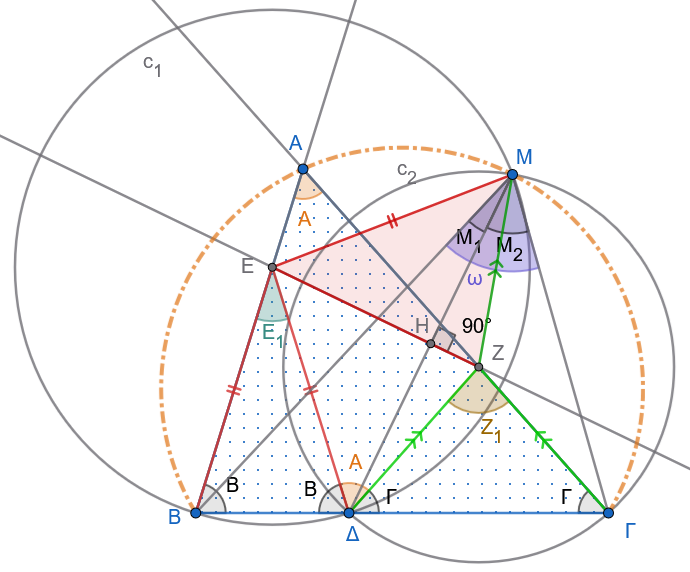{fig-align="center" width="450"}

- Επειδή το $M$ είναι το συμμετρικό του $\Delta$ ως προς την ευθεία $EZ$, τα τρίγωνα $EZ\Delta$ και $EZM$ είναι ίσα (συμμετρικά), οπότε: $$EB=ΕΔ =ΕΜ$$

Άρα το Ε είναι το περίκεντρο του τριγώνου $ΒΔΜ$ και η εγγεγραμμένη γωνία $Μ_1=\widehat{BMΔ}=\dfrac{\hat Ε_1}{2}  \ \ \ (1)$ της αντίστοιχης επίκεντρης $\hat E_1$

- Όμοια $$ΖΔ=ΖΓ=ΖΜ$$ και άρα το Ζ είναι το περίκεντρο του τριγώνου $ΜΔΓ$ και επομένως η εγγεγραμμένη γωνία $Μ_2=\widehat{ΖΜΓ}=\dfrac{\hat Z_1}{2} \ \ \ \  (2)$

- Προσθέτοντας τις (1) και (2) έχουμε $$\hat ω =\widehat{ΒΜΓ}=\hat M_1 +\hat M_2=\dfrac{\hat E_1+Z_1}{2} \ \ \ \ \ (3)$$

- Όμως από τα ισοσκελή τρίγωνα ΒΕΔ και ΔΖΓ έχουμε $\hat Ε_1=180^ο-2\hat Β$ και $\hat Ζ_1=180^ο-2\hat Γ$.

- Από τα παραπάνω η (3) γράφεται $$\hat ω=\dfrac{\hat E_1+Z_1}{2}=180^ο-(\hat Β+\hat Γ)=\hat A$$

------------------------------------------------------------------------

3.  **Σχέση των γωνιών** $\widehat{BAΓ}$ και $\widehat{ΒMΓ}$:

    - Η τελευταία σχέση μα λέει ότι το σταθερό τμήμα ΒΓ φαίνεται υπό σταθερή γωνία $\hat Α$, άρα ο γ.τ. είναι το τόξο $\overparen{ΒΑΜΓ}$ που βλέπει το τμήμα ΒΓ υπό σταθερή γωνία $\hatΑ$
::::

7.  **Άσκηση 7:** Να βρεθεί ο γεωμετρικός τόπος των ορθοκέντρων $H$ των τριγώνων $ABΓ$ που έχουν σταθερή τη βάση $BΓ$ και τη γωνία της κορυφής $\widehat{A} = \omega$ σταθερή.

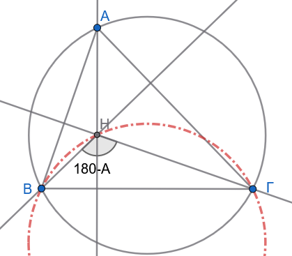{fig-align="center" width="350"}

**Υπόδειξη:**

> > > Η γωνία $\widehat{ΒΗΓ}=180^ο-\hat Α= \text {  Σταθερή }$ βλέπει το σταθερό τμήμα ΒΓ.

8.  **Άσκηση 8:** Να κατασκευαστεί τρίγωνο $ABΓ$ όταν δίνονται τα μήκη των τριών διαμέσων του $μ_a, μ_β, μ_γ$.

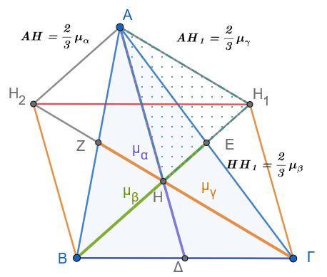{fig-align="center"}

**Υπόδειξη:**

> > > Κατασκευάζουμε τρίγωνο $ΑΗΗ_1$ με σταθερές πλευρές $ΑΗ=\dfrac{2}{3}μ_α$, $ΑΗ_1=\dfrac{2}{3}μ_γ$ και $ΗΗ_1=\dfrac{2}{3}μ_β$

> > > Σχεδιάζουμε τις παραλλήλους $ΑΗ_2$, $Η_2Γ$, $Η_1Γ$ και την προέκταση της $ΗΗ_1$ για να προσδιορίσουμε τις άλλες δύο κορυφές του τριγώνου ΑΒΓ.

9.  **Άσκηση 9:** Να βρεθεί ο γεωμετρικός τόπος των μέσων $M$ των ευθύγραμμων τμημάτων σταθερού μήκους $a$, των οποίων τα άκρα ολισθαίνουν πάνω στις πλευρές ορθής γωνίας $\widehat{xOy}$.

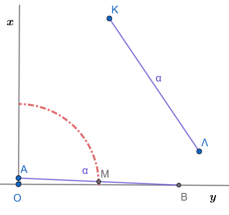{width="300"} 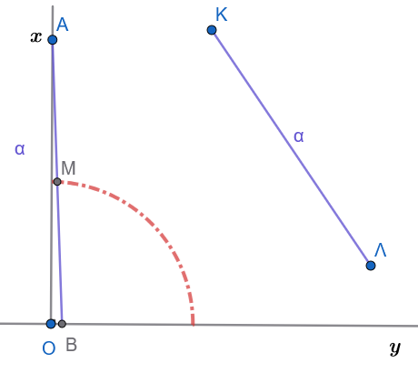{width="300"}

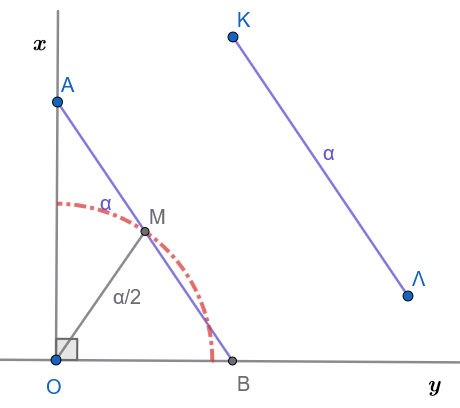{fig-align="center" width="400"}

**Υπόδειξη:**

> > > Το Μ κινείται πάντα σε σταθερή απόσταση $\dfrac{α}{2}$ από το σταθερό σημείο Ο.

:::: {.math-box .exercise-box}
::: {.math-title .exercise-title}
10. **Άσκηση 10:**
:::

Από ένα δοσμένο σημείο $A$, να αχθεί (να φερθεί) εφαπτομένη σε δοσμένο κύκλο $(O, R)$.
::::

:::: {.math-box .solution-box}
::: {.math-title .solution-title}
Λύση
:::

**1. Σύνθεση (Κατασκευή)**

1.  Ενώνουμε το κέντρο $O$ του κύκλου με το δοσμένο σημείο $A$ σχηματίζοντας το ευθύγραμμο τμήμα $OA$.

2.  Βρίσκουμε το μέσο $K$ του τμήματος $OA$.

3.  Με κέντρο το $K$ και διάμετρο το $OA$ (ακτίνα $KA = KO$), γράφουμε βοηθητικό κύκλο $(K)$, ο οποίος τέμνει τον αρχικό κύκλο $(O)$ σε ένα σημείο $B$ (και σε ένα σημείο $B'$).

4.  Φέρνουμε την ευθεία $AB$.
    Αυτή είναι η ζητούμενη εφαπτομένη.

------------------------------------------------------------------------

**2. Απόδειξη**

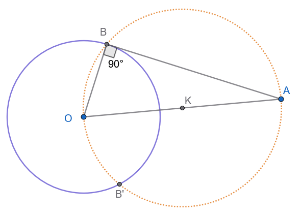{fig-align="center" width="400"}

- Αρκεί να αποδείξουμε ότι η ακτίνα $OB$ είναι κάθετη στην ευθεία $AB$ ($OB \perp AB$).

- Η γωνία $\widehat{OBA}$ είναι εγγεγραμμένη στον κύκλο $(K)$ και βαίνει σε ημικύκλιο (αφού η $OA$ είναι διάμετρος).

- Επομένως: $$\widehat{OBA} = 90^\circ$$

- Άρα, η ευθεία $AB$ είναι κάθετη στην ακτίνα $OB$ στο άκρο της $B$, γεγονός που σημαίνει ότι η $AB$ εφάπτεται στον κύκλο $(O)$ στο σημείο $B$.

------------------------------------------------------------------------

**3. Διερεύνηση**

Έστω $\delta = OA$ η απόσταση του σημείου $A$ από το κέντρο $O$, και $R$ η ακτίνα του κύκλου:

1.  **Περίπτωση I: Το σημείο** $A$ είναι εξωτερικό του κύκλου ($\delta > R$)

    - Ο βοηθητικός κύκλος διαμέτρου $OA$ τέμνει τον αρχικό κύκλο $(O)$ σε **δύο σημεία**, $B$ και $B'$.

    - Επομένως, από το σημείο $A$ άγονται **δύο εφαπτόμενες**, οι $AB$ και $AB'$ (οι οποίες είναι ίσες: $AB = AB'$).

    - **Συμπέρασμα:** $\mathbf{2}$ **λύσεις**.

2.  **Περίπτωση II: Το σημείο** $A$ βρίσκεται πάνω στον κύκλο ($\delta = R$)

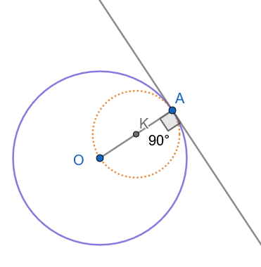{fig-align="center" width="300"}

- Ο βοηθητικός κύκλος διαμέτρου $OA$ εφάπτεται εσωτερικά στον αρχικό κύκλο στο σημείο $A$.

- Η μοναδική εφαπτομένη είναι η κάθετος στην ακτίνα $OA$ στο σημείο $A$.

- **Συμπέρασμα:** $\mathbf{1}$ **λύση**.

3.  **Περίπτωση III: Το σημείο** $A$ είναι εσωτερικό του κύκλου ($\delta < R$)

    - Ο βοηθητικός κύκλος βρίσκεται ολόκληρος στο εσωτερικό του αρχικού κύκλου και δεν έχει κανένα κοινό σημείο με αυτόν.

    - Από εσωτερικό σημείο κύκλου δεν μπορεί να αχθεί καμία εφαπτομένη (κάθε ευθεία που διέρχεται από το $A$ είναι τέμνουσα).

    - **Συμπέρασμα:** Καμία λύση ($\mathbf{0}$ **λύσεις** - αδύνατο).

------------------------------------------------------------------------

**Συνοπτικός Πίνακας**

$$\begin{aligned}
\delta > R &\implies \mathbf{2} \text{ λύσεις} \\
\delta = R &\implies \mathbf{1} \text{ λύση} \\
\delta < R &\implies \mathbf{0} \text{ λύσεις}
\end{aligned}$$
::::

:::: {.math-box .exercise-box}
::: {.math-title .exercise-title}
11. **Άσκηση 11:**
:::

Να κατασκευαστεί τρίγωνο $AB\Gamma$ του οποίου δίνονται:

- Η πλευρά $AB = \gamma$

- Η πλευρά $B\Gamma = \alpha$

- Η απέναντι γωνία $\widehat{A} = \omega$
::::

::::: {.math-box .solution-box}
::: {.math-title .solution-title}
Λύση
:::

**1. Κατασκευή**

1.  Σχεδιάζουμε μία ημιευθεία $Ax$.

2.  Με κορυφή το σημείο $A$ και αρχική πλευρά την $Ax$, κατασκευάζουμε γωνία ίση με $\omega$, ορίζοντας έτσι την ημιευθεία $Ay$.

3.  Πάνω στην ημιευθεία $Ay$ παίρνουμε τμήμα $AB = \gamma$.

4.  Με κέντρο το σημείο $B$ και ακτίνα ίση με $\alpha$, γράφουμε κύκλο $(B, \alpha)$.

5.  Αν ο κύκλος αυτός τέμνει την ημιευθεία $Ax$ σε σημείο $\Gamma$, τότε το τρίγωνο $AB\Gamma$ είναι το ζητούμενο.

------------------------------------------------------------------------

**2. Απόδειξη**

Το κατασκευασμένο τρίγωνο $AB\Gamma$:

1.  Έχει γωνία $\widehat{A} = \omega$ (εξ ορισμού της κατασκευής).

2.  Έχει πλευρές $AB = \gamma$ και $B\Gamma = \alpha$ (καθώς το $\Gamma$ ανήκει στον κύκλο $(B, \alpha)$).

------------------------------------------------------------------------

**3. Διερεύνηση**

Έστω $\delta$ η απόσταση (το ύψος) από την κορυφή $B$ προς την ευθεία $Ax$ (όπου $δ = γ\cdot ημ ω$).

<iframe src="https://www.geogebra.org/calculator/ycz3psru?embed" width="730" height="600" allowfullscreen style="border: 1px solid #e4e4e4;border-radius: 4px;" frameborder="0">

</iframe>

::: {.callout-tip title="Οδηγία"}
Αλλάξτε τις τιμές των \* γωνίας $\hatω$ \* πλευράς α \* πλευράς γ

κλίκ στον αντίστοιχο δρομέα και μετακίνηση

Για μεγαλύτερη ακρίβεια : κλικ στο δρομέα και [Shift]{.kbd-alt}+[βελάκι δεξιά-αριστερά]{.kbd-alt} για αυξομείωση.

Διερευνήστε τις παρακάτω περιπτώσεις
:::

------------------------------------------------------------------------

**Περίπτωση I:** $\alpha < \delta$

- Ο κύκλος $(B, \alpha)$ δεν έχει κανένα κοινό σημείο με την ευθεία $Ax$.

- **Συμπέρασμα:** Το πρόβλημα είναι **αδύνατο** ($0$ λύσεις).

------------------------------------------------------------------------

**Περίπτωση II:** $\alpha = \delta$

- Ο κύκλος $(B, \alpha)$ εφάπτεται της ευθείας $Ax$ σε ένα μοναδικό σημείο $\Gamma$.

- **Υποπεριπτώσεις:**

  - **Αν** $\widehat{A} < 90^\circ$ (οξεία): Το σημείο $\Gamma$ βρίσκεται πάνω στην ημιευθεία $Ax$. Σχηματίζεται $1$ ορθογώνιο τρίγωνο ($\widehat{\Gamma} = 90^\circ$).
  - **Αν** $\widehat{A} \ge 90^\circ$ (ορθή ή αμβλεία): Το σημείο επαφής πέφτει στην αντικείμενη ημιευθεία, συνεπώς **καμία λύση**.

------------------------------------------------------------------------

**Περίπτωση III:** $\alpha > \delta$

- Ο κύκλος τέμνει την ευθεία $Ax$ σε **δύο σημεία**, $\Gamma$ και $\Gamma'$. Εξετάζουμε τη θέση τους ανάλογα με το είδος της γωνίας $\widehat{A}$ και τη σχέση των μηκών $\alpha$ και $\gamma$:

1.  **Αν η γωνία** $\widehat{A} < 90^\circ$ (οξεία):

    - **Όταν** $\alpha < \gamma$: Και τα δύο σημεία $\Gamma, \Gamma'$ βρίσκονται πάνω στην ημιευθεία $Ax$.
      Σχηματίζονται δύο διαφορετικά τρίγωνα ($AB\Gamma$ και $AB\Gamma'$).
      $\implies$ $2$ λύσεις.

    - **Όταν** $\alpha = \gamma$: Το ένα σημείο ($\Gamma'$) συμπίπτει με την κορυφή $A$ (εκφυλισμένο τρίγωνο), ενώ το άλλο σημείο $\Gamma$ δίνει ένα ισοσκελές τρίγωνο $AB\Gamma$.
      $\implies$ $1$ λύση.

    - **Όταν** $\alpha > \gamma$: Το σημείο $\Gamma$ βρίσκεται στην ημιευθεία $Ax$, ενώ το $\Gamma'$ στην αντικείμενη ημιευθεία (όπου σχηματίζεται η παραπληρωματική γωνία $180^\circ - \omega$).
      $\implies$ $1$ λύση.

2.  **Αν η γωνία** $\widehat{A} = 90^\circ$ (ορθή):

    - **Όταν** $\alpha > \gamma$: Η πλευρά $\alpha$ είναι η υποτείνουσα και είναι μεγαλύτερη από την κάθετη $\gamma$.
      $\implies$ $1$ λύση.

    - **Όταν** $\alpha \le \gamma$: Αδύνατο, γιατί η υποτείνουσα πρέπει να είναι αυστηρά μεγαλύτερη από την κάθετη πλευρά.
      $\implies$ $0$ λύσεις.

3.  **Αν η γωνία** $\widehat{A} > 90^\circ$ (αμβλεία):

    - **Όταν** $\alpha > \gamma$: Το ένα σημείο δίνει τρίγωνο που περιέχει την αμβλεία γωνία $\omega$.
      $\implies$ $1$ λύση.

    - **Όταν** $\alpha \le \gamma$: Αδύνατο (απέναντι από την αμβλεία γωνία πρέπει να βρίσκεται η μεγαλύτερη πλευρά).
      $\implies$ $0$ λύσεις.

------------------------------------------------------------------------

**Συνοπτικός Πίνακας Διερεύνησης**

| Σχέση $\alpha$ και $\delta$ | Είδος Γωνίας $\widehat{A}$ | Σχέση $\alpha$ και $\gamma$ | Πλήθος Λύσεων | Είδος / Παρατήρηση |
|:--------------|:--------------|:--------------|:-------------:|:--------------|
| $\alpha < \delta$ | Οποιαδήποτε | Οποιαδήποτε | $0$ | Αδύνατο (ο κύκλος δεν τέμνει την ευθεία) |
| $\alpha = \delta$ | $\widehat{A} < 90^\circ$ | — | $1$ | Ορθογώνιο τρίγωνο στο $\Gamma$ |
|  | $\widehat{A} \ge 90^\circ$ | — | $0$ | Αδύνατο |
| $\alpha > \delta$ | $\widehat{A} < 90^\circ$ | $\alpha < \gamma$ | $2$ | Δύο δεκτά τρίγωνα |
|  |  | $\alpha = \gamma$ | $1$ | Ισοσκελές τρίγωνο |
|  |  | $\alpha > \gamma$ | $1$ | Μία δεκτή λύση |
|  | $\widehat{A} = 90^\circ$ | $\alpha > \gamma$ | $1$ | Ορθογώνιο τρίγωνο |
|  |  | $\alpha \le \gamma$ | $0$ | Αδύνατο |
|  | $\widehat{A} > 90^\circ$ | $\alpha > \gamma$ | $1$ | Αμβλυγώνιο τρίγωνο |
|  |  | $\alpha \le \gamma$ | $0$ | Αδύνατο |
:::::

:::: {.math-box .exercise-box}
::: {.math-title .exercise-title}
12. **Άσκηση 12:**
:::

Δίνονται δύο κύκλοι $(O_1, R_1)$ και $(O_2, R_2)$ με $R_1 > R_2$.
Να κατασκευαστεί ευθεία που να εφάπτεται ταυτόχρονα και στους δύο κύκλους (κοινή εφαπτομένη).
::::

:::: {.math-box .solution-box}
::: {.math-title .solution-title}
**Μέρος Α: Κοινή Εξωτερική Εφαπτομένη**
:::

**1. Ανάλυση**

Έστω ότι η ζητούμενη εφαπτομένη είναι η ευθεία $AB$ (με σημεία επαφής $A$ και $B$).

Φέρνουμε τις ακτίνες $O_1A$ και $O_2B$ στα σημεία επαφής, οι οποίες είναι κάθετες στην $AB$ ($O_1A \perp AB$ και $O_2B \perp AB$).

Από το κέντρο $O_2$ φέρουμε παράλληλη προς την $AB$, η οποία τέμνει την ακτίνα $O_1A$ στο σημείο $\Gamma$.\
Τότε:

- Το τετράπλευρο $ABO_2\Gamma$ είναι ορθογώνιο παραλληλόγραμμο, άρα $A\Gamma = O_2B = R_2$.

- Επομένως: $$O_1\Gamma = O_1A - A\Gamma = R_1 - R_2$$

- Επειδή $\widehat{O_2\Gamma O_1} = 90^\circ$, η ευθεία $O_2\Gamma$ εφάπτεται στον βοηθητικό κύκλο $(O_1, R_1 - R_2)$.

Συνεπώς, το πρόβλημα ανάγεται στην κατασκευή εφαπτομένης από το εξωτερικό σημείο $O_2$ προς έναν βοηθητικό κύκλο με κέντρο $O_1$ και ακτίνα $R_1 - R_2$.

------------------------------------------------------------------------

**2. Σύνθεση (Κατασκευή)**

1.  Με κέντρο το $O_1$ και ακτίνα $R_1 - R_2$, γράφουμε τον βοηθητικό κύκλο $(O_1, R_1 - R_2)$.

2.  Από το σημείο $O_2$ φέρουμε εφαπτομένη προς τον βοηθητικό κύκλο και ονομάζουμε $\Gamma$ το σημείο επαφής.

3.  Προεκτείνουμε την ακτίνα $O_1\Gamma$ μέχρι να τμήσει τον αρχικό κύκλο $(O_1, R_1)$ στο σημείο $A$.

4.  Από το $O_2$ φέρουμε ακτίνα $O_2B$ παράλληλη και ομόρροπη προς την $O_1A$, η οποία τέμνει τον κύκλο $(O_2, R_2)$ στο σημείο $B$.

5.  Ενώνουμε τα σημεία $A$ και $B$.
    Η ευθεία $AB$ είναι η ζητούμενη κοινή εξωτερική εφαπτομένη.

------------------------------------------------------------------------

**3. Απόδειξη**

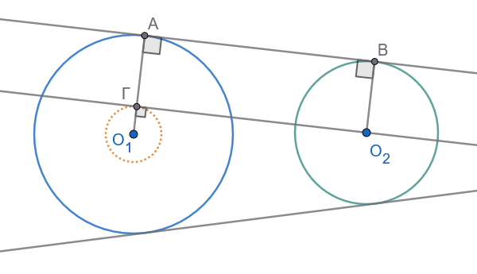{fig-align="center" width="400"}

- Έχουμε $\Gamma A = O_1A - O_1\Gamma = R_1 - (R_1 - R_2) = R_2$.

- Επίσης $O_2B = R_2$, άρα $\Gamma A = O_2B$ και επιπλέον $\Gamma A \parallel O_2B$.

- Επομένως, το τετράπλευρο $\Gamma ABO_2$ είναι παραλληλόγραμμο.

- Επειδή η γωνία $\widehat{\Gamma}$ είναι ορθή ($90^\circ$), το παραλληλόγραμμο είναι **ορθογώνιο**, οπότε η ευθεία $AB$ είναι κάθετη στα άκρα των ακτίνων $O_1A$ και $O_2B$.

- Άρα, η $AB$ εφάπτεται και στους δύο κύκλους.

------------------------------------------------------------------------

**4. Ορισμός & Παρατήρηση**

- **Ορισμός:** Μια κοινή εφαπτομένη ονομάζεται **εξωτερική**, όταν οι δύο κύκλοι βρίσκονται στο **ίδιο ημιεπίπεδο** ως προς αυτήν.

------------------------------------------------------------------------

**5. Διερεύνηση (Κοινές Εξωτερικές Εφαπτόμενες)**

Έστω $d = O_1O_2$ η διάκεντρος των δύο κύκλων:

1.  **Αν** $d > R_1 - R_2$: Υπάρχουν $2$ κοινές εξωτερικές εφαπτόμενες, οι οποίες είναι συμμετρικές ως προς τη διάκεντρο $O_1O_2$.

2.  **Αν** $d = R_1 - R_2$ (εσωτερική επαφή): Υπάρχει $1$ κοινή εξωτερική εφαπτομένη (στο κοινό σημείο επαφής).

3.  **Αν** $d < R_1 - R_2$ (ο ένας κύκλος βρίσκεται εντός του άλλου): Δεν υπάρχει **καμία (**$0$) εξωτερική εφαπτομένη.
::::

------------------------------------------------------------------------

:::: {.math-box .solution-box}
::: {.math-title .solution-title}
**Μέρος Β: Κοινή Εσωτερική Εφαπτομένη**
:::

**1. Ανάλυση & Κατασκευή**

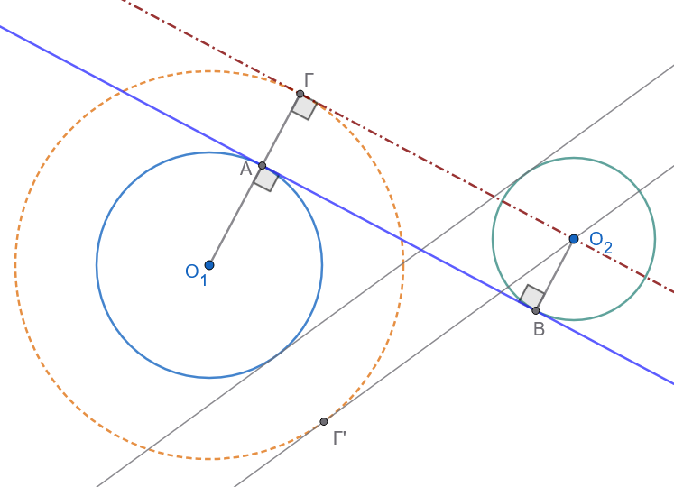{fig-align="center" width="400"}

Όταν οι συνθήκες το επιτρέπουν, μπορούμε να κατασκευάσουμε και εσωτερικές εφαπτόμενες:

1.  Με κέντρο το $O_1$ και ακτίνα $R_1 + R_2$, γράφουμε τον βοηθητικό κύκλο $(O_1, R_1 + R_2)$.

2.  Από το σημείο $O_2$ φέρουμε εφαπτομένη $O_2\Gamma$ προς τον βοηθητικό κύκλο (με σημείο επαφής το $\Gamma$).

3.  Ενώνουμε το $O_1$ με το $\Gamma$.
    Το ευθύγραμμο τμήμα $O_1\Gamma$ τέμνει τον κύκλο $(O_1, R_1)$ στο σημείο $A$.

4.  Από το $O_2$ φέρουμε ακτίνα $O_2B$ παράλληλη αλλά **αντίρροπη** προς την $O_1\Gamma$, η οποία τέμνει τον κύκλο $(O_2, R_2)$ στο σημείο $B$.

5.  Η ευθεία $AB$ είναι η **κοινή εσωτερική εφαπτομένη**.

------------------------------------------------------------------------

**2. Ορισμός & Παρατήρηση**

- **Ορισμός:** Μια κοινή εφαπτομένη ονομάζεται **εσωτερική**, όταν οι δύο κύκλοι βρίσκονται σε **διαφορετικά ημιεπίπεδα** (εκατέρωθεν) ως προς αυτήν.

------------------------------------------------------------------------

**3. Διερεύνηση (Κοινές Εσωτερικές Εφαπτόμενες)**

Έστω $d = O_1O_2$ η διάκεντρος:

1.  **Αν** $d > R_1 + R_2$ (κύκλοι εξωτερικοί μεταξύ τους): Υπάρχουν $2$ κοινές εσωτερικές εφαπτόμενες, συμμετρικές ως προς τη διάκεντρο.

2.  **Αν** $d = R_1 + R_2$ (εξωτερική επαφή): Υπάρχει $1$ κοινή εσωτερική εφαπτομένη (η κάθετη στη διάκεντρο στο σημείο επαφής).

3.  **Αν** $d < R_1 + R_2$ (οι κύκλοι τέμνονται ή ο ένας είναι εσωτερικός του άλλου): Δεν υπάρχει **καμία (**$0$) εσωτερική εφαπτομένη.

------------------------------------------------------------------------

**Συνοπτικός Πίνακας Πλήθους Κοινών Εφαπτομένων**

| Σχετική Θέση Κύκλων | Σχέση Διακέντρου $d$ και Ακτίνων | Εξωτερικές | Εσωτερικές | **Σύνολο** |
|:--------------|:--------------|:-------------:|:-------------:|:-------------:|
| **Εξωτερικοί κύκλοι** | $d > R_1 + R_2$ | $2$ | $2$ | $4$ |
| **Εφαπτόμενοι εξωτερικά** | $d = R_1 + R_2$ | $2$ | $1$ | $3$ |
| **Τεμνόμενοι κύκλοι** | $R_1 - R_2 < d < R_1 + R_2$ | $2$ | $0$ | $2$ |
| **Εφαπτόμενοι εσωτερικά** | $d = R_1 - R_2$ | $1$ | $0$ | $1$ |
| **Ο ένας εντός του άλλου** | $d < R_1 - R_2$ | $0$ | $0$ | $0$ |
::::

:::: {.math-box .exercise-box}
::: {.math-title .exercise-title}
13. **Άσκηση 13:**
:::

Δίνεται τρίγωνο $AB\Gamma$ και ένα τυχαίο σημείο $\Delta$ πάνω στην πλευρά $B\Gamma$.\
Κατασκευάζουμε δύο κύκλους $(c_1)$ και $(c_2)$, όπου:

- Ο πρώτος κύκλος $(c_1)$ διέρχεται από τα σημεία $B$ και $\Delta$, και εφάπτεται στην ευθεία $AB$ (στο σημείο $B$).

- Ο δεύτερος κύκλος $(c_2)$ διέρχεται από τα σημεία $\Gamma$ και $\Delta$, και εφάπτεται στην ευθεία $A\Gamma$ (στο σημείο $\Gamma$).

**Ζητούμενο:**\
Να βρεθεί ο γεωμετρικός τόπος του άλλου σημείου τομής $M$ των δύο αυτών κύκλων (εκτός του $\Delta$), καθώς το σημείο $\Delta$ κινείται πάνω στην πλευρά $B\Gamma$.
::::

:::: {.math-box .solution-box}
::: {.math-title .solution-title}
**Λύση & Απόδειξη**

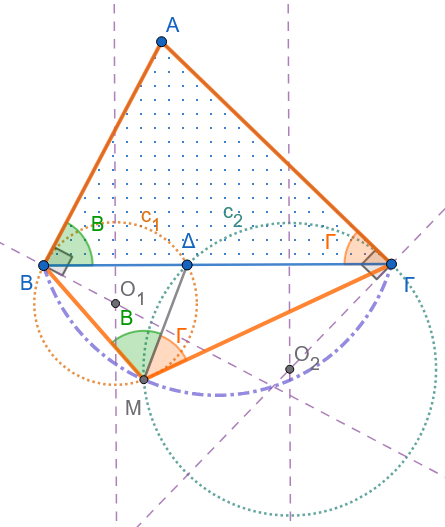{fig-align="center" width="350"}
:::

1.  **Γωνίες στον κύκλο** $(c_1)$:

    - Η ευθεία $AB$ εφάπτεται στον κύκλο $(c_1)$ στο σημείο $B$, άρα η γωνία υπό χορδής και εφαπτομένης $\widehat{AB\Delta}$ ισούται με τη γωνία $\widehat{B}$ του τριγώνου $AB\Gamma$.

    - Η εγγεγραμμένη γωνία $\widehat{BM\Delta}$ που «βλέπει» τη χορδή $B\Delta$ είναι ίση με την υπό χορδής και εφαπτομένης γωνίας Β: $$\widehat{BM\Delta} = \widehat{B}$$

2.  **Γωνίες στον κύκλο** $(c_2)$:

    - Ομοίως, η ευθεία $A\Gamma$ εφάπτεται στον κύκλο $(c_2)$ στο σημείο $\Gamma$, άρα η αντίστοιχη γωνία είναι η $\widehat{\Gamma}$.

    - Η εγγεγραμμένη γωνία $\widehat{\Gamma M\Delta}$ που «βλέπει» τη χορδή $\Gamma\Delta$ είναι: $$\widehat{\Gamma M\Delta} = \widehat{\Gamma}$$

3.  **Υπολογισμός της γωνίας** $\widehat{BM\Gamma}$:

    - Αθροίζοντας τις γωνίες γύρω από το σημείο $M$: $$\widehat{BM\Delta} + \widehat{\Gamma M\Delta} =  \widehat{B} + \widehat{\Gamma} =180^ο-\hat A$$

    - $$\widehat{BM\Gamma} = 180^\circ - \widehat{A} \iff \widehat{BM\Gamma} + \widehat{A} = 180^\circ$$

------------------------------------------------------------------------

**Συμπέρασμα**

Επειδή οι απέναντι γωνίες $\widehat{A}$ και $\widehat{BM\Gamma}$ είναι παραπληρωματικές ($\widehat{A} + \widehat{BM\Gamma} = 180^\circ$), το τετράπλευρο $ABM\Gamma$ είναι εγγράψιμο σε κύκλο.

Επομένως, το σημείο $M$ ανήκει στον περιγεγραμμένο κύκλο του τριγώνου $AB\Gamma$.

- **Γεωμετρικός Τόπος:**

  Ο γεωμετρικός τόπος του σημείου $M$, καθώς το $\Delta$ διατρέχει το ευθύγραμμο τμήμα $B\Gamma$, είναι το **κυκλικό τόξο** $\overparen{BM\Gamma}$ του περιγεγραμμένου κύκλου του τριγώνου $AB\Gamma$ (το τόξο που βρίσκεται στο αντίθετο ημιεπίπεδο της κορυφής $A$ ως προς την ευθεία $B\Gamma$).
::::

:::: {.math-box .exercise-box}
::: {.math-title .exercise-title}
14. **Άσκηση 14:**
:::

Δίνεται ημιπεριφέρεια $(c)$ με διάμετρο $AB$ και το τετράγωνο $AB\Gamma\Delta$, το οποίο βρίσκεται στο άλλο ημιεπίπεδο ως προς την ευθεία $AB$ από εκείνο της ημιπεριφέρειας $(c)$.\
Θεωρούμε ένα τυχαίο σημείο $E$ πάνω στην ημιπεριφέρεια και, με πλευρά τη χορδή $AE$, κατασκευάζουμε το τετράγωνο $AEZH$, έτσι ώστε το τόξο $AE$ να βρίσκεται στο εσωτερικό του.

**Ζητούμενο:**\
Να βρεθεί ο γεωμετρικός τόπος του σημείου τομής $M$ των ευθειών $\Delta E$ και $BH$, καθώς το σημείο $E$ διαγράφει ολόκληρη την ημιπεριφέρεια $(c)$.
::::

:::: {.math-box .solution-box}
::: {.math-title .solution-title}
**Λύση & Απόδειξη**

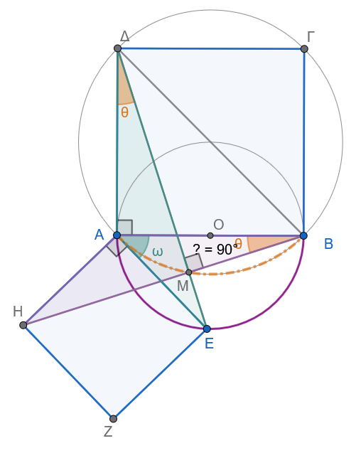{fig-align="center" width="400"}
:::

1.  **Σύγκριση τριγώνων (ή Στροφή** $90^\circ$ γύρω από το $A$):

    - Στο τετράγωνο $AB\Gamma\Delta$ έχουμε: $$AB = A\Delta \quad \text{και} \quad \widehat{BA\Delta} = 90^\circ$$

    - Στο τετράγωνο $AEZH$ έχουμε: $$AH = AE \quad \text{και} \quad \widehat{HAE} = 90^\circ$$

    - Συγκρίνουμε τις γωνίες $\widehat{BAH}$ και $\widehat{\Delta AE}$: $$\widehat{BAH} = 90^\circ - \widehat{EAB}$$ $$\widehat{\Delta AE} = 90^\circ - \widehat{EAB}$$

      Άρα: $$\widehat{BAH} = \widehat{\Delta AE}$$

2.  **Ισότητα τριγώνων** $ABH$ και $A\Delta E$:

    - Τα τρίγωνα $ABH$ και $A\Delta E$ έχουν:

      1.  $AB = A\Delta$ (πλευρές του ίδιου τετραγώνου)

      2.  $AH = AE$ (πλευρές του ίδιου τετραγώνου)

      3.  $\widehat{BAH} = \widehat{\Delta AE}$ (περιεχόμενες γωνίες)

    - Επομένως, τα τρίγωνα είναι **ίσα** (κριτήριο Π-Γ-Π), άρα και οι αντίστοιχες γωνίες τους είναι ίσες: $$\widehat{ABH} = \widehat{A\Delta E} \iff \widehat{ABM} = \widehat{A\Delta M}$$

3.  **Εγγραψιμότητα:**

    - Επειδή οι κορυφές $B$ και $\Delta$ «βλέπουν» το ευθύγραμμο τμήμα $AM$ υπό ίσες γωνίες ($\widehat{ABM} = \widehat{A\Delta M}$), το τετράπλευρο $ABM\Delta$ είναι εγγράψιμο σε κύκλο.

    - Επειδή στο τετράγωνο $AB\Gamma\Delta$ η γωνία $\widehat{BA\Delta}$ είναι ορθή ($90^\circ$), το τμήμα $B\Delta$ είναι διάμετρος του περιγεγραμμένου αυτού κύκλου (του κύκλου που διέρχεται από τις κορυφές του τετραγώνου $AB\Gamma\Delta$).

    - Συνεπώς, και η γωνία $\widehat{\Delta M B}$ είναι ορθή ($90^\circ$), καθώς βαίνει σε ημικύκλιο διαμέτρου $B\Delta$.

    - *(Επίσης μπορούμε να πούμε ότι:*

      *Αφού* $\widehat{ΑΒΜ}=\widehat{ΑΔΜ}$ *και* $ΑΔ\perp AΒ$ *θα πρέπει οι ίσες γωνίες να έχουν και τις άλλες πλευρές τους κάθετες δηλαδή* $ΔE \perp ΒΗ$*)*

------------------------------------------------------------------------

**Συμπέρασμα**

- Το σημείο $M$ κινείται πάνω στον περιγεγραμμένο κύκλο του τετραγώνου $AB\Gamma\Delta$ (κύκλος με διάμετρο τη διαγώνιο $B\Delta$).

- **Γεωμετρικός Τόπος:**

  Ο γεωμετρικός τόπος του σημείου $M$, καθώς το $E$ διαγράφει την ημιπεριφέρεια $(c)$, είναι το **κυκλικό τόξο του περιγεγραμμένου κύκλου του τετραγώνου** $AB\Gamma\Delta$ που ορίζεται μεταξύ των σημείων $A$ και $B$.
::::

:::: {.math-box .exercise-box}
::: {.math-title .exercise-title}
15. **Άσκηση 15:**

**Πρόβλημα του Compagnon)**
:::

Να κατασκευαστεί τρίγωνο $AB\Gamma$ του οποίου δίνονται:

1.  Η βάση $B\Gamma$ (κατά θέση και μέγεθος).

2.  Η διαφορά των προσκείμενων στη βάση γωνιών: $\widehat{B} - \widehat{\Gamma} = \omega$.

3.  Μία ευθεία $(\epsilon)$, πάνω στην οποία βρίσκεται η κορυφή $A$.
::::

:::: {.math-box .solution-box}
::: {.math-title .solution-title}
Λύση
:::

**Ανάλυση**

Έστω (Σχήμα 15.1) $AB\Gamma$ το ζητούμενο τρίγωνο.
Γνωρίζω τη βάση $B\Gamma = a$, τη διαφορά $\widehat{B} - \widehat{\Gamma} = \omega$ και την ευθεία $\epsilon$ πάνω στην οποία κείται το $A$.
Πάνω στην πλευρά $A\Gamma$ (όπου $A\Gamma > AB$) λαμβάνω το ευθύγραμμο τμήμα $AB' = AB$.
Η ευθεία $BB^{\prime }$ τέμνει την $\epsilon$ στο σημείο $E$.

Ονομάζω $x$ τη γωνία $\widehat{ABB^{\prime }}$, οπότε θα είναι επίσης και $\widehat{AB'B} = x$ και $$\widehat{B} = x + \widehat{B'B\Gamma} \ \ \ \ (1)$$.

Επειδή η γωνία $\widehat{AB^{\prime }B}$ είναι εξωτερική του τριγώνου $B'\Gamma B$, θα ισχύει $$x = \widehat{\Gamma} + \widehat{B'B\Gamma} \ \ \ \ (2)$$.

Προσθέτω αυτές τις δύο ισότητες κατά μέλη και έχω: $$\widehat{B}+x=\widehat{B^{\prime }B\Gamma }+x+\widehat{\Gamma }+\widehat{B^{\prime }B\Gamma }\implies \widehat{B^{\prime }B\Gamma }=\dfrac{\widehat{B}-\widehat{\Gamma }}{2}=\dfrac{\omega }{2}$$

Η ευθεία λοιπόν $BE$ διέρχεται από το γνωστό σημείο $B$ και σχηματίζει γνωστή γωνία με τη γνωστή διεύθυνση $B\Gamma$, άρα είναι γνωστή.

Επομένως, θα είναι επίσης γνωστή και η γωνία $\phi$ την οποία σχηματίζει αυτή με τη γνωστή διεύθυνση της $\epsilon$.

Έστω ότι το $B_{1}$ είναι το συμμετρικό του $B$ ως προς την $\epsilon$.

Η γωνία $\widehat{AB_{1}E}$ είναι συμμετρική της $\widehat{ABE}$ ως προς την $\epsilon$, άρα $\widehat{AB_1E} = \widehat{ABE} = \widehat{AB'B}$.

Συνεπώς, το τετράπλευρο $B_1EB'A$ είναι εγγράψιμο (διότι η μία εσωτερική του γωνία ισούται με την απέναντι εξωτερική), και κατά συνέπεια προκύπτει ότι η γωνία $\widehat{B_1AB'} = 180^\circ - 2\phi$.

Από αυτά προκύπτει η εξής κατασκευή:

**Σύνθεση (Κατασκευή)**

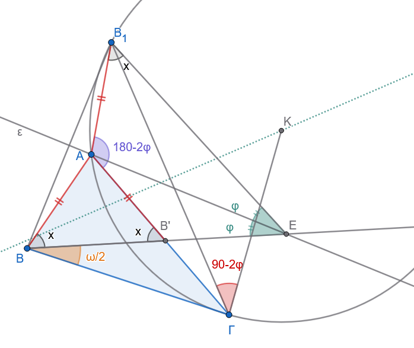{fig-align="center" width="600"}

Φέρω την ευθεία $BE$, η οποία σχηματίζει με τη $B\Gamma$ γωνία ίση με $\dfrac{\omega }{2}$ και βρίσκεται στο ημιεπίπεδο στο οποίο βρίσκεται και το $A$ ως προς την ευθεία $B\Gamma$.

Έστω ότι αυτή τέμνει την $\epsilon$ στο σημείο $E$.

Ονομάζω $\phi$ τη γωνία $\widehat{BEA}$.
Αν $B_{1}$ είναι το συμμετρικό του $B$ ως προς την $\epsilon$, γράφω ένα τόξο κύκλου το οποίο να δέχεται ως χορδή το τμήμα $B_1\Gamma$ και να αντιστοιχεί σε εγγεγραμμένη γωνία ίση με $180^\circ - 2\phi$.

**Κατασκευή του τόξου:**

με πλευρά την $Β_1Γ$ σχεδιάζω γωνία $\widehat{Β_1ΓΚ}=90^ο-2φ$ στο ημιεπίπεδο που βρίσκεται και το Ε και το Κ είναι η τομή της πλευράς $ΒΚ$ με την μεσοκάθετη της $Β_1Γ$.

Έστω ότι το τόξο αυτό τέμνει την $\epsilon$ στο σημείο $A$.
Το τρίγωνο $AB\Gamma$ είναι το ζητούμενο.

**Απόδειξη**

Το τρίγωνο $AB\Gamma$ έχει πλευρά τη $B\Gamma$ και την κορυφή $A$ πάνω στην $\epsilon$.
Επειδή το τετράπλευρο $B_1AB'E$ είναι εγγράψιμο, θα ισχύει $\widehat{AB_1E} = \widehat{AB'B}$.

Όμως ισχύει και $\widehat{AB_1E} = \widehat{ABB'}$ (διότι αυτές οι γωνίες είναι συμμετρικές ως προς την $\epsilon$).

Άρα $\widehat{ABB'} = \widehat{AB'B}$.
Επιπλέον, γνωρίζουμε ότι $\widehat{AB\Gamma} = \widehat{ABB'} + \widehat{B'B\Gamma}$ και $\widehat{AB'B} = \widehat{\Gamma} + \widehat{B'B\Gamma}$.

Από αυτές τις σχέσεις προκύπτει ότι $\widehat{B'B\Gamma} = \dfrac{\widehat{B} - \widehat{\Gamma}}{2}$.

Όμως, εκ κατασκευής είναι $\widehat{B'B\Gamma} = \dfrac{\omega}{2}$, άρα τελικά $\widehat{B} - \widehat{\Gamma} = \omega$.

**Διερεύνηση**

Ι.
Έστω ότι τα σημεία $B$ και $\Gamma$ βρίσκονται προς το ίδιο μέρος της ευθείας $\epsilon$.

• Ια.
Η ευθεία $BB^{\prime }$ (Σχήμα 15.1) τέμνει την $\epsilon$ σε ένα σημείο $E$ προς το μέρος του $\Gamma$.
Τότε το πρόβλημα έχει πάντοτε λύση και μάλιστα μία μόνο.
Γιατί; (Διότι το τετράπλευρο $BAB_{1}E$ είναι κυρτό).

• Ιβ.
Η ευθεία $BB^{\prime }$ είναι παράλληλη προς την $\epsilon$ (Σχήμα 15.2).
Συνδέω το $B_{1}$ με το $\Gamma$ και έστω ότι η ευθεία $B_1\Gamma$ τέμνει την $\epsilon$ στο σημείο $A$.
Το τρίγωνο $AB\Gamma$ είναι το ζητούμενο.
Γιατί;

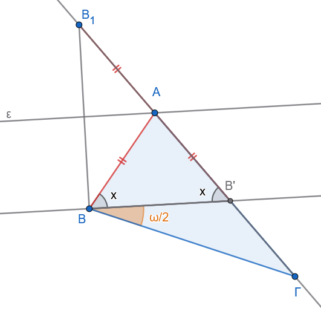{fig-align="center" width="400"}

• Ιγ.
Η ευθεία $BB^{\prime }$ τέμνει την $\epsilon$ σε ένα σημείο $E$ το οποίο κείται στο ημιεπίπεδο ως προς την $AB$ στο οποίο δεν βρίσκεται το $\Gamma$ (Σχήμα 15.3).

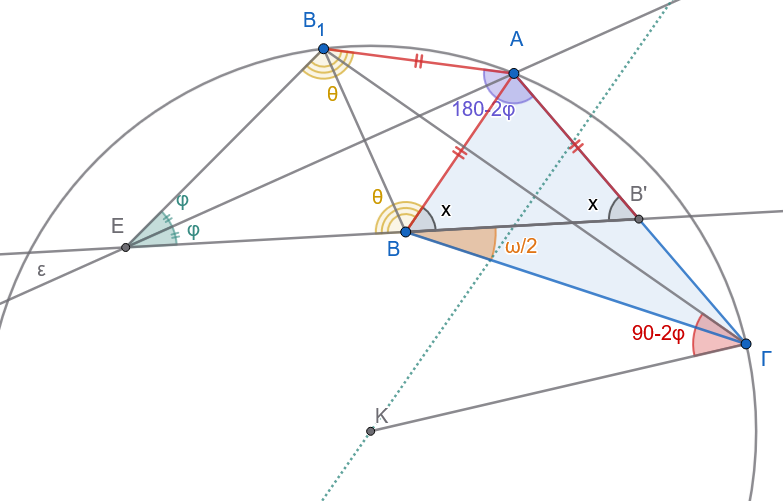{fig-align="center" width="500"}

Επειδή $\widehat{EB_1A} = \widehat{EBA}$ (λόγω συμμετρίας), $\widehat{ABB'} + \widehat{EBA} = 180^\circ$ και $\widehat{ABB'} = \widehat{AB'B}$, θα ισχύει $\widehat{EB_1A} + \widehat{AB'B} = 180^\circ$, άρα και $\widehat{B_1A\Gamma} + 2\phi = 180^\circ$.

Επομένως, το σημείο $A$ ορίζεται κατά έναν μόνο τρόπο.
Γιατί;

ΙΙ.
Έστω τώρα ότι τα σημεία $B$ και $\Gamma$ δεν βρίσκονται προς το ίδιο ημιεπίπεδο ως προς την ευθεία $\epsilon$ (Σχήμα 15.4).

Το συμμετρικό σημείο $B_{1}$ του $B$ ως προς την $\epsilon$ θα βρίσκεται στο ίδιο ημιεπίπεδο με το $\Gamma$ (ως προς την $\epsilon$).
Έστω ότι η ευθεία $BB^{\prime }$ τέμνει την $\epsilon$ στο σημείο $E$ και έστω $\lambda$ η γωνία που σχηματίζουν οι ευθείες $\epsilon$ και $BB^{\prime }$.

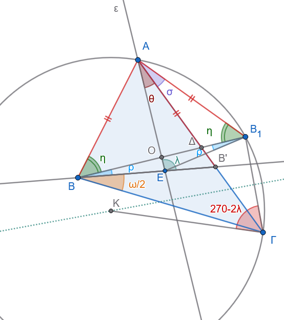{fig-align="center" width="450"}

Η γωνία $\hat\eta$ είναι η $\widehat{ABB_{1}}$ (δηλαδή η $\widehat{ABO}$), ενώ οι τρεις εσωτερικές γωνίες του τριγώνου $BOE$ είναι η ορθή ($90^{\circ }$), η $\rho$ (στο $B$) και η παραπληρωματική της $\lambda$ (στο $E$), δηλαδή η $180^\circ - \lambda$.

Επομένως:

$(180^{\circ }-\lambda )+90^{\circ }+\rho =180^{\circ }\implies \mathbf{\lambda =90}^{\mathbf{\circ }}\mathbf{+\rho }$ Αν αντικαταστήσουμε τη σχέση ($\rho = \lambda - 90^\circ$) στο σύστημα των εξισώσεων, καταλήγουμε.

1.  Σχέση $(\alpha)$ από το τρίγωνο $AEB^{\prime }$: $\widehat{B'} = 180^\circ - \lambda - \theta$

2.  Σχέση $(\gamma)$ από τη συμμετρία: $\widehat{B'} = \eta + \rho$

3.  Εξισώνοντας τα δύο $\widehat{B^{\prime }}$: $180^\circ - \lambda - \theta = \eta + \rho$

4.  Αντικαθιστούμε τη σχέση $\rho = \lambda - 90^\circ$: $180^\circ - \lambda - \theta = \eta + (\lambda - 90^\circ) \implies 270^\circ - 2\lambda = \theta + \eta$

5.  Σχέση $(\beta)$ από το ορθογώνιο τρίγωνο $Α OB_1$: Η γωνία στο $B_{1}$ είναι ίση με $\eta$ (λόγω συμμετρίας του τριγώνου $ABB_{1}$).
    Άρα στο ορθογώνιο $Α OB_1$ έχουμε: $\theta + \sigma + \eta = 90^\circ \implies \theta + \eta = 90^\circ - \sigma$.

6.  Τελική εξίσωση: $270^\circ - 2\lambda = 90^\circ - \sigma \implies \sigma = 2\lambda - 180^\circ$

Συνεπώς, το σημείο $A$ θα κείται πάνω στο τόξο κύκλου το οποίο δέχεται ως χορδή το τμήμα $B_1\Gamma$ και αντιστοιχεί σε εγγεγραμμένη γωνία $\sigma = 2\lambda - 180^\circ$, καθώς επίσης και πάνω στην ευθεία $\epsilon$.
Το σημείο $A$ ορίζεται τελικά ως η τομή αυτών των δύο γραμμών (του τόξου και της ευθείας).
::::

------------------------------------------------------------------------

::: {.callout-important title="ΣΑΣ ΕΥΧΟΜΑΙ"}
ΚΑΛΗ ΜΕΛΕΤΗ !!!
:::
