```{=html}
<!-- Φόρτωση βιβλιοθήκης GeoGebra -->
<script src="https://www.geogebra.org/apps/deployggb.js"></script>

<!-- Συνάρτηση δημιουργίας applets -->
<script>
function createGeoGebra(containerId, materialId, width = 700, height = 500) {
  var params = {
    "id": "ggb-" + containerId,
    "material_id": materialId,
    "width": width,
    "height": height,
    "showToolBar": true,
    "showMenuBar": false,
    "showAlgebraInput": true
  };
  
  var applet = new GGBApplet(params, '5.2');
  applet.inject(containerId);
}
</script>
```

## Μη Γραμμικά Συστήματα

#### Ορισμός

:::: {.math-box .definition-box}
::: {.math-title .definition-title}
Μη Γραμμικό Σύστημα
:::

**Μη γραμμικό σύστημα εξισώσεων** ονομάζεται κάθε σύστημα εξισώσεων του οποίου **μία τουλάχιστον εξίσωση δεν είναι γραμμική**.
Δηλαδή περιέχει όρους δευτέρου ή ανώτερου βαθμού (π.χ. $x^2, y^2$), γινόμενο αγνώστων ($xy$), ρητούς/κλασματικούς όρους, ριζικά, εκθετικές, λογαριθμικές ή τριγωνομετρικές συναρτήσεις.

- **Λύση του συστήματος:** Κάθε διατεταγμένο ζεύγος αριθμών $(x_0, y_0)$ που επαληθεύει ταυτόχρονα όλες τις εξισώσεις του συστήματος.

- **Γεωμετρική ερμηνεία:** Οι λύσεις ενός μη γραμμικού συστήματος παριστάνουν τις **συντεταγμένες των κοινών σημείων** (σημείων τομής ή επαφής) των γραφικών παραστάσεων/καμπυλών που εκφράζουν οι εξισώσεις του στο επίπεδο (π.χ. τομή ευθείας με παραβολή, κύκλο ή υπερβολή).
::::

------------------------------------------------------------------------

### Παραδείγματα Διαφορετικών Περιπτώσεων (Αναλυτικά Λυμένα)

:::: {.math-box .example-box}
::: {.math-title .example-title}
**Περίπτωση 1: Σύστημα Ευθείας και Υπερβολής (Γραμμική & Ρητή/Γινόμενο)**
:::

$$\begin{cases} x + y = 5 \quad (1) \\ x y = 4 \quad (2) \end{cases}$$
::::

:::: {.math-box .examplesolution-box}
::: {.math-title .examplesolution-title}
Λύση:
:::

1.  Από την πρωτοβάθμια εξίσωση (1) εκφράζουμε τον έναν άγνωστο: $y = 5 - x \quad (3)$.

2.  Αντικαθιστούμε στην (2): $$x(5 - x) = 4 \iff 5x - x^2 = 4 \iff x^2 - 5x + 4 = 0$$

3.  Η δευτεροβάθμια εξίσωση έχει διακρίνουσα $\Delta = 25 - 16 = 9$ και ρίζες

$x_{1,2} = \dfrac{5\pm\sqrt{9}}{2}=\dfrac{5\pm 3}{2}$

Άρα $x_1 = 4$ και $x_2=1$.

- Για $x_1 = 4 \xrightarrow{(3)} y_1 = 5 - 4 = 1$.
- Για $x_2 = 1 \xrightarrow{(3)} y_2 = 5 - 1 = 4$.

Απάντηση & Γεωμετρική Ερμηνεία:

Το σύστημα έχει δύο λύσεις, τα ζεύγη $(1, 3)$ και $(4, 1)$.

Γεωμετρικά, εκφράζει τα σημεία τομής $A(4,1)$ και $B(1,4)$ της ευθείας $y = -x + 5$ και της υπερβολής $y = \dfrac{4}{x}$.

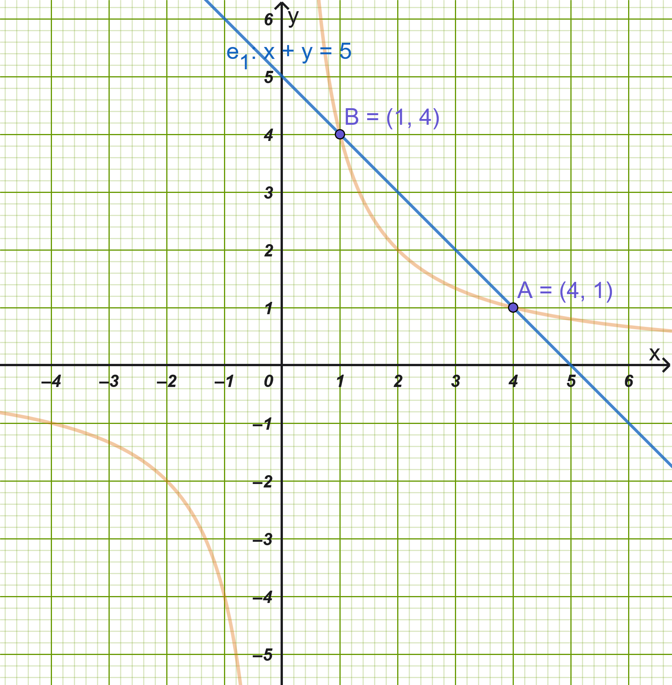{fig-align="center" width="500"}
::::

------------------------------------------------------------------------

:::: {.math-box .example-box}
::: {.math-title .example-title}
**Περίπτωση 2: Σύστημα Ευθείας και Κύκλου (Γραμμική & 2ου Βαθμού)**
:::

$$\begin{cases} x - y = 1 \quad (1) \\ x^2 + y^2 = 25 \quad (2) \end{cases}$$
::::

:::: {.math-box .examplesolution-box}
::: {.math-title .examplesolution-title}
Λύση:
:::

1.  Από την (1) λύνουμε ως προς $x$: $x = y + 1 \quad (3)$.

2.  Αντικαθιστούμε στη (2): $$(y + 1)^2 + y^2 = 25 \iff y^2 + 2y + 1 + y^2 = 25 \iff 2y^2 + 2y - 24 = 0 \iff y^2 + y - 12 = 0$$

3.  Η διακρίνουσα είναι $\Delta = 1 - 4(1)(-12) = 49$, οπότε $y = \dfrac{-1 \pm 7}{2}$:

    - $y_1 = 3 \xrightarrow{(3)} x_1 = 3 + 1 = 4$.
    - $y_2 = -4 \xrightarrow{(3)} x_2 = -4 + 1 = -3$.

Απάντηση & Γεωμετρική Ερμηνεία:

Οι λύσεις είναι τα ζεύγη $(4, 3)$ και $(-3, -4)$.

Γεωμετρικά, η ευθεία $x - y = 1$ τέμνει τον κύκλο $x^2 + y^2 = 25$ στα δύο αυτά σημεία.

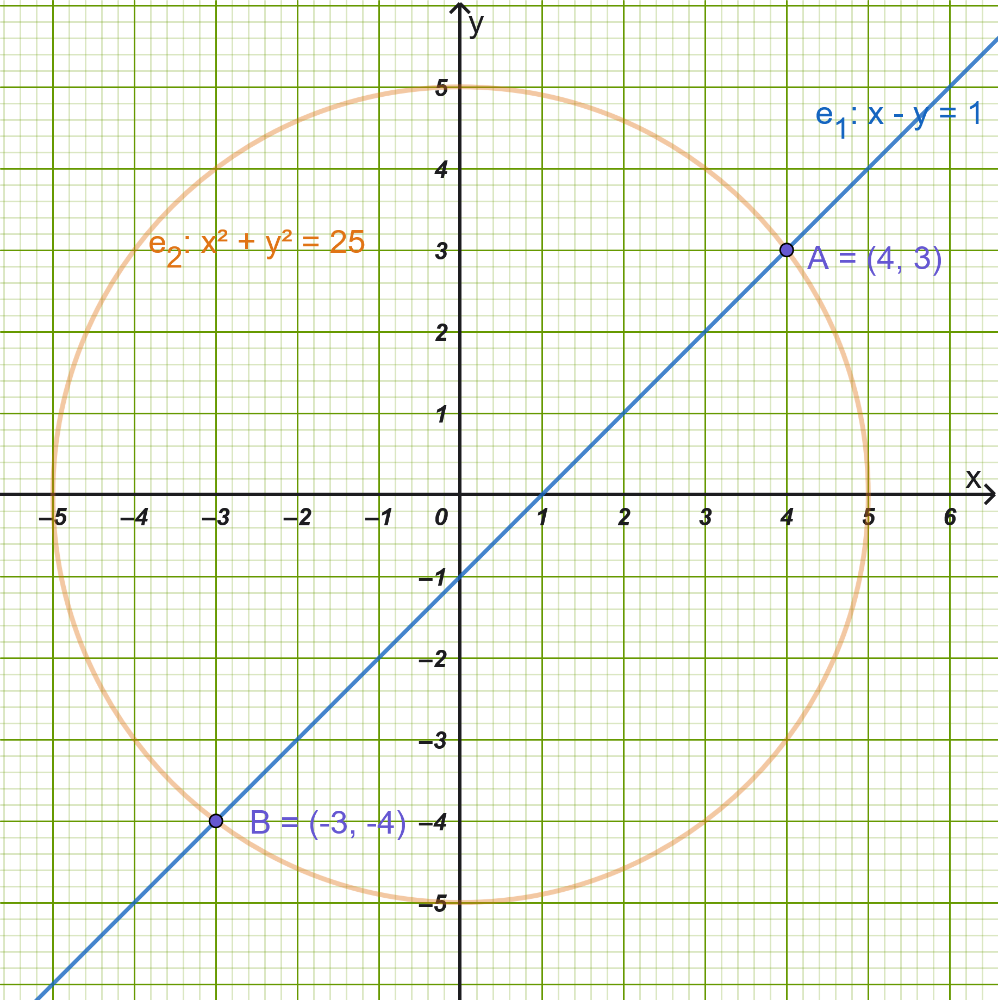{fig-align="center" width="500"}
::::

------------------------------------------------------------------------

:::: {.math-box .example-box}
::: {.math-title .example-title}
**Περίπτωση 3: Σύστημα Δύο Εξισώσεων 2ου Βαθμού (Συμμετρικό Σύστημα Κύκλου & Υπερβολής)**
:::

$$\begin{cases} x^2 + y^2 = 5 \quad (1) \\ x y = 2 \quad (2) \end{cases}$$
::::

:::: {.math-box .examplesolution-box}
::: {.math-title .examplesolution-title}
Λύση:
:::

1.  Πολλαπλασιάζουμε την (2) επί $2$: $2xy = 4$.

2.  Προσθέτουμε κατά μέλη στην (1): $$x^2 + 2xy + y^2 = 5 + 4 \iff (x + y)^2 = 9 \iff x + y = 3 \quad \text{ή} \quad x + y = -3$$

3.  Διακρίνουμε δύο απλούστερα συστήματα:

    - **Σύστημα Α:** $\begin{cases} x + y = 3 \\ xy = 2 \end{cases} \implies$ Οι $x, y$ είναι ρίζες της $t^2 - 3t + 2 = 0 \implies t = 1$ ή $t = 2$. Δίνει τις λύσεις $(1, 2)$ και $(2, 1)$.
    - **Σύστημα Β:** $\begin{cases} x + y = -3 \\ xy = 2 \end{cases} \implies$ Οι $x, y$ είναι ρίζες της $t^2 + 3t + 2 = 0 \implies t = -1$ ή $t = -2$. Δίνει τις λύσεις $(-1, -2)$ και $(-2, -1)$.

**Απάντηση & Γεωμετρική Ερμηνεία:**

Το σύστημα έχει **4 λύσεις**: $\{(1,2), (2,1), (-1,-2), (-2,-1)\}$.

Γεωμετρικά, ο κύκλος $x^2 + y^2 = 5$ και η υπερβολή $xy = 2$ τέμνονται σε 4 διακριτά σημεία.

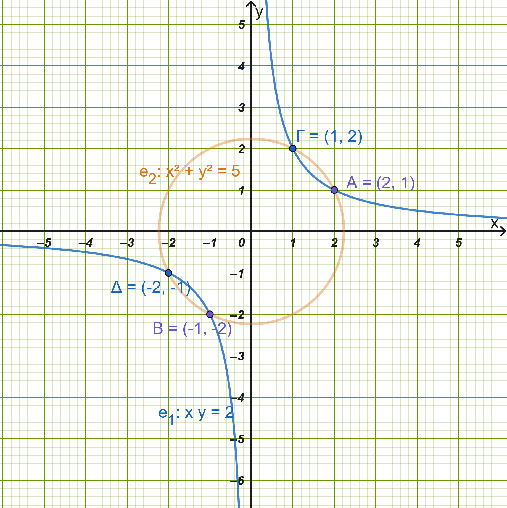{fig-align="center" width="500"}
::::

------------------------------------------------------------------------

:::: {.math-box .example-box}
::: {.math-title .example-title}
**Περίπτωση 4: Εκθετικό Μη Γραμμικό Σύστημα (Αλλαγή Μεταβλητών)**
:::

$$\begin{cases} 3 \cdot 2^x - 2 \cdot 3^y = -6 \quad (1) \\ 2^x + 3^y = 13 \quad (2) \end{cases}$$
::::

:::: {.math-box .examplesolution-box}
::: {.math-title .examplesolution-title}
**Λύση:**
:::

1.  **Εισαγωγή βοηθητικών μεταβλητών:**

    Θέτουμε $u = 2^x > 0$ και $v = 3^y > 0$.

2.  **Μετασχηματισμός σε γραμμικό σύστημα ως προς** $u, v$:

    $$\begin{cases} 3u - 2v = -6 \quad (3) \\ u + v = 13 \quad (4) \end{cases}$$

3.  **Επίλυση του συστήματος ως προς** $u, v$:

    - Από την εξίσωση (4) εκφράζουμε το $u$: $$u = 13 - v \quad (5)$$

    - Αντικαθιστούμε στην εξίσωση (3): $$3(13 - v) - 2v = -6 \iff 39 - 3v - 2v = -6 \iff -5v = -45 \iff v = 9$$

    - Αντικαθιστούμε την τιμή $v = 9$ στην (5): $$u = 13 - 9 \implies u = 4$$

4.  **Επιστροφή στους αρχικούς αγνώστους** $x, y$:

    - Για $u = 4 \implies 2^x = 4 \iff 2^x = 2^2 \iff \mathbf{x = 2}$

    - Για $v = 9 \implies 3^y = 9 \iff 3^y = 3^2 \iff \mathbf{y = 2}$

**Απάντηση:**

Το σύστημα έχει **μοναδική λύση** το ζεύγος $(2, 2)$, η οποία προκύπτει άμεσα με εξίσωση εκθετών .

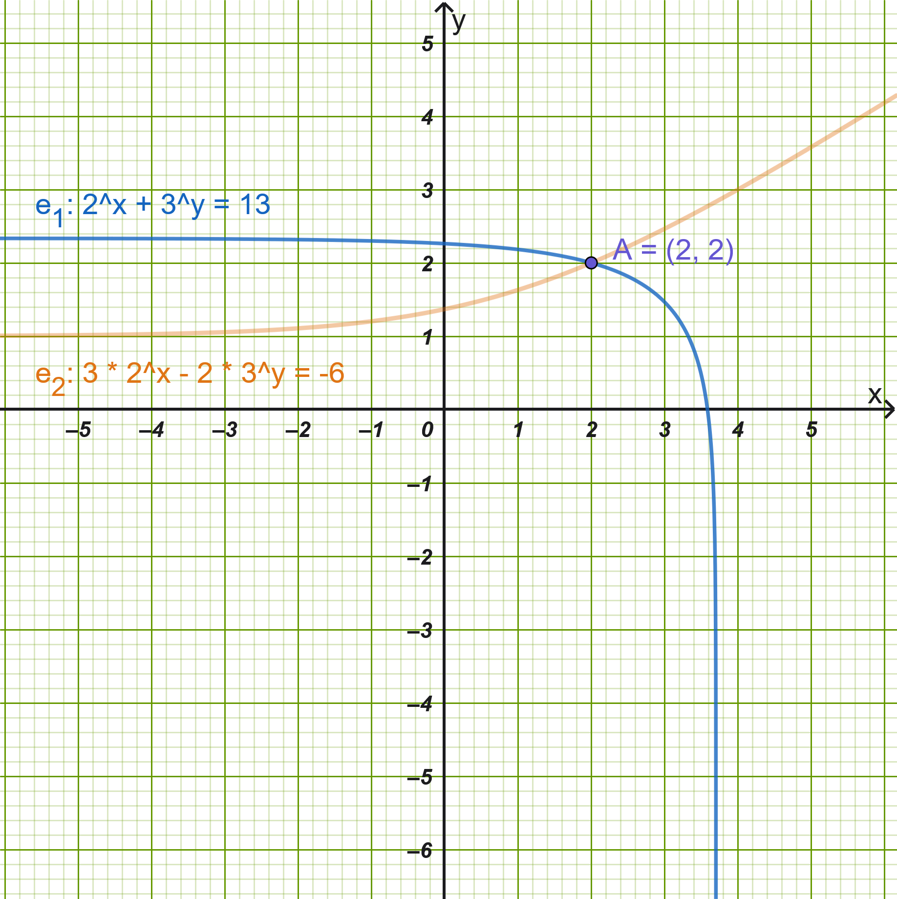{fig-align="center" width="500"}
::::

------------------------------------------------------------------------

### Ασκήσεις και Προβλήματα Εμπέδωσης

**Κατηγορία Α: Συστήματα Ευθείας & Καμπύλης (Αντικατάσταση)**

1.  Να λυθεί αλγεβρικά και γραφικά το σύστημα: $\begin{cases} y = x^2 - 3x + 2 \\ x + y = 5 \end{cases}$

::: callout-method
**Υπόδειξη**

$x+y=5 \implies y=5-x$ και η $y = x^2 - 3x + 2$ γίνεται $x-5=y = x^2 - 3x + 2 \implies ......$
:::

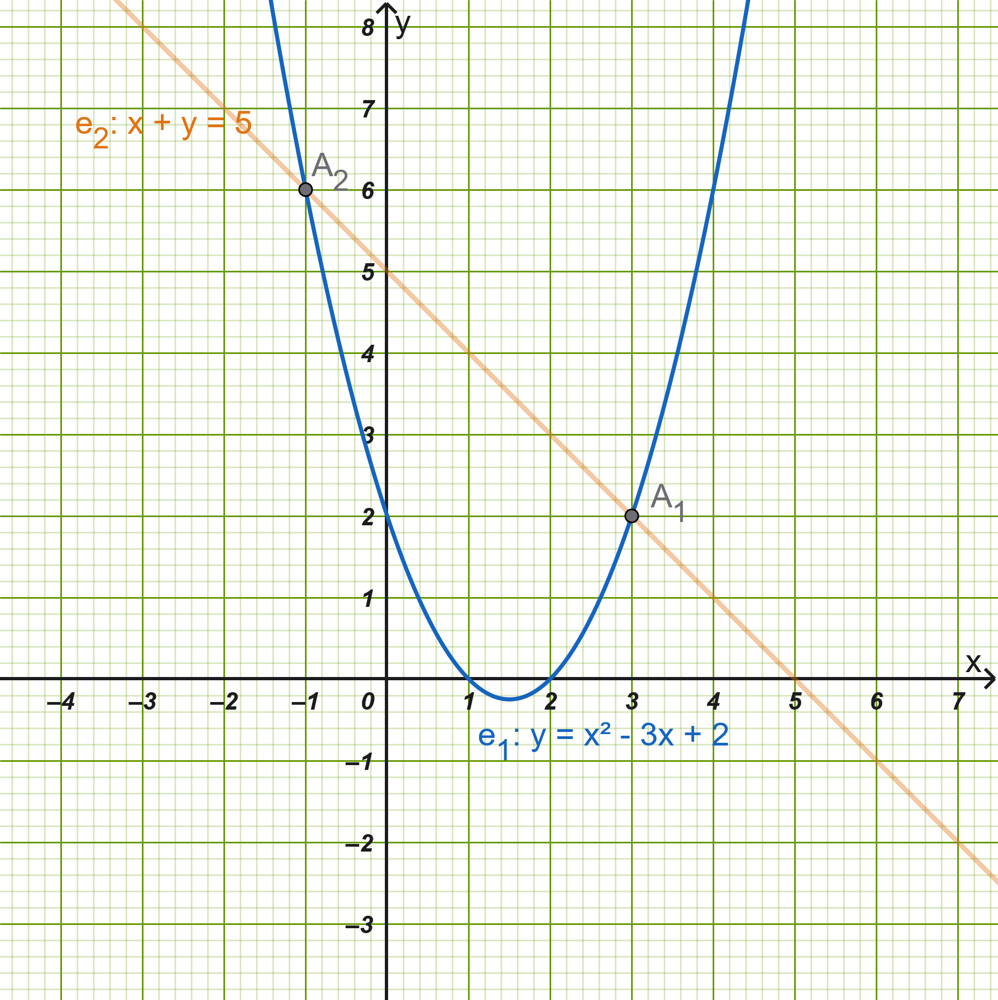{fig-align="center" width="400"}

3.  Να βρεθούν τα κοινά σημεία της ευθείας $x + y = 4$ και του κύκλου $x^2 + y^2 = 10$.

4.  Να επιλυθεί το σύστημα παραβολής και ευθείας: $\begin{cases} y = x^2 - 4x + 3 \\ y = 2x - 2 \end{cases}$

::: callout-method
**Υπόδειξη**

$x^2 - 4x + 3  = 2x - 2 \implies .............$
:::

5.  Να λυθεί το σύστημα υπερβολής και ευθείας: $\begin{cases} x y = 12 \\ 2x - y = 2 \end{cases}$

6.  Να εξεταστεί αν η ευθεία $y = x + 4$ εφάπτεται ή τέμνει τον κύκλο $x^2 + y^2 = 16$.

::: callout-method
**Υπόδειξη**

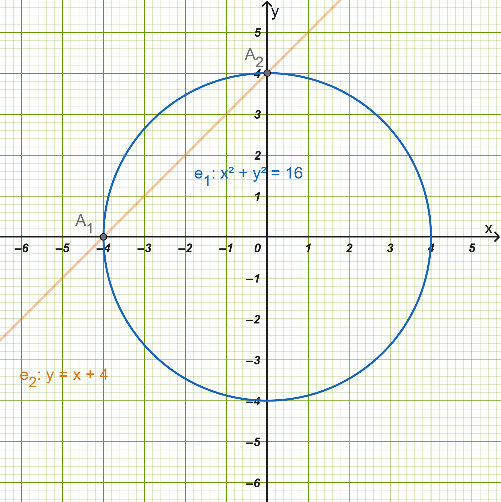{fig-align="center" width="400"}

$x^2 + (x+4)^2 = 16 \implies ................$
:::

7.  Να λυθεί το σύστημα: $\begin{cases} 2x^2 + y = 9 \\ x - y = -3 \end{cases}$

**Κατηγορία Β: Συστήματα 2ου Βαθμού / Συμμετρικά**

7.  Να λυθεί το συμμετρικό σύστημα: $\begin{cases} x + y = 7 \\ x y = 10 \end{cases}$

8.  Να βρεθούν οι λύσεις του συστήματος: $\begin{cases} x^2 + y^2 = 25 \\ x y = 12 \end{cases}$

9.  Να επιλυθεί το σύστημα: $\begin{cases} x^2 + y^2 + x + y = 18 \\ x y = 6 \end{cases}$

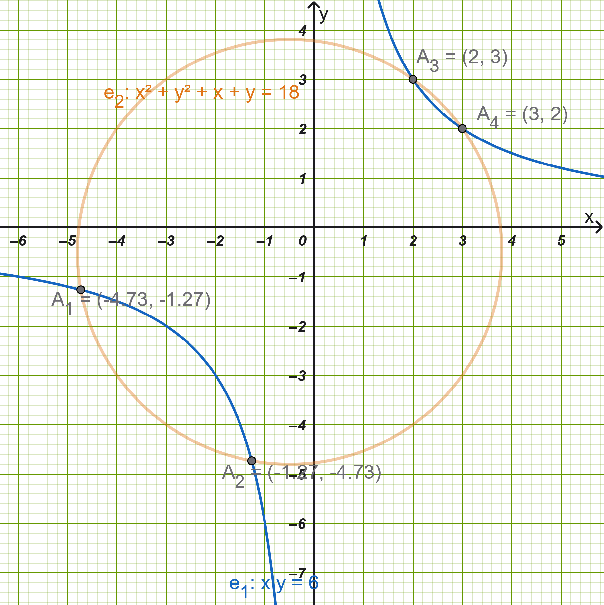{fig-align="center" width="400"}

::: callout-method
**Υπόδειξη**

Πολλαπλασιάζουμε την δεύτερη με 2 και προσθέτουμε

$x^2 + y^2 + x + y +2x y = 18+12 \implies (x+y)^2+(x+y)-30=0 \ \ \ (3)$

Θέτουμε $λ=x+y$, έτσι η εξίσωση (3) γίνεται $λ^2+λ-30=0 \implies λ_{1,2}=.................(5,-6)$

δηλαδή $x+y=5$ και $x+y=-6$

Τώρα πρέπει να λύσουμε τα συστήματα

$\begin{cases} x + y = 5 \\ x y = 6 \end{cases}$

$\begin{cases}  x + y = -6 \\ x y = 6 \end{cases}$

..........................
:::

10. Να λυθεί το σύστημα: $\begin{cases} x^2 + y^2 = 13 \\ x + y + x y = 11 \end{cases}$

11. Να αναχθεί σε γραμμικό ως προς $u = x^2$ και $v = y^2$ και να λυθεί το σύστημα: $\begin{cases} 2x^2 - y^2 = 1 \\ x^2 + 2y^2 = 22 \end{cases}$

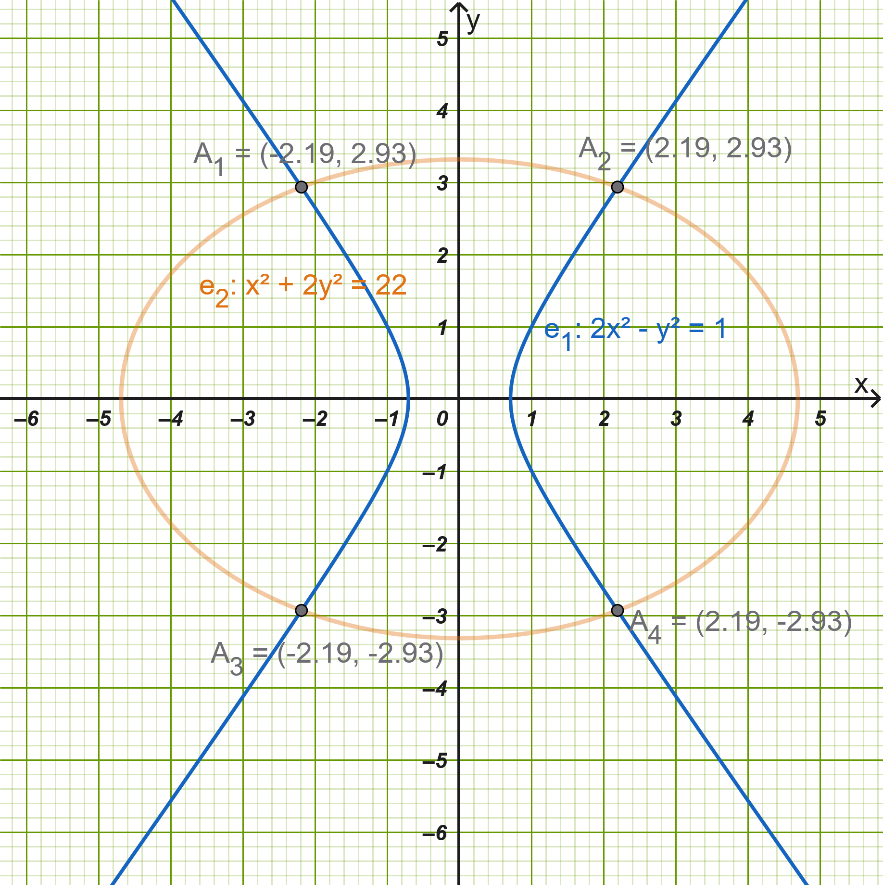{fig-align="center" width="400"}

**Κατηγορία Γ: Εκθετικά, Ειδικές Μορφές**

12. Να λυθεί το εκθετικό σύστημα: $\begin{cases} 2^x + 3^y = 17 \\ 2^{x+1} - 3^y = 7 \end{cases}$

::: callout-method
**Υπόδειξη**

Θέτουμε $2^x=α \Rightarrow 2^{x+1}=2α$ και $3^y=β$, οπότε το σύστημα γίνεται

$\begin{cases} α + β = 17 \\ 2α - β = 7 \end{cases}$

..................................
:::

13. Να λυθεί το σύστημα: $\begin{cases} 3^x \cdot 2^y = 36 \\ 3^{2x} - 2^{2y} = 65 \end{cases}$

::: callout-method
**Υπόδειξη**

θέστε $α = 3^x, β = 2^y$.

Το σύστημα γίνεται $\begin{cases} α \cdot β = 36 \\ α^2 - β^2 = 65 \end{cases}$

Λύστε $α=\dfrac{36}{β}$ και αντικαταστήστε ........
$β^4+65β^2-36^2=0$

Αφού λύσετε την διτετράγωνη μέσω της $λ^2+65λ-36^2=0$, επιστρέψτε στις $α = 3^x, β = 2^y$

Λύση (2,2)

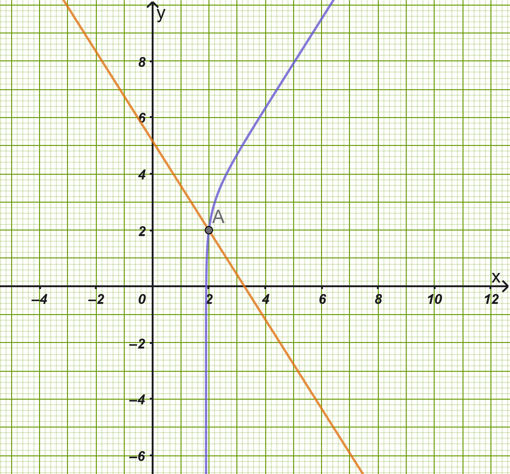{fig-align="center" width="400"}
:::

:::: {.math-box .exercise-box}
::: {.math-title .exercise-title}
14. Να λυθεί το σύστημα :
:::

$\begin{cases} x^2 + y^2 = 5 \\ |x| + |y| = 3 \end{cases}$
::::

:::: {.math-box .solution-box}
::: {.math-title .solution-title}
Λύση του συστήματος

$$
\begin{cases}
x^2 + y^2 = 5 & (1) \\
|x| + |y| = 3 & (2)
\end{cases}
$$
:::

**1: Χρήση της ιδιότητας** $a^2 = |a|^2$

Γνωρίζουμε ότι για κάθε πραγματικό αριθμό ισχύει $x^2 = |x|^2$ και $y^2 = |y|^2$.

Θέτουμε: $$u = |x| \ge 0 \quad \text{και} \quad v = |y| \ge 0$$

Το σύστημα γράφεται: $$
\begin{cases}
u^2 + v^2 = 5 & (3) \\
u + v = 3 & (4)
\end{cases}
$$

------------------------------------------------------------------------

**2: Εύρεση των τιμών των** $u$ και $v$

Υψώνουμε την εξίσωση $(4)$ στο τετράγωνο:

$$(u + v)^2 = 3^2$$

$$u^2 + 2uv + v^2 = 9$$

Αντικαθιστούμε το $u^2 + v^2 = 5$ από την εξίσωση $(3)$:

$$5 + 2uv = 9$$

$$2uv = 4 \implies uv = 2$$

Τώρα έχουμε το άθροισμα και το γινόμενο των $u$ και $v$:

- Άθροισμα: $S = u + v = 3$

- Γινόμενο: $P = uv = 2$

Οι αριθμοί $u$ και $v$ είναι οι ρίζες της δευτεροβάθμιας εξίσωσης: $$t^2 - St + P = 0 \implies t^2 - 3t + 2 = 0$$

Παραγοντοποιούμε: $$(t - 1)(t - 2) = 0 \implies t = 1 \quad \text{ή} \quad t = 2$$

Επομένως, έχουμε δύο περιπτώσεις:

1.  $u = 1$ και $v = 2$

2.  $u = 2$ και $v = 1$

------------------------------------------------------------------------

**3: Εύρεση των** $x$ και $y$

**Περίπτωση 1:** $|x| = 1$ και $|y| = 2$

- $|x| = 1 \implies x = 1$ ή $x = -1$

- $|y| = 2 \implies y = 2$ ή $y = -2$

Αυτό δίνει $4$ ζεύγη λύσεων: $$(1, 2), \quad (1, -2), \quad (-1, 2), \quad (-1, -2)$$

**Περίπτωση 2:** $|x| = 2$ και $|y| = 1$ - $|x| = 2 \implies x = 2$ ή $x = -2$ - $|y| = 1 \implies y = 1$ ή $y = -1$

Αυτό δίνει άλλα $4$ ζεύγη λύσεων: $$(2, 1), \quad (2, -1), \quad (-2, 1), \quad (-2, -1)$$

------------------------------------------------------------------------

**Τελική Λύση**

Το σύστημα έχει $8$ λύσεις:

$$(x, y) \in \{(1, 2), (1, -2), (-1, 2), (-1, -2), (2, 1), (2, -1), (-2, 1), (-2, -1)\}$$

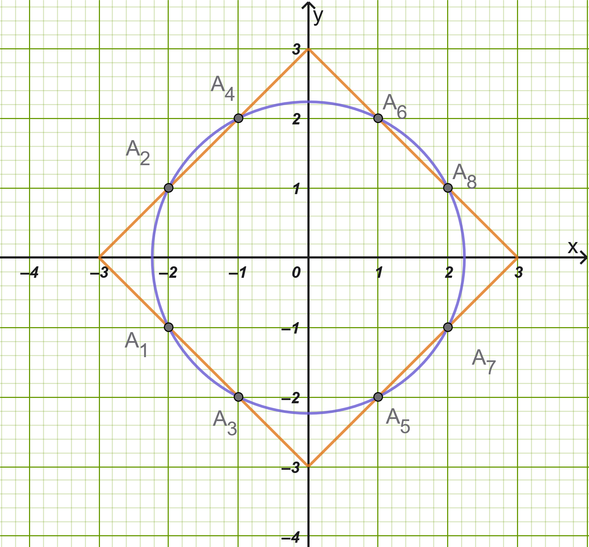{fig-align="center" width="400"}
::::

:::: {.math-box .exercise-box}
::: {.math-title .exercise-title}
15. Να λυθεί το σύστημα:
:::

$\begin{cases} |x| + |y| = 3 \\ x + y = 3 \end{cases}$ .
::::

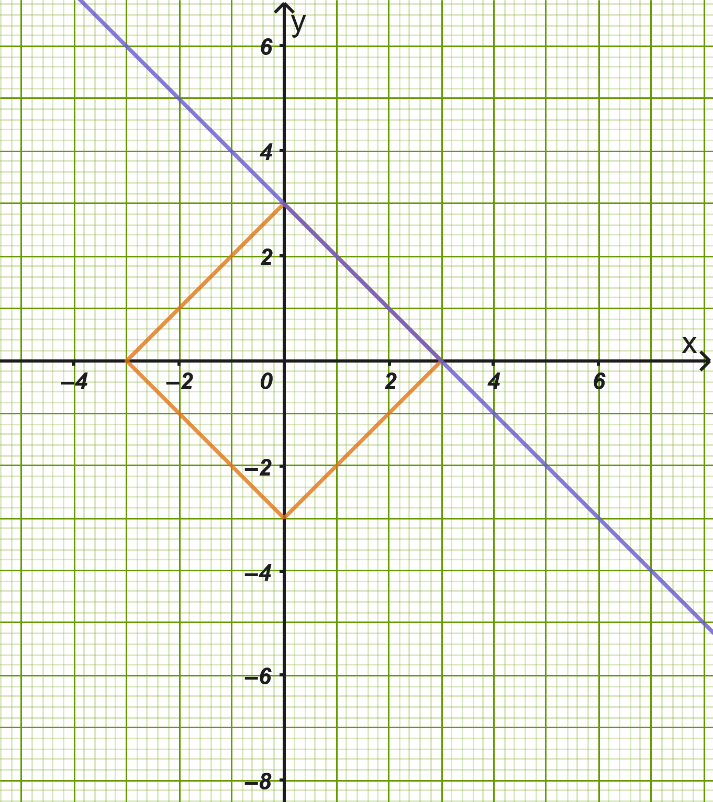{fig-align="center" width="400"}

:::: {.math-box .solution-box}
::: {.math-title .solution-title}
Λύση του συστήματος

$$
\begin{cases}
|x| + |y| = 3 & (1) \\
x + y = 3 & (2)
\end{cases}
$$
:::

**Μέθοδος με βάση τις ιδιότητες των απολύτων τιμών**

Από τη βασική ιδιότητα της απόλυτης τιμής, για κάθε πραγματικό αριθμό ισχύει πάντοτε: $$|x| \ge x \quad \text{και} \quad |y| \ge y$$

Προσθέτοντας αυτές τις δύο ανισότητες κατά μέλη, έχουμε: $$|x| + |y| \ge x + y$$

Στο σύστημά μας όμως, από τις εξισώσεις $(1)$ και $(2)$ έχουμε: $$|x| + |y| = x + y = 3$$

Η ισότητα $|a| = a$ ισχύει **αν και μόνο αν** $a \ge 0$.

Επομένως, για να ισχύει $|x| + |y| = x + y$, πρέπει απαραίτητα: $$x \ge 0 \quad \text{και} \quad y \ge 0$$

------------------------------------------------------------------------

**Εύρεση των λύσεων**

Αφού $x \ge 0$ και $y \ge 0$:

- $|x| = x$

- $|y| = y$

Η πρώτη εξίσωση $|x| + |y| = 3$ ταυτίζεται πλήρως με τη δεύτερη εξίσωση $x + y = 3$.

Από τη δεύτερη εξίσωση έχουμε: $$y = 3 - x$$

Επιπλέον, αφού πρέπει $y \ge 0$: $$3 - x \ge 0 \implies x \le 3$$

Συνδυάζοντας με τον περιορισμό $x \ge 0$, το $x$ παίρνει οποιαδήποτε τιμή στο διάστημα $[0, 3]$.

------------------------------------------------------------------------

**Τελική Λύση**

Το σύστημα έχει **άπειρες λύσεις**, οι οποίες είναι όλα τα ζεύγη της μορφής:

$$(x, y) = (x, 3 - x) \quad \text{με} \quad x \in [0, 3]$$

*(ή ισοδύναμα: όλα τα σημεία* $(x, y)$ του ευθύγραμμου τμήματος που ενώνει τα σημεία $(3, 0)$ και $(0, 3)$ στο 1ο τεταρτημόριο).
::::

16. Να λυθεί το σύστημα: $\begin{cases} x^2 + y^2 + xy = 7 \\ x + y = 3 \end{cases}$

**Κατηγορία Δ: Προβλήματα που οδηγούν σε Μη Γραμμικά Συστήματα**

17. **Πρόβλημα Αριθμών:** Να βρεθούν δύο πραγματικοί αριθμοί με άθροισμα $13$ και άθροισμα τετραγώνων $89$.

18. **Πρόβλημα Ορθογωνίου:** Το εμβαδόν ενός ορθογωνίου παραλληλογράμμου είναι $60\text{ cm}^2$ και η διαγώνιός του είναι $13\text{ cm}$.
    Να υπολογιστούν οι διαστάσεις $x$ και $y$ του ορθογωνίου.

19. **Πρόβλημα Ορθογωνίου Τριγώνου:** Ορθογώνιο τρίγωνο έχει υποτείνουσα μήκους $10\text{ cm}$ και εμβαδόν $24\text{ cm}^2$.
    Να υπολογιστούν τα μήκη των δύο κάθετων πλευρών του.

20. **Πρόβλημα Διαφοράς & Γινομένου:**

Να βρεθούν δύο θετικοί αριθμοί των οποίων η διαφορά είναι $3$ και το γινόμενό τους είναι $28$.

:::: {.math-box .exercise-box}
::: {.math-title .exercise-title}
21. Να λύσετε το σύστημα:
:::

$$
    \begin{cases}
    3xy - y^2 - 4y = 0 & (1) \\
    y = x^2 - 3x + 2 & (2)
    \end{cases}
$$
::::

:::: {.math-box .solution-box}
::: {.math-title .solution-title}
**Λύση:**
:::

Από την εξίσωση $(1)$ βγάζουμε κοινό παράγοντα το $y$: $$y(3x - y - 4) = 0$$

Αυτό σημαίνει ότι: $$y = 0 \quad \text{ή} \quad 3x - y - 4 = 0 \iff y = 3x - 4$$

- **Περίπτωση 1:** $y = 0$

  Αντικαθιστούμε στην $(2)$: $$x^2 - 3x + 2 = 0 \implies (x - 1)(x - 2) = 0 \implies x = 1 \quad \text{ή} \quad x = 2$$

  Λύσεις: $(1, 0)$ και $(2, 0)$.

- **Περίπτωση 2:** $y = 3x - 4$\
  Αντικαθιστούμε στην $(2)$: $$3x - 4 = x^2 - 3x + 2 \implies x^2 - 6x + 6 = 0$$

  Υπολογίζουμε τη διακρίνουσα: $$\Delta = (-6)^2 - 4 \cdot 1 \cdot 6 = 36 - 24 = 12$$

  Οι ρίζες για το $x$ είναι: $$x = \frac{6 \pm \sqrt{12}}{2} = \frac{6 \pm 2\sqrt{3}}{2} = 3 \pm \sqrt{3}$$

  Υπολογίζουμε το αντίστοιχο $y = 3x - 4$:

  - Για $x = 3 + \sqrt{3}$: $y = 3(3 + \sqrt{3}) - 4 = 9 + 3\sqrt{3} - 4 = 5 + 3\sqrt{3}$

  - Για $x = 3 - \sqrt{3}$: $y = 3(3 - \sqrt{3}) - 4 = 9 - 3\sqrt{3} - 4 = 5 - 3\sqrt{3}$

**Τελικές Λύσεις:**

$$(1, 0), \quad (2, 0), \quad (3 + \sqrt{3}, 5 + 3\sqrt{3}), \quad (3 - \sqrt{3}, 5 - 3\sqrt{3})$$
::::

------------------------------------------------------------------------

:::: {.math-box .problem-box}
::: {.math-title .problem-title}
22. **Εκφώνηση:**
:::

Το εμβαδόν ενός ορθογωνίου είναι $96\text{ cm}^2$.
Αν η μία διάστασή του αυξηθεί κατά $4\text{ cm}$ και η άλλη ελαττωθεί κατά $2\text{ cm}$, το εμβαδόν του παραμένει αμετάβλητο.
Να βρείτε τις αρχικές διαστάσεις του ορθογωνίου.
::::

:::: {.math-box .problemsolution-box}
::: {.math-title .problemsolution-title}
**Λύση:**
:::

Έστω $x$ και $y$ οι αρχικές διαστάσεις του ορθογωνίου (με $x > 0$ και $y > 2$).

1.  Από το αρχικό εμβαδόν: $$x \cdot y = 96 \quad (1)$$

2.  Μετά τη μεταβολή των διαστάσεων: $$(x + 4)(y - 2) = 96 \quad (2)$$

Αναπτύσσουμε την εξίσωση $(2)$: $$xy - 2x + 4y - 8 = 96$$

Αντικαθιστούμε $xy = 96$: $$96 - 2x + 4y - 8 = 96 \implies -2x + 4y - 8 = 0$$

Διαιρούμε με το $2$ και λύνουμε ως προς $x$: $$-x + 2y - 4 = 0 \implies x = 2y - 4$$

Αντικαθιστούμε το $x$ στην εξίσωση $(1)$: $$(2y - 4)y = 96 \implies 2y^2 - 4y - 96 = 0 \implies y^2 - 2y - 48 = 0$$

Παραγοντοποιούμε: $$(y - 8)(y + 6) = 0$$

Επειδή το $y$ είναι μήκος, δεχόμαστε μόνο τη θετική τιμή: $$y = 8\text{ cm}$$

Βρίσκουμε το $x$: $$x = \frac{96}{8} = 12\text{ cm}$$

**Τελική Απάντηση:**

Οι αρχικές διαστάσεις του ορθογωνίου είναι $12\text{ cm}$ και $8\text{ cm}$.
::::

------------------------------------------------------------------------

:::: {.math-box .problem-box}
::: {.math-title .problem-title}
23. **Εκφώνηση:**
:::

Δίνεται η παραβολή $y = -2x^2$ και η ευθεία $y = 4x + \lambda$, όπου $\lambda \in \mathbb{R}$.
Να βρείτε για ποιες τιμές του $\lambda$ η ευθεία τέμνει την παραβολή σε δύο διαφορετικά σημεία.
::::

:::: {.math-box .problemsolution-box}
::: {.math-title .problemsolution-title}
**Λύση:**
:::

<iframe src="https://www.geogebra.org/calculator/dwenygga?embed" width="730" height="600" allowfullscreen style="border: 1px solid #e4e4e4;border-radius: 4px;" frameborder="0">

</iframe>

::: callout-sos
**Οδηγία για διερεύνηση του προβλήματος**

Για αυξομείωση του δρομέα με ακρίβεια δέκατου αφού τον επιλέξετε, πατήστε [Shift]{.kbd-1}+[< ή >]{.kbd-1}
:::

------------------------------------------------------------------------

Τα κοινά σημεία προκύπτουν από την εξίσωση: $$-2x^2 = 4x + \lambda \implies 2x^2 + 4x + \lambda = 0$$

Για να τέμνει η ευθεία την παραβολή σε δύο διαφορετικά σημεία, πρέπει η παραπάνω δευτεροβάθμια εξίσωση να έχει δύο άνισες πραγματικές ρίζες, δηλαδή η διακρίνουσα να είναι θετική ($\Delta > 0$):

$$\Delta = 4^2 - 4 \cdot 2 \cdot \lambda = 16 - 8\lambda$$

Απαιτούμε: $$16 - 8\lambda > 0 \implies 16 > 8\lambda \implies \lambda < 2$$

**Τελική Απάντηση:**

Η ευθεία τέμνει την παραβολή σε δύο διαφορετικά σημεία όταν $\lambda < 2$.
:::

------------------------------------------------------------------------

:::: {.math-box .exercise-box}
::: {.math-title .exercise-title}
24. **Εκφώνηση:**
:::

Να λύσετε το σύστημα: $$
\begin{cases}
4y = x^2 \\
y = x + \mu
\end{cases}
$$ για τις διάφορες τιμές της παραμέτρου $\mu \in \mathbb{R}$ και να ερμηνεύσετε γεωμετρικά το αποτέλεσμα.
::::

:::: {.math-box .solution-box}
::: {.math-title .solution-title}
**Λύση:**
:::

Αντικαθιστούμε το $y = x + \mu$ στην πρώτη εξίσωση: $$4(x + \mu) = x^2 \implies x^2 - 4x - 4\mu = 0$$

Υπολογίζουμε τη διακρίνουσα: $$\Delta = (-4)^2 - 4 \cdot 1 \cdot (-4\mu) = 16 + 16\mu = 16(1 + \mu)$$

Διερευνούμε το πρόσημο της διακρίνουσας:

1.  **Αν** $\mu > -1$ ($\Delta > 0$):

    Η εξίσωση έχει δύο άνισες πραγματικές ρίζες: $$x_{1,2} = \frac{4 \pm \sqrt{16(\mu + 1)}}{2} = 2 \pm 2\sqrt{\mu + 1}$$

    Το σύστημα έχει **δύο λύσεις**.

    *Γεωμετρική ερμηνεία:* Η ευθεία **τέμνει** την παραβολή σε δύο διαφορετικά σημεία.

2.  **Αν** $\mu = -1$ ($\Delta = 0$):

    Η εξίσωση έχει μία διπλή ρίζα: $$x = \frac{4}{2} = 2 \implies y = 2 + (-1) = 1$$

    Το σύστημα έχει **μοναδική λύση** το ζεύγος $(2, 1)$.

    *Γεωμετρική ερμηνεία:* Η ευθεία **εφάπτεται** στην παραβολή στο σημείο $(2, 1)$.

3.  **Αν** $\mu < -1$ ($\Delta < 0$):

    Η εξίσωση είναι αδύνατη στο $\mathbb{R}$.

    Το σύστημα **δεν έχει πραγματικές λύσεις**.

    *Γεωμετρική ερμηνεία:* Η ευθεία **δεν έχει κοινά σημεία** με την παραβολή (βρίσκεται εξωτερικά αυτής).
::::

------------------------------------------------------------------------

:::: {.math-box .problem-box}
::: {.math-title .problem-title}
25. **Εκφώνηση:**\
:::

Σήμερα, η ηλικία μιας γυναίκας είναι διπλάσια από την ηλικία του γιου της, ενώ πριν από δέκα χρόνια ήταν τριπλάσια.
Ποια είναι η σημερινή ηλικία της μητέρας και ποια του γιου;
::::

:::: {.math-box .problemsolution-box}
::: {.math-title .problemsolution-title}
**Λύση:**
:::

Ας υποθέσουμε ότι σε έτη:

Η σημερινή ηλικία της μητέρας είναι $x$ και του γιου είναι $y$.

Άρα, πριν από $10$ χρόνια η ηλικία της μητέρας ήταν $x - 10$ και του γιου $y - 10$.

Επομένως, σύμφωνα με την εκφώνηση του προβλήματος, έχουμε τις εξισώσεις: $$x = 2y$$ $$x - 10 = 3(y - 10)$$

Οι οποίες πρέπει να επαληθεύονται για τις ίδιες τιμές των $x$ και $y$.
Δηλαδή, έχουμε προς επίλυση το σύστημα: $$\begin{cases} x = 2y \\ x - 10 = 3(y - 10) \end{cases}$$

Από την επίλυση του συστήματος βρίσκουμε: $$x = 40 \quad \text{και} \quad y = 20$$

Συνεπώς, σήμερα η μητέρα είναι ηλικίας $40$ ετών και ο γιος $20$ ετών.
::::

------------------------------------------------------------------------

:::: {.math-box .problem-box}
::: {.math-title .problem-title}
26. **Εκφώνηση:**\
:::

Να βρεθεί τριψήφιος φυσικός αριθμός, του οποίου το άθροισμα των ψηφίων είναι $13$, το ψηφίο των δεκάδων είναι τετραπλάσιο από το ψηφίο των εκατοντάδων, και αν αντιστρέψουμε τη σειρά των ψηφίων του προκύπτει αριθμός που υπερβαίνει τον ζητούμενο κατά $99$.
::::

:::: {.math-box .problemsolution-box}
::: {.math-title .problemsolution-title}
**Λύση:**
:::

Έστω $\overline{xy\omega}$ ο ζητούμενος τριψήφιος φυσικός αριθμός.

Τότε, σύμφωνα με τα δεδομένα του προβλήματος, τα ψηφία $x, y, \omega$ θα επαληθεύουν το σύστημα: $$\begin{cases} 
x + y + \omega = 13 \\ 
y = 4x \\ 
100\omega + 10y + x = 100x + 10y + \omega + 99 
\end{cases}$$

Επιλύοντας αυτό το σύστημα, βρίσκουμε: $$x = 2, \quad y = 8 \quad \text{και} \quad \omega = 3$$

Επομένως, ο ζητούμενος αριθμός είναι ο $283$, καθώς ικανοποιεί όλες τις απαιτήσεις που τέθηκαν από το πρόβλημα.
::::

------------------------------------------------------------------------

:::: {.math-box .problem-box}
::: {.math-title .problem-title}
27. Εκφώνηση
:::

Όταν δύο οικοδόμοι, ο $\text{A}$ και ο $\text{B}$, εργάζονται χωριστά, ο $\text{A}$ κτίζει $3$ τούβλα περισσότερα από τον $\text{B}$ ανά λεπτό της ώρας.\
Όταν όμως εργάζονται μαζί, η απόδοσή τους μειώνεται στα $\dfrac{2}{3}$ εκείνης που έχουν όταν εργάζονται χωριστά, και έτσι τοποθετούν $10$ τούβλα ανά λεπτό.\
Πόσα τούβλα τοποθετεί ανά λεπτό όταν εργάζεται μόνος του ο $\text{A}$ και πόσα ο $\text{B}$;
::::

:::: {.math-box .problemsolution-box}
::: {.math-title .problemsolution-title}
**Λύση:**
:::

Έστω:

- $x$: τα τούβλα που κτίζει ο $\text{A}$ ανά λεπτό μόνος του.

- $y$: τα τούβλα που κτίζει ο $\text{B}$ ανά λεπτό μόνος του.

Από την πρώτη συνθήκη: $$x - y = 3 \implies x = y + 3$$

Όταν εργάζονται χωριστά, η συνολική τους απόδοση ανά λεπτό είναι $x + y$.

Όταν εργάζονται μαζί, η απόδοσή τους είναι τα $\dfrac{2}{3}$ του αθροίσματος αυτού και ισούται με $10$: $$\frac{2}{3}(x + y) = 10$$

Πολλαπλασιάζουμε και τα δύο μέλη με $\dfrac{3}{2}$: $$x + y = 10 \cdot \frac{3}{2} = 15$$

Αντικαθιστούμε το $x = y + 3$: $$(y + 3) + y = 15$$ $$2y + 3 = 15$$ $$2y = 12 \implies y = 6$$

Βρίσκουμε το $x$: $$x = 6 + 3 = 9$$

**Απάντηση:**

Όταν εργάζεται μόνος του, ο $\text{A}$ τοποθετεί $9$ τούβλα ανά λεπτό και ο $\text{B}$ τοποθετεί $6$ τούβλα ανά λεπτό.
::::

------------------------------------------------------------------------

:::: {.math-box .problem-box}
::: {.math-title .problem-title}
28. Εκφώνηση
:::

Στα φαρμακεία διατίθενται τρία είδη θρεπτικών χαπιών, τα οποία περιέχουν βιταμίνες $\text{A}$, $\text{B}$ και $\text{C}$:

- Το $1^\circ$ είδος περιέχει: $1$ μονάδα $\text{A}$, $3$ μονάδες $\text{B}$ και $4$ μονάδες $\text{C}$.

- Το $2^\circ$ είδος περιέχει: $2$ μονάδες $\text{A}$, $3$ μονάδες $\text{B}$ και $5$ μονάδες $\text{C}$.

- Το $3^\circ$ είδος περιέχει: $3$ μονάδες $\text{A}$, $0$ μονάδες $\text{B}$ και $3$ μονάδες $\text{C}$.

Να βρεθεί πόσα χάπια από κάθε είδος πρέπει να πάρουμε, ώστε να εξασφαλίσουμε:

- **(α)** Ακριβώς $11$ μονάδες βιταμίνης $\text{A}$, $9$ μονάδες βιταμίνης $\text{B}$ και $20$ μονάδες βιταμίνης $\text{C}$.

- **(β)** Γενικά $11\nu$ μονάδες $\text{A}$, $9\nu$ μονάδες $\text{B}$ και $20\nu$ μονάδες $\text{C}$, όπου $\nu \in \mathbb{N}^*$ (φυσικός αριθμός).
::::

:::: {.math-box .problemsolution-box}
::: {.math-title .problemsolution-title}
**Λύση:**
:::

Έστω $x, y, z$ ο αριθμός των χαπιών από το $1^\circ$, $2^\circ$ και $3^\circ$ είδος αντίστοιχα ($x, y, z \in \mathbb{N}_0$).

**Ερώτημα (α):**

Σχηματίζουμε τις εξισώσεις για κάθε βιταμίνη: $$\begin{cases} 
x + 2y + 3z = 11 & (\text{βιταμίνη A}) \quad (1) \\ 
3x + 3y = 9 & (\text{βιταμίνη B}) \quad (2) \\ 
4x + 5y + 3z = 20 & (\text{βιταμίνη C}) \quad (3) 
\end{cases}$$

Από την εξίσωση $(2)$, διαιρώντας με το $3$: $$x + y = 3 \implies y = 3 - x \quad (4)$$

Αφαιρούμε την εξίσωση $(1)$ από την εξίσωση $(3)$: $$(4x + 5y + 3z) - (x + 2y + 3z) = 20 - 11$$ $$3x + 3y = 9 \implies x + y = 3$$

Η εξίσωση αυτή ταυτίζεται με τη $(2)$, άρα το σύστημα είναι αόριστο με μία ελεύθερη μεταβλητή.

Εκφράζουμε τα $y$ και $z$ συναρτήσει του $x$: Από την $(4)$: $$y = 3 - x$$

Αντικαθιστούμε το $y$ στην εξίσωση $(1)$: $$x + 2(3 - x) + 3z = 11$$ $$x + 6 - 2x + 3z = 11$$ $$-x + 3z = 5 \implies 3z = x + 5 \implies z = \frac{x + 5}{3}$$

Επειδή τα $x, y, z$ πρέπει να είναι μη αρνητικοί ακέραιοι αριθμοί:

1.  Από το $y = 3 - x \ge 0$, έχουμε $x \le 3$.
    Άρα $x \in \{0, 1, 2, 3\}$.

2.  Το $z = \dfrac{x + 5}{3}$ πρέπει να είναι ακέραιος, άρα το $x + 5$ πρέπει να διαιρείται με το $3$.

    - Αν $x = 0 \implies z = \dfrac{5}{3}$ (απορρίπτεται)

    - Αν $x = 1 \implies z = \dfrac{6}{3} = 2$ (δεκτό)

    - Αν $x = 2 \implies z = \dfrac{7}{3}$ (απορρίπτεται)

    - Αν $x = 3 \implies z = \dfrac{8}{3}$ (απορρίπτεται)

Για $x = 1$:

$$y = 3 - 1 = 2$$ $$z = 2$$

**Απάντηση (α):**

Πρέπει να πάρουμε $1$ χάπι από το $1^\circ$ είδος, $2$ χάπια από το $2^\circ$ είδος και $2$ χάπια από το $3^\circ$ είδος.

------------------------------------------------------------------------

**Ερώτημα (β):**

Το σύστημα γίνεται: $$\begin{cases} 
x + 2y + 3z = 11\nu \\ 
3x + 3y = 9\nu \implies x + y = 3\nu \\ 
4x + 5y + 3z = 20\nu 
\end{cases}$$

Με την ίδια μέθοδο: $$y = 3\nu - x$$ $$z = \frac{x + 5\nu}{3}$$

Για να είναι τα $x, y, z$ ανάλογα της παραμέτρου $\nu$, η βασική φυσική λύση προκύπτει πολλαπλασιάζοντας τη λύση του (α) επί $\nu$: $$x = \nu, \quad y = 2\nu, \quad z = 2\nu$$

*(Γενικότερα, οποιαδήποτε επιλογή* $x$ τέτοια ώστε $0 \le x \le 3\nu$ και $x + 5\nu$ πολλαπλάσιο του $3$ δίνει δεκτή λύση).

**Απάντηση (β):**

Μια γενική λύση είναι $\nu$ χάπια από το $1^\circ$ είδος, $2\nu$ χάπια από το $2^\circ$ είδος και $2\nu$ χάπια από το $3^\circ$ είδος.
::::

------------------------------------------------------------------------

:::: {.math-box .problem-box}
::: {.math-title .problem-title}
29. Εκφώνηση
:::

Να επιλυθεί το προηγούμενο πρόβλημα (28), ώστε να εξασφαλίσουμε:

- **(α)** Ακριβώς $20$ μονάδες $\text{A}$, $9$ μονάδες $\text{B}$ και $11$ μονάδες $\text{C}$.

- **(β)** Ακριβώς $9$ μονάδες $\text{A}$, $11$ μονάδες $\text{B}$ και $20$ μονάδες $\text{C}$.
::::

:::: {.math-box .problemsolution-box}
::: {.math-title .problemsolution-title}
**Λύση:**
:::

**Ερώτημα (α):**

Στήνουμε το σύστημα: $$\begin{cases} 
x + 2y + 3z = 20 & (1) \\ 
3x + 3y = 9 \implies x + y = 3 & (2) \\ 
4x + 5y + 3z = 11 & (3) 
\end{cases}$$

Αφαιρούμε την $(1)$ από την $(3)$: $$(4x + 5y + 3z) - (x + 2y + 3z) = 11 - 20$$ $$3x + 3y = -9 \implies x + y = -3$$

Όμως από την εξίσωση $(2)$ έχουμε $x + y = 3$.

Έτσι προκύπτει: $$3 = -3 \quad (\text{άτοπο})$$

**Απάντηση (α):**

Το σύστημα είναι **αδύνατο**, επομένως **δεν υπάρχει συνδυασμός χαπιών** που να δίνει τις συγκεκριμένες ποσότητες βιταμινών.

------------------------------------------------------------------------

**Ερώτημα (β):**

Στήνουμε το σύστημα: $$\begin{cases} 
x + 2y + 3z = 9 & (1) \\ 
3x + 3y = 11 & (2) \\ 
4x + 5y + 3z = 20 & (3) 
\end{cases}$$

Παρατηρούμε την εξίσωση $(2)$: $$3(x + y) = 11 \implies x + y = \frac{11}{3}$$

Επειδή ο αριθμός των χαπιών $x$ και $y$ πρέπει να είναι ακέραιοι αριθμοί, το άθροισμά τους $x + y$ οφείλει να είναι ακέραιος.
Ο αριθμός $\frac{11}{3}$ δεν είναι ακέραιος.

**Απάντηση (β):**

Το πρόβλημα **δεν έχει λύση** στο σύνολο των φυσικών αριθμών (δεν μπορούμε να πάρουμε κλάσματα χαπιών).
::::

------------------------------------------------------------------------

:::: {.math-box .problem-box}
::: {.math-title .problem-title}
30. Εκφώνηση
:::

Ένας άνδρας λέει στον φίλο του: «Πριν από $8$ χρόνια η ηλικία μου ήταν εξαπλάσια από την ηλικία του γιου μου, αλλά του χρόνου η ηλικία μου θα είναι τριπλάσια από τη δική του».
Ποια είναι η σημερινή ηλικία του πατέρα και ποια του γιου;
::::

:::: {.math-box .problemsolution-box}
::: {.math-title .problemsolution-title}
**Λύση:**
:::

Έστω:

- $x$: η σημερινή ηλικία του πατέρα (σε έτη)

- $y$: η σημερινή ηλικία του γιου (σε έτη)

1.  Πριν από $8$ χρόνια: $$x - 8 = 6(y - 8) \implies x - 8 = 6y - 48 \implies x = 6y - 40 \quad (1)$$

2.  Του χρόνου (σε $1$ χρόνο): $$x + 1 = 3(y + 1) \implies x + 1 = 3y + 3 \implies x = 3y + 2 \quad (2)$$

Εξισώνουμε τα δύο δεξιά μέλη: $$6y - 40 = 3y + 2$$ $$3y = 42 \implies y = 14$$

Αντικαθιστούμε στην $(2)$: $$x = 3 \cdot 14 + 2 = 42 + 2 = 44$$

**Απάντηση:** Ο πατέρας είναι $44$ ετών και ο γιος $14$ ετών.
::::

------------------------------------------------------------------------

:::: {.math-box .problem-box}
::: {.math-title .problem-title}
31. Εκφώνηση
:::

Όταν ένας άνδρας ρωτήθηκε για την ηλικία της συζύγου του παρουσία της, απάντησε σωστά αλλά με διακριτικό τρόπο ως εξής: «Τώρα οι ηλικίες και των δύο μας έχουν άθροισμα $94$ έτη, αλλά πριν από $25$ χρόνια η ηλικία της συζύγου μου ήταν τα $\dfrac{5}{6}$ της τότε δικής μου».
Ποια είναι η σημερινή ηλικία της συζύγου;
::::

:::: {.math-box .problemsolution-box}
::: {.math-title .problemsolution-title}
**Λύση:**
:::

Έστω:

- $a$: η σημερινή ηλικία του συζύγου

- $g$: η σημερινή ηλικία της συζύγου

1.  Σήμερα: $$a + g = 94 \implies a = 94 - g$$

2.  Πριν από $25$ χρόνια: $$g - 25 = \frac{5}{6}(a - 25)$$

Πολλαπλασιάζουμε με το $6$: $$6(g - 25) = 5(a - 25)$$ $$6g - 150 = 5a - 125$$

Αντικαθιστούμε το $a = 94 - g$: $$6g - 150 = 5(94 - g) - 125$$ $$6g - 150 = 470 - 5g - 125$$ $$6g - 150 = 345 - 5g$$ $$11g = 495 \implies g = 45$$

*(Ο σύζυγος είναι* $a = 94 - 45 = 49$ ετών).

**Απάντηση:** Η σύζυγος είναι $45$ ετών.
::::

------------------------------------------------------------------------

:::: {.math-box .problem-box}
::: {.math-title .problem-title}
32. Εκφώνηση
:::

Να βρεθεί διψήφιος ακέραιος αριθμός διαιρετός με το $9$, ο οποίος είναι κατά $45$ μεγαλύτερος από τον αριθμό που προκύπτει με αντιμετάθεση των ψηφίων του.
::::

:::: {.math-box .problemsolution-box}
::: {.math-title .problemsolution-title}
**Λύση:**
:::

Έστω $N = \overline{xy} = 10x + y$ ο διψήφιος αριθμός ($x \in \{1, \dots, 9\}$ και $y \in \{0, \dots, 9\}$).

Ο αριθμός με αντεστραμμένα τα ψηφία είναι $N' = \overline{yx} = 10y + x$.

1.  Από τη διαφορά τους: $$N - N' = 45$$ $$(10x + y) - (10y + x) = 45$$ $$9x - 9y = 45 \implies x - y = 5 \implies x = y + 5$$

2.  Ο αριθμός διαιρείται με το $9$, άρα το άθροισμα των ψηφίων του $x + y$ είναι πολλαπλάσιο του $9$.

    Αντικαθιστούμε το $x = y + 5$: $$x + y = (y + 5) + y = 2y + 5$$

    Επειδή $0 \le y \le 4$ (ώστε $x = y + 5 \le 9$):

    - Αν $y = 0 \implies 2y + 5 = 5$ (δεν διαιρείται με το $9$)

    - Αν $y = 1 \implies 2y + 5 = 7$ (δεν διαιρείται με το $9$)

    - Αν $y = 2 \implies 2y + 5 = 9$ (διαιρείται με το $9$!)

    - Για μεγαλύτερα $y$, το $2y + 5 < 18$, άρα δεν υπάρχει άλλο πολλαπλάσιο.

Για $y = 2$, βρίσκουμε $x = 2 + 5 = 7$.

**Απάντηση:** Ο ζητούμενος αριθμός είναι ο $72$ (επαλήθευση: $72 - 27 = 45$).
::::

------------------------------------------------------------------------

:::: {.math-box .problem-box}
::: {.math-title .problem-title}
33. Εκφώνηση
:::

Η ηλικία του Έλληνα μαθηματικού Διοφάντου κατά τον θάνατό του μπορεί να υπολογιστεί από το παρακάτω επίγραμμα που ήταν γραμμένο στον τάφο του:

«Ο Διόφαντος έζησε ως παιδί το $\dfrac{1}{6}$ της ζωής του, ως έφηβος το $\dfrac{1}{12}$ και ακόμη ως άγαμος το $\dfrac{1}{7}$.
Πέντε χρόνια μετά τον γάμο του απέκτησε γιο, ο οποίος πέθανε $4$ χρόνια πριν από τον θάνατο του πατέρα του, σε ηλικία που ήταν το μισό της ηλικίας που είχε όταν πέθανε ο Διόφαντος».

Σε ποια ηλικία πέθανε ο Διόφαντος;
::::

:::: {.math-box .problemsolution-box}
::: {.math-title .problemsolution-title}
**Λύση:**
:::

Έστω $x$ τα συνολικά έτη που έζησε ο Διόφαντος.

Αναλύουμε τα μέρη της ζωής του:

- Παιδική ηλικία: $\dfrac{x}{6}$

- Εφηβεία: $\dfrac{x}{12}$

- Άγαμος βίος: $\dfrac{x}{7}$

- Μέχρι να αποκτήσει γιο: $5$ χρόνια

- Διάρκεια ζωής του γιου: $\dfrac{x}{2}$

- Χρόνια που έζησε μετά τον θάνατο του γιου του: $4$ χρόνια

Το άθροισμα όλων αυτών ισούται με ολόκληρη τη ζωή του $x$: $$\frac{x}{6} + \frac{x}{12} + \frac{x}{7} + 5 + \frac{x}{2} + 4 = x$$ $$\left(\frac{1}{6} + \frac{1}{12} + \frac{1}{7} + \frac{1}{2}\right)x + 9 = x$$

Βρίσκουμε το κοινό παρονομαστή: $\text{ΕΚΠ}(6, 12, 7, 2) = 84$.
$$\left(\frac{14 + 7 + 12 + 42}{84}\right)x + 9 = x$$ $$\frac{75}{84}x + 9 = x$$ $$x - \frac{75}{84}x = 9$$ $$\frac{9}{84}x = 9 \implies x = 84$$

**Απάντηση:** Ο Διόφαντος πέθανε σε ηλικία $84$ ετών.
::::

------------------------------------------------------------------------

:::: {.math-box .problem-box}
::: {.math-title .problem-title}
34. Εκφώνηση
:::

Ποδηλάτης που κινείται με ταχύτητα $20\text{ km/h}$ καταδιώκεται από περιπολικό με ταχύτητα $80\text{ km/h}$, το οποίο αναχώρησε $20$ λεπτά της ώρας μετά τον ποδηλάτη και από σημείο που απέχει $18\text{ km}$ από το σημείο εκκίνησης του ποδηλάτη.

Μετά από πόσο χρόνο (από την εκκίνηση του περιπολικού) θα φτάσουν οι αστυνομικοί τον ποδηλάτη, αν:

1.  Το σημείο εκκίνησης του περιπολικού βρίσκεται προς την κατεύθυνση κίνησης του ποδηλάτη;

2.  Το σημείο εκκίνησης του περιπολικού βρίσκεται στην αντίθετη κατεύθυνση;

Ποια απόσταση θα έχει διανύσει σε κάθε περίπτωση ο ποδηλάτης και ποια το περιπολικό;
::::

:::: {.math-box .problemsolution-box}
::: {.math-title .problemsolution-title}
**Λύση:**
:::

Έστω:

- Ταχύτητα ποδηλάτη: $v_1 = 20\text{ km/h}$

- Ταχύτητα περιπολικού: $v_2 = 80\text{ km/h}$

- Χρόνος προπορείας: $\Delta t = 20\text{ min} = \dfrac{20}{60}\text{ h} = \dfrac{1}{3}\text{ h}$

- Απόσταση που διένυσε ο ποδηλάτης στα $20$ λεπτά: $s_0 = 20 \cdot \dfrac{1}{3} = \dfrac{20}{3}\text{ km}$

Έστω $t$ ο χρόνος κίνησης του περιπολικού (σε ώρες).

**Περίπτωση 1: Το σημείο εκκίνησης του περιπολικού βρίσκεται προς την κατεύθυνση κίνησης του ποδηλάτη.**

Το περιπολικό ξεκινά $18\text{ km}$ πιο μπροστά από την αφετηρία του ποδηλάτη.

Τη στιγμή εκκίνησης του περιπολικού, ο ποδηλάτης απέχει από την αφετηρία του $\dfrac{20}{3}\text{ km}$, άρα βρίσκεται $18 - \dfrac{20}{3} = \dfrac{34}{3}\text{ km}$ **πίσω** από το περιπολικό.

Επειδή το περιπολικό κινείται ταχύτερα ($80 > 20$) και απομακρύνεται προς την ίδια κατεύθυνση, η απόστασή τους συνεχώς αυξάνεται και δεν θα συναντηθούν ποτέ.

*(Σημείωση: Για να υπάρξει συνάντηση καταδίωξης, το περιπολικό κινείται προς τον ποδηλάτη, δηλαδή με αντίθετη φορά έως ότου τον συναντήσει μετωπικά σε* $t = \dfrac{34/3}{80 + 20} = \dfrac{17}{150}\text{ h} = 6,8\text{ λεπτά}$).

**Περίπτωση 2: Το σημείο εκκίνησης του περιπολικού βρίσκεται προς την αντίθετη κατεύθυνση.**

Το περιπολικό ξεκινά $18\text{ km}$ πίσω από την αφετηρία του ποδηλάτη.

Τη στιγμή που ξεκινά το περιπολικό, η απόσταση του ποδηλάτη από αυτό είναι: $$d = 18 + \frac{20}{3} = \frac{74}{3}\text{ km}$$

Η σχετική ταχύτητα προσέγγισης είναι: $$v_{\text{σχετ}} = v_2 - v_1 = 80 - 20 = 60\text{ km/h}$$

Ο χρόνος μέχρι να τον φτάσει είναι: $$t = \frac{d}{v_{\text{σχετ}}} = \frac{\frac{74}{3}}{60} = \frac{74}{180}\text{ h} = \frac{37}{90}\text{ h} \approx 24\text{ λεπτά και } 40\text{ δευτερόλεπτα}$$

- **Απόσταση περιπολικού:** $$S_2 = v_2 \cdot t = 80 \cdot \frac{37}{90} = \frac{2.960}{90} = \frac{296}{9} \approx 32,89\text{ km}$$

- **Απόσταση ποδηλάτη (συνολική):** $$S_1 = S_2 - 18 = \frac{296}{9} - 18 = \frac{134}{9} \approx 14,89\text{ km}$$
::::

------------------------------------------------------------------------

:::: {.math-box .problem-box}
::: {.math-title .problem-title}
35. Εκφώνηση
:::

Φαρμακοποιός διαθέτει απεσταγμένο νερό και οινόπνευμα περιεκτικότητας $96^\circ$.
Πόσο οινόπνευμα των $96^\circ$ (σε γραμμάρια) πρέπει να αναμείξει με $100$ γραμμάρια νερού, ώστε να παρασκευάσει οινόπνευμα $74^\circ$;
::::

:::: {.math-box .problemsolution-box}
::: {.math-title .problemsolution-title}
**Λύση:**
:::

Έστω $x$ τα γραμμάρια του οινοπνεύματος $96^\circ$.

Το νερό έχει περιεκτικότητα $0^\circ$ σε καθαρό οινόπνευμα.

Η ποσότητα της καθαρής αλκοόλης πριν και μετά την ανάμειξη παραμένει σταθερή: $$x \cdot 0,96 + 100 \cdot 0 = (x + 100) \cdot 0,74$$ $$0,96x = 0,74x + 74$$ $$0,22x = 74$$ $$x = \frac{74}{0,22} = \frac{7.400}{22} = \frac{3.700}{11} \approx 336,36\text{ g}$$

**Απάντηση:** Πρέπει να αναμείξει $\dfrac{3.700}{11}\text{ g} \approx 336,36\text{ γραμμάρια}$ οινοπνεύματος $96^\circ$.
::::

------------------------------------------------------------------------

:::: {.math-box .problem-box}
::: {.math-title .problem-title}
36. Εκφώνηση
:::

Να βρεθεί γενικός τύπος για τον άμεσο υπολογισμό της απαιτούμενης ποσότητας οινοπνεύματος περιεκτικότητας $A^\circ$, καθώς και της ποσότητας οινοπνεύματος περιεκτικότητας $B^\circ$, ώστε από την ανάμειξή τους να προκύψουν $M$ γραμμάρια οινοπνεύματος περιεκτικότητας $\Gamma^\circ$ (όπου $A < \Gamma < B$).
::::

:::: {.math-box .problemsolution-box}
::: {.math-title .problemsolution-title}
**Λύση:**
:::

Έστω:

- $x$: τα γραμμάρια οινοπνεύματος βαθμού $A^\circ$

- $y$: τα γραμμάρια οινοπνεύματος βαθμού $B^\circ$

Ισχύουν:

1.  $x + y = M \implies y = M - x$

2.  $A \cdot x + B \cdot y = \Gamma \cdot M$

Αντικαθιστούμε το $y$: $$A \cdot x + B(M - x) = \Gamma \cdot M$$ $$A \cdot x + B \cdot M - B \cdot x = \Gamma \cdot M$$ $$(B - A)x = (B - \Gamma)M \implies x = \frac{B - \Gamma}{B - A} \cdot M$$

Αντίστοιχα για το $y$: $$y = M - x = M - \frac{B - \Gamma}{B - A} \cdot M = \frac{(B - A) - (B - \Gamma)}{B - A} \cdot M \implies y = \frac{\Gamma - A}{B - A} \cdot M$$

**Απάντηση:** $$x = \frac{B - \Gamma}{B - A} \cdot M \quad \text{και} \quad y = \frac{\Gamma - A}{B - A} \cdot M$$
::::

------------------------------------------------------------------------

:::: {.math-box .problem-box}
::: {.math-title .problem-title}
37. Εκφώνηση
:::

Να βρεθεί διψήφιος ακέραιος αριθμός διαιρετός με το $9$, του οποίου το ψηφίο των δεκάδων είναι διπλάσιο από το ψηφίο των μονάδων.
::::

:::: {.math-box .problemsolution-box}
::: {.math-title .problemsolution-title}
**Λύση:**
:::

Έστω $N = \overline{xy}$ ο αριθμός, όπου $x$ το ψηφίο των δεκάδων και $y$ το ψηφίο των μονάδων ($x, y \in \{0, 1, \dots, 9\}$, $x \ne 0$).

1.  Από τα δεδομένα: $$x = 2y$$

2.  Επειδή διαιρείται με το $9$, το άθροισμα των ψηφίων του $x + y$ είναι πολλαπλάσιο του $9$: $$x + y = 2y + y = 3y$$

    Άρα το $3y$ πρέπει να είναι πολλαπλάσιο του $9$, που σημαίνει ότι το $y$ πρέπει να είναι πολλαπλάσιο του $3$.

    Επομένως, $y \in \{0, 3, 6, 9\}$.

    - Αν $y = 0 \implies x = 0$ (απορρίπτεται, γιατί ο αριθμός είναι διψήφιος).

    - Αν $y = 3 \implies x = 2 \cdot 3 = 6$ (δεκτό, αφού $6 \le 9$).

    - Αν $y = 6 \implies x = 12$ (απορρίπτεται, διότι $x \le 9$).

Άρα $x = 6$ και $y = 3$.

**Απάντηση:** Ο αριθμός είναι ο $63$.
::::

------------------------------------------------------------------------

:::: {.math-box .problem-box}
::: {.math-title .problem-title}
38. Εκφώνηση
:::

Δύο τρένα που κινούνται ομαλά αναχωρούν ταυτόχρονα από δύο πόλεις με κατεύθυνση το ένα προς το άλλο και συναντώνται μετά από $3$ ώρες.
Να βρεθεί η ταχύτητα του ταχύτερου τρένου, αν η ταχύτητά του υπερβαίνει την ταχύτητα του άλλου κατά $15\text{ km/h}$, η δε απόσταση μεταξύ των δύο πόλεων είναι $297\text{ km}$.
::::

:::: {.math-box .problemsolution-box}
::: {.math-title .problemsolution-title}
**Λύση:**
:::

Έστω:

- $v$: η ταχύτητα του βραδύτερου τρένου (σε $\text{km/h}$)

- $v + 15$: η ταχύτητα του ταχύτερου τρένου (σε $\text{km/h}$)

Τα τρένα κινούνται αντίθετα για $t = 3\text{ h}$, άρα το άθροισμα των αποστάσεων που διανύουν ισούται με τη συνολική απόσταση των $297\text{ km}$: $$3v + 3(v + 15) = 297$$ $$3v + 3v + 45 = 297$$ $$6v = 252 \implies v = 42\text{ km/h}$$

Η ταχύτητα του ταχύτερου τρένου είναι: $$v_{\text{ταχ}} = 42 + 15 = 57\text{ km/h}$$

**Απάντηση:** Η ταχύτητα του ταχύτερου τρένου είναι $57\text{ km/h}$.
::::

------------------------------------------------------------------------

:::: {.math-box .problem-box}
::: {.math-title .problem-title}
39. Εκφώνηση
:::

Να βρεθεί τριψήφιος ακέραιος αριθμός, του οποίου το ψηφίο των εκατοντάδων είναι τριπλάσιο από το ψηφίο των δεκάδων, ενώ το ψηφίο των δεκάδων ισούται με το μισό του ψηφίου των μονάδων και είναι κατά $4$ μικρότερο από το ψηφίο των εκατοντάδων.
::::

:::: {.math-box .problemsolution-box}
::: {.math-title .problemsolution-title}
**Λύση:**
:::

Έστω ο αριθμός $N = \overline{xyz}$, όπου:

- $x$: το ψηφίο των εκατοντάδων

- $y$: το ψηφίο των δεκάδων

- $z$: το ψηφίο των μονάδων

Από τα δεδομένα του προβλήματος:

1.  $x = 3y \quad (1)$

2.  $y = \dfrac{z}{2} \implies z = 2y \quad (2)$

3.  $y = x - 4 \quad (3)$

Αντικαθιστούμε το $x = 3y$ από την $(1)$ στην $(3)$: $$y = 3y - 4$$ $$2y = 4 \implies y = 2$$

Βρίσκουμε τα υπόλοιπα ψηφία:

- $x = 3 \cdot 2 = 6$

- $z = 2 \cdot 2 = 4$

Όλα τα ψηφία είναι μονοψήφιοι φυσικοί αριθμοί και επαληθεύουν πλήρως τις σχέσεις ($6 = 3 \cdot 2$, $2 = 4/2$, $2 = 6 - 4$).

**Απάντηση:** Ο ζητούμενος αριθμός είναι ο $624$.
::::

------------------------------------------------------------------------

::: {.callout-tip style="color: brown;"}
ΚΑΛΗ ΜΕΛΕΤΗ!
:::

