```{=html}
<!-- Φόρτωση βιβλιοθήκης GeoGebra -->
<script src="https://www.geogebra.org/apps/deployggb.js"></script>

<!-- Συνάρτηση δημιουργίας applets -->
<script>
function createGeoGebra(containerId, materialId, width = 700, height = 500) {
  var params = {
    "id": "ggb-" + containerId,
    "material_id": materialId,
    "width": width,
    "height": height,
    "showToolBar": true,
    "showMenuBar": false,
    "showAlgebraInput": true
  };
  
  var applet = new GGBApplet(params, '5.2');
  applet.inject(containerId);
}
</script>
```

## Μονοτονία - Ακρότατα - Συμμετρίες Συνάρτησης

### Μονοτονία Συνάρτησης

#### Ορισμοί

:::: {.math-box .definition-box}
::: {.math-title .definition-title}
Ορισμοί
:::

- **Γνησίως αύξουσα συνάρτηση:** Μια συνάρτηση $f$ λέγεται γνησίως αύξουσα σε ένα διάστημα $\Delta$ του πεδίου ορισμού της, όταν για οποιαδήποτε $x_1, x_2 \in \Delta$ με $x_1 < x_2$ ισχύει $f(x_1) < f(x_2)$.

  Για να δηλώσουμε ότι η συνάρτηση ƒ είναι γνησίως αύξουσα στο διάστημα Δ γράφουμε $f \mathrel{\substack{\uparrow \\[-0.6ex] \wedge}} Δ$.

- **Γνησίως φθίνουσα συνάρτηση:** Μια συνάρτηση $f$ λέγεται γνησίως φθίνουσα σε ένα διάστημα $\Delta$ του πεδίου ορισμού της, όταν για οποιαδήποτε $x_1, x_2 \in \Delta$ με $x_1 < x_2$ ισχύει $f(x_1) > f(x_2)$.

Για να δηλώσουμε ότι η συνάρτηση ƒ είναι γνησίως φθίνουσα στο διάστημα Δ γράφουμε $f \mathrel{\substack{\vee \\[-0.6ex] \downarrow}} \Delta$.

- Μια συνάρτηση που είναι είτε γνησίως αύξουσα είτε γνησίως φθίνουσα σε ένα διάστημα $\Delta$ ονομάζεται **γνησίως μονότονη** στο $\Delta$.
::::

------------------------------------------------------------------------

#### Παραδείγματα

1.  **Παράδειγμα 1 (Γνησίως αύξουσα):**

    Έστω η συνάρτηση $f(x) = 2x - 3$ στο $\mathbb{R}$.

    Για οποιαδήποτε $x_1, x_2 \in \mathbb{R}$ με $x_1 < x_2$, έχουμε: $$x_1 < x_2 \implies 2x_1 < 2x_2 \implies 2x_1 - 3 < 2x_2 - 3 \implies f(x_1) < f(x_2)$$

    Άρα, η $f$ είναι γνησίως αύξουσα στο $\mathbb{R}$.

2.  **Παράδειγμα 2 (Γνησίως φθίνουσα):**

    Έστω η συνάρτηση $g(x) = -2x + 5$ στο $\mathbb{R}$.

    Για οποιαδήποτε $x_1, x_2 \in \mathbb{R}$ με $x_1 < x_2$, έχουμε: $$x_1 < x_2 \implies -2x_1 > -2x_2 \implies -2x_1 + 5 > -2x_2 + 5 \implies g(x_1) > g(x_2)$$

    Άρα, η $g$ είναι γνησίως φθίνουσα στο $\mathbb{R}$.

------------------------------------------------------------------------

#### Μονοτονία της συνάρτησης $f(x) = \alpha x + \beta$

Για τη γραμμική συνάρτηση $f(x) = \alpha x + \beta$ με $\alpha \neq 0$:

<iframe src="https://www.geogebra.org/calculator/dnnp9zy9?embed" width="730" height="600" allowfullscreen style="border: 1px solid #e4e4e4;border-radius: 4px;" frameborder="0">

</iframe>

> > Αλλάξτε την τιμή των α και β από τους αντίστοιχους δρομείς

- **Αν** $\alpha > 0$: Η συνάρτηση είναι **γνησίως αύξουσα** στο $\mathbb{R}$.

- **Αν** $\alpha < 0$: Η συνάρτηση είναι **γνησίως φθίνουσα** στο $\mathbb{R}$.

------------------------------------------------------------------------

### Ελάχιστο και Μέγιστο Συνάρτησης (Ακρότατα)

#### Ορισμοί

:::: {.math-box .definition-box}
::: {.math-title .definition-title}
Ορισμοί
:::

- **(Ολικό) Ελάχιστο:** Μια συνάρτηση $f$ με πεδίο ορισμού $A$, λέμε ότι παρουσιάζει στο $x_0 \in A$ (ολικό) ελάχιστο όταν ισχύει $f(x) \ge f(x_0)$ για κάθε $x \in A$.
  Το $x_0$ ονομάζεται **θέση ελαχίστου**, ενώ η τιμή $f(x_0)$ ονομάζεται **ολικό ελάχιστο** ή ελάχιστο της $f$ ($\min f(x)$).

- **(Ολικό) Μέγιστο:** Μια συνάρτηση $f$ με πεδίο ορισμού $A$, λέμε ότι παρουσιάζει στο $x_0 \in A$ (ολικό) μέγιστο όταν ισχύει $f(x) \le f(x_0)$ για κάθε $x \in A$.
  Το $x_0$ ονομάζεται **θέση μεγίστου**, ενώ η τιμή $f(x_0)$ ονομάζεται **ολικό μέγιστο** ή μέγιστο της $f$ ($\max f(x)$).

- Το μέγιστο και το ελάχιστο μιας συνάρτησης ονομάζονται **ολικά ακρότατα** της συνάρτησης.
::::

------------------------------------------------------------------------

#### Παραδείγματα Συναρτήσεων

1.  **Συνάρτηση με μόνο ελάχιστο:** Η $f(x) = x^2$ στο $\mathbb{R}$ παρουσιάζει ελάχιστο στο $x_0 = 0$, το $f(0) = 0$, αφού $x^2 \ge 0 = f(0)$ για κάθε $x \in \mathbb{R}$. Δεν παρουσιάζει μέγιστο.

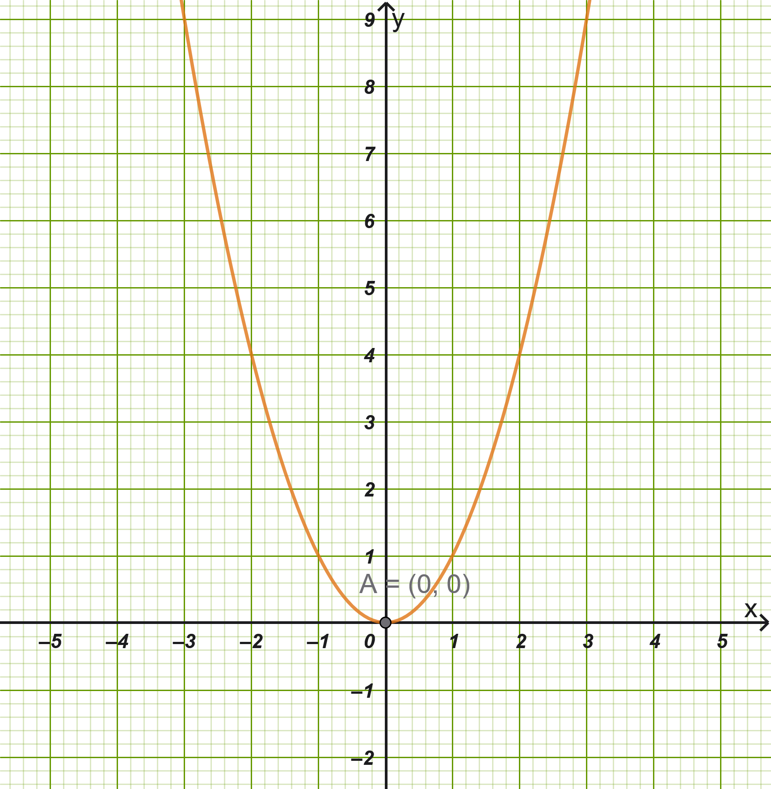{fig-align="center" width="350"}

2.  **Συνάρτηση με μόνο μέγιστο:** Η $g(x) = -x^2 + 1$ στο $\mathbb{R}$ παρουσιάζει μέγιστο στο $x_0 = 0$, το $g(0) = 1$, αφού $-x^2 + 1 \le 1 = g(0)$ για κάθε $x \in \mathbb{R}$. Δεν παρουσιάζει ελάχιστο.

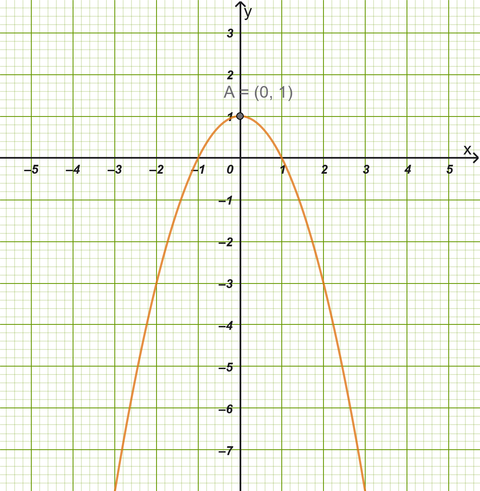{fig-align="center" width="350"}

3.  **Συνάρτηση με μέγιστο και τοπικό ελάχιστο:** $y=-x^4+x^2+3$

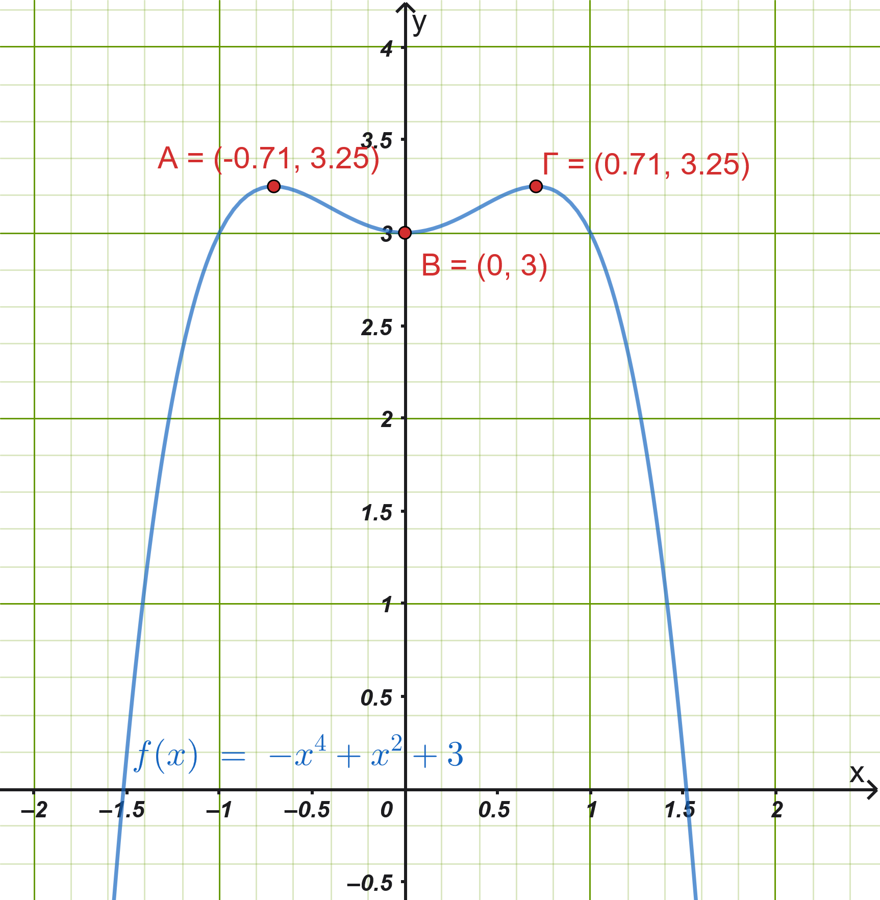{fig-align="center" width="350"}

4.  **Συνάρτηση που δεν έχει ούτε μέγιστο ούτε ελάχιστο:** Η ευθεία $k(x) = 3x + 2$ στο $\mathbb{R}$ είναι γνησίως αύξουσα σε ανοικτό πεδίο ορισμού και δεν παρουσιάζει ούτε μέγιστο ούτε ελάχιστο.

------------------------------------------------------------------------

### Για να έχει μια πολυωνυμική συνάρτηση **και μέγιστο και ελάχιστο**,

διακρίνουμε δύο περιπτώσεις, ανάλογα με το πεδίο ορισμού της και το αν αναφερόμαστε σε ολικά ή τοπικά ακρότατα:

------------------------------------------------------------------------

#### Ολικά Ακρότατα (σε Κλειστό Διάστημα)

Στο σύνολο των πραγματικών αριθμών $\mathbb{R}$ (ανοικτό πεδίο ορισμού), **καμία πολυωνυμική συνάρτηση δεν μπορεί να έχει ταυτόχρονα ολικό μέγιστο και ολικό ελάχιστο**:

- Οι **περιττού βαθμού** (π.χ. $f(x)=x^3$) τείνουν στο $+\infty$ και στο $-\infty$, οπότε δεν έχουν κανένα ολικό ακρότατο.

- Οι **άρτιου βαθμού** (π.χ. $f(x)=x^2$) έχουν μόνο ολικό ελάχιστο (αν ο μεγιστοβάθμιος συντελεστής είναι θετικός) ή μόνο ολικό μέγιστο (αν είναι αρνητικός).

**Όμως**, αν περιορίσουμε το πεδίο ορισμού σε ένα **κλειστό διάστημα** $[\alpha, \beta]$, τότε η συνάρτηση αποκτά **και ολικό μέγιστο και ολικό ελάχιστο**.

#### Παραδείγματα

**Παράδειγμα 1 (Πολυώνυμο 2ου Βαθμού σε Κλειστό Διάστημα)**

Έστω η συνάρτηση: $$f(x) = x^2 \quad \text{με πεδίο ορισμού } A = [-1, 2]$$

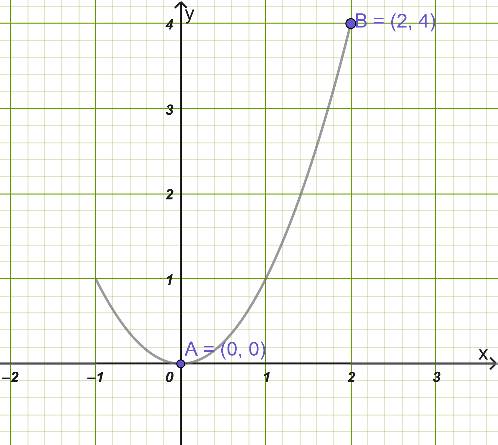{fig-align="center" width="350"}

- **Ελάχιστο:** Επειδή $x^2 \ge 0$ για κάθε $x \in [-1, 2]$ και $f(0) = 0$, η $f$ παρουσιάζει **ολικό ελάχιστο** στη θέση $x_0 = 0$, το $\min f(x) = f(0) = 0$.

- **Μέγιστο:** Για τις τιμές του διαστήματος $[-1, 2]$, η μεγαλύτερη τιμή προκύπτει στο δεξί άκρο $x = 2$, όπου $f(2) = 2^2 = 4$.
  Επειδή $f(x) \le 4$ για κάθε $x \in [-1, 2]$, η $f$ παρουσιάζει **ολικό μέγιστο** στη θέση $x_0 = 2$, το $\max f(x) = f(2) = 4$.

**Παράδειγμα 2 (Γραμμικό Πολυώνυμο σε Κλειστό Διάστημα)**

Έστω η συνάρτηση: $$g(x) = 2x + 1 \quad \text{με πεδίο ορισμού } A =\left[1,5\right]$$

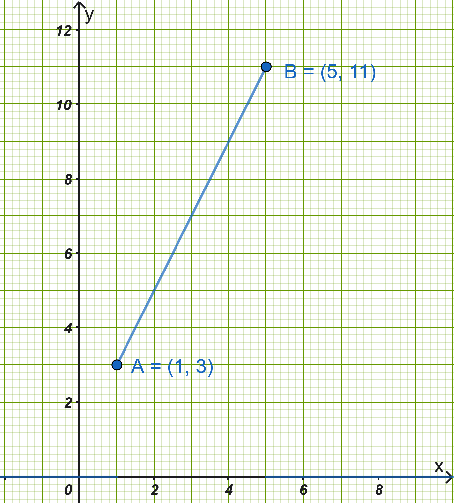{fig-align="center" width="350"}

- **Ελάχιστο:** Στο αριστερό άκρο $x = 1$, έχουμε $g(1) = 3$, άρα $\min g(x) = g(1) = 3$.

- **Μέγιστο:** Στο δεξί άκρο $x = 5$, έχουμε $g(5) = 11$, άρα $\max g(x) = g(5) = 11$.

------------------------------------------------------------------------

#### Τοπικά Ακρότατα (στο $\mathbb{R}$)

Αν αναφερόμαστε σε **τοπικά ακρότατα** (δηλαδή ακρότατα σε περιοχές του πεδίου ορισμού στο $\mathbb{R}$), τότε ένα πολυώνυμο 3ου βαθμού (ή ανώτερου) μπορεί να παρουσιάζει **και τοπικό μέγιστο και τοπικό ελάχιστο**.

**Παράδειγμα 3 (Πολυώνυμο 3ου Βαθμού στο** $\mathbb{R}$)

Έστω η συνάρτηση: $$h(x) = x^3 - 3x \quad \text{με πεδίο ορισμού } A = \mathbb{R}$$

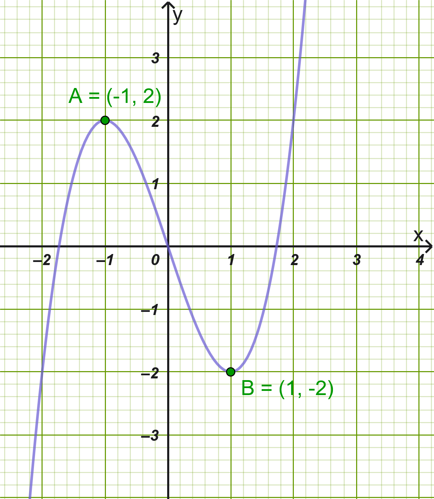{fig-align="center" width="350"}

- **Τοπικό Μέγιστο:** Παρουσιάζει στο $x_0 = -1$ με τιμή $h(-1) = (-1)^3 - 3(-1) = 2$.

- **Τοπικό Ελάχιστο:** Παρουσιάζει στο $x_0 = 1$ με τιμή $h(1) = 1^3 - 3(1) = -2$.

------------------------------------------------------------------------

### Η εύρεση των ακροτάτων

(ολικού μεγίστου και ολικού ελάχιστου) μιας συνάρτησης γίνεται είτε με **γραφικό τρόπο** (μέσω της μελέτης της γραφικής της παράστασης) είτε με **αλγεβρικό τρόπο** (με τη βοήθεια αλγεβρικών προσαρμογών και ανισοτήτων).

#### Γραφικός Τρόπος Ευρέσεως Ακροτάτων

Στον γραφικό τρόπο, παρατηρούμε τη γραφική παράσταση $C_f$ της συνάρτησης στο πεδίο ορισμού της:

- **Ολικό Ελάχιστο:** Αναζητούμε το **χαμηλότερο σημείο** της γραφικής παράστασης.
  Αν το σημείο αυτό έχει συντεταγμένες $(x_0, y_0)$, τότε η θέση ελαχίστου είναι το $x_0$ και η ελάχιστη τιμή της συνάρτησης είναι το $y_0 = f(x_0)$, διότι $f(x) \ge f(x_0)$ για κάθε $x \in A$.

- **Ολικό Μέγιστο:** Αναζητούμε το **ψηλότερο σημείο** της γραφικής παράστασης.
  Αν το σημείο αυτό έχει συντεταγμένες $(x_1, y_1)$, τότε η θέση μεγίστου είναι το $x_1$ και η μέγιστη τιμή είναι το $y_1 = f(x_1)$, διότι $f(x) \le f(x_1)$ για κάθε $x \in A$.

**Παράδειγμα Γραφικής Ανάγνωσης**

Έστω η συνάρτηση $f(x) = -x^2 + 4x - 1$ ορισμένη στο κλειστό διάστημα $A =\left[0,4\right]$.

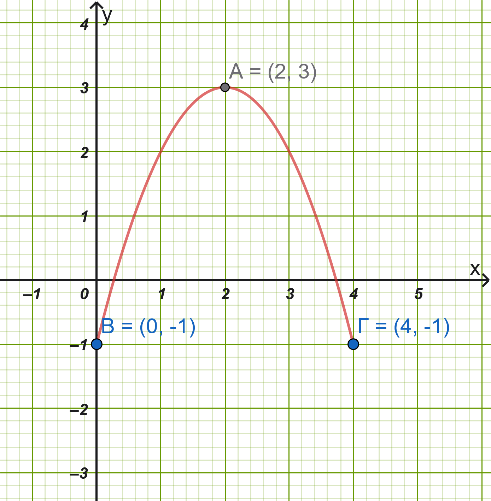{fig-align="center" width="350"}

- Σχεδιάζοντας τη παραβολή, η κορυφή της βρίσκεται στο σημείο $A(2, 3)$, το οποίο είναι το **ψηλότερο σημείο** της καμπύλης στο $A$.
  Συνεπώς, η $f$ παρουσιάζει **ολικό μέγιστο** στη θέση $x_0 = 2$, με μέγιστη τιμή $f(2) = 3$.

- Στα άκρα του διαστήματος $x = 0$ και $x = 4$, η συνάρτηση παίρνει την τιμή $f(0) = f(4) = -1$, που αντιστοιχεί στα **χαμηλότερα σημεία** της γραφικής παράστασης στα $B$ και $Γ$.
  Συνεπώς, η $f$ παρουσιάζει **ολικό ελάχιστο** στις θέσεις $x = 0$ και $x = 4$, με ελάχιστη τιμή $\min f(x) = -1$.

------------------------------------------------------------------------

#### Αλγεβρικός Τρόπος Ευρέσεως Ακροτάτων

Στον αλγεβρικό τρόπο, χρησιμοποιούμε γνωστές ανισοτικές ιδιότητες (όπως $x^2 \ge 0$ ή $|x| \ge 0$) για να αποδείξουμε ότι η συνάρτηση φράσσεται από μία σταθερή τιμή.

**Α) Μέθοδος Συμπλήρωσης Τετραγώνου (για Δευτεροβάθμιες Συναρτήσεις)**

Κάθε συνάρτηση της μορφής $f(x) = \alpha x^2 + \beta x + \gamma$ με $\alpha \neq 0$ μετασχηματίζεται στη μορφή: $$f(x) = \alpha \left( x + \frac{\beta}{2\alpha} \right)^2 - \frac{\Delta}{4\alpha}$$

1.  **Αν** $\alpha > 0$: Επειδή $\left( x + \dfrac{\beta}{2\alpha} \right)^2 \ge 0$ για κάθε $x \in \mathbb{R}$, προκύπτει ότι $f(x) \ge -\dfrac{\Delta}{4\alpha}$.

    Άρα η συνάρτηση παρουσιάζει **ολικό ελάχιστο** στη θέση $x_0 = -\dfrac{\beta}{2\alpha}$, με ελάχιστη τιμή $f(x_0) = -\dfrac{\Delta}{4\alpha}$.

2.  **Αν** $\alpha < 0$: Επειδή $\alpha \left( x + \dfrac{\beta}{2\alpha} \right)^2 \le 0$ για κάθε $x \in \mathbb{R}$, προκύπτει ότι $f(x) \le -\dfrac{\Delta}{4\alpha}$.
    Άρα η συνάρτηση παρουσιάζει **ολικό μέγιστο** στη θέση $x_0 = -\dfrac{\beta}{2\alpha}$, με μέγιστη τιμή $f(x_0) = -\dfrac{\Delta}{4\alpha}$.

**Αναλυτικό Αλγεβρικό Παράδειγμα**

Να βρεθούν τα ακρότατα της συνάρτησης $f(x) = x^2 - 6x + 10$ στο $\mathbb{R}$.

**Λύση:**

Μετασχηματίζουμε τον τύπο της συνάρτησης συμπληρώνοντας το τετράγωνο: $$f(x) = x^2 - 6x + 9 + 1 = (x - 3)^2 + 1$$

Για κάθε $x \in \mathbb{R}$ ισχύει: $$(x - 3)^2 \ge 0 \implies (x - 3)^2 + 1 \ge 1 \implies f(x) \ge 1$$

Επειδή για $x_0 = 3$ έχουμε $f(3) = (3 - 3)^2 + 1 = 1$, ισχύει $f(x) \ge f(3)$ για κάθε $x \in \mathbb{R}$.
Συνεπώς, η $f$ παρουσιάζει **ολικό ελάχιστο** στη θέση $x_0 = 3$, το $\min f(x) = f(3) = 1$.

------------------------------------------------------------------------

### Άρτια και Περιττή Συνάρτηση - Συμμετρίες

#### Άρτια Συνάρτηση

:::: {.math-box .definition-box}
::: {.math-title .definition-title}
Ορισμός
:::

- Μια συνάρτηση $f$, με πεδίο ορισμού ένα σύνολο $A$, λέγεται **άρτια**, όταν για κάθε $x \in A$ ισχύει $-x \in A$ (το $A$ είναι συμμετρικό ως προς το $0$) και $f(-x) = f(x)$.
::::

- **Συμμετρία:** Η γραφική παράσταση $C_f$ μιας άρτιας συνάρτησης έχει **άξονα συμμετρίας τον άξονα** $y'y$.

- **Παράδειγμα:** Η συνάρτηση $f(x) = x^4 - 2x^2$ με $A = \mathbb{R}$ είναι άρτια, διότι: $$f(-x) = (-x)^4 - 2(-x)^2 = x^4 - 2x^2 = f(x)$$

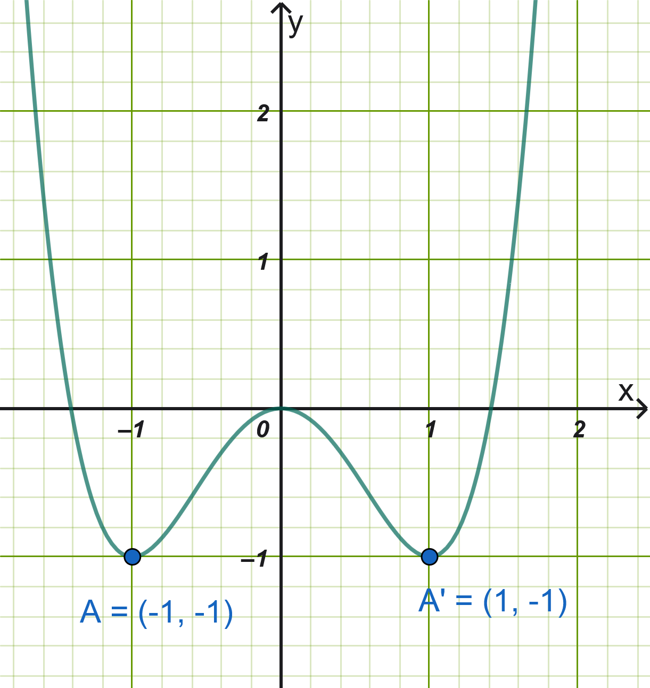{width="300"} 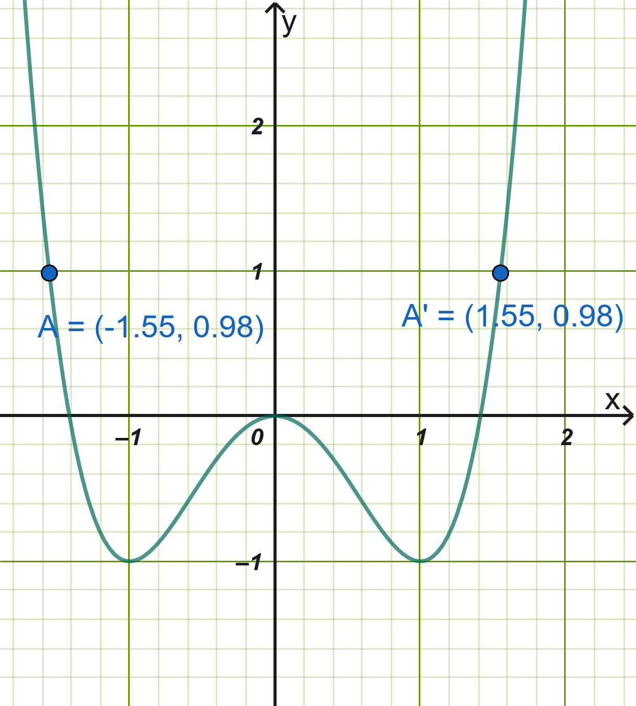{width="300"}

Συνεπώς, η γραφική της παράσταση είναι συμμετρική ως προς τον άξονα $y'y$.

#### Περιττή Συνάρτηση

:::: {.math-box .definition-box}
::: {.math-title .definition-title}
Ορισμός
:::

- Μια συνάρτηση $f$, με πεδίο ορισμού ένα σύνολο $A$, λέγεται **περιττή**, όταν για κάθε $x \in A$ ισχύει $-x \in A$ και $f(-x) = -f(x)$.
::::

- **Συμμετρία:** Η γραφική παράσταση $C_f$ μιας περιττής συνάρτησης έχει **κέντρο συμμετρίας την αρχή των αξόνων** $O(0,0)$.

- **Παράδειγμα:** Η συνάρτηση $g(x) = 2x^3 - 5x$ με $A = \mathbb{R}$ είναι περιττή, διότι: $$g(-x) = 2(-x)^3 - 5(-x) = -2x^3 + 5x = -(2x^3 - 5x) = -g(x)$$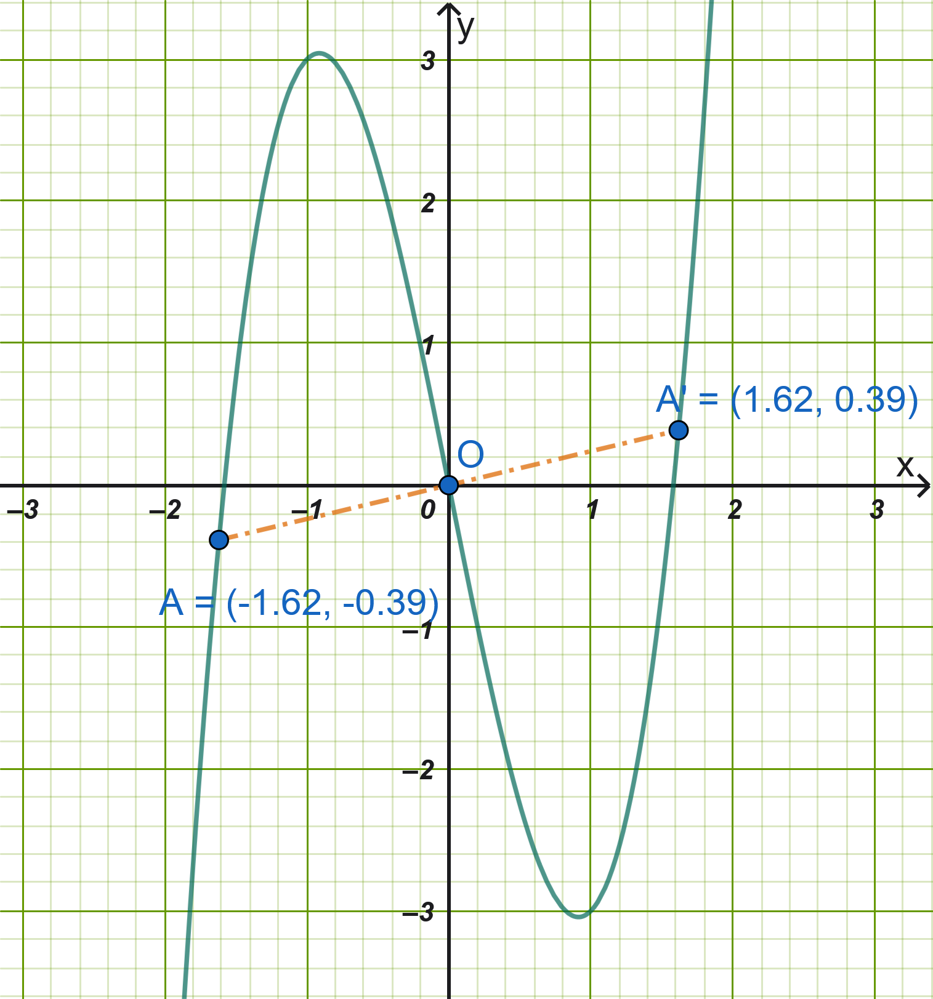{width="300"}
  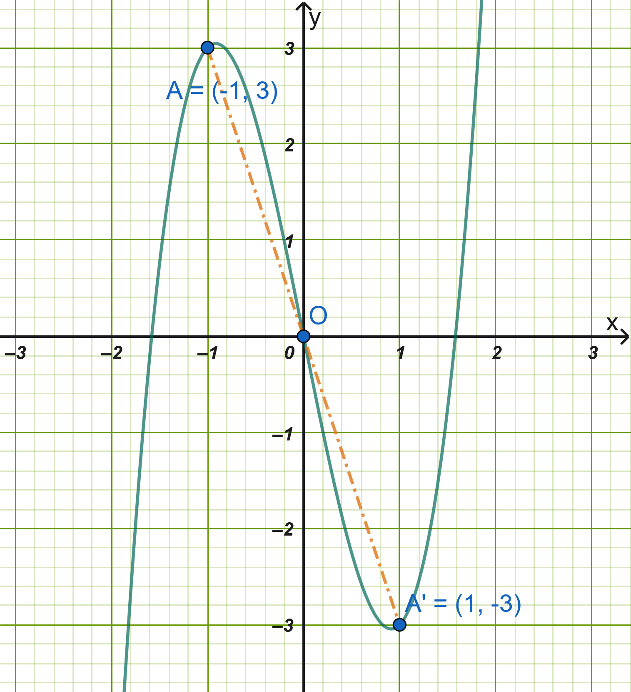{width="300"}

  Συνεπώς, η γραφική της παράσταση έχει κέντρο συμμετρίας το $O(0,0)$.

------------------------------------------------------------------------

### Ασκήσεις και Προβλήματα

#### Θέμα Α: Μονοτονία Συνάρτησης

1.  Να εξεταστούν ως προς τη μονοτονία στο $\mathbb{R}$ οι συναρτήσεις: $$\text{α) } f(x) = 4x - 5, \quad \text{β) } g(x) = 3 - 2x$$

2.  Να μελετηθεί η μονοτονία της συνάρτησης $f(x) = 3x^2 + 2$ στο διάστημα $[0, +\infty)$ και στο $(-\infty, 0]$.

3.  Να αποδειχθεί ότι η συνάρτηση $f(x) = \dfrac{1}{x}$ είναι γνησίως φθίνουσα στο $(0, +\infty)$ και στο $(-\infty, 0)$.

:::: {.math-box .exercise-box}
::: {.math-title .exercise-title}
4.  Εκφώνηση
:::

Να βρεθούν οι τιμές της παραμέτρου $\lambda \in \mathbb{R}$ ώστε η συνάρτηση $f(x) = (2\lambda - 6)x + 1$ να είναι γνησίως φθίνουσα στο $\mathbb{R}$.
::::

:::: {.math-box .solution-box}
::: {.math-title .solution-title}
Λύση
:::

Η συνάρτηση είναι της μορφής: $$f(x) = \alpha x + \beta$$ όπου $\alpha = 2\lambda - 6$ και $\beta = 1$.

------------------------------------------------------------------------

**Συνθήκη Μονοτονίας**

Μια γραμμική συνάρτηση $f(x) = \alpha x + \beta$ είναι **γνησίως φθίνουσα** στο $\mathbb{R}$ αν και μόνο αν ο συντελεστής διεύθυνσης $\alpha$ είναι αρνητικός: $$\alpha < 0$$

------------------------------------------------------------------------

**Επίλυση Ανίσωσης**

Εφαρμόζουμε τη συνθήκη για $\alpha = 2\lambda - 6$: $$2\lambda - 6 < 0$$

Προσθέτουμε το $6$ και στα δύο μέλη: $$2\lambda < 6$$

Διαιρούμε με το $2$ (καθώς $2 > 0$, η φορά της ανίσωσης παραμένει ίδια): $$\lambda < 3$$

------------------------------------------------------------------------

**Απάντηση**

Οι τιμές της παραμέτρου $\lambda \in \mathbb{R}$ ώστε η συνάρτηση να είναι γνησίως φθίνουσα στο $\mathbb{R}$ είναι: $$\lambda < 3 \quad \text{ή} \quad \lambda \in (-\infty, 3)$$
::::

:::: {.math-box .exercise-box}
::: {.math-title .exercise-title}
5.  Εκφώνηση
:::

Να εξεταστεί η μονοτονία της συνάρτησης $f(x) = 2x + |x - 1|$ στα διαστήματα $(-\infty, 1]$ και $[1, +\infty)$.
::::

:::: {.math-box .solution-box}
::: {.math-title .solution-title}
Λύση
:::

Για να εξετάσουμε τη μονοτονία της συνάρτησης: $$f(x) = 2x + |x - 1|$$ απαλείφουμε αρχικά την απόλυτη τιμή με βάση το πρόσημο της παράστασης $x - 1$.

Από τον ορισμό της απόλυτης τιμής: $$|x - 1| = \begin{cases} -(x - 1) = -x + 1, & \text{αν } x \le 1 \\ x - 1, & \text{αν } x \ge 1 \end{cases}$$

------------------------------------------------------------------------

**1. Στο διάστημα** $(-\infty, 1]$

Για κάθε $x \in (-\infty, 1]$, ισχύει $x - 1 \le 0$, επομένως: $$f(x) = 2x - (x - 1) = 2x - x + 1 = x + 1$$

Η συνάρτηση είναι γραμμική της μορφής $f(x) = \alpha x + \beta$ με κλίση: $$\alpha = 1 > 0$$

- **Συμπέρασμα:** Η $f$ είναι **γνησίως αύξουσα** στο $(-\infty, 1]$.

*(Εναλλακτικά με τον ορισμό: Για* $x_1, x_2 \in (-\infty, 1]$ με $x_1 < x_2 \implies x_1 + 1 < x_2 + 1 \implies f(x_1) < f(x_2)$).

------------------------------------------------------------------------

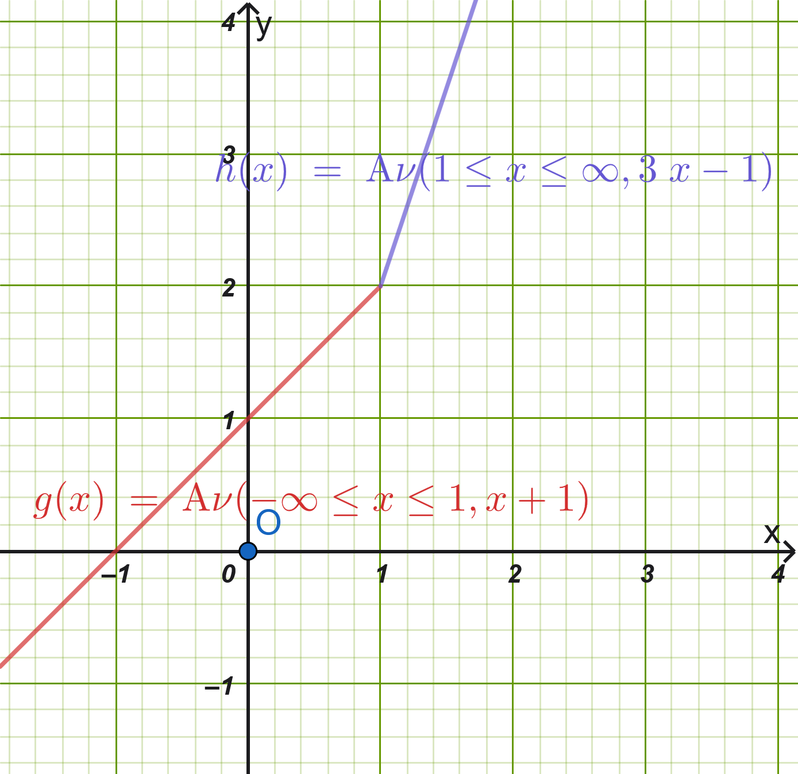{fig-align="center" width="350"}

**2. Στο διάστημα** $[1, +\infty)$

Για κάθε $x \in [1, +\infty)$, ισχύει $x - 1 \ge 0$, επομένως: $$f(x) = 2x + (x - 1) = 3x - 1$$

Η συνάρτηση είναι γραμμική της μορφής $f(x) = \alpha x + \beta$ με κλίση: $$\alpha = 3 > 0$$

- **Συμπέρασμα:** Η $f$ είναι **γνησίως αύξουσα** στο $[1, +\infty)$.

*(Εναλλακτικά με τον ορισμό: Για* $x_1, x_2 \in [1, +\infty)$ με $x_1 < x_2 \implies 3x_1 < 3x_2 \implies 3x_1 - 1 < 3x_2 - 1 \implies f(x_1) < f(x_2)$).

------------------------------------------------------------------------

**Τελικό Συμπέρασμα**

- Στο διάστημα $(-\infty, 1]$, η συνάρτηση $f$ είναι **γνησίως αύξουσα**.

- Στο διάστημα $[1, +\infty)$, η συνάρτηση $f$ είναι **γνησίως αύξουσα**.

*(Σημείωση: Επειδή η* $f$ είναι συνεχής στο $x = 1$ με $f(1) = 2$, η συνάρτηση είναι γνησίως αύξουσα σε ολόκληρο το $\mathbb{R}$).
::::

#### Θέμα Β: Ακρότατα Συνάρτησης

6.  Να βρεθούν τα ολικά ακρότατα (αν υπάρχουν) της συνάρτησης $f(x) = 2x^2 + 5$ στο $\mathbb{R}$.

7.  Να αποδειχθεί ότι η συνάρτηση $g(x) = -3x^2 + 6x - 1$ παρουσιάζει μέγιστο για $x = 1$, το οποίο και να υπολογιστεί.

8.  Να βρεθούν τα ακρότατα της συνάρτησης $h(x) = 3x - 4$ όταν

- α. $x \in \left(-\infty,3\right]$.
- β. $x \in \left[1,4\right)$
- γ. $x \in \left[-1,2\right]$
- δ. $x \in \left[-2,+\infty\right)$

9.  Να αποδειχθεί ότι η συνάρτηση $f(x) = |x - 3| + 2$ παρουσιάζει ελάχιστο, ορίζοντας τη θέση και την τιμή του ελαχίστου.

:::: {.math-box .exercise-box}
::: {.math-title .exercise-title}
10. Εκφώνηση
:::

Να εξεταστεί αν η συνάρτηση $f(x) = \dfrac{2}{x^2 + 1}$ παρουσιάζει μέγιστο στο $\mathbb{R}$.
::::

:::: {.math-box .solution-box}
::: {.math-title .solution-title}
Λύση
:::

**Ορισμός Μέγιστου Συνάρτησης**

Μια συνάρτηση $f$ με πεδίο ορισμού $A$ παρουσιάζει στο σημείο $x_0 \in A$ **μέγιστο** (ολικό μέγιστο) το $f(x_0)$, αν για κάθε $x \in A$ ισχύει: $$f(x) \le f(x_0)$$

------------------------------------------------------------------------

**Πεδίο Ορισμού**

Επειδή $x^2 \ge 0$ για κάθε $x \in \mathbb{R}$, έχουμε: $$x^2 + 1 \ge 1 > 0 \quad \text{για κάθε } x \in \mathbb{R}$$

Επομένως, ο παρονομαστής δεν μηδενίζεται ποτέ και το πεδίο ορισμού της συνάρτησης είναι: $$A = \mathbb{R}$$

------------------------------------------------------------------------

**Εύρεση της Μέγιστης Τιμής**

Για κάθε πραγματικό αριθμό $x \in \mathbb{R}$, ισχύει: $$x^2 \ge 0$$

Προσθέτουμε το $1$ και στα δύο μέλη: $$x^2 + 1 \ge 1$$

Επειδή και τα δύο μέλη είναι θετικά, αντιστρέφοντας τους όρους αλλάζει η φορά της ανισότητας: $$\frac{1}{x^2 + 1} \le \frac{1}{1} = 1$$

Πολλαπλασιάζουμε και τα δύο μέλη με τον θετικό αριθμό $2$: $$\frac{2}{x^2 + 1} \le 2$$

Δηλαδή, για κάθε $x \in \mathbb{R}$ ισχύει: $$f(x) \le 2 \quad (1)$$

------------------------------------------------------------------------

**Έλεγχος αν η τιμή επιτυγχάνεται στο** $\mathbb{R}$

Ελέγχουμε αν υπάρχει $x_0 \in \mathbb{R}$ τέτοιο ώστε $f(x_0) = 2$: $$f(x_0) = 2 \iff \frac{2}{x_0^2 + 1} = 2 \iff x_0^2 + 1 = 1 \iff x_0^2 = 0 \iff x_0 = 0$$

Πράγματι, για $x_0 = 0 \in \mathbb{R}$, έχουμε: $$f(0) = \frac{2}{0^2 + 1} = 2$$

------------------------------------------------------------------------

**Συμπέρασμα**

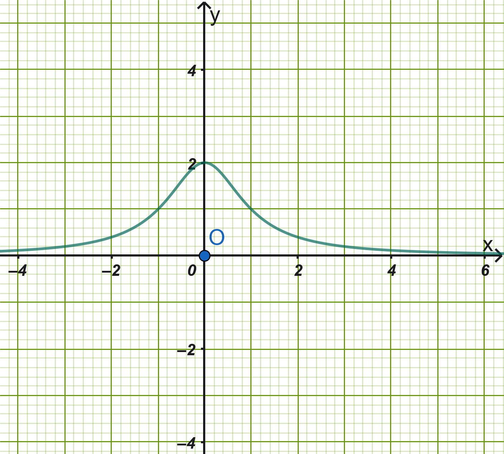{fig-align="center" width="350"}

Επειδή:

1.  $f(x) \le 2$ για κάθε $x \in \mathbb{R}$

2.  $f(0) = 2$

σύμφωνα με τον ορισμό, η συνάρτηση $f$ **παρουσιάζει (ολικό) μέγιστο** στο σημείο $x_0 = 0$, με μέγιστη τιμή το $M = 2$.
::::

#### Θέμα Γ: Άρτιες & Περιττές Συναρτήσεις - Συμμετρίες

11. Να εξεταστεί αν οι παρακάτω συναρτήσεις είναι άρτιες ή περιττές: $$\text{α) } f(x) = 3x^4 - x^2 + 5, \quad \text{β) } g(x) = x^5 + 2x$$

12. Να εξεταστεί ως προς τη συμμετρία η συνάρτηση $h(x) = \dfrac{x^3}{x^2 + 1}$ στο $\mathbb{R}$.

::: my-callout-exercise
**Υπόδειξη**

για $x=2 \implies h(2)=\dfrac{8}{5}$

για $x=-2 \implies h(-2)=-\dfrac{8}{5}$

Άρα $h(-x)= ............. \implies$ .........................
:::

13. Να αιτιολογηθεί γιατί η συνάρτηση $f(x) = x^2 + 2x$ δεν είναι ούτε άρτια ούτε περιττή.

::: my-callout-exercise
**Υπόδειξη**

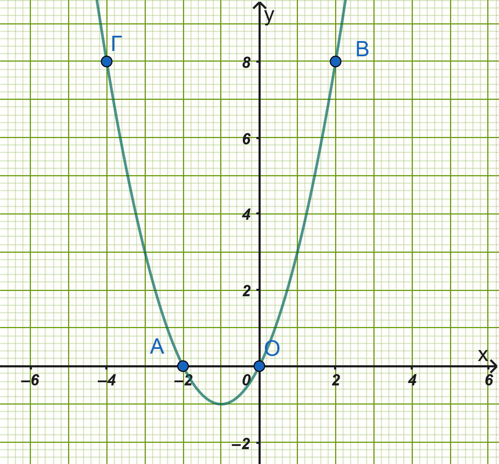{fig-align="center" width="350"}

για $x=2 \implies f(2)=4+4=8=f(-4)$

για $x=-2 \implies f(-2)=4-4=0$

Άρα $h(-x) \ne ............. \implies$ .........................
:::

14. Δίνεται η συνάρτηση $f(x) = \sqrt{9 - x^2}$. Να βρεθεί το πεδίο ορισμού της, να αποδειχθεί ότι είναι άρτια και να ερμηνευτεί γεωμετρικά το αποτέλεσμα.

::: my-callout-exercise
**Υπόδειξη**

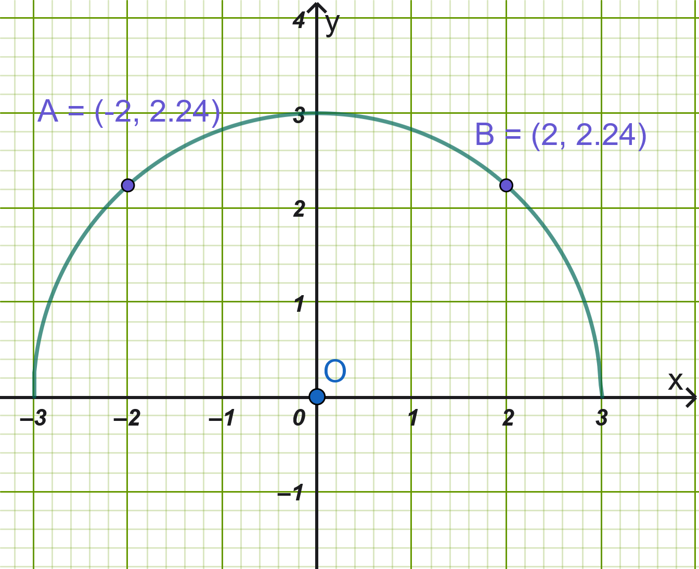{fig-align="center" width="350"}

$-3\le x \le 3$

για $x=2 \implies f(2)=\sqrt{5}$

για $x=-2 \implies f(-2)=\sqrt{5}$

Άρα $f(-x)= ............. \implies$ .........................

$y^2=9-x^2 \implies x^2+y^2=3^2 \implies$ ......................
:::

:::: {.math-box .exercise-box}
::: {.math-title .exercise-title}
15. Εκφώνηση
:::

Αν μια συνάρτηση $f$ με συμμετρικό πεδίο ορισμού $\mathbb{R}$ είναι περιττή, να αποδειχθεί ότι διέρχεται από την αρχή των αξόνων, δηλαδή $f(0) = 0$.
::::

:::: {.math-box .solution-box}
::: {.math-title .solution-title}
Λύση
:::

**1: Χρήση του ορισμού της περιττής συνάρτησης**

Εφόσον το πεδίο ορισμού της συνάρτησης $f$ είναι το $\mathbb{R}$ και η συνάρτηση είναι περιττή, σύμφωνα με τον ορισμό ισχύει: $$f(-x) = -f(x) \quad \text{για κάθε } x \in \mathbb{R}$$

------------------------------------------------------------------------

**2: Εφαρμογή για** $x = 0$

Επειδή ο αριθμός $0$ ανήκει στο πεδίο ορισμού $\mathbb{R}$, θέτουμε στη σχέση του ορισμού όπου $x$ το $0$: $$f(-0) = -f(0)$$

Επειδή $-0 = 0$, η σχέση γράφεται: $$f(0) = -f(0)$$

------------------------------------------------------------------------

**3: Επίλυση ως προς** $f(0)$

Προσθέτουμε το $f(0)$ και στα δύο μέλη της ισότητας: $$f(0) + f(0) = 0$$ $$2f(0) = 0$$

Διαιρούμε με το $2$: $$f(0) = 0$$

------------------------------------------------------------------------

**Συμπέρασμα**

Αποδείχθηκε ότι $f(0) = 0$, το οποίο σημαίνει γεωμετρικά ότι η γραφική παράσταση της συνάρτησης $f$ διέρχεται από το σημείο $(0, 0)$, δηλαδή από την **αρχή των αξόνων**.
::::

::: callout-method
**Έστω συνάρτηση** $f$ με πεδίο ορισμού το διάστημα $A = (-\alpha, \alpha)$, όπου $\alpha > 0$.

1.  **Το** $0$ ανήκει στο πεδίο ορισμού:

    Επειδή $\alpha > 0$, ισχύει: $$-\alpha < 0 < \alpha \implies 0 \in A$$

2.  **Εφαρμογή του ορισμού της περιττής συνάρτησης:**

    Αφού η $f$ είναι περιττή, για κάθε $x \in A$ ισχύει: $$f(-x) = -f(x)$$

3.  **Θέτουμε** $x = 0$:

    Εφόσον $0 \in A$, μπορούμε να θέσουμε $x = 0$: $$f(-0) = -f(0)$$ $$f(0) = -f(0)$$ $$2f(0) = 0 \implies f(0) = 0$$

------------------------------------------------------------------------

**Γενικό Συμπέρασμα**

Για **οποιαδήποτε** περιττή συνάρτηση $f$ με συμμετρικό πεδίο ορισμού $A$:

- Αν $0 \in A$ (όπως στο $\mathbb{R}$, στο $[-\alpha, \alpha]$, ή στο $(-\alpha, \alpha)$), τότε **πάντα ισχύει** $f(0) = 0$ (διέρχεται από την αρχή των αξόνων).

- Αν $0 \notin A$ (για παράδειγμα στο $A = \mathbb{R}^*$ ή στο $A = (-\alpha, 0) \cup (0, \alpha)$, όπως στην $f(x) = \dfrac{1}{x}$), τότε το $f(0)$ απλώς **δεν ορίζεται**, οπότε η συνάρτηση δεν διέρχεται από την αρχή των αξόνων.
:::

16. Αν η συνάρτηση $f$ είναι άρτια και παρουσιάζει ελάχιστο στο $x_0 = 3$ με τιμή $f(3) = 2$, να βρεθεί η τιμή της $f$ στο $x_0 = -3$.

#### Θέμα Δ: Σύνθετες Ασκήσεις & Προβλήματα

17. Δίνεται η συνάρτηση $f(x) = \alpha x^2 + \beta$.
    Αν η γραφική της παράσταση διέρχεται από τα σημεία $A(1, 4)$ και $B(2, 10)$:

    - α) Να υπολογιστούν τα $\alpha, \beta$.

    - β) Να εξεταστεί αν η $f$ είναι άρτια ή περιττή.

    - γ) Να βρεθούν τα ακρότατά της στο $\mathbb{R}$.

18. Έστω η συνάρτηση $f(x) = x^2 - 4x + 5$:

    - α) Να γραφεί στη μορφή $f(x) = (x - \alpha)^2 + \beta$.

    - β) Να μελετηθεί ως προς τη μονοτονία στα διαστήματα $(-\infty, 2]$ και $[2, +\infty)$.

    - γ) Να βρεθεί η ελάχιστη τιμή της.

:::: {.math-box .problem-box}
::: {.math-title .problem-title}
19. **Πρόβλημα Μεγιστοποίησης Εμβαδού:**
:::

Ένας αγρότης θέλει να περιφράξει μια ορθογώνια περιοχή δίπλα σε έναν τοίχο χρησιμοποιώντας συρματόπλεγμα μήκους $40 \text{ m}$ (χωρίς περίφραξη στον τοίχο).
Αν $x$ είναι το πλάτος της περιφραγμένης έκτασης:

- α) Να εκφραστεί το εμβαδόν $E(x)$ ως συνάρτηση του $x$.

- β) Να βρεθούν οι διαστάσεις που μεγιστοποιούν το εμβαδόν καθώς και η μέγιστη τιμή του.
::::

:::: {.math-box .problemsolution-box}
::: {.math-title .problemsolution-title}
**Λύση:**
:::

**α) Έκφραση του εμβαδού** $E(x)$ ως συνάρτηση του $x$

Έστω ότι η ορθογώνια περιοχή έχει:

- Δύο πλευρές κάθετες στον τοίχο, καθεμία με μήκος (πλάτος) $x$ (σε $\text{m}$).

- Μία πλευρά παράλληλη προς τον τοίχο, με μήκος $y$ (σε $\text{m}$).

- Η τέταρτη πλευρά είναι ο τοίχος, οπότε δεν χρειάζεται συρματόπλεγμα.

Το συνολικό μήκος του συρματοπλέγματος είναι $40\text{ m}$, επομένως: $$2x + y = 40 \implies y = 40 - 2x$$

Επειδή τα μήκη των πλευρών πρέπει να είναι θετικά:

- $x > 0$

- $y > 0 \implies 40 - 2x > 0 \implies 2x < 40 \implies x < 20$

Άρα, το πεδίο ορισμού είναι $x \in (0, 20)$.

Το εμβαδόν $E$ του ορθογωνίου δίνεται από τον τύπο: $$E = x \cdot y$$

Αντικαθιστώντας το $y = 40 - 2x$, έχουμε: $$E(x) = x(40 - 2x) = -2x^2 + 40x, \quad x \in (0, 20)$$

------------------------------------------------------------------------

**β) Εύρεση των διαστάσεων που μεγιστοποιούν το εμβαδόν και η μέγιστη τιμή του**

Η συνάρτηση του εμβαδού: $$E(x) = -2x^2 + 40x$$ είναι ένα τριώνυμο 2ου βαθμού της μορφής $\alpha x^2 + \beta x + \gamma$ με $\alpha = -2$, $\beta = 40$ και $\gamma = 0$.

Επειδή $\alpha = -2 < 0$, η συνάρτηση παρουσιάζει μέγιστο στην κορυφή της παραβολής: $$x_0 = -\frac{\beta}{2\alpha} = -\frac{40}{2(-2)} = -\frac{40}{-4} = 10\text{ m}$$

Το $x_0 = 10$ ανήκει στο διάστημα $(0, 20)$.

- **Υπολογισμός του άλλου μήκους (**$y$): $$y = 40 - 2(10) = 40 - 20 = 20\text{ m}$$

- **Υπολογισμός του μέγιστου εμβαδού:** $$E_{\max} = E(10) = 10 \cdot 20 = 200\text{ m}^2$$ *(ή* $E(10) = -2(10)^2 + 40(10) = -200 + 400 = 200\text{ m}^2$)

------------------------------------------------------------------------

**Τελική Απάντηση**

- **α)** Ο τύπος του εμβαδού είναι: $$E(x) = -2x^2 + 40x \quad \mu\epsilon \quad x \in (0, 20)$$

- **β)** Οι διαστάσεις που μεγιστοποιούν το εμβαδόν είναι:

  - **Πλάτος:** $x = 10\text{ m}$ (οι δύο πλευρές κάθετες στον τοίχο)
  - **Μήκος:** $y = 20\text{ m}$ (η πλευρά παράλληλη στον τοίχο)

  Και το μέγιστο εμβαδόν είναι $E_{\max} = 200\text{ m}^2$.
::::

20. **Πρόβλημα Κέρδους Βιοτεχνίας:** Το ημερήσιο κέρδος (σε ευρώ) μιας βιοτεχνίας παραγωγής $x$ μονάδων προϊόντος δίνεται από τον τύπο $K(x) = -x^2 + 80x - 120$ για $x \in \mathbb{R^{+}}$.

    - α) Να βρεθεί πόσες μονάδες πρέπει να παραχθούν ώστε το κέρδος να γίνει μέγιστο.

    - β) Ποιο είναι το μέγιστο ημερήσιο κέρδος της βιοτεχνίας;

::: my-callout-exercise
**Υπόδειξη**

Βρείτε το μέγιστο της $Κ(x)$

Για $x_0$ μέγιστη τιμή $K(x_0)$
:::

21. **(Μονοτονία από γραφική παράσταση)**

Δίνονται οι γραφικές παραστάσεις των παρακάτω συναρτήσεων .

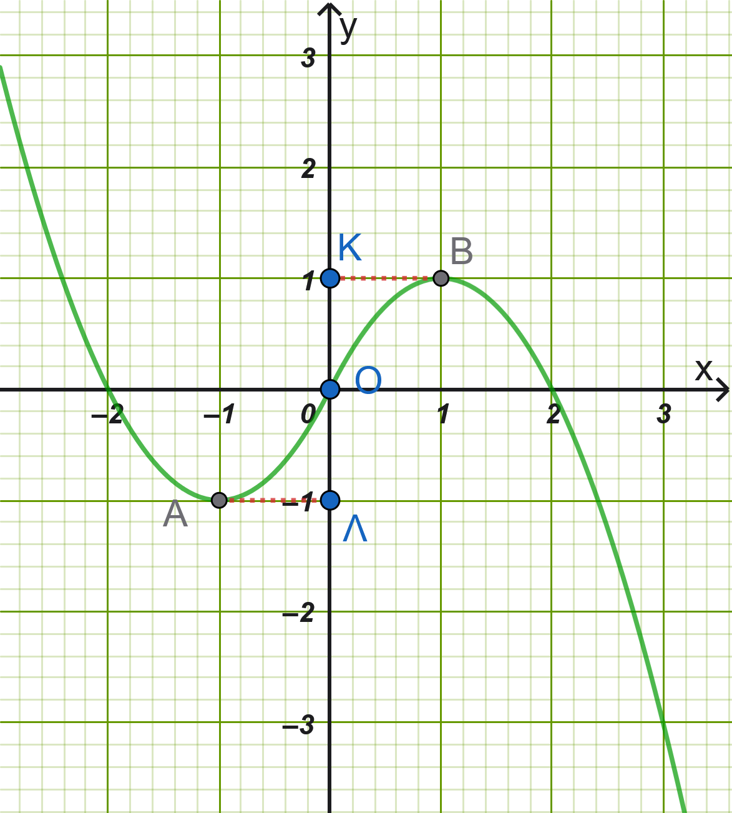{width="300"}

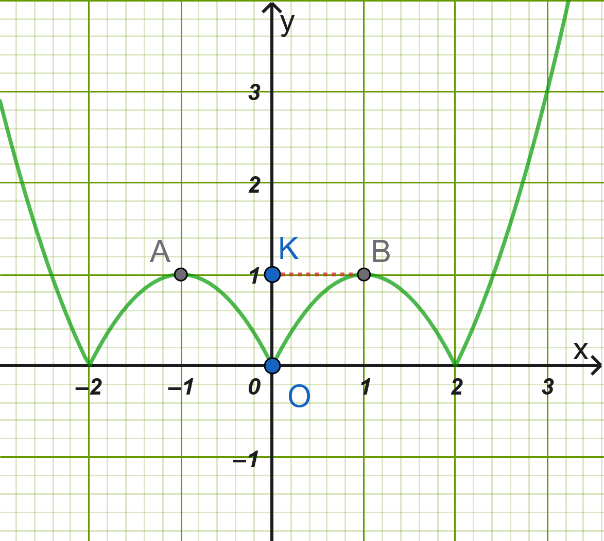{width="300"}

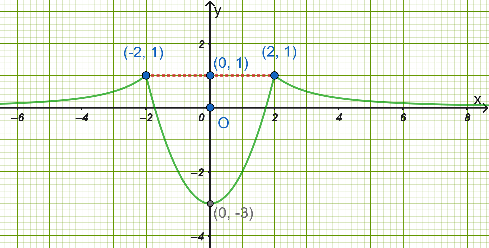{fig-align="center" width="400"}

Να βρείτε τα διαστήματα στα οποία η κάθε συνάρτηση είναι:

**α)** γνησίως αύξουσα\

**β)** γνησίως φθίνουσα

------------------------------------------------------------------------

22. **(Ακρότατα από γραφική παράσταση)**

Να προσδιορίσετε το ολικό μέγιστο και το ολικό ελάχιστο σε κάθε μια από τις συναρτήσεις της προηγούμενης άσκησης.

------------------------------------------------------------------------

:::: {.math-box .exercise-box}
::: {.math-title .exercise-title}
23. **(Απόδειξη ακροτάτων με τον ορισμό)**
:::

Να αποδείξετε με βάση τον ορισμό των ακροτάτων ότι:

**i)** Η συνάρτηση $f(x) = x^2 - 4x + 7$ παρουσιάζει (ολικό) ελάχιστο για $x = 2$.

**ii)** Η συνάρτηση $g(x) = \dfrac{4x}{x^2 + 4}$ παρουσιάζει (ολικό) μέγιστο για $x = 2$.
::::

:::: {.math-box .solution-box}
::: {.math-title .solution-title}
Λύση Άσκηση 3(ii)
:::

**Πεδίο ορισμού**

Για κάθε $x\in\mathbb{R}$ ισχύει:

$$
x^2+4>0
$$

Επομένως το πεδίο ορισμού της $g$ είναι:

$$
D_g=\mathbb{R}
$$

------------------------------------------------------------------------

**Εφαρμογή του ορισμού του μέγιστου**

Θα δείξουμε ότι για κάθε $x\in\mathbb{R}$ ισχύει:

$$
g(x)\leq g(2)
$$

Υπολογίζουμε πρώτα την τιμή της συνάρτησης στο $x=2$:

$$
g(2)=\frac{4\cdot 2}{2^2+4}
=\frac{8}{8}=1
$$

Άρα πρέπει να αποδείξουμε ότι:

$$
\frac{4x}{x^2+4}\leq 1
$$

Επειδή $x^2+4>0$, μπορούμε να πολλαπλασιάσουμε και τα δύο μέλη με τον θετικό αριθμό $x^2+4$ χωρίς να αλλάξει η φορά της ανίσωσης:

$$
4x\leq x^2+4
$$

Μεταφέρουμε όλους τους όρους στο δεξί μέλος:

$$
0\leq x^2-4x+4
$$

Παραγοντοποιούμε:

$$
0\leq (x-2)^2
$$

Η τελευταία ανίσωση είναι αληθής για κάθε $x\in\mathbb{R}$, επειδή το τετράγωνο κάθε πραγματικού αριθμού είναι μη αρνητικό.

Επομένως:

$$
g(x)\leq 1=g(2)
\quad\text{για κάθε }x\in\mathbb{R}
$$

------------------------------------------------------------------------

**Συμπέρασμα**

Σύμφωνα με τον ορισμό του μέγιστου, η συνάρτηση $g$ παρουσιάζει **ολικό μέγιστο** στη θέση:

$$
x_0=2
$$

και η μέγιστη τιμή της είναι:

$$
\boxed{g_{\max}=g(2)=1}
$$

Δηλαδή:

$$
\boxed{\text{Η }g(x)=\frac{4x}{x^2+4}\text{ παρουσιάζει μέγιστο }1\text{ για }x=2.}
$$

Με παρόμοιο τρόπο μπορείτε να αποδείξετε ότι η συνάρτηση έχει ολικό ελάχιστο για $x_0=-2$

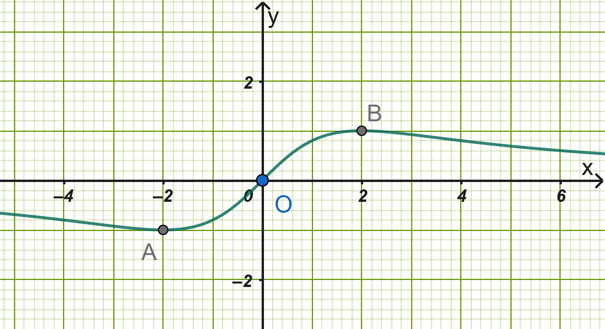{fig-align="center" width="350"}
::::

------------------------------------------------------------------------

24. **(Άρτιες και περιττές συναρτήσεις - Πολυωνυμικές / Ρητές)**

Να εξετάσετε ποιες από τις παρακάτω συναρτήσεις είναι άρτιες, ποιες είναι περιττές και ποιες τίποτα από τα δύο:

**i)** $f_1(x) = 2x^4 - 7x^2 + 3$

**ii)** $f_2(x) = 4|x| - x^2$

**iii)** $f_3(x) = |x - 2|$

**iv)** $f_4(x) = 2x^5 - x^3$

**v)** $f_5(x) = \dfrac{x^3}{2 - x}$

**vi)** $f_6(x) = \dfrac{3x}{x^2 + 9}$

------------------------------------------------------------------------

25 **(Άρτιες και περιττές συναρτήσεις - Ρίζες / Κλάσματα / Απόλυτα)**

Ομοίως, να εξετάσετε ως προς τη συμμετρία (άρτια ή περιττή) τις συναρτήσεις:

**i)** $f_1(x) = \dfrac{1}{x^2 + |x|}$

**ii)** $f_2(x) = \sqrt{x - 3}$

**iii)** $f_3(x) = |x + 2| - |x - 2|$

**iv)** $f_4(x) = \dfrac{x^3 - \dfrac{1}{x}}{x^2 + 4}$

**v)** $f_5(x) = \sqrt[3]{|x|}$

**vi)** $f_6(x) = \sqrt{9 - x^2}$

------------------------------------------------------------------------

26. **(Αναγνώριση άρτιας/περιττής από γεωμετρική συμμετρία)**

Δίνονται τρεις καμπύλες στο επίπεδο:

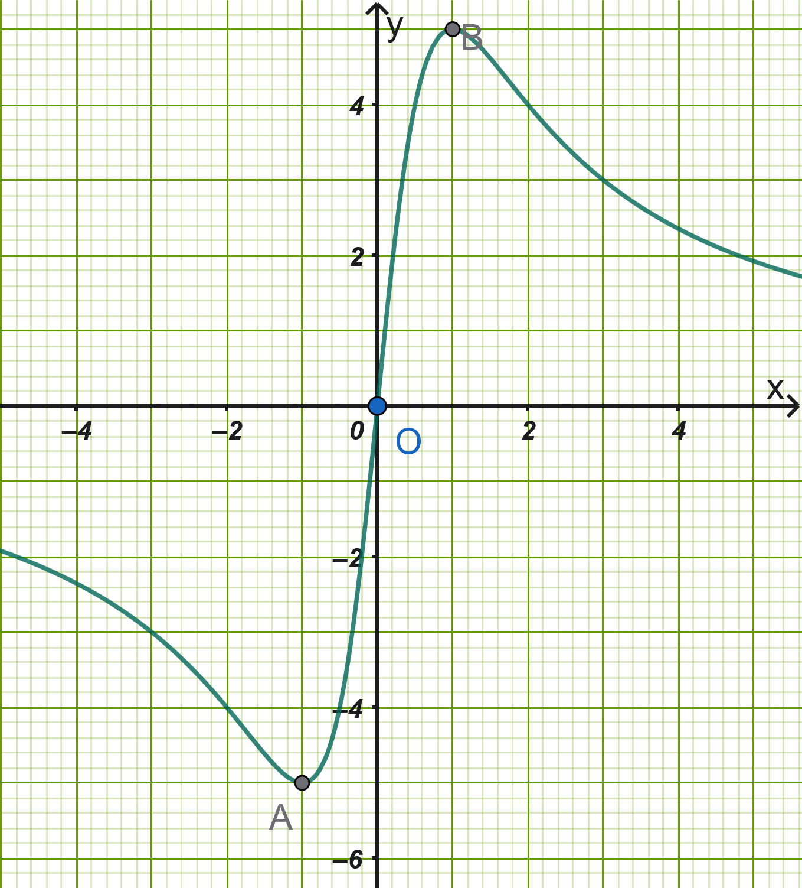{fig-align="center" width="300"}

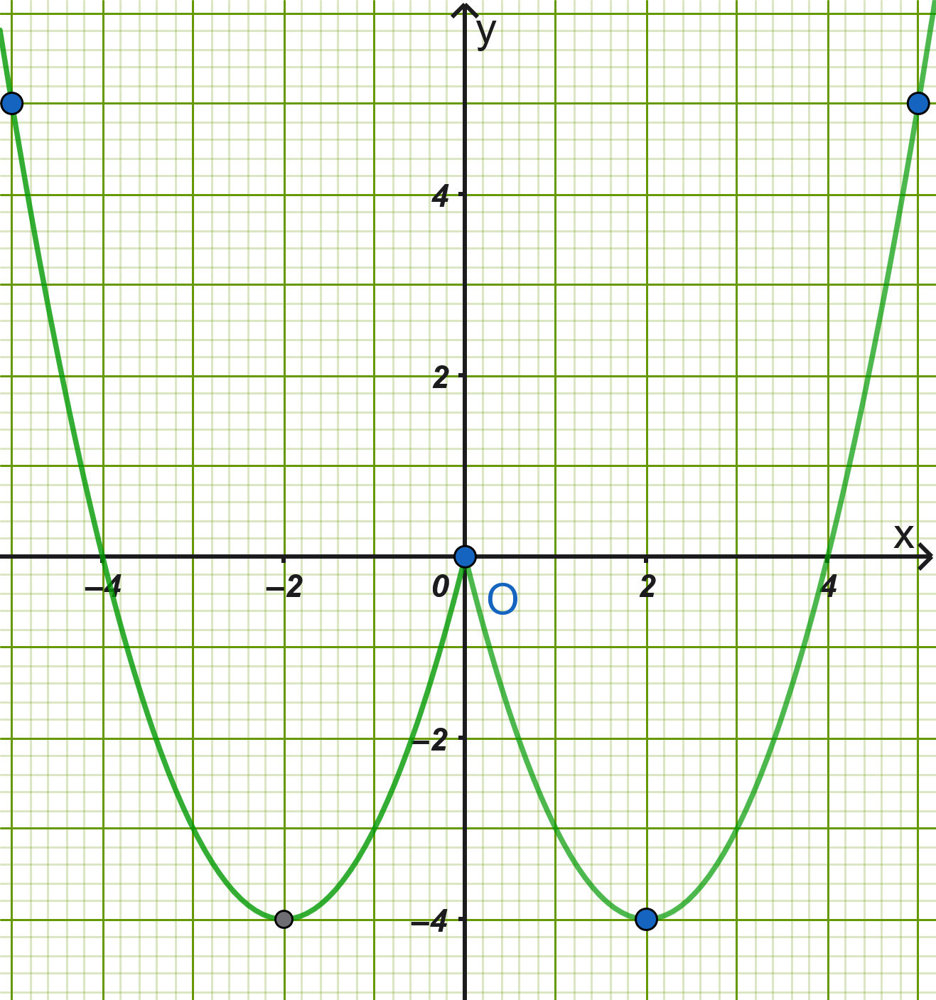{fig-align="center" width="350"}

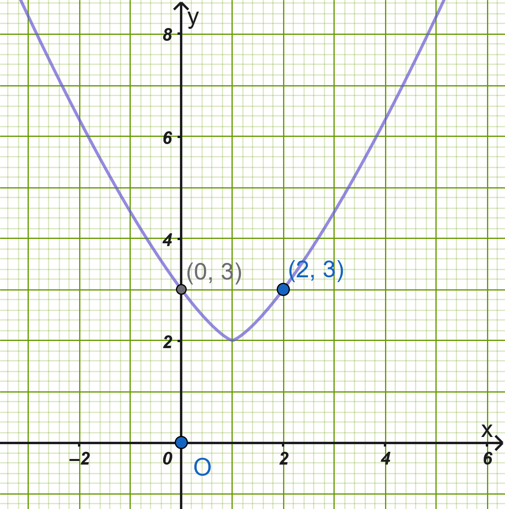{fig-align="center" width="350"}

Να αιτιολογήσετε ποια από τις παραπάνω καμπύλες είναι γραφική παράσταση άρτιας συνάρτησης, ποια περιττής και ποια δεν μπορεί να είναι ούτε άρτια ούτε περιττή.

------------------------------------------------------------------------

27. **(Έλεγχος συμμετρίας καμπύλης με χαρακτηριστικά σημεία)**

Για τις παρακάτω συναρτήσεις:

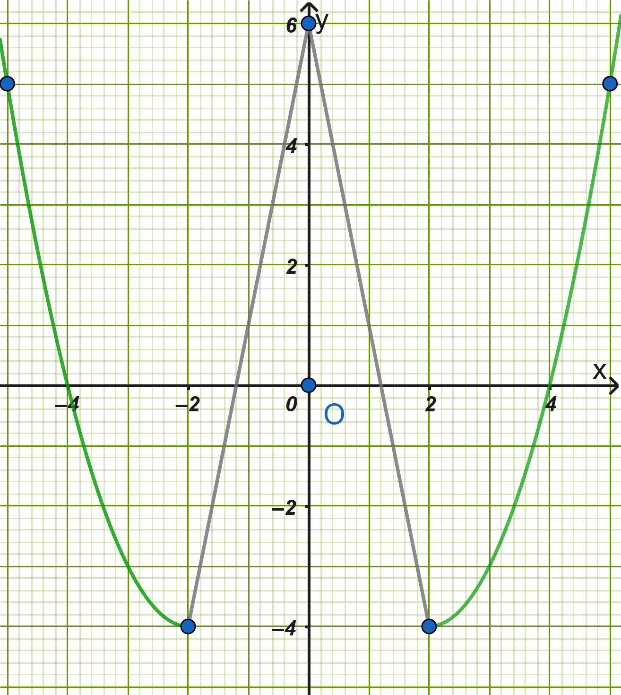{fig-align="center" width="350"}

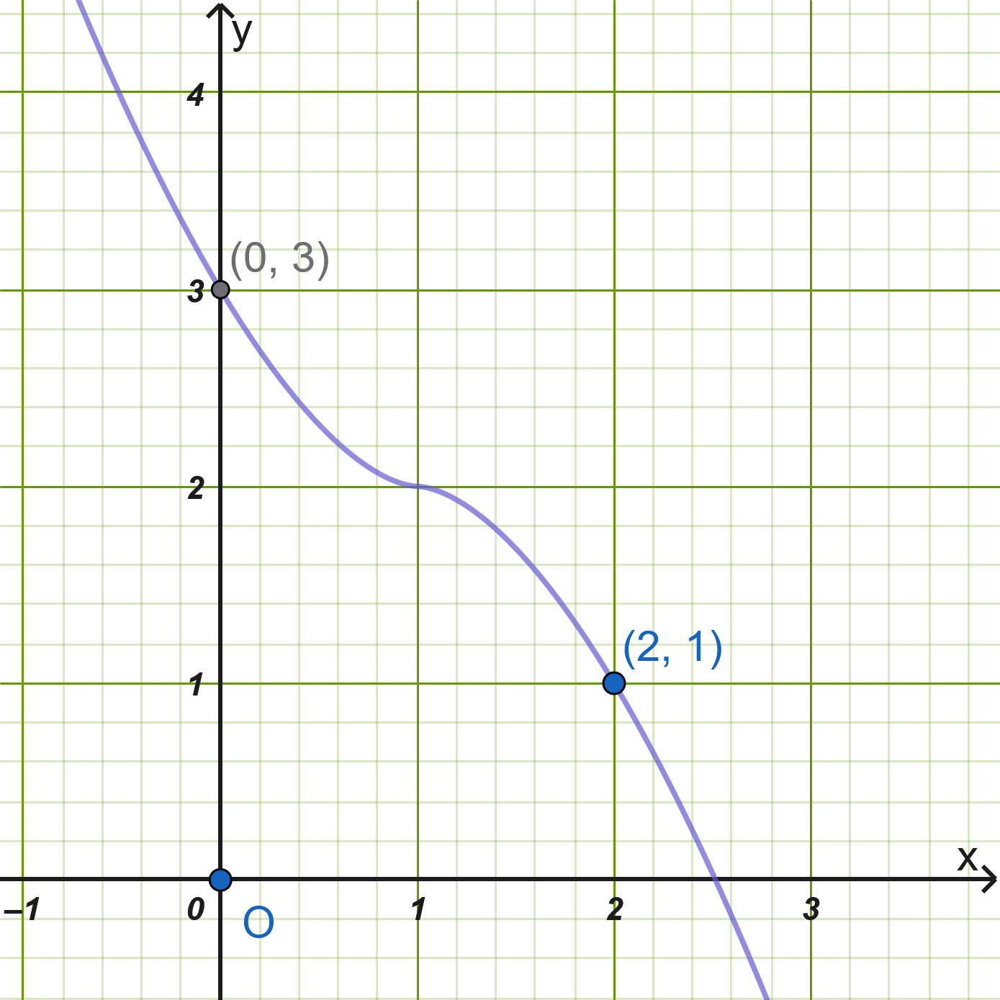{fig-align="center" width="350"}

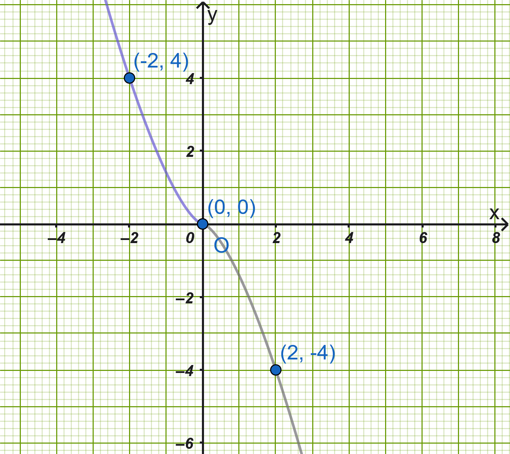{fig-align="center" width="350"}

Να εξετάσετε γεωμετρικά αν είναι άρτιες, περιττές ή τίποτα από τα δύο.

------------------------------------------------------------------------

28. **(Συμπλήρωση γραφικής παράστασης)**

Στις παρακάτω γραφικές παραστάσεις δίνεται μέρος της γραφικής παράστασης κάθε συνάρτησης.

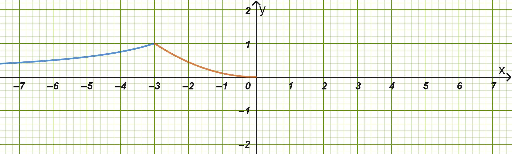{fig-align="center" width="600"}

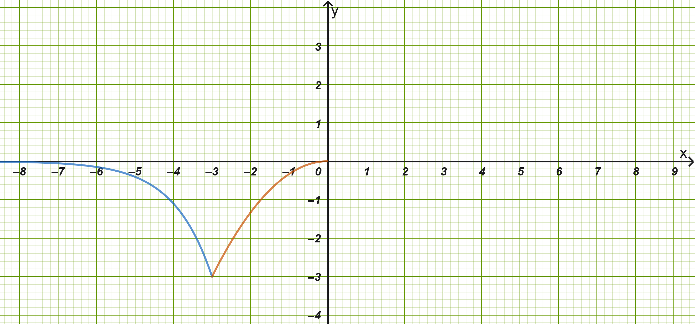{fig-align="center" width="600"}

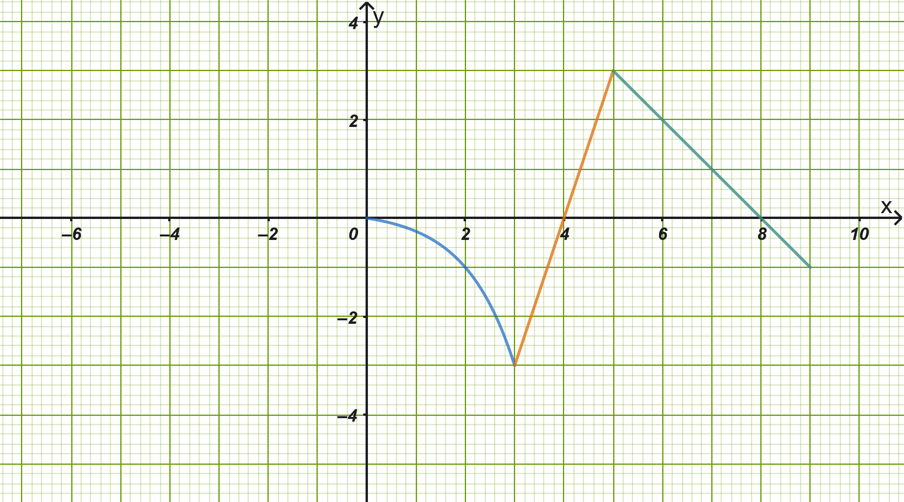{fig-align="center" width="600"}

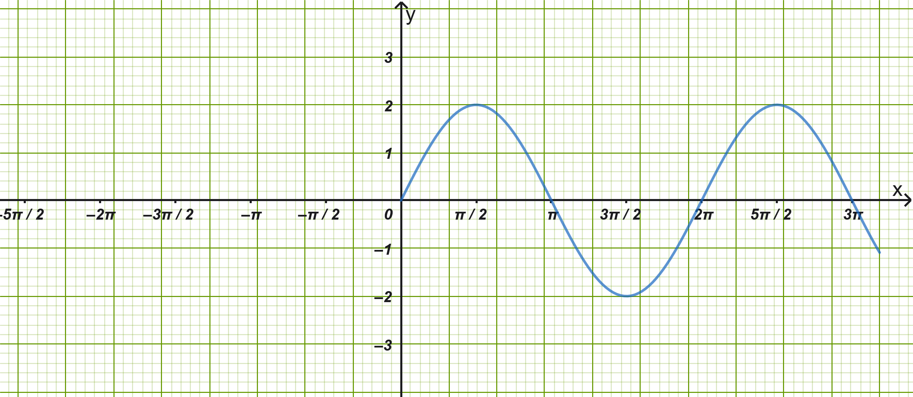{fig-align="center" width="600"}

Να σχεδιάσετε στο τετραγωνισμένο σας χαρτί συμπληρωμένες τις γραφικές παραστάσεις ώστε η κάθε συνάρτηση να είναι:

**α)** Άρτια (συμμετρία ως προς τον άξονα $y'y$)

**β)** Περιττή (συμμετρία ως προς την αρχή των αξόνων $O(0, 0)$ — *υποθέτοντας ότι* $f(0) = 0$)


------------------------------------------------------------------------

::: {.callout-tip style="color: brown;"}
ΚΑΛΗ ΜΕΛΕΤΗ!
:::
