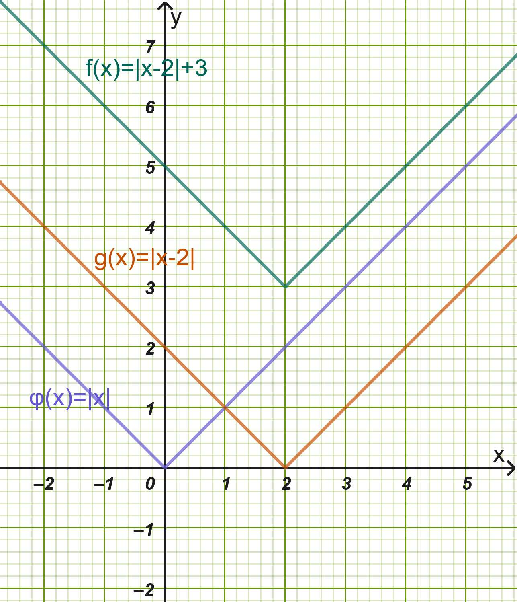
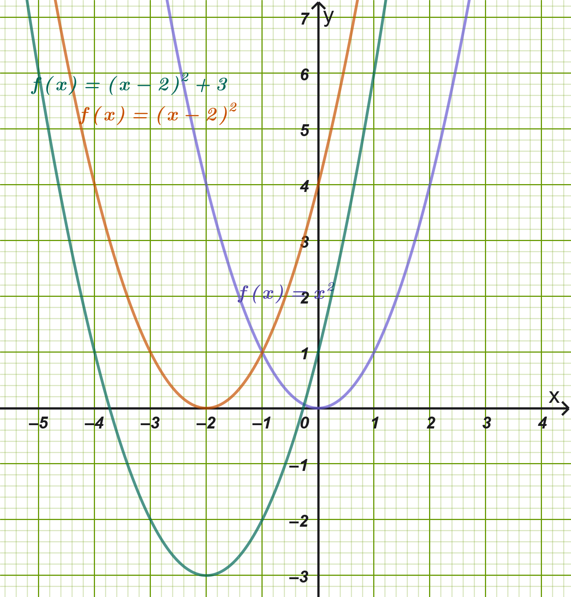
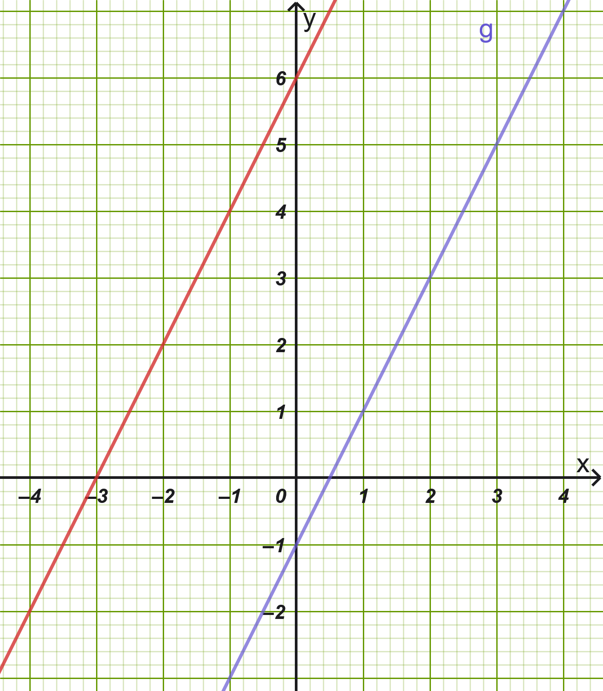

```{=html}
<!-- Φόρτωση βιβλιοθήκης GeoGebra -->
<script src="https://www.geogebra.org/apps/deployggb.js"></script>

<!-- Συνάρτηση δημιουργίας applets -->
<script>
function createGeoGebra(containerId, materialId, width = 700, height = 500) {
  var params = {
    "id": "ggb-" + containerId,
    "material_id": materialId,
    "width": width,
    "height": height,
    "showToolBar": true,
    "showMenuBar": false,
    "showAlgebraInput": true
  };
  
  var applet = new GGBApplet(params, '5.2');
  applet.inject(containerId);
}
</script>
```

## Κατακόρυφη - Οριζόντια Μετατόπιση Καμπύλης

### Κατακόρυφη Μετατόπιση Καμπύλης

#### Ορισμοί

:::: {.math-box .definition-box}
::: {.math-title .definition-title}
Ορισμοί
:::

- **Μετατόπιση προς τα πάνω:** Η γραφική παράσταση της συνάρτησης $f$ με $f(x) = \phi(x) + c$, όπου $c > 0$, προκύπτει από μια **κατακόρυφη μετατόπιση της γραφικής παράστασης της** $\phi$ κατά $c$ μονάδες προς τα πάνω.
  Αυτό συμβαίνει διότι για κάθε $x \in A$, η τιμή $f(x)$ είναι κατά $c$ μονάδες μεγαλύτερη από την τιμή $\phi(x)$.

- **Μετατόπιση προς τα κάτω:** Η γραφική παράσταση της συνάρτησης $f$ με $f(x) = \phi(x) - c$, όπου $c > 0$, προκύπτει από μια **κατακόρυφη μετατόπιση της γραφικής παράστασης της** $\phi$ κατά $c$ μονάδες προς τα κάτω.
  Αυτό συμβαίνει διότι για κάθε $x \in A$, η τιμή $f(x)$ είναι κατά $c$ μονάδες μικρότερη από την τιμή $\phi(x)$.

<iframe src="https://www.geogebra.org/calculator/fptafbbf?embed" width="730" height="700" allowfullscreen style="border: 1px solid #e4e4e4;border-radius: 4px;" frameborder="0">

</iframe>
::::

------------------------------------------------------------------------

#### Παραδείγματα Διαφόρων Περιπτώσεων

1.  **Παράδειγμα 1 (Προς τα πάνω - Απόλυτη Τιμή):**

    Η συνάρτηση $f(x) = |x| + 2$ προκύπτει από τη μετατόπιση της καμπύλης της $\phi(x) = |x|$ κατά $2$ μονάδες κατακόρυφα προς τα πάνω.
    Η κορυφή της μετατοπίζεται από το $(0,0)$ στο σημείο $(0,2)$.

2.  **Παράδειγμα 2 (Προς τα κάτω - Παραβολή):**

    Η συνάρτηση $g(x) = x^2 - 3$ προκύπτει από τη μετατόπιση της παραβολής $y = x^2$ κατά $3$ μονάδες κατακόρυφα προς τα κάτω.
    Η κορυφή της βρίσκεται στο σημείο $(0,-3)$.

3.  **Παράδειγμα 3 (Προς τα πάνω - Υπερβολή):**

    Η συνάρτηση $h(x) =  \dfrac{2}{x} + 1$ προκύπτει από την κατακόρυφη μετατόπιση της καμπύλης $y = \dfrac{2}{x}$ κατά $1$ μονάδα προς τα πάνω.
    Το πεδίο τιμών της γίνεται $\mathbb{R} - \{ 1 \}$.

4.  **Παράδειγμα 4 (Προς τα κάτω - Παραβολή):**

    Η συνάρτηση $k(x) = 0,5x^2 - 4$ προκύπτει από την κατακόρυφη μετατόπιση της καμπύλης $y = 0,5x^2$ κατά $4$ μονάδες προς τα κάτω.

------------------------------------------------------------------------

### Οριζόντια Μετατόπιση Καμπύλης

#### Ορισμοί

:::: {.math-box .definition-box}
::: {.math-title .definition-title}
Ορισμοί
:::

- **Μετατόπιση προς τα δεξιά:** Η γραφική παράσταση της συνάρτησης $f$ με $f(x) = \phi(x - c)$, όπου $c > 0$, προκύπτει από μια **οριζόντια μετατόπιση της γραφικής παράστασης της** $\phi$ κατά $c$ μονάδες προς τα δεξιά.
  Αυτό συμβαίνει διότι η τιμή της $f$ στη θέση $x$ είναι ίδια με την τιμή της $\phi$ στη θέση $x - c$, η οποία βρίσκεται $c$ μονάδες αριστερότερα.

- **Μετατόπιση προς τα αριστερά:** Η γραφική παράσταση της συνάρτησης $f$ με $f(x) = \phi(x + c)$, όπου $c > 0$, προκύπτει από μια **οριζόντια μετατόπιση της γραφικής παράστασης της** $\phi$ κατά $c$ μονάδες προς τα αριστερά.
  Αυτό συμβαίνει διότι η τιμή της $f$ στη θέση $x$ είναι ίδια με την τιμή της $\phi$ στη θέση $x + c$, η οποία βρίσκεται $c$ μονάδες δεξιότερα.

<iframe src="https://www.geogebra.org/calculator/qqgt5gxc?embed" width="730" height="600" allowfullscreen style="border: 1px solid #e4e4e4;border-radius: 4px;" frameborder="0">

</iframe>
::::

------------------------------------------------------------------------

#### Παραδείγματα Διαφόρων Περιπτώσεων

1.  **Παράδειγμα 1 (Προς τα δεξιά - Απόλυτη Τιμή):**

    Η συνάρτηση $f(x) = |x - 1|$ προκύπτει από την οριζόντια μετατόπιση της $\phi(x) = |x|$ κατά $1$ μονάδα προς τα δεξιά.
    Η κορυφή βρίσκεται στο σημείο $(1,0)$.

2.  **Παράδειγμα 2 (Προς τα αριστερά - Παραβολή):** Η συνάρτηση $g(x) = (x + 3)^2$ προκύπτει από την οριζόντια μετατόπιση της παραβολής $y = x^2$ κατά $3$ μονάδες προς τα αριστερά.
    Η κορυφή μετατοπίζεται στο σημείο $(-3,0)$.

3.  **Παράδειγμα 3 (Προς τα δεξιά - Πολυωνυμική):** Η συνάρτηση $h(x) = (x - 2)^3$ προκύπτει από την οριζόντια μετατόπιση της $y = x^3$ κατά $2$ μονάδες προς τα δεξιά.
    Η γραφική παράσταση τέμνει τώρα τον άξονα $y'y$ ($x = 0$) στο σημείο $y = -8$.

4.  **Παράδειγμα 4 (Προς τα αριστερά - με Απόλυτα):** Η συνάρτηση $k(x) = |x+2|^3$ προκύπτει από την οριζόντια μετατόπιση της $y = |x^3|$ κατά $2$ μονάδες προς τα αριστερά.

------------------------------------------------------------------------

### Εφαρμογές

:::: {.math-box .example-box}
::: {.math-title .example-title}
**Εφαρμογή 1:** $f(x) = |x - 2| + 3$
:::

Για να παραστήσουμε γραφικά τη συνάρτηση $f(x) = |x - 2| + 3$, αξιοποιούμε διαδοχικά την οριζόντια και την κατακόρυφη μετατόπιση ξεκινώντας από τη βασική συνάρτηση $\phi(x) = |x|$:
::::

:::: {.math-box .examplesolution-box}
::: {.math-title .examplesolution-title}
Λύση

{fig-align="center" width="350"}
:::

1.  **1ο Βήμα (Οριζόντια μετατόπιση):** Σχεδιάζουμε τη συνάρτηση $g(x) = |x - 2|$, η οποία προκύπτει από οριζόντια μετατόπιση της γραφικής παράστασης της $\phi(x) = |x|$ **κατά** $2$ μονάδες προς τα δεξιά.
    Η κορυφή της βρίσκεται στο σημείο $(2,0)$.

2.  **2ο Βήμα (Κατακόρυφη μετατόπιση):** Μετατοπίζουμε τη γραφική παράσταση της $g(x) = |x - 2|$ **κατά** $3$ μονάδες κατακόρυφα προς τα πάνω, λαμβάνοντας τη $f(x) = |x - 2| + 3$.

3.  **Χαρακτηριστικά της** $f(x)$:

    - **Κορυφή/Σημείο καμπής:** Το σημείο $(2,3)$.

    - **Πεδίο Ορισμού:** $A = \mathbb{R}$.

    - **Σύνολο Τιμών:** $f(A) = [3, +\infty)$, αφού $|x - 2| \ge 0 \implies |x - 2| + 3 \ge 3$.

    - **Ακρότατο:** Παρουσιάζει ολικό ελάχιστο στη θέση $x_0 = 2$ με τιμή $f(2) = 3$.
::::

------------------------------------------------------------------------

:::: {.math-box .example-box}
::: {.math-title .example-title}
Εφαρμογή 2: $f(x) = (x + 2)^2 - 3$
:::

Για τη συνάρτηση $f(x) = (x + 2)^2 - 3$, εργαζόμαστε με βάση την αρχική παραβολή $\phi(x) = x^2$:
::::

:::: {.math-box .examplesolution-box}
::: {.math-title .examplesolution-title}
Λύση

{fig-align="center" width="450"}
:::

1.  **1ο Βήμα (Οριζόντια μετατόπιση):** Σχεδιάζουμε τη συνάρτηση $g(x) = (x + 2)^2$, η οποία προκύπτει από οριζόντια μετατόπιση της $y = x^2$ **κατά** $2$ μονάδες προς τα αριστερά.
    Η κορυφή της παραβολής μεταφέρεται στο σημείο $(-2,0)$.

2.  **2ο Βήμα (Κατακόρυφη μετατόπιση):** Μετατοπίζουμε τη γραφική παράσταση της $g(x) = (x + 2)^2$ **κατά** $3$ μονάδες κατακόρυφα προς τα κάτω, σχηματίζοντας τη $f(x) = (x + 2)^2 - 3$.

3.  **Χαρακτηριστικά της** $f(x)$:

    - **Κορυφή Παραβολής:** $K(-2, -3)$.

    - **Άξονας Συμμετρίας:** Η κατακόρυφη ευθεία $x = -2$.

    - **Μονοτονία:** Η $f$ είναι γνησίως φθίνουσα στο $(-\infty, -2]$ και γνησίως αύξουσα στο $[-2, +\infty)$.

    - **Ακρότατο:** Παρουσιάζει ολικό ελάχιστο στη θέση $x_0 = -2$ με τιμή $f(-2) = -3$.
::::

------------------------------------------------------------------------

### Ερωτήσεις Κατανόησης

1.  **(Σωστό/Λάθος):** Η γραφική παράσταση της $f(x) = \phi(x) + 4$ προκύπτει από τη γραφική παράσταση της $\phi$ με μετατόπιση κατά $4$ μονάδες προς τα κάτω.

2.  **(Σωστό/Λάθος):** Η καμπύλη $y = |x - 5|$ βρίσκεται $5$ μονάδες δεξιότερα από την καμπύλη $y = |x|$.

3.  **(Σωστό/Λάθος):** Η συνάρτηση $f(x) = (x + 1)^2 + 2$ έχει κορυφή το σημείο $(1, 2)$.

4.  **(Σωστό/Λάθος):** Αν η $\phi(x)$ διέρχεται από το $(0,0)$, η $f(x) = \phi(x - 3) - 1$ διέρχεται από το σημείο $(3, -1)$.

5.  **(Πολλαπλής Επιλογής):** Η γραφική παράσταση της $f(x) = (x + 2)^2 - 1$ προκύπτει από την $y = x^2$ με μετατοπίσεις:

    - Α) $2$ δεξιά και $1$ πάνω

    - Β) $2$ αριστερά και $1$ κάτω

    - Γ) $2$ πάνω και $1$ αριστερά

    - Δ) $2$ κάτω και $1$ δεξιά

6.  **(Πολλαπλής Επιλογής):** Η παραβολή $y = x^2 - 6x + 9$ προκύπτει από την $y = x^2$ με οριζόντια μετατόπιση κατά:

    - Α) $3$ μονάδες αριστερά

    - Β) $3$ μονάδες δεξιά

    - Γ) $9$ μονάδες πάνω

    - Δ) $6$ μονάδες κάτω

7.  **(Συμπλήρωση Κενού):** Η γραφική παράσταση της $f(x) = \phi(x + c)$ με $c > 0$ προκύπτει από οριζόντια μετατόπιση της $\phi$ κατά $c$ μονάδες προς τα \_\_\_\_\_\_\_\_\_\_\_\_.

8.  **(Συμπλήρωση Κενού):** Η ελάχιστη τιμή της συνάρτησης $f(x) = (x - 4)^2 + 5$ είναι $y =$ \_\_\_\_ και λαμβάνεται στη θέση $x =$ \_\_\_\_.

9.  **(Ερώτηση):** Πώς μετατοπίζεται ο άξονας συμμετρίας της συνάρτησης $y = x^2$ όταν μετακινηθεί 3 μονάδες δεξιά και μονάδες κάτω;

10. **(Ερώτηση):** Αν η συνάρτηση $y = \phi(x)$ έχει πεδίο ορισμού το $A$, ποιο είναι το πεδίο ορισμού της $f(x) = \phi(x - 2)$;

------------------------------------------------------------------------

### Ασκήσεις Εμπέδωσης

1.  Να περιγράψετε πώς προκύπτουν από τη γραφική παράσταση της $\phi(x) = x^2$ οι γραφικές παραστάσεις των συναρτήσεων: $$\text{α) } f(x) = x^2 + 4, \quad \text{β) } g(x) = (x - 1)^2, \quad \text{γ) } h(x) = (x + 3)^2 - 2$$

2.  Δίνεται η συνάρτηση $\phi(x) = |x|$.
    Να βρείτε τον τύπο της συνάρτησης $f$ της οποίας η γραφική παράσταση προκύπτει από τη $\phi$ μετά από μετατόπιση κατά $3$ μονάδες προς τα δεξιά και $2$ μονάδες προς τα κάτω.

3.  Να φέρετε τη δευτεροβάθμια συνάρτηση $f(x) = x^2 - 4x + 5$ στη μορφή $f(x) = (x - p)^2 + q$ και να προσδιορίσετε τις μετατοπίσεις που απαιτούνται για να συμπέσει με την $y = x^2$.

4.  Να βρεθούν η κορυφή και ο άξονας συμμετρίας της παραβολής $f(x) = (x + 5)^2 + 1$.

5.  Δίνεται η συνάρτηση $\phi(x) = |x|$.
    Στο ίδιο σύστημα συντεταγμένων να παρασταθούν γραφικά οι συναρτήσεις $f(x) = |x - 2|$ και $g(x) = |x - 2| + 1$.

6.  Να μελετηθεί ως προς τη μονοτονία και τα ακρότατα η συνάρτηση $f(x) = |x + 1| - 4$.

:::: {.math-box .exercise-box}
::: {.math-title .exercise-title}
7.  Εκφώνηση
:::

Δίνεται η συνάρτηση $\phi(x) = 2x-1$.
Να προσδιοριστεί ο τύπος της συνάρτησης $f$ που προκύπτει από παράλληλη μετατόπιση της γραφικής παράστασης της $\phi$ κατά $2$ μονάδες προς τα αριστερά και $3$ μονάδες προς τα πάνω και στην συνέχεια σχεδιάσετε σε τετραγωνισμένο χαρτί τις γραφικές τους παραστάσεις.
::::

:::: {.math-box .solution-box}
::: {.math-title .solution-title}
Λύση
:::

**1. Προσδιορισμός του τύπου της συνάρτησης** $f(x)$

Γνωρίζουμε ότι όταν η γραφική παράσταση μιας συνάρτησης $\phi(x)$:

1.  **Μετατοπίζεται οριζόντια κατά** $c$ μονάδες προς τα αριστερά ($c > 0$), αντικαθιστούμε το $x$ με το $x + c$.
    Εδώ έχουμε μετατόπιση κατά $2$ μονάδες προς τα αριστερά, άρα το $x$ γίνεται $x + 2$.

2.  **Μετατοπίζεται κατακόρυφα κατά** $d$ μονάδες προς τα πάνω ($d > 0$), προσθέτουμε $d$ σε ολόκληρη τη συνάρτηση.
    Εδώ έχουμε μετατόπιση κατά $3$ μονάδες προς τα πάνω, άρα προσθέτουμε $+3$.

Επομένως, ο γενικός τύπος της νέας συνάρτησης $f(x)$ είναι: $$f(x) = \phi(x + 2) + 3$$

Αντικαθιστούμε στον τύπο της $\phi(x) = 2x - 1$: $$f(x) = 2(x + 2) - 1 + 3$$

Κάνουμε τις πράξεις: $$f(x) = 2x + 4 - 1 + 3$$ $$f(x) = 2x + 6$$

------------------------------------------------------------------------

**2. Σημεία για τη σχεδίαση των γραφικών παραστάσεων**

Και οι δύο συναρτήσεις παριστάνουν ευθείες γραμμές, οπότε αρκεί να βρούμε δύο σημεία για την καθεμία:

- **Για την** $\phi(x) = 2x - 1$:

  - Για $x = 0$: $\phi(0) = 2(0) - 1 = -1 \implies (0, -1)$

  - Για $x = 1$: $\phi(1) = 2(1) - 1 = 1 \implies (1, 1)$

  - Για $y = 0$: $2x - 1 = 0 \implies x = 0{,}5 \implies (0{,}5, 0)$

- **Για την** $f(x) = 2x + 6$:

  - Για $x = 0$: $f(0) = 2(0) + 6 = 6 \implies (0, 6)$

  - Για $x = -3$: $f(-3) = 2(-3) + 6 = 0 \implies (-3, 0)$

  - Για $x = -1$: $f(-1) = 2(-1) + 6 = 4 \implies (-1, 4)$

Οι δύο ευθείες έχουν τον ίδιο συντελεστή διεύθυνσης ($\lambda = 2$), επομένως είναι **παράλληλες μεταξύ τους**.

{fig-align="center" width="350"}
::::

8.  Να βρεθούν τα σημεία τομής της γραφικής παράστασης της $f(x) = (x - 2)^2 - 9$ με τους άξονες $x'x$ και $y'y$.

9.  Δίνεται η συνάρτηση $g(x) = -|x|$.
    Να περιγραφεί η γραφική παράσταση της $f(x) = 1 + |x -2|$ ως αποτέλεσμα μετατοπίσεων της $g(x)$.

10. Αν η γραφική παράσταση της $\phi(x)$ διέρχεται από τα σημεία $A(-1, 2)$ και $B(2, 5)$, να βρεθούν δύο σημεία από τα οποία διέρχεται υποχρεωτικά η γραφική παράσταση της $f(x) = \phi(x + 3) - 4$.

------------------------------------------------------------------------

## ΔΙΑΓΩΝΙΣΜΑ ΑΞΙΟΛΟΓΗΣΗΣ: ΜΕΤΑΤΟΠΙΣΕΙΣ ΣΥΝΑΡΤΗΣΕΩΝ

**Ύλη:** Κατακόρυφη & Οριζόντια Μετατόπιση (Πολυώνυμα & Απόλυτες Τιμές)

------------------------------------------------------------------------

### **ΘΕΜΑ Α (Θεωρία & Ερωτήσεις Κατανόησης - 25 Μονάδες)**

**Α1.** Έστω συνάρτηση $\phi(x)$ και θετικοί πραγματικοί αριθμοί $c > 0$ και $k > 0$.

1.  Πώς προκύπτει η γραφική παράσταση της $f(x) = \phi(x - c) + k$ από τη γραφική παράσταση της $\phi(x)$; **(4 μονάδες)**

2.  Πώς προκύπτει η γραφική παράσταση της $g(x) = \phi(x + c) - k$ από τη γραφική παράσταση της $\phi(x)$; **(4 μονάδες)**

**Α2.** Να χαρακτηρίσετε τις παρακάτω προτάσεις ως **Σωστό (Σ)** ή **Λάθος (Λ)**: **(10 μονάδες)**

1.  Η γραφική παράσταση της $f(x) = (x + 3)^2$ προκύπτει από τη μετατόπιση της $y = x^2$ κατά $3$ μονάδες προς τα δεξιά.

2.  Η συνάρτηση $f(x) = |x| - 4$ παρουσιάζει ολικό ελάχιστο το $y = -4$ στη θέση $x = 0$.

3.  Η κορυφή της παραβολής $y = (x - 2)^2 + 5$ είναι το σημείο $K(2, 5)$.

4.  Αν η γραφική παράσταση της $y = \phi(x)$ διέρχεται από το σημείο $A(1, 2)$, τότε η $g(x) = \phi(x - 1) + 3$ διέρχεται από το σημείο $B(2, 5)$.

5.  Η γραφική παράσταση της $f(x) = |x + 2| - 1$ τέμνει τον άξονα $y'y$ στο σημείο $(0, -1)$.

**Α3.** Να επιλέξετε τη σωστή απάντηση: **(7 μονάδες)**

Η γραφική παράσταση της συνάρτησης $f(x) = (x - 1)^3 + 2$ προκύπτει από τη μετατόπιση της $y = x^3$:

- **α)** κατά $1$ μονάδα αριστερά και $2$ μονάδες πάνω

- **β)** κατά $1$ μονάδα δεξιά και $2$ μονάδες πάνω

- **γ)** κατά $1$ μονάδα δεξιά και $2$ μονάδες κάτω

- **δ)** κατά $1$ μονάδα αριστερά και $2$ μονάδες κάτω

------------------------------------------------------------------------

### **ΘΕΜΑ Β (Συνάρτηση Απόλυτης Τιμής - 25 Μονάδες)**

Δίνεται η συνάρτηση $f(x) = |x - 3| + 2$.

- **Β1.** Να περιγράψετε τις μετατοπίσεις που απαιτούνται για να προκύψει η γραφική παράσταση της $f(x)$ από τη βασική συνάρτηση $\phi(x) = |x|$.
  **(8 μονάδες)**

- **Β2.** Να βρείτε το πεδίο ορισμού, το σύνολο τιμών και το ακρότατο της $f(x)$ (θέση και τιμή ακροτάτου).
  **(8 μονάδες)**

- **Β3.** Να βρείτε τα σημεία τομής της γραφικής παράστασης της $f(x)$ με τον άξονα $y'y$ και να εξετάσετε αν τέμνει τον άξονα $x'x$.
  **(9 μονάδες)**

------------------------------------------------------------------------

### **ΘΕΜΑ Γ (Δευτεροβάθμιο Πολυώνυμο / Παραβολή - 25 Μονάδες)**

Δίνεται η πολυωνυμική συνάρτηση $g(x) = x^2 - 6x + 11$.

- **Γ1.** Να γράψετε τον τύπο της $g(x)$ στη μορφή $g(x) = (x - p)^2 + q$.
  **(7 μονάδες)**

- **Γ2.** Να περιγράψετε πώς προκύπτει η γραφική παράσταση της $g(x)$ από τη γραφική παράσταση της $y = x^2$ και να προσδιορίσετε την κορυφή $K$ και τον άξονα συμμετρίας της.
  **(9 μονάδες)**

- **Γ3.** Να μελετήσετε τη συνάρτηση $g(x)$ ως προς τη μονοτονία και τα ακρότατα.
  **(9 μονάδες)**

------------------------------------------------------------------------

### **ΘΕΜΑ Δ (Σύνθετη Μελέτη & Τομή Καμπυλών - 25 Μονάδες)**

Δίνονται οι συναρτήσεις $f(x) = |x + 1| - 3$ και $g(x) = -(x + 1)^2 + 1$.

- **Δ1.** Να προσδιορίσετε το ελάχιστο της $f(x)$ και το μέγιστο της $g(x)$ καθώς και τις αντίστοιχες θέσεις ακροτάτων.
  **(8 μονάδες)**

- **Δ2.** Να βρείτε τα αλγεβρικά σημεία τομής των γραφικών παραστάσεων $C_f$ και $C_g$.
  **(9 μονάδες)**

- **Δ3.** Να βρείτε για ποιες τιμές του $x$ η γραφική παράσταση της $g(x)$ βρίσκεται πάνω από τη γραφική παράσταση της $f(x)$ \[δηλαδή $g(x) > f(x)$\].
  **(8 μονάδες)**

------------------------------------------------------------------------

## ΑΝΑΛΥΤΙΚΕΣ ΛΥΣΕΙΣ ΔΙΑΓΩΝΙΣΜΑΤΟΣ

### **ΘΕΜΑ Α**

- **Α1.1:** Μετατόπιση κατά $c$ μονάδες προς τα **δεξιά** και κατά $k$ μονάδες προς τα **πάνω**.

- **Α1.2:** Μετατόπιση κατά $c$ μονάδες προς τα **αριστερά** και κατά $k$ μονάδες προς τα **κάτω**.

- **Α2:**

  1.  **Λάθος** (είναι $3$ μονάδες προς τα αριστερά).

  2.  **Σωστό** (αφού $|x| \ge 0 \implies |x| - 4 \ge -4$).

  3.  **Σωστό** (κορυφή $(p, q) = (2, 5)$).

  4.  **Σωστό** (για $x = 2 \implies g(2) = \phi(2 - 1) + 3 = \phi(1) + 3 = 2 + 3 = 5$).

  5.  **Λάθος** (για $x = 0 \implies f(0) = |0 + 2| - 1 = 1$, άρα το σημείο είναι $(0, 1)$).

- **Α3:** Σωστή απάντηση το **β)** (1 μονάδα δεξιά, 2 μονάδες πάνω).

### **ΘΕΜΑ Β**

- **Β1:** Η $f(x) = |x - 3| + 2$ προκύπτει από οριζόντια μετατόπιση της $\phi(x) = |x|$ κατά $3$ μονάδες προς τα δεξιά και στη συνέχεια κατακόρυφη μετατόπιση κατά $2$ μονάδες προς τα πάνω.

- **Β2:**

  - Πεδίο ορισμού: $A = \mathbb{R}$.

  - Επειδή $|x - 3| \ge 0$ για κάθε $x \in \mathbb{R}$, έχουμε $|x - 3| + 2 \ge 2 \iff f(x) \ge 2 = f(3)$.

  - Άρα η $f$ παρουσιάζει **ολικό ελάχιστο στη θέση** $x_0 = 3$ με ελάχιστη τιμή $f(3) = 2$.

  - Σύνολο τιμών: $f(A) = [2, +\infty)$.

- **Β3:**

  - Για $x = 0 \implies f(0) = |0 - 3| + 2 = 3 + 2 = 5$.
    Τέμνει τον $y'y$ στο $(0, 5)$.

  - Για την τομή με τον $x'x$: $f(x) = 0 \iff |x - 3| + 2 = 0 \iff |x - 3| = -2$, που είναι **αδύνατη**.
    Άρα η $C_f$ δεν τέμνει τον άξονα $x'x$.

------------------------------------------------------------------------

### **ΘΕΜΑ Γ**

- **Γ1:** Συμπληρώνουμε το τετράγωνο: $$g(x) = x^2 - 6x + 9 + 2 = (x - 3)^2 + 2$$

- **Γ2:** Η $C_g$ προκύπτει από την παραβολή $y = x^2$ με οριζόντια μετατόπιση κατά $3$ μονάδες προς τα δεξιά και κατακόρυφη μετατόπιση κατά $2$ μονάδες προς τα πάνω.

  - Κορυφή: $K(3, 2)$.

  - Άξονας συμμετρίας: η ευθεία $x = 3$.

- **Γ3:**

  - Η $g(x)$ είναι **γνησίως φθίνουσα** στο διάστημα $(-\infty, 3]$ και **γνησίως αύξουσα** στο διάστημα $[3, +\infty)$.

  - Παρουσιάζει **ολικό ελάχιστο στη θέση** $x_0 = 3$ με τιμή $g(3) = 2$.

------------------------------------------------------------------------

### **ΘΕΜΑ Δ**

- **Δ1:**

  - Για την $f(x) = |x + 1| - 3$: $|x + 1| \ge 0 \implies f(x) \ge -3$.
    Έχει **ολικό ελάχιστο στο** $x = -1$ με τιμή $y = -3$.

  - Για την $g(x) = -(x + 1)^2 + 1$: $-(x + 1)^2 \le 0 \implies g(x) \le 1$.
    Έχει **ολικό μέγιστο στο** $x = -1$ με τιμή $y = 1$.

- **Δ2:** Εξισώνουμε $f(x) = g(x)$: $$|x + 1| - 3 = -(x + 1)^2 + 1 \iff (x + 1)^2 + |x + 1| - 4 = 0$$ Θέτουμε $u = |x + 1| \ge 0$ (οπότε $(x+1)^2 = u^2$): $$u^2 + u - 4 = 0 \implies \Delta = 1 + 16 = 17 \implies u = \frac{-1 + \sqrt{17}}{2} \quad (\text{δεκτή, αφού } \sqrt{17} > 1)$$ Άρα $|x + 1| = \dfrac{\sqrt{17} - 1}{2} \iff x + 1 = \pm \dfrac{\sqrt{17} - 1}{2} \implies x = -1 \pm \dfrac{\sqrt{17} - 1}{2}$.

- **Δ3:** Θέλουμε $g(x) > f(x) \iff -(x + 1)^2 + 1 > |x + 1| - 3 \iff (x + 1)^2 + |x + 1| - 4 < 0$.
  Με την ίδια αντικατάσταση $u = |x + 1| \ge 0$, η ανίσωση $u^2 + u - 4 < 0$ αληθεύει για $0 \le u < \dfrac{\sqrt{17} - 1}{2}$.
  Συνεπώς: $$|x + 1| < \dfrac{\sqrt{17} - 1}{2} \iff -\frac{\sqrt{17} - 1}{2} < x + 1 < \frac{\sqrt{17} - 1}{2}$$ $$\iff -1 - \frac{\sqrt{17} - 1}{2} < x < -1 + \frac{\sqrt{17} - 1}{2}$$

------------------------------------------------------------------------

------------------------------------------------------------------------

::: {.callout-tip style="color: brown;"}
ΚΑΛΗ ΜΕΛΕΤΗ!
:::
